# 0668 圣吉列斯 Sanguinius

精校状态：中文行文已逐段精校，部分术语仍为暂定

分类：人类帝国 / 圣血天使

原文来源：https://www.bilibili.com/opus/1066359256306941961

原作者：帝国神选罐头

原文时间：2025年05月13日 14:58

[返回分类目录](目录.md) · [全书目录](../../目录.md)

<!-- A0668-B0001 -->
**英文原文**

"If you truly do hail from the realm that men once called hell, when you return there, tell your kindred it was Sanguinius who threw you back"

<!-- /A0668-B0001 -->

<!-- A0668-B0002 -->

原译文

“如果你真的来自人们曾经称之为地狱的国度，当你回到那里时，告诉你的家人是圣吉列斯把你扔回去的”

**校订译文**

“你若真来自人们曾称为地狱的国度，回去后就告诉你的同类：是圣吉列斯把你扔回去的。”

<!-- /A0668-B0002 -->

<!-- A0668-B0003 -->
**英文原文**

Sanguinius or The Great Angel was the Primarch of the Blood Angels Space Marine Chapter. One of the most beloved figures in the Imperium, Sanguinius was among both the most noble and mightiest Primarchs. His charisma, humility, and loyalty to the Emperor to the point of self-sacrifice has earned him a great deal of reverence, even in the 41st Millennium.

<!-- /A0668-B0003 -->

<!-- A0668-B0004 -->

原译文

圣吉列斯或大天使是圣血天使星际战士战团的原体。圣吉列斯是帝国中最受爱戴的人物之一，也是最高贵、最强大的原体之一。即使在第41个千年，他的魅力、谦逊和对帝皇的忠诚，甚至到了自我牺牲的地步，也为他赢得了极大的尊敬。

**校订译文**

圣吉列斯，又称大天使，是圣血天使的基因原体。他是帝国最受爱戴的人物之一，也是最高贵、最强大的原体之一。他的魅力、谦逊，以及愿为帝皇牺牲一切的忠诚，令他即使在第四十一千年仍备受崇敬。

**校注：** 源文将 Chapter 与原体直接相连；中文保留其作为圣血天使基因原体的关系，不将军团时期误称战团时期。

<!-- /A0668-B0004 -->

<!-- A0668-B0005 图片 -->
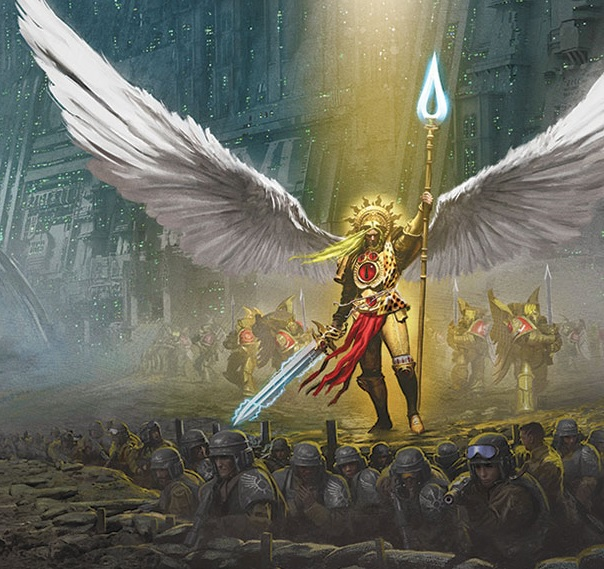

<!-- A0668-B0006 -->

原译文

Sanguinius 圣吉列斯

**校订译文**

Sanguinius 圣吉列斯

<!-- /A0668-B0006 -->

<!-- A0668-B0007 -->
## History 历史

<!-- /A0668-B0007 -->

<!-- A0668-B0008 -->
### Early Life 早期生活

<!-- /A0668-B0008 -->

<!-- A0668-B0009 -->
**英文原文**

When the Emperor began his Great Crusade to reunite the galaxy he created the Primarchs, superhuman warriors to lead his Space Marines across the galaxy. The powers of Chaos stole the Primarchs, but unable to destroy them, set them astray in the Warp. The infant Sanguinius came to rest upon the radiation-soaked moon of Baal Secundus and was adopted by a tribe of humans known as the 'People of the Pure Blood' or simply 'The Blood'. Sanguinius, like all Primarchs, grew quickly and soon surpassed all his teachers and was capable of mighty feats of strength and endurance. At three weeks, he was a large child capable of walking. Within a year, he was taller than any man. Before even being found by The Blood, Sanguinius slew an infamous predator known as the Baalite Fire Scorpion.

<!-- /A0668-B0009 -->

<!-- A0668-B0010 -->

原译文

当帝皇开始他的大远征以重新统一银河系时，他创造了原体，超人战士，带领他的星际战士穿越银河系。混沌的力量偷走了原体，但无法摧毁他们，使他们误入歧途。婴儿的圣吉列斯来到被辐射浸透的巴尔二号卫星上休息，并被一个被称为“纯血者”或简称为“鲜血”的人类部落收养。圣吉列斯像所有的原体一样，成长迅速，很快就超越了他的所有老师，能够取得强大的力量和耐力。三周大的时候，他已经是个能走路的大孩子了。不到一年，他就比任何人都高了。甚至在被“血”发现之前，圣吉列斯就杀死了一个臭名昭著的捕食者—巴尔火蝎。

**校订译文**

为了率领星际战士征服银河，帝皇创造了原体——超越凡人的超级战士，并展开旨在重新统一银河的大远征。混沌势力窃走原体，却无法毁灭他们，于是将他们抛散在亚空间。婴儿时期的圣吉列斯最终降落在辐射遍布的巴尔二号卫星，被一个名为“纯血者”、简称“鲜血”的人类部落收养。与所有原体一样，他成长极快，很快便超越所有老师，展现出惊人的力量与耐力。出生三周，他便长成能行走的大孩子；不到一年，身高已经超过所有成年人。甚至在鲜血部落发现他之前，他就已杀死一只恶名昭彰的捕食者——巴尔火蝎。

**校注：** 源文将创造原体与开始大远征连在同一句中；译文拆清目的与行动，不据此制造精确同步年代。

<!-- /A0668-B0010 -->

<!-- A0668-B0011 图片 -->
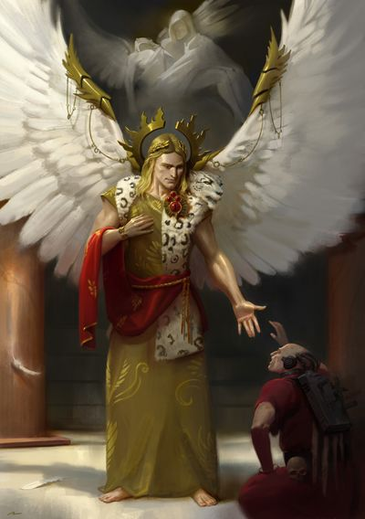

<!-- A0668-B0012 -->

原译文

Young Sanguinius 青年圣吉列斯

**校订译文**

Young Sanguinius 青年圣吉列斯

<!-- /A0668-B0012 -->

<!-- A0668-B0013 -->
**英文原文**

Uniquely amongst the Primarchs, he sported a pair of angel-like wings from his back, though whether this was by the design of the Emperor or a mutation caused by the high levels of radiation on Baal is unknown. He was also said to have psychic powers, especially the ability to divine the future. Using these skills, Sanguinius led The Blood against the numerically superior Mutant hordes of Baal. While he was known for his loyalty and amicability, in battle Sanguinius was known for his total and unstoppable wrath to those who threatened his people. Thanks to the effort of Sanguinius, The Blood was victorious over the Mutant hordes of Baal and he became worshiped by his people as a god.

<!-- /A0668-B0013 -->

<!-- A0668-B0014 -->

原译文

在原体中，他有一个独特的地方，他背上长着一对天使般的翅膀，尽管这是帝皇的设计还是巴尔上高水平辐射引起的突变尚不清楚。据说他也有灵能能力，尤其是预测未来的能力。使用这些技能，圣吉列斯带领鲜血对抗数量上更大的巴尔变种部落。虽然他以忠诚和友善而闻名，但在战斗中，圣吉列斯以他对威胁他人民的人的完全和不可阻挡的愤怒而闻名。由于圣吉列斯的努力，鲜血战胜了巴尔的变种人部落，他被他的人民尊为神。

**校订译文**

在所有原体中，圣吉列斯独具一对天使般的羽翼。它们究竟出自帝皇的设计，还是由巴尔高强度辐射引起的变异，尚无定论。据说，他还拥有灵能，尤其擅长预见未来。他凭借这些能力，率领鲜血部落抵抗数量远超己方的巴尔变种人大军。他虽以忠诚与和善闻名，但面对威胁族人的敌人，便会在战场上展现出无法阻挡的怒火。最终，鲜血部落在他的领导下战胜变种人大军，族人也将他奉为神明。

<!-- /A0668-B0014 -->

<!-- A0668-B0015 -->
**英文原文**

Ultimately, the Emperor arrived on Baal and, disguising himself, infiltrated an address by Sanguinius to his followers. There, the Master of Mankind witnessed his lost son give an impassioned speech that displayed both humility and courage. However, like Konrad Curze, Sanguinius had already foreseen the arrival of the Emperor and immediately recognized him. When Sanguinius confronted the Emperor, he demanded his father swear an oath to leave the Pure of Baal in peace. Moreover, he asked what would happen if he refused the Emperor's offer, being the only Primarch to do so. The Emperor stated that he knew Sanguinius would not refuse, for he yearned to save the people of the galaxy just as he had saved those on Baal. Moreover, the Emperor agreed to Sanguinius' terms regarding the Baalites. Satisfied, Sanguinius pledged himself to the Emperor. The Emperor inducted the best warriors of Sanguinius' tribe into his preexisting Space Marine Legion, which soon became known as the Blood Angels.

<!-- /A0668-B0015 -->

<!-- A0668-B0016 -->

原译文

最终，帝皇抵达巴尔，伪装自己，潜入圣吉列斯对追随者的一个地址。在那里，人类之主目睹了他分散的儿子发表了一场慷慨激昂的演讲，表现出了谦逊和勇气。然而，和康拉德·柯兹一样，圣吉列斯已经预见到了帝皇的到来，并立即认出了他。当圣吉列斯面对帝皇时，他要求他的父亲宣誓让巴尔的纯洁者安息。此外，他还问，如果他拒绝了帝皇的提议，会发生什么，因为他是唯一一位这样做的原体。帝皇表示，他知道圣吉列斯不会拒绝，因为他渴望拯救银河系的人民，就像他拯救了巴尔上的人民一样。此外，帝皇同意圣吉列斯关于巴尔人的条款。圣吉列斯满意地向帝皇宣誓。帝皇将圣吉列斯的部落中最优秀的战士引入了他之前存在的星际战士军团，该军团很快被称为圣血天使。

**校订译文**

帝皇最终抵达巴尔，隐瞒身份，混入聆听圣吉列斯演说的人群。人类之主在这里见证了失散的儿子发表慷慨激昂、兼具谦逊与勇气的演说。然而，与康拉德·科兹一样，圣吉列斯早已预见帝皇的到来，当即认出了他。圣吉列斯与父亲相见时，要求帝皇立誓，不去侵扰巴尔的纯血者。他还问：如果自己拒绝帝皇的提议，会发生什么？他是唯一提出这个问题的原体。帝皇回答说，他知道圣吉列斯不会拒绝，因为天使渴望拯救银河众生，正如他曾拯救巴尔居民一样。帝皇也答应了他对族人的要求。圣吉列斯得到满意的答复，便向帝皇宣誓效忠。随后，帝皇将其部落中最优秀的战士纳入早已建立的星际战士军团；这支军团很快便以圣血天使之名闻世。

**校注：** address 此处为演说，非地址；leave...in peace 指不侵扰其生活，非让他们安息。

<!-- /A0668-B0016 -->

<!-- A0668-B0017 图片 -->
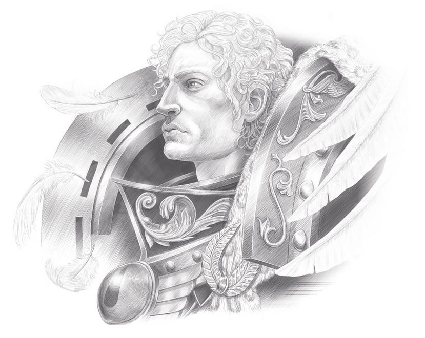

<!-- A0668-B0018 -->

原译文

Sanguinius 圣吉列斯

**校订译文**

Sanguinius 圣吉列斯

<!-- /A0668-B0018 -->

<!-- A0668-B0019 -->
### The Great Crusade 大远征

<!-- /A0668-B0019 -->

<!-- A0668-B0020 -->
**英文原文**

Sanguinius would not be reunited with his legion immediately, instead spending 3 years with Horus and his Luna Wolves to learn the ways of the Imperium. During this time, he grew close to Abaddon and Tarik Torgaddon. He first met his then-savage Revenant Legion during the Pacification of Teghar Pentarus, but shocked all assembled by first learning the name of each and every one of his warriors. Giving a speech before his assembled sons, Sanguinius stated that he would swear an oath to his Legion instead of the vice-versa. Sanguinius stated he hoped he could live up to leading his sons, and that he would stand with them whatever may come be it glory or damnation. He declared the IXth Legion to be scattered and broken no longer, and that they alone would conduct the coming campaign without the aid of the Luna Wolves. Sanguinius' humility roused the assembled warriors, who immediately pledged themselves to their Primarch.

<!-- /A0668-B0020 -->

<!-- A0668-B0021 -->

原译文

圣吉列斯不会立即与他的军团重聚，而是花了3年时间与荷鲁斯和他的影月苍狼一起学习帝国的方式。在此期间，他与阿巴顿和塔里克·托加顿关系越来越密切。他第一次见到他当时野蛮的归来者军团是在泰加尔五号的平定期间，但当他第一次得知他的每一个战士的名字时，所有人都感到震惊。圣吉列斯在他的子嗣们面前发表演讲时表示，他将向他的军团宣誓，而不是反之亦然。圣吉列斯表示，他希望自己能不辜负领导子嗣们的期望，无论发生什么，无论是荣耀还是诅咒，他都会与他们站在一起。他宣布第九军团不再被驱逐和分散，他们将在没有影月苍狼的帮助下独自进行即将到来的战役。圣吉列斯的谦卑唤醒了聚集的战士，他们立即向他们的原体宣誓。

**校订译文**

圣吉列斯没有立即与自己的军团团聚，而是先随荷鲁斯与影月苍狼学习了三年，了解帝国的运作方式。期间，他与阿巴顿和塔里克·托加顿建立了深厚的关系。直到泰加尔五号平定战，他才首次见到仍然野蛮嗜血的归来者军团。他先逐一询问并记住每名战士的姓名，令所有人震惊。面对集结的子嗣，他宣布将由自己向军团宣誓，而非要求他们先向自己宣誓。他希望自己能无愧于统领子嗣的责任，无论前方是荣耀还是毁灭，都会与他们并肩而立。他宣告，第九军团从此不再四散破碎；接下来的战役将由他们独力完成，无需影月苍狼支援。他的谦逊深深打动了战士们，众人当即向原体宣誓效忠。

<!-- /A0668-B0021 -->

<!-- A0668-B0022 图片 -->
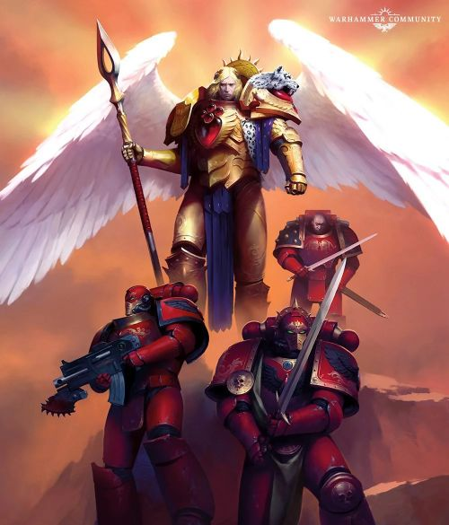

<!-- A0668-B0023 -->

原译文

Sanguinius and his Blood Angels 圣吉列斯和他的圣血天使

**校订译文**

Sanguinius and his Blood Angels 圣吉列斯和他的圣血天使

<!-- /A0668-B0023 -->

<!-- A0668-B0024 -->
**英文原文**

During the subsequent war on Teghar Pentarus, his first kill was a ferocious carnodon. The pelt of the beast was fashioned into a ceremonial war cloak for the Primarch. The noble angel was highly respected by all the legions, and by all his brother Primarchs. Even Horus highly valued his brother's advice. During the Emperor's Crusade, Sanguinius and Horus became close brothers and it was said that they were closer than any of the other Primarchs. He provided counsel that Horus listened to during the incident with the Interex (during the War on Murder),shortly after Horus became Warmaster and was generally the one with the most sway on Horus, after the Emperor. It was Sanguinius who convinced Horus to accept the name change of the Luna Wolves to the Sons of Horus. Horus even revealed that he believed Sanguinius should have been proclaimed Warmaster instead of him, and pointed to Sanguinius to be the new Warmaster when he thought he was dying on Davin.

<!-- /A0668-B0024 -->

<!-- A0668-B0025 -->

原译文

在随后对泰加尔五号的战争中，他第一次杀死的是一只凶猛的食肉动物。野兽的皮毛被做成了原体的仪式战争斗篷。这位高贵的天使受到所有军团和他所有兄弟原体的高度尊重。就连荷鲁斯也很重视他兄弟的建议。在帝皇的大远征期间，圣吉列斯和荷鲁斯成为了亲密的兄弟，据说他们比其他任何一位原体都更亲密。他提供了荷鲁斯在与英特雷斯的事件中（在谋杀战争期间）听取的建议，荷鲁斯成为战帅后不久，是帝皇之后对荷鲁斯影响最大的人。正是圣吉列斯说服了荷鲁斯接受将影月苍狼改名为荷鲁斯之子。荷鲁斯甚至透露，他认为圣吉列斯应该被宣布为战帅而不是他，并指出圣吉列斯是新的战帅，因为他认为他在戴文死去了。

**校订译文**

在随后的泰加尔五号战争中，圣吉列斯最先杀死了一头凶猛的卡诺顿兽，其毛皮后来被制成原体的仪式战袍。这位高贵的天使受到所有军团与原体兄弟的敬重，荷鲁斯也十分重视他的意见。两人在大远征中关系日益亲密，据说胜过其他任何一对原体兄弟。荷鲁斯刚成为战帅不久，在谋杀星战争期间与英特雷斯接触时，便听取了圣吉列斯的建议。除帝皇外，圣吉列斯通常是对荷鲁斯影响最大的人。也是他劝说荷鲁斯接受将影月苍狼改名为荷鲁斯之子。荷鲁斯甚至坦言，战帅本应由圣吉列斯担任；在戴文自以为将死之际，他还指名圣吉列斯继任。

**校注：** carnodon 为生物专名，原“食肉动物”漏失物种名，暂音译卡诺顿兽。Murder 为行星名，译谋杀星。

<!-- /A0668-B0025 -->

<!-- A0668-B0026 图片 -->
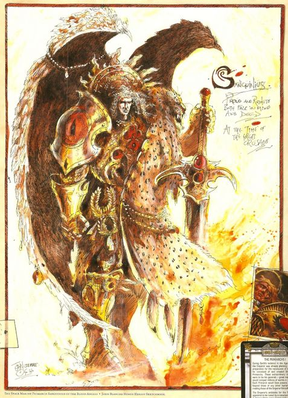

<!-- A0668-B0027 -->

原译文

Sanguinius 圣吉列斯

**校订译文**

Sanguinius 圣吉列斯

<!-- /A0668-B0027 -->

<!-- A0668-B0028 -->
**英文原文**

Sanguinius was a beloved figure who was revered by all of the Imperium. Roboute Guilliman, the primarch of the Ultramarines, privately referred to Sanguinius as one of "The Dauntless Few," the four of his brothers that Guilliman trusted most. Despite his seemingly peaceful nature Sanguinius was known for his martial prowess, to the extent he was considered a match for Horus and Lion El'Jonson in combat ability.

<!-- /A0668-B0028 -->

<!-- A0668-B0029 -->

原译文

圣吉列斯是一位受人爱戴的人物，受到整个帝国的尊敬。极限战士的原体罗伯特·基里曼私下里称圣吉列斯为“少数无畏者”之一，这是基里曼最信任的四个兄弟。尽管圣吉列斯看似性格温和，但他以军事实力而闻名，在战斗能力方面，他甚至被认为是荷鲁斯和莱昂·艾尔庄森的对手。

**校订译文**

圣吉列斯深受爱戴，受到整个帝国的崇敬。极限战士原体罗保特·基里曼私下将他列为“少数无畏者”之一，即自己最信任的四位兄弟。圣吉列斯虽然外表温和，却以卓绝的武艺闻名，被认为足以在战斗中匹敌荷鲁斯与莱昂·艾尔’庄森。

<!-- /A0668-B0029 -->

<!-- A0668-B0030 -->
**英文原文**

Sanguinius. It should have been him. He has the vision and strength to carry us to victory, and the wisdom to rule once victory is won. For all his aloof coolness, he alone has the Emperor's soul in his blood. Each of us carries part of our father within us, whether it is his hunger for battle, his psychic talent or his determination to succeed. Sanguinius holds it all. It should have been his...

<!-- /A0668-B0030 -->

<!-- A0668-B0031 -->

原译文

圣吉列斯。应该是他。他有远见和力量带领我们走向胜利，有智慧在胜利后统治我们。尽管他冷漠冷静，但只有他有帝皇的灵魂。我们每个人都有父亲的一部分，无论是他对战斗的渴望、他的灵能天赋还是他取得成功的决心。圣吉列斯拥有一切。这应该是他的...

**校订译文**

“圣吉列斯。本来就该是他。他有带领我们获胜的远见与力量，也有在胜利之后治国的智慧。尽管他显得冷静疏离，唯有他的血脉承载着帝皇的灵魂。我们每个人都继承了父亲的一部分，无论是对战斗的渴望、灵能天赋，还是赢得成功的决心。圣吉列斯拥有这一切。那个位置本该属于他……”

<!-- /A0668-B0031 -->

<!-- A0668-B0032 -->
**英文原文**

Ironically, this belief was reflected later, during the Horus Heresy, while Horus was plotting the Blood Angels' downfall at Signus Prime. Horus deviated from the battle plan laid out by Erebus by insisting that Sanguinius must die. Horus claimed this was because he knew his brother would never turn to Chaos, but the daemon Kyriss asked whether Horus was afraid of having a rival: that Sanguinius was the only one of the primarchs, who, if turned, would have a chance of finding greater favour with the Gods of Chaos than Horus himself.

<!-- /A0668-B0032 -->

<!-- A0668-B0033 -->

原译文

具有讽刺意味的是，这一信念后来在荷鲁斯叛乱期间得到了反映，当时荷鲁斯正在策划圣血天使在西格纳斯主星的衰落。荷鲁斯坚持圣吉列斯必须死，这偏离了艾瑞巴斯制定的作战计划。荷鲁斯声称这是因为他知道他的兄弟永远不会堕入混沌，但恶魔凯瑞斯问荷鲁斯是否害怕有对手：圣吉列斯是唯一一位原体，如果堕落，将有机会比荷鲁斯自己更受混沌诸神的青睐。

**校订译文**

讽刺的是，到了荷鲁斯之乱期间，这种想法又从另一面显露出来。当时，荷鲁斯正谋划让圣血天使在西格纳斯主星覆灭，却偏离艾瑞巴斯的计划，坚持必须杀死圣吉列斯。他声称，这是因为自己知道兄弟绝不会投向混沌。恶魔凯瑞斯却反问，他是否其实害怕出现竞争者：在所有原体中，唯有圣吉列斯若被腐化，便可能比荷鲁斯本人更受混沌诸神青睐。

<!-- /A0668-B0033 -->

<!-- A0668-B0034 -->
**英文原文**

Despite the apparent rivalry between Sanguinius and Horus, the two were quick to become close friends. When Horus discovered the genetic flaw of the Blood Angels while on joint campaign, he kept the secret from the Emperor.

<!-- /A0668-B0034 -->

<!-- A0668-B0035 -->

原译文

尽管圣吉列斯和荷鲁斯之间存在明显的竞争，但两人很快成为了亲密的朋友。当荷鲁斯在联合战役中发现圣血天使的基因缺陷时，他向帝皇隐瞒了这个秘密。

**校订译文**

尽管圣吉列斯和荷鲁斯之间存在明显的竞争，但两人很快成为了亲密的朋友。当荷鲁斯在联合战役中发现圣血天使的基因缺陷时，他向帝皇隐瞒了这个秘密。

<!-- /A0668-B0035 -->

<!-- A0668-B0036 -->
### Horus Heresy 荷鲁斯之乱

<!-- /A0668-B0036 -->

<!-- A0668-B0037 -->
### Ambush at Signus 西格纳斯伏击

<!-- /A0668-B0037 -->

<!-- A0668-B0038 -->
**英文原文**

Before Horus' treachery was revealed, he sent Sanguinius to a world named Signus Prime to supposedly fight the Xenos known as the Nephilim. However once in the Signus System the Blood Angels were ambushed by hordes of daemons, and they soon became stranded on the damned world. At the peak of the fighting Sanguinius confronted the Greater Daemon of Khorne Ka'Bandha who managed to wound Primarch by breaking his legs. Sanguinius was then rendered comatose by a psychic backlash created by the Ragefire and amplified by the deaths of his sons at the hands of Ka'Bandha. The Red Thirst subsequently erupted across the Blood Angels, and they slaughtered both friend and foe alike in their rampages. Fortunately the Legion Librarians managed to eventually restore the Primarch, and he was able to defeat Ka'Bandha in a second duel, banishing him back to the Warp. Sanguinius then led his forces into the Chaos Fortress on Signus, the Cathedral of the Mark, where he was confronted by the Keeper of Secrets Kyriss the Perverse. Kyriss gave Sanguinius a choice: sacrifice himself to the Ragefire and have the Red Thirst forever lifted from his sons, or allow his Legion to face eventual destruction due to their genetic flaw. Deciding to sacrifice himself, Sanguinius was about to step into the Ragefire when he was beaten to it by Apothecary Meros, who was transformed into the Red Angel. Mourning Meros, Sanguinius slew Kyriss and swore vengeance on Horus.

<!-- /A0668-B0038 -->

<!-- A0668-B0039 -->

原译文

在荷鲁斯的背叛被揭露之前，他派遣圣吉列斯前往一个名为西格纳斯主星的世界，据称是为了对抗被称为涅菲利姆的异型。然而，一旦进入西格纳斯星系，圣血天使就被成群的恶魔伏击了，他们很快就被困在了这个被诅咒的世界里。在战斗的高峰期，圣吉列斯与恐虐大魔卡’班哈对峙，后者设法打断了原体的腿，打伤了他。圣吉列斯随后因愤怒之火造成的灵能反弹而昏迷，并因其子嗣在卡’班哈手中的死亡而加剧。血渴随后爆发在圣血天使身上，他们在横冲直撞中屠杀了战友和敌人。幸运的是，军团智库最终设法恢复了原体，他在第二次决斗中击败了卡’班哈，将他驱逐回了亚空间。圣吉列斯随后率领他的部队进入西格纳斯上的混沌堡垒，即马克大教堂，在那里他遇到了守密者扭曲者凯瑞斯。凯瑞斯给了圣吉列斯一个选择：向愤怒之火牺牲自己，让他的子嗣永远摆脱血渴，或者让他的军团因基因缺陷而面临最终的毁灭。圣吉列斯决定牺牲自己，正要踏入愤怒之火，却被后来被转化为红天使的药剂师梅洛斯击倒。圣吉列斯哀悼梅洛斯，杀死了凯瑞斯，并发誓要向荷鲁斯复仇。

**校订译文**

荷鲁斯尚未公开叛变时，便将圣吉列斯派往西格纳斯主星，名义上是消灭名为涅菲利姆的异形。然而，圣血天使进入西格纳斯星系后便遭到恶魔大军伏击，很快被困在这个遭诅咒的世界。战斗最激烈时，圣吉列斯迎战恐虐大魔卡’班哈，双腿却被对方打断。愤怒之火引发的灵能反噬，因大批子嗣死于卡’班哈之手而进一步增强，最终令原体陷入昏迷。随后，血渴席卷圣血天使，他们在狂暴中不分敌我地杀戮。幸而军团智库员最终唤醒原体；圣吉列斯在第二次决斗中战胜卡’班哈，将其放逐回亚空间。他随后率军攻入西格纳斯的混沌堡垒——印记大教堂，面对守密者“扭曲者”凯瑞斯。恶魔给他两个选择：把自己献给愤怒之火，让子嗣永远摆脱血渴；或任由军团因基因缺陷走向毁灭。圣吉列斯决定牺牲自己，正要踏入火焰，药剂师梅洛斯却抢先一步，代他投入其中，并化作红天使。圣吉列斯哀悼梅洛斯，杀死凯瑞斯，立誓向荷鲁斯复仇。

**校注：** be beaten to it 是被梅洛斯抢先一步，不是被他击倒；Cathedral of the Mark 沿403篇印记大教堂。

<!-- /A0668-B0039 -->

<!-- A0668-B0040 图片 -->
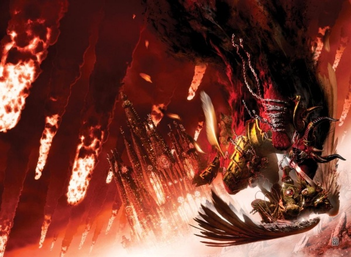

<!-- A0668-B0041 -->

原译文

The Angel battles Ka'Bandha in the air over Signus Prime 天使在西格纳斯主星上空与卡’班哈作战

**校订译文**

The Angel battles Ka'Bandha in the air over Signus Prime 天使在西格纳斯主星上空与卡’班哈作战

<!-- /A0668-B0041 -->

<!-- A0668-B0042 -->
### Imperium Secundus 第二帝国

<!-- /A0668-B0042 -->

<!-- A0668-B0043 -->
**英文原文**

Reeling from the catastrophe that had befallen him on Signus but determined to defeat Horus, Sanguinius had the Blood Angels set course for Terra. However as a result of the Ruinstorm created by the treacherous Erebus, navigation and communication across the Imperium was made almost impossible. Following the Pharos' psychic beacon, Sanguinius eventually found his way to Macragge, where Roboute Guilliman, fearing Terra lost, declared a reluctant Sanguinius the new "Emperor Regent" (or Imperator Regis) of his contingency empire Imperium Secundus. Sanguinius was soon plagued by visions of his death at the hands of Horus, and realized this was no omen but a window in the future.

<!-- /A0668-B0043 -->

<!-- A0668-B0044 -->

原译文

圣吉列斯在从西格纳斯遭遇的灾难中挣扎，但决心击败荷鲁斯，他让圣血天使设定了泰拉的方向。然而，由于背叛的艾瑞巴斯的造成的毁灭风暴，穿越帝国的导航和通信几乎是不可能的。在法罗斯的灵能灯塔之后，圣吉列斯最终找到了前往马库拉格的路，在那里，罗伯特·基里曼担心泰拉会输，宣布不情愿的圣吉列斯为其应急帝国第二帝国的新“摄政王”（或帝皇雷吉斯）。圣吉列斯很快就被他死于荷鲁斯之手的幻象所困扰，并意识到这不是预兆，而是未来的一扇窗户。

**校订译文**

圣吉列斯尚未从西格纳斯的灾难中恢复，却已决心击败荷鲁斯，下令圣血天使驶向泰拉。然而，艾瑞巴斯制造的毁灭风暴几乎切断帝国境内的航行与通信。循着法罗斯的灵能信标，圣吉列斯最终抵达马库拉格。罗保特·基里曼担心泰拉已经陷落，建立了作为应急延续政权的第二帝国，并宣布并不情愿的圣吉列斯为“摄政皇帝”（亦称雷吉斯帝皇，Imperator Regis）。不久，圣吉列斯开始受到死于荷鲁斯之手的幻象困扰，并意识到，这些并非模糊的预兆，而是直接窥见未来的窗口。

<!-- /A0668-B0044 -->

<!-- A0668-B0045 图片 -->
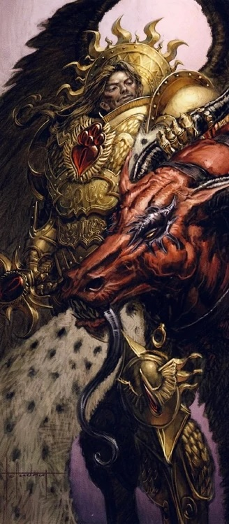

<!-- A0668-B0046 -->

原译文

Sanguinius with the head of Kyriss the Perverse 圣吉列斯与扭曲者凯瑞斯之首

**校订译文**

Sanguinius with the head of Kyriss the Perverse 圣吉列斯与扭曲者凯瑞斯之首

<!-- /A0668-B0046 -->

<!-- A0668-B0047 -->
**英文原文**

Later during the Battle of Sotha while Guilliman and Lion El'Jonson were both away, Sanguinius was confronted by Konrad Curze, who had infiltrated his throne room on Macragge and badly wounded Azkaellon. Curze confided that he had foreseen Sanguinius' death on the Vengeful Spirit and wanted to know why the Angel still followed the Emperor when their mutual visions had proven his teachings to have been lies. He also asked why Sanguinius had rejected Kyriss' officer at Signus Prime and if the Angel felt he was more deserving of the title of Warmaster than Horus, to which Sanguinius responded he was not. Trying to teach Sanguinius that fate could not be changed and that his own death would not be here, Curze let Sanguinius come at him with his sword and goaded him to cut him down. Sanguinius ultimately halted his sword, urging Curze that it was not to late to change and join with his loyalist brothers. Proclaming there was only Chaos in the end, Curze set off an explosive trap and escaped.

<!-- /A0668-B0047 -->

<!-- A0668-B0048 -->

原译文

后来在索萨之战中，当基里曼和莱昂·艾尔庄森都不在的时候，圣吉列斯遇到了康拉德·科兹，他潜入了他在马库拉格的王座厅，重伤了阿兹卡隆。科兹透露，他已经预见到圣吉列斯在复仇之魂号上的死亡，并想知道为什么当他们共同的幻象证明他的教义是谎言时，天使仍然追随帝皇。他还问为什么圣吉列斯在西格纳斯主星拒绝了凯瑞斯的职位，天使是否觉得他比荷鲁斯更配得上战帅的头衔，圣吉列斯对此的回应是他不这么认为。科兹试图教导圣吉列斯命运无法改变，他自己的死亡不会在这里，于是让圣吉列斯用剑向他攻击，怂恿他砍倒他。圣吉列斯最终停下了他的剑，敦促科兹改变并加入他的忠诚兄弟们为时不晚。最后，科兹宣布终焉只余混沌，于是引爆了一个爆炸陷阱并逃跑了。

**校订译文**

后来，索萨之战期间，基里曼与莱昂·艾尔’庄森都不在马库拉格。康拉德·科兹潜入圣吉列斯的王座厅，重伤阿兹卡隆，随后与天使对峙。科兹透露，自己预见了圣吉列斯在复仇之魂号上的死亡，并质问：既然两人的幻象都证明帝皇的教导是谎言，为何天使仍追随他？科兹还问，为何圣吉列斯在西格纳斯主星拒绝凯瑞斯的提议，以及他是否认为自己比荷鲁斯更适合成为战帅。圣吉列斯否认了后一点。为证明命运不可改变、自己也不会死在这里，科兹任由圣吉列斯持剑逼近，挑衅他下杀手。天使最终停剑，劝科兹现在改变仍不算晚，可以重新与忠诚的兄弟们站在一起。科兹却宣称，最终只会剩下混沌，随即引爆陷阱逃走。

**校注：** 源文 officer 依上下文及667对应段应为 offer（提议）；保留英文原文，中文按上下文修复，并登记此源文拼写疑点。

<!-- /A0668-B0048 -->

<!-- A0668-B0049 图片 -->
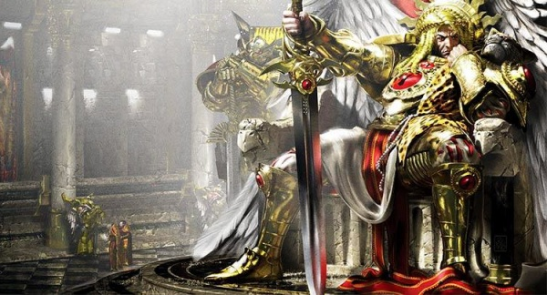

<!-- A0668-B0050 -->

原译文

Sanguinius as the Emperor Regeant of Imperium Secundus 圣吉列斯作为第二帝国帝皇雷詹特

**校订译文**

Sanguinius as the Emperor Regeant of Imperium Secundus 身为第二帝国摄政皇帝的圣吉列斯

**校注：** 英文 Regeant 为 Regent 的疑似错拼，英文图注原样保留，中文统一摄政皇帝。

<!-- /A0668-B0050 -->

<!-- A0668-B0051 -->
**英文原文**

As the Lion and Guilliman continued to clash over policy in Imperium Secundus, Sanguinius attempted to mediate the two. He later presided over the trial of the now-captured Konrad Curze. After Lion El'Jonson attempted to kill Curze during the trial while in a rage at the Night Haunter's accusations, Sanguinius dismissed him from Imperium Secundus. Later, Sanguinius became determined to pass the sentence of death down onto Curze himself, but just as he was about to strike down the Primarch Lion El'Jonson reappeared. Demanding to be Curze's jailer and stating that Curze was able to see the future, and he repeated that Curze's claim that his death would be at the hands of an assassin was sent by the Emperor. This, to the Lion, was proof that the Emperor was still alive. Sanguinius recognized that his own visions of death would also be true and he shared his visions of death at the hands of Horus with both of his brothers.

<!-- /A0668-B0051 -->

<!-- A0668-B0052 -->

原译文

随着莱昂和基里曼在第二帝国的政策上持续发生冲突，圣吉列斯试图调解双方。后来，他主持了对现已被俘的康拉德·柯兹的审判。在审判期间，莱昂·艾尔庄森试图杀死科兹，同时对午夜猎手的指控感到愤怒，圣吉列斯将他从第二帝国免职。后来，圣吉列斯决定将死刑判决传给科兹本人，但就在他准备杀死原体时，莱昂·艾尔庄森又出现了。他要求成为科兹的狱卒，并表示科兹能够看到未来，他重申科兹声称他的死亡将在刺客手中，这是帝皇发出的。对莱昂来说，这证明了帝皇还活着。圣吉列斯认识到他自己的死亡幻象也是真实的，他与他的两个兄弟分享了他在荷鲁斯手中死亡的幻象。

**校订译文**

莱昂与基里曼不断因第二帝国的政策发生冲突，圣吉列斯努力从中调解。后来，他主持了对被捕的康拉德·科兹的审判。莱昂因午夜幽魂的指控怒不可遏，试图当庭杀死科兹，圣吉列斯因此将他逐出第二帝国。随后，圣吉列斯决定亲自处决科兹，却在即将动手时被重新出现的莱昂制止。莱昂要求担任科兹的看守，并指出科兹确实能够预见未来：既然他坚称自己将死于帝皇派出的刺客之手，便说明帝皇仍然活着。圣吉列斯也由此承认，自己死亡的幻象同样会成真，并向两位兄弟讲述了自己死于荷鲁斯之手的预言。

<!-- /A0668-B0052 -->

<!-- A0668-B0053 -->
### Pilgrimage 朝圣之旅

<!-- /A0668-B0053 -->

<!-- A0668-B0054 -->
**英文原文**

Following the Trial of Curze, Sanguinius, Lion El'Jonson, and Guilliman all agreed to try and breach the Ruinstorm to reach Terra and aid the Emperor who they now knew still lived. Sanguinius was now beginning to suffer from the beginning stages of the Black Rage, which infected Sanguinius' mind due to the prophetic visions of his own death. In a fit of hysteria, Sanguinius nearly struck down one of his own sons aboard the Red Tear. He was desperate to prevent all of his sons from falling as he was, and was seeking any answer.

<!-- /A0668-B0054 -->

<!-- A0668-B0055 -->

原译文

在科兹的审判之后，圣吉列斯、莱昂·艾尔庄森和基里曼都同意试图突破毁灭风暴，到达泰拉，帮助他们现在知道还活着的帝皇。圣吉列斯现在开始遭受黑怒的初期阶段，由于他自己死亡的预言性幻象，黑怒感染了圣吉列斯的思想。在一阵歇斯底里中，圣吉列斯差点在红泪号上撞倒自己的一个子嗣。他拼命想阻止所有的子嗣像他一样摔倒，并正在寻求任何答案。

**校订译文**

审判结束后，圣吉列斯、莱昂·艾尔’庄森与基里曼一致决定突破毁灭风暴，前往泰拉，援助如今已知仍然在世的帝皇。与此同时，关于自身死亡的预言开始侵蚀圣吉列斯的心智，使他出现黑怒的早期症状。他曾在红泪号上情绪失控，险些杀死一名子嗣。他急切地寻求任何可能的答案，希望避免所有子嗣都像自己一样沦陷。

**校注：** fall/strike down 在此指陷入黑怒、击杀，不是摔倒、撞倒；黑怒发生在原体死前的说法按本篇源文保留。

<!-- /A0668-B0055 -->

<!-- A0668-B0056 -->
**英文原文**

While in the Ruinstorm, the loyalist fleet came across a variety of horrors and word of an entity spreading destruction known as the "Pilgrim". During the Battle of Pyrrhan, Sanguinius received a vision and he realized that he needed to go where this struggle had begun, Davin, the world where Horus had fallen. Reluctantly, Guilliman and The Lion agreed to trust in Sanguinius but both had thought they would simply destroy the world upon arriving. At Davin, the loyalist fleet found the entire world surrounded by a shell made of the bones of trillions dubbed the Necrosphere. A bombardment managed to penetrate the sphere and the fleet was soon in orbit above Davin. While over Davin, Sanguinius shocked The Lion by boarding the Invincible Reason and taking the captive Konrad Curze with him. Sanguinius hoped to use Curze's prophetic abilities to determine what he was meant to do upon Davin. However the Dark Angels guards did not submit before Sanguinius, and he was forced to dispatch several using non-lethal methods. After escaping the Invincible Reason Sanguinius commended a mass landing on the world, and the enraged Lion nearly ordered that Davin be subjected to Exterminatus regardless of Sanguinius' presence on it.

<!-- /A0668-B0056 -->

<!-- A0668-B0057 -->

原译文

在毁灭风暴中，忠诚的舰队遇到了各种恐怖事件，并听说了一个被称为“朝圣者”的实体正在传播毁灭。在派尔罕之战中，圣吉列斯看到了一个幻象，他意识到他需要去这场战斗开始的地方，戴文，荷鲁斯堕落的世界。基里曼和莱昂不情愿地同意信任圣吉列斯，但他们都认为自己一到就会毁灭世界。在戴文，忠诚的舰队发现整个世界都被一个由数万亿块骨头组成的壳包围着，这个壳被称为死灵之环。一次轰炸成功穿透了壳体，舰队很快就进入了戴文上空的轨道。在戴文上空，圣吉列斯登上不屈真理号并带走了俘虏康拉德·科兹，震惊了莱昂。圣吉列斯希望利用科兹的预言能力来确定他打算对戴文做什么。然而，黑暗天使的守卫并没有屈服于圣吉列斯，他被迫使用非致命的方法击倒了几名守卫。在逃离不屈真理号后，圣吉列斯建议在世界上大规模登陆，愤怒的莱昂几乎命令戴文接受灭绝令，不管圣吉列斯是否在场。

**校订译文**

忠诚派舰队在毁灭风暴中遭遇了种种恐怖，也听说有一个被称为“朝圣者”的存在正在散播毁灭。派尔罕之战中，圣吉列斯得到幻象，意识到自己必须返回这场浩劫的起点——荷鲁斯堕落的世界戴文。基里曼与莱昂虽不情愿，仍同意信任他，但两人原本都打算抵达后直接毁灭这颗星球。舰队来到戴文时，发现整个世界都被一层由数万亿死者骸骨构成的外壳包围，称为“死灵圈”。舰队以炮击打穿外壳，进入戴文轨道。随后，圣吉列斯登上无敌理性号，带走囚禁于此的康拉德·科兹，令莱昂震惊。他希望借科兹的预言能力，弄清自己应当在戴文做什么。黑暗天使守卫拒绝让步，他不得不用非致命手段制服数人。离舰后，圣吉列斯下令大举登陆。暴怒的莱昂几乎不顾天使仍在地表，便要对戴文下达灭绝令。

**校注：** Invincible Reason 同舰统一无敌理性号，原不屈真理号混用。源文 commended 依登陆行动语境疑为 commanded，译下令并记录疑点。

<!-- /A0668-B0057 -->

<!-- A0668-B0058 -->
**英文原文**

On Davin, a mass Drop Pod assault was conducted but nothing was found and the population was absent. The four Primarchs eventually traveled to the temple where Horus had been subjected to the ritual by Erebus and the Serpent Lodge that had corrupted him. Inside the temple, Sanguinius stood at the altar where Horus had been laid and proclaimed that he would change his destiny. This activated Davin itself, Warp storms roared above and a portal opened up that swallowed up Sanguinius. Inside the portal on Davin, Sanguinius was back on Terra in a beautiful garden at the Imperial Palace. He for the first time was experiencing a vision that was not his death aboard the Vengeful Spirit. He saw Lorgar dead by his hands and the remaining traitor Primarch's brought before him in chains. The Emperor congratulated Sanguinius on his victory and named him the Imperator Regis of the Imperium. With Sanguinius as the Emperor's Regent, he went on to lead a great campaign that purged the Imperium of all corruption and evil and the galaxy was his to rule. Seeing this future and observing the Emperor's mannerisms, he became suspicious as to what was going on. At last, he cut down the image of the Emperor who was revealed to be the Daemon Madail in disguise.

<!-- /A0668-B0058 -->

<!-- A0668-B0059 -->

原译文

在戴文，进行了大规模的空投舱袭击，但没有发现任何东西，人群也不在场。四位原体最终前往神殿，荷鲁斯在那里接受了艾瑞巴斯和腐化他的蛇屋的仪式。在神殿内，圣吉列斯站在荷鲁斯被放置的祭坛前，宣布他将改变自己的命运。这激活了戴文本身，亚空间风暴在上空咆哮，一个入口打开，吞噬了圣吉列斯。在戴文的大门内，圣吉列斯回到了泰拉皇宫一个美丽的花园里。他第一次在复仇之魂号上看到了一个不是他死亡的幻象。他看到珞珈被他亲手杀死，剩下的叛徒原体被锁链带到他面前。帝皇祝贺圣吉列斯的胜利，并任命他为帝国的帝皇雷吉斯。圣吉列斯作为帝皇的摄政王，他继续领导了一场伟大的行动，清除了帝国的所有腐化和邪恶，银河系由他统治。看到这个未来，观察到帝皇的举止，他开始怀疑发生了什么。最后，他砍倒了帝皇的形象，这个形象被揭露为伪装的恶魔玛戴尔。

**校订译文**

大批空降舱突入戴文，但部队没有发现任何目标，居民也不见踪影。四位原体最终来到荷鲁斯曾接受艾瑞巴斯与蛇之结社仪式、因此堕落的神殿。圣吉列斯站在昔日安置荷鲁斯的祭坛前，宣告自己将改变命运。这番话仿佛唤醒了戴文本身：亚空间风暴在上空怒吼，一道传送门张开，吞没了天使。穿过传送门后，圣吉列斯发现自己置身泰拉皇宫的美丽花园。他第一次看见了不同于“死在复仇之魂号上”的未来：珞珈已被自己亲手杀死，其余叛变原体也戴着镣铐被带到面前。帝皇祝贺他的胜利，授予他雷吉斯帝皇之位。作为帝皇的摄政者，他率军清除帝国的一切腐化与邪恶，最终统治整个银河。然而，这幅未来图景与“帝皇”的举止令他生疑。他最终挥剑斩向父亲的幻影，揭露其真正身份——恶魔马代尔。

<!-- /A0668-B0059 -->

<!-- A0668-B0060 图片 -->
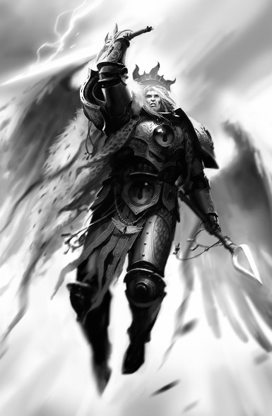

<!-- A0668-B0061 -->

原译文

Sanguinius during the Battle of Beta-Garmon 贝塔·伽蒙之战中的圣吉列斯

**校订译文**

Sanguinius during the Battle of Beta-Garmon 贝塔·伽蒙之战中的圣吉列斯

<!-- /A0668-B0061 -->

<!-- A0668-B0062 -->
**英文原文**

Sanguinius and Madail engaged in a vicious duel. Madail had unleashed a Daemonic horde through the portal to prevent Guilliman and The Lion from breaking through. The host included a massive Soul Grinder, which was destroyed in a combined effort by The Lion and Guilliman. On the other side of the portal, The Angel was eventually pinned by Madail's host of Daemonic troops, and the Preacher of Chaos Undivided announced that Sanguinius would serve or die. Madail dubbed Horus an imperfect vessel and urged Sanguinius to strike Lupercal down and take up the mantle as Warmaster of Chaos. If he did so, Madail declared, his sons would be spared of the Black Rage. However, despite the temptation, Sanguinius denied the Daemon and broke free of his captors. Sanguinius and Madail again engaged in a duel, but this time the Daemon was impaled by both the Blade Encarmine and Spear of Telesto. The two wounded warriors wrestled with one another until they were both in the portal, torn between the Materium and Immaterium. On Davin, Guilliman and The Lion saw Sanguinius' upper half sticking through the portal and rushed to his aid, but were blocked by Daemons. The stalemate endured until Sanguinius' Herald stepped forth and declared that he would take The Angel's place in the portal. Realizing that this was his herald's destiny and that he needed to confront Horus at Terra for the Imperium to endure, Sanguinius solemnly agreed. The Sanguinor charged into Madail, and as he tackled the Daemon back through the portal, he was transformed into a golden angelic form. The Primarch's and their escorts managed to escape the Temple just as it collapsed.

<!-- /A0668-B0062 -->

<!-- A0668-B0063 -->

原译文

圣吉列斯和玛戴尔进行了一场激烈的决斗。玛戴尔已经通过门户释放了一个恶魔部落，以防止基里曼和莱昂突破。主要包括一个巨大的灵魂研磨者，在莱昂和基里曼的共同努力下被摧毁。在传送门的另一边，天使最终被玛戴尔的恶魔部队牵制，混沌无分的传教士宣布圣吉列斯要么屈服，要么死亡。玛戴尔称荷鲁斯是一艘不完美的船，并敦促圣吉列斯击败卢佩卡尔，以混沌之王的身份接过职责。玛戴尔宣称，如果他这样做，他的子嗣们将免于黑怒。然而，尽管有诱惑，圣吉列斯还是拒绝了恶魔并摆脱了他的俘虏。圣吉列斯和玛戴尔再次决斗，但这次恶魔被染赤之刃和毕功之矛刺穿。两名受伤的战士相互扭打，直到他们都进入了大门，在物质界和非物质界之间撕裂。在戴文上，基里曼和莱昂看到圣吉列斯的上半身从传送门伸了出来，赶紧去帮助他，但被恶魔挡住了。僵局一直持续到圣吉列斯的传令官站出来宣布他将接替天使在传送门中的位置。意识到这是他的传令官的命运，他需要在泰拉与荷鲁斯对抗才能维持帝国，圣吉列斯庄严地同意了。圣吉列诺冲向玛戴尔，当他通过入口将恶魔击退时，他变成了一个金色的天使形象。就在圣殿倒塌时，原体和他们的护卫设法逃离了圣殿。

**校订译文**

圣吉列斯与马代尔展开激烈决斗。恶魔通过传送门放出大军，阻挡基里曼与莱昂接近，其中一头巨大的磨魂者被两位原体合力摧毁。传送门另一侧，圣吉列斯最终被马代尔的恶魔部队制住。这位混沌无分的传道者宣称，天使必须臣服，否则便会死去。马代尔称荷鲁斯是一个不完美的容器，催促圣吉列斯杀死卢佩卡尔，继任混沌战帅；作为交换，他的子嗣将免受黑怒折磨。尽管诱惑巨大，圣吉列斯仍然拒绝，并挣脱围困。两者再度交锋，这次染赤之刃与毕功之矛同时刺穿恶魔。两名负伤的对手扭打着进入传送门，拉扯于物质宇宙与亚空间之间。在戴文这边，基里曼与莱昂看见天使的上半身探出传送门，立即赶去救援，却遭恶魔阻挡。僵持中，圣吉列斯的传令官站出来，表示愿代替天使留在门内。圣吉列斯意识到，这正是传令官的命运，而自己必须在泰拉面对荷鲁斯，帝国才能延续，于是郑重同意。圣血者冲向马代尔，将恶魔撞回传送门的同时，化为金色天使的形态。四位原体及随行护卫终于在神殿坍塌之际逃了出去。

**校注：** vessel 指混沌力量的容器，非船；Warmaster 是战帅，非混沌之王。圣血者按全书定译。

<!-- /A0668-B0063 -->

<!-- A0668-B0064 -->
**英文原文**

In the place where Davin once was, a breach in the Ruinstorm was visible. The path led to Terra, but upon further study, it became apparent that somehow Horus had foreseen this route, and a large blockade was erected to block them. Guilliman and The Lion agreed to distract the blockade while Sanguinius and the Blood Angels made directly for Terra, for that was their destiny. Sanguinius took Curze with him, stating he would face their father's justice. However once aboard the Red Tear Sanguinius revealed that he would allow Curze to follow his destiny as well, death at the hands of an Imperial Assassin. Sanguinius stated that while it may take millennia for him to be found, Curze's fate would catch up with him eventually. With that, he sealed Curze in a stasis coffin and jettisoned the frozen Primarch into space as the Night Haunter roared in rage.

<!-- /A0668-B0064 -->

<!-- A0668-B0065 -->

原译文

在戴文曾经所在的地方，可以看到毁灭风暴的缺口。这条路通往泰拉，但经过进一步研究，很明显荷鲁斯已经预见到了这条路，并竖起了一道巨大的封锁线来封锁他们。基里曼和莱昂同意分散封锁，而圣吉列斯和圣血天使则直接前往泰拉，因为这是他们的命运。圣吉列斯带走了科兹，并表示他将接受父亲的审判。然而，一登上红泪号，圣吉列斯透露，他也会允许科兹追随自己的命运，死于帝国刺客之手。圣吉列斯表示，虽然可能需要数千年才能找到他，但科兹的命运最终会追上他。说完，他把科兹封在一个停滞的棺材里，把冰冻的原体扔进了太空，午夜猎手愤怒地咆哮着。

**校订译文**

戴文原先所在的位置出现了毁灭风暴的缺口，通向泰拉。但进一步观察后，他们发现荷鲁斯似乎早已预料到这条航路，部署了庞大的封锁舰队。基里曼与莱昂同意牵制敌军，让圣吉列斯与圣血天使直赴泰拉，迎向命运。圣吉列斯带走科兹，声称要让他接受父亲审判；登上红泪号后，却表示也要让科兹走向自己预见的结局——死于帝国刺客之手。即使刺客可能花上数千年才找到他，命运终究会到来。说罢，他将怒吼的午夜幽魂封入静滞棺，射向太空。

<!-- /A0668-B0065 -->

<!-- A0668-B0066 -->
### Terra 泰拉

<!-- /A0668-B0066 -->

<!-- A0668-B0067 -->
**英文原文**

The delaying action of Guilliman and The Lion allowed Sanguinius and the Blood Angels to reach Terra. He met with Rogal Dorn, Leman Russ, Jaghatai Khan, and Malcador the Sigillite to discuss their upcoming strategy. Sanguinius urged Russ to remain on Terra for the battle instead of leaving to face Horus directly, though not as much as Dorn. Sanguinius' arrival was publicized greatly by loyalist media, his angelic figure being used as propaganda to boost the morale of the failing Imperial war effort.

<!-- /A0668-B0067 -->

<!-- A0668-B0068 -->

原译文

基里曼和莱昂的延迟行动使圣吉列斯和圣血天使到达了泰拉。他会见了罗格·多恩、黎曼·鲁斯、察合台可汗和掌印者马卡多，讨论他们即将采取的战略。圣吉列斯敦促鲁斯留在泰拉参加战斗，而不是直接面对荷鲁斯，尽管没有多恩那么多。圣吉列斯的到来被忠诚的媒体大肆宣传，他的天使形象被用作宣传，以提高失败的帝国的战争士气。

**校订译文**

基里曼与莱昂的牵制行动让圣吉列斯及圣血天使得以抵达泰拉。他与罗格·多恩、黎曼·鲁斯、察合台可汗及掌印者马卡多会面，商讨下一步战略。圣吉列斯也劝鲁斯留在泰拉参战，不要离开去直接挑战荷鲁斯，只是态度不及多恩强硬。忠诚派媒体大力宣传天使的到来，用他的形象鼓舞战事日益不利的帝国军民。

<!-- /A0668-B0068 -->

<!-- A0668-B0069 -->
**英文原文**

Sanguinius along with Jaghatai Khan later appeared at the Battle of Beta-Garmon, though over a month late due to difficult Warp travel. Sanguinius immediately took over the confused loyalist war effort and launched a major offensive towards Beta-Garmon II. During the battle, which saw over a thousand Titans battle one another, Sanguinius and his Sanguinary Guard boarded the traitor Imperator Titan Axis Mundi, destroying it from the inside. However the entire battle on Beta-Garmon II was an elaborate ploy from Horus, whose real target was Beta-Garmon III. The loyalist forces on Beta-Garmon II were largely destroyed in a shower of orbital debris caused by the detonation of the Starfort The Anvil, and in the aftermath of the disaster Sanguinius and the Khan agreed that Dorn's gambit at Beta-Garmon had reached its limit and it was time to return to Terra. During the final phase of the Solar War Sanguinius appeared in Dorn's Bhab Bastion alongside Jaghatai Khan and Malcador. He expressed belief that Dorn's defensive efforts in the Sol System were ultimately futile, as the war would be decided at Terra and he was destined to face Horus.

<!-- /A0668-B0069 -->

<!-- A0668-B0070 -->

原译文

圣吉列斯和察合台可汗后来出现在贝塔·伽蒙之战中，尽管由于亚空间航行困难而晚了一个多月。圣吉列斯立即接管了混乱的保皇派战争努力，并对贝塔·伽蒙二号发动了大规模进攻。在这场战斗中，一千多名泰坦相互作战，圣吉列斯和他的圣血卫队登上了叛徒帝皇泰坦世界之轴，从内部将其摧毁。然而，贝塔·伽蒙二号的整个战斗都是荷鲁斯精心策划的策略，荷鲁斯的真正目标是贝塔·伽蒙三号。贝塔·伽蒙二号上大部分的忠诚部队在星堡铁砧号爆炸造成的轨道碎片中被摧毁，灾难发生后，圣吉列斯和可汗一致认为多恩在贝塔·伽蒙的策略已经达到极限，是时候返回泰拉了。在太阳战争的最后阶段，圣吉列斯与察合台可汗和马卡多一起出现在多恩的巴布堡垒。他表示相信多恩在太阳系的防御努力最终是徒劳的，因为战争将在泰拉决定，他注定要面对荷鲁斯。

**校订译文**

后来，圣吉列斯与察合台可汗参加贝塔·伽蒙之战，但因亚空间航行艰难，晚到一个多月。天使立即接掌陷入混乱的忠诚派战事，向贝塔·伽蒙二号发动大规模攻势。上千台泰坦在此混战，圣吉列斯与圣血守卫登上叛军帝皇级泰坦世界轴心号，从内部将其摧毁。然而，贝塔·伽蒙二号的战斗只是荷鲁斯精心布置的诱局，他的真正目标是贝塔·伽蒙三号。星堡铁砧号爆炸形成的轨道残骸雨，摧毁了二号星上的大部分忠诚派部队。灾难之后，圣吉列斯与可汗认为，多恩在贝塔·伽蒙的部署已发挥到极限，必须返回泰拉。太阳战争最后阶段，圣吉列斯与察合台可汗、马卡多一同来到多恩的巴布堡垒。他认为，多恩在太阳系的防御终究无法决定胜负：战争将在泰拉见分晓，而他注定要与荷鲁斯交锋。

<!-- /A0668-B0070 -->

<!-- A0668-B0071 -->
**英文原文**

In the subsequent Battle of Terra, Sanguinius was a key symbol of morale for the besieged loyalist forces. He was forbidden from flying in the open or leaving the Palace Walls by Rogal Dorn, something that he would sometimes violate. During the early stages of the siege he led a sortie out of the Walls to rescue Jaghatai Khan from swarms of Death Guard as well as inspire the beleaguered Conscripts manning the outer defenses around the Palace. Later during the first Traitor Astartes assault upon the Walls of the Palace Sanguinius led a Blood Angels, Imperial Fists, and Legio Solaria counterattack out of the Helios Gate to buy time for the Imperial Army troops outside to retreat within. During this battle, he was confronted by Angron, who roared a challenge at The Angel. Sanguinius refused, instead saluting his brother and proclaiming that while they would one day battle today was not that day. Later Sanguinius was put in charge of the defenses of Gorgon Bar, fighting alongside Imperial Fists Captain Fafnir Rann and large amounts of Imperial Army. During the battle, Sanguinius discovered that his visions had grown to include real-time visions of what some of his brother Primarchs were currently seeing. Sanguinius saw the siege through Angron's own eyes. During the battle for Gorgon Bar, Sanguinius was able to fell a Legio Vulpa Warlord Titan by assaulting its head, an act so impressive that its three accompanying Warhound Titans fled at the sight of The Angel. Such was the inspiration provided by Sanguinius that Gorgon Bar held under a large Iron Warriors assault. After the battle Sanguinius informed Dorn that he had a vision of Angron sensing the destruction of Nuceria by the Dark Angels, indicating that The Lion was still alive.

<!-- /A0668-B0071 -->

<!-- A0668-B0072 -->

原译文

在随后的泰拉之战中，圣吉列斯是被围困的忠诚部队士气的关键象征。罗格·多恩禁止他在露天飞行或离开皇宫墙壁，这是他有时会违反的规定。在围城的早期阶段，他率领一支部队走出城墙，从成群的死亡守卫手中救出察合台可汗，并激励被围困的征召兵守卫皇宫周围的外部防御。后来，在第一次叛徒阿斯塔特袭击皇宫城墙期间，圣吉列斯率领圣血天使、帝国之拳和日晷军团从日神之门反击，为外面的帝国军队争取时间撤退。在这场战斗中，他遇到了安格隆，安格隆向天使咆哮着挑战。圣吉列斯拒绝了，而是向他的兄弟致敬，并宣称虽然他们有一天会战斗，但今天不是那一天。后来，圣吉列斯被任命为戈尔贡障碍的防御负责人，与帝国之拳连长法夫尼尔·兰恩和大量帝国军队并肩作战。在战斗中，圣吉列斯发现他的幻象已经发展到包括他的一些兄弟原体目前所看到的实时幻象。圣吉列斯通过安格隆的眼睛看到了围攻。在戈尔贡障碍的战斗中，圣吉列斯能够通过袭击鬼狐军团的军阀泰坦的头部来击败它，这一行为令人印象深刻，以至于它的三名随行的战犬泰坦一看到天使就逃跑了。这就是圣吉列斯提供的鼓舞，使戈尔贡障碍在钢铁勇士的大规模进攻下得以保持。战斗结束后，圣吉列斯告诉多恩，他看到安格隆感觉到黑暗天使摧毁了努凯里亚，表明莱昂还活着。

**校订译文**

随后，泰拉遭到围攻，圣吉列斯成为鼓舞被围忠诚部队的重要象征。罗格·多恩禁止他在开阔空域飞行或离开皇宫城墙，但他有时仍会违令出击。围城初期，他率部冲出城墙，从死亡守卫的重围中救出察合台可汗，并鼓舞驻守皇宫外层阵地、苦苦支撑的征召兵。叛徒阿斯塔特首次进攻宫墙时，他又率圣血天使、帝国之拳与日晷军团从日神之门反击，为外面的帝国军争取撤入城内的时间。战斗中，安格隆向他咆哮挑战。天使拒绝应战，而是向兄弟致意，表示两人终有一战，但不会是今天。后来，圣吉列斯负责戈尔贡防线的防御，与帝国之拳连长法夫尼尔·兰恩及大批帝国军并肩作战。他发现自己的幻象有了新的变化，竟能实时看见部分原体兄弟眼中的景象，并借安格隆的双眼观察围城战。在戈尔贡防线，他突击鬼狐军团一台战将级泰坦的头部，将其击倒；这一壮举令伴随它的三台战犬级泰坦一见天使便逃走。在圣吉列斯的鼓舞下，防线顶住了钢铁勇士的大规模进攻。战后，他告诉多恩，自己通过幻象看见安格隆感知到黑暗天使摧毁努凯里亚，这说明莱昂仍然活着。

<!-- /A0668-B0072 -->

<!-- A0668-B0073 -->
**英文原文**

During the final stages of the Siege of Terra, Sanguinius led the defense of the Eternity Gate, entrance to the Sanctum Imperialis itself. Before the hopeless battle, Sanguinius stated any of the defenders who wished to could leave, though apparently none did. He then took to the skies and beheaded the traitor Reaver Titan Daughter of Torment, which had previously delivered Horus' terms to the defenders after unveiling the tortured form of Blood Angels Captain Idamas. In the subsequent battle, Sanguinius heroically led the defense, slaying traitors wherever they appeared before being assailed by the Bloodthirster Ka'Bandha, the same creature he had fought at Signus. Sanguinius was able to break the creature's back with the hilt of his sword, sending the Daemon back to the earth to be consumed by the lesser of his kind.

<!-- /A0668-B0073 -->

<!-- A0668-B0074 -->

原译文

在泰拉围城的最后阶段，圣吉列斯领导了永恒之门的防御，这是帝国圣殿本身的入口。在这场无望的战斗之前，圣吉列斯表示，任何希望离开的守军都可以离开，但显然没有人离开。然后，他飞上天空，斩首了叛徒的掠夺者泰坦折磨之女，她之前在揭露了圣血天使连长伊达玛斯的折磨形式后，向守军传达了荷鲁斯的条款。在随后的战斗中，圣吉列斯英勇地领导了防御，在被嗜血狂魔卡’班哈攻击之前，无论叛徒出现在哪里，他都会杀死他们，卡’班哈就是他在西格纳斯战斗过的那个生物。圣吉列斯能够用剑柄折断该生物的背部，将恶魔送回星球，被同类中较小的吃掉。

**校订译文**

泰拉围城最后阶段，圣吉列斯主持永恒之门的防御，这里是通往帝国圣所的入口。绝望之战开始前，他允许所有不愿留下的守军离开，但似乎无人退走。随后，他飞上天空，斩断叛军掠夺者级泰坦折磨之女号的头部。此前，这台泰坦曾展示遭受酷刑的圣血天使连长伊达玛斯，并向守军传达荷鲁斯提出的条件。天使英勇指挥守军，不断斩杀出现的叛徒，随后遭到昔日在西格纳斯交手过的嗜血狂魔卡’班哈袭击。他用剑柄击断恶魔的脊背，将其打落地面，任由较弱的同类将其吞噬。

**校注：** back to the earth 此处为打落地面，不是送回某颗行星。酷刑中的伊达玛斯是活体展示，原“折磨形式”失义。

<!-- /A0668-B0074 -->

<!-- A0668-B0075 图片 -->
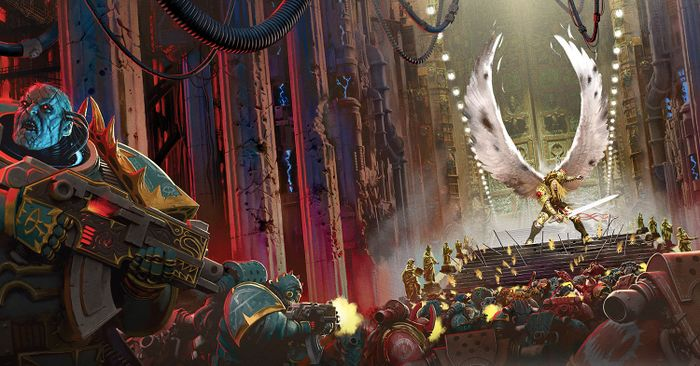

<!-- A0668-B0076 -->

原译文

Sanguinius' stand at the Eternity Gate 圣吉列斯站在永恒之门

**校订译文**

Sanguinius' stand at the Eternity Gate 圣吉列斯站在永恒之门

<!-- /A0668-B0076 -->

<!-- A0668-B0077 -->
**英文原文**

Though weakened from his fight with Ka'Bandha, Sanguinius nonetheless next faced his Daemonic brother Angron. After a climatic airborne battle, Angron impaled Sanguinius upon his Black Blade. However, Sanguinius used the opportunity to rip out Angron's Butchers Nails, causing the Daemon Primarch's head to explode. With Angron banished into the Warp, the World Eaters lost whatever sanity they had and began to cut down their own allies. This broke the traitor advance just short of the Eternity Gate, which managed to finally seal shut as the surviving loyalists fled inside.

<!-- /A0668-B0077 -->

<!-- A0668-B0078 -->

原译文

尽管圣吉列斯在与卡’班哈的战斗中被削弱了，但他接下来还是要面对他的恶魔兄弟安格隆。在一场激烈的空战后，安格隆用他的黑刃刺穿了圣吉列斯。然而，圣吉列斯利用这个机会拔出了安格隆的屠夫之钉，导致恶魔原体的头部爆炸。随着安格隆被放逐到亚空间，吞世者失去了所有的理智，开始杀戮自己的盟友。这打破了叛徒在永恒之门附近的推进，当幸存的忠诚者逃进去时，永恒之门最终被封锁。

**校订译文**

与卡’班哈一战令圣吉列斯力量衰竭，但他紧接着又迎战恶魔化的兄弟安格隆。激烈的空战之后，安格隆用黑刃刺穿天使，圣吉列斯却趁机扯出对方的屠夫之钉，使恶魔原体的头颅爆裂。安格隆被放逐回亚空间后，吞世者失去最后一丝理智，开始屠杀己方盟军。叛军的攻势因此在永恒之门前功亏一篑，幸存的忠诚派部队撤入门内，大门终于关闭。

<!-- /A0668-B0078 -->

<!-- A0668-B0079 -->
### Sacrifice 牺牲

<!-- /A0668-B0079 -->

<!-- A0668-B0080 -->
**英文原文**

Just hours after sealing the Eternity Gate, a still-bleeding Sanguinius was summoned by the Emperor Himself to the Golden Throne, learning that Horus had lowered the Void Shields of the Vengeful Spirit and his Father intended to launch a teleportation assault aboard the vessel. Much to Sanguinius' dismay, the Emperor informed him that he would not join in the assault but rather stay behind to command the remaining loyalist forces on Terra. Sanguinius later confronted The Emperor as He was fitting on His armor for battle, stating that he was refusing to stay behind. The Emperor was unmoved until Sanguinius finally revealed his prophetic visions of his death at Horus' hand. To the Emperor's surprise, Sanguinius stated he did not seek death at Horus' hands but rather sought to change his fate by challenging it head-on. This persuaded the Emperor to change His mind and allow Sanguinius to take part in the assault, for the Master of Mankind had spent many lifetimes attempting to defy fate the same way.

<!-- /A0668-B0080 -->

<!-- A0668-B0081 -->

原译文

就在封上永恒之门几个小时后，帝皇亲自召集了仍在流血的圣吉列斯前往黄金王座，得知荷鲁斯已经降下了复仇之魂号的虚空盾，他的父亲打算在船上发动传送攻击。令圣吉列斯非常沮丧的是，帝皇告诉他，他不会加入进攻，而是留下来指挥泰拉上剩下的忠诚部队。圣吉列斯后来在帝皇穿上盔甲准备战斗时与他对峙，称他拒绝留下来。直到圣吉列斯最终透露了他在荷鲁斯手中死亡的预言，帝皇才动摇了。令帝皇惊讶的是，圣吉列斯表示，他并不想在荷鲁斯手中寻求死亡，而是试图通过正面挑战来改变自己的命运。这说服了帝皇改变主意，允许圣吉列斯参与进攻，因为人类之主已经用了很多时间试图以同样的方式挑战命运。

**校订译文**

永恒之门关闭仅数小时后，仍在流血的圣吉列斯奉帝皇亲召来到黄金王座前。他得知荷鲁斯已关闭复仇之魂号的虚空盾，父亲准备通过传送发动突袭。令天使失望的是，帝皇要求他留下，指挥泰拉上余下的忠诚部队。后来，帝皇披甲备战时，圣吉列斯再次来到他面前，明确表示不愿留下。帝皇起初不为所动，直到天使透露自己预见将死于荷鲁斯之手。出乎父亲意料，他并不是去求死，而是想直面命运，试图改变结局。这说服了帝皇，允许他参与突袭：人类之主自己也曾用漫长得足以跨越许多人生的岁月，以同样方式抗争命运。

<!-- /A0668-B0081 -->

<!-- A0668-B0082 图片 -->
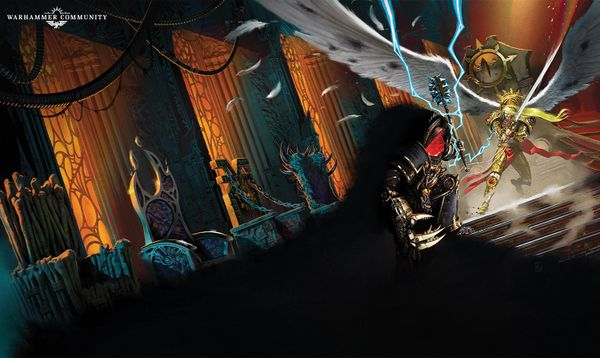

<!-- A0668-B0083 -->

原译文

Sanguinius faces Horus aboard the Vengeful Spirit 圣吉列斯在复仇之魂上面对荷鲁斯

**校订译文**

Sanguinius faces Horus aboard the Vengeful Spirit 圣吉列斯在复仇之魂号上面对荷鲁斯

<!-- /A0668-B0083 -->

<!-- A0668-B0084 -->
**英文原文**

Upon teleporting aboard the Vengeful Spirit alongside the Sanguinary Guard and veterans under Raldoron, Sanguinius was scattered throughout the vessel along with the other Imperials. However, he and his Blood Angels were the only boarding party to initially reach their intended target of Disembarkation Deck Two, fighting through swathes of Sons of Horus, Daemons, and Word Bearers. Inside the corrupted Vessel Sanguinius was guided by the wraith of Ferrus Manus, whose soul had been returned to the mortal realm on a whim by Horus as a form of psychological torture.

<!-- /A0668-B0084 -->

<!-- A0668-B0085 -->

原译文

在与圣血卫队和拉多隆手下的老兵一起乘坐复仇之魂号传送后，圣吉列斯与其他帝国军队一起分散在整艘船上。然而，他和他的圣血天使是唯一一个到达他们最初预定的下船甲板二号的跳帮队伍，他们在荷鲁斯之子、恶魔和怀言者的包围下战斗。在腐化的船内，圣吉列斯受到了费鲁斯·马努斯幽灵的引导，他的灵魂被荷鲁斯作为一种灵能折磨的形式一时兴起，放回到了凡域。

**校订译文**

圣吉列斯与圣血守卫、拉多隆麾下的老兵一同传送登上复仇之魂号，和其他帝国部队一样遭到传送散布。不过，他率领的圣血天使是最初唯一抵达预定目标——二号离舰甲板——的突击队。他们一路杀穿荷鲁斯之子、恶魔与怀言者的阵线。在腐化的舰体中，费鲁斯·马努斯的幽魂为天使引路。荷鲁斯一时兴起，将费鲁斯的灵魂拉回凡世，以此施加心理折磨。

<!-- /A0668-B0085 -->

<!-- A0668-B0086 -->
**英文原文**

Still preparing to face his father, Horus deliberately let Sanguinius reach him within the heavily mutated Lupercal's Court. Planning to turn Sanguinius to Chaos so that they may confront their father together, Horus was genuinely disappointed when Sanguinius refused his offer to join him in ascendency.

<!-- /A0668-B0086 -->

<!-- A0668-B0087 -->

原译文

荷鲁斯仍在准备面对他的父亲，他故意让圣吉列斯在严重变异的卢佩卡尔王庭内找到他。计划将圣吉列斯堕入混沌，以便他们可以一起对抗他们的父亲，当圣吉列斯拒绝他加入到他的优势时，荷鲁斯真的很失望。

**校订译文**

荷鲁斯仍在准备迎战父亲，有意让圣吉列斯来到严重扭曲的卢佩卡尔王庭。他想诱使天使投入混沌，让两人共同对抗帝皇。因此，当圣吉列斯拒绝与他一同登临至高之境时，荷鲁斯确实深感失望。

<!-- /A0668-B0087 -->

<!-- A0668-B0088 -->
**英文原文**

Instead, the already heavily injured Sanguinius attacked Horus with all his might, displaying ferocious combat ability. Horus was still held back by his true power, engaging in a purely martial battle with Sanguinius in hopes of breaking him down so he may accept the powers of the Warp. However, Sanguinius fought so stubbornly and viciously that Horus grew frustrated and even took several wounds. In the end, Horus was forced to change his plans when he detected that the Emperor was incoming towards his location. Horus finally decided to kill Sanguinius and unleashed his full power, reaching into the 8th dimension to grab Sanguinius and slam him to the ground mid-flight. Horus proceeded to batter his brother with Worldbreaker and impaled him several times with his Talon before the skull of Ferrus Manus. Horus let out a disappointed sigh as his brother died and his body was strung up by Daemons.

<!-- /A0668-B0088 -->

<!-- A0668-B0089 -->

原译文

相反，已经严重受伤的圣吉列斯全力攻击荷鲁斯，表现出凶猛的战斗能力。荷鲁斯仍然束缚着他的真正力量，与圣吉列斯进行了一场纯粹的武斗，希望将他击败，这样他就可以接受亚空间的力量。然而，圣吉列斯的战斗如此顽强和恶毒，以至于荷鲁斯变得沮丧，甚至受了几伤。最后，当荷鲁斯发现帝皇正朝他的位置走来时，他被迫改变了计划。荷鲁斯最终决定杀死圣吉列斯并释放他的全部力量，进入第八维度抓住S圣吉列斯，并在飞行途中将他摔在地上。荷鲁斯开始用破世者殴打他的兄弟，并在费鲁斯·马努斯的头骨前用他的爪刺穿了他几次。当他的兄弟死去，他的尸体被恶魔吊起时，荷鲁斯失望地叹了口气。

**校订译文**

早已身负重伤的圣吉列斯反而全力进攻，展现出凶猛卓绝的武艺。荷鲁斯起初仍压制真正的力量，只凭武技交战，希望先摧垮兄弟，使其接受亚空间的恩赐。然而，圣吉列斯奋战得如此顽强而凌厉，令荷鲁斯渐失耐心，甚至数度负伤。最终，他感知帝皇正向这里接近，不得不改变计划，决定杀死圣吉列斯。他释放全部力量，伸入第八维度抓住飞行中的天使，将其重重摔向地面。荷鲁斯在费鲁斯·马努斯的头骨前，以破世者痛击兄弟，又用利爪数次贯穿其身体。天使死后，遗体被恶魔吊起，荷鲁斯失望地叹了口气。

**校注：** 原文 was still held back by his true power 语法别扭；结合纯武技交战、随后释放全部力量，按起初压制真正力量理解。删除原译“S圣吉列斯”笔误。

<!-- /A0668-B0089 -->

<!-- A0668-B0090 -->
**英文原文**

Others state that the only damage Sanguinius did was create a small dent in Horus' armour. Some say, however, that it was through this chink in Horus's armour that the Emperor was able to deliver the fatal blow. Thus the belief is that Sanguinius did not die in vain; but by dying, allowed Horus to be slain and the Heresy destroyed.

<!-- /A0668-B0090 -->

<!-- A0668-B0091 -->

原译文

其他人则表示，圣吉列斯造成的唯一伤害是在荷鲁斯的盔甲上留下了一个小凹痕。然而，有人说，正是通过荷鲁斯盔甲上的这个缝隙，帝皇才能够给他致命的一击。因此，人们相信圣吉列斯并没有白白死去；通过牺牲，使得荷鲁斯被杀，叛乱被摧毁。

**校订译文**

另一些记载则称，圣吉列斯只在荷鲁斯的盔甲上留下一处小小的凹痕。还有人相信，正是借助这道破绽，帝皇才得以给予荷鲁斯致命一击。因此，这一说法认为，圣吉列斯并未白白牺牲：他的死为诛杀荷鲁斯、终结叛乱创造了机会。

**校注：** 本段明确属于其他版本/传说，保留与前段叙事的差异，不拼成同一场战斗的确定过程。

<!-- /A0668-B0091 -->

<!-- A0668-B0092 -->
**英文原文**

Sanguinius's body was discovered shortly after by the Emperor as he arrived in Lupercal's Court. The Emperor ordered Sanguinius' body be taken down from its crucifix, which Leetu carried out. His body was later taken from the Vengeful Spirit by Dorn, Valdor, and other surviving Imperials following Horus' defeat.\[30a\] Shortly after the Imperial victory in the Siege of Terra, a funeral service for Sanguinius was subsequently held on the Throneworld by Raldoron, Azkaellon, and 500 surviving Blood Angels.\[30b\] His body was then borne away to his home planet Baal, where he was laid to rest in the Golden Sarcophagus, deep within a vast tomb whose doors were topped with massive Angel effigies in honour of the fallen Primarch.

<!-- /A0668-B0092 -->

<!-- A0668-B0093 -->

原译文

圣吉列斯的尸体不久后被帝皇发现，因为他到达了卢佩卡尔王庭。帝皇下令从十字架上取下圣吉列斯的尸体，勒图执行了这一命令。荷鲁斯战败后，多恩、瓦尔多和其他幸存的帝国军队从复仇之魂号上中夺走了他的尸体。帝国在泰拉围城中获胜后不久，随后拉多隆、阿兹卡隆和500名幸存的圣血天使在王座世界为圣吉列斯举行了葬礼。然后，他的尸体被运到他的家园星球巴尔，在那里他被安葬在金棺中，深埋在一座巨大的坟墓里，坟墓的门上挂着巨大的天使肖像，以纪念这位陨落的原体。

**校订译文**

帝皇随后来到卢佩卡尔王庭，发现圣吉列斯的遗体。他下令将其从十字架上解下，勒图执行了命令。荷鲁斯败亡后，多恩、瓦尔多与其他幸存的帝国人员将遗体带离复仇之魂号。泰拉围城战胜利不久，拉多隆、阿兹卡隆与五百名圣血天使幸存者在王座世界为原体举行葬礼。此后，遗体被运回故乡巴尔，安葬于宏伟陵墓深处的金棺之中。墓门上方矗立着巨大的天使雕像，以纪念逝去的原体。

<!-- /A0668-B0093 -->

<!-- A0668-B0094 -->
### Legacy 遗产

<!-- /A0668-B0094 -->

<!-- A0668-B0095 -->
**英文原文**

Of all the Primarchs, Sanguinius is commonly held in the highest honour. Because he is generally believed to have sacrificed himself to allow Horus, the "Great Betrayer", to be defeated, the Primarch's name is cherished by the common citizens of the Imperium. Temples devoted to Sanguinius rise aside those of the Emperor. Sanguinius is commemorated on a sacred day of celebration called the Sanguinala, when adepts across the galaxy wear on their breast the red badge of Sanguinius.

<!-- /A0668-B0095 -->

<!-- A0668-B0096 -->

原译文

在所有的原体中，圣吉列斯通常被视为最高荣誉。因为人们普遍认为他牺牲了自己，让“大背叛者”荷鲁斯被击败，所以这位原体的名字受到了帝国普通公民的珍视。供奉圣吉列斯的圣殿建在帝皇圣殿之外。圣吉列斯是在一个名为圣吉列斯节的神圣庆祝日纪念的，当时银河系各地的修会都会在胸前佩戴圣吉列斯的红色徽章。

**校订译文**

在所有原体中，圣吉列斯通常最受崇敬。帝国民众普遍相信，他牺牲自己，才使“大背叛者”荷鲁斯得以被击败，因此对他的名字怀有深厚感情。供奉圣吉列斯的圣堂与帝皇圣堂并立。人们在神圣的圣吉列斯节纪念他，银河各地的官吏会在胸前佩戴圣吉列斯的红色徽章。

<!-- /A0668-B0096 -->

<!-- A0668-B0097 图片 -->
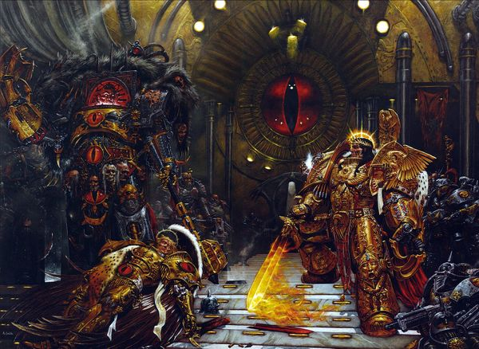

<!-- A0668-B0098 -->

原译文

Sanguinius lies dead at Horus' feet 圣吉列斯死在荷鲁斯脚下

**校订译文**

Sanguinius lies dead at Horus' feet 圣吉列斯死在荷鲁斯脚下

<!-- /A0668-B0098 -->

<!-- A0668-B0099 -->
**英文原文**

A feather of Sanguinius recovered from the Vengeful Spirit has been shown to have special properties and is used by John Grammaticus to travel across space and time.

<!-- /A0668-B0099 -->

<!-- A0668-B0100 -->

原译文

从复仇之魂号中回收的圣吉列斯之羽已被证明具有特殊性质，约翰·格拉马迪库斯用它来穿越时空。

**校订译文**

从复仇之魂号中回收的圣吉列斯之羽已被证明具有特殊性质，约翰·格拉马迪库斯用它来穿越时空。

<!-- /A0668-B0100 -->

<!-- A0668-B0101 -->
**英文原文**

An apparent avatar of Sanguinius appeared before Mephiston in the Warp, revealing the truth of the Gold Angel and Black Angel. This being cryptically stated that he is not Sanguinius as Sanguinius is dead, yet Mephiston and Dante both suspect a psychic echo of the Primarch may still endure within the Immaterium.

<!-- /A0668-B0101 -->

<!-- A0668-B0102 -->

原译文

圣吉列斯的明显化身出现在亚空间中的墨菲斯托面前，揭示了黄金天使和黑色天使的真相。这是隐晦地说，他不是圣吉列斯，因为圣吉列斯已经死了，但墨菲斯托和但丁都怀疑，原体的灵能回响可能仍然存在于非物质界内部。

**校订译文**

一个疑似圣吉列斯化身的存在，曾在亚空间中现身于墨菲斯顿面前，揭示黄金天使与黑色天使的真相。它含糊地表示，自己并不是圣吉列斯，因为圣吉列斯已经死了。然而，墨菲斯顿与但丁都怀疑，原体的灵能回响可能仍存在于亚空间。

**校注：** apparent 表示疑似，不是明显确定；是否圣吉列斯本人或灵能回响，源文有意保持不确定。

<!-- /A0668-B0102 -->

<!-- A0668-B0103 -->
## Quotes 名言

<!-- /A0668-B0103 -->

<!-- A0668-B0104 -->
**英文原文**

Three Legions of Marines stand to defend you, sire. All of us will unflinchingly place ourselves between you and the war’s desolation. We are the greatest humans ever born – we are the flame of Humanity where the rest of the galaxy is just the spark. In centuries of warfare, against the vileness of the alien, the lies of the heretic, the foulness of the mutant, I have never known fear – but your silence terrifies me.— during the Battle for Terra.

<!-- /A0668-B0104 -->

<!-- A0668-B0105 -->

原译文

陛下，三支星际战士军团随时准备保卫您。我们所有人都将坚定不移地站在您和战争的废墟之间。我们是有史以来最伟大的人类 — 我们是人类的火焰，而银河系的其他部分只是火花。在几个世纪的战争中，面对异型的卑鄙、异端的谎言、变种人的肮脏，我从来不知道恐惧 — 但你的沉默让我害怕。—在泰拉之战期间。

**校订译文**

“陛下，三支星际战士军团正严阵以待，守护着您。我们所有人都会毫不退缩地挡在您与战争的毁灭之间。我们是人类有史以来最伟大的战士——我们是人类的烈焰，银河其他地方不过是星火。数百年来，我对抗异形的卑劣、异端的谎言与变种人的污秽，从不知恐惧为何物；然而，您的沉默令我恐惧。”——泰拉之战期间。

<!-- /A0668-B0105 -->

<!-- A0668-B0106 -->
## Wargear 武器装备

原题：Wargear 战备

<!-- /A0668-B0106 -->

<!-- A0668-B0107 -->

原译文

Blade Encarmine 染赤之刃

**校订译文**

Blade Encarmine 染赤之刃

<!-- /A0668-B0107 -->

<!-- A0668-B0108 -->

原译文

Spear of Telesto 毕功之矛

**校订译文**

Spear of Telesto 毕功之矛

<!-- /A0668-B0108 -->

<!-- A0668-B0109 -->

原译文

Infernus 炼狱

**校订译文**

Infernus 炼狱

<!-- /A0668-B0109 -->

<!-- A0668-B0110 -->

原译文

Moonsilver Blade 月银之刃

**校订译文**

Moonsilver Blade 月银之刃

<!-- /A0668-B0110 -->

<!-- A0668-B0111 -->

原译文

Regalia Resplendent 辉煌王权

**校订译文**

Regalia Resplendent 辉煌王权

<!-- /A0668-B0111 -->

<!-- A0668-B0112 -->
## Trivia 琐事

<!-- /A0668-B0112 -->

<!-- A0668-B0113 -->
### Etymology 词源学

<!-- /A0668-B0113 -->

<!-- A0668-B0114 -->
**英文原文**

Sanguis is Latin for blood.

<!-- /A0668-B0114 -->

<!-- A0668-B0115 -->

原译文

桑吉斯在拉丁语中是血的意思。

**校订译文**

Sanguis 是拉丁语中的“血”。

<!-- /A0668-B0115 -->

<!-- A0668-B0116 -->
### Conflicting sources 来源冲突

<!-- /A0668-B0116 -->

<!-- A0668-B0117 -->
**英文原文**

In most depictions of Sanguinius, he is portrayed with blond hair; in Horus Rising, however, he is described as black-haired, though he wears gold filigree over his head.

<!-- /A0668-B0117 -->

<!-- A0668-B0118 -->

原译文

在大多数对圣吉列斯的描绘中，他被描绘成金发；然而，在荷鲁斯崛起中，他被描述为黑发，尽管他头上戴着金线。

**校订译文**

圣吉列斯在大多数形象中都拥有金发；然而，《荷鲁斯崛起》却将他描写为黑发，只是头上佩戴着金丝饰物。

<!-- /A0668-B0118 -->

本篇核心术语与暂定项

以下列出本篇出现的英文原形及核心术语表用词。同形词可能指不同对象，具体词义以本篇正文和校注为准；单复数、别名和仅见于图注的名称可能尚未列入。完整候选见[术语表](../../术语表/双语术语候选.csv)。

| 英文 | 采用中文 | 状态 |
| --- | --- | --- |
| Space Marines | 星际战士 | 官方已核对 |
| Blood Angels | 圣血天使 | 官方已核对 |
| Dark Angels | 黑暗天使 | 官方已核对 |
| Imperial Army | 帝国军 | 暂定·官方待核 |
| Death Guard | 死亡守卫 | 官方已核对 |
| World Eaters | 吞世者 | 官方已核对 |
| Roboute Guilliman | 罗保特·基里曼 | 官方已核对 |
| Ultramarines | 极限战士 | 官方已核对 |
| Horus Heresy | 荷鲁斯之乱 | 官方已核对 |
| Warp | 亚空间 | 官方已核对 |
| Imperium | 帝国 | 暂定·简称 |
| Teleportation | 传送 | 暂定 |
| Khorne | 恐虐 | 官方已核对 |
| Sanguinary | 圣血学派 | 暂定·学派语境 |
| Imperial Fists | 帝国之拳 | 暂定 |
| Emperor | 帝皇 | 官方已核对 |
| Primarch | 原体 | 官方已核对 |
| Mutant | 变种人 | 暂定·官方待核 |
| Word Bearers | 怀言者 | 暂定·官方待核 |
| Iron Warriors | 钢铁勇士 | 暂定·官方待核 |
| Great Crusade | 大远征 | 暂定·官方待核 |
| Ferrus Manus | 费鲁斯·马努斯 | 暂定·官方待核 |
| Interex | 英特雷斯 | 暂定·官方待核 |
| Terra | 泰拉 | 暂定·官方待核 |
| Murder | 谋杀 | 暂定·官方待核 |
| Luna Wolves | 影月苍狼 | 暂定·官方待核 |
| Horus | 荷鲁斯 | 暂定·官方待核 |
| Erebus | 艾瑞巴斯 | 暂定·官方待核 |
| Vengeful Spirit | 复仇之魂号 | 暂定·官方待核 |
| Sons of Horus | 荷鲁斯之子 | 暂定·官方待核 |
| Lion El'Jonson | 莱昂·艾尔’庄森 | 官方已核对 |
| Golden Throne | 黄金王座 | 暂定·官方待核 |
| John Grammaticus | 约翰·格拉马迪库斯 | 暂定·官方待核 |
| Malcador the Sigillite | 掌印者马卡多 | 暂定·官方待核 |
| Endurance | 坚韧 | 暂定·官方待核 |
| Konrad Curze | 康拉德·科兹 | 暂定·官方待核 |
| Nuceria | 努凯里亚 | 暂定·官方待核 |
| Baal | 巴尔 | 暂定·官方待核 |
| Davin | 戴文 | 暂定·官方待核 |
| Luna | 月球 | 暂定·官方待核 |
| Macragge | 马库拉格 | 暂定·官方待核 |
| Sotha | 索萨 | 暂定·官方待核 |
| Titan | 泰坦 | 暂定·官方待核 |
| Imperium Secundus | 第二帝国 | 暂定·官方待核 |
| Imperator Regis | 雷吉斯帝皇 | 暂定·官方待核 |
| Pharos | 灯塔 | 暂定·官方待核 |
| Master | 导师（审判庭职衔）／舰务官（舰员职务） | 语境定译·官方待核 |
| Preacher | 传道士 | 暂定 |
| Leetu | 勒图 | 暂定·官方待核 |
| Apothecary | 药剂师 | 官方已核对 |
| Sanguinary Guard | 圣血守卫 | 官方已核对 |
| Drop Pod | 空降舱 | 官方已核·中英对照 |
| Lupercal | 卢佩卡尔 | 暂定·官方待核 |
| Serpent Lodge | 蛇之结社 | 暂定·官方待核 |
| Tarik Torgaddon | 塔里克·托加顿 | 暂定·官方待核 |
| Space Marine Legion | 星际战士军团 | 暂定·官方待核 |
| The Sigillite | 掌印者 | 暂定·官方待核 |
| The Primarchs | 原体 | 暂定·官方待核 |
| The Battle of Beta-Garmon | 贝塔-伽蒙之战 | 暂定·官方待核 |
| Sol | 太阳系 | 暂定·官方待核 |
| Raldoron | 拉多隆 | 暂定·官方待核 |
| Azkaellon | 阿兹卡隆 | 暂定·官方待核 |
| Herald | 传令官 | 暂定·官方待核 |
| Space Marine | 星际战士 | 暂定·官方待核 |
| Chapter | 战团 | 暂定·官方待核 |
| Captain | 连长 | 暂定·官方待核 |
| Brother | 修士 | 暂定·官方待核 |
| Dante | 但丁 | 暂定·官方待核 |
| Mephiston | 墨菲斯顿 | 暂定·官方待核 |
| The Angel | 天使 | 暂定·官方待核 |
| Mortal | 凡人 | 暂定·官方待核 |
| Revenant Legion | 归来者军团 | 暂定·官方待核 |
| Cathedral of the Mark | 印记大教堂 | 暂定·官方待核 |
| Lorgar | 珞珈 | 暂定·官方待核 |
| Chaos Undivided | 混沌无分 | 暂定·官方待核 |
| Powers | 能天使 | 暂定·官方待核 |
| The Sanguinor | 圣血者 | 官方已核 |
| Host | 天军 | 暂定·官方待核 |
| Xenos | 异形 | 暂定·官方待核 |
| Keeper of Secrets | 守密者 | 官方已核对 |
| Bloodthirster | 嗜血狂魔 | 官方已核对 |
| Soul Grinder | 磨魂者 | 官方已核对 |
| Jaghatai Khan | 察合台可汗 | 暂定·官方待核 |
| Horde | 部落 | 暂定·官方待核 |
| Tribe | 部落（欧克组织） | 暂定·官方待核 |
| The Beast | 野兽 | 暂定·官方待核 |
| Imperialis | 帝国徽记 | 暂定·官方待核 |
| Sanctum | 圣所星 | 暂定·官方待核 |
| Gorgon Bar | 戈尔贡防线 | 暂定·官方待核 |
| Kindred | 亲族 | 暂定·官方待核 |
| Sanctum Imperialis | 帝国圣所 | 暂定·官方待核 |
| Angron | 安格隆 | 官方已核对 |
| Red Tear | 红泪号 | 暂定·官方待核 |
| Spear of Telesto | 毕功之矛 | 暂定·官方待核 |
| Vengeance | 复仇号 | 暂定·官方待核 |
| Skull of Ferrus Manus | 费鲁斯·马努斯之颅 | 暂定·官方待核 |
| Reaver Titan | 掠夺者级泰坦 | 官方已核对 |
| Legio Solaria | 日晷军团 | 暂定·官方待核 |
| Legio Vulpa | 鬼狐军团 | 暂定·官方待核 |
| The Anvil | 铁砧星堡 | 暂定·官方待核 |
| Axis Mundi | 世界轴心号 | 暂定·官方待核 |
| Invincible Reason | 无敌理性号 | 暂定·官方待核 |
| Warlord Titan | 战将级泰坦 | 官方已核对 |
| the dauntless few | 少数无畏者 | 暂定·官方待核 |
| Sphere | 防御圈 | 暂定·官方待核 |
| Madail | 马代尔 | 暂定·官方待核 |
| Necrosphere | 死灵圈 | 暂定·官方待核 |
| Blade Encarmine | 染赤之刃 | 暂定·官方待核 |
| The Dark | 《黑暗》 | 暂定·官方待核 |
| Carnodon | 卡诺顿兽 | 暂定·官方待核 |
| People of the Pure Blood | 纯血者 | 暂定·官方待核 |
| The Blood | 鲜血 | 暂定·官方待核 |
| Ragefire | 愤怒之火 | 暂定·官方待核 |
| Battle of Pyrrhan | 派尔罕之战 | 暂定·官方待核 |
| Daughter of Torment | 折磨之女号 | 暂定·官方待核 |
| Idamas | 伊达玛斯 | 暂定·官方待核 |
| Sanguinala | 圣吉列斯节 | 暂定·官方待核 |
| Golden Sarcophagus | 金棺 | 暂定·官方待核 |
| Ruinstorm | 毁灭风暴 | 暂定·官方待核 |
| System | 星系（恒星系统） | 暂定·官方待核 |
| Beta-Garmon III | 贝塔-伽蒙三号 | 暂定·官方待核 |
| Baal Secundus | 巴尔二号 | 暂定·官方待核 |
| Kyriss the Perverse | 悖逆者凯瑞斯 | 暂定·官方待核 |
| Kyriss | 凯瑞斯 | 暂定·官方待核 |
| Meros | 梅洛斯 | 暂定·官方待核 |
| War on Murder | 谋杀星战争 | 暂定·官方待核 |
| Helios | 赫利俄斯 | 暂定·官方待核 |
| Worldbreaker | 破世者 | 暂定·官方待核 |
| Corruption | 腐败 | 暂定·官方待核 |
| Black Blade | 黑刃 | 暂定·官方待核 |
| Beta | 贝塔号 | 暂定·官方待核 |
| Omen | 预兆号 | 暂定·官方待核 |
| Fafnir Rann | 法夫尼尔·兰恩 | 暂定·官方待核 |
| Signus Prime | 西格纳斯主星 | 暂定·官方待核 |
| Lupercal's Court | 卢佩卡尔王庭 | 暂定·官方待核 |
| Gorgon | 戈尔贡 | 暂定·官方待核 |
| Beta-Garmon II | 贝塔-伽蒙二号 | 暂定·官方待核 |
| Sol System | 太阳系 | 暂定·官方待核 |
| Helios Gate | 日神之门 | 暂定·官方待核 |
| Eternity Gate | 永恒之门 | 暂定·官方待核 |

