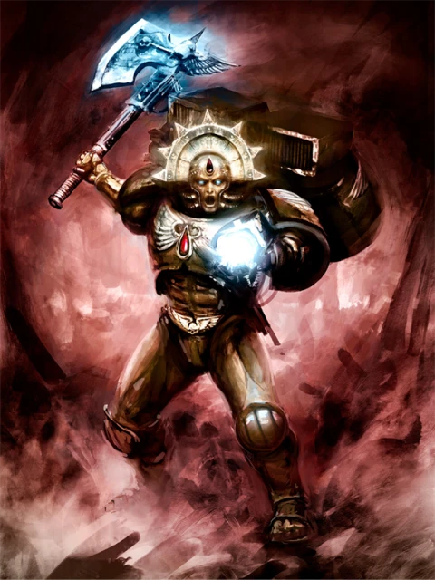
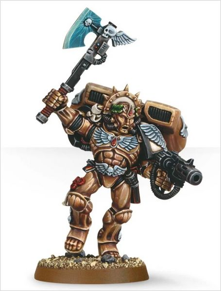
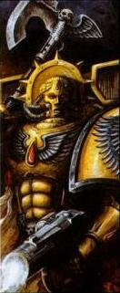
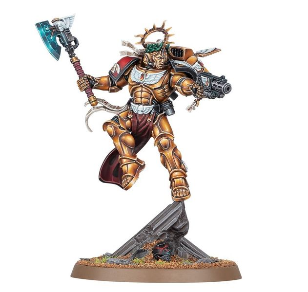

# 0669 但丁 Dante

精校状态：中文行文已逐段精校，部分术语仍为暂定

分类：人类帝国 / 圣血天使

原文来源：https://www.bilibili.com/opus/1115647523597320215

原作者：帝国神选罐头

原文时间：编辑于 2025年09月23日 12:39

[返回分类目录](目录.md) · [全书目录](../../目录.md)

<!-- A0669-B0001 -->
**英文原文**

"For eleven hundred years, I have fought and I have seen the darkness in our galaxy. I have seen the vileness of the alien and the heresy of the mutant. I have witnessed the sin of possession. I have seen all the evil that the galaxy harbours, and I have slain all whose presence defiles the Emperor. I have seen what you will see. I have fought what you must fight, and I have slain what you must slay... so fear not and be proud, for we are the sons of Sanguinius, the protectors of Mankind. Aye, we are indeed the Angels of Death."

<!-- /A0669-B0001 -->

<!-- A0669-B0002 -->

原译文

“一千一百年来，我一直在战斗，我看到了我们银河系的黑暗。我看到了外星人的卑劣和变种人的异端邪说。我目睹了占据之罪。我见过银河系所隐藏的所有邪恶，我杀死了所有亵渎帝皇的人。我已经看到了你会看到的。我已经为你必须战斗的东西而战，我也为你必须杀死的东西而战……所以不要害怕，也不要骄傲，因为我们是人类的保护者，圣吉列斯之子。是的，我们确实是死亡天使。”

**校订译文**

“一千一百年来，我征战不休，亲眼见证了银河中的黑暗。我见过异形的卑劣与变种人的异端行径，目睹过恶魔附身的罪恶。我见过银河潜藏的一切邪恶，也斩杀了一切以其存在亵渎帝皇的敌人。你们将要见到的，我已经见过；你们必须面对的，我已经战过；你们必须诛灭的，我已经杀过……所以，无须恐惧，当以此为荣。我们是圣吉列斯之子，是人类的守护者。不错，我们正是死亡天使。”

**校注：** be proud 是应当自豪，原译“不要骄傲”反转意思；possession 在此为恶魔附身。

<!-- /A0669-B0002 -->

<!-- A0669-B0003 -->
**英文原文**

Dante is the current Chapter Master of the Blood Angels. Commander Dante is one of the most experienced and able Space Marine commanders. In no small part, this is due to the longevity of the Blood Angels, which he has ruled for 1,100 years. Dante is the oldest living Space Marine in the Imperium (excluding Dreadnoughts) and is held in awe by leaders of other Chapters, who can remember him being a famous commander when they were in the Scout Company.

<!-- /A0669-B0003 -->

<!-- A0669-B0004 -->

原译文

但丁是圣血天使的现任战团长。指挥官但丁是最有经验和能力的星际战士指挥官之一。在很大程度上，这是由于他控制了1100年的圣血天使的长寿。但丁是帝国（不包括无畏）中现存最古老的星际战士，其他战团的领导人对他怀有敬畏之情，在他们在侦察连队时，已经记得但丁是一位著名的指挥官了。

**校订译文**

但丁是圣血天使现任战团长，也是经验最丰富、能力最出众的星际战士指挥官之一。这在很大程度上得益于圣血天使的长寿：他已统率战团一千一百年。据本篇记载，不计无畏机甲中的战士，但丁是帝国仍然在世的星际战士中最年长者。其他战团领袖对他敬畏有加，因为当他们还在侦察连服役时，但丁便已是著名统帅。

**校注：** “现任”“最年长”“统率1100年”均保留源文时点的说法，不据此断言所有后续出版版本也一致。

<!-- /A0669-B0004 -->

<!-- A0669-B0005 图片 -->

<!-- A0669-B0006 -->

原译文

Commander Dante 指挥官但丁

**校订译文**

Commander Dante 指挥官但丁

<!-- /A0669-B0006 -->

<!-- A0669-B0007 -->
## Biography 传记

<!-- /A0669-B0007 -->

<!-- A0669-B0008 -->
### Early life 早期生活

<!-- /A0669-B0008 -->

<!-- A0669-B0009 -->
**英文原文**

Luis Dante was born in 447.M40 on Baal Secundus (Baal's second moon) and his growth was stunted by malnutrition and radiation. Dante was part of his planet's salt clans, a nomadic people that travelled the salt deserts (former seas) of Baal Secundus to harvest its salt, selling it at various permanent settlements at the salt deserts' borders. His mother died giving birth to his stillborn younger brother, and he was thus raised by his father Arreas. His childhood was hard, with his clan facing dangerous wildlife, human raiders, and an extremely hostile environment; most clan members died before their 30th year. From an early age, Dante felt the desire to help others and make a difference; thus, he was drawn to the idea of becoming a Blood Angel. His father, who did not want to lose his last living relative, forbid him from partaking in the Angel's Fall trials to determine the next Aspirants. Undeterred, Dante regretfully left in secret, crossing the Great Salt Waste alone to reach the trials. He almost died of thirst, but also first experienced a vision of the Sanguinor who guided him to a mummified corpse with intact water flasks, saving his life and allowing him to continue his journey.

<!-- /A0669-B0009 -->

<!-- A0669-B0010 -->

原译文

路易斯·但丁出生于447.M40，在巴尔的第二个卫星巴尔二号上，他的生长受到营养不良和辐射的阻碍。但丁是他行星上盐氏族的一部分，这是一个游牧民族，他们前往巴尔二号的盐沙漠（前海洋）收割盐，并在盐沙漠边界的各个永久定居点出售。他的母亲在生下死产的弟弟时去世，因此他由父亲阿雷亚斯抚养长大。他的童年很艰难，他的家族面临着危险的野兽、人类袭击者和极其恶劣的环境；大多数氏族成员在30岁之前就死去了。但丁从小就渴望帮助他人，有所作为；因此，他被成为圣血天使的想法所吸引。他的父亲不想失去他最后一个在世的血亲，禁止他参加天使降临试炼，以确定下一个有志者。但丁并没有被吓倒，他遗憾地秘密离开，独自穿越大盐荒地去参加试炼。他几乎渴死了，但也第一次体验到圣吉列诺的幻象，圣吉列诺带领他找到一具带着完整水瓶的木乃伊尸体，救了他的命，让他继续他的旅程。

**校订译文**

路易斯·但丁于 447.M40 出生在巴尔二号，也就是巴尔的第二颗卫星。营养不良与辐射使他发育迟缓。他属于当地的盐氏族，这些游牧族群往来于昔日海洋干涸形成的盐漠，采集盐并运往边缘的永久聚落出售。母亲生下他那未能存活的弟弟时去世，此后由父亲阿雷亚斯将他养大。他童年生活艰苦，族人不仅面临猛兽与劫掠者，还要应付极其恶劣的环境，多数人活不过三十岁。但丁自幼便想帮助别人、有所作为，因而向往成为圣血天使。父亲不愿失去最后的血亲，禁止他前往天使之陨参加候选者选拔。可是但丁仍怀着愧疚秘密离家，独自穿越大盐荒地。他险些渴死，却第一次看见圣血者的幻象；幻象引他找到一具干尸，尸体旁有完好的水壶，让他得以获救，继续赶路。

<!-- /A0669-B0010 -->

<!-- A0669-B0011 -->
**英文原文**

When he took part in his clans trials at the Place of Challenge he showed no special promise, but nonetheless survived. Afterwards he was inducted by Chaplain Malafael into the Blood Angels Chapter as an Aspirant under Sanguinary Priest Araezon. He first drew notice when during his transformation after drinking the gene-seed synthesized blood of Sanguinius, he went into a year long coma and cried out the names of fallen primarchs, dark gods, and long-banished Daemons. Upon emerging Dante was trained to become a battle-brother, then Brother-Sergeant. He reached the rank of Captain in 753.M40. Later he took part in the Kallius Insurrection of M40, where every Captain of the Blood Angels but Dante himself was slain, and it was decided by the gathered Chaplains and Sanguinary Priests that he would become the new Chapter Master.

<!-- /A0669-B0011 -->

<!-- A0669-B0012 -->

原译文

当他在挑战之地参加氏族试炼时，他没有表现出特别的希望，但还是活了下来。之后，他被牧师马拉法尔引入圣血天使战团，成为圣血牧师阿拉松手下的一名有志者。他第一次引起注意是在他喝了圣吉列斯的基因种子合成血液后的转变过程中，他陷入了长达一年的昏迷，并大声呼喊着堕落的原体、黑暗诸神和长期被放逐的恶魔的名字。但丁一出现，就被训练成一名战斗兄弟，然后是兄弟军士。他于753.M40晋升为连长。后来，他参加了M40的卡利乌斯叛乱，在那里，除了但丁本人，所有圣血天使的连长都被杀了，聚集在一起的牧师和圣血牧师决定他将成为新的战团长。

**校订译文**

但丁在挑战之地参加氏族试炼时，并未展现特别出众的潜质，但仍成功活了下来。随后，教士马拉法尔将他接纳为圣血天使候选者，交由圣血祭司阿拉松负责。他首次引起注意，是在饮下以基因种子合成的圣吉列斯之血、接受改造时：他陷入长达一年的昏迷，不断呼喊逝去原体、黑暗诸神与久被放逐的恶魔之名。苏醒后，他接受训练，成为战斗兄弟，继而晋升军士，并于 753.M40 升任连长。后来，他参加第四十千年的卡利乌斯叛乱平定战；圣血天使所有连长中，唯有他幸存。集会的教士与圣血祭司于是决定，由但丁继任战团长。

**校注：** fallen primarchs 可含死去/陨落者，不能一概限定为已堕入混沌；候选者、教士、圣血祭司职衔统一。

<!-- /A0669-B0012 -->

<!-- A0669-B0013 -->
### Chapter Master 战团长

<!-- /A0669-B0013 -->

<!-- A0669-B0014 -->
**英文原文**

His very presence inspires troops to acts of valour that are extraordinary even for Space Marines. Because of this reputation, when it came to choosing a leader for the Armageddon intervention, the Masters of the other two Chapters taking part (the Salamanders and the Ultramarines) unanimously asked for him to be placed in charge. Dante is a legend not just amongst the Blood Angels but also amongst the common citizenry of the Imperium, to whom he is a saviour, a golden-armoured hero who descends to save them in their darkest hour.

<!-- /A0669-B0014 -->

<!-- A0669-B0015 -->

原译文

他的存在激发了部队的英勇行为，即使对星际战士来说也是非同寻常的。由于这一声誉，当涉及到为介入阿玛吉多顿选择一位领导者时，其他两个参与的战团（火蜥蜴和极限战士）的战团长一致要求由他负责。但丁不仅是圣血天使中的传奇人物，也是帝国普通公民中的传奇，他是救世主，是一位金甲英雄，在他们最黑暗的时刻降临拯救他们。

**校订译文**

仅仅有他在场，战士们便会展现出即使以星际战士标准衡量也非凡的勇气。因此，阿玛吉多顿援军需要推举统帅时，另外两个参战战团——火蜥蜴与极限战士——的战团长一致请他执掌指挥。但丁不仅是圣血天使心中的传奇，也深受帝国普通民众敬仰。在他们眼中，他是救世英雄，会身披金甲，在最黑暗的时刻从天而降，拯救众生。

<!-- /A0669-B0015 -->

<!-- A0669-B0016 图片 -->

<!-- A0669-B0017 -->

原译文

Dante 但丁

**校订译文**

Dante 但丁

<!-- /A0669-B0017 -->

<!-- A0669-B0018 -->
**英文原文**

Commander Dante has led the Blood Angels to some of their greatest victories, from the bloody campaigns in Ultima Macharia to the Liberation of Canau. He clove the mighty Bloodthirster Skarbrand in two at the Gates of Pandemonium and drove the Orks from the twelve worlds of Blackfang.

<!-- /A0669-B0018 -->

<!-- A0669-B0019 -->

原译文

指挥官但丁带领圣血天使取得了一些最伟大的胜利，从极限马卡里亚的血腥战役到卡诺的解放。他在混乱之门将强大的嗜血狂魔斯卡布兰德一分为二，并将欧克赶出了黑牙的十二个世界。

**校订译文**

但丁指挥官率领圣血天使赢得了许多最伟大的胜利，从极限马卡里亚的血腥战役，到卡诺解放战，皆有他的身影。他曾在混乱之门将强大的嗜血狂魔斯卡布兰德劈成两半，又将欧克逐出黑牙的十二个世界。

<!-- /A0669-B0019 -->

<!-- A0669-B0020 -->
**英文原文**

Perhaps his most famous victories were in the Second War for Armageddon, where his leadership allowed the beleaguered defenders to triumph over the fury of Waaagh! Ghazghkull. There he led the valiant strike against the Orks attacking Hive Acheron, where the horde was ripped asunder by cannon and bomb as Dante spearheaded the reinforcements. And it was in the closing stages of the war that Dante's tactical genius finally broke the back of the Ork army, leading a massed Drop Pod assault against the Orks assaulting Hive Tartarus, his Blood Angels slaying fully half of the Orks and driving them back to the ash wastes and jungles.

<!-- /A0669-B0020 -->

<!-- A0669-B0021 -->

原译文

也许他最著名的胜利是在第二次阿玛吉多顿战争中，他的领导使陷入困境的守军战胜了碎骨者的Waaagh！的怒火。在那里，他领导了对攻击黄泉巢都的兽人的英勇打击，但丁率领援军，在那里，部落被大炮和炸弹撕裂。正是在战争的最后阶段，但丁的天才战术终于突破了欧克军队的防线，领导了一场大规模的空投舱袭击了欧克，袭击了塔尔塔罗斯巢都，他的圣血天使杀死了整整一半的欧克并将他们赶回了灰烬废墟和丛林。

**校订译文**

他最著名的胜利，或许来自第二次阿玛吉多顿战争。在他的指挥下，身陷重围的守军顶住并击败了碎骨者 Waaagh! 的狂潮。但丁亲率援军前锋，向进攻黄泉巢都的欧克发动英勇突击，以炮火与炸弹撕碎敌军。战争末期，他凭卓越的战术终于重创欧克大军：大批空降舱突袭正在进攻塔尔塔罗斯巢都的敌人，圣血天使歼灭其中整整一半，将余敌赶回灰烬荒原与丛林。

<!-- /A0669-B0021 -->

<!-- A0669-B0022 -->
**英文原文**

In the closing days of the 41st Millennium, heroes like Dante were points of light in the growing darkness. He stood, as he had done for a millennium or more, between the enemies of Mankind and the Imperium.

<!-- /A0669-B0022 -->

<!-- A0669-B0023 -->

原译文

在第41个千年的最后几天，像但丁这样的英雄是日益黑暗中的亮点。他站在人类之敌和帝国之间，就像他在一千年或更长时间里所做的那样。

**校订译文**

第四十一千年行将结束时，但丁这样的英雄是愈发深沉的黑暗中的明光。他依然挡在人类之敌与帝国之间，正如过去一千多年里所做的那样。

<!-- /A0669-B0023 -->

<!-- A0669-B0024 -->
**英文原文**

As a leader, Dante is utterly fearless, and full of drive and initiative. If his opponents ever make a mistake, Dante is on it in a flash, and he always exploits their error to the fullest. He has a reputation for leading from the front and can usually be found where the battle is fiercest. Plummeting from the skies at the head of his personal bodyguard, a halo of power playing around his head.

<!-- /A0669-B0024 -->

<!-- A0669-B0025 -->

原译文

作为领导者，但丁无所畏惧，充满干劲和主动性。如果他的对手犯了错误，但丁很快就会发现，他总是充分利用他们的错误。他以在前线领导而闻名，通常可以在战斗最激烈的地方找到他。在他的个人护卫的头上从空中降落，一个动力光环在他的头上。

**校订译文**

身为领袖，但丁无所畏惧，充满干劲，善于主动争取战机。只要敌人犯错，他便会立刻抓住机会，将其利用到极致。他以身先士卒闻名，常出现在战斗最激烈之处，率领亲卫自天而降，头顶环绕着涌动的能量光晕。

<!-- /A0669-B0025 -->

<!-- A0669-B0026 -->
**英文原文**

Yet for all of his success, or perhaps because of it, Dante had grown weary of his burdens. He had lived far longer than he should, and the burden of centuries grew even weightier. Only one thing prevented Dante from succumbing to ennui- recorded in the Scrolls of Sanguinius were the Primarchs visions of a great battle to overshadow all others, where one golden warrior would stand between his Emperor and the darkness. For many generations of the Blood Angels, these prophecies had been read as Sanguinius's foreknowledge of his own fate. Yet through some instinct- perhaps a lingering trace of his Primarch's fabled far-seeing eye, or his own prophetic dreams of the golden warrior, Dante believed otherwise. He frequently believed that one day, the defence of the Emperor would possibly rest in his hands, and he aimed to fulfil that final duty.

<!-- /A0669-B0026 -->

<!-- A0669-B0027 -->

原译文

然而，尽管但丁取得了成功，或者也许正因为如此，他已经厌倦了自己的负担。他活得比他应该活得长得多，几个世纪的负担变得更加沉重。只有一件事阻止了但丁屈服于厌倦 — 在《圣吉列斯之卷》中记录的，原体们对一场伟大战斗的愿景，这场战斗将掩盖所有其他战斗，在这场战斗中，一位黄金战士将站在他的帝皇和黑暗之间。对于圣血天使的许多代人来说，这些预言被解读为圣吉列斯对自己命运的预知。然而，出于某种本能 — 也许是他传说中的原体的远见卓识的挥之不去的痕迹，或者是他自己对黄金战士的预言梦想 — 但丁却不这么认为。他经常相信，有一天，帝皇的防御可能会掌握在他手中，他打算履行这最后的职责。

**校订译文**

然而，尽管功勋卓著——或许恰恰因为如此——但丁已对肩上的重担感到疲惫。他活得远比预想中漫长，数百年的责任愈发沉重。只有一件事支撑着他：《圣吉列斯之卷》记载，原体曾预见一场令其他战争都黯然失色的大战，一位金甲战士将挡在帝皇与黑暗之间。历代圣血天使大多将此理解为圣吉列斯对自身命运的预知，但丁却凭某种直觉持不同看法。这也许源自原体预见天赋的些许余韵，也许来自他自己关于金甲战士的预知梦。他始终相信，总有一天，守护帝皇的重任可能会落在自己手中；他决意履行这最后的职责。

<!-- /A0669-B0027 -->

<!-- A0669-B0028 -->
### Devastation of Baal 巴尔之毁

原题：Devastation of Baal 巴尔的毁灭

<!-- /A0669-B0028 -->

<!-- A0669-B0029 -->
**英文原文**

This belief would come to be understood finally during the Devastation of Baal, when Dante led the Blood Angels and their successor chapter's in a final stand against Hive Fleet Leviathan. During the battle Dante managed to slay the Swarmlord but was badly wounded in the process. As he lay dying, he saw a vision of the Sanguinor and Sanguinius himself. Relieved that his duty was finally over, Dante was about to pass into death when Sanguinius told him to live and that his time was not yet done. Distressed, Dante begged Sanguinius to let him die and take his soul with him, but was suddenly revived on the battlefield. Fortunately for the Chapter Master, Baal was saved by Roboute Guilliman and the Indomitus Crusade, who commended him for saving half the galaxy from the terror of the Hive Fleet.

<!-- /A0669-B0029 -->

<!-- A0669-B0030 -->

原译文

这一信念最终在巴尔的毁灭中得到了理解，当时但丁带领圣血天使及其子战团与虫巢舰队利维坦进行了最后的对抗。在战斗中，但丁设法杀死了虫群领主，但在此过程中受了重伤。当他奄奄一息时，他看到了圣吉列诺和圣吉列斯本人的幻象。但丁终于卸下了自己的责任，正要走向死亡，圣吉列斯告诉他活下去，而他的时间还没有结束。但丁悲痛欲绝，恳求圣吉列斯让他死去，带走他的灵魂，但在战场上突然复活了。对战团长来说幸运的是，巴尔被罗伯特·基里曼和不屈远征救了出来，他们称赞他从虫巢舰队的恐怖中拯救了半个星系。

**校订译文**

巴尔之毁期间，但丁率圣血天使及各子战团，对利维坦虫巢舰队进行最后抵抗，这一信念终于显露出意义。他杀死虫群领主，自己也身负重伤。弥留之际，但丁看见圣血者与圣吉列斯本人的幻象，以为责任终于结束，欣然准备迎接死亡。圣吉列斯却命他活下去，告诉他使命尚未终结。悲恸的但丁恳求原体让自己死去，将灵魂带走，但他突然在战场上苏醒。幸运的是，罗保特·基里曼率不屈远征军解救了巴尔，并称赞但丁将半个银河从虫巢舰队的恐怖中拯救出来。

**校注：** galaxy 是银河，原“半个星系”误缩小范围；revived 在濒死语境译苏醒，不擅自判定已死后复活。

<!-- /A0669-B0030 -->

<!-- A0669-B0031 图片 -->

<!-- A0669-B0032 -->

原译文

Commander Dante 指挥官但丁

**校订译文**

Commander Dante 指挥官但丁

<!-- /A0669-B0032 -->

<!-- A0669-B0033 -->
**英文原文**

Following the salvation of Baal, Guilliman named Dante the Lord Regent of Imperium Nihilus. He used his new authority to organize an offensive to retake the Red Scar region from the tendrils of Leviathan known as the Angel's Halo. He has since undergone the operation to become a Primaris Space Marine.

<!-- /A0669-B0033 -->

<!-- A0669-B0034 -->

原译文

巴尔获救后，基里曼任命但丁为帝国暗面摄政。他利用自己的新权力组织了一场攻势，从被称为天使之环的利维坦的卷须中夺回红疤地区。此后，他接受了手术，成为了原铸星际战士。

**校订译文**

巴尔获救后，基里曼任命但丁为帝国暗面摄政。他凭借新的权力，组织了名为“天使光环”的攻势，从利维坦虫巢舰队的支系手中夺回红疤地区。此后，他接受改造手术，成为原铸星际战士。

**校注：** Angel’s Halo 指攻势名称，非利维坦支系名；沿580篇统一天使光环。

<!-- /A0669-B0034 -->

<!-- A0669-B0035 -->
### Arks of Omen 噩兆方舟

<!-- /A0669-B0035 -->

<!-- A0669-B0036 -->
**英文原文**

During the Arks of Omen Campaign Dante led a force of Blood Angels to intercept an Ark that was targeting the agri worlds of the Saganas Belt. Upon arrival they found the Ark, Night Terror, drifting in the voide with wrecked heretic warships around it. After boarding it they found dead heretics, astartes and humans, who had been slain by bolter rounds and a large sword, they also found sulpherous residue, the remains of biomechanical infestation mixed with something that resembled wilted plant life. After searching for several days they couldn't find any more clues as to what happened, and Dante ordered samples to be analyzed.

<!-- /A0669-B0036 -->

<!-- A0669-B0037 -->

原译文

在噩兆方舟战役中，但丁率领一支圣血天使部队拦截了一艘瞄准萨加纳斯带的农业世界的方舟。抵达后，他们发现了方舟午夜恐惧号，它漂浮在虚空中，周围是被毁坏的异端战舰。登上方舟后，他们找到了被爆矢弹药和一把大剑杀死的死亡异端、异教徒和人类，他们还发现了含硫残留物，这是生物机械侵袭的残留物，混合着类似枯萎植物的东西。经过几天的搜寻，他们找不到更多关于发生了什么的线索，但丁下令对样本进行分析。

**校订译文**

噩兆方舟战役中，但丁率一支圣血天使部队，拦截正威胁萨加纳斯带农业世界的方舟。抵达后，他们发现午夜恐惧号漂浮在虚空中，周围尽是异端战舰的残骸。登舰搜索时，他们找到大量被爆矢与巨剑杀死的异端，包括阿斯塔特和凡人。此外，还有含硫的残留物，以及生物机械侵染留下的痕迹，混杂着类似枯萎植物的东西。连续搜索数日仍无更多线索后，但丁命人分析这些样本。

**校注：** astartes and humans 是两类被杀的异端，原译把阿斯塔特变成了泛义异教徒。

<!-- /A0669-B0037 -->

<!-- A0669-B0038 -->
**英文原文**

Dante was the first high-ranking Imperial official to discover that Lion El'Jonson had returned after ten thousand years of absence after investigating reports of his return. Dante informed the Lion of recent developments in the Galaxy and that Roboute Guilliman lived. Taking the Lion aboard his flagship Absolution's Ire, Dante and Imperial Navy reinforcements made for the Somnium Stars to rescue the Dark Angels and Unforgiven from the clutches of Vashtorr.

<!-- /A0669-B0038 -->

<!-- A0669-B0039 -->

原译文

但丁是第一位在调查了莱昂·艾尔庄森返回的报告后发现他在离开一万年后返回的高级帝国官员。但丁向莱昂通报了银河系的最新进展，并告诉他罗伯特·基里曼还活着。但丁和帝国海军增援部队带着莱昂登上他的旗舰赦免之怒号，前往幻梦群星，从瓦什托尔的魔爪中营救黑暗天使和不可饶恕者。

**校订译文**

但丁调查莱昂·艾尔’庄森归来的传闻后，成为首位确认其在失踪一万年后重返帝国的高级官员。他向雄狮说明银河的近况，并告知罗保特·基里曼仍然在世。随后，他邀请莱昂登上旗舰赦免之怒号，与帝国海军援军一同前往幻梦群星，营救陷入瓦什托尔掌控的黑暗天使及其他戴罪者。

<!-- /A0669-B0039 -->

<!-- A0669-B0040 -->
**英文原文**

During the subsequent Battle of Idolatros, Dante arrived to save Azrael and the Dark Angels aboard Wyrmwood just as they were about to be overrun by Angron and his World Eaters. Alongside his Sanguinary Guard, Assault Squads, and Redemptor Dreadnoughts, Dante met the Daemon Primarch in battle but all were swept aside by the Daemon's fury. As the final blow was about to be struck on the injured Dante, The Lion appeared and intercepted the blow deal. Dante was subsequently recovered by Azrael and his warriors, and upon regaining his composure was able to coordinate the evacuation of Wyrmwood alongside the Unforgiven.

<!-- /A0669-B0040 -->

<!-- A0669-B0041 -->

原译文

在随后的盲信星之战中，但丁抵达龙林星营救阿兹瑞尔和黑暗天使，当时他们正在被安格隆和他的吞世者肆虐。但丁与他的圣血卫队、突击小队和救赎者无畏一起，在战斗中遇到了恶魔原体，但被恶魔的愤怒所淹没。当受伤的但丁即将受到最后一击时，莱昂出现并拦截了这一击。但丁随后被阿兹瑞尔和他的战士们救了回来，在恢复冷静后，他能够与不可饶恕者一起协调撤离龙林星。

**校订译文**

随后的盲信星之战中，安格隆与吞世者几乎要淹没龙林星上的阿兹瑞尔及黑暗天使，但丁及时赶到。他与圣血守卫、突击小队及救赎者无畏机甲一同迎战恶魔原体，却都被安格隆的狂怒扫开。受伤的但丁即将遭到致命一击时，莱昂现身将攻击挡下。阿兹瑞尔与麾下战士救走但丁；恢复镇定后，他便与戴罪者共同协调撤离龙林星。

<!-- /A0669-B0041 -->

<!-- A0669-B0042 图片 -->

<!-- A0669-B0043 -->

原译文

Dante as a Primaris Space Marine 作为原铸星际战士的但丁

**校订译文**

Dante as a Primaris Space Marine 作为原铸星际战士的但丁

<!-- /A0669-B0043 -->

<!-- A0669-B0044 -->
## Wargear 武器装备

原题：Wargear 战备

<!-- /A0669-B0044 -->

<!-- A0669-B0045 -->
**英文原文**

Dante's Artificer Armour incorporates a Jump Pack and the Death Mask of Sanguinius, a golden mask said to have been modeled on the features of the Blood Angels' Primarch Sanguinius. A halo of golden energy plays about Dante's head striking terror into the hearts of his enemies. Dante is also armed with the Axe Mortalis and the Perdition Pistol. Since Dante became a Primaris Space Marine, both weapons have now been upscaled to suit his newly massive frame.

<!-- /A0669-B0045 -->

<!-- A0669-B0046 -->

原译文

但丁的精工盔甲融合了跳跃背包和圣吉列斯的死亡面具，据说这是一个模仿圣血天使原体圣吉列斯特征的金色面具。金色能量的光环表现了但丁的头在敌人心中制造的恐惧。但丁还装备了死亡之斧和毁灭手枪。自从但丁成为原铸星际战士以来，这两件武器现在都进行了升级，以适应他新的巨大体型。

**校订译文**

但丁的精工盔甲配有跳跃背包与圣吉列斯死亡面具。据说，这副金色面具依照圣血天使原体的面容塑造。金色能量光环在但丁头顶流转，令敌人心生恐惧。他还持有死亡之斧与毁灭手枪。成为原铸星际战士后，两件武器都经过放大改造，以适应他更魁梧的身形。

**校注：** upscaled 指按身形放大尺寸，不只是泛称性能升级。

<!-- /A0669-B0046 -->

本篇核心术语与暂定项

以下列出本篇出现的英文原形及核心术语表用词。同形词可能指不同对象，具体词义以本篇正文和校注为准；单复数、别名和仅见于图注的名称可能尚未列入。完整候选见[术语表](../../术语表/双语术语候选.csv)。

| 英文 | 采用中文 | 状态 |
| --- | --- | --- |
| Space Marines | 星际战士 | 官方已核对 |
| Blood Angels | 圣血天使 | 官方已核对 |
| Dark Angels | 黑暗天使 | 官方已核对 |
| World Eaters | 吞世者 | 官方已核对 |
| Orks | 欧克蛮人 | 官方已核对 |
| Roboute Guilliman | 罗保特·基里曼 | 官方已核对 |
| Ultramarines | 极限战士 | 官方已核对 |
| Imperium | 帝国 | 暂定·简称 |
| Imperial Navy | 帝国海军 | 暂定 |
| Waaagh! | Waaagh! | 暂定·保留原文 |
| Sanguinary | 圣血学派 | 暂定·学派语境 |
| Indomitus | 不屈学派 | 暂定·学派语境 |
| Emperor | 帝皇 | 官方已核对 |
| Primarch | 原体 | 官方已核对 |
| Mutant | 变种人 | 暂定·官方待核 |
| Lion El'Jonson | 莱昂·艾尔’庄森 | 官方已核对 |
| Imperium Nihilus | 帝国暗面 | 暂定·官方待核 |
| Indomitus Crusade | 不屈远征 | 暂定·官方待核 |
| Devastation of Baal | 巴尔之毁 | 暂定·官方待核 |
| Red Scar | 红疤地区 | 暂定·官方待核 |
| Hive Fleet Leviathan | 利维坦虫巢舰队 | 暂定·官方待核 |
| Salamanders | 火蜥蜴 | 暂定·官方待核 |
| Armageddon | 阿玛吉多顿 | 暂定·官方待核 |
| Baal | 巴尔 | 暂定·官方待核 |
| Macharia | 马卡里亚 | 暂定·官方待核 |
| Ultima Macharia | 极限马卡里亚 | 暂定·官方待核 |
| Acheron | 黄泉星 | 暂定·官方待核 |
| Master | 导师（审判庭职衔）／舰务官（舰员职务） | 语境定译·官方待核 |
| Unforgiven | 戴罪者 | 暂定·官方待核 |
| Chaplain | 教士 | 官方已核对 |
| Sanguinary Guard | 圣血守卫 | 官方已核对 |
| Drop Pod | 空降舱 | 官方已核·中英对照 |
| Aspirant | 候补骑士 | 暂定·官方待核 |
| Angels of Death | 死亡天使 | 暂定·官方待核 |
| The Primarchs | 原体 | 暂定·官方待核 |
| Space Marine | 星际战士 | 暂定·官方待核 |
| Chapter | 战团 | 暂定·官方待核 |
| Chapter Master | 战团长 | 暂定·官方待核 |
| Captain | 连长 | 暂定·官方待核 |
| Sergeant | 军士 | 暂定·官方待核 |
| Brother | 修士 | 暂定·官方待核 |
| Scout | 侦察兵 | 暂定·官方待核 |
| Battle-Brother | 战斗兄弟 | 暂定·官方待核 |
| Primaris Space Marine | 原铸星际战士 | 暂定·官方待核 |
| Azrael | 阿兹瑞尔 | 官方已核 |
| Dante | 但丁 | 暂定·官方待核 |
| The Angel | 天使 | 暂定·官方待核 |
| Assault Squads | 突击小队 | 暂定·官方待核 |
| Sons of Sanguinius | 圣吉列斯之子 | 暂定·官方待核 |
| Gene-seed | 基因种子 | 暂定·官方待核 |
| Scout Company | 侦察连 | 暂定·官方待核 |
| Artificer | 技工 | 暂定·官方待核 |
| The Sanguinor | 圣血者 | 官方已核 |
| Sanguinary Priest | 圣血祭司 | 官方已核 |
| Ash Wastes | 灰烬荒原 | 暂定·官方待核 |
| Bloodthirster | 嗜血狂魔 | 官方已核对 |
| Skarbrand | 斯卡布兰德 | 官方已核对 |
| Horde | 部落 | 暂定·官方待核 |
| The Swarmlord | 虫群领主 | 官方已核对 |
| Angron | 安格隆 | 官方已核对 |
| Absolution's Ire | 赦免之怒号 | 暂定·官方待核 |
| Axe Mortalis | 死亡之斧 | 暂定·官方待核 |
| Death Mask of Sanguinius | 圣吉列斯死亡面具 | 暂定·官方待核 |
| Perdition Pistol | 毁灭手枪 | 暂定·官方待核 |
| Chaplains | 教士 | 暂定·官方待核 |
| The Dark | 《黑暗》 | 暂定·官方待核 |
| The Blood | 鲜血 | 暂定·官方待核 |
| Luis Dante | 路易斯·但丁 | 暂定·官方待核 |
| Arreas | 阿雷亚斯 | 暂定·官方待核 |
| Malafael | 马拉法尔 | 暂定·官方待核 |
| Araezon | 阿拉松 | 暂定·官方待核 |
| Great Salt Waste | 大盐荒地 | 暂定·官方待核 |
| Scrolls of Sanguinius | 《圣吉列斯之卷》 | 暂定·官方待核 |
| Night Terror | 午夜恐惧号 | 暂定·官方待核 |
| Saganas Belt | 萨加纳斯带 | 暂定·官方待核 |
| Clove | 丁香星 | 暂定·官方待核 |
| Baal Secundus | 巴尔二号 | 暂定·官方待核 |
| Angel's Halo | 天使光环 | 暂定·官方待核 |
| Omen | 预兆号 | 暂定·官方待核 |
| Bolter | 爆矢枪 | 暂定·官方待核 |
| Wyrmwood | 龙林星 | 暂定·官方待核 |
| Somnium Stars | 幻梦群星 | 暂定·官方待核 |
| Jump Pack | 跳跃背包 | 暂定·官方待核 |
| Angel's Fall | 天使之落 | 暂定·官方待核 |
| The Great Salt Waste | 大盐荒地 | 暂定·官方待核 |
| The Place of Challenge | 挑战之地 | 暂定·官方待核 |
| Artificer Armour | 精工盔甲 | 暂定·官方待核 |

