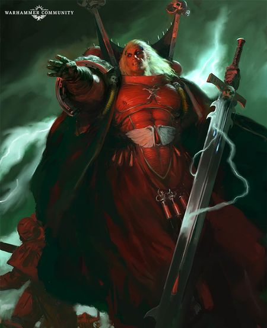
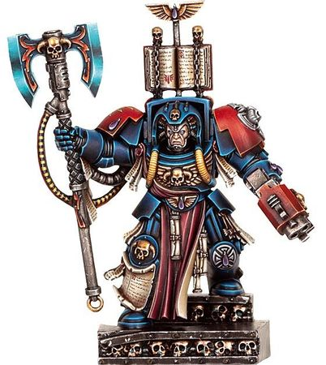
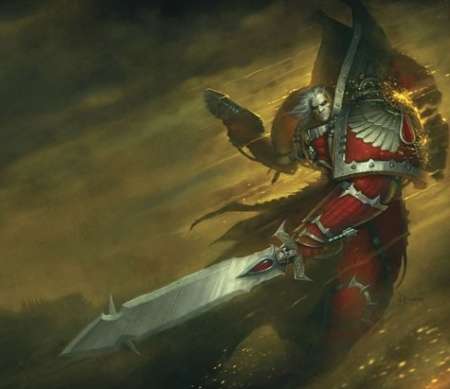
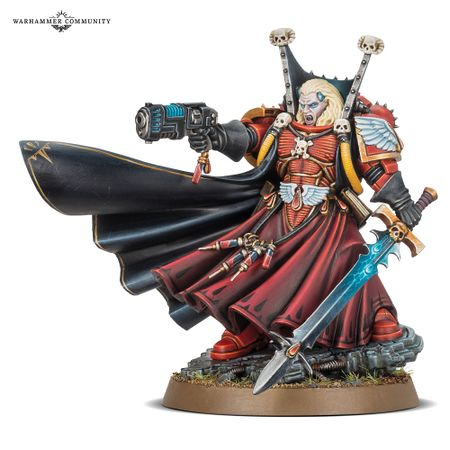

# 0670 墨菲斯顿 Mephiston

精校状态：中文行文已逐段精校，部分术语仍为暂定

分类：人类帝国 / 圣血天使

原文来源：https://www.bilibili.com/opus/1116024522909155337

原作者：帝国神选罐头

原文时间：2025年09月24日 11:05

[返回分类目录](目录.md) · [全书目录](../../目录.md)

<!-- A0670-B0001 -->
**英文原文**

Mephiston is the Chief Librarian of the Blood Angels and the only Blood Angel ever to overcome the Black Rage. Before taking the name of Mephiston and the title of Lord of Death, he was originally known as Brother Calistarius.

<!-- /A0670-B0001 -->

<!-- A0670-B0002 -->

原译文

墨菲斯顿是圣血天使的首席智库，也是唯一一位克服黑怒的圣血天使。在取得墨菲斯托的名字和死亡之主的头衔之前，他最初被称为卡利斯塔留斯兄弟。

**校订译文**

墨菲斯顿是圣血天使首席智库员，也是本篇记载中唯一克服过黑怒的圣血天使。在采用“墨菲斯顿”之名、获称“死亡之主”以前，他名叫卡利斯塔留斯兄弟。

**校注：** Chief Librarian 按官方完整人物名统一首席智库员；唯一克服黑怒者为源文的概括，不据此覆盖其他版本或时期资料。

<!-- /A0670-B0002 -->

<!-- A0670-B0003 图片 -->

<!-- A0670-B0004 -->

原译文

Mephiston, Chief Librarian of the Blood Angels 墨菲斯顿，圣血天使首席智库

**校订译文**

Mephiston, Chief Librarian of the Blood Angels 圣血天使首席智库员墨菲斯顿

<!-- /A0670-B0004 -->

<!-- A0670-B0005 -->
## History 历史

<!-- /A0670-B0005 -->

<!-- A0670-B0006 -->
### Brother Calistarius 卡利斯塔留斯兄弟

<!-- /A0670-B0006 -->

<!-- A0670-B0007 -->
**英文原文**

Originally known as Calistarius, he was a Blood Angel Librarian of some ability and exceptional strength of character.

<!-- /A0670-B0007 -->

<!-- A0670-B0008 -->

原译文

他最初被称为卡利斯塔留斯，是一位具有某种能力和非凡性格力量的圣血天使智库。

**校订译文**

他原名卡利斯塔留斯，是一位颇有才干、意志异常坚定的圣血天使智库员。

<!-- /A0670-B0008 -->

<!-- A0670-B0009 图片 -->

<!-- A0670-B0010 -->

原译文

Calistarius 卡利斯塔留斯

**校订译文**

Calistarius 卡利斯塔留斯

<!-- /A0670-B0010 -->

<!-- A0670-B0011 -->
**英文原文**

While holding the rank of Lexicanium, Librarian Calistarius was present during the boarding of the Space Hulk Sin of Damnation as an honourary member of the Blood Angel's 1st Company.

<!-- /A0670-B0011 -->

<!-- A0670-B0012 -->

原译文

在担任编修员的同时，智库卡利斯塔留斯作为圣血天使第一连队的荣誉成员参加了跳帮诅咒之罪号太空废船。

**校订译文**

在担任编修员期间，卡利斯塔留斯智库员曾作为圣血天使第一连的荣誉成员，参与登上太空废船诅咒之罪号的跳帮行动。

<!-- /A0670-B0012 -->

<!-- A0670-B0013 -->
### Rebirth 重生

<!-- /A0670-B0013 -->

<!-- A0670-B0014 -->
**英文原文**

While fighting as part of the relief force for Hades Hive during the Second War for Armageddon campaign, Calistarius became a victim of the Black Rage. After being inducted into the Death Company, he took part in the assault on an Ecclesiarchy building and was one of many trapped inside when the building collapsed during battle. For seven days, Calistarius lay trapped in the rubble, teetering on the edge of death and madness. Somehow, rather than succumbing to the Red Thirst, he managed to conquer it. By sheer strength of will he was able to suppress and hold in check the feelings of rage and the desire for blood, and in doing so he became something more. On the seventh night he burst free of his rocky tomb, reborn as Mephiston, the Lord of Death.

<!-- /A0670-B0014 -->

<!-- A0670-B0015 -->

原译文

在第二次阿玛吉多顿战争期间，卡利斯塔留斯作为哈迪斯巢都救援部队的一员作战，成为了黑怒的受害者。在加入死亡连后，他参加了对一座教堂建筑的袭击，是战斗中建筑倒塌时被困在里面的许多人之一。卡利斯塔留斯被困在瓦砾中七天，在死亡和疯狂的边缘摇摇欲坠。不知何故，他没有屈服于血渴，而是成功地征服了它。凭借纯粹的意志力，他能够抑制和控制愤怒和嗜血的感觉，并在这样做的过程中变得更有意义。第七天晚上，他从岩石坟墓中挣脱出来，重生为死亡之主墨菲斯顿。

**校订译文**

第二次阿玛吉多顿战争期间，卡利斯塔留斯随援军驰援哈迪斯巢都时陷入黑怒，随后被编入死亡连队。他在进攻一座国教会建筑时遭遇楼体坍塌，与许多人一起被埋在其中。七天里，他困于瓦砾，在死亡与疯狂的边缘挣扎。然而，不知为何，他没有屈服于血渴，反而战胜了它。他仅凭意志便压制住怒火与嗜血冲动，也因此超越了原本的自己。第七夜，他冲破石砾堆成的坟墓，以死亡之主墨菲斯顿的身份获得新生。

**校注：** 源文先称 Black Rage，后称 Red Thirst，保留黑怒/血渴的分别，不擅自合并成同一症状。became something more 指发生超越原状的变化，不是变得更有意义。

<!-- /A0670-B0015 -->

<!-- A0670-B0016 -->
**英文原文**

Mephiston's resurrection did not go unwitnessed. By this time Hades lay once more in the hands of the Imperium, but Orks still roamed the ruins. As Mephiston heaved debris aside from his tomb, the sound of tortured stone drew the attention of one band of Orks. Weaponless, and with his armour shredded and mangled, Mephiston must have seemed easy prey, but nothing could have been further from the truth. His gene-seed, dormant these many long years, had awakened and wrought further changes, granting exceptional strength and vigor. Moving with a speed the Orks could not match, Mephiston unleashed a flurry of attacks, every blow pulverizing flesh and shattering bone. Five Orks died in as many seconds, and a dozen more swiftly followed. The greenskins never stood a chance, but they were as stubborn as Mephiston was determined. It was not until the reborn Angel punched clean through the biggest Ork's chest and tore out his heart that the survivors fled. His ruined armour slick with the blood of his foes, Mephiston began the long walk to Imperial lines.

<!-- /A0670-B0016 -->

<!-- A0670-B0017 -->

原译文

墨菲斯顿的重生并非无人见证。此时，哈迪斯再次落入帝国之手，但欧克仍在废墟中游荡。当墨菲斯顿把碎片从坟墓里扔到一边时，石头被折磨的声音引起了一群欧克的注意。墨菲斯顿没有武器，盔甲被撕碎，看起来很容易成为猎物，但事实远非如此。他的基因种子，沉睡了这么多年，已经觉醒并带来了进一步的变化，赋予了他非凡的力量和活力。墨菲斯顿以欧克无法比拟的速度移动，发动了一连串的攻击，每一次打击都粉碎了肉体，粉碎了骨头。五只欧克在短短几秒钟内死亡，随后又有十几只迅速死亡。绿皮从来没有机会，但他们和墨菲斯顿一样固执。直到重生的天使刺穿了最大的欧克的胸膛，撕裂了他的心脏，幸存者才逃离。墨菲斯顿的盔甲上沾满了敌人的鲜血，他开始了向帝国战线的漫长步行。

**校订译文**

墨菲斯顿重生的一幕并非无人见证。哈迪斯巢都此时已重归帝国，但欧克仍在废墟中游荡。他推开墓穴般的瓦砾堆，石块碎裂摩擦的声响引来一群欧克。赤手空拳、盔甲残破的他看似唾手可得的猎物，事实却截然相反。蛰伏多年的基因种子苏醒，促使身体进一步变化，赋予他非凡的力量与活力。他以欧克无法追上的速度发动疾风骤雨般的攻击，拳拳碎肉断骨。五秒内，五只欧克毙命，随后又迅速倒下十余只。绿皮毫无胜算，却顽固不退；墨菲斯顿同样绝不动摇。直到这位重生的天使一拳贯穿最大那只欧克的胸膛，扯出它的心脏，幸存者才四散逃命。墨菲斯顿任由敌血浸透残破的盔甲，踏上返回帝国阵地的漫长道路。

<!-- /A0670-B0017 -->

<!-- A0670-B0018 图片 -->

<!-- A0670-B0019 -->

原译文

Mephiston, the Lord of Death 墨菲斯顿，死亡之主

**校订译文**

Mephiston, the Lord of Death 墨菲斯顿，死亡之主

<!-- /A0670-B0019 -->

<!-- A0670-B0020 -->
**英文原文**

The changes of his rebirth have affected Mephiston greatly. His powers have grown considerably, but there is also a downside. He has absorbed the Warp personification of the Black Rage, a Black Angel of pure rage and darkness. This creature is a dark fragment of Sanguinius's soul and vents its rage through Mephiston.

<!-- /A0670-B0020 -->

<!-- A0670-B0021 -->

原译文

他重生的变化对墨菲斯顿影响很大。他的力量有了显著增长，但也有不利因素。他吸收了亚空间人格化的黑怒，一个纯粹愤怒和黑暗的黑天使。这个生物是圣吉列斯灵魂的黑暗碎片，通过墨菲斯顿发泄愤怒。

**校订译文**

重生带来的变化深刻影响了墨菲斯顿。他的力量大幅增强，却也付出了代价：他吸纳了黑怒在亚空间中的具现——纯粹由愤怒与黑暗构成的黑色天使。这个存在是圣吉列斯灵魂的黑暗碎片，如今借墨菲斯顿宣泄怒火。

**校注：** 本段概述吸纳黑色天使，后文将该事件放在原铸改造阶段；按源文结构保留，并提示并非第一次废墟重生时所有阶段都已发生。

<!-- /A0670-B0021 -->

<!-- A0670-B0022 -->
### M'kar 姆’卡尔

原题：M'kar 姆'卡

<!-- /A0670-B0022 -->

<!-- A0670-B0023 -->
**英文原文**

In the year 977.M41, the Daemon M'kar trapped Mephiston in the crystal caves of Solon V. He then attempted to lure Mephiston into joining Chaos as a renegade, claiming that Mephiston was already firmly on the path to Daemonhood. Mephiston rejected his captor's claims and throttled the life out of M'kar

<!-- /A0670-B0023 -->

<!-- A0670-B0024 -->

原译文

977.M41，恶魔姆'卡将墨菲斯顿困在索伦五号的水晶洞穴中。然后，他试图引诱墨菲斯顿作为叛徒加入混沌，声称墨菲斯顿已经坚定地走上了通往恶魔宿主的道路。墨菲斯顿拒绝了抓捕他的人的要求，并扼杀了姆'卡的生命

**校订译文**

977.M41，恶魔姆’卡尔将墨菲斯顿困在索伦五号的水晶洞窟中，试图诱使他叛投混沌，声称他早已走上升魔之路。墨菲斯顿拒绝接受这番说辞，并将姆’卡尔活活扼死。

**校注：** Daemonhood 指升魔/成为恶魔，非 Daemonhost 恶魔宿主。姆’卡尔按更早篇完整名重生者姆’卡尔统一。

<!-- /A0670-B0024 -->

<!-- A0670-B0025 -->
### Devastation of Baal 巴尔之毁

原题：Devastation of Baal 巴尔的毁灭

<!-- /A0670-B0025 -->

<!-- A0670-B0026 -->
**英文原文**

Shortly before the Devastation of Baal, Mephiston suffered repeated dreams of the Bloodthirster Ka'Bandha, hated foe of the Blood Angels, appearing to destroy his chapter. Determined to prevent this, Mephiston and his disciples Gaius Rhacelus and Lucius Antros journeyed to the Cruor Mountains on Baal to undertake a ritual to open up a portal to Khorne's realm and kill Ka'Bandha before he could be a threat. The ritual however was ultimately flawed, and a cave-in trapped the Librarians for the rest of the battle.

<!-- /A0670-B0026 -->

<!-- A0670-B0027 -->

原译文

在巴尔被毁灭前不久，墨菲斯顿反复梦到圣血天使的死敌卡班哈，似乎要摧毁他的战团。为了防止这种情况的发生，墨菲斯顿和他的门徒盖乌斯·莱切罗斯和卢修斯·安特罗斯前往巴尔的凝血山脉，进行了一场仪式，打开通往恐虐领域的大门，并在卡班哈成为威胁之前杀死他。然而，这一仪式最终是有缺陷的，一场塌方将智库困在了剩下的战斗中。

**校订译文**

巴尔之毁前不久，墨菲斯顿反复梦见圣血天使的死敌、嗜血狂魔卡’班哈前来毁灭战团。为阻止这一未来，他与弟子盖乌斯·莱切罗斯、卢修斯·安特罗斯前往巴尔凝血山脉，举行仪式，试图打开通往恐虐领域的传送门，在卡’班哈构成威胁前杀死它。然而，仪式最终出了差错，洞窟坍塌，将这些智库员困住，直到战役结束也未能脱身。

<!-- /A0670-B0027 -->

<!-- A0670-B0028 -->
### Dark Imperium 黑暗帝国

<!-- /A0670-B0028 -->

<!-- A0670-B0029 -->
**英文原文**

At some point following the Devastation of Baal, Mephiston was converted into a Primaris Space Marine. During the procedure Mephiston nearly died, but found himself in the Warp and came before the Sanguinor and Black Angel. An apparent avatar of Sanguinius appeared and told Mephiston that he is doomed to become the Black Angel, but if he accepted the entity into his body now it could act as a prison and weaken the Black Rage within the chapter for a time. However this would come at the cost of becoming a pariah and damning his soul. The Chief Librarian apparently accepted, displaying dark new abilities and stating he both is and isn't Mephiston. Against the wishes of Astorath, Dante decided to not execute the reborn Mephiston. Now a Primaris Marine, during the Psychic Awakening Mephiston used his psychic abilities to aid the Blood Angels during the Angel's Halo Campaign.

<!-- /A0670-B0029 -->

<!-- A0670-B0030 -->

原译文

在巴尔的毁灭后的某个时刻，墨菲斯顿被改造成了一名原铸星际战士。在手术过程中，墨菲斯顿差点死了，但他发现自己身处亚空间之中，来到了圣吉列诺和黑天使面前。圣吉列斯的一个明显化身出现了，并告诉墨菲斯顿他注定要成为黑天使，但如果他现在接受这个实体进入他的身体，他可能会在一段时间内充当监狱，削弱战团内的黑怒。然而，这将以成为被遗弃者和诅咒他的灵魂为代价。首席智库显然接受了，展示了黑暗的新能力，并表示他既是墨菲斯顿，也不是墨菲斯顿。违背阿斯托拉斯的意愿，但丁决定不处决重生的墨菲斯顿。现在是一名原铸战士，在灵能觉醒期间，墨菲斯顿在天使光环战役中利用自己的灵能能力帮助了圣血天使。

**校订译文**

巴尔之毁后，墨菲斯顿接受了原铸改造。手术中，他险些丧命，意识却来到亚空间，出现在圣血者与黑色天使面前。一位疑似圣吉列斯化身的存在告诉他，他注定会成为黑色天使；但若现在主动将其纳入体内，就能以自身为牢笼，暂时削弱战团中的黑怒。代价则是遭到排斥，并使自己的灵魂蒙受诅咒。首席智库员似乎接受了这一安排，显露出黑暗的新能力，声称自己既是墨菲斯顿，又不是墨菲斯顿。但丁没有采纳阿斯托拉斯的意见，决定不处决重生后的他。灵能觉醒期间，已经成为原铸星际战士的墨菲斯顿运用灵能，在天使光环战役中支援圣血天使。

**校注：** apparent avatar 为疑似化身；pariah 在此为遭排斥者的普通义，不认定墨菲斯顿变成具有反灵能性质的无魂者。

<!-- /A0670-B0030 -->

<!-- A0670-B0031 -->
**英文原文**

Mephiston has become embroiled in an effort to foil the plans of Magnus the Red and the Daemon Prince Zadkiel. Foreseeing disaster should their plans come to pass, he managed to infiltrate the Planet of the Sorcerers and foil the attempts of Zadkiel to summon nine Silver Towers to Terra.

<!-- /A0670-B0031 -->

<!-- A0670-B0032 -->

原译文

墨菲斯顿卷入了挫败赤红之马格努斯和恶魔王子扎德基尔计划的行动中。他预见到如果他们的计划成真，将会发生灾难，他设法渗透到巫师行星，挫败了扎德基尔召唤九座银塔到泰拉的企图。

**校订译文**

墨菲斯顿后来投身于挫败红魔马格努斯与恶魔王子扎德基尔阴谋的行动。他预见这些计划若得逞，将酿成灾难，于是潜入巫师行星，阻止扎德基尔将九座银塔召往泰拉。

<!-- /A0670-B0032 -->

<!-- A0670-B0033 图片 -->

<!-- A0670-B0034 -->

原译文

Mephiston 墨菲斯顿

**校订译文**

Mephiston 墨菲斯顿

<!-- /A0670-B0034 -->

<!-- A0670-B0035 -->
## Wargear and Abilities 武器装备与能力

原题：Wargear and Abilities 战备与能力

<!-- /A0670-B0035 -->

<!-- A0670-B0036 -->
**英文原文**

Mephiston is armed with the Force sword Vitarus and a Plasma pistol. He wears Artificer armor which incorporates his ornate Psychic hood. Overcoming the Red Thirst enabled Mephiston to release his full psychic potential and he is able to call on any number of psychic powers related to the Blood Angels.

<!-- /A0670-B0036 -->

<!-- A0670-B0037 -->

原译文

墨菲斯顿手持灵能剑维塔鲁斯和等离子手枪。他穿着精工盔甲，上面戴着华丽的灵能头箍。克服血渴使墨菲斯顿能够释放出他全部的灵能潜力，他能够召唤与圣血天使相关的任何灵能力量。

**校订译文**

墨菲斯顿持有灵能剑维塔鲁斯与一把等离子手枪，身穿装有华丽灵能头箍的精工盔甲。克服血渴后，他得以释放全部灵能潜力，运用圣血天使的多种灵能。

<!-- /A0670-B0037 -->

<!-- A0670-B0038 -->
**英文原文**

Since his rebirth, Mephiston's powers have grown significantly. He is capable of projecting his mind into even psychically attuned Eldar, driving them to rage and madness. He can split his soul into multiple dopplegangers, allowing him to do multiple feats at once. He is capable of stopping and even reversing time, but this power is alluring and potentially dangerous, as he still ages within the paused periods and could potentially waste his entire life while the universe remains frozen in place around him.

<!-- /A0670-B0038 -->

<!-- A0670-B0039 -->

原译文

自从墨菲斯顿重生以来，他的力量有了显著的增长。他甚至能够将自己的思想投射到熟悉灵能的灵族身上，驱使他们愤怒和疯狂。他可以把自己的灵魂分成多个替身，让他一次完成多项壮举。他有能力停止甚至逆转时间，但这种力量是诱人的，也有潜在的危险，因为他仍然在暂停期内衰老，在宇宙仍然冻结在他周围的时候，他可能会浪费一生。

**校订译文**

重生后，墨菲斯顿的力量显著增强。他能将意识投射进灵族的心灵，哪怕对方天生具有灵能亲和力，也会被逼入狂怒与疯狂。他还可以将灵魂分成多个化身，同时完成数项任务。他甚至能暂停乃至逆转时间。但这项能力虽诱人，也暗藏危险：外界时间停止时，他自身仍会衰老，可能在周遭宇宙完全凝滞的情况下耗尽一生。

<!-- /A0670-B0039 -->

<!-- A0670-B0040 -->
## Trivia 琐事

<!-- /A0670-B0040 -->

<!-- A0670-B0041 -->
**英文原文**

The name Mephiston might have been inspired by Mephisto (short for Mephistopheles), a demon featured in German folklore.

<!-- /A0670-B0041 -->

<!-- A0670-B0042 -->

原译文

墨菲斯顿这个名字可能是受到德国民间传说中的恶魔梅菲斯托（梅菲斯托菲勒斯的缩写）的启发。

**校订译文**

墨菲斯顿这个名字可能是受到德国民间传说中的恶魔梅菲斯托（梅菲斯托菲勒斯的缩写）的启发。

<!-- /A0670-B0042 -->

本篇核心术语与暂定项

以下列出本篇出现的英文原形及核心术语表用词。同形词可能指不同对象，具体词义以本篇正文和校注为准；单复数、别名和仅见于图注的名称可能尚未列入。完整候选见[术语表](../../术语表/双语术语候选.csv)。

| 英文 | 采用中文 | 状态 |
| --- | --- | --- |
| Blood Angels | 圣血天使 | 官方已核对 |
| Eldar | 灵族 | 暂定·语境区分 |
| Orks | 欧克蛮人 | 官方已核对 |
| Librarian | 智库员 | 官方已核对 |
| Warp | 亚空间 | 官方已核对 |
| Imperium | 帝国 | 暂定·简称 |
| Psychic Hood | 灵能兜帽 | 暂定·官方待核 |
| Khorne | 恐虐 | 官方已核对 |
| Ecclesiarchy | 国教会 | 暂定 |
| Daemon Prince | 恶魔亲王 | 官方已核对 |
| Terra | 泰拉 | 暂定·官方待核 |
| Magnus the Red | 红魔马格努斯 | 官方已核对 |
| Devastation of Baal | 巴尔之毁 | 暂定·官方待核 |
| Armageddon | 阿玛吉多顿 | 暂定·官方待核 |
| Lucius | 卢修斯 | 暂定·官方待核 |
| Baal | 巴尔 | 暂定·官方待核 |
| Pariah | 贱民 | 暂定·官方待核 |
| Chief Librarian | 首席智库员 | 暂定·官方待核 |
| Lexicanium | 编修员 | 暂定·官方待核 |
| Space Marine | 星际战士 | 暂定·官方待核 |
| Chapter | 战团 | 暂定·官方待核 |
| Brother | 修士 | 暂定·官方待核 |
| Primaris Space Marine | 原铸星际战士 | 暂定·官方待核 |
| Dante | 但丁 | 暂定·官方待核 |
| Mephiston | 墨菲斯顿 | 暂定·官方待核 |
| Astorath | 阿斯托拉斯 | 暂定·官方待核 |
| The Angel | 天使 | 暂定·官方待核 |
| Reborn | 复生者（战团）／重生者（死神军自称） | 语境定译·官方待核 |
| Gene-seed | 基因种子 | 暂定·官方待核 |
| Artificer | 技工 | 暂定·官方待核 |
| Zadkiel | 扎德基尔 | 暂定·官方待核 |
| Powers | 能天使 | 暂定·官方待核 |
| The Sanguinor | 圣血者 | 官方已核 |
| Bloodthirster | 嗜血狂魔 | 官方已核对 |
| Wrought | 锻造秘库 | 暂定·官方待核 |
| Force Sword | 灵能剑 | 暂定·官方待核 |
| The Blood | 鲜血 | 暂定·官方待核 |
| Calistarius | 卡利斯塔留斯 | 暂定·官方待核 |
| Sin of Damnation | 诅咒之罪号 | 暂定·官方待核 |
| Gaius Rhacelus | 盖乌斯·莱切罗斯 | 暂定·官方待核 |
| Lucius Antros | 卢修斯·安特罗斯 | 暂定·官方待核 |
| Vitarus | 维塔鲁斯 | 暂定·官方待核 |
| Angel's Halo | 天使光环 | 暂定·官方待核 |
| Plasma pistol | 等离子手枪 | 官方已核对 |

