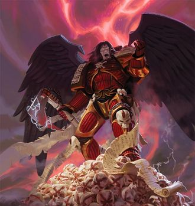
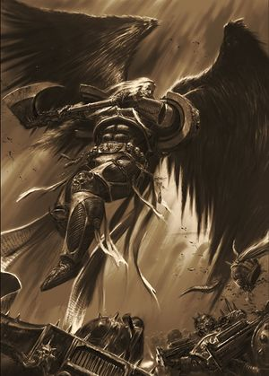
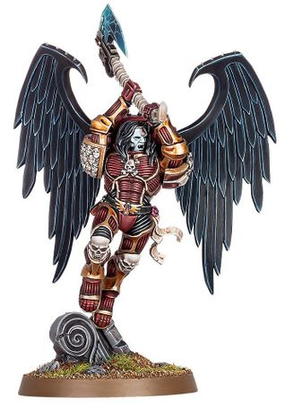

# 0671 阿斯托拉斯 Astorath

精校状态：中文行文已逐段精校，部分术语仍为暂定

分类：人类帝国 / 圣血天使

原文来源：https://www.bilibili.com/opus/1116758335285100553

原作者：帝国神选罐头

原文时间：2025年09月26日 10:32

[返回分类目录](目录.md) · [全书目录](../../目录.md)

<!-- A0671-B0001 -->
**英文原文**

Treat them with honour, my Brothers. Not because they will bring us victory this day, but because their fate will one day be ours.

<!-- /A0671-B0001 -->

<!-- A0671-B0002 -->

原译文

尊敬地对待他们，我的兄弟们。不是因为他们今天会给我们带来胜利，而是因为他们的命运总有一天会属于我们。

**校订译文**

“兄弟们，请以荣誉待他们。因为我们终有一天也会面对他们的命运，而不只是因为他们今日将为我们带来胜利。”

<!-- /A0671-B0002 -->

<!-- A0671-B0003 -->
**英文原文**

Astorath, known as Astorath the Grim, is the High Chaplain of the Blood Angels.

<!-- /A0671-B0003 -->

<!-- A0671-B0004 -->

原译文

阿斯托拉斯，被称为冷酷者阿斯托拉斯，是圣血天使的至高牧师。

**校订译文**

阿斯托拉斯，号称“冷酷者阿斯托拉斯”，是圣血天使的至高教士。

<!-- /A0671-B0004 -->

<!-- A0671-B0005 图片 -->

<!-- A0671-B0006 -->

原译文

Astorath the Grim 冷酷者阿斯托拉斯

**校订译文**

Astorath the Grim 冷酷者阿斯托拉斯

<!-- /A0671-B0006 -->

<!-- A0671-B0007 -->
## History 历史

<!-- /A0671-B0007 -->

<!-- A0671-B0008 -->
**英文原文**

Astorath is a figure both revered and loathed within the ranks of the Chapter due to the duty he performs: as the Redeemer of the Lost, he must seek out those battle-brothers completely claimed by the Black Rage, and end their suffering with a blow from his axe. As a result no battle-brother can feel entirely comfortable in his presence, as one day it might be their neck at the receiving end of his blade.

<!-- /A0671-B0008 -->

<!-- A0671-B0009 -->

原译文

阿斯托拉斯是一个在战团中既受人尊敬又受人厌恶的人物，因为他履行了职责：作为迷失者的救赎者，他必须找到那些被黑怒完全夺走的战斗兄弟，并用斧头结束他们的痛苦。因此，没有一个战斗兄弟能在他面前感到完全舒服，因为有一天，他们的脖子可能会成为他刀刃之下之物。

**校订译文**

阿斯托拉斯在战团内既受敬畏，也招人厌惧，这源于他肩负的职责：作为“迷失者的救赎者”，他必须找出完全被黑怒吞噬的战斗兄弟，以斧头结束他们的痛苦。因此，没有战士能够在他面前完全自在，因为终有一天，那柄利刃也可能落在自己颈上。

<!-- /A0671-B0009 -->

<!-- A0671-B0010 -->
**英文原文**

While his duties ultimately lie with his Chapter, Astorath also dispenses the final mercy of oblivion to those lost to the Rage in all Blood Angel Successor Chapters. As such he is always on the move, his grim duty bringing him to wherever the Sons of Sanguinius battle.

<!-- /A0671-B0010 -->

<!-- A0671-B0011 -->

原译文

虽然他的职责最终在于他的战团，但阿斯托拉斯也将遗忘的最后怜悯分配给了所有圣血天使子战团中因黑怒而丧生的人。因此，他总是在行动，他的艰巨任务把他带到了圣吉列斯之子战斗的任何地方。

**校订译文**

阿斯托拉斯的首要职责虽在本战团，却也会为所有圣血天使子战团中迷失于黑怒的人赐予最终的慈悲——以死亡结束痛苦。因此，他总在奔走，沉重的使命将他带往圣吉列斯之子作战的每一个地方。

**校注：** lost to the Rage 指迷失于黑怒的活着的战士，不是因黑怒丧生者；最后慈悲指以死亡终结痛苦。

<!-- /A0671-B0011 -->

<!-- A0671-B0012 图片 -->

<!-- A0671-B0013 -->

原译文

Astorath the Grim 冷酷者阿斯托拉斯

**校订译文**

Astorath the Grim 冷酷者阿斯托拉斯

<!-- /A0671-B0013 -->

<!-- A0671-B0014 -->
**英文原文**

A less-keen observer might mistake Astorath's presence on the battlefield as actually exacerbating the Black Rage in his brothers, but the truth is actually quite the opposite; Astorath can sense the onset of the Black Rage in brother Marines before any visible signs manifest, and as such appears on those forlorn battlefields where he fights to lead these doomed individuals in one last glorious charge before the Flaw completely overtakes their sanity.

<!-- /A0671-B0014 -->

<!-- A0671-B0015 -->

原译文

一个不那么敏锐的观察者可能会误以为阿斯托拉斯在战场上的存在实际上加剧了他兄弟们的黑怒，但事实恰恰相反；阿斯托拉斯可以在任何可见的迹象出现之前感觉到兄弟战士中黑怒的开始，因此出现在那些荒凉的战场上，他在那里战斗，在缺陷完全超过他们的理智之前，带领这些注定要毁灭的人进行最后一次光荣的冲锋。

**校订译文**

不够敏锐的人可能误以为，阿斯托拉斯的到来使同袍的黑怒加剧。事实却恰好相反：他能在任何外在征兆出现前，感知战士即将陷入黑怒。因此，他才会出现在那些命途多舛的战场上，趁缺陷尚未彻底吞没他们的理智，率领这些注定毁灭的战士发动最后一次光荣冲锋。

<!-- /A0671-B0015 -->

<!-- A0671-B0016 -->
**英文原文**

Upon the introduction of Primaris Space Marines into the Chapter following the Devastation of Baal, Astorath was always skeptical that these new recruits would be immune to the Red Thirst and Black Rage despite the initial rumors. Sure enough, the Chaplain was proven correct. It soon became time for Astorath to grant the gift of mercy to fallen Primaris intended for the Red Wings Chapter.

<!-- /A0671-B0016 -->

<!-- A0671-B0017 -->

原译文

在巴尔的毁灭后，原铸星际战士被引入战团，阿斯托拉斯一直怀疑这些新兵能否免受血渴和黑怒的影响，尽管最初有传言。果然，牧师被证明是正确的。很快，阿斯托拉斯就到了向红翼战团倒下的原铸授予慈悲礼物的时候了。

**校订译文**

巴尔之毁后，原铸星际战士加入战团。尽管起初传言他们不受血渴与黑怒影响，阿斯托拉斯对此始终心存疑虑。事实很快证明他是对的：一些原本将被派往红翼战团的原铸战士陷入黑怒，最终也需要由他赐予死亡的慈悲。

**校注：** intended for the Red Wings 指原计划分配给红翼战团，不能直接认定已经编入该战团。

<!-- /A0671-B0017 -->

<!-- A0671-B0018 图片 -->

<!-- A0671-B0019 -->

原译文

Astorath 阿斯托拉斯

**校订译文**

Astorath 阿斯托拉斯

<!-- /A0671-B0019 -->

<!-- A0671-B0020 -->
## Wargear 武器装备

原题：Wargear 战备

<!-- /A0671-B0020 -->

<!-- A0671-B0021 -->
**英文原文**

Astorath is armed with the Executioner's Axe, a two-handed Power Axe so keen it could slice through power fields, and is clad in crimson-coloured Artificer Armour equipped with a black-winged Jump Pack. As a Chaplain he is also equipped with a Rosarius, as well as frag and krak grenades.

<!-- /A0671-B0021 -->

<!-- A0671-B0022 -->

原译文

阿斯托拉斯装备了刽子手之斧，这是一把双手动力斧，非常锋利，可以穿过能量场，他穿着深红色的精工盔甲，装备了黑翼跳跃背包。作为一名牧师，他还配备了玫瑰念珠，以及破片和穿甲手榴弹。

**校订译文**

阿斯托拉斯持有刽子手之斧。这柄双手动力斧锋利无比，甚至能劈开动力场。他身披深红色精工盔甲，配备黑翼式跳跃背包。作为教士，他还携带玫瑰念珠，以及破片和穿甲手榴弹。

<!-- /A0671-B0022 -->

本篇核心术语与暂定项

以下列出本篇出现的英文原形及核心术语表用词。同形词可能指不同对象，具体词义以本篇正文和校注为准；单复数、别名和仅见于图注的名称可能尚未列入。完整候选见[术语表](../../术语表/双语术语候选.csv)。

| 英文 | 采用中文 | 状态 |
| --- | --- | --- |
| Space Marines | 星际战士 | 官方已核对 |
| Blood Angels | 圣血天使 | 官方已核对 |
| Devastation of Baal | 巴尔之毁 | 暂定·官方待核 |
| Redeemer | 救赎者 | 暂定·官方待核 |
| Baal | 巴尔 | 暂定·官方待核 |
| High Chaplain | 至高教士 | 暂定·官方待核 |
| Rosarius | 玫瑰念珠 | 暂定·官方待核 |
| Chaplain | 教士 | 官方已核对 |
| Krak Grenades | 穿甲手榴弹 | 暂定·官方待核 |
| Chapter | 战团 | 暂定·官方待核 |
| Brother | 修士 | 暂定·官方待核 |
| Battle-Brother | 战斗兄弟 | 暂定·官方待核 |
| Astorath | 阿斯托拉斯 | 暂定·官方待核 |
| Red Wings | 红翼 | 暂定·官方待核 |
| Sons of Sanguinius | 圣吉列斯之子 | 暂定·官方待核 |
| Artificer | 技工 | 暂定·官方待核 |
| Final Mercy | 最终仁慈号 | 暂定·官方待核 |
| Mercy | 仁慈 | 暂定·官方待核 |
| The Blood | 鲜血 | 暂定·官方待核 |
| Redeemer of the Lost | 迷失者的救赎者 | 暂定·官方待核 |
| Executioner's Axe | 刽子手之斧 | 暂定·官方待核 |
| Jump Pack | 跳跃背包 | 暂定·官方待核 |
| Winged Jump Pack | 飞翼跳跃背包 | 暂定·官方待核 |
| Artificer Armour | 精工盔甲 | 暂定·官方待核 |

