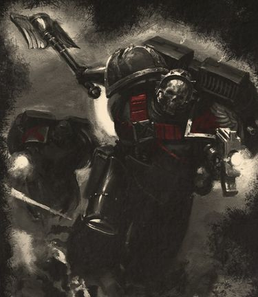
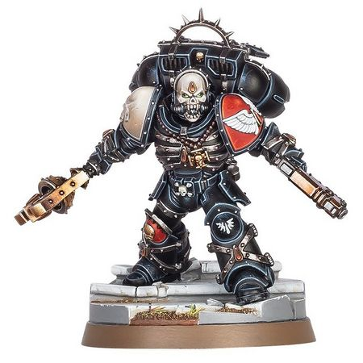

# 0672 雷马特斯 Lemartes

精校状态：中文行文已逐段精校，部分术语仍为暂定

分类：人类帝国 / 圣血天使

原文来源：https://www.bilibili.com/opus/1117511118506426372

原作者：帝国神选罐头

原文时间：2025年09月28日 11:13

[返回分类目录](目录.md) · [全书目录](../../目录.md)

原篇名：雷玛斯特 Lemartes

<!-- A0672-B0001 -->
**英文原文**

Lemartes is a particularly strong-willed Chaplain of the Blood Angels, the only Battle-brother to date who has managed to contain the Black Rage. He now serves as Guardian of the Lost, the Warden of the Angels' Death Company.

<!-- /A0672-B0001 -->

<!-- A0672-B0002 -->

原译文

雷玛特斯是一位意志坚强的圣血天使牧师，是迄今为止唯一一位成功遏制黑怒的战斗兄弟。他现在担任迷失者的守护者，天使的死亡连的看守者。

**校订译文**

雷马特斯是一名意志极为坚强的圣血天使教士。据本篇记载，他是迄今唯一在受到黑怒影响的同时，仍能将其控制住的战斗兄弟。他现任“迷失者的守护者”，负责统领圣血天使的死亡连队。

**校注：** contain 是仍受影响但控制症状，区别670篇 overcome 克服；两处唯一性表述按各自源文范围保留。Lemartes 按GW09/GW10第11页官方名雷马特斯。

<!-- /A0672-B0002 -->

<!-- A0672-B0003 图片 -->

<!-- A0672-B0004 -->

原译文

Chaplain Lemartes 牧师雷玛斯特

**校订译文**

Chaplain Lemartes 雷马特斯教士

<!-- /A0672-B0004 -->

<!-- A0672-B0005 -->
## History 历史

<!-- /A0672-B0005 -->

<!-- A0672-B0006 -->
**英文原文**

Lemartes succumbed to the Black Rage while the Blood Angels were preparing to deploy against orks on Hadriath XI. Like all members of a Death Company, his only options were to fall in battle, or, in the unlikely event he survived, to be executed by High Chaplain Astorath. Yet after the battle, when he was taken to the company's field Apothecarion, Lemartes insisted that he was in control of himself. Astorath hesitated, because Lemartes was clearly in the grip of the Rage, yet he was still coherent and able to restrain himself from attacking his own brothers. Astorath made the incredible decision to send Lemartes in stasis back to Baal, to be thoroughly examined by the Sanguinary Priests.

<!-- /A0672-B0006 -->

<!-- A0672-B0007 -->

原译文

当圣血天使准备部署对抗哈德里亚斯十一号的欧克时，雷玛特斯屈服于黑怒。像死亡连的所有成员一样，他唯一的选择就是在战斗中倒下，或者，在不太可能的情况下，他幸存下来，被至高牧师阿斯托拉斯处决。然而，在战斗结束后，当他被带到连队的战地药剂部时，雷玛特斯坚称他能控制自己。阿斯托拉斯犹豫了一下，因为雷玛特斯显然被愤怒所控制，但他仍然保持条理，能够克制自己攻击自己的兄弟。阿斯托拉斯做出了一个令人难以置信的决定，将处于静滞状态的雷玛特斯送回巴尔，接受圣血祭司的彻底检查。

**校订译文**

圣血天使准备前往哈德里亚斯十一号对抗欧克时，雷马特斯陷入黑怒。与所有死亡连队成员一样，他的结局原本只有两种：在战场上阵亡，或在极少见的幸存情况下，由至高教士阿斯托拉斯处决。然而，战后被送入连队战地医疗所时，雷马特斯坚持说自己仍能保持自制。阿斯托拉斯犹豫了：雷马特斯明显受到黑怒支配，却仍思路清晰，能够克制攻击同袍的冲动。于是，阿斯托拉斯作出惊人的决定，将他封入静滞状态送回巴尔，交由圣血祭司彻底检查。

<!-- /A0672-B0007 -->

<!-- A0672-B0008 -->
**英文原文**

Every test the Sanguinary Priests ran showed the same startling conclusion: Lemartes had been struck by the Rage, yet his willpower was keeping it in check, a thing unheard of in the entire history of the chapter. They warned Astorath that it would be impossible for Lemartes to stay in control forever, so Astorath offered him his unique role as leader of the Death Company.

<!-- /A0672-B0008 -->

<!-- A0672-B0009 -->

原译文

圣血祭司们进行的每一次测试都显示了同样惊人的结论：雷玛特斯被愤怒所打击，但他的意志力正在控制它，这在整个战团的历史上是闻所未闻的。他们警告阿斯托拉斯，雷玛特斯不可能永远保持控制，所以阿斯托拉斯给了他作为死亡连领导者的独特角色。

**校订译文**

圣血祭司的每项检查都得出同样惊人的结果：雷马特斯确实陷入了黑怒，却正凭意志将其压制。这在战团历史上前所未闻。他们警告阿斯托拉斯，雷马特斯不可能永远保持控制。因此，阿斯托拉斯赋予他一个独特的职责——率领死亡连队。

<!-- /A0672-B0009 -->

<!-- A0672-B0010 -->
**英文原文**

Under his guidance, those Blood Angels lost to the Rage fight like heroes of legend, winning some measure of redemption before they fall. Between engagements, Lemartes is returned to stasis to protect his battle-brothers from the Rage. Some whisper that Lemartes's eventual fall to the Rage is inevitable, while to others he is a sign of hope that perhaps other Blood Angels can also master their curse.

<!-- /A0672-B0010 -->

<!-- A0672-B0011 -->

原译文

在他的指导下，那些圣血天使像传说中的英雄一样在狂暴的战斗中迷失，在倒下之前赢得了一定程度的救赎。在交战间隙，雷玛特斯回到静滞状态，以保护他的战斗兄弟免受黑怒。有人低声说，雷玛特斯最终落入黑怒是不可避免的，而对其他人来说，他是希望的象征，也许其他圣血天使也能掌握他们的诅咒。

**校订译文**

在他的指挥下，迷失于黑怒的圣血天使如传说中的英雄般奋战，在死亡之前赢得些许救赎。战斗间隙，雷马特斯会重新进入静滞状态，以免自己的黑怒伤及同袍。有人私下认为，他最终彻底失控不可避免；另一些人则将他视为希望，认为其他圣血天使或许也能控制自身的诅咒。

**校注：** 静滞的目的是避免雷马特斯失控伤及同袍，不是使其他战士免疫黑怒。

<!-- /A0672-B0011 -->

<!-- A0672-B0012 -->
## Wargear 武器装备

原题：Wargear 战备

<!-- /A0672-B0012 -->

<!-- A0672-B0013 -->
**英文原文**

Like all Chaplains, Lemartes wears all-black power armour with a skull-visaged Death Mask and a Rosarius. He also uses a Jump Pack.

<!-- /A0672-B0013 -->

<!-- A0672-B0014 -->

原译文

像所有牧师一样，雷玛特斯穿着全黑的动力盔甲，戴着骷髅脸的死亡面具和玫瑰念珠。他还使用了跳跃背包。

**校订译文**

与其他教士一样，雷马特斯身穿全黑动力甲，佩戴骷髅面容的死亡面具与玫瑰念珠。他还使用跳跃背包。

<!-- /A0672-B0014 -->

<!-- A0672-B0015 图片 -->

<!-- A0672-B0016 -->

原译文

Chaplain Lemartes Chaplain Lemartes 牧师雷玛斯特

**校订译文**

Chaplain Lemartes Chaplain Lemartes 雷马特斯教士

**校注：** 源文图注重复了两遍英文人物名，按要求保留原英文，中文统一。

<!-- /A0672-B0016 -->

<!-- A0672-B0017 -->
**英文原文**

His primary weapon is the Blood Crozius, an ancient Crozius Arcanum said to have been carried by the Blood Angels' very first High Chaplain, and gifted to Lemartes by Astorath.

<!-- /A0672-B0017 -->

<!-- A0672-B0018 -->

原译文

他的主要武器是鲜血权杖，一件古老的牧师权杖，据说是由圣血天使的第一位至高牧师携带的，由阿斯托拉斯赠送给雷玛特斯。

**校订译文**

他的主要武器是鲜血权杖，一柄古老的教士权杖。据说，圣血天使的首位至高教士曾使用过它，后来由阿斯托拉斯赐予雷马特斯。

<!-- /A0672-B0018 -->

本篇核心术语与暂定项

以下列出本篇出现的英文原形及核心术语表用词。同形词可能指不同对象，具体词义以本篇正文和校注为准；单复数、别名和仅见于图注的名称可能尚未列入。完整候选见[术语表](../../术语表/双语术语候选.csv)。

| 英文 | 采用中文 | 状态 |
| --- | --- | --- |
| Blood Angels | 圣血天使 | 官方已核对 |
| Orks | 欧克蛮人 | 官方已核对 |
| Sanguinary | 圣血学派 | 暂定·学派语境 |
| History | 历史 | 编辑用语已统一 |
| Baal | 巴尔 | 暂定·官方待核 |
| Master | 导师（审判庭职衔）／舰务官（舰员职务） | 语境定译·官方待核 |
| High Chaplain | 至高教士 | 暂定·官方待核 |
| Rosarius | 玫瑰念珠 | 暂定·官方待核 |
| Crozius Arcanum | 教士权杖 | 暂定·官方待核 |
| Apothecarion | 药剂部 | 暂定·官方待核 |
| Chaplain | 教士 | 官方已核对 |
| Lemartes | 雷马特斯 | 官方已核对 |
| Ancient | 旗手 | 官方已核对 |
| Power Armour | 动力盔甲 | 暂定·官方待核 |
| Chapter | 战团 | 暂定·官方待核 |
| Brother | 修士 | 暂定·官方待核 |
| Battle-Brother | 战斗兄弟 | 暂定·官方待核 |
| Astorath | 阿斯托拉斯 | 暂定·官方待核 |
| Chaplains | 教士 | 暂定·官方待核 |
| The Blood | 鲜血 | 暂定·官方待核 |
| Guardian of the Lost | 迷失者的守护者 | 暂定·官方待核 |
| Blood Crozius | 鲜血权杖 | 暂定·官方待核 |
| Jump Pack | 跳跃背包 | 暂定·官方待核 |

