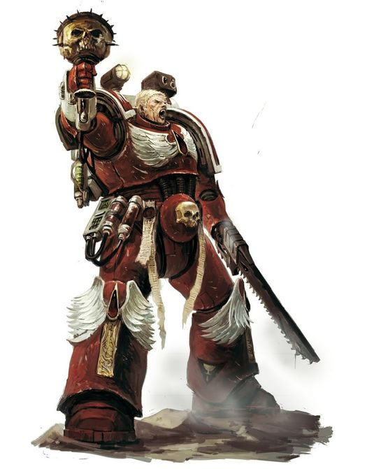
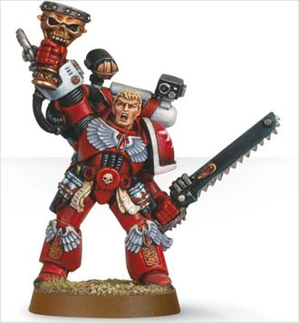

# 0673 科布罗 Corbulo

精校状态：中文行文已逐段精校，部分术语仍为暂定

分类：人类帝国 / 圣血天使

原文来源：https://www.bilibili.com/opus/1116501066721001513

原作者：帝国神选罐头

原文时间：2025年09月25日 17:54

[返回分类目录](目录.md) · [全书目录](../../目录.md)

<!-- A0673-B0001 -->
**英文原文**

Corbulo is the Sanguinary High Priest of the Blood Angels.

<!-- /A0673-B0001 -->

<!-- A0673-B0002 -->

原译文

科布罗是圣血天使的至高圣血祭司。

**校订译文**

科布罗是圣血天使的至高圣血祭司。

<!-- /A0673-B0002 -->

<!-- A0673-B0003 图片 -->

<!-- A0673-B0004 -->

原译文

Corbulo 科布罗

**校订译文**

Corbulo 科布罗

<!-- /A0673-B0004 -->

<!-- A0673-B0005 -->
## Biography 传记

<!-- /A0673-B0005 -->

<!-- A0673-B0006 -->
**英文原文**

It is his duty to guard the Red Grail, the holy cup which was used to preserve the blood of Sanguinius after he was slain. It is from this cup that the assembled Sanguinary Priests drink as part of the ritual of initiating a new Sanguinary Priest.

<!-- /A0673-B0006 -->

<!-- A0673-B0007 -->

原译文

保护鲜血圣杯是他的职责，鲜血圣杯是圣吉列斯被杀后用来保存血液的圣杯。正是从这个杯子里，聚集在一起的圣血祭司喝了一杯，作为接纳新圣血祭司仪式的一部分。

**校订译文**

科布罗负责守护鲜血圣杯。这件圣物用于保存圣吉列斯死后留下的血液。在接纳新任圣血祭司的仪式上，集会的祭司们会共饮杯中之血。

<!-- /A0673-B0007 -->

<!-- A0673-B0008 -->
**英文原文**

Corbulo resembles the Primarch of the Blood Angels, Sanguinius both physically and spiritually. He has become determined to cure the Blood Angels and their successors of the Red Thirst, a quest that has taken him across the galaxy in search of wonders from the Dark Age of Technology. In addition, he shares Sanginius's foresight and has limited abilities in Divination. However while this gift is sometimes used to the Chapter's advantage in battle, he is most focused on researching a cure to his chapter's affliction. Nonetheless, his skills have been put to good use by the Chapter in other fields. The reason the Blood Angels arrived so quickly to counter the Second War for Armageddon by the Ork Ghazghkull was due to his divination. Similarly, without his guidance the Blood Angels fleet would not have known the location of M'kar the Reborn's Daemonship as it entered the Baal system, perhaps saving the planet from destruction. It is also said that Corbulo was able to forewarn the chapter of the coming Tyranid assault on Baal.

<!-- /A0673-B0008 -->

<!-- A0673-B0009 -->

原译文

科布罗在身体和精神上都像圣血天使的原体圣吉列斯。他已下定决心治愈圣血天使及其子战团的血渴，这项任务让他穿越银河系，寻找黑暗科技时代的奇迹。此外，他与圣吉列斯一样有预知力量，在占卜方面有有限能力。然而，虽然这份礼物有时会在战斗中为战团带来优势，但他最专注的是研究治愈战团痛苦的方法。尽管如此，他的技能在其他领域得到了战团的充分利用。圣血天使之所以如此迅速地到达，以对抗欧克碎骨者的第二次阿玛吉多顿战争，是因为他的占卜。同样，如果没有他的引导，圣血天使舰队在进入巴尔星系时就不会知道重生者姆'卡的恶魔飞船的位置，这或许可以拯救行星免于毁灭。还有人说，科布罗能够提前警告即将到来的泰伦对巴尔的袭击。

**校订译文**

无论外貌还是精神气质，科布罗都与圣血天使原体圣吉列斯十分相似。他决心治愈困扰圣血天使及其子战团的血渴，为此走遍银河，寻找黑暗科技时代留下的奇迹。他还继承了圣吉列斯的预见天赋，具备有限的占卜能力。这种天赋有时能在战斗中帮助战团，但他最关心的仍是寻找治愈之法。即便如此，战团也在其他领域充分运用了他的能力。圣血天使之所以能迅速赶赴第二次阿玛吉多顿战争、迎战碎骨者的欧克大军，便得益于他的预言。同样，重生者姆’卡尔的恶魔战舰进入巴尔星系时，若无科布罗指引，圣血天使舰队就无法得知其位置；这或许使巴尔免于毁灭。据说，他还提前预警了泰伦对巴尔的入侵。

**校注：** 进入巴尔星系的是姆’卡尔的恶魔战舰，原译错误地把进入动作接到圣血天使舰队上。

<!-- /A0673-B0009 -->

<!-- A0673-B0010 -->
**英文原文**

However these successes have not come without cost, for Corbulo has become more withdrawn, with some suspecting that he has foreseen a grave future for the Blood Angels.

<!-- /A0673-B0010 -->

<!-- A0673-B0011 -->

原译文

然而，这些成功并非没有代价，因为科布罗变得更加孤僻，有人怀疑他预见到了圣血天使的严峻未来。

**校订译文**

然而，这些成功并非没有代价，因为科布罗变得更加孤僻，有人怀疑他预见到了圣血天使的严峻未来。

<!-- /A0673-B0011 -->

<!-- A0673-B0012 -->
### Defence of Baal 巴尔防御战

<!-- /A0673-B0012 -->

<!-- A0673-B0013 -->
**英文原文**

Corbulo was present on Baal after the Arkio Insurrection. He participated in the council, along with Commander Dante and Chief Librarian Mephiston, when Dante decided to call a conclave of the Angels' Successor Chapters. One of his subordinate Sanguinary Priests, Caecus, proposed the radical solution of using replicae (cloning) techniques to replace the Angels' losses, but Dante disapproved of the plan.

<!-- /A0673-B0013 -->

<!-- A0673-B0014 -->

原译文

阿基奥叛乱后，科布罗出现在巴尔。当但丁决定召集天使的子战团的秘会时，他与指挥官但丁和首席智库墨菲斯顿一起参加了会议。他的一位下属圣血祭司凯库斯提出了使用复制（克隆）技术来弥补天使损失的激进解决方案，但但丁不赞成该计划。

**校订译文**

阿基奥叛乱后，科布罗身在巴尔。但丁决定召集圣血天使各子战团召开大会时，科布罗与但丁指挥官、首席智库员墨菲斯顿一同参与议事。他麾下的圣血祭司凯库斯提出激进方案，建议采用复制体技术，也就是克隆技术，补充战团损失，但丁没有同意。

<!-- /A0673-B0014 -->

<!-- A0673-B0015 -->
**英文原文**

When Captain Rydae of the Angels Sanguine was accidentally killed by Caecus, Corbulo began to examine him, but Chapter Master Sentikan held him back, preventing the dead Captain's helmet from being removed. During the surprise attack by the Bloodfiends on the chapel of the Red Grail, Corbulo tried to stop their leader, the alpha, but was knocked aside and could not stop the fiend from draining its contents down its throat. He was, however, able to save the Grail from being stolen. Later, he fought alongside Dante and the other Space Marines when the Bloodfiends assaulted the Holy Sepulchre where Sanguinius's remains were interred.

<!-- /A0673-B0015 -->

<!-- A0673-B0016 -->

原译文

当血红天使的瑞达连长被凯库斯意外杀害时，科布罗开始审查他，但战团长森提坎阻止了他，阻止了死去的连长的头盔被移除。在血魔对鲜血圣杯教堂的突袭中，科布罗试图阻止他们的领袖阿尔法，但被撞倒在一边，无法阻止恶魔将其内容物排入他的喉咙。然而，他成功地使圣杯免遭抢夺。后来，当血魔袭击埋葬圣吉列斯遗体的圣墓时，他与但丁和其他星际战士并肩作战。

**校订译文**

血红天使的瑞达连长被凯库斯意外杀死后，科布罗准备检查遗体，却被战团长森提坎拦住，不让他摘下死者的头盔。随后，血魔突袭鲜血圣杯所在的礼拜堂。科布罗试图阻挡它们的首领，却被撞开，眼睁睁看着这头怪物将杯中之血一饮而尽。不过，他保住了圣杯，没有让它被夺走。后来，血魔进攻安葬圣吉列斯遗体的圣墓时，他与但丁及其他星际战士并肩迎敌。

**校注：** alpha 在此为血魔首领的位阶/称呼，非有证据的独立人名阿尔法；Bloodfiends 不据原译泛称恶魔认定为亚空间恶魔。

<!-- /A0673-B0016 -->

<!-- A0673-B0017 图片 -->

<!-- A0673-B0018 -->

原译文

High Priest Corbulo 至高祭司科布罗

**校订译文**

High Priest Corbulo 至高祭司科布罗

<!-- /A0673-B0018 -->

<!-- A0673-B0019 -->
### Recent Actions 最近行动

<!-- /A0673-B0019 -->

<!-- A0673-B0020 -->
**英文原文**

Fascinated by the newly induced Primaris Space Marines, or more specifically their potential resistance to the Red Thirst and Black Rage, Corbulo made it his business to accompany them into battle wherever he could. However he became disappointed with the results following the Khovan Incident.

<!-- /A0673-B0020 -->

<!-- A0673-B0021 -->

原译文

科布罗被新组建的原铸星际战士所吸引，或者更具体地说，他们对血渴和黑怒的潜在抵抗力，他决定尽可能地陪伴他们作战。然而，他对科文事件后的结果感到失望。

**校订译文**

科布罗对新加入的原铸星际战士十分感兴趣，尤其关注他们可能对血渴与黑怒具备的抵抗力。因此，他尽量随这些战士出征，亲自观察。然而，科文事件之后的结果令他深感失望。

<!-- /A0673-B0021 -->

<!-- A0673-B0022 -->
## Wargear 武器装备

原题：Wargear 战备

<!-- /A0673-B0022 -->

<!-- A0673-B0023 -->
**英文原文**

Armed with a standard issue Bolt pistol and a relic Chainsword named Heaven's Teeth, Corbulo also carries an Exsanguinator and the Red Grail, which not only inspires other Blood Angels to greater acts of valour but also generates a powerful force field.

<!-- /A0673-B0023 -->

<!-- A0673-B0024 -->

原译文

科布罗配备了一把标准版的爆矢手枪和一把名为天堂之牙的圣物链锯剑，他还携带了一个放血者和鲜血圣杯，这不仅激励了其他圣血天使更大的勇气，还产生了强大的力场。

**校订译文**

科布罗持有制式爆矢手枪与圣物链锯剑“天堂之牙”，并携带放血器和鲜血圣杯。圣杯不仅能激励其他圣血天使奋勇作战，还能产生强大的力场。

**校注：** Exsanguinator 为放血器这一医疗器械，区别同形战团名 Exsanguinators 放血者。

<!-- /A0673-B0024 -->

本篇核心术语与暂定项

以下列出本篇出现的英文原形及核心术语表用词。同形词可能指不同对象，具体词义以本篇正文和校注为准；单复数、别名和仅见于图注的名称可能尚未列入。完整候选见[术语表](../../术语表/双语术语候选.csv)。

| 英文 | 采用中文 | 状态 |
| --- | --- | --- |
| Space Marines | 星际战士 | 官方已核对 |
| Blood Angels | 圣血天使 | 官方已核对 |
| Librarian | 智库员 | 官方已核对 |
| Divination | 预知学派 | 官方已核对 |
| Bolt Pistol | 爆矢手枪 | 官方已核对 |
| Chainsword | 链锯剑 | 官方已核对 |
| Dark Age of Technology | 黑暗科技时代 | 暂定 |
| Sanguinary | 圣血学派 | 暂定·学派语境 |
| Primarch | 原体 | 官方已核对 |
| Armageddon | 阿玛吉多顿 | 暂定·官方待核 |
| Baal | 巴尔 | 暂定·官方待核 |
| Chief Librarian | 首席智库员 | 暂定·官方待核 |
| Master | 导师（审判庭职衔）／舰务官（舰员职务） | 语境定译·官方待核 |
| Corbulo | 科布罗 | 暂定·官方待核 |
| High Priest | 高阶祭司 | 暂定·官方待核 |
| Angels Sanguine | 鲜血天使 | 暂定·官方待核 |
| Chapter | 战团 | 暂定·官方待核 |
| Chapter Master | 战团长 | 暂定·官方待核 |
| Captain | 连长 | 暂定·官方待核 |
| Dante | 但丁 | 暂定·官方待核 |
| Mephiston | 墨菲斯顿 | 暂定·官方待核 |
| Reborn | 复生者（战团）／重生者（死神军自称） | 语境定译·官方待核 |
| Chief Librarian Mephiston | 首席智库员墨菲斯顿 | 官方已核 |
| Exsanguinator | 放血器 | 暂定·官方待核 |
| Sanguinary Priest | 圣血祭司 | 官方已核 |
| Red Grail | 鲜血圣杯 | 暂定·官方待核 |
| Caecus | 凯库斯 | 暂定·官方待核 |
| The Dark | 《黑暗》 | 暂定·官方待核 |
| The Blood | 鲜血 | 暂定·官方待核 |
| System | 星系（恒星系统） | 暂定·官方待核 |
| Rydae | 瑞达 | 暂定·官方待核 |
| Sentikan | 森提坎 | 暂定·官方待核 |
| Bloodfiends | 血魔 | 暂定·官方待核 |
| Heaven's Teeth | 天堂之牙 | 暂定·官方待核 |
| Bolt | 爆矢 | 暂定·官方待核 |

