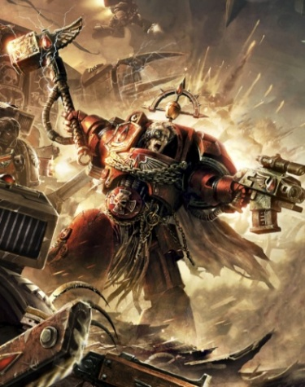
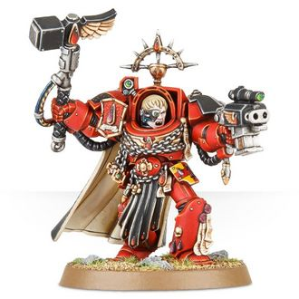

# 0674 阿瑞诺斯·卡莱恩 Arenos Karlaen

精校状态：中文行文已逐段精校，部分术语仍为暂定

分类：人类帝国 / 圣血天使

原文来源：https://www.bilibili.com/opus/1117102542571962372

原作者：帝国神选罐头

原文时间：2025年09月27日 08:48

[返回分类目录](目录.md) · [全书目录](../../目录.md)

<!-- A0674-B0001 -->
**英文原文**

"It is a blessed thing, to bear the blood of the Great Angel within one's veins. And yet it is a burden, too. We fight not only against the Emperor's foes, but against the Flaw that seeks to claim our souls. The shadow of death looms over us, but we do not retreat from it. Instead we meet the darkness as did the Primarch, with all the righteous fury of avenging angels."

<!-- /A0674-B0001 -->

<!-- A0674-B0002 -->

原译文

“将大天使的鲜血注入血管是一件幸事。然而，这也是一种负担。我们不仅要与帝皇之敌作战，还要与试图夺走我们灵魂的缺陷作战。死亡的阴影笼罩着我们，但我们并没有退缩。相反，我们像原体一样，带着复仇天使的正义愤怒，直面黑暗。”

**校订译文**

“血脉中流淌着大天使之血，是一种祝福，也是一副重担。我们不仅要对抗帝皇之敌，还要抗拒那试图吞噬灵魂的缺陷。死亡的阴影笼罩着我们，但我们绝不退缩；我们将如原体一般，怀着复仇天使的全部义怒，直面黑暗。”

<!-- /A0674-B0002 -->

<!-- A0674-B0003 -->
**英文原文**

Arenos Karlaen is the current Captain of the Blood Angels' 1st Company.

<!-- /A0674-B0003 -->

<!-- A0674-B0004 -->

原译文

阿瑞诺斯·卡莱恩是圣血天使第一连队的现任连长。

**校订译文**

阿瑞诺斯·卡莱恩是圣血天使第一连队的现任连长。

<!-- /A0674-B0004 -->

<!-- A0674-B0005 图片 -->

<!-- A0674-B0006 -->

原译文

Arenos Karlaen 阿瑞诺斯·卡莱恩

**校订译文**

Arenos Karlaen 阿瑞诺斯·卡莱恩

<!-- /A0674-B0006 -->

<!-- A0674-B0007 -->
## History 历史

<!-- /A0674-B0007 -->

<!-- A0674-B0008 -->
**英文原文**

As a young battle-brother, Karlaen first displayed his tactical acumen during the war for Barestyr XIX against the Speed Freeks of Waaagh! Kruggdak. When Karlaen’s Sergeant was decapitated by an Ork kannon, he assumed command of his squad. Using the world’s sky-bridge network as a battlefield, Karlaen trapped the xenos among the bridges complex cogwork gates. Robbed of their mobility, the Orks became easy prey for the Space Marines. This action would be first of many to draw the eye of Dante. When Arenos entered the ranks of the Archangels First Company, it was as a Veteran Sergeant of a Terminator Squad.

<!-- /A0674-B0008 -->

<!-- A0674-B0009 -->

原译文

作为一名年轻的战斗兄弟，卡莱恩在巴雷斯蒂尔十九号与极速怪咖克鲁格达克的Waaagh！的战争中首次展示了他的战术智慧。当卡莱恩的军士被欧克大炮斩首时，他接管了他的小队。卡莱恩以世界的天桥网络为战场，将异型困在桥梁复杂的齿轮门中。由于失去了机动性，欧克很容易成为星际战士的猎物。这一行动将是但丁众多行动中的第一个。当阿瑞诺斯进入第一连队大天使的等级时，他是一名终结者小队的老兵军士。

**校订译文**

卡莱恩还是年轻的战斗兄弟时，便在巴雷斯蒂尔十九号对抗克鲁格达克 Waaagh! 旗下极速怪胎的战争中，初次展现战术才干。小队军士被欧克炮火轰掉头颅后，他接掌指挥，利用当地的空中桥梁网络，将异形困在桥上复杂的齿轮驱动闸门之间。失去机动优势的欧克顿时成为星际战士的猎物。这是他第一次引起但丁注意，此后类似的表现还有许多。后来，卡莱恩以终结者小队老兵军士的身份，加入号称“大天使”的第一连。

**校注：** draw the eye of Dante 指引起但丁注意，原译误成但丁自己的行动；Archangels 是第一连的称号。

<!-- /A0674-B0009 -->

<!-- A0674-B0010 -->
**英文原文**

The destruction of more than half a dozen Space Hulks can be laid at Arenos’ feet. Doom of Vorgoth, Divine Purgatory and Twilight Aegis are names now synonymous with Karlaen. It was on the Doom of Vorgoth that Arenos was almost killed by the Necrogolem, a Nurgle Daemon of meat and metal. The vile creature had turned the space hulk into a playground of pestilence and disease filled with myriad traps to snare the unwary. Karlaen would eventually destroy the creature by venting its sump-palace to the void and freezing Necrogolem in a tomb of its own filth.

<!-- /A0674-B0010 -->

<!-- A0674-B0011 -->

原译文

阿瑞诺斯手下有着几艘太空废船的毁灭。沃尔戈斯的毁灭号、神圣炼狱号和黄昏神盾号现在等同于卡莱恩。正是在沃尔戈斯的毁灭号，阿瑞诺斯差点被血肉和金属的纳垢恶魔亡灵魔像杀死。这个卑鄙的生物把太空废船变成了一个充满瘟疫和疾病的游乐场，里面有无数陷阱来诱捕粗心大意的人。卡莱恩最终将通过将其污水宫殿排到虚空中并将亡灵魔像冷冻在自己污秽的坟墓中来摧毁该生物。

**校订译文**

已有超过六艘太空废船的毁灭归功于卡莱恩，沃尔戈斯的毁灭号、神圣炼狱号与黄昏神盾号等名字，如今都与他的战绩紧密相连。在沃尔戈斯的毁灭号上，他曾险些死于血肉与金属构成的纳垢恶魔“亡灵魔像”之手。那怪物把整艘废船变成瘟疫与疾病的乐园，布满陷阱，捕捉疏于防备者。卡莱恩最终将它的污水宫殿暴露于真空，使亡灵魔像连同自身的污物一起冻结，从而将其消灭。

**校注：** more than half a dozen 明确多于六艘，原“几艘”漏数量。vent...to the void 为将内部暴露于真空，非把宫殿整体排走。

<!-- /A0674-B0011 -->

<!-- A0674-B0012 -->
**英文原文**

Another Space Hulk — the Doom of Perdita — was cleansed of Tyranids by Karlaen and his battle-brothers.

<!-- /A0674-B0012 -->

<!-- A0674-B0013 -->

原译文

另一艘太空废船 — 珀迪塔的毁灭号 — 被卡莱恩和他的战斗兄弟们清除了泰伦。

**校订译文**

卡莱恩与战斗兄弟们还清除了另一艘太空废船珀迪塔的毁灭号上的泰伦。

<!-- /A0674-B0013 -->

<!-- A0674-B0014 -->
**英文原文**

Karlaen has worn his mantle of Captain of the 1st Company for two centuries now, and during his service have fought innumerable enemies. During the battle of Forlorn Falls he and his Terminator-brothers broke through the Iron Warriors' defences and destroyed filthy heretics. During the cleansing of Solace in Sorrow — another Space Hulk — Karlaen managed to coordinate battles across ten separated battle zones despite the failure of auspex equipment of the Blood Angels.

<!-- /A0674-B0014 -->

<!-- A0674-B0015 -->

原译文

两个世纪以来，卡莱恩一直担任第一连长，在服役期间与无数敌人作战。在福尔伦陷落之战中，他和他的终结者兄弟突破了钢铁勇士的防御，摧毁了肮脏的异端。在另一艘太空废船悲伤慰藉号的清理过程中，尽管圣血天使的鸟卜仪设备出现故障，卡莱恩仍设法协调了十个独立战区的战斗。

**校订译文**

卡莱恩担任第一连长已有两个世纪，其间征战无数。在福尔伦瀑布之战中，他与终结者兄弟突破钢铁勇士的阵线，歼灭了污秽的异端。在清理另一艘太空废船悲伤慰藉号时，尽管圣血天使的鸟卜仪失灵，他仍成功协调了十处互不相连的战区。

**校注：** Forlorn Falls 按战场地名暂作福尔伦瀑布；原“福尔伦陷落”将 Falls 当成陷落，缺乏依据；地理详情待核。

<!-- /A0674-B0015 -->

<!-- A0674-B0016 -->
**英文原文**

More recently Karlaen commanded Blood Angels forces during the Cryptus Campaign against Hive Fleet Leviathan and during the Diamor Campaign against the forces of Chaos. For his valiant defence of the Blood Angels' systems he is known by many as the Shield of Baal.

<!-- /A0674-B0016 -->

<!-- A0674-B0017 -->

原译文

最近，卡莱恩在针对虫巢舰队利维坦的冥府战役和针对混沌部队的迪亚摩尔战役中指挥了圣血天使部队。由于他勇敢地捍卫了圣血天使的星系，他被许多人称为巴尔之盾。

**校订译文**

近来，卡莱恩先后在冥府战役中指挥圣血天使迎战利维坦虫巢舰队，又在迪亚莫尔战役中对抗混沌军队。他奋勇保卫圣血天使诸星系，因此被许多人尊称为“巴尔之盾”。

<!-- /A0674-B0017 -->

<!-- A0674-B0018 -->
**英文原文**

Karlaen only was able to arrive to Baal in the final stages of its invasion by the Tyranids. He nonetheless was able to tend to a wounded Chapter Master Dante. He survived the battle and subsequently took part in the Corinth Belt Campaign at Dante's orders.

<!-- /A0674-B0018 -->

<!-- A0674-B0019 -->

原译文

卡莱恩在泰伦入侵的最后阶段才抵达巴尔。尽管如此，他还是能够照顾受伤的战团长但丁。他在战斗中幸存下来，随后在但丁的命令下参加了科林斯带战役。

**校订译文**

直到泰伦入侵的最后阶段，卡莱恩才抵达巴尔，但仍及时救护了受伤的战团长但丁。他在此役中幸存，随后奉但丁之命参加科林斯带战役。

<!-- /A0674-B0019 -->

<!-- A0674-B0020 图片 -->

<!-- A0674-B0021 -->

原译文

First Captain Karlaen 第一连长卡莱恩

**校订译文**

First Captain Karlaen 第一连长卡莱恩

<!-- /A0674-B0021 -->

<!-- A0674-B0022 -->
## Wargear 武器装备

原题：Wargear 战备

<!-- /A0674-B0022 -->

<!-- A0674-B0023 -->
**英文原文**

Karlaen is armed with the mighty Hammer of Baal.

<!-- /A0674-B0023 -->

<!-- A0674-B0024 -->

原译文

卡莱恩拿着强大的巴尔之锤。

**校订译文**

卡莱恩的武器是威力强大的巴尔之锤。

<!-- /A0674-B0024 -->

本篇核心术语与暂定项

以下列出本篇出现的英文原形及核心术语表用词。同形词可能指不同对象，具体词义以本篇正文和校注为准；单复数、别名和仅见于图注的名称可能尚未列入。完整候选见[术语表](../../术语表/双语术语候选.csv)。

| 英文 | 采用中文 | 状态 |
| --- | --- | --- |
| Space Marines | 星际战士 | 官方已核对 |
| Blood Angels | 圣血天使 | 官方已核对 |
| Tyranids | 泰伦虫族 | 官方已核对 |
| Orks | 欧克蛮人 | 官方已核对 |
| Terminator | 终结者 | 官方已核对 |
| Nurgle | 纳垢 | 官方已核对 |
| Waaagh! | Waaagh! | 暂定·保留原文 |
| Equipment | 装备 | 编辑用语已统一 |
| Emperor | 帝皇 | 官方已核对 |
| Primarch | 原体 | 官方已核对 |
| Iron Warriors | 钢铁勇士 | 暂定·官方待核 |
| Hive Fleet Leviathan | 利维坦虫巢舰队 | 暂定·官方待核 |
| Baal | 巴尔 | 暂定·官方待核 |
| Master | 导师（审判庭职衔）／舰务官（舰员职务） | 语境定译·官方待核 |
| Terminator Squad | 终结者小队 | 官方已核对 |
| Chapter | 战团 | 暂定·官方待核 |
| Chapter Master | 战团长 | 暂定·官方待核 |
| Captain | 连长 | 暂定·官方待核 |
| Veteran | 老兵 | 暂定·官方待核 |
| Sergeant | 军士 | 暂定·官方待核 |
| Brother | 修士 | 暂定·官方待核 |
| Battle-Brother | 战斗兄弟 | 暂定·官方待核 |
| Dante | 但丁 | 暂定·官方待核 |
| Karlaen | 卡莱恩 | 暂定·官方待核 |
| Shield of Baal | 巴尔之盾 | 暂定·官方待核 |
| Diamor | 迪亚莫尔 | 暂定·官方待核 |
| Cryptus | 冥府 | 暂定·官方待核 |
| Xenos | 异形 | 暂定·官方待核 |
| Speed Freeks | 极速怪胎 | 暂定·官方待核 |
| Righteous Fury | 正义之怒号 | 暂定·官方待核 |
| Bear | 熊 | 暂定·官方待核 |
| The Blood | 鲜血 | 暂定·官方待核 |
| Barestyr XIX | 巴雷斯蒂尔十九号 | 暂定·官方待核 |
| Waaagh! Kruggdak | 克鲁格达克 Waaagh! | 暂定·官方待核 |
| Doom of Vorgoth | 沃尔戈斯的毁灭号 | 暂定·官方待核 |
| Divine Purgatory | 神圣炼狱号 | 暂定·官方待核 |
| Twilight Aegis | 黄昏神盾号 | 暂定·官方待核 |
| Necrogolem | 亡灵魔像 | 暂定·官方待核 |
| Doom of Perdita | 珀迪塔的毁灭号 | 暂定·官方待核 |
| Forlorn Falls | 福尔伦瀑布 | 暂定·官方待核 |
| Solace in Sorrow | 悲伤慰藉号 | 暂定·官方待核 |
| Corinth Belt Campaign | 科林斯带战役 | 暂定·官方待核 |
| Hammer of Baal | 巴尔之锤 | 暂定·官方待核 |
| Kannon | 欧克加农 | 暂定·官方待核 |
| Auspex | 鸟卜仪 | 暂定·官方待核 |

