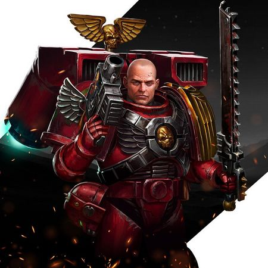

# 0675 卡莱昂 Carleon

精校状态：中文行文已逐段精校，部分术语仍为暂定

分类：人类帝国 / 圣血天使

原文来源：https://www.bilibili.com/opus/1219710595419340800

原作者：帝国神选罐头

原文时间：2026年06月30日 21:00

[返回分类目录](目录.md) · [全书目录](../../目录.md)

<!-- A0675-B0001 -->
**英文原文**

Carleon is a Lieutenant of the Blood Angels 8th Company.

<!-- /A0675-B0001 -->

<!-- A0675-B0002 -->

原译文

卡莱昂是圣血天使第八连队的副官。

**校订译文**

卡莱昂是圣血天使第八连队的副官。

<!-- /A0675-B0002 -->

<!-- A0675-B0003 -->
**英文原文**

In the aftermath of the Devastation of Baal, he assisted in purging Baal Secundus of Tyranids, while also assessing the Chapter's new Primaris Space Marines. He was also promoted from Sergeant to Lieutenant during the Purge of Baal Secundus.

<!-- /A0675-B0003 -->

<!-- A0675-B0004 -->

原译文

在巴尔的毁灭之后，他协助清除了巴尔二号的泰伦，同时也评估了战团新的原铸星际战士。在巴尔二号净化期间，他还从军士晋升为副官。

**校订译文**

巴尔之毁后，卡莱昂协助清剿巴尔二号卫星上的泰伦，同时评估战团新加入的原铸星际战士。在巴尔二号清剿行动期间，他也从军士晋升为副官。

<!-- /A0675-B0004 -->

<!-- A0675-B0005 图片 -->

<!-- A0675-B0006 -->

原译文

Carleon as a Lieutenant 作为副官的卡莱昂

**校订译文**

Carleon as a Lieutenant 作为副官的卡莱昂

<!-- /A0675-B0006 -->

本篇核心术语与暂定项

以下列出本篇出现的英文原形及核心术语表用词。同形词可能指不同对象，具体词义以本篇正文和校注为准；单复数、别名和仅见于图注的名称可能尚未列入。完整候选见[术语表](../../术语表/双语术语候选.csv)。

| 英文 | 采用中文 | 状态 |
| --- | --- | --- |
| Space Marines | 星际战士 | 官方已核对 |
| Blood Angels | 圣血天使 | 官方已核对 |
| Tyranids | 泰伦虫族 | 官方已核对 |
| Devastation of Baal | 巴尔之毁 | 暂定·官方待核 |
| Baal | 巴尔 | 暂定·官方待核 |
| Lieutenant | 副官 | 暂定·官方待核 |
| Chapter | 战团 | 暂定·官方待核 |
| Sergeant | 军士 | 暂定·官方待核 |
| The Purge | 净世疫军 | 暂定·官方待核 |
| Carleon | 卡莱昂 | 暂定·官方待核 |
| The Blood | 鲜血 | 暂定·官方待核 |
| Baal Secundus | 巴尔二号 | 暂定·官方待核 |

