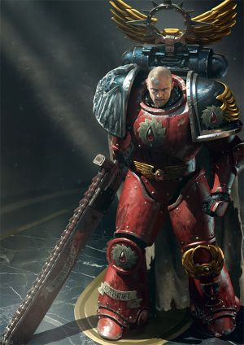
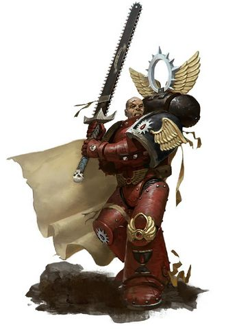
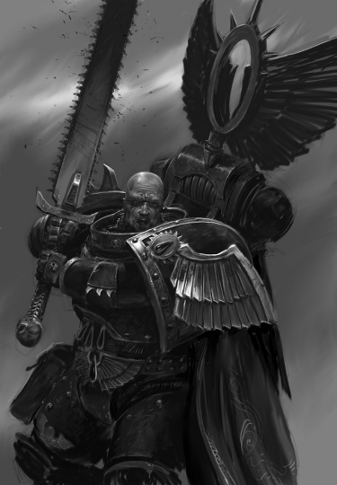
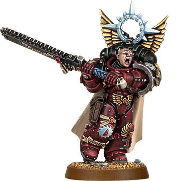
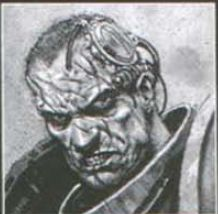

# 0676 加百列·赛斯 Gabriel Seth

精校状态：中文行文已逐段精校，部分术语仍为暂定

分类：人类帝国 / 撕肉者

原文来源：https://www.bilibili.com/opus/1147922712437456921

原作者：帝国神选罐头

原文时间：2025年12月19日 10:06

[返回分类目录](目录.md) · [全书目录](../../目录.md)

<!-- A0676-B0001 -->
**英文原文**

Gabriel Seth is the Chapter Master of the Flesh Tearers.

<!-- /A0676-B0001 -->

<!-- A0676-B0002 -->

原译文

加百列·赛斯是撕肉者的战团长。

**校订译文**

加百列·赛斯是撕肉者的战团长。

<!-- /A0676-B0002 -->

<!-- A0676-B0003 图片 -->

<!-- A0676-B0004 -->

原译文

Gabriel Seth 加百列·赛斯

**校订译文**

Gabriel Seth 加百列·赛斯

<!-- /A0676-B0004 -->

<!-- A0676-B0005 -->
### History 历史

<!-- /A0676-B0005 -->

<!-- A0676-B0006 -->
**英文原文**

Seth has presided over the Chapter for more than 100 years. In his time he has experienced many great victories, but has also seen too many of his battle brothers fall victim to the Black Rage. He has earned a great degree of enmity from most other Imperial armies he has fought alongside. Commanders of the Imperial Guard and of the Adepta Sororitas are often simply ignored, while other Marines grow frustrated with Seth's impetuous desire to instantly destroy all enemies.

<!-- /A0676-B0006 -->

<!-- A0676-B0007 -->

原译文

赛斯主持该战团已有100多年的历史。在他的时代，他经历了许多伟大的胜利，但也看到太多的战斗兄弟成为了黑怒的受害者。他得到了与他并肩作战的大多数其他帝国军队的极大敌意。帝国卫队和修女会的指挥官经常被忽视，而其他战士则对赛斯立即摧毁所有敌人的冲动感到沮丧。

**校订译文**

赛斯执掌战团已有一百多年。他取得过许多辉煌胜利，也眼见太多战斗兄弟沦为黑怒的牺牲品。与他并肩作战的大多数帝国军队都对他怀有深重敌意：他常将帝国卫队和修女会指挥官置之不理，其他星际战士也对他恨不得立即消灭所有敌人的冲动感到恼火。

<!-- /A0676-B0007 -->

<!-- A0676-B0008 -->
**英文原文**

When Seth ascended to command of the Flesh Tearers in 815.M41, he was given a grim judgment by the chapter's Sanguinary High Priest. The Priests predicted that the frequency of the Black Rage, combined with battlefield attrition, had finally overtaken the Flesh Tearers' ability to replace their losses from Cretacia. The Priests predicted that the Flesh Tearers would be extinct within decades.

<!-- /A0676-B0008 -->

<!-- A0676-B0009 -->

原译文

M41.815，赛斯升任撕肉者的指挥官。该战团的圣血祭司对他进行了严厉的审判。祭司们预测，黑怒的频率，再加上战场上的消耗，最终超过了科瑞塔西亚弥补撕肉者损失的能力。祭司们预测，撕肉者将在几十年内灭绝。

**校订译文**

815.M41，赛斯接掌撕肉者时，战团的至高圣血祭司告诉他一个残酷的判断：黑怒不断发作，加上战场损耗，已使伤亡速度超过从科瑞塔西亚招募补员的能力。祭司们预计，撕肉者将在数十年内消亡。

**校注：** judgment 指对战团前景的判断，并非对赛斯施行审判；Sanguinary High Priest 补足至高圣血祭司。

<!-- /A0676-B0009 -->

<!-- A0676-B0010 图片 -->

<!-- A0676-B0011 -->

原译文

Gabriel Seth 加百列·赛斯

**校订译文**

Gabriel Seth 加百列·赛斯

<!-- /A0676-B0011 -->

<!-- A0676-B0012 -->
**英文原文**

Upon hearing this, Seth made a solemn vow: if the Flesh Tearers were to fade away, then they would be remembered with honour, rather than fear. For this reason, Seth has aggressively deployed the Flesh Tearers by mounting pro-active patrols through known enemy territory and responding avidly to distress calls from all Imperial sectors.

<!-- /A0676-B0012 -->

<!-- A0676-B0013 -->

原译文

赛斯听了这话，郑重发誓：如果撕肉者消失了，那么他们将被光荣地记住，而不是恐惧。出于这个原因，赛斯通过在已知的敌方领土上进行主动巡逻，并对帝国所有部门的求救信号做出积极回应，积极部署了撕肉者。

**校订译文**

听到这番话，赛斯庄严立誓：即使撕肉者终将消失，也要让世人怀着敬意而非恐惧记住他们。为此，他积极派遣战团部队，主动巡行已知的敌占区域，并热切响应帝国各星区的求救信号。

<!-- /A0676-B0013 -->

<!-- A0676-B0014 -->
**英文原文**

Despite the chapter's continual savagery, Seth has proven to be a competent and hopeful leader, taking new policies to combat the chapter's grisly reputation. Cretacia has become dedicated to producing weapons and recruits for the Flesh Tearers; and the Flesh Tearers make strikes isolated from other Imperial forces to conceal their savagery from and minimalize collateral damage to Imperial allies. Many who feared the Flesh Tearers are now praising them, although they are still distrusted by many of their allies.

<!-- /A0676-B0014 -->

<!-- A0676-B0015 -->

原译文

尽管该战团一直很野蛮，但赛斯已被证明是一位有能力、有希望的领导者，他采取了新的政策来抑制该战团可怕的声誉。科瑞塔西亚已经致力于为撕肉者生产武器和招募新兵；撕肉者的攻击与其他帝国军队隔离开来，以掩盖他们的野蛮行径，并尽量减少对帝国盟友的附带损害。许多害怕撕肉者的人现在都在赞扬他们，尽管他们仍然不被许多盟友信任。

**校订译文**

撕肉者虽依旧凶残，赛斯却证明自己是能干且不肯放弃希望的领袖。他推行新策略，试图扭转战团令人畏惧的名声。科瑞塔西亚专注为战团提供武器与新兵；撕肉者则尽量与其他帝国部队分开作战，既掩藏自身的暴虐，也减少盟军被波及的伤亡。许多曾畏惧他们的人开始赞扬战团，尽管不少盟友依然缺乏信任。

<!-- /A0676-B0015 -->

<!-- A0676-B0016 -->
**英文原文**

Seth's hopes of bringing the chapter back into the good graces of the Imperium, and more importantly, saving it from its doom are desperate hopes. Yet his strategy has yet to bear fruit, and only time will tell of what becomes of the Flesh Tearers.

<!-- /A0676-B0016 -->

<!-- A0676-B0017 -->

原译文

赛斯希望将这一战团带回帝国的怀抱，更重要的是，将其从毁灭中拯救出来，这是绝望的希望。然而，他的策略尚未取得成果，只有时间才能告诉我们撕肉者会变成什么样子。

**校订译文**

赛斯希望战团重新赢得帝国信任，更希望拯救它免于灭亡；这些愿望近乎绝境中的执念。可是，他的策略尚未真正解决问题，撕肉者的未来仍只有时间能够揭晓。

**校注：** 前文有声誉改善、此处又说策略尚未奏效：将后者限定为未解决持续衰亡，保留作者对最终成效未定的判断。

<!-- /A0676-B0017 -->

<!-- A0676-B0018 -->
### Conclave at Baal 巴尔大会

原题：Conclave at Baal 巴尔密会

<!-- /A0676-B0018 -->

<!-- A0676-B0019 -->
**英文原文**

In the latter decades of M41, Seth was one of several Masters of the Blood Angels Successor Chapters who were summoned by Commander Dante to a Conclave on Baal. The Blood Angels had nearly collapsed into civil war because of a plot by the Word Bearers, and urgently needed new recruits in order to survive. Dante requested a tithe of recruits from the Angels' "cousin" chapters, but Seth refused vehemently, protesting that the Flesh Tearers were already too reduced as a chapter to spare any men.

<!-- /A0676-B0019 -->

<!-- A0676-B0020 -->

原译文

在M41的后几十年里，赛斯是被指挥官但丁召集到巴尔密会的几位圣血天使子战团之一。圣血天使几乎因为怀言者的阴谋而陷入内战，迫切需要新兵才能生存。但丁要求从天使的“堂兄”战团中招募十分之一的新兵，但赛斯强烈拒绝了，他抗议说，作为一个战团，撕肉者已经太少了，不能放过任何人。

**校订译文**

第四十一千年最后数十年，赛斯与数位圣血天使子战团长应但丁指挥官之召，来到巴尔参加大会。由于怀言者的阴谋，圣血天使险些陷入内战，急需补充新兵以维系战团。但丁要求同源的兄弟战团贡献新兵配额，赛斯却强烈反对，表示撕肉者本已人手凋零，实在无法抽调任何战士。

**校注：** tithe 此处只明确配额性质，英文未明示恰好十分之一，不额外补充具体比例。Masters 指战团长，非数个战团本身。

<!-- /A0676-B0020 -->

<!-- A0676-B0021 图片 -->

<!-- A0676-B0022 -->

原译文

Gabriel Seth 加百列·赛斯

**校订译文**

Gabriel Seth 加百列·赛斯

<!-- /A0676-B0022 -->

<!-- A0676-B0023 -->
**英文原文**

In private, Seth even suggested to Dante that the Blood Angels be disbanded and allow the Flesh Tearers to take over the rule of Baal. Seth could not help but see an opportunity to rebuild his chapter's strength using the Blood Angels' men and resources.

<!-- /A0676-B0023 -->

<!-- A0676-B0024 -->

原译文

赛斯甚至私下里建议但丁解散圣血天使，让撕肉者接管巴尔的统治。赛斯忍不住看到了一个机会，利用圣血天使的人和资源重建他的战团的力量。

**校订译文**

私下里，赛斯甚至建议但丁解散圣血天使，由撕肉者接管巴尔。他无法不将此视为利用圣血天使的人力与资源、重建自身战团实力的机会。

<!-- /A0676-B0024 -->

<!-- A0676-B0025 -->
**英文原文**

However, Seth and Dante would fight side by side, in defense of the crypt of Sanguinius, when it was attacked by mutants unleashed by Fabius Bile. After the battle, Seth addressed Dante as a true battle-brother, and pledged that the Flesh Tearers would donate the men the Blood Angels needed. Dante was more than a millennium old, but this reversal showed that he was still capable of being surprised. Seth's support also convinced the other chapters' Masters to make the same pledge. Several months later, Seth discovered a random piece of information that aided the Blood Angels in tracking down Bile (or rather, one of his many clones), who had stolen the blood of Sanguinius.

<!-- /A0676-B0025 -->

<!-- A0676-B0026 -->

原译文

然而，赛斯和但丁并肩作战，保卫圣吉列斯之墓，当它被法比乌斯·拜尔释放的变种人攻击时。战斗结束后，赛斯称但丁为真正的战斗兄弟，并承诺撕肉者会捐献圣血天使所需的人。但丁已经有一千多岁了，但这种逆转表明他仍然能够感到惊讶。赛斯的支持也说服了其他战团的战团长做出同样的承诺。几个月后，赛斯发现了一条无规则碎片信息，帮助圣血天使追踪到窃取了圣吉列斯之血的拜尔（或者更确切地说，是他的许多克隆体之一）。

**校订译文**

然而，法比乌斯·拜尔放出的变种怪物袭击圣吉列斯之墓时，赛斯与但丁并肩保卫陵寝。战后，赛斯称但丁为真正的战斗兄弟，并承诺撕肉者将提供圣血天使所需的新兵。即使但丁已经活了一千多年，也仍为这番转变感到意外。赛斯的支持促使其他战团长作出同样承诺。数月后，他又偶然获得一条情报，帮助圣血天使追踪窃取圣吉列斯之血的拜尔——更准确地说，是他的众多克隆体之一。

<!-- /A0676-B0026 -->

<!-- A0676-B0027 -->
### Tyrannic Wars 泰伦战争

<!-- /A0676-B0027 -->

<!-- A0676-B0028 -->
**英文原文**

Gabriel Seth personally led a sizable Flesh Tearers force during the Cryptus Campaign, aiding Dante and the Blood Angels against Tyranid Hive Fleet Leviathan.

<!-- /A0676-B0028 -->

<!-- A0676-B0029 -->

原译文

加百列·赛斯在冥府战役中亲自领导了一支庞大的撕肉者部队，帮助但丁和圣血天使对抗泰伦虫巢舰队利维坦。

**校订译文**

加百列·赛斯在冥府战役中亲自领导了一支庞大的撕肉者部队，帮助但丁和圣血天使对抗泰伦虫巢舰队利维坦。

<!-- /A0676-B0029 -->

<!-- A0676-B0030 -->
**英文原文**

During the Devastation of Baal, Seth was a key Imperial commander. Commander Dante entrusted Seth with the Reliquary of Amit prior to the arrival of the Tyranids. The Flesh Tearers were deployed to Baal Primus, where they fought alongside the Knights of Blood. When the Cicatrix Maledictum opened across the galaxy during the battle, Daemons led by the Bloodthirster Ka'Bandha manifested on Baal Primus, forcing Seth to evacuate his remaining forces while the Knights of Blood led a suicidal counter-attack. After Dante was wounded by the Swarmlord, Seth led a retreat back to the Fortress-Monastery of the Blood Angels and held out until the Indomitus Crusade arrived. Though he knew that his Chapter would be refilled with Primaris Space Marines after nearly being destroyed completely by the claws of Tyranids, Seth was not very satisfied, thinking that Roboute Guilliman would just turn the Flesh Tearers and other Chapters of Sanguinius' bloodline into bland copies of Ultramarines in red armour. Seth believes that without their fury, his Space Marines will lose their major distinguishing feature and become something else.

<!-- /A0676-B0030 -->

<!-- A0676-B0031 -->

原译文

在巴力的毁灭期间，赛斯是帝国的关键指挥官。在泰伦到来之前，指挥官但丁委托赛斯保管阿密特的圣物箱。撕肉者被部署到巴尔主星，在那里他们与血骑士并肩作战。当诅咒伤痕在战斗中在银河系中打开时，嗜血狂魔卡班哈领导的恶魔在巴尔主星上显现，迫使赛斯撤离剩余的部队，而血骑士则领导了自杀式的反击。但丁被虫群领主打伤后，赛斯带领撤退到圣血天使堡垒修道院，并一直坚持到不屈远征到来。尽管赛斯知道，在几乎被泰伦的利爪完全摧毁后，他的战团将重新补满原铸星际战士，但他并不十分满意，认为罗伯特·基里曼只会把撕肉者和圣吉列斯血统的其他战团变成红色盔甲的极限战士的平淡无奇的复制品。赛斯认为，如果没有他们的愤怒，他的星际战士将失去其主要特征，成为另一种东西。

**校订译文**

巴尔之毁期间，赛斯是帝国的重要指挥官。泰伦到来前，但丁将阿密特圣物箱托付给他。撕肉者被部署到巴尔一号卫星，与血骑士并肩作战。战斗中，诅咒伤痕横贯银河，卡’班哈率领恶魔显现于巴尔一号。血骑士发动决死反击，为赛斯撤离余部争取时间。后来，但丁被虫群领主重创，赛斯率部退入圣血天使的要塞修道院，坚守至不屈远征军抵达。虽然他知道，几乎被泰伦消灭的战团将得到原铸星际战士补充，却并不满意。他担心罗保特·基里曼会将撕肉者和圣吉列斯的其他后裔，变成只不过穿着红甲的极限战士复制品。在他看来，一旦失去这份怒火，战士们就会失去最鲜明的特征，变成另一种存在。

**校注：** Baal Primus 为巴尔一号卫星，区别母行星巴尔；原巴尔主星错误。

<!-- /A0676-B0031 -->

<!-- A0676-B0032 -->
**英文原文**

Seth's policies and the slow death of the Flesh Tearers have made him many enemies, including those within his own Chapter. The Flesh Tearers Captain Guriel even worked with the Inquisition to eliminate Seth, declaring he was a threat to the Chapter's future and expended the lives of Battle-Brothers too easily. To that end, Guriel was able to trap Seth in a shrine with an Eversor Assassin. However Seth was able to best the maddened killer and used its embedded explosive to escape the shrine. After his escape, Seth promptly dealt with Guriel.

<!-- /A0676-B0032 -->

<!-- A0676-B0033 -->

原译文

赛斯的政策和撕肉者的缓慢死亡使他成为了许多人的敌人，包括他所在战团的敌人。撕肉者连长古列尔甚至与审判庭合作来消灭赛斯，宣称他对战团的未来构成了威胁，并轻易地消耗了战斗兄弟的生命。为此，古列尔得以将赛斯和一名艾弗森刺客困在神庙里。然而，赛斯战胜了那个疯狂的杀手，并使用其内置的炸药逃离了神庙。逃跑后，赛斯迅速处理了古列尔。

**校订译文**

赛斯的政策，以及撕肉者不断衰亡的处境，为他树立了许多敌人，连战团内部也不例外。连长古列尔甚至与审判庭合作，企图除掉赛斯，指责他威胁战团未来，过于轻率地消耗战斗兄弟的生命。古列尔设计将赛斯与一名艾弗森刺客困在神殿中，赛斯却击败了疯狂的杀手，并利用其体内炸药炸出逃生通道。脱身后，他立即处置了古列尔。

<!-- /A0676-B0033 -->

<!-- A0676-B0034 -->
### Post-Baal 巴尔之毁后

原题：Post-Baal 巴尔后

<!-- /A0676-B0034 -->

<!-- A0676-B0035 -->
**英文原文**

Following the Devastation of Baal Seth led the Flesh Tearers in the Angel's Halo campaign to take the Red Scar region from the Tyranids. During the fighting on Ashallon he slew a large Tyranid psychic beast. He also oversaw a bloody purge of the Corinth Belt alongside the Inquisition on Dante's orders.

<!-- /A0676-B0035 -->

<!-- A0676-B0036 -->

原译文

在巴尔的毁灭之后，赛斯率领撕肉者参加了天使光环战役，从泰伦手中夺取了红疤地区。在阿沙隆的战斗中，他杀死了一只巨大的泰伦灵能野兽。他还根据但丁的命令，与审判庭一起监督了对科林斯带的血腥清洗。

**校订译文**

巴尔之毁后，赛斯率撕肉者参加天使光环战役，从泰伦手中夺回红疤地区。他在阿沙隆杀死了一头巨大的泰伦灵能兽，还奉但丁之命，与审判庭共同主持对科林斯带的血腥清剿。

<!-- /A0676-B0036 -->

<!-- A0676-B0037 -->
### Wargear 武器装备

原题：Wargear 战备

<!-- /A0676-B0037 -->

<!-- A0676-B0038 -->
**英文原文**

Along with the traditional loadout used by most Chapter Masters, Seth has a massive, potent two-handed chainsword aptly named Blood Reaver. As befitting a master of a Blood Angels successor chapter, Seth is a talented hand-to-hand combatant.

<!-- /A0676-B0038 -->

<!-- A0676-B0039 -->

原译文

除了大多数战团长使用的传统装备配置外，赛斯还有一把巨大而有力的双手链锯剑，恰如其分地命名为鲜血收割者。作为一个圣血天使的子战团之主，赛斯是一位才华横溢的徒手格斗家

**校订译文**

除多数战团长常用的装备外，赛斯还持有一柄巨大而凶悍的双手链锯剑，名为“鲜血收割者”，可谓名副其实。作为圣血天使子战团之主，他也是技艺高超的近身格斗家。

**校注：** hand-to-hand combat 为近身格斗，不必限定徒手；武器名沿418暂定鲜血收割者。

<!-- /A0676-B0039 -->

<!-- A0676-B0040 图片 -->

<!-- A0676-B0041 -->

原译文

Gabriel Seth 加百列·赛斯

**校订译文**

Gabriel Seth 加百列·赛斯

<!-- /A0676-B0041 -->

<!-- A0676-B0042 -->
### Appearance and personality 外貌与个性

<!-- /A0676-B0042 -->

<!-- A0676-B0043 -->
**英文原文**

Gabriel Seth is an immense man, by a head taller then most Space Marines. In battle, Seth can always be found in the vanguard of his forces, leading his Marines through incredible acts of savagery and bloodshed. When the Flesh Tearers presence is not required on the battlefield, he becomes stern and dour, forever preoccupied with the doom that still hangs over his Chapter.

<!-- /A0676-B0043 -->

<!-- A0676-B0044 -->

原译文

加百列·赛斯是一个身材高大的人，比大多数星际战士高出一个头。在战斗中，赛斯总是处于他的部队的前沿，带领他的战士经历了令人难以置信的野蛮和流血行为。当撕肉者不需要出现在战场上时，他变得严肃而阴沉，永远专注于笼罩在他战团上的毁灭。

**校订译文**

加百列·赛斯体格魁梧，比多数星际战士还高出一头。作战时，他总在队伍前锋，率领战士实施骇人的杀戮。离开战场后，他则变得严厉阴郁，始终为悬在战团头顶的灭亡命运忧心。

<!-- /A0676-B0044 -->

<!-- A0676-B0045 图片 -->

<!-- A0676-B0046 -->

原译文

Gabriel Seth 加百列·赛斯

**校订译文**

Gabriel Seth 加百列·赛斯

<!-- /A0676-B0046 -->

<!-- A0676-B0047 -->
**英文原文**

The Black Rage burns as hotly in Seth as it does in any Flesh Tearer, but he has thus far kept it under reign; his fury is a cold and precise one, rather than bright and impetuous. In the midst of the combat on Baal, Dante became exasperated that Seth always needed to provoke and test him, and Seth rejoined that it was the nature of the Flesh Tearers: to always seek out conflict, to never be entirely at ease, and to never allow oneself to become predictable.

<!-- /A0676-B0047 -->

<!-- A0676-B0048 -->

原译文

黑怒在赛斯和在任何撕肉者身上一样强烈，但到目前为止，他一直在统治着它；他的愤怒是冷酷而精确的，而不是生机而冲动的。在巴尔上的战斗中，但丁对赛斯总是需要挑衅和考验他感到愤怒，赛斯回答，这是撕肉者的本性：总是寻求冲突，永远不要完全放松，永远不要让自己变得可预测。

**校订译文**

黑怒在赛斯心中燃烧得与任何撕肉者同样猛烈，但他至今仍能将其控制。他的怒火冷酷而精准，并非炽烈冲动。巴尔战斗期间，但丁曾因赛斯不断挑衅、试探自己而恼怒。赛斯回答，这正是撕肉者的本性：永远寻求冲突，永远不彻底松懈，也永远不让别人摸清自己。

<!-- /A0676-B0048 -->

本篇核心术语与暂定项

以下列出本篇出现的英文原形及核心术语表用词。同形词可能指不同对象，具体词义以本篇正文和校注为准；单复数、别名和仅见于图注的名称可能尚未列入。完整候选见[术语表](../../术语表/双语术语候选.csv)。

| 英文 | 采用中文 | 状态 |
| --- | --- | --- |
| Space Marines | 星际战士 | 官方已核对 |
| Blood Angels | 圣血天使 | 官方已核对 |
| Adepta Sororitas | 修女会 | 官方已核对 |
| Imperial Guard | 帝国卫队 | 暂定·语境区分 |
| Tyranids | 泰伦虫族 | 官方已核对 |
| Chainsword | 链锯剑 | 官方已核对 |
| Roboute Guilliman | 罗保特·基里曼 | 官方已核对 |
| Ultramarines | 极限战士 | 官方已核对 |
| Cicatrix Maledictum | 大裂隙 | 暂定·别名对应 |
| Inquisition | 审判庭 | 暂定 |
| Imperium | 帝国 | 暂定·简称 |
| Sanguinary | 圣血学派 | 暂定·学派语境 |
| Indomitus | 不屈学派 | 暂定·学派语境 |
| Word Bearers | 怀言者 | 暂定·官方待核 |
| Eversor Assassin | 艾弗森刺客 | 官方已核对 |
| Eversor | 艾弗森 | 暂定·官方短名对应 |
| Indomitus Crusade | 不屈远征 | 暂定·官方待核 |
| Devastation of Baal | 巴尔之毁 | 暂定·官方待核 |
| Red Scar | 红疤地区 | 暂定·官方待核 |
| Hive Fleet Leviathan | 利维坦虫巢舰队 | 暂定·官方待核 |
| Baal | 巴尔 | 暂定·官方待核 |
| Cretacia | 科瑞塔西亚 | 暂定·官方待核 |
| Master | 导师（审判庭职衔）／舰务官（舰员职务） | 语境定译·官方待核 |
| Fabius Bile | 法比乌斯·拜尔 | 官方已核对 |
| High Priest | 高阶祭司 | 暂定·官方待核 |
| Chapter | 战团 | 暂定·官方待核 |
| Fortress-monastery | 要塞修道院 | 暂定·官方待核 |
| Chapter Master | 战团长 | 暂定·官方待核 |
| Captain | 连长 | 暂定·官方待核 |
| Brother | 修士 | 暂定·官方待核 |
| Vanguard | 先锋 | 暂定·官方待核 |
| Battle-Brother | 战斗兄弟 | 暂定·官方待核 |
| Dante | 但丁 | 暂定·官方待核 |
| Flesh Tearers | 撕肉者 | 暂定·官方待核 |
| Gabriel Seth | 加百列·赛斯 | 暂定·官方待核 |
| The Angel | 天使 | 暂定·官方待核 |
| Cryptus | 冥府 | 暂定·官方待核 |
| Bloodthirster | 嗜血狂魔 | 官方已核对 |
| The Swarmlord | 虫群领主 | 官方已核对 |
| Primus | 领军 | 官方已核对 |
| Blood Reaver | 鲜血收割者 | 暂定·官方待核 |
| Guriel | 古列尔 | 暂定·官方待核 |
| Bear | 熊 | 暂定·官方待核 |
| The Blood | 鲜血 | 暂定·官方待核 |
| Maledictum | 诅咒之印 | 暂定·官方待核 |
| Angel's Halo | 天使光环 | 暂定·官方待核 |
| Reliquary of Amit | 阿密特圣物箱 | 暂定·官方待核 |
| Baal Primus | 巴尔一号 | 暂定·官方待核 |
| Ashallon | 阿沙隆 | 暂定·官方待核 |
| Solemn Vow | 神圣誓言号 | 暂定·官方待核 |

