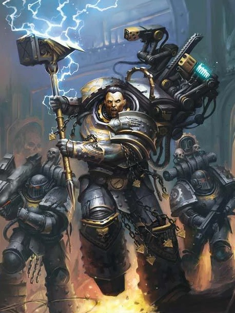
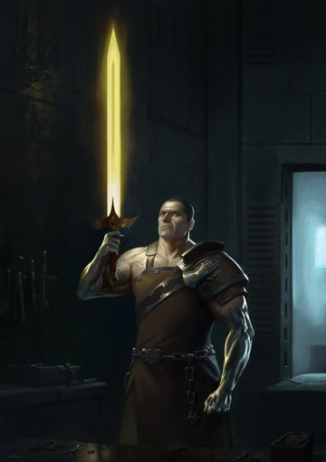
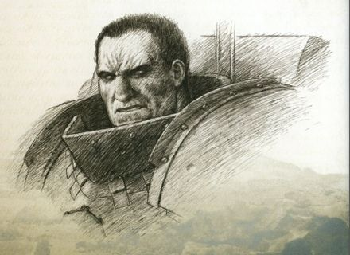
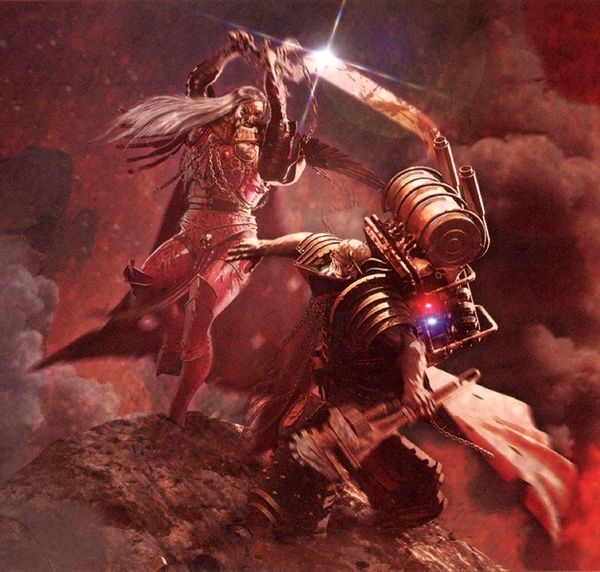
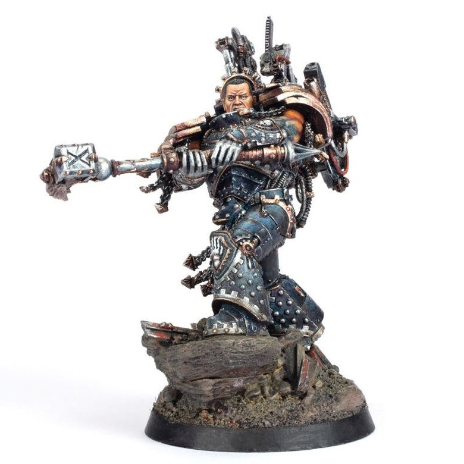

# 0677 费鲁斯·马努斯 Ferrus Manus

精校状态：中文行文已逐段精校，部分术语仍为暂定

分类：人类帝国 / 钢铁之手

原文来源：https://www.bilibili.com/opus/1091506281209921572

原作者：帝国神选罐头

原文时间：编辑于 2025年07月26日 11:40

[返回分类目录](目录.md) · [全书目录](../../目录.md)

<!-- A0677-B0001 -->
**英文原文**

"If fighting is all there is, if we may never pause to reflect on what such devotion to strength is doing to us, then our compulsion will only grow. Already I see the madness that path leads to, and so I shall excise the silver from my hands. In doing so I shall weaken myself and my sons, but nonetheless it must be done. The hands are strong, and have created great things, but they are not mine."

<!-- /A0677-B0001 -->

<!-- A0677-B0002 -->

原译文

“如果只有战斗，如果我们永远不会停下来思考这种对力量的奉献对我们做了什么，那么我们的冲动只会越来越大。我已经看到了这条路所带来的疯狂，所以我将除掉我的白银之手。即使这样做会削弱我自己和我的子嗣，但无论如何，这是必须的。这双手很强壮，创造了伟大之物，但它们不是我的。”

**校订译文**

“如果生命中只剩战斗，如果我们永远不停下来反省，对力量的执迷究竟正把我们变成什么，那么这种强迫般的欲望只会不断滋长。我已经看见这条道路通向的疯狂，因此，我将剥除双手上的白银。这会削弱我，也会削弱我的子嗣，但仍非做不可。这双手强大有力，创造过伟大的事物；然而，它们并不属于我。”

**校注：** excise the silver from my hands 指剥除手上的银质物，并非明确说切掉整双手；引言中的意愿也不等于已经执行。

<!-- /A0677-B0002 -->

<!-- A0677-B0003 -->
**英文原文**

Ferrus Manus, (literally "Hand of Iron") the Gorgon, was one of the twenty Primarchs created by the Emperor before the Great Crusade. He led the Iron Hands Space Marine Legion. During his time on the world of Medusa, Manus's hands became encased in a hard metallic substance, and he became known for his iron resolve and disdain for weakness.

<!-- /A0677-B0003 -->

<!-- A0677-B0004 -->

原译文

费鲁斯·马努斯（字面意思是“钢铁之手”）是大远征前帝皇创造的二十位原体之一。他领导钢铁之手星际战士军团。在美杜莎世界里，马努斯的手被一种坚硬的金属物质包裹着，他以钢铁般的决心和对软弱的蔑视而闻名。

**校订译文**

费鲁斯·马努斯，其名意为“钢铁之手”，号称“戈尔贡”，是帝皇在大远征之前创造的二十位原体之一，统领钢铁之手星际战士军团。他在美杜莎生活期间，双手被一种坚硬的金属物质包裹。他以钢铁般的意志与对软弱的蔑视闻名。

<!-- /A0677-B0004 -->

<!-- A0677-B0005 图片 -->

<!-- A0677-B0006 -->

原译文

Ferrus Manus 费鲁斯·马努斯

**校订译文**

Ferrus Manus 费鲁斯·马努斯

<!-- /A0677-B0006 -->

<!-- A0677-B0007 -->
## History 历史

<!-- /A0677-B0007 -->

<!-- A0677-B0008 -->
### Arrival on Medusa 降落美杜莎

<!-- /A0677-B0008 -->

<!-- A0677-B0009 -->
**英文原文**

Ferrus was stolen away by the forces of Chaos, just as his brothers were, and spent his first years on the planet Medusa. As a youth, he discovered an "X" mark on the pod that first brought him to this world and that the chamber was too precise to be a natural formation. Exploring further, he discovered runes and electro-conductive stalagmites all around the chamber. His inspections awakened an imprisoned colossal bio-mechanical worm-like creature, which attacked him and escaped, ignoring his attacks. He followed its path of destruction and swore he would destroy the beast he had unwittingly released. When he reached the surface, he saw other men in the distance but wouldn't reveal himself to them, instead keeping his recent oath in mind. Over time, Ferrus had gained a significant legend to the Clans of Medusa. The storm giants of the Karaashi Pinacle called him The Cataclysm. Due to his unleashing of the wyrm, he was also known as the Hunter. The phantasmagoria dubbed him The Finality. The mecharachnis and phasewraiths that sought him out had seemed to classify him as the Rehew Netjer or Son of Man. Meanwhile, the Subliminat had called him Flesh.

<!-- /A0677-B0009 -->

<!-- A0677-B0010 -->

原译文

费鲁斯和他的兄弟们一样，被混沌势力偷走了，并在美杜莎行星上度过了他的头几年。年轻时，他在第一次带他来到这个世界的舱上发现了一个“X”标记，这个舱太精确了，不可能是自然形成的。进一步探索，他发现洞穴周围到处都是符文和导电石笋。他的检查唤醒了一个被囚禁的巨大的生物机械飞龙般的生物，它攻击了他并逃跑了，无视他的攻击。他顺着它的毁灭之路，发誓要摧毁他无意中释放的野兽。当他到达表面时，他看到远处有其他人，但他没有向他们透露自己，而是牢记了他最近的誓言。随着时间的推移，费鲁斯变成了美杜莎氏族标志性的传说。卡拉希巨峰的风暴巨人们称他为大灾变。由于他释放了飞龙，他也被称为猎手。幻影称他为终焉。那些寻找他的机械蛛和相位幽魂似乎把他归类为威权之神或人类之子。与此同时，无意识体称他为血肉之躯。

**校订译文**

费鲁斯与兄弟们一样被混沌势力窃走，童年在美杜莎度过。年幼时，他在载自己来到此地的舱体上发现“X”标记，并察觉舱体所在的洞室结构过于精密，不可能自然形成。进一步探索后，他发现四周遍布符文与能够导电的石笋。他的探查唤醒了一头遭到囚禁、形如巨虫的庞大生物机械怪物。怪物袭击他后逃走，他的攻击却无法伤及对方。费鲁斯沿着它留下的毁灭痕迹追踪，立誓消灭这个被自己无意释放的怪物。抵达地表后，他曾看见远处的人类，却没有现身相见，而是牢记自己的誓言。随着岁月流逝，费鲁斯成为美杜莎各氏族口中的传奇：卡拉希巨峰的风暴巨人称他为“大灾变”；他还因释放巨龙一事而被称为“猎手”。幻影称他为“终焉”，寻找他的机械蛛与相位幽魂似乎将他认作“雷赫乌·奈杰尔”，即“人类之子”；无意识体则称他为“血肉”。

**校注：** chamber 是舱体所在洞室；worm-like 为虫/蠕虫形状，原“飞龙”多添飞行特征。Rehew Netjer 未有可核译义，源文以 Son of Man 解释，暂音译并保留人类之子，不沿无依据的威权之神。

<!-- /A0677-B0010 -->

<!-- A0677-B0011 图片 -->

<!-- A0677-B0012 -->

原译文

younger Ferrus Manus 年轻的费鲁斯·马努斯

**校订译文**

younger Ferrus Manus 年轻的费鲁斯·马努斯

<!-- /A0677-B0012 -->

<!-- A0677-B0013 -->
**英文原文**

Years later, Ferrus walked unscathed and fully formed from the mountains where he encountered the roaming clans and tribes of Medusa. Ferrus would not join these tribes, as many of his brothers did. Instead, he sought out physical challenges to make himself stronger and more resilient. These tests ended with his battle against the Great Silver Wyrm Asirnoth, a metallic beast impervious to harm; Ferrus had to drown it in magma to kill it. The melted flesh of the wyrm fused to Ferrus's flesh, giving him the true metal hands his Legion would take its name from. Ferrus returned to the tribes and lectured them on technology. The clans advanced at a stunning pace and Medusa prospered, but Ferrus took care to leave the inter-clan rivalry and fighting by never taking sides, as he saw the competition between them as healthy and good.

<!-- /A0677-B0013 -->

<!-- A0677-B0014 -->

原译文

多年后，费鲁斯毫发无损地从山上走出来，在那里他遇到了漫游的美杜莎氏族和部落。费鲁斯不像他的许多兄弟那样加入这些部落。相反，他寻求身体上的挑战，让自己变得更强壮、更有韧性。这些测试以他与巨大银龙阿西诺斯的战斗而告终，这是一种不受伤害的金属野兽；费鲁斯必须将其淹没在岩浆中才能杀死它。龙的熔化血肉与费鲁斯的血肉融合在一起，给了他真正的金属之手，他的军团将以此命名。费鲁斯回到部落，向他们传授技术。氏族以惊人的速度前进，美杜莎繁荣昌盛，但费鲁斯小心翼翼地离开了氏族间的竞争和战斗，从不偏袒任何一方，因为他认为他们之间的竞争是健康和良好的。

**校订译文**

多年后，费鲁斯长成健全强健的成年人，毫发无伤地走出群山，与美杜莎四处迁徙的氏族和部落相遇。他没有像许多兄弟那样融入部落，而是不断寻找肉体上的挑战，使自己更强、更坚韧。这段历练最终以他迎战巨型银龙阿西诺斯而告终。金属巨兽刀枪不入，他只得将其压入岩浆中淹死。银龙熔化的躯体与他的血肉融合，使他获得真正的金属双手，日后军团也因此得名。费鲁斯回到部落，传授技术，令各氏族飞速发展，美杜莎日益繁荣。但他始终不偏袒任何一族，也不制止氏族间的竞争与争斗，因为他认为这样的竞争有益于族群成长。

<!-- /A0677-B0014 -->

<!-- A0677-B0015 -->
**英文原文**

The Emperor eventually came to Medusa and Ferrus Manus tested himself on him in a cataclysmic battle that is said to have lain waste to entire mountains. Finally having found someone equal, Ferrus accepted the Emperor as his master and took command of a legion of Space Marines. Ferrus met his brother Fulgrim early on and initially was disdainful of the Phonecian's appreciation for art and culture, seeing it as a waste of time when a Galaxy needed to be conquered. Fulgrim jokingly referred to Ferrus as The Gorgon, a reference to the mythical Terran creature whose ugliness turned men to stone. The title ultimately stuck.

<!-- /A0677-B0015 -->

<!-- A0677-B0016 -->

原译文

帝皇最终来到美杜莎，费鲁斯·马努斯在一场灾难性的战斗中考验了自己，据说这场战斗摧毁了整个山脉。最终，在找到了一个与他势均力敌的人后，费鲁斯接受了帝皇为他的主人，并指挥了一支星际战士军团。费鲁斯很早就遇到了他的兄弟福格瑞姆，最初他对凤凰对艺术和文化的欣赏不屑一顾，认为这是在需要征服银河系时浪费时间。福格瑞姆开玩笑地称费鲁斯为戈尔贡，指的是泰拉神话中的生物，它的丑陋把人变成了石头。称号最终无法摆脱。

**校订译文**

帝皇最终来到美杜莎，费鲁斯·马努斯与他交手，考验自身力量。据说，这场惊天动地的战斗毁坏了整片山脉。终于找到能够匹敌自己的人后，费鲁斯奉帝皇为主，接掌一支星际战士军团。他很早便结识福格瑞姆，起初不屑于凤凰对艺术和文化的热爱，认为银河尚待征服，哪有闲暇浪费于此。福格瑞姆则戏称他为“戈尔贡”，借用泰拉神话中丑陋得能将人化为石头的怪物之名。这个绰号从此流传下来。

**校注：** 关于神话戈尔贡“以丑陋石化人”的说法按源文保留，属于本文描述，不另行扩写古典神话。

<!-- /A0677-B0016 -->

<!-- A0677-B0017 -->
### Great Crusade 大远征

<!-- /A0677-B0017 -->

<!-- A0677-B0018 -->
**英文原文**

Thousands of planets would fall to the remorseless Iron Hands under Ferrus's leadership. Each weak link in humanity was to be purged if mankind was to grow stronger. Scholars spoke of the wave of piety and faith that spread before the Iron Hands, with many planets suddenly motivated to look into themselves when they heard that the Iron Hands were approaching. During the Great Crusade the Iron Hands battled the Human Diasporex alongside the Emperor's Children. This was symbolic of the bond shared by Ferrus Manus and the Emperor's Children Primarch Fulgrim, who were close friends. However during the Conquest of One-Five-Four Four he received visions from the Eldar alluding to his eventual demise at Fulgrim's hands. Distrustful of the Xenos, Ferrus rejected the prophecy.

<!-- /A0677-B0018 -->

<!-- A0677-B0019 -->

原译文

在费鲁斯的领导下，成千上万的行星落入无情的钢铁之手。如果人类要变得更强大，人类的每一个薄弱环节都要被清除。学者们谈到了在钢铁之手之前传播的虔诚和信仰的浪潮，当他们听说钢铁之手正在接近时，许多行星突然都有动力审视自己。在大远征期间，钢铁之手与帝皇之子一起与流散者的人类作战。这象征着费鲁斯·马努斯和帝皇之子的原体福格瑞姆之间的纽带，他们是亲密的朋友。然而，在征服1544的过程中，他收到了灵族的幻象，暗示他最终会在福格瑞姆的手中死去。由于对异型的不信任，费鲁斯拒绝了这个预言。

**校订译文**

在费鲁斯统率下，无情的钢铁之手征服了数千颗行星。他们认为，人类若要强大，就必须清除一切薄弱环节。学者描述过一股先于军团到来的虔敬与信仰浪潮：许多世界一听说钢铁之手即将抵达，便突然开始自我审查。大远征期间，钢铁之手与帝皇之子共同迎战流散者文明中的人类，体现了费鲁斯与挚友福格瑞姆之间的深厚纽带。然而，在征服编号 1544 的世界时，费鲁斯从灵族那里看见幻象，暗示自己最终将死于福格瑞姆之手。出于对异形的不信任，他拒绝相信这项预言。

<!-- /A0677-B0019 -->

<!-- A0677-B0020 图片 -->

<!-- A0677-B0021 -->

原译文

Ferrus Manus 费鲁斯·马努斯

**校订译文**

Ferrus Manus 费鲁斯·马努斯

<!-- /A0677-B0021 -->

<!-- A0677-B0022 -->
**英文原文**

Ferrus was one of the four primarchs privately referred to by Roboute Guilliman as "the Dauntless Few", the four of his brothers who most exemplified their father's design and whose Legions reflected their best qualities (the others being Rogal Dorn, Sanguinius, and Leman Russ)

<!-- /A0677-B0022 -->

<!-- A0677-B0023 -->

原译文

费鲁斯是罗伯特·基里曼私下称为“少数无畏者”的四位原体之一，他的四个兄弟最能体现他们父亲的设计，他们的军团反映了他们最好的品质（其他人是罗格·多恩、圣吉列斯和黎曼·鲁斯）

**校订译文**

费鲁斯是罗保特·基里曼私下所称的“少数无畏者”之一。这四位兄弟最能体现父亲创造他们的初衷，其军团也反映出各自最优秀的品质。其余三人分别是罗格·多恩、圣吉列斯与黎曼·鲁斯。

<!-- /A0677-B0023 -->

<!-- A0677-B0024 -->
**英文原文**

And of them, Manus was the key. Implacable. Unshakeable. If he was at your side, he would never break.

<!-- /A0677-B0024 -->

<!-- A0677-B0025 -->

原译文

其中，马努斯是关键。无法改变。不可撼动。如果他在你身边，他永远不会崩溃。

**校订译文**

“而其中，马努斯是关键。他坚定不移，不可动摇。只要站在你身边，他就绝不会退缩。”

<!-- /A0677-B0025 -->

<!-- A0677-B0026 -->
**英文原文**

Ferrus did not get along with all his brothers however. During the Astranii Campaign, he had a severe dispute with Rogal Dorn over what should become of the Astranii Machine Empire. Ferrus alongside his Mechanicum backers wished for the civilizations destruction as Hereteks, while Rogal Dorn wanted them assimilated into the larger Imperium. Ultimately, it fell to Horus Lupercal and an honor duel to settle the dispute.

<!-- /A0677-B0026 -->

<!-- A0677-B0027 -->

原译文

然而，费鲁斯和他的兄弟们相处得并不融洽。在阿斯特拉尼战役期间，他与罗格·多恩就阿斯特拉尼机械帝国的未来发生了激烈的争执。费鲁斯和他的机械教支持者希望文明像技术异端一样毁灭，而罗格·多恩则希望他们融入更大的帝国。最终，这场争端落在了荷鲁斯·卢佩卡尔和一场荣誉决斗的肩上。

**校订译文**

不过，费鲁斯并非与所有兄弟都相处融洽。阿斯特拉尼战役期间，他与罗格·多恩因如何处置阿斯特拉尼机械帝国而激烈争执。费鲁斯及其机械教支持者认为，这个文明属于技术异端，必须毁灭；多恩则主张将其纳入人类帝国。最终，争端在荷鲁斯·卢佩卡尔介入后，通过一场荣誉决斗解决。

<!-- /A0677-B0027 -->

<!-- A0677-B0028 -->
### Horus Heresy 荷鲁斯之乱

原题：Horus Heresy 荷鲁斯叛乱

<!-- /A0677-B0028 -->

<!-- A0677-B0029 -->
**英文原文**

Once swayed himself to the side of the Warmaster, Fulgrim approached Ferrus Manus before the heresy and tried to lure him to join Chaos. Ferrus Manus was so enraged at this proposal that he attacked Fulgrim. A short duel took place, where Ferrus destroyed Fulgrim's sword Fireblade, the same weapon Ferrus had given to him many years before. Fulgrim escaped after rendering Ferrus unconscious, leaving him alive but taking with him the massive Thunder Hammer Forgebreaker he himself had crafted for his brother.

<!-- /A0677-B0029 -->

<!-- A0677-B0030 -->

原译文

有一次，福格瑞姆站在战帅一边，在叛乱之前接近费鲁斯·马努斯，试图引诱他加入混沌。费鲁斯·马努斯对这一提议非常愤怒，他攻击了福格瑞姆。一场短暂的决斗发生了，费鲁斯摧毁了福格瑞姆的剑火焰刃，这是费鲁斯多年前送给他的武器。福格瑞姆在使费鲁斯昏迷后逃脱，留下他活着，但带走了他自己为兄弟制作的巨大的雷霆锤破炉者。

**校订译文**

福格瑞姆投向战帅后，在叛乱公开爆发前找到费鲁斯，试图劝他加入混沌。费鲁斯对此怒不可遏，当即动手攻击。短暂交锋中，他毁掉了福格瑞姆的火焰剑——那正是自己多年前亲手赠予兄弟的武器。福格瑞姆击昏费鲁斯后逃走，没有取他性命，却带走了自己曾为他打造的巨型雷霆锤破炉者。

<!-- /A0677-B0030 -->

<!-- A0677-B0031 -->
**英文原文**

The Iron Hands were one of the loyal legions the Emperor called to Isstvan V. Given the large distance, Ferrus Manus took the Legion's fastest ships and departed only with his veterans. Most of them died in this battle, when following the loss of their primarch they were struck down by the traitor legions, caught between the hammer of the Emperor's Children and upon the Anvil of the four support legions of the second wave.

<!-- /A0677-B0031 -->

<!-- A0677-B0032 -->

原译文

钢铁之手是帝皇传唤给伊斯塔万五号的忠诚军团之一。由于距离遥远，费鲁斯·马努斯乘坐了军团最快的战舰，只带着他的老兵离开了。他们中的大多数人在这场战斗中丧生，在失去原体后，他们被叛徒军团击败，夹在皇帝之子的锤子和第二波四个支援军团的铁砧之间。

**校订译文**

钢铁之手是奉帝皇之命前往伊斯塔万五号的忠诚军团之一。由于路途遥远，费鲁斯挑选军团最快的战舰，只带老兵先行。这些战士大多阵亡于此：原体死后，他们被夹在帝皇之子的猛攻与第二波四个“援军”军团的反戈之间，惨遭叛军杀戮。

<!-- /A0677-B0032 -->

<!-- A0677-B0033 -->
**英文原文**

Fulgrim personally killed Ferrus during the battle at Isstvan V, using the daemon weapon he acquired fighting the Laer to strike his head from his shoulders in one fell swoop. Fulgrim, distraught with grief that his closest brother was dead by his own hand, was soon thereafter possessed by the daemon within the sword. The possessed Fulgrim then delivered Ferrus's head to Horus.

<!-- /A0677-B0033 -->

<!-- A0677-B0034 -->

原译文

福格瑞姆在伊斯塔万五号的战斗中亲自杀死了费鲁斯，使用他在与刺人战斗时获得的恶魔武器一举将他的头从肩膀上砍下来。福格瑞姆悲痛欲绝，因为他最亲密的兄弟被自己亲手杀死了，很快就被剑中的恶魔附身了。被附身的福格瑞姆随后将费鲁斯的头交给了荷鲁斯。

**校订译文**

伊斯塔万五号之战中，福格瑞姆亲手杀死费鲁斯。他挥动征讨莱尔时所得的恶魔武器，一击斩下兄弟的头颅。发现自己竟杀死最亲近的兄弟后，福格瑞姆悲痛欲绝，不久便被剑中恶魔附身。占据他身体的恶魔随后将费鲁斯的头颅献给荷鲁斯。

<!-- /A0677-B0034 -->

<!-- A0677-B0035 -->
### Post-Mortem 死后

<!-- /A0677-B0035 -->

<!-- A0677-B0036 -->
**英文原文**

When Guilliman heard reports that Ferrus had fallen, along with Vulkan and Corax, he lamented that, of the three, he would miss Ferrus most of all.

<!-- /A0677-B0036 -->

<!-- A0677-B0037 -->

原译文

当基里曼听说费鲁斯、沃坎和科拉克斯一起倒下的消息时，他哀叹道，在这三个人中，他最想念费鲁斯了。

**校订译文**

基里曼听到费鲁斯、沃坎和科拉克斯都已阵亡的消息时，悲叹三人之中，自己最怀念的将是费鲁斯。

**校注：** 三人皆阵亡是基里曼当时接到的报告，不是断言沃坎和科拉克斯实际在此役死亡。

<!-- /A0677-B0037 -->

<!-- A0677-B0038 图片 -->

<!-- A0677-B0039 -->

原译文

Ferrus Manus and Fulgrim in a duel 决斗中的费鲁斯·马努斯与福格瑞姆

**校订译文**

Ferrus Manus and Fulgrim in a duel 决斗中的费鲁斯·马努斯与福格瑞姆

<!-- /A0677-B0039 -->

<!-- A0677-B0040 -->
**英文原文**

Now it seems he is gone. Gone. Dead. Brother. Friend. Warrior. Leader. Ultramar's most stalwart ally.

<!-- /A0677-B0040 -->

<!-- A0677-B0041 -->

原译文

现在看来他走了。离开了。死了。兄弟。朋友。战士。领袖。奥特拉玛最坚定的盟友。

**校订译文**

现在看来他走了。离开了。死了。兄弟。朋友。战士。领袖。奥特拉玛最坚定的盟友。

<!-- /A0677-B0041 -->

<!-- A0677-B0042 -->
**英文原文**

Later during the Heresy as Horus fell deeper and deeper into Chaos and his mental state perhaps began to deteriorate, he took the skull of Ferrus Manus, mounted it on his throne, and began to increasingly speak to it. During their one-sided conversations, Horus lamented that he only had bloody-handed tyrants, mass murderers, and daemons for his generals instead of strategists and men of duty like Ferrus.

<!-- /A0677-B0042 -->

<!-- A0677-B0043 -->

原译文

后来，在叛乱时期，随着荷鲁斯越来越深陷混沌，他的精神状态可能开始恶化，他拿走了费鲁斯·马努斯的头骨，把它放在王座上，并开始越来越多地与它交谈。在他们单方面的谈话中，荷鲁斯哀叹他只有血手暴君、大屠杀者和恶魔来作为他的将军，而不是像费鲁斯这样的战略家和负责者。

**校订译文**

叛乱后期，荷鲁斯愈发深陷混沌，精神状态也可能开始恶化。他把费鲁斯的头骨安放在王座上，越来越频繁地对其说话。在这些只有他一人开口的对话中，荷鲁斯哀叹，麾下将领尽是双手染血的暴君、屠夫与恶魔，缺少费鲁斯这样既懂战略又恪尽职守的人。

<!-- /A0677-B0043 -->

<!-- A0677-B0044 -->
**英文原文**

During the final climactic struggle of the War Within the Webway, the Emperor summoned the souls of fallen heroes of the Imperium to serve as an army against the Daemonic hordes. Ferrus was reanimated as a blazing spectre and briefly fought at the Emperor's side. Later during the final stages of the Siege of Terra, Ferrus Manus reappeared before Sanguinius aboard the Warp-corrupted Vengeful Spirit. Apparently the real Ferrus and not a mere hallucination or trick, the deceased Primarch stated that he had been brought back by Horus as a demonstration of his power and as a form of psychological torture of Sanguinius. Ferrus guided Sanguinius to Lupercal's Court to face the treacherous Warmaster. He was able to anchor himself to the material realm longer than Horus had anticipated, and wished Sanguinius the best of luck against his traitorous brother.

<!-- /A0677-B0044 -->

<!-- A0677-B0045 -->

原译文

在网道战争的最后高潮战斗中，帝皇召集了帝国牺牲英雄的灵魂，组成一支军队对抗恶魔部落。费鲁斯作为一个燃烧的幽灵复活了，并短暂地与帝皇并肩作战。在泰拉围城的最后阶段，费鲁斯·马努斯再次出现在圣吉列斯面前，登上了亚空间扭曲的复仇之魂号。显然，是真正的费鲁斯而不仅仅是幻觉或诡计，已故的原体表示，他被荷鲁斯带回是为了展示他的力量，也是对圣吉列斯的一种心理折磨。费鲁斯引导圣吉列斯前往卢佩卡尔王庭，面对背信弃义的战帅。他能够将自己锚定在物质领域的时间比荷鲁斯预期的要长，并祝愿圣吉列斯在对付他的叛徒兄弟时好运。

**校订译文**

网道战争最后的决战中，帝皇召来帝国阵亡英雄的灵魂，组成大军对抗恶魔。据本篇描述，费鲁斯以燃烧的幽魂形态再现，曾短暂地与帝皇并肩作战。后来，泰拉围城临近终局时，他又在遭亚空间腐化的复仇之魂号上现身于圣吉列斯面前。这似乎是真正的费鲁斯，而非幻觉或骗局。他告诉天使，荷鲁斯将自己唤回，既是炫耀力量，也是为了折磨圣吉列斯的心智。费鲁斯引导天使前往卢佩卡尔王庭，面对叛变的战帅。他在物质宇宙停留的时间比荷鲁斯预料的更长，并祝圣吉列斯在对抗叛变兄弟时好运。

**校注：** 关于网道幽魂身份及复仇之魂号现身是否真实，保留源文叙事与 apparently 的不确定性；“再现”不等于肉体复活。

<!-- /A0677-B0045 -->

<!-- A0677-B0046 -->
**英文原文**

When the Emperor was mortally wounded in the Siege of Terra, this created a psychic apparition of Manus which briefly appeared before the Iron Hands on Medusa. According to the Iron Council's logs, their Primarch warned them that a calamity would come to befall Mankind. When it occurred, though, Manus promised he would return to lead the Iron Hands against it and the apparition then disappeared.

<!-- /A0677-B0046 -->

<!-- A0677-B0047 -->

原译文

当帝皇在泰拉围城中受了致命伤时，这创造了一个马努斯的灵能幻影，短暂出现在美杜莎的钢铁之手面前。根据钢铁议会的日志，他们的原体警告他们，一场灾难将降临到人类身上。然而，当它发生时，马努斯承诺他会回来带领钢铁之手对抗它，然后就消失了。

**校订译文**

帝皇在泰拉围城中遭受致命伤时，激起的灵能现象使费鲁斯的幻影短暂出现在美杜莎的钢铁之手面前。根据钢铁议会的日志，原体警告他们，一场灾祸将降临人类；而当那一天到来时，他将返回，带领钢铁之手迎战。随后，幻影消失了。

<!-- /A0677-B0047 -->

<!-- A0677-B0048 -->
**英文原文**

Since the Horus Heresy, Clan Kaargul maintains that Ferrus Manus will return one day when the Imperium needs him once more. To this end they maintain an eternal vigil over the Karaashi Heights of Medusa, awaiting his return. The other Clans do not have the heart to impede the Kaargul in this, for as long as they maintain their vigil hope remains.

<!-- /A0677-B0048 -->

<!-- A0677-B0049 -->

原译文

自从荷鲁斯叛乱以来，卡尔古氏族坚持认为，当帝国再次需要费鲁斯·马努斯时，他总有一天会回来。为此，他们对美杜莎的卡拉希高地保持永恒的警戒，等待他的归来。其他氏族不忍心在这件事上阻碍卡尔古，只要他们保持警戒，希望就依然存在。

**校订译文**

自荷鲁斯之乱以来，卡尔古氏族一直坚信，帝国再次需要费鲁斯时，他终将归来。为此，他们在美杜莎的卡拉希高地长久守望，等候原体。其他氏族不忍阻止，因为只要这份守候仍在，希望便未曾熄灭。

<!-- /A0677-B0049 -->

<!-- A0677-B0050 -->
**英文原文**

Ten thousand years later in the 41st Millennium, a daemonette of Slaanesh taunted Iron Hands Sergeant Naim Morvox on Shardenus, claiming that it had seen Manus's head, and "it is still screaming."

<!-- /A0677-B0050 -->

<!-- A0677-B0051 -->

原译文

一万年后的第41个千年，色孽的一个恶魔在沙尔迪努斯嘲笑钢铁之手军士奈姆.莫尔沃克斯，声称它看到了马努斯的头，“它还在尖啸。”

**校订译文**

一万年后的第四十一千年，一只色孽魅魔在沙尔迪努斯嘲弄钢铁之手军士奈姆·莫尔沃克斯，声称自己见过费鲁斯的头颅，而且“它还在尖叫”。

**校注：** 此为恶魔嘲弄中的声称，不能据此确证费鲁斯头颅仍存活。

<!-- /A0677-B0051 -->

<!-- A0677-B0052 -->
**英文原文**

With the creation of the Great Rift, however, many in the Iron Hands believe the time of their Primarch's promised return to his sons has come. The wardens of Gorgon's Forge are now working harder than ever, to unravel its secrets in preparation of Manus' arrival and all but the coldest of the Iron Hands, yearn for that day to arrive.

<!-- /A0677-B0052 -->

<!-- A0677-B0053 -->

原译文

然而，随着大裂隙的形成，钢铁之手中的许多人相信，他们的原体承诺回到子嗣身边的时刻已经到来。戈尔贡铸造厂的监察者现在比以往任何时候都更加努力地工作，揭开它的秘密，为马努斯的到来做准备，除了最冷血的钢铁之手，所有人都渴望那一天的到来。

**校订译文**

大裂隙形成后，许多钢铁之手相信，原体承诺归来的时刻已经临近。戈尔贡铸炉的看守们比以往更加勤勉，努力破解其中的秘密，为马努斯的回归作准备。除了最冷漠的战士，几乎所有人都盼望那一天到来。

<!-- /A0677-B0053 -->

<!-- A0677-B0054 -->
### The Draor Obelisk 德拉尔方尖碑

<!-- /A0677-B0054 -->

<!-- A0677-B0055 -->
**英文原文**

'On the eighteenth day of Nureg, the Guardian of Terra did alight on Draor and there was a great star-fire in the heavens as seven ships of gold descended. And, lo, did the men of Iron kneel to his will and the will of the Avenging Son. He brought his word and his bond, but it was the gift of bone the men of Iron took heed of. And so reunited with their patriarch was a pact with the men of Iron sealed and the Imperium of Man reunited. Never again would it be put asunder.’

<!-- /A0677-B0055 -->

<!-- A0677-B0056 -->

原译文

在努里格的第十八日，泰拉的卫士在德拉尔登陆，当七艘黄金舰降落时，天空中燃起了巨大的星火。看哪，钢铁之手们跪在他的意志和复仇之子的意志之下。他带来了他的诺言和契约，但钢铁之手们注意到的是骸骨之礼 。因此，与他们的族长重聚是与钢铁之手签订的协议，人类帝国重聚。它再也不会被拆散了。’

**校订译文**

“努里格十八日，泰拉的守护者降临德拉尔。七艘金色战舰落下，苍穹燃起耀眼星火。看哪，钢铁之人俯首，听从他与复仇之子的意志。他带来承诺与誓约，而真正打动钢铁之人的，是那份骸骨之礼。他们就此与自己的先祖重聚，盟约由此缔结，人类帝国重归一统，再不可分。”

<!-- /A0677-B0056 -->

<!-- A0677-B0057 -->
**英文原文**

On the world of Draor, Inquisitor Kinebad, accompanied by a companion known only as 'Scar-borne', uncovered an ancient Obelisk detailing a pact made between Guilliman, Dorn, and the shattered Iron Hands Legion. In return for their adherence to the nascent Codex Astartes, the Iron Hands were given the Skull of Ferrus Manus. How exactly Guilliman and Dorn retrieved the skull is unknown. As of M41, Ferrus’s skull is rumored to be at the center of the Eye of Medusa upon an altar watched over by a Helfather who does not eat, drink, sleep, or blink in his ceaseless watch of the Primarch.

<!-- /A0677-B0057 -->

<!-- A0677-B0058 -->

原译文

在德拉尔世界里，审判官凯恩巴德在一位只被称为承疤者的同伴的陪同下，发现了一座古老的方尖碑，详细描述了基里曼、多恩和破碎的钢铁之手军团之间达成的协议。作为对他们遵守新成立的阿斯塔特圣典的回报，钢铁之手被授予了费鲁斯·马努斯头骨。基里曼和多恩究竟是如何取回头骨的尚不清楚。截至M41，有传言称，菲鲁斯的头骨位于美杜莎之眼的中心，位于一个祭坛上，由一位冥父看守，他在对原体的无休止监视中不吃、不喝、不睡、不眨眼。

**校订译文**

审判官凯恩巴德与一位只以“承疤者”之名称世的同伴，在德拉尔发现了一座古老方尖碑。碑文详述基里曼、多恩与遭受重创的钢铁之手军团之间的协议：军团接受新颁行的《阿斯塔特圣典》，作为交换，获归还费鲁斯·马努斯的头骨。基里曼与多恩究竟如何取回头骨，仍不清楚。到了第四十一千年，有传言称头骨供奉在美杜莎之眼中心的祭坛上，由一名冥父永不停歇地守护。它不吃、不喝、不睡，甚至从不眨眼。

**校注：** 方尖碑记载、头骨下落传言、恶魔宣称是不同层次的材料，保留来源归属，不强行调和。

<!-- /A0677-B0058 -->

<!-- A0677-B0059 -->
### Clones 克隆

<!-- /A0677-B0059 -->

<!-- A0677-B0060 -->
**英文原文**

Following the Drop Site Massacre, a mentally volatile Fulgrim would have Fabius Bile clone Ferrus. However, these clones proved unstable, and each refused to turn against the Emperor, forcing Fulgrim to once again kill his brother and driving him even madder.

<!-- /A0677-B0060 -->

<!-- A0677-B0061 -->

原译文

在登陆点大屠杀之后，精神不稳定的福格瑞姆让法比乌斯·拜耳克隆费鲁斯。然而，这些克隆人被证明是不稳定的，每个人都拒绝背叛帝皇，迫使福格瑞姆再次杀死他的兄弟，这让他更加愤怒。

**校订译文**

登陆点大屠杀后，精神失常的福格瑞姆命法比乌斯·拜尔克隆费鲁斯。然而，这些克隆体并不稳定，而且每一个都拒绝背叛帝皇。福格瑞姆于是一次次杀死自己的兄弟，也因此陷入更深的疯狂。

<!-- /A0677-B0061 -->

<!-- A0677-B0062 -->
**英文原文**

Though not a clone, a group of extreme Iron Fathers of the Iron Hands calling themselves the Cult of the Gorgon attempted to resurrect Ferrus shortly before the Siege of Terra. In an attempt to control the Iron Hands remnants and oppose the legitimacy of Shadrak Meduson, the Cult of the Gorgon somehow acquired one of the metallic arms of Ferrus and attached it to a heavily armored and cloaked mechanical puppet. This shameful construct was destroyed by Vulkan.

<!-- /A0677-B0062 -->

<!-- A0677-B0063 -->

原译文

虽然不是克隆人，但一群自称戈尔贡教派的极端钢铁之手铁父试图在泰拉围城前不久复活费鲁斯。为了控制钢铁之手残余势力并反对沙德拉克·梅杜森的合法性，戈尔贡教派不知怎么地获得了费鲁斯的一只金属手臂，并将其附在一个全副武装、披着斗篷的机械人偶上。这个可耻的造物被沃坎摧毁了。

**校订译文**

泰拉围城前不久，另一群自称“戈尔贡教派”的极端钢铁圣父，也曾试图让费鲁斯“复活”，不过用的并非克隆技术。为了控制钢铁之手残部、否定沙德拉克·梅杜森的统领合法性，他们不知通过何种方式取得费鲁斯的一条金属手臂，并将其装在一具披着斗篷、覆盖重甲的机械傀儡上。这件可耻的造物最终被沃坎摧毁。

<!-- /A0677-B0063 -->

<!-- A0677-B0064 -->
## Wargear 武器装备

原题：Wargear 战备

<!-- /A0677-B0064 -->

<!-- A0677-B0065 -->
**英文原文**

Ferrus Manus' primary weapon was the gigantic Thunder Hammer Forgebreaker, crafted for him by Fulgrim. Manus wore a finely-wrought suit of Cataphractii Pattern Terminator Armour known as the Medusan Carapace. More than a simple suit of armour, it possessed many servo mechanisms and support systems. He was also seen fighting with a wrench-shaped Power Weapon.

<!-- /A0677-B0065 -->

<!-- A0677-B0066 -->

原译文

费鲁斯·马努斯的主要武器是福格瑞姆为他制作的巨大的雷霆锤破炉者。马努斯穿着一套做工精细的铁骑型终结者盔甲，被称为美杜莎之甲。它不仅仅是一套简单的盔甲，还拥有许多伺服机构和支撑系统。他还被看到用扳手形状的动力武器战斗。

**校订译文**

费鲁斯·马努斯的主要武器是福格瑞姆为他打造的巨型雷霆锤破炉者。他身穿精工打造的铁骑型终结者甲，名为“美杜莎之甲”，其中装有许多伺服装置与支援系统，远非普通盔甲可比。他也曾使用过扳手形状的动力武器。

<!-- /A0677-B0066 -->

<!-- A0677-B0067 图片 -->

<!-- A0677-B0068 -->

原译文

Ferrus Manus 费鲁斯·马努斯

**校订译文**

Ferrus Manus 费鲁斯·马努斯

<!-- /A0677-B0068 -->

<!-- A0677-B0069 -->
## Trivia 琐事

<!-- /A0677-B0069 -->

<!-- A0677-B0070 -->
**英文原文**

Ferrus Manus is Latin for "Iron Hand."

<!-- /A0677-B0070 -->

<!-- A0677-B0071 -->

原译文

费鲁斯·马努斯在拉丁语中意为“钢铁之手”

**校订译文**

Ferrus Manus 的名字按本篇解释，意为拉丁语的“钢铁之手”。

<!-- /A0677-B0071 -->

本篇核心术语与暂定项

以下列出本篇出现的英文原形及核心术语表用词。同形词可能指不同对象，具体词义以本篇正文和校注为准；单复数、别名和仅见于图注的名称可能尚未列入。完整候选见[术语表](../../术语表/双语术语候选.csv)。

| 英文 | 采用中文 | 状态 |
| --- | --- | --- |
| Space Marines | 星际战士 | 官方已核对 |
| Eldar | 灵族 | 暂定·语境区分 |
| Terminator | 终结者 | 官方已核对 |
| Roboute Guilliman | 罗保特·基里曼 | 官方已核对 |
| Ultramar | 奥特拉玛 | 官方已核对 |
| Horus Heresy | 荷鲁斯之乱 | 官方已核对 |
| Warp | 亚空间 | 官方已核对 |
| Great Rift | 大裂隙 | 官方已核对 |
| Inquisitor | 审判官 | 官方已核对 |
| Imperium of Man | 人类帝国 | 官方已核对 |
| Imperium | 帝国 | 暂定·简称 |
| Mechanicum | 机械教 | 暂定·历史称谓 |
| Men of Iron | 铁人 | 暂定·官方待核 |
| Webway | 网道 | 暂定 |
| Patriarch | 族长 | 官方已核对 |
| Emperor | 帝皇 | 官方已核对 |
| Primarch | 原体 | 官方已核对 |
| Emperor's Children | 帝皇之子 | 官方已核对 |
| Slaanesh | 色孽 | 官方已核对 |
| Great Crusade | 大远征 | 暂定·官方待核 |
| Ferrus Manus | 费鲁斯·马努斯 | 暂定·官方待核 |
| Terra | 泰拉 | 暂定·官方待核 |
| Horus | 荷鲁斯 | 暂定·官方待核 |
| Vengeful Spirit | 复仇之魂号 | 暂定·官方待核 |
| Iron Hands | 钢铁之手 | 暂定·官方待核 |
| Fulgrim | 福格瑞姆 | 官方已核对 |
| Vulkan | 沃坎 | 暂定·官方待核 |
| Deeper | 深人 | 暂定·官方待核 |
| Medusa | 美杜莎 | 暂定·官方待核 |
| Master | 导师（审判庭职衔）／舰务官（舰员职务） | 语境定译·官方待核 |
| Fabius Bile | 法比乌斯·拜尔 | 官方已核对 |
| Ancient | 旗手 | 官方已核对 |
| Vigil | 警戒团（静默修女编制）／警戒堡（红蝎空间站）／守夜星（行星） | 语境定译·官方待核 |
| Horus Lupercal | 荷鲁斯·卢佩卡尔 | 暂定·官方待核 |
| Lupercal | 卢佩卡尔 | 暂定·官方待核 |
| Shadrak Meduson | 沙德拉克·梅杜森 | 暂定·官方待核 |
| Space Marine Legion | 星际战士军团 | 暂定·官方待核 |
| Isstvan | 伊斯塔万 | 暂定·官方待核 |
| Space Marine | 星际战士 | 暂定·官方待核 |
| Sergeant | 军士 | 暂定·官方待核 |
| Brother | 修士 | 暂定·官方待核 |
| Codex Astartes | 阿斯塔特圣典 | 暂定·官方待核 |
| Remnants | 残骸 | 暂定·官方待核 |
| Storm Giants | 风暴巨人 | 暂定·官方待核 |
| Grief | 格里夫 | 暂定·官方待核 |
| Laer | 莱尔 | 暂定·官方待核 |
| Xenos | 异形 | 暂定·官方待核 |
| Asirnoth | 阿西诺斯 | 暂定·官方待核 |
| The Beast | 野兽 | 暂定·官方待核 |
| Iron Fathers | 钢铁圣父 | 暂定·官方待核 |
| Clan Kaargul | 卡尔古氏族 | 暂定·官方待核 |
| Skull of Ferrus Manus | 费鲁斯·马努斯之颅 | 暂定·官方待核 |
| The Key | 钥匙 | 暂定·官方待核 |
| The Anvil | 铁砧星堡 | 暂定·官方待核 |
| Wrought | 锻造秘库 | 暂定·官方待核 |
| Forgebreaker | 破炉者 | 暂定·官方待核 |
| Fireblade | 火焰剑 | 暂定·官方待核 |
| the dauntless few | 少数无畏者 | 暂定·官方待核 |
| Cult of the Gorgon | 戈尔贡教派 | 暂定·官方待核 |
| Astranii Campaign | 阿斯特拉尼战役 | 暂定·官方待核 |
| Piety | 虔诚星 | 暂定·官方待核 |
| Lo | 洛 | 暂定·官方待核 |
| Shardenus | 沙迪努斯 | 暂定·官方待核 |
| Rehew Netjer | 雷赫乌·奈杰尔 | 暂定·官方待核 |
| Karaashi Heights | 卡拉希高地 | 暂定·官方待核 |
| Naim Morvox | 奈姆·莫尔沃克斯 | 暂定·官方待核 |
| Draor | 德拉尔 | 暂定·官方待核 |
| Kinebad | 凯恩巴德 | 暂定·官方待核 |
| Scar-borne | 承疤者 | 暂定·官方待核 |
| Medusan Carapace | 美杜莎之甲 | 暂定·官方待核 |
| One-Five-Four Four | 154-4 | 暂定·官方待核 |
| Thunder Hammer | 雷霆锤 | 暂定·官方待核 |
| Daemon Weapon | 恶魔武器 | 暂定·官方待核 |
| Obelisk | 方尖碑 | 官方已核·中英对照 |
| Power weapon | 动力武器 | 官方已核对 |
| The Eye of Medusa | 美杜莎之眼 | 暂定·官方待核 |
| Terminator Armour | 终结者盔甲 | 暂定·官方待核 |
| Cataphractii Pattern | 铁骑型 | 暂定·官方待核 |
| Lupercal's Court | 卢佩卡尔王庭 | 暂定·官方待核 |
| Resilient | 坚韧号 | 暂定·官方待核 |
| Gorgon | 戈尔贡 | 暂定·官方待核 |
| Heed | 希德 | 暂定·官方待核 |
| The Loss | 失落 | 暂定·官方待核 |

