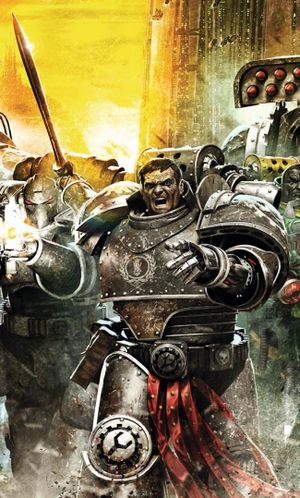
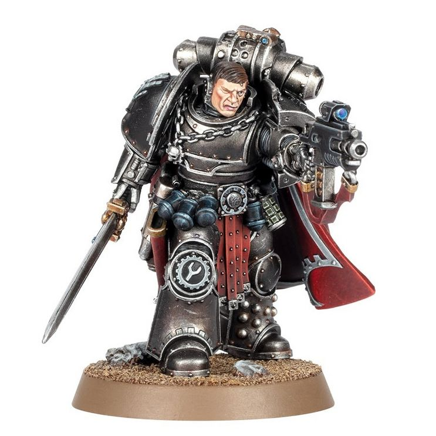

# 0678 沙德拉克·梅杜森 Shadrak Meduson

精校状态：中文行文已逐段精校，部分术语仍为暂定

分类：人类帝国 / 钢铁之手

原文来源：https://www.bilibili.com/opus/1197646085739249666

原作者：帝国神选罐头

原文时间：2026年05月02日 09:58

[返回分类目录](目录.md) · [全书目录](../../目录.md)

<!-- A0678-B0001 -->
**英文原文**

Shadrak Meduson, born Shadrak Smyth and also known as Shadrak 'Bloody' Meduson, was Captain of Sorrgol Clan, the Iron Hands Legion's Tenth Clan Company, during at least the latter part of the Great Crusade and the early stages of the Horus Heresy.

<!-- /A0678-B0001 -->

<!-- A0678-B0002 -->

原译文

沙德拉克·梅杜森，原名沙德拉克·史密斯，也被称为沙德拉克“血腥”梅杜森。至少在大远征的后期和荷鲁斯叛乱的早期阶段，他是钢铁之手军团第十氏族连队索古罗氏族的连长。

**校订译文**

沙德拉克·梅杜森，原名沙德拉克·史密斯，也被称为沙德拉克“血腥”梅杜森。至少在大远征的后期和荷鲁斯之乱的早期阶段，他是钢铁之手军团第十氏族连队索古罗氏族的连长。

<!-- /A0678-B0002 -->

<!-- A0678-B0003 图片 -->

<!-- A0678-B0004 -->

原译文

Shadrak Meduson 沙德拉克·梅杜森

**校订译文**

Shadrak Meduson 沙德拉克·梅杜森

<!-- /A0678-B0004 -->

<!-- A0678-B0005 -->
**英文原文**

After the Drop Site Massacre, Meduson achieved further prominence as a Warleader of his legion (and forces from other legions who allied under his command), his many deeds including an almost-successful assassination attempt upon no less than three of the traitor Primarchs at once. He was ultimately captured and slain by Sons of Horus Captain Tybalt Marr.

<!-- /A0678-B0005 -->

<!-- A0678-B0006 -->

原译文

在登陆点大屠杀之后，梅杜森作为其军团（以及在他指挥下结盟的其他军团的部队）的战争领袖取得了进一步的突出地位，他的许多行为包括一次几乎成功暗杀了至少三名叛徒原体。他最终被荷鲁斯之子连长提伯特·马尔俘虏并杀害。

**校订译文**

登陆点大屠杀后，梅杜森以战争领袖的身份声名鹊起，统率钢铁之手及归附于他的其他军团部队。他的战绩包括一次几乎同时杀死三位叛变原体的刺杀行动。最终，他被荷鲁斯之子连长提伯特·玛尔俘获并杀害。

**校注：** no less than three 在此强调竟达三位，源文后文明确荷鲁斯、莫塔里安、福格瑞姆；不扩写成至少三位之外还有其他。

<!-- /A0678-B0006 -->

<!-- A0678-B0007 -->
## History 历史

<!-- /A0678-B0007 -->

<!-- A0678-B0008 -->
## Forging 锻造

原题：Forging 铸造

<!-- /A0678-B0008 -->

<!-- A0678-B0009 -->
**英文原文**

Shadrak Smyth was a Terran hailing from Old Albia, inducted into the Xth Legion, his service of at least 240 years beginning in the later period of the Wars of Unification on Terra. His first actions as a legionary were as part of the Tenth's deployments in the Afrik and Panpacific regions, serving under Lord Commander Amadeus DuCaine. DuCaine would be Smyth's commander on several occasions, most notably at the Battle of Rust, and by the time of the Drop Site Massacre, the 10th Company Captain would consider the original Legion Master one of his oldest friends.

<!-- /A0678-B0009 -->

<!-- A0678-B0010 -->

原译文

沙德拉克·史密斯是一名来自旧阿尔比亚的泰拉裔，他加入了第十军团，从泰拉统一战争后期开始，他至少服役了240年。他作为一名军团成员的第一次行动是作为第十军团在非洲和泛太平洋地区部署的一部分，在领主指挥官阿玛迪斯·杜凯恩的指挥下服役。杜凯恩将在多个场合担任史密斯的指挥官，最著名的是在铁锈之战中，到登陆点大屠杀发生时，第十连队连长把原来的军团长视为他最老的朋友之一。

**校订译文**

沙德拉克·史密斯来自泰拉的旧阿尔比亚。他在统一战争后期加入第十军团，此后服役至少二百四十年。最早的战斗经历，是在领主指挥官阿玛迪斯·杜凯恩麾下，随第十军团征战非洲与泛太平洋地区。杜凯恩后来又数度指挥史密斯，其中最著名的是铁锈之战。到登陆点大屠杀时，这位第十连长已将军团的首任统帅视为最悠久的挚友之一。

<!-- /A0678-B0010 -->

<!-- A0678-B0011 -->
**英文原文**

Smyth readily embraced the change that came upon the legion when Ferrus Manus, their Primarch, was discovered and placed in command. He cast aside his Terran surname (as did many of the original Terran legionaries) and took up the name Meduson to demonstrate his firm allegiance to his new homeworld.

<!-- /A0678-B0011 -->

<!-- A0678-B0012 -->

原译文

当他们的原体费鲁斯·马努斯被发现并被任命指挥时，史密斯欣然接受了军团发生的变化。他抛弃了自己的泰拉裔姓氏（许多最初的泰拉裔军团士兵也是如此），并使用了梅杜森这个名字来表明他对新家园世界的坚定忠诚。

**校订译文**

原体费鲁斯·马努斯被寻回并接掌军团后，史密斯欣然接受随之而来的变革。和许多最早的泰拉裔军团战士一样，他舍弃原本的泰拉姓氏，改姓梅杜森，以示对新母星的坚定忠诚。

<!-- /A0678-B0012 -->

<!-- A0678-B0013 -->
## Drawing 拉拔

原题：Drawing 描绘

**校注：** 本篇小标题 Forging/Drawing/Bending/Welding/Quenching 连用金属加工隐喻；Drawing 应为拉拔，不是绘画。

<!-- /A0678-B0013 -->

<!-- A0678-B0014 -->
**英文原文**

Meduson took part in the Iron Hands' battles of the Great Crusade, achieving such prominence that, for example, he was the officer assigned battlefield command of the Legion forces upon the world of One-Five-Four-Four whilst both Ferrus Manus and First Captain Gabriel Santar were absent from the line of battle. During this campaign - one of pacification against the inhabitants and hostile lifeforms of a world under the dominance of the Eldar — Meduson commanded the right flank of the legion, his men being used both as an anchor point and as an assault force. As commander of the 10th company, he acted as a mediator between his senior sergeant, Bion Henricos, and the other officers of the Primarch's command council when Sergeant Henricos suggested using their attached Imperial Army units as forward scouts, to the disdain of the others.

<!-- /A0678-B0014 -->

<!-- A0678-B0015 -->

原译文

梅杜森参加了大远征的钢铁之手的战斗，取得了如此突出的成就，例如，他是一名被指派在1544世界指挥军团部队的军官，而费鲁斯·马努斯和第一连长加百列·桑塔尔都没有出现在战线上。在这场战役 - 对灵族统治下的世界的居民和敌对生命形态的平定 - 中，梅杜森指挥着军团的右翼，他的部下既被用作锚点，也被用作突击部队。作为第10连队的指挥官，他在他的高级军士比昂·亨里科斯和原体的指挥议会的其他军官之间担任调解人，当时亨里科斯军士建议使用他们附属的帝国军队单位作为前方侦察兵，这引起了其他人的蔑视。

**校订译文**

梅杜森在大远征中屡立战功，获得重要职责。例如，在编号 1544 的世界作战时，费鲁斯·马努斯与第一连长加百列·桑塔尔都不在前线，便由他负责指挥当地军团部队。这场平定战针对灵族控制下的居民与敌对生物；梅杜森统率右翼，其兵力既负责稳住阵线，也承担突击任务。当高级军士拜昂·亨利科斯提议，利用配属的帝国军部队担任前出侦察兵，却遭原体指挥议会其他军官鄙夷时，身为第十连长的梅杜森从中斡旋。

<!-- /A0678-B0015 -->

<!-- A0678-B0016 -->
**英文原文**

Meduson's temporary command of the Legion forces was successful; he was eventually able to locate the Eldar enemy's node complex that was the target of the mission, and come up with a battle-plan that would ultimately prove victorious. Meduson's pre-battle organisation was so well in hand that, when First Captain Santar returned to the line, he refused to take command and instead left Meduson to enact his strategy, offering himself and his Morlocks as additional line troops for the assault.

<!-- /A0678-B0016 -->

<!-- A0678-B0017 -->

原译文

梅杜森对军团部队的临时指挥是成功的；他最终找到了灵族敌人的节点建筑群，这是任务的目标，并制定了一个最终证明是胜利的作战计划。梅杜森的战前组织非常到位，当第一连长桑塔尔回到前线时，他拒绝接受指挥，而是离开梅杜森制定战略，将自己和他的莫洛克作为额外的前线部队进行突击。

**校订译文**

梅杜森的临时指挥十分成功。他最终找到任务目标——灵族的节点建筑群，并制定了后来取得胜利的作战计划。战前准备井然有序，连第一连长桑塔尔返回前线后，也拒绝接过指挥权，而是让梅杜森继续执行方案，自己带领莫洛克加入一线突击部队。

<!-- /A0678-B0017 -->

<!-- A0678-B0018 -->
## Bending 弯折

原题：Bending 弯曲

<!-- /A0678-B0018 -->

<!-- A0678-B0019 -->
**英文原文**

Meduson was present during the Battle of Istvaan V, but never set foot upon the world. Stationed aboard the Ironside, he was assigned to the obital reserve (once again under the command of DuCaine), ready to drop as part of the Iron Hands' second wave. That moment never came, and instead Shadrak and his fellows watched in horror from above as the massacre took place. The situation quickly and clearly becoming untenable, the orbiting Iron Hands attempted to recover their ground forces, but were swiftly forced to defend themselves from ship-to-ship assaults and boarding actions launched by the Death Guard and Sons of Horus vessels. The Ironside was boarded in these moments, and Meduson led the defence. He and his crew were victorious, although Meduson himself was wounded by a stray plasma blast that made the later amputation of his left hand necessary. Returning to the bridge, he was in time to receive the last transmission from Amadeus DuCaine, informing him of the death of Ferrus Manus. His old commander, referring to Shadrak as "...one of my Storm Walkers from the very start! Emperor's bloody own!" urged Meduson to "...tell the Tenth to raise the storm and take every last one of the bastards to hell!" DuCaine's vessel then catastrophically exploded. Meduson's own ship was able to light its drives and power free from the orbital battlezone.

<!-- /A0678-B0019 -->

<!-- A0678-B0020 -->

原译文

梅杜森在伊斯塔万五号之战中在场，但从未踏足世界。他驻扎在铁边号上，被分配到轨道预备（再次由杜凯恩指挥），准备作为钢铁之手第二波的一部分空降。那一刻从未到来，相反，沙德拉克和他的同伴惊恐地从上面看着大屠杀的发生。局势迅速而明显地变得难以维持，轨道上的钢铁之手试图收回他们的地面部队，但很快被迫防御死亡守卫和荷鲁斯之子战舰发动的船对船袭击和跳帮行动。铁边号在这些时刻被跳帮，梅杜森领导了防守。他和他的船员取得了胜利，尽管梅杜森本人也被一次偏离的等离子爆炸所伤，这使得他后来不得不截肢。回到舰桥，他及时收到了阿玛迪斯·杜凯恩的最后一条信息，通知他费鲁斯·马努斯的死亡。他的老指挥官称沙德拉克为“……从一开始就是我的风暴行者之一！帝皇之血！”他敦促梅杜森“……告诉第十军团掀起风暴，让每一个杂碎都下地狱！”杜凯恩的战舰随后发生了灾难性的爆炸。梅杜森自己的舰船能够在轨道战区自由地点燃引擎和动力。

**校订译文**

梅杜森参与了伊斯塔万五号之战，却从未踏上地表。他驻于铁边号，隶属再次由杜凯恩指挥的轨道预备队，原定随钢铁之手第二波部队空降。这个时机始终没有到来，他与同伴只能从轨道惊恐地目睹大屠杀。局势迅速恶化，留在轨道的钢铁之手试图接回地面部队，却很快遭死亡守卫和荷鲁斯之子舰船攻击，被迫应对舰队交火与跳帮。梅杜森指挥铁边号抗击登舰之敌，与船员一同获胜，但一发流散的等离子攻击击伤了他，导致其左手后来不得不截除。他返回舰桥，及时接到杜凯恩最后的通讯，得知费鲁斯已经阵亡。老上司称他是“……从一开始就跟随我的风暴行者之一！帝皇亲自选中的好汉！”并嘱咐道：“……告诉第十军团，掀起风暴，把这些杂碎一个不剩地送进地狱！”随后，杜凯恩的舰船在剧烈爆炸中毁灭。梅杜森的舰船则成功启动引擎，全速冲出轨道战区。

**校注：** 原译漏左手截除，且将 power free from the...zone 错译为自由地点燃动力；实为逃离战区。Emperor’s bloody own 中 bloody 为强调，不是帝皇的血。

<!-- /A0678-B0020 -->

<!-- A0678-B0021 -->
**英文原文**

With the deaths of Ferrus Manus, Gabriel Santar and Amadeus DuCaine, amongst others, as well as the scattering effect of multiple battlegroups making different escape vectors from the Istvaan system, the Iron Hands as a legion were leaderless and demoralised. Shadrak Meduson found himself in one of the larger, if not largest, groups of Iron Hands, which had with it nearly all of the Clan Fathers of the legion. In the absence of a senior officer, the Clan Fathers announced that they would temporarily take collective command. Meduson was not the lone voice, but was the loudest, that decried this move as pointless, being in favour of singular leadership with a clear vision. Nevertheless, he acquiesced to the decision, following the lead of the senior member of his own clan present, Iron Father Jebez Aug.

<!-- /A0678-B0021 -->

<!-- A0678-B0022 -->

原译文

随着费鲁斯·马努斯、加百列·桑塔尔和阿玛迪斯·杜凯恩等人的死亡，以及多个战斗群从伊斯塔万星系中制造不同逃离载体的分散效应，钢铁之手作为一个军团失去了领导，士气低落。沙德拉克·梅杜森发现自己加入了钢铁之手的一个更大的团体，如果不是最大的团体的话，有几乎所有的军团的氏族之父。在没有高级军官的情况下，氏族之父宣布他们将暂时接管集体指挥权。梅杜森并不是唯一一个谴责此举毫无意义的声音，而是最响亮的声音，他支持具有明确愿景的单人领导。尽管如此，他还是默许了这一决定，听从了他自己氏族中目前在场的高级成员铁父杰贝兹·奥格的领导。

**校订译文**

费鲁斯·马努斯、加百列·桑塔尔、阿玛迪斯·杜凯恩等高层尽数阵亡，各战斗群又沿不同航向逃离伊斯塔万，钢铁之手因此四分五裂，群龙无首，士气崩溃。梅杜森所在的幸存者群体即使不是最大，也属规模最大者之一，军团几乎所有氏族之父都在其中。没有高级军官坐镇，他们便宣布暂时集体掌权。梅杜森并非唯一反对者，却反对得最激烈：他认为此举毫无意义，部队需要一位方向明确的统帅。尽管如此，他最终仍接受决议，听从己方氏族在场资历最深者——钢铁圣父杰贝兹·奥格的指挥。

<!-- /A0678-B0022 -->

<!-- A0678-B0023 -->
**英文原文**

The Clan Fathers determined to reorganise the legion along strictly traditional clan lines, although the rag-tag nature of their forces resulted in one particular change. Clan Avernii was barely represented in the force, the majority of them being wiped out alongside the Primarch on the surface of Istvaan V, and could not form their own unit. Additionally, small units of Raven Guard and Salamanders survivors had also been picked up during the escape, who needed to be fitted into the order of battle somewhere. The Fathers decided - perhaps in response to Shadrak's admonition that the legion should work closely with their cousin legionaries into developing new ways of war instead of turning to old traditions - to fold the outsiders and the disgraced Avernii into Clan Sorrgol. To make up for making Sorrgol a 'mongrel clan', the Fathers also made Jebez Aug the Warleader of the entire battlegroup. Aug, in his turn, made Shadrak Meduson his Hand Elect; his second-in-command.

<!-- /A0678-B0023 -->

<!-- A0678-B0024 -->

原译文

氏族之父决定按照严格的传统氏族路线重组军团，尽管他们部队的混杂性质导致了一个特殊的变化。阿维尼氏族在部队中几乎没有代表，他们中的大多数人在伊斯塔万五号的表面上与原体一起被消灭，无法组建自己的单位。此外，在逃离过程中，小规模的暗鸦守卫和火蜥蜴幸存者也被接走，他们需要在某个地方适应战斗次序。氏族之父们决定 — 也许是为了回应沙德拉克的警告，即军团应该与他们的兄弟军团密切合作，开发新的战争方式，而不是转向旧传统 — 将外来者和耻辱的阿维尼并入索古罗氏族。为了弥补索古罗成为“混血氏族”的不足，氏族之父们还任命杰贝兹·奥格为整个战斗群的战争领袖。奥格则让沙德拉克·梅杜森当选为他的受选之手；他的副手。

**校订译文**

氏族之父决定严格按传统氏族结构重组军团，但幸存部队的混杂状况迫使他们作出一项变通。阿维尼氏族大部与原体一同死在伊斯塔万五号地表，剩余人数不足以独立成军；逃亡途中接回的少量暗鸦守卫与火蜥蜴，也需要编入战斗序列。梅杜森此前曾敦促军团放下旧传统，与兄弟军团合作，探索新的战法。氏族之父也许是在回应这番话，决定将外来者与被视为蒙羞的阿维尼余部一并归入索古罗氏族。作为将索古罗变成“混血氏族”的补偿，他们任命奥格为整个战斗群的战争领袖。奥格则指定梅杜森担任自己的受选之手，也就是副手。

<!-- /A0678-B0024 -->

<!-- A0678-B0025 -->
**英文原文**

Not long after, the fleet received message from another group of Iron Hands, and altered course to meet them. Unfortunately, the meeting proved to be a trap laid by the Sons of Horus. In the naval battle that followed, the battlegroup flagship Crown of Flame was destroyed, taking the Clan Fathers with it. A vox-signal was broadcast from the enemy's own flagship by their commander, Tybalt Marr, offering surrender terms. Aug's response was to take his own vessel, the Iron Heart, into close range with the enemy flagship and to order Meduson to board it and return with Marr's head. Meduson led his mixed legion and clan force for the first time, in a teleport assault onto the Sons of Horus flagship, but despite fighting valiantly and causing much damage, his hybrid forces were forced to retreat before encountering Marr, as the Iron Heart itself took serious damage and Jebez Aug was injured beyond capability to command. Fleeing the area with a reduced force, Meduson found himself given the role of Warleader by the incapacitated Aug. Without the Clan Fathers, this resulted in Meduson suddenly gaining command over the whole force. Conferring with his comrades and the liaisons from the other legion forces, Shadrak Meduson determined that the Iron Hands would need to become flexible in order to not break under the pressures they found themselves in.

<!-- /A0678-B0025 -->

<!-- A0678-B0026 -->

原译文

不久之后，舰队收到了另一群钢铁之手的消息，并改变了航向以迎接他们。不幸的是，这次会面被证明是荷鲁斯之子设下的陷阱。在随后的海战中，战斗群旗舰火焰之冠号被摧毁，氏族之父也在其上。他们的指挥官提伯特·马尔从敌人自己的旗舰上广播了一个音阵信号，提出了投降条件。奥格的回应是将自己的战舰钢铁之心号与敌方旗舰近距离接触，并命令梅杜森跳帮它，带着马尔的头返回。梅杜森首次率领他的混合军团和氏族部队，对荷鲁斯之子旗舰进行了远程传送攻击，但尽管战斗英勇，造成了很大的破坏，他的混合部队在遇到马尔之前被迫撤退，因为钢铁之心号本身受到了严重破坏，杰贝兹·奥格受伤，无法指挥。在兵力减少的情况下逃离该地区时，梅杜森发现自己被失能的奥格赋予了战争领袖的角色。没有氏族之父，这导致梅杜森突然获得了对整个部队的指挥权。沙德拉克·梅杜森与他的战友和其他军团部队的联络人商议后，确定钢铁之手需要变得灵活，以免在他们所面临的压力下崩溃。

**校订译文**

不久，舰队接到另一支钢铁之手部队的讯息，改道与其会合，却落入荷鲁斯之子的陷阱。随后的舰队战中，旗舰火焰之冠号被毁，舰上的氏族之父也随之丧生。敌军指挥官提伯特·玛尔从自己的旗舰发出通讯，提出受降条件。奥格的回应是驾钢铁之心号逼近敌舰，命梅杜森登舰，把玛尔的人头带回来。梅杜森首次率领这支跨氏族、跨军团的混编部队，通过传送登上敌旗舰。他们奋勇作战，造成重大破坏，却尚未找到玛尔便被迫撤离：钢铁之心号遭受重创，奥格也伤重到无法指挥。残部逃离后，失去行动能力的奥格将战争领袖之位交给梅杜森。氏族之父已经阵亡，他于是突然成为全军统帅。与同伴及各军团联络官商议后，梅杜森决定，钢铁之手必须学会变通，才能不被眼前重压折断。

<!-- /A0678-B0026 -->

<!-- A0678-B0027 -->
## Welding 焊接

原题：Welding 熔接

<!-- /A0678-B0027 -->

<!-- A0678-B0028 -->
**英文原文**

As his first act as Warleader, Meduson announced his Hand Elect. Breaking with tradition, he assigned the role to four individuals, not one; a representative each from Sorgol, Avernii, the Salamanders and the Raven Guard. His second pronouncement was to send out a wide-band message, promising to Tybalt Marr that one day, Shadrak Medsuson would have his head. When questioned as to why he was attaching his name to the threat, Meduson outlined that, currently, the traitors did not fear the Istvaan survivors. By using one name again and again when striking and harassing them, he believed he would create an effect like to that of a 'boogeyman', a morale blow that would aid their efforts and hamper the effectiveness of the enemy. Meduson then proposed a strategy that was a combination, an alloying of the legion tactics of all those present; they would fight a guerilla-war, hit and run, but also seek to gather strength to their banner, and save what other survivors of the Massacre and the rebellion that they could.

<!-- /A0678-B0028 -->

<!-- A0678-B0029 -->

原译文

作为他作为战争领袖的第一个行动，梅杜森宣布了他的受选之手。他打破传统，将这个角色分配给四个人，而不是一个人；索古罗、阿维尼、火蜥蜴和暗鸦守卫各派出一名代表。他的第二个声明是发出一条宽带信息，向提伯特·马尔承诺，总有一天，沙德拉克·梅杜森会得到他的头。当被问及为什么将自己的名字附在威胁上时，梅杜森概述说，目前，叛徒并不害怕伊斯塔万的幸存者。通过在打击和骚扰他们时一次又一次地使用一个名字，他相信他会产生一种类似于“恶名”的效果，一种士气打击，这将有助于他们的努力，阻碍敌人的效率。梅杜森随后提出了一种结合所有在场人员的军团战术的战略；他们会打游击战，打了就跑，但也会寻求为他们的旗帜聚集力量，并尽可能地拯救大屠杀和叛乱的其他幸存者。

**校订译文**

梅杜森就任后的第一道命令，是指定受选之手。他打破惯例，不设单一副手，而由索古罗、阿维尼、火蜥蜴与暗鸦守卫各派一人，共四人担任。第二道命令，则是发出全频广播，向提伯特·玛尔宣告：沙德拉克·梅杜森总有一天会取他首级。有人问他为何特意报上姓名，他解释，目前叛军并不惧怕伊斯塔万的幸存者；但若每次袭扰都反复使用同一个名字，便能塑造出让敌人闻之胆寒的梦魇，打击其士气，妨碍其行动。随后，他提出融合在场各军团战术的战略：以游击战袭扰敌军，一击即走；同时不断汇集力量，尽可能救援大屠杀与叛乱中的其他幸存者。

**校注：** 源文 Sorgol 与前文 Sorrgol、Medsuson 与 Meduson 为异拼/误拼，按同物统一中文，英文原样保留。

<!-- /A0678-B0029 -->

<!-- A0678-B0030 -->
**英文原文**

Meduson's next confirmed appearance occurred not too long after the schism of the White Scars legion. In the aftermath of that event, the surviving White Scars marines that had moved against their Primarch were sent out as penitent warriors, grouping as kill-teams, to atone for their previous choice in righteous battle. One of these penitent kill-teams was berthed aboard the captured Sons of Horus ship Grey Talon, captained by the aforementioned Bion Henricos, once Meduson's senior Sergeant, and who had himself escaped Istvaan V, but separated from his company Captain. Henricos and the White Scars kill-team - led by Hibou Khan — ambushed another Sons of Horus vessel and attempted to capture it by boarding action. They met stiffer than expected resistance however, and were only saved from death by the sudden appearance of Meduson and his own contingent of boarding troops. Meduson had been tracking Henricos' ship for some time, confused as to why a vessel that ostensibly appeared to belong to the Sons of Horus was operating according to an Iron Hands search-pattern. The two colleagues appraised each other of events, and Meduson added Henricos and Hibou Khan's unit to his ever-growing own.

<!-- /A0678-B0030 -->

<!-- A0678-B0031 -->

原译文

梅杜森的下一次确认露面发生在白色伤疤军团分裂后不久。在那次事件之后，幸存的白色伤疤战士被派去作为忏悔战士，组成杀戮小队，为他们之前在正义战斗中的选择赎罪。其中一支忏悔杀戮小队停泊在被俘的荷鲁斯之子舰船灰爪号上，该船由上述曾是梅杜森高级军士的比昂·亨利科斯担任船长，他本人逃离了伊斯塔万五号，但与连长分离。亨利科斯和白色伤疤杀戮小队 — 由希布可汗率领 — 伏击了另一艘荷鲁斯之子战舰，并试图通过跳帮行动将其俘获。然而，他们遇到了比预期更激烈的抵抗，只有梅杜森和他自己的跳帮部队突然出现，他们才免于死亡。梅杜森一直在追踪亨利科斯的船一段时间，不明白为什么一艘表面上似乎属于荷鲁斯之子的战舰是按照铁手的搜索模式运作的。两位同僚互相评估了事件，梅杜森将亨利科斯和希布可汗的部队加入了他不断壮大的部队。

**校订译文**

下一次可以确证的梅杜森行踪，出现在白疤军团分裂后不久。曾反抗原体的白疤战士幸存下来后，被编成赎罪杀戮小队，派去以正义之战弥补先前的错误选择。其中一队驻在缴获自荷鲁斯之子的灰爪号上。舰长正是梅杜森昔日的高级军士拜昂·亨利科斯；他逃出了伊斯塔万，却与连长失散。亨利科斯与希布可汗率领的白疤小队伏击另一艘荷鲁斯之子舰船，企图跳帮夺舰，却遭遇远超预期的抵抗。梅杜森及其登舰部队及时现身，才使他们免于覆灭。此前，梅杜森已追踪灰爪号一段时间，疑惑一艘看似属于荷鲁斯之子的战舰，为何采用钢铁之手的搜索模式。两位旧友交换各自经历后，亨利科斯与希布可汗的小队也加入了梅杜森日益壮大的部队。

**校注：** 原译漏 moved against their Primarch，必须明确受罚的是曾反抗原体的那批白疤战士。

<!-- /A0678-B0031 -->

<!-- A0678-B0032 -->
**英文原文**

Indeed, by such time as the Battle of Dwell, Shadrak Meduson was reckoned to have assembled quite a significant force. Believed attached to his 'mongrel clan' of original Istvaan V survivors were additional marine elements from the Salamanders and White Scars, numerous naval vessels and apparently enough soldiery to total fifty-eight full battalions of the Imperial Army. The Battle of Dwell occurred mainly because Horus Lupercal wanted the planet for his own purposes, but also in some small part in order to deny its 8 million armed troopers from allying with Meduson's forces in the sector. Several Sons of Horus officers, notably 'Little' Horus Aximand, suspected that Meduson may have already embedded men onto the planet, and this would prove to be true; at the culmination of the battle, a legionary kill-team who had been awaiting to assassinate Lupercal found themselves out of position, and so settled for attempting to eliminate Horus Aximand and his command element instead. The resultant combat saw Bion Henricos perish, and Little Horus severely wounded.

<!-- /A0678-B0032 -->

<!-- A0678-B0033 -->

原译文

事实上，到德维尔之战时，沙德拉克·梅杜森被认为已经集结了一支相当不可忽视的部队。据信，他最初的伊斯塔万五号幸存者的“混血氏族”还包括来自火蜥蜴和白色伤疤的额外战士成员、众多海军战舰，以及显然足够帝国军队58个完整营的士兵。德维尔之战的发生主要是因为荷鲁斯·卢佩卡尔为了自己的目的想要这个行星，但也有一小部分是为了阻止其800万武装部队与梅杜森在该地区的部队结盟。几名荷鲁斯之子军官，特别是“小”荷鲁斯·阿西曼德，怀疑梅杜森可能已经将人安置在这个行星上，这将被证明是真的；在战斗的高潮，一支一直在等待刺杀卢佩卡尔的军团杀戮小队发现自己已经失去了位置，于是决定试图消灭荷鲁斯·阿西曼德和他的指挥部。由此产生的战斗导致比昂·亨利科斯牺牲，小荷鲁斯重伤。

**校订译文**

到德威尔之战时，据估计梅杜森已集结相当可观的兵力。他最初由伊斯塔万五号幸存者组成的“混血氏族”，据说又获得火蜥蜴、白疤战士与大批舰船加入，帝国军兵力似乎更足以编成五十八个满员营。荷鲁斯进攻德威尔，主要是为实现自身战略，也部分为了阻止当地八百万武装人员投向梅杜森在该星区的部队。“小荷鲁斯”阿西曼德等军官怀疑，梅杜森早已派人潜入，事实也确实如此。战役进入关键阶段时，一支原本等候刺杀荷鲁斯·卢佩卡尔的军团杀戮小队发现自己不在合适的攻击位置，只得转而袭击阿西曼德及其指挥班子。交战中，拜昂·亨利科斯阵亡，小荷鲁斯则身负重伤。

<!-- /A0678-B0033 -->

<!-- A0678-B0034 -->
**英文原文**

This was not the only assassination attempt masterminded by Shadrak Meduson on Dwell, however. In the aftermath of the battle, when the primarchs Horus, Mortarion and Fulgrim met to discuss their next moves, their conclave was attacked by a trio of Iron Hands Fire Raptor gunships, heretofore hidden from detection and deployed likewise. This attempt was similarly unsuccessful, with the loss of all three of Meduson's birds, but all of the primarchs and several of the other marines present were wounded to some degree, some seriously. It is perhaps the closest currently known of attempt to eliminate Horus, and all the more impressive for nearly removing multiple other essential personnel from the board as well.

<!-- /A0678-B0034 -->

<!-- A0678-B0035 -->

原译文

然而，这并不是沙德拉克·梅杜森在德维尔策划的唯一一次暗杀企图。战斗结束后，当原体荷鲁斯、莫塔里安和福格瑞姆会面讨论他们的下一步行动时，他们的秘密会议遭到了三架钢铁之手火隼炮艇的袭击，此前这些炮艇一直隐藏着，并以同样的方式部署。这次尝试同样没有成功，梅杜森的三只鸟全部损失，但所有的原体和其他几名战士都受了一定程度的伤，有些伤势严重。这可能是目前已知的最接近消灭荷鲁斯的尝试，更令人印象深刻的是，他们还几乎将多名其他关键人员从委员会中清除。

**校订译文**

这还不是梅杜森在德威尔策划的唯一一次刺杀。战后，荷鲁斯、莫塔里安与福格瑞姆聚会商讨下一步行动，三架此前一直隐匿行踪的钢铁之手火猛禽炮艇突然袭击会场。行动同样未能成功，三架炮艇全部被击毁，但三位原体与在场数名军团战士都不同程度受伤，部分伤势严重。按本篇说法，这可能是已知最接近杀死荷鲁斯的行动之一；而它还差点同时除掉数位叛军关键人物，成效尤为惊人。

<!-- /A0678-B0035 -->

<!-- A0678-B0036 -->
**英文原文**

Following this event, and the baiting and destruction of an Iron Hands ambush vessel further out in the Dwell system, Horus decided to detach a portion of his legion resources and assign them to hunting down and destroying Meduson and his own band. This force was placed under the command of Captain Tybalt Marr, who felt he had a personal score to settle with the Iron Hands warleader.

<!-- /A0678-B0036 -->

<!-- A0678-B0037 -->

原译文

在这一事件之后，以及在德维尔星系更远的地方诱饵和摧毁钢铁之手伏击战舰之后，荷鲁斯决定分离他的一部分军团资源，并将其分配给追捕和摧毁梅杜森和他自己的群体。这支部队由提伯特·马尔连长指挥，他觉得自己需要与钢铁之手战争领袖算账。

**校订译文**

事件过后，叛军又在德威尔星系外围诱出并摧毁了一艘钢铁之手伏击舰。荷鲁斯于是决定分出部分军团兵力，专门追猎梅杜森及其部队，并将指挥权交给提伯特·玛尔。玛尔认为，自己与这位钢铁之手战争领袖还有一笔私仇要算。

<!-- /A0678-B0037 -->

<!-- A0678-B0038 -->
## Quenching 淬火

<!-- /A0678-B0038 -->

<!-- A0678-B0039 -->
**英文原文**

No sightings of Meduson can be confirmed for the period immediately after the Battle of Dwell and the launching of Marr's hunter-killer force. The 'shadow network' used by the Shattered Legions became filled with conflicting tales, either that he fought on still, or that he had died either on Dwell or someplace else, caught by the Sons of Horus.

<!-- /A0678-B0039 -->

<!-- A0678-B0040 -->

原译文

在德维尔之战和马尔的猎杀部队发动后的一段时间内，没有人能证实梅杜森的踪迹。破碎军团使用的“暗影网络”充满了相互矛盾的故事，要么他还在战斗，要么他在德维尔或其他地方牺牲，被荷鲁斯之子抓住。

**校订译文**

德威尔之战及玛尔猎杀部队出动后的一段时期，没有人能够确证梅杜森的行踪。破碎军团的“暗影网络”流传着相互矛盾的消息：有人说他仍在作战，也有人说他已在德威尔或别处被荷鲁斯之子抓住，随后身亡。

<!-- /A0678-B0040 -->

<!-- A0678-B0041 -->
**英文原文**

Shadrak Meduson's identity was at some point taken by none other than Alpharius, Primarch of the Alpha Legion himself. Assuming the mantle of Meduson and garbing a unit of his own marines in Iron Hand battlegear, Alpharius' disguise was completely undetectable by the members of the Iron Hands legion he met. Travelling in a vessel that appeared to be the Iron Heart, Meduson's own flagship, Alpharius fell in with a separate unit of mixed Istvaan survivor marines under the command of Cadmus Tyro and convinced them, in his guise as Meduson, to aid him in an action against other members of the Alpha Legion. His deception was revealed towards the end of the affair, and the survivors of Tyro's force escaped with the knowledge that Alpharius had been impersonating Meduson.

<!-- /A0678-B0041 -->

<!-- A0678-B0042 -->

原译文

沙德拉克·梅杜森的身份在某个时候被阿尔法军团的原体阿尔法瑞斯夺走了。阿尔法瑞斯披上了梅杜森的斗篷，并为自己的一支战士穿上了钢铁之手战斗装备，他遇到的钢铁之手军团成员完全无法察觉阿尔法瑞斯的伪装。阿尔法瑞斯乘坐一艘看起来像是梅杜森自己的旗舰钢铁之心号的战舰，在卡德摩斯·提洛的指挥下，与一支由伊斯塔万幸存者组成的独立部队会合，并以梅杜森的身份说服他们协助他对抗阿尔法军团的其他成员。他的欺骗行为在事件接近尾声时被揭露，提洛部队的幸存者在知道阿尔法瑞斯一直在冒充梅杜森的情况下逃离了。

**校订译文**

此后某时，阿尔法军团原体阿尔法瑞斯竟亲自冒用梅杜森的身份。他让麾下一队战士穿上钢铁之手装备，自己的伪装也瞒过了遇到的所有钢铁之手成员。他乘坐一艘外观如同梅杜森旗舰钢铁之心号的战舰，与卡德摩斯·泰罗率领的另一支伊斯塔万混编幸存部队会合，并以梅杜森之名说服对方，协助他攻击阿尔法军团的其他成员。行动末尾，骗局被揭穿，泰罗部队的幸存者带着阿尔法瑞斯冒名顶替的消息逃走。

**校注：** 卡德摩斯·泰罗统率的是幸存者混编部队，不是阿尔法瑞斯的上级；原译逗号位置颠倒指挥关系。

<!-- /A0678-B0042 -->

<!-- A0678-B0043 -->
## Downfall 覆灭

<!-- /A0678-B0043 -->

<!-- A0678-B0044 -->
**英文原文**

The real Shadrak Meduson still endured elsewhere in the galaxy, and was waging his guerrilla war against Horus with increasing brutality. However Meduson's authority was usurped by the increasing madness and desperation in the Iron Hands. A coup by the Cult of the Gorgon attempted to take control of Meduson's sizable Shattered Legion forces, proclaiming they were led by the reborn Ferrus Manus himself. However Vulkan, accompanying the fleet on his journey to Terra, quickly saw through the charade and revealed that the "reborn" Ferrus Manus to only be a mechanical puppet with one of the Primarch's metallic arms attached. Vulkan shattered the puppet in anger, and with that the Cult of the Gorgon crumbled. Despite their treachery, Meduson pardoned all of the Iron Fathers involved in the Cult of the Gorgon including his second-in-command, Jebez Aug.

<!-- /A0678-B0044 -->

<!-- A0678-B0045 -->

原译文

真正的沙德拉克·梅杜森仍然在银河系的其他地方忍受着苦难，并以越来越残酷的方式对荷鲁斯发动游击战。然而，梅杜森的权威被钢铁之手日益增长的疯狂和绝望所篡夺。戈尔贡教派发动政变，试图控制梅杜森庞大的破碎军团，宣称他们是由重生的费鲁斯·马努斯本人领导的。然而，陪同舰队前往泰拉的沃坎很快看穿了这场闹剧，并透露“重生”的费鲁斯·马努斯只是一个机械人偶，上面还附有一只原体的金属手臂。沃坎愤怒地打碎了人偶，随之戈尔贡教派也崩溃了。尽管他们背信弃义，梅杜森还是赦免了所有参加戈尔贡教派的铁父，包括他的副手杰贝兹·奥格。

**校订译文**

真正的梅杜森仍在银河别处坚持战斗，对荷鲁斯发动愈发残酷的游击战争。然而，钢铁之手中不断滋长的疯狂与绝望动摇了他的权威。戈尔贡教派发动政变，宣称“复活”的费鲁斯·马努斯亲自领导他们，试图夺取梅杜森麾下庞大的破碎军团部队。正随舰队前往泰拉的沃坎很快识破骗局：所谓重生的原体，不过是一具装着费鲁斯金属手臂的机械傀儡。他愤怒地击碎傀儡，教派随之瓦解。尽管这些人背叛了自己，梅杜森仍赦免了所有参与者，包括副手杰贝兹·奥格在内的钢铁圣父。

<!-- /A0678-B0045 -->

<!-- A0678-B0046 图片 -->

<!-- A0678-B0047 -->

原译文

Shadrak Meduson 沙德拉克·梅杜森

**校订译文**

Shadrak Meduson 沙德拉克·梅杜森

<!-- /A0678-B0047 -->

<!-- A0678-B0048 -->
**英文原文**

Now in control of his forces once more but refused help from Vulkan, Meduson continued his war against Horus. He became engaged in an increasingly bitter struggle with Captain Tybalt Marr, who goaded him into open confrontation. Despite the advice of his Iron Fathers to avoid direct combat, Meduson openly fought Marr's larger fleet at the Battle of the Aragna Chain. As the losses mounted, Meduson led a boarding action against Marr's flagship Lupercal Pursuivant but was ambushed and captured as Jebez Aug abandoned him to his fate and withdrew with the remainder of the loyalist fleet. Taken before Tybalt Marr, Meduson declared that the Iron Tenth would never be broken before he was decapitated by the Sons of Horus captain.

<!-- /A0678-B0048 -->

<!-- A0678-B0049 -->

原译文

现在，梅杜森再次控制了他的部队，但拒绝了沃坎的帮助，继续与荷鲁斯作战。他开始与提伯特·马尔连长进行越来越激烈的斗争，后者怂恿他公开对抗。尽管他的铁父建议他避免直接战斗，但梅杜森在阿拉格纳星链之战中公开与马尔的更大舰队作战。随着损失的增加，梅杜森领导了对马尔的旗舰牧狼神传令号的跳帮行动，但在杰贝兹·奥格抛弃他并与忠诚派舰队的其余成员一起撤退时遭到伏击并被捕。在提伯特·马尔身前，梅杜森宣布，在他被荷鲁斯之子连长斩首之前，铁十永远不会被摧毁。

**校订译文**

梅杜森重新掌控部队后，未能得到沃坎的援助，只得继续独力对抗荷鲁斯。他与提伯特·玛尔的交锋愈发惨烈，后者不断激将，诱他正面决战。尽管钢铁圣父们劝他避免硬碰硬，梅杜森仍在阿拉格纳星链之战中迎击玛尔规模更大的舰队。伤亡不断增加，他率队登上玛尔的旗舰卢佩卡尔传令官号，却遭伏击被俘；杰贝兹·奥格则抛下他，带领余下的忠诚派舰队撤离。被押到玛尔面前时，梅杜森宣告：“钢铁第十军团永不屈服。”随后，荷鲁斯之子连长将他斩首。

**校注：** 源文 but refused help from Vulkan 有省略歧义。交叉708 B0056明确 Vulkan refused to take part in Meduson’s war，故为梅杜森未获沃坎援助，而非梅杜森拒援。末句 before he was decapitated 表示遗言说于斩首之前，不是“只在被斩首以前军团不会被摧毁”。

<!-- /A0678-B0049 -->

本篇核心术语与暂定项

以下列出本篇出现的英文原形及核心术语表用词。同形词可能指不同对象，具体词义以本篇正文和校注为准；单复数、别名和仅见于图注的名称可能尚未列入。完整候选见[术语表](../../术语表/双语术语候选.csv)。

| 英文 | 采用中文 | 状态 |
| --- | --- | --- |
| Imperial Army | 帝国军 | 暂定·官方待核 |
| Death Guard | 死亡守卫 | 官方已核对 |
| Eldar | 灵族 | 暂定·语境区分 |
| Horus Heresy | 荷鲁斯之乱 | 官方已核对 |
| Emperor | 帝皇 | 官方已核对 |
| Primarch | 原体 | 官方已核对 |
| The Order | 秩序 | 暂定·官方待核 |
| Great Crusade | 大远征 | 暂定·官方待核 |
| Mortarion | 莫塔里安 | 官方已核对 |
| Ferrus Manus | 费鲁斯·马努斯 | 暂定·官方待核 |
| Terra | 泰拉 | 暂定·官方待核 |
| Horus | 荷鲁斯 | 暂定·官方待核 |
| Sons of Horus | 荷鲁斯之子 | 暂定·官方待核 |
| Iron Hands | 钢铁之手 | 暂定·官方待核 |
| Fulgrim | 福格瑞姆 | 官方已核对 |
| Hunter-Killer | 猎杀者 | 暂定·官方待核 |
| Sector | 星区 | 暂定·官方待核 |
| Vulkan | 沃坎 | 暂定·官方待核 |
| Salamanders | 火蜥蜴 | 暂定·官方待核 |
| Clear | 清明 | 暂定·官方待核 |
| Master | 导师（审判庭职衔）／舰务官（舰员职务） | 语境定译·官方待核 |
| Mission | 教团／传教机构 | 暂定 |
| Iron Father | 钢铁圣父 | 暂定·官方待核 |
| Horus Lupercal | 荷鲁斯·卢佩卡尔 | 暂定·官方待核 |
| Lupercal | 卢佩卡尔 | 暂定·官方待核 |
| Lupercal Pursuivant | 卢佩卡尔传令官号 | 暂定·官方待核 |
| Horus Aximand | 荷鲁斯·阿西曼德 | 暂定·官方待核 |
| Tybalt Marr | 提伯特·玛尔 | 暂定·官方待核 |
| Shadrak Meduson | 沙德拉克·梅杜森 | 暂定·官方待核 |
| Lord Commander | 领主指挥官 | 暂定·官方待核 |
| White Scars | 白疤 | 官方已核 |
| Alpha Legion | 阿尔法军团 | 暂定·官方待核 |
| Raven Guard | 暗鸦守卫 | 官方已核 |
| The Primarchs | 原体 | 暂定·官方待核 |
| Scars | 伤疤 | 暂定·官方待核 |
| Penitent | 忏悔 | 暂定·官方待核 |
| Shattered Legions | 破碎军团 | 暂定·官方待核 |
| The Battle of the Aragna Chain | 阿拉格纳星链之战 | 暂定·官方待核 |
| Jebez Aug | 杰贝兹·奥格 | 暂定·官方待核 |
| Bion Henricos | 拜昂·亨利科斯 | 暂定·官方待核 |
| Cadmus Tyro | 卡德摩斯·泰罗 | 暂定·官方待核 |
| Legion Master | 军团长 | 暂定·官方待核 |
| Amadeus DuCaine | 阿玛迪乌斯·杜凯因 | 暂定·官方待核 |
| First Captain | 第一连长 | 暂定·官方待核 |
| Gabriel Santar | 加百列·桑塔尔 | 暂定·官方待核 |
| Captain | 连长 | 暂定·官方待核 |
| Sergeant | 军士 | 暂定·官方待核 |
| Reborn | 复生者（战团）／重生者（死神军自称） | 语境定译·官方待核 |
| Alpharius | 阿尔法瑞斯 | 暂定·官方待核 |
| Iron Tenth | 钢铁第十军团 | 暂定·官方待核 |
| Storm Walkers | 风暴行者 | 暂定·官方待核 |
| Iron Fathers | 钢铁圣父 | 暂定·官方待核 |
| Clan Avernii | 阿维尼氏族 | 暂定·官方待核 |
| Clan Sorrgol | 索古罗氏族 | 暂定·官方待核 |
| Iron Heart | 钢铁之心号 | 暂定·官方待核 |
| Morlocks | 莫洛克 | 暂定·官方待核 |
| Cadmus | 卡德摩斯 | 暂定·官方待核 |
| Cult of the Gorgon | 戈尔贡教派 | 暂定·官方待核 |
| Aragna Chain | 阿拉贡纳星链 | 暂定·官方待核 |
| Dwell | 德威尔 | 暂定·官方待核 |
| System | 星系（恒星系统） | 暂定·官方待核 |
| Shadrak Smyth | 沙德拉克·史密斯 | 暂定·官方待核 |
| Ironside | 铁边号 | 暂定·官方待核 |
| Hand Elect | 受选之手 | 暂定·官方待核 |
| Crown of Flame | 火焰之冠号 | 暂定·官方待核 |
| Battle of the Aragna Chain | 阿拉格纳星链之战 | 暂定·官方待核 |
| Albia | 阿尔比亚 | 暂定·官方待核 |
| Gorgon | 戈尔贡 | 暂定·官方待核 |
| The Loss | 失落 | 暂定·官方待核 |
| Afrik | 阿弗里克 | 暂定·官方待核 |

