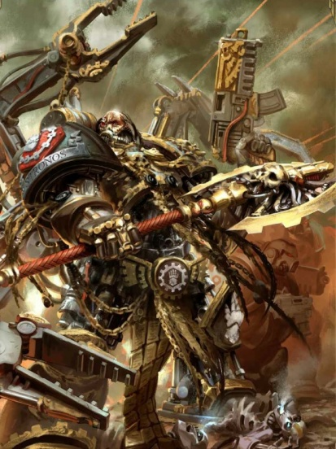

# 0679 卡丹·斯特罗诺斯 Kardan Stronos

精校状态：中文行文已逐段精校，部分术语仍为暂定

分类：人类帝国 / 钢铁之手

原文来源：https://www.bilibili.com/opus/1118662981483233285

原作者：帝国神选罐头

原文时间：2025年10月01日 13:43

[返回分类目录](目录.md) · [全书目录](../../目录.md)

<!-- A0679-B0001 -->
**英文原文**

Kardan Stronos is an Iron Father of the Iron Hands Space Marines Chapter who serves as its current elected Chapter Master.

<!-- /A0679-B0001 -->

<!-- A0679-B0002 -->

原译文

卡丹·斯特罗诺斯是钢铁之手星际战士战团的铁父，现任战团长。

**校订译文**

卡丹·斯特罗诺斯是钢铁之手的钢铁圣父，也是战团当前经选举产生的战团长。

**校注：** 源文 elected 必须保留，体现战团长由议会授予且可收回权力的制度。

<!-- /A0679-B0002 -->

<!-- A0679-B0003 图片 -->

<!-- A0679-B0004 -->

原译文

Kardan Stronos 卡丹·斯特罗诺斯

**校订译文**

Kardan Stronos 卡丹·斯特罗诺斯

<!-- /A0679-B0004 -->

<!-- A0679-B0005 -->
## History 历史

<!-- /A0679-B0005 -->

<!-- A0679-B0006 -->
**英文原文**

Kardan Stronos was originally a Space Marine of Clan Vurgaan, however he was transferred to Clan Garrsak upon him reaching the rank of Sergeant.

<!-- /A0679-B0006 -->

<!-- A0679-B0007 -->

原译文

卡丹·斯特罗诺斯最初是沃尔甘氏族的星际战士，但在晋升为军士后，他被调到格拉萨克氏族。

**校订译文**

卡丹·斯特罗诺斯最初是沃尔甘氏族的星际战士，但在晋升为军士后，他被调到格拉萨克氏族。

<!-- /A0679-B0007 -->

<!-- A0679-B0008 -->
**英文原文**

He then went on to serve for years as Iron-Captain of Clan Garrsak before he was inducted into the Iron Hands Chaplaincy, eventually traveling to Mars for training as a Techmarine. His reverence for the Machine and hatred of weakness earned him a place on the Iron Council, and his ruthlessness and desire to succeed made him the logical choice to be the next Chapter Master of the Iron Hands, taking all power and responsibilities for campaigns involving multiple Clan-Companies and returning power back to the Clan Council at the end of the campaign. Stronos was originally elected by the Council, and as is chapter tradition can have it stripped away from him at any given time. It is a testament of his skill as a leader and warrior that the Clan Council has appointed him as Commander for over three consecutive centuries. Under his leadership, the Iron Hands have destroyed Waaagh! Drezgnod and the renegade Blood Heralds, as well as purging Hive Fleet Moloch from the Regis System.

<!-- /A0679-B0008 -->

<!-- A0679-B0009 -->

原译文

然后，他继续担任格拉萨克氏族的钢铁连长多年，然后被任命为钢铁之手牧师，最终前往火星接受技术军士训练。他对机械的敬畏和对软弱的憎恨为他在钢铁议会中赢得了一席之地，他的无情和对成功的渴望使他成为下一个钢铁之手战团长的合乎逻辑的选择，在涉及多个氏族连队的战役中承担所有权力和责任，并在战役结束时将权力归还给氏族议会。斯特罗诺斯最初是由议会选举产生的，正如战团的传统一样，它可以在任何时候从他身上被剥夺。氏族议会连续三个多世纪任命他为指挥官，这证明了他作为领导者和战士的技能。在他的领导下，铁手摧毁了德雷兹格诺德的Waaagh！和叛徒鲜血使者，以及从雷吉斯星系中清除虫巢舰队摩洛克。

**校订译文**

斯特罗诺斯曾担任格拉萨克氏族的钢铁连长多年，随后加入战团教士体系，最终前往火星接受科技战士训练。他对机械的崇敬与对软弱的憎恨，为他赢得了钢铁议会席位；冷酷果决与志在成功的性格，则使他成为战团长的合适人选。涉及多个氏族连队的战役，由他全权指挥并承担责任，战后再将权力交还氏族议会。斯特罗诺斯的职权来自议会选举，依战团传统，也可随时被收回。议会连续三个多世纪任命他为统帅，足以证明其领导与战斗才能。在他统率下，钢铁之手消灭了德雷兹格诺德 Waaagh! 与叛变的鲜血使者，并将摩洛克虫巢舰队逐出雷吉斯星系。

<!-- /A0679-B0009 -->

<!-- A0679-B0010 -->
**英文原文**

During the era of the Kristosian Conclave, Stronos was among those who opposed the Kristonian faction of the Iron Hands and stressed the Chapter's humanity over the machine aspect emphasized by Kristos and his followers. After the Gaudinian Heresy, where a third of the Iron Council was lost, Stronos inspired the remaining Council members to endure by reminding them that they were also men and not purely cold machines. Since then, Stronos was elected War Leader of the Iron Council and has been reelected at every opportunity since.

<!-- /A0679-B0010 -->

<!-- A0679-B0011 -->

原译文

在克里斯托斯派秘会时期，斯特罗诺斯是反对钢铁之手的克里斯托斯派的人之一，他强调战团的人性，而不是克里斯托斯派及其追随者强调的机械方面。在高迪尼安叛乱之后，钢铁议会失去了三分之一的席位，斯特罗诺斯提醒剩下的议会成员，他们也是人，而不是纯粹的冷酷机器，以此激励他们坚持下去。从那时起，斯特罗诺斯被选为钢铁议会的战争领袖，并在此后的每一次机会中再次当选。

**校订译文**

克里斯托斯派议会掌权时期，斯特罗诺斯属于反对阵营，强调战团的人性，反对克里斯托斯及其追随者过度推崇机械。高迪尼安叛乱导致钢铁议会三分之一成员丧失后，他提醒幸存者：他们同样是人，并非纯粹冰冷的机器，以此激励众人坚持下去。此后，斯特罗诺斯当选议会的战争领袖，并在随后每次选举中连任。

<!-- /A0679-B0011 -->

<!-- A0679-B0012 -->
**英文原文**

As of 760.M41 Kardan Stronos had been on the Iron Council as de facto Chapter Master for 300 consecutive years, making him the longest serving Iron Hands leader since Primarch Ferrus Manus. It was in the face of Waaagh! Grimfist that the Iron Council reappointed Stronos to lead the Chapter for the 300th consecutive year. Stronos then brutally annihilated Grimfist's Orks.

<!-- /A0679-B0012 -->

<!-- A0679-B0013 -->

原译文

截至760.M41，卡丹·斯特罗诺斯已连续300年在钢铁议会担任事实上的战团长，这使他成为自原体费鲁斯·马努斯以来任职时间最长的钢铁之手领袖。在面对冷拳的Waaagh！时，钢铁议会已连续300年再次任命斯特罗诺斯领导战团。斯特罗诺斯随后残酷地消灭了冷拳的欧克。

**校订译文**

截至 760.M41，斯特罗诺斯已连续三百年以事实上的战团长身份主持钢铁议会，是费鲁斯·马努斯之后任职最久的钢铁之手领袖。正值冷拳 Waaagh! 来袭之际，议会再次任命他，使其任期进入连续第三百年。此后，他以残酷的攻势歼灭了冷拳的欧克部队。

**校注：** 原文一处说截至760已任300年，一处说同次选任开始第300年，计年表述略有差异，未自拟具体上任年份。

<!-- /A0679-B0013 -->

<!-- A0679-B0014 -->
**英文原文**

In 802.M41, during the Defense of Parathen City he accepted a challenge to personal combat from Varlag the Butcher, a World Eaters Champion of Chaos, decapitating him with his Axe of Medusa. In 998.M41 after battling the Farsight Enclaves on Fall'yth Stronos gave up his position on the Iron Council, but was immediately reappointed by the Council in the face of the threat posed by Hive Fleet Leviathan — despite the objection of several veteran Iron Fathers.

<!-- /A0679-B0014 -->

<!-- A0679-B0015 -->

原译文

802.M41，在保卫帕拉森城期间，他接受了混沌吞世者冠军屠夫瓦拉格的决斗挑战，用他的美杜莎之斧将他斩首。998年，在与法尔'伊斯的远见飞地作战后，斯特罗诺斯放弃了他在钢铁议会的职位，但面对虫巢舰队利维坦构成的威胁，他立即被钢铁议会重新任命，尽管几位资深铁父反对。

**校订译文**

802.M41，保卫帕拉森城时，斯特罗诺斯接受吞世者混沌勇士“屠夫”瓦拉格的决斗挑战，以美杜莎之斧将其斩首。998.M41，在法尔’伊斯与远见飞地交战后，他辞去钢铁议会中的职务。然而，面对利维坦虫巢舰队的威胁，议会不顾数位资深钢铁圣父反对，立即重新任命了他。

**校注：** 补回英文完整纪年998.M41；Champions of Chaos 为混沌勇士，不是赛事冠军。

<!-- /A0679-B0015 -->

<!-- A0679-B0016 -->
**英文原文**

After the formation of the Great Rift, Kardan Stronos appeared on Vigilus leading eight Clan-Companies of Iron Hands and two companies of Brazen Claws in aid of their Mechanicus allies in the War of Beasts.

<!-- /A0679-B0016 -->

<!-- A0679-B0017 -->

原译文

大裂隙形成后，卡丹·斯特罗诺斯出现在警戒星，领导八个钢铁之手氏族连队和两个黄铜之爪连队，以帮助他们在野兽战争中的机械教盟友。

**校订译文**

大裂隙形成后，斯特罗诺斯率钢铁之手八个氏族连队，以及黄铜之爪两个连队，前往警戒星参加野兽之战，援助机械修会盟友。

**校注：** War of Beasts 为野兽之战；这里 Mechanicus 指机械修会，非30K的Mechanicum机械教。

<!-- /A0679-B0017 -->

<!-- A0679-B0018 -->
## Personality and beliefs 个性和信仰

<!-- /A0679-B0018 -->

<!-- A0679-B0019 -->
**英文原文**

Kardan Stronos is an firm believer in firepower and considers it the only tenet of battle. He considers Razorback assault transports to be the pinnacle of battlefield effectiveness. Like many in the Iron Hands, he is also a follower of the Cult Mechanicus and worships the Omnissiah.

<!-- /A0679-B0019 -->

<!-- A0679-B0020 -->

原译文

卡丹·斯特罗诺斯坚信火力，并认为这是战斗的唯一原则。他认为豪猪突击运输车是战场效能的巅峰之作。像钢铁之手中的许多人一样，他也是机械教派的追随者，崇拜欧姆尼赛亚。

**校订译文**

斯特罗诺斯坚信火力，视其为战斗的唯一准则。在他看来，用于突击运输的豪猪战车代表了战场效能的巅峰。与许多钢铁之手一样，他信奉机械教派，崇拜欧姆尼赛亚。

<!-- /A0679-B0020 -->

<!-- A0679-B0021 -->
**英文原文**

Stronos's desire to eradicate weakness has extended to his fellow Iron Hands. At his urging, the Clan Council has expanded to include Iron-Captains, Apothecaries, Chaplains, and other Iron Hands, broadening the collective wisdom of the Council. Stronos also believes that by suppressing their emotions, the Iron Hands are making themselves weaker, he is convinced that only by experiencing and mastering their emotions can they become the perfect Space Marines. While his actions have undoubtedly strengthened the Chapter, many other Iron Fathers view the changes he has made with caution. Stronos has long displayed difficulty mastering his own emotions, and many fear that he will suffer the same fate as their Primarch Ferrus Manus in allowing his anger to overcome his judgement.

<!-- /A0679-B0021 -->

<!-- A0679-B0022 -->

原译文

斯特罗诺斯根除弱点的愿望也延伸到了他的钢铁之手追随者身上。在他的敦促下，氏族议会扩大到包括钢铁连长、药剂师、牧师和其他钢铁之手，扩大了议会的集体智慧。斯特罗诺斯还认为，通过抑制自己的情绪，钢铁之手正在让自己变得更弱，他相信只有经历和掌握自己的情绪才能成为完美的星际战士。虽然他的行为无疑加强了战团的力量，但许多其他铁父对他所做的改变持谨慎态度。斯特罗诺斯长期以来一直表现出难以控制自己的情绪，许多人担心他会遭受与他们的原体费鲁斯·马努斯相同的命运，让他的愤怒战胜他的判断。

**校订译文**

斯特罗诺斯消除弱点的追求，也指向自己的钢铁之手同袍。在他的推动下，氏族议会扩大组成，纳入钢铁连长、药剂师、教士及其他成员，汇集更多智慧。他还认为，一味压抑情感只会让钢铁之手变得更脆弱；唯有体验并驾驭情感，他们才能成为完美的星际战士。尽管这些举措无疑增强了战团，许多钢铁圣父仍对改革保持谨慎。斯特罗诺斯自己也长期难以控制情绪，因此不少人担心，他会像原体费鲁斯一样，被怒火压倒判断力，最终重蹈覆辙。

<!-- /A0679-B0022 -->

<!-- A0679-B0023 -->
**英文原文**

Of all the enemies the Iron Hands have faced, it is the Necrons that Kadan Stronos hates the most, viewing the soulless automatons as abominations in the eyes of the Omnissiah. When expecting to face Necron forces, Stronos will persecute the wars with the Necrons more perniciously than the Clan Council believe to be necessary.

<!-- /A0679-B0023 -->

<!-- A0679-B0024 -->

原译文

在钢铁之手所面对的所有敌人中，卡丹·斯特罗诺斯最讨厌的是死灵，他认为没有灵魂的自动机械在欧姆尼赛亚眼中是可憎的。当期待面对死灵部队时，斯特罗诺斯将比氏族议会认为必要的更恶毒地迫害与死灵的战争。

**校订译文**

在钢铁之手面对的所有敌人中，斯特罗诺斯最憎恨太空死灵。他认为，这些没有灵魂的自动机械是欧姆尼赛亚眼中的亵渎之物。一旦与太空死灵交战，他采用的手段便会比氏族议会认为必要的程度更加狠厉。

<!-- /A0679-B0024 -->

本篇核心术语与暂定项

以下列出本篇出现的英文原形及核心术语表用词。同形词可能指不同对象，具体词义以本篇正文和校注为准；单复数、别名和仅见于图注的名称可能尚未列入。完整候选见[术语表](../../术语表/双语术语候选.csv)。

| 英文 | 采用中文 | 状态 |
| --- | --- | --- |
| Space Marines | 星际战士 | 官方已核对 |
| World Eaters | 吞世者 | 官方已核对 |
| Necrons | 太空死灵 | 官方已核对 |
| Orks | 欧克蛮人 | 官方已核对 |
| Great Rift | 大裂隙 | 官方已核对 |
| Cult Mechanicus | 机械教派 | 暂定·概念区分 |
| Waaagh! | Waaagh! | 暂定·保留原文 |
| Farsight | 远见 | 暂定 |
| Farsight Enclaves | 远见飞地 | 暂定 |
| Techmarine | 科技战士 | 官方已核对 |
| Primarch | 原体 | 官方已核对 |
| Ferrus Manus | 费鲁斯·马努斯 | 暂定·官方待核 |
| Iron Hands | 钢铁之手 | 暂定·官方待核 |
| War of Beasts | 野兽之战 | 暂定·官方待核 |
| Hive Fleet Leviathan | 利维坦虫巢舰队 | 暂定·官方待核 |
| Omnissiah | 欧姆尼赛亚 | 暂定·官方待核 |
| Mars | 火星 | 暂定·官方待核 |
| Medusa | 美杜莎 | 暂定·官方待核 |
| Vigilus | 警戒星 | 暂定·官方待核 |
| Master | 导师（审判庭职衔）／舰务官（舰员职务） | 语境定译·官方待核 |
| Iron Father | 钢铁圣父 | 暂定·官方待核 |
| Razorback | 豪猪战车 | 官方已核对 |
| Champion | 冠军 | 暂定·官方待核 |
| Space Marine | 星际战士 | 暂定·官方待核 |
| Chapter | 战团 | 暂定·官方待核 |
| Chapter Master | 战团长 | 暂定·官方待核 |
| Captain | 连长 | 暂定·官方待核 |
| Veteran | 老兵 | 暂定·官方待核 |
| Sergeant | 军士 | 暂定·官方待核 |
| Kardan Stronos | 卡丹·斯特罗诺斯 | 暂定·官方待核 |
| Brazen Claws | 黄铜之爪 | 暂定·官方待核 |
| Butcher | 屠夫号 | 暂定·官方待核 |
| Chaplaincy | 教士团 | 暂定·官方待核 |
| Iron Fathers | 钢铁圣父 | 暂定·官方待核 |
| Clan Garrsak | 格拉萨克氏族 | 暂定·官方待核 |
| Clan Vurgaan | 沃尔甘氏族 | 暂定·官方待核 |
| Kristos | 克里斯托斯 | 暂定·官方待核 |
| Chaplains | 教士 | 暂定·官方待核 |
| System | 星系（恒星系统） | 暂定·官方待核 |
| Grimfist | 冷拳 | 暂定·官方待核 |
| Varlag the Butcher | 屠夫瓦拉格 | 暂定·官方待核 |
| Fall'yth | 法尔’伊斯 | 暂定·官方待核 |
| Enclaves | 飞地 | 暂定·官方待核 |

