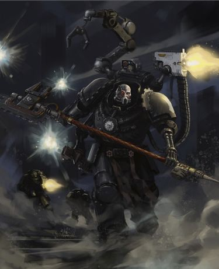
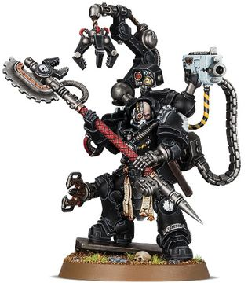

# 0680 马尔坎·费洛斯 Malkaan Feirros

精校状态：中文行文已逐段精校，部分术语仍为暂定

分类：人类帝国 / 钢铁之手

原文来源：https://www.bilibili.com/opus/1118672602177470505

原作者：帝国神选罐头

原文时间：2025年10月01日 14:21

[返回分类目录](目录.md) · [全书目录](../../目录.md)

原篇名：马尔坎·费罗斯 Malkaan Feirros

<!-- A0680-B0001 -->
**英文原文**

Malkaan Feirros is an Iron Father and Master of the Forge for the Iron Hands Chapter, who has undergone the operation to become a Primaris Space Marine

<!-- /A0680-B0001 -->

<!-- A0680-B0002 -->

原译文

马尔坎·费罗斯是钢铁之手战团的铁父和铸造大师，他经历了成为原铸星际战士的手术

**校订译文**

马尔坎·费洛斯是钢铁之手战团的钢铁圣父兼铸造大师，已接受原铸改造手术。

**校注：** Feirros 据官方完整名钢铁圣父费洛斯统一；Malkaan 沿现稿马尔坎，完整全名仍属官方词根参考、待核。

<!-- /A0680-B0002 -->

<!-- A0680-B0003 图片 -->

<!-- A0680-B0004 -->

原译文

Malkaan Feirros, Master of the Forge 马尔坎·费罗斯，铸造大师

**校订译文**

Malkaan Feirros, Master of the Forge 铸造大师马尔坎·费洛斯

<!-- /A0680-B0004 -->

<!-- A0680-B0005 -->
## Overview 概述

<!-- /A0680-B0005 -->

<!-- A0680-B0006 -->
**英文原文**

Feirros is considered a maverick by the Iron Council, as he continues to cling to emotion and refuses augmentation to purge it from his mind. To Feirros true wisdom lies in the balance between logic and emotion - a balance that Ferrus Manus himself was unable to achieve. The fact that Feirros continues to remain Master of the Forge despite these quasi-heretical beliefs is both testament to his skill and his connections, for current elected Chapter Master Kardan Stronos was once the Iron Father's pupil and continues to hold him in great respect. Though Feirros does not seek to overthrow the Chapter's long-held views, many within the Iron Council consider his influence corrupting. Nonetheless Battle-Brothers revere him, and he continues to act as a counterbalance to the false solace of logic. If the Iron Hands had a soul, it would be Malkaan Feirros.

<!-- /A0680-B0006 -->

<!-- A0680-B0007 -->

原译文

费罗斯被钢铁议会视为一个特立独行的人，因为他继续执着于情感，拒绝将其从脑海中清除。对费罗斯来说，真正的智慧在于逻辑和情感之间的平衡 — 这是费鲁斯·马努斯自己无法实现的平衡。尽管存在这些类似异端的信仰，但费罗斯仍然是铸造大师，这一事实既证明了他的技能，也证明了他的关系，因为现任当选的战团长卡丹·斯特罗诺斯曾经是铁父的学生，并继续非常尊重他。尽管费罗斯并不试图推翻战团长期以来的观点，但钢铁议会中的许多人认为他的影响力是腐化的。尽管如此，战斗兄弟仍然尊敬他，他继续作为对逻辑虚假慰藉的制衡。如果钢铁之手有灵魂，那就是马尔坎·费罗斯。

**校订译文**

费洛斯坚持保留情感，拒绝以机械改造将其从心智中清除，因此被钢铁议会视为异类。他认为，真正的智慧来自逻辑与情感的平衡——就连费鲁斯·马努斯也未能做到这一点。尽管观点近乎异端，他仍稳居铸造大师之位，既得益于卓绝技艺，也有赖于人脉：现任民选战团长斯特罗诺斯曾是他的学生，至今对他深怀敬意。费洛斯无意推翻战团长期奉行的观念，议会中却有许多人认为他的影响会腐蚀战团。尽管如此，战斗兄弟们仍敬爱他，而他也继续抵制将逻辑当成虚假慰藉的倾向。如果说钢铁之手拥有灵魂，那灵魂便是马尔坎·费洛斯。

<!-- /A0680-B0007 -->

<!-- A0680-B0008 -->
**英文原文**

Following the Skarvus Ambush the Iron Council was poised to censure Clan Raukaan entirely, but it was Feirros who advocated that they be given a chance to prove themselves under new leadership. Ultimately Feirro's old political foe Iron Father Kristos came to agree with him. He seized on Clan Raukaan’s fate as a chance to prove Feirros’ waning to the rest of the Iron Council – only to suffer apoplexy when it was decided that he himself, and not Feirros, would be responsible for reforging Raukaan from its battered shards. Too late, Kristos realized that Feirros had goaded him, subverting emotions he struggled to conceal in order to achieve his victory. As a result of Feirros' actions Kristos for the first time realized the value of emotion.

<!-- /A0680-B0008 -->

<!-- A0680-B0009 -->

原译文

斯卡维斯伏击事件发生后，钢铁议会准备完全谴责劳坎氏族，但正是费罗斯主张让他们有机会在新的领导下证明自己。最终，费罗斯的老政敌铁父克里斯托斯同意了他的观点。他抓住劳坎氏族的命运作为一个机会，证明费罗斯正在向钢铁议会的其他成员屈服 — 但当决定由他自己而不是费罗斯负责从破碎的碎片中重建劳坎时，他狂怒了。为时已晚，克里斯托斯意识到费罗斯已经激怒了他，颠覆了他为了取得胜利而努力掩饰的情绪。由于费罗斯的行动，克里斯托斯第一次意识到了情感的价值。

**校订译文**

斯卡维斯伏击之后，钢铁议会准备严惩整个劳坎氏族，费洛斯却主张给他们一次机会，在新领袖带领下证明自己。他的老政敌、钢铁圣父克里斯托斯最终也同意了。他原本想借劳坎的命运，向议会证明费洛斯已在衰退；没想到，议会却决定由他本人，而非费洛斯，负责重建惨遭重创的氏族。克里斯托斯顿时怒不可遏，至此才发觉自己中了计：费洛斯挑动并利用了他极力掩藏的情绪，赢得这场交锋。正因如此，克里斯托斯第一次认识到情感的价值。

**校注：** 源文 prove Feirros’ waning 缺少明确衰退对象，中文仅保留“衰退”，不擅自指定技艺、权力或理智；后半是费洛斯利用政敌情绪获胜，原译颠倒。

<!-- /A0680-B0009 -->

<!-- A0680-B0010 -->
**英文原文**

When the Iron Hands received word that Firstborn could cross the Rubicon Primaris and become Primaris Space Marines, Feirros was among the first to volunteer. He welcomed the opportunity to vastly improve his strength and endurance without need for mechanical enhancement.

<!-- /A0680-B0010 -->

<!-- A0680-B0011 -->

原译文

当钢铁之手收到消息说长子可以跨越原铸界限并成为原铸星际战士时，费罗斯是第一批志愿者之一。他很高兴有机会在不需要机械增强的情况下大大提高自己的力量和耐力。

**校订译文**

钢铁之手得知长子星际战士可接受原铸跨越手术后，费洛斯是首批志愿者之一。他欣然接受这一机会：无需机械强化，就能大幅增强力量与耐力。

<!-- /A0680-B0011 -->

<!-- A0680-B0012 图片 -->

<!-- A0680-B0013 -->

原译文

Master of the Forge, Malkaan Feirros 铸造大师，马尔坎·费罗斯

**校订译文**

Master of the Forge, Malkaan Feirros 铸造大师马尔坎·费洛斯

<!-- /A0680-B0013 -->

<!-- A0680-B0014 -->
## Wargear 武器装备

原题：Wargear 战备

<!-- /A0680-B0014 -->

<!-- A0680-B0015 -->
**英文原文**

In battle the Iron Father can effortlessly cut foes down with his shoulder-mounted artificer heavy bolter, Gorgon's Wrath, and hew any who dare to draw within reach of his cog-toothed Power Axe, Harrowhand.

<!-- /A0680-B0015 -->

<!-- A0680-B0016 -->

原译文

在战斗中，铁父可以毫不费力地用他肩上的精工重型爆矢枪美杜莎之怒击倒敌人，并砍倒任何敢于在他齿轮动力斧折磨之手触手可及之处的人。

**校订译文**

战斗中，费洛斯能以肩装精工重爆矢枪“戈尔贡之怒”轻易扫倒敌人；任何胆敢接近的对手，又会遭到齿轮刃动力斧“折磨之手”的斩杀。

**校注：** Gorgon 为戈尔贡，不是行星名美杜莎，武器修为戈尔贡之怒；武器全名未核官方。

<!-- /A0680-B0016 -->

本篇核心术语与暂定项

以下列出本篇出现的英文原形及核心术语表用词。同形词可能指不同对象，具体词义以本篇正文和校注为准；单复数、别名和仅见于图注的名称可能尚未列入。完整候选见[术语表](../../术语表/双语术语候选.csv)。

| 英文 | 采用中文 | 状态 |
| --- | --- | --- |
| Space Marines | 星际战士 | 官方已核对 |
| Ferrus Manus | 费鲁斯·马努斯 | 暂定·官方待核 |
| Iron Hands | 钢铁之手 | 暂定·官方待核 |
| COG | 机灵 | 暂定·官方待核 |
| Endurance | 坚韧 | 暂定·官方待核 |
| Master | 导师（审判庭职衔）／舰务官（舰员职务） | 语境定译·官方待核 |
| Iron Father | 钢铁圣父 | 暂定·官方待核 |
| Master of the Forge | 铸造大师 | 暂定·官方待核 |
| Space Marine | 星际战士 | 暂定·官方待核 |
| Chapter | 战团 | 暂定·官方待核 |
| Chapter Master | 战团长 | 暂定·官方待核 |
| Primaris Space Marine | 原铸星际战士 | 暂定·官方待核 |
| Kardan Stronos | 卡丹·斯特罗诺斯 | 暂定·官方待核 |
| Malkaan Feirros | 马尔坎·费洛斯 | 暂定·官方待核 |
| Firstborn | 长子 | 暂定·官方待核 |
| Artificer | 技工 | 暂定·官方待核 |
| Rubicon Primaris | 原铸跨越手术 | 暂定·官方待核 |
| Clan Raukaan | 劳坎氏族 | 暂定·官方待核 |
| Feirros | 费洛斯 | 暂定·官方待核 |
| Kristos | 克里斯托斯 | 暂定·官方待核 |
| Skarvus Ambush | 斯卡维斯伏击 | 暂定·官方待核 |
| Gorgon's Wrath | 戈尔贡之怒 | 暂定·官方待核 |
| Harrowhand | 折磨之手 | 暂定·官方待核 |
| Bolter | 爆矢枪 | 暂定·官方待核 |
| Heavy bolter | 重型爆矢枪 | 官方已核对 |
| Gorgon | 戈尔贡 | 暂定·官方待核 |

