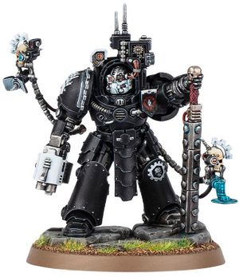

# 0681 卡诺克·瓦尔 Caanok Var

精校状态：中文行文已逐段精校，部分术语仍为暂定

分类：人类帝国 / 钢铁之手

原文来源：https://www.bilibili.com/opus/1119083055058780216

原作者：帝国神选罐头

原文时间：2025年10月02日 16:53

[返回分类目录](目录.md) · [全书目录](../../目录.md)

<!-- A0681-B0001 -->
**英文原文**

Caanok Var is the Iron Captain of Clan Avernii of the Iron Hands.

<!-- /A0681-B0001 -->

<!-- A0681-B0002 -->

原译文

卡诺克·瓦尔是钢铁之手阿维尼氏族的钢铁连长。

**校订译文**

卡诺克·瓦尔是钢铁之手阿维尼氏族的钢铁连长。

<!-- /A0681-B0002 -->

<!-- A0681-B0003 图片 -->

<!-- A0681-B0004 -->

原译文

Caanok Var 卡诺克·瓦尔

**校订译文**

Caanok Var 卡诺克·瓦尔

<!-- /A0681-B0004 -->

<!-- A0681-B0005 -->
**英文原文**

Though he is known to have served before the Great Rift, Caanok's length of service is not known and bionics have rendered his age difficult to determine. His augmenic arms and hearts are relics dating back to the Horus Heresy, while his left leg was reclaimed from the legendary Iron Father Karax Gaarman after his death at the Siege of Tessar. Only Var's left eye can truly said to be his own, forged as it was for his role in the Varakon Decimation. While maintaining a stoic exterior, in truth Var knows only burning rage, a shameful and self-sustaining fury that detracts from the perfection of the machine.

<!-- /A0681-B0005 -->

<!-- A0681-B0006 -->

原译文

虽然众所周知，卡诺克在大裂隙之前服役，但他的服役时间尚不清楚，仿生部件使他的年龄难以确定。他的增强手臂和心脏是荷鲁斯叛乱时期的遗物，而他的左腿是从在泰萨尔围城中牺牲的传说中的铁父卡拉克斯·加尔曼处取回的。瓦尔只有左眼才能真正说是他自己的，因为他在瓦拉康毁灭中的角色而铸造的。虽然保持着坚忍的外表，但事实上瓦尔只知道燃烧的愤怒，这是一种可耻的、自我维持的愤怒，有损于机械的完美。

**校订译文**

已知卡诺克在大裂隙形成前便已服役，但具体年资不明，大量机械改造也让其年龄难以判断。他的机械手臂与心脏是追溯至荷鲁斯之乱时期的圣物；左腿则取自传奇钢铁圣父卡拉克斯·加尔曼，后者死于泰萨尔围城战。只有左眼可以真正称为专属于瓦尔的部件，因为它是为他在瓦拉康毁灭行动中的经历而专门打造的。瓦尔外表冷静坚忍，内心却只有熊熊怒火——在他看来，这种可耻而不断自我滋长的愤怒，有损机械的完美。

**校注：** 左眼是为瓦尔本人打造的机械部件，“自己的”不表示保留的天然眼球；源文没有明确说明是何种奖赏，不扩写授勋过程。

<!-- /A0681-B0006 -->

<!-- A0681-B0007 -->
**英文原文**

During the Invasion of the Stygius Sector Var led the charge, wounding the Night Lords Chaos Lord Ahrak Deathshriek in battle.

<!-- /A0681-B0007 -->

<!-- A0681-B0008 -->

原译文

在入侵冥河星区期间，瓦尔领导了冲锋，在战斗中打伤了午夜领主混沌领主阿拉克·死亡尖叫。

**校订译文**

冥河星区遭入侵期间，瓦尔率军冲锋，在战斗中击伤午夜领主混沌领主阿拉克·死亡尖叫。

<!-- /A0681-B0008 -->

本篇核心术语与暂定项

以下列出本篇出现的英文原形及核心术语表用词。同形词可能指不同对象，具体词义以本篇正文和校注为准；单复数、别名和仅见于图注的名称可能尚未列入。完整候选见[术语表](../../术语表/双语术语候选.csv)。

| 英文 | 采用中文 | 状态 |
| --- | --- | --- |
| Horus Heresy | 荷鲁斯之乱 | 官方已核对 |
| Great Rift | 大裂隙 | 官方已核对 |
| Night Lords | 午夜领主 | 暂定·官方待核 |
| Horus | 荷鲁斯 | 暂定·官方待核 |
| Iron Hands | 钢铁之手 | 暂定·官方待核 |
| Sector | 星区 | 暂定·官方待核 |
| Bionics | 仿生改造／仿生部件（依语境） | 语境定译·官方待核 |
| Iron Father | 钢铁圣父 | 暂定·官方待核 |
| Captain | 连长 | 暂定·官方待核 |
| Clan Avernii | 阿维尼氏族 | 暂定·官方待核 |
| Caanok Var | 卡诺克·瓦尔 | 暂定·官方待核 |
| Karax Gaarman | 卡拉克斯·加尔曼 | 暂定·官方待核 |
| Varakon Decimation | 瓦拉康毁灭行动 | 暂定·官方待核 |
| Ahrak Deathshriek | 阿拉克·死亡尖叫 | 暂定·官方待核 |
| Stygius Sector | 冥河星区 | 暂定·官方待核 |

