# 0682 安格隆 Angron

精校状态：中文行文已逐段精校，部分术语仍为暂定

分类：人类帝国 / 吞世者

原文来源：https://www.bilibili.com/opus/1064897339591753737

原作者：帝国神选罐头

原文时间：编辑于 2025年07月28日 09:07

[返回分类目录](目录.md) · [全书目录](../../目录.md)

<!-- A0682-B0001 -->
**英文原文**

Angron (also known as the Red Angel and originally as Angronius of Nuceria, Lord of the Red Sand) is the Primarch of the World Eaters. He was raised on the brutal world of Nuceria, fighting as a gladiator slave and having his aggression enhanced by surgical implants known as the Butcher's Nails. The only Primarch taken into service of the Emperor against his will, he fell to Chaos during the Horus Heresy, afterwards becoming a Daemon Prince of Khorne. Savage and in a state of constant rage, he was nonetheless renowned for his battle-prowess and alongside Leman Russ and Vulkan was considered one of the most physically powerful Primarchs. The Chaos emissary to Lorgar called him the Fighter.

<!-- /A0682-B0001 -->

<!-- A0682-B0002 -->

原译文

安格隆（也被称为红天使，最初是努凯里亚的安格隆尼斯，红沙之主）是吞世者的原体。他在残酷的努凯里亚世界长大，作为角斗士奴隶战斗，并通过被称为屠夫之钉的外科植入物增强了他的侵略性。作为唯一一位违背帝皇意愿为其服务的原体，他在荷鲁斯叛乱期间堕入混沌，后来成为了恐虐的恶魔王子。野蛮和持续愤怒的状态下，他仍然以他的战斗能力而闻名，与黎曼·鲁斯和沃坎一起被认为是身体最强大的原体之一。混沌派去珞珈的使者称他为斗士。

**校订译文**

安格隆，又称红天使，原名努凯里亚的安格隆尼斯，号称红沙之主，是吞世者的原体。他在残酷的努凯里亚长大，沦为奴隶角斗士，名为屠夫之钉的植入物进一步强化了他的攻击欲。他是唯一违背自身意愿、被带去为帝皇效力的原体；荷鲁斯之乱期间，他投向混沌，后来升格为恐虐恶魔王子。安格隆残暴而长久暴怒，却仍以卓越战力闻名，与黎曼·鲁斯、沃坎并列为肉体力量最强的原体。混沌派往珞珈身边的使者称他为“斗士”。

**校注：** against his will 指违背安格隆意愿，原译误成违背帝皇意愿。

<!-- /A0682-B0002 -->

<!-- A0682-B0003 图片 -->
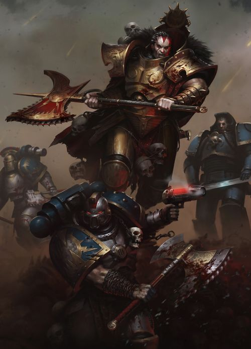

<!-- A0682-B0004 -->

原译文

Angron 安格隆

**校订译文**

Angron 安格隆

<!-- /A0682-B0004 -->

<!-- A0682-B0005 -->
## Biography 传记

<!-- /A0682-B0005 -->

<!-- A0682-B0006 -->
### Slave of Nuceria 努凯里亚的奴隶

<!-- /A0682-B0006 -->

<!-- A0682-B0007 -->
**英文原文**

During the Scattering, the boy that would become known as Angron was thrown to the Civilised World of Nuceria, far from Terra. He plummeted into the icy mountains of that planet, and not long after a slaver found him and a scene of carnage. Surrounding the wounded young Primarch were the corpses of numerous Xenos. Imperial scholars would later theorise that they were Eldar who had foreseen the great bloodshed that Angron would cause and had tried unsuccessfully to stop him. After being enslaved and nursed back to health by the planet's ruling masters, known as High-Riders, Angron was brought to the planet's capital, Desh'ea.

<!-- /A0682-B0007 -->

<!-- A0682-B0008 -->

原译文

在分散期间，这个后来被称为安格隆的男孩被扔到了远离泰拉的努凯里亚文明世界。他坠入了那个星球的冰山，不久之后，一个奴隶贩子发现了他，并看到了一片屠杀的景象。受伤的年轻原体周围是许多异型的尸体。帝国学者后来推测，他们就是灵族，预见到了安格隆将造成的巨大流血事件，并试图阻止他，但未能成功。在被这个星球的统治者，即被称为高骑士的人奴役并照顾恢复健康后，安格隆被带到了这个星球的首都德锡安。

**校订译文**

原体被抛散时，后来被称为安格隆的男孩落在远离泰拉的文明世界努凯里亚，坠入冰封山脉。不久，一名奴隶贩子找到受伤的幼年原体，也看见他周围遍布异形尸骸。帝国学者后来推测，那些异形可能是预见了安格隆将造成巨大杀戮、前来阻止却失败的灵族。被当地统治者“高骑士”奴役并养好伤后，安格隆被带到首都德锡安。

<!-- /A0682-B0008 -->

<!-- A0682-B0009 图片 -->
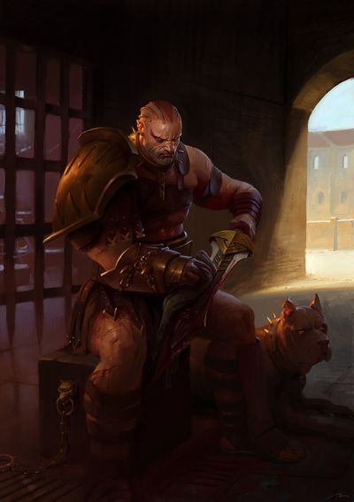

<!-- A0682-B0010 -->

原译文

younger Angron on Nuceria 努凯里亚的青年安格隆

**校订译文**

younger Angron on Nuceria 努凯里亚的青年安格隆

<!-- /A0682-B0010 -->

<!-- A0682-B0011 -->
**英文原文**

Still a frightened young child, he was subsequently dumped into a pit consisting of a single ziggurat with hundreds of other slaves. Acid filled the pit, and to the cheers of the spectators Angron was eventually forced to kill all around him in order to stand upon the ziggurat's uppermost platform and survive. Shedding a tear for the last time, Angron was proclaimed a promising newcomer to Desh'ea's arena combat and given the name Angron-Thal'kr, which meant Child of the Mountain and property of House Thal'kr.

<!-- /A0682-B0011 -->

<!-- A0682-B0012 -->

原译文

他还是个受惊的小孩，随后被扔进了一个由一个金字塔和数百名其他奴隶组成的坑里。酸液充满了坑，在观众的欢呼声中，安格隆最终被迫杀死周围的人，以便站在金字塔最上面的平台上生存下来。最后一次流泪，安格隆被宣布为德锡安角斗场战斗的有前途的新人，并被命名为安格隆-塔尔’克，意思是山的孩子和塔尔’克家族的财产。

**校订译文**

安格隆当时仍是个惊恐的孩子，却与数百名奴隶一起被扔进坑中，坑底只立着一座阶梯塔。酸液不断涌入，在观众欢呼声中，他被迫杀死身边所有人，才能独占塔顶平台，活下来。他最后一次流下眼泪，随即被宣布为德锡安竞技场中前途无量的新角斗士，获名“安格隆—塔尔’克”，意为山之子、塔尔’克家族的财产。

<!-- /A0682-B0012 -->

<!-- A0682-B0013 -->
**英文原文**

After this, Angron became a famed gladiator known as The Unbeaten, becoming a fan-favourite of Desh'ea and reaping many victories. The closest thing he had to a father during this time was the older Gladiator Oenomaus, but after the duo managed to slay two berserk Ogryns his masters ordered the two to fight one another to the death. Angron refused, and the High-Riders ordered that he undergo a psycho-surgery known as the Butcher's Nails as punishment. Upon the Nails being implanted, Angron was loosed upon Oenomaus and killed him in a blind frenzy. When Angron regained his senses, the despair of this revelation caused him to unleash a bestial howl for days.

<!-- /A0682-B0013 -->

<!-- A0682-B0014 -->

原译文

在此之后，安格隆成为了一位著名的角斗士，被称为“不败者”，成为德锡安的粉丝最爱，并取得了许多胜利。在这段时间里，他最接近父亲的是年长的角斗士奥诺玛默斯，但在两人成功杀死两名狂暴的欧格林后，他的主人命令两人互相厮杀至死。安格隆拒绝了，高骑士命令他接受被称为屠夫之钉的灵能手术作为惩罚。在钉子被植入后，安格隆被释放到奥诺玛默斯身上，疯狂地杀死了他。当安格隆恢复理智时，这一发现的绝望使他连续几天发出野兽般的嚎叫。

**校订译文**

此后，安格隆连战连捷，以“不败者”之名成为德锡安观众的宠儿。年长角斗士奥诺玛默斯是他最接近父亲的人。然而，两人联手杀死两名狂暴欧格林后，主人竟命他们彼此决斗，直至一人死亡。安格隆拒绝，于是高骑士下令为他实施屠夫之钉的精神外科手术，以作惩罚。植入后，他们把安格隆放向奥诺玛默斯；他在失去理智的狂怒中杀死了后者。清醒后，得知自己所为的安格隆绝望至极，像野兽般哀嚎了数日。

**校注：** psycho-surgery 指干预精神/脑功能的外科手术，不自动等同灵能手术。

<!-- /A0682-B0014 -->

<!-- A0682-B0015 -->
**英文原文**

The death of Oenomaus proved to be the last straw for Angron, and he led a slave revolt among his fellow gladiators. Gathering a great army of slaves, they fled into the mountains of the planet, where he lived for several years. The civilized cities sent armies to destroy Angron, but none were able to oust the Primarch and met the same demise. Nonetheless, the issue was never in doubt, his forces had little to eat in the barren mountains and were exhausted from the constant battling. His fate seemed sealed when seven well-equipped armies surrounded Angron and his starving forces. In desperation, Angron fed his trusted comrades his own blood to keep them alive. Just as the battle was about to begin, the Emperor of Mankind's fleet arrived in orbit over the planet. The Emperor teleported directly to Angron's point of deployment with a few trusted Adeptus Custodes. The Emperor promised Angron a legion made in his image, limitless power, and lifetimes spent perfecting the Art of Conquest. But, to his surprise, Angron refused. He chose instead to die amongst his comrades while fighting his oppressors.

<!-- /A0682-B0015 -->

<!-- A0682-B0016 -->

原译文

奥诺玛默斯的死被证明是压倒安格隆的最后一根稻草，他在他的角斗士同伴中领导了一场奴隶起义。他们召集了大批奴隶，逃到了这个星球的山区，在那里他住了几年。文明城市派遣军队摧毁安格隆，但没有人能够驱逐原体，也没有人能灭亡。尽管如此，这个问题从来没有疑问，他的部队在贫瘠的山区几乎没有什么吃的，而且在不断的战斗中已经筋疲力尽。当七支装备精良的军队包围了安格隆和他饥饿的部队时，他的命运似乎已经注定。在绝望中，安格隆用自己的鲜血喂养他信任的战友，让他们活下去。就在战斗即将开始之际，人类帝皇的舰队抵达了星球上空的轨道。帝皇带着几个值得信赖的侍从直接传送到安格隆的部署点。帝皇向安格隆承诺，将按照他的形象组建一支军团，拥有无限的力量，并毕生致力于完善征服艺术。但令他惊讶的是，安格隆拒绝了。相反，他选择在与压迫者作战时死在战友们中间。

**校订译文**

奥诺玛默斯之死令安格隆再也无法忍受。他率角斗士同伴起义，集结大批奴隶逃入群山，并在那里坚持数年。各城邦不断派军围剿，却都无法消灭原体，反而一次次覆灭。可是，起义军的最终处境仍无悬念：贫瘠山地缺少粮食，连绵战斗也耗尽了他们的体力。七支装备精良的大军包围饥饿的奴隶军时，安格隆的命运似乎已经注定。绝境中，他让亲信饮下自己的鲜血，勉强维持生命。决战将启，帝皇舰队抵达轨道。帝皇带着数名信任的帝皇禁军，直接传送到安格隆驻地，许诺给他一支以其为蓝本创造的军团、无穷力量，以及足以跨越多个凡人人生的岁月，去钻研征服之道。然而，安格隆出人意料地拒绝了。他宁愿与战友一起，死在反抗压迫者的战场上。

**校注：** 敌方围剿军 met the same demise 指一次次覆灭，原译“没有人能灭亡”反转。Adeptus Custodes 补回帝皇禁军，原侍从过泛。

<!-- /A0682-B0016 -->

<!-- A0682-B0017 -->
**英文原文**

Reluctantly, the Emperor returned to his flagship above. Yet just as the battle was about to begin, the Emperor teleported Angron against his will back up to the fleet. He could only watch in anguish as those he regarded as his brothers and comrades were quickly annihilated. In a rage, Angron killed one of the Custodes which surrounded him, but was forced into a state of submission by the Emperor's psychic might. Angron angrily asked why the Emperor did not intervene to save his comrades upon Nuceria's surface, but the Emperor dismissed the question as lacking vision. He was the Emperor and had his eyes set upon the galaxy, not a single tyrant battling a slave revolt. The Emperor expressed hope that Angron, in time, would learn to understand what he had done. Angron stated to the Emperor that he was meant to die upon Nuceria, and now but a ghost remained. The Emperor replied that a ghost would suffice for what he had planned for him.

<!-- /A0682-B0017 -->

<!-- A0682-B0018 -->

原译文

帝皇不情愿地回到了上面的旗舰。然而，就在战斗即将开始之际，帝皇违背原体的意愿，将安格隆传送回舰队。他只能痛苦地看着那些他视为兄弟和战友的人迅速被消灭。愤怒之下，安格隆杀死了一名包围他的禁军，但被帝皇的灵能力量迫使屈服。安格隆愤怒地问为什么帝皇没有干预以拯救努凯里亚表面上的战友，但帝皇认为这个问题缺乏远见。他是帝皇，他的目光投向了银河系，而不是一个与奴隶起义作斗争的暴君。帝皇表示希望安格隆能及时学会理解他的所作所为。安格隆向帝皇表示，他注定要死在努凯里亚，但现在只剩下一个鬼魂。帝皇回答说，一个鬼魂就足以满足他为他所做的计划。

**校订译文**

帝皇不情愿地返回旗舰，却在战斗即将开始时，违背安格隆意愿将他传送上舰。原体只能痛苦地看着自己视若兄弟的战友被迅速歼灭。他暴怒中杀死一名围在身边的禁军，却被帝皇的灵能力量强行压服。安格隆质问父亲为何不救努凯里亚地表的同伴，帝皇却认为这问题缺乏远见：身为帝皇，他放眼整个银河，无暇只关注一个镇压奴隶起义的暴君。他希望安格隆日后能理解自己的决定。安格隆说，自己本该死在努凯里亚，如今留下的不过是个幽魂。帝皇回答，对于他安排的使命，幽魂已经足够。

<!-- /A0682-B0018 -->

<!-- A0682-B0019 -->
### Great Crusade 大远征

<!-- /A0682-B0019 -->

<!-- A0682-B0020 -->
**英文原文**

Before Angron could reply he was teleported to a nearby vessel of the XII Legion, the War Hounds. Angron initially refused to have anything to do with his Legion, and when several Captains tried to talk to him, he brutally killed them, as they had been ordered by the Emperor to not raise a hand against Angron. The dead included the acting Legion commander, Gheer. Eventually, Captain Khârn of the 8th Assault Company managed to form a rapport with Angron, talking about the rituals of Angron's gladiators and the traditions of the War Hounds. Now convinced of their worthiness, Angron took full control over his legion, which he renamed the World Eaters, saying they would form new traditions together. However, in the early days of Angron's leadership, he still refused to acknowledge most of his sons, who could not survive the implantation of the Butcher's Nails. At one point Angron simply abandoned his Legion, hijacking a Frigate and disappearing. After two years of searching Kharn was able to track him down to a Feral World, where Angron lived like a savage and revealed that he was simply seeking a foe that could put him out of his misery. Kharn eventually convinced Angron to rejoin the Legion by reminding him that his Nucerian comrades would hate to see him in this state, and with the promise that he would try to lead the World Eaters to shed their weakness.

<!-- /A0682-B0020 -->

<!-- A0682-B0021 -->

原译文

安格隆还没来得及回答，他就被传送到附近的第十二军团的一艘战舰上。安格隆最初拒绝与他的军团有任何关系，当几位连长试图与他交谈时，他残忍地杀死了他们，因为帝皇命令他们不要对安格隆动手。死者包括代理军团指挥官盖尔。最终，第八突击连队的队长卡恩设法与安格隆建立了融洽的关系，谈论了安格隆角斗士的仪式和战犬的传统。现在确信他们的价值，安格隆完全控制了他的军团，他将其更名为吞世者，并表示他们将共同形成新的传统。然而，在安格隆领导的早期，他仍然拒绝承认他的大多数子嗣，他们无法在屠夫之钉的植入中幸存下来。有一次，安格隆干脆放弃了他的军团，劫持了一艘护卫舰并消失了。经过两年的搜寻，卡恩终于找到了一个蛮荒世界，安格隆在那里像个野蛮人一样生活，并透露他只是在寻找一个可以让他摆脱痛苦的敌人。卡恩最终说服安格隆重新加入军团，他提醒安格隆，他的努凯里亚战友们会讨厌看到他处于这种状态，并承诺他将努力带领吞世者摆脱他们的弱点。

**校订译文**

安格隆尚未回答，便被传送到附近一艘属于第十二军团“战犬”的舰船上。他起初拒绝与军团发生任何关系，数位前来交谈的连长遭他残酷杀害；这些人奉帝皇之命，不得向原体还手。死者中也包括代理军团长盖尔。最终，第八突击连连长卡恩通过谈论努凯里亚角斗士的仪式与战犬传统，与他建立了联系。安格隆认可了这些战士的价值，正式接掌军团，将其更名为吞世者，宣告双方将共同建立新的传统。但在统领初期，他仍不愿承认多数无法承受屠夫之钉植入的子嗣。他甚至曾抛下军团，劫走一艘护卫舰消失无踪。卡恩搜寻两年，终于在一个蛮荒世界找到他。安格隆像野人一样生活，只想找到能杀死自己、结束痛苦的敌人。卡恩提醒他，努凯里亚的战友绝不愿看见他如此，并承诺将努力带领吞世者摆脱软弱，最终劝他重返军团。

<!-- /A0682-B0021 -->

<!-- A0682-B0022 图片 -->
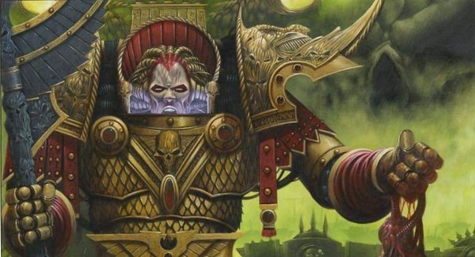

<!-- A0682-B0023 -->

原译文

Angron 安格隆

**校订译文**

Angron 安格隆

<!-- /A0682-B0023 -->

<!-- A0682-B0024 -->
**英文原文**

Most infamously, Angron ordered that the World Eaters conquer their targeted worlds within 31 hours - a single Nucerian day and the time he had scored his greatest victory upon the planet. The World Eaters consistently failed to capture worlds within this time limit, and each time Angron ordered decimation as punishment, forcing 1 of every 10 World Eaters to be killed by his other 9 brothers. After several of these episodes, Centurion Mago finally refused to again enact decimation after the Ghenna Campaign. This caused Angron to be thrown into a raged frenzy, during which he murdered several nearby World Eaters until being subdued by his Librarians. While Angron lay comatose and had his memories of Nuceria absorbed by the young Lexicanium Tethys, a crisis erupted across the Legion as Mago attempted to stop Gahlan Surlak from installing the perfected Butcher's Nails in all of the World Eaters. Mago's revolt came to its climax on Ghenna, where Kharn slew the rebel Centurion while Angron slew Tethys. Now at the head of a Legion wielding the Nails, Angron reaped many victories during the Great Crusade, although some criticized the extreme and bloodthirsty tactics he used to ensure the destruction of his opponents.

<!-- /A0682-B0024 -->

<!-- A0682-B0025 -->

原译文

最臭名昭著的是，安格隆命令吞世者在31小时内征服他们的目标世界，这是他在这个星球上取得最大胜利的一天。吞世者一直未能在这个时间限制内占领世界，每次安格隆都下令抽杀作为惩罚，迫使每10个吞世者中就有1个被他的其他9个兄弟杀死。在经历了几次这样的事件后，百夫长马戈最终拒绝在根纳战役后再次实施大屠杀。这导致安格隆陷入疯狂，在此期间，他杀死了附近的几名吞世者，直到被他的智库制服。当安格隆昏迷不醒，年轻的编修员特提斯吸收了他对努凯里亚的记忆时，由于马戈试图阻止加兰·苏拉克在所有吞世者中安装完美的屠夫之钉，整个军团爆发了一场危机。马戈的起义在根纳达到高潮，在那里，卡恩杀死了叛乱百夫长，而安格隆杀死了特提斯。现在，作为挥舞着铁钉的军团的首领，安格隆在大远征期间取得了许多胜利，尽管一些人批评了他用来确保摧毁对手的极端和嗜血的战术。

**校订译文**

安格隆最恶名昭彰的命令之一，是要求吞世者在三十一小时内征服目标世界。这等于努凯里亚的一天，也是他在那里赢得最辉煌胜利所用的时间。吞世者屡屡未能如期完成任务，每次都会遭到抽杀惩罚：每十人中，必须由九人杀死另一人。数次之后，百夫长马戈终于在根纳战役后拒绝再次执行。安格隆狂怒失控，杀死身旁数名吞世者，直到被智库员制服。他昏迷时，年轻编修员特提斯读取了他关于努凯里亚的记忆。与此同时，马戈试图阻止加兰·苏拉克为全军安装改进后的屠夫之钉，危机席卷军团。冲突最终在根纳达到顶点：卡恩杀死马戈，安格隆则杀死特提斯。此后，原体率领全军植入屠夫之钉的吞世者，在大远征中屡获胜利，但他为消灭敌人而使用的极端嗜血手段也饱受批评。

**校注：** 31小时为努凯里亚一昼夜及其战绩所用时间；decimation 保留十抽一制度，非泛称大屠杀。Tethys 人物暂沿特提斯，区别869土星卫星忒提斯。

<!-- /A0682-B0025 -->

<!-- A0682-B0026 -->
**英文原文**

At some point following the rediscovery of Angron, Arkhan Land was brought to a secret laboratory hidden in a dormant volcano in tundra location on Terra to aid in the Emperor's investigation of Angron's crude augmetics as the primarch lay unconscious. Land had previous experience with the device taking over Angron's body, having see it when investigating the Hexarchion Vaults before he ordered them sealed do to the threat the items within presented to the Machine Cult. He told the Emperor that it was called a cruciamen, but the versions he saw were more crude. The Emperor explained that the implants were not his doing and that he believed they led to the Angron's instability. He also explained that they were recreated to remove the ability to enjoy anything but anger. When asked if the Emperor could remove it, he admitted he could, but the tendrils were deep in Angron's head and spine and he was missing his limbic lobe and insular cortex. The Butcher's Nails therefore replaced part of Angron's brain, allowing him to live.

<!-- /A0682-B0026 -->

<!-- A0682-B0027 -->

原译文

在安格隆被重新发现后的某个时刻，阿坎·兰德被带到了一个隐藏在泰拉苔原一座休眠火山中的秘密实验室，以帮助帝皇在安格隆昏迷时对安格隆的粗糙仿生部件进行调查。兰德之前曾有过使用该装置接管安格隆身体的经历，在他下令将其密封以应对提交给机器教的物品的威胁之前，他在调查赫克萨里昂密室时看到了它。他告诉帝皇，它被称为剧痛，但他看到的版本更粗糙。帝皇解释说，这些植入物不是他做的，他认为这些植入物导致了安格隆的不稳定。他还解释说，它们被重新创建是为了消除除了愤怒之外享受任何东西的能力。当被问及帝皇是否可以将其移除时，他承认可以，但触须深入安格隆的头部和脊柱，他失去了边缘叶和岛叶皮层。因此，屠夫之钉取代了安格隆大脑的一部分，使他得以生存。

**校订译文**

安格隆被寻回后的某个时期，阿坎·兰德被带到泰拉苔原一座休眠火山内的秘密实验室，协助帝皇研究昏迷原体体内粗陋的机械植入物。兰德以前见过这种正在控制安格隆身体的装置：他曾在六头秘库中发现类似器物，后来因其中物品威胁机械教派而下令封闭秘库。他告诉帝皇，这种装置叫“钻心者”，只是他见过的版本更加粗糙。帝皇说明，植入物并非自己所为，而且很可能正是安格隆精神失常的原因。这一改制版本剥夺了他从愤怒之外任何事物中获得快乐的能力。兰德问能否取出，帝皇承认可以，但其延伸部分已深入头颅与脊柱，安格隆的边缘叶及岛叶皮层也已缺失。屠夫之钉事实上替代了一部分脑组织，反过来维系着他的生命。

**校注：** 兰德曾见过同类装置，不是曾使用装置接管安格隆身体。cruciamen/Hexarchion Vaults 沿611暂定钻心者/六头秘库。

<!-- /A0682-B0027 -->

<!-- A0682-B0028 图片 -->
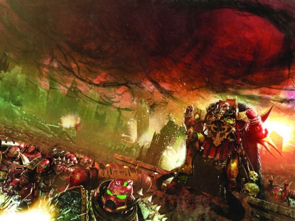

<!-- A0682-B0029 -->

原译文

The Red Angel and his Legion 红天使与他的军团

**校订译文**

The Red Angel and his Legion 红天使与他的军团

<!-- /A0682-B0029 -->

<!-- A0682-B0030 -->
### The Night of the Wolf 狼之夜

<!-- /A0682-B0030 -->

<!-- A0682-B0031 -->
**英文原文**

The Emperor himself criticized Angron for the changes he made to his recruits. Like all other gladiators on his homeworld, Angron had received special nerve-implants known as the Butcher's Nails which tremendously heightened his aggression but also had the side effect of uncontrollable rages outside of battle. Angron ordered his Techmarines and Apothecaries to duplicate the technology and that all recruits undergo the process that would turn them into aggressive and fearless warriors. Despite the obvious advantages, the Emperor was displeased, and ordered him to stop. Angron paid him no heed and continued the unsavory practice secretly.

<!-- /A0682-B0031 -->

<!-- A0682-B0032 -->

原译文

帝皇亲自批评安格隆对新兵所做的改变。像他家乡的所有其他角斗士一样，安格隆接受了被称为屠夫之钉的特殊神经植入物，这大大增强了他的攻击性，但也产生了战斗外无法控制愤怒的副作用。安格隆命令他的技术军士和药剂师复制这项技术，所有新兵都要经过这个过程，把他们变成有攻击性和无所畏惧的战士。尽管有明显的优势，帝皇还是很不高兴，命令他停下来。安格隆没有理会他，秘密地继续这种令人讨厌的做法。

**校订译文**

帝皇亲自批评了安格隆对新兵的改造。与母星其他角斗士一样，安格隆植入屠夫之钉后，攻击欲大幅增强，却也会在战场之外陷入无法控制的暴怒。他命令科技战士与药剂师复制这项技术，要求每名新兵都接受植入，成为好战而无畏的战士。尽管改造有明显的军事优势，帝皇仍不赞同，命他停止。安格隆置若罔闻，继续秘密推行。

<!-- /A0682-B0032 -->

<!-- A0682-B0033 -->
**英文原文**

This led to the World Eaters being criticized for their general bloodlust and barbarity by their fellow Legionnaires. They were known for blood rituals when not in combat, and competed with each other for the number of enemy heads they could take in battle. Eventually the Emperor dispatched the Space Wolves and Leman Russ to Malkoya to deal with Angron and demand an end to both the Butcher's Nail surgeries and massacres carried out by the World Eaters. A tense standoff between the Wolves and World Eaters resulted with all-out warfare, eventually breaking out in a brief but bloody battle. Angron engaged Russ in single combat, defeating Russ but allowing himself to become encircled by Russ's bodyguards in the process. Angron failed to understand that his bloodlust and disregard for both his life and his legionnaires had allowed him to become encircled. Disappointed that his brother had not learned this lesson, Russ ordered a retreat. Angron saw this as a victory, for while he would have fallen had Russ gave the order to open fire, he had bested the Wolf and the World Eaters suffered fewer casualties than their enemies.

<!-- /A0682-B0033 -->

<!-- A0682-B0034 -->

原译文

这导致了吞世者因其普遍的嗜血和野蛮行为而受到盟友军团的批评。他们以非战斗时的血腥仪式而闻名，并在战斗中争夺敌人的头颅数量。最终，帝皇派遣太空野狼和黎曼·鲁斯前往马尔科亚，与安格隆打交道，并要求结束屠夫之钉手术和吞世者的屠杀。野狼和吞世者之间的紧张对峙导致了全面战争，最终爆发了一场短暂但血腥的战斗。安格隆在决斗中与鲁斯交战，击败了鲁斯，但在此过程中被鲁斯的护卫包围。安格隆没有意识到，他的嗜血欲望和对生命和军团的漠视使他被包围了。由于对兄弟没有吸取这一教训感到失望，鲁斯下令撤退。安格隆认为这是一场胜利，因为如果鲁斯下令开火，他可能会倒下，但他击败了野狼，吞世者的伤亡人数比他们的敌人少。

**校订译文**

吞世者的嗜血与野蛮因此招致其他军团非议。他们不仅平时举行血腥仪式，作战时还相互攀比斩获首级的数量。据本段叙述，帝皇最终派黎曼·鲁斯与太空野狼前往马尔科亚，要求安格隆停止植入屠夫之钉，也停止屠杀。双方紧张对峙，终于演变成短暂而惨烈的全面交火。安格隆在单挑中击败鲁斯，却在追求胜利时落入后者亲卫的包围。他并未理解，正是嗜血，以及对自己和部下性命的漠视，才使自己陷入绝境。鲁斯对兄弟没有领悟教训深感失望，下令撤退。安格隆却自认为获胜：虽然鲁斯一声令下，他便会死于齐射，但他毕竟击败了狼王，吞世者的伤亡也少于对方。

**校注：** 帝皇派鲁斯的叙述按本段保留；若其他篇对奉命与否有不同说法，应作来源差异，不直接覆盖。

<!-- /A0682-B0034 -->

<!-- A0682-B0035 -->
### Horus Heresy 荷鲁斯之乱

<!-- /A0682-B0035 -->

<!-- A0682-B0036 -->
**英文原文**

After this debacle, the Emperor dispatched Horus to bring Angron back in line - a fatal error, as Horus was already corrupted by the forces of Chaos. A master psychologist, he told Angron exactly what he wanted to hear: that the Emperor was a weakling, devoid of honour, and that there was a place for him in a new order, along with revenge against their brother Primarchs that had criticized his legion. Angron needed no further convincing, throwing his legion on Horus's side when the Horus Heresy broke out.

<!-- /A0682-B0036 -->

<!-- A0682-B0037 -->

原译文

在这次失败之后，帝皇派遣荷鲁斯将安格隆带回前线—这是一个致命的错误，因为荷鲁斯已经被混沌势力腐化了。作为一名心理学大师，他告诉安格隆他想听的话：帝皇是个软弱的人，没有荣誉，在新秩序中有他的位置，还有对批评他的军团的兄弟原体的报复。当荷鲁斯叛乱爆发时，安格隆不需要再说服了，把他的军团归于荷鲁斯一边。

**校订译文**

这场冲突之后，帝皇派荷鲁斯去约束安格隆，使其重新服从命令。这是致命的错误，因为荷鲁斯此时已受混沌腐化。擅长揣摩人心的战帅，对安格隆说尽他想听的话：帝皇软弱而毫无荣誉；新秩序中将有他的位置，他也能向那些批评吞世者的原体兄弟复仇。安格隆无需更多劝说，便在叛乱爆发时率全军投向荷鲁斯。

**校注：** bring...back in line 指使其重归约束，非带回前线。

<!-- /A0682-B0037 -->

<!-- A0682-B0038 图片 -->
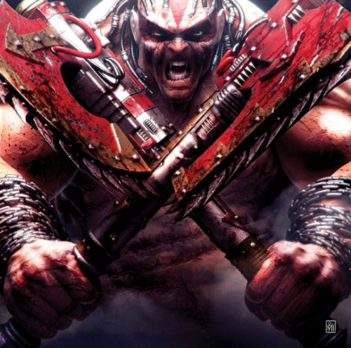

<!-- A0682-B0039 -->

原译文

The Primarch Angron 原体安格隆

**校订译文**

The Primarch Angron 原体安格隆

<!-- /A0682-B0039 -->

<!-- A0682-B0040 -->
**英文原文**

During the Heresy Angron would team up in the Shadow Crusade with Lorgar and his Word Bearers to strike at Ultramar in conjunction with the traitor offensive at the Battle of Calth. Angron, seeing Lorgar as a weakling, refused to cooperate with him and frequently wasted time sacking and butchering strategically worthless targets. The tensions between the two Primarch's boiled over to a near battle, which was only interrupted by a Dark Eldar attempt to assassinate Angron himself. After the two Primarch's worked together against the Dark Eldar, they put their feud aside.

<!-- /A0682-B0040 -->

<!-- A0682-B0041 -->

原译文

在叛乱期间，安格隆将与珞珈和他的怀言者一起参加暗影远征，与考斯之战中的叛徒攻势一起袭击奥特拉玛。安格隆认为珞珈是个软弱的人，拒绝与他合作，经常浪费时间洗劫和屠杀战略上毫无价值的目标。两位原体之间的紧张关系演变成了一场近乎战斗的局面，但这场战斗被一位黑暗灵族试图暗杀安格隆本人的企图打断了。在两位原体联手对抗黑暗灵族后，他们搁置了宿怨。

**校订译文**

叛乱期间，安格隆与珞珈及怀言者发动暗影远征，配合考斯的叛军攻势，进攻奥特拉玛。安格隆视珞珈为弱者，不愿合作，常将时间浪费在劫掠和屠杀毫无战略价值的目标上。两位原体几乎因此交手，直到黑暗灵族突然企图刺杀安格隆，才打断争端。联手击退异形后，双方暂时放下嫌隙。

<!-- /A0682-B0041 -->

<!-- A0682-B0042 图片 -->
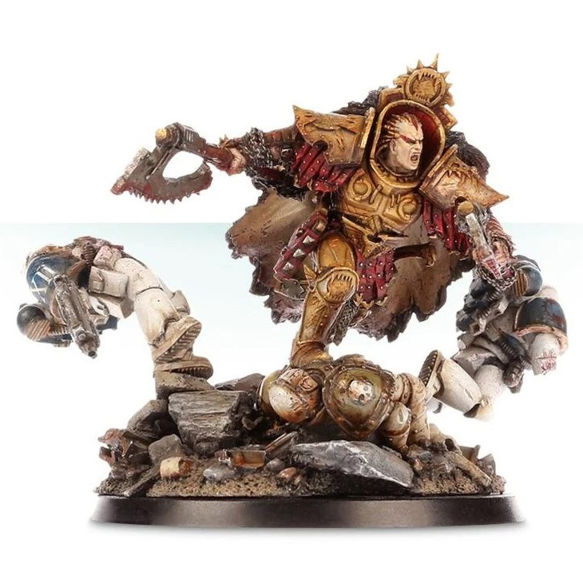

<!-- A0682-B0043 -->

原译文

Angron during the Horus Heresy 荷鲁斯叛乱期间的安格隆

**校订译文**

Angron during the Horus Heresy 荷鲁斯之乱期间的安格隆

<!-- /A0682-B0043 -->

<!-- A0682-B0044 -->
**英文原文**

However, Lorgar, recognizing Angron's instability and hidden sorrow over his forced departure from Nuceria, recommended that Angron return to his adopted homeworld to find a sense of closure as well as possibly overcome the Butcher's Nails, which were slowly killing him. When the two Primarchs arrived, however, they discovered that the slave-lords of Nuceria had massacred Angron's comrades and told the population that he had fled during their last stand. Infuriated, Angron ordered that the World Eaters and Word Bearers purge Nuceria of its population. During the battle against Imperial forces, Angron saved Lorgar by stopping a Warhound Titans foot with his bare hands before it could stomp on his brother. Later the Ultramarines led by Guilliman arrived, determined to exact vengeance on the traitors for the Battle of Calth. Angron went on to duel Guilliman himself during the battle, defeating the Primarch in a furious rage. But while Guilliman managed to escape thanks to an intervention by nearby Ultramarines, this was precisely what Lorgar had wanted and the Word Bearers Primarch began a Khornate ritual. Using Angron's rage as a conduit, Lorgar channeled the power of Khorne and surged the Red Angel with the powers of Chaos. Angron was transformed into a hulking, even more bloodthirsty, avatar of violence and rage that had overcome the debilitating effects of the Butcher's Nails. For his new form, he was given a massive Black Runesword forged by the Dark Mechanicum. The first words that the newly ascendant Angron spoke were of his desire for Kharn to massacre slaves in the lower decks of the Conqueror and build him a skull throne.

<!-- /A0682-B0044 -->

<!-- A0682-B0045 -->

原译文

然而，珞珈意识到安格隆的不稳定和被迫离开努凯里亚的隐藏悲伤，建议安格隆回到他收养的家园，寻找一种宽慰感，并可能克服正在慢慢杀死他的屠夫之钉。然而，当两位原体到达时，他们发现努凯里亚的奴隶主屠杀了安格隆的战友，并告诉民众，他在最后一次抵抗时逃跑了。愤怒的安格隆命令吞世者和怀言者清除努凯里亚的人口。在与帝国军队的战斗中，安格隆徒手阻止了一只战犬泰坦的脚，以免它踩到他的兄弟，从而拯救了珞珈。后来，由基里曼率领的极限战士抵达，决心为考斯之战向叛徒报仇。安格隆在战斗中继续与基里曼决斗，在狂怒中击败了原体。但是，尽管基里曼在附近的极限战士的干预下设法逃脱，但这正是珞珈想要的，怀言者原体开始了恐虐仪式。珞珈以安格隆的愤怒为渠道，引导恐虐的力量，用混沌的力量激励红天使。安格隆变成了一个庞大的、更嗜血的暴力和愤怒的化身，克服了屠夫之钉的衰弱影响。对于他的新形态，他被赋予了一个由黑暗机械教锻造的巨大的黑色符文剑。新升格的安格隆说的第一句话是，他希望卡恩在征服者号的下层甲板上屠杀奴隶，为他建造一个颅骨王座。

**校订译文**

珞珈察觉到安格隆精神不稳，也看出他被迫离开努凯里亚所留下的悲伤，便建议重返故乡，为过去作个了结，也尝试摆脱正慢慢夺走其性命的屠夫之钉。然而，两人抵达后发现，奴隶主不仅屠尽了安格隆的同伴，还对民众宣称，他在最后决战中临阵逃跑。愤怒的安格隆命吞世者与怀言者杀光努凯里亚居民。与帝国部队交战时，他徒手顶住一台战犬级泰坦即将落下的巨足，救下珞珈。随后，基里曼率极限战士赶到，誓为考斯复仇。安格隆在狂怒中与基里曼决斗并将其击败；附近极限战士及时介入，才使基里曼得以脱身。局面正合珞珈心意：他开始举行恐虐仪式，以安格隆的怒火为媒介，将血神与混沌的力量灌入其体内。红天使化为更加庞大、更加嗜血的暴力化身，摆脱屠夫之钉带来的致命衰弱，并获赐黑暗机械教为其新躯体锻造的巨大黑色符文剑。升魔后的第一道要求，便是让卡恩屠杀征服者号底层甲板的奴隶，为自己堆起一座颅骨王座。

<!-- /A0682-B0045 -->

<!-- A0682-B0046 图片 -->
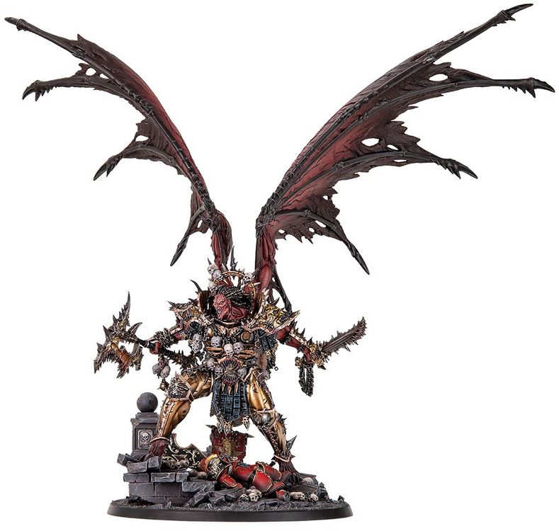

<!-- A0682-B0047 -->

原译文

Resin Daemon Primarch Angron 升魔原体安格隆

**校订译文**

Resin Daemon Primarch Angron 恶魔原体安格隆的树脂模型

**校注：** Resin 指树脂模型，原译漏掉媒介信息；英文图注完整保留。

<!-- /A0682-B0047 -->

<!-- A0682-B0048 -->
**英文原文**

Angron and his World Eaters went on to mindlessly rampage throughout the Galaxy, ignoring Horus' calls to muster at Ullanor in preparation for the drive on Terra. Perturabo himself was eventually sent with orders to bring Angron to Ullanor at all costs. Upon the world of Deluge, the Iron Warriors arrived to find the population butchered and stacked into mountains of corpses. After withstanding an assault by crazed World Eaters and Khornate Daemons, the sky opened up and Angron himself entered the carnage. Perturabo and Angron engaged in a brutal battle, with the Daemon having the clear edge in power and speed. However, despite taking many wounds Perturabo endured and goaded Angron, declaring that he was born a slave and now was a slave to Darkness for all eternity. By using the Iron Warriors, Iron Circle, and Volk to out-maneuver and bombard the World Eaters, Angron was bested as an Ultramarines fleet appeared in orbit over Deluge. Angron laughed and declared that they were all now going to die, but Perturabo reminded the Daemon Primarch that he had seen his warriors butchered while he had done nothing once before. This moved Angron enough to act, and after creating a Warp Storm the Iron Warriors and World Eaters fleets were able to escape the Ultramarines and move to Ullanor, where they accompanied Horus for the muster. Angron subsequently appeared in the climax of the Solar War. As a massive Warp Rift opened up over Luna which allowed the primary traitor strikeforce to assail Terra itself, Angron was seen perched aboard one of the battlements of the Conqueror.

<!-- /A0682-B0048 -->

<!-- A0682-B0049 -->

原译文

安格隆和他的吞世者继续在整个银河系中肆无忌惮地横冲直撞，无视荷鲁斯在乌兰诺集结的号召，为猛击泰拉做准备。佩图拉博本人最终被命令不惜一切代价将安格隆带到乌兰诺。在德鲁格世界，钢铁勇士们来到这里，发现人们被屠杀，堆成了成堆的尸体。在经受住疯狂的吞世者和恐虐恶魔的攻击后，天空裂开了，安格隆自己也进入了大屠杀。佩图拉博和安格隆进行了一场残酷的战斗，恶魔在力量和速度上具有明显的优势。然而，尽管受了很多伤，佩图拉博还是忍受并激怒了安格隆，宣称他生来就是奴隶，现在永远是黑暗之奴。通过使用钢铁勇士、铁环和沃克来超越机动并轰炸吞世者，当一支极限战舰队出现在德鲁格上空的轨道上时，安格隆被击败。安格隆笑着宣布他们现在都要死了，但佩图拉博提醒恶魔原体，他以前什么都没做，但他看到他的战士被屠杀了。这足以让安格隆采取行动，在制造了一场亚空间风暴后，钢铁勇士和吞世者舰队得以逃离极限战士，前往乌兰诺，在那里他们陪同荷鲁斯进行集结。安格隆随后出现在太阳战争的高潮中。当月球上空出现一道巨大的亚空间裂缝，让主要的叛徒突击队能够攻击泰拉本身时，人们看到安格隆栖息在征服者号的一座城垛上。

**校订译文**

安格隆与吞世者随后继续在银河肆意杀戮，无视荷鲁斯要求在乌兰诺集结、准备进攻泰拉的号令。战帅最终派佩图拉博亲自出马，不惜代价将他带回。钢铁勇士抵达德鲁格时，发现居民已被屠尽，尸体堆积如山。他们顶住疯狂吞世者与恐虐恶魔的攻势后，天空突然裂开，安格隆亲自加入战局。两位原体展开残酷交锋，安格隆的力量与速度占据明显优势，佩图拉博却顶着重伤不断挑衅，指出对方生来为奴，如今又永远沦为黑暗之奴。钢铁勇士、铁环与沃克通过机动和炮击压制吞世者，最终制住安格隆；与此同时，一支极限战士舰队出现在轨道。安格隆大笑，宣称所有人都要死在这里。佩图拉博却提醒他，他曾经眼看自己的战士遭屠，自己却无能为力。这个提醒终于促使安格隆行动。他制造亚空间风暴，使两支叛军舰队逃离极限战士追击，前往乌兰诺与荷鲁斯集结。太阳战争的高潮中，月球上空裂开巨大的亚空间裂隙，叛军主力由此直扑泰拉；安格隆便蹲踞在征服者号的一处城垛上。

<!-- /A0682-B0049 -->

<!-- A0682-B0050 图片 -->
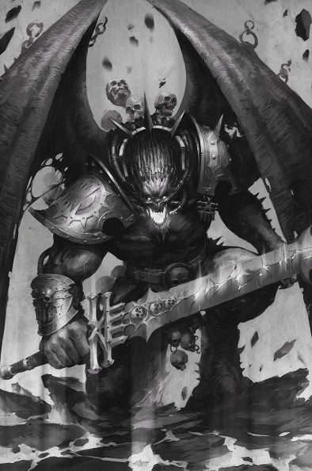

<!-- A0682-B0051 -->

原译文

Angron during the Siege of Terra 泰拉围城期间的安格隆

**校订译文**

Angron during the Siege of Terra 泰拉围城期间的安格隆

<!-- /A0682-B0051 -->

<!-- A0682-B0052 -->
**英文原文**

By the Siege of Terra, Angron was a blood-crazed slave to Khorne. He demanded that Horus allow him to directly attack the Imperial Palace, regardless of the fact that the Emperor's psychic barrier around the world would see him likely die in the process until such a time where the traitors could weaken it. After hearing that Mortarion's Death Guard would instead be the first to assault Terra, Angron fell into a rage and massacred all he came across within the bowels of the The Conqueror. Lotara Sarrin feared that he would murder the Tech-Priest's attending to the vessels reactor, risking a catastrophic meltdown. This forced Kharn to confront Angron within the ship, where the Primarch revealed he knew of the 8th Captain's ultimate destiny and wished to supplant him as the Chosen of Khorne. The two battled, with Kharn being little match for his gene-father. However, before Angron could finish him, Kharn placed a teleport homer on the Primarch which transported him to the shifting maze within the nearby Night Lords flagship Nightfall within, Angron became trapped and spent his time battling the many traps within the maze. Later when traitor rituals weakened the Emperor's psychic barrier on Terra, Angron was shot out of the Nightfall and into space, where he made his way to the surface. Angron appeared in front of Terra as a flaming meteor, landing and slaying friend and foe alike. He fought his way to the walls of the Palace, where he saw Sanguinius and roared a challenge. Sanguinius refused, saluting his brother and stating that while they would battle one day this was not that day. Angron raged, but due to the lingering effects of the Emperor's barrier could not pursue him into the Palace. During the battle for the Lion's Gate Spaceport Angron destroyed a Capitol Imperialis and then a Leviathan, but was again unable to advance past the Palace walls. When the Lion's Gate Spaceport fell to a massive traitor assault and the Emperor's shield shrunk to only encompass the Sanctum Imperialis, Angron led a horde of World Eaters on to the Eternity Wall. Angron and Kharn led an assault on the Eternity Wall Spaceport, and in a moment of clarity the Primarch regained some of his old noble visage. He gave an opportunity for the defenders of the Spaceport to surrender, though they responded by blasting him to pieces with their gun batteries. Angron quickly regenerated, and along with his World Eaters massacred the defenders of the Eternity Wall Spaceport. He later struck down the lone Imperial Army trooper Ollanius Piers as the mortal stood before him.

<!-- /A0682-B0052 -->

<!-- A0682-B0053 -->

原译文

在泰拉围城中，安格隆是恐虐的一个狂血的奴隶。他要求荷鲁斯允许他直接攻击皇宫，尽管帝皇在世界各地的灵能屏障可能会导致他在这个过程中死去，直到叛徒能够削弱它。在听说莫塔里安的死亡守卫将成为第一个攻击泰拉的人后，安格隆大发雷霆，屠杀了他在征服者号内部遇到的所有人。洛塔拉·萨林担心他会杀害技术神甫对战舰反应堆的照料，导致灾难性熔毁的风险。这迫使卡恩在船上与安格隆对峙，原体透露他知道第八连长的最终命运，并希望取代他成为恐虐的神选。两人发生了争斗，而卡恩并不是他基因之父的对手。然而，在安格隆完成之前，卡恩在原体身上放置了一个传送信标，将他传送到附近午夜领主旗舰夜幕将临号内的移动迷宫。安格隆被困在里面，并花时间与迷宫内的许多陷阱作斗争。后来，当叛徒仪式削弱了帝皇在泰拉上的灵能屏障时，安格隆被射出夜幕将临号，进入太空，在那里他浮出表面。安格隆像一颗燃烧的流星出现在泰拉表面，降落并杀死了战友和敌人。他奋力向宫殿的墙壁走去，在那里他看到了圣吉列斯，并咆哮着挑战。圣吉列斯拒绝了，向他的兄弟致敬，并表示虽然他们有一天会战斗，但这不是那天。安格隆怒不可遏，但由于帝皇屏障的挥之不去的影响，无法追他进皇宫。在争夺狮门太空港的战斗中，安格隆摧毁了帝国大厦和利维坦，但再次无法越过皇宫的城墙。当狮门太空港遭到大规模的叛徒袭击，帝皇的屏障缩小到只包围了帝国圣殿时，安格隆带领一群吞世者来到了永恒之墙。安格隆和卡恩领导了对永恒之墙太空港的攻击，在一个清晰的时刻，原体恢复了一些古老的高贵面孔。他给了太空港的守军一个投降的机会，尽管他们用枪炮把他炸成了碎片。安格隆迅速重生，并与他的吞世者一起屠杀了永恒之墙太空港的守卫者。后来，当一个凡人站在他面前时，他击倒了孤独的帝国陆军士兵欧兰尼奥斯·皮尔斯。

**校订译文**

泰拉围城时，安格隆已成为嗜血成狂的恐虐奴仆。他要求直接攻击皇宫，根本不在乎帝皇笼罩世界的灵能屏障尚未被削弱，自己贸然闯入很可能毁灭。得知莫塔里安的死亡守卫将率先登陆后，他暴怒地屠杀征服者号内部所有遇见的人。洛塔拉·萨林担心他会杀死看管反应堆的技术祭司，引发灾难性熔毁，只得让卡恩前去阻拦。交锋时，安格隆透露自己知道第八连长的最终命运，并想取代他成为恐虐神选。卡恩远非原体对手，却在被杀前，将传送信标安在他身上，把他送进附近午夜领主旗舰夜幕降临号内不断变化的迷宫。安格隆受困其中，与重重陷阱纠缠。后来，叛军仪式削弱了帝皇屏障，他被弹射出舰，穿过太空，像燃烧的流星般坠入泰拉，落地后不分敌我地杀戮。他一路冲至宫墙，向圣吉列斯咆哮挑战；天使却向他致意，表示兄弟终有一战，但并非今天。帝皇屏障仍残存力量，使暴怒的安格隆无法追入皇宫。狮门太空港之战中，他先后摧毁一辆帝国大厦与一辆利维坦，却仍越不过宫墙。直到太空港失守，屏障收缩至只覆盖帝国圣所，他才率吞世者冲上永恒之墙，与卡恩进攻太空港。一瞬清明中，他恢复了几分昔日的高贵神情，给守军投降的机会；对方却以炮火将他轰碎。安格隆迅速再生，与吞世者屠尽守军。后来，独自挡在他面前的帝国军士兵欧良尼乌斯·皮尔斯，也被他杀死。

**校注：** Capitol Imperialis 与 Leviathan 在此均为大型地面载具，不是建筑或泰伦舰队。Ollanius Piers 为皮尔斯，区别Pius庇乌斯与Persson佩松。

<!-- /A0682-B0053 -->

<!-- A0682-B0054 -->
**英文原文**

In the prelude to the siege of the Eternity Gate, the barely-sentient Angron was psychically guided by Horus to find and kill Sanguinius. At the feet of the Eternity Gate itself, Angron finally met Sanguinius in battle. Though weakened from his earlier fight with Ka'Bandha, Sanguinius nonetheless next faced his Daemonic brother. After a climactic airborne battle, Angron impaled Sanguinius upon his Black Blade. However, Sanguinius used the opportunity to rip out Angron's Butchers Nails, causing the Daemon Primarch's head to explode as Angron shouted for him to stop. With Angron banished into the Warp, the World Eaters lost whatever sanity they had and began to cut down their own allies. This broke the traitor advance just short of the Eternity Gate.

<!-- /A0682-B0054 -->

<!-- A0682-B0055 -->

原译文

在围攻永恒之门的前奏中，几乎没有知觉的安格隆在荷鲁斯的灵能指引下去找到并杀死圣吉列斯。在永恒之门脚下，安格隆终于在战斗中遇到了圣吉列斯。尽管圣吉列斯在早些时候与卡’班哈的战斗中被削弱了，但他接下来还是要面对他的恶魔兄弟。在一场激烈的空战后，安格隆用他的黑刃刺穿了圣吉列斯。然而，圣吉列斯利用这个机会撕下了安格隆的屠夫之钉，导致恶魔原体的头部爆炸，当安格隆大喊要他停下来时。随着安格隆被放逐到亚空间，吞世者失去了所有的理智，开始杀害自己的盟友。这打破了叛徒在永恒之门附近的推进。

**校订译文**

永恒之门大战前，荷鲁斯以灵能引导几乎失去自我意识的安格隆，命他寻找并杀死圣吉列斯。两位原体终于在门前交锋。天使刚与卡’班哈苦战，已十分虚弱，却仍迎击恶魔化的兄弟。激烈空战后，安格隆以黑刃贯穿天使；圣吉列斯则趁机扯出屠夫之钉。安格隆喊叫着要他停下，但头颅仍随之爆裂，躯体被放逐回亚空间。吞世者失去最后一丝理智，转而屠杀己方盟友，使叛军攻势在永恒之门前功亏一篑。

<!-- /A0682-B0055 -->

<!-- A0682-B0056 -->
**英文原文**

Eventually, Horus was slain by the Emperor and the traitors were forced to flee Terra in defeat. Already savage and brutal, the World Eaters quickly found a new master in the form of the Blood God Khorne, eternally demanding sacrifice and skulls. Angron led his legion into their worship and oversaw his Legion's retreat into the Eye of Terror.

<!-- /A0682-B0056 -->

<!-- A0682-B0057 -->

原译文

最终，荷鲁斯被帝皇杀死，叛徒们被迫战败逃离泰拉。已经野蛮而残忍的吞世者很快找到了一个新的主人—血神恐虐，他永远要求牺牲和头骨。安格隆带领他的军团进入他们的崇拜，并监督他的军团撤退到恐惧之眼。

**校订译文**

荷鲁斯最终被帝皇杀死，战败的叛军被迫逃离泰拉。原本已残暴无比的吞世者，彻底奉血神恐虐为新的主宰，献上永无止境的牺牲与颅骨。安格隆引领军团投入这份崇拜，并主持撤往恐惧之眼。

<!-- /A0682-B0057 -->

<!-- A0682-B0058 -->
### Post-Heresy 叛乱后

<!-- /A0682-B0058 -->

<!-- A0682-B0059 -->
### The Dominion of Fire 火焰统治

<!-- /A0682-B0059 -->

<!-- A0682-B0060 -->
**英文原文**

During the middle of the 38th millennium, Angron and fifty thousand Khorne Berzerkers slaughtered their way through Imperial space for over two centuries. This incident became known as the Dominion of Fire. The wars and rebellions the forces of Khorne sparked ravaged over seventy sectors. In the end it took four Space Marine chapters, two Titan legions and more than thirty Imperial Guard regiments to retake what the Imperium had lost. Ninety percent of the area has since been recovered by the forces of Mankind.

<!-- /A0682-B0060 -->

<!-- A0682-B0061 -->

原译文

在第38个千年中期，安格隆和5万名恐虐狂战士在帝国空间屠杀了两个多世纪。这一事件被称为火焰统治。恐虐部队引发的战争和叛乱蹂躏了70多个星区。最终，四个星际战士战团、两个泰坦军团和三十多个帝国卫队兵团夺回了帝国失去的一切。此后，该地区的90%已被人类部队收复。

**校订译文**

第三十八千年中期，安格隆率五万名恐虐狂战士在帝国境内肆虐两个多世纪，这一时期被称为“火焰统治”。他们引发的战争与叛乱波及七十多个星区。帝国最终动用四个星际战士战团、两个泰坦军团及三十多个帝国卫队团，才得以逐步收复失地；据本篇记载，已有九成受灾区域重归人类控制。

**校注：** 源文先概述收复失地，后明确90%恢复；中文不误写“夺回一切”而与具体比例冲突。

<!-- /A0682-B0061 -->

<!-- A0682-B0062 图片 -->
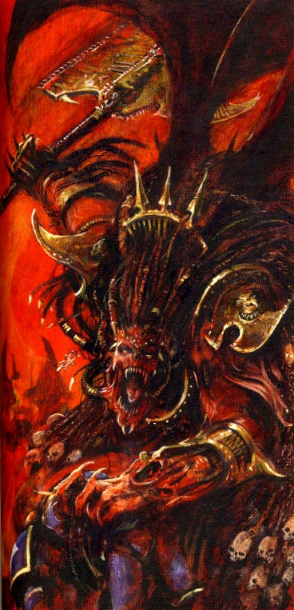

<!-- A0682-B0063 -->

原译文

Angron, Daemon Prince of Khorne 安格隆，恐虐恶魔王子

**校订译文**

Angron, Daemon Prince of Khorne 安格隆，恐虐恶魔王子

<!-- /A0682-B0063 -->

<!-- A0682-B0064 -->
### The First War for Armageddon 第一次阿玛吉多顿战争

<!-- /A0682-B0064 -->

<!-- A0682-B0065 -->
**英文原文**

In 444.M41, Angron invaded the Imperial hive world Armageddon. He led four World Eaters companies and a daemonic host against the local defenders and their Space Wolves allies. Angron's forces ravaged the planet, but he was continually forced to slow his advance to erect monuments to Khorne in order to sustain his Daemonic form in the Materium. In the end, however, he was defeated when he was confronted by a force of 109 Grey Knights. Angron and his escort of twelve Bloodthirsters, the Cruor Praetoria, initially decimated the Grey Knights sent before him until a newer recruit and extraordinarily powerful Psyker, Hyperion, managed to first snap, then break the Black Blade at the height of the struggle. Now at a disadvantage, Angron was banished back to the Warp by Brother-Captain Taremar Aurellian in a battle that only thirteen Grey Knights survived.

<!-- /A0682-B0065 -->

<!-- A0682-B0066 -->

原译文

444.M41年，安格隆入侵帝国巢都世界阿玛吉多顿。他带领四个吞世者连队和一个恶魔宿主对抗当地守军及其太空野狼盟友。安格隆的部队蹂躏了这个星球，但他不断被迫放慢前进速度，为恐虐立碑，以维持他在物质界中的恶魔形态。然而，最终他被109名灰骑士击败。安格隆和他的十二名嗜血狂魔护卫，残酷者卫队，最初摧毁了他面前的灰骑士，直到一名新招募的、先是非常强大的灵能者海伯利昂在战斗的高潮中折断了黑刃。现在处于劣势，在一场只有13名灰骑士幸存的战斗中，安格隆被兄弟连长塔雷玛·奥瑞利安驱逐亚空间。

**校订译文**

444.M41，安格隆入侵帝国巢都世界阿玛吉多顿，率四个吞世者连队与恶魔大军，对抗当地守军及太空野狼盟军。他的部队蹂躏星球，但为了让恶魔躯体在物质宇宙维持存在，他必须不断停下来修建恐虐纪念碑。最终，一支一百零九人的灰骑士部队迎战安格隆。他与十二名嗜血狂魔组成的亲卫“残酷者卫队”起初给灰骑士造成惨重损失，但资历尚浅、灵能力量却极为强大的海伯利昂，在激战顶点折毁了黑刃。安格隆由此落入劣势，最终被兄弟会连长塔雷玛·奥瑞利安放逐回亚空间。这一役，只有十三名灰骑士生还。

**校注：** host 指军队而非恶魔宿主；Brother-Captain 按新核官方译名兄弟会连长。decimated 是重创，源文明言仍有生还者，不能译全数摧毁。

<!-- /A0682-B0066 -->

<!-- A0682-B0067 -->
### Return 回归

<!-- /A0682-B0067 -->

<!-- A0682-B0068 -->
**英文原文**

After the formation of the Great Rift, the Salamanders prevented an attempt to summon Angron upon Armageddon. With the arrival of the Warp calamity and with the First War of Armageddon now over 600 years in the past, the Grey Knights began to worry that the Red Angel's return was imminent.

<!-- /A0682-B0068 -->

<!-- A0682-B0069 -->

原译文

大裂隙形成后，火蜥蜴阻止了在阿玛吉多顿召唤安格隆的企图。随着亚空间灾难的到来，以及600多年前的第一次阿玛吉多顿战争，灰骑士开始担心红天使的回归迫在眉睫。

**校订译文**

大裂隙形成后，火蜥蜴阻止了一次在阿玛吉多顿召唤安格隆的尝试。亚空间灾变已经降临，而按本段叙述，距第一次阿玛吉多顿战争也已过去六百多年，灰骑士因此担心红天使即将重临。

**校注：** 600余年为本段源文纪年；与444.M41、大裂隙常见时间记法间的差异暂保留，未擅自改为550年。

<!-- /A0682-B0069 -->

<!-- A0682-B0070 图片 -->
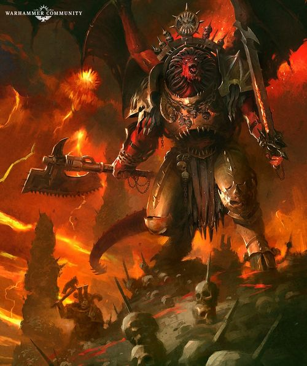

<!-- A0682-B0071 -->

原译文

Angron returned to the Mortal Realm 安格隆回归凡世领域

**校订译文**

Angron returned to the Mortal Realm 安格隆重返凡世

<!-- /A0682-B0071 -->

<!-- A0682-B0072 -->
**英文原文**

Angron finally reemerged into the Materium on the bridge of his old flagship, the Conqueror, as it was leading a World Eaters fleet under Kossolax the Foresworn to assault the world of Kalkin's Tribune. Angron's first act was to massacre Kossolax's four chief lieutenants, though the Chaos Lord himself managed to flee and avoid his Primarch's fury. The massive Daemon Prince then led an army of World Eaters and Khornate Daemons to the surface of Kalkin's Tribune, annihilating the billions-strong garrison and accompanying fleet of over two thousand warships in a matter of weeks. With seemingly none of his former self left, Angron simply was a beast that lived within the bowels of the Conqueror until Kossolax moved it to a new world for him to murder. The Foresworn planned to use the Primarch to rally the whole of the World Eaters to his command. However, Angron often proved too difficult to control, and was able to communicate with the possessed Machine Spirit of the Conqueror that had once been Lotara Sarrin to move the ship towards an apparently obscure world in Imperium Nihilus, Malakbael. The Red Angel was being pulled towards the world by a psychic beacon not dissimilar to the Astronomican.

<!-- /A0682-B0072 -->

<!-- A0682-B0073 -->

原译文

安格隆终于在他的旧旗舰征服者号的舰桥上重新出现在物质界中，当时它正率领弃誓者科索拉克斯率领的吞世者舰队袭击卡尔金之护世界。安格隆的第一个行动是屠杀科索拉克斯的四名主要副手，尽管混沌领主本人设法逃离并避免了他的原体的愤怒。庞大的恶魔王子随后率领一支由吞世者和恐虐恶魔组成的军队登上了卡尔金之护的表面，在几周内消灭了数十亿的驻军和随行的2000多艘战舰。似乎已经没有以前的自己了，安格隆只是一只生活在征服者号内部的野兽，直到科索拉克斯将它转移到一个新的世界让他杀戮。弃誓者计划利用原体召集整个吞世者听从他的指挥。然而，事实证明，安格隆经常难以控制，并且能够与曾经是洛塔拉·萨林的被附身的征服者号机魂沟通，将船驶向马拉贝尔，帝国暗面一个明显模糊的世界。红天使被一个与星炬相似的灵能灯塔拉向世界。

**校订译文**

安格隆最终在昔日旗舰征服者号的舰桥上重现于物质宇宙。当时，该舰正率领弃誓者科索拉克斯麾下的吞世者舰队，进攻卡尔金之护。原体出现后首先杀死科索拉克斯的四名主要副手，混沌领主本人则及时逃走，避开其怒火。随后，安格隆率吞世者与恐虐恶魔登陆，仅用数周便歼灭数十亿守军，连同两千余艘战舰组成的防御舰队。昔日的自我似乎已荡然无存，他只是蛰伏于征服者号深处的野兽，等待科索拉克斯把舰船带到下一个可以杀戮的世界。弃誓者本想借原体之名，将所有吞世者收归己有，却发现安格隆难以控制。他甚至能与征服者号被附身的机魂沟通——那机魂曾是洛塔拉·萨林——命舰船驶向帝国暗面一颗看似默默无闻的世界：马拉克巴力。一道类似星炬的灵能信标，正在将红天使引向那里。

**校注：** Malakbael 统一马拉克巴力，原马拉贝尔；obscure 是不知名而非视觉模糊。

<!-- /A0682-B0073 -->

<!-- A0682-B0074 -->
**英文原文**

It was then that a 13-strong group of Grey Knights led by Epistolary Graucis Telomane struck, setting up their own psychic beacon using a captured possessed psyker on Hyades to draw the Red Angel away from Malakbael and into a trap. Angron and his vast horde plunged straight into Hyades, massacring all they came across but not before the Grey Knights sacrificed themselves to enact a great psychic ritual using their stolen psyker to set off a Warp explosion that devoured the world along with much of Kossolax's army. Angron, however, emerged only wounded, and retreated to the Conqueror to heal himself. He was then ambushed by the surviving Grey Knights, including Graucis who piloted a Dreadknight. Angron defeated all of his foes, but was briefly overcome when Paladin Dvorik used his True Name. The ritual blasted a hole in the hull of the Conqueror which sucked out the remaining two Grey Knights. In deep space, Angron cut down Graucis, but howled in fury when the Grey Knight was able to send his soul deep into the Warp and escape consumption by the Daemon.

<!-- /A0682-B0074 -->

<!-- A0682-B0075 -->

原译文

就在那时，由抄写员格劳西斯.泰洛迈恩领导的13人灰骑士发动了袭击，他们在毕星团上用一名被俘的被附身的灵能者建立了自己的精神灯塔，将红天使从马拉贝尔边上拉到陷阱里。安格隆和他的庞大部落直接冲进了毕星团，屠杀了他们遇到的所有人，但在此之前，灰骑士牺牲了自己，用他们偷来的灵能者进行了一场伟大的通灵仪式，引发了一场亚空间爆炸，吞噬了整个世界以及科索拉克斯的大部分军队。然而，安格隆只受了伤，退到征服者号那里疗伤。随后，他遭到了幸存的灰骑士的伏击，其中包括驾驶天罚恐惧骑士的格劳西斯。安格隆击败了所有的敌人，但当圣骑士德沃瑞克使用他的真名时，他短暂地被击败了。仪式在征服者号的船体上炸了一个洞，把剩下的两名灰骑士吸了出来。在深空中，安格隆砍倒了格劳西斯，但当灰骑士能够将他的灵魂送入亚空间深处并逃脱恶魔的吞噬时，他愤怒地嚎叫起来。

**校订译文**

此时，星语官格劳西斯·泰洛迈恩率十三名灰骑士采取行动。他们在希亚德斯利用一名被捕获、遭恶魔附身的灵能者建立信标，试图将安格隆从马拉克巴力引开，诱入陷阱。红天使率大军径直扑向希亚德斯，屠杀一切所遇之人；灰骑士则以自我牺牲为代价，借那名灵能者发动强大的仪式，引爆亚空间之力，将整颗世界及科索拉克斯的大部分军队一同吞没。然而，安格隆仅仅受伤，返回征服者号疗伤，又遭幸存灰骑士伏击，包括驾驶涅墨西斯骇骑机甲的格劳西斯。原体击败所有对手，却被圣骑士德沃瑞克念出安格隆的真名，短暂制住。仪式在舰壳炸出破洞，将仅剩的两名灰骑士卷入虚空。安格隆在深空杀死格劳西斯，但对方及时把灵魂送入亚空间深处，逃过吞噬，令恶魔愤怒咆哮。

**校注：** Hyades 在本段明确为单一 world，暂译希亚德斯，原稿毕星团误套现实星团名。True Name 指安格隆的真名，不是圣骑士自己的。原文先称灰骑士牺牲，后又写幸存者，未据此补造具体分队人数。

<!-- /A0682-B0075 -->

<!-- A0682-B0076 -->
**英文原文**

Angron and his great fleet were able to eventually arrive at Malakbael, beginning the great Battle of Malak. During the engagement, Angron was seemingly fully lucid and issued strategic commands to his forces, dividing them into three great pincers of a "trident". At the climax of the battle, Angron was able to land on Malakbael and reach the Choral Engine itself. It was here he faced some 60 Grey Knights as well as Tempestus Scions under Brother-Captain Drystann Cromm, and while badly wounded the Daemon Prince and his 8 Bloodthirster honour guards proved nigh unstoppable and slaughtered all they came across. Angron was then used as a conduit by Khorne himself to destroyed the Choral Engine, sending out a great psychic shockwave known as the Murder-Curse which corrupted nearly all of Indomitus Crusade Fleet Quartus.

<!-- /A0682-B0076 -->

<!-- A0682-B0077 -->

原译文

安格隆和他的庞大舰队最终抵达马拉贝尔，开始了马拉克之战。在交战期间，安格隆似乎完全清醒，向他的部队发出了战略命令，将他们分成三把“三叉戟”。在战斗的高潮，安格隆能够降落在马拉贝尔并到达圣歌引擎。就在这里，他面对了大约60名灰骑士以及兄弟连长德里斯坦·克罗姆领导下的暴风忠嗣，在重伤的同时，恶魔王子和他的8名嗜血狂魔荣誉卫队几乎势不可挡，屠杀了他们遇到的所有人。然后，安格隆被恐虐用作摧毁圣歌引擎的管道，发出了一种被称为杀戮诅咒的巨大灵能冲击波，几乎腐化了所有的不屈远征舰队。

**校订译文**

安格隆与庞大舰队最终抵达马拉克巴力，马拉克之战随之爆发。战斗期间，他似乎完全恢复清醒，下达战略指令，将军队分为三路钳形攻势，组成一柄“三叉戟”。战至高潮，他登陆并突入圣歌引擎所在区域，迎战兄弟会连长德里斯坦·克罗姆指挥的约六十名灰骑士与风暴忠嗣军。尽管身负重伤，恶魔原体及八名嗜血狂魔亲卫依然近乎不可阻挡，沿途大肆杀戮。最终，恐虐亲自以安格隆为力量通道，摧毁圣歌引擎，释放出被称为“杀戮诅咒”的巨大灵能冲击波，几乎腐化了整支不屈远征第四舰队。

**校注：** 三路攻势组成一柄三叉戟，不是分成三把三叉戟。Quartus 为第四舰队，原译漏掉使灾难范围扩大为整个不屈远征。

<!-- /A0682-B0077 -->

<!-- A0682-B0078 -->
**英文原文**

Later during the same campaign, Angron was summoned by World Eaters allied to Vashtorr upon Wyrmwood, amidst the Battle of Idolatros. Angron went on to maul the Blood Angels and defeat Dante, but before he could finish off the Chapter Master, he was confronted by the returned Lion El'Jonson. During the subsequent titanic duel between the two Primarchs, Angron's rage was unmatched but the Lion was able to penetrate his throat with his Power Sword Fealty. As he lay on the ground, the Lion beheaded Angron with the tip of the Emperor's Shield and the Daemon Primarch was sent back into the Warp.

<!-- /A0682-B0078 -->

<!-- A0682-B0079 -->

原译文

在同一战役的后期，在盲信星之战中，安格隆被与龙林星的瓦什托尔结盟的吞世者召唤。安格隆继续攻击圣血天使并击败但丁，但在他终结战团长之前，他遇到了归来的莱昂·艾尔庄森。在随后两位原体之间的激烈决斗中，安格隆的愤怒是无与伦比的，但莱昂能够用他的动力剑忠诚刺穿他的喉咙。当他躺在地上时，莱昂用帝皇之盾的尖端斩首了安格隆，恶魔原体被送回了亚空间。

**校订译文**

同一战役后期，盲信星之战中，与瓦什托尔结盟的吞世者将安格隆召至龙林星。他重创圣血天使，击败但丁，正要杀死战团长时，却遭归来的莱昂·艾尔’庄森阻拦。两位原体展开惊天决斗；安格隆怒火滔天，莱昂却以动力剑“忠诚”刺穿他的咽喉。待恶魔倒地，雄狮又用帝皇之盾的尖端斩下其首级，将他放逐回亚空间。

<!-- /A0682-B0079 -->

<!-- A0682-B0080 -->
## Description and Abilities 描述和能力

<!-- /A0682-B0080 -->

<!-- A0682-B0081 -->
**英文原文**

Kharn, Captain of the 8th Assault Company of the War Hounds, was struck by his primarch's visage when he first saw it:

<!-- /A0682-B0081 -->

<!-- A0682-B0082 -->

原译文

卡恩，战犬第八突击连队的连长，当他第一次看到它时，被他的原体的脸所震撼：

**校订译文**

战犬第八突击连连长卡恩第一次见到原体时，为他的面容深深震撼：

<!-- /A0682-B0082 -->

<!-- A0682-B0083 图片 -->
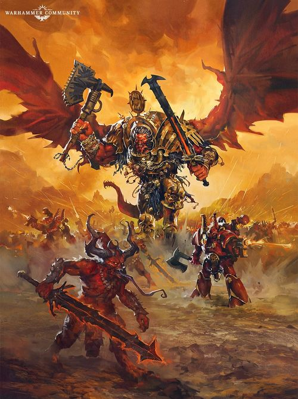

<!-- A0682-B0084 -->

原译文

Daemon Primarch Angron 恶魔原体安格隆

**校订译文**

Daemon Primarch Angron 恶魔原体安格隆

<!-- /A0682-B0084 -->

<!-- A0682-B0085 -->
**英文原文**

Wiry, copper-red hair curled away from a high brow, pale eyes sat deep behind cheekbones that angled down like axe-strokes to an aquiline nose and a broad, thin-lipped mouth.

<!-- /A0682-B0085 -->

<!-- A0682-B0086 -->

原译文

浓密的铜红色头发从高高的额头上卷曲下来，苍白的眼睛深深地坐在颧骨后面，颧骨像斧头一样向下倾斜，形成鹰钩鼻和宽而薄的嘴唇。

**校订译文**

“粗硬的铜红色卷发从高阔的额头向后卷去，浅色双眼深嵌其下；颧骨如斧凿般向下收束，衬出鹰钩鼻和宽阔、薄唇的嘴。

<!-- /A0682-B0086 -->

<!-- A0682-B0087 -->
**英文原文**

It was the face of a general to follow unto death, the face of a teacher at whose feet the wise would fight to sit, the face of a king made for the adoration of worlds: the face of a primarch.

<!-- /A0682-B0087 -->

<!-- A0682-B0088 -->

原译文

这是一个让人追随至死的将军之面，一个让人会为坐在他的脚下而战的教师之面，一个让世界崇拜王者之面：一个原体之面。

**校订译文**

“那是一位将军的面容，值得部下追随至死；也是导师的面容，足以让智者争相拜服于膝前；更是君王的面容，生来便应受万千世界仰慕——那是一位原体的面容。

<!-- /A0682-B0088 -->

<!-- A0682-B0089 -->
**英文原文**

And rage made it the face of a beast. Rage pulsed and distorted the features like a tumour breaking out from the skull beneath. It made the eyes into yellow, empty pits, debased the proud lines of brow and jaw, peeled the lips back from the teeth.

<!-- /A0682-B0089 -->

<!-- A0682-B0090 -->

原译文

愤怒使它变成了野兽之面。愤怒冲击并扭曲了这些特征，就像一个肿瘤从下面的头骨中爆发出来。它把眼睛变成了黄色的空洞，贬低了眉毛和下巴的骄傲线条，把嘴唇从牙齿上剥离下来。

**校订译文**

“然而，怒火将它变成兽面。愤怒在面部跳动、扭曲，仿佛肿瘤从颅骨深处破出。它使双眼化为黄色空洞，毁坏眉骨与下颌高傲的线条，让嘴唇向后翻卷，露出牙齿。”

<!-- /A0682-B0090 -->

<!-- A0682-B0091 -->
**英文原文**

According to the custom of the gladiators he was raised among, Angron cut scars into his torso after each of his battles, in a continuing length known as the Triumph Rope. For every victory, the scar would be left to heal normally, while for every defeat the warrior would work some dirt into the wound and cause the scar to turn black. Angron was the only gladiator in his world's history without any black scars.

<!-- /A0682-B0091 -->

<!-- A0682-B0092 -->

原译文

根据他所成长的角斗士的习俗，安格隆在每次战斗后都会在躯干上留下疤痕，这种持续的长度被称为凯旋之绳。每一次胜利，疤痕都会正常愈合，而每一次失败，战士都会在伤口上撒些泥土，使疤痕变黑。安格隆是他世界历史上唯一没有黑色疤痕的角斗士。

**校订译文**

依照抚养他长大的角斗士们的习俗，安格隆每次战斗后都会在躯干刻下一道伤口，让伤痕连成不断延长的“凯旋之绳”。获胜时，任伤口自然愈合；战败时，则往伤处揉入泥土，使疤痕变黑。安格隆是努凯里亚历史上唯一没有任何黑色败绩疤痕的角斗士。

<!-- /A0682-B0092 -->

<!-- A0682-B0093 -->
**英文原文**

Corax believed that no other Primarch could have bested Angron in single combat save for Horus and perhaps Sanguinius. Leman Russ was often considered his equal; Rogal Dorn, on the other hand, believed that he could defeat Angron easily, and feared him much less as an adversary than he did Horus.

<!-- /A0682-B0093 -->

<!-- A0682-B0094 -->

原译文

科拉克斯认为，除了荷鲁斯，也许还有圣吉列斯，没有其他原体能在一场战斗中击败安格隆。黎曼·鲁斯经常被认为与他平起平坐；另一方面，罗格·多恩相信他可以轻松击败安格隆，并且比他对荷鲁斯的恐惧要少得多。

**校订译文**

科拉克斯认为，除荷鲁斯及可能的圣吉列斯外，没有其他原体能在单挑中胜过安格隆。黎曼·鲁斯也常被认为与他旗鼓相当；罗格·多恩却相信自己能轻易击败他，对安格隆的忌惮远不及对荷鲁斯。

**校注：** 原体战力高低属于各人物看法，不转换成统一客观排名。

<!-- /A0682-B0094 -->

<!-- A0682-B0095 -->
**英文原文**

Before possessing the Butcher's Nails Angron displayed an inherent psychic ability which allowed him to not only feel but also somehow absorb the pain and negative emotions of others. He used this to calm child slaves in the caves of Nuceria.

<!-- /A0682-B0095 -->

<!-- A0682-B0096 -->

原译文

在拥有屠夫之钉之前，安格隆表现出了一种内在的灵能能力，这使他不仅能感受到，还能以某种方式吸收他人的痛苦和负面情绪。他用这个来安抚努凯里亚洞穴里的奴隶儿童。

**校订译文**

在拥有屠夫之钉之前，安格隆表现出了一种内在的灵能能力，这使他不仅能感受到，还能以某种方式吸收他人的痛苦和负面情绪。他用这个来安抚努凯里亚洞穴里的奴隶儿童。

<!-- /A0682-B0096 -->

<!-- A0682-B0097 -->
**英文原文**

Since his return at the dawn of M42, Angron can no longer be banished back to the Warp for extended periods. Should he be defeated and banished from the Immaterium, he will always return eight weeks, eight days, and eight hours later. Moreover, his return is heralded by calamities known as the Crimson Omens which include the Blood Rain, Storm of Hate, and Fleshbrand Plague. These omens appear only upon sites that have experienced apocalyptic bloodshed, and it is likely that Angron uses the energies of these former battlefields to manifest once more. It is also thought that Angron gained this new ability thanks to the formation of the Great Rift.

<!-- /A0682-B0097 -->

<!-- A0682-B0098 -->

原译文

自从安格隆在M42黎明回归后，他就不能再被长时间驱逐回亚空间。如果他被击败并被驱逐回非物质界，他总是会在八周、八天、八小时后回来。此外，他的回归预示着被称为深红噩兆的灾难，其中包括血雨、仇恨的风暴和血印瘟疫。这些征兆只出现在经历过启示录级流血事件的地点，安格隆很可能会利用这些前战场的能量再次显现。人们还认为，由于大裂隙的形成，安格隆获得了这种新能力。

**校订译文**

自第四十二千年初归来后，安格隆便无法再被长期放逐。即便在物质宇宙败亡、被逐回亚空间，他也总会在八周、八天又八小时后重返凡世。他归来前，还会出现统称“深红噩兆”的灾变，包括血雨、仇恨风暴与血印瘟疫。这些征兆只出现在曾经历末日般大屠杀的地方，他很可能借助旧战场积聚的力量再次显现。人们也猜测，这项新能力源于大裂隙的形成。

**校注：** 原文第二句 banished from the Immaterium 与前句 banished back to the Warp 及后文重返相矛盾，疑误用 from；中文按全段语义作被逐回亚空间，英文保留。

<!-- /A0682-B0098 -->

<!-- A0682-B0099 -->
## Wargear 武器装备

原题：Wargear 战备

<!-- /A0682-B0099 -->

<!-- A0682-B0100 -->
**英文原文**

During the Great Crusade and Horus Heresy, Angron wielded the twin Chain Axes Gorechild and Gorefather. Before these twin weapons, he wielded the primitive Chainaxe Widowmaker, which was broken in battle against Leman Russ during the Night of the Wolf. To replace it, Angron took up the massive axe Brazentooth, which was eventually given to the Word Bearers as a sign of their alliance. For protection, Angron wore a massive suit of Power Armour designed from his Nucerian gladiatorial armor known as the Armour of Mars. Angron also wielded the Plasma Pistol Spite Furnace. Upon becoming a Daemon Prince, Angron abandoned most of his mortal weaponry, taking up the Daemon Weapon known as the Black Blade.

<!-- /A0682-B0100 -->

<!-- A0682-B0101 -->

原译文

在大远征和荷鲁斯叛乱期间，安格隆挥舞着双链锯斧血子和血父。在这两种武器之前，他挥舞着原始的链锯斧寡妇制造者，在狼之夜与黎曼·鲁斯的战斗中被击碎。为了取代它，安格隆拿起了巨斧黄铜之牙，这把斧头最终被送给了怀言者，作为他们联盟的标志。为了保护自己，安格隆穿着一套巨大的动力盔甲，这套盔甲是根据他的努凯里亚角斗士盔甲设计的，被称为战神之甲。安格隆还挥舞着等离子手枪憎恶熔炉。成为恶魔王子后，安格隆放弃了大部分致命武器，拿起了被称为黑刃的恶魔武器。

**校订译文**

大远征及荷鲁斯之乱期间，安格隆使用一对链锯斧：血子与血父。在此之前，他持有一柄较为原始的链锯斧“寡妇制造者”，却在狼之夜与黎曼·鲁斯交战时损坏。随后，他改用巨斧黄铜之牙，后来又将其赠予怀言者，象征双方联盟。他的厚重动力甲以努凯里亚角斗士护甲为蓝本，名为“战神之甲”，另有一把名叫憎恶熔炉的等离子手枪。升格为恶魔王子后，他舍弃大部分凡世武器，改持恶魔武器黑刃。

**校注：** mortal weaponry 指凡世武器，原“致命武器”误译。

<!-- /A0682-B0101 -->

<!-- A0682-B0102 -->
**英文原文**

Since his recent return to the Materium, Angron has taken up the Daemon Weapon Samni'arius and Chain Axe Spinegrinder.

<!-- /A0682-B0102 -->

<!-- A0682-B0103 -->

原译文

自从最近回到物质界以来，安戎已经拿起了恶魔武器萨姆尼’阿里乌斯和链锯斧碎脊者。

**校订译文**

近来重返物质宇宙后，安格隆改用恶魔武器萨姆尼’阿里乌斯与链锯斧碎脊者。

<!-- /A0682-B0103 -->

<!-- A0682-B0104 图片 -->
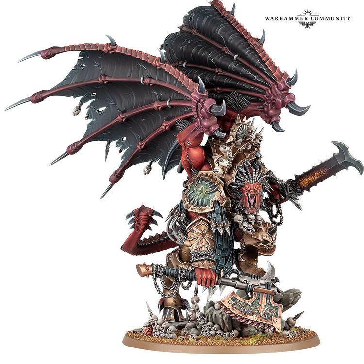

<!-- A0682-B0105 -->

原译文

Daemon Primarch Angron 恶魔原体安格隆

**校订译文**

Daemon Primarch Angron 恶魔原体安格隆

<!-- /A0682-B0105 -->

<!-- A0682-B0106 -->
## Quotes 名句

<!-- /A0682-B0106 -->

<!-- A0682-B0107 -->
**英文原文**

"What would you know of struggle, Perfect Son? When have you fought against the mutilation of your mind? When have you had to do anything more than tally compliances and polish your armour?"\[...\]"The people of your world named you Great One. The people of mine called me Slave. Which one of us landed on a paradise of civilization to be raised by a foster father, Roboute? Which one of us was given armies to lead after training in the halls of the Macraggian high-riders? Which one of us inherited a strong, cultured kingdom? And which one of us had to rise up against a kingdom with nothing but a horde of starving slaves? Which one of us was a child enslaved on a world of monsters, with his brain cut up by carving knives? Listen to your blue-clad wretches yelling of courage and honour, courage and honour, courage and honour. Do you even know the meaning of those words? Courage is fighting the kingdom which enslaves you, no matter that their armies outnumber yours by ten-thousand to one. You know nothing of courage. Honour is resisting a tyrant when all others suckle and grow fat on the hypocrisy he feeds them. You know nothing of honour."

<!-- /A0682-B0107 -->

<!-- A0682-B0108 -->

原译文

“完美之子，你对斗争有什么了解？你什么时候与残害你的思想战斗过？什么时候你除了记录顺从和打磨盔甲之外，还必须做任何事情？”\[…\]“你们世界的人称你为伟人。我的人称我为奴隶。我们中的哪一个人登上了文明的天堂，由养父抚养长大，罗伯特？我们中的哪个人在马库拉格高骑手的大厅里训练后被赋予了军队领导权？我们中谁继承了一个强大而文明的王国？我们中哪一个人不得不起来反抗一个只有一群饥饿奴隶的王国？我们中哪一个是被怪物的世界奴役的孩子，他的大脑被雕刻刀切开？听听你那些穿着蓝色衣服的可怜虫喊着勇气和荣誉、勇气和荣誉，勇气和荣誉。你甚至知道这些词的意思吗？勇气是与奴役你的王国作战，无论他们的军队与你的军队一万比一。你对勇气一无所知。当所有其他人都因为暴君喂给他们的虚伪而吮吸和发胖时，荣誉就是抵抗暴君。你对荣誉一无所知。"

**校订译文**

“完美之子，你懂什么叫挣扎？你何曾对抗过自己心智遭到肢解的痛苦？除了清点归顺的世界、擦亮自己的盔甲，你还被迫做过什么？”……“你的世界尊你为伟人，我的世界却叫我奴隶。罗保特，我们之中，是谁降落在文明的天堂，有养父照料？是谁在马库拉格那些高骑士的厅堂受训之后，便得到军队供他指挥？是谁继承了一个强盛而有教养的王国？又是谁只能带着一群饥肠辘辘的奴隶，奋起反抗整个王国？是谁幼年便在怪物横行的世界为奴，被刻刀切开大脑？听听你那些蓝甲可怜虫，反复高喊勇气与荣誉、勇气与荣誉、勇气与荣誉。你可知道这些词是什么意思？勇气，是反抗奴役你的王国，哪怕对方兵力是你的一万倍。你根本不懂勇气。荣誉，是当所有人吮吸暴君喂来的虚伪、养得脑满肠肥时，仍然起来反抗他。你也根本不懂荣誉。”

**校注：** 原句 only a horde... 限定安格隆拥有的力量，原译误变成王国只有一群奴隶；修正施受关系。

<!-- /A0682-B0108 -->

<!-- A0682-B0109 -->
**英文原文**

Angron addressing Roboute Guilliman during the Shadow Crusade.

<!-- /A0682-B0109 -->

<!-- A0682-B0110 -->

原译文

在暗影远征期间，安格隆对罗伯特·基里曼的发言。

**校订译文**

安格隆在暗影远征期间对罗保特·基里曼所言。

<!-- /A0682-B0110 -->

<!-- A0682-B0111 -->
## Trivia 琐事

<!-- /A0682-B0111 -->

<!-- A0682-B0112 -->
**英文原文**

Angron's name likely derives from the word angry.

<!-- /A0682-B0112 -->

<!-- A0682-B0113 -->

原译文

安格隆的名字可能来源于愤怒这个词。

**校订译文**

Angron 这一名字可能源于英语 angry，意为“愤怒的”。

<!-- /A0682-B0113 -->

<!-- A0682-B0114 -->
**英文原文**

In a number of ways, Angron's early life and rebellion on Nuceria parallel the life of Spartacus, a gladiator who escaped slavery and led an uprising against the Roman Republic in the 1st century BC.

<!-- /A0682-B0114 -->

<!-- A0682-B0115 -->

原译文

在许多方面，安格隆的早期生活和对努凯里亚的叛乱与斯巴达克斯的生活相似，斯巴达克斯是一名角斗士，他逃离了奴隶制，并在公元前1世纪领导了一场反对罗马共和国的起义。

**校订译文**

安格隆的早年经历及努凯里亚起义，在许多方面与斯巴达克斯的生平相呼应。斯巴达克斯原是一名奴隶角斗士，逃脱后于公元前一世纪领导了反抗罗马共和国的起义。

<!-- /A0682-B0115 -->

<!-- A0682-B0116 -->
### Conflicting sources 来源冲突

<!-- /A0682-B0116 -->

<!-- A0682-B0117 -->
**英文原文**

In the original lore as established in Index Astartes, Angron became a Daemon Prince after the Horus Heresy. However, as of the novel Betrayer, he seems to reach this state during the Heresy itself on Nuceria.

<!-- /A0682-B0117 -->

<!-- A0682-B0118 -->

原译文

在阿斯塔特索引中确立的原始传说中，安格隆在荷鲁斯叛乱之后成为了一名恶魔王子。然而，就小说《背叛者》而言，他似乎是在叛乱时期的努凯里亚上达到这种状态的。

**校订译文**

《阿斯塔特索引》最初确立的设定称，安格隆在荷鲁斯之乱结束后才升格为恶魔王子；但小说《背叛者》则描写他在叛乱期间于努凯里亚完成升魔。

**校注：** 明确保留《阿斯塔特索引》与《背叛者》的升魔时间版本冲突，未强行统一。

<!-- /A0682-B0118 -->

本篇核心术语与暂定项

以下列出本篇出现的英文原形及核心术语表用词。同形词可能指不同对象，具体词义以本篇正文和校注为准；单复数、别名和仅见于图注的名称可能尚未列入。完整候选见[术语表](../../术语表/双语术语候选.csv)。

| 英文 | 采用中文 | 状态 |
| --- | --- | --- |
| Blood Angels | 圣血天使 | 官方已核对 |
| Grey Knights | 灰骑士 | 官方已核对 |
| Space Wolves | 太空野狼 | 官方已核对 |
| Adeptus Custodes | 帝皇禁军 | 官方已核对 |
| Imperial Guard | 帝国卫队 | 暂定·语境区分 |
| Imperial Army | 帝国军 | 暂定·官方待核 |
| Death Guard | 死亡守卫 | 官方已核对 |
| World Eaters | 吞世者 | 官方已核对 |
| Eldar | 灵族 | 暂定·语境区分 |
| Dark Eldar | 黑暗灵族 | 暂定·旧称对应 |
| Psyker | 灵能者 | 官方已核对 |
| Roboute Guilliman | 罗保特·基里曼 | 官方已核对 |
| Ultramar | 奥特拉玛 | 官方已核对 |
| Ultramarines | 极限战士 | 官方已核对 |
| Horus Heresy | 荷鲁斯之乱 | 官方已核对 |
| Astronomican | 星炬 | 暂定 |
| Warp | 亚空间 | 官方已核对 |
| Great Rift | 大裂隙 | 官方已核对 |
| Imperium | 帝国 | 暂定·简称 |
| Mechanicum | 机械教 | 暂定·历史称谓 |
| Tech-Priest | 技术祭司 | 官方已核对 |
| Dark Mechanicum | 黑暗机械教 | 暂定·官方待核 |
| Khorne | 恐虐 | 官方已核对 |
| Indomitus | 不屈学派 | 暂定·学派语境 |
| History | 历史 | 编辑用语已统一 |
| Eye of Terror | 恐惧之眼 | 官方已核对 |
| Teleport Homer | 传送信标 | 暂定·官方待核 |
| Emperor of Mankind | 人类帝皇 | 暂定 |
| Emperor | 帝皇 | 官方已核对 |
| Primarch | 原体 | 官方已核对 |
| Slavery | 奴隶制 | 编辑用语已统一 |
| Hive World | 巢都世界 | 暂定·官方待核 |
| Word Bearers | 怀言者 | 暂定·官方待核 |
| Daemon Prince | 恶魔亲王 | 官方已核对 |
| Iron Warriors | 钢铁勇士 | 暂定·官方待核 |
| Night Lords | 午夜领主 | 暂定·官方待核 |
| The Order | 秩序 | 暂定·官方待核 |
| Great Crusade | 大远征 | 暂定·官方待核 |
| Mortarion | 莫塔里安 | 官方已核对 |
| Terra | 泰拉 | 暂定·官方待核 |
| Murder | 谋杀 | 暂定·官方待核 |
| Horus | 荷鲁斯 | 暂定·官方待核 |
| Lion El'Jonson | 莱昂·艾尔’庄森 | 官方已核对 |
| Imperium Nihilus | 帝国暗面 | 暂定·官方待核 |
| Indomitus Crusade | 不屈远征 | 暂定·官方待核 |
| Vulkan | 沃坎 | 暂定·官方待核 |
| Salamanders | 火蜥蜴 | 暂定·官方待核 |
| Armageddon | 阿玛吉多顿 | 暂定·官方待核 |
| Praetoria | 普雷托利亚 | 暂定·官方待核 |
| Mars | 火星 | 暂定·官方待核 |
| Nuceria | 努凯里亚 | 暂定·官方待核 |
| Calth | 考斯 | 暂定·官方待核 |
| Luna | 月球 | 暂定·官方待核 |
| Titan | 泰坦 | 暂定·官方待核 |
| Tech | 技术语 | 暂定·官方待核 |
| Clear | 清明 | 暂定·官方待核 |
| Arkhan Land | 阿坎·兰德 | 暂定·官方待核 |
| Epistolary | 星语官 | 暂定·官方待核 |
| Master | 导师（审判庭职衔）／舰务官（舰员职务） | 语境定译·官方待核 |
| Lexicanium | 编修员 | 暂定·官方待核 |
| Tribune | 护民官 | 暂定·官方待核 |
| Ullanor | 乌兰诺 | 暂定·官方待核 |
| War Hounds | 战犬 | 暂定·官方待核 |
| Scars | 伤疤 | 暂定·官方待核 |
| Gheer | 吉尔 | 暂定·官方待核 |
| Khârn | 卡恩 | 暂定·官方待核 |
| Mago | 马戈 | 暂定·官方待核 |
| Power Armour | 动力盔甲 | 暂定·官方待核 |
| Space Marine | 星际战士 | 暂定·官方待核 |
| Chapter | 战团 | 暂定·官方待核 |
| Chapter Master | 战团长 | 暂定·官方待核 |
| Captain | 连长 | 暂定·官方待核 |
| Brother | 修士 | 暂定·官方待核 |
| Dante | 但丁 | 暂定·官方待核 |
| Gladiators | 角斗士 | 暂定·官方待核 |
| Gladiator | 角斗士坦克 | 暂定·官方待核 |
| Mortal | 凡人 | 暂定·官方待核 |
| Brother-Captain | 兄弟会连长（灰骑士）／兄弟连长（通称） | 语境定译·灰骑士职衔官译已核 |
| Lorgar | 珞珈 | 暂定·官方待核 |
| Shadow Crusade | 暗影远征 | 暂定·官方待核 |
| Malak | 马拉克 | 暂定·官方待核 |
| Powers | 能天使 | 暂定·官方待核 |
| Dominion | 主天使 | 暂定·官方待核 |
| Host | 天军 | 暂定·官方待核 |
| Tempestus Scions | 风暴忠嗣军 | 官方已核对 |
| Xenos | 异形 | 暂定·官方待核 |
| Bloodthirster | 嗜血狂魔 | 官方已核对 |
| Horde | 部落 | 暂定·官方待核 |
| Cruor Praetoria | 残酷者卫队 | 暂定·官方待核 |
| Imperialis | 帝国徽记 | 暂定·官方待核 |
| Sanctum | 圣所星 | 暂定·官方待核 |
| Nightfall | 夜幕降临号 | 暂定·官方待核 |
| Gahlan Surlak | 加兰·苏拉克 | 暂定·官方待核 |
| Sanctum Imperialis | 帝国圣所 | 暂定·官方待核 |
| Fleet Quartus | 第四舰队 | 暂定·官方待核 |
| Malakbael | 马拉克巴力 | 暂定·官方待核 |
| Kossolax | 科索拉克斯 | 暂定·官方待核 |
| Angron | 安格隆 | 官方已核对 |
| Butcher | 屠夫号 | 暂定·官方待核 |
| Vengeance | 复仇号 | 暂定·官方待核 |
| Battle of Calth | 考斯之战 | 暂定·官方待核 |
| Trident | 三叉戟号 | 暂定·官方待核 |
| Battle of Malak | 马拉克之战 | 暂定·官方待核 |
| Drystann Cromm | 德里斯坦·克罗姆 | 暂定·官方待核 |
| Taremar Aurellian | 塔雷玛·奥瑞利安 | 暂定·官方待核 |
| Hyperion | 许珀里翁 | 暂定·官方待核 |
| Graucis Telomane | 格劳西斯·泰洛迈恩 | 暂定·官方待核 |
| Dvorik | 德沃瑞克 | 暂定·官方待核 |
| Revelation | 启示 | 暂定·官方待核 |
| Ollanius Piers | 欧良尼乌斯·皮尔斯 | 暂定·官方待核 |
| Fealty | 忠诚 | 暂定·官方待核 |
| cruciamen | 钻心者 | 暂定·官方待核 |
| Hexarchion Vaults | 六头秘库 | 暂定·官方待核 |
| Gun | 甘 | 暂定·官方待核 |
| The Dark | 《黑暗》 | 暂定·官方待核 |
| The Blood | 鲜血 | 暂定·官方待核 |
| Capitol Imperialis | 帝国大厦 | 暂定·官方待核 |
| Warp Storm | 亚空间风暴 | 暂定·官方待核 |
| Civilised World | 文明世界 | 暂定·官方待核 |
| Tethys | 忒提斯 | 暂定·官方待核 |
| Feral World | 蛮荒世界 | 暂定·官方待核 |
| Hyades | 希亚德斯 | 暂定·官方待核 |
| Angronius | 安格隆尼斯 | 暂定·官方待核 |
| High-Riders | 高骑士 | 暂定·官方待核 |
| Desh'ea | 德锡安 | 暂定·官方待核 |
| Oenomaus | 奥诺玛默斯 | 暂定·官方待核 |
| Deluge | 德鲁格 | 暂定·官方待核 |
| Volk | 沃克 | 暂定·官方待核 |
| Choral Engine | 圣歌引擎 | 暂定·官方待核 |
| Murder-Curse | 杀戮诅咒 | 暂定·官方待核 |
| Crimson Omens | 深红噩兆 | 暂定·官方待核 |
| Gorechild | 血子 | 暂定·官方待核 |
| Gorefather | 血父 | 暂定·官方待核 |
| Brazentooth | 黄铜之牙 | 暂定·官方待核 |
| Armour of Mars | 战神之甲 | 暂定·官方待核 |
| Spite Furnace | 憎恶熔炉 | 暂定·官方待核 |
| Samni'arius | 萨姆尼’阿里乌斯 | 暂定·官方待核 |
| Spinegrinder | 碎脊者 | 暂定·官方待核 |
| Iron Circle | 铁环 | 暂定·官方待核 |
| Daemon Weapon | 恶魔武器 | 暂定·官方待核 |
| Black Blade | 黑刃 | 暂定·官方待核 |
| Kossolax the Foresworn | 背誓者科索拉克斯 | 暂定·官方待核 |
| Wyrmwood | 龙林星 | 暂定·官方待核 |
| Plasma pistol | 等离子手枪 | 官方已核对 |
| Augmetics | 机械增强体 | 暂定·官方待核 |
| Titan Legions | 泰坦军团 | 暂定·官方待核 |
| Heed | 希德 | 暂定·官方待核 |
| Ascendant | 升腾星堡 | 暂定·官方待核 |
| Eternity Wall | 永恒之墙 | 暂定·官方待核 |
| Lion's Gate Spaceport | 狮门太空港 | 暂定·官方待核 |
| Lion's Gate | 狮门 | 暂定·官方待核 |
| Eternity Wall Spaceport | 永恒之墙太空港 | 暂定·官方待核 |
| Eternity Gate | 永恒之门 | 暂定·官方待核 |

