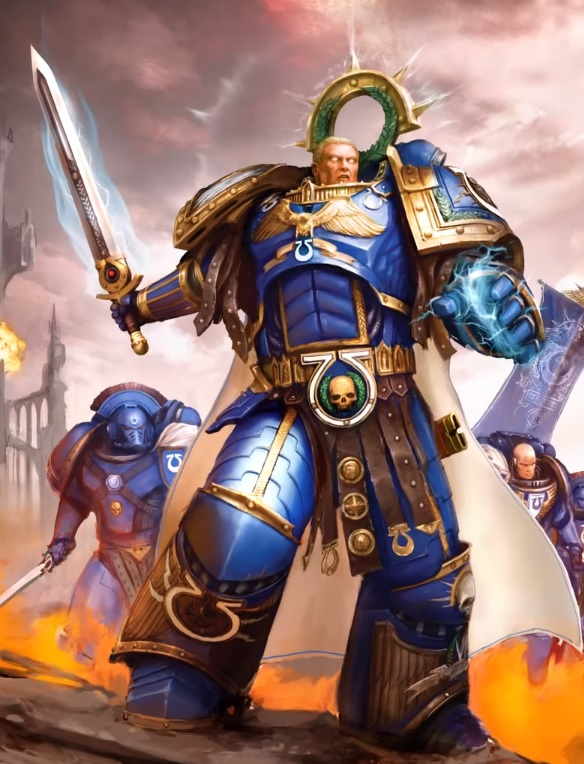
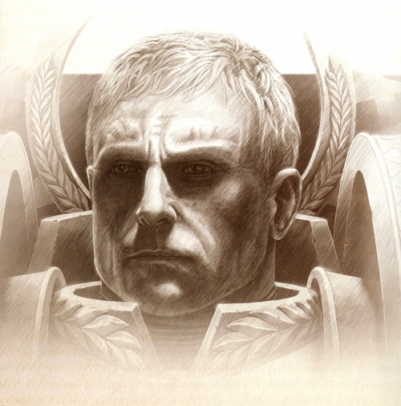
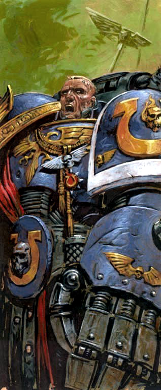
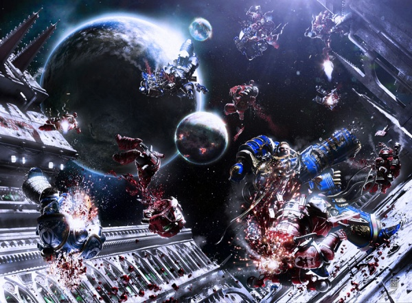
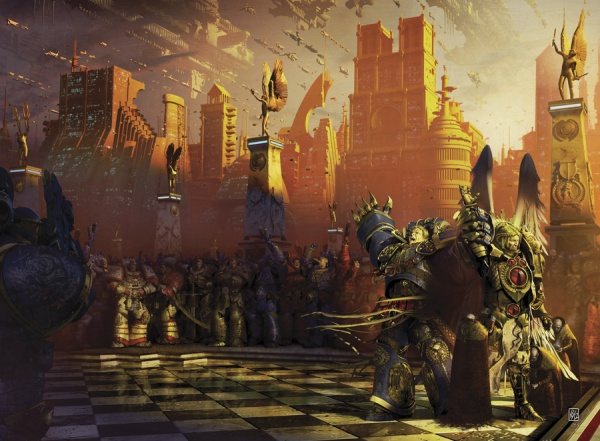
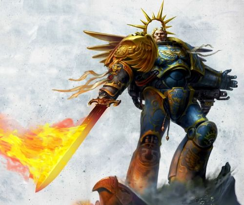
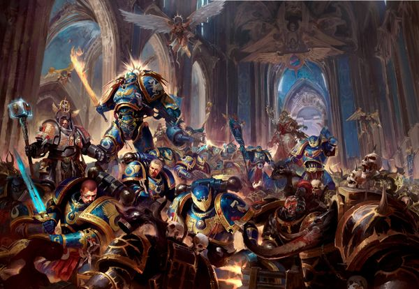

# 0683 罗保特·基里曼 Roboute Guilliman

精校状态：中文行文已逐段精校，部分术语仍为暂定

分类：人类帝国 / 极限战士

原文来源：https://www.bilibili.com/opus/1067206004810186758

原作者：帝国神选罐头

原文时间：2025年05月15日 21:44

[返回分类目录](目录.md) · [全书目录](../../目录.md)

原篇名：罗伯特·基里曼 Roboute Guilliman

<!-- A0683-B0001 -->
**英文原文**

Roboute Guilliman, also known as the Avenging Son, is the Primarch of the Ultramarines. An accomplished warlord and diplomat who ruled his own empire before rediscovery by the Emperor, Guilliman was unique among his brother Primarchs in that he saw himself as not only a warrior but also a builder of civilizations. In addition to his leadership of the largest Space Marine Legion during the Great Crusade, Guilliman became renowned for his efforts to preserve the Imperium in the aftermath of the devastating Horus Heresy, becoming Lord Commander of the Imperium. Among his most noteworthy achievements is the authoring of the Codex Astartes and the creation of the modern Imperial military structure.

<!-- /A0683-B0001 -->

<!-- A0683-B0002 -->

原译文

罗伯特·基里曼，也被称为复仇之子，是极限战士的原体。基里曼是一位有成就的军阀和外交官，在被帝皇重新发现之前统治着自己的帝国，他在他的兄弟原体中是独一无二的，因为他认为自己不仅是一名战士，也是文明的建设者。除了在大远征期间领导最大的星际战士军团外，基里曼还因在毁灭性的荷鲁斯叛乱事件后为保护帝国所做的努力而闻名，成为帝国的领主指挥官。他最值得注意的成就之一是撰写了阿斯塔泰斯圣典，并创建了现代帝国军事结构。

**校订译文**

罗保特·基里曼，又称复仇之子，是极限战士的原体。他是卓越的军事领袖与外交家，在帝皇寻回他之前，便已统治自己的国家。与兄弟们相比，基里曼独特之处在于，他不仅将自己视为战士，也视为文明的建设者。大远征中，他统率规模最大的星际战士军团；荷鲁斯之乱摧残帝国后，他又致力于维系帝国，成为帝国最高统帅。编撰《阿斯塔特圣典》、奠定现代帝国军事体制，是他最著名的成就。

<!-- /A0683-B0002 -->

<!-- A0683-B0003 图片 -->

<!-- A0683-B0004 -->

原译文

Roboute Guilliman during the Great Crusade 大远征期间的罗伯特·基里曼

**校订译文**

Roboute Guilliman during the Great Crusade 大远征期间的罗保特·基里曼

<!-- /A0683-B0004 -->

<!-- A0683-B0005 -->
**英文原文**

Shortly after the Thirteenth Black Crusade Roboute Guilliman was restored from his wounds, and now once again leads the Imperium as its Lord Commander and Imperial Regent, the living voice of the Emperor.

<!-- /A0683-B0005 -->

<!-- A0683-B0006 -->

原译文

第十三次黑色远征后不久，罗伯特·基里曼从重伤中恢复过来，现在再次领导帝国担任其领主指挥官和帝国摄政，帝皇之音。

**校订译文**

第十三次黑色远征后不久，罗保特·基里曼从致命创伤中康复，再度以帝国最高统帅与帝国摄政的身份领导帝国，成为帝皇在人间的代言者。

<!-- /A0683-B0006 -->

<!-- A0683-B0007 -->
## History 历史

<!-- /A0683-B0007 -->

<!-- A0683-B0008 -->
### Youth 早期

<!-- /A0683-B0008 -->

<!-- A0683-B0009 -->
**英文原文**

Like the other Primarchs, Roboute Guilliman was one of twenty genetically engineered "sons" of the Emperor of Mankind. Like his "brothers," Roboute was taken as an infant by the powers of Chaos, and removed to a far-flung world in an effort to prevent the coming Age of the Imperium. The infant Guilliman's capsule fell to earth on Macragge, where it was discovered by a group of noblemen hunting in the forest. Inside the capsule they found a child, surrounded by a glowing aura. He was taken back to Konor, one of the two Consuls who governed Macragge, who adopted the infant as his son and named him Roboute. Roboute's arrival on Macragge was a portentous time, and many reported strange sights. Most notably, Konor dreamed of the Emperor, and found himself beside Hera's Falls in the Valley of Laponis. Upon awakening, Konor assembled his bodyguard and rode to Hera's Falls, where they found the child. The name Konor gave the child, Roboute, means "Great One".Guilliman would also be raised by Konor's Seneschal, Tarasha Euten, a strong-willed and capable woman.

<!-- /A0683-B0009 -->

<!-- A0683-B0010 -->

原译文

与其他原体一样，罗伯特·基里曼是人类帝皇的二十个基因工程子嗣之一。像他的兄弟们一样，罗伯特在婴儿时期就被混沌的力量带走，并被带到一个遥远的世界，以防止即将到来的帝国时代。婴儿基里曼的太空舱在马库拉格坠落，在那里被一群在森林里狩猎的贵族发现。在太空舱内，他们发现了一个孩子，周围环绕着发光的光环。他被康诺带回了，康诺是统治马库拉格的两位领事之一，他收养了这个婴儿作为他的儿子，并给他起名叫罗伯特。罗伯特抵达马库拉格是一个不祥的时刻，许多人都报告了奇怪的景象。最值得注意的是，康诺梦见了帝皇，发现自己在拉波尼斯山谷的赫拉瀑布旁。醒来后，康诺召集护卫，骑马前往赫拉瀑布，在那里他们找到了孩子。康诺给孩子起的名字罗伯特的意思是“伟大之人”。基里曼也将由康诺的总管塔拉莎·尤顿抚养长大，她是一位意志坚强、能力出众的女性。

**校订译文**

罗保特·基里曼与其他原体一样，是人类帝皇通过基因工程创造的二十名“儿子”之一。混沌势力在他尚为婴儿时将其窃走，抛向遥远世界，试图阻止帝国时代到来。他的降生舱最终落在马库拉格。据一段记述，一群在林间狩猎的贵族发现了舱体，里面躺着被光辉环绕的婴儿。他们将孩子带给当地两位执政官之一的康诺；后者将他收为养子，命名罗保特，意为“伟大之人”。他的到来伴随着种种异兆，许多人声称看见了奇异景象。同段还记述，康诺曾梦见帝皇，以及拉波尼斯山谷中的赫拉瀑布；醒来后，他召集护卫骑马前往，在那里找到了孩子。此后，康诺的总管塔拉莎·尤顿也参与抚养基里曼。她是一位意志坚定、能力出众的女性。

**校注：** 同一英文段落先说狩猎贵族发现婴儿并送给康诺，后又说康诺循梦亲自发现孩子，发现者叙述有重叠差异。中文明确保留两层记述，不擅自拼出唯一经过。portentous 不必然是不祥，译异兆。

<!-- /A0683-B0010 -->

<!-- A0683-B0011 图片 -->

<!-- A0683-B0012 -->

原译文

Roboute Guilliman 罗伯特·基里曼

**校订译文**

Roboute Guilliman 罗保特·基里曼

<!-- /A0683-B0012 -->

<!-- A0683-B0013 -->
**英文原文**

Roboute was a prodigy, growing fast in both body and intellect. By age ten, he had mastered every subject the wisest men of Macragge could teach him, and his insights into matters of history, philosophy, and science often stunned his elders. However, his greatest talents were as a military leader. These talents led his father to give him command of an expeditionary force to Illyrium, a mountainous region in the far north of Macragge, whose wild inhabitants had terrorized the civilized regions for years and successfully resisted every previous military campaign. Not only did Roboute fight a brilliant campaign but he also earned the respect of the wildmen who never again threatened the more civilised parts of Macragge.

<!-- /A0683-B0013 -->

<!-- A0683-B0014 -->

原译文

罗伯特是一个天才，在身体和智力上都成长得很快。到十岁时，他已经掌握了马库拉格最聪明的人能教给他的每一门学科，他对历史、哲学和科学问题的见解经常让长辈们大吃一惊。然而，他最大的天赋是作为一名军事领袖。这些才能使他的父亲让他指挥一支远征部队前往马库拉格最北部的山区伊利里亚姆，那里的野人多年来一直恐吓文明地区，并成功地抵抗了之前的每一次军事行动。罗伯特不仅打了一场精彩的战役，还赢得了野人的尊重，他们再也没有威胁过马库拉格的文明地区。

**校订译文**

罗保特是个神童，身体与心智都成长极快。十岁时，他已掌握马库拉格最博学者能够教授的一切知识；在历史、哲学与科学上的见解，常让长者震惊。不过，他最出众的才能仍在军事。养父因此将一支远征军交给他，命其征讨马库拉格极北山区伊利里亚姆。当地部族多年来侵扰文明地区，挫败了此前所有讨伐。罗保特不但打了一场出色的战役，还赢得部族尊敬，使他们此后不再威胁马库拉格较发达的地区。

<!-- /A0683-B0014 -->

<!-- A0683-B0015 -->
**英文原文**

While the history books state Guilliman militarily subdued the Illyrians, the reality was more complicated. Rather than engage in a protracted mountain guerrilla war, he simply occupied the Illyrians sacred shrines. This caused the Illyrians to surge forth to meet his armies, but rather than crush them then and there he challenged their Chieftain to battle. During the duel, Guilliman only defended himself from his foes blows but never launched his own attacks. The Chieftain eventually exhausted himself, but rather than slay his enemy Guilliman instead presented him with the Illyrians most sacred religious artifact, which centuries before the Consuls of Macragge had stolen. Guilliman's act of diplomacy and humanity convinced the Illyrian Chieftain to halt his campaign, seeking to become a just lord like Guilliman instead. It was at this moment that Tarasha Euten realized Guilliman had proven himself a true King.

<!-- /A0683-B0015 -->

<!-- A0683-B0016 -->

原译文

虽然历史书上说基里曼在军事上征服了伊利里亚人，但现实情况更为复杂。他没有参与旷日持久的山地游击战争，而是占领了伊利里亚人的圣地。这导致伊利里亚人奋起迎击他的军队，但他当时并没有粉碎他们，而是挑战他们的酋长作战。在决斗中，基里曼只保护自己免受敌人的攻击，但从未发动过自己的攻击。酋长最终筋疲力尽，但基里曼没有杀死他的敌人，而是向他赠送了伊利里亚人最神圣的宗教文物，这是几个世纪前马库拉格领事偷走的。基里曼的外交和人道行为说服伊利里亚酋长停止了他的运动，转而寻求成为基里曼这样的公正领主。就在这一刻，塔拉莎·尤滕意识到基里曼已经证明了自己是一位真正的王者。

**校订译文**

史书记载，基里曼以武力征服了伊利里亚人，实情却更复杂。他没有陷入旷日持久的山地游击战，而是占领对方圣地，引得部族倾巢出战。随后，他不急于歼敌，而是向酋长提出单挑。整个交锋中，他只防守，从不反击，直到对手力竭。接着，他也没有杀死酋长，而是归还了数百年前被马库拉格执政官夺走的伊利里亚最神圣的宗教圣物。这样的外交与仁厚，使酋长愿意停止战争，并希望效法基里曼，成为公正的领主。就在这一刻，塔拉莎·尤顿意识到，基里曼已经证明自己是真正的君王。

<!-- /A0683-B0016 -->

<!-- A0683-B0017 -->
**英文原文**

On his return to the capital Roboute found the city in chaos, as his father's co-Consul, Gallan, had attempted a coup. Gallan led a faction of Macragge's nobility who were used to enjoying their wealth and position at the expense of armies of slaves, and resented Konor's legislation favoring the common people, among whom he was immensely popular. Approaching the city, Roboute and his soldiers saw the city in chaos, being sacked by mobs of Gallan's men, while the Consul House was under siege. Roboute left his men to restore order to the city, while he rushed to the Consul House and lifted the siege, only to find his father close to death, surrounded by his loyal bodyguards. He had been mortally wounded by an assassin in Gallan's employ, and with his dying breath, told Roboute who was responsible. Roboute swiftly crushed the rebellion and, amid a wave of popular relief, assumed the title of sole Consul of Macragge. He set about punishing the treachery and carrying out his father's vision. Gallan and his co-conspirators were executed, and their lands and wealth were redistributed to the people. With superhuman energy, Roboute reorganized Macragge's entire social structure, creating a meritocracy where office and honours were given to the hard-working, rather than the wealthy and influential. Under his leadership, Macragge prospered as it never had before.

<!-- /A0683-B0017 -->

<!-- A0683-B0018 -->

原译文

回到首都后，罗伯特·发现这座城市一片混乱，因为他父亲的联合领事加兰试图发动政变。加兰领导着马库拉格贵族的一个派系，他们习惯于以牺牲奴隶大军为代价来享受自己的财富和地位，并憎恨康诺有利于平民的立法，他在平民中非常受欢迎。接近城市时，罗伯特和他的士兵看到城市一片混乱，被加兰手下的暴徒洗劫，而领事馆则被围困。罗伯特离开他的部下恢复城市秩序，同时他冲向领事馆并解除了围困，却发现他的父亲濒临死亡，被他忠诚的护卫包围着。他被加兰雇佣的一名刺客刺杀了，临死前，他告诉罗伯特谁该对此负责。罗伯特迅速镇压了叛乱，并在一波民众的解围浪潮中，获得了马库拉格唯一领事的称号。他开始惩罚背叛者，并实现父亲的愿景。加兰和他的同谋被处决，他们的土地和财富被重新分配给人民。凭借超人的能量，罗伯特重组了马库拉格的整个社会结构，创造了一种精英政治，在这种政治中，职位和荣誉被授予勤奋的人，而不是富有和有影响力的人。在他的领导下，马库拉格实现了前所未有的繁荣。

**校订译文**

罗保特返回首都时，发现城中大乱。与康诺共同执政的加兰发动了政变。加兰代表一批依靠大批奴隶劳动享受财富与权势的贵族；他们怨恨康诺推行有利于平民的法律，也忌惮他在民间的威望。罗保特率军接近城门，看到加兰部下四处劫掠，执政官府邸正遭围攻。他命部下恢复城内秩序，自己赶去解围，却发现父亲已被加兰雇用的刺客重创，濒死地躺在忠诚护卫中间。康诺临终前说出幕后主使。罗保特迅速平定叛乱，在民众如释重负的拥护下，成为马库拉格唯一执政官。他处决加兰及同谋，将其土地和财富分给人民，并着手实现父亲的理想。凭借超人的精力，他重组整个社会，推行以勤勉和功绩授予职位与荣誉的制度，不再让财富与权势决定一切。马库拉格由此迎来前所未有的繁荣。

**校注：** Consul 在此是马库拉格执政官，不是外交领事；Consul House 为执政官府邸，非领事馆。Roboute left his men 指留下部下执行恢复秩序任务，不是弃军离开。

<!-- /A0683-B0018 -->

<!-- A0683-B0019 -->
### The Arrival of the Emperor 帝皇的到来

<!-- /A0683-B0019 -->

<!-- A0683-B0020 -->
**英文原文**

While Roboute was prosecuting his war against the Illyrian rebels, the Emperor of Mankind and his armies had reached the neighboring planet of Espandor. It was there that the Emperor heard stories of the extraordinary son of Consul Konor, and realized that he had found one of the lost Primarchs. However, due to an unexpected warp storm, his ship was thrown far off course and by the time it reached Macragge, Roboute had been ruling for almost five years. When the Emperor reached Macragge, he found a world that was self sufficient, prosperous, with a strong and well-equipped military, and engaging in trade with nearby systems. Impressed, the Emperor assigned command of the Ultramarines Space Marine Legion to Guilliman, and relocated the Legion's forward base to Macragge.

<!-- /A0683-B0020 -->

<!-- A0683-B0021 -->

原译文

当罗伯特正在对伊利里亚叛军进行战争时，人类帝皇和他的军队已经到达了邻近的埃斯潘多行星。正是在那里，帝皇听到了康诺领事非凡子嗣的故事，并意识到他找到了一位失踪的原体。然而，由于一场意外的亚空间风暴，他的船偏离了航线，当它到达马库拉格时，罗伯特已经统治了近五年。当帝皇到达马库拉格时，他发现了一个自给自足、繁荣的世界，拥有强大而装备精良的军队，并与附近的星系进行贸易。帝皇印象深刻，将极限战士星际战士军团的指挥权交给了基里曼，并将军团的前沿基地重新安置到了马库拉格。

**校订译文**

罗保特征讨伊利里亚叛军时，帝皇的军队已抵达邻近行星埃斯潘多。帝皇在那里听闻康诺执政官那位非凡养子的事迹，意识到自己找到了一名失散原体。然而，一场突发亚空间风暴使舰船严重偏航；等帝皇抵达马库拉格时，罗保特已经独自统治近五年。这里自给自足、繁荣兴盛，拥有强大且装备精良的军队，并与附近星系贸易往来。帝皇深感赞许，将极限战士军团交给基里曼统率，并将其前沿基地迁至马库拉格。

<!-- /A0683-B0021 -->

<!-- A0683-B0022 图片 -->

<!-- A0683-B0023 -->

原译文

Roboute Guilliman 罗伯特·基里曼

**校订译文**

Roboute Guilliman 罗保特·基里曼

<!-- /A0683-B0023 -->

<!-- A0683-B0024 -->
### The Great Crusade 大远征

<!-- /A0683-B0024 -->

<!-- A0683-B0025 -->
**英文原文**

With the exception of the Luna Wolves, no Legion conquered as many worlds, or conquered worlds as fast, or left conquered worlds in such good state during the Great Crusade, as the Ultramarines. Whenever Guilliman liberated a world, he would not move on until he had set up a self-sufficient defense system, and left advisors behind to create industry, set up trade routes with the rest of the Imperium, and form a government whose first concern would always be the well-being of the people.

<!-- /A0683-B0025 -->

<!-- A0683-B0026 -->

原译文

除了影月苍狼，没有任何一个军团在大远征期间像极限战那样征服了如此多的世界，或以如此快的速度征服了世界，或使被征服的世界保持如此良好的状态。每当基里曼解放一个世界时，他都不会继续前进，直到他建立了一个自给自足的防御系统，留下顾问来创建工业，与帝国其他地区建立贸易路线，并组建一个始终以人民福祉为首要考虑的政府。

**校订译文**

大远征期间，除影月苍狼外，没有军团能在征服世界的数量、速度及战后状况上与极限战士相比。基里曼每解放一颗世界，都要先建立能独立运转的防御体系，才会继续进军。他还会留下顾问，帮助当地发展工业、开辟连接帝国的商路，并建立始终以民众福祉为首要职责的政府。

<!-- /A0683-B0026 -->

<!-- A0683-B0027 -->
**英文原文**

At the same time, with the help of his new advisors, Guilliman created a supremely efficient military machine on Macragge and its surrounding worlds, that provided the Ultramarines with a steady flow of new recruits. This factor, combined with the minimal casualties suffered thanks to Guilliman's tactical skill, allowed the Ultramarines to become the largest of all the Space Marine Legions. When Horus was appointed Warmaster by the Emperor, the reaction among the other Primarchs was mixed. Some supported the appointment out of affection for Horus, some opposed it, and some were cynically accepting. However, Guilliman, Rogal Dorn, and Jaghatai Khan supported the appointment, believing in their cool, rational judgment, that Horus was really the most worthy of them. For this reason, and because of their military genius, Horus valued Guilliman and Dorn as his closest advisors.

<!-- /A0683-B0027 -->

<!-- A0683-B0028 -->

原译文

与此同时，在他的新顾问的帮助下，基里曼在马库拉格及其周围世界创建了一台极其高效的军事机器，为极限战士提供了源源不断的新兵。这一因素，再加上基里曼的战术技能所造成的最小伤亡，使极限战士成为所有星际战士中规模最大的。当荷鲁斯被帝皇任命为战帅时，其他原体的反应喜忧参半。一些人出于对荷鲁斯的喜爱而支持这一任命，一些人反对，还有一些人愤世嫉俗地接受了这一任命。然而，基里曼、罗格·多恩和察合台可汗支持这一任命，相信他们冷静、理性的判断，认为荷鲁斯真的是他们中最值得的人。出于这个原因，也因为他们的军事天赋，荷鲁斯将基里曼和多恩视为他最亲密的顾问。

**校订译文**

与此同时，在新顾问的帮助下，基里曼将马库拉格及周边世界组织成高效的军事体系，不断为极限战士输送新兵。他卓越的战术又将伤亡压到很低，使军团最终成为星际战士各军团中规模最大的一支。帝皇任命荷鲁斯为战帅时，诸原体反应不一：有人出于情谊支持，有人反对，也有人怀着冷嘲与怀疑接受。基里曼、多恩与察合台可汗则经过冷静理性的判断，认为荷鲁斯确实是最合适的人选。这份支持，以及两人的军事才干，使荷鲁斯格外重视基里曼与多恩，将其视为最亲近的顾问。

<!-- /A0683-B0028 -->

<!-- A0683-B0029 -->
**英文原文**

Privately, Guilliman held four of his brothers in the greatest esteem: Dorn, Sanguinius, Leman Russ, and Ferrus Manus. He referred to them as "The Dauntless Few", and pronounced that he could win any war, outright, if he had any one of those four and his Legion at the Ultramarines' side. Conversely, relations between Guilliman and Lorgar became miserable after the Emperor had the Ultramarines destroy Monarchia and be present during the shaming of the Word Bearers. While Guilliman carried out these orders to the letter and appeared to be firmly supportive of the Emperor in front of Lorgar, in truth he was uncomfortable with his actions and upset that the Emperor used his legion as a tool for humiliation that drove a wedge between the Ultramarines and Word Bearers.

<!-- /A0683-B0029 -->

<!-- A0683-B0030 -->

原译文

私下里，基里曼非常尊重他的四个兄弟：多恩、圣吉列斯、黎曼·鲁斯和费鲁斯·马努斯。他称他们为“少数无畏者”，并宣称，如果这四人中的任何一人和他的军团站在极限战士一边，他都可以彻底赢得任何战争。相反，在帝皇让极限战士摧毁完美之城并在羞辱怀言者期间在场后，基里曼和珞珈之间的关系变得很糟糕。虽然基里曼严格执行了这些命令，并在珞珈面前表现出对帝皇的坚定支持，但事实上，他对自己的行为感到不舒服，并对帝皇利用他的军团作为羞辱的工具感到不安，这在极限战士和怀言者之间造成了隔阂。

**校订译文**

私下里，基里曼最敬重多恩、圣吉列斯、黎曼·鲁斯与费鲁斯·马努斯，将他们称为“少数无畏者”。他曾宣称，只要其中任何一人率军团与极限战士并肩，自己便能彻底赢得任何战争。相比之下，他与珞珈的关系却在完美之城被毁后陷入冰点：帝皇命极限战士摧毁城市，并在怀言者受辱时列队见证。基里曼虽逐字执行命令，在珞珈面前坚定支持帝皇，内心却对自己的所为不安。他不满父亲将军团当成羞辱工具，使极限战士与怀言者之间出现无法忽视的裂痕。

<!-- /A0683-B0030 -->

<!-- A0683-B0031 -->
### The Horus Heresy 荷鲁斯之乱

原题：The Horus Heresy 荷鲁斯叛乱

<!-- /A0683-B0031 -->

<!-- A0683-B0032 -->
**英文原文**

At the outbreak of the Horus Heresy, Guilliman and the Ultramarines were tricked by Horus, who sent them to the Veridian system while Horus carried out his treasonous plot. When the treachery was revealed, the Ultramarines were poorly placed to react to it.

<!-- /A0683-B0032 -->

<!-- A0683-B0033 -->

原译文

在荷鲁斯叛乱爆发时，基里曼和极限战士被荷鲁斯欺骗，荷鲁斯将他们送到了维尔迪安星系，而荷鲁斯则实施了他的叛国阴谋。当背叛行为被揭露时，极限战士很难对其做出反应。

**校订译文**

荷鲁斯之乱爆发时，基里曼与极限战士已被战帅以诡计调往维里迪亚星系。荷鲁斯趁此实施叛乱计划，等真相暴露，极限战士所处的位置已使他们难以及时应对。

<!-- /A0683-B0033 -->

<!-- A0683-B0034 图片 -->

<!-- A0683-B0035 -->

原译文

Guilliman and his Ultramarines fight Word Bearers in space 基里曼和他的极限战士在太空中与怀言者作战

**校订译文**

Guilliman and his Ultramarines fight Word Bearers in space 基里曼和他的极限战士在太空中与怀言者作战

<!-- /A0683-B0035 -->

<!-- A0683-B0036 -->
**英文原文**

While the Ultramarines mustered their forces at Calth, in Ultramar, they were attacked by the Word Bearers and the Legion took heavy losses. However, the Word Bearers had overlooked two major points: the unbreakable fighting spirit of the Ultramarines, and the brilliance of Guilliman's command. An attempt by Lorgar to assassinate Guilliman with a Daemon who attacked the bridge of his flagship, forcing Guilliman to be sucked into space and fight several Word Bearers without a helmet. Guilliman was eventually able to reboard his ship, and promised to hunt down and kill Lorgar for the betrayal. At the climax of the battle Guilliman ripped out one of the two hearts of Kor Phaeron, the Word Bearers commander at Calth, after he had tried to tempt Guilliman to join the Forces of Chaos.

<!-- /A0683-B0036 -->

<!-- A0683-B0037 -->

原译文

当极限战士在奥特拉玛的考斯集结部队时，他们遭到了怀言者的袭击，军团遭受了重大损失。然而，怀言者忽略了两个要点：极限战士坚不可摧的战斗精神，以及基里曼指挥的才华。珞珈试图用一个袭击其旗舰舰桥的恶魔暗杀基里曼，迫使基里曼被吸入太空，并在没有头盔的情况下与几名怀言者作战。基里曼最终能够重新登上他的船，并承诺追捕并杀死背叛的珞珈。在战斗的高潮，在试图诱使基里曼加入混沌部队后，基里曼扯掉了考斯的怀言者指挥官科尔·法伦的两颗心脏中的一颗。

**校订译文**

极限战士在奥特拉玛的考斯集结时，突然遭怀言者袭击，损失惨重。然而，叛军低估了两件事：极限战士不屈的斗志，以及基里曼卓越的指挥才能。珞珈派一只恶魔袭击极限战士旗舰的舰桥，试图刺杀基里曼，导致原体被抛入太空，不戴头盔便与数名怀言者交战。他最终重新登舰，誓言追杀珞珈，报复背叛。战斗最激烈时，考斯怀言者指挥官科尔·法伦试图诱使他投向混沌，却被他挖出两颗心脏中的一颗。

**校注：** 最后一句试图诱降基里曼的是科尔·法伦，原译主语不清易误读为基里曼诱降自己。

<!-- /A0683-B0037 -->

<!-- A0683-B0038 -->
**英文原文**

Meanwhile Angron of the World Eaters and Lorgar of the Word Bearers had launched the Shadow Crusade on isolated worlds in Ultramar. Their plan was to destroy as much of Ultramar as they could while the Ultramarines were occupied on Calth. After the victory at Calth, Guilliman, presumably under the guidance of his newly reinstated Librarians, traveled to an isolated Warp jump point on the outer fringes of Ultramar. There he encountered Sanguinius of the Blood Angels who has just recently finished his war in the Signus cluster. The Navigators of the Blood Angels had been ordered to find the closest stable Warp zone, which many assumed would be Terra. Instead fate brought them to Ultramar. With the addition of the Blood Angels to his forces, Guilliman pronounced they could finally begin countering the Shadow Crusade. After Calth, Guilliman pursued Lorgar, who had since allied with Angron, to the world of Nuceria. There, the Ultramarines engaged both the World Eaters and Word Bearers while Guilliman himself battled Lorgar, finding the once-weaker Word Bearers Primarch to be surprisingly capable in combat. The situation for Guilliman got worse when Angron arrived, battering Guilliman with a furious assault and eventually defeating the Lord of Macragge. However as Angron was about to land the final blow, Ultramarines were able to arrive and safely retrieve their Primarch.

<!-- /A0683-B0038 -->

<!-- A0683-B0039 -->

原译文

与此同时，吞世者的安格隆和怀言者的珞珈在奥特拉玛的孤立世界发起了暗影原则。他们的计划是在极限战士占领考斯期间尽可能多地摧毁奥特拉玛。在考斯取得胜利后，基里曼大概是在他新恢复的智库的指导下，前往奥特拉玛外围的一个孤立的亚空间跳跃点。在那里，他遇到了圣血天使的圣吉列斯，他最近刚刚结束了在西格纳斯星群的战争。圣血天使的导航者奉命寻找最近的亚空间稳定区，许多人认为这将是泰拉。相反，命运把他们带到了奥特拉玛。随着圣血天使加入他的部队，基里曼宣布他们终于可以开始对抗暗影远征。在考斯之后，基里曼将后来与安格隆结盟的珞珈追捕到努凯里亚世界。在那里，极限战士与吞世者和怀言者交战，而基里曼本人则与珞珈作战，发现曾经较弱的怀言者原体在战斗中的能力令人惊讶。当安格隆到达时，基里曼的情况变得更糟，他猛烈地攻击基里曼，最终击败了马库拉格之主。然而，当安格隆即将发动最后一次攻击时，极限战士到达并安全地救回他们的原体。

**校订译文**

与此同时，安格隆与珞珈对奥特拉玛的孤立世界发动暗影远征，企图趁极限战士困战考斯，尽可能摧毁其领土。考斯获胜后，基里曼可能在重新获准履职的智库员指引下，前往奥特拉玛边缘一个偏僻的亚空间跳跃点，并在那里遇到刚结束西格纳斯战争的圣吉列斯。圣血天使导航员原本奉命寻找最近的稳定航行区域，许多人以为会抵达泰拉，命运却将他们引向奥特拉玛。得到圣血天使增援后，基里曼宣称终于可以反击暗影远征。本段随后记述，考斯之后，他追击已与安格隆结盟的珞珈，来到努凯里亚。极限战士对抗两支叛军时，基里曼亲自迎战珞珈，惊讶地发现昔日较弱的兄弟如今武艺大进。安格隆到来后，局势急转直下；猛烈的攻击最终击败马库拉格之主。幸而附近极限战士及时赶到，抢在致命一击落下前救走原体。

**校注：** 本段先写圣吉列斯会合并反击暗影远征，随后回述努凯里亚；与本篇下一段及668的会合顺序有差异。保留源文排列，以“本段随后记述”提示，不自拟统一时间线。occupied on Calth 为被战事牵制，不是占领考斯。

<!-- /A0683-B0039 -->

<!-- A0683-B0040 -->
**英文原文**

As a result of being cut off by the Ruinstorm created by the traitorous Word Bearers, Guilliman feared the Imperium lost and created a second empire, Imperium Secundus, as a contingency. Many loyalist brothers were brought to Macragge thanks to the activation of the xenos device known as the Pharos. Not wanting to appear vain and power-hungry like his brother Horus, Guilliman refused to declare himself Emperor of Imperium Secundus, instead initially trying to convince Lion El'Jonson to take the position despite being distrustful of the Dark Angels Primarch's motives. While organizing the creation of Imperium Secundus Guilliman survived an assassin attempt by an Alpha Legion squad disguised as Aeonid Thiel and other Ultramarines. Later when Konrad Curze was let loose upon Macragge, Guilliman and the Lion battled the Night Lords Primarch together but were led into a trap. Instead of being cornered, Curze detonated charges and brought the entire structure down upon their heads. Guilliman and the Lion survived thanks to Barabas Dantioch activating the Pharos, which teleported the duo to Sotha. The Lion and Guilliman then made their way back to Macragge, where the Blood Angels had now arrived. Guilliman decided to name the reluctant Sanguinius the Regent of Imperium Secundus.

<!-- /A0683-B0040 -->

<!-- A0683-B0041 -->

原译文

由于被叛徒怀言者制造的毁灭风暴切断了联系，基里曼担心帝国会失败，并创建了第二个帝国——第二帝国，作为应急。由于被称为法罗斯的异型装置的激活，许多忠诚的兄弟被带到了马库拉格。基里曼不想像他的兄弟荷鲁斯那样虚荣和渴望权力，他拒绝宣布自己为第二帝国帝皇，而是最初试图说服莱昂·艾尔庄森接受这一职位，尽管他不信任黑暗天使原体的动机。在基里曼组织创建第二帝国时，他躲过了伪装成伊奥尼德·希尔和其他极限战士的阿尔法军团小队的暗杀企图。后来，当康拉德·柯兹被释放到马库拉格时，基里曼和莱昂一起与午夜领主原体作战，但被引入了陷阱。科兹没有被逼入绝境，而是引爆了炸药，将整个建筑推倒在他们的头上。基里曼和莱昂幸存下来，这要归功于巴拉巴斯·丹提欧克激活了法罗斯，将二人传送到索萨。然后，莱昂和基里曼回到了圣血天使已经到达的马库拉格。基里曼决定将不情愿的圣吉列斯奉为第二帝国摄政王。

**校订译文**

怀言者制造的毁灭风暴切断了外界联系，基里曼担心帝国已沦陷，便建立第二帝国，作为延续人类统治的应急方案。异形装置法罗斯启动后，许多忠诚派同袍得以循光来到马库拉格。基里曼不愿像荷鲁斯般显得虚荣而贪恋权力，拒绝自称帝皇；起初，他试图说服莱昂·艾尔’庄森接任，尽管仍怀疑对方动机。筹建第二帝国期间，一支阿尔法军团小队假扮伊奥尼德·希尔等极限战士，企图刺杀他，但未成功。后来，康拉德·科兹潜入马库拉格，基里曼与莱昂联手追击，却落入陷阱。午夜幽魂并未束手就擒，而是引爆炸药，让整座建筑坍塌。巴拉巴斯·丹提欧克及时启动法罗斯，将两位原体传送到索萨，他们才幸免于难。返回马库拉格时，圣血天使已经抵达，基里曼于是决定让不情愿的圣吉列斯担任第二帝国的摄政者。

**校注：** 本处英文只用 Regent，译摄政者；与完整 Emperor Regent 摄政皇帝的表述层级区别保留。

<!-- /A0683-B0041 -->

<!-- A0683-B0042 图片 -->

<!-- A0683-B0043 -->

原译文

Guilliman and Sanguinius shortly after the formation of Imperium Secundus 第二帝国成立后不久，基里曼和圣吉列斯

**校订译文**

Guilliman and Sanguinius shortly after the formation of Imperium Secundus 第二帝国成立后不久，基里曼和圣吉列斯

<!-- /A0683-B0043 -->

<!-- A0683-B0044 -->
**英文原文**

However Guilliman frequently clashed with his distrustful and taciturn brother Lion El'Jonson over policy. Obsessed with hunting for Konrad Curze on Macragge, the Lion insisted that the Night Haunter was behind rebellions plaguing the world and demanded martial law be instituted. After a suicide bombing hit an Astartes convoy on Macragge, the Dark Angels were deployed by the Lion to establish martial law without Guilliman's express permission. Guilliman and the Lion again came to disagreement over the rebellion in the Illyrium region of Macragge, with the Dark Angels primarch wishing to use weapons of mass destruction to flush them out as he suspected Curze was hiding there. Ultimately the Lion led the attack into Illyrium, and Curze was captured. At Guilliman's insistence, he was given a public trial. During the trial, Curze accused the Lion of ordering secret orbital attacks against the rebellion which enraged the Dark Angels Primarch and nearly led to him slaying Curze in the court. Guilliman and Sanguinius dismissed the Lion from Imperium Secundus as response, but later the Lion reappeared and asked to be Curze's jailer instead.

<!-- /A0683-B0044 -->

<!-- A0683-B0045 -->

原译文

然而，基里曼经常与他不信任且沉默寡言的兄弟莱昂·艾尔庄森在政策问题上发生冲突。莱昂痴迷于在马库拉格追捕康拉德·科兹，坚持认为午夜猎手是困扰世界的叛乱的幕后黑手，并要求实施戒严令。在马库拉格的阿斯塔特车队遭遇自杀式炸弹袭击后，莱昂在未经基里曼明确许可的情况下部署了黑暗天使以建立戒严令。基里曼和莱昂再次就马库拉格的伊利里亚姆地区的叛乱产生分歧，黑暗天使原体希望使用大规模杀伤性武器将他们赶出去，因为他怀疑科兹藏在那里。最终，莱昂率领进攻进入伊利里亚，科兹被俘。在基里曼的坚持下，他接受了公开审判。在审判期间，科兹指责莱昂下令对叛徒秘密进行轨道攻击，这激怒了黑暗天使原体，几乎导致他在法庭上杀害了科兹。作为回应，基里曼和圣吉列斯将莱昂从第二帝国解职，但后来莱昂又出现了，并要求成为科兹的狱卒。

**校订译文**

基里曼却常与多疑而沉默寡言的莱昂在政策上冲突。雄狮执意追捕科兹，认定午夜幽魂正在幕后煽动马库拉格叛乱，要求实行戒严。一次自杀式袭击命中阿斯塔特车队后，他未经基里曼明确许可，便派黑暗天使实施军事管制。面对伊利里亚姆地区的叛乱，两人再起争执：莱昂怀疑科兹藏在那里，想用大规模杀伤性武器将其逼出。最终，他率军攻入该地区，俘获科兹。在基里曼坚持下，午夜幽魂接受公开审判，却在庭上揭发莱昂曾秘密实施轨道打击。雄狮暴怒，险些当庭杀死科兹，因此被基里曼与圣吉列斯逐出第二帝国。后来，他再次出现，要求改由自己看管科兹。

<!-- /A0683-B0045 -->

<!-- A0683-B0046 -->
**英文原文**

Following the Trial of Curze, Sanguinius, Lion El'Jonson, and Guilliman all agreed to try and breach the Ruinstorm to reach Terra and aid the Emperor who they now knew still lived. In the Ruinstorm, the loyalist fleet came across a variety of horrors and word of an entity spreading destruction known as the "Pilgrim". During the voyage through the Ruinstorm, Guilliman's fleet was ambushed by Traitor forces at Anuari, where the Avenging Son survived an assassination attempt by Word Bearers armed with Athame's. Believing he could study the weapons for understanding of the enemy and potentially using it against them, Guilliman kept the blades in his vault. During the Battle of Pyrrhan, Guilliman commanded the Ultramarines personnel as Sanguinius received a vision and he realized that he needed to go where this struggle had begun, Davin. Reluctantly, Guilliman and The Lion agreed to trust in Sanguinius but both had thought they would simply destroy the world upon arriving. While over Davin, Sanguinius shocked The Lion by boarding the Invincible Reason and taking the captive Konrad Curze with him. Sanguinius hoped to use Curze's prophetic abilities to determine what he was meant to do upon Davin. Sanguinius then commended a mass landing on the world, and the enraged Lion nearly ordered that Davin be subjected to Exterminatus regardless of Sanguinius' presence on it. After horrified Lion expressed to Guilliman that he believed something was trying to manipulate them to the path of damnation, the Ultramarine Primarch knew what he must do and crushed his captive Athame Blades with his Power Fist. He declared he would not be tempted the same way Horus had.

<!-- /A0683-B0046 -->

<!-- A0683-B0047 -->

原译文

在审判科兹之后，圣吉列斯、莱昂·艾尔庄森和基里曼都同意试图突破毁灭风暴，到达泰拉，帮助他们现在知道还活着的帝皇。在毁灭风暴中，忠诚者舰队遇到了各种恐怖事件，并听说了一个被称为“朝圣者”的实体正在传播破坏。在穿越毁灭风暴的航行中，基里曼的舰队在阿努里遭到叛徒部队的伏击，在那里，复仇之子躲过了携带仪式之刃的怀言者的暗杀企图。基里曼相信他可以研究武器来了解敌人，并有可能用它来对付他们，于是他把刀刃放在了自己的密库里。在皮尔汉战役中，基里曼指挥着极限战士，圣吉列斯看到了一个幻象，他意识到自己需要去这场战斗开始的地方，戴文。基里曼和莱昂不情愿地同意信任圣吉列斯，但他们都认为自己一到就会毁灭世界。在戴文上空，圣吉列斯登上无敌理性号并带走了俘虏康拉德·科兹，震惊了莱昂。圣吉列斯希望利用科兹的预言能力来确定他打算对戴文做什么。圣吉列斯随后指挥了在世界上的大规模登陆，愤怒的莱昂几乎命令戴文接受灭绝令，无论圣吉列斯是否在场。在惊恐的莱昂向基里曼表示他相信有什么东西试图操纵他们走向诅咒之路后，极限战士原体知道他必须做什么，并用他的动力拳粉碎了他俘获的仪式之刃。他宣称他不会像荷鲁斯那样受到诱惑。

**校订译文**

科兹受审后，圣吉列斯、莱昂与基里曼决定突破毁灭风暴，赶赴泰拉，援助已知仍活着的帝皇。舰队在风暴中遭遇种种恐怖，也听说名为“朝圣者”的存在正在散播毁灭。基里曼舰队在阿努里遭叛军伏击时，他逃过了持仪式之刃的怀言者刺杀。他想研究这些武器，以了解敌人，甚至反过来利用，便将缴获的刀刃藏入密库。派尔罕之战中，基里曼指挥极限战士作战，圣吉列斯则得到幻象，意识到自己必须前往浩劫开始的戴文。基里曼与莱昂虽不情愿，仍同意相信天使，但两人原本都打算一到便毁灭星球。抵达轨道后，圣吉列斯登上无敌理性号，带走囚禁的科兹，试图借助其预知能力找到自己该走的路。接着，他下令大举登陆，令暴怒的莱昂险些不顾天使仍在地表，便要执行灭绝令。惊惧的雄狮告诉基里曼，某种力量正试图操纵他们走向堕落。基里曼于是明白自己必须做什么，用动力拳碾碎藏下的仪式之刃，宣称绝不重蹈荷鲁斯受诱惑的覆辙。

<!-- /A0683-B0047 -->

<!-- A0683-B0048 -->
**英文原文**

At Davin, Sanguinius was trapped within a portal and did battle with the Daemon Madail while Guilliman and The Lion desperately tried to reach him. a vicious battle erupted both on Davin and above it, in which Guilliman's acting flagship Samothrace was destroyed in orbit by the Daemonship Veritas Ferrum. During the battle at Davin's temple, Guilliman and The Lion managed to finally fight as brothers and together they brought down a massive Soul Grinder. Eventually, Sanguinius was able to escape and the Space Marine forces evacuated to space. Davin was destroyed by Cyclonic Torpedoes, and with its anchor gone the Daemonic fleet vanished. In the place of where Davin once was, a breach in the Ruinstorm was visible. The path led to Terra, but upon further study it became apparent that somehow Horus had foreseen this route and a large blockade was erected to block them. Guilliman and The Lion agreed to distract the blockade while Sanguinius and the Blood Angels made directly for Terra, for that was their destiny.

<!-- /A0683-B0048 -->

<!-- A0683-B0049 -->

原译文

在戴文，圣吉列斯被困在一个传送门内，与恶魔玛戴尔作战，而基里曼和莱昂拼命试图接近他。戴文及其上空爆发了一场激烈的战斗，基里曼的代理旗舰萨莫色雷斯号在轨道上被恶魔战舰钢铁真理号摧毁。在戴文神殿的战斗中，基里曼和莱昂最终以兄弟的身份作战，他们一起摧毁了一个巨大的灵魂研磨者。最终，圣吉列斯得以逃脱，星际战士撤离到太空。戴文被旋风鱼雷摧毁，随着锚的消失，恶魔舰队也消失了。在戴文曾经所在的地方，可以看到毁灭风暴的缺口。这条路通往泰拉，但经过进一步研究，很明显荷鲁斯已经预见到了这条路，并竖起了一道巨大的封锁线来封锁他们。基里曼和莱昂同意分散封锁，而圣吉列斯和圣血天使则直接前往泰拉，因为这是他们的命运。

**校订译文**

戴文上，圣吉列斯被困传送门内，与恶魔马代尔交战，基里曼与莱昂则拼命突破阻拦，赶去救援。地表与轨道同时爆发恶战，临时旗舰萨莫色雷斯号被恶魔战舰钢铁真理号摧毁。神殿内，两位原体终于如真正的兄弟般并肩作战，合力击倒一头巨大的磨魂者。天使最终脱身，星际战士撤回太空，随后以旋风鱼雷摧毁戴文。失去维系显现的锚点，恶魔舰队也随之消散。星球原先的位置露出毁灭风暴中的缺口，航路直通泰拉，却已被荷鲁斯预先部署的大军封锁。基里曼与莱昂同意牵制敌军，让圣吉列斯与圣血天使直赴泰拉，迎向其命运。

<!-- /A0683-B0049 -->

<!-- A0683-B0050 -->
**英文原文**

After the death of the Ruinstorm, Guilliman gathered whatever forces he could and made haste for Terra. In his path lay a large defensive chain of hundreds of worlds manned by the Iron Warriors. In a series of bitter engagements, both sides took heavy losses but the Ultramarines were able to maintain a steady advance.

<!-- /A0683-B0050 -->

<!-- A0683-B0051 -->

原译文

毁灭风暴终结后，基里曼召集了他所能召集的一切力量，迅速前往泰拉。在他的道路上，有一条由钢铁勇士组成的数百个世界的大型防御链。在一系列激烈的交战中，双方都遭受了重大损失，但极限战士能够保持稳定的前进。

**校订译文**

毁灭风暴消散后，基里曼尽力集结一切可用兵力，赶赴泰拉。他面前却横亘着钢铁勇士驻守、跨越数百个世界的庞大防御链。连番苦战令双方损失惨重，但极限战士仍保持着稳定推进。

<!-- /A0683-B0051 -->

<!-- A0683-B0052 -->
**英文原文**

Ultimately, Guilliman was able to set course for Holy Terra. Travelling at maximum speed, his reinforcement fleet of over 3,200 capital ships was scant hours away as The Emperor battled Horus aboard the Vengeful Spirit. However without the Astronomican to light the way, Guilliman's force was marooned just out of Terra's reach as at conventional speed it would take tens of thousands of years for them to eventually find the Throneworld. This situation reversed when, thanks to the effort of Euphrati Keeler and her faithful, the Astronomican was reactivated and Guilliman arrived at Terra to drive back the traitors in the wake of Horus' defeat.

<!-- /A0683-B0052 -->

<!-- A0683-B0053 -->

原译文

最终，吉利曼能够设定神圣泰拉的方向。当帝皇跳帮复仇之魂号与荷鲁斯作战时，他的3200多艘主力舰组成的增援舰队以最快的速度行驶，距离不到几个小时。然而，如果没有星炬的指引，基里曼的部队就被困在了泰拉的触手可及之处，因为按照常规速度，他们最终需要数万年才能找到王座世界。由于幼发拉底·琪乐和她的信徒的努力，这种情况发生了逆转，星炬被重新激活，基里曼在荷鲁斯战败后抵达泰拉，击退了叛徒。

**校订译文**

基里曼最终驶向神圣泰拉。帝皇在复仇之魂号与荷鲁斯交锋时，这支拥有三千二百余艘主力舰、全速赶来的援军，距离目的地原本只剩数小时航程。然而，星炬熄灭使他们失去指引，困在距泰拉看似咫尺之遥的地方；若仅以常规航速摸索，则需数万年才能找到王座世界。尤弗拉蒂·琪乐与信徒们终于重燃星炬，改变了局面。基里曼得以在荷鲁斯败亡后抵达泰拉，驱退残余叛军。

**校注：** 数小时航程以仍能导航为条件；失去星炬后需常规航行数万年的两种前提保留，非数值笔误。

<!-- /A0683-B0053 -->

<!-- A0683-B0054 -->
### Post-Heresy 叛乱后

<!-- /A0683-B0054 -->

<!-- A0683-B0055 -->
**英文原文**

In the aftermath of the Great Betrayal, the Emperor had been incapacitated, and the Space Marines' numbers had been decimated by defections to Chaos and battle losses. The Ultramarines were left as the largest loyal legion, and Guilliman assumed the title of Lord Commander of the Imperium. For years thereafter, Guilliman deployed and led the Ultramarines throughout the galaxy, reclaiming worlds lost to Chaos and preventing the loss of still others to rebellion or invasion from outside the Imperium. At the same time, Guilliman reorganized the Space Marine Legions as Chapters and composed the Codex Astartes, the tome that the Ultramarines (and many other chapters) follow strictly.

<!-- /A0683-B0055 -->

<!-- A0683-B0056 -->

原译文

在大背叛之后，帝皇丧失了能力，星际战士的人数因叛逃到混沌和战斗损失而大量减少。极限战士成为最大的忠诚军团，基里曼获得了领主指挥官的头衔。此后的几年里，基里曼在整个银河系部署并领导了极限战士，夺回了因混沌而失去的世界，并防止了其他世界因帝国以外的叛乱或入侵而失去。与此同时，基里曼将星际战士重组为战团，并编写了阿斯塔特圣典，这部巨著是极限战士（和许多其他战团）严格遵循的。

**校订译文**

大背叛之后，帝皇已无法亲自执政，星际战士又因叛变与战争伤亡锐减。极限战士成为规模最大的忠诚军团，基里曼也出任帝国最高统帅。此后数年，他率军征战银河，收复被混沌夺走的世界，防止其他世界因内乱或外敌入侵而失陷。同时，他将星际战士军团拆分为战团，编撰《阿斯塔特圣典》，成为极限战士及许多其他战团严格遵循的准则。

<!-- /A0683-B0056 -->

<!-- A0683-B0057 -->
**英文原文**

Guilliman led the assault against the Alpha Legion on Eskrador in the aftermath of the Heresy, and due to the vanity of Alpharius, he utilised a surprise attack at the heart of the traitors and killed Alpharius in a duel. However, he and the Ultramarines were greatly mistaken in their belief that the snake would die without the head, as indeed, the Alpha Legion's symbol is a hydra, a multi-headed serpent. The Ultramarines were soundly pushed back time and again by the traitor marines, undaunted at the loss of their Primarch. Guilliman eventually pulled his forces back into orbit and bombarded the planet from above.

<!-- /A0683-B0057 -->

<!-- A0683-B0058 -->

原译文

叛乱之后，基里曼领导了对埃斯克拉多的阿尔法军团的进攻，由于阿尔法瑞斯的虚荣心，他对叛徒的核心发动了突然袭击，并在决斗中杀死了阿尔法瑞斯。然而，他和极限战士在他们认为蛇没有头就会死的信念上大错特错了，事实上，阿尔法军团的象征是九头蛇，一种多头蛇。极限战士一次又一次地被叛徒星际战士击退，他们对失去原体毫不畏惧。基里曼最终将他的部队拉回轨道，从上面轰炸了这颗行星。

**校订译文**

据本段记载，叛乱结束后，基里曼率军在埃斯卡多进攻阿尔法军团，利用阿尔法瑞斯的自负，奇袭叛军核心，并在决斗中杀死对方。然而，极限战士以为斩首即可让敌军崩溃，却大错特错：阿尔法军团的象征毕竟是多头的九头蛇。叛军没有因原体之死失去斗志，反而一次次击退极限战士。最终，基里曼撤军至轨道，从太空轰炸星球。

**校注：** 基里曼杀死阿尔法瑞斯为本段采纳的记载，与全书其他篇关于阿尔法双生原体及埃斯卡多资料真伪的讨论不强行合并。

<!-- /A0683-B0058 -->

<!-- A0683-B0059 -->
**英文原文**

Sometime before the Battle of Thessala Guilliman tasked the Tech-Priest Belisarius Cawl with two deeds: the resurrection of Guilliman should he fall and the creation of a next generation of Space Marines.

<!-- /A0683-B0059 -->

<!-- A0683-B0060 -->

原译文

在色萨拉之战之前的某个时候，技术神甫贝利撒留·考尔承担了两项任务：如果基里曼倒下，他将复活，并创建下一代星际战士。

**校订译文**

色萨拉之战前，基里曼曾交给技术祭司贝利萨留斯·考尔两项任务：若自己倒下，要设法使自己重生；同时，创造下一代星际战士。

<!-- /A0683-B0060 -->

<!-- A0683-B0061 -->
**英文原文**

Later, in the Battle of Thessala against the Emperor's Children, Guilliman would be grievously wounded. Where Alpharius had not greatly embraced the Chaos powers, and was essentially unchanged from his original Primarch form, Fulgrim had been to the Eye of Terror, reaping the terrible powers therein, and had been elevated by Slaanesh to a mighty and fell Daemon Prince, no longer resembling a man, but his original purity of form corrupted and augmented by the ruinous powers. Fulgrim was now a serpentine creature of immense stature, and multi-limbed. Each limb carried a poisoned sword, and in the clash he stabbed Guilliman in the neck; Guilliman was interred in the Stasis field by the Apothecaries, and remains frozen in the instant of death, while Fulgrim escaped back to the Eye of Terror.

<!-- /A0683-B0061 -->

<!-- A0683-B0062 -->

原译文

后来，在色萨拉之战中，基里曼受了重伤。在阿尔法瑞斯没有极大地接受混沌力量的地方，与他最初的原体形式基本没有变化，福格瑞姆已经到了恐惧之眼，收获了其中的可怕力量，并被色孽升格为一位强大而堕落的恶魔王子，不再像一个人，但他最初的纯洁形式被毁灭性的力量腐蚀和增强。福格瑞姆现在是一个身材高大、四肢灵活的蛇形生物。每条肢体都带着一把毒剑，在冲突中，他刺伤了基里曼的脖子；基里曼被药剂师安置在静滞力场里，在死亡的瞬间仍然被冻结，而福格瑞姆则逃回了恐惧之眼。

**校订译文**

后来，基里曼在色萨拉迎战帝皇之子时遭受重创。与尚未大量借助混沌、形貌仍接近原初原体的阿尔法瑞斯不同，福格瑞姆已在恐惧之眼获得可怕力量，被色孽升格为强大的恶魔王子。邪神的力量扭曲并强化了他，他不再具有人形，而是庞大、多臂的蛇形怪物，每只手都持有毒剑。交锋中，他刺伤基里曼的颈部。药剂师将原体置入静滞场，使他停留在濒死的瞬间；福格瑞姆则逃回恐惧之眼。

**校注：** where 此处引出对比而非地点；multi-limbed 指多肢，不是四肢灵活。

<!-- /A0683-B0062 -->

<!-- A0683-B0063 -->
**英文原文**

For the next ten thousand years Guilliman's mortal body remained in stasis, on the Shrine of Guilliman deep within the Temple of Correction, one of the holiest places in the entire Imperium. Some pilgrims claimed that the Primarch's wounds were slowly recovering, a feat credited to the power of the Emperor. Others deny the phenomenon, and point out the sheer impossibility of change within the stasis field. Yet enough believed the stories to come and witness for themselves the miracle of the Primarch.

<!-- /A0683-B0063 -->

<!-- A0683-B0064 -->

原译文

在接下来的一万年里，基里曼的遗体一直处于停滞状态，在整个帝国最神圣的地方之一——肃正神殿深处的基里曼神殿里。一些朝圣者声称，原体的伤口正在慢慢恢复，这一壮举归功于帝皇的力量。其他人则否认这一现象，并指出停滞立场内根本不可能发生变化。然而，有足够多的人相信这些故事，会来亲眼见证这位原体的奇迹。

**校订译文**

此后一万年，基里曼的肉身始终处于静滞，安放在肃正神殿深处的圣所——帝国最神圣的地点之一。一些朝圣者声称，他的伤口正缓慢愈合，并将此归功于帝皇的力量。另一些人则否认，指出静滞场内不可能发生任何变化。尽管如此，仍有无数人相信传闻，前来亲眼见证原体的奇迹。

**校注：** mortal body 为肉身，不是确定已死亡的遗体；静滞场内愈合属于有争议的朝圣者传言。

<!-- /A0683-B0064 -->

<!-- A0683-B0065 -->
### Return 回归

<!-- /A0683-B0065 -->

<!-- A0683-B0066 -->
### Awakening 苏醒

<!-- /A0683-B0066 -->

<!-- A0683-B0067 -->
**英文原文**

Shortly after Abaddon the Despoiler's Thirteenth Black Crusade and the destruction of Cadia, the Tech-Priest Belisarius Cawl and Saint Celestine led a group of Imperial survivors into the Webway with the aid of their new Eldar allies. The group arrived at Macragge, where Cawl revealed that he had in fact lived for the last ten thousand years and was ordered by Guilliman himself to complete two tasks in the event of his downfall. One of these was to revive Guilliman, a feat that Cawl could now accomplish thanks to Eldar aid. Using a suit of Power Armour that regenerated the wounds inflicted by Fulgrim, Guilliman was restored just as Black Legion forces invaded Macragge. Reborn, Guilliman swiftly drove off the Chaos invaders before taking in the truths of the Imperium after his ten thousand year absence. Guilliman displayed several "miracles" after his rebirth, his mere presence was able to cure any afflicted with a Nurgle-created blindness-inducing illness.

<!-- /A0683-B0067 -->

<!-- A0683-B0068 -->

原译文

在掠夺者阿巴顿的第十三次黑色远征和卡迪亚被摧毁后不久，技术神甫贝利萨留·考尔和圣塞勒斯汀在他们新的灵族盟友的帮助下，带领一群帝国幸存者进入网道。该小队抵达马库拉格，考尔透露，他实际上已经存活了一万年，基里曼本人命令他在他倒下时完成两项任务。其中之一是复活基里曼，由于灵族的援助，考尔现在可以完成这一壮举。基里曼使用了一套能够再生福格瑞姆造成的伤口的动力盔甲，在黑色军团入侵马库拉格时得到了恢复。重生后，基里曼迅速赶走了混沌入侵者，在离开一万年后接受了帝国的真相。基里曼在重生后表现出了几个“奇迹”，他的存在能够治愈任何患有纳垢制造的致盲疾病的人。

**校订译文**

掠夺者阿巴顿发动第十三次黑色远征、卡迪亚毁灭后不久，技术祭司贝利萨留斯·考尔与圣塞莱斯汀在新结盟的灵族帮助下，带领一批帝国幸存者穿过网道，抵达马库拉格。考尔透露，自己已经活了一万年，曾奉基里曼之命，在原体倒下后履行两项使命，其中之一便是使他重生。如今，借助灵族援手，考尔终于能够实现这一目标。他以一套能修复福格瑞姆造成伤势的动力甲救回基里曼，此时黑色军团正大举入侵马库拉格。苏醒后的原体迅速击退混沌军队，继而面对自己缺席一万年后的帝国现实。他重生后还显现出一些“奇迹”：仅仅身在现场，就能治愈纳垢制造的一种致盲疾病。

<!-- /A0683-B0068 -->

<!-- A0683-B0069 图片 -->

<!-- A0683-B0070 -->

原译文

The reborn Roboute Guilliman 复活的罗伯特·基里曼

**校订译文**

The reborn Roboute Guilliman 重生的罗保特·基里曼

<!-- /A0683-B0070 -->

<!-- A0683-B0071 -->
**英文原文**

Disgusted by the decay, superstition, and ignorance that surrounds the modern Imperium, Guilliman convened a war council of his Ultramarines as to what to do next. After several days he declared his intent to travel to Terra and see his father upon the Golden Throne. However Guilliman's revival had attracted the gaze of the Gods of Chaos and Daemon Primarch's, throwing the Warp into an uproar. The journey to Terra, known as the Terran Crusade, became an arduous affair that saw his fleet trapped in the Maelstrom after an ambush by Magnus and his Thousand Sons. Inside the Maelstrom the Imperial expedition was defeated by Kairos Fateweaver and the Red Corsairs, with the Primarch himself trapped in crystal chains made from his own doubts. Held by Kairos inside a Blackstone Fortress, the Imperial expedition seemed doomed. However thanks to the efforts of the Harlequin Sylandri Veilwalker and the Fallen Angel Cypher Guilliman and the rest of the surviving expedition were freed and escaped towards a Webway Portal. Guilliman held the portal long enough for his men to escape, defeating the Bloodthirster Skarbrand after witnessing the sacrifice of Marshal Amalrich.

<!-- /A0683-B0071 -->

<!-- A0683-B0072 -->

原译文

基里曼对现代帝国周围的腐朽、迷信和无知感到厌恶，他召集了一个由他的极限战士成员组成的战争议会，讨论下一步该怎么办。几天后，他宣布打算前往泰拉，看望他在黄金王座上的父亲。然而，基里曼的复活吸引了混沌诸神和恶魔原体的目光，使亚空间陷入骚动。前往泰拉的航程，被称为泰拉远征，成为一项艰巨的任务，他的舰队在马格努斯和他的千子伏击后被困在大漩涡中。在大漩涡中，帝国远征队被织命者卡洛斯和红海盗击败，原体本人被自己的疑惑困在水晶锁链中。帝国远征队被卡洛斯控制在黑石要塞内，似乎注定要失败。然而，由于丑角西兰德里·帷幕行者，堕天使塞弗和基里曼的努力，幸存的远征队和其他人被释放并逃往网道门户。基里曼守住大门的时间足够长，他的部下得以逃脱，在目睹了元帅阿马里奇的牺牲后，击败了嗜血狂魔斯卡布兰德。

**校订译文**

基里曼对当代帝国的腐朽、迷信与无知深感厌恶，召集极限战士召开战争议会，商讨下一步行动。数日后，他宣布将前往泰拉，觐见黄金王座上的父亲。然而，他的复苏也引来了混沌诸神与恶魔原体的注视，令亚空间动荡不安。这场被称为泰拉远征的旅程艰险重重：他的舰队遭到马格努斯及千子伏击，受困于大漩涡；随后，远征军又被凯洛斯·织命者与红海盗击败，基里曼本人也被由自身疑虑凝成的水晶锁链束缚。凯洛斯将远征军囚禁在一座黑石要塞内，他们似乎已无生路。幸而，丑角西兰德里·帷幕行者与堕天使塞弗出手相救，基里曼及其他幸存者得以脱困，奔向一座网道入口。基里曼坚守入口，为部下争取撤离时间；在目睹阿马尔里奇元帅牺牲后，他击败了嗜血狂魔斯卡布兰德。

<!-- /A0683-B0072 -->

<!-- A0683-B0073 -->
**英文原文**

The Imperial expedition eventually arrived through another portal on Luna, but this time were followed by Magnus and his Thousand Sons. On the surface of Luna, Magnus and Guilliman dueled as battle raged around them. Guilliman was overcome by Magnus' psychic abilities until the arrival of reinforcements from Terra that included Sisters of Silence. With Magnus' psychic abilities weakened, Guilliman was able to impale his daemonic brother and force him back into the Webway as the gate was sealed.

<!-- /A0683-B0073 -->

<!-- A0683-B0074 -->

原译文

帝国远征队最终通过月球上的另一个门户抵达，但这次是马格努斯和他的千子。在月球表面，马格努斯和吉利曼决斗，战斗在他们周围肆虐。基里曼被马格努斯的灵能能力所征服，直到来自泰拉的增援部队到来，其中包括寂静修女。随着马格努斯的灵能能力减弱，基里曼能够刺穿他的恶魔兄弟，并在大门被封锁时迫使他回到网道。

**校订译文**

帝国远征军最终穿过另一座网道门户，抵达月球；马格努斯与千子却紧追而至。月面上战火四起，马格努斯与基里曼展开决斗。基里曼一度被马格努斯的灵能力量压制，直到包括寂静修女在内的泰拉援军赶到。马格努斯的灵能遭到削弱后，基里曼终于刺穿这位恶魔兄弟，将他逼回网道，随即封闭了入口。

<!-- /A0683-B0074 -->

<!-- A0683-B0075 图片 -->

<!-- A0683-B0076 -->

原译文

Roboute Guilliman returns to lead the Imperial defenders on Ultramar 罗伯特·基里曼回归奥特拉玛领导帝国守军

**校订译文**

Roboute Guilliman returns to lead the Imperial defenders on Ultramar 罗保特·基里曼重返奥特拉玛，领导帝国守军

<!-- /A0683-B0076 -->

<!-- A0683-B0077 -->
### Regent 摄政

<!-- /A0683-B0077 -->

<!-- A0683-B0078 -->
**英文原文**

Afterwards Guilliman landed on Terra and gained access to the Emperor's Throneroom inside the Imperial Palace. Guilliman stood before the Golden Throne alongside Captain-General Trajann Valoris and the Emperor awoke for the first time in millennia. In a surreal experience which Guilliman can not fully remember, the now nearly inhuman Emperor told him that he was the last hope to save Mankind and brutally assaulted his mind with dark truths of the galaxy and its history. What exactly transpired is unclear. According to Valoris Guilliman spoke in silent psychic conversation with the Emperor for several minutes while Guilliman remembers falling to the ground in agony. Moreover only minutes seemed to pass for the two, but when they emerged it had been over a day.

<!-- /A0683-B0078 -->

<!-- A0683-B0079 -->

原译文

之后，基里曼登陆泰拉，进入了皇宫内的帝皇王座厅。基里曼与元帅图拉真·瓦洛里斯并肩站在黄金王座前，帝皇数千年来首次醒来。在一次基里曼记不清的超现实经历中，这位现在几乎无人性的帝皇告诉他，他是拯救人类的最后希望，并用银河系及其历史的黑暗真相残酷地攻击了他的思想。具体发生了什么尚不清楚。根据瓦洛里斯和基里曼的说法，基里曼与帝皇进行了几分钟的无声灵能对话，而基里曼记得自己痛苦地摔倒在地。此外，两人似乎只过了几分钟，但当他们出现时，已经过了一天多。

**校订译文**

随后，基里曼抵达泰拉，获准进入帝国皇宫内的王座厅。他与禁军元帅图拉真·瓦洛瑞斯一同站在黄金王座前，帝皇数千年来首次苏醒。基里曼无法完整回忆这场恍若梦境的会面：几乎已失去人类情感的帝皇告诉他，他是拯救人类的最后希望，又以银河及其历史的黑暗真相猛烈冲击他的心智。具体发生了什么，至今仍不清楚。瓦洛瑞斯记得，基里曼与帝皇进行了数分钟无声的灵能交流；基里曼记得的却是自己痛苦地倒在地上。两人都觉得只过了几分钟，但离开王座厅时，外界已过去一天有余。

**校注：** 分别保留瓦洛瑞斯的观察与基里曼的记忆，不将二者合并为一致证词；帝皇苏醒及会面内容均属此篇源文叙述。

<!-- /A0683-B0079 -->

<!-- A0683-B0080 -->
**英文原文**

Regardless of the truth, Guilliman emerged with a new determination. He gathered the High Lords of Terra and declared that the Imperium would be reorganized and rearmed under his leadership in order to confront the coming threat of Chaos. With that, Guilliman declared himself Lord Commander of the Imperium once more. He later declared himself Imperial Regent, the living hand of the Emperor. One of his first major acts as Lord Commander was to defend Terra itself against the forces of Khorne in the Second Battle of Terra.

<!-- /A0683-B0080 -->

<!-- A0683-B0081 -->

原译文

不管真相如何，基里曼带着新的决心出现了。他召集了泰拉的高领主，宣布帝国将在他的领导下进行重组和重新武装，以应对即将到来的混沌威胁。说完，基里曼再次宣布自己为领主指挥官。他后来宣布自己为摄政，是帝皇的得力助手。他作为领主指挥官的第一个主要行动之一是在第二次泰拉之战中保卫泰拉免受恐虐部队的攻击。

**校订译文**

无论会面真相如何，基里曼都带着新的决心走出了王座厅。他召集泰拉高领主，宣布帝国将在他的领导下重整体制、重新武装，以应对迫近的混沌威胁。他再度宣布自己出任帝国最高统帅，后来又自任帝国摄政，作为帝皇在人间的执行者。他就任最高统帅后的首批重大行动之一，便是在第二次泰拉之战中抵御恐虐大军，保卫泰拉。

<!-- /A0683-B0081 -->

<!-- A0683-B0082 -->
**英文原文**

Guilliman subsequently declared the Indomitus Crusade to reclaim the devastated worlds isolated from Terra by the Great Rift. The campaign was waged for the next century, as Guilliman acted as supreme commander and chief administrator of the Imperium. He simultaneously oversaw vast campaigns spearheaded by Belisarius Cawl's new Primaris Space Marines and sweeping civic reforms which culminated in the Codex Imperialis. As the Indomitus Crusade wound down, he rushed back to Ultramar to protect his sons from the Onslaught of Nurgle. During the Plague Wars, Guilliman survived an assassination attempt by Mortarion, Typhus and Ku'Gath on Parmenio. Guilliman was nearly cornered in the trap but was saved by the efforts of a mysterious young girl that seemed to be a powerful Living Saint.

<!-- /A0683-B0082 -->

<!-- A0683-B0083 -->

原译文

基里曼随后宣布发动不屈远征，以夺回因大裂隙而与泰拉隔绝的被摧毁的世界。这场战役持续了一个世纪，基里曼担任帝国的最高指挥官和首席行政官。他同时监督了由贝利撒留·考尔的新星际战士领导的大规模运动，以及以帝国圣典为高潮的全面公民改革。随着不屈远征的结束，他赶回奥特拉玛，保护他的子嗣免受纳垢的猛攻。在瘟疫战争期间，基里曼在莫塔里安、泰丰斯和库’噶斯在帕梅尼奥的暗杀企图中幸存下来。基里曼差点被困在陷阱里，但被一个神秘的年轻女孩救了出来，这个女孩似乎是一个强大的活圣人。

**校订译文**

随后，基里曼宣布发动不屈远征，收复那些饱受蹂躏、又因大裂隙而与泰拉隔绝的世界。远征持续了一个世纪，其间他兼任帝国最高统帅与行政首脑。他一面统筹由贝利萨留斯·考尔新造的原铸星际战士担任先锋的大规模战役，一面推行广泛的民政改革，最终将成果编入《帝国圣典》。不屈远征接近尾声时，他赶回奥特拉玛，保护子嗣免受纳垢大军的猛攻。瘟疫战争期间，莫塔里安、泰弗斯与库噶斯在帕尔梅尼奥设下刺杀陷阱。基里曼几乎被逼入绝境，却被一名神秘少女救下；她似乎是一位力量强大的活圣人。

**校注：** 本段采用不屈远征持续一个世纪、随后结束的原文时间线；不同版本编年存在差异，此处忠实保留，不以其他版本覆盖。原译漏去 Primaris，补为原铸星际战士；campaign 为军事战役，并非社会运动。

<!-- /A0683-B0083 -->

<!-- A0683-B0084 -->
**英文原文**

The Plague Wars came to their dramatic conclusion on Iax. Guilliman learned of the plot being enacted there by Mortarion and Ku'gath through interviewing a captured Daemonhost, much to the objection of his Tetrarch Decimus Felix. his Eldar liaison Illiyanne Natasé, and the Grey Knights. Despite knowing he was walking into a trap, Guilliman decided to nonetheless confront Mortarion on Iax. On the blighted world, the two came to blows. Guilliman was able to hold his own for a time, but was eventually defeated by the Daemon Primarch's Warp-enhanced might and resilience. With Guilliman disabled, Mortarion administered the deadly phage known as the Godblight which was capable of even killing a Primarch. Guilliman remained defiant as he succumb to the disease, refusing Mortarion's goading to give into Nurgle in order to have the pain end. Seemingly dead for a time, as his spirit hung in balance Guilliman experienced a surreal vision of his reunion with the Emperor upon his return. The vision makes it clear that not even Guilliman truly knows what transpired in the Throneroom that day save that the Emperor awoke for the first time in millennia. In reality, the Emperor's psychic might flowed through Guilliman and the Primarch was able to spring back to life, causing a shocked Mortarion to flee before the power of his father. Channeling the Emperor directly, Guilliman raised his Father's sword and unleashed a psychic attack that burned the Garden of Nurgle itself. The mightly blow was enough to damage a portion of the Garden and wound Nurgle personally. With that, the Primarch fell into unconsciousness.

<!-- /A0683-B0084 -->

<!-- A0683-B0085 -->

原译文

瘟疫战争在艾克斯戏剧性地结束了。基里曼通过审讯一名被俘的恶魔宿主，得知莫塔里安和库·噶斯正在那里实施阴谋，这引起了他的英杰德西穆斯·菲利克斯，他的灵族联络人伊利安妮·纳塔塞和灰骑士的强烈反对。尽管知道自己陷入了陷阱，基里曼还是决定在艾克斯上与莫塔里安对抗。在这个破败的世界上，两人发生了冲突。基里曼能够坚持一段时间，但最终被恶魔原体的亚空间增强的力量和韧性击败。在基里曼残废的情况下，莫塔里安使用了一种名为神瘟的致命噬菌体，这种噬菌体甚至能够杀死一名原体。基里曼在屈服于这种疾病时仍然保持反抗，拒绝了莫塔里安为了结束痛苦而向纳垢屈服的怂恿。基里曼似乎死了一段时间，因为他的精神处于平衡状态，他回来后与帝皇团聚的超现实景象。这一愿景清楚地表明，即使是基里曼也不知道那天在王座厅发生了什么，除了帝皇数千年来第一次醒来。事实上，帝皇的灵能力量流经基里曼，原体得以复活，导致震惊的莫塔里安在父亲的力量面前逃跑。帝皇直接降灵，基里曼举起父亲的剑，发动了一次灵能攻击，烧毁了纳垢花园。这一击足以损坏花园的一部分，并伤及纳垢本体。随后，原体陷入了昏迷。

**校订译文**

瘟疫战争最终在艾克斯迎来剧烈转折。基里曼审讯了一名被俘的恶魔宿主，由此得知莫塔里安与库噶斯在当地实施的阴谋；四方领主德西穆斯·菲利克斯、灵族联络人伊利亚恩·纳塔塞及灰骑士都强烈反对这场审讯。尽管明知前路是陷阱，基里曼仍决定前往艾克斯迎战莫塔里安。两人在这颗瘟疫肆虐的星球上交锋。基里曼起初尚能支撑，最终却败于恶魔原体经亚空间强化的力量与惊人韧性。趁他失去战斗能力，莫塔里安向他施用了足以杀死原体的致命疫病“神瘟”。基里曼虽逐渐不支，仍拒绝莫塔里安的诱惑，不肯为终止痛苦而向纳垢屈服。他一度看似死去，灵魂悬于生死之间，并在恍惚中重历复苏后觐见帝皇的场景。这段异象表明，除了帝皇数千年来首次苏醒之外，连基里曼本人也不清楚当日在王座厅究竟发生了什么。现实中，帝皇的灵能力量流经他的身体，令他重新站起；震惊的莫塔里安在父亲的力量面前逃走。基里曼直接承载着帝皇的力量，举起父亲的剑，发动灵能攻击，将烈焰送入纳垢花园。这一击焚毁了花园的一部分，甚至伤及纳垢本体。随后，原体陷入昏迷。

**校注：** 原译将 disabled 译作残废、spirit hung in balance 译作精神平衡，均误。改为失去战斗能力及灵魂悬于生死之间；花园受损范围为一部分，非全园毁灭。

<!-- /A0683-B0085 -->

<!-- A0683-B0086 -->
**英文原文**

Guilliman reappeared on Iax, where he explained the victory to Colquan. He later met with the recovered Militant-Apostolic Mathieu to thank him for his part in the victory on Iax, and the Priest informed the Primarch that the Emperor was preparing to return. Mathieu died shortly after, with Guilliman assuring the dead priest, that Mathieu's tale of heroism would be told to his sucessor and, should the new Militant-Apostolic, choose to do so, would not dissuade them from making Mathieu a Saint. Now questioning his former atheism, Guilliman began to probe Cawl Inferior for the meaning of the Emperor's return and Godhood. After the victory on Iax he also expressed his intent to leave the Imperium Sanctus and journey into Imperium Nihilus to shore up its defenses.

<!-- /A0683-B0086 -->

<!-- A0683-B0087 -->

原译文

基里曼再次出现在艾克斯上，在那里他向护民官解释了胜利。后来，他会见了康复的战争使徒马蒂厄，感谢他在艾克斯胜利的部分，牧师通知原体，帝皇正准备返回。不久之后，马蒂厄去世了，基里曼向死去的牧师保证，马蒂厄的英雄壮举会告诉他的继任者，如果新的战争使徒选择这样做，也不会阻止他们让马蒂厄成为圣人。现在，基里曼开始质疑他以前的无神论，并开始探究次级考尔对帝皇回归和神性的意义。在艾克斯取得胜利后，他还表示打算离开帝国圣殿，前往帝国暗面加强防御。

**校订译文**

基里曼重新现身艾克斯，向柯肯说明了这场胜利的经过。后来，他会见苏醒恢复的战争使徒马蒂厄，感谢他为艾克斯之战作出的贡献。马蒂厄告诉原体，帝皇正准备归来。不久后，这位神甫去世。基里曼对死者承诺，会将他的英勇事迹告诉继任者；如果新任战争使徒决定将马蒂厄封为圣人，他也不会阻止。基里曼开始怀疑自己过去的无神论立场，并向次级考尔追问帝皇回归及其神性究竟意味着什么。他还表示，准备离开帝国圣疆，前往帝国暗面巩固那里的防御。

<!-- /A0683-B0087 -->

<!-- A0683-B0088 -->
## Description 描述

<!-- /A0683-B0088 -->

<!-- A0683-B0089 -->
**英文原文**

An extract from Ultima Operational Record 1136.271.v (the official chronicle of the Battle of Calth) describes the Ultramarines' Primarch thus:

<!-- /A0683-B0089 -->

<!-- A0683-B0090 -->

原译文

《极限作战记录1136.271.v》（考斯之战的官方编年史）的摘录如下描述了极限战士的原体：

**校订译文**

《极限作战记录1136.271.v》——考斯之战的官方编年史——如此描写极限战士的原体：

<!-- /A0683-B0090 -->

<!-- A0683-B0091 -->
**英文原文**

He is handsome, in a plain way. He is handsome the way a regent on an old coin is handsome, like a good sword is handsome. He is not handsome like a ritual weapon, the way Fulgrim is. He is not angelic, like Sanguinius...

<!-- /A0683-B0091 -->

<!-- A0683-B0092 -->

原译文

他相貌英俊，平淡无奇。他很英俊，就像一枚旧硬币上的摄政一样英俊，就像一把好剑一样英俊。他不像福格瑞姆那样英俊，不像仪仗武器。他不像圣吉列斯那样如天使般...

**校订译文**

他的英俊质朴而端正，如同旧钱币上的摄政君王，也如同一柄好剑。他不像福格瑞姆，美得如同仪式兵器；也不像圣吉列斯，俊美如天使……

<!-- /A0683-B0092 -->

<!-- A0683-B0093 -->
**英文原文**

There is a dutiful line to his jaw, like his good brother Dorn. They share a nobility. There is the great strength of Ferrus and the vitality of Mortarion. There is, sometimes, the rogue glint of the Khan in his eyes, or the solemnity of the Lion. In the architecture of his nose and brow there is, many claim, the energy and triumph of Horus Lupercal. There is none of the bitterness that shadows Corax, or the persecuted despair that haunts poor Konrad. There is never any of the deliberate mystery that obscures Alpharius or Magnus and he is more open than that buried soul Vulkan... He never displays the pitch of fury found in Angron, nor do his eyes ever ignite with the psychotic gleam of Russ...

<!-- /A0683-B0093 -->

<!-- A0683-B0094 -->

原译文

他的下巴上有一条尽职尽责的线条，就像他的好兄弟多恩一样。他们有着共同的高贵。有费鲁斯的强大力量和莫塔里安的活力。有时，可汗眼中闪烁着流氓般的光芒，或者莱昂的庄严。许多人认为，在他的鼻子和额头的结构中，有着荷鲁斯·卢佩卡尔的能量和胜利。没有阴影笼罩着科拉克斯的苦涩，也没有困扰着可怜的康拉德的受迫害的绝望。阿尔法瑞斯或马格努斯从来没有被任何刻意的神秘所掩盖，他比那个被埋葬的灵魂沃坎更开放...他从来没有表现出在安格隆身上发现的愤怒，他的眼睛也从来没有被鲁斯的灵能光芒点燃....

**校订译文**

他的下颌线条透着恪尽职守的坚毅，恰如好兄弟多恩；两人拥有同样的高贵气质。他兼具费鲁斯的强大力量与莫塔里安的旺盛活力。偶尔，他眼中会闪过可汗般不羁的光芒，或显出莱昂的肃穆。许多人声称，他的鼻梁与眉宇间也有荷鲁斯·卢佩卡尔的蓬勃锐气与胜利神采。然而，他没有笼罩科拉克斯的苦涩，也没有纠缠着可怜康拉德的受迫害感与绝望。他从不以阿尔法瑞斯或马格努斯那般刻意的神秘掩藏自己，也比深藏心事的沃坎坦率……他从不流露安格隆那般极端的狂怒，眼中也不会燃起鲁斯那种近乎癫狂的光芒……

**校注：** 代词均描述基里曼；buried soul 是内心深藏，非尸身埋葬；psychotic 是癫狂，并非 psychic（灵能）。

<!-- /A0683-B0094 -->

<!-- A0683-B0095 -->
**英文原文**

He is a high achiever. He knows this about himself. Sometimes it feels like a fault that he has to excuse to his brothers, but then he feels guilty for making excuses... He writes a great deal. He codifies everything. Information is power. Technical theory is victory... He uses a stylus by choice, recording in his own handwriting.

<!-- /A0683-B0095 -->

<!-- A0683-B0096 -->

原译文

他是个高成就者。他知道这件事。有时候，他不得不向兄弟们道歉，这感觉像是一种错误，但后来他为找借口而感到内疚...他写了很多东西。他把一切都编纂成法典。信息就是力量。技术理论就是胜利...他选择使用手写笔，用自己的笔迹记录。

**校订译文**

他成就斐然，也清楚自己的本领。有时，他觉得这仿佛是一种过错，需要向兄弟们解释；可一旦作出解释，又会为这种自我辩解感到内疚……他著述颇丰，习惯将一切整理成系统的准则。信息就是力量，技术与理论就是胜利……他偏爱用书写笔，亲手记下自己的文字。

<!-- /A0683-B0096 -->

<!-- A0683-B0097 -->
**英文原文**

He has been writing notes on T'Vanti war practices for seventeen minutes, but he has still noted and marked fifteen hundred data bulletins and updates that have tracked across the secondary screens to his left. He sees and reconciles everything. Information is victory.

<!-- /A0683-B0097 -->

<!-- A0683-B0098 -->

原译文

他已经写了17分钟关于特万蒂战争实践的记录，但他仍然记录并标记了1500个数据简报和更新，这些简报和更新在他左边的二级屏幕上进行了跟踪。他看到并调和了一切。信息就是胜利。

**校订译文**

他已连续十七分钟撰写有关特万蒂作战方式的笔记，同时仍注意并标记了左侧辅助屏幕上滚过的一千五百条数据简报与更新。他将一切尽收眼底，逐一整合。信息就是胜利。

<!-- /A0683-B0098 -->

<!-- A0683-B0099 -->
## Wargear 战备

<!-- /A0683-B0099 -->

<!-- A0683-B0100 -->
**英文原文**

It is known that at the height of his power during the Horus Heresy, Guilliman was armed with the Hand of Dominion — a mighty power gauntlet that with Guilliman's strength could fell a Titan, the Gladius Incandor — a blade of exceptional craftsmanship and a symbol of his Legion and also - with an Arbitrator, a customised combi-bolter. For protection, Guilliman wore a suit of Power Armour known as the Armour of Reason.

<!-- /A0683-B0100 -->

<!-- A0683-B0101 -->

原译文

众所周知，在荷鲁斯叛乱时期，基里曼的权力达到顶峰时，他穿戴统御之手 — 这是一个强大的动力臂铠，凭借基里曼之力，可以击倒泰坦，赤诚短剑 — 一把工艺精湛的剑，是他的军团的象征，还有一个仲裁者，一个定制的复合爆矢枪。为了保护自己，基里曼穿了一套被称为理性之甲的动力盔甲。

**校订译文**

据记载，荷鲁斯之乱期间处于巅峰状态的基里曼装备着“统御之手”：这副强大的动力臂铠配合他的力量，足以击倒一台泰坦。他还携带工艺精湛、象征军团的“赤诚短剑”，以及名为“仲裁者”的定制组合爆矢枪。他身穿的动力甲则称为“理性之甲”。

**校注：** Arbitrator 为具名武器，沿用仲裁者；不能套用司法人员“仲裁官”的同形词条。

<!-- /A0683-B0101 -->

<!-- A0683-B0102 -->
**英文原文**

Upon his resurrection at the end of the 41st Millennium Guilliman continued to use the Hand of Dominion but took up the Emperor's Sword as his primary weapon. In addition, he now wears the Armour of Fate, the very device that allowed him to heal the injuries sustained by Fulgrim ten thousand years earlier.

<!-- /A0683-B0102 -->

<!-- A0683-B0103 -->

原译文

在第41个千年结束时复活后，基里曼继续使用统御之手，但将帝皇之剑作为他的主要武器。此外，他现在穿着着命运之甲，正是这种装置使他能够治愈一万年前受于福格瑞姆的伤害。

**校订译文**

第41个千年末复苏后，基里曼继续使用统御之手，并以帝皇之剑作为主要武器。他还穿上了命运之甲；正是这件装置，使他得以治愈一万年前被福格瑞姆留下的创伤。

**校注：** 英文 sustained by Fulgrim 施受表达不严谨，依本篇伤势来历译为被福格瑞姆所伤；原英文保留。

<!-- /A0683-B0103 -->

<!-- A0683-B0104 -->
## Quotes 名言

<!-- /A0683-B0104 -->

<!-- A0683-B0105 -->
**英文原文**

In any battle, great or small, the most insignificant of terrain and the most worthless of ground can for minutes, or perhaps hours, become so valuable that the blood of heroes and the wealth of an army's supply does not outweigh it. The true general knows when such a price is worth spending, and when the butcher's bill is sheer folly to pay.

<!-- /A0683-B0105 -->

<!-- A0683-B0106 -->

原译文

在任何战斗中，无论大小，最微不足道的地形和最毫无价值的土地都可能在几分钟甚至几小时内变得如此宝贵，以至于英雄的鲜血和军队的补给财富都无法超过它。真正的将军知道什么时候值得花这样的代价，什么时候支付屠夫的账单是愚蠢的。

**校订译文**

无论战斗规模大小，最不起眼的地形、最不值一提的土地，都可能在短短数分钟或数小时内变得无比重要，甚至值得付出英雄的鲜血与一军的物资。真正的将领懂得，何时值得付出这样的代价，又何时让士兵白白送命只是愚行。

<!-- /A0683-B0106 -->

<!-- A0683-B0107 -->
**英文原文**

from the book On War

<!-- /A0683-B0107 -->

<!-- A0683-B0108 -->

原译文

- 选自战争之书

**校订译文**

——选自《战争之书》（On War）。

<!-- /A0683-B0108 -->

<!-- A0683-B0109 -->
**英文原文**

Are we not Space Marines? Is this not the very task we were created for?

<!-- /A0683-B0109 -->

<!-- A0683-B0110 -->

原译文

我们不是星际战士吗？这难道不是我们被创造出来的任务吗？

**校订译文**

我们不是星际战士吗？这难道不是我们被创造出来的任务吗？

<!-- /A0683-B0110 -->

<!-- A0683-B0111 -->
**英文原文**

-Roboute Guilliman prior to the teleportation assault on the Zetsun Verid Yard

<!-- /A0683-B0111 -->

<!-- A0683-B0112 -->

原译文

-罗伯特·基里曼在对泽松·维里德区域进行传送攻击之前

**校订译文**

——罗保特·基里曼，在对泽松·维里德场区发动传送突袭之前。

<!-- /A0683-B0112 -->

<!-- A0683-B0113 -->
**英文原文**

To conduct battle on two fronts is an act of either desperation or utter foolishness. In such an arena it is neither skill nor firepower that brings victory, but the ability to manipulate that of your enemy.

<!-- /A0683-B0113 -->

<!-- A0683-B0114 -->

原译文

在两条战线上作战要么是绝望，要么是完全愚蠢的行为。在这样一个竞技场上，带来胜利的不是技能或火力，而是操纵敌人的能力。

**校订译文**

两线作战，要么出于绝境中的无奈，要么出于彻头彻尾的愚蠢。在这种战局中，决定胜负的并非自身的战技或火力，而是能否调动并利用敌人的战技与火力。

<!-- /A0683-B0114 -->

<!-- A0683-B0115 -->
**英文原文**

Codicil 19:23, The Writings of Roboute Guilliman

<!-- /A0683-B0115 -->

<!-- A0683-B0116 -->

原译文

附录19:23，罗伯特·基里曼的著作

**校订译文**

——《罗保特·基里曼著作集》，附录19:23。

<!-- /A0683-B0116 -->

<!-- A0683-B0117 -->
**英文原文**

To admit defeat is to blaspheme against the Emperor.

<!-- /A0683-B0117 -->

<!-- A0683-B0118 -->

原译文

承认失败就是对帝皇的亵渎。

**校订译文**

承认失败就是对帝皇的亵渎。

<!-- /A0683-B0118 -->

<!-- A0683-B0119 -->
**英文原文**

The warrior who acts out of honour cannot fail. His duty is honour itself. Even his death - if it is honourable - is a reward and can be no failure, for it has come through duty. Seek honour as you act, therefore, and you will know no fear.

<!-- /A0683-B0119 -->

<!-- A0683-B0120 -->

原译文

出于荣誉而行动的战士不会失败。他的职责就是荣誉本身。即使他的死——如果是光荣的话——也是一种奖励，不可能是失败，因为这是出于责任。因此，当你行动时寻求荣誉，你就不会恐惧。

**校订译文**

为荣誉而战的勇士不会失败，因为他的职责就是荣誉本身。即使死亡，只要死得光荣，也是奖赏而非失败，因为他是为尽责而死。因此，行事当以荣誉为先，你便无所畏惧。

<!-- /A0683-B0120 -->

<!-- A0683-B0121 -->
**英文原文**

Whatever the Emperor's will is, be sure it will find you out.

<!-- /A0683-B0121 -->

<!-- A0683-B0122 -->

原译文

无论帝皇的意愿是什么，它一定会找到你。

**校订译文**

无论帝皇的意愿是什么，它一定会找到你。

<!-- /A0683-B0122 -->

<!-- A0683-B0123 -->
**英文原文**

-attributed

<!-- /A0683-B0123 -->

<!-- A0683-B0124 -->

原译文

-归因于

**校订译文**

——传为基里曼所言。

<!-- /A0683-B0124 -->

<!-- A0683-B0125 -->
**英文原文**

Let them bestride the galaxy like the gods of old, sheltering Mankind from destruction at the hands of an uncaring universe.

<!-- /A0683-B0125 -->

<!-- A0683-B0126 -->

原译文

让他们像古代的神一样横跨银河系，保护人类免受冷漠宇宙的毁灭。

**校订译文**

让他们像古代的神一样横跨银河系，保护人类免受冷漠宇宙的毁灭。

<!-- /A0683-B0126 -->

<!-- A0683-B0127 -->
**英文原文**

- from the teachings of Guilliman, as laid down in the Apocrypha of Skaros, on the Space Marines

<!-- /A0683-B0127 -->

<!-- A0683-B0128 -->

原译文

- 摘自斯卡罗斯经书中基里曼关于星际战士的教导

**校订译文**

——《斯卡罗斯次经》所载基里曼关于星际战士的教诲。

<!-- /A0683-B0128 -->

<!-- A0683-B0129 -->
**英文原文**

It is the great irony of the Legiones Astartes: engineered to kill to achieve a victory of peace that they can then be no part of.

<!-- /A0683-B0129 -->

<!-- A0683-B0130 -->

原译文

这是阿斯塔特军团的最大讽刺：他们被设计来杀戮，以实现他们无法参与的和平胜利。

**校订译文**

阿斯塔特军团最大的讽刺正在于此：他们为杀戮而造，靠战争赢得和平，却无法分享自己换来的和平。

<!-- /A0683-B0130 -->

<!-- A0683-B0131 -->
**英文原文**

- shortly before the Battle of Calth

<!-- /A0683-B0131 -->

<!-- A0683-B0132 -->

原译文

- 考斯之战前不久

**校订译文**

- 考斯之战前不久

<!-- /A0683-B0132 -->

<!-- A0683-B0133 -->
**英文原文**

Space Marines excel at warfare because they were designed to excel at everything. Each of you will become a leader, a ruler, the master of your world and, because there is no more fighting to be done, you will bend your transhuman talents to governance and culture.

<!-- /A0683-B0133 -->

<!-- A0683-B0134 -->

原译文

星际战士擅长战争，因为他们被设计成擅长一切。你们每个人都将成为领导者、统治者、世界之主，因为没有更多的战斗要做，你们将把你们的超人才能用于治理和文化。

**校订译文**

星际战士之所以擅长战争，是因为他们本就被塑造成样样出众的人。你们每个人都将成为领袖、统治者与自己世界的主人。待战事尽息，你们便会将超越凡人的才能用于治理与文化建设。

<!-- /A0683-B0134 -->

<!-- A0683-B0135 -->
**英文原文**

- shortly before the Battle of Calth

<!-- /A0683-B0135 -->

<!-- A0683-B0136 -->

原译文

- 考斯之战前不久

**校订译文**

- 考斯之战前不久

<!-- /A0683-B0136 -->

<!-- A0683-B0137 -->
**英文原文**

'''Never wish for danger. Danger needs no help. There is no such thing as fate that can be tempted, but morale is never improved by an active lust for war.

<!-- /A0683-B0137 -->

<!-- A0683-B0138 -->

原译文

“决不希望危险。危险不需要帮助。没有命运可以诱惑，但积极的战争欲望永远不会提高士气。

**校订译文**

“永远不要渴求危险。危险不需要你去招引。世上并没有什么可以挑衅的命运，而主动渴求战争也绝不会提振士气。”

<!-- /A0683-B0138 -->

<!-- A0683-B0139 -->
**英文原文**

- Remark 56.xxi

<!-- /A0683-B0139 -->

<!-- A0683-B0140 -->

原译文

- 备注56.xxi

**校订译文**

——评注56.xxi。

<!-- /A0683-B0140 -->

<!-- A0683-B0141 -->
**英文原文**

Two things to note there, Sergeant. One is that there is no such thing as a minor detail. Information is victory. One cannot and should not dismiss any data until one is in a position to evaluate its significance, and that only comes with hindsight. So all detail is important until circumstances render it redundant.

<!-- /A0683-B0141 -->

<!-- A0683-B0142 -->

原译文

有两件事要注意，军士。一个是没有小细节。信息就是胜利。在能够评估数据的重要性之前，人们不能也不应该忽视任何数据，而这只有事后才能做到。因此，在情况变得多余之前，所有细节都很重要。

**校订译文**

军士，有两点需要注意。第一，世上没有无足轻重的细节。信息就是胜利。在能够判断资料的重要性之前，任何信息都不能、也不应被忽略；而这种判断只能在事后作出。因此，在局势证明某项细节无关紧要之前，所有细节都很重要。

**校注：** 源文称有两点，摘录只给第一点；保留摘录范围，不擅补第二点。

<!-- /A0683-B0142 -->

<!-- A0683-B0143 -->
**英文原文**

My brother, hear me. Warriors of the XVII Legion, hear me. This violence is against the code of the Legiones Astartes and against the will of our father, the Emperor. In the name of the Five Hundred Worlds of Ultramar, I implore you to cease fire and stand down. Open communication with me. Let us speak. Let us settle this. This action is an error of the most tragic kind. Cease fire. I, Roboute Guilliman, give you my solemn pledge that we will deal with each other frankly and fairly if these hostilities can be suspended. I urge you to respond.

<!-- /A0683-B0143 -->

<!-- A0683-B0144 -->

原译文

我的兄弟，听我说。第十七军团的战士们，听我说。这种暴力行为违背了阿斯塔特军团的准则，也违背了我们的父亲帝皇的意愿。以奥特拉玛五百世界的名义，我恳求你停火并站起来。与我坦诚沟通。让我们谈谈。让我们解决这个问题。这一行动是最悲惨的错误。停火。我，罗伯特·基里曼，郑重承诺，如果这些敌对行动能够暂停，我们将坦诚、公平地相互对待。我敦促你作出回应。

**校订译文**

我的兄弟，听我说。第十七军团的战士们，听我说。这种暴行违背阿斯塔特军团的准则，也违背我们的父亲——帝皇——的意愿。以奥特拉玛五百世界之名，我恳请你们停火，停止敌对行动。与我建立通讯。让我们对话，解决这场争端。这是最令人痛心的错误。停火。我，罗保特·基里曼，在此郑重承诺：只要敌对行动得以中止，我们就会以坦诚、公正的方式处理彼此的分歧。请立即回应。

<!-- /A0683-B0144 -->

<!-- A0683-B0145 -->
**英文原文**

- vox transmission, Battle of Calth, Mark 0.00.01

<!-- /A0683-B0145 -->

<!-- A0683-B0146 -->

原译文

-音阵传输，考斯之战，标记0.00.01

**校订译文**

——考斯之战音阵通讯，时标0.00.01。

<!-- /A0683-B0146 -->

<!-- A0683-B0147 -->
**英文原文**

Lorgar of Colchis. You may consider the following. One: I entirely withdraw my previous offer of solemn ceasefire. It is cancelled, and will not be made again, to you or to any other of your motherless bastards. Two: you are no longer any brother of mine. I will find you, I will kill you, and I will hurl your toxic corpse into hell's mouth.

<!-- /A0683-B0147 -->

<!-- A0683-B0148 -->

原译文

科尔基斯的珞珈。你可以考虑以下几点。第一：我完全撤回我之前提出的庄严停火。它被取消了，不会再对你或任何其他没有母亲的混蛋做了。第二：你不再是我的兄弟了。我会找到你，我会杀了你，我要把你有毒的尸体扔进地狱之口。

**校订译文**

科尔基斯的珞珈，你给我听清楚。第一，我彻底撤回先前郑重提出的停火请求。它已经作废，我绝不会再向你，或你们那群没娘养的混蛋中的任何一个，提出同样的请求。第二，你再也不是我的兄弟。我会找到你，杀了你，再把你那具毒透了的尸体扔进地狱之口。

<!-- /A0683-B0148 -->

<!-- A0683-B0149 -->
**英文原文**

- vox transmission, Battle of Calth, Mark 1.57.42

<!-- /A0683-B0149 -->

<!-- A0683-B0150 -->

原译文

-音阵传输，考斯之战，标记1.57.42

**校订译文**

——考斯之战音阵通讯，时标1.57.42。

<!-- /A0683-B0150 -->

<!-- A0683-B0151 -->
**英文原文**

What does not kill me... is not trying hard enough.

<!-- /A0683-B0151 -->

<!-- A0683-B0152 -->

原译文

没有杀死我的...是不够努力。

**校订译文**

没能杀死我的东西……只是还没使出全力。

<!-- /A0683-B0152 -->

<!-- A0683-B0153 -->
**英文原文**

They shall be pure of heart and strong of body, untainted by doubt and unsullied by self-aggrandisement. They will be bright stars on the firmament of battle, Angels of Death whose shining wings bring swift annihilation to the enemies of Man. So it shall be for a thousand times for a thousand years, unto the very end of eternity and the extinction of mortal flesh.

<!-- /A0683-B0153 -->

<!-- A0683-B0154 -->

原译文

他们的心要纯洁，身体要强壮，不受疑惑的玷污，不受自我膨胀的玷污。他们将是战斗苍穹上的明亮之星，是死亡天使，他们闪亮的翅膀会迅速消灭人类的敌人。因此，这将持续一千年，直到永恒的尽头和凡人的灭绝。

**校订译文**

他们当心灵纯洁、体魄强健，不受疑虑侵蚀，不为自矜玷污。他们将成为战争苍穹中的璀璨星辰，成为死亡天使，以光耀的双翼迅速歼灭人类之敌。如此延续千个千年，直至永恒的尽头，直至凡人血肉不复存在。

**校注：** 原文千次千年表达时间跨度，原译仅一千年漏掉一层数量。

<!-- /A0683-B0154 -->

<!-- A0683-B0155 -->
**英文原文**

Codex Astartes opening

<!-- /A0683-B0155 -->

<!-- A0683-B0156 -->

原译文

阿斯塔特圣典开篇

**校订译文**

《阿斯塔特圣典》开篇。

<!-- /A0683-B0156 -->

<!-- A0683-B0157 -->
**英文原文**

I am the fist, clenched tight in ceramite, smashing with the force of a Legion. I am the blade, awaiting my foe’s flesh, as keen as the Emperor could make me. I am the bolt, fired from afar – fleet and true, an end to all who stand before the Imperium of Man.

<!-- /A0683-B0157 -->

<!-- A0683-B0158 -->

原译文

我是拳头，紧握在陶钢中，用军团的力量粉碎。我是刀刃，等待着敌人的血肉，就像帝皇让我变得敏锐一样。我是闪电，从远处射出 — 快速而真实，是所有站在人类帝国面前之人的终结。

**校订译文**

我是包裹在陶钢中紧握的铁拳，以一整个军团的力量粉碎敌人。我是等待切入敌人血肉的利刃，锋锐已达帝皇所能赋予的极致。我是自远方射来的爆矢——迅疾而精准，为一切胆敢阻挡人类帝国之敌带去终结。

<!-- /A0683-B0158 -->

<!-- A0683-B0159 -->
**英文原文**

---refrence to raise the combat confusion with clarity, to banish doubt and reinforce a legionary’s purpose.

<!-- /A0683-B0159 -->

<!-- A0683-B0160 -->

原译文

---清晰引发战斗混乱，消除疑惑，强化军团的目的。

**校订译文**

——用以在战斗的混乱中保持清醒、驱散疑虑，并坚定军团战士的使命。

**校注：** 英文含 refrence 拼写错误及 raise the combat confusion with clarity 的搭配疑点；按 clarity、banish doubt 及 reinforce purpose 的上下文译为在混乱中保持清醒，英文不改。

<!-- /A0683-B0160 -->

<!-- A0683-B0161 -->
**英文原文**

For the Emperor stands behind his sons as the primarchs behind their captains. It is a captain’s duty to place legionary lives in harm’s way before his own. There is too little glory in the galaxy to go around and officers must be generous in the trust they place in others – for one day such brothers must be captains too.

<!-- /A0683-B0161 -->

<!-- A0683-B0162 -->

原译文

因为帝皇站在他的子嗣身后，就像原体站在他们的连长身后一样。把军人的生命置于危险之中是连长的职责。银河系的荣耀太少了，军官们必须慷慨地信任他人——因为总有一天，这样的兄弟也必须成为连长。

**校订译文**

帝皇站在子嗣身后，正如原体站在连长身后。连长的职责，是让军团战士先于自己承担战场风险。银河间可供分取的荣耀太少，军官应当慷慨地给予他人信任——因为终有一日，这些兄弟也要成为连长。

**校注：** 保留英文“让军团战士先于自己承担风险”的指挥职责陈述，不将其改写为连长身先士卒。

<!-- /A0683-B0162 -->

<!-- A0683-B0163 -->
**英文原文**

---about the promotion of the newly assigned Space Marines

<!-- /A0683-B0163 -->

<!-- A0683-B0164 -->

原译文

---关于新指派的星际战士的晋升

**校订译文**

——论新近分配入伍的星际战士如何获得晋升。

<!-- /A0683-B0164 -->

<!-- A0683-B0165 -->
**英文原文**

Man never changes. So war never changes.

<!-- /A0683-B0165 -->

<!-- A0683-B0166 -->

原译文

人类永远不会改变。所以战争永远不会改变。

**校订译文**

人类永远不会改变。所以战争永远不会改变。

<!-- /A0683-B0166 -->

<!-- A0683-B0167 -->
**英文原文**

-attributed

<!-- /A0683-B0167 -->

<!-- A0683-B0168 -->

原译文

-归因于

**校订译文**

——传为基里曼所言。

<!-- /A0683-B0168 -->

本篇核心术语与暂定项

以下列出本篇出现的英文原形及核心术语表用词。同形词可能指不同对象，具体词义以本篇正文和校注为准；单复数、别名和仅见于图注的名称可能尚未列入。完整候选见[术语表](../../术语表/双语术语候选.csv)。

| 英文 | 采用中文 | 状态 |
| --- | --- | --- |
| Space Marines | 星际战士 | 官方已核对 |
| Blood Angels | 圣血天使 | 官方已核对 |
| Dark Angels | 黑暗天使 | 官方已核对 |
| Grey Knights | 灰骑士 | 官方已核对 |
| Thousand Sons | 千子 | 官方已核对 |
| World Eaters | 吞世者 | 官方已核对 |
| Eldar | 灵族 | 暂定·语境区分 |
| Roboute Guilliman | 罗保特·基里曼 | 官方已核对 |
| Ultramar | 奥特拉玛 | 官方已核对 |
| Ultramarines | 极限战士 | 官方已核对 |
| Horus Heresy | 荷鲁斯之乱 | 官方已核对 |
| Astronomican | 星炬 | 暂定 |
| Warp | 亚空间 | 官方已核对 |
| Great Rift | 大裂隙 | 官方已核对 |
| Imperium of Man | 人类帝国 | 官方已核对 |
| Imperium | 帝国 | 暂定·简称 |
| Tech-Priest | 技术祭司 | 官方已核对 |
| Warp Jump | 亚空间跳跃 | 暂定 |
| Webway | 网道 | 暂定 |
| Teleportation | 传送 | 暂定 |
| Khorne | 恐虐 | 官方已核对 |
| Nurgle | 纳垢 | 官方已核对 |
| Harlequin | 丑角 | 暂定 |
| Indomitus | 不屈学派 | 暂定·学派语境 |
| History | 历史 | 编辑用语已统一 |
| Notes | 注释 | 编辑用语已统一 |
| Eye of Terror | 恐惧之眼 | 官方已核对 |
| Maelstrom | 大漩涡 | 官方已核对 |
| Emperor of Mankind | 人类帝皇 | 暂定 |
| Emperor | 帝皇 | 官方已核对 |
| Primarch | 原体 | 官方已核对 |
| Word Bearers | 怀言者 | 暂定·官方待核 |
| Daemon Prince | 恶魔亲王 | 官方已核对 |
| Black Legion | 黑色军团 | 暂定·官方待核 |
| Emperor's Children | 帝皇之子 | 官方已核对 |
| Slaanesh | 色孽 | 官方已核对 |
| Unchanged | 未变者 | 暂定·官方待核 |
| Iron Warriors | 钢铁勇士 | 暂定·官方待核 |
| Night Lords | 午夜领主 | 暂定·官方待核 |
| Great Crusade | 大远征 | 暂定·官方待核 |
| Mortarion | 莫塔里安 | 官方已核对 |
| Ferrus Manus | 费鲁斯·马努斯 | 暂定·官方待核 |
| Terra | 泰拉 | 暂定·官方待核 |
| Luna Wolves | 影月苍狼 | 暂定·官方待核 |
| Horus | 荷鲁斯 | 暂定·官方待核 |
| Vengeful Spirit | 复仇之魂号 | 暂定·官方待核 |
| Lion El'Jonson | 莱昂·艾尔’庄森 | 官方已核对 |
| Fulgrim | 福格瑞姆 | 官方已核对 |
| High Lords of Terra | 泰拉高领主 | 暂定·官方待核 |
| Sisters of Silence | 寂静修女 | 暂定·官方待核 |
| Navigators | 导航员 | 官方已核对 |
| Imperial Regent | 帝国摄政 | 暂定·官方待核 |
| Imperium Nihilus | 帝国暗面 | 暂定·官方待核 |
| Imperium Sanctus | 帝国圣疆 | 暂定·官方待核 |
| Indomitus Crusade | 不屈远征 | 暂定·官方待核 |
| Plague Wars | 瘟疫战争 | 暂定·官方待核 |
| Lord Commander of the Imperium | 帝国最高统帅 | 暂定·官方待核 |
| Golden Throne | 黄金王座 | 暂定·官方待核 |
| Legiones Astartes | 阿斯塔特军团 | 暂定·官方待核 |
| Age of the Imperium | 帝国时代 | 暂定·官方待核 |
| Vulkan | 沃坎 | 暂定·官方待核 |
| Konrad Curze | 康拉德·科兹 | 暂定·官方待核 |
| Konor | 康诺 | 暂定·官方待核 |
| Iax | 艾克斯 | 暂定·官方待核 |
| Espandor | 埃斯潘多 | 暂定·官方待核 |
| Nuceria | 努凯里亚 | 暂定·官方待核 |
| Calth | 考斯 | 暂定·官方待核 |
| Banish | 巴尼什 | 暂定·官方待核 |
| Davin | 戴文 | 暂定·官方待核 |
| Cadia | 卡迪亚 | 暂定·官方待核 |
| Luna | 月球 | 暂定·官方待核 |
| Macragge | 马库拉格 | 暂定·官方待核 |
| Sotha | 索萨 | 暂定·官方待核 |
| Titan | 泰坦 | 暂定·官方待核 |
| Imperium Secundus | 第二帝国 | 暂定·官方待核 |
| Barabas Dantioch | 巴拉巴斯·丹提欧克 | 暂定·官方待核 |
| Pharos | 灯塔 | 暂定·官方待核 |
| Tech | 技术语 | 暂定·官方待核 |
| Clear | 清明 | 暂定·官方待核 |
| Master | 导师（审判庭职衔）／舰务官（舰员职务） | 语境定译·官方待核 |
| Militant-Apostolic | 战争使徒 | 暂定 |
| Euphrati Keeler | 尤弗拉蒂·琪乐 | 暂定 |
| Voice of the Emperor | 帝皇之声 | 暂定·官方待核 |
| Saint Celestine | 圣塞莱斯汀 | 官方已核对 |
| Apocrypha of Skaros | 斯卡罗斯次经 | 暂定·官方待核 |
| Trajann Valoris | 图拉真·瓦洛瑞斯 | 官方已核对 |
| Belisarius Cawl | 贝利萨留斯·考尔 | 官方已核对 |
| Arbitrator | 仲裁官 | 暂定·官方待核 |
| Captain-General | 禁军元帅 | 暂定·官方待核 |
| Horus Lupercal | 荷鲁斯·卢佩卡尔 | 暂定·官方待核 |
| Lupercal | 卢佩卡尔 | 暂定·官方待核 |
| Space Marine Legion | 星际战士军团 | 暂定·官方待核 |
| Lord Commander | 领主指挥官 | 暂定·官方待核 |
| Alpha Legion | 阿尔法军团 | 暂定·官方待核 |
| Angels of Death | 死亡天使 | 暂定·官方待核 |
| The Primarchs | 原体 | 暂定·官方待核 |
| Kor Phaeron | 科尔·法伦 | 暂定·官方待核 |
| Consul | 领事 | 暂定·官方待核 |
| Despoiler | 劫掠者 | 暂定·官方待核 |
| Power Armour | 动力盔甲 | 暂定·官方待核 |
| Space Marine | 星际战士 | 暂定·官方待核 |
| Captain | 连长 | 暂定·官方待核 |
| Sergeant | 军士 | 暂定·官方待核 |
| Brother | 修士 | 暂定·官方待核 |
| Codex Astartes | 阿斯塔特圣典 | 暂定·官方待核 |
| Decimus Felix | 德西穆斯·菲利克斯 | 暂定·官方待核 |
| Invaders | 侵略者 | 暂定·官方待核 |
| Reborn | 复生者（战团）／重生者（死神军自称） | 语境定译·官方待核 |
| Mortal | 凡人 | 暂定·官方待核 |
| Lorgar | 珞珈 | 暂定·官方待核 |
| Colchis | 科尔基斯 | 暂定·官方待核 |
| Monarchia | 摩纳齐亚 | 暂定·官方待核 |
| Shadow Crusade | 暗影远征 | 暂定·官方待核 |
| Powers | 能天使 | 暂定·官方待核 |
| Dominion | 主天使 | 暂定·官方待核 |
| Alpharius | 阿尔法瑞斯 | 暂定·官方待核 |
| Eskrador | 埃斯卡多 | 暂定·官方待核 |
| Aeonid Thiel | 伊奥尼德·希尔 | 暂定·官方待核 |
| Cypher | 塞弗 | 官方已核对 |
| Xenos | 异形 | 暂定·官方待核 |
| Kairos Fateweaver | 凯洛斯·织命者 | 官方已核对 |
| athame | 仪式之刃 | 暂定·官方待核 |
| Blackstone Fortress | 黑石要塞 | 暂定·官方待核 |
| Bloodthirster | 嗜血狂魔 | 官方已核对 |
| Soul Grinder | 磨魂者 | 官方已核对 |
| Skarbrand | 斯卡布兰德 | 官方已核对 |
| Abaddon the Despoiler | 掠夺者阿巴顿 | 官方已核对 |
| Ruinous Powers | 毁灭诸力 | 暂定·官方待核 |
| Typhus | 泰弗斯 | 官方已核对 |
| Jaghatai Khan | 察合台可汗 | 暂定·官方待核 |
| Tetrarch | 四方领主 | 暂定·官方待核 |
| Parmenio | 帕尔梅尼奥 | 暂定·官方待核 |
| Sylandri Veilwalker | 西兰德里·帷幕行者 | 暂定·官方待核 |
| Illiyanne Natasé | 伊利亚恩·纳塔塞 | 暂定·官方待核 |
| Imperialis | 帝国徽记 | 暂定·官方待核 |
| Sanctus | 圣裁者 | 官方已核对 |
| Marshal | 元帅 | 官方已核对 |
| Angron | 安格隆 | 官方已核对 |
| Phaeron | 法皇 | 暂定·官方待核 |
| Butcher | 屠夫号 | 暂定·官方待核 |
| Veritas Ferrum | 钢铁真理号 | 暂定·官方待核 |
| Battle of Calth | 考斯之战 | 暂定·官方待核 |
| Thessala | 色萨拉 | 暂定·官方待核 |
| Veridian System | 维里迪亚星系 | 暂定·官方待核 |
| Emperor's Will | 帝皇意志号 | 暂定·官方待核 |
| Mathieu | 马蒂厄 | 暂定·官方待核 |
| Godblight | 神瘟 | 暂定·官方待核 |
| Invincible Reason | 无敌理性号 | 暂定·官方待核 |
| Cawl Inferior | 次级考尔 | 暂定·官方待核 |
| the dauntless few | 少数无畏者 | 暂定·官方待核 |
| Madail | 马代尔 | 暂定·官方待核 |
| Samothrace | 萨莫色雷斯号 | 暂定·官方待核 |
| The Dark | 《黑暗》 | 暂定·官方待核 |
| The Blood | 鲜血 | 暂定·官方待核 |
| Battle of Pyrrhan | 派尔罕之战 | 暂定·官方待核 |
| Gladius Incandor | 赤诚短剑 | 暂定·官方待核 |
| Price | 普莱斯 | 暂定·官方待核 |
| Warp Storm | 亚空间风暴 | 暂定·官方待核 |
| Ruinstorm | 毁灭风暴 | 暂定·官方待核 |
| Signus Cluster | 西格纳斯星群 | 暂定·官方待核 |
| System | 星系（恒星系统） | 暂定·官方待核 |
| Gallan | 加兰 | 暂定·官方待核 |
| Illyrium | 伊利里亚姆 | 暂定·官方待核 |
| Laponis | 拉波尼斯 | 暂定·官方待核 |
| Hera's Falls | 赫拉瀑布 | 暂定·官方待核 |
| Zetsun Verid Yard | 泽松·维里德场区 | 暂定·官方待核 |
| War Council | 战争议会 | 暂定·官方待核 |
| Combi-Bolter | 复合爆矢枪 | 暂定·官方待核 |
| Hand of Dominion | 统御之手 | 暂定·官方待核 |
| Emperor's Sword | 帝皇之剑 | 暂定·官方待核 |
| Terran Crusade | 泰拉远征 | 暂定·官方待核 |
| Ferrum | 钢铁号 | 暂定·官方待核 |
| Bolt | 爆矢 | 暂定·官方待核 |
| Bolter | 爆矢枪 | 暂定·官方待核 |
| Temple of Correction | 校正圣殿 | 暂定·官方待核 |
| Codex Imperialis | 帝国圣典 | 暂定·官方待核 |
| Power fist | 动力拳 | 官方已核对 |
| Valley of Laponis | 拉波尼斯山谷 | 暂定·官方待核 |
| Tarasha Euten | 塔拉莎·尤顿 | 暂定·官方待核 |
| The Loss | 失落 | 暂定·官方待核 |
| Emperor's Throneroom | 帝皇的王座厅 | 暂定·官方待核 |

