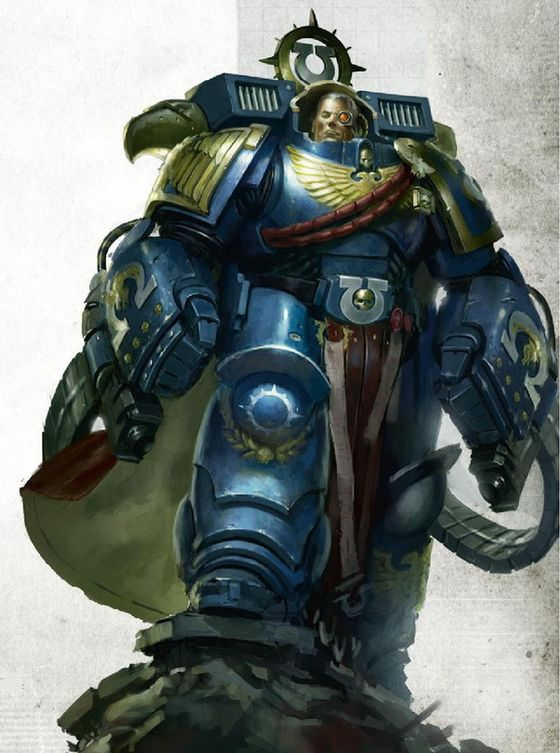
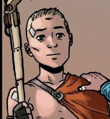
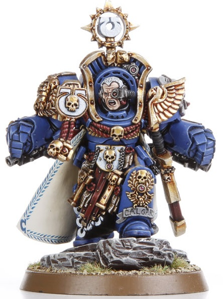
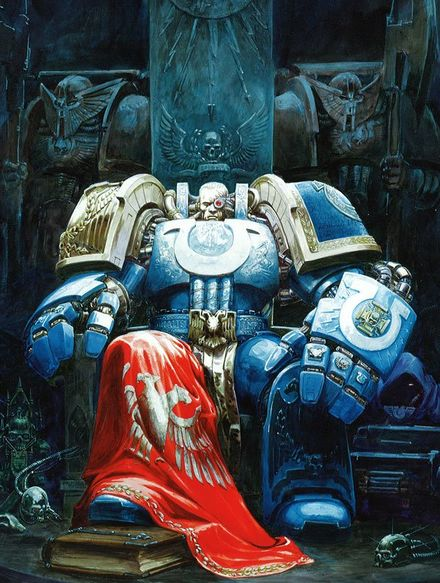
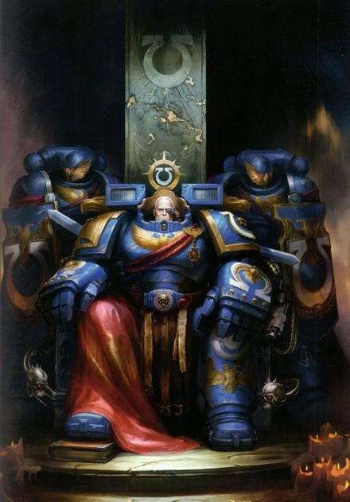
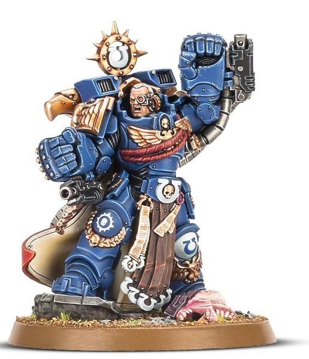
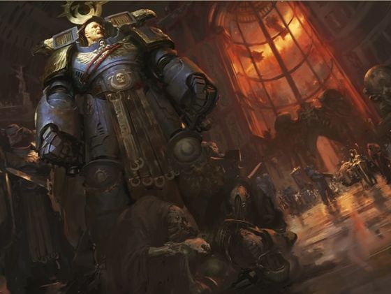
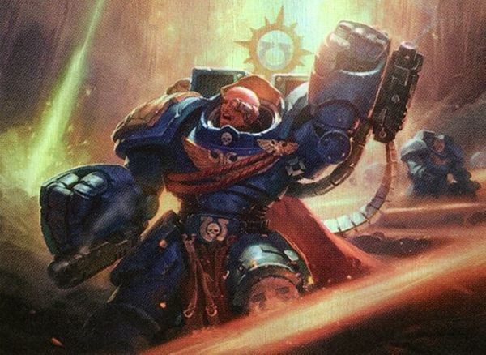
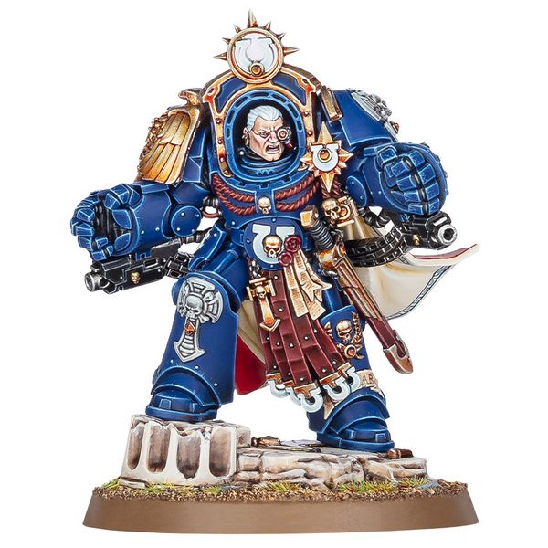

# 0684 马涅乌斯·奥古斯图斯·卡尔加 Marneus Augustus Calgar

精校状态：中文行文已逐段精校，部分术语仍为暂定

分类：人类帝国 / 极限战士

原文来源：https://www.bilibili.com/opus/1113207496857616389

原作者：帝国神选罐头

原文时间：2025年09月16日 20:53

[返回分类目录](目录.md) · [全书目录](../../目录.md)

<!-- A0684-B0001 -->
**英文原文**

"Whilst we stand, we fight. Whilst we fight, we prevail. Nothing shall stay our wrath."

<!-- /A0684-B0001 -->

<!-- A0684-B0002 -->

原译文

“只要我们站着，我们就会战斗。只要我们战斗，我们就会胜利。没有什么能阻挡我们的愤怒。”

**校订译文**

“只要我们站着，我们就会战斗。只要我们战斗，我们就会胜利。没有什么能阻挡我们的愤怒。”

<!-- /A0684-B0002 -->

<!-- A0684-B0003 -->
**英文原文**

Marneus Augustus Calgar, Lord Macragge, is the current Chapter Master of the Ultramarines.

<!-- /A0684-B0003 -->

<!-- A0684-B0004 -->

原译文

马涅乌斯·奥古斯图斯·卡尔加，马库拉格领主，当前极限战士的战团长。

**校订译文**

马涅乌斯·奥古斯图斯·卡尔加，马库拉格领主，现任极限战士战团长。

<!-- /A0684-B0004 -->

<!-- A0684-B0005 图片 -->

<!-- A0684-B0006 -->

原译文

Marneus Calgar as a Primaris Space Marine 原铸星际战士的马涅乌斯·卡尔加

**校订译文**

Marneus Calgar as a Primaris Space Marine 完成原铸改造后的马涅乌斯·卡尔加

<!-- /A0684-B0006 -->

<!-- A0684-B0007 -->
## Biography 传记

<!-- /A0684-B0007 -->

<!-- A0684-B0008 -->
### Early Life 早期生活

<!-- /A0684-B0008 -->

<!-- A0684-B0009 -->
**英文原文**

The Marneus Calgar known today was born Tacitan, a serf of the Noble House of Calgar on the world of Nova Thulium. A companion of the House of Calgar's young heir Marneus, the two both sought honor and escape from the noble system by training to become Space Marines. Under the tutelage of Crixus they trained for a time with other Aspirants on Thulium Minor. However one night the duo discovered that Crixus and the rest of the Aspirants were Khornate cultists and engaging in blood rituals. Before they could escape they were attacked by Crixus and his followers, and during the struggle Marneus Calgar was killed. After escaping Tacitan pledged that Marneus Calgar would live on and became a Space Marine, taking on his friend's identity. Tacitan went on to kill most of his corrupted classmates, but in the end was saved from Crixus by the Ultramarines. The tomb of the "true" Marneus Calgar exists on the world of Nova Thulium, listing his age of death at 12.

<!-- /A0684-B0009 -->

<!-- A0684-B0010 -->

原译文

今天所知的马涅乌斯·卡尔加出生时名为塔西坦，是新星铥世界贵族卡尔加家族的侍从。作为卡尔加家族年轻继承人马涅乌斯的同伴，两人都通过训练成为星际战士来寻求荣誉并逃离贵族体系。在克雷斯的指导下，他们与其他有志者一起在铥次星上训练了一段时间。然而，有一天晚上，两人发现克雷斯和其他有志者都是恐虐邪教徒，并参与了鲜血仪式。他们还没来得及逃跑，就遭到了克雷斯和他的追随者的袭击，在战斗中，马涅乌斯·卡尔加被杀。逃离后，塔西坦承诺马涅乌斯·卡尔加将继续活下去，并成为一名星际战士，接受他朋友的身份。塔西坦继续杀死了他大多数腐化的同学，但最终被极限战士从克雷斯手中救了出来。“真正的”马涅乌斯·卡尔加的坟墓位于新星铥世界，他的死亡年龄为12岁。

**校订译文**

如今为人所知的马涅乌斯·卡尔加，出生时名叫塔西坦，是新铥世界卡尔加贵族家族的农奴。他与家族的年轻继承人马涅乌斯相伴长大，都希望成为星际战士，既赢取荣誉，也摆脱贵族制度的束缚。两人与其他候选者一起，在克雷斯的指导下于铥次星受训。一天夜里，他们发现克雷斯和其余候选者竟是恐虐信徒，正在举行血腥仪式。两人尚未来得及逃走，就遭到克雷斯及其追随者袭击；马涅乌斯·卡尔加在搏斗中丧生。塔西坦逃脱后，发誓要让朋友的名字活下去，并决定以马涅乌斯·卡尔加的身份成为星际战士。他随后杀死了大多数堕落的同伴，最终由极限战士出手，将他从克雷斯手中救下。“真正的”马涅乌斯·卡尔加葬于新铥，墓上记载他死时年仅十二岁。

<!-- /A0684-B0010 -->

<!-- A0684-B0011 图片 -->

<!-- A0684-B0012 -->

原译文

Young Marneus Calgar, then known as Tacitan 年轻的马涅乌斯·卡尔加，当时被称为塔西坦

**校订译文**

Young Marneus Calgar, then known as Tacitan 年轻的马涅乌斯·卡尔加，当时被称为塔西坦

<!-- /A0684-B0012 -->

<!-- A0684-B0013 -->
### Early Career 早期生涯

<!-- /A0684-B0013 -->

<!-- A0684-B0014 -->
**英文原文**

As one might expect from an embodiment of the Ultramarines' nobility, Calgar is immune to fear and is resolutely courageous under fire; where lesser men would dive for cover when being fired upon, Marneus Calgar takes quick stock of the situation, decides the best course of action, and only if he so decides to leap into cover, then he will do so.

<!-- /A0684-B0014 -->

<!-- A0684-B0015 -->

原译文

正如人们所期望的那样，作为极限战士高贵品质的化身，卡尔加对恐惧免疫，在炮火下表现出坚定的勇气；当小人被射击时会躲起来，马涅乌斯·卡尔加会迅速评估情况，决定最佳行动方案，只有当他决定跳进掩体时，他才会这样做。

**校订译文**

卡尔加体现了极限战士的高贵品质，无所畏惧，面对炮火依旧沉着勇毅。旁人遭到射击时会本能地扑向掩体，他却会先迅速判断局势，选定最佳行动；只有认定应当隐蔽时，他才会跃入掩体。

<!-- /A0684-B0015 -->

<!-- A0684-B0016 -->
**英文原文**

During the Battle of Macragge against the Tyranids, Calgar stood his ground on Cold Steel Ridge against a horde of xenos attackers. But the Tyranids were too many, and his body was rent and torn. Calgar faced down the Swarmlord, but due to his injuries was no match for the beast. Before he could be finished off, he was rescued by his fellow Ultramarines.

<!-- /A0684-B0016 -->

<!-- A0684-B0017 -->

原译文

在马库拉格战役对抗泰伦中，卡尔加在冷钢岭坚守阵地，对抗一群异型攻击者。但泰伦太多了，他的身体被撕裂了。卡尔加降服了虫群领主，但由于他的伤势，他不是野兽的对手。在他被干掉之前，他被他的极限战士战友救了出来。

**校订译文**

马库拉格之战期间，卡尔加在冷钢岭坚守阵地，抵御潮水般涌来的泰伦异形。然而敌人数量太多，他身受撕裂重创。卡尔加直面虫群领主，却因伤势过重而无力匹敌。就在即将被杀时，极限战士同袍将他救了出来。

**校注：** faced down 指直面强敌，并非已将其降服；后文明确卡尔加落败获救。

<!-- /A0684-B0017 -->

<!-- A0684-B0018 图片 -->

<!-- A0684-B0019 -->

原译文

Marneus Calgar 马涅乌斯·卡尔加

**校订译文**

Marneus Calgar 马涅乌斯·卡尔加

<!-- /A0684-B0019 -->

<!-- A0684-B0020 -->
**英文原文**

Within a vault inside the Fortress of Hera are records devoted to the achievements and deeds of notable Ultramarines; twenty-eight volumes are devoted to Marneus Calgar, twice the number devoted to that of any other living Ultramarine, and unsurpassed by any other in the Chapter's history except Roboute Guilliman himself. These achievements include:

<!-- /A0684-B0020 -->

<!-- A0684-B0021 -->

原译文

赫拉要塞内的一个秘库里有记录著名极限战士的成就和事迹的档案；马涅乌斯·卡尔加共有28卷，是其他任何活着的极限战士的两倍，在战团的历史上，除了罗伯特·基里曼本人，其他任何人都无法超越。这些成就包括：

**校订译文**

赫拉要塞的一座秘库保存着杰出极限战士的功绩档案。其中，记述马涅乌斯·卡尔加的卷册多达二十八部，是其他任何一位在世极限战士的两倍。纵观战团历史，唯有罗保特·基里曼本人的记载数量超过他。这些功绩包括：

<!-- /A0684-B0021 -->

<!-- A0684-B0022 -->
**英文原文**

Leading the breaching assault on the Tyranid Hive Ship designated Behemoth Primus during the Battle of Macragge.

<!-- /A0684-B0022 -->

<!-- A0684-B0023 -->

原译文

在马库拉格战役中，领导了对指定为贝希摩斯之首的泰伦虫巢舰的突破性攻击。

**校订译文**

在马库拉格之战中，率队突破并登上代号“贝希摩斯之首”的泰伦虫巢舰。

<!-- /A0684-B0023 -->

<!-- A0684-B0024 -->
**英文原文**

Single-handedly holding the gate against an Ork Horde for a night and a day at the Siege of Zalathras.

<!-- /A0684-B0024 -->

<!-- A0684-B0025 -->

原译文

在扎拉特拉斯围城战中，他独自一人守住大门，对抗欧克部落，度过了一天一夜。

**校订译文**

扎拉特拉斯围城期间，独守城门一昼夜，抵御欧克大军。

<!-- /A0684-B0025 -->

<!-- A0684-B0026 -->
**英文原文**

Defeating an Eldar Avatar in single combat, thus leading to the rout of Eldar forces at the Battle for Orar's Sepulchre.

<!-- /A0684-B0026 -->

<!-- A0684-B0027 -->

原译文

在一场战斗中击败了一名灵族化身，从而导致灵族部队在奥拉尔的墓穴之战中溃败。

**校订译文**

在奥拉尔墓穴之战中，通过单挑击败灵族化身，促使灵族军队溃败。

<!-- /A0684-B0027 -->

<!-- A0684-B0028 -->
**英文原文**

Recapturing the star fort Indomitable from the daemonic hordes of M'kar the Reborn.

<!-- /A0684-B0028 -->

<!-- A0684-B0029 -->

原译文

从重生者姆'卡的恶魔部落手中夺回星堡不屈号。

**校订译文**

从重生者姆’卡尔麾下的恶魔大军手中夺回不屈号星堡。

<!-- /A0684-B0029 -->

<!-- A0684-B0030 -->
**英文原文**

Claiming data-records from the world of Thrax as it was being overrun by Daemons.

<!-- /A0684-B0030 -->

<!-- A0684-B0031 -->

原译文

索取斯拉克斯世界的数据记录，它正被恶魔占领。

**校订译文**

在斯拉克斯世界即将被恶魔吞没时，取回当地的数据档案。

<!-- /A0684-B0031 -->

<!-- A0684-B0032 -->
**英文原文**

Slaying the Swarmlord during the Battle of Ichar IV.

<!-- /A0684-B0032 -->

<!-- A0684-B0033 -->

原译文

在伊卡尔四号之战中杀死虫巢领主。

**校订译文**

在伊卡尔四号之战中斩杀虫群领主。

<!-- /A0684-B0033 -->

<!-- A0684-B0034 -->
**英文原文**

Surviving a Night Lords ambush and rallying the populace of the Feudal World of Barathred to defeat hundreds of the traitorous Chaos Space Marines.

<!-- /A0684-B0034 -->

<!-- A0684-B0035 -->

原译文

在午夜领主的伏击中幸存下来，并召集巴拉苏德封建世界的民众击败了数百名叛变的混沌星际战士。

**校订译文**

在午夜领主的伏击中幸存下来，并召集巴拉苏德封建世界的民众击败了数百名叛变的混沌星际战士。

<!-- /A0684-B0035 -->

<!-- A0684-B0036 -->
**英文原文**

Leading the reclamation of Damnos from the Necrons.

<!-- /A0684-B0036 -->

<!-- A0684-B0037 -->

原译文

领导从死灵手中夺回达姆诺斯。

**校订译文**

率军从太空死灵手中收复达姆诺斯。

<!-- /A0684-B0037 -->

<!-- A0684-B0038 -->
### Other Notable Commands 其他著名指挥

<!-- /A0684-B0038 -->

<!-- A0684-B0039 -->
**英文原文**

It is said that the achievements of Marneus Calgar has 28 volumes, far more than any other Ultramarine in the 10,000-year history of Guilliman's Chapter, in this second only to Primarch himself.

<!-- /A0684-B0039 -->

<!-- A0684-B0040 -->

原译文

据说，马涅乌斯·卡尔加的成就有28卷，远远超过极限战士战团一万年历史上的任何其他极限战士，仅次于原体本人。

**校订译文**

据说，卡尔加的功绩记载足有二十八卷，在基里曼战团的一万年历史中远超其余极限战士，仅次于原体本人。

<!-- /A0684-B0040 -->

<!-- A0684-B0041 -->

原译文

Corinthian Crusade 科林斯远征

**校订译文**

Corinthian Crusade 科林斯远征

<!-- /A0684-B0041 -->

<!-- A0684-B0042 -->

原译文

Siege of Tulwa 图卢瓦围城

**校订译文**

Siege of Tulwa 图卢瓦围城

<!-- /A0684-B0042 -->

<!-- A0684-B0043 -->

原译文

Scouring of Quistarn 奎斯塔恩清洗

**校订译文**

Scouring of Quistarn 奎斯塔恩清洗

<!-- /A0684-B0043 -->

<!-- A0684-B0044 -->

原译文

Battle of Arconar 阿科纳之战

**校订译文**

Battle of Arconar 阿科纳之战

<!-- /A0684-B0044 -->

<!-- A0684-B0045 -->

原译文

Battle of Knarts Landing 克纳特斯登陆之战

**校订译文**

Battle of Knarts Landing 克纳特斯登陆之战

<!-- /A0684-B0045 -->

<!-- A0684-B0046 -->

原译文

Balur Crusade 巴卢尔远征

**校订译文**

Balur Crusade 巴卢尔远征

<!-- /A0684-B0046 -->

<!-- A0684-B0047 -->

原译文

Battle of Ichar IV 伊卡尔四号之战

**校订译文**

Battle of Ichar IV 伊卡尔四号之战

<!-- /A0684-B0047 -->

<!-- A0684-B0048 -->

原译文

The Defense of Metalica 梅塔利卡防御战

**校订译文**

The Defense of Metalica 梅塔利卡防御战

<!-- /A0684-B0048 -->

<!-- A0684-B0049 -->

原译文

Scouring of Quintarn 昆坦清洗

**校订译文**

Scouring of Quintarn 昆坦清洗

<!-- /A0684-B0049 -->

<!-- A0684-B0050 -->
### Ultramar Campaign 奥特拉玛战役

<!-- /A0684-B0050 -->

<!-- A0684-B0051 -->
**英文原文**

During the Ultramar Campaign, Calgar initially refused Belisarius Cawl's request to try and resurrect Roboute Guilliman, particularly due to the presence of Eldar among his expedition. However the Chaos assault and the words of Tigurius caused him to relent, and he fought alongside Saint Celestine and Voldus in holding back the Black Legion long enough for his Primarch to be reborn. The resurrected Roboute Guilliman charged Calgar to secure the rest of Ultramar from the Forces of Chaos as he embarked on the Terran Crusade.

<!-- /A0684-B0051 -->

<!-- A0684-B0052 -->

原译文

在奥特拉马战役期间，卡尔加最初拒绝了贝利萨留·考尔试图复活罗伯特·基里曼的请求，特别是因为灵族也在他的探索队中。然而，混沌的攻击和狄格里斯的话让他心软，他与圣塞勒斯汀和沃尔达斯并肩作战，将黑色军团阻挡了足够长的时间，使他的原体得以重生。复活的罗伯特·基里曼在开始泰拉远征时，要求卡尔加从混沌部队手中保护奥特拉玛的其余部分。

**校订译文**

奥特拉玛战役期间，卡尔加起初拒绝贝利萨留斯·考尔尝试复苏罗保特·基里曼的请求，尤其不能接受考尔的远征队中竟有灵族。然而，混沌军队的猛攻与狄格里斯的劝说使他改变了主意。他与圣塞莱斯汀、沃尔达斯并肩抵挡黑色军团，为原体复苏争取了足够的时间。基里曼苏醒后启程发动泰拉远征，并命令卡尔加保卫奥特拉玛其余地区，抵御混沌势力。

<!-- /A0684-B0052 -->

<!-- A0684-B0053 图片 -->

<!-- A0684-B0054 -->

原译文

Marneus Calgar, Lord Macragge, Master of the Ultramarines 马涅乌斯·卡尔加，马库拉格领主，极限战士之主

**校订译文**

Marneus Calgar, Lord Macragge, Master of the Ultramarines 马涅乌斯·卡尔加，马库拉格领主，极限战士之主

<!-- /A0684-B0054 -->

<!-- A0684-B0055 -->
**英文原文**

Calgar remained Chapter Master of the Ultramarines throughout the ensuing Indomitus Crusade as Guilliman was occupied elsewhere. However, he was now known as Lord Defender of Greater Ultramar instead of Master of Ultramar.

<!-- /A0684-B0055 -->

<!-- A0684-B0056 -->

原译文

在随后的不屈远征中，随着基里曼被其他地方占用，卡尔加一直是极限战士的战团长。然而，他现在被称为大奥特拉马防卫者领主，而不是奥特拉玛之主。

**校订译文**

随后的不屈远征期间，基里曼忙于其他战区，卡尔加继续担任极限战士战团长。不过，他的尊号由“奥特拉玛之主”改成了“大奥特拉玛守护领主”。

<!-- /A0684-B0056 -->

<!-- A0684-B0057 -->
### The Rubicon Primaris 原铸跨越手术

原题：The Rubicon Primaris 原铸界限

<!-- /A0684-B0057 -->

<!-- A0684-B0058 -->
**英文原文**

The induction of the Primaris Marines into the Adeptus Astartes was not an easy process by any means. The Chapters of the Space Marines are arch traditionalists, and some are conservative in the extreme, having upheld the same warrior traditions for thousands of years. Of course, the express command of Roboute Guilliman, Lord Commander of the Imperium, eased the transition into the new era. For the Ultramarines and the vast majority of their successors, the word of the risen Primarch was good enough, and many Chapters welcomed the Primaris battle-brothers gladly. But there were those especially secretive or wilful Chapters who saw the incorporation of the Primaris Marines into their ranks as a dilution of their gene-stock and a betrayal of their long-held culture. Some amongst the Adeptus Astartes suspected that the Primaris Marines, being stronger, more durable, and closer in blood to the Primarchs themselves, represented the obsolescence of traditional battle-brothers. No amount of reason – of pointing out that what the Primaris offered in raw ability, they lacked in experience and versatility – could salve the spiritual wound dealt by the sight of the newcomers wearing their heraldry. The Primaris Marines of the Ultima Founding had been swiftly inducted into brotherhoods that the incepted aspirants of yesteryear had given everything they had to join. Questions, heavy with the weight of destiny, hung in the air. Would the Primaris Marines ultimately make the traditional Space Marines extinct? Would the identity of each Chapter’s home world be diluted, with so many thousands of new recruits sourced from the stasis vaults of Mars? And was it possible for a Space Marine to be transformed into a Primaris, inheriting the benefits of Adeptus Mechanicus arcanoscience whilst retaining his personality and experience?

<!-- /A0684-B0058 -->

<!-- A0684-B0059 -->

原译文

无论如何，将原铸星际战士引入阿斯塔特修会都不是一个容易的过程。星际战士的战团是极端的传统主义者，其中一些极端保守，数千年来一直坚持同样的战士传统。当然，帝国领主指挥官罗伯特·基里曼的明确指挥，缓解了向新时代的过渡。对于极限战士及其绝大多数子战团来说，复活的原体的话已经足够好了，许多战团都很高兴地欢迎了原体的战斗兄弟。但也有一些特别隐秘或任性的战团认为，将原铸星际战士纳入他们的队伍是对他们基因库的稀释，是对他们长期文化的背叛。阿斯塔特修会中的一些人怀疑，原铸星际战士更强大、更耐久，而且与原体本身的血缘更近，代表了传统战斗兄弟的过时。无论有多少理由 — 指出原铸在原始能力方面提供的东西，他们缺乏经验和多才多艺 — 都无法缓解新来者佩戴纹章所造成的精神创伤。极限建军的原铸星际战士很快就加入了兄弟关系，而过去那些有志者已经付出了他们所能加入的一切。问题，沉重的命运的重量，挂在空中。原铸星际战士最终会让传统的星际战士灭绝吗？来自火星休眠库的数千名新兵，是否会稀释每个战团家园世界的身份？那么，一名星际战士是否有可能被改造成一名原铸，在保留他的个性和经验的同时，继承机械神教奥秘的好处呢？

**校订译文**

让原铸星际战士加入阿斯塔特修会，绝非易事。星际战士战团笃守传统，其中一些极为保守，数千年来始终遵循同一套战士习俗。帝国最高统帅罗保特·基里曼的明确命令，当然有助于推动这一转变。对极限战士及绝大多数子战团而言，复苏原体的意志已足够令人信服，许多战团欣然接纳原铸战斗兄弟。但某些格外隐秘或固执的战团认为，接纳他们会稀释自身的基因传承，背叛世代遵循的文化。还有阿斯塔特担心，这些更强壮、更坚韧、血脉也更接近原体的新战士，意味着传统战斗兄弟将被淘汰。即使指出原铸战士虽然先天能力更强，却缺乏经验与应变能力，也无法抚平老兵看见新人佩戴本团纹章时的心灵创伤。极限建军的原铸战士迅速获准加入这些兄弟会，而往昔的候选者为了取得同样的资格，曾付出自己的一切。一连串关乎命运的问题悬而未决：原铸星际战士最终会完全取代传统星际战士吗？成千上万的新兵来自火星静滞库，会不会淡化各战团母星的文化特色？传统星际战士能否改造成原铸战士，在保留自身性格与经验的同时，获得机械修会秘传科学带来的优势？

<!-- /A0684-B0059 -->

<!-- A0684-B0060 图片 -->

<!-- A0684-B0061 -->

原译文

Marneus Calgar and two Bladeguard Veterans 马涅乌斯·卡尔加与两个剑卫老兵（看着其实应该是常胜卫队）

**校订译文**

Marneus Calgar and two Bladeguard Veterans 马涅乌斯·卡尔加与两名剑卫老兵

**校注：** 图注英文称 Bladeguard Veterans，按原文保留；原稿括注认为画面实为常胜卫队，但本轮未据图片确证，将该判断留作待核图注疑点。

<!-- /A0684-B0061 -->

<!-- A0684-B0062 -->
**英文原文**

This last question had been raised in Adeptus Astartes Chapters across the galaxy. It was a query Lord Calgar had asked of Belisarius Cawl himself, and had discussed with those of his fellow Chapter Masters he was able to meet in person. Debate raged as to whether such an act was even possible without having deadly consequences for the recipient – for data that Archmagos Cawl had already amassed on the subject suggested there would be a 61.6% failure rate until the process could be perfected, which would take time. Then there was the moral concern of whether the process should be attempted at all. The dilemma was proving divisive indeed. There were those who claimed this was the ultimate destiny of all Adeptus Astartes, while from other quarters came whispers of rejection, even mutiny, at the prospect. The lords of the Ultramarines came to the conclusion that to ease the transition from centuries of Imperial tradition to a new order, the theoreticals of that raging debate would have to be put into practice. It was Marneus Calgar that stepped forward as the first test subject from the ranks of his storied Chapter. It was a process he did not survive – though like his Primarch before him, he was to rise from the threshold of death once more.

<!-- /A0684-B0062 -->

<!-- A0684-B0063 -->

原译文

这最后一个问题在整个银河系的阿斯塔特修会战团中都有提出。这是卡尔加领主亲自向贝利萨留·考尔提出的一个问题，并与他能够亲自见到的其他战团长进行了讨论。关于这种行为是否可能在不对接受者造成致命后果的情况下进行，争论激烈 — 因为大贤者考尔已经收集到的关于这一主题的数据表明，在完善这一过程之前，失败率将达到61.6%，这需要时间。然后是道德问题，即是否应该尝试这一过程。事实证明，这种困境确实引发了分歧。有人声称这是所有阿斯塔特的最终命运，而其他方面则对这一前景表示拒绝，甚至叛变。极限战士的领主们得出的结论是，为了缓解从几个世纪的帝国传统向新秩序的过渡，这场激烈辩论的理论必须付诸实践。马涅乌斯·卡尔加作为他传奇篇章中的第一个测试对象站了出来。这是一个他没有幸存下来的过程 — 尽管就像他之前的原体一样，他将再次从死亡的开端崛起。

**校订译文**

最后这个问题，在银河各地的阿斯塔特战团中都被提出过。卡尔加亲自向贝利萨留斯·考尔询问，也与能够当面会晤的其他战团长讨论过。手术是否可能不危及受术者性命，引发了激烈争论：考尔大贤者汇总的资料显示，在流程完善之前，手术失败率高达61.6%；而完善流程需要时间。除此之外，还有一个道德层面的问题——究竟该不该尝试这种改造？这场争论确实造成了分裂。有人认为，这是所有阿斯塔特的最终归宿；也有人扬言拒绝，甚至流露出哗变的意图。极限战士的领袖们最终认为，要让帝国延续数百年的传统顺利过渡到新秩序，就必须将争论中的理论付诸实践。马涅乌斯·卡尔加挺身而出，成为这个功勋卓著的战团中第一名受试者。他确实在手术中死去过，却又如原体一般，从死亡门槛另一侧重返人间。

<!-- /A0684-B0063 -->

<!-- A0684-B0064 -->
**英文原文**

The operation to transform Calgar from a traditional Space Marine into a Primaris Marine was conducted in an autosterilised med vault. Thick with the tang of counterseptic and crowded with elaborate medical servitors, the room was dominated by the vast marble slab at its centre, artfully carved with runnels to collect the copious streams of blood that would result from the procedure. The surgery was to be extensive and agonising, a fact Marneus knew well from Cawl’s tediously thorough descriptions of his masterwork process. A Primaris Marine is gifted three new organs in addition to the nineteen grafted, sutured and chemically implanted into an aspirant Space Marine. These are the Magnificat, which is buried deep within the brain to stimulate growth and to intensify other organ functions; the Belisarian Furnace, which releases a burst of hypersteroids and corticostimulants when a mortal blow is dealt so the Primaris may fight on; and the Sinew Coils, cable-like lengths of durasteel that encase every tendon and sinew in a metallic sheath that gives tremendous resilience and strength.

<!-- /A0684-B0064 -->

<!-- A0684-B0065 -->

原译文

将卡尔加从传统的星际战士转变为原铸战士的行动是在一个自动杀菌的医疗秘库中进行的。房间里充满了消毒剂的味道，挤满了精心挑选的医务人员，房间中央是一块巨大的大理石板，上面巧妙地雕刻着通道，以收集手术产生的大量血液。手术是长久而痛苦的，马涅乌斯从考尔对他的杰作过程的乏味而彻底的描述中很清楚这一点。除了19个移植、缝合和化学植入到一名有志者星际战士体内的器官外，一名原铸战士还获得了三个新器官。这些是圣颂垂体，它埋在大脑深处，刺激生长并强化其他器官的功能；贝利撒留熔炉，当受到致命打击时，会释放出大量的类固醇和皮质刺激素，以便原铸可以继续战斗；以及肌腱线圈，这是一种电缆状的硬钢，将每根腱和筋包裹在金属护套中，具有巨大的弹性和强度。

**校订译文**

将卡尔加由传统星际战士改造成原铸战士的手术，在自动消毒的医疗密室内进行。室中弥漫着刺鼻的消毒剂气味，挤满构造复杂的医疗机仆；中央是一张巨大的大理石手术台，精心凿出的沟槽用于引流手术中大量涌出的鲜血。这将是一场范围广泛、痛苦至极的手术；考尔曾以近乎冗长乏味的细致程度介绍自己的杰作流程，马涅乌斯对此心知肚明。星际战士候选者原本需通过移植、缝合及化学手段植入十九个器官，原铸战士在此之外还要增加三个：深植于脑部、促进生长并增强其他器官功能的圣颂垂体；遭受致命打击时释放高效类固醇与皮质刺激剂、使战士得以继续作战的贝利萨留斯熔炉；以及以缆线般的硬钢为每一条肌腱包覆金属鞘、赋予强大韧性与力量的肌腱线圈。

**校注：** medical servitors 为医疗机仆，不是精心挑选的医务人员。Belisarian Furnace 暂沿已定器官名贝利撒留熔炉，与人物全名贝利萨留斯·考尔分别登记。

<!-- /A0684-B0065 -->

<!-- A0684-B0066 -->
**英文原文**

During the implantation of these advanced organs, Marneus Calgar was cut open from crown to heel. His ribcage was cracked apart and – at the climax of the operation – his physiology suppressed to the point that his life slipped away. Choirs of cyber- cherubs sang blissful, overlapping requiems, swaying their aspergillums that sacred incense might guide Calgar’s spirit back to his body. The corpse lay in state, its flesh rent and open to the air, for what seemed to those watching like an age. Ten long minutes ticked past, then twenty. Skull-faced surgeons clicked and muttered and stabbed at the tortured flesh. Those around the periphery of the apothecarium theatre held their breath in dread. Then, with his wounds stitched closed by a thousand jabbing needles and his mighty heart electrified to beat once more, the newly forged Lord Calgar was brought back to life. He broke his bonds with a strangulated, blood-flecked roar, stumbling to life as his Belisarian Furnace brought him to battle readiness. Calgar had clawed his way back from beyond the brink of death, and in doing so, he had shown to his Chapter that the transformation was possible. The Rubicon Primaris had been crossed, and a new path opened for the Adeptus Astartes.

<!-- /A0684-B0066 -->

<!-- A0684-B0067 -->

原译文

在植入这些先进器官的过程中，马涅乌斯·卡尔加从头部到脚跟被切开。他的胸腔裂开了，在手术的高潮，他的生理机能受到抑制，以至于他的生命消失了。一群智天使唱着极乐的、交叠的安魂曲，摇晃着他们的香炉，神圣的熏香可能会引导卡尔加的精神回到他的身体。尸体躺者，它的肉裂开了，向空中开放，对于那些观看的人来说，这似乎是一个很长的时间。十分钟过去了，然后二十分钟过去了。骷髅脸的外科医生咔嗒咔嗒地嘟囔着，然后刺向那块受折磨的肉。药剂部手术室周围的人吓得屏住了呼吸。然后，他的伤口被一千根刺针缝合，他强大的心脏再次跳动，新铸造的卡尔加领主复活了。他发出一声哽咽的、血迹斑斑的咆哮，挣脱了束缚，跌跌撞撞地活了下来，因为他的贝利撒留熔炉让他做好了战斗准备。卡尔加从死亡的边缘爬了回来，这样做，他向他的战团表明，这种转变是可能的。原铸界限已经被跨越，为阿斯塔特修会开辟了一条新的道路。

**校订译文**

植入这些先进器官时，马涅乌斯·卡尔加的身体从头顶到脚跟被剖开，胸廓也被撑裂。手术进入关键阶段后，他的生理活动受到压制，直至生命消逝。机械智天使的合唱团吟唱着安宁而交叠的安魂曲，摇动洒香器，仿佛要以神圣的香气引导他的灵魂重返肉身。尸身静卧，剖开的血肉暴露在空气中；旁观者只觉度日如年。十分钟过去，继而是二十分钟。骷髅面孔的外科医师一边发出咔嗒声与低语，一边在饱受折磨的躯体上继续操作。药剂部手术室四周的人惊惧地屏住呼吸。终于，千百根针缝合了伤口，电流令那颗强健的心脏重新跳动，改造后的卡尔加领主复活了。他挣断束缚，发出带着血沫、几近窒息的怒吼；贝利萨留斯熔炉让刚刚苏醒的他迅速恢复到战斗状态。卡尔加从死亡彼岸挣扎归来，向战团证明了这种转变确实可行。原铸改造的天堑已被跨越，阿斯塔特修会面前由此出现了一条新的道路。

<!-- /A0684-B0067 -->

<!-- A0684-B0068 -->
### Return of Old Enemies 旧敌归来

<!-- /A0684-B0068 -->

<!-- A0684-B0069 -->
**英文原文**

While overseeing repairs to the world of Nova Thulium with adept Quintus Heximar Calgar received word that a small force of heretics had arrived on the planet via a crashed transport. After defeating them with a force of Ultramarines Calgar wanted to know why exactly they had launched an attack with no chance of winning. He then commandeered the Calgar Estates on the planet as a temporary base of operation, it was the first time he had been there since becoming a space marine. While looking at the statue of his friend, the original Marneus Calgar, he was informed that attacks had broken out all across the continent. Since he only had a demi-company with him Calgar deployed with his Ultramarines to the biggest attack on the planet, a giant agricultural machine commandeered by the heretics. After defeating them he was informed that the Calgar Estates had been seized and returned to them with his forces.

<!-- /A0684-B0069 -->

<!-- A0684-B0070 -->

原译文

在与专家昆图斯·赫西马尔一起监督新星铥世界的修理时，卡尔加收到消息称，一小队异端分子通过一辆坠毁的运输工具抵达了这个行星。在用极限战士击败他们后，卡尔加想知道他们为什么发动了一场毫无胜算的进攻。然后，他征用了行星上的卡尔加庄园作为临时行动基地，这是他成为星际战士以来第一次到那里。当他看着他的朋友，原来的马涅乌斯·卡尔加的雕像时，他被告知整个大陆都爆发了袭击。由于他只有一个半连队，卡尔加带着他的极限战士部署到行星上最大的袭击中，这是一台被异端征用的巨大农业机器。击败他们后，他得知卡尔加庄园已被占领，并带着他的部队回到了他们身边。

**校订译文**

卡尔加与专员昆图斯·赫西马尔监督新铥的重建时，得知一小股异端搭乘的运输载具坠落在星球上。他率极限战士将其击败，却想不通他们为何发动这场毫无胜算的进攻。随后，他征用卡尔加家族的庄园作为临时基地；自成为星际战士以来，他还是第一次回到这里。他正凝望故友——真正的马涅乌斯·卡尔加——的雕像，便收到大陆各处接连遭袭的消息。他身边只有半个连，于是集中兵力赶赴规模最大的袭击现场：异端夺占了一台巨型农业机械。击败敌人后，他又得知卡尔加庄园失守，只得率部返回。

**校注：** demi-company 为半个连，原“一个半连队”易误解为一点五个连，消歧。

<!-- /A0684-B0070 -->

<!-- A0684-B0071 图片 -->

<!-- A0684-B0072 -->

原译文

Marneus Calgar as a Primaris Space Marine 原铸星际战士的马涅乌斯·卡尔加

**校订译文**

Marneus Calgar as a Primaris Space Marine 原铸星际战士的马涅乌斯·卡尔加

<!-- /A0684-B0072 -->

<!-- A0684-B0073 -->
**英文原文**

After re-taking the Estates and capturing a heretic for interrogation Calgar left with Quintus to view a construction site on Thulium Minor. While over the moon Quintus mentioned that one of his survey teams had not checked in, Calgar immediately knew something was wrong when he saw the area they were surveying. He ordered a change of course and to signal the other Ultramarines but just then they were shot down. After leaving the wreck with Quintus he saw several Chaos Space Marines led by two of the children he trained with, now merged into one body by the warp. Calgar then withdrew with Quintus into the planets tunnels, and the Word Bearer ship that was underground, he ordered Quintus to activate the ship while he distracted the traitors. During the fighting one of his hearts was pierced by the traitors he knew as a child. He then crushed the head of one of them, and shot the other dead in the pool where the original Calgar died. He met up with Quintus who had started the ship and gotten a message to the other Ultramarines who were arriving now. Calgar joined them in the battle and ripped off the head of the Lord of Skulls.

<!-- /A0684-B0073 -->

<!-- A0684-B0074 -->

原译文

在夺回庄园并抓获一名异端进行审问后，卡尔加与昆图斯一起前往铥次星的一个建筑工地。虽然在卫星上昆图斯提到他的一个调查小队没有登记，但当卡尔加看到他们正在调查的区域时，他立刻知道出了什么问题。他命令改变航向，并向其他极限战士发出信号，但就在那时，他们被击落了。在与昆图斯一起离开残骸后，他看到几个混沌星际战士由他训练过的两个孩子领导，现在被亚空间合并成一个身体。卡尔加随后与昆图斯一起撤退到行星隧道和地下的承载者号飞船中，他命令昆图斯在分散叛徒注意力的同时激活飞船。在战斗中，他的一颗心脏被他小时候认识的叛徒刺穿了。然后，他砸死了其中一人的头部，并在原来卡尔加死亡的水池中枪杀了另一人。他遇到了已经启动飞船的昆图斯，并向现在到达的其他极限战士发了一条信息。卡尔加加入了他们的战斗，扯下了颅骨领主的头。

**校订译文**

夺回庄园并抓获一名异端供审讯后，卡尔加与昆图斯前往铥次星的一处工地。飞行途中，昆图斯提到一支勘测队未按时联络；卡尔加看见其勘测位置，立刻察觉异常。他命令改道，并向其他极限战士发出信号，却在此时遭到击落。两人离开残骸后，看见数名混沌星际战士，其首领竟是卡尔加儿时一起受训的两名同伴，如今已被亚空间力量融合在同一具躯体中。卡尔加带着昆图斯退入地下隧道，再进入一艘埋在地下的怀言者舰船。他命令昆图斯启动舰船，自己负责牵制叛徒。战斗中，那些儿时旧识刺穿了他的一颗心脏；他则捏碎其中一人的头颅，又在真正的卡尔加遇害的水池中射杀另一人。随后，他与昆图斯会合；后者已启动舰船，并联系上正在赶来的极限战士。卡尔加随即与援军并肩作战，扯下了一台颅骨领主的头颅。

**校注：** Word Bearer ship 指怀言者所属舰船，非舰名承载者号；卡尔加本人负责牵制，昆图斯负责启动与联络。英文在卫星语境又称 planet，中文按同段地点写地下，不另造行星。

<!-- /A0684-B0074 -->

<!-- A0684-B0075 -->
### Vigilus 警戒星

<!-- /A0684-B0075 -->

<!-- A0684-B0076 -->
**英文原文**

While en route to another front, Calgar received a psychic vision by his good friend Tigurius with a direct order from Guilliman himself to travel to Vigilus and prevent its fall to all costs. Calgar was appointed by Guilliman as the Supreme Commander of all Imperial Forces on Vigilus and is currently waging the War of Beasts via his combined war council known as the Vigilus Senate.

<!-- /A0684-B0076 -->

<!-- A0684-B0077 -->

原译文

在前往另一条战线的途中，卡尔加收到了他的好朋友狄格里斯的灵能幻象，基里曼本人直接命令他前往警戒星，不惜一切代价防止其陷落。卡尔加被基里曼任命为警戒星所有帝国军队的最高指挥官，目前正在通过他的联合战争议会警戒星参议院进行野兽战争。

**校订译文**

前往另一处战区途中，卡尔加接到挚友狄格里斯传来的灵能异象，其中传达了基里曼的直接命令：前往警戒星，不惜一切代价阻止它陷落。基里曼任命他为当地所有帝国军队的最高指挥官。他通过名为“警戒星参议院”的联合战争议会，统筹野兽之战。

<!-- /A0684-B0077 -->

<!-- A0684-B0078 图片 -->

<!-- A0684-B0079 -->

原译文

Marneus Calgar as a Primaris Space Marine on Vigilus 马涅乌斯·卡尔加作为原铸星际战士在警戒星上

**校订译文**

Marneus Calgar as a Primaris Space Marine on Vigilus 马涅乌斯·卡尔加作为原铸星际战士在警戒星上

<!-- /A0684-B0079 -->

<!-- A0684-B0080 -->
**英文原文**

During the height of fighting against the forces of Chaos on Vigilus, Calgar was able to turn the tide by forming an alliance with the Eldar on the world led by Farseer Keltoc. Calgar was able to convince the Xenos to join him in the fight against Chaos, and cemented the pact by agreeing to Keltoc's terms to secretly kill the slayers of Autarch Rhyloor in order to satisfy Saim-Hann's blood feud. With the Eldar now as allies, Calgar goaded Abaddon himself into a duel at Saint's Haven while the stealthy Eldar vessel Vaul's Ghost collided with the Vengeful Spirit and detonated a cache of Deathstrike Missiles. Though his ploy worked and forced the Warmaster to retreat in order to save the Vengeful Spirit, Calgar was badly wounded in the duel against Abaddon. One of his gauntlets where torn away to expose a forearm splintered and shorn of skin. The other was cut through severing two of his fingers and slashing open both of his hearts that he was shielding with that hand. As he laid there wounded, Greater Possessed came and pierced both his hearts and ripped open his throat. He just barely survived the battle. His ravaged throat was sutured, reinforced and regrown, the Apothecaries administering intense regeneration chem-baths, cyborgisation surgery and a lengthy rejuvenat treatment. This made his voice sound mechanical afterwards. The apothecarium also salvaged his secondary heart, but the primary was cloven through. He was not seen on the front line of the battlefield from that point on, but continued to command the armies of the Imperium from the heart of the Vigilus Senate. In the aftermath of the battle, Calgar was declared a Saint by the Adeptus Ministorum.

<!-- /A0684-B0080 -->

<!-- A0684-B0081 -->

原译文

在警戒星与混沌部队的战斗最激烈的时候，卡尔加能够通过与先知凯尔托克领导的世界上的灵族结盟来扭转局势。卡尔加成功地说服了异型加入他与混沌的战斗，并通过同意凯尔托克的条款来巩固了这一协议，即秘密杀害杀害司战瑞罗尔的人，以满足萨姆·罕的血仇。随着灵族现在成为盟友，卡尔加怂恿阿巴顿与自己在圣者之港决斗，而隐形的灵族飞船瓦尔幽灵号与复仇之魂号相撞，引爆了一批死亡打击导弹。尽管他的策略奏效了，迫使战帅撤退以拯救复仇之魂号，但卡尔加在与阿巴顿的决斗中受了重伤。他的一只臂铠被扯掉，露出前臂的一块碎片和皮肤。另一只手被割断了两个手指，并切开了他用那只手保护的两颗心脏。当他躺在那里重伤时，大魔来了，刺穿了他的心脏，撕开了他的喉咙。他在战斗中勉强活了下来。他受伤的喉咙被缝合、加固和再生，药剂师们进行了强烈的再生化学浴、半机械化手术和漫长的再生治疗。这使得他的声音听起来很机械。药剂师也挽救了他的第二颗心脏，但第一颗心脏被切开了。从那时起，他就没有出现在战场的前线，但他继续在警戒星参议院的中心指挥帝国的军队。战斗结束后，卡尔加被国教教会宣告为圣人。

**校订译文**

警戒星战事最激烈时，卡尔加与大先知凯尔托克率领的当地灵族结盟，成功扭转战局。他说服异形共同对抗混沌，并接受凯尔托克的条件：秘密处死杀害司战瑞罗尔的人，为萨姆·罕了结血仇，以此巩固盟约。有了灵族协助，卡尔加在圣者之港诱使阿巴顿与自己决斗；与此同时，灵族隐形舰瓦尔幽灵号撞向复仇之魂号，引爆了舰载的一批死亡打击导弹。计策迫使战帅撤退，赶去抢救旗舰，但卡尔加本人也在决斗中身受重创。他的一只臂铠被撕掉，露出骨骼碎裂、皮肉剥离的前臂；另一只臂铠被斩穿，两根手指被切断，护在那只手之后的两颗心脏也被划开。他倒地后，强效附魔战士又刺穿他的双心，撕开喉咙。他最终勉强保住性命。药剂师以强效再生化学浴、机械改造手术及长期回春治疗，缝合、加固并再生了受损的咽喉，此后他的声音带上了机械音色。药剂部也保住了副心脏，但主心脏已经被劈开。此后卡尔加未再现身战场前线，而是在警戒星参议院内部继续指挥帝国大军。战后，国教会宣布他为圣人。

**校注：** Greater Possessed 为强化的附魔战士，非 Greater Daemon（大魔）。本段描述主副心脏的反复重伤与抢救结果按原文保留。

<!-- /A0684-B0081 -->

<!-- A0684-B0082 -->
### The Plague Wars 瘟疫战争

<!-- /A0684-B0082 -->

<!-- A0684-B0083 -->
**英文原文**

Calgar was called back to Ultramar During the Plague Wars by Guilliman. After returning Calgar put down anti-Imperial uprisings and mutinies by the Ultramar Auxilia in the Illyrian region of Macragge. He was disappointed in how the uprising was executed, expecting better from people born on Macragge, as a result he wanted the local Juventia troop masters re-educated or replaced. After putting down the uprisings he was summoned to a Conclave at the Fortress of Hera by Guilliman. There he announced the reinstatement of the Tetrarchy, and that Calgar would preside over it, as well as battle plans for the ongoing battle against Mortarion.

<!-- /A0684-B0083 -->

<!-- A0684-B0084 -->

原译文

在瘟疫战争期间，基里曼将卡尔加召回奥特拉玛。返回后，卡尔加镇压了奥特拉玛辅助军在马库拉格伊利里亚地区的反帝国起义和叛乱。他对叛乱的执行方式感到失望，希望出生在马库拉格的人能过得更好，因此他希望当地的青年部队指挥官接受再教育或被替换。镇压叛乱后，他被基里曼召集到赫拉要塞的秘密会议。在那里，他宣布恢复英杰制度，卡尔加将主持它，并宣布了正在进行的与莫塔里安的战斗计划。

**校订译文**

瘟疫战争期间，基里曼将卡尔加召回奥特拉玛。他回归后，镇压了马库拉格伊利里亚地区的反帝国起义，以及奥特拉玛辅助军的哗变。令他失望的是叛乱者表现出的低劣作战水平——他认为马库拉格出身的人理应表现得更好，因此要求当地青年兵的教官接受再培训或被撤换。平叛后，基里曼召他前往赫拉要塞参加会议，宣布恢复四方领主制度，由卡尔加主持，并公布了继续对抗莫塔里安的作战计划。

**校注：** 卡尔加失望于叛乱者的军事表现，并非期望他们生活更好；恢复四方领主制度的宣告者是基里曼。

<!-- /A0684-B0084 -->

<!-- A0684-B0085 -->
**英文原文**

He later slowed an Ork advance towards Metalica with rapid strike tactics.

<!-- /A0684-B0085 -->

<!-- A0684-B0086 -->

原译文

后来，他用快速打击战术减缓了欧克向梅塔利卡的进攻。

**校订译文**

后来，他用快速打击战术减缓了欧克向梅塔利卡的进攻。

<!-- /A0684-B0086 -->

<!-- A0684-B0087 -->
### Fourth Tyranic War 第四次泰伦战争

<!-- /A0684-B0087 -->

<!-- A0684-B0088 -->
**英文原文**

When Demetrian Titus was recovered by the Ultramarines on the planet of Kadaku Calgar ordered that he undergo the Rubicon Primaris surgery, as it was the only way he would survive and authorized his immediate reinstatement as an Ultramarine. However before he could meet with Titus in person he was summoned elsewhere by Guilliman

<!-- /A0684-B0088 -->

<!-- A0684-B0089 -->

原译文

当德米特里安·泰图斯在卡达库行星上被极限战士恢复时，卡尔加命令他接受原铸界限手术，因为这是他生存的唯一途径，并授权他立即恢复为极限战士。然而，在他亲自会见泰图斯之前，吉利曼把他叫到了别处

**校订译文**

极限战士在卡达库救回德米特里安·泰图斯后，卡尔加命令他接受原铸跨越手术，因为这是保住其性命的唯一办法；卡尔加同时批准他立即重返极限战士战团。然而，尚未来得及亲自见他，卡尔加便被基里曼召往别处。

<!-- /A0684-B0089 -->

<!-- A0684-B0090 -->
**英文原文**

Calgar would return to the Recidious System a few days later after receiving a message from Titus. He arrived at the planet Demerium alongside his Victrix Guard and reinforcements from 1st Company and 3rd Company. Upon arriving he went into battle and saved Titus and 2nd Company members defending the Company Banner. After being briefed on the situation he approved a plan based on Gadriel's theory that had Titus's support, that they could invert the smaller Project Aurora obelisks and lower the energy field protecting the central one. Calgar then gave a speech to 2nd Company and went into battle alongside them while various teams inverted the obelisks. After the last obelisks were inverted Imurah fled through a tear in reality and Calgar went in after him, with Titus and his squad not far behind. After entering Calgar was trapped fighting illusions. When Titus arrived to free him he demanded Titus repeat what he told him on Talassar to prove that he was real, and he did. Calgar then fought Imurah alongside Titus and his squad. Imurah finally died when Titus destroyed the fragment of the power source. Later on the Battle Barge Resilient Calgar held a ceremony and presented Titus with the Laurels of Victory for his role in the conflict. Afterwards he informed Titus that he would be taking part in a mission away from 2nd Company, that the Chaplain recommended him for. Calgar then departed on his ship with Titus.

<!-- /A0684-B0090 -->

<!-- A0684-B0091 -->

原译文

几天后，卡尔加在收到泰图斯的信息后，将返回雷西迪厄斯星系。他与常胜卫队以及第一连队和第三连队的增援部队一起抵达了德梅里厄姆行星。抵达后，他投入战斗，救出了保卫连队旗帜的泰图斯和第二连队成员。在听取了情况简报后，他批准了一项基于加德里尔的理论的计划，该理论得到了泰图斯的支持，即他们可以翻转较小的极光项目方尖碑，并降低保护中心方尖碑的能量立场。卡尔加随后向第二连队发表了演讲，并与他们并肩作战，同时各支队伍翻转了方尖碑。在最后一座方尖碑被推倒后，伊穆拉撕裂现实逃离，卡尔加紧随其后，泰图斯和他的小队也紧随其后。卡尔加进入后，被困住与幻觉战斗。当泰图斯来解救他时，他要求泰图斯重复他在塔拉萨尔告诉他的话，以证明他是真实的，他照做了。卡尔加随后与泰图斯和他的小队一起与伊穆拉作战。当泰图斯摧毁了能量源的碎片时，伊穆拉终于死了。后来，在战斗驳船上，恢复的卡尔加举行了一个仪式，并向泰图斯颁发了胜利桂冠，以表彰他在冲突中的作用。后来，他告诉泰图斯，他将参加牧师推荐他参加的第二连队以外的任务。卡尔加随后与泰图斯一起乘船离开。

**校订译文**

数日后，卡尔加收到泰图斯的消息，返回雷西迪厄斯星系。他带着常胜卫队及第一、第三连援军抵达德梅里姆，立即投入战斗，救下了守卫连旗的泰图斯和第二连战士。听取战况后，他批准一项由加德里尔提出、泰图斯赞同的计划：反转“极光计划”中较小方尖碑的运行方式，以解除中央方尖碑外围的能量场。卡尔加向第二连发表讲话，随后与他们并肩作战，由各支小队执行反转操作。最后一座方尖碑反转后，伊穆拉逃入现实裂隙，卡尔加紧追而入，泰图斯小队随后跟上。进入裂隙后，卡尔加被幻象缠住。泰图斯赶来相救时，他要求对方复述自己曾在塔拉萨说过的话，以证明并非幻象；泰图斯答了出来。随后，他们合力对抗伊穆拉，直到泰图斯摧毁动力源碎片，终于将其消灭。战后，卡尔加在坚韧号战斗驳船上举行仪式，授予泰图斯胜利桂冠，表彰他的功绩。卡尔加又告诉他，教士推荐他执行一项需要暂时离开第二连的任务。随后，两人乘卡尔加的舰船离去。

**校注：** invert 指反转方尖碑运作，不是推倒石碑；Resilient 为舰名，原译误作恢复；战斗语境中 lower energy field 指解除防护场。

<!-- /A0684-B0091 -->

<!-- A0684-B0092 -->
## Wargear 战备

<!-- /A0684-B0092 -->

<!-- A0684-B0093 -->
**英文原文**

In battle, Calgar is armed with the Gauntlets of Ultramar — a pair of master-crafted power fists incorporating a pair of bolters. The Gauntlets were reclaimed by Primarch Roboute Guilliman from a Chaos Champion after the Gamalia Reclusiam Massacre. He also carries an Iron Halo and wears either the Armour of Antilochus (an ornate suit of Terminator Armour) or a suit of Artificer Armour. After Calgar became a Primaris Space Marine the Armour of Antilochus was modified into a Gravis pattern suit and renamed the Armour of Heraclus.

<!-- /A0684-B0093 -->

<!-- A0684-B0094 -->

原译文

在战斗中，卡尔加手持奥特拉玛之拳 — 一对大师级的动力拳，里面装有一对爆矢枪。伽马利亚隐修室大屠杀后，原体罗伯特·基里曼从混沌冠军手中夺回了臂铠。他还带着一个铁光环，穿着安提罗科斯盔甲（一套华丽的终结者盔甲）或一套精工盔甲。卡尔加成为原铸星际战士后，安提罗科斯盔甲被改装成格拉维斯型的盔甲，并更名为赫拉克勒斯盔甲。

**校订译文**

卡尔加以奥特拉玛之拳作战——这是一对精工动力拳，各自整合了一把爆矢枪。伽马利亚隐修室大屠杀后，罗保特·基里曼从一名混沌冠军手中夺回了它们。他还佩戴铁光环，身穿华丽的终结者护甲“安提洛克斯战甲”，或另一套精工护甲。完成原铸改造后，安提洛克斯战甲被改装成重装型护甲，并更名为“赫拉克勒斯之甲”。

<!-- /A0684-B0094 -->

<!-- A0684-B0095 图片 -->

<!-- A0684-B0096 -->

原译文

Calgar makes extensive use of the Gauntlets of Ultramar 卡尔加经常使用奥特拉玛之拳

**校订译文**

Calgar makes extensive use of the Gauntlets of Ultramar 卡尔加经常使用奥特拉玛之拳

<!-- /A0684-B0096 -->

<!-- A0684-B0097 -->
**英文原文**

In keeping with his position as Chapter Master, he is often accompanied in combat by a unit of the elite Ultramarines Honour Guard, frequently including the Chapter Ancient bearing the Banner of Macragge.

<!-- /A0684-B0097 -->

<!-- A0684-B0098 -->

原译文

为了与他作为战团长的地位保持一致，他经常在战斗中由一支精锐的极限战士荣誉卫队陪同，其中经常包括持有马库拉格之旗的战团旗手。

**校订译文**

作为战团长，卡尔加出战时常有精锐的极限战士荣誉卫队随行，执掌马库拉格战旗的战团旗手也往往列于其中。

<!-- /A0684-B0098 -->

<!-- A0684-B0099 -->
**英文原文**

The personal vehicle of Marneus Calgar is a Maximus — the ancient and honorable Land Raider adorned with passages from the Codex Astartes and scenes from the glorious victories of the Chapter. Its armour is decorated with gold details and marble; banners and purity seals of honoured provenance flutter from his hull. It is believed that the 'Maximus' is a vehicle truly worthy to carry a Chapter Master to battle, since the days their Primarch fought alongside of them many millennia ago.

<!-- /A0684-B0099 -->

<!-- A0684-B0100 -->

原译文

马涅乌斯·卡尔加的个人载具是极限号，这是一辆古老而光荣的兰德掠袭者，上面装饰着《阿斯塔特圣典》的段落和战团辉煌胜利的场景。它的装甲装饰着金色细节和大理石；它的车体上飘扬着横幅和来自光荣来源的纯洁印记。据信，极限号是一辆真正值得运输一名战团长参加战斗的载具，因为数千年前他们的原体曾与它们并肩作战。

**校订译文**

卡尔加的专属座驾是极限号，一辆古老而功勋卓著的兰德掠袭者。车身饰有《阿斯塔特圣典》经文与战团辉煌胜利的画面，装甲镶饰黄金细节和大理石，旗帜与来历显赫的纯洁印记随车飘扬。人们认为，自数千年前原体尚与子嗣并肩作战的时代起，极限号便是一辆真正配得上载战团长赴战的战车。

<!-- /A0684-B0100 -->

<!-- A0684-B0101 图片 -->

<!-- A0684-B0102 -->

原译文

Marneus Calgar in Terminator Armour 终结者盔甲马涅乌斯·卡尔加

**校订译文**

Marneus Calgar in Terminator Armour 身穿终结者护甲的马涅乌斯·卡尔加

<!-- /A0684-B0102 -->

<!-- A0684-B0103 -->
## Quotes 语录

<!-- /A0684-B0103 -->

<!-- A0684-B0104 -->
**英文原文**

"We follow in the footsteps of Guilliman. As it is written in the Codex, so shall it be."

<!-- /A0684-B0104 -->

<!-- A0684-B0105 -->

原译文

“我们追随基里曼的脚步。正如圣典中所写的那样，它也将如此。”

**校订译文**

“我们追随基里曼的足迹。圣典所载，即为应行之道。”

<!-- /A0684-B0105 -->

<!-- A0684-B0106 -->
**英文原文**

"You all heard Varro's words. The daemon is vulnerable, exposed, and we have one chance to end this. Right here and right now, the fate of Ultramar is in our hands. You are the best and bravest of your Chapter, and though we may die in these mountains, we will die in service to something greater than blood, something greater than land. We fight for what we know is right. I will lead you in that fight, and all I ask is that you fight like the heroes you are!" - rallying the survivors of the 1st Company on Talassar, for a final charge against M'kar

<!-- /A0684-B0106 -->

<!-- A0684-B0107 -->

原译文

“你们都听到了瓦罗的话。恶魔是脆弱的，无保护的，我们只有一次机会来结束这一切。此时此刻，奥特拉玛的命运掌握在我们手中。你们是你们战团中最优秀、最勇敢的人，尽管我们可能会死在这些山上，但我们将为比鲜血更伟大、比土地更伟大的东西而死。我们为我们所知道的是正确的东西而战。我将带领你们参加这场战斗，我只要求你们像英雄一样战斗！” - 召集塔拉萨尔第一连队的幸存者，对抗姆'卡进行最后的任务

**校订译文**

“你们都听见瓦罗的话了。恶魔已暴露弱点，我们只有一次机会结束这一切。此时此地，奥特拉玛的命运就在我们手中。你们是战团最优秀、最勇敢的战士；纵使葬身群山，我们也是为超越血脉、超越疆土的事业而死。我们为心中确信的正义而战。我将领你们上阵，而我唯一的要求，就是像你们本已配得上的英雄那样战斗！”——在塔拉萨激励第一连幸存者，向姆’卡尔发起最后的冲锋。

<!-- /A0684-B0107 -->

<!-- A0684-B0108 -->
## Trivia 琐事

<!-- /A0684-B0108 -->

<!-- A0684-B0109 -->
### Conflicting sources 来源冲突

<!-- /A0684-B0109 -->

<!-- A0684-B0110 -->
**英文原文**

Older sources state that Calgar was found amongst those taken by the Tyranid Hive Fleet Locust at approximately age 14, and that he was then recruited into the Ultramarines as a neophyte in the armoury and rose quickly through the ranks to serve as Master of the Household before finally becoming the Lord of Macragge. This is contradicted in several later publications which state that Hive Fleet Behemoth was the first recorded conflict with the Tyranids and that Calgar was not only a member of the Ultramarines at that time, but already Chapter Master.

<!-- /A0684-B0110 -->

<!-- A0684-B0111 -->

原译文

较早的消息来源称，卡尔加大约在14岁时被泰伦虫巢舰队蝗虫发现，然后他作为军械库的新进者被招募到极限战士，并迅速晋升为著名的大师，最终成为马库拉格领主。这与后来的几份出版物相矛盾，这些出版物指出，虫巢舰队贝希摩斯是有记录以来第一次与泰伦发生冲突，卡尔加当时不仅是极限战士的成员，而且已经是战团长。

**校订译文**

较早的资料记载，卡尔加约十四岁时，在一群被蝗虫虫巢舰队掳走的人中获救，随后作为新进者进入极限战士军械库，并迅速晋升为内府总管，最终成为马库拉格领主。后来的多部出版物与此相矛盾：它们将贝希摩斯虫巢舰队入侵记作首次有记录的泰伦战争，而此时卡尔加不仅已是极限战士，更已担任战团长。

**校注：** 旧资料中卡尔加是在被泰伦掳走的人群中被发现，并非被泰伦发现；此处与新资料冲突由源文本身明确指出，保留两种版本。

<!-- /A0684-B0111 -->

<!-- A0684-B0112 -->
**英文原文**

The same older publication states that, following a skirmish against the Hive Fleet Perseus in 976.M41, Calgar lost all four limbs as well as large areas of body tissue and his left eye and that he is now fitted with bionic replacements and is is more machine than man. All depictions (and models) of Calgar show him as having a bionic eye, but no mention of other injuries or bionic implants has made in further publications.

<!-- /A0684-B0112 -->

<!-- A0684-B0113 -->

原译文

同一份较早的出版物指出，在976.M41与虫巢舰队珀尔修斯发生小规模冲突后，卡尔加失去了所有四肢以及大面积的身体组织和左眼，他现在装有仿生替代品，更像是机械而不是人。卡尔加的所有描述（和模型）都表明他有一只仿生眼，但在进一步的出版物中没有提到其他伤害或仿生植入物。

**校订译文**

同一份较早的出版物指出，在976.M41与虫巢舰队珀尔修斯发生小规模冲突后，卡尔加失去了所有四肢以及大面积的身体组织和左眼，他现在装有仿生替代品，更像是机械而不是人。卡尔加的所有描述（和模型）都表明他有一只仿生眼，但在进一步的出版物中没有提到其他伤害或仿生植入物。

<!-- /A0684-B0113 -->

本篇核心术语与暂定项

以下列出本篇出现的英文原形及核心术语表用词。同形词可能指不同对象，具体词义以本篇正文和校注为准；单复数、别名和仅见于图注的名称可能尚未列入。完整候选见[术语表](../../术语表/双语术语候选.csv)。

| 英文 | 采用中文 | 状态 |
| --- | --- | --- |
| Space Marines | 星际战士 | 官方已核对 |
| Adeptus Astartes | 阿斯塔特修会 | 官方已核对 |
| Adeptus Mechanicus | 机械修会 | 官方已核对 |
| Chaos Space Marines | 混沌星际战士 | 官方已核对 |
| Eldar | 灵族 | 暂定·语境区分 |
| Tyranids | 泰伦虫族 | 官方已核对 |
| Necrons | 太空死灵 | 官方已核对 |
| Terminator | 终结者 | 官方已核对 |
| Roboute Guilliman | 罗保特·基里曼 | 官方已核对 |
| Ultramar | 奥特拉玛 | 官方已核对 |
| Ultramarines | 极限战士 | 官方已核对 |
| Warp | 亚空间 | 官方已核对 |
| Imperium | 帝国 | 暂定·简称 |
| Farseer | 大先知 | 官方已核对 |
| Indomitus | 不屈学派 | 暂定·学派语境 |
| History | 历史 | 编辑用语已统一 |
| Primarch | 原体 | 官方已核对 |
| Adeptus Ministorum | 国教会 | 暂定 |
| Battle Barge | 战斗驳船 | 暂定·官方待核 |
| Black Legion | 黑色军团 | 暂定·官方待核 |
| Night Lords | 午夜领主 | 暂定·官方待核 |
| Mortarion | 莫塔里安 | 官方已核对 |
| Vengeful Spirit | 复仇之魂号 | 暂定·官方待核 |
| Indomitus Crusade | 不屈远征 | 暂定·官方待核 |
| War of Beasts | 野兽之战 | 暂定·官方待核 |
| Plague Wars | 瘟疫战争 | 暂定·官方待核 |
| Lord Commander of the Imperium | 帝国最高统帅 | 暂定·官方待核 |
| Ichar IV | 伊卡尔四号 | 暂定·官方待核 |
| Mars | 火星 | 暂定·官方待核 |
| Metalica | 梅塔利卡 | 暂定·官方待核 |
| Damnos | 达蒙斯 | 暂定·官方待核 |
| Macragge | 马库拉格 | 暂定·官方待核 |
| Vigilus | 警戒星 | 暂定·官方待核 |
| Land Raider | 兰德掠袭者战车 | 官方已核对 |
| Slab | 肉砖 | 暂定·官方待核 |
| Master | 导师（审判庭职衔）／舰务官（舰员职务） | 语境定译·官方待核 |
| Neophyte | 新进者 | 暂定 |
| Mission | 教团／传教机构 | 暂定 |
| Saint Celestine | 圣塞莱斯汀 | 官方已核对 |
| Reclusiam | 隐修圣殿 | 暂定·官方待核 |
| Chapter Ancient | 战团旗手 | 暂定·官方待核 |
| Chaplain | 教士 | 官方已核对 |
| Ancient | 旗手 | 官方已核对 |
| Adept | 帝国任职者（广义）／文吏（行政语境） | 语境定译·官方待核 |
| Belisarius Cawl | 贝利萨留斯·考尔 | 官方已核对 |
| Aspirant | 候补骑士 | 暂定·官方待核 |
| Honour Guard | 荣誉卫队 | 暂定·官方待核 |
| Lord Commander | 领主指挥官 | 暂定·官方待核 |
| The Primarchs | 原体 | 暂定·官方待核 |
| Founding | 建军 | 暂定·官方待核 |
| Champion | 冠军 | 暂定·官方待核 |
| Iron Halo | 铁光环 | 暂定·官方待核 |
| Space Marine | 星际战士 | 暂定·官方待核 |
| Chapter | 战团 | 暂定·官方待核 |
| Chapter Master | 战团长 | 暂定·官方待核 |
| Primaris Space Marine | 原铸星际战士 | 暂定·官方待核 |
| Marneus Calgar | 马涅乌斯·卡尔加 | 暂定·官方待核 |
| Codex Astartes | 阿斯塔特圣典 | 暂定·官方待核 |
| Ultima Founding | 极限建军 | 暂定·官方待核 |
| Armoury | 军械库 | 暂定·官方待核 |
| Master of the Household | 内务总管 | 暂定·官方待核 |
| Reborn | 复生者（战团）／重生者（死神军自称） | 语境定译·官方待核 |
| Secondary Heart | 第二心脏 | 暂定·官方待核 |
| Sinew Coils | 肌腱线圈 | 暂定·官方待核 |
| Magnificat | 圣颂垂体 | 暂定·官方待核 |
| Belisarian Furnace | 贝利萨留斯熔炉 | 官方词根参考·全称待核 |
| Artificer | 技工 | 暂定·官方待核 |
| Mortal | 凡人 | 暂定·官方待核 |
| Marneus Augustus Calgar | 马涅乌斯·奥古斯图斯·卡尔加 | 暂定·官方待核 |
| Rubicon Primaris | 原铸跨越手术 | 暂定·官方待核 |
| Risen | 赦天使 | 暂定·官方待核 |
| Xenos | 异形 | 暂定·官方待核 |
| Saim-Hann | 塞姆罕 | 暂定·官方待核 |
| Horde | 部落 | 暂定·官方待核 |
| Victrix Guard | 常胜卫队 | 暂定·官方待核 |
| Autarch | 司战 | 官方已核对 |
| Vaul | 瓦尔 | 暂定·官方待核 |
| Raider | 掠袭者飞艇 | 官方已核对 |
| The Beast | 野兽 | 暂定·官方待核 |
| The Swarmlord | 虫群领主 | 官方已核对 |
| Primus | 领军 | 官方已核对 |
| Prospect | 开拓团 | 暂定·官方待核 |
| Project Aurora | 奥罗拉计划 | 暂定·官方待核 |
| Demerium | 德梅里姆 | 暂定·官方待核 |
| Demetrian Titus | 德米特里安·泰图斯 | 暂定·官方待核 |
| Antilochus | 安提罗科斯 | 暂定·官方待核 |
| Armour of Antilochus | 安提洛克斯战甲 | 官方词根参考·装备全称待核 |
| Banner of Macragge | 马库拉格之旗 | 暂定·官方待核 |
| Gauntlets of Ultramar | 奥特拉玛之拳 | 暂定·官方待核 |
| Laurels of Victory | 胜利桂冠号 | 暂定·官方待核 |
| Ultramarines Honour Guard | 极限战士荣誉卫队 | 暂定·官方待核 |
| Nova Thulium | 新铥 | 暂定·官方待核 |
| Talassar | 塔拉萨 | 暂定·官方待核 |
| Master of Ultramar | 奥特拉玛之主 | 暂定·官方待核 |
| Imurah | 伊穆拉 | 暂定·官方待核 |
| Quintus | 昆图斯 | 暂定·官方待核 |
| Fortress of Hera | 赫拉要塞 | 暂定·官方待核 |
| System | 星系（恒星系统） | 暂定·官方待核 |
| Orar | 奥拉尔 | 暂定·官方待核 |
| Thrax | 特拉克斯 | 暂定·官方待核 |
| Feudal World | 封建世界 | 暂定·官方待核 |
| The Periphery | 边陲 | 暂定·官方待核 |
| Thulium Minor | 铥次星 | 暂定·官方待核 |
| Crixus | 克雷斯 | 暂定·官方待核 |
| Lord Defender of Greater Ultramar | 大奥特拉玛守护领主 | 暂定·官方待核 |
| Greater Possessed | 强效附魔战士 | 暂定·官方待核 |
| Recidious System | 雷西迪厄斯星系 | 暂定·官方待核 |
| Armour of Heraclus | 赫拉克勒斯之甲 | 暂定·官方待核 |
| Quintus Heximar | 昆图斯·赫西马尔 | 暂定·官方待核 |
| Keltoc | 凯尔托克 | 暂定·官方待核 |
| Rhyloor | 瑞罗尔 | 暂定·官方待核 |
| War Council | 战争议会 | 暂定·官方待核 |
| Terran Crusade | 泰拉远征 | 暂定·官方待核 |
| Terminator Armour | 终结者盔甲 | 暂定·官方待核 |
| Artificer Armour | 精工盔甲 | 暂定·官方待核 |
| Deathstrike | 死亡直击导弹车 | 官方已核对 |
| Vaul's Ghost | 瓦尔幽灵号 | 暂定·官方待核 |
| Hive Ship | 虫巢舰 | 暂定·官方待核 |
| Resilient | 坚韧号 | 暂定·官方待核 |
| Saint's Haven | 圣者之港 | 暂定·官方待核 |

