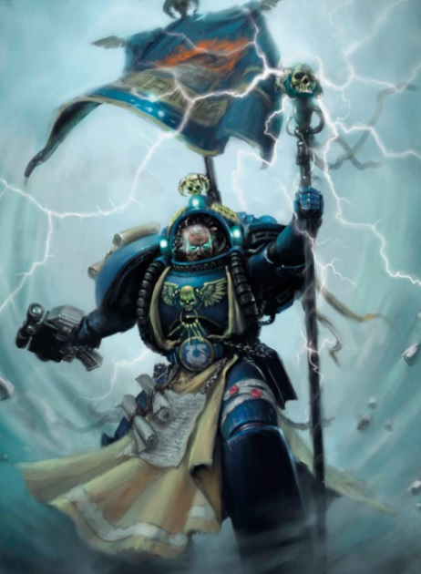
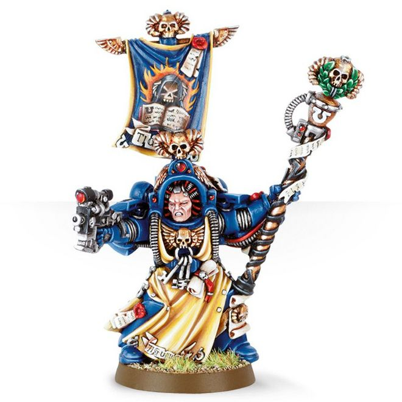
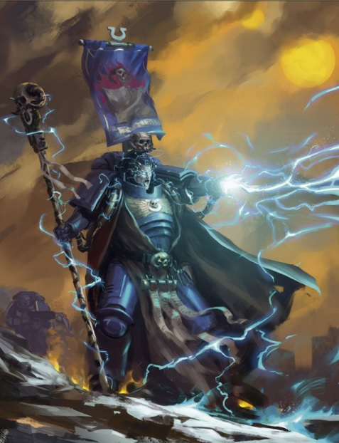
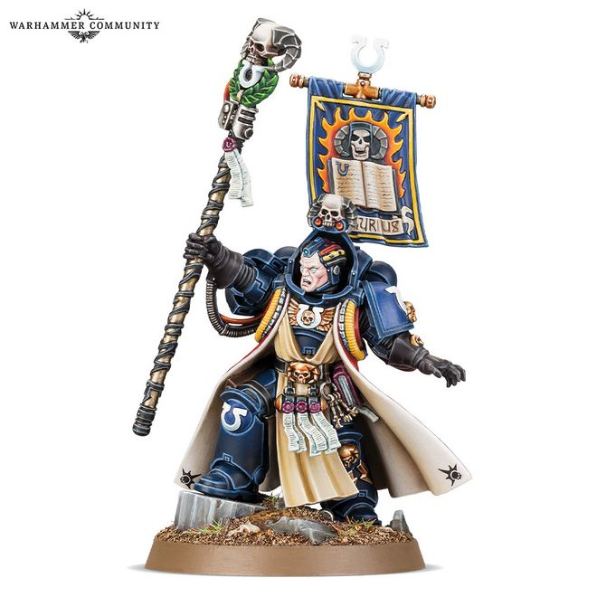

# 0685 瓦罗·狄格里斯 Varro Tigurius

精校状态：中文行文已逐段精校，部分术语仍为暂定

分类：人类帝国 / 极限战士

原文来源：https://www.bilibili.com/opus/1113577791720259585

原作者：帝国神选罐头

原文时间：2025年09月17日 20:50

[返回分类目录](目录.md) · [全书目录](../../目录.md)

<!-- A0685-B0001 -->
**英文原文**

It cannot be considered a gift, to peer into the Warp and unravel the possibilities of the future that are, that might be, and that must be prevented. Nor can the burden of a weapon, that each of my brothers looks upon with girded revulsion, be called a gift. No, Master, I do not think my psychic prowess a gift... but a tool. Whether by a quirk of fate, or the will of the Emperor, I possess a weapon the like of which can turn the tide, not just in a battle but in the course of history. To withhold it, to flinch from its use or deny it would not just be counter-productive, it would be heresy. But if it is a gift, it is a cruel one.

<!-- /A0685-B0001 -->

<!-- A0685-B0002 -->

原译文

它不能被视为一件礼物，窥探亚空间并解开未来的可能性，这可能被，也必须被阻止。我的每个兄弟都带着强烈的反感看待武器的负担，这也不能被称为礼物。不，战团长，我不认为我的灵能能力是礼物…只是一个工具。无论是命运的安排，还是帝皇的意愿，我都拥有一件武器，它不仅可以在战斗中，而且可以在历史进程中扭转局势。拒绝使用或否认它不仅会适得其反，还会成为异端。但如果这是一份礼物，那也是一份残酷的礼物。

**校订译文**

“窥视亚空间，辨明那些必将发生、可能发生，以及必须阻止的未来，这算不得恩赐。背负一件让每位兄弟都怀着戒心与反感看待的武器，也算不得恩赐。不，战团长，我不认为灵能力量是恩赐……它只是一件工具。无论出于命运的偶然，还是帝皇的意志，我都拥有足以扭转局势的武器；它改变的不仅是一场战斗，更可能是历史的进程。将它藏而不用，畏惧使用，或否认它的存在，不只会妨碍我们的事业，更是异端之举。但如果这真是一份恩赐，那也是残酷的恩赐。”

<!-- /A0685-B0002 -->

<!-- A0685-B0003 -->
**英文原文**

- from the journal of Marneus Calgar, quoting Tigurius, 991.M41.

<!-- /A0685-B0003 -->

<!-- A0685-B0004 -->

原译文

- 摘自马涅乌斯·卡尔加的日志，狄格里斯叙述，991.M41。

**校订译文**

——马涅乌斯·卡尔加日志所引狄格里斯之言，991.M41。

<!-- /A0685-B0004 -->

<!-- A0685-B0005 -->
**英文原文**

Varro Tigurius is the Chief Librarian of the Ultramarines. He was appointed to this role after many years of fighting, owing to his extensive knowledge of the Galaxy and his immense psychic powers.

<!-- /A0685-B0005 -->

<!-- A0685-B0006 -->

原译文

瓦罗·狄格里斯是极限战士的首席智库。经过多年的战斗，由于他对银河系的广泛了解和巨大的灵能力量，他被任命为这个角色。

**校订译文**

瓦罗·狄格里斯是极限战士的首席智库员。经历多年征战后，他凭借对银河的广博认识与强大灵能力量获任此职。

<!-- /A0685-B0006 -->

<!-- A0685-B0007 图片 -->

<!-- A0685-B0008 -->

原译文

Varro Tigurius, Chief Librarian of the Ultramarines 瓦罗·狄格里斯，极限战士的首席智库

**校订译文**

Varro Tigurius, Chief Librarian of the Ultramarines 瓦罗·狄格里斯，极限战士首席智库员

<!-- /A0685-B0008 -->

<!-- A0685-B0009 -->
## Biography 传记

<!-- /A0685-B0009 -->

<!-- A0685-B0010 -->
**英文原文**

Born on Macragge, Tigurius' parents submitted their son to the marshals of induction at the Fortress of Hera. He was quickly recognised as a psyker and use of his powers of foresight during training exercises was initially seen as cheating. During his Aspirant days his training overseer was Ortan Cassius. Eventually due to his supernaturally perceptive nature he was taken in by the Chapter Librarius, quickly becoming a Lexicanium. During his early years in the Chapter, Tigurius' insight and perceptiveness saved his battle-brothers on countless occasions, allowing him to rise through the ranks. His most notable early accomplishment was in the Altor Crusade. Later, serving in the 5th Company, he led a strike force against the Seven Sorcerers of Harka, using his psychic abilities to best all seven Sorcerers simultaneously. In the wake of the battle on Harka, Tigurius became famous within the Chapter, becoming close friends with Orestes and rising to the rank of Codicier. After aiding the Ultramarines fleet in predicting the movements of the Orks of Madbrakka and Hive Fleet Behemoth, Tigurius rose to the prestigious position of Chief Librarian.

<!-- /A0685-B0010 -->

<!-- A0685-B0011 -->

原译文

狄格里斯出生在马库拉格，他的父母将他们的儿子交给赫拉要塞的元帅。他很快被认定为一名灵能者，在训练中使用他的预见能力最初被视为作弊。在他的有志者时期，他的训练监督者是奥坦·卡西乌斯。最终，由于他超自然的洞察力，他被战团智库馆的人接受，很快成为了一名编修员。在战团的早些年，狄格里斯的洞察力和感知力在无数场合拯救了他的战斗兄弟，使他能够在队伍中晋升。他早期最著名的成就是在奥托尔远征中。后来，在第五连队服役时，他率领一支打击部队对抗哈尔卡的七位巫师，利用自己的灵能能力同时击败了所有七位巫师。在哈尔卡之战之后，狄格里斯在战团内变得出名，与俄瑞斯忒斯成为亲密的朋友，并晋升为典记员。在协助极限战士舰队预测疯狂的布拉卡的兽人和虫巢舰队贝希摩斯的动向后，狄格里斯升任首席智库这一崇高职位。

**校订译文**

狄格里斯出生于马库拉格，父母将他交给赫拉要塞负责招募的军官。他很快被识别为灵能者，起初，在训练中运用预知能力还被视为作弊。候选者时期，他的训练负责人是奥坦·卡西乌斯。他那超乎寻常的洞察力最终使他进入战团智库，并很快成为编修员。服役初期，他的敏锐判断无数次救下战斗兄弟，也让他不断晋升。其早期最显赫的功绩来自奥托尔远征。后来，他在第五连服役时率领打击部队讨伐哈尔卡七巫师，以灵能同时击败七名敌手。此战令他在战团中声名鹊起；他与俄瑞斯忒斯结为挚友，也升任典记员。此后，他帮助极限战士舰队预判疯布拉卡的欧克大军及贝希摩斯虫巢舰队的动向，最终获任地位崇高的首席智库员。

<!-- /A0685-B0011 -->

<!-- A0685-B0012 -->
**英文原文**

Since his induction, Varro Tigurius has always been a man apart; despite his decades of service to the Ultramarines and his unquestioned valour in combat, he lacks the camaraderie and easy familiarity found between other members of the Chapter, who regard him with emotions ranging from wariness to suspicion; such is the curse of being a psyker. Space Marine Librarians are the most rigorously screened and conditioned of all the psykers allowed to serve the Imperium; the smallest hint of corruption, and the Librarian may become a conduit for the evils of the Warp. Tigurius exemplifies this strict outlook. In his mind, there is nothing more dangerous than incomplete knowledge, or a mind untrained to absorb it. In person he says little and often answers questions with another question, seeking to lead his interrogator to discover the correct answer himself and realise the deeper meaning of the knowledge he receives. As a rule, the Ultramarines are warriors, not philosophers, and this habit of their Chief Librarian's is often an added source of tension.

<!-- /A0685-B0012 -->

<!-- A0685-B0013 -->

原译文

自上任以来，瓦罗·狄格里斯一直与众不同；尽管他在极限战士服役了几十年，在战斗中表现出了无可置疑的勇气，但他缺乏战团其他成员之间那种友爱和轻松的熟悉感，他们对他的态度从警惕到怀疑不等；这就是身为灵能者的诅咒。星际战士智库是所有被允许为帝国服务的灵能者中筛选和条件最严格的；即使是最微小的腐化迹象，智库也可能成为亚空间邪恶的传播渠道。狄格里斯体现了这种严格的观点。在他看来，没有什么比不完整的知识更危险的了，或者没有受过吸收知识训练的头脑。面对面，他很少说话，经常用另一个问题来回答问题，试图引导询问者自己发现正确的答案，并意识到他所获知识的更深层次的意义。一般来说，极限战士是战士，而不是哲学家，他们的首席智库的这种习惯往往是紧张局势的另一个来源。

**校订译文**

自加入战团以来，瓦罗·狄格里斯便始终与同袍保持着距离。尽管他已为极限战士效力数十年，战场勇气也毋庸置疑，却无法享有其他成员之间那种亲密无间、轻松自在的情谊；众人对他或心存戒备，或怀有疑虑——这便是灵能者的诅咒。在获准为帝国效力的灵能者中，星际战士智库员接受的筛选与精神训练最为严格，因为哪怕一丝腐化，都可能使他们沦为亚空间邪恶降临的通道。狄格里斯将这种谨慎贯彻到了极致。在他看来，没有什么比残缺的知识，或未经训练、无法驾驭知识的心智更危险。他平日寡言，常以问题回答问题，引导询问者自行找到答案，领会所得知识的深意。然而，极限战士终究大多是战士，而非哲学家；首席智库员的这一习惯，往往令彼此关系更加紧张。

<!-- /A0685-B0013 -->

<!-- A0685-B0014 图片 -->

<!-- A0685-B0015 -->

原译文

Varro Tigurius 瓦罗·狄格里斯

**校订译文**

Varro Tigurius 瓦罗·狄格里斯

<!-- /A0685-B0015 -->

<!-- A0685-B0016 -->
**英文原文**

Tigurius himself is unique among the Imperium's psykers, in that he has the ability to foresee tactical events and invasions by the enemy before they actually happen, giving Calgar the opportunity to counter them before they even begin. These mysterious premonitions usually come in the form of dreams or small seizures, but where most people would see this as a gift, there are a few within the Imperium that are suspicious and perceive it as delving into the dark ways of Chaos. However, the Chief Librarian's loyalty to the Emperor is clearly unquestionable, and his knowledge of the Galaxy, coupled with the prescience granted by his psychic ability, has proved invaluable to the Chapter time and time again. It was thanks to Tigurius that the war fleets of Warboss Madbrakka and Warmaster Niadar were annihilated the instant they emerged from the Warp, and their planned attacks on Ultramar came to nothing.

<!-- /A0685-B0016 -->

<!-- A0685-B0017 -->

原译文

狄格里斯自己在帝国的灵能者中是独一无二的，因为他有能力在战术事件和敌人的入侵实际发生之前预见到它们，让卡尔加有机会在它们开始之前就反击它们。这些神秘的预感通常以梦境或小疾病的形式出现，但在大多数人将其视为礼物的地方，帝国内部有一些人持怀疑态度，认为这是在探索混沌的黑暗方式。然而，首席智库对帝皇的忠诚显然是毋庸置疑的，他对银河系的了解，再加上他的灵能能力所赋予的先见之明，一次又一次地被证明对战团来说是无价的。多亏了狄格里斯，战争头目疯狂的布拉卡和战帅尼亚达尔的战争舰队在从亚空间中出来的那一刻就被歼灭了，他们对奥特拉马的袭击计划也化为泡影。

**校订译文**

狄格里斯能够在战事与敌军入侵发生前作出预见，让卡尔加抢先布置应对，这使他在帝国灵能者中显得格外突出。神秘的预感通常伴随梦境或短暂的痉挛发作而来。多数人视之为恩赐，帝国内部却仍有人怀疑他涉足了混沌的黑暗秘术。然而，这位首席智库员对帝皇的忠诚无可置疑；他对银河的广博认识与灵能预知，一再为战团带来无可估量的帮助。正因为他的预警，战争头目疯布拉卡与战帅尼亚达尔的舰队刚离开亚空间便被歼灭，袭击奥特拉玛的计划也随之化为乌有。

<!-- /A0685-B0017 -->

<!-- A0685-B0018 -->
**英文原文**

More than simply being able to foresee a threat, Tigurius can often see the shape of future events so clearly as to guide the Ultramarines' tactical dispositions to counter them. Marneus Calgar has said that, without Tigurius's counsel, Hive Fleet Behemoth would have overwhelmed the Ultramarines during the Battle for Macragge. He is one of the foremost experts on fighting Orks in the Imperium, and has guided Lord Calgar on the best ways to strike at the Ork empire of Charadon to prevent a fully formed Waaagh! from rampaging through the sector. As Chief Librarian, Tigurius is responsible for the Library of Ptolemy and the guardianship of its contents, including the manuscript of the Codex Astartes, penned by Roboute Guilliman himself. Tigurius' other accomplishments include being one of the very few to have witnessed the arrival of the mysterious Legion of the Damned. In battle, Tigurius's withdrawn manner disappears, replaced by the fury and valour of a true warrior. Using his psychic powers to devastating effect, Tigurius is an awesome sight, and has inspired exhausted Space Marines to new heights of valour, as shown during the Ork invasion of Boros, and during the Damnos Incident, when he assumed leadership of the 2nd Company after Captain Sicarius was critically wounded.

<!-- /A0685-B0018 -->

<!-- A0685-B0019 -->

原译文

狄格里斯不仅能够预见威胁，而且经常能够清楚地看到未来事件的轮廓，从而指导极限战士的战术部署来应对它们。马涅乌斯·卡尔加说，如果没有狄格里斯的建议，虫巢舰队贝希摩斯将在马库拉格之战中击败极限战士。他是帝国对抗欧克的最重要的专家之一，并指导卡尔加领主以最佳方式打击查拉顿的兽人帝国，以防止完全形成的Waaagh！对整个星区的肆虐。作为首席智库，狄格里斯负责托勒密图书馆及其内容的监护，包括罗伯特·基里曼本人撰写的《阿斯塔特圣典》的手稿。狄格里斯的其他成就包括成为少数目睹神秘咒缚军团到来的人之一。在战斗中，狄格里斯的沉默态度消失了，取而代之的是真正战士的愤怒和勇气。狄格里斯利用他的灵能力量产生了毁灭性的影响，这是一个令人敬畏的景象，并激励疲惫的星际战士达到了新的英勇高度，正如在欧克入侵博罗斯期间和达姆诺斯事件期间所示，当时他在西卡留斯连长受重伤后担任第二连对的领导者。

**校订译文**

狄格里斯不只能够预见威胁，还常能清楚辨明未来的发展，指导极限战士作出相应战术部署。卡尔加曾说，若没有他的建议，极限战士便会在马库拉格之战中被贝希摩斯虫巢舰队吞没。他也是帝国最精通对抗欧克的专家之一，曾指导卡尔加打击查拉顿欧克帝国，避免一场成形的Waaagh!席卷整个星区。作为首席智库员，他负责管理托勒密图书馆并守护馆藏，其中包括罗保特·基里曼亲笔撰写的《阿斯塔特圣典》手稿。他还是少数亲眼见过神秘诅咒军团降临的人之一。一旦投入战斗，平日的沉默疏离便会消失，取而代之的是真正战士的愤怒与勇气。他施展灵能时威势骇人，足以激励疲惫的星际战士重燃斗志。欧克入侵博罗斯时如此；达姆诺斯事件中，西卡留斯连长重伤后，他接掌第二连指挥权时也同样如此。

<!-- /A0685-B0019 -->

<!-- A0685-B0020 -->
**英文原文**

In recent years, Tigurius has turned his powers towards the Tyranid Hive Fleets menacing the Imperium. The sheer accuracy of his predictions about the movement and intents of the Great Devourer have led many to believe that Tigurius has managed to penetrate the Hive Mind itself, something only a psyker as powerful as the Emperor could withstand without going insane. If this is true, then Tigurius may well be the most powerful active psyker in the Imperium, second only to the Immortal God Emperor himself.

<!-- /A0685-B0020 -->

<!-- A0685-B0021 -->

原译文

近年来，狄格里斯将他的力量转向了威胁帝国的泰伦虫巢舰队。他对大吞噬者的移动和意图的预测非常准确，这让许多人相信狄格里斯已经设法穿透了虫巢思维本身，只有像帝皇一样强大的灵能者才能承受而不会发疯。如果这是真的，那么狄格里斯很可能是帝国中最强大的活跃灵能者，仅次于永生者神皇本人。

**校订译文**

近年来，狄格里斯将力量用于应对威胁帝国的泰伦虫巢舰队。他对大吞噬者行动及意图的预测精准得惊人，因此许多人相信，他已成功探入虫巢意志本身——据说唯有帝皇那般强大的灵能者，才能承受这种接触而不陷入疯狂。如果推测属实，狄格里斯便可能是帝国现役灵能者中最强大的一位，仅次于不朽的神皇本人。

**校注：** 最强灵能者之说在原文中以接触虫巢意志的推测为前提，译文保留条件，不改写为确定排名。

<!-- /A0685-B0021 -->

<!-- A0685-B0022 -->
### Invasion of Ultramar 入侵奥特拉玛

<!-- /A0685-B0022 -->

<!-- A0685-B0023 -->
**英文原文**

Arguably Tigurius's finest moment came during the Invasion of Ultramar in 854999.M41. Although he failed to foresee the arrival of the Chaos force known as the Bloodborn, his prescience allowed him to dictate the disposition of the Chapter's forces in a manner that eventually led to victory.

<!-- /A0685-B0023 -->

<!-- A0685-B0024 -->

原译文

可以说，狄格里斯最辉煌的时刻发生在854999.M41的奥特拉玛入侵期间。尽管他未能预见到被称为血裔的混沌部队的到来，但他的先见之明使他能够以最终导致胜利的方式支配战团部队的部署。

**校订译文**

狄格里斯最辉煌的功绩，或许当属854999.M41奥特拉玛遭入侵之时。虽然他未能预见名为血裔的混沌军队来袭，但凭借预知能力，他为战团安排了最终导向胜利的兵力部署。

<!-- /A0685-B0024 -->

<!-- A0685-B0025 -->
**英文原文**

Tigurius himself accompanied Marneus Calgar and First Captain Agemman to Talassar, where his abilities were crucial in holding the fortress of Castra Tanagra secure from repeated waves of daemonic creatures. During each of these attacks, Tigurius grew weaker, as each use of his psychic abilities to combat the daemons weakened him more quickly than his advanced physiology could recover from. After weeks of siege, the outer wall of the fort was overrun, but Tigurius marshaled his power into one gigantic blast of power that drove the daemons back and created a psychic barrier that kept the daemons at bay, allowing the First Company to fall back to the inner keep. Tigurius himself fell into a coma and hovered near death for the next several weeks, with no Apothecary present who could tend to him.

<!-- /A0685-B0025 -->

<!-- A0685-B0026 -->

原译文

狄格里斯亲自陪同马涅乌斯·卡尔加和第一连长阿格曼前往塔拉萨，在那里，他的能力对于保护卡斯特拉·塔纳格拉堡垒免受恶魔生物的反复袭击至关重要。在每次攻击中，狄格里斯都变得越来越虚弱，因为每次使用他的灵能能力来对抗恶魔都会比他先进的生理机能恢复得更快地削弱他。经过数周的围攻，堡垒的外墙被攻陷，但狄格里斯将他的力量集结成一股巨大的力量，将恶魔击退，并创造了一道灵能屏障，将恶魔拒之门外，使第一连队能够退回要塞内部。狄格里斯本人陷入昏迷，在接下来的几周里徘徊在死亡边缘，没有药剂师在场可以照顾他。

**校订译文**

狄格里斯随卡尔加与第一连连长阿格曼前往塔拉萨，以灵能力量守护卡斯特拉·塔纳格拉堡垒，抵挡一波又一波恶魔攻势。每次交战都令他更加虚弱：施展灵能对抗恶魔的消耗，远超他强化体魄的恢复速度。围攻持续数周后，外墙终于失守；他聚起力量，发出一次巨大的灵能冲击，逼退恶魔，又竖起屏障阻挡追兵，让第一连得以退守内堡。他自己则陷入昏迷，此后数周始终徘徊于死亡边缘，身边却没有药剂师能够施救。

<!-- /A0685-B0026 -->

<!-- A0685-B0027 -->
**英文原文**

When the Chief Librarian was at his lowest ebb, the barrier fell, and the Daemon Prince M'kar arrived in person to invade the fortress and kill Calgar. The Daemon critically wounded Captain Agemman and held Calgar helpless, but just then Tigurius regained consciousness. Though he was too weak to move his own limbs, a dozen courageous human refugees supported his weight and helped him to the scene of the combat, where he issued a psychic blast that drove the Daemon from the fortress and severed its connection with the warp core of the star fort Indomitable in orbit. He bought Calgar and the survivors of the First Company the brief respite they needed to rally for a final charge against the Daemon.

<!-- /A0685-B0027 -->

<!-- A0685-B0028 -->

原译文

当首席智库处于最低潮时，屏障倒塌了，恶魔王子姆'卡亲自入侵堡垒并杀向了卡尔加。恶魔重伤了阿格曼连长，并使卡尔加无助，但就在那时，狄格里斯恢复了意识。虽然他太虚弱了，无法移动自己的四肢，但十几名勇敢的人类难民支撑着他的体重，帮助他到达战斗现场，在那里，他发出了一次灵能爆破，将恶魔赶出了堡垒，并切断了它与轨道上的星堡不屈号的亚空间核心的连接。他为卡尔加和第一连队的幸存者提供了短暂的喘息机会，让他们团结起来对恶魔进行最后的冲锋。

**校订译文**

首席智库员衰弱到极点时，屏障崩溃，恶魔亲王姆’卡尔亲自闯入堡垒，企图杀死卡尔加。它重伤阿格曼，又制住卡尔加，令其无力反抗。就在此时，狄格里斯恢复了意识。他虚弱得连四肢也无法移动，十二名勇敢的人类难民便合力支撑他的身体，将他送到交战现场。他发出灵能冲击，将恶魔逐出堡垒，并斩断它与轨道上不屈号星堡亚空间核心的联系。由此争取的短暂喘息，让卡尔加和第一连幸存者得以重整队伍，准备最后的冲锋。

<!-- /A0685-B0028 -->

<!-- A0685-B0029 -->
**英文原文**

Before the battle, Tigurius had predicted that Captain Uriel Ventris, recently returned from a Death Oath to the Eye of Terror, would play a crucial part in the battle's outcome. He was correct; Ventris and the 4th Company of the Ultramarines arrived from Calth, bearing the true name of M'kar, and the ancient dagger that had taken his mortal life. Armed with these, Calgar destroyed the essence of the Daemon, granting it a True death, and the Ultramarines were victorious.

<!-- /A0685-B0029 -->

<!-- A0685-B0030 -->

原译文

在战斗之前，狄格里斯曾预测，最近从恐惧之眼的死亡誓言中归来的乌瑞尔·文崔斯连长将在战斗的结果中发挥至关重要的作用。他是对的；文崔斯和第四连队的极限战士从考斯抵达，带来了姆'卡的真名，还有夺走他生命的古老匕首。有了这些武器，卡尔加摧毁了恶魔的本质，让它真正死亡，极限战士取得了胜利。

**校订译文**

战前，狄格里斯预言，刚从恐惧之眼执行死亡誓言归来的乌瑞尔·文崔斯连长，会对战局发挥决定性作用。事实证明他是对的：文崔斯与第四连从考斯赶来，带来了姆’卡尔的真名，以及当年夺走其凡人性命的古老匕首。卡尔加凭借这两者摧毁恶魔的本质，使它真正死去，极限战士由此获胜。

<!-- /A0685-B0030 -->

<!-- A0685-B0031 -->
### Rise of the Primarch 原体的崛起

<!-- /A0685-B0031 -->

<!-- A0685-B0032 -->
**英文原文**

Despite his marvelous psychic abilities, Tigurius couldn't predict the appearance of the Great Rift, only feeling the approach of an inexorable doom. After the psychic backlash of that galactic catastrophe, Tigurius was near death but managed to overcome his mind-coma and joined the defence of Ultramar.

<!-- /A0685-B0032 -->

<!-- A0685-B0033 -->

原译文

尽管狄格里斯拥有非凡的灵能能力，但他无法预测大裂隙的出现，只能感觉到一场无情的厄运即将到来。在那场银河灾难的灵能反弹之后，狄格里斯濒临死亡，但他设法克服了精神昏迷，加入了奥特拉玛的防御。

**校订译文**

狄格里斯虽拥有非凡灵能，却仍未能预见大裂隙出现，只感到一场无可阻挡的灾厄正在逼近。这场银河巨变造成的灵能反冲使他濒临死亡，但他最终挣脱精神昏迷，加入奥特拉玛保卫战。

<!-- /A0685-B0033 -->

<!-- A0685-B0034 图片 -->

<!-- A0685-B0035 -->

原译文

Tigurius as a Primaris Space Marine 作为原铸星际战士的瓦罗·狄格里斯

**校订译文**

Tigurius as a Primaris Space Marine 作为原铸星际战士的瓦罗·狄格里斯

<!-- /A0685-B0035 -->

<!-- A0685-B0036 -->
**英文原文**

During the Ultramar Campaign, Macragge again fell under Chaos invasion, this time by the Black Legion. During the fighting, Tigurius convinced Marneus Calgar to accept the plan by Belisarius Cawl to try and resurrect Roboute Guilliman, for the Chief Librarian had been haunted by grave visions and knew desperate measures were required. After Guilliman's resurrection, Tigurius was left behind in Ultramar by the Primarch along with Calgar to defeat the remaining Chaos forces.

<!-- /A0685-B0036 -->

<!-- A0685-B0037 -->

原译文

在奥特拉玛战役中，马库拉格再次被混沌入侵，这次是被黑色军团入侵。在战斗中，狄格里斯说服马涅乌斯·卡尔加接受贝利萨留·考尔的计划，试图复活罗伯特·基里曼，因为首席智库一直被严重的幻象所困扰，知道需要采取绝望的措施。基里曼复活后，狄格里斯与卡尔加一起被原体留在奥特拉玛，以击败剩余的混沌部队。

**校订译文**

奥特拉玛战役期间，马库拉格再次遭混沌入侵，这次来敌是黑色军团。狄格里斯不断受到不祥异象困扰，明白必须孤注一掷，于是说服卡尔加接受贝利萨留斯·考尔的计划，尝试复苏罗保特·基里曼。原体苏醒后，让他与卡尔加留守奥特拉玛，消灭残余混沌势力。

<!-- /A0685-B0037 -->

<!-- A0685-B0038 -->
**英文原文**

Acting on the orders of Guilliman, Tigurius later undertook a psychic ritual that resulted in the deaths of many of his Epistolaries. The ritual allowed him to astrally project himself into Calgar's dreams, giving the Chapter Master Guilliman's order that Vigilus could not be allowed to fall at any cost. Calgar sensed that his old friend had grown weary and ragged from the last time they met, perhaps due to the psychic strain caused by both the Great Rift and his exposure to the Hive Mind.

<!-- /A0685-B0038 -->

<!-- A0685-B0039 -->

原译文

根据基里曼的命令，狄格里斯后来进行了一场灵能仪式，导致他的许多星语官死亡。这个仪式让他能够将自己投射到卡尔加的梦中，给了战团长基里曼的一个命令，即无论如何都不能让警戒星倒下。卡尔加感觉到，自从上次见面以来，他的老朋友已经疲惫不堪，衣衫褴褛，也许是因为大裂隙和他接触虫巢思维造成的精神压力。

**校订译文**

后来，狄格里斯奉基里曼之命举行灵能仪式，许多协助他的星语官因此丧命。仪式使他得以将自己的灵体投射进卡尔加梦中，向战团长转达基里曼的命令：不惜一切代价守住警戒星。卡尔加察觉，老友比上次见面时更加疲惫憔悴；这或许是大裂隙以及接触虫巢意志带来的精神重压所致。

**校注：** Epistolaries 沿统一职衔星语官，与 Astropath 星语者不同；ragged 在疲惫语境指憔悴，不必落实为衣衫破烂。

<!-- /A0685-B0039 -->

<!-- A0685-B0040 -->
### Dark Imperium 黑暗帝国

<!-- /A0685-B0040 -->

<!-- A0685-B0041 -->
**英文原文**

During the creation of the Great Rift, Tigurius was overcome by the psychic force of the disaster and slipped into a coma, though he eventually broke out of it through sheer strength of mind, joining the defense of Ultramar in the Plague Wars. At some point, Tigurius was converted into a Primaris Space Marine.

<!-- /A0685-B0041 -->

<!-- A0685-B0042 -->

原译文

在大裂隙的创造过程中，狄格里斯被灾难的灵能力量所征服，陷入昏迷，尽管他最终凭借纯粹的意志力摆脱了昏迷，在瘟疫战争中加入了奥特拉玛的防御。在某个时刻，狄格里斯被转变成了原铸星际战士。

**校订译文**

大裂隙形成时，灾难性的灵能冲击使狄格里斯陷入昏迷。他最终凭借强大的意志苏醒，并在瘟疫战争中参与奥特拉玛防御。在这段时期的某个时点，他还接受了原铸星际战士改造。

<!-- /A0685-B0042 -->

<!-- A0685-B0043 图片 -->

<!-- A0685-B0044 -->

原译文

Varro Tigurius 瓦罗·狄格里斯

**校订译文**

Varro Tigurius 瓦罗·狄格里斯

<!-- /A0685-B0044 -->

<!-- A0685-B0045 -->
**英文原文**

During the Plague Wars, Tigurius oversaw the quarantine of the Library of Ptolemy and much of the defense of Macragge from the forces of Chaos. When the Great Unclean One, Rotigus manifested before the Remembrancer Fabian Guelphrain inside the Library, Tigurius appeared to save him. He engaged Rotigus in a brief battle before the Daemon retreated, having fulfilled his goal to tempt the historian with a tome that contained the history of Imperium Secundus.

<!-- /A0685-B0045 -->

<!-- A0685-B0046 -->

原译文

在瘟疫战争期间，狄格里斯监督了托勒密图书馆的隔离，并对马库拉格的大部分防御工作进行了监督。当大不净者罗提古斯出现在图书馆内的记述者法比安·圭尔弗兰面前时，狄格里斯似乎救了他。在恶魔撤退之前，他与罗提古斯进行了一场短暂的战斗，完成了用一本包含第二帝国的历史的巨著吸引历史学家的目标。

**校订译文**

瘟疫战争期间，狄格里斯负责托勒密图书馆的隔离措施，并统筹马库拉格抵御混沌的大量防务。大不净者烂格斯在馆内现身于记述者法比安·圭尔弗兰面前时，狄格里斯赶来相救。两者短暂交手后，恶魔便退走了：它已达成目的，成功用一部记载第二帝国历史的书籍诱惑了这位历史学家。

**校注：** 以书籍诱惑历史学家并完成目的的是恶魔烂格斯，并非狄格里斯；appeared 是现身，不是似乎。Rotigus 依官译烂格斯，原稿罗提古斯。

<!-- /A0685-B0046 -->

<!-- A0685-B0047 -->
**英文原文**

During the Arks of Omen Campaign, Tigurius was leading Task Force XII of Fleet Primus to relieve Marwent's Reach when nearby, The Rock was assailed by the forces of Vashtorr. Tigurius led his forces to help relieve the Dark Angels.

<!-- /A0685-B0047 -->

<!-- A0685-B0048 -->

原译文

在噩兆方舟战役期间，狄格里斯率领第一舰队第十二特遣部队在附近营救马尔温特河段，此时巨石遭到了瓦什托尔部队的袭击。狄格里斯率领他的部队帮助解救黑暗天使。

**校订译文**

噩兆方舟战役期间，狄格里斯正率领第一舰队的第十二特遣部队驰援马尔温特疆域星。附近的巨石要塞此时遭到瓦什托尔军队袭击，于是他转而率部援救黑暗天使。

**校注：** Marwent’s Reach 为世界名称，按635既定马尔温特疆域星，非现实河段。

<!-- /A0685-B0048 -->

<!-- A0685-B0049 -->
## Wargear and Equipment 战备与装备

<!-- /A0685-B0049 -->

<!-- A0685-B0050 -->
**英文原文**

Tigurius wears the Hood of Hellfire, a modified Librarian hood which massively enhances his psychic abilities, and carries the Rod of Tigurius, a Bolt Pistol, and Frag and Krak Grenades. In his back he carry a Tigurius' Banner - the standart of his own iconography. Other his common items include:

<!-- /A0685-B0050 -->

<!-- A0685-B0051 -->

原译文

狄格里斯戴着狱火护罩，这是一种经过改装的智库护罩，极大地提高了他的灵能能力，并携带了狄格里斯之杖、爆矢手枪、破片和穿甲手榴弹。他背着一幅狄格里斯之旗 — 这是他自己肖像画的旗帜。他的其他常见道具包括：

**校订译文**

狄格里斯佩戴经过改装、能大幅增强灵能的“狱火护罩”，携带狄格里斯之杖、爆矢手枪、破片手榴弹与穿甲手榴弹。他背后还竖着绘有个人纹章的狄格里斯战旗。其他常见物品包括：

<!-- /A0685-B0051 -->

<!-- A0685-B0052 -->
**英文原文**

Librarius Keys:

<!-- /A0685-B0052 -->

<!-- A0685-B0053 -->

原译文

智库钥匙

**校订译文**

智库钥匙

<!-- /A0685-B0053 -->

<!-- A0685-B0054 -->
**英文原文**

Ancient Keys to the Library of Ptolemy

<!-- /A0685-B0054 -->

<!-- A0685-B0055 -->

原译文

托勒密图书馆的古代钥匙

**校订译文**

托勒密图书馆的古代钥匙

<!-- /A0685-B0055 -->

<!-- A0685-B0056 -->
**英文原文**

Gene-coded blood key and psychic-reactive key to the Arcanium

<!-- /A0685-B0056 -->

<!-- A0685-B0057 -->

原译文

隐秘圣堂的基因编码血液钥匙和灵能反应钥匙

**校订译文**

隐秘圣堂的基因编码血液钥匙和灵能反应钥匙

<!-- /A0685-B0057 -->

<!-- A0685-B0058 -->
**英文原文**

Key to the stasis casket holding Guilliman's Codex Astartes

<!-- /A0685-B0058 -->

<!-- A0685-B0059 -->

原译文

存放基里曼《阿斯塔特圣典》的静滞棺的钥匙

**校订译文**

存放基里曼《阿斯塔特圣典》的静滞匣钥匙。

<!-- /A0685-B0059 -->

<!-- A0685-B0060 -->
**英文原文**

In 922.M41 after the Battle of Andraxas, Tigurius came in possession of what is suspected to have been the Force Staff of Malcador the Sigillite.

<!-- /A0685-B0060 -->

<!-- A0685-B0061 -->

原译文

922.M41，安德拉克萨斯之战后，狄格里斯获得了疑似是掌印者马卡多的灵能杖。

**校订译文**

922.M41，安德拉克萨斯之战后，狄格里斯获得了疑似是掌印者马卡多的灵能杖。

<!-- /A0685-B0061 -->

本篇核心术语与暂定项

以下列出本篇出现的英文原形及核心术语表用词。同形词可能指不同对象，具体词义以本篇正文和校注为准；单复数、别名和仅见于图注的名称可能尚未列入。完整候选见[术语表](../../术语表/双语术语候选.csv)。

| 英文 | 采用中文 | 状态 |
| --- | --- | --- |
| Space Marines | 星际战士 | 官方已核对 |
| Dark Angels | 黑暗天使 | 官方已核对 |
| Orks | 欧克蛮人 | 官方已核对 |
| Psyker | 灵能者 | 官方已核对 |
| Librarian | 智库员 | 官方已核对 |
| Bolt Pistol | 爆矢手枪 | 官方已核对 |
| Roboute Guilliman | 罗保特·基里曼 | 官方已核对 |
| Ultramar | 奥特拉玛 | 官方已核对 |
| Ultramarines | 极限战士 | 官方已核对 |
| Warp | 亚空间 | 官方已核对 |
| Great Rift | 大裂隙 | 官方已核对 |
| Imperium | 帝国 | 暂定·简称 |
| Waaagh! | Waaagh! | 暂定·保留原文 |
| Hive Mind | 虫巢意志 | 官方已核对 |
| Librarius | 智库（机构）／智库学派（灵能学派） | 语境定译·官方待核 |
| History | 历史 | 编辑用语已统一 |
| Eye of Terror | 恐惧之眼 | 官方已核对 |
| Emperor | 帝皇 | 官方已核对 |
| Primarch | 原体 | 官方已核对 |
| Daemon Prince | 恶魔亲王 | 官方已核对 |
| Black Legion | 黑色军团 | 暂定·官方待核 |
| Plague Wars | 瘟疫战争 | 暂定·官方待核 |
| Sector | 星区 | 暂定·官方待核 |
| Malcador the Sigillite | 掌印者马卡多 | 暂定·官方待核 |
| Deeper | 深人 | 暂定·官方待核 |
| Calth | 考斯 | 暂定·官方待核 |
| Damnos | 达蒙斯 | 暂定·官方待核 |
| Macragge | 马库拉格 | 暂定·官方待核 |
| Vigilus | 警戒星 | 暂定·官方待核 |
| Imperium Secundus | 第二帝国 | 暂定·官方待核 |
| Codicier | 典记员 | 暂定·官方待核 |
| Chief Librarian | 首席智库员 | 暂定·官方待核 |
| Master | 导师（审判庭职衔）／舰务官（舰员职务） | 语境定译·官方待核 |
| Lexicanium | 编修员 | 暂定·官方待核 |
| Apothecary | 药剂师 | 官方已核对 |
| Ancient | 旗手 | 官方已核对 |
| Belisarius Cawl | 贝利萨留斯·考尔 | 官方已核对 |
| Aspirant | 候补骑士 | 暂定·官方待核 |
| The Sigillite | 掌印者 | 暂定·官方待核 |
| First Captain | 第一连长 | 暂定·官方待核 |
| Overseer | 监督者 | 暂定·官方待核 |
| Krak Grenades | 穿甲手榴弹 | 暂定·官方待核 |
| Space Marine | 星际战士 | 暂定·官方待核 |
| Chapter | 战团 | 暂定·官方待核 |
| Chapter Master | 战团长 | 暂定·官方待核 |
| Captain | 连长 | 暂定·官方待核 |
| Primaris Space Marine | 原铸星际战士 | 暂定·官方待核 |
| Marneus Calgar | 马涅乌斯·卡尔加 | 暂定·官方待核 |
| Varro Tigurius | 瓦罗·狄格里斯 | 暂定·官方待核 |
| Ortan Cassius | 奥坦·卡西乌斯 | 暂定·官方待核 |
| Uriel Ventris | 乌瑞尔·文崔斯 | 官方已核 |
| Codex Astartes | 阿斯塔特圣典 | 暂定·官方待核 |
| Legion of the Damned | 诅咒军团 | 暂定·官方待核 |
| Mortal | 凡人 | 暂定·官方待核 |
| The Library of Ptolemy | 托勒密图书馆 | 暂定·官方待核 |
| Powers | 能天使 | 暂定·官方待核 |
| Great Unclean One | 大不净者 | 官方已核对 |
| Rotigus | 烂格斯 | 官方已核对 |
| Warboss | 战争头目 | 官方已核对 |
| Charadon | 查拉顿 | 暂定·官方待核 |
| The Great Devourer | 大吞噬者 | 暂定·官方待核 |
| Primus | 领军 | 官方已核对 |
| Strain | 群系 | 暂定·官方待核 |
| Epistolaries | 星语官 | 暂定·官方待核 |
| Ptolemy | 托勒密 | 暂定·官方待核 |
| Talassar | 塔拉萨 | 暂定·官方待核 |
| Marwent's Reach | 马尔温特疆域星 | 暂定·官方待核 |
| The Dark | 《黑暗》 | 暂定·官方待核 |
| Bloodborn | 血裔 | 暂定·官方待核 |
| Fortress of Hera | 赫拉要塞 | 暂定·官方待核 |
| Orestes | 俄瑞斯忒斯 | 暂定·官方待核 |
| Madbrakka | 疯布拉卡 | 暂定·官方待核 |
| Niadar | 尼亚达尔 | 暂定·官方待核 |
| Altor Crusade | 奥托尔远征 | 暂定·官方待核 |
| Seven Sorcerers of Harka | 哈尔卡七巫师 | 暂定·官方待核 |
| Fabian Guelphrain | 法比安·圭尔弗兰 | 暂定·官方待核 |
| Hood of Hellfire | 狱火护罩 | 暂定·官方待核 |
| Rod of Tigurius | 狄格里斯之杖 | 暂定·官方待核 |
| Arcanium | 隐秘圣堂 | 暂定·官方待核 |
| Corruption | 腐败 | 暂定·官方待核 |
| Force Staff | 灵能权杖 | 暂定·官方待核 |
| Omen | 预兆号 | 暂定·官方待核 |
| Bolt | 爆矢 | 暂定·官方待核 |
| Invasion of Ultramar | 入侵奥特拉玛 | 暂定·官方待核 |

