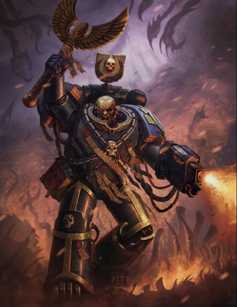
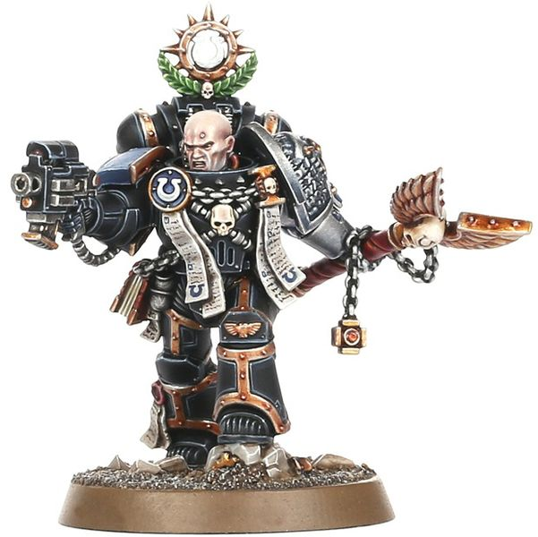
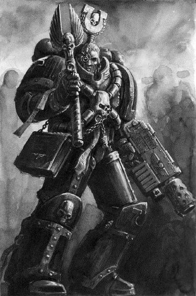
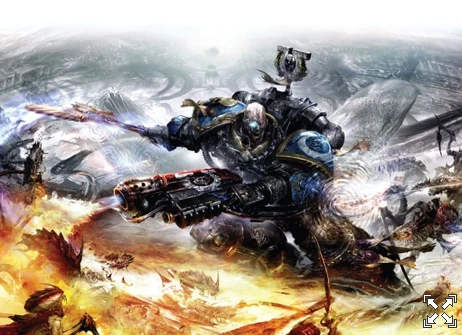
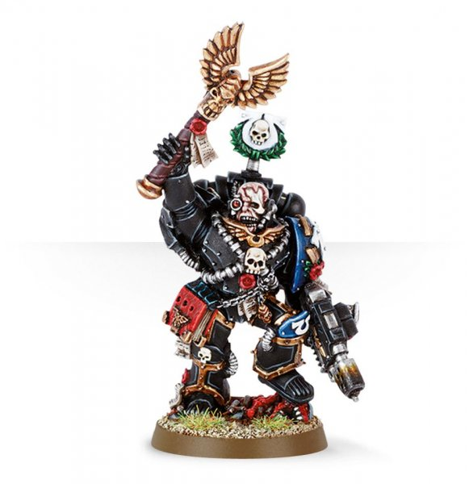

# 0686 奥坦·卡西乌斯 Ortan Cassius

精校状态：中文行文已逐段精校，部分术语仍为暂定

分类：人类帝国 / 极限战士

原文来源：https://www.bilibili.com/opus/1113590427498315785

原作者：帝国神选罐头

原文时间：2025年09月17日 21:39

[返回分类目录](目录.md) · [全书目录](../../目录.md)

<!-- A0686-B0001 -->
**英文原文**

Ortan Cassius is Master of Sanctity of the Ultramarines.

<!-- /A0686-B0001 -->

<!-- A0686-B0002 -->

原译文

奥坦·卡西乌斯是极限战士的圣洁导师。

**校订译文**

奥坦·卡西乌斯是极限战士的圣洁导师。

<!-- /A0686-B0002 -->

<!-- A0686-B0003 图片 -->

<!-- A0686-B0004 -->

原译文

Ortan Cassius 奥坦·卡西乌斯

**校订译文**

Ortan Cassius 奥坦·卡西乌斯

<!-- /A0686-B0004 -->

<!-- A0686-B0005 -->
**英文原文**

At almost four hundred years old, Cassius is the oldest member of the Ultramarines Chapter (excluding those interred inside Dreadnoughts). He has perfected his oratory skills to allow the Ultramarines to be carried across hundreds of worlds by his command alone.

<!-- /A0686-B0005 -->

<!-- A0686-B0006 -->

原译文

卡西乌斯年近四百岁，是极限战士战团最年长的成员（不包括埋葬在无畏内的成员）。他已经完善了自己的演讲技巧，使他能够独自指挥极限战士穿越数百个世界。

**校订译文**

卡西乌斯年近四百岁，是极限战士战团中最年长的成员，不计安置于无畏机甲内的战士。他的演说炉火纯青，仅凭号召便能激励极限战士在数百个世界上奋勇征战。

**校注：** interred inside Dreadnoughts 指重伤战士安置于无畏机甲中，并非普通意义的埋葬；演说激励作战也不是本人独自指挥跨越数百世界。

<!-- /A0686-B0006 -->

<!-- A0686-B0007 -->
## Biography 传记

<!-- /A0686-B0007 -->

<!-- A0686-B0008 -->
**英文原文**

Cassius was inducted into the Chaplaincy very early into his career. Despite his relative inexperience, many Battle-Brothers were inspired by his righteous hatred for the enemies of mankind, although some of the Chapter's seasoned veterans considered him somewhat reckless and overly aggressive.

<!-- /A0686-B0008 -->

<!-- A0686-B0009 -->

原译文

卡西乌斯在职业生涯早期就被任命为牧师。尽管他相对缺乏经验，但许多战斗兄弟都受到了他对人类之敌的正义仇恨的启发，尽管该战团的一些经验丰富的老兵认为他有点鲁莽和过于有侵略性。

**校订译文**

卡西乌斯服役之初便加入教士行列。他虽经验尚浅，对人类之敌那份义愤与仇恨却鼓舞了许多战斗兄弟；不过，一些资深老兵也认为他略显鲁莽、过于好斗。

<!-- /A0686-B0009 -->

<!-- A0686-B0010 -->
**英文原文**

Sometime before the Tyrannic Wars, Cassius joined the Deathwatch for a time and helped purge Genestealer Cults on Ghosar Quintus, the Imperium's first major encounter with such xenos cabals. During the operation he formed his own legendary Kill Team.

<!-- /A0686-B0010 -->

<!-- A0686-B0011 -->

原译文

在泰伦战争之前的某个时候，卡西乌斯加入了死亡守望组织一段时间，并帮助在戈萨尔五号上清除了基因窃取者教派，这是帝国与这些异型阴谋集团的第一次重大遭遇。在行动中，他组建了自己的传奇杀戮小队。

**校订译文**

泰伦战争前的一段时期，卡西乌斯曾赴死亡守望服役，参与清剿戈萨尔五号的基因窃取者教派。这被记作帝国与此类异形秘密组织的首次重大交锋。行动中，他组建了后来声名赫赫的杀戮小队。

<!-- /A0686-B0011 -->

<!-- A0686-B0012 图片 -->

<!-- A0686-B0013 -->

原译文

Cassius in the Deathwatch 死亡守望里的卡西乌斯

**校订译文**

Cassius in the Deathwatch 死亡守望里的卡西乌斯

<!-- /A0686-B0013 -->

<!-- A0686-B0014 -->
**英文原文**

During the Battle for Macragge, Cassius fought by the side of Chapter Master Marneus Calgar, to repel Hive Fleet Behemoth. During the last stages of the Battle, he accompanied the relief force that rushed to the polar fortresses to relieve the embattled First Company, though it was already too late for these veterans. Few members of Cassius's unit survived the brutal close-quarters combat that followed, and Cassius himself was incapacitated by a rampaging Carnifex. He survived by only the slimmest of margins, clinging to life until the Apothecaries could tend to his ruined body, which was extensively rebuilt with bionic parts. Scarcely a centimetre of his remaining organic flesh is free of scars, and while his voice has lost none of its fervour, his bionic components can never fully compensate for the rents torn in his throat.

<!-- /A0686-B0014 -->

<!-- A0686-B0015 -->

原译文

在马库拉格之战中，卡西乌斯与战团长马涅乌斯·卡尔加并肩作战，击退了虫巢舰队贝希摩斯。在战斗的最后阶段，他陪同救援部队赶往极地堡垒，以解救四面楚歌的第一连队，尽管对这些老兵来说已经太晚了。卡西乌斯部队中几乎没有成员在随后的残酷近距离战斗中幸存下来，卡西乌斯本人也被狂暴的刽子手击溃。他只以微弱的优势幸存下来，一直维持生命，直到药剂师能够照料他被毁坏的身体，他的身体被仿生部件大规模重建。他剩下的有机肉体几乎没有一厘米没有疤痕，虽然他的声音没有失去激情，但他的仿生组件永远无法完全弥补喉咙撕裂的伤口。

**校订译文**

马库拉格之战期间，卡西乌斯与战团长卡尔加并肩作战，抵御贝希摩斯虫巢舰队。战事末期，他随援军赶赴极地堡垒，试图解救被围的第一连，却已来不及救下那些老兵。随后的近距离搏杀极为惨烈，他率领的小队仅有少数人幸存；他自己也被一头狂暴的刽子手重创，失去战斗能力。他仅凭一线生机坚持到药剂师赶来，随后以大量仿生部件重建了残破身躯。他剩余的血肉几乎无一处没有伤疤；虽仍能慷慨激昂地发声，机械部件却始终无法完全弥补喉咙遭撕裂的损伤。

**校注：** 此处 Carnifex 为泰伦生物，刽子手对应官方复数单位 Carnifexes，区别药剂师同名医疗器械。

<!-- /A0686-B0015 -->

<!-- A0686-B0016 -->
**英文原文**

After the Tyranid invasion had been repulsed, Cassius withdrew the Banner of Macragge and only allowed it back onto the field after the Ultramarines' strength had been fully restored to their former numbers. Cassius also petitioned Calgar for permission to form a new unit of Tyrannic War Veterans, from the most seasoned Ultramarines to have fought at the Battle for Macragge and subsequent conflicts, which was granted. That Cassius, a Chaplain, decided to deviate from the Codex Astartes, which does not authorize such a unit, speaks volumes about his belief in the seriousness of the Tyranid threat. In M41 Cassius leads his Battle Brothers in a series of desperate battles to purge the Genestealer Cult from Torhaven.

<!-- /A0686-B0016 -->

<!-- A0686-B0017 -->

原译文

泰伦入侵被击退后，卡西乌斯停止提供了马库拉格之旗，只有在极限战士的力量完全恢复到以前的数量后才允许它回到战场上。卡西乌斯还请求卡尔加允许组建一支新的泰伦老兵部队，该部队由在马库拉格之战和随后的冲突中战斗过的经验最丰富的极限战士组成，并获得了批准。卡西乌斯牧师决定偏离《阿斯塔特圣典》，圣典没有授权这样一个单位，这充分说明了他对泰伦威胁严重性的信念。在M41，卡西乌斯带领他的战斗兄弟们进行了一系列绝望的战斗，以清除托尔黑文的基因窃取者教派。

**校订译文**

泰伦入侵被击退后，卡西乌斯收起马库拉格战旗，直到战团兵力完全恢复至战前规模，才允许它重返战场。他还请准卡尔加，从参加过马库拉格之战及后续战役的最资深战士中，组建一支泰伦战争老兵部队。身为教士，他竟愿意偏离《阿斯塔特圣典》，建立圣典未曾规定的部队，足见他多么重视泰伦威胁。第41个千年期间，卡西乌斯还曾率战斗兄弟经历一连串艰苦战斗，清剿托尔黑文的基因窃取者教派。

<!-- /A0686-B0017 -->

<!-- A0686-B0018 图片 -->

<!-- A0686-B0019 -->

原译文

Chaplain Cassius 牧师卡西乌斯

**校订译文**

Chaplain Cassius 卡西乌斯教士

<!-- /A0686-B0019 -->

<!-- A0686-B0020 -->
**英文原文**

His oratory skills are such that he can inspire Ultramarines to greater feats of heroism than many others can, though he is also wise enough to know when his men would benefit more from regrouping. Despite his increasing age, he remains a ferocious warrior and is in particular a master of combat against Tyranids, due to his extensive combat experience of fighting against them. Cassius is now heavily scarred, with leathery, weathered skin and white hair. Cassius is also the only warrior of the Ultramarines permitted to call Marneus Calgar "young Calgar".

<!-- /A0686-B0020 -->

<!-- A0686-B0021 -->

原译文

他的演讲技巧使他能够激励极限战士取得比其他许多人更大的英雄主义壮举，尽管他也很聪明，知道他的部下什么时候会从重新部署中受益更多。尽管他的年龄越来越大，但他仍然是一名凶猛的战士，尤其是由于他与泰伦作战的丰富经验，他是对抗泰伦的战斗大师。卡西乌斯现在伤痕累累，皮肤坚韧，饱经风霜，满头白发。卡西乌斯也是唯一一位被允许称马涅乌斯·卡尔加为“年轻的卡尔加”的极限战士。

**校订译文**

他的雄辩能激励极限战士作出超乎常人的英勇壮举；但他也有足够的智慧，知道何时重整队伍比继续冲锋更有益。虽然日益年长，他仍是凶悍的战士，尤其凭借丰富经验成为对抗泰伦的行家。如今他皮肤粗韧、满布伤疤，白发苍苍，饱经风霜。他也是极限战士中唯一获准将战团长称作“年轻的卡尔加”的人。

<!-- /A0686-B0021 -->

<!-- A0686-B0022 -->
**英文原文**

Cassius fought with the Ultramarines Chapter on the planet of Kolovan with Tyranids of the Hive Fleet Kraken. There he killed the mighty Swarmlord who later was ressurected on the tyranid's hive ship.

<!-- /A0686-B0022 -->

<!-- A0686-B0023 -->

原译文

卡西乌斯与科洛万行星上的极限战士与虫巢舰队克拉肯的泰伦作战。在那里，他杀死了强大的虫群领主，后来它在泰伦的虫巢舰上复生。

**校订译文**

卡西乌斯曾随战团在科洛万对抗克拉肯虫巢舰队，斩杀强大的虫群领主；后者随后又在泰伦虫巢舰上复生。

<!-- /A0686-B0023 -->

<!-- A0686-B0024 图片 -->

<!-- A0686-B0025 -->

原译文

Chaplain Cassius in combat with the Tyranids on Styxia Prime 卡西乌斯牧师在冥河主星与泰伦作战

**校订译文**

Chaplain Cassius in combat with the Tyranids on Styxia Prime 卡西乌斯教士在冥河主星与泰伦作战

**校注：** Styxia Prime 暂沿原地名冥河主星，尚无独立官译依据。

<!-- /A0686-B0025 -->

<!-- A0686-B0026 -->
**英文原文**

Since the opening of the Great Rift and the fury of the Plague Wars, much of the Ultramarines strength has been dedicated to battling the forces of Chaos. However Cassius remains focused on the Tyranid threat.

<!-- /A0686-B0026 -->

<!-- A0686-B0027 -->

原译文

自从大裂隙的开启和瘟疫战争的肆虐以来，极限战士的大部分力量都致力于与混沌部队作战。然而，卡西乌斯仍然专注于泰伦的威胁。

**校订译文**

大裂隙开启、瘟疫战争爆发后，极限战士的大部分兵力都投入了对抗混沌的战斗，卡西乌斯却仍将注意力集中于泰伦威胁。

<!-- /A0686-B0027 -->

<!-- A0686-B0028 -->
## Wargear 战备

<!-- /A0686-B0028 -->

<!-- A0686-B0029 -->
**英文原文**

Cassius carries the standard equipment of all Space Marine Chaplains, including the Crozius Arcanum (cast in the shape of a Tyranid skull) and Rosarius. Instead of the traditional Bolt pistol, Cassius is armed with the Infernus, a master-crafted Combi-Flamer which he forged and assembled himself. He may also be equipped with Frag Grenades, and carries Terminator Honours, permitting him to wear Tactical Dreadnought Armour as needed.

<!-- /A0686-B0029 -->

<!-- A0686-B0030 -->

原译文

卡西乌斯携带了所有星际战士牧师的标准装备，包括牧师权杖（铸造成泰伦头骨的形状）和玫瑰念珠。卡西乌斯使用的不是传统的爆矢手枪，而是他自己锻造和组装的自制复合火焰枪炼狱。他也可能配备破片手榴弹，并携带终结者荣誉勋章，这使他可以根据需要穿戴战术无畏盔甲。

**校订译文**

卡西乌斯配备星际战士教士的标准装备，包括以泰伦颅骨为造型的教士权杖与玫瑰念珠。他以亲手锻造组装的精工组合火焰喷射器“炼狱”替代通常的爆矢手枪，也会携带破片手榴弹。他拥有终结者荣誉资格，可在需要时穿戴战术无畏护甲。

<!-- /A0686-B0030 -->

<!-- A0686-B0031 图片 -->

<!-- A0686-B0032 -->

原译文

Ortan Cassius 奥坦·卡西乌斯

**校订译文**

Ortan Cassius 奥坦·卡西乌斯

<!-- /A0686-B0032 -->

本篇核心术语与暂定项

以下列出本篇出现的英文原形及核心术语表用词。同形词可能指不同对象，具体词义以本篇正文和校注为准；单复数、别名和仅见于图注的名称可能尚未列入。完整候选见[术语表](../../术语表/双语术语候选.csv)。

| 英文 | 采用中文 | 状态 |
| --- | --- | --- |
| Deathwatch | 死亡守望 | 官方已核对 |
| Tyranids | 泰伦虫族 | 官方已核对 |
| Genestealer Cults | 基因窃取者教派 | 官方已核对 |
| Terminator | 终结者 | 官方已核对 |
| Bolt Pistol | 爆矢手枪 | 官方已核对 |
| Ultramarines | 极限战士 | 官方已核对 |
| Great Rift | 大裂隙 | 官方已核对 |
| Imperium | 帝国 | 暂定·简称 |
| Equipment | 装备 | 编辑用语已统一 |
| Plague Wars | 瘟疫战争 | 暂定·官方待核 |
| Ghosar Quintus | 戈萨尔五号 | 暂定·官方待核 |
| Macragge | 马库拉格 | 暂定·官方待核 |
| Master | 导师（审判庭职衔）／舰务官（舰员职务） | 语境定译·官方待核 |
| Master of Sanctity | 圣洁导师 | 暂定·官方待核 |
| Rosarius | 玫瑰念珠 | 暂定·官方待核 |
| Crozius Arcanum | 教士权杖 | 暂定·官方待核 |
| Carnifex | 刽子手 | 暂定·官方待核 |
| Chaplain | 教士 | 官方已核对 |
| Scars | 伤疤 | 暂定·官方待核 |
| Frag Grenades | 破片手榴弹 | 暂定·官方待核 |
| Space Marine | 星际战士 | 暂定·官方待核 |
| Chapter | 战团 | 暂定·官方待核 |
| Chapter Master | 战团长 | 暂定·官方待核 |
| Marneus Calgar | 马涅乌斯·卡尔加 | 暂定·官方待核 |
| Ortan Cassius | 奥坦·卡西乌斯 | 暂定·官方待核 |
| Codex Astartes | 阿斯塔特圣典 | 暂定·官方待核 |
| Xenos | 异形 | 暂定·官方待核 |
| Torhaven | 托尔黑文 | 暂定·官方待核 |
| Dreadnought | 无畏机甲 | 暂定·官方待核 |
| Chaplaincy | 教士团 | 暂定·官方待核 |
| Chaplains | 教士 | 暂定·官方待核 |
| Banner of Macragge | 马库拉格之旗 | 暂定·官方待核 |
| Tyrannic War Veterans | 泰伦战争老兵 | 暂定·官方待核 |
| Quintus | 昆图斯 | 暂定·官方待核 |
| Kolovan | 科洛万 | 暂定·官方待核 |
| Combi-Flamer | 复合喷火器 | 暂定·官方待核 |
| Bolt | 爆矢 | 暂定·官方待核 |
| Flamer | 火焰喷射器（武器）／火妖（奸奇单位） | 语境定译·对应官译已核 |
| Hive Ship | 虫巢舰 | 暂定·官方待核 |
| Kraken | 克拉肯 | 暂定·官方待核 |

