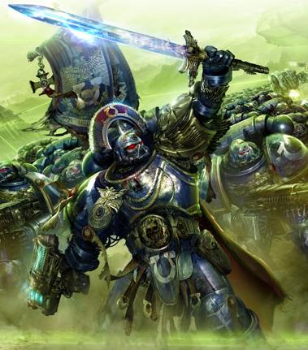
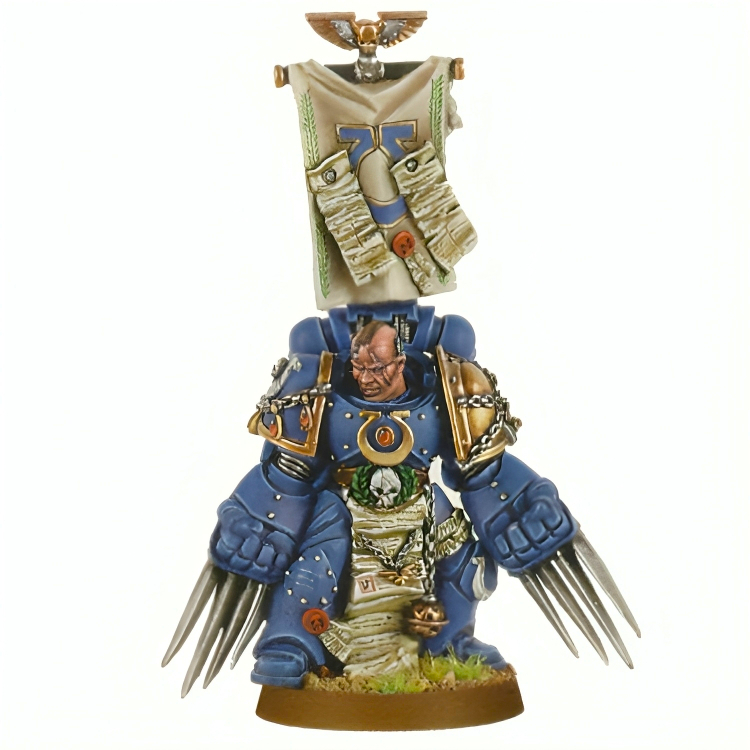
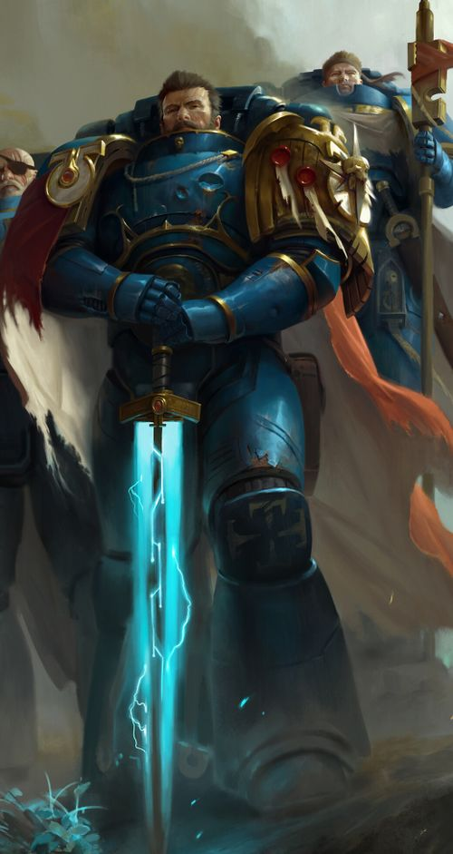
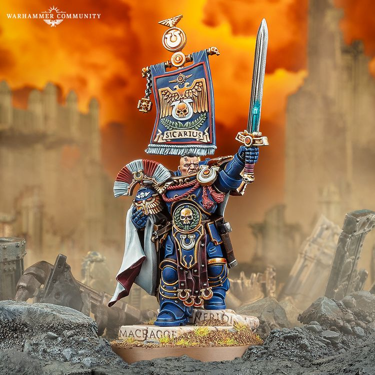

# 0687 卡托·西卡留斯 Cato Sicarius

精校状态：中文行文已逐段精校，部分术语仍为暂定

分类：人类帝国 / 极限战士

原文来源：https://www.bilibili.com/opus/1113228366078541842

原作者：帝国神选罐头

原文时间：2025年09月16日 22:14

[返回分类目录](目录.md) · [全书目录](../../目录.md)

<!-- A0687-B0001 -->
**英文原文**

Cato Sicarius is the Captain of the Ultramarines Victrix Guard. Among his titles are Master of the Watch, Knight Champion of Macragge, Grand Duke of Talassar, and High Suzerain of Ultramar.

<!-- /A0687-B0001 -->

<!-- A0687-B0002 -->

原译文

卡托·西卡留斯是极限战士常胜卫队的连长。他的头衔包括守望大师、马库拉格骑士冠军、塔拉萨大公爵和奥特拉马高领主。

**校订译文**

卡托·西卡留斯是极限战士常胜卫队的连长。他拥有守望大师、马库拉格骑士冠军、塔拉萨大公爵及奥特拉玛高领主等头衔。

<!-- /A0687-B0002 -->

<!-- A0687-B0003 图片 -->

<!-- A0687-B0004 -->

原译文

Captain Cato Sicarius of the Ultramarines during the Damnos Incident 达姆诺斯事件中的极限战士连长卡托·西卡留斯

**校订译文**

Captain Cato Sicarius of the Ultramarines during the Damnos Incident 达姆诺斯事件中的极限战士连长卡托·西卡留斯

<!-- /A0687-B0004 -->

<!-- A0687-B0005 -->
## Biography 传记

<!-- /A0687-B0005 -->

<!-- A0687-B0006 -->
### Early Life and Service 早期生活与服役

<!-- /A0687-B0006 -->

<!-- A0687-B0007 -->
**英文原文**

Born into one of Talassar's ascendant houses, Sicarius, as soon as he came of age, trained in various forms of martial arts common in Talassi nobility. His combat prowess became a major factor in his inclusion in the Ultramarines. Sicarius excelled at his training and claimed many commendations, quickly rising through the ranks of his martial arts community. Sicarius eventually rose to the rank of Sergeant, serving as an Assault Marine in the Eighth Company during the Damocles Crusade alongside Numitor. During the war, Sicarius executed Guardsmen who retreated from the T'au and expressed a cold ruthless violence. He later became the honorary Knight Champion of Macragge.

<!-- /A0687-B0007 -->

<!-- A0687-B0008 -->

原译文

西卡留斯出生在塔拉萨的一个显赫家族，成年后，他接受了塔拉萨贵族常见的各种武术训练。他的战斗能力成为他加入极限战士的主要因素。西卡留斯在训练中表现出色，并获得了许多赞誉，在他的武术团体迅速崛起。西卡留斯最终晋升为军士，在达摩克利斯远征期间与努米托一起在第八连队担任突击战士。战争期间，西卡留斯处决了从钛撤退的卫兵，并表现出冷酷无情的暴力。后来，他成为了马库拉格的荣誉骑士冠军

**校订译文**

西卡留斯出身塔拉萨的显赫家族，成年后便接受当地贵族流行的各类武艺训练。出众的战斗天赋，是他被极限战士选中的重要原因。他在训练中成绩卓著，屡获嘉奖，很快在战士群体中崭露头角。他后来升任军士，达摩克利斯远征期间与努米托一同在第八连担任突击战士。那场战争中，他处决了面对钛军撤退的帝国卫队士兵，显露出冷酷无情的一面。此后，他获授马库拉格骑士冠军的荣誉头衔。

<!-- /A0687-B0008 -->

<!-- A0687-B0009 -->
### Second Company Captain 第二连队连长

<!-- /A0687-B0009 -->

<!-- A0687-B0010 -->
**英文原文**

Sicarius was promoted to Captain of the Second Company after Captain Demetrian Titus was taken by Inquisitor Gerome Thrax following the invasion of Graia.

<!-- /A0687-B0010 -->

<!-- A0687-B0011 -->

原译文

在入侵格拉亚后，德米特里安·泰图斯连长被审判官杰罗姆·特拉克斯带走，西卡留斯被提升为第二连队连长。

**校订译文**

格拉亚遭入侵后，德米特里安·泰图斯连长被审判官杰罗姆·特拉克斯带走，西卡留斯接任第二连连长。

<!-- /A0687-B0011 -->

<!-- A0687-B0012 -->
**英文原文**

After Sicarius took the mantle of Second Company Captain, his first actions took place in the Dantaro Campaign. Fighting on Masali, Cato Sicarius used unexpected tactics and a score of Land Raider Prometheus to beat the Eldar army that ravaged the planet's population.

<!-- /A0687-B0012 -->

<!-- A0687-B0013 -->

原译文

西卡留斯接任第二连队连长后，他的第一次行动发生在丹塔罗战役中。在马萨利的战斗中，卡托·西卡留斯使用了意想不到的战术和数十名兰德掠袭者普罗米修斯，击败了蹂躏行星人口的灵族军队。

**校订译文**

接任第二连连长后，西卡留斯的首次行动是丹塔罗战役。他在马萨里运用出其不意的战术，配合二十辆普罗米修斯型兰德掠袭者，击败了残害当地居民的灵族军队。

**校注：** a score 明确为二十；Land Raider 是战车，量词不是名。

<!-- /A0687-B0013 -->

<!-- A0687-B0014 -->
**英文原文**

During his various military campaigns Sicarius gained many honours - among the most famous of these being the Imperial Laurel after the Crusat Minor Planet Strike (733.M41), and the Honorifica Valorum after the Battle of Dyzanyr. During a nine-day battle Sicarius gained the Valour Crest (an honour which is only awarded for near-suicidal acts of bravery) in the Battle for Fort Telendrar. The colours of the crest match those of the noble Talassi house Sicarius was brought up in.

<!-- /A0687-B0014 -->

<!-- A0687-B0015 -->

原译文

在他的各种军事行动中，西卡留斯获得了许多荣誉，其中最著名的是克鲁萨特次星行星打击（733.M41）后的帝国桂冠，以及迪扎尼尔之战后的荣誉勋章。在为期九天的战斗中，西卡留斯在泰兰德拉堡垒之战中获得了英勇勋章（这一荣誉仅授予近乎自杀的英勇行为）。徽章的颜色与西卡留斯长大的贵族塔拉希家族的颜色相匹配。

**校订译文**

西卡留斯在历次征战中屡获殊荣，其中最著名的有733.M41克鲁萨特次星突击战后获得的帝国桂冠，以及迪扎尼尔之战后获得的荣誉勋章。他还在持续九天的泰兰德拉堡垒之战中赢得勇武冠饰；这种荣誉只授予近乎舍生忘死的英勇行为。冠饰的颜色与其塔拉萨贵族家族的纹章色相同。

<!-- /A0687-B0015 -->

<!-- A0687-B0016 -->
**英文原文**

Soon after Sicarius became Captain he was announced the Suzerain of Ultramar in 849.M41 which allowed him to gain control within the Ultramarines hierarchy. Hero of the Medusa V Schism, Sicarius's first mission was to deploy his forces across the planet in defensive formations and to release his vessels to hunt down any space traffic that might be related to enemy forces of Orks, Eldar, Tyranids, Tau and Chaos. After a long and bloody campaign Sicarius issued an Exterminatus for the dying planet.

<!-- /A0687-B0016 -->

<!-- A0687-B0017 -->

原译文

在西卡留斯成为连长后不久，849.M41宣布他为奥特拉玛的领主，这使他能够在极限战士等级制度中获得控制权。作为美杜莎五号分裂的英雄，西卡留斯的第一个任务是以防御编队在整个行星上部署他的部队，并释放他的战舰来追捕任何可能与欧克、灵族、泰伦、钛和混沌敌军有关的太空交通。经过漫长而血腥的战役，西卡留斯为垂死的行星发动了灭绝令。

**校订译文**

西卡留斯升任连长后不久，于849.M41获授奥特拉玛领主头衔，进一步提高了他在战团指挥体系中的权威。他后来成为美杜莎五号分裂事件的英雄。该战役初期，他将部队部署于星球各处构筑防线，同时派舰队搜捕可能与欧克、灵族、泰伦、钛及混沌敌军有关的太空船只。经历漫长而血腥的战事后，他对这颗垂死的星球下达了灭绝令。

**校注：** 原文称849.M41刚获任连长，但前段又列733.M41战绩，编年疑点保留。

<!-- /A0687-B0017 -->

<!-- A0687-B0018 -->
**英文原文**

In 855.M41 Sicarius fought in the Assault on Black Reach against the Ork Warboss Zanzag. The whole of the Second Company stood against ten thousand Orks. As their ammunition ran dry the Ultramarines fought with knife and chain sword until the last Ork fell.

<!-- /A0687-B0018 -->

<!-- A0687-B0019 -->

原译文

855.M41，西卡留斯参加了对黑色河段的进攻，对抗欧克战争头目赞扎格。整个第二连队对抗一万个欧克。当他们的弹药耗尽时，极限战士们用刀和链锯剑作战，直到最后一个欧克倒下。

**校订译文**

855.M41，西卡留斯在黑域突击战中对抗欧克战争头目赞扎格。整个第二连迎战一万名欧克；弹药耗尽后，他们便挥舞战斗刀与链锯剑，直至最后一名敌人倒下。

**校注：** Black Reach 在本处及地理篇明确是行星，统一黑域；原稿别名黑色河段是误套 Reach 的河流词义。

<!-- /A0687-B0019 -->

<!-- A0687-B0020 -->
**英文原文**

In 878.M41, during the epic space battle in the Halamar Rift, the Strike Cruiser Valin's Revenge destroyed most of the Chaos Space Fleet, but during the battle aboard the main Chaos vessel Sicarius failed to kill the Daemon Prince M'kar, who escaped back to the Eye of Terror.

<!-- /A0687-B0020 -->

<!-- A0687-B0021 -->

原译文

878.M41，在哈拉玛裂隙的史诗般的太空战斗中，打击巡洋舰瓦林的复仇号摧毁了混沌太空舰队的大部分，但在战斗中，跳帮主混沌战舰的西卡留斯未能杀死逃回恐惧之眼的恶魔王子姆'卡。

**校订译文**

878.M41，哈拉玛裂隙爆发大规模太空战，瓦林的复仇号打击巡洋舰摧毁了混沌舰队的大部分舰船。但在敌方旗舰的跳帮战中，西卡留斯未能杀死恶魔亲王姆’卡尔，让它逃回了恐惧之眼。

<!-- /A0687-B0021 -->

<!-- A0687-B0022 -->
**英文原文**

In 946.M41 his heroism was displayed once more when he lead his Second Company against the Daemon Prince Kor Megron in the Battle of Eagle Gate, being heavily wounded by Megron but still managing to personally banish the Daemon to the Warp, after a lone guardsman sacrificed himself.

<!-- /A0687-B0022 -->

<!-- A0687-B0023 -->

原译文

946.M41，当他率领第二连队在鹰门之战中对抗恶魔王子科尔·梅格隆时，他的英雄主义再次得到体现，他被梅格隆重伤，但在一名单独的卫兵牺牲后，他仍设法亲自将恶魔驱逐到亚空间。

**校订译文**

946.M41，西卡留斯率第二连在鹰门之战中迎战恶魔亲王科尔·梅格隆。他被对方重创，却在一名帝国卫队士兵舍身相助后，亲手将恶魔放逐回亚空间。

<!-- /A0687-B0023 -->

<!-- A0687-B0024 -->
### Battles against Shon'tu 与邵恩·图的战斗

<!-- /A0687-B0024 -->

<!-- A0687-B0025 -->
**英文原文**

In 969.M41, Sicarius participated in the Invasion of Taladorn with Second Company. He entered the system in the Strike Cruiser Valin's Revenge and, after driving off the enemy blockade, Sicarius offered to reinforce the Imperial Fists on the ground. Captain Lysander refused Sicarius' assistance and kept fighting. After the Imperial Fists' Third Company was ravaged and Captain Julius Vogen died, Sicarius offered assistance again. Tor Garadon accepted his assistance on behalf of the Imperial Fists, and despite Lysander's continued objections they joined the battle on the ground. This marked a turning point of the battle, and over the next few days of fighting the remaining Iron Warriors Lysander refused to talk to Sicarius or Erasmus Tycho of the Blood Angels.

<!-- /A0687-B0025 -->

<!-- A0687-B0026 -->

原译文

969.M41，西卡留斯与第二连队一起参加了对塔拉顿的入侵。他乘坐瓦林的复仇号打击巡洋舰进入该星系，在击退敌人的封锁后，西卡留斯提出在地面上增援帝国之拳。莱山德连长拒绝了西卡留斯的帮助，继续战斗。帝国之拳第三连队被摧毁，尤利乌斯连长牺牲后，西卡留斯再次提供援助。托尔·加拉顿代表帝国之拳接受了他的协助，尽管莱山德继续反对，他们还是加入了地面战斗。这标志着战斗的转折点，在接下来的几天与钢铁勇士的战斗中，莱山德拒绝与西卡留斯或圣血天使的伊拉斯谟·第谷交谈。

**校订译文**

969.M41，西卡留斯率第二连参加塔拉顿入侵战。他乘瓦林的复仇号进入星系，突破敌军封锁后提出增援地面的帝国之拳，但莱山德连长拒绝援助，坚持独自作战。直到帝国之拳第三连遭受重创、尤利乌斯·沃根连长阵亡，西卡留斯再次提出支援，托尔·加拉顿才代表战团接受。他们不顾莱山德反对，加入地面战斗，扭转了战局。此后数日，在与钢铁勇士残部交战时，莱山德始终拒绝同西卡留斯或圣血天使的伊拉斯谟·第谷交谈。

<!-- /A0687-B0026 -->

<!-- A0687-B0027 -->
**英文原文**

In 971.M41, Sicarius, along with Captain Erasmus Tycho of the Blood Angels were asked to help bring Shon'tu to justice by Captain Lysander, to which they agreed to help. during the Fall of Malodrax Sicarius and the Blood Angels participated in boarding actions on the Tamunash. While there he and his Ultramarines captured a docking bay, sabotaged a quadrant's weapon system, and sabotaged conveyors on the ship to isolate the defenders before withdrawing.

<!-- /A0687-B0027 -->

<!-- A0687-B0028 -->

原译文

971.M41，西卡留斯和圣血天使的伊拉斯谟·第谷连长被莱山德连长要求帮助将邵恩·图绳之以法，他们同意提供帮助。西卡留斯在长恶星陷落期间，圣血天使参加了塔蒙纳什号的跳帮行动。在那里，他和他的极限战士占领了一个停泊区，破坏了一个象限的武器系统，并破坏了船上的输送设备，以隔离防御者，然后撤退。

**校订译文**

971.M41，莱山德请求西卡留斯与圣血天使连长伊拉斯谟·第谷协助追讨邵恩·图，两人都答应了。长恶星陷落期间，西卡留斯与圣血天使一同对塔蒙纳什号展开跳帮。他率极限战士夺占一处停泊区，破坏舰船一个象限的武器系统，又摧毁输送设备，将守军隔绝开来，随后撤退。

<!-- /A0687-B0028 -->

<!-- A0687-B0029 -->
### Damnos Incident 达姆诺斯事件

<!-- /A0687-B0029 -->

<!-- A0687-B0030 -->
**英文原文**

In 974.M41, Sicarius led an Ultramarine assault onto the resource rich planet Damnos against the recently risen menace known as the Necrons. Sicarius split the Second Company into three separate squads; he led one against the heart of the Necron force at Kellenport's outer walls. Upon landing Sicarius's team was surrounded by phalanxes to guard the Necron Lord. During the battle Sicarius fell, gravely wounded by the Lord's War Scythe, but was rescued and was evacuated back to his Battle Cruiser to heal. Damnos was lost to the Necrons but due to the unstable reactor of the planet and thanks to a few Thunderhawk Gunships the reactor blew and took the Necrons and spaceport to their deaths. This event is referred to as the "Damnos Incident".

<!-- /A0687-B0030 -->

<!-- A0687-B0031 -->

原译文

974.M41，西卡留斯率领一支极限战士突击队袭击了资源丰富的达姆诺斯行星，以对抗最近崛起的死灵威胁。西卡留斯将第二连队分成三个独立的小队；他带领其中一个在凯伦港的外墙上对抗死灵部队的核心。登陆后，西卡留斯的小队被保护死灵领主的方阵包围。在战斗中，西卡留斯被领主的战镰重伤，但被救出并被援救回他的战斗巡洋舰进行治疗。达姆诺斯陷给了死灵，但由于行星上不稳定的反应堆，以及几艘雷鹰炮艇，反应堆爆炸，死灵和太空港毁灭。这一事件被称为“达姆诺斯事件”。

**校订译文**

974.M41，西卡留斯率极限战士突入资源丰富的达姆诺斯，迎战刚刚苏醒的太空死灵。他将第二连分为三支分队，亲率其中一队进攻凯伦港外墙附近的敌军核心。登陆后，他们被守卫死灵领主的方阵包围；西卡留斯遭领主的战镰重创，所幸获救，并被送回战斗巡洋舰治疗。达姆诺斯最终落入太空死灵之手，不过当地不稳定的反应堆在数架雷鹰炮艇的协助下被引爆，将太空港及其中的死灵一并毁灭。这一连串战事被称为“达姆诺斯事件”。

**校注：** 第二连分成 three squads 属源文表述，译分队以避免擅自落实成十人制小队；爆炸毁灭本地太空港与守军，不据此宣称全部死灵灭绝。

<!-- /A0687-B0031 -->

<!-- A0687-B0032 -->
**英文原文**

Immediately after the Damnos Incident Sicarius was brought back to Macragge while in a revivification casket. While in the casket he had a vision of a possible future, where Necron remains they brought back with them reactivated and attacked the chapter. When he woke up from the casket for real Venatio and Agemman were there exactly like in his vision. He then made his way to the armorium with them, along with Daceus who they met on the way. Once there he had Vantor evacuate the laborers. The Necron remains they had recovered from Damnos started to self-repair, and the 5 of them shot everything they had at the Necrons, destroying them fully. After putting on his armor Sicarius then went to meet \[Calgar\]. At the meeting Calgar informed Sicarius that they would go back to Damnos eventually.

<!-- /A0687-B0032 -->

<!-- A0687-B0033 -->

原译文

达姆诺斯事件发生后，西卡留斯立即被带回马库拉格，当时他被放在一个恢复之棺里。在棺材里，他看到了一个可能的未来，他们带回的死灵遗骸重新激活并攻击了战团。当他从棺材里醒来时，真正的维纳蒂和阿格曼就像他想象中的那样。然后，他和他们一起去了军械库，还有他们在路上遇到的达修斯。一到那里，他就让凡托疏散了工人。他们从达姆诺斯找到的死灵遗骸开始自我修复，5人向死灵开枪，将其全部摧毁。穿上盔甲后，西卡留斯去见\[卡尔加\]。在会上，卡尔加告诉西卡留斯，他们最终会回到达姆诺斯。

**校订译文**

事后，西卡留斯被安置于复苏舱内送回马库拉格。在舱中，他看见一幅可能的未来：带回的太空死灵残骸重新启动，袭击战团。真正醒来时，维纳蒂与阿格曼果然像异象中一样守在身旁。他随两人前往军械库，途中又遇见达修斯。一到目的地，他便让凡托疏散劳工。来自达姆诺斯的残骸开始自我修复，五人随即倾尽火力，将其彻底摧毁。重新穿上护甲后，西卡留斯去见卡尔加；战团长告诉他，他们终有一天会重返达姆诺斯。

<!-- /A0687-B0033 -->

<!-- A0687-B0034 -->
### Legion of the Damned Encounter 遭遇诅咒军团

原题：Legion of the Damned Encounter 遭遇咒缚军团

<!-- /A0687-B0034 -->

<!-- A0687-B0035 -->
**英文原文**

At some point after the Damnos Incident Sicarius participated in the defence of a world against the Tyranids. He planned to assassinate the node creature alongside a squad of Vanguard Veterans, a plan Daceus advised him against but he went anyway. Sicarius knew he had become more reckless after Damnos and felt like he was trying to prove something. During insertion via Drop Pod a Spore Mine went off and hit their pod. Sicarius was badly injured and the veterans with him were killed, though he still had his Vortex Grenade. After running into Tyranids he killed several before a horde of them approached to attack him. He held his Vortex Grenade ready to take the Tyranids out with him. Before he could, however, mist rolled in, revealing Astartes figures that wore bone plate, but moved faster than seemingly possible, which killed all the Tyranids. Shortly after Daceus arrived in a Storm Raven to pick up Sicarius. Before rejoining the battle Sicarius wondered what fate he had been saved for.

<!-- /A0687-B0035 -->

<!-- A0687-B0036 -->

原译文

在达姆诺斯事件后的某个时刻，西卡留斯参与了保卫世界对抗泰伦的行动。他计划与一队先锋老兵一起暗杀节点生物，达修斯建议他不要这样做，但他还是去了。西卡留斯知道在达姆诺斯之后他变得更加鲁莽，觉得他试图证明一些事情。在通过空投舱插入的过程中，一枚孢子雷爆炸并击中了他们的空投舱。西卡留斯受了重伤，与他一起的老兵也被杀，尽管他仍然有他的涡旋手榴弹。在遇到泰伦后，他杀死了几个，然后一群走近攻击他。他手里拿着涡旋手榴弹，准备和泰伦同归于尽。然而，他还没来得及，雾气就滚滚而来，露出了阿斯塔特的身影，他们穿着骨板，但移动得比看起来更快，杀死了所有的泰伦。达修斯乘坐风暴鸦抵达后不久，便去接西卡留斯。在重新加入战斗之前，西卡留斯想知道他被谁救了下来。

**校订译文**

达姆诺斯事件后，西卡留斯曾参加一场抵御泰伦入侵的保卫战。他打算带领先锋老兵暗杀一只节点生物，虽遭达修斯劝阻，仍执意出击。他知道自己在达姆诺斯战败后变得更加鲁莽，仿佛急于证明什么。空降舱突入途中，一枚孢子雷炸中舱体，随行老兵全部阵亡，西卡留斯也身受重伤，但还留着一枚涡旋手榴弹。他先杀死几头泰伦，随即遭到大群敌人逼近，便握紧手榴弹准备同归于尽。就在这时，浓雾滚来，显出身披骨甲装饰的阿斯塔特身影；他们以不可思议的速度移动，将泰伦悉数斩杀。不久，达修斯乘风暴鸦赶来接应。重返战斗前，西卡留斯不禁思索，自己究竟因何种尚未完成的命运而获救。

**校注：** 末句问的是自己获救后尚需完成什么命运，非是谁救了自己。

<!-- /A0687-B0036 -->

<!-- A0687-B0037 -->
### Triumph at Victorix 胜利星大捷

<!-- /A0687-B0037 -->

<!-- A0687-B0038 -->
**英文原文**

In 994.M41 Sicarius requested help from the Imperial Fists to defend the Shrine World of Victorix from the remnants of Hive Fleet Kraken. Tor Garadon arrived with the Imperial Fists to assist. They were able to preserve the shrine world from destruction.

<!-- /A0687-B0038 -->

<!-- A0687-B0039 -->

原译文

994.M41，西卡留斯请求帝国之拳的帮助，以保卫胜利星圣地世界免受虫巢舰队克拉肯的残余。托尔·加拉顿带着帝国之拳前来协助。他们能够保护圣地世界免遭破坏。

**校订译文**

994.M41，西卡留斯请求帝国之拳协助保卫圣地世界胜利星，抵御克拉肯虫巢舰队残部。托尔·加拉顿率军赶来，双方最终使这个世界免于毁灭。

<!-- /A0687-B0039 -->

<!-- A0687-B0040 图片 -->

<!-- A0687-B0041 -->

原译文

Cato Sicarius 卡托·西卡留斯

**校订译文**

Cato Sicarius 卡托·西卡留斯

<!-- /A0687-B0041 -->

<!-- A0687-B0042 -->
### Second Battle of Damnos 第二次达姆诺斯之战

<!-- /A0687-B0042 -->

<!-- A0687-B0043 -->
**英文原文**

In 999.M41, Sicarius and the 2nd Company were able to reclaim Damnos for the Imperium after slaying the Necron Lord known as The Undying. During the battle Sicarius killed a Transcendent C'tan using a Vortex Grenade.

<!-- /A0687-B0043 -->

<!-- A0687-B0044 -->

原译文

999.M41，西卡留斯和第二连队在杀死了被称为不死者的死灵领主后，得以夺回达姆诺斯。在战斗中，西卡留斯使用涡旋手榴弹杀死了一名超凡星神。

**校订译文**

999.M41，西卡留斯与第二连杀死名为“不死者”的太空死灵领主，为帝国收复达姆诺斯。战斗中，他还用涡旋手榴弹消灭了一名超凡星神。

<!-- /A0687-B0044 -->

<!-- A0687-B0045 -->
### Zeist Campaign 则斯特战役

<!-- /A0687-B0045 -->

<!-- A0687-B0046 -->
**英文原文**

In 999.M41 Sicarius led the Ultramarines and thirty other Space Marine chapters and Imperial Guard forces during the Zeist Campaign against the invading forces of the T'au Empire. The T'au were expanding their empire into Imperial territory, of which they had captured 26 worlds. Numerous forces from the Night Watch, Halo Dragons, Silver Skulls, Crimson Fists and others joined Sicarius on Praetonis V to stop the incoming forces. Sicarius fought back with the same tactics that the T'au used, being speed and precision. The combined Astartes strike-force managed to reclaim all the worlds annexed by the T'au and obliterate the invading forces, although the high council withdrew the chapters before the strike-force could launch a counter-assault on T'au-occupied worlds; a much larger battle was brewing.

<!-- /A0687-B0046 -->

<!-- A0687-B0047 -->

原译文

999.M41，西卡留斯领导了极限战士和其他30个星际战士战团以及帝国卫队，在则斯特中对抗了钛帝国的入侵部队。钛正在将他们的帝国扩展到帝国领土，他们已经占领了26个世界。来自午夜守望、光环之龙、银色颅骨、绯红之拳和其他部队的众多部队在普雷托尼斯五号上加入了西卡留斯，以阻止来袭的部队。西卡留斯以与钛相同的战术进行反击，即速度和精准。阿斯塔特联合打击部队设法夺回了被钛吞并的所有世界，并消灭了入侵部队，尽管在打击部队对钛占领的世界发动反击之前，至高议会撤回了这些战团；一场更大的战斗正在酝酿之中。

**校订译文**

999.M41，西卡留斯在则斯特战役中统率极限战士、其他三十个星际战士战团的兵力及帝国卫队，阻击钛帝国入侵。钛军不断蚕食帝国疆土，已夺占二十六个世界。午夜守望、光轮火龙、银色颅骨、绯红之拳等部队在普雷托尼斯五号与他会师。西卡留斯以钛军擅长的迅捷、精准战术反击，阿斯塔特联合打击部队最终收复全部新近沦陷的世界，消灭来犯之敌。然而，还没等他们进一步反攻钛族控制区，最高议会便召回了各战团——一场更大规模的战事正在酝酿。

<!-- /A0687-B0047 -->

<!-- A0687-B0048 -->
### Invasion of Ultramar 奥特拉玛入侵

<!-- /A0687-B0048 -->

<!-- A0687-B0049 -->
**英文原文**

Early in the Bloodborn Invasion of Ultramar Sicarius was summoned to the chapter master's chambers, along with the other Ultramarines captains, to be briefed on the situation. Later when Sicarius heard what happened to Talassar he was furious at Tigurius for not predicting it, though he soon apologized. He and the Second Company were then deployed to Espandor because of a vision Tigurius had.

<!-- /A0687-B0049 -->

<!-- A0687-B0050 -->

原译文

在奥特拉玛的血裔入侵早期，西卡留斯与其他极限战士连长一起被召集到战团长的会议厅，听取有关情况的简报。后来，当西卡留斯听说塔拉萨发生了什么事时，他对狄格里斯没有预测到这一点感到愤怒，尽管他很快就道歉了。由于狄格里斯的幻象，他和第二连队随后被部署到埃斯潘多。

**校订译文**

血裔入侵奥特拉玛初期，西卡留斯与其他连长一同被召至战团长室，听取战况简报。他得知塔拉萨遇袭后，对未能预见灾难的狄格里斯怒不可遏，但很快便为此道歉。根据狄格里斯随后看到的异象，他与第二连被派往埃斯潘多。

<!-- /A0687-B0050 -->

<!-- A0687-B0051 -->
**英文原文**

On Espandor Sicarius set up several ambushes using convoys to draw out their enemies. Though they were successful there were notable human casualties, which frustrated the Planetary Governor Saul Gallow and led to a heated exchange between the two. Sicarius' ultimate plan was to find and kill the enemy leader so the army would fall apart, he noted that it worked on Black Reach and should work here. After interrogating a prisoner he discovered the name of and information on their leader, Kaarja Salombar. Sicarius and the Second Company proceeded to attack 6 of her advance forces; while they were victorious they still failed to locate her. After their last attack against a force at Olynthus Daceus started to convince Sicarius that they needed to return to Herapolis due to their low supplies, which he was reluctant to do. Before he could give Daceus an answer Gaius Prabian arrived, and informed them that Bloodborn forces were on their way and trying to cut off their escape, after hearing this Sicarius instantly agreed that they needed to leave.

<!-- /A0687-B0051 -->

<!-- A0687-B0052 -->

原译文

在埃斯潘多，西卡留斯利用车队发动了几次伏击，以吸引敌人。尽管他们取得了成功，但也有明显的人员伤亡，这让行星总督索尔·加洛感到沮丧，并导致了两人之间的激烈交锋。西卡留斯的最终计划是找到并杀死敌人的领导人，这样军队就会崩溃，他指出，他在黑色河段起作用，应该在这里也起作用。在审问一名囚犯后，他发现了他们的领导人卡娅拉·萨洛巴尔的名字和信息。西卡留斯和第二连队开始攻击她的6支先遣部队；虽然他们胜利了，但还是没能找到她。在他们最后一次袭击奥林索斯的一支部队后，达修斯开始说服西卡留斯，由于补给不足，他们需要返回赫拉城邦，但他不愿意这样做。在他给达修斯答复之前，盖乌斯·普拉比安到达了，并通知他们血裔部队正在途中，试图切断他们的退路，听到这个消息后，西卡留斯立即同意他们需要离开。

**校订译文**

在埃斯潘多，西卡留斯以运输车队为诱饵设下多次伏击。行动虽成功，却造成了大量凡人伤亡，令行星总督索尔·加洛十分不满，两人因此激烈争执。西卡留斯的最终目标是找到并斩杀敌军首领，使其大军瓦解；他认为这套方法既然在黑域奏效，在这里也应可行。审讯俘虏后，他得知首领名叫卡娅拉·萨洛巴尔，并掌握了相关情报。第二连接连击败她的六支先遣部队，却始终未能找到她。最后一次在奥林索斯发动袭击后，达修斯因补给不足，劝西卡留斯撤回赫拉城邦，后者仍不情愿。正待答复时，盖乌斯·普拉比安赶来报告：血裔正在逼近，企图截断退路。西卡留斯这才立即同意撤离。

<!-- /A0687-B0052 -->

<!-- A0687-B0053 -->
**英文原文**

Later Sicarius deduced that Kaarja was moving between her forces, and he assigned Praxor Manorian, Iulius Fennion and Scipio Vorolanus to take their squads into the wilds and find her. When Scipio voxed that they had found her in Corinith, Sicarius arrived almost immediately with 4 Thunderhawk Gunships and almost all of Second Company. Sicarius entered the battle with The Lions of Macragge and asked Scipio and his squad to fight alongside him. During his fight with Kaarja she stabbed him through the heart; he used the opportunity to hold her in place while Scipio stabbed her with the pole of the company banner. Sicarius then picked up his sword and sliced her head off. He then grabbed her head, got onto the wreckage of her downed skiff, and held it up for the Bloodborn army to see. Afterwards Sicarius explained to Scipio that he had expected her to be at Corinith, moved his and the governor's forces into position, and waited for his signal to attack. Scipio asked him what would have happened if he was wrong, Sicarius said that it was irrelevant as he wasn't. Sicarius then spent the next 9 days wiping out the remaining Bloodborn with Second Company, a task made easier as the remaining groups had started infighting with no centralized leader.

<!-- /A0687-B0053 -->

<!-- A0687-B0054 -->

原译文

后来西卡留斯推断卡娅拉正在她的部队之间移动，他指派普拉克索·马诺里安、尤利乌斯·芬尼翁和西庇阿·沃洛拉努斯带领他们的小队进入荒野寻找她。当西庇阿宣称他们在科里尼特找到了她时，西卡留斯几乎立刻带着4艘雷鹰炮艇和几乎所有的第二连队人员赶到了。西卡留斯与马库拉格之狮一起进行了战斗，并要求西庇阿和他的小队与他并肩作战。在他与卡娅拉的战斗中，她刺伤了他的心脏；当西庇阿用连队旗帜的旗杆刺伤她时，他利用这个机会把她固定住了。西卡留斯拿起他的剑，把她的头砍了下来。然后，他抓住她的头，爬上她被击落的小船的残骸，把它举起来让血裔军队看看。后来，西卡留斯向西庇阿解释说，他原本以为她会在科里尼特，于是他和总督的部队都就位了，等待他的进攻信号。西庇阿问他如果他错了会发生什么，西卡留斯说这无关紧要，因为他没有错。西卡留斯然后在接下来的9天里，用第二连队消灭了剩下的血裔，这项任务变得更容易了，因为剩下的团体已经开始内斗，没有中央集权的领导人。

**校订译文**

西卡留斯后来推断，卡娅拉正在各支部队之间巡回，便派普拉克索·马诺里安、尤利乌斯·芬尼翁及西庇阿·沃洛拉努斯各率小队进入荒野搜索。西庇阿通过音阵报告在科里尼特发现目标后，他几乎立刻带着四架雷鹰与第二连绝大多数战士赶到。他率马库拉格之狮投入战斗，并让西庇阿小队随行。交锋中，卡娅拉刺穿了他的一颗心脏；他借势将她牢牢制住，让西庇阿得以用连旗旗杆刺入她的身体。西卡留斯拾起剑，斩下她的头颅，再登上她被击落的轻艇残骸，高举首级示众。战后，他告诉西庇阿，自己早料到目标会出现在科里尼特，已将己方及总督的部队预先部署到位，只等西庇阿发来信号。西庇阿问，若判断错误会怎样；他答道，这无关紧要，因为他并没有错。此后九日，第二连继续歼灭血裔残部；失去统一首领的敌人已经内讧，使清剿更为顺利。

**校注：** 刺穿心脏后西卡留斯先制住敌人，西庇阿才能用旗杆刺中；纠正原译动作先后与代词。

<!-- /A0687-B0054 -->

<!-- A0687-B0055 -->
**英文原文**

Sicarius then headed to Talassar with Second Company in the Valin's Revenge. En route he met up with Uriel Ventris and the Fourth Company. Once at the planet both companies jumped from their Thunderhawks into the battle against the forces of M'kar, Sicarius included. After the death of M'kar Sicarius would fight in the forests of Espandor, sometimes alongside Ventris, over the 6 months spent fighting the last of the Bloodborn in Ultramar. After the 6 months, he participated in the ceremony in the Temple of Correction. Sicarius and the other captains would carve the names of those lost during the invasion into marble in the temple.

<!-- /A0687-B0055 -->

<!-- A0687-B0056 -->

原译文

西卡留斯随后与瓦林的复仇号和第二连队前往塔拉萨。途中，他会见了乌瑞尔·文崔斯和第四连队。一到行星，两个连队包括西卡留斯在内就从雷鹰跳到了与姆'卡部队的战斗中。姆'卡死后，西卡留斯在埃斯潘多的森林里战斗，有时会和文崔斯并肩作战，在奥特拉玛与最后一个血裔战斗了6个月。6个月后，他参加了肃正神殿的仪式。西卡留斯和其他连长把入侵期间失踪的人的名字刻在神殿的大理石上。

**校订译文**

西卡留斯随后率第二连乘瓦林的复仇号赶赴塔拉萨，途中与乌瑞尔·文崔斯及第四连会合。抵达后，两连战士连同西卡留斯一起从雷鹰跃下，投入对抗姆’卡尔大军的战斗。姆’卡尔死后，他们又花了六个月清剿奥特拉玛各地的血裔残部；西卡留斯在埃斯潘多森林中作战，有时与文崔斯并肩出击。清剿结束后，他参加肃正神殿的纪念仪式，与其他连长一同将入侵期间阵亡者的名字刻上神殿大理石。

<!-- /A0687-B0056 -->

<!-- A0687-B0057 -->
### Final Absolution Space Hulk 最终赦免号太空废船

<!-- /A0687-B0057 -->

<!-- A0687-B0058 -->
**英文原文**

Sometime after the Invasion of Ultramar the space hulk Final Absolution appeared in space near Talassar. Taking the ship Valin's Revenge and some escorts Sicarius headed out to meet it with some of his men from Second Company, alongside 3 squads from First Company, including Agemman, at the behest of Calgar. After boarding the hulk Sicarius and The Lions of Macragge fought through Genestealers towards the bridge. Once there he had Orian work on activating the engines so they could redirect the hulk. However, the hive started to wake so he was forced to change the plan and have Orian set the hulk to explode. Later he watched the destruction of the hulk with Agemman.

<!-- /A0687-B0058 -->

<!-- A0687-B0059 -->

原译文

在奥特拉玛入侵后的某个时候，太空废船最终赦免号出现在塔拉萨附近的空域中。在卡尔加的命令下，西卡留斯率领瓦林的复仇号和一些护卫舰，与第二连队的一些士兵以及第一连队的3个小队，包括阿格曼，一起出发迎接它。登上废船后，西卡留斯和马库拉格之狮穿过基因窃取者向大桥进发。一到那里，他就让奥瑞安启动引擎，这样他们就可以改变船体的方向。然而，虫巢开始苏醒，所以他被迫改变计划，让奥瑞安引爆船体。后来，他和阿格曼一起看着船体被摧毁。

**校订译文**

奥特拉玛入侵战后，最终赦免号太空废船出现在塔拉萨附近。奉卡尔加之命，西卡留斯率瓦林的复仇号及护航舰前往处置，随行有部分第二连战士，以及包括阿格曼在内的第一连三个小队。登舰后，他与马库拉格之狮一路杀穿基因窃取者，抵达舰桥，命奥瑞安启动引擎，以改变废船航向。但虫巢开始苏醒，他只得改令奥瑞安设置自毁。随后，他与阿格曼一同目睹废船毁灭。

**校注：** bridge 为舰桥，不是大桥。

<!-- /A0687-B0059 -->

<!-- A0687-B0060 -->
### Terran Crusade 泰拉远征

<!-- /A0687-B0060 -->

<!-- A0687-B0061 -->
**英文原文**

When Guilliman returned and started planning his Terran Crusade he gathered a force of battle-brothers from the 1st, 2nd and 3rd companies of the Ultramarines and gave command of them to Sicarius. During the crusade he led a raiding party with Inquisitor Greyfax against a Red Corsair palace. During an attack by the Red Corsairs on Macragge's Honour, Sicarius fought against the boarders on the bridge alongside Guilliman, Greyfax and Saint Celestine. During the fighting Sicarius and several other Ultramarines kept enemies away from Guilliman as he fought the Lord of Change Kairos Fateweaver. During the fighting he and other ultramarines tried to stop Kairos' incantation that was hurting Guilliman, but they were unsuccessful and forced to surrender to save the primarch's life.

<!-- /A0687-B0061 -->

<!-- A0687-B0062 -->

原译文

当基里曼回归并开始计划他的泰拉远征时，他从极限战士的第一、第二和第三连队召集了一支战斗兄弟部队，并将其指挥权交给了西卡留斯。在远征期间，他与审判官格雷法克斯率领一支突袭队袭击了一座红海盗宫殿。在红海盗袭击马库拉格之耀号期间，西卡留斯与基里曼、格雷法克斯和圣塞勒斯汀在舰桥上与跳帮者作战。在战斗中，西卡留斯和其他几名极限战士在基里曼与万变魔君卡洛斯·织命者作战时，将敌人挡在了基里曼之外。在战斗中，他和其他极限战士试图阻止卡洛斯伤害基里曼的咒语，但他们没有成功，被迫投降以挽救原体的生命。

**校订译文**

基里曼复苏并筹划泰拉远征时，从第一、第二及第三连抽调战斗兄弟，交由西卡留斯指挥。远征途中，他与审判官格雷法克斯率队突袭一座红海盗宫殿。红海盗后来进攻马库拉格之耀号时，他又与基里曼、格雷法克斯及圣塞莱斯汀在舰桥上抵御跳帮。基里曼与诡变领主凯洛斯·织命者交战时，西卡留斯等人负责阻挡其他敌军。他们试图打断凯洛斯正在伤害原体的咒语，却未能成功，最终被迫投降，以保住基里曼性命。

<!-- /A0687-B0062 -->

<!-- A0687-B0063 图片 -->

<!-- A0687-B0064 -->

原译文

Cato Sicarius during his journey to return to the Imperium 卡托·西卡留斯在返回帝国的旅程中

**校订译文**

Cato Sicarius during his journey to return to the Imperium 卡托·西卡留斯在返回帝国的旅程中

<!-- /A0687-B0064 -->

<!-- A0687-B0065 -->
**英文原文**

Sicarius was later freed from imprisonment in the Blackstone Fortress by Cypher,Sylandri Veilwalker and their respective forces. Sicarius suggested that they fight their way to their ships but was overruled by Sylandri, who said that there were too many enemy forces, and that the ship's crew were all dead so they would have to use the webway. At the portal Sicarius and Celestine stayed behind until they knew Guilliman would make it through. During the battle on Luna Sicarius rallied the space marine forces and fought towards the Adeptus Custodes. Later on Terra Sicarius was among those who waited for Guilliman outside of the throne room.

<!-- /A0687-B0065 -->

<!-- A0687-B0066 -->

原译文

西卡留斯后来被塞弗、西兰德里·帷幕行者和他们各自的部队从黑石堡垒的监禁中释放出来。西卡留斯建议他们战斗到他们的船上，但被西兰德里否决了，他说敌军太多，船上的船员都死了，所以他们必须使用网道。在入口处，西卡留斯和塞勒斯汀一直呆在后面，直到他们知道基里曼会挺过去。西卡留斯在月球的战斗中，星际战士部队集结起来，向着禁军的方向作战。后来，西卡留斯是在泰拉上的王座室外等待基里曼的人之一。

**校订译文**

后来，塞弗、西兰德里·帷幕行者及各自率领的部队，将西卡留斯等人从黑石要塞的牢狱中救出。他主张杀回舰船，却被西兰德里否决：敌军过多，舰上船员也已全部遇害，只能借网道脱身。在入口处，他与塞莱斯汀留守，直到确认基里曼能够顺利通过。月球之战中，他重整星际战士部队，向帝皇禁军所在方向突进。抵达泰拉后，他也是守在王座厅外等待基里曼归来的人之一。

<!-- /A0687-B0066 -->

<!-- A0687-B0067 -->
### Lost in the Warp 在亚空间迷失

<!-- /A0687-B0067 -->

<!-- A0687-B0068 -->
**英文原文**

At the start of the Indomitus Crusade, Guilliman feared for the safety of Ultramar due to the formation of the Great Rift and dispatched Sicarius from Terra to safeguard his realm. Cato's small fleet consisted of the first Primaris Space Marines of the Ultramarines and was dubbed the Fleet Avenger. However while en-route to Ultramar, the fleet encountered severe Warp Storms on a scale not seen since the Age of Strife. During the chaos, Sicarius ordered each ship to make its own way to Macragge. Sicarius was aboard his own Strike Cruiser, Emperor's Will, when the Astronomican malfunctioned. The last known message from the vessel before it was lost in the Warp was "They have breached the hull, they are here". Sicarius was declared missing by the Ultramarines, and Captain Acheran has assumed leadership of the 2nd Company.

<!-- /A0687-B0068 -->

<!-- A0687-B0069 -->

原译文

在不屈远征开始时，由于大裂隙的形成，基里曼担心奥特拉玛的安全，并从泰拉派遣西卡留斯保卫他的王国。卡托的小型舰队由极限战士的第一批原铸星际战士组成，被称为复仇者舰队。然而，在前往奥特拉玛的途中，舰队遭遇了自纷争时代以来从未见过的严重亚空间风暴。在混乱中，西卡留斯命令每艘船都自行前往马库拉格。当星炬发生故障时，西卡留斯正乘坐自己的帝皇意志号打击巡洋舰。在亚空间中迷失之前，该船发出的最后一条已知信息是“他们已经突破了船体，他们在这里”。西卡留斯被极限战士宣布失踪，阿切兰连长接管了第二连队的领导权。

**校订译文**

不屈远征开始时，基里曼担忧大裂隙威胁奥特拉玛，便从泰拉派西卡留斯回援。这支名为复仇者舰队的小型编队载着极限战士的首批原铸战士，途中却遭遇自纷争时代以来罕见的猛烈亚空间风暴。混乱中，西卡留斯命各舰自行前往马库拉格。星炬异常时，他正乘坐自己的帝皇意志号打击巡洋舰。舰船失陷亚空间前，最后传出的讯息是：“他们已突破舰壳，他们来了。”极限战士随后宣布他失踪，由阿切兰接掌第二连。

<!-- /A0687-B0069 -->

<!-- A0687-B0070 -->
**英文原文**

Stranded in the Warp, Cato and the crew of the Emperor's Will endured waves of Daemonic incursions and raids of Chaos Space Marines. They had to endure this nightmarish situation for nearly five years, with most of the mortal crew dying or going insane and the warriors abroad the Emperor's Will losing nearly all of their ammunition. Desperate, Sicarius ordered the Emperor's Will to translate back to the Materium, at which point they found themselves over a Feudal World with a Human population unaware of the greater Imperium. Looking for supplies and support, Cato led an expedition down to the planet. Wishing not to create a panic, they identified themselves to the confused locals as Knights from the lands of Macragge and found that the humans of this medieval world had been fighting Feral Orks for centuries. Cato discovered that the city ruler was a Necron slave controlled by Mindshackle Scarabs, but the locals were oblivious to the threat of the Xenos. Cato and his small band of Ultramarines nonetheless aided them in their fight against the Orks. After defeating the Orks, they slew those within the city enslaved to the Necrons before assaulting their Tomb complex and destroyed it, along with the C'tan Shard that dwelt within. Before leaving the world, Cato allowed his Remembrancer friend Vedaeh and several other mortals who wished to stay behind to do so.

<!-- /A0687-B0070 -->

<!-- A0687-B0071 -->

原译文

被困在亚空间中的卡托和帝皇意志号的船员们忍受了恶魔的入侵和混沌星际战士的突袭。他们不得不忍受这种噩梦般的局面近五年，大多数凡人船员要么死亡，要么精神失常，而帝皇意志号上的战士几乎失去了所有的弹药。绝望之下，西卡留斯命令将帝皇意志号跳回物质界，此时他们发现自己身处一个封建世界，而人类并不知道更大的帝国。为了寻找补给和支持，卡托率领探险队前往行星。为了不制造恐慌，他们向困惑的当地人表明自己是来自马库拉格之地的骑士，并发现这个中世纪世界的人类已经与蛮荒兽人战斗了几个世纪。卡托发现，这位城市统治者是一名由锁心甲虫控制的死灵奴隶，但当地人并没有意识到异型的威胁。尽管如此，卡托和他的一小队极限战士还是帮助他们对抗了欧克。在击败欧克后，他们杀死了城中被死灵奴役的人，然后袭击了他们的墓穴群并摧毁了它，以及居于其中的星神碎片。在离开这个世界之前，卡托允许他的记述者朋友维达和其他几个希望留下来的凡人这样做。

**校订译文**

受困亚空间期间，西卡留斯与帝皇意志号舰员接连遭到恶魔入侵和混沌星际战士突袭。这场噩梦持续近五年，大多数凡人舰员死亡或发疯，战士们的弹药也几乎耗尽。绝境中，他命舰船跃回物质宇宙，发现自己来到一颗封建世界上空；当地人根本不知道庞大的帝国存在。为寻找补给与援助，他率队登陆，并为避免恐慌，自称来自马库拉格的骑士。他们发现，这个中世纪般世界上的人类已经与蛮荒欧克交战数百年，而城中统治者竟被锁心甲虫控制，沦为太空死灵的奴隶；居民却对此毫不知情。西卡留斯的小队仍协助当地人击败欧克，随后杀死城内被死灵奴役者，再攻破并摧毁其墓穴设施，连同其中的星神碎片一并消灭。离开前，他允许记述者好友维达及其他几名自愿留下的凡人定居于此。

<!-- /A0687-B0071 -->

<!-- A0687-B0072 -->
### Commander of the Victrix Guard 常胜卫队指挥官

<!-- /A0687-B0072 -->

<!-- A0687-B0073 -->
**英文原文**

Sicarius eventually returned to Imperial space and subsequently joined Lord Commander Guilliman's Indomitus Crusade. As the Crusade fought to save the worlds within the Dark Imperium, Guilliman took Sicarius under his guidance, as the stubborn Captain reminded the Lord Commander of Aeonid Thiel, and he spent a considerable amount of time trying to form Sicarius into something other than merely an exemplary warrior. Suffering from survivor's guilt and a degree of mental trauma from his experiences in the Warp, Sicarius was nonetheless placed in command of Guilliman's Victrix Guard.

<!-- /A0687-B0073 -->

<!-- A0687-B0074 -->

原译文

西卡留斯最终回到了帝国空域，随后加入了领主指挥官基里曼的不屈远征。当远征为拯救黑暗帝国内的世界而战时，基里曼在他的指引下带走了西卡留斯，正如提醒领主指挥官伊奥尼德·希尔的这位固执的连长一样，他花了相当多的时间试图将西卡留斯塑造成一个不仅仅是模范战士的人。由于幸存者的内疚和在亚空间中的经历造成的一定程度的精神创伤，西卡留斯仍然被任命为基里曼的常胜卫队的指挥官。

**校订译文**

西卡留斯最终返回帝国空域，重新加入基里曼的不屈远征。远征军为拯救黑暗帝国各世界而战时，基里曼亲自指导他；这位固执的连长让原体想起伊奥尼德·希尔，因此基里曼花费大量时间，希望将他培养成超越单纯卓越战士的人。亚空间经历令西卡留斯承受幸存者内疚与精神创伤，但基里曼仍任命他为常胜卫队指挥官。

<!-- /A0687-B0074 -->

<!-- A0687-B0075 -->
**英文原文**

During the Pariah Crusade's Battle of Mesmoch, Sicarius fought to protect Guilliman as they sought to escape from the ruined Dawn of Fire and evade Necron capture. At the height of the battle aboard the vessel, Sicarius destroyed a Necron Lord.

<!-- /A0687-B0075 -->

<!-- A0687-B0076 -->

原译文

在帕里亚远征的梅斯莫克之战中，西卡留斯为保护基里曼而战，因为他们试图逃离毁灭的黎明之火号并躲避死灵的捕获。在船上战斗最激烈的时候，西卡留斯摧毁了一位死灵领主。

**校订译文**

被遗弃者远征的梅斯莫克之战中，西卡留斯护卫基里曼撤离残破的黎明之火号，避免落入太空死灵之手。舰内战斗最激烈时，他摧毁了一位死灵领主。

<!-- /A0687-B0076 -->

<!-- A0687-B0077 -->
**英文原文**

Sicarius was among the Indomitus Crusade forces that took part in the Devastation of Baal, and briefly saw Dante before the latter would meet with Guilliman.

<!-- /A0687-B0077 -->

<!-- A0687-B0078 -->

原译文

西卡留斯是参与巴尔的毁灭的不屈远征军之一，在但丁会见基里曼之前，他曾短暂见过但丁。

**校订译文**

西卡留斯随不屈远征军参加了巴尔之毁，并在但丁觐见基里曼前与他短暂相见。

<!-- /A0687-B0078 -->

<!-- A0687-B0079 -->
**英文原文**

Sicarius met with Guilliman prior to the Battle of Raukos and briefed him on the current situation as he was being armed, Sicarius was then given several orders to relay to other crusade forces. After the battle he was present at the Triumph of Raukos where Guilliman announced that the first phase of the Indomitus crusade had come to an end.

<!-- /A0687-B0079 -->

<!-- A0687-B0080 -->

原译文

西卡留斯在劳科斯之战前会见了基里曼，并向他简要介绍了当前的武装情况，随后西卡留斯接到了几项命令，要转交给其他远征军。战斗结束后，他出席了劳科斯的胜利庆典，基里曼在那里宣布不屈远征的第一阶段已经结束。

**校订译文**

劳科斯之战前，西卡留斯在基里曼穿戴战备时向他汇报局势，又奉命向其他远征部队传达指令。战后，他出席劳科斯凯旋庆典，听基里曼宣布不屈远征第一阶段结束。

**校注：** as he was being armed 指基里曼正在穿戴装备，不是简报主题为当前武装情况。

<!-- /A0687-B0080 -->

<!-- A0687-B0081 -->
**英文原文**

Sicarius was among the forces the Lord Commander took with him to aid the Realm of Ultramar during the Plague Wars. He was present at the conclave in the Fortress of Hera where Guilliman announced the changes he was making to Ultramar.

<!-- /A0687-B0081 -->

<!-- A0687-B0082 -->

原译文

在瘟疫战争期间，西卡留斯是领主指挥官带去援助奥特拉玛领域的部队之一。他出席了赫拉要塞的秘密会议，基里曼在会上宣布了他对奥特拉马的改变。

**校订译文**

瘟疫战争期间，西卡留斯随帝国最高统帅驰援奥特拉玛，并出席赫拉要塞会议，听基里曼公布对这片疆域的改革。

<!-- /A0687-B0082 -->

<!-- A0687-B0083 -->
**英文原文**

At an unspecified time Sicarius was within the Hall of Solemnity on Macragge and ran into Ferren Areios, who had come to see the resting place of Maximus Epathus. He recognized the anger and self hatred that Ferren was feeling, and he reminded Sicarius of himself. They then walked together and Sicarius talked to him about the lessons he had learned as a space marine, and his flaws. As they walked he led Ferren to where Epathus was in the hall, and after giving his name left Ferren alone.

<!-- /A0687-B0083 -->

<!-- A0687-B0084 -->

原译文

在一个未指明的时间，西卡留斯在马库拉格的庄严大厅内，遇到了费伦·阿瑞奥斯，他来看望马克西姆斯·埃帕图斯的安息之地。他意识到费伦的愤怒和自我憎恨，他让西卡留斯想起了自己。然后他们一起离开，西卡留斯和他谈到了他作为一名星际战士学到的教训，以及他的缺点。他们一边走，他把费伦带到埃帕图斯在大厅里的地方，在给出自己的名字后，就把费伦一个人留下了。

**校订译文**

在一个时间未详的场合，西卡留斯于马库拉格庄严大厅遇见费伦·阿瑞奥斯，后者前来瞻仰马克西姆斯·埃帕图斯的安息之所。他从费伦身上看出了愤怒与自我憎恨，仿佛看见过去的自己。两人边走边谈，西卡留斯讲起身为星际战士得到的教训，以及自身的缺点，将他带到埃帕图斯所在之处。他最后报上自己的名字，便离开，让费伦独自凭吊。

<!-- /A0687-B0084 -->

<!-- A0687-B0085 -->
## Equipment 装备

<!-- /A0687-B0085 -->

<!-- A0687-B0086 -->
**英文原文**

In combat, Sicarius wears the Mantle of the Suzerain, a type of finely crafted Artificer armor. The left pauldron was worn by Captain Orar, an Ultramarine captain from the days of the Horus Heresy, which includes the 2nd Company's heraldry colours, and the sigil which Sicarius has adopted as his own: incorporating an Iron Halo, the Ultramarines' Chapter icon, and a gold aquila which marks Sicarius as Grand Duke of Talassar.

<!-- /A0687-B0086 -->

<!-- A0687-B0087 -->

原译文

在战斗中，西卡留斯穿着领主斗篷，这是一件精心制作的精工盔甲。左肩甲是奥拉尔连长穿戴的，奥拉尔连长是荷鲁斯叛乱时期的一名极限战士连长，上面有第二连队的纹章颜色，以及西卡留斯作为自己的徽章：上面有一个铁光环，极限战士的战团图标，还有一个金色天鹰，标志着西卡留斯是塔拉萨大公爵。

**校订译文**

西卡留斯出战时身穿“领主披甲”，一套工艺精湛的精工护甲。其中的左肩甲曾属于荷鲁斯之乱时期的极限战士连长奥拉尔。护甲上保留着第二连纹章色，也绘有西卡留斯选定的个人徽记：铁光环、极限战士战团标志，以及象征塔拉萨大公爵身份的金色天鹰。

**校注：** Mantle of the Suzerain 此处明确整套精工护甲，原领主斗篷容易误作织物；暂用领主披甲，待核官方。

<!-- /A0687-B0087 -->

<!-- A0687-B0088 图片 -->

<!-- A0687-B0089 -->

原译文

Captain Cato Sicarius 连长卡托·西卡留斯

**校订译文**

Captain Cato Sicarius 连长卡托·西卡留斯

<!-- /A0687-B0089 -->

<!-- A0687-B0090 -->
**英文原文**

Sicarius' weapons include a plasma pistol and the Talassarian Tempest Blade, a power sword which he wields with expert proficiency.

<!-- /A0687-B0090 -->

<!-- A0687-B0091 -->

原译文

西卡留斯的武器包括等离子手枪和塔拉萨暴风之刃，这是一把他熟练掌握的动力剑。

**校订译文**

西卡留斯的武器包括等离子手枪和塔拉萨暴风之刃，这是一把他熟练掌握的动力剑。

<!-- /A0687-B0091 -->

<!-- A0687-B0092 -->
## Quotes 语录

<!-- /A0687-B0092 -->

<!-- A0687-B0093 -->
**英文原文**

"We are the slayers of kings, the destroyers of worlds, bringers of ruination and death in all its forms. These things we do in the name of the Emperor and in the defense of Mankind. Let none stay our wrath."

<!-- /A0687-B0093 -->

<!-- A0687-B0094 -->

原译文

“我们杀死王者，毁灭世界，带来各种形式的毁灭和死亡。我们以帝皇的名义和为了保卫人类而做这些事情。让任何人都不能阻止我们的愤怒。”

**校订译文**

“我们弑杀王者，毁灭世界，带来一切形式的毁坏与死亡。我们以帝皇之名行此诸事，只为保卫人类。无人能阻挡我们的怒火。”

<!-- /A0687-B0094 -->

<!-- A0687-B0095 -->
**英文原文**

"Brothers! War calls you. Will you answer?"

<!-- /A0687-B0095 -->

<!-- A0687-B0096 -->

原译文

“兄弟们！战争在召唤你们。你们会回应吗？”

**校订译文**

“兄弟们！战争在召唤你们。你们会回应吗？”

<!-- /A0687-B0096 -->

<!-- A0687-B0097 -->
## Trivia 琐事

<!-- /A0687-B0097 -->

<!-- A0687-B0098 -->
### Conflicting sources 来源冲突

<!-- /A0687-B0098 -->

<!-- A0687-B0099 -->
**英文原文**

During the attack of M'kar on Ultramar in 854999.M41, Marneus Calgar travels to Talassar to confront M'kar. According to Codex: Space Marines (5th Edition), the 2nd Company, under Sicarius, accompanies Calgar to Talassar. While In The Chapter's Due (Novel) which came out 2 years later, the 2nd Company is dispatched to Espandor, while Calgar is accompanied to Talassar by the 1st Company under Captain Severus Agemman. The 2nd Company does not reach Talassar until the end of the novel, to reinforce Calgar's position after concluding the campaign on Espandor.

<!-- /A0687-B0099 -->

<!-- A0687-B0100 -->

原译文

在854.999，姆'卡对极限战士的攻击中，马涅乌斯·卡尔加前往塔拉萨与姆'卡对峙。根据《圣典：星际战士》（第5版），西卡留斯率领的第二连队陪同卡尔加前往塔拉萨。在两年后出版的《战团宿债》（小说）中，第二连队被派往埃斯潘多，而卡尔加则由西弗勒斯·阿格曼连长率领的第一连队陪同前往塔拉萨。第二连队直到小说结束才到达塔拉萨，以巩固卡尔加在埃斯潘多战役结束后的阵地。

**校订译文**

854999.M41，姆’卡尔入侵奥特拉玛，卡尔加前往塔拉萨迎敌。《圣典：星际战士》第五版记载，随行的是西卡留斯率领的第二连；两年后出版的小说《战团宿债》却写道，第二连被派往埃斯潘多，随卡尔加前往塔拉萨的是西弗勒斯·阿格曼率领的第一连。直到小说末尾，第二连完成埃斯潘多战事后，才赶赴塔拉萨增援。

**校注：** 保留两种出版物对参战连队的冲突，日期按英文854999.M41恢复。

<!-- /A0687-B0100 -->

<!-- A0687-B0101 -->
**英文原文**

Originally Sicarius was Captain of the Fifth Company, and promoted to Captain of the second company following the Battle for Macragge, and Severus Agemman being promoted to captain of the First Company. This was retconned by White Dwarf 498 which gave Demetrian Titus a backstory as a tie in to the then upcoming Space Marine II videogame. Now Sicarius was never captain of the Fifth Company, and was promoted to captain of the second company after the events of Warhammer 40,000: Space Marine.

<!-- /A0687-B0101 -->

<!-- A0687-B0102 -->

原译文

西卡留斯最初是第五连队的连长，在马库拉格之战后晋升为第二连队连长，西弗勒斯·阿格曼晋升为第一连队连长。《白矮人498期》为德米特里安·泰图斯提供了一个背景故事，以配合当时即将推出的星际战士2电子游戏。现在，西卡留斯从未担任过第五连队连长，在“战锤40k：星际战士”的事件后，他被提升为第二连队的连长。

**校订译文**

早期设定中，西卡留斯原任第五连连长，马库拉格之战后，随第二连长西弗勒斯·阿格曼升任第一连长，接任第二连。《白矮人》第498期为当时即将推出的《星际战士2》补充泰图斯背景故事时，改写了这一设定。在修订后的版本中，西卡留斯未曾指挥第五连，而是在《战锤40,000：星际战士》的故事结束后接任第二连。

<!-- /A0687-B0102 -->

本篇核心术语与暂定项

以下列出本篇出现的英文原形及核心术语表用词。同形词可能指不同对象，具体词义以本篇正文和校注为准；单复数、别名和仅见于图注的名称可能尚未列入。完整候选见[术语表](../../术语表/双语术语候选.csv)。

| 英文 | 采用中文 | 状态 |
| --- | --- | --- |
| Space Marines | 星际战士 | 官方已核对 |
| Blood Angels | 圣血天使 | 官方已核对 |
| Adeptus Custodes | 帝皇禁军 | 官方已核对 |
| Imperial Guard | 帝国卫队 | 暂定·语境区分 |
| Chaos Space Marines | 混沌星际战士 | 官方已核对 |
| Eldar | 灵族 | 暂定·语境区分 |
| Tyranids | 泰伦虫族 | 官方已核对 |
| Necrons | 太空死灵 | 官方已核对 |
| Orks | 欧克蛮人 | 官方已核对 |
| T'au Empire | 钛帝国 | 官方已核对 |
| Ultramar | 奥特拉玛 | 官方已核对 |
| Ultramarines | 极限战士 | 官方已核对 |
| Horus Heresy | 荷鲁斯之乱 | 官方已核对 |
| Astronomican | 星炬 | 暂定 |
| Warp | 亚空间 | 官方已核对 |
| Great Rift | 大裂隙 | 官方已核对 |
| Inquisitor | 审判官 | 官方已核对 |
| Imperium | 帝国 | 暂定·简称 |
| Webway | 网道 | 暂定 |
| Indomitus | 不屈学派 | 暂定·学派语境 |
| Eye of Terror | 恐惧之眼 | 官方已核对 |
| Imperial Fists | 帝国之拳 | 暂定 |
| Emperor | 帝皇 | 官方已核对 |
| Primarch | 原体 | 官方已核对 |
| Shrine World | 圣地世界 | 暂定·官方待核 |
| Daemon Prince | 恶魔亲王 | 官方已核对 |
| Iron Warriors | 钢铁勇士 | 暂定·官方待核 |
| Corsair | 海盗 | 暂定·官方待核 |
| Age of Strife | 纷争时代 | 暂定·官方待核 |
| Terra | 泰拉 | 暂定·官方待核 |
| Horus | 荷鲁斯 | 暂定·官方待核 |
| Dark Imperium | 黑暗帝国 | 暂定·官方待核 |
| Indomitus Crusade | 不屈远征 | 暂定·官方待核 |
| Devastation of Baal | 巴尔之毁 | 暂定·官方待核 |
| Plague Wars | 瘟疫战争 | 暂定·官方待核 |
| Damocles Crusade | 达摩克利斯远征 | 暂定·官方待核 |
| Black Reach | 黑域 | 暂定·官方待核 |
| Graia | 格莱亚 | 暂定·官方待核 |
| Masali | 马萨里 | 暂定·官方待核 |
| Espandor | 埃斯潘多 | 暂定·官方待核 |
| Baal | 巴尔 | 暂定·官方待核 |
| Banish | 巴尼什 | 暂定·官方待核 |
| Luna | 月球 | 暂定·官方待核 |
| Medusa V | 美杜莎五号 | 暂定·官方待核 |
| Damnos | 达蒙斯 | 暂定·官方待核 |
| Macragge | 马库拉格 | 暂定·官方待核 |
| Medusa | 美杜莎 | 暂定·官方待核 |
| Pariah | 贱民 | 暂定·官方待核 |
| Land Raider | 兰德掠袭者战车 | 官方已核对 |
| Aquila | 天鹰 | 暂定·官方待核 |
| Master | 导师（审判庭职衔）／舰务官（舰员职务） | 语境定译·官方待核 |
| Mission | 教团／传教机构 | 暂定 |
| Saint Celestine | 圣塞莱斯汀 | 官方已核对 |
| Master of the Watch | 守望大师 | 暂定·官方待核 |
| Drop Pod | 空降舱 | 官方已核·中英对照 |
| Lord Commander | 领主指挥官 | 暂定·官方待核 |
| Crimson Fists | 绯红之拳 | 暂定·官方待核 |
| Silver Skulls | 银色颅骨 | 暂定·官方待核 |
| Champion | 冠军 | 暂定·官方待核 |
| Iron Halo | 铁光环 | 暂定·官方待核 |
| Space Marine | 星际战士 | 暂定·官方待核 |
| Chapter | 战团 | 暂定·官方待核 |
| Chapter Master | 战团长 | 暂定·官方待核 |
| Captain | 连长 | 暂定·官方待核 |
| Sergeant | 军士 | 暂定·官方待核 |
| Vanguard | 先锋 | 暂定·官方待核 |
| Marneus Calgar | 马涅乌斯·卡尔加 | 暂定·官方待核 |
| Cato Sicarius | 卡托·西卡留斯 | 暂定·官方待核 |
| Severus Agemman | 西弗勒斯·阿格曼 | 暂定·官方待核 |
| Uriel Ventris | 乌瑞尔·文崔斯 | 官方已核 |
| Dante | 但丁 | 暂定·官方待核 |
| Tor Garadon | 托尔·加拉顿 | 官方已核 |
| Destroyers | 毁灭者 | 暂定·官方待核 |
| High Suzerain of Ultramar | 奥特拉玛高领主 | 暂定·官方待核 |
| Knight Champion of Macragge | 马库拉格骑士冠军 | 暂定·官方待核 |
| Vanguard Veterans | 先锋老兵 | 暂定·官方待核 |
| Ferren Areios | 费伦·阿瑞奥斯 | 暂定·官方待核 |
| Halo Dragons | 光轮火龙 | 暂定·官方待核 |
| Night Watch | 午夜守望 | 暂定·官方待核 |
| Remnants | 残骸 | 暂定·官方待核 |
| Strike Cruiser | 打击巡洋舰 | 暂定·官方待核 |
| Artificer | 技工 | 暂定·官方待核 |
| Mortal | 凡人 | 暂定·官方待核 |
| Erasmus Tycho | 伊拉斯谟·第谷 | 暂定·官方待核 |
| Aeonid Thiel | 伊奥尼德·希尔 | 暂定·官方待核 |
| Cypher | 塞弗 | 官方已核对 |
| Risen | 赦天使 | 暂定·官方待核 |
| Xenos | 异形 | 暂定·官方待核 |
| T'au | 钛族 | 暂定·官方待核 |
| C'tan | 星神 | 暂定·官方待核 |
| Kairos Fateweaver | 凯洛斯·织命者 | 官方已核对 |
| Blackstone Fortress | 黑石要塞 | 暂定·官方待核 |
| Lord of Change | 诡变领主 | 官方已核对 |
| Horde | 部落 | 暂定·官方待核 |
| Victrix Guard | 常胜卫队 | 暂定·官方待核 |
| Sylandri Veilwalker | 西兰德里·帷幕行者 | 暂定·官方待核 |
| Raider | 掠袭者飞艇 | 官方已核对 |
| Warboss | 战争头目 | 官方已核对 |
| Feral Orks | 蛮荒欧克 | 暂定·官方待核 |
| Tamunash | 塔蒙纳什号 | 暂定·官方待核 |
| Pariah Crusade | 被遗弃者远征 | 暂定·官方待核 |
| Necron Lord | 死灵领主 | 暂定·官方待核 |
| Mesmoch | 梅斯莫克 | 暂定·官方待核 |
| Demetrian Titus | 德米特里安·泰图斯 | 暂定·官方待核 |
| Macragge's Honour | 马库拉格之耀号 | 暂定·官方待核 |
| Severus | 西弗勒斯 | 暂定·官方待核 |
| Realm of Ultramar | 奥特拉玛领地 | 暂定·官方待核 |
| Talassar | 塔拉萨 | 暂定·官方待核 |
| Daceus | 达修斯（连长）／达修斯号（战车） | 语境定译·官方待核 |
| Armorium | 军械库 | 暂定·官方待核 |
| Assault Marine | 突击战士 | 暂定·官方待核 |
| Emperor's Will | 帝皇意志号 | 暂定·官方待核 |
| Inquisitor Greyfax | 审判官格雷法克斯 | 官方已核对 |
| Land Raider Prometheus | 普罗米修斯型兰德掠袭者战车 | 暂定·官方待核 |
| Julius Vogen | 尤利乌斯·沃根 | 暂定·官方待核 |
| Victorix | 胜利星 | 暂定·官方待核 |
| The Dark | 《黑暗》 | 暂定·官方待核 |
| The Blood | 鲜血 | 暂定·官方待核 |
| Bloodborn | 血裔 | 暂定·官方待核 |
| Fortress of Hera | 赫拉要塞 | 暂定·官方待核 |
| System | 星系（恒星系统） | 暂定·官方待核 |
| Orar | 奥拉尔 | 暂定·官方待核 |
| Thrax | 特拉克斯 | 暂定·官方待核 |
| Feudal World | 封建世界 | 暂定·官方待核 |
| Medieval World | 中世纪世界 | 暂定·官方待核 |
| Mantle of the Suzerain | 领主披甲 | 暂定·官方待核 |
| Valour Crest | 勇武冠饰 | 暂定·官方待核 |
| Gerome Thrax | 杰罗姆·特拉克斯 | 暂定·官方待核 |
| Dantaro Campaign | 丹塔罗战役 | 暂定·官方待核 |
| Kaarja Salombar | 卡娅拉·萨洛巴尔 | 暂定·官方待核 |
| Saul Gallow | 索尔·加洛 | 暂定·官方待核 |
| Gaius Prabian | 盖乌斯·普拉比安 | 暂定·官方待核 |
| Praxor Manorian | 普拉克索·马诺里安 | 暂定·官方待核 |
| Iulius Fennion | 尤利乌斯·芬尼翁 | 暂定·官方待核 |
| Scipio Vorolanus | 西庇阿·沃洛拉努斯 | 暂定·官方待核 |
| The Lions of Macragge | 马库拉格之狮 | 暂定·官方待核 |
| Final Absolution | 最终赦免号 | 暂定·官方待核 |
| Talassarian Tempest Blade | 塔拉萨暴风之刃 | 暂定·官方待核 |
| Raukos | 劳科斯 | 暂定·官方待核 |
| Vedaeh | 维达 | 暂定·官方待核 |
| Maximus Epathus | 马克西姆斯·埃帕图斯 | 暂定·官方待核 |
| Numitor | 努米托 | 暂定·官方待核 |
| Avenger | 复仇者号 | 暂定·官方待核 |
| Terran Crusade | 泰拉远征 | 暂定·官方待核 |
| Temple of Correction | 校正圣殿 | 暂定·官方待核 |
| Plasma pistol | 等离子手枪 | 官方已核对 |
| Grenade | 手榴弹 | 暂定·官方待核 |
| Invasion of Ultramar | 入侵奥特拉玛 | 暂定·官方待核 |
| Kellenport | 凯伦港 | 暂定·官方待核 |
| Kraken | 克拉肯 | 暂定·官方待核 |
| Epic | 史诗 | 暂定·官方待核 |
| Vogen | 沃根 | 暂定·官方待核 |
| Ascendant | 升腾星堡 | 暂定·官方待核 |

