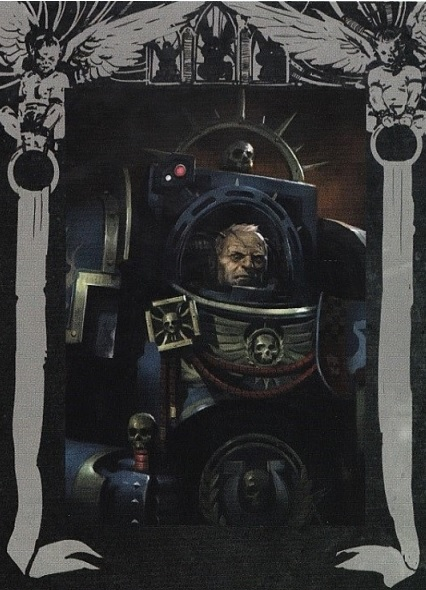
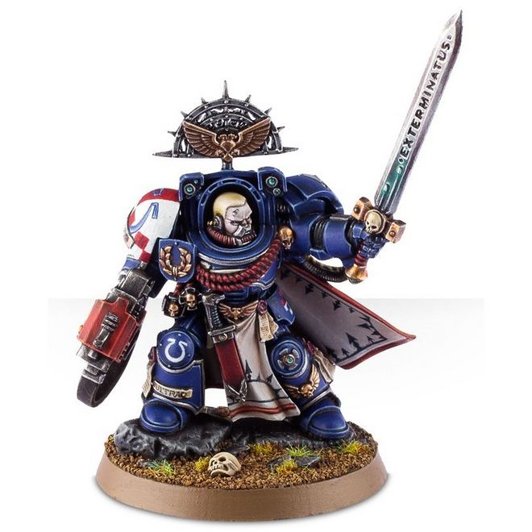
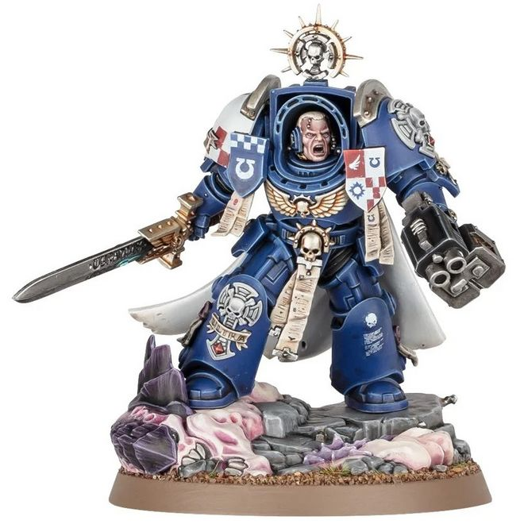

# 0688 西弗勒斯·阿格曼 Severus Agemman

精校状态：中文行文已逐段精校，部分术语仍为暂定

分类：人类帝国 / 极限战士

原文来源：https://www.bilibili.com/opus/1113596642356887552

原作者：帝国神选罐头

原文时间：2025年09月17日 22:03

[返回分类目录](目录.md) · [全书目录](../../目录.md)

<!-- A0688-B0001 -->
**英文原文**

"Wear the mantle of hero. Inspire where you can. But remember always that we are angels of death, not of mercy or salvation."

<!-- /A0688-B0001 -->

<!-- A0688-B0002 -->

原译文

“披上英雄的外衣。尽你所能地激励。但永远记住，我们是死亡的天使，而不是怜悯或救赎的天使。”

**校订译文**

“披上英雄的外衣。尽你所能地激励。但永远记住，我们是死亡的天使，而不是怜悯或救赎的天使。”

<!-- /A0688-B0002 -->

<!-- A0688-B0003 -->
**英文原文**

- Ultramarines 1st Captain Agemman

<!-- /A0688-B0003 -->

<!-- A0688-B0004 -->

原译文

- 极限战士第一连长阿格曼

**校订译文**

- 极限战士第一连长阿格曼

<!-- /A0688-B0004 -->

<!-- A0688-B0005 -->
**英文原文**

Severus Agemman is the Captain of the Ultramarines 1st Company and Regent of Ultramar.

<!-- /A0688-B0005 -->

<!-- A0688-B0006 -->

原译文

西弗勒斯·阿格曼是极限战士第一连队的连长和奥特拉玛摄政。

**校订译文**

西弗勒斯·阿格曼是极限战士第一连队的连长和奥特拉玛摄政。

<!-- /A0688-B0006 -->

<!-- A0688-B0007 图片 -->

<!-- A0688-B0008 -->

原译文

First Captain Severus Agemman 第一连长西弗勒斯·阿格曼

**校订译文**

First Captain Severus Agemman 第一连长西弗勒斯·阿格曼

<!-- /A0688-B0008 -->

<!-- A0688-B0009 -->
## Biography 传记

<!-- /A0688-B0009 -->

<!-- A0688-B0010 -->
**英文原文**

Previously the Captain of the 2nd Company, Agemman was promoted to 1st Captain after his predecessor, Captain Saul Invictus, was killed during the Battle for Macragge. While Captain Agemman is nominally the successor to Marneus Augustus Calgar as Chapter Master, Cato Sicarius, his successor as Captain of the 2nd Company, is considered the more likely heir, a possibility that others speculate must displease Agemman.

<!-- /A0688-B0010 -->

<!-- A0688-B0011 -->

原译文

阿格曼曾是第二连队的连长，在他的前任索尔·因维克图斯连长在马库拉格之战中牺牲后，他被晋升为第一连长。虽然阿格曼连长名义上是马涅乌斯·奥古斯图斯·卡尔加作为战团长的继任者，但他作为第二连队连长的继任者卡托·西卡留斯被认为是更有可能的继承者，其他人猜测这种可能性一定会让阿格曼不高兴。

**校订译文**

阿格曼原任第二连连长。第一连连长索尔·英维克图斯在马库拉格之战中阵亡后，他接掌第一连。虽然依名位而言，他是战团长马涅乌斯·奥古斯图斯·卡尔加的继承人选，但接任第二连长的卡托·西卡留斯常被认为更有希望。旁人猜测，这必定令阿格曼不悦。

**校注：** 此处沿用西卡留斯直接接替阿格曼的旧版经历，与687末段所述后续修订存在差异；保留源文，不擅自改写前任名单。

<!-- /A0688-B0011 -->

<!-- A0688-B0012 -->
**英文原文**

A few weeks after the Damnos Incident Agemman was present in the apothecarion when Sicarius woke up from his revivification casket, he was there to summon Sicarius before Calgar, but Sicarius stated that before he could say so. Sicarius then led Agemman, Vantor and Daceus to the armorium, to the remains of the Necrons they brought back from Damnos. It turns out the remains were still active and all of them unloaded all of their ammunition into the Necrons to destroy them. Afterwards Agemman ordered that the remains be incinerated.

<!-- /A0688-B0012 -->

<!-- A0688-B0013 -->

原译文

达姆诺斯事件发生几周后，当西卡留斯从恢复棺材中醒来时，阿格曼出现在药剂师处，他在那里召唤西卡留斯到卡尔加面前，但西卡留斯在说出之前就表示。西卡留斯随后将阿格曼、凡托和达修斯带到军械库，找到他们从达姆诺斯带回的亡灵遗骸。事实证明，这些遗骸仍然活跃，他们所有人都把所有的弹药都发射给了死灵，以摧毁它们。随后，阿格曼下令将遗体焚烧。

**校订译文**

达姆诺斯事件数周后，西卡留斯从复苏舱醒来时，阿格曼正守在药剂部，准备传达卡尔加的召见命令；然而，他尚未开口，西卡留斯便已说出他的来意。西卡留斯随后带阿格曼、凡托与达修斯赶赴军械库，查看从达姆诺斯运回的太空死灵残骸。残骸果然尚能活动，众人倾尽弹药，将其彻底摧毁。事后，阿格曼又命人焚烧残余碎片。

<!-- /A0688-B0013 -->

<!-- A0688-B0014 图片 -->

<!-- A0688-B0015 -->

原译文

Severus Agemman 西弗勒斯·阿格曼

**校订译文**

Severus Agemman 西弗勒斯·阿格曼

<!-- /A0688-B0015 -->

<!-- A0688-B0016 -->
**英文原文**

Agemman was present for the trial of Uriel Ventris and Pasanius. After the first day of the trial he visited Uriel and Pasanius in their cells on behalf of Calgar. He told Uriel how he had watched his career closely since before he was at the Agiselus Barracks, and even knew what he did in the Deathwatch and why he will never speak of it. He convinced both Uriel and Pasanius to plead guilty in their trial, telling them how if other Ultramarines see their superiors flaunt the Codex Astartes it would cause them to do the same, and they had to stop this dissension before it spread to the whole chapter.

<!-- /A0688-B0016 -->

<!-- A0688-B0017 -->

原译文

阿格曼出席了对乌瑞尔·文崔斯和帕撒尼乌斯的审判。审判第一天后，他代表卡尔加探访了乌瑞尔和帕萨尼乌斯的牢房。他告诉乌瑞尔，自从他进入阿吉塞卢斯军营之前，他就一直在密切关注自己的职业生涯，甚至知道他在死亡守望中做了什么，为什么他永远不会谈论这件事。他说服乌瑞尔和帕萨尼乌斯在审判中认罪，告诉他们如果其他极限战士看到他们的上级卖弄《阿斯塔特圣典》，他们也会这样做，他们必须在分歧蔓延到整个战团之前阻止这种分歧。

**校订译文**

阿格曼出席了对乌瑞尔·文崔斯及帕撒尼乌斯的审判。首日庭审结束后，他代表卡尔加前往牢房探望两人。他告诉乌瑞尔，早在对方进入阿吉塞卢斯军营之前，自己便一直关注其成长；他甚至知道乌瑞尔在死亡守望中的经历，以及为何对此绝口不提。他说服两人认罪，指出其他极限战士若见上级公然违背《阿斯塔特圣典》，便会仿效；他们必须在这种分歧蔓延至整个战团之前将其制止。

**校注：** 英文 flaunt 与上下文“违背圣典”不合，疑为 flout 误拼；依审判理由与后句模仿行为译出，不改英文。

<!-- /A0688-B0017 -->

<!-- A0688-B0018 -->
**英文原文**

In the aftermath of the Bloodborn's failed Invasion of Ultramar, Chief Librarian Tigurius met with Calgar to discus concerns he had about Agemman's role as First Captain. Tigurius claimed that Agemman had not fully recovered from being struck down by the Daemon Prince M'kar during the invasion, and was no longer the warrior he once was. He went on to state that if the Ultramarines were to face any future threats to the Imperium, they would need a new Captain who was fully capable of leading the Chapter's First Company into battle. Calgar took what Tigurius said into consideration, but has made no final decision on Agemman's fate.

<!-- /A0688-B0018 -->

<!-- A0688-B0019 -->

原译文

在血裔入侵奥特拉玛失败后，首席智库狄格里斯会见了卡尔加，讨论了他对阿格曼担任第一连长的担忧。狄格里斯声称，阿格曼在入侵期间被恶魔王子姆'卡击倒，尚未完全康复，也不再是他曾经的战士。他接着说，如果极限战士要面对帝国未来的任何威胁，他们将需要一位完全有能力领导战团第一连队投入战斗的新连长。卡尔加考虑了狄格里斯的话，但还没有对阿格曼的命运做出最终决定。

**校订译文**

血裔入侵被击退后，首席智库员狄格里斯向卡尔加表达了对阿格曼继续担任第一连长的担忧。他认为，阿格曼遭恶魔亲王姆’卡尔重创后仍未完全康复，已无法恢复往日的战力；若要应对未来威胁，第一连需要一位能够全力履职的新连长。卡尔加将这些意见纳入考虑，却尚未对阿格曼的去留作出最终决定。

<!-- /A0688-B0019 -->

<!-- A0688-B0020 -->
**英文原文**

During the Ultramar Campaign Agemann again took up arms to repel against a Chaos invasion, this time fighting alongside his reborn Primarch Roboute Guilliman. After the battle Agemman stayed alongside Marneus Calgar and Tigurius to oversee Ultramar as Guilliman embarked on the Terran Crusade and would defend Ultramar during the subsequent Plague Wars. The forces of Nurgle kept the Ultramarines hard pressed for years, until the successful conclusion of Guilliman's Indomitus Crusade. Afterwards, Guilliman led a sizable strike force to aid Ultrmar and when he arrived he conducted a strategic meeting on how to deal with Nurgle's forces.

<!-- /A0688-B0020 -->

<!-- A0688-B0021 -->

原译文

在奥特拉玛战役中，阿格曼再次拿起武器击退了混沌的入侵，这次是与他重生的原体罗伯特·基里曼并肩作战。战斗结束后，阿格曼与马涅乌斯·卡尔加和狄格里斯并肩作战，在基里曼开始泰拉远征时监督奥特拉玛，并在随后的瘟疫战争中保卫奥特拉玛。纳垢的部队多年来一直对极限战士施加压力，直到基里曼的不屈远征成功结束。之后，基里曼率领一支规模可观的打击部队协助奥特拉玛，当他到达时，他就如何应对纳垢的部队举行了一次战略会议。

**校订译文**

奥特拉玛战役期间，阿格曼再次奋起抵御混沌，这次与复苏的原体罗保特·基里曼并肩作战。基里曼踏上泰拉远征后，他与卡尔加、狄格里斯留守奥特拉玛，并在随后的瘟疫战争中保卫这片疆域。纳垢大军多年紧逼极限战士，直到基里曼完成不屈远征，率一支庞大的打击部队赶回增援。原体抵达后，立即召开战略会议，商讨如何应对纳垢的军势。

**校注：** 源文采用不屈远征完成后援救奥特拉玛的叙述；与其他篇所用阶段性结束版本区别保留。

<!-- /A0688-B0021 -->

<!-- A0688-B0022 -->
**英文原文**

During the meeting Guilliman also discussed the future of the Realm of Ultramar and stated he had made a mistake by decreasing Ultramar's size in the aftermath of the Horus Heresy. He was going to fix that mistake, by making Ultramar even larger than it once was and in order to ensure this would take place, Guilliman reinstated the rank of Tetrarch. Agemman was the first to be chosen and the First Captain readily agreed to his new position. He was given command of Konor and was charged with increasing Ultramar's northern territories; which included the Scourge Stars, which Guilliman ordered Agemman to reclaim from the forces of Nurgle.

<!-- /A0688-B0022 -->

<!-- A0688-B0023 -->

原译文

在会议期间，基里曼还讨论了奥特拉玛王国的未来，并表示他在荷鲁斯叛乱之后缩小奥特拉玛的规模是一个错误。他打算纠正这个错误，让奥特拉玛变得比以前更大，为了确保这一点，基里曼恢复了英杰的等级。阿格曼是第一个被选中者，第一连长欣然同意了他的新职位。他被授予康诺的指挥权，并被命令扩大奥特拉玛的北部领土；其中包括天灾群星，基里曼命令阿格曼从纳垢的部队手中夺回其。

**校订译文**

会上，基里曼也谈及奥特拉玛的未来。他承认，荷鲁斯之乱后缩减其疆域是一个错误，现在准备纠正，让奥特拉玛扩展至比昔日更大的规模。为此，他恢复四方领主职衔，首先选中阿格曼，而第一连长欣然受命。他被授予康诺的统治权，负责拓展奥特拉玛北部领土，包括从纳垢势力手中收复天灾群星。

<!-- /A0688-B0023 -->

<!-- A0688-B0024 图片 -->

<!-- A0688-B0025 -->

原译文

Severus Agemman 西弗勒斯·阿格曼

**校订译文**

Severus Agemman 西弗勒斯·阿格曼

<!-- /A0688-B0025 -->

<!-- A0688-B0026 -->
**英文原文**

During the Fourth Tyrannic War, Agemann was rapidly dispatched to Segmentum Pacificus to lead a Solblade against the forces of Hive Fleet Leviathan. Battling the tendril Grendyllus in the Bastior Sub-sector, his knowledge on Tyranid-killing given onto him by his friend and brother Ortan Cassius proved invaluable.

<!-- /A0688-B0026 -->

<!-- A0688-B0027 -->

原译文

在第四次泰伦战争期间，阿格曼迅速被派往太平星域，率领太阳之刃对抗虫巢舰队利维坦的部队。在巴斯蒂奥分区与格伦迪勒斯卷须作战时，他的朋友兼兄弟奥坦·卡西乌斯传授给他的关于杀戮泰伦的知识被证明是无价的。

**校订译文**

第四次泰伦战争期间，阿格曼迅速被派往太平星域，率一支太阳之刃部队迎战利维坦虫巢舰队。他在巴斯蒂奥次星区对抗格伦迪勒斯触须舰队时，战友奥坦·卡西乌斯传授的猎杀泰伦经验发挥了无可替代的作用。

<!-- /A0688-B0027 -->

<!-- A0688-B0028 -->
## Conflicting sources 来源冲突

<!-- /A0688-B0028 -->

<!-- A0688-B0029 -->
**英文原文**

During the Invasion of Ultramar in 854999.M41, Marneus Calgar travels to Talassar to confront the Daemon Prince M'kar.

<!-- /A0688-B0029 -->

<!-- A0688-B0030 -->

原译文

在854999.M41入侵奥特拉玛期间，马涅乌斯·卡尔加前往塔拉萨与恶魔王子姆'卡对峙。

**校订译文**

854999.M41奥特拉玛遭入侵时，卡尔加前往塔拉萨迎战恶魔亲王姆’卡尔。

<!-- /A0688-B0030 -->

<!-- A0688-B0031 -->
**英文原文**

According to Codex: Space Marines (5th Edition), the 2nd Company, under Sicarius, accompanies Calgar to Talassar.

<!-- /A0688-B0031 -->

<!-- A0688-B0032 -->

原译文

根据《圣典：星际战士》（第5版），西卡留斯率领的第二连队陪同卡尔加前往塔拉萨。

**校订译文**

根据《圣典：星际战士》（第5版），西卡留斯率领的第二连队陪同卡尔加前往塔拉萨。

<!-- /A0688-B0032 -->

<!-- A0688-B0033 -->
**英文原文**

In The Chapter's Due, by Graham McNeill, however, the 2nd Company is dispatched to Espandor, while Calgar is accompanied to Talassar by the 1st Company under Captain Agemman. The 2nd Company does not reach Talassar until the end of the novel, to reinforce Calgar's position after concluding the campaign on Espandor.

<!-- /A0688-B0033 -->

<!-- A0688-B0034 -->

原译文

然而，在格雷厄姆·麦克内尔的《战团宿债》中，第二连队被派往埃斯潘多，而卡尔加则由阿格曼连长率领的第一连队陪同前往塔拉萨。第二连队直到小说结束才到达塔拉萨，以巩固卡尔加在埃斯潘多战役结束后的阵地。

**校订译文**

然而，格雷厄姆·麦克内尔的小说《战团宿债》记载，第二连被派往埃斯潘多，随卡尔加前往塔拉萨的是阿格曼率领的第一连。直到小说结尾，第二连完成埃斯潘多战役后，才赶赴塔拉萨支援卡尔加。

<!-- /A0688-B0034 -->

本篇核心术语与暂定项

以下列出本篇出现的英文原形及核心术语表用词。同形词可能指不同对象，具体词义以本篇正文和校注为准；单复数、别名和仅见于图注的名称可能尚未列入。完整候选见[术语表](../../术语表/双语术语候选.csv)。

| 英文 | 采用中文 | 状态 |
| --- | --- | --- |
| Space Marines | 星际战士 | 官方已核对 |
| Deathwatch | 死亡守望 | 官方已核对 |
| Necrons | 太空死灵 | 官方已核对 |
| Librarian | 智库员 | 官方已核对 |
| Roboute Guilliman | 罗保特·基里曼 | 官方已核对 |
| Ultramar | 奥特拉玛 | 官方已核对 |
| Ultramarines | 极限战士 | 官方已核对 |
| Horus Heresy | 荷鲁斯之乱 | 官方已核对 |
| Imperium | 帝国 | 暂定·简称 |
| Nurgle | 纳垢 | 官方已核对 |
| Indomitus | 不屈学派 | 暂定·学派语境 |
| Primarch | 原体 | 官方已核对 |
| Daemon Prince | 恶魔亲王 | 官方已核对 |
| Horus | 荷鲁斯 | 暂定·官方待核 |
| Indomitus Crusade | 不屈远征 | 暂定·官方待核 |
| Plague Wars | 瘟疫战争 | 暂定·官方待核 |
| Hive Fleet Leviathan | 利维坦虫巢舰队 | 暂定·官方待核 |
| Fourth Tyrannic War | 第四次泰伦战争 | 暂定·官方待核 |
| Segmentum Pacificus | 太平星域 | 暂定·官方待核 |
| Segmentum | 星域 | 暂定·官方待核 |
| Sector | 星区 | 暂定·官方待核 |
| Konor | 康诺 | 暂定·官方待核 |
| Espandor | 埃斯潘多 | 暂定·官方待核 |
| Damnos | 达蒙斯 | 暂定·官方待核 |
| Macragge | 马库拉格 | 暂定·官方待核 |
| Chief Librarian | 首席智库员 | 暂定·官方待核 |
| Master | 导师（审判庭职衔）／舰务官（舰员职务） | 语境定译·官方待核 |
| Apothecarion | 药剂部 | 暂定·官方待核 |
| Angels of Death | 死亡天使 | 暂定·官方待核 |
| First Captain | 第一连长 | 暂定·官方待核 |
| Chapter | 战团 | 暂定·官方待核 |
| Chapter Master | 战团长 | 暂定·官方待核 |
| Captain | 连长 | 暂定·官方待核 |
| Brother | 修士 | 暂定·官方待核 |
| Marneus Calgar | 马涅乌斯·卡尔加 | 暂定·官方待核 |
| Cato Sicarius | 卡托·西卡留斯 | 暂定·官方待核 |
| Ortan Cassius | 奥坦·卡西乌斯 | 暂定·官方待核 |
| Severus Agemman | 西弗勒斯·阿格曼 | 暂定·官方待核 |
| Uriel Ventris | 乌瑞尔·文崔斯 | 官方已核 |
| Codex Astartes | 阿斯塔特圣典 | 暂定·官方待核 |
| Regent of Ultramar | 奥特拉玛摄政 | 暂定·官方待核 |
| Reborn | 复生者（战团）／重生者（死神军自称） | 语境定译·官方待核 |
| Marneus Augustus Calgar | 马涅乌斯·奥古斯图斯·卡尔加 | 暂定·官方待核 |
| Tetrarch | 四方领主 | 暂定·官方待核 |
| Grendyllus | 格伦迪勒斯 | 暂定·官方待核 |
| Bastior Sub-sector | 巴斯蒂奥次星区 | 暂定·官方待核 |
| Saul Invictus | 索尔·英维克图斯 | 暂定·官方待核 |
| Severus | 西弗勒斯 | 暂定·官方待核 |
| Realm of Ultramar | 奥特拉玛领地 | 暂定·官方待核 |
| Talassar | 塔拉萨 | 暂定·官方待核 |
| Daceus | 达修斯（连长）／达修斯号（战车） | 语境定译·官方待核 |
| Armorium | 军械库 | 暂定·官方待核 |
| Pasanius | 帕撒尼乌斯 | 暂定·官方待核 |
| Mercy | 仁慈 | 暂定·官方待核 |
| Bloodborn | 血裔 | 暂定·官方待核 |
| Scourge Stars | 天灾群星 | 暂定·官方待核 |
| Agiselus Barracks | 阿吉塞卢斯军营 | 暂定·官方待核 |
| Terran Crusade | 泰拉远征 | 暂定·官方待核 |
| Graham McNeill | 格雷厄姆·麦克尼尔 | 暂定·官方待核 |
| Invasion of Ultramar | 入侵奥特拉玛 | 暂定·官方待核 |

