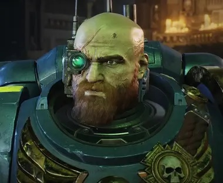
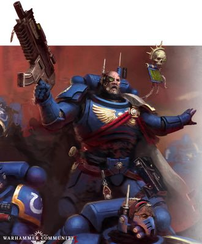
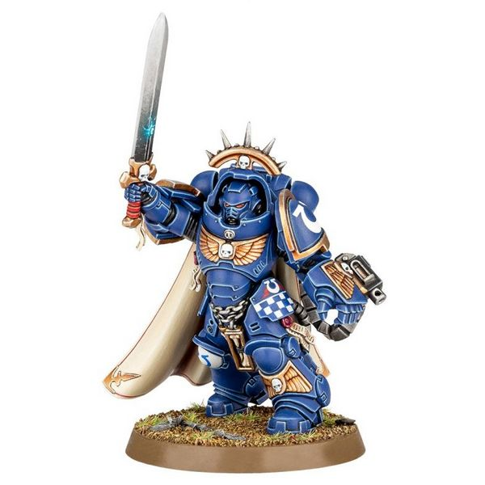
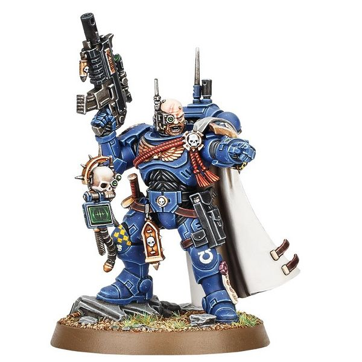

# 0689 西瓦图斯·阿切兰 Sevastus Acheran

精校状态：中文行文已逐段精校，部分术语仍为暂定

分类：人类帝国 / 极限战士

原文来源：https://www.bilibili.com/opus/1113789469189734421

原作者：帝国神选罐头

原文时间：编辑于 2025年11月13日 11:07

[返回分类目录](目录.md) · [全书目录](../../目录.md)

<!-- A0689-B0001 -->
**英文原文**

Sevastus Acheran is the former Captain of the Ultramarines 2nd Company.

<!-- /A0689-B0001 -->

<!-- A0689-B0002 -->

原译文

西瓦图斯·阿切兰是前极限战士第二连队的连长。

**校订译文**

西瓦图斯·阿切兰曾任极限战士第二连连长。

<!-- /A0689-B0002 -->

<!-- A0689-B0003 图片 -->

<!-- A0689-B0004 -->

原译文

Sevastus Acheran 西瓦图斯·阿切兰

**校订译文**

Sevastus Acheran 西瓦图斯·阿切兰

<!-- /A0689-B0004 -->

<!-- A0689-B0005 -->
## Biography 传记

<!-- /A0689-B0005 -->

<!-- A0689-B0006 -->
**英文原文**

Acheran was originally an officer serving under Cato Sicarius in the 2nd Company. However, he became the Captain of the Company after Sicarius was lost to the Warp early in the Indomitus Crusade, due to the formation of the Great Rift.

<!-- /A0689-B0006 -->

<!-- A0689-B0007 -->

原译文

阿切兰最初是卡托·西卡留斯在第二连队的军官。然而，在不屈远征早期，由于大裂隙的形成，西卡留斯迷失在亚空间后，他成为了连长。

**校订译文**

阿切兰最初是第二连中效力于卡托·西卡留斯麾下的军官。不屈远征初期，大裂隙造成的动荡令西卡留斯失陷亚空间，他随后接任连长。

<!-- /A0689-B0007 -->

<!-- A0689-B0008 图片 -->

<!-- A0689-B0009 -->

原译文

Acheran 阿切兰

**校订译文**

Acheran 阿切兰

<!-- /A0689-B0009 -->

<!-- A0689-B0010 -->
### War of Beasts 野兽之战

原题：War of Beasts 野兽战争

<!-- /A0689-B0010 -->

<!-- A0689-B0011 -->
**英文原文**

One of his notable actions was leading the attack on the Black Legion held world of Nemendghast, during the War of Beasts. Despite being badly outnumbered by the Black Legion forces during the Nemendghast Raid, Acheran refused to leave and instead ordered an attack to destroy the world's Daemonic factories.

<!-- /A0689-B0011 -->

<!-- A0689-B0012 -->

原译文

他著名的行动之一是在野兽战争期间领导了对黑色军团控制的攫灵星世界的攻击。尽管在攫灵星突袭中，黑色军团的人数远远超过了阿切兰，但阿切兰拒绝离开，而是下令发动袭击，摧毁世界上的恶魔工厂。

**校订译文**

他的著名战绩之一，是在野兽之战期间突袭黑色军团控制的攫灵星。尽管敌众我寡，他仍拒绝撤退，转而下令摧毁当地的恶魔工厂。

<!-- /A0689-B0012 -->

<!-- A0689-B0013 图片 -->

<!-- A0689-B0014 -->

原译文

Captain Acheran in Gravis Armour 穿着格拉维斯盔甲的阿切兰连长

**校订译文**

Captain Acheran in Gravis Armour 身穿重装型护甲的阿切兰连长

<!-- /A0689-B0014 -->

<!-- A0689-B0015 -->
**英文原文**

The orbiting Chaos fleet soon became alerted to Acheran's attack and as it began moving to aid Nemendghast, the crew of the Captain's Strike Cruiser Carpatia warned Acheran of the fleet. The Captain then immediately led the remnants of his forces in a final attack that destroyed the Daemon factories, but by then they were swarmed by the Black Legion. Acheran knew they could not break free from the Traitors and instead ordered the Vanguard Librarian Maltis, to escape and bring word of what had happened to Chapter Master Calgar. Maltis successfully returned to the Carpatia, which then escaped to Vigilus.

<!-- /A0689-B0015 -->

<!-- A0689-B0016 -->

原译文

轨道上的混沌舰队很快就对阿切兰的攻击发出了警报，当它开始行动援助攫灵星，连长的打击巡洋舰卡帕蒂亚号的船员向阿切兰发出了舰队的警告。随后，连长立即率领他的残余部队进行了最后的进攻，摧毁了恶魔工厂，但到那时，他们已经被黑色军团包围了。阿切兰知道他们无法摆脱叛徒，于是命令先锋智库马尔蒂斯逃跑，并把发生了什么告诉战团长卡尔加。马尔蒂斯成功返回卡帕蒂亚号，然后逃到警戒星。

**校订译文**

轨道上的混沌舰队很快察觉袭击，开始向攫灵星增援。卡帕蒂亚号打击巡洋舰的舰员向阿切兰发出警告后，他立即率残部发动最后一击，摧毁恶魔工厂，却也被黑色军团重重包围。他知道部队已经无法突围，于是命先锋智库员马尔蒂斯单独脱身，将经过禀报卡尔加。马尔蒂斯成功返回卡帕蒂亚号，随舰撤往警戒星。

<!-- /A0689-B0016 -->

<!-- A0689-B0017 -->
### Fourth Tyranic War 第四次泰伦战争

<!-- /A0689-B0017 -->

<!-- A0689-B0018 -->
**英文原文**

During the affair surrounding Project Aurora, Acheran reincorporates Demetrian Titus as a Lieutenant into the 2nd Company. Acheran has some suspicions of Titus due to his history as a Deathwatch Blackshield and detainment by the Inquisition. He later fights under Marneus Calgar against the Thousand Sons on Demerium and congratulates Titus for his efforts after the battle.

<!-- /A0689-B0018 -->

<!-- A0689-B0019 -->

原译文

在围绕极光项目的事件中，阿切兰将德米特里安·泰图斯作为副官重新并入第二连队。阿切兰对泰图斯有一些怀疑，因为他曾是死亡守望黑盾，并被审判庭拘留。后来，他在马涅乌斯·卡尔加的指挥下，在德梅里厄姆与千子作战，并在战斗后祝贺泰图斯的努力。

**校订译文**

“极光计划”相关事件期间，阿切兰让德米特里安·泰图斯以副官身份重新加入第二连。但鉴于泰图斯曾被审判庭拘押，又在死亡守望以黑盾身份服役，阿切兰对他仍有所疑虑。后来，他在卡尔加指挥下于德梅里姆迎战千子，战后向泰图斯表示祝贺，肯定了他的贡献。

<!-- /A0689-B0019 -->

<!-- A0689-B0020 -->
**英文原文**

Sometime later, the Captain led a strike force to Trygg to investigate the disappearance of a Munitorum survey vessel. This was revealed to have been done by a Genestealer Cult and the Captain's forces were destroyed while defending the infested Hive World. Their sacrifice though, greatly reduced the spread of the Cult's rebellion and allowed Trygg to be saved by Imperial reinforcements. Titus would then be selected to succeed Acheran as Captain of the Ultramarines' 2nd Company.

<!-- /A0689-B0020 -->

<!-- A0689-B0021 -->

原译文

不久后，连长率领一支打击部队前往特吕格，调查一艘军务部调查舰的失踪事件。据透露，这是由基因窃取者教派所为，连长的部队在保卫受侵扰的巢都世界时被摧毁。然而，他们的牺牲大大减少了教派的叛乱的蔓延，并使特吕格得以被帝国援军救出。然后，泰图斯被选中接替阿切兰担任极限战士第二连队的连长。

**校订译文**

此后，阿切兰率打击部队前往特吕格，调查一艘军务部勘测舰失踪事件，并查出基因窃取者教派才是幕后元凶。他的部队在保卫这颗遭渗透的巢都世界时全军覆没，却以牺牲有效遏制叛乱扩散，使后续帝国援军得以拯救特吕格。之后，泰图斯被选为继任者，接掌极限战士第二连。

**校注：** 原文将阿切兰部队覆灭及泰图斯继任写作后续事件，照录本篇时间线，不以先前章节的现任状态覆盖。

<!-- /A0689-B0021 -->

<!-- A0689-B0022 图片 -->

<!-- A0689-B0023 -->

原译文

Captain Acheran in Phobos Armour 穿着福波斯盔甲的阿切兰连长

**校订译文**

Captain Acheran in Phobos Armour 身穿恐惧型护甲的阿切兰连长

<!-- /A0689-B0023 -->

本篇核心术语与暂定项

以下列出本篇出现的英文原形及核心术语表用词。同形词可能指不同对象，具体词义以本篇正文和校注为准；单复数、别名和仅见于图注的名称可能尚未列入。完整候选见[术语表](../../术语表/双语术语候选.csv)。

| 英文 | 采用中文 | 状态 |
| --- | --- | --- |
| Deathwatch | 死亡守望 | 官方已核对 |
| Thousand Sons | 千子 | 官方已核对 |
| Librarian | 智库员 | 官方已核对 |
| Ultramarines | 极限战士 | 官方已核对 |
| Warp | 亚空间 | 官方已核对 |
| Great Rift | 大裂隙 | 官方已核对 |
| Inquisition | 审判庭 | 暂定 |
| Indomitus | 不屈学派 | 暂定·学派语境 |
| History | 历史 | 编辑用语已统一 |
| Hive World | 巢都世界 | 暂定·官方待核 |
| Black Legion | 黑色军团 | 暂定·官方待核 |
| Indomitus Crusade | 不屈远征 | 暂定·官方待核 |
| War of Beasts | 野兽之战 | 暂定·官方待核 |
| Vigilus | 警戒星 | 暂定·官方待核 |
| Master | 导师（审判庭职衔）／舰务官（舰员职务） | 语境定译·官方待核 |
| Vanguard Librarian | 先锋智库员 | 暂定·官方待核 |
| Lieutenant | 副官 | 暂定·官方待核 |
| Chapter | 战团 | 暂定·官方待核 |
| Chapter Master | 战团长 | 暂定·官方待核 |
| Captain | 连长 | 暂定·官方待核 |
| Vanguard | 先锋 | 暂定·官方待核 |
| Marneus Calgar | 马涅乌斯·卡尔加 | 暂定·官方待核 |
| Cato Sicarius | 卡托·西卡留斯 | 暂定·官方待核 |
| Sevastus Acheran | 西瓦图斯·阿切兰 | 暂定·官方待核 |
| Remnants | 残骸 | 暂定·官方待核 |
| Strike Cruiser | 打击巡洋舰 | 暂定·官方待核 |
| Trygg | 特吕格 | 暂定·官方待核 |
| Project Aurora | 奥罗拉计划 | 暂定·官方待核 |
| Demerium | 德梅里姆 | 暂定·官方待核 |
| Demetrian Titus | 德米特里安·泰图斯 | 暂定·官方待核 |
| Nemendghast | 攫灵星 | 暂定·官方待核 |
| Carpatia | 卡帕蒂亚号 | 暂定·官方待核 |
| Maltis | 马尔蒂斯 | 暂定·官方待核 |

