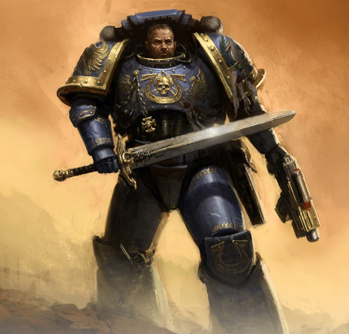
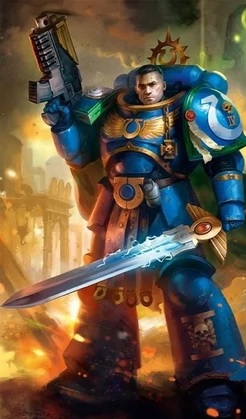
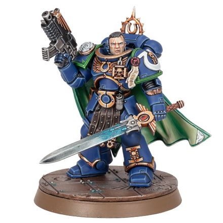

# 0690 乌瑞尔·文崔斯 Uriel Ventris

精校状态：中文行文已逐段精校，部分术语仍为暂定

分类：人类帝国 / 极限战士

原文来源：https://www.bilibili.com/opus/1113799132903899175

原作者：帝国神选罐头

原文时间：2025年09月18日 11:09

[返回分类目录](目录.md) · [全书目录](../../目录.md)

<!-- A0690-B0001 -->
**英文原文**

Uriel Ventris is the current Captain of the Ultramarines 4th Company. He is descended from 1st Company Veteran Sergeant Lucian Ventris, who died in Macragge's northern Polar Fortress during the Battle for Macragge.

<!-- /A0690-B0001 -->

<!-- A0690-B0002 -->

原译文

乌瑞尔·文崔斯现任极限战士第四连队连长。他是第一连队老兵中士卢西安·文崔斯的后裔，卢西安·文崔斯在马库拉格之战中死于马库拉格的北部极地要塞。

**校订译文**

乌瑞尔·文崔斯现任极限战士第四连连长。他的先祖卢西安·文崔斯曾是第一连老兵军士，在马库拉格之战中阵亡于北极要塞。

<!-- /A0690-B0002 -->

<!-- A0690-B0003 图片 -->

<!-- A0690-B0004 -->

原译文

Uriel Ventris from the cover of The Chapter's Due 《战团宿债》封面上的乌瑞尔·文崔斯

**校订译文**

Uriel Ventris from the cover of The Chapter's Due 《战团宿债》封面上的乌瑞尔·文崔斯

<!-- /A0690-B0004 -->

<!-- A0690-B0005 -->
## Biography 传记

<!-- /A0690-B0005 -->

<!-- A0690-B0006 -->
### Early Life 早期生活

<!-- /A0690-B0006 -->

<!-- A0690-B0007 -->
**英文原文**

Born on Calth in 876.M41, Uriel Ventris was raised on an underground farm and worked upon the land since the day he was able to walk. At age six, Ventris was recruited by the Ultramarines and trained at the Agiselus Barracks on Macragge; he graduated in 889.M41 and went on to complete his training at the Fortress of Hera.

<!-- /A0690-B0007 -->

<!-- A0690-B0008 -->

原译文

乌瑞尔·文崔斯于876.M41出生于考斯，他在一个地下农场长大，从能够走路的那一天起就在这片土地上工作。六岁时，文崔斯被极限战士招募，并在马库拉格的阿吉塞卢斯军营接受训练；他于889.M41毕业，并继续在赫拉要塞完成训练。

**校订译文**

乌瑞尔·文崔斯于876.M41出生于考斯，他在一个地下农场长大，从能够走路的那一天起就在这片土地上工作。六岁时，文崔斯被极限战士招募，并在马库拉格的阿吉塞卢斯军营接受训练；他于889.M41毕业，并继续在赫拉要塞完成训练。

<!-- /A0690-B0008 -->

<!-- A0690-B0009 -->
**英文原文**

Nine years later, he became a full-fledged Marine in the Scout Company, and was finally inducted into the Fourth Company in 909.M41. During his training, he discovered he had a natural talent for war and swore to become the best warrior Macragge had ever seen.

<!-- /A0690-B0009 -->

<!-- A0690-B0010 -->

原译文

九年后，他成为侦察连队的一名正式战士，并最终于909.M41被编入第四连队。在训练期间，他发现自己天生就有战争天赋，并发誓要成为马库拉格见过的最好的战士。

**校订译文**

九年后，他成为侦察连队的一名正式战士，并最终于909.M41被编入第四连队。在训练期间，他发现自己天生就有战争天赋，并发誓要成为马库拉格见过的最好的战士。

<!-- /A0690-B0010 -->

<!-- A0690-B0011 -->
### Captain 连长

<!-- /A0690-B0011 -->

<!-- A0690-B0012 -->
**英文原文**

He rose gradually to become a Veteran Sergeant of the Fourth, under Captain Idaeus.

<!-- /A0690-B0012 -->

<!-- A0690-B0013 -->

原译文

他逐渐晋升为第四连队的老兵军士，在伊代奥斯连长的领导下。

**校订译文**

他逐步晋升为伊代奥斯连长麾下的第四连老兵军士。

<!-- /A0690-B0013 -->

<!-- A0690-B0014 -->
**英文原文**

At some point before he attained his Captaincy, Ventris was seconded to the Deathwatch, the Chamber Militant of the Ordo Xenos that specialized in hunting xenos threats.

<!-- /A0690-B0014 -->

<!-- A0690-B0015 -->

原译文

在他获得连长职位之前的某个时刻，文崔斯被借调到死亡守望，这是专门追捕异型威胁的攘外修会的军事辅军。

**校订译文**

成为连长前，他曾被借调至死亡守望——异形审判庭专门猎杀异形威胁的军事组织。

<!-- /A0690-B0015 -->

<!-- A0690-B0016 -->
**英文原文**

At the Battle of Bridge Two-Four on the planet Thracia, Idaeus sacrificed himself to help capture the objective, leaving Ventris in command and giving him Idaeus' power sword.

<!-- /A0690-B0016 -->

<!-- A0690-B0017 -->

原译文

在色雷斯行星上的24之桥之战中，伊代奥斯牺牲了自己来帮助夺取目标，留下文崔斯指挥，并将动力剑交给了他。

**校订译文**

色雷斯行星二四号桥之战中，伊代奥斯为帮助夺取目标牺牲自己，将指挥权与自己的动力剑交给文崔斯。

<!-- /A0690-B0017 -->

<!-- A0690-B0018 -->
**英文原文**

Shortly thereafter, Ventris was confirmed as the new Captain of Fourth Company by Chapter Master Marneus Calgar. His first mission as Captain was to put down a rebellion on the Imperial world of Pavonis. It was on this mission that the Ultramarines encountered the Night Bringer, newly awakened from its millennia-long slumber. After his victory, as a reward and also as a sign of gratitude, Ventris received the White Rose of Pavonis from the inhabitants of the planet, made in the form of a clasp. Since then, Ventrix proudly wears it, fastening his cloak, worn over his power armour.

<!-- /A0690-B0018 -->

<!-- A0690-B0019 -->

原译文

不久之后，文崔斯被马涅乌斯·卡尔加确认为第四连队的新任队长。他作为连长的第一个任务是平息帕沃尼斯帝国世界的叛乱。正是在这次任务中，极限战士遇到了刚刚从数千年的沉睡中醒来的拥夜者。胜利后，作为奖励和感激之情，文崔斯从行星居民那里收到了帕沃尼斯白玫瑰，以扣子的形式制成。从那以后，文崔斯自豪地戴着它，系着他的斗篷，戴在他的动力盔甲上。

**校订译文**

不久，战团长马涅乌斯·卡尔加正式任命文崔斯为第四连连长。他上任后的首项任务，是平定帝国世界帕沃尼斯的叛乱。正是在这次行动中，极限战士遭遇了从数千年沉睡中苏醒的拥夜者。战后，当地居民为表彰并感谢他的功绩，赠予一枚“帕沃尼斯白玫瑰”披风扣。此后，他始终自豪地佩戴这件饰物，用它固定覆在动力甲外的披风。

<!-- /A0690-B0019 -->

<!-- A0690-B0020 -->
### Tarsis Ultra 塔西斯·极限

原题：Tarsis Ultra 塔西斯极限

<!-- /A0690-B0020 -->

<!-- A0690-B0021 -->
**英文原文**

During a boarding action of the space hulk Death of Virtue, Ventris and the Fourth were attacked by hordes of genestealers. Astropaths aboard the Strike Cruiser Vae Victus detected psychic disturbances from a Tyranid Hive Fleet (a tendril of Leviathan) moving towards Tarsis Ultra.

<!-- /A0690-B0021 -->

<!-- A0690-B0022 -->

原译文

在太空废船美德之死号的跳帮行动中，文崔斯和第四连队遭到了成群结队的基因窃取者的袭击。成王败寇号打击巡洋舰上的星语者探测到，一支泰伦虫巢舰队（利维坦的卷须）正在向塔西斯极限移动，并出现了灵能干扰。

**校订译文**

文崔斯率第四连跳帮美德之死号太空废船时，遭到成群基因窃取者袭击。与此同时，成王败寇号打击巡洋舰上的星语者感应到一支泰伦舰队造成的灵能扰动：那是利维坦的一支触须舰队，正向塔西斯·极限逼近。

<!-- /A0690-B0022 -->

<!-- A0690-B0023 -->
**英文原文**

Sworn to honour an ancient oath pledged by Roboute Guilliman to defend the people of Tarsis Ultra, Ventris, on Lord Calgar's orders, enlisted the aid of a Company from the Mortifactors chapter, led by Chaplain Astador.

<!-- /A0690-B0023 -->

<!-- A0690-B0024 -->

原译文

文崔斯宣誓遵守罗伯特·基里曼的古老誓言，捍卫塔西斯极限的人民，在卡尔加领主的命令下，文崔斯获得了由牧师阿斯塔多领导的苦行者战团的一个连队的援助。

**校订译文**

为履行罗保特·基里曼昔日许下的誓言，保护塔西斯·极限居民，文崔斯奉卡尔加之命，请来由阿斯塔多教士率领的苦行者战团一个连助战。

<!-- /A0690-B0024 -->

<!-- A0690-B0025 -->
**英文原文**

Upon arriving on the planet, the Space Marines were further supported by the 10th Logres regiment led by Colonel Octavius Rabelaq, the 933rd Death Korps of Krieg led by Colonel Trymon Stagler, and the PDF Regiments headed by Major Aries Satria. Lord Inquisitor Kryptman was also present to impart his extensive knowledge of the Tyranids to help the war effort, along with a Deathwatch Kill-team led by Captain Bannon.

<!-- /A0690-B0025 -->

<!-- A0690-B0026 -->

原译文

抵达行星后，星际战士得到了奥克塔维斯·拉伯拉克上校领导的洛格斯第十兵团、特里蒙·斯塔格勒上校领导的克里格死亡军团第933兵团和阿瑞斯·萨特里亚少校领导的行星保卫部队兵团的进一步支援。审判官领主克雷普特曼也在场，传授了他对泰伦的广泛知识，以帮助战争努力，还有班农队长领导的死亡守望杀戮小队。

**校订译文**

抵达后，他们又得到屋大维·拉伯拉克上校的洛格斯第十团、特里蒙·斯塔格勒上校的克里格死亡军团第933团，以及阿瑞斯·萨特里亚少校率领的行星防卫军各团支援。审判官领主克瑞普特曼也在当地，以丰富的泰伦知识协助防御；班农连长率领的一支死亡守望杀戮小队随他同行。

<!-- /A0690-B0026 -->

<!-- A0690-B0027 -->
**英文原文**

When the Tyranids arrived in the system and consumed the planet Barbarus Prime, the Imperials launched an attack in space. Despite an initial victory in destroying a Hive Ship, Inquisitor Kryptman wished to invoke Exterminatus upon the next world in the Tyranids' path, Chordelis, to prevent it from being devoured and swelling the Tyranids' numbers, as planetary evacuation was too slow. Ventris was vehemently against this decision, and supported an alternative solution proposed by Lord Admiral Lazlo Tiberius to slow down the Tyranids by exploding a hydrogen-plasma refinery in space to destroy another Hive Ship. However, Kryptman had lied to Ventris and, with the assistance of the Mortifactors, invoked Exterminatus in spite of the Ultramarines' plan succeeding. The Imperials attempted the same trick again with a second space refinery to destroy another Hiveship. However, the Tyranids adapted to this ploy and the plan backfired horribly on the Imperials, crippling their fleet and forcing the survivors to flee; Tarsis Ultra was left unprotected from space, which allowed the Tyranids to launch their long-dreaded planetary invasion.

<!-- /A0690-B0027 -->

<!-- A0690-B0028 -->

原译文

当泰伦抵达该星系并吞噬了巴巴鲁斯主星时，帝国部队在太空发动了攻击。尽管在摧毁一艘虫巢舰方面取得了初步胜利，但检察官克雷普特曼希望在泰伦路径上的下一个世界科德里斯上调用灭绝令，以防止它被吞噬，并使泰伦的数量膨胀，因为行星疏散太慢。文崔斯强烈反对这一决定，并支持海军上将拉兹洛·提比略提出的另一种解决方案，即通过在太空中爆炸一个氢等离子体精炼厂来摧毁另一艘虫巢舰，从而减缓泰伦的速度。然而，克雷普特曼对文崔斯撒了谎，在苦行者的协助下，尽管极限战士的计划成功了，他还是调用了灭绝令。帝国再次尝试同样的伎俩，建造了第二座太空精炼厂，摧毁了另一艘虫巢舰。然而，泰伦适应了这一策略，该计划对帝国部队造成了可怕的适得其反，使他们的舰队瘫痪，迫使幸存者逃离；塔西斯极限在太空中没有受到保护，这使得泰伦能够发动他们长期以来可怕的行星入侵。

**校订译文**

泰伦进入星系并吞噬巴巴鲁斯一号后，帝国军队在太空迎战，先成功摧毁一艘虫巢舰。然而，由于疏散速度太慢，克瑞普特曼仍打算对泰伦前进路线上的下一颗星球科德里斯执行灭绝令，避免其人口与生物质成为敌军扩张的养料。文崔斯强烈反对，转而支持海军上将拉兹洛·提比略的方案：引爆一座太空氢等离子精炼厂，摧毁另一艘虫巢舰，延缓敌军。但克瑞普特曼欺骗了他，即使这一方案成功，仍在苦行者协助下执行了灭绝令。帝国舰队后来试图故技重施，以第二座精炼厂摧毁又一艘虫巢舰；泰伦却已适应这种战术，反令计策酿成灾难。帝国舰队遭到重创，幸存舰只被迫逃离，塔西斯·极限失去了太空屏障，众人一直畏惧的地面入侵终于开始。

**校注：** 第二次精炼厂计策失败；原译增添建造精炼厂并成功摧毁虫巢舰，与后句矛盾，已纠正。

<!-- /A0690-B0028 -->

<!-- A0690-B0029 -->
**英文原文**

During the Tyranid attacks on Tarsis Ultra, Ventris still found himself haunted by his experiences with the C'tan, the Night Bringer; he managed to move on following spiritual advice from Sister Joaniel of the Orders Hospitaller during prayer in the medicae chapel.

<!-- /A0690-B0029 -->

<!-- A0690-B0030 -->

原译文

在泰伦对塔西斯极限的袭击中，文崔斯仍然被他与星神拥夜者的经历所困扰；在医疗教堂祈祷时，他设法听从了医疗修会的琼尼尔修女的精神建议。

**校订译文**

泰伦进攻塔西斯·极限期间，文崔斯仍受与星神拥夜者交锋的经历困扰。直到在医疗礼拜堂祈祷时，听取医疗修会琼尼尔修女的精神劝导，他才得以走出阴影。

<!-- /A0690-B0030 -->

<!-- A0690-B0031 -->
**英文原文**

Ventris assisted Captain Bannon and his team in capturing a Lictor; this proved pivotal during the war, as Kryptman's Magos Biologis aide, Vianco Locard, was able to concoct venom from the Lictor's genetic structure that would send an early generation Tyranid into hyper-evolution, killing the creature. Unfortunately, the only way to utilize this venom effectively was to board the last remaining Hive Ship in orbit and infect the Tyranids' Norn-Queen.

<!-- /A0690-B0031 -->

<!-- A0690-B0032 -->

原译文

文崔斯协助班农队长和他的小队抓获了一只利卡特；这在战争期间被证明是至关重要的，因为克雷普特曼的助手生物贤者维安科·洛卡德能够从利卡特的遗传结构中制造出毒液，这将使早期的一批泰伦进入超进化阶段，杀死这种生物。不幸的是，有效利用这种毒液的唯一方法是登上轨道上最后一艘剩下的虫巢舰，感染泰伦的诺恩女王。

**校订译文**

文崔斯协助班农小队活捉了一只刀斧虫，这成为战事的转折点。克瑞普特曼的助手、生物贤者维安科·洛卡德根据其遗传结构配制出一种毒剂，可令早期世代的泰伦生物发生失控的过度进化，直至死亡。但要有效运用这种毒剂，他们必须登上轨道上最后一艘虫巢舰，将其注入诺恩女王体内。

<!-- /A0690-B0032 -->

<!-- A0690-B0033 -->
**英文原文**

Out of respect for Captain Bannon, who had died in an earlier mission in destroying another Hiveship, Ventris assumed command of the Deathwatch team before its boarding mission. This was in breach of the Codex Astartes, when Ventris ceded command of his men on the planet to his senior Sergeant, Learchus Abantes.

<!-- /A0690-B0033 -->

<!-- A0690-B0034 -->

原译文

出于对班农队长的尊重，班农队长在早些时候摧毁另一艘虫巢舰的任务中牺牲，文崔斯在跳帮任务之前接管了死亡守望的指挥权。这违反了《阿斯塔特圣典》，文崔斯将他在这个行星上的部下的指挥权交给了他的高级军士利尔克斯·阿班忒斯。

**校订译文**

班农连长已在此前摧毁另一艘虫巢舰的任务中牺牲。为致敬这位同袍，文崔斯在跳帮行动前接掌死亡守望小队，将地面部队交由资深军士利尔克斯·阿班忒斯指挥；这一决定违反了《阿斯塔特圣典》。

<!-- /A0690-B0034 -->

<!-- A0690-B0035 -->
**英文原文**

Ventris, Pasanius, and the Deathwatch team managed to finally kill the last Norn-Queen with Kryptman's gene-poison. However, at the last moment Ventris himself was poisoned by the Norn-Queen, causing his entire bloodstream to clot within his body. He would have died but for a full blood transfusion contributed by Pasanius, which kept him alive until they got him medical care on Tarsis Ultra. The remaining Space Marine contingent of both the Ultramarines and Mortifactors were down to sixteen men when the Tyranids started to attack each other, as the link with the Hive Mind was lost when the last Norn-Queen died. The psychic shockwave of the overmind's death affected the Tyranids into slaughtering each other senselessly, leaving the Imperials alone. The majority froze to death under the harsh conditions of Tarsis Ultra with a minority surviving and taking refuge in warmer surroundings. At the conclusion of the war, Ventris reaffirmed his faith as an Ultramarine to protect the Imperium from the enemies of Mankind.

<!-- /A0690-B0035 -->

<!-- A0690-B0036 -->

原译文

文崔斯、帕萨尼乌斯和死亡守望小队最终用克雷普特曼的基因毒药杀死了最后一位诺恩女王。然而，在最后一刻，文崔斯本人被诺恩女王毒中，导致他的全身血液在体内凝结。要不是帕萨尼乌斯给他输血，他早就死了，这让他活了下来，直到他们在塔西斯极限给他治疗。当泰伦开始互相攻击时，极限战士和苦行者的剩余星际战士特遣队都减少到了16人，因为最后一位诺恩女王死亡后，与虫巢思维的联系消失了。主宰生物之死的灵能冲击波影响了泰伦，他们毫无意义地互相残杀，只留下帝国。大多数人在塔西斯极限的恶劣条件下冻死，少数人幸存下来，在温暖的环境中避难。战争结束时，文崔斯重申了他作为极限战士的信念，保护帝国免受人类之敌的侵害。

**校订译文**

文崔斯、帕撒尼乌斯与死亡守望小队终于用克瑞普特曼的基因毒剂杀死最后一只诺恩女王。然而，文崔斯在最后关头也中了女王的毒，全身血液开始凝结。帕撒尼乌斯为他提供血液，进行全面换血，才让他坚持到返回塔西斯·极限接受救治。此时，极限战士与苦行者的参战兵力合计只剩十六人。最后一只诺恩女王之死切断了虫群与虫巢意志的联系，灵能冲击令泰伦陷入无序的自相残杀，不再攻击帝国部队。大多数泰伦随后冻死于当地严寒，少数则躲入温暖区域存活。战后，文崔斯重新坚定了作为极限战士的信念：保护帝国，抵御人类之敌。

**校注：** 冻死者与幸存者均指泰伦，并非帝国士兵；参战星际战士十六人是两战团合计，不是各剩十六人。

<!-- /A0690-B0036 -->

<!-- A0690-B0037 -->
### Exile 流放

<!-- /A0690-B0037 -->

<!-- A0690-B0038 -->
**英文原文**

Despite Ventris's sincere belief that his actions had been correct, Learchus reported his and Pasanius's breaches of the Codex to Chapter command. Ventris and Pasanius were both arrested and placed on trial. Based on some discreet advice from Lord Calgar (passed along by First Captain Agemman), Ventris and Pasanius waived their rights to defend themselves, so as to prevent their example from being followed by others and causing anarchy in the Ultramarines.

<!-- /A0690-B0038 -->

<!-- A0690-B0039 -->

原译文

尽管文崔斯真诚地相信他的行为是正确的，但利尔克斯向战团指挥官报告了他和帕萨尼乌斯违反圣典的行为。文崔斯和帕萨尼乌斯均已被捕并接受审判。根据卡尔加领主的一些谨慎建议（由第一连长阿格曼转达），文崔斯和帕萨尼乌斯放弃了自护的权利，以防止他们作为榜样被其他人效仿，在极限战士中造成混乱。

**校订译文**

文崔斯坚信自己做得正确，但利尔克斯仍向战团高层报告他与帕撒尼乌斯违背圣典的行为。两人被捕受审。根据第一连长阿格曼转达的卡尔加的私下建议，他们放弃为自己辩护，以免其他人效仿，导致战团纪律崩溃。

<!-- /A0690-B0039 -->

<!-- A0690-B0040 图片 -->

<!-- A0690-B0041 -->

原译文

Uriel Ventris as a Primaris Space Marine 作为原铸星际战士的乌瑞尔·文崔斯

**校订译文**

Uriel Ventris as a Primaris Space Marine 作为原铸星际战士的乌瑞尔·文崔斯

<!-- /A0690-B0041 -->

<!-- A0690-B0042 -->
**英文原文**

Instead of death, their punishment was to be bound to a Death Oath and exiled from the Chapter. All insignia of the Ultramarines, which included the symbol on their shoulderguards, were removed. Upon leaving the Fortress of Hera to embark on the March of Shame, they were commanded by Calgar to seek and destroy daemonic womb creatures, the Daemonculaba, seen in a vision by the Chief Librarian Varro Tigurius.

<!-- /A0690-B0042 -->

<!-- A0690-B0043 -->

原译文

他们的惩罚不是死刑，而是受死亡誓言的约束，并被逐出战团。极限战士的所有徽章，包括肩甲上的符号，都被移除了。离开赫拉要塞踏上耻辱之旅后，卡尔加命令他们寻找并摧毁恶魔子宫造物混沌胎囊，这是首席智库瓦罗·狄格里斯在幻象中看到的。

**校订译文**

两人并未被处死，而是被逐出战团，立下死亡誓言。他们身上一切极限战士标志都被移除，肩甲徽记也不例外。离开赫拉要塞、踏上耻辱之旅时，卡尔加命他们寻找并摧毁首席智库员狄格里斯在异象中看见的恶魔子宫造物——混沌胎囊。

<!-- /A0690-B0043 -->

<!-- A0690-B0044 -->
**英文原文**

Ventris and Pasanius left Macragge on a vessel, as the Imperial Guard Regiment aboard, the Macragge 808th, was bound to fight against the 13th Black Crusade in the Segmentum Obscurus.

<!-- /A0690-B0044 -->

<!-- A0690-B0045 -->

原译文

文崔斯和帕萨尼乌斯乘坐一艘船离开了马库拉格，因为船上的帝国卫队第808团注定要在朦胧星域与第13次黑色远征作战。

**校订译文**

文崔斯与帕撒尼乌斯搭乘一艘载兵船离开马库拉格。船上运输的是帝国卫队马库拉格第808团，正前往朦胧星域抵御第十三次黑色远征。

<!-- /A0690-B0045 -->

<!-- A0690-B0046 -->
### Medrengard 梅德林加德

<!-- /A0690-B0046 -->

<!-- A0690-B0047 -->
**英文原文**

During transit in the Warp, the ship's Geller Field inexplicably failed, and all those within the ship perished, except for Ventris and Pasanius. A daemon known as the Omphalos Daemonium appeared, and overpowered the Ultramarines, taking them captive on board his Daemon Engine. They were transported to the Iron Warriors homeworld, Medrengard, and charged with the task of retrieving the Heart of Blood from the fortress of Khalan-Ghol. Threatened with the annihilation of Macragge and Ultramar, Ventris complied with the Omphalos's demands. However, after the daemon departed, Ventris assured Pasanius that he would not honour the pact, and instead would destroy the Heart of Blood.

<!-- /A0690-B0047 -->

<!-- A0690-B0048 -->

原译文

在亚空间的运输过程中，船上的盖勒力场莫名其妙地失灵了，船上所有人都遇难了，除了文崔斯和帕萨尼乌斯。一个被称为翁法罗斯·戴莫尼厄姆的恶魔出现了，并制服了极限战士，将他们俘虏在他的恶魔引擎上。他们被运送到钢铁勇士的家园世界梅德林加德，并负责从卡兰·戈尔的堡垒中取回鲜血之心。受到马库拉格和奥特拉玛被歼灭的威胁，文崔斯遵从了翁法罗斯的要求。然而，在恶魔离开后，文崔斯向帕萨尼乌斯保证，他不会遵守协议，而是会摧毁鲜血之心。

**校订译文**

亚空间航行途中，舰船的盖勒力场不明原因地失效，除文崔斯与帕撒尼乌斯外，舰上所有人尽数丧命。名为翁法洛斯恶魔的存在现身，制服两人，将他们掳上自己的恶魔引擎，送往钢铁勇士母星梅德林加德。它要求两人从卡兰·戈尔要塞取回鲜血之心，并以毁灭马库拉格与奥特拉玛相威胁。文崔斯表面应允；恶魔离去后，他却向帕撒尼乌斯保证，自己绝不会践约，而要摧毁鲜血之心。

**校注：** Heart of Blood 沿原稿鲜血之心，作为恶魔专名处理。

<!-- /A0690-B0048 -->

<!-- A0690-B0049 -->
**英文原文**

During their journey, Ventris and Pasanius encountered renegade Space Marines, led by former Raven Guard Shadow Captain Ardaric Vaanes. The Ultramarines followed the renegades to their sanctuary, and met the few remaining survivors of 383rd Jouran Dragoons, left after the Iron Warriors overran the Forge World of Hydra Cordatus. Based on what he heard from the renegades, Ventris worked out that the new castellan of Khalan-Ghol, Warsmith Honsou, had created a new "factory" of Chaos Space Marines, using the Heart of Blood (a powerful daemon) and geneseed captured from Hydra Cordatus.

<!-- /A0690-B0049 -->

<!-- A0690-B0050 -->

原译文

在旅途中，文崔斯和帕萨尼乌斯遇到了由前暗鸦守卫暗影连长阿达里克·万纳斯领导的叛变星际战士。极限战士跟随叛军前往他们的避难所，并会见了钢铁勇士占领九头蛇之心铸造世界后留下的约兰龙骑兵第383兵团的少数幸存者。根据他从叛徒那里听到的消息，文崔斯推断出，卡兰·戈尔的新城主战争铁匠洪索已经使用从九头蛇之心捕获的鲜血之心（一个强大的恶魔）和基因种子创建了一个新的混沌星际战士“工厂”。

**校订译文**

途中，两人遇见前暗鸦守卫暗影连长阿达里克·瓦内斯率领的变节星际战士。他们随这些人来到避难所，见到了约兰第383龙骑兵团寥寥无几的幸存者；其余部队已在钢铁勇士攻陷铸造世界海德拉之心时覆灭。从众人口中，文崔斯推断出：卡兰·戈尔的新任城主、战争铁匠洪索，利用强大恶魔鲜血之心，以及从海德拉之心夺来的基因种子，建起了一座生产混沌星际战士的新“工厂”。

**校注：** 原文仅将基因种子明确联系到海德拉之心，不能将鲜血之心也写作在那里被捕获。

<!-- /A0690-B0050 -->

<!-- A0690-B0051 -->
**英文原文**

Ventris led the renegades in an assault on Khalan-Ghol, which was already under siege by Honsou's rival Warsmiths, Toramino and Berossus. After an initial encounter with Honsou and his retinue, Ventris led his band inside the fortress only to be captured by the Iron Warriors. On the orders of Honsou, Ventris was to be fed to the daemonculabu and the rest were sent to the Savage Morticians to be killed. Ventris escaped and succeeded in freeing the others, and led them in escaping the fortress through the sewer systems. The foray in the fortress cost them dear, as only four survived with Ventris and Pasanius: Vaanes, Colonel Mikail Leonid and two other renegades. The survivors were then captured by monstrous mutants known as the Unfleshed and taken to their home.

<!-- /A0690-B0051 -->

<!-- A0690-B0052 -->

原译文

文特里斯率领叛军袭击了卡兰·戈尔，卡兰·戈尔已经被洪苏的战争铁匠对手、托拉米诺和贝罗索斯围困。在与洪索和他的随从初次相遇后，文崔斯带领他的战帮进入堡垒，却被钢铁勇士俘虏。根据洪索的命令，文崔斯将被喂给恶魔子宫，其余的则被送到野蛮葬仪师处被杀死。文崔斯成功逃脱，解放了其他人，并带领他们通过下水道系统逃离了堡垒。对堡垒的突袭让他们付出了巨大的代价，因为只有四个人和文崔斯和帕萨尼乌斯幸存下来：瓦内斯、米凯尔·莱昂尼德上校和其他两名叛徒。幸存者随后被称为无皮者的怪物变种人捕获，并被带回家。

**校订译文**

文崔斯率变节战士进攻卡兰·戈尔，此时要塞正遭洪索的两位竞争者——战争铁匠托拉米诺与贝罗索斯——围攻。他们与洪索及其随从初次交手后深入要塞，却被钢铁勇士俘虏。洪索命人将文崔斯送入混沌胎囊，其余人交给野蛮葬仪师处死。文崔斯成功逃脱，救出同伴，再率他们通过下水道逃离。这次潜入代价惨重：除两名极限战士外，仅瓦内斯、米凯尔·莱昂尼德上校及另两名变节战士幸存。他们随后又被称为无皮者的怪异变种人捕获，带回其巢穴。

<!-- /A0690-B0052 -->

<!-- A0690-B0053 -->
**英文原文**

The Unfleshed were the mutated rejects of the Daemonculaba; born disfigured and without skin, they were cast away by their creators. The Iron Warriors mass-produced skin to flesh newly born Iron Warriors, but those rejected were discarded. Ventris convinced the Unfleshed, who still worshipped the Emperor, to join him in his mission to destroy Khalan-Ghol. Vaanes and the other renegades abandoned Ventris, except for Leonid.

<!-- /A0690-B0053 -->

<!-- A0690-B0054 -->

原译文

无皮者是恶魔子宫的变异排斥物；它们生来就有缺陷，没有皮肤，被创造者抛弃了。钢铁勇士大规模生产了新诞生的钢铁勇士，但那些被拒绝的钢铁勇士被丢弃了。文崔斯说服了仍然信仰帝皇的无皮者加入他的任务，摧毁卡兰·戈尔。瓦内斯和其他叛徒抛弃了文崔斯，除了莱昂尼德。

**校订译文**

无皮者是混沌胎囊制造出的畸变弃儿，生来残缺而没有皮肤，被创造者抛弃。钢铁勇士大规模培育皮肤，用于包覆新生战士的身体，却将这些不合格的产物丢弃。无皮者仍然崇拜帝皇，文崔斯便说服他们一同摧毁卡兰·戈尔。瓦内斯与其他变节战士放弃了这次行动，只有莱昂尼德留在他身边。

**校注：** 原文 mass-produced skin 指大量培育皮肤，原译漏掉皮肤而变成量产战士，补回。

<!-- /A0690-B0054 -->

<!-- A0690-B0055 -->
**英文原文**

Ventris and the Unfleshed infiltrated the heart of the fortress, and whilst the Unfleshed fought against the guards, Ventris and Pasanius freed the Heart of Blood. Once freed, the psychic barriers protecting the fortress fell, allowing the Omphalos Daemonium to appear and fight against its bitter rival.

<!-- /A0690-B0055 -->

<!-- A0690-B0056 -->

原译文

文崔斯和无皮者渗透到堡垒的中心，当无皮者与守卫作战时，文崔斯与帕萨尼乌斯释放了鲜血之心。一旦被释放，保护堡垒的灵能屏障就倒塌了，让翁法罗斯·戴莫尼厄姆显现并与它的宿敌作战。

**校订译文**

文崔斯与无皮者潜入要塞核心。无皮者牵制守卫时，他和帕撒尼乌斯释放了鲜血之心。恶魔脱困，保护要塞的灵能屏障随之崩溃，让翁法洛斯恶魔得以现身，与自己的宿敌交战。

<!-- /A0690-B0056 -->

<!-- A0690-B0057 -->
**英文原文**

During the battle between the two daemons, Ventris and Pasanius made their escape, and Leonid sacrificed himself to prevent the Sarcomata from stopping them. However, the Ultramarines were cornered by Honsou and his retinue who outnumbered them. At the very last moment, the Unfleshed saved them by attacking and killing the whole retinue; Ventris managed to shoot Honsou, wounding him. At the point of being defeated, the Heart of Blood conjured up a bloodstorm which killed all nearby, including the daemonculabula. Having been strengthened by the bloodstorm, the daemon went on to defeat Omphalos Daemonium, and collapsed out of exhaustion in the aftermath. The Ultramarines' final action at Medrengard was to board with the Unfleshed, upon the Daemon Engine left behind by the Omphalos Daemonium, to escape imprisonment beneath the fortress.

<!-- /A0690-B0057 -->

<!-- A0690-B0058 -->

原译文

在两个恶魔之间的战斗中，文崔斯和帕萨尼乌斯逃跑了，莱昂尼德牺牲了自己，以防止无面肉瘤阻止他们。然而，极限战士被数量超过他们的洪索和他的随从逼到了绝境。在最后一刻，无皮者通过攻击并杀死所有随从来拯救他们；文崔斯设法射击了洪索，使他受伤。在快被打败的时候，鲜血之心召唤出了一场鲜血风暴，杀死了附近的所有人，包括恶魔子宫 。在鲜血风暴的加强下，恶魔继续击败了翁法罗斯·戴莫尼厄姆，并在事后筋疲力尽地倒下了。极限战士在梅德林加德的最后行动是与无皮者一起登上翁法罗斯·戴莫尼厄姆留下的恶魔引擎，以逃离堡垒下的监禁。

**校订译文**

趁两头恶魔激战，文崔斯与帕撒尼乌斯开始撤离。莱昂尼德舍命阻挡无面肉瘤，掩护两人，却仍未能让他们避开洪索及其众多随从的包围。危急之际，无皮者赶来，杀死全部随从，救下两人；文崔斯也开枪打伤了洪索。即将落败的鲜血之心此时唤起一场血暴，杀死周围生灵，包括混沌胎囊。血暴又增强了它的力量，使它最终击败翁法洛斯恶魔，随后力竭倒下。两名极限战士最后与无皮者一起登上翁法洛斯恶魔遗留的恶魔引擎，逃离要塞地下，离开梅德林加德。

<!-- /A0690-B0058 -->

<!-- A0690-B0059 -->
### Salinas 萨利纳斯

<!-- /A0690-B0059 -->

<!-- A0690-B0060 -->
**英文原文**

After departing the Eye of Terror, Ventris and Pasanius arrived on the troubled planet of Salinas. Here, they established contact with Imperial forces, and were taken to the Imperial fortress to await judgement. The Imperial Guard stationed on Salinas had become corrupt and debased, having killed thousands of innocent civilians just to get to the rebel leader. As such, the remaining rebels constantly attacked the Imperial Guard whenever they could, turning Ventris and Pasanius into prime targets. While there, the Unfleshed were quickly possessed by the souls of those killed, and they turned on the Imperial Guard stationed on the planet. Having detected a strong Warp influence on the planet, a detachment of Grey Knights was sent to investigate. They captured Ventris and Pasanius and held trials to determine their loyalty to the Emperor. After passing the trials, Ventris, Pasanius, and the Grey Knights were sent to kill the Unfleshed. After incurring terrible losses, the Grey Knights returned the two to Macragge.

<!-- /A0690-B0060 -->

<!-- A0690-B0061 -->

原译文

离开恐惧之眼后，文崔斯和帕萨尼乌斯抵达了陷入困境的萨利纳斯行星。在这里，他们与帝国军队建立了联系，并被带到帝国要塞等待判决。驻扎在萨利纳斯的帝国卫队已经变得腐化和堕落，仅仅为了找到叛军领袖就杀害了数千名无辜平民。因此，剩下的叛军只要有可能，就会不断袭击帝国卫队，将文崔斯和帕萨尼乌斯变成主要目标。在那里，无皮者很快就被那些被杀者的灵魂所附，他们转而攻击驻扎在这个行星上的帝国卫队。在探测到行星上强烈的亚空间影响后，一支灰骑士分队被派去调查。他们俘虏了文崔斯和帕萨尼乌斯，并进行了审判，以确定他们对帝皇的忠诚。通过考验后，文崔斯、帕萨尼乌斯和灰骑士被派去杀死无皮者。在遭受惨重损失后，灰骑士将两人送回了马库拉格。

**校订译文**

离开恐惧之眼后，文崔斯与帕撒尼乌斯来到动荡的萨利纳斯。他们联络当地帝国军，随后被带往要塞等待裁决。驻军早已腐败堕落，仅为追捕叛军首领便杀害数千无辜平民。幸存叛军因此不断伺机报复，也将两名极限战士列为重点目标。同行的无皮者很快被遇害者的亡魂附体，转而攻击驻守的帝国卫队。灰骑士察觉强烈的亚空间影响，派分队前来调查，拘押文崔斯与帕撒尼乌斯，检验他们对帝皇的忠诚。两人通过试炼后，与灰骑士一同清剿无皮者。行动造成惨重损失，结束后，灰骑士将两人送回马库拉格。

<!-- /A0690-B0061 -->

<!-- A0690-B0062 -->
### Return 回归

<!-- /A0690-B0062 -->

<!-- A0690-B0063 -->
**英文原文**

In early M42, a scarred and aged Ventris reappeared, once again leading the 4th Company during the return of Roboute Guilliman. Ventris has since crossed the Rubicon Primaris and took part in the Indomitus Crusade. However another source states Ventris and his 4th Company took part in the Ultramar Campaign and Terran Crusade, meeting Guilliman earlier than initially depicted.

<!-- /A0690-B0063 -->

<!-- A0690-B0064 -->

原译文

在M42早期，一个伤痕累累的苍老的文崔斯再次出现，在罗伯特·基里曼回归期间再次领导第四连队。此后，文崔斯越过原铸界限，参加了不屈远征。然而，另一个消息来源称，文崔斯和他的第四连队参加了奥特拉玛战役和泰拉远征，比最初描述的更早地会见了基里曼。

**校订译文**

第42个千年初，饱经沧桑、满身伤疤的文崔斯再次出现，在基里曼回归时期重新统率第四连。此后，他接受原铸跨越手术，并参加不屈远征。但另有资料称，他与第四连已参加此前的奥特拉玛战役及泰拉远征，与基里曼相见的时间因而早于前述版本。

<!-- /A0690-B0064 -->

<!-- A0690-B0065 图片 -->

<!-- A0690-B0066 -->

原译文

Uriel Ventris as a Primaris Space Marine 作为原铸星际战士的乌瑞尔·文崔斯

**校订译文**

Uriel Ventris as a Primaris Space Marine 作为原铸星际战士的乌瑞尔·文崔斯

<!-- /A0690-B0066 -->

<!-- A0690-B0067 -->
### Sycorax 西考拉克斯

<!-- /A0690-B0067 -->

<!-- A0690-B0068 -->
**英文原文**

A few months after becoming a Primaris Space Marine, Ventris is deployed to the world of Sycorax alongside other 4th Company veterans such as Pasanius Lysane and Learchus Abantes in order to battle the Necron forces there which are rumored to include a shard of the Nightbringer. Fighting alongside Mechanicum forces from Lucius, Imperial Guard, and the Legio Astorum Ventris and the other Imperials are able to defeat the shard of the Nightbringer.

<!-- /A0690-B0068 -->

<!-- A0690-B0069 -->

原译文

在成为原铸星际战士几个月后，文崔斯与帕萨尼乌斯·莱萨尼和利尔克斯·阿班忒斯等其他第四连队老兵一起被部署到西考拉克斯世界，以与那里的死灵部队作战，据传那里有一块拥夜者的碎片。文崔斯与来自卢修斯的机械教部队、帝国卫队和星象军团并肩作战，其他帝国部队能够击败拥夜者的碎片。

**校订译文**

完成原铸改造数月后，文崔斯与帕撒尼乌斯·莱萨尼、利尔克斯·阿班忒斯等第四连老兵一同前往西考拉克斯，迎战据说包含拥夜者碎片在内的太空死灵。他们与来自卢修斯的机械教部队、帝国卫队及星象军团并肩作战，最终击败了那块拥夜者碎片。

**校注：** 原文在原铸时期仍使用 Mechanicum，按本书机械教对应保留，标记其与通常时代称呼 Adeptus Mechanicus 的用词差异。

<!-- /A0690-B0069 -->

<!-- A0690-B0070 -->
### Plague Wars 瘟疫战争

<!-- /A0690-B0070 -->

<!-- A0690-B0071 -->
**英文原文**

Later Ventris journeyed to the Macragge's Honour personally to tell Guilliman of Mortarion's invasion of Ultramar.

<!-- /A0690-B0071 -->

<!-- A0690-B0072 -->

原译文

后来，文崔斯亲自前往马库拉格之耀号，告诉基里曼莫塔里安入侵了奥特拉玛。

**校订译文**

后来，文崔斯亲自前往马库拉格之耀号，告诉基里曼莫塔里安入侵了奥特拉玛。

<!-- /A0690-B0072 -->

<!-- A0690-B0073 -->
## Conflicting sources 来源冲突

<!-- /A0690-B0073 -->

<!-- A0690-B0074 -->
**英文原文**

In Warriors of Ultramar (Novel), Uriel leads the Fourth Company on Tarsis Ultra, after taking command from Idaeus. According to the timeline in Codex: Space Marines (5th Edition) (which came out 8 years later), Uriel succeeded Idaeus as Captain of the Fourth Company in 010999.M41, according to this same timeline, the Ultramarines' participation in the Tarsis Ultra campaign took place in 5909997.M41, when Idaeus would have been Captain of the Fourth. However Codex: Tyranids (8th Edition) (which released in 2017) reaffirms that Uriel Ventris led the defense of Tarsis Ultra, though it gives no official date for the battle.

<!-- /A0690-B0074 -->

<!-- A0690-B0075 -->

原译文

在《奥特拉玛勇士》（小说）中，乌瑞尔在从伊代奥斯手中接过指挥权后，领导了塔西斯极限的第四连队。根据《圣典：星际战士》（第5版）（8年后出版）的时间表，乌瑞尔于010999.M41接替伊代奥斯担任第四连队连长。根据同一时间表，极限战士参加塔西斯极限战役发生在590997.M41，当时伊代奥斯担任第四连队连长。然而，《圣典：泰伦虫族》（第8版）（2017年发布）重申了乌瑞尔·文崔斯领导了塔西斯极限的防御，尽管它没有给出战斗的正式日期。

**校订译文**

小说《奥特拉玛勇士》中，文崔斯已接替伊代奥斯，率第四连保卫塔西斯·极限。八年后出版的《圣典：星际战士》第五版编年表却将他接任连长的时间列为010999.M41，而该书又把塔西斯·极限战役列在5909997.M41，此时依其叙事应仍由伊代奥斯统率第四连。2017年出版的《圣典：泰伦》第八版再次确认文崔斯指挥了当地防御，但未给出具体战役日期。

**校注：** 英文日期写作5909997.M41，数字位数异常；原译为590997.M41，疑已自行删一位。本次保留英文所给日期并标待核，不在无来源情况下断定正确年份。

<!-- /A0690-B0075 -->

<!-- A0690-B0076 -->
**英文原文**

Consequences (Short Story) dates the trial and Death Oath of Uriel and Pasanius as taking place in 999.M41. However Codex Supplement: Ultramarines (8th Edition) states that their exile lasted several years. this would make the 999.M41 date impossible as it means they would have to return after the opening of the Great Rift, and both characters participated in the Invasion of Ultramar which took place before it.

<!-- /A0690-B0076 -->

<!-- A0690-B0077 -->

原译文

《后果》（短篇小说）将乌瑞尔和帕萨尼乌斯的审判和死亡誓言定在999.M41。然而，《圣典补充：极限战士》（第8版）指出，他们的流亡持续了几年。 这使999.M41的日期变得不可能，因为这意味着他们必须在大裂隙打开后返回，而这两个角色都参加了之前发生的奥特拉玛入侵。

**校订译文**

短篇小说《后果》将文崔斯与帕撒尼乌斯的审判及死亡誓言定于999.M41；《圣典补充：极限战士》第八版却说两人被流放数年。按本篇所述，两种日期无法相容：若999.M41才开始流放，他们就须在大裂隙开启后归来，但两人又都参加了裂隙开启前的奥特拉玛入侵战。

<!-- /A0690-B0077 -->

本篇核心术语与暂定项

以下列出本篇出现的英文原形及核心术语表用词。同形词可能指不同对象，具体词义以本篇正文和校注为准；单复数、别名和仅见于图注的名称可能尚未列入。完整候选见[术语表](../../术语表/双语术语候选.csv)。

| 英文 | 采用中文 | 状态 |
| --- | --- | --- |
| Space Marines | 星际战士 | 官方已核对 |
| Deathwatch | 死亡守望 | 官方已核对 |
| Grey Knights | 灰骑士 | 官方已核对 |
| Imperial Guard | 帝国卫队 | 暂定·语境区分 |
| Chaos Space Marines | 混沌星际战士 | 官方已核对 |
| Tyranids | 泰伦虫族 | 官方已核对 |
| Librarian | 智库员 | 官方已核对 |
| Roboute Guilliman | 罗保特·基里曼 | 官方已核对 |
| Ultramar | 奥特拉玛 | 官方已核对 |
| Ultramarines | 极限战士 | 官方已核对 |
| Warp | 亚空间 | 官方已核对 |
| Great Rift | 大裂隙 | 官方已核对 |
| Inquisitor | 审判官 | 官方已核对 |
| Imperium | 帝国 | 暂定·简称 |
| Mechanicum | 机械教 | 暂定·历史称谓 |
| Daemon Engine | 恶魔引擎 | 暂定 |
| Hive Mind | 虫巢意志 | 官方已核对 |
| Norn-Queen | 诺恩女王 | 暂定 |
| Indomitus | 不屈学派 | 暂定·学派语境 |
| Eye of Terror | 恐惧之眼 | 官方已核对 |
| Emperor | 帝皇 | 官方已核对 |
| Forge World | 铸造世界 | 暂定·官方待核 |
| Magos Biologis | 生物贤者 | 暂定·官方待核 |
| Iron Warriors | 钢铁勇士 | 暂定·官方待核 |
| Mortarion | 莫塔里安 | 官方已核对 |
| Barbarus | 巴巴鲁斯 | 暂定·官方待核 |
| Indomitus Crusade | 不屈远征 | 暂定·官方待核 |
| Kryptman | 克瑞普特曼 | 暂定·官方待核 |
| Ordo Xenos | 异形审判庭 | 用户指定 |
| Segmentum Obscurus | 朦胧星域 | 暂定·官方待核 |
| Segmentum | 星域 | 暂定·官方待核 |
| Lucius | 卢修斯 | 暂定·官方待核 |
| Jouran | 约兰 | 暂定·官方待核 |
| Calth | 考斯 | 暂定·官方待核 |
| Obscurus | 朦胧星 | 暂定·官方待核 |
| Macragge | 马库拉格 | 暂定·官方待核 |
| Warsmith | 战争铁匠 | 暂定·官方待核 |
| Chief Librarian | 首席智库员 | 暂定·官方待核 |
| Master | 导师（审判庭职衔）／舰务官（舰员职务） | 语境定译·官方待核 |
| Mission | 教团／传教机构 | 暂定 |
| Orders Hospitaller | 医疗修会 | 暂定 |
| Hospitaller | 医疗修女 | 官方已核对 |
| Chaplain | 教士 | 官方已核对 |
| Ancient | 旗手 | 官方已核对 |
| Vianco Locard | 维安科·洛卡德 | 暂定·官方待核 |
| Raven Guard | 暗鸦守卫 | 官方已核 |
| First Captain | 第一连长 | 暂定·官方待核 |
| Berossus | 贝罗索斯 | 暂定·官方待核 |
| Toramino | 托拉米诺 | 暂定·官方待核 |
| Power Armour | 动力盔甲 | 暂定·官方待核 |
| Space Marine | 星际战士 | 暂定·官方待核 |
| Chapter | 战团 | 暂定·官方待核 |
| Chapter Master | 战团长 | 暂定·官方待核 |
| Captain | 连长 | 暂定·官方待核 |
| Veteran | 老兵 | 暂定·官方待核 |
| Sergeant | 军士 | 暂定·官方待核 |
| Scout | 侦察兵 | 暂定·官方待核 |
| Primaris Space Marine | 原铸星际战士 | 暂定·官方待核 |
| Marneus Calgar | 马涅乌斯·卡尔加 | 暂定·官方待核 |
| Varro Tigurius | 瓦罗·狄格里斯 | 暂定·官方待核 |
| Uriel Ventris | 乌瑞尔·文崔斯 | 官方已核 |
| Codex Astartes | 阿斯塔特圣典 | 暂定·官方待核 |
| Mortifactors | 苦行者 | 暂定·官方待核 |
| Strike Cruiser | 打击巡洋舰 | 暂定·官方待核 |
| Scout Company | 侦察连 | 暂定·官方待核 |
| Medicae | 医疗工 | 暂定·官方待核 |
| Castellan | 堡主 | 官方已核对 |
| Rubicon Primaris | 原铸跨越手术 | 暂定·官方待核 |
| Death Korps of Krieg | 克里格死亡军团 | 官方已核对 |
| Xenos | 异形 | 暂定·官方待核 |
| C'tan | 星神 | 暂定·官方待核 |
| Victus | 征服号 | 暂定·官方待核 |
| Venom | 毒液飞艇 | 官方已核对 |
| Medrengard | 梅林德加德 | 暂定·官方待核 |
| Omphalos Daemonium | 翁法洛斯恶魔 | 暂定·官方待核 |
| Lictor | 刀斧虫（泰伦单位）／侍从官（禁军职衔） | 语境定译·泰伦单位官译已核 |
| Tarsis Ultra | 塔西斯·极限 | 暂定·官方待核 |
| Astador | 阿斯塔多 | 暂定·官方待核 |
| Trymon Stagler | 特里蒙·斯塔格勒 | 暂定·官方待核 |
| Satria | 萨特里亚 | 暂定·官方待核 |
| Barbarus Prime | 巴巴鲁斯一号 | 暂定·官方待核 |
| Chordelis | 科德里斯 | 暂定·官方待核 |
| The Nightbringer | 拥夜者 | 官方词根参考·单名待核 |
| Macragge's Honour | 马库拉格之耀号 | 暂定·官方待核 |
| Lazlo Tiberius | 拉兹洛·提比略 | 暂定·官方待核 |
| Pasanius Lysane | 帕撒尼乌斯·莱萨尼 | 暂定·官方待核 |
| Shadow Captain | 暗影连长 | 暂定·官方待核 |
| Pasanius | 帕撒尼乌斯 | 暂定·官方待核 |
| Bannon | 班农 | 暂定·官方待核 |
| Legio Astorum | 星象军团 | 暂定·官方待核 |
| Hydra Cordatus | 海德拉之心 | 暂定·官方待核 |
| Octavius Rabelaq | 屋大维·拉伯拉克 | 暂定·官方待核 |
| Aries Satria | 阿瑞斯·萨特里亚 | 暂定·官方待核 |
| Captain Bannon | 班农连长 | 暂定·官方待核 |
| Fortress of Hera | 赫拉要塞 | 暂定·官方待核 |
| System | 星系（恒星系统） | 暂定·官方待核 |
| Krieg | 克里格 | 暂定·官方待核 |
| Sycorax | 赛科拉克斯 | 暂定·官方待核 |
| Agiselus Barracks | 阿吉塞卢斯军营 | 暂定·官方待核 |
| Lucian Ventris | 卢西安·文崔斯 | 暂定·官方待核 |
| Idaeus | 伊代奥斯 | 暂定·官方待核 |
| White Rose of Pavonis | 帕沃尼斯白玫瑰 | 暂定·官方待核 |
| Vae Victus | 成王败寇号 | 暂定·官方待核 |
| Learchus Abantes | 利尔克斯·阿班忒斯 | 暂定·官方待核 |
| Daemonculaba | 混沌胎囊 | 暂定·官方待核 |
| Heart of Blood | 鲜血之心（恶魔）／鲜血之心号（载具） | 语境定译·官方待核 |
| Khalan-Ghol | 卡兰·戈尔 | 暂定·官方待核 |
| Honsou | 洪索 | 暂定·官方待核 |
| Mikail Leonid | 米凯尔·莱昂尼德 | 暂定·官方待核 |
| Unfleshed | 无皮者 | 暂定·官方待核 |
| Sarcomata | 无面肉瘤 | 暂定·官方待核 |
| Savage Morticians | 野蛮葬仪师 | 暂定·官方待核 |
| Sister Joaniel | 琼尼尔修女 | 暂定·官方待核 |
| Death of Virtue | 美德之死号 | 暂定·官方待核 |
| Terran Crusade | 泰拉远征 | 暂定·官方待核 |
| Invasion of Ultramar | 入侵奥特拉玛 | 暂定·官方待核 |
| Hive Ship | 虫巢舰 | 暂定·官方待核 |
| Jouran Dragoons | 约兰龙骑兵 | 暂定·官方待核 |

