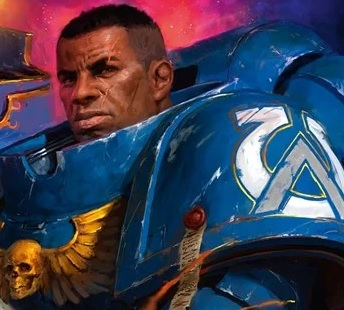
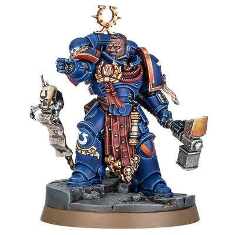
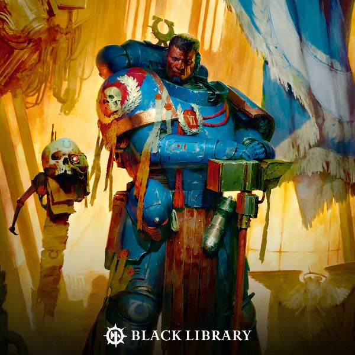

# 0691 费伦·阿瑞奥斯 Ferren Areios

精校状态：中文行文已逐段精校，部分术语仍为暂定

分类：人类帝国 / 极限战士

原文来源：https://www.bilibili.com/opus/1113805132910297106

原作者：帝国神选罐头

原文时间：2025年09月18日 11:32

[返回分类目录](目录.md) · [全书目录](../../目录.md)

<!-- A0691-B0001 -->
**英文原文**

Ferren Areios Is the current Captain of the Ultramarines 6th Company and Master of the Rites.

<!-- /A0691-B0001 -->

<!-- A0691-B0002 -->

原译文

费伦·阿瑞奥斯是目前的极限战士第六连队连长和祭仪大师。

**校订译文**

费伦·阿瑞奥斯是目前的极限战士第六连队连长和祭仪大师。

<!-- /A0691-B0002 -->

<!-- A0691-B0003 图片 -->

<!-- A0691-B0004 -->

原译文

Ferren Areios as a part of the Unnumbered Sons 作为未计之子一员的费伦·阿瑞奥斯

**校订译文**

Ferren Areios as a part of the Unnumbered Sons 作为未计之子一员的费伦·阿瑞奥斯

<!-- /A0691-B0004 -->

<!-- A0691-B0005 -->
## Biography 传记

<!-- /A0691-B0005 -->

<!-- A0691-B0006 -->
### Early Life 早期生活

<!-- /A0691-B0006 -->

<!-- A0691-B0007 -->
**英文原文**

He was originally named only Ferren and was born in Hive Daner Fifty, which he was forcibly taken from by agents of Archmagos Dominus Cawl, and then turned into a Primaris Space Marine. Ferren would then undergo training and hibernation for millennia, on Cawl's Ark Mechanicus Zar-Quaesitor, until the Indomitus Crusade was preparing to begin. At that time, Lord Commander Guilliman personally chose Ferren to be the adjutant for Lord Lieutenant Messinius, after becoming impressed with his training records. While he still slept, Ferren was also bestowed the rank of Lieutenant by the Lord Commander, who asked Messinius to teach Ferren all he knew.

<!-- /A0691-B0007 -->

<!-- A0691-B0008 -->

原译文

他最初只叫费伦，出生在达纳十五号巢都，被统御大贤者考尔的特工强行带走，然后变成了原铸星际战士。然后，费伦将在考尔的机械方舟探索者之王号上接受数千年的训练和休眠，直到不屈远征准备开始。当时，领主指挥官基里曼在对费伦的训练记录印象深刻后，亲自选择他担任梅西尼乌斯副领主的助手。当他还在休眠的时候，费伦还被领主指挥官授予副官军衔，他要求梅西尼乌斯把他所知道的一切都教给费伦。

**校订译文**

他最初只有“费伦”这个名字，出生于达纳五十号巢都。统御大贤者考尔的代理人将他强行带走，改造成原铸星际战士。此后数千年，他在机械方舟探索者之王号上交替接受训练与休眠，直至不屈远征即将开始。帝国最高统帅基里曼看过他的训练记录，印象深刻，亲自选他担任领主副官梅西尼乌斯的助手。费伦尚未苏醒时，基里曼便已授予他副官军衔，并要求梅西尼乌斯倾囊相授。

**校注：** Fifty 为五十，原译十五错误；Lord Lieutenant 与 Lieutenant 分为领主副官／副官，前者不是副领主。

<!-- /A0691-B0008 -->

<!-- A0691-B0009 -->
### Unnumbered Sons 未计之子

<!-- /A0691-B0009 -->

<!-- A0691-B0010 -->
### Waking Up 苏醒

<!-- /A0691-B0010 -->

<!-- A0691-B0011 -->
**英文原文**

Messinius was present when Ferren was brought out of hibernation and the Lord Lieutenant told the Primaris what was expected of him. After Ferren absorbed this, and swore his service to the Emperor, Messinius asked him if he wanted to change his name. As his old life was gone and he would serve under Messinius, Ferren asked the Lord Lieutenant to choose a new name for him. After thinking of it, Messinius granted him the last name Areios, which was taken from an ancient myth and was synonymous with Mars. Now named Ferren Areios, the Lieutenant joined Messinius as he sought to check the state of the mishap prone, Indomitus Crusade Fleet Quintus. It had been chosen to be the first of the Crusade's Fleets to launch, but a series of accidents, sabotages and sickness, had delayed Quintus' readiness. This had led Guilliman to ask Messinius to determine if it was still possible for Quintus to launch on time. Messinius had been informed that a plague was also spreading amongst Quintus' Fleet and when he and Ferren arrived on the Cruiser Ideos, they witnessed it first hand. They quickly learned that the sickness was a Warp-born plague and those stricken with it, caused a number of minor Daemons to materialize when they died. After aiding in dispatching an outbreak of Daemons on Ideos, the two then went to give their reports to Lord Commander Guilliman, on how catastrophic the plague truly was.

<!-- /A0691-B0011 -->

<!-- A0691-B0012 -->

原译文

当费伦从休眠中醒来时，梅西尼乌斯在场，副领主告诉原铸对他的期望。费伦理解了这一点，并宣誓效忠帝皇后，梅西尼乌斯问他是否想改名。随着他的旧生活结束，他将在梅西尼乌斯手下服役，费伦要求副领主为他选择一个新名字。考虑到这一点，梅西尼乌斯给了他一个姓阿瑞奥斯，这个姓取自一个古老的神话，是火星的同义词。这位副官现在名叫费伦·阿瑞奥斯，他加入了梅西尼乌斯，试图检查容易发生事故的第五不屈远征舰队的状态。它被选为远征第一支出发的舰队，但一系列的事故、破坏和疾病推迟了第五舰队的准备。这导致基里曼要求梅西尼乌斯确定第五舰队是否仍有可能按时出发。梅西尼乌斯被告知，第五舰队中瘟疫在传播，当他和费伦乘坐巡洋舰理念号抵达时，他们亲眼目睹了这一幕。他们很快了解到，这种疾病是一种亚空间诞生的瘟疫，那些感染了这种疾病的人在死亡时导致了一些次级恶魔的出现。在协助调度在理念号的恶魔爆发后，两人随后向领主指挥官基里曼报告了瘟疫的真正灾难性。

**校订译文**

费伦脱离休眠时，梅西尼乌斯就在身旁，向他说明今后的职责与期望。费伦理解后宣誓效忠帝皇，梅西尼乌斯又问他是否希望改名。旧日生活既已不复存在，自己也将追随这位长官，费伦便请他赐名。梅西尼乌斯思索后，给了他“阿瑞奥斯”这个取自古老神话、与玛尔斯同义的姓氏。新获名的副官随后陪他检查事故不断的不屈远征第五舰队。该舰队原定率先出发，却因事故、蓄意破坏与疾病接连延误，基里曼遂命梅西尼乌斯判断它能否按时启航。两人登上理念号巡洋舰，亲眼看见舰队中传播的疫病，很快发现它源于亚空间：感染者死去时，会引来若干低阶恶魔现身。他们协助消灭舰内一波恶魔后，便去向基里曼报告瘟疫的严重程度。

**校注：** 原文说明姓氏取自古老神话，因此 Mars 按神名玛尔斯处理；Mars 也可指火星，原译直接当作天体名，容易掩盖命名典故。

<!-- /A0691-B0012 -->

<!-- A0691-B0013 -->
**英文原文**

Later, Areios fought at the Battle of the Machorta Sound. Leading a boarding party of fresh Primaris Space Marines aboard the Chaos command ship Blood King, Areios and his men fought their way to the bridge. There, they encountered a statue that began to move and revealed itself as a Daemon Prince of Khorne. All of Areios' squad was wiped out by the creature, and Ferren himself was brought to his knees. However before the Daemon could deliver the final blow a group of Aggressor reinforcements arrived, battering the enemy with enough firepower to allow Areios to plunge his Power Sword into the creatures chest, slaying it.

<!-- /A0691-B0013 -->

<!-- A0691-B0014 -->

原译文

后来，阿瑞奥斯参加了马乔塔海峡之战。阿瑞奥斯和他的部下率领一支由新加入的原铸星际战士组成的跳帮队伍登上混沌指挥舰鲜血之王号，奋力前往舰桥。在那里，他们遇到了一座开始移动的雕像，并表示自己是恐虐的一位恶魔王子。阿瑞奥斯的整个小队都被这个生物消灭了，费伦自己也跪倒了。然而，在恶魔发动最后一击之前，一群侵略者增援部队到达，用足够的火力轰击敌人，让阿瑞奥斯将他的动力剑刺入生物胸膛，将其杀死。

**校订译文**

阿瑞奥斯后来参加马乔塔海峡之战，率一队新编原铸星际战士跳帮混沌指挥舰鲜血之王号，一路杀向舰桥。那里的一座雕像突然活动起来，显露出恐虐恶魔亲王的真身。小队战士尽数被杀，费伦本人也被打得跪倒在地。恶魔即将给予致命一击时，侵略者援军赶到，以猛烈火力压制敌人，使他得以将动力剑刺入对方胸膛，将其击杀。

<!-- /A0691-B0014 -->

<!-- A0691-B0015 -->
### First Company Captain 第一连队连长

<!-- /A0691-B0015 -->

<!-- A0691-B0016 -->
**英文原文**

Roughly 5 years into the Indomitus Crusade Areios had become Captain of First Company, of the first battalion, of the first division of Battle Group Iolus. While planning the attack on Tiantin City on the planet Suladen, Messinius had overruled Areios' slower more careful strategy in favor of speed. Areios later participated in the attack with his personal squad and led his company. After arriving at the enemy's heavy guns they were attacked by a rogue psyker, Areios had his men distract the psyker, and then killed him with a grenade. Shortly after that, one of Areios' Sergeants informed him that several Astra Militarum traitors had surrendered, and were willing to exchange their lives for intelligence. Areios ordered that they all be executed as they'd be a drain on resources, and believed they had nothing worthwhile to tell.

<!-- /A0691-B0016 -->

<!-- A0691-B0017 -->

原译文

在不屈远征大约5年后，阿瑞奥斯成为了伊奥劳斯战斗群第一师第一营第一连队的连长。在计划对苏拉登行星上的提安汀城发动攻击时，梅西尼乌斯否决了阿瑞奥斯更慢、更谨慎的战略，转而支持速度。阿瑞奥斯后来与他的个人小队一起参加了这次袭击，并领导了他的连队。在到达敌人的重炮后，他们遭到了一名非法灵能者的袭击，阿瑞奥斯让他的手下分心了灵能者，然后用手榴弹杀死了他。不久之后，阿瑞奥斯的一名军士通知他，几名星界军叛徒已经投降，并愿意用生命换取情报。阿瑞奥斯下令将他们全部处决，因为他们会消耗资源，并认为他们没有什么值得说的。

**校订译文**

不屈远征开始约五年后，阿瑞奥斯升任伊奥劳斯战斗群第一师第一营第一连连长。筹划进攻苏拉登的提安汀城时，梅西尼乌斯否决了他缓慢稳进的方案，选择以速度取胜。他随后率连队及亲随小队投入战斗，抵达敌方重炮阵地时遭到失控灵能者袭击。他命部下牵制对手，自己用手榴弹将其炸死。不久，一名军士报告，数名星界军叛徒已投降，愿用情报换取活命。阿瑞奥斯认为他们没有有价值的情报，留下只会消耗资源，便下令全部处决。

**校注：** 俘虏以情报换取性命，原译以性命换情报将交换方向颠倒。此处第一连属于未计之子战斗群编制，非极限战士第一连。

<!-- /A0691-B0017 -->

<!-- A0691-B0018 图片 -->

<!-- A0691-B0019 -->

原译文

Ferren Areios 费伦·阿瑞奥斯

**校订译文**

Ferren Areios 费伦·阿瑞奥斯

<!-- /A0691-B0019 -->

<!-- A0691-B0020 -->
**英文原文**

Later during the Battle of Srinagar, Areios faced the Word Bearers Dark Apostle Pridor Vrakon. Despite his many centuries of simulated training, Areios proved no match for Vrakon's abilities and was badly wounded and left for dead by the disgusted Dark Apostle. Saved from death by his Belisarian Furnace, he was later recovered by Serfs and nursed back to health.

<!-- /A0691-B0020 -->

<!-- A0691-B0021 -->

原译文

后来在斯利那加之战中，阿瑞奥斯面对的是怀言者黑暗使徒普里多·弗拉肯。尽管他经过了几个世纪的模拟训练，但事实证明，阿瑞奥斯的能力无法与弗拉肯匹敌，他受了重伤，被这位憎恶的黑暗使徒遗弃死亡。他被贝利萨留熔炉从死亡中拯救出来，后来被侍从救起，并得到了护理，恢复了健康。

**校订译文**

斯利那加之战中，阿瑞奥斯迎战怀言者黑暗使徒普里多·弗拉肯。即使接受过数百年的模拟训练，他仍远非对手，被打成重伤。黑暗使徒鄙夷地将他丢下，以为他已经死去；贝利萨留斯熔炉却保住了他的命。后来，战团农奴找到他，将他带回救治，直至康复。

<!-- /A0691-B0021 -->

<!-- A0691-B0022 -->
### Ultramarines 极限战士

<!-- /A0691-B0022 -->

<!-- A0691-B0023 -->
### Battle Against The Hand of Abaddon 对抗阿巴顿之手

<!-- /A0691-B0023 -->

<!-- A0691-B0024 -->
**英文原文**

When the Unnumbered Sons were dissolved, Areios hoped he would remain under the command of Messinius and join the White Consuls Chapter, but Guilliman himself requested Areios join the Ultramarines directly, and he was assigned to the Sixth Company in time for the Battle of Garrovire. Aerios, along with Captain Maximus Epathus, Librarian Maendaius, Lieutenant Vero, and several other Ultramarines, were part of a mission to investigate strange psychic obfuscation within the ruins of a purged city on Garrovire, where they discovered a Chaos-tainted statue. Deciding to destroy the statue, the Ultramarines were attacked by a Possessed member of their squad, leaving Vero and Epathus dead, and Meandaius suspected of corruption; Areios assumed de-facto command of the company.

<!-- /A0691-B0024 -->

<!-- A0691-B0025 -->

原译文

当未计之子解散时，阿瑞奥斯希望他能继续在梅西尼乌斯的指挥下加入白色执政官战团，但基里曼本人要求阿瑞奥斯直接加入极限战士，并在加洛韦之战中及时被分配到第六连队。阿瑞奥斯与连长马克西姆斯·埃帕图斯、智库梅恩代乌斯、副官韦罗和其他几名极限战士一起，执行了一项任务，调查加洛韦一座被净化的城市废墟中奇怪的灵能模糊，在那里他们发现了一座被混沌污染的雕像。决定摧毁这座雕像的极限战士遭到了他们小队中一名被附身成员的袭击，导致韦罗和埃帕图斯死亡，而梅恩代乌斯则涉嫌腐化；阿瑞奥斯实际接管了该连队。

**校订译文**

未计之子解散时，阿瑞奥斯原希望继续追随梅西尼乌斯，加入白色执政官；但基里曼亲自点名，让他加入极限战士。他被编入第六连，赶上了加洛韦之战。他与连长马克西姆斯·埃帕图斯、智库员梅恩代乌斯、副官韦罗等人，前往一座已遭肃清的城市废墟调查异常灵能遮蔽，发现了一座被混沌污染的雕像。他们决定将其摧毁，却遭小队中一名被附魔的成员袭击。韦罗与埃帕图斯因此阵亡，梅恩代乌斯也被怀疑遭到腐化，阿瑞奥斯遂实际接掌连队。

<!-- /A0691-B0025 -->

<!-- A0691-B0026 -->
**英文原文**

Following a vision from the librarian, the Sixth Company Strike Cruiser joined up with Inquisitor Leonid Rostov to search for the base of the Hand of Abaddon. With aid from the Votann Omrigar Kindred, and Rostov's small Imperial Fleet, the 6th Company, 84th Mordian Iron Guard, and a Platoon of Inquisitorial Stormtroopers were able to board the Hand of Abaddon's Blackstone Fortress, defeating the cultists and Chaos Space Marines within. During the battle Areios kills the Hand of Abaddon member dubbed the Butcher King, but not before Five of the Eight other members of the Hand had escaped.

<!-- /A0691-B0026 -->

<!-- A0691-B0027 -->

原译文

根据智库的设想，第六连队打击巡洋舰与审判官列昂尼德·罗斯托夫联手寻找阿巴顿之手的基地。在沃坦奥姆里加尔家族和罗斯托夫的小型帝国舰队的帮助下，第6连队、莫迪安铁卫第84兵团和一个排的审判官冲锋队登上了阿巴顿之手的黑石堡垒，击败了里面的邪教徒和混沌星际战士。在战斗中，阿瑞奥斯杀死了被称为屠夫之王的阿巴顿之手成员，但在此之前，阿巴顿之手的其他八名成员中有五名已经逃脱。

**校订译文**

根据智库员所见异象，第六连打击巡洋舰与审判官列昂尼德·罗斯托夫会合，寻找阿巴顿之手的基地。在沃坦奥姆里加尔亲族及罗斯托夫小型舰队的协助下，第六连、莫迪安铁卫第84团和一个排的审判庭风暴兵登上敌方黑石要塞，击败其中的邪教徒与混沌星际战士。阿瑞奥斯在战斗中杀死了绰号“屠夫之王”的成员，但其余八名成员中的五人此前已经逃走。

**校注：** 源文说其他八名成员中的五人，可能与阿巴顿之手通常八人称谓存在数量疑点；按原文保留，不自行改成其余七人。

<!-- /A0691-B0027 -->

<!-- A0691-B0028 图片 -->

<!-- A0691-B0029 -->

原译文

Ferren Areios as Captain of the 6th Company 作为第六连队连长的费伦·阿瑞奥斯

**校订译文**

Ferren Areios as Captain of the 6th Company 作为第六连队连长的费伦·阿瑞奥斯

<!-- /A0691-B0029 -->

<!-- A0691-B0030 -->

原译文

6th Company Captain 第六连队连长

**校订译文**

6th Company Captain 第六连队连长

<!-- /A0691-B0030 -->

<!-- A0691-B0031 -->
**英文原文**

Several years after the battle on the Blackstone Fortress Ferren went to Macragge to officially be recognized as Captain of the Sixth Company by Roboute Guilliman. Before his meeting with Guilliman Ferren traveled to the Hall of Solemnity to see the resting place of Maximus Epathus. While looking for Epathus he ran into Cato Sicarius, who offered Ferren advice on dealing with the death of Epathus, and shared the lessons he had learned over the years of his service. While they talked Cato led Ferren to Epathus' resting place.

<!-- /A0691-B0031 -->

<!-- A0691-B0032 -->

原译文

黑石要塞之战几年后，费伦前往马库拉格，被罗伯特·基里曼正式承认为第六连队连长。费伦在与基里曼会面之前，他前往庄严大厅拜访了马克西姆斯·埃帕图斯的安息之地。在寻找埃帕图斯的时候，他遇到了卡托·西卡留斯，他为费伦提供了处理埃帕图斯之死的建议，并分享了他在多年服役中吸取的教训。他们谈话时，卡托把费伦带到了埃帕图斯的安息之地。

**校订译文**

黑石要塞之战数年后，费伦前往马库拉格，接受基里曼对其第六连长身份的正式任命。觐见前，他来到庄严大厅，寻找前任连长埃帕图斯的安息之所，并遇见卡托·西卡留斯。西卡留斯劝导他如何面对埃帕图斯之死，分享多年服役所得的教训，又一边交谈，一边将他带到目的地。

<!-- /A0691-B0032 -->

本篇核心术语与暂定项

以下列出本篇出现的英文原形及核心术语表用词。同形词可能指不同对象，具体词义以本篇正文和校注为准；单复数、别名和仅见于图注的名称可能尚未列入。完整候选见[术语表](../../术语表/双语术语候选.csv)。

| 英文 | 采用中文 | 状态 |
| --- | --- | --- |
| Space Marines | 星际战士 | 官方已核对 |
| Astra Militarum | 星界军 | 官方已核对 |
| Chaos Space Marines | 混沌星际战士 | 官方已核对 |
| Psyker | 灵能者 | 官方已核对 |
| Librarian | 智库员 | 官方已核对 |
| Roboute Guilliman | 罗保特·基里曼 | 官方已核对 |
| Ultramarines | 极限战士 | 官方已核对 |
| Warp | 亚空间 | 官方已核对 |
| Inquisitor | 审判官 | 官方已核对 |
| Rogue Psyker | 非法灵能者 | 暂定 |
| Khorne | 恐虐 | 官方已核对 |
| Indomitus | 不屈学派 | 暂定·学派语境 |
| Emperor | 帝皇 | 官方已核对 |
| Imperial Fleet | 帝国舰队 | 暂定 |
| Ark Mechanicus | 机械方舟 | 暂定·官方待核 |
| Word Bearers | 怀言者 | 暂定·官方待核 |
| Dark Apostle | 黑暗使徒 | 官方已核对 |
| Daemon Prince | 恶魔亲王 | 官方已核对 |
| Indomitus Crusade | 不屈远征 | 暂定·官方待核 |
| Inquisitorial Stormtroopers | 审判庭风暴兵 | 暂定·官方待核 |
| Mordian | 莫迪安 | 暂定·官方待核 |
| Mars | 火星 | 暂定·官方待核 |
| Macragge | 马库拉格 | 暂定·官方待核 |
| Master | 导师（审判庭职衔）／舰务官（舰员职务） | 语境定译·官方待核 |
| Mission | 教团／传教机构 | 暂定 |
| Master of the Rites | 祭仪大师 | 暂定·官方待核 |
| Ancient | 旗手 | 官方已核对 |
| Archmagos Dominus | 统御大贤者 | 暂定·官方待核 |
| Lord Commander | 领主指挥官 | 暂定·官方待核 |
| Lieutenant | 副官 | 暂定·官方待核 |
| Space Marine | 星际战士 | 暂定·官方待核 |
| Chapter | 战团 | 暂定·官方待核 |
| Captain | 连长 | 暂定·官方待核 |
| Aggressor | 侵略者 | 暂定·官方待核 |
| Primaris Space Marine | 原铸星际战士 | 暂定·官方待核 |
| Cato Sicarius | 卡托·西卡留斯 | 暂定·官方待核 |
| White Consuls | 白色执政官 | 暂定·官方待核 |
| Ferren Areios | 费伦·阿瑞奥斯 | 暂定·官方待核 |
| Strike Cruiser | 打击巡洋舰 | 暂定·官方待核 |
| Belisarian Furnace | 贝利萨留斯熔炉 | 官方词根参考·全称待核 |
| Unnumbered Sons | 未计之子 | 暂定·官方待核 |
| Pridor Vrakon | 普里多·弗拉肯 | 暂定·官方待核 |
| Blackstone Fortress | 黑石要塞 | 暂定·官方待核 |
| Kindred | 亲族 | 暂定·官方待核 |
| Zar-Quaesitor | 探索者之王号 | 暂定·官方待核 |
| Butcher | 屠夫号 | 暂定·官方待核 |
| Quintus | 昆图斯 | 暂定·官方待核 |
| Maximus Epathus | 马克西姆斯·埃帕图斯 | 暂定·官方待核 |
| Corruption | 腐败 | 暂定·官方待核 |
| Hive Daner Fifty | 达纳五十号巢都 | 暂定·官方待核 |
| Battle Group Iolus | 伊奥劳斯战斗群 | 暂定·官方待核 |
| Omrigar Kindred | 奥姆里加尔亲族 | 暂定·官方待核 |
| Machorta Sound | 马乔塔海峡 | 暂定·官方待核 |
| Leonid Rostov | 列昂尼德·罗斯托夫 | 暂定·官方待核 |
| Mordian Iron Guard | 莫迪安铁卫 | 暂定·官方待核 |
| Iolus | 伊奥劳斯 | 暂定·官方待核 |
| Grenade | 手榴弹 | 暂定·官方待核 |
| Srinagar | 斯利那加 | 暂定·官方待核 |

