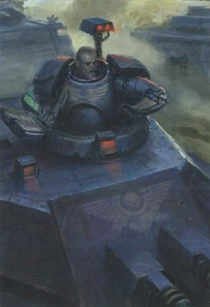
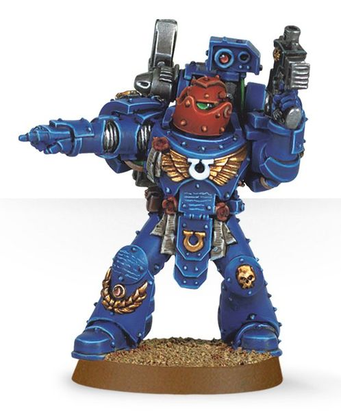
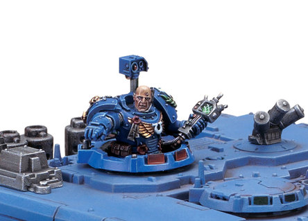

# 0692 安塔罗·克罗诺斯 Antaro Chronus

精校状态：中文行文已逐段精校，部分术语仍为暂定

分类：人类帝国 / 极限战士

原文来源：https://www.bilibili.com/opus/1113829167607054375

原作者：帝国神选罐头

原文时间：2025年09月18日 13:06

[返回分类目录](目录.md) · [全书目录](../../目录.md)

<!-- A0692-B0001 -->
**英文原文**

Brother-Sergeant Antaro Chronus, also known as The Spear of Macragge, is the most gifted of all the Ultramarines' tank commanders. While most such warriors dedicate themselves to mastery of a particular vehicle, Chronus' talents extend to almost any tank in the armoury of the Adeptus Astartes. He has a unique status within the Chapter that sees him answer only to the Primarch Roboute Guilliman and Chapter Master Marneus Calgar.

<!-- /A0692-B0001 -->

<!-- A0692-B0002 -->

原译文

兄弟军士安塔罗·克罗诺斯，也被称为马库拉格之矛，是所有极限战士坦克指挥官中最有天赋的。虽然大多数这样的战士都致力于掌握一种特定的载具，但克罗诺斯的天赋几乎可以扩展到阿斯塔特修会军械库中的任何坦克。他在战团中有着独特的地位，只需听从原体罗伯特·基里曼和战团长马涅乌斯·卡尔加的指令。

**校订译文**

安塔罗·克罗诺斯兄弟军士，又称“马库拉格之矛”，是极限战士最具天赋的坦克指挥官。多数同行专精于某一种战车，他却几乎熟悉阿斯塔特修会军械库中的全部坦克。他在战团中地位特殊，只向原体罗保特·基里曼与战团长马涅乌斯·卡尔加负责。

**校注：** 原体复苏后开头称向原体与战团长负责，下文旧称只向战团长负责；保留原文各段叙述。

<!-- /A0692-B0002 -->

<!-- A0692-B0003 图片 -->

<!-- A0692-B0004 -->

原译文

Antaro Chronus, The Spear of Macragge 安塔罗·克罗诺斯，马库拉格之矛

**校订译文**

Antaro Chronus, The Spear of Macragge 安塔罗·克罗诺斯，马库拉格之矛

<!-- /A0692-B0004 -->

<!-- A0692-B0005 -->
## History 历史

<!-- /A0692-B0005 -->

<!-- A0692-B0006 -->
**英文原文**

Being assigned to the Chapter's armoury is a sacred duty, entrusting the Brother with some of the Space Marines' rarest and most powerful weapons. This duty requires the Marine to treat his tank as an extension of himself, but Chronus knows his tanks so well that he not only knows their capabilities, but knows exactly what systems can be bypassed or jury-rigged, to keep the tank functional in the heat of battle.

<!-- /A0692-B0006 -->

<!-- A0692-B0007 -->

原译文

被分配到战团的军械库是一项神圣的职责，将一些星际战士最稀有、最强大的武器托付给兄弟。这一职责要求战士将他的坦克视为自己的延伸，但克罗诺斯非常了解他的坦克，他不仅知道它们的能力，而且确切地知道可以绕过或操纵哪些系统，以使坦克在激烈的战斗中保持功能。

**校订译文**

在战团军械库服役是一项神圣职责：兄弟会将最珍稀、最强大的武器托付给这些战士，要求他们将战车视为自身的延伸。克罗诺斯对座驾的了解更进一步，不仅熟知性能，还清楚哪些系统可以绕过、哪些部件能够临时改接，让战车在激战中持续运作。

<!-- /A0692-B0007 -->

<!-- A0692-B0008 -->
**英文原文**

It was this skill that allowed Chronus to keep the Predator Rage of Antonius battleworthy during the closing hours of the Damnos Incident, despite the tank having taken several broadside hits from Necron Gauss Cannons. Commanding the Rage, Chronus not only managed to complete his mission of destroying the Necrons' Phase Shift Generator, but forced the retreat of the entire Necron War Cell, before the Rage finally shut down. The Techmarines who later examined the damage to Rage considered it nothing short of miraculous that the machine had survived, much less accomplished its mission.

<!-- /A0692-B0008 -->

<!-- A0692-B0009 -->

原译文

正是这种技能使克罗诺斯在达姆诺斯事件的最后时刻维持了安东尼乌斯之怒号掠食者的战斗力，尽管坦克遭到了死灵高斯炮的几次侧面攻击。在安东尼乌斯之怒号的指挥下，克罗诺斯不仅成功完成了摧毁死灵相移发生器的任务，而且在安东尼乌斯之怒号最终关闭之前，迫使整个死灵战争单元撤退。后来检查安东尼乌斯之怒号受损情况的技术军士认为，这台机器幸存下来简直是奇迹，更不用说完成任务了。

**校订译文**

正是这种本领，让他在达姆诺斯事件最后数小时中，仍能维持安东尼乌斯之怒号掠食者的战斗力，即使战车侧面已数次遭太空死灵高斯炮命中。他指挥这辆坦克摧毁死灵相移发生器，又迫使整个敌方战斗单元撤退，直到任务完成后战车才彻底停机。事后检查损伤的科技战士认为，它能继续运作已是奇迹，更不用说完成任务。

<!-- /A0692-B0009 -->

<!-- A0692-B0010 图片 -->

<!-- A0692-B0011 -->

原译文

Brother-Sergeant Chronus, equipped with a Boltgun and Servo-arm 兄弟军士克罗诺斯，装备爆矢枪和伺服臂

**校订译文**

Brother-Sergeant Chronus, equipped with a Boltgun and Servo-arm 兄弟军士克罗诺斯，装备爆矢枪和伺服臂

<!-- /A0692-B0011 -->

<!-- A0692-B0012 -->
**英文原文**

Chronus's achievements led to his anointment as The Spear of Macragge, a title dating back to before the Horus Heresy, awarded to the Ultramarines' preeminent tank commander. As Spear, Chronus leads the Chapter's armoured assaults, and has the privilege of choosing the vehicle he will ride into combat. His position is unique in that he commands a unit of some fifty Ultramarines, but is not subject to the orders of a Captain, and answers only to the Chapter Master himself. It is known that no one except Chronus has borne the title Spear of Macragge since the Great Crusade.

<!-- /A0692-B0012 -->

<!-- A0692-B0013 -->

原译文

克罗诺斯的成就使他被任命为马库拉格之矛，这一头衔可以追溯到荷鲁斯叛乱之前，授予极限战士杰出的坦克指挥官。作为长矛，克罗诺斯领导战团的装甲突击，并有权选择他将乘坐的载具参加战斗。他的地位是独一无二的，因为他指挥着一个由大约五十名极限战士组成的部队，但不受连长的命令，只对战团长本人负责。众所周知，自大远征以来，除了克罗诺斯外，没有人获得过马库拉格之矛的称号。

**校订译文**

凭借卓著战功，克罗诺斯获授“马库拉格之矛”。这一头衔源于荷鲁斯之乱前，授予极限战士中最杰出的坦克指挥官。持有者负责战团装甲突击，并有权自行选择出战座驾。他统率约五十名极限战士，却不受任何连长节制，只向战团长负责。据记载，自大远征以来，唯有克罗诺斯再次获得这一称号。

<!-- /A0692-B0013 -->

<!-- A0692-B0014 -->
**英文原文**

During the Damnos Reconquest Antaro Chronus piloted the Land Raider Gladius II, and managed to destroy six xenos engines.

<!-- /A0692-B0014 -->

<!-- A0692-B0015 -->

原译文

在达姆诺斯收复期间，安塔罗·克罗诺斯驾驶了兰德掠袭者短剑二号，并设法摧毁了六台异型引擎。

**校订译文**

收复达姆诺斯时，克罗诺斯驾驶短剑二号兰德掠袭者，摧毁了六台异形战争机械。

<!-- /A0692-B0015 -->

<!-- A0692-B0016 -->
**英文原文**

During the Invasion of Ultramar in 854999.M41, Chronus was deployed to Quintarn, alongside the 5th and 6th Companies of the Ultramarines. Faced with the apparently inexhaustible machine armies of the Dark Mechanicus warlord Vothier Tark, Chronus led his armoured division and the tanks of the Ultramar Defence Auxilia in a vital delaying action, holding off the Chaos war machines until the city of Idrisia could be fortified against their next assault.

<!-- /A0692-B0016 -->

<!-- A0692-B0017 -->

原译文

在854999.M41入侵奥特拉玛期间，克罗诺斯与奥特拉玛的第5和第6连队一起被部署到昆坦。面对黑暗机械教军阀沃西耶·塔尔克看似无尽的机械军队，克罗诺斯带领他的装甲师和奥特拉玛防御辅助军的坦克进行了一次至关重要的拖延行动，将混沌战争机械推迟到伊德里斯亚城可以防御他们的下一次进攻。

**校订译文**

854999.M41奥特拉玛遭入侵时，克罗诺斯随极限战士第五、第六连部署至昆坦。面对黑暗机械教军阀沃西耶·塔尔克那仿佛无穷无尽的机械大军，他率装甲部队与奥特拉玛防御辅助军坦克展开关键的迟滞作战，挡住混沌战争机械，为伊德里斯亚加固城防、准备应对下一轮进攻争取时间。

<!-- /A0692-B0017 -->

<!-- A0692-B0018 -->
**英文原文**

Since the Great Rift Chronus continues to lead armoured assaults, often at the helm of a Land Raider.

<!-- /A0692-B0018 -->

<!-- A0692-B0019 -->

原译文

自大裂隙以来，克罗诺斯继续领导装甲突击，经常指挥兰德掠袭者。

**校订译文**

自大裂隙以来，克罗诺斯继续领导装甲突击，经常指挥兰德掠袭者。

<!-- /A0692-B0019 -->

<!-- A0692-B0020 图片 -->

<!-- A0692-B0021 -->

原译文

Brother-Sergeant Chronus in the cupola of a Land Raider Crusader 兄弟军士克罗诺斯在一辆兰德掠袭者十字军的圆顶中

**校订译文**

Brother-Sergeant Chronus in the cupola of a Land Raider Crusader 克罗诺斯兄弟军士位于十字军型兰德掠袭者的车长塔内

<!-- /A0692-B0021 -->

<!-- A0692-B0022 -->
## Equipment 装备

<!-- /A0692-B0022 -->

<!-- A0692-B0023 -->
**英文原文**

Chronus wears a suit of Mk. III Iron armour.

<!-- /A0692-B0023 -->

<!-- A0692-B0024 -->

原译文

克罗诺斯身穿一套Mk.III钢铁盔甲。

**校订译文**

克罗诺斯身穿一套Mk.III钢铁盔甲。

<!-- /A0692-B0024 -->

<!-- A0692-B0025 -->
## Quotes 语录

<!-- /A0692-B0025 -->

<!-- A0692-B0026 -->
**英文原文**

"The roar of engines, the recoil of cannons. That is where the true joy of battle lies."

<!-- /A0692-B0026 -->

<!-- A0692-B0027 -->

原译文

“引擎的轰鸣，大炮的反冲。这就是战斗的真正乐趣所在。”

**校订译文**

“引擎的轰鸣，大炮的反冲。这就是战斗的真正乐趣所在。”

<!-- /A0692-B0027 -->

<!-- A0692-B0028 -->
**英文原文**

"Let them hide in their fortress. My crew can use the target practice."

<!-- /A0692-B0028 -->

<!-- A0692-B0029 -->

原译文

“让他们躲在堡垒里。我的乘员可以使用靶子练习。”

**校订译文**

“尽管让他们躲进堡垒。我的车组正好拿他们练练准头。”

<!-- /A0692-B0029 -->

本篇核心术语与暂定项

以下列出本篇出现的英文原形及核心术语表用词。同形词可能指不同对象，具体词义以本篇正文和校注为准；单复数、别名和仅见于图注的名称可能尚未列入。完整候选见[术语表](../../术语表/双语术语候选.csv)。

| 英文 | 采用中文 | 状态 |
| --- | --- | --- |
| Space Marines | 星际战士 | 官方已核对 |
| Adeptus Astartes | 阿斯塔特修会 | 官方已核对 |
| Necrons | 太空死灵 | 官方已核对 |
| Roboute Guilliman | 罗保特·基里曼 | 官方已核对 |
| Ultramar | 奥特拉玛 | 官方已核对 |
| Ultramarines | 极限战士 | 官方已核对 |
| Horus Heresy | 荷鲁斯之乱 | 官方已核对 |
| Great Rift | 大裂隙 | 官方已核对 |
| Primarch | 原体 | 官方已核对 |
| Great Crusade | 大远征 | 暂定·官方待核 |
| Horus | 荷鲁斯 | 暂定·官方待核 |
| Quintarn | 昆坦 | 暂定·官方待核 |
| Damnos | 达蒙斯 | 暂定·官方待核 |
| Macragge | 马库拉格 | 暂定·官方待核 |
| Land Raider | 兰德掠袭者战车 | 官方已核对 |
| Master | 导师（审判庭职衔）／舰务官（舰员职务） | 语境定译·官方待核 |
| Mission | 教团／传教机构 | 暂定 |
| Chapter | 战团 | 暂定·官方待核 |
| Chapter Master | 战团长 | 暂定·官方待核 |
| Captain | 连长 | 暂定·官方待核 |
| Sergeant | 军士 | 暂定·官方待核 |
| Brother | 修士 | 暂定·官方待核 |
| Marneus Calgar | 马涅乌斯·卡尔加 | 暂定·官方待核 |
| Antaro Chronus | 安塔洛·克罗诺斯 | 暂定·官方待核 |
| Armoury | 军械库 | 暂定·官方待核 |
| Spear of Macragge | 马库拉格之矛 | 暂定·官方待核 |
| Dark Mechanicus | 黑暗机械教 | 暂定·官方待核 |
| Xenos | 异形 | 暂定·官方待核 |
| Raider | 掠袭者飞艇 | 官方已核对 |
| The Dark | 《黑暗》 | 暂定·官方待核 |
| Rage of Antonius | 安东尼乌斯之怒号 | 暂定·官方待核 |
| Vothier Tark | 沃西耶·塔尔克 | 暂定·官方待核 |
| Idrisia | 伊德里斯亚 | 暂定·官方待核 |
| Invasion of Ultramar | 入侵奥特拉玛 | 暂定·官方待核 |

