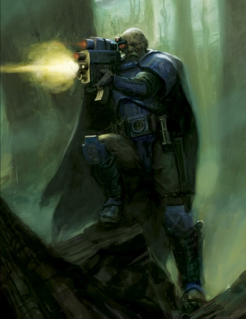
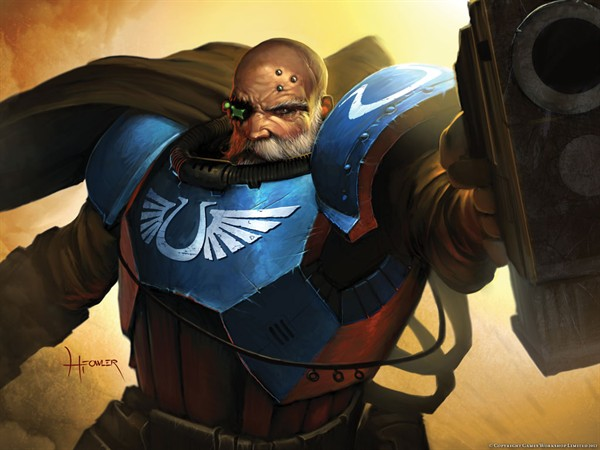
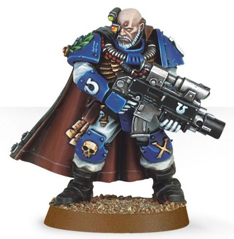

# 0693 托利亚斯·泰利昂 Torias Telion

精校状态：中文行文已逐段精校，部分术语仍为暂定

分类：人类帝国 / 极限战士

原文来源：https://www.bilibili.com/opus/1113838745378881555

原作者：帝国神选罐头

原文时间：2025年09月18日 13:43

[返回分类目录](目录.md) · [全书目录](../../目录.md)

原篇名：托瑞亚斯·泰利昂 Torias Telion

<!-- A0693-B0001 -->
**英文原文**

Torias Telion is a Sergeant in the Ultramarines 10th Company (the Scout Company), and a peerless trainer of recruits.

<!-- /A0693-B0001 -->

<!-- A0693-B0002 -->

原译文

托瑞亚斯·泰利昂是极限战士第10连队（侦察连队）的一名军士，也是一名无与伦比的新兵教官。

**校订译文**

托利亚斯·泰利昂是极限战士第10连队（侦察连队）的一名军士，也是一名无与伦比的新兵教官。

<!-- /A0693-B0002 -->

<!-- A0693-B0003 图片 -->

<!-- A0693-B0004 -->

原译文

Scout Sergeant Torias Telion 侦察兵军士托瑞亚斯·泰利昂

**校订译文**

Scout Sergeant Torias Telion 侦察兵军士托利亚斯·泰利昂

<!-- /A0693-B0004 -->

<!-- A0693-B0005 -->
## History 历史

<!-- /A0693-B0005 -->

<!-- A0693-B0006 -->
**英文原文**

Telion has served under three successive Chapter Masters, and personally trained four of the current Ultramarines Captains. Despite having earned a position in the Honour Guard many times over, Telion has elected to remain with the Scouts of 10th Company, training the future warriors of the Chapter.

<!-- /A0693-B0006 -->

<!-- A0693-B0007 -->

原译文

泰利昂曾连续在三位战团长手下服役，并亲自训练了四名现任极限战士连长。尽管泰利昂多次获得荣誉卫队的职位，但他仍选择留在第10连队的侦察兵，训练该战团未来的战士。

**校订译文**

泰利昂历经三任战团长，现任连长中有四人曾由他亲自训练。他的功勋早已足够多次赢得荣誉卫队席位，却仍选择留在第十连，继续训练战团未来的战士。

<!-- /A0693-B0007 -->

<!-- A0693-B0008 -->
**英文原文**

Over three hundred years of service to the Ultramarines, Telion has become a master of all aspects of war. A superlative hand-to-hand combatant, Telion can defend himself from almost any attacker, while few opponents can defend themselves from his precise and controlled blows.

<!-- /A0693-B0008 -->

<!-- A0693-B0009 -->

原译文

在为极限战士服役的三百多年里，泰利昂已经成为战争各个方面的大师。泰利昂是一名顶级的徒手格斗家，几乎可以抵御任何攻击者，而很少有对手能够抵御他精准而可控的打击。

**校订译文**

为极限战士服役三百余年，使泰利昂精通战争的各个方面。他近身格斗技艺超群，几乎能挡住任何对手的进攻，而对方却很难抵御他精准、克制的反击。

<!-- /A0693-B0009 -->

<!-- A0693-B0010 -->
**英文原文**

Yet Telion is best known for his uncanny marksmanship, which is almost unmatched in the entirety of the Chapter's history. Using Bolter or Sniper rifle, he can deliver a killing shot far beyond the official range of either weapon. His most well-known exploit came during the Siege of Pallia, where Telion eliminated both the Commander and the Ethereal of the Tau invasion force with only two well-placed consecutive bolter shots, at extreme range.

<!-- /A0693-B0010 -->

<!-- A0693-B0011 -->

原译文

然而，泰利昂最出名的是他不可思议的枪法，这在整个战团的历史上几乎是无与伦比的。使用爆矢枪或狙击步枪，他可以射出远远超出任何一种武器正式射程的致命一击。他最著名的攻击发生在帕里亚围城期间，泰利昂在极限距离内仅用两次位置良好的连续爆矢枪射击就消灭了钛入侵部队的指挥官和以太导师。

**校订译文**

不过，他最负盛名的仍是神乎其技的枪法，纵观战团历史也罕有人能及。无论使用爆矢枪还是狙击步枪，他都能在远超武器标定射程的距离上完成致命射击。最著名的事迹发生于帕里亚围城战：他在极远距离连续射出两发爆矢，分别击毙钛军指挥官与以太。

<!-- /A0693-B0011 -->

<!-- A0693-B0012 -->
**英文原文**

Much of Telion's skill is an innate gift, a quirky fusion between his latent ability and his geneseed, yet he is such a fine instructor that many raw recruits under his tutelage have become as skilled as the most experienced Captain. Thanks in large measure to him, the Ultramarines have a well-deserved reputation for fielding the finest marksmen of any Space Marine Chapter. Indeed, so famous is Telion that he has been frequently seconded to other Chapters with close ties to the Ultramarines, in order to pass on his teachings for the wider benefit of the Emperor's cause.

<!-- /A0693-B0012 -->

<!-- A0693-B0013 -->

原译文

泰利昂的大部分技能都是与生俱来的天赋，是他潜在能力和基因种子之间的奇特融合，但他是一位如此优秀的教官，以至于在他的指导下，许多新兵已经变得和最有经验的连长一样熟练。在很大程度上要归功于他，极限战士以派遣任何星际战士中最优秀的射手而享有盛誉。事实上，泰利昂非常有名，他经常被借调到与极限战士有密切关系的其他战团，以便为帝皇的事业传递他的教义。

**校订译文**

这份本领很大程度上源于天赋，是自身潜质与基因种子的奇妙结合。但他同时也是出色的教官，能将许多初入伍的新兵教导得如资深连长般娴熟。极限战士拥有各战团中最优秀射手的美誉，实至名归，也多亏他的贡献。他的声名如此显赫，以至常被借调至与极限战士关系密切的战团，传授经验，让更多帝皇战士从中受益。

<!-- /A0693-B0013 -->

<!-- A0693-B0014 -->
### Calth 考斯

<!-- /A0693-B0014 -->

<!-- A0693-B0015 -->
**英文原文**

Telion answered cries of help from the people of Calth when Old One Eye, a unique Tyranid Carnifex, was released from its frozen slumber in the ice and went on to slaughter its way across the planet. Telion tracked down Old One Eye, but found it difficult to pierce its armoured flanks. As Telion's warriors were cut to pieces by the beast, Telion made a one-in-a-million shot that hit the creature's ruined eye-socket, the same wound which had stopped its first rampage on Calth. Old One Eye was overcome with pain and stumbled into a cavernous ravine. Telion led a search for the body, but Old One Eye was never found.

<!-- /A0693-B0015 -->

<!-- A0693-B0016 -->

原译文

泰利昂回应了考斯人民的呼救声，一只独特的泰伦刽子手老独眼从冰中的冰冻休眠中被释放出来，继续在行星上屠杀。泰利昂找到了老独眼，但发现很难击穿它的侧甲。当泰利昂的战士被野兽切成碎片时，泰利昂完成了一次百万挑一的射击，击中了该生物被毁的眼眶，正是这一伤口阻止了它对考斯的第一次横冲直撞。老独眼痛苦万分，跌跌撞撞地掉进了一个洞穴般的峡谷。泰利昂带领搜寻尸体，但老独眼始终没有找到。

**校订译文**

独特的泰伦刽子手老独眼从冰封中苏醒，在考斯大开杀戒。泰利昂应居民求援前来，追踪到这头怪兽，却发现其侧腹甲壳极难击穿。同伴正被利爪撕碎之际，他射出几乎不可能命中的一枪，精准打入老独眼受损的眼窝——当初正是这处创伤终结了它在考斯的首次肆虐。老独眼剧痛难忍，失足坠入深邃峡谷。泰利昂随后率队搜寻，却始终未找到它的尸体。

<!-- /A0693-B0016 -->

<!-- A0693-B0017 图片 -->

<!-- A0693-B0018 -->

原译文

Torias Telion 托瑞亚斯·泰利昂

**校订译文**

Torias Telion 托利亚斯·泰利昂

<!-- /A0693-B0018 -->

<!-- A0693-B0019 -->
**英文原文**

As of 999.M41, at least one soldier of the Calthian Ultramar Defence Auxilia was named "Telion" in the Sergeant's honour.

<!-- /A0693-B0019 -->

<!-- A0693-B0020 -->

原译文

截至999.M41，考斯的奥特拉玛防御辅助军至少有一名士兵被命名为“泰利昂”，以纪念军士。

**校订译文**

截至999.M41，考斯的奥特拉玛防御辅助军至少有一名士兵被命名为“泰利昂”，以纪念军士。

<!-- /A0693-B0020 -->

<!-- A0693-B0021 -->
### Black Reach 黑域

原题：Black Reach 黑色河段

<!-- /A0693-B0021 -->

<!-- A0693-B0022 -->
**英文原文**

Telion was seconded to Captain Cato Sicarius's Second Company during its deployment to Black Reach in 855.M41. After the initial liberation of Ghospora Hive from the Orks of Waaagh! Zanzag, Telion was instrumental in tracking down the Warboss's hidden submarine base in an underwater cavern, where Sicarius launched the final assault of the campaign.

<!-- /A0693-B0022 -->

<!-- A0693-B0023 -->

原译文

在855.M41部署到黑色河段期间，泰利昂被借调到卡托·西卡留斯连长的第二连队。在戈斯波拉巢都从赞扎格的Waaagh！的欧克手中首次解放之后，泰利昂在追踪战争头目隐藏在水下洞穴中的潜艇基地方面发挥了重要作用，西卡留斯在那里发动了战役的最后一次进攻。

**校订译文**

855.M41，泰利昂被借调至西卡留斯指挥的第二连，参加黑域战役。戈斯波拉巢都从赞扎格的Waaagh!大军手中解放后，他又在寻找敌首的秘密潜艇基地时发挥关键作用。基地藏于水下洞穴，西卡留斯最终在那里发动了整场战役的最后突击。

<!-- /A0693-B0023 -->

<!-- A0693-B0024 -->
### Quintarn 昆坦

<!-- /A0693-B0024 -->

<!-- A0693-B0025 -->
**英文原文**

During the Bloodborn's Invasion of Ultramar in 854999.M41, Telion led a force of sixty scouts from the 10th Company to Quintarn, where the 5th and 6th Companies under Captains Galenus and Epathus were battling against the forces of the Dark Mechanicus Adept Votheer Tark. Although Galenus demanded that Telion and his Scouts attach themselves to the main order of battle, Telion refused these demands, and Chaplain Cassius eventually convinced Galenus to let the Scouts go.

<!-- /A0693-B0025 -->

<!-- A0693-B0026 -->

原译文

854999.M41血裔入侵奥特拉玛期间，泰利昂率领第10连队的60名侦察兵前往昆坦，在那里，盖兰努斯和埃帕图斯连长率领的第5和第6连队正在与黑暗机械教专家沃西耶·塔尔克的部队作战。尽管盖兰努斯要求泰利昂和他的侦察兵加入主战，但泰利昂拒绝了这些要求，卡西乌斯牧师最终说服盖兰努斯让侦察兵离开。

**校订译文**

854999.M41血裔入侵奥特拉玛时，泰利昂率第十连六十名侦察兵前往昆坦。盖兰努斯与埃帕图斯正率第五、第六连，在那里迎战黑暗机械教成员沃西耶·塔尔克的大军。盖兰努斯要求侦察兵纳入主力战线，泰利昂却坚持独立行动；最终，卡西乌斯教士说服连长放他们离开。

**校注：** Votheer Tark 与692的 Vothier Tark 依同一昆坦战事判断为同人拼写变体，中文统一沃西耶·塔尔克，英文保留。

<!-- /A0693-B0026 -->

<!-- A0693-B0027 -->
**英文原文**

Telion faded into the desert with his men, invisibly watching over the Marines and striking without warning at the Chaos forces. Telion shrewdly perceived that Tark's single advantage as a warlord was his ability to manufacture war machines at an alarming rate, and replace his battlefield losses with impunity. Therefore, Telion led his Scouts on a series of missions to infiltrate and destroy Tark's Dark Mechanicus forges, including the largest and most important located atop the Maidens of Nestor. Without his manufacturing capability, Tark's forces were swiftly routed and destroyed by the superior tactics and training of the Ultramarines.

<!-- /A0693-B0027 -->

<!-- A0693-B0028 -->

原译文

泰利昂和他的部下消失在沙漠中，无形地监视着战士，毫无预警地袭击了混沌部队。泰利昂敏锐地意识到，塔尔克作为军阀的唯一优势是他能够以惊人的速度制造战争机械，并且能够不受惩罚地弥补战场上的损失。因此，泰利昂带领他的侦察兵执行了一系列任务，渗透并摧毁了塔尔克的黑暗机械教铸造厂，包括位于内斯特的少女顶上的最大、最重要的铸造厂。没有他的制造能力，塔尔克的部队很快就被极限战士的卓越战术和训练击溃。

**校订译文**

泰利昂带队隐入沙漠，暗中掩护同袍，不时突袭混沌军队。他看出塔尔克真正的优势，在于能够以惊人速度制造战争机械，轻易补足战场损失。因此，他率侦察兵接连潜入并破坏敌方铸造厂，包括坐落于“内斯特少女峰”顶端、规模最大也最重要的一座。失去生产能力后，塔尔克大军很快败于极限战士优越的战术与训练，遭到歼灭。

**校注：** Maidens of Nestor 为地形专名，依 atop 及原译少女顶暂作内斯特少女峰；原文此处未明确峰数，待地理来源核查。with impunity 此处指轻易补足损失，而非不受法律惩罚。

<!-- /A0693-B0028 -->

<!-- A0693-B0029 -->
### Plague Wars 瘟疫战争

<!-- /A0693-B0029 -->

<!-- A0693-B0030 -->
**英文原文**

During the Plague Wars that stained Ultramar, Telion was forced to lead the entire Scout Company to hold off a Death Guard attack upon the Chapter’s training academy. To the selfless Telion it was just another action born of duty, but the tale of his victory has become well known to every battle-brother of the Ultramarines.

<!-- /A0693-B0030 -->

<!-- A0693-B0031 -->

原译文

在玷污奥特拉玛的瘟疫战争期间，泰利昂被迫带领整个侦察连队，以抵御死亡守卫对战团训练学院的袭击。对于无私的泰利昂来说，这只是另一个出于责任的行动，但他的胜利故事已经为极限战士的每一个战斗兄弟所熟知。

**校订译文**

瘟疫战争肆虐奥特拉玛时，泰利昂不得不率整个侦察连抵挡死亡守卫对战团训练学院的进攻。对无私的他而言，这不过又一次尽责作战；但他的胜利事迹，却已传遍极限战士的每一位战斗兄弟。

<!-- /A0693-B0031 -->

<!-- A0693-B0032 -->
### Other Notable Actions 其他著名行动

<!-- /A0693-B0032 -->

<!-- A0693-B0033 -->
**英文原文**

During the Trenor Uprising, in 929.M41, a force of only three dozen Scouts, under Telion's direction, put down an uprising on Trenor in less than a day. On Sycorax during the Indomitus Crusade Telion lost a brother to a Necron Deathmark, leading to a sniper duel.

<!-- /A0693-B0033 -->

<!-- A0693-B0034 -->

原译文

在929.M41的特雷诺尔叛乱期间，一支只有三十多名侦察兵的部队在泰利昂的指挥下，在不到一天的时间里平息了特雷诺尔的叛乱。在不屈远征期间，泰利昂在西考拉克斯上失去了一个兄弟，导致了一场狙击手的决斗。

**校订译文**

929.M41特雷诺尔叛乱期间，泰利昂仅率三十六名侦察兵，便在不到一天内平定当地叛乱。不屈远征期间，他又在西考拉克斯失去一名同袍，对方死于太空死灵死印战士之手，继而引发了一场狙击对决。

**校注：** 补回被原译漏去的死印战士；three dozen 为三十六，不是三十多。

<!-- /A0693-B0034 -->

<!-- A0693-B0035 图片 -->

<!-- A0693-B0036 -->

原译文

Scout Sgt Telion 侦察兵军士泰利昂

**校订译文**

Scout Sgt Telion 侦察兵军士泰利昂

<!-- /A0693-B0036 -->

<!-- A0693-B0037 -->
## Awards and Commendations 奖项与表彰

<!-- /A0693-B0037 -->

<!-- A0693-B0038 -->
**英文原文**

Telion has been awarded at least forty battlefield commendations during his long career, including the Iron Skull, the Imperial Laurel, and a dozen Marksman's Honour badges (two of which were earned during the same campaign against the Tau at Pallia).

<!-- /A0693-B0038 -->

<!-- A0693-B0039 -->

原译文

泰利昂在其漫长的职业生涯中至少获得了40次战场表彰，包括钢铁颅骨、帝国桂冠和十几枚神枪手荣誉徽章（其中两枚是在帕里亚对钛的同一次战役中获得的）。

**校订译文**

漫长服役生涯中，泰利昂至少获授四十次战场表彰，包括钢铁颅骨、帝国桂冠，以及十二枚神枪手荣誉徽章；其中两枚来自同一场帕里亚对钛战役。

<!-- /A0693-B0039 -->

<!-- A0693-B0040 -->
## Equipment 装备

<!-- /A0693-B0040 -->

<!-- A0693-B0041 -->
**英文原文**

Telion commonly carries a Stalker-pattern boltgun, equipped with a targeting scope and loaded with silenced shells

<!-- /A0693-B0041 -->

<!-- A0693-B0042 -->

原译文

泰利昂通常携带追猎者型爆矢枪，配备瞄准镜并装有无声弹药

**校订译文**

泰利昂通常携带装有瞄准镜、使用消音弹药的追猎者型爆矢枪。

<!-- /A0693-B0042 -->

<!-- A0693-B0043 -->
## Quotes 语录

<!-- /A0693-B0043 -->

<!-- A0693-B0044 -->
**英文原文**

"Forget all your preconceptions of war, of battle-lines clashing in the churned ground. Your mission is to attack before the foe even realises that the war has begun, to strike hard at those vital weaknesses that all armies possess, but that no commander will admit to. Under my tutelage you will learn how to seek out such fragilities and smite them with every weapon at your disposal. Master these duties and I will have nothing more to teach, and you will truly be a Space Marine."

<!-- /A0693-B0044 -->

<!-- A0693-B0045 -->

原译文

“忘记你对战争的所有先入为主的看法，忘记在动荡的地面上发生冲突的战线。你的任务是在敌人意识到战争已经开始之前发动攻击，严酷打击所有军队都拥有但没有指挥官会承认的重要弱点。在我的指导下，你将学会如何寻找这些弱点，并用你掌握的每一件武器将其摧毁。掌握这些职责，我就没有什么可教的了，你将真正成为一名星际战士。”

**校订译文**

“忘掉你对战争的一切成见，忘掉两军战线在翻搅的泥土上正面冲撞的景象。你们的使命，是在敌人尚未意识到战争开始前便发动攻击，狠击每支军队都有、却没有指挥官愿意承认的致命弱点。在我的教导下，你们将学会找出这些破绽，并用手边的一切武器予以摧毁。掌握这些本领，我便再无可教，而你们也就真正成为星际战士了。”

<!-- /A0693-B0045 -->

<!-- A0693-B0046 -->
**英文原文**

"A new Tyrant joined the fray and, in an eyeblink, the whole character of the swarm changed. The ravening berserker-spirit that had driven the Tyranids onto the ridge was gone as if it had never existed. Left in its place was something cannier and infinitely more worrisome. It was then that I knew the battle to be lost."

<!-- /A0693-B0046 -->

<!-- A0693-B0047 -->

原译文

“一个新的暴君加入了这场战斗，眨眼间，整个虫群的性格都发生了变化。驱使泰伦登上山脊的贪婪狂暴的精神消失了，仿佛它从未存在过。取而代之的是更精明、更令人担忧的东西。就在那时，我知道这场战斗会失败。”

**校订译文**

“一头新的虫巢暴君加入战场，转眼间，整个虫群的作战方式都变了。此前驱使泰伦冲上山脊的嗜血狂性消失得无影无踪，仿佛从未存在，取而代之的是更加狡猾、也更加令人不安的意志。就在那一刻，我知道这场仗败了。”

<!-- /A0693-B0047 -->

<!-- A0693-B0048 -->
**英文原文**

on the Battle for Macragge

<!-- /A0693-B0048 -->

<!-- A0693-B0049 -->

原译文

在马库拉格之战中

**校订译文**

——谈及马库拉格之战。

<!-- /A0693-B0049 -->

本篇核心术语与暂定项

以下列出本篇出现的英文原形及核心术语表用词。同形词可能指不同对象，具体词义以本篇正文和校注为准；单复数、别名和仅见于图注的名称可能尚未列入。完整候选见[术语表](../../术语表/双语术语候选.csv)。

| 英文 | 采用中文 | 状态 |
| --- | --- | --- |
| Death Guard | 死亡守卫 | 官方已核对 |
| Tyranids | 泰伦虫族 | 官方已核对 |
| Orks | 欧克蛮人 | 官方已核对 |
| Boltgun | 爆矢枪 | 官方已核对 |
| Ultramar | 奥特拉玛 | 官方已核对 |
| Ultramarines | 极限战士 | 官方已核对 |
| Waaagh! | Waaagh! | 暂定·保留原文 |
| Ethereal | 以太 | 官方已核对 |
| Indomitus | 不屈学派 | 暂定·学派语境 |
| History | 历史 | 编辑用语已统一 |
| Emperor | 帝皇 | 官方已核对 |
| Deathmark | 死印战士 | 官方已核对 |
| Stalker | 追猎者 | 暂定·官方待核 |
| Necron Deathmark | 太空死灵死印战士 | 暂定·官方待核 |
| Sniper rifle | 狙击步枪 | 暂定·官方待核 |
| Indomitus Crusade | 不屈远征 | 暂定·官方待核 |
| Plague Wars | 瘟疫战争 | 暂定·官方待核 |
| Marksman | 神射手 | 暂定·官方待核 |
| Black Reach | 黑域 | 暂定·官方待核 |
| Quintarn | 昆坦 | 暂定·官方待核 |
| Calth | 考斯 | 暂定·官方待核 |
| Macragge | 马库拉格 | 暂定·官方待核 |
| Master | 导师（审判庭职衔）／舰务官（舰员职务） | 语境定译·官方待核 |
| Mission | 教团／传教机构 | 暂定 |
| Carnifex | 刽子手 | 暂定·官方待核 |
| Chaplain | 教士 | 官方已核对 |
| Adept | 帝国任职者（广义）／文吏（行政语境） | 语境定译·官方待核 |
| Honour Guard | 荣誉卫队 | 暂定·官方待核 |
| Space Marine | 星际战士 | 暂定·官方待核 |
| Chapter | 战团 | 暂定·官方待核 |
| Captain | 连长 | 暂定·官方待核 |
| Sergeant | 军士 | 暂定·官方待核 |
| Brother | 修士 | 暂定·官方待核 |
| Scout | 侦察兵 | 暂定·官方待核 |
| Battle-Brother | 战斗兄弟 | 暂定·官方待核 |
| Cato Sicarius | 卡托·西卡留斯 | 暂定·官方待核 |
| Torias Telion | 托利亚斯·泰利昂 | 暂定·官方待核 |
| Scout Company | 侦察连 | 暂定·官方待核 |
| Dark Mechanicus | 黑暗机械教 | 暂定·官方待核 |
| Warboss | 战争头目 | 官方已核对 |
| The Beast | 野兽 | 暂定·官方待核 |
| Old One Eye | 老独眼 | 官方已核对 |
| The Dark | 《黑暗》 | 暂定·官方待核 |
| Bloodborn | 血裔 | 暂定·官方待核 |
| Sycorax | 赛科拉克斯 | 暂定·官方待核 |
| Nestor | 内斯特 | 暂定·官方待核 |
| Maidens of Nestor | 内斯特少女峰 | 暂定·官方待核 |
| Pallia | 帕里亚 | 暂定·官方待核 |
| Ghospora Hive | 戈斯波拉巢都 | 暂定·官方待核 |
| Galenus | 盖兰努斯 | 暂定·官方待核 |
| Trenor | 特雷诺尔 | 暂定·官方待核 |
| Bolter | 爆矢枪 | 暂定·官方待核 |
| Invasion of Ultramar | 入侵奥特拉玛 | 暂定·官方待核 |

