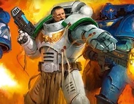
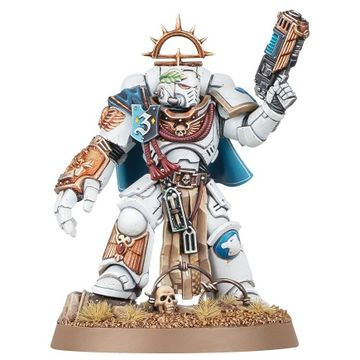

# 0694 维特里安·梅西尼乌斯 Vitrian Messinius

精校状态：中文行文已逐段精校，部分术语仍为暂定

分类：人类帝国 / 白色执政官

原文来源：https://www.bilibili.com/opus/1123459287442522133

原作者：帝国神选罐头

原文时间：2025年10月14日 11:55

[返回分类目录](目录.md) · [全书目录](../../目录.md)

<!-- A0694-B0001 -->
**英文原文**

Vitrian Messinius is the White Consuls 10th Company Captain and Master of Recruits who commanded Indomitus Crusade Fleet Tertius' Battlegroup Saint Aster as a Lord Lieutenant. Since the first major battle of the Pariah Crusade he has been declared by Guilliman as Fleetmaster of all of Tertius as well as Warden of the Nephilim Sector.

<!-- /A0694-B0001 -->

<!-- A0694-B0002 -->

原译文

维特里安·梅西尼乌斯是白色执政官第十连队连长和新兵之主，曾以领主副官的身份指挥第三不屈远征舰队的圣阿斯特战斗群。自帕里亚远征的第一次重大战斗以来，基里曼宣布他为整个第三舰队的舰队司令以及拿非利星区的监察者。

**校订译文**

维特里安·梅西尼乌斯是白色执政官第十连连长及新兵大师。他曾以领主副官身份指挥不屈远征第三舰队的圣阿斯特战斗群；被遗弃者远征首场大战后，基里曼又任命他为第三舰队总司令兼拿非利星区监察者。

<!-- /A0694-B0002 -->

<!-- A0694-B0003 图片 -->

<!-- A0694-B0004 -->

原译文

Vitrian Messinius 维特里安·梅西尼乌斯

**校订译文**

Vitrian Messinius 维特里安·梅西尼乌斯

<!-- /A0694-B0004 -->

<!-- A0694-B0005 -->
### Biography 传记

<!-- /A0694-B0005 -->

<!-- A0694-B0006 -->
### Terran Crusade 泰拉远征

<!-- /A0694-B0006 -->

<!-- A0694-B0007 -->
**英文原文**

At the time of the Ultramar Campaign Messinius was the 10th Company Captain of the White Consuls and was leading a delegation to Ultramar to request aid for his Chapter's efforts at Cadia. However he became caught up in the Terran Crusade and accompanied the newly reborn Primarch Roboute Guilliman to Terra.

<!-- /A0694-B0007 -->

<!-- A0694-B0008 -->

原译文

在奥特拉玛战役期间，梅西尼乌斯是白色执政官的第十连队连长，他率领一个代表团前往奥特拉玛，为其战团在卡迪亚的努力寻求援助。然而，他陷入了泰拉远征，并陪同重生的原体罗伯特·基里曼前往泰拉。

**校订译文**

奥特拉玛战役期间，身为白色执政官第十连连长的梅西尼乌斯率代表团前来求援，以支援战团在卡迪亚的战事。他却随后卷入泰拉远征，护送复苏的罗保特·基里曼前往泰拉。

<!-- /A0694-B0008 -->

<!-- A0694-B0009 -->
**英文原文**

After surviving the journey to Terra, he took part in the Battle of Lion's Gate against the Daemons of Khorne. In that battle, Messinius commanded a scratch Company of the Terran Crusade's surviving Space Marines and a number of the Palatine Guard. While on Terra Messinius was head of Guilliman's security. By this point Messinius learned of the fall of his Chapter's Homeworld of Sabatine and was not sure how much of the White Consuls had even survived.

<!-- /A0694-B0009 -->

<!-- A0694-B0010 -->

原译文

在泰拉之旅中幸存下来后，他参加了与恐虐恶魔的狮门之战。在那场战斗中，梅西尼乌斯指挥了一个由泰拉远征幸存的星际战士和一些帕拉廷卫队组成的临时连队。在泰拉期间，梅西尼乌斯是基里曼的安全负责人。此时，梅西尼乌斯得知他的战团的家园世界萨巴蒂尼陷落，不确定有多少白色执政官幸存下来。

**校订译文**

历经艰险抵达泰拉后，他又在狮门之战中迎击恐虐恶魔。他统率由泰拉远征幸存星际战士临时组成的一个连，以及部分帕拉廷卫队。留驻泰拉期间，他还负责基里曼的安全。此时，他已得知战团母星萨巴蒂尼陷落，却不清楚还有多少白色执政官幸存。

<!-- /A0694-B0010 -->

<!-- A0694-B0011 -->
### Indomitus Crusade 不屈远征

<!-- /A0694-B0011 -->

<!-- A0694-B0012 -->
**英文原文**

Messinius was on the Zar-Quaesitor for Belisarius Cawl's reveal and demonstration of the Primaris Space Marines. During the combat demonstration he felt a tingle in the back of his neck and left to investigate. In a corridor nearby he met Alpha Primus, who believes Messinius has some sensitivity to the warp since he felt his manipulation. Alpha Primus says he is loyal to the throne and says he called Messinius to warn him, and told him not to trust everything Cawl says, but did specify that Cawl has no desire to rule and wants the salvation on mankind. He also informed Messinius that he's different in some way than the standard Primaris Space Marines. After they talked Messinius returned to the display hall to finish watching the demonstration. He ordered his troops to perform a sweep, but knew they would find nothing.

<!-- /A0694-B0012 -->

<!-- A0694-B0013 -->

原译文

在探索者之王号上贝利撒留·考尔为梅西尼乌斯展示和演示了原铸星际战士。在战斗演示中，他感到脖子后部有刺痛感，于是离开去调查。在附近的一条走廊里，他遇到了原铸之首，他认为梅西尼乌斯对亚空间有一定的敏感性，因为他感觉到了自己的操纵。原铸之首表示他忠于王座，并称他呼唤梅西尼乌斯警告他，并告诉他不要相信考尔所说的一切，但他确实明确表示考尔无意统治，希望拯救人类。他还告诉梅西尼乌斯，他在某些方面与标准的原铸星际战士不同。他们交谈后，梅西尼乌斯回到展示厅看完了演示。他命令他的部队执行扫描，但知道他们什么也找不到。

**校订译文**

贝利萨留斯·考尔在探索者之王号公开展示原铸星际战士时，梅西尼乌斯也在场。战斗演示期间，他忽觉颈后刺痛，便离席查看，在附近走廊遇见原铸之首。对方认为，他既然感应到自己的灵能操控，便可能具有一定亚空间感知力。原铸之首自称忠于王座，此番引他前来是要提醒他：不要尽信考尔所言。但他也明确表示，考尔无意夺权，确实希望拯救人类，并透露自己与标准原铸战士有所不同。谈话结束，梅西尼乌斯回到展厅继续观看，命部下搜查周边，却明知他们不会找到任何东西。

<!-- /A0694-B0013 -->

<!-- A0694-B0014 -->
**英文原文**

After the reveal of the Primaris Space Marines, Guilliman had individual meetings with the Space Marines that accompanied him on the Terran Crusade. During his meeting with Messinius Guilliman gave him the choice of going with a Torchbearer fleet to reinforce the White Consuls, or stay and help the Indomitus Crusade. Messinius chose to stay, so Guilliman gave him the temporary rank of Lord Lieutenant, he was given command of a group of Primaris Space Marines attached to Indomitus Crusade Fleet Tertius' Battlegroup Saint Aster, and assigned him to act as one of the chief advisors of Cassandra Van Leskus. Guilliman also assigned him a Primaris Adjutant, Lieutenant Ferren Areios, Ferren's assignment to Messinius was based on his psyche profile and simulation evaluations. At the end of their meeting Guilliman gifted Messinius a Auramite Power Fist and Plasma Pistol that had been customized for him, then assigned him to take his primaris marines and asses the status of Indomitus Crusade Fleet Quintus.

<!-- /A0694-B0014 -->

<!-- A0694-B0015 -->

原译文

在原铸星际战士被揭露后，基里曼与陪同他参加泰拉远征的星际战士进行了单独会面。在与梅西尼乌斯会面期间，基里曼给他选择可以与火炬手舰队一起增援白色执政官，或者留下来帮助不屈远征。梅西尼乌斯选择留下来，所以基里曼给了他领主副官的临时军衔，他被授予了第三不屈远征舰队圣阿斯特战斗群下属的一组原铸星际战士的指挥权，并被指派为卡桑德拉·凡·莱斯库斯的首席顾问之一。基里曼还为他指派了一名原铸助手，费伦·阿瑞奥斯副官，费伦被派往梅西尼乌斯是基于他的灵能特征和模拟评估。在他们的会面结束时，基里曼送给梅西尼乌斯一把为他定制的耀金动力拳和等离子手枪，然后指派他带着他的原铸战士，评估第五不屈远征舰队的状态。

**校订译文**

原铸星际战士亮相后，基里曼逐一召见泰拉远征中的星际战士同伴，让梅西尼乌斯选择随火炬手舰队回援白色执政官，或留下协助不屈远征。他选择留下，于是获授领主副官的临时军衔，统率编入第三舰队圣阿斯特战斗群的一批原铸战士，并担任卡桑德拉·凡·莱斯库斯的首席顾问之一。基里曼还依据心理档案与模拟训练评估，为他选派原铸副官费伦·阿瑞奥斯担任助手。会面结束时，原体赠予他专门定制的耀金动力拳与等离子手枪，随后命他率原铸战士评估第五舰队的备战情况。

**校注：** psyche profile 为心理档案，不是 psychic profile（灵能特征）。

<!-- /A0694-B0015 -->

<!-- A0694-B0016 -->
**英文原文**

Messinius later led his battlegroup in the Battle of Machorta Sound. During the battle he led the boarding party of the Chaos Blackstone machine alongside Inquisitor Rostov, successfully disabling it.

<!-- /A0694-B0016 -->

<!-- A0694-B0017 -->

原译文

梅西尼乌斯后来率领他的战斗群参加了马乔塔海峡之战。在战斗中，他与审判官罗斯托夫一起领导了对混沌黑石机械的跳帮队，成功地使其失效。

**校订译文**

梅西尼乌斯随后率战斗群参加马乔塔海峡之战，与审判官罗斯托夫共同率队登上混沌的黑石机械，成功使其瘫痪。

<!-- /A0694-B0017 -->

<!-- A0694-B0018 -->
**英文原文**

When Kamidar submitting to Battle Group Praxis took too long Messinius got involved, as the system was vital to the Anaxian Line. He took a ship to the edge of the system, then called Admiral Tiberion Ardemus and informed him that Exemplar Protocol was in effect. A legion strength force was being gathered at the system edge, and would be led by Messinius to conquer Kamidar. The force Messenius gathered ultimately did not need to be used after Kamidar surrendered to Battle Group Praxis, and he ordered the force to stand down and disband.

<!-- /A0694-B0018 -->

<!-- A0694-B0019 -->

原译文

当卡米达尔向帕拉西斯战斗群屈服时，花了太长时间，梅西尼乌斯介入了，因为该星系对阿纳西安战线至关重要。他把一艘舰船开到星系的边缘，然后呼叫海军上将提伯龙·阿尔德穆斯，告诉他示例协议已经生效。一支军团力量部队正在星系边缘集结，将由梅西尼乌斯率领征服卡米达尔。在卡米达尔向帕拉西斯战斗群投降后，梅西尼乌斯集结的部队最终不需要使用，他命令部队撤退并解散。

**校订译文**

卡米达尔迟迟未向帕拉西斯战斗群归顺，而该星系又对阿纳西安战线至关重要，梅西尼乌斯因此亲自介入。他乘舰抵达星系边缘，联络海军上将提伯龙·阿尔德穆斯，宣布启动示范协议：一支军团规模的兵力正于星系边缘集结，将由他率领征服卡米达尔。随后，卡米达尔向帕拉西斯战斗群投降，这支大军无需再出动，他便命其解除战备、解散集结。

<!-- /A0694-B0019 -->

<!-- A0694-B0020 -->
**英文原文**

Messinius informed Ferren Areios that the Unnumbered Sons were starting to be disbanded. He also informed him that Roboute Guilliman himself requested Ferren for the ultramarines, and that he'd be joining the 6th Company at the Anaxian Line.

<!-- /A0694-B0020 -->

<!-- A0694-B0021 -->

原译文

梅西尼乌斯通知费伦·阿瑞奥斯，未计之子开始解散。他还告诉他，罗伯特·基里曼本人要求费伦加入极限战士，他将加入在阿纳西安战线的第六连队。

**校订译文**

梅西尼乌斯向费伦·阿瑞奥斯通报，未计之子开始解散，基里曼已亲自要求费伦加入极限战士，并将他派往阿纳西安战线的第六连。

<!-- /A0694-B0021 -->

<!-- A0694-B0022 -->
**英文原文**

Messinius met Inquisitor Rostov again when Rostov was looking for reinforcements to fight the Hand of Abaddon. Rostov informed Messinius of everything he'd learned relating to the Hand of Abaddon since the Battle of Machorta Sound. After listening Messinius informed him that he couldn't divert entire battle groups for him while success was so uncertain, however he was able to give him a modest force. He also made it clear that he did not appreciate Rostov bringing along the Oblivion Knight Syreniel as a subtle manipulation to remind him of the Emperor's will. Regardless, Messinius promised Rostov that if he could find this fortress, and if his fears were founded, Messinius would send him a greater force to deal with the threat.

<!-- /A0694-B0022 -->

<!-- A0694-B0023 -->

原译文

当罗斯托夫正在寻找增援部队与阿巴顿之手作战时，梅西尼乌斯再次见到了审判官罗斯托夫。罗斯托夫向梅西尼乌斯通报了自马乔塔海峡之战以来他所了解到的与阿巴顿之手有关的一切。听了梅西尼乌斯的话后，他告诉他，在成功如此不确定的情况下，他无法为他移动整个战斗群，但他能够给他一支适度的部队。他还明确表示，他不欣赏罗斯托夫带着遗忘骑士西瑞妮尔来提醒他帝皇的意志。不管怎样，梅西尼乌斯向罗斯托夫承诺，如果他能找到这座堡垒，如果他的恐惧得到证实，梅西尼乌斯将派遣更大的部队来应对威胁。

**校订译文**

审判官罗斯托夫寻求援军对抗阿巴顿之手时，再次拜访梅西尼乌斯，将马乔塔海峡之战以来搜集的相关情报全部告知。听完后，梅西尼乌斯表示，在胜算未明的情况下，他不能调动整个战斗群，只能提供有限兵力。他也直言，不喜欢罗斯托夫带着湮灭骑士西瑞妮尔来，借她暗示帝皇的意志、向自己施加压力。不过，他仍承诺：只要罗斯托夫找到那座要塞，并证实威胁确实存在，就会派出更强大的部队加以解决。

<!-- /A0694-B0023 -->

<!-- A0694-B0024 -->
### Warden of the Nephilim Sector 拿非利星区的监察者

<!-- /A0694-B0024 -->

<!-- A0694-B0025 -->
**英文原文**

During the Pariah Crusade, Messinius was appointed by Guilliman to accompany Belisarius Cawl to Planet 7/2 as Fleet Primus and Fleet Tertius waged ruinous diversionary attacks. Leading 150 former Greyshields who had just been declared official White Consuls, Messinius' forces took grievous losses to the Necrons. However Cawl was successful in interfacing with the Necron command pyramid on the planets surface to disrupt the Pariah Nexus and the survivors escaped back into orbit with a Pharos device. Wounded during the battle, in the aftermath Messinius underwent the Rubicon Primaris to become a Primaris Space Marine. While in recovery he met with Guilliman, who appointed Messinius as the new Fleetmaster of Fleet Tertius as well as the Warden of the Nephilim Sector.

<!-- /A0694-B0025 -->

<!-- A0694-B0026 -->

原译文

在帕里亚远征期间，基里曼任命梅西尼乌斯陪同贝利萨留·考尔前往7/2行星，因为第一舰队和第三舰队发动了毁灭性的转移攻击。梅西尼乌斯率领的150名前灰盾刚刚被宣布为正式的白色执政官，梅西尼乌斯的部队给死灵带来了巨大的损失。然而，考尔成功地与行星表面的死灵指挥金字塔对接，扰乱了驱灵死域，幸存者用法罗斯装置逃回了轨道。梅西尼乌斯在战斗中受伤，之后他接受了原铸手术，成为了一名原铸星际战士。在康复过程中，他会见了基里曼，基里曼任命梅西尼乌斯为第三舰队的新任舰队司令以及拿非利星区的监察者。

**校订译文**

被遗弃者远征期间，第一与第三舰队展开代价惨重的牵制进攻，基里曼则派梅西尼乌斯陪考尔前往7/2号行星。他率领的一百五十名前灰盾刚被正式编入白色执政官，却在太空死灵攻击下损失惨重。不过，考尔成功接入地表的死灵指挥金字塔，干扰驱灵死域，幸存者带着一台法罗斯装置撤回轨道。梅西尼乌斯在战斗中受伤，战后接受原铸跨越手术。康复期间，基里曼任命他为第三舰队新任总司令兼拿非利星区监察者。

**校注：** took grievous losses to the Necrons 指己方在死灵手下伤亡惨重，原译反成给死灵造成重创；with a Pharos device 指携装置撤离，未明确以装置实施逃脱。

<!-- /A0694-B0026 -->

<!-- A0694-B0027 -->
**英文原文**

Messinius was left in command of an Imperial presence to the southeast of the Nephilim Sector. While he was supposed to expand and reinforce what Guilliman had reconquered, the effects of the anomaly on normal humans made that difficult, and the unexpected arrival of Orks put them on the defensive.

<!-- /A0694-B0027 -->

<!-- A0694-B0028 -->

原译文

梅西尼乌斯被留下来指挥拿非利星区东南部的帝国部队。虽然他应该扩大和加强基里曼重新征服的地区，但反常现象对正常人的影响使这变得困难，欧克的意外到来使他们处于守势。

**校订译文**

梅西尼乌斯留在拿非利星区东南部，统率当地帝国军队。他原本应当扩展并巩固基里曼收复的地区，但异常现象对普通人的影响令任务困难重重，欧克的突然出现更迫使他们转入防御。

<!-- /A0694-B0028 -->

<!-- A0694-B0029 图片 -->

<!-- A0694-B0030 -->

原译文

Vitrian Messinius 维特里安·梅西尼乌斯

**校订译文**

Vitrian Messinius 维特里安·梅西尼乌斯

<!-- /A0694-B0030 -->

<!-- A0694-B0031 -->
### Equipment 装备

<!-- /A0694-B0031 -->

<!-- A0694-B0032 -->
**英文原文**

Messinius wields a relic Auramite Power Fist given to him personally by Roboute Guilliman, it is painted in the White Consuls Livery and has the trim of Messinius' personal heraldry. Messinius also uses a more modern Plasma Pistol.、

<!-- /A0694-B0032 -->

<!-- A0694-B0033 -->

原译文

梅西尼乌斯挥舞着罗伯特·基里曼亲自送给他的圣物耀金动力拳，它被涂装为白色执政官的配色，并带有梅西尼乌斯个人纹章的装饰。梅西尼乌斯还使用了更新的等离子手枪。

**校订译文**

梅西尼乌斯使用基里曼亲赠的圣物耀金动力拳，其涂装采用白色执政官配色，边饰则带有他的个人纹章。他还配备一把型号较新的等离子手枪。

<!-- /A0694-B0033 -->

<!-- A0694-B0034 -->
### Conflicting Sources 来源冲突

<!-- /A0694-B0034 -->

<!-- A0694-B0035 -->
**英文原文**

In the novel Avenging Son Messinius explicitly tells Ferren Areios that The Emperor is not a god, and that the space marines don't worship him. In the final book in that series, The Silent King, Messinius and the entire White Consuls chapter worship the emperor as a god.

<!-- /A0694-B0035 -->

<!-- A0694-B0036 -->

原译文

在小说《复仇之子》中，梅西尼乌斯明确地告诉费伦·阿瑞奥斯，帝皇不是神，星际战士也不崇拜他。在该系列的最后一本书《寂静王》中，梅西尼乌斯和整个白色执政官战团都把帝皇当作神来崇拜。

**校订译文**

在小说《复仇之子》中，梅西尼乌斯明确地告诉费伦·阿瑞奥斯，帝皇不是神，星际战士也不崇拜他。在该系列的最后一本书《寂静王》中，梅西尼乌斯和整个白色执政官战团都把帝皇当作神来崇拜。

**校注：** 本篇最后一段明确指出两部小说对帝皇信仰的差异，保留冲突，不擅以某种神学解释调和。

<!-- /A0694-B0036 -->

本篇核心术语与暂定项

以下列出本篇出现的英文原形及核心术语表用词。同形词可能指不同对象，具体词义以本篇正文和校注为准；单复数、别名和仅见于图注的名称可能尚未列入。完整候选见[术语表](../../术语表/双语术语候选.csv)。

| 英文 | 采用中文 | 状态 |
| --- | --- | --- |
| Space Marines | 星际战士 | 官方已核对 |
| Necrons | 太空死灵 | 官方已核对 |
| Orks | 欧克蛮人 | 官方已核对 |
| Roboute Guilliman | 罗保特·基里曼 | 官方已核对 |
| Ultramar | 奥特拉玛 | 官方已核对 |
| Ultramarines | 极限战士 | 官方已核对 |
| Warp | 亚空间 | 官方已核对 |
| Inquisitor | 审判官 | 官方已核对 |
| Khorne | 恐虐 | 官方已核对 |
| Indomitus | 不屈学派 | 暂定·学派语境 |
| Emperor | 帝皇 | 官方已核对 |
| Primarch | 原体 | 官方已核对 |
| Terra | 泰拉 | 暂定·官方待核 |
| Indomitus Crusade | 不屈远征 | 暂定·官方待核 |
| Nephilim Sector | 拿非利星区 | 暂定·官方待核 |
| Pariah Nexus | 驱灵死域 | 暂定·官方待核 |
| Sector | 星区 | 暂定·官方待核 |
| Cadia | 卡迪亚 | 暂定·官方待核 |
| Pariah | 贱民 | 暂定·官方待核 |
| Assignment | 灵能分级 | 暂定·官方待核 |
| Pharos | 灯塔 | 暂定·官方待核 |
| Clear | 清明 | 暂定·官方待核 |
| Master | 导师（审判庭职衔）／舰务官（舰员职务） | 语境定译·官方待核 |
| Palatine | 宫廷官 | 官方已核对 |
| Indomitus Crusade Fleet Tertius | 不屈远征第三舰队 | 暂定·官方待核 |
| Vitrian Messinius | 维特里安·梅西尼乌斯 | 暂定·官方待核 |
| Cassandra Van Leskus | 卡桑德拉·凡·莱斯库斯 | 暂定·官方待核 |
| Oblivion Knight | 湮灭骑士 | 官方已核对 |
| Belisarius Cawl | 贝利萨留斯·考尔 | 官方已核对 |
| Lieutenant | 副官 | 暂定·官方待核 |
| Space Marine | 星际战士 | 暂定·官方待核 |
| Chapter | 战团 | 暂定·官方待核 |
| Captain | 连长 | 暂定·官方待核 |
| Master of Recruits | 新兵大师 | 暂定·官方待核 |
| Primaris Space Marine | 原铸星际战士 | 暂定·官方待核 |
| White Consuls | 白色执政官 | 暂定·官方待核 |
| Alpha Primus | 原铸之首 | 暂定·官方待核 |
| Ferren Areios | 费伦·阿瑞奥斯 | 暂定·官方待核 |
| Reborn | 复生者（战团）／重生者（死神军自称） | 语境定译·官方待核 |
| Unnumbered Sons | 未计之子 | 暂定·官方待核 |
| Rubicon Primaris | 原铸跨越手术 | 暂定·官方待核 |
| Primus | 领军 | 官方已核对 |
| Torchbearer Fleet | 持炬舰队 | 暂定·官方待核 |
| Pariah Crusade | 被遗弃者远征 | 暂定·官方待核 |
| The Silent King | 寂静王 | 官方已核对 |
| Zar-Quaesitor | 探索者之王号 | 暂定·官方待核 |
| Emperor's Will | 帝皇意志号 | 暂定·官方待核 |
| Quintus | 昆图斯 | 暂定·官方待核 |
| System | 星系（恒星系统） | 暂定·官方待核 |
| Exemplar Protocol | 示范协议 | 暂定·官方待核 |
| Syreniel | 西瑞妮尔 | 暂定·官方待核 |
| Machorta Sound | 马乔塔海峡 | 暂定·官方待核 |
| Palatine Guard | 禁卫兵团 | 暂定·官方待核 |
| Terran Crusade | 泰拉远征 | 暂定·官方待核 |
| Greyshields | 灰盾 | 暂定·官方待核 |
| Fleetmaster | 舰队司令 | 暂定·官方待核 |
| Saint Aster | 圣阿斯特号 | 暂定·官方待核 |
| Plasma pistol | 等离子手枪 | 官方已核对 |
| Power fist | 动力拳 | 官方已核对 |
| Lion's Gate | 狮门 | 暂定·官方待核 |

