# 0695 莫塔里安 Mortarion

精校状态：中文行文已逐段精校，部分术语仍为暂定

分类：人类帝国 / 死亡守卫

原文来源：https://www.bilibili.com/opus/1074828154402504711

原作者：帝国神选罐头

原文时间：2025年06月05日 10:42

[返回分类目录](目录.md) · [全书目录](../../目录.md)

<!-- A0695-B0001 -->
**英文原文**

"I am not like you. I do not wallow in this corruption. I use it. I control it. I set bounds on it"

<!-- /A0695-B0001 -->

<!-- A0695-B0002 -->

原译文

“我不像你。我不沉溺于这种腐化。我利用它。我控制它。我为它设定界限”

**校订译文**

“我不像你。我不沉溺于这种腐化。我利用它。我控制它。我为它设定界限”

<!-- /A0695-B0002 -->

<!-- A0695-B0003 -->
**英文原文**

Mortarion (also known as the Death Lord, The Pale King, or the Reaper of Men) was one of the original twenty Primarchs. He was given command of the Death Guard Legion on the arrival of the Emperor to his world of Barbarus but turned to the forces of Chaos during the Horus Heresy.

<!-- /A0695-B0003 -->

<!-- A0695-B0004 -->

原译文

莫塔里安（也被称为死亡领主，苍白之王或人类收割者）是最初的二十位原体之一。在帝皇抵达他的世界巴巴鲁斯时，他被授予了死亡守卫军团的指挥权，但在荷鲁斯叛乱期间转向了混沌势力。

**校订译文**

莫塔里安，又称死亡领主、苍白之王或人类收割者，是最初的二十位原体之一。帝皇来到巴巴鲁斯后，他获授死亡守卫军团指挥权，却在荷鲁斯之乱中投向混沌。

<!-- /A0695-B0004 -->

<!-- A0695-B0005 图片 -->
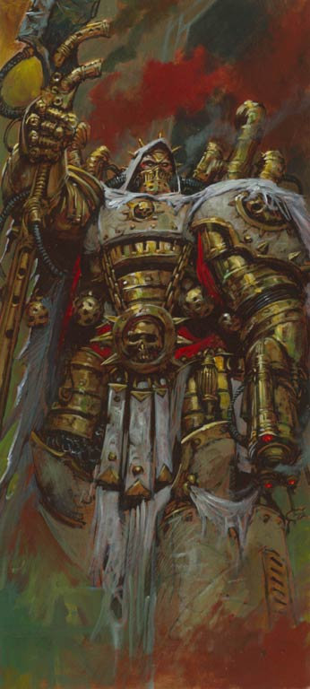

<!-- A0695-B0006 -->

原译文

Mortarion 莫塔里安

**校订译文**

Mortarion 莫塔里安

<!-- /A0695-B0006 -->

<!-- A0695-B0007 -->
## History 历史

<!-- /A0695-B0007 -->

<!-- A0695-B0008 -->
### Before the Coming of the Emperor 帝皇到来之前

<!-- /A0695-B0008 -->

<!-- A0695-B0009 -->
### Pre-Reunification 与帝皇重逢之前

原题：Pre-Reunification 统一前

<!-- /A0695-B0009 -->

<!-- A0695-B0010 -->
**英文原文**

The only consistent information regarding Mortarion and his homeworld come from a single source: the Stygian Scrolls of Lackland Thorn, a historian and polymath attached to the explorator fleet that discovered Barbarus.

<!-- /A0695-B0010 -->

<!-- A0695-B0011 -->

原译文

关于莫塔里安和他的家园世界的唯一一致信息来自一个来源：拉克兰·索恩的冥河卷轴，他是一位历史学家和博学者，隶属于发现巴巴鲁斯的探索者舰队。

**校订译文**

关于莫塔里安及其母星，能够彼此连贯印证的记载仅出自拉克兰·索恩的《冥河卷轴》。索恩是一位历史学家兼博学家，随发现巴巴鲁斯的探索舰队同行。

<!-- /A0695-B0011 -->

<!-- A0695-B0012 -->
**英文原文**

Mortarion crash landed on the world of Barbarus. He came to rest at the site of a huge battle fought across a vast plain. All around him were strewn the bodies of the dead and dying for miles in all directions. Barbarus was constantly covered in a poisonous fog and the mountains were ruled by fierce warlords. The normal humans, dropped off millennia before, were forced to live in the lowest areas of the planet, amidst the choking fog. They were condemned to an endless life of servitude and were in constant fear of those who moved above them.

<!-- /A0695-B0012 -->

<!-- A0695-B0013 -->

原译文

莫塔里安坠落在巴巴鲁斯世界。他在一场横跨广阔平原的大战中安息。他周围到处都是死者的尸体，四面八方都是死亡，绵延数英里。巴巴鲁斯经常被毒雾笼罩，山脉被凶猛的军阀统治。数千年前，普通人被迫生活在星球上最低的地区，在令人窒息的雾气中。他们被判处无休止的奴役生活，并一直害怕那些凌驾于他们之上的人。

**校订译文**

莫塔里安坠落于巴巴鲁斯一片辽阔平原上的大战遗址。四周数英里内，死者与垂死者遍地。这个世界常年笼罩在毒雾中，山峦由残暴军阀统治。数千年前来到这里的普通人，只能生活在海拔最低、仍充满窒息雾气的地区，世世代代遭受奴役，惧怕着盘踞高处的统治者。

<!-- /A0695-B0013 -->

<!-- A0695-B0014 -->
**英文原文**

The winner of the battle in which Mortarion had landed was the greatest of the warlords. He was revelling in his victory until the silence was shattered by the scream of a child. It is said this warlord walked the battlefield for a day searching for the child, not stopping once until he found it. For a moment he considered killing the child, but he realised that no human should be able to breath at this height, let alone cry out. He considered what he had found, and then bundled the child up and carried it from the carnage. He now had a son, something he had craved for years despite his dark magical powers. The warlord christened the child Mortarion, child of death.

<!-- /A0695-B0014 -->

<!-- A0695-B0015 -->

原译文

莫塔里安降落的战斗的胜利者是最伟大的军阀。他陶醉在胜利中，直到一个孩子的尖叫打破了沉默。据说这位军阀在战场上走了一天寻找孩子，直到找到孩子才停下来。有那么一刻，他考虑过要杀了孩子，但他意识到，在这个高度上，没有人能呼吸，更不用说哭了。他仔细考虑了一下发现了什么，然后把孩子捆起来，从大屠杀中抱了出来。他现在有了一个儿子，这是他多年来一直渴望的东西，尽管他有黑暗的魔法力量。军阀给孩子起名叫莫塔里安，死亡之子。

**校订译文**

赢下这场大战的是当地最强大的军阀。他正沉醉于胜利，一声婴儿啼哭却打破寂静。据说，他为寻找孩子在战场上走了一整天，片刻未歇。找到婴儿后，他曾想杀死对方，却意识到普通人在这样的高度连呼吸也做不到，更不可能大声啼哭。他端详片刻，将孩子包裹起来，抱离尸横遍野的战场。尽管掌握黑暗巫术，他始终渴望拥有一个儿子，如今终于如愿。他给孩子取名“莫塔里安”，意为“死亡之子”。

<!-- /A0695-B0015 -->

<!-- A0695-B0016 图片 -->
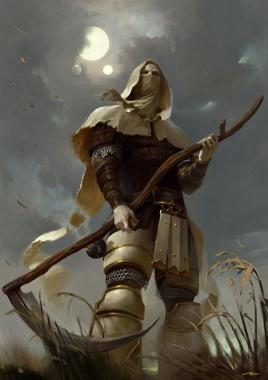

<!-- A0695-B0017 -->

原译文

Young Mortarion 青年莫塔里安

**校订译文**

Young Mortarion 青年莫塔里安

<!-- /A0695-B0017 -->

<!-- A0695-B0018 -->
**英文原文**

The warlord tested how high the child could survive in the poisonous atmosphere of Barbarus and then erected a massive wall of black iron. He then moved his mansion past this to keep it from the child. Perhaps he knew the child was better than him and that one day he would come for the warlord, or perhaps he was afraid of the small child able to breath where no other of his kind could. Whatever he felt, he trained the child in his image. He taught everything of warfare to Mortarion. He was constantly at the front fighting against all of the other warlords' armies, sometimes of undead humans, sometimes of more daemonic creatures. Mortarion was still human though, and he sought to know of those who dwelled below the layer of fog. After witnessing the Overlords hauling captive humans away for torture and experimentation, Mortarion escaped from his holdings and descended the mountain, the warlord bellowing after him of his treachery and that to return would mean death. He first found safety with a young Calas Typhon.

<!-- /A0695-B0018 -->

<!-- A0695-B0019 -->

原译文

军阀测试了这个孩子在巴巴鲁斯的有毒大气中能活多久，然后竖起了一堵巨大的黑铁墙。然后，他把住所移到了这里，以免孩子看到。也许他知道这个孩子比他强，总有一天他会来找军阀，也许他害怕这个孩子能在同类中没有其他人能呼吸的地方呼吸。不管他有什么感觉，他都按照自己的形象训练孩子。他把战争的一切都教给了莫塔里安。他经常在前线与所有其他军阀的军队作战，有时是不死的人类，有时是更邪恶的生物。尽管如此，莫塔里安仍然是人类，他试图了解那些生活在毒雾之下的人。在目睹了霸主们将俘虏的人类带走进行折磨和实验后，莫塔里安逃离了他的领地，下山了，军阀在他身后咆哮着他的背叛，回来意味着死亡。他首先在年轻的卡拉斯·泰丰斯身上找到了安全。

**校订译文**

军阀试探孩子在巴巴鲁斯毒气中所能承受的最高海拔，随后筑起一堵巨大的黑铁墙，将自己的宅邸迁到界限之外，使孩子无法接近。或许他预见这孩子终将胜过自己，回来索命；也或许只是畏惧婴儿竟能在其他人类无法呼吸之处存活。无论如何，他仍按自己的模样培养莫塔里安，将战争技艺倾囊相授。莫塔里安常在前线迎战其他军阀的军队，其敌手既有不死的人类，也有更加魔性的生物。然而，他终究仍是人类，渴望了解毒雾之下的同胞。目睹霸主们拖走俘虏、加以折磨和实验后，他逃离养父的领地，走下山去。军阀在后方怒斥他的背叛，警告他胆敢回来便只有死路。他最初是在年轻的卡拉斯·提丰身边获得庇护。

**校注：** how high 为最高海拔，不是能活多久；莫塔里安在前线作战，不能让代词全指养父。

<!-- /A0695-B0019 -->

<!-- A0695-B0020 图片 -->
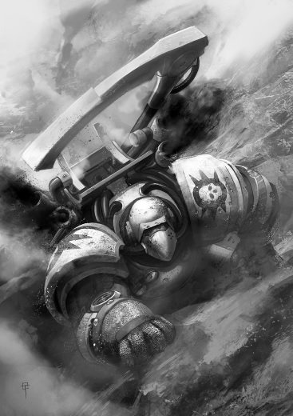

<!-- A0695-B0021 -->

原译文

young Mortarion attempts to scale the mountains of Barbarus to reach his father, Necare 年轻的莫塔里安试图攀登巴巴鲁斯的山脉，以接近他的父亲尼凯尔

**校订译文**

young Mortarion attempts to scale the mountains of Barbarus to reach his father, Necare 年轻的莫塔里安试图攀登巴巴鲁斯的山脉，以接近他的父亲尼凯尔

<!-- /A0695-B0021 -->

<!-- A0695-B0022 -->
**英文原文**

As Mortarion descended, he began to realise he had found his people. He smelt the scent of food for the first time, he saw people unobstructed by the fog and for the first time he heard laughter, real laughter, not that of the victorious warlord's. He realised that the prey that the warlords fought over was his own people, and with this came a sense of hatred and he vowed to give them justice over their oppressors.

<!-- /A0695-B0022 -->

<!-- A0695-B0023 -->

原译文

当莫塔里安下来时，他开始意识到他已经找到了自己的人民。他第一次闻到食物的味道，他看到人们没有被毒雾挡住，他第一次听到笑声，真正的笑声，不是胜利的军阀的笑声。他意识到军阀们争夺的猎物是他自己的人民，随之而来的是一种仇恨感，他发誓要为他们向压迫者伸张正义。

**校订译文**

下山后，莫塔里安意识到自己终于找到了同胞。他第一次闻到食物的香气，第一次不隔着毒雾看见人群，也第一次听见真正的欢笑，而非军阀得胜后的狂笑。军阀争抢的猎物原来就是他的人民；仇恨由此滋生，他发誓要替同胞向压迫者讨回公道。

<!-- /A0695-B0023 -->

<!-- A0695-B0024 -->
**英文原文**

His acceptance into the community of humans was not easy. He was seen as just another monster from above them, and this was quite true due to his appearance. He had pallid skin and hollow, haunted eyes and he terrified most of the inhabitants. He may have been feared, but Mortarion bade his time and helped get the meagre harvest in and was generally a useful and productive member of the society, more than most were. Eventually, the time he had waited for arrived, a way to prove himself in the eyes of his fellow humans.

<!-- /A0695-B0024 -->

<!-- A0695-B0025 -->

原译文

他融入人类社会并不容易。他被视为他们顶上的另一个怪物，由于他的外表，这是千真万确的。他苍白的皮肤和空洞的、幽魂般的眼睛，吓坏了大多数居民。他可能很可怕，但莫塔里安花费时间，帮助居民获得了微薄的收成，他通常是社会中有用和富有成效的一员，比大多数人都多。最终，他等待的时间到了，这是一种在人类同胞眼中证明自己的方式。

**校订译文**

人类并未轻易接纳他。他皮肤惨白，眼窝深陷，目光阴郁，看起来确实像又一个来自山上的怪物，令多数居民恐惧。但莫塔里安耐心等待，帮助人们收取微薄的庄稼，为村落作出比多数人更多的贡献。终于，他等到了向同胞证明自己的机会。

<!-- /A0695-B0025 -->

<!-- A0695-B0026 -->
**英文原文**

A lesser warlord had arrived with his shambling undead legions and began to carry off those they could for their master's plans. In the ensuing Overlord Wars the peasants fought back as best they could, but they only had fire torches and farming implements to defend themselves. Each of them had fought many times like this during their lives and it was all they could do not to run, let alone put up an effective counter manoeuvre. Until, that is, Mortarion himself joined into the fray. He strode above his fellow humans, dwarfing all around him. He used an enormous two handed scythe and charged into the ranks of the enemy with the hatred that had been building for years before and drove them from the village. The warlord smiled and withdrew to the poisonous area above, unaware of the primarch's amazing respiratory abilities. Mortarion dispatched the warlord and his place among the villagers was sealed.

<!-- /A0695-B0026 -->

<!-- A0695-B0027 -->

原译文

一个小军阀带着他蹒跚的亡灵军团来到这里，开始为主人的计划带走他们能带走的东西。在随后的霸主战争中，农民们尽其所能进行反击，但他们只有火把和农具来自卫。他们每个人一生中都打过很多次这样的仗，他们所能做的就是不逃跑，更不用说进行有效的反击了。直到，也就是说，莫塔里安本人加入了这场战斗。他大步走在人类同胞之前，让周围的人都相形见绌。他用一把巨大的双手镰刀，带着多年前积累的仇恨冲进敌人的队伍，把他们赶出了村庄。军阀微笑着退到了上方的毒区，没有意识到原体惊人的呼吸能力。莫塔里安处决了军阀，他在村民中的地位已然确定。

**校订译文**

一名小军阀率蹒跚的不死军队袭来，准备掳走居民供其计划使用。在这场霸主战争中，农民只能持火把和农具抵抗。他们一生反复遭遇这种袭击，能够不逃已属不易，更无力组织有效反击。直到莫塔里安加入战斗。他高大得远超周围同胞，手持巨型双手镰刀，挟着积压多年的仇恨冲入敌阵，将来敌逐出村庄。军阀冷笑着退向高处毒雾，却不知原体拥有惊人的呼吸耐受力。莫塔里安追上并杀死了他，从此赢得村民接纳。

<!-- /A0695-B0027 -->

<!-- A0695-B0028 -->
**英文原文**

As Mortarion grew he taught the villagers all he knew of warfare. Word of his knowledge and exploits spread and people came from far and wide to learn from him. Soon, villages were becoming strongholds and the villagers were more effective defenders. Eventually, Mortarion began to move from village to village, teaching along the way and if need be, defend the settlements. His ultimate vengeance was always denied to him because of the fog that prevented the humans from pushing home their attacks.

<!-- /A0695-B0028 -->

<!-- A0695-B0029 -->

原译文

随着莫塔里安的成长，他向村民们传授了他所知道的一切战争知识。他的学识和功绩传开了，人们从四面八方赶来向他学习。很快，村庄变成了据点，村民们成为了更有效的防御者。最终，莫塔里安开始从一个村庄移动到另一个村庄，一路上教书，如果需要的话，保卫定居点。他最终的复仇总是被阻止，因为毒雾阻碍了人类的进攻。

**校订译文**

莫塔里安逐渐将战争知识传授给村民。他的本领与事迹传开，各地人们纷纷前来求教。村庄被加固为据点，居民也成为更出色的守卫。他往来各村传授战技，必要时亲自协防。但毒雾始终阻碍人类乘胜追击，使他的最终复仇迟迟不能实现。

<!-- /A0695-B0029 -->

<!-- A0695-B0030 -->
**英文原文**

Mortarion then recruited the strongest and most resilient of warriors from the villages he went to. He formed them into elite units and drilled them himself. He turned blacksmiths from tool-working to weapons-making when time allowed and had them craft armour. He also armed his warriors with crude air filtration apparatus. It is said that the next attack that descended from the mountains above was repulsed quickly and Mortarion, leading his Death Guard, as they had become known, followed them into the fog above, massacring the remaining forces and killing the warlord. For the first time in history, Mortarion had led the people into the toxic fog and survived. Mortarion continued to improve the breathing apparatus and campaigned ever higher into the fog. The constant exposure to the toxins hardened his warriors, a useful and transferable skill retained by the Death Guard.

<!-- /A0695-B0030 -->

<!-- A0695-B0031 -->

原译文

然后，莫塔里安从他去过的村庄招募了最强壮、最有韧性的战士。他将他们组成精英部队，并亲自训练他们。在时间允许的情况下，他让铁匠从工具制作转向武器制造，并让他们制作盔甲。他还为战士们配备了简陋的空气过滤装置。据说，下一次从山上下来的进攻很快就被击退了，莫塔里安带领他的死亡守卫，正如他们所知，跟着他们进入了雾中，屠杀了剩下的部队，杀死了军阀。历史上第一次，莫塔里安带领人们进入有毒的迷雾并幸存下来。莫塔里安继续改进呼吸器，并在毒性更高的雾中进行竞选。不断接触毒素使他的战士变得坚强，这是死亡守卫保留的一项有用且可转移的技能。

**校订译文**

他从沿途村落选出最强壮、最坚韧的战士，编成精锐并亲自训练，又让铁匠在闲暇时从制作农具转向锻造武器与护甲，为战士配发简陋的空气过滤装置。据说，下一支下山袭击的军队迅速溃败，莫塔里安便率这些已被称为“死亡守卫”的战士追入毒雾，歼灭残敌，杀死军阀。人类首次在他的带领下进入高处毒雾，并活着归来。此后，他不断改进呼吸器，向更高的山地推进。反复暴露于毒素之中，锻炼了战士的耐受力；这种有用、可推广的本领，也被后来的死亡守卫继承。

<!-- /A0695-B0031 -->

<!-- A0695-B0032 -->
### The Unification Struggle 统一斗争

<!-- /A0695-B0032 -->

<!-- A0695-B0033 -->
**英文原文**

Only the top of the mountains denied him access. After hundreds of battles and wars, there was just one inaccessible mansion, one which Mortarion knew well, the one where his adoptive father resided. Mortarion returned to his village, confident in the knowledge that he would return for his final battle. When he returned, there was word of an amazing visitor who brought promises of salvation. The mood of the primarch darkened. His final battle had been building for years and he was not happy that someone else would share his glory.

<!-- /A0695-B0033 -->

<!-- A0695-B0034 -->

原译文

只有山顶让他无法进入。在经历了数百场战斗和战争之后，只有一座莫塔里安非常熟悉的无法进入的住所，那就是他的养父居住的地方。莫塔里安回到了他的村庄，相信他会回来参加最后的战斗。当他回来时，有一个惊人的访客带来了救赎的承诺。原体的心情变得阴沉起来。他最后的战斗已经进行了多年，他不高兴别人会分享他的荣誉。

**校订译文**

最终，只剩最高峰仍无法抵达。经历数百场战斗，尚未攻克的宅邸只余一座：养父的居所，也是莫塔里安再熟悉不过的地方。他返回村庄，确信自己终将回来完成最后一战，却听说有位非凡的访客带来了救赎的承诺。他的心情顿时阴沉下来。为这场决战积蓄多年后，他不愿让别人分享自己的荣耀。

<!-- /A0695-B0034 -->

<!-- A0695-B0035 -->
**英文原文**

People say that Mortarion flattened the wooden door to the banquet room and he found the elders and a stranger who was their opposite in every way. Where they were gaunt and pale skinned, the stranger had bronzed flesh and a perfect physique. The connection between father and son immediately formed and was plain to see, although Mortarion knew nothing of the link. The stranger challenged the young primarch to capture the last mansion alone, but if he failed he would join the stranger in total obedience. Mortarion turned away and began the ascent to the final mansion, that of the man he had called father, alone. He marched to the top with the anger given by years of building hatred for the final warlord. He climbed higher than he had ever gone before, ignoring the increasing toxins.

<!-- /A0695-B0035 -->

<!-- A0695-B0036 -->

原译文

人们说，莫塔里安把宴会厅的木门夷为平地，他发现了老者和一个在各方面都与他们相反的陌生人。那个陌生人面容憔悴，皮肤苍白，皮肤古铜色，体格完美。父子之间的联系立即形成，显而易见，尽管莫塔里安对这种联系一无所知。陌生人挑战年轻的原体独自占领最后一座住所，但如果他失败了，他会完全服从陌生人。莫塔里安转身离开，开始独自登上最后一座住所，那是他称之为父亲的人的住所。他带着多年来对最后一位军阀的仇恨而愤怒地走到了顶峰。他爬得比以往任何时候都高，无视不断增加的毒素。

**校订译文**

传说莫塔里安一脚踹倒宴会厅木门，看见长老们正围坐在一名陌生人身旁。长老们瘦削苍白，陌生人却肤色古铜、体魄完美，与他们截然不同。父子之间的联系显而易见，莫塔里安却尚不知其中缘由。陌生人向他挑战：若能独自攻下最后一座宅邸便罢；若失败，就必须绝对服从自己。莫塔里安转身独自登山，奔向昔日称作父亲之人的居所。对最后这位军阀积累多年的仇恨驱使着他，不顾越来越浓的毒气，攀上前所未至的高度。

<!-- /A0695-B0036 -->

<!-- A0695-B0037 -->
**英文原文**

When the confrontation came, it was mercifully short. Even the hoses of his suit began to corrode and rot down and Mortarion was gasping for breath. The last thing he saw was the overlord walking towards him to fulfill the promise he had made years before. Then, the stranger stepped between them and, defying the fog, killed the warlord with one mighty sweep of his sword. When Mortarion had recovered he bent his knee to the stranger and pledged his service. Only then did the stranger reveal himself to be the Emperor of Mankind and Mortarion's father. He then was given command of the fourteenth legion of the Space Marines, the Dusk Raiders.

<!-- /A0695-B0037 -->

<!-- A0695-B0038 -->

原译文

当对抗到来时，幸运的是时间很短。就连他盔甲的软管也开始腐蚀和腐烂，莫塔里安喘不过气来。他最后看到的是霸主朝他走来，履行他多年前许下的诺言。然后，那个陌生人走到他们中间，不顾迷雾，一挥长剑杀死了军阀。当莫塔里安康复后，他向陌生人屈膝并承诺为他服务。直到那时，这个陌生人才表明自己是人类帝皇，也是莫塔里安的父亲。随后，他被任命为星际战士第十四军团“黄昏突袭者”的指挥官。

**校订译文**

真正的对峙极为短暂。他防护服的软管也开始腐蚀溃烂，自己已无法呼吸。意识消失前，他最后看见的是霸主走来，要兑现多年前杀死他的威胁。陌生人却插到两者之间，无视毒雾，一剑斩杀军阀。莫塔里安恢复后，单膝跪地，承诺效忠。直到此时，对方才揭示身份：人类帝皇，也是他的生父。随后，他获授星际战士第十四军团——黄昏突袭者——的指挥权。

<!-- /A0695-B0038 -->

<!-- A0695-B0039 -->
### Great Crusade 大远征

<!-- /A0695-B0039 -->

<!-- A0695-B0040 -->
**英文原文**

It was said that Mortarion brought his relentlessness to the Death Guard legion and they followed his ideals. He only ever found friendship in two other Primarchs, Night Haunter and Horus, or by others who were shunned by their brothers such as Perturabo and Lion El'Jonson. So close did Mortarion and Horus become that the ever watchful Roboute Guilliman of the Ultramarines and Corax of the Raven Guard approached the Emperor with concerns as to where Mortarion's loyalties lay. The Emperor waved it aside with a hand gesture; loyalty to Horus was loyalty to the Emperor. Meanwhile, Mortarion was frequently critical of Magnus the Red over his use of Librarians and was one of the chief voices to ban Psykers among the Astartes Legions at the Council of Nikea. Mortarion expressed a hatred of all things related to the Warp, and felt betrayed when he managed to sneak into the Imperial Palace and discovered the Golden Throne under construction. However after Malcador explained that the purpose of the Golden Throne was to remove mankind's need of the Warp, Mortarion was put more at ease. Mortarion also clashed with other Primarch's who he felt had upbringings far easier than his hell on Barbarus, particularly Sanguinius, Jaghatai Khan, and Fulgrim.

<!-- /A0695-B0040 -->

<!-- A0695-B0041 -->

原译文

据说莫塔里安将他的无情带到了死亡守卫军团，他们追随他的理想。他只在另外两位原体身上找到了友谊，午夜幽魂和荷鲁斯，或者被他们的兄弟如佩图拉博和莱昂·艾尔庄森所回避的其他人。莫塔里安和荷鲁斯变得如此接近，以至于极限战士的时刻警惕的罗伯特·基里曼和暗鸦守卫的科拉克斯接近帝皇，担心莫塔里安的忠诚在哪里。帝皇用手势把它挥到一边；对荷鲁斯的忠诚就是对帝皇的忠诚。与此同时，莫塔里安经常批评赤红之马格努斯使用智库，并且是在尼凯亚议会禁止阿斯塔特军团中使用灵能者的主要声音之一。莫塔里安表达了对所有与亚空间有关的事物的憎恨，当他设法潜入皇宫并发现正在建造的黄金王座时，他感到被背叛了。然而，在马卡多解释说黄金王座的目的是消除人类对亚空间的需求后，莫塔里安更加放心了。莫塔里安还与其他原体发生了冲突，他觉得这些原体的成长远比他在巴巴鲁斯的地狱里的成长容易，尤其是圣吉列斯、察合台可汗和福格瑞姆。

**校订译文**

据说莫塔里安将自己不屈不挠的作风带给死亡守卫，全军遵奉他的理念。他亲近的兄弟包括午夜幽魂与荷鲁斯，以及同样受到其他兄弟疏远的佩图拉博和莱昂·艾尔’庄森。他与荷鲁斯交情深厚，甚至令警觉的罗保特·基里曼与科拉克斯向帝皇表达担忧，怀疑他的忠诚究竟归于何人。帝皇却挥手作罢：忠于荷鲁斯，就是忠于帝皇。另一方面，莫塔里安长期批评马格努斯使用智库员，也是尼凯亚会议上主张禁止军团使用灵能者的主要人物之一。他痛恨一切与亚空间有关的事物，曾潜入帝国皇宫，看见正在建造的黄金王座，深感受骗。直到马卡多解释，王座旨在让人类不再依赖亚空间，他才稍感安心。他也常与圣吉列斯、察合台可汗及福格瑞姆等兄弟冲突，认为他们的成长远比自己在巴巴鲁斯经历的地狱轻松。

**校注：** 英文先称只有两位朋友，随后又引出佩图拉博与莱昂，数量及连接结构不一致；中文保留全部被提及的朋友，待核原出处。

<!-- /A0695-B0041 -->

<!-- A0695-B0042 图片 -->
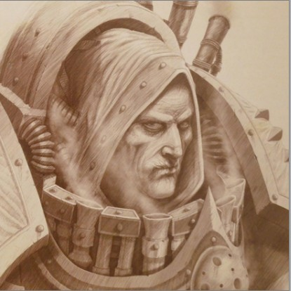

<!-- A0695-B0043 -->

原译文

Mortarion, Pre-Heresy 莫塔里安，叛乱前

**校订译文**

Mortarion, Pre-Heresy 莫塔里安，叛乱前

<!-- /A0695-B0043 -->

<!-- A0695-B0044 -->
**英文原文**

Like Perturabo, Mortarion proved bitter over his perceived sidelining and under-appreciation by other Primarchs during the Great Crusade. Jaghatai Khan remarked that besides himself, Mortarion was the only Primarch whose deeds and history were not well known to the greater Imperium. Mortarion even proved critical of Horus' promotion to Warmaster, agreeing that while Horus was the best choice the Emperor's decision to name a Warmaster in the first place had been a mistake. Mortarion predicted that only strife between the Primarchs would rise if the Emperor were to abandon the Great Crusade personally and used Horus as his proxy.

<!-- /A0695-B0044 -->

<!-- A0695-B0045 -->

原译文

与佩图拉博一样，莫塔里安对他在大远征期间被其他原体边缘化和低估感到痛苦。察合台可汗说，除了他自己，莫塔里安是唯一一位行为和历史不为伟大帝国所知的原体。莫塔里安甚至对荷鲁斯晋升为战帅持批评态度，他同意虽然荷鲁斯是最好的选择，但帝皇最初决定任命战帅是一个错误。莫塔里安预测，如果帝皇亲自放弃大远征并使用荷鲁斯作为他的代理人，那么只有原体之间的冲突会加剧。

**校订译文**

与佩图拉博一样，莫塔里安觉得自己在大远征中遭到边缘化与轻视，因此心怀怨愤。察合台曾说，除自己之外，唯有莫塔里安的经历和功绩不为帝国大众熟知。他甚至批评荷鲁斯获任战帅：虽承认荷鲁斯是最佳人选，却认为帝皇一开始就不该设立这个职位。他预言，帝皇一旦退出大远征一线、让荷鲁斯代行其职，只会加剧原体之间的争斗。

<!-- /A0695-B0045 -->

<!-- A0695-B0046 -->
**英文原文**

During the Great Crusade, Mortarion led his legion into battle against a Xenos race known as the Jorgall.

<!-- /A0695-B0046 -->

<!-- A0695-B0047 -->

原译文

在大远征期间，莫塔里安率领他的军团与被称为乔格尔的异型种族作战。

**校订译文**

大远征期间，莫塔里安也曾率军团对抗名为乔格尔的异形种族。

<!-- /A0695-B0047 -->

<!-- A0695-B0048 -->
### The Heresy 荷鲁斯之乱

原题：The Heresy 叛乱

<!-- /A0695-B0048 -->

<!-- A0695-B0049 -->
**英文原文**

Horus found Mortarion more difficult to bring to his cause than either Angron or Fulgrim, and for a time it seemed the Warmaster may have failed to convince the Lord of the Death Guard. However, Horus at last found a chink in Mortarion's armor; he was beginning to see the Emperor as having been corrupted with power and now was just another tyrant drunk with power. Indeed, Mortarion had become disgusted with what exactly the Emperor was, considering him a Warp-tainted "aberration" like his tyrant adopted father. Horus also used Mortarion's distrust of the Warp to his advantage, arguing that the Emperor had used the Warp in the creation of the Primarchs. Horus eventually used these doubts to bring Mortarion to his cause. Mortarion led his Legion in their betrayal of the Imperium at the Battle of Isstvan III and Drop Site Massacre. He later came to blows with Jaghatai Khan on Prospero after failing to convince him to join with them in rebellion. During the fight the two Primarchs were able to challenge the other, with the Great Khan proving faster and the Death Lord proving more durable. Following the battle, Mortarion abandoned his pursuit of the White Scars and instead began a spiteful purge of the systems surrounding Prospero. During the purge, Mortarion encountered a Daemon possessing the body of a woman and was forced to kill it using his innate psychic abilities despite it being against Imperial (and by this point, his very own) dogma. Realizing that the Emperor had lied to him about the Empyrean, Mortarion vowed to master it.

<!-- /A0695-B0049 -->

<!-- A0695-B0050 -->

原译文

荷鲁斯发现，莫塔里安比安格隆或福格瑞姆更难为他的事业服务，有一段时间，战帅似乎未能说服死亡守卫原体。然而，荷鲁斯终于在莫塔利安的盔甲上发现了一个缺口；他开始认为帝皇被力量腐蚀了，现在他只是又一个被力量灌醉的暴君。事实上，莫塔里安已经对帝皇的真实身份感到厌恶，认为他就像他的暴君养父一样，是一个受亚空间污染的“异常”。荷鲁斯还利用了莫塔里安对亚空间的不信任，认为帝皇在创造原体时使用了亚空间。荷鲁斯最终利用这些疑虑将莫塔里安带到了他的事业中。莫塔里安带领他的军团在伊斯塔万三号之战和登陆点大屠杀中背叛了帝国。后来，在未能说服察合台可汗加入他们的叛乱后，他在普罗斯佩罗与察合台可汗发生了冲突。在战斗中，两位原体互相决斗，可汗表现得更快，死神表现得更持久。战斗结束后，莫塔里安放弃了对白色伤疤的追求，转而开始对普罗斯佩罗周围的星系进行恶意清洗。在清洗过程中，莫塔里安遇到了一个拥有一个女人身体的恶魔，并被迫使用他与生俱来的灵能能力将其杀死，尽管这违背了帝国（以及他自己的）教条。意识到帝皇对他隐瞒了关于至高天的事，莫塔里安发誓要掌握它。

**校订译文**

荷鲁斯发现，莫塔里安比安格隆或福格瑞姆更难拉拢，一度似乎无法说服这位死亡守卫之主。最终，他找到了对方心防的裂缝：莫塔里安已开始认为帝皇遭权力腐蚀，不过是又一个沉迷权势的暴君。他厌恶帝皇的本质，视其为受亚空间污染的“畸物”，与自己的残暴养父无异。荷鲁斯进一步利用这种不信任，指出帝皇创造原体时动用了亚空间力量，终于使他加入叛乱。莫塔里安率军在伊斯塔万三号及登陆点大屠杀中背叛帝国。后来，他在普罗斯佩罗劝降察合台失败，两位原体随即交锋：大可汗速度更快，死亡领主则更加坚韧。战后，他放弃追逐白疤，转而以怨愤驱使的清洗蹂躏普罗斯佩罗周边星系。其间，他遭遇附于一名女子体内的恶魔，被迫动用与生俱来的灵能将其杀死，违背了帝国及自己一贯坚持的信条。意识到帝皇对亚空间的说辞并不诚实后，他发誓要亲自掌握这种力量。

<!-- /A0695-B0050 -->

<!-- A0695-B0051 图片 -->
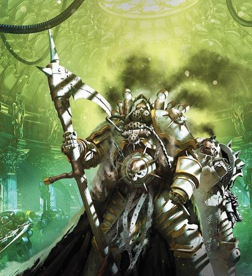

<!-- A0695-B0052 -->

原译文

Mortarion, Primarch of the Death Guard, during the Horus Heresy 莫塔里安，死亡守卫原体，荷鲁斯叛乱期间

**校订译文**

Mortarion, Primarch of the Death Guard, during the Horus Heresy 荷鲁斯之乱期间的死亡守卫原体莫塔里安

<!-- /A0695-B0052 -->

<!-- A0695-B0053 -->
**英文原文**

Mortarion next appeared during the Battle of Dwell, summoned by Horus alongside Fulgrim to aid him in gaining the powers of the Emperor on Molech. During their meeting, Mortarion survived an assassination attempt by Shadrak Meduson, who assaulted the Primarchs with a trio of Fire Raptors. Later in the Battle of Molech, Mortarion sacrificed several of his Deathshroud warriors to allow for the resurrection of Ignatius Grulgor.

<!-- /A0695-B0053 -->

<!-- A0695-B0054 -->

原译文

莫塔里安随后出现在德维尔之战中，被荷鲁斯召集与福格瑞姆一起帮助他在摩洛获得帝皇的力量。在他们的会面中，莫塔里安躲过了沙德拉克·梅杜森的暗杀企图，后者用三架火隼袭击了原体。在摩洛之战的后期，莫塔里安牺牲了他的几名死亡寿衣战士，以使伊格纳修斯·格鲁戈尔复活。

**校订译文**

德威尔之战期间，荷鲁斯召来莫塔里安与福格瑞姆，准备借两人相助，在摩洛取得帝皇般的力量。会面时，沙德拉克·梅杜森派三架火猛禽炮艇袭击原体，莫塔里安从这场刺杀中幸存。随后摩洛之战中，他牺牲数名死亡寿衣战士，使伊格纳修斯·格鲁戈尔得以复活。

<!-- /A0695-B0054 -->

<!-- A0695-B0055 -->
**英文原文**

By the time of the Battle of the Kalium Gate late in the Heresy, Mortarion's forbidden knowledge had grown considerably. He experimented with both Xenos and Chaos artifacts, vowing to remain pure through understanding. At this same time he was tasked with Horus to find and destroy the White Scars, who had been harrying the traitor lines since the events on Prospero. Mortarion was initially reluctant, but was moved by Horus' declaration that he was the only Primarch the Warmaster still could rely on and was eager to settle the score with the Khan anyway. In the subsequent Battle of Catallus, the joint Death Guard-Emperor's Children fleet led by Mortarion cornered the White Scars fleet at the Dark Glass artifact. But as Mortarion boarded Jaghatai's flagship, the Swordstorm, he discovered the ship abandoned save for a contingent of suicidal Sagyar Mazan warriors. Worse still for the Primarch, the reactors of the Swordstorm had been set to overload and the Khan had since evacuated to the Battleship Lance of Heaven, which was leading the escape of the loyalist fleet into the Webway. Unable to escape thanks to the Sagyar Mazan and the vessels reactivated Void Shields, Mortarion led the massacre of the Scars suicidal rear guard while directing his fleet to combine its fire and reduce the Swordstorms shields. When the shields were depleted shortly after he personally killed Torghun Khan, Mortarion barely teleported off the Swordstorm before it exploded. Following the battle, Mortarion realized that his divided fleet had hampered the war effort and ordered Eidolon to find Calas Typhon and his splinter fleet.

<!-- /A0695-B0055 -->

<!-- A0695-B0056 -->

原译文

到叛乱后期的钾门之战时，莫塔里安的禁忌知识已经大大增长。他尝试了异型和混沌造物，发誓要通过理解保持纯粹。与此同时，他受命于荷鲁斯寻找并摧毁自普罗斯佩罗事件以来一直在骚扰叛徒的白色伤疤。莫塔里安起初并不情愿，但被荷鲁斯的宣告所触动，战帅荷鲁斯宣称他是唯一可以依靠的原体，并且无论如何都渴望与可汗算账。在随后的卡塔鲁斯之战中，由莫塔里安率领的死亡守卫皇帝之子联合舰队在黑暗琉璃神器处将白色伤疤舰队逼入绝境。但当莫塔里安登上察合台的旗舰剑刃风暴号时，他发现这艘船被遗弃了，只留下了一群自杀式的赎罪小队战士。对原体来说更糟糕的是，剑刃风暴号的反应堆已经超负荷运行，可汗已经撤离到天堂之枪号战列舰上，这艘战舰正带领忠诚的舰队逃往网道。由于赎罪小队和战舰重新激活了虚空盾，莫塔里安无法逃脱，他领导了对白色伤疤自杀式后卫的大屠杀，同时指挥他的舰队联合火力并减少剑刃风暴号的盾牌。当他亲自杀死托尔汉可汗后不久盾牌耗尽时，莫塔里安在剑刃风暴号爆炸前几乎没有传送出去。战斗结束后，莫塔里安意识到他分裂的舰队阻碍了战争的进行，并命令艾多隆找到卡拉斯·泰丰斯和他的分裂舰队。

**校订译文**

到战争后期的卡利乌姆之门战役时，莫塔里安掌握了大量禁忌知识。他研究异形与混沌器物，坚称可以凭借理解保持自身纯洁。荷鲁斯命他消灭自普罗斯佩罗之后不断袭扰叛军战线的白疤；他起初不愿接受，却被“你是我唯一还能倚重的原体”这番话打动，自己也急于与可汗清算。卡塔鲁斯之战中，他率死亡守卫与帝皇之子联合舰队，在黑暗琉璃附近困住白疤。但登上旗舰剑刃风暴号后，他才发现舰内只剩决意赴死的萨加尔·马赞战士。反应堆已被设定为过载，可汗则转移至天堂之枪号，正率忠诚派舰队逃入网道。敢死队的牵制与重新启动的虚空盾阻断了退路，莫塔里安只能一面屠杀后卫，一面命舰队集中火力轰击剑刃风暴号的护盾。他亲手杀死托尔浑可汗后不久，护盾终于崩溃，他才在全舰爆炸前勉强传送脱身。战后，他意识到军团舰队分裂削弱了战力，便命艾多隆寻找卡拉斯·提丰及其脱离主力的舰队。

**校注：** barely teleported off 表示千钧一发成功脱身，原译几乎没有传送易被误读为未脱身。

<!-- /A0695-B0056 -->

<!-- A0695-B0057 图片 -->
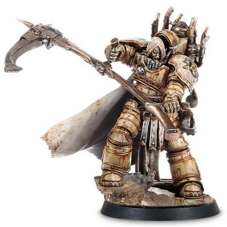

<!-- A0695-B0058 -->

原译文

Heresy-era Mortarion 叛乱时期莫塔里安

**校订译文**

Heresy-era Mortarion 叛乱时期莫塔里安

<!-- /A0695-B0058 -->

<!-- A0695-B0059 -->
### Fall of the Death Guard 死亡守卫的堕落

<!-- /A0695-B0059 -->

<!-- A0695-B0060 -->
**英文原文**

After these campaigns, Mortarion received orders from Horus to make for Terra. Mortarion rejoined the primary Death Guard fleet under Calas Typhon, who was battled the Dark Angels fleet in a campaign of misdirection in the aftermath of the Battle of Perditus. On Ynyx Mortarion and Typhon reunited, and their whole fleet set course of Terra for the coming battle. Upon Typhon's advice, Mortarion would make the journey inside the Terminus Est as opposed to the Endurance. However, Mortarion found his once-beloved brother Typhon changed, and once their vessels were inside the Warp the First Captain framed all of the fleet's Navigators. Accusing them of agents of Malcador, Typhon had his Grave Wardens execute all of the Navigators but assured Mortarion that he and his trained specialists could navigate the Warp to Terra. Mortarion's distrust of Typhon intensified as the Death Guard became afflicted with the Destroyer Hive. This plague transformed the Death Guard into bloated mutants, unable to die by any means. No cure was found, and it seemed the Death Guard was doomed to something as petty as disease. After Mortarion himself became infected, he confronted Typhon aboard the Navigator's station on the Terminus Est.

<!-- /A0695-B0060 -->

<!-- A0695-B0061 -->

原译文

在这些战役之后，莫塔里安收到了荷鲁斯的命令，前往泰拉。莫塔里安重新加入了卡拉斯·泰丰斯领导的死亡守卫主舰队，后者在佩迪图斯之战后的一场误导战役中与黑暗天使舰队作战。在伊尼克斯，莫塔里安和泰丰斯重聚，他们的整个舰队为即将到来的战斗设定了泰拉的航向。根据泰丰斯的建议，莫塔里安将在终焉号而不是坚忍号内进行航程。然而，莫塔里安发现他曾经深爱的兄弟泰丰斯变了，他们的船只一进入亚空间，第一连长就杀害了舰队的所有导航者。泰丰斯指责他们是马卡多的特工，让他的守墓人处决了所有的导航者，但他向莫塔里安保证，他和他训练有素的专家可以驾驭亚空间前往泰拉。莫塔里安对泰丰斯的不信任随着死亡守卫受到毁灭之巢的折磨而加剧。这场瘟疫使死亡守卫变成了臃肿的变种人，无论如何都无法死亡。没有找到治愈方法，似乎死亡守卫注定要遭受如疾病这样的诅咒。莫塔里安本人感染后，他在终焉号的导航者站台与泰丰斯对峙。

**校订译文**

之后，荷鲁斯命他前往泰拉。他与卡拉斯·提丰率领的死亡守卫主舰队重新会合；后者此前在佩迪图斯之战后，以一系列欺敌行动与黑暗天使舰队周旋。两人在伊尼克斯重聚，全军启程赶赴泰拉。采纳提丰建议，莫塔里安登上终焉号，而非坚忍号。但他察觉昔日亲近的提丰已经变了。舰队进入亚空间后，第一连长诬指全体导航员是马卡多的代理人，命守墓人将他们处决，同时保证自己与受训专家足以引导航程。随后，毁灭者蜂巢的瘟疫感染全军，将战士变成臃肿的畸变者，无论如何都无法死去；任何疗法都无效，强大的死亡守卫竟似要败于区区疾病。莫塔里安对提丰越发怀疑，自己也被感染后，终于来到终焉号导航舱与他对质。

<!-- /A0695-B0061 -->

<!-- A0695-B0062 图片 -->
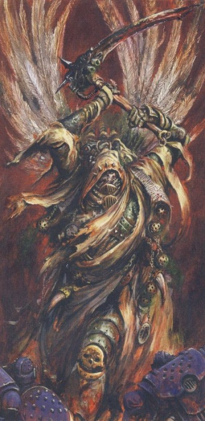

<!-- A0695-B0063 -->

原译文

Mortarion, Daemon Prince of Chaos 莫塔里安，混沌恶魔王子

**校订译文**

Mortarion, Daemon Prince of Chaos 莫塔里安，混沌恶魔亲王

<!-- /A0695-B0063 -->

<!-- A0695-B0064 -->
**英文原文**

Mortarion accused Typhon of treachery, and the First Captain replied that he had indeed lied to his Primarch but for a greater purpose he would come to appreciate. Enraged, Mortarion engaged Typhon in a duel, with the First Captain's psychic abilities allowing him to hold off the Primarch's attacks for a time. However, Mortarion eventually prevailed and struck down Typhon with his scythe. Due to the Destroyer Hive, Typhon quickly came back to life. Mortarion then revealed his trump card: unleashing the deformed Ignatius Grulgor from his confines. Grulgor strangled Typhon to death, fulfilling his oath to Mortarion to kill the First Captain. However, Typhon quickly came back to life, and both the First Captain and Daemon laughed as Mortarion realized he had been betrayed. With no more options and overcome by the Destroyer Plague, Mortarion began to hallucinate that he was back on Barbarus attempting to endure the toxins of the mountains to reach his father's fortress. He heard the voice of Nurgle, stating that without his submission he and the Death Guard would be doomed to this torture for all eternity. However, with submission would come new unparalleled endurance and power. Mortarion simultaneously experienced himself before the Emperor after his failure to kill his father, and finally snapped. He pledged himself to Nurgle and the torture ceased. According to a Daemon known as The Remnant, Mortarion had allowed Typhus to corrupt the Death Guard as he saw no other path for the survival of his sons.

<!-- /A0695-B0064 -->

<!-- A0695-B0065 -->

原译文

莫塔里安指责泰丰斯的背叛，第一连长回答说，他确实对他的原体撒了谎，但为了更大的目的，他会感激的。愤怒的莫塔里安与泰丰斯展开决斗，凭借第一连长的灵能能力，他暂时抵挡住了原体的攻击。然而，莫塔里安最终取得了胜利，用镰刀击倒了泰丰斯。由于毁灭之巢，泰丰斯很快就复活了。莫塔里安随后展示了他的王牌：将畸形的伊格纳修斯·格鲁戈尔从他的束缚中释放出来。格鲁戈尔勒死了泰丰斯，履行了他对莫塔里安的誓言，杀死了第一连长。然而，泰丰斯很快就复活了，当莫塔里安意识到自己被背叛时，第一连长和恶魔都笑了。由于没有更多的选择，并被毁灭瘟疫所征服，莫塔里安开始产生幻觉，他回到了巴巴鲁斯，试图忍受山脉的毒素到达他父亲的堡垒。他听到了纳垢的声音，说如果他不屈服，他和死亡守卫将永远遭受这种折磨。然而，屈服会带来新的无与伦比的耐力和力量。莫塔里安在杀死父亲失败后，同时在帝皇面前经历了自己的一切，最后大发雷霆。他向纳垢宣誓服从，酷刑停止了。根据一个被称为遗存者的恶魔的说法，莫塔里安让泰丰斯腐化了死亡守卫，因为他看不到子嗣的生存之路。

**校订译文**

莫塔里安斥责提丰背叛，第一连长却答称，自己确曾欺骗原体，但所图更为深远，原体终将理解。莫塔里安怒而出手；提丰凭灵能抵挡了一阵，最终仍被镰刀斩倒，却因毁灭者蜂巢迅速复生。原体于是亮出最后一张牌，释放被囚禁的畸变者伊格纳修斯·格鲁戈尔。格鲁戈尔履行誓言，将提丰勒死；后者却再次活了过来，与恶魔一同嘲笑终于察觉遭背叛的莫塔里安。原体再无手段，又被毁灭者瘟疫折磨，开始幻觉自己重返巴巴鲁斯，正忍受山巅毒气，试图抵达养父堡垒。纳垢的声音告诉他，若不臣服，他与死亡守卫就将永受折磨；若肯接受，则能获得前所未有的坚韧与力量。他又同时经历了当年刺杀养父失败、跪倒帝皇面前的屈辱，终于崩溃，向纳垢宣誓效忠，痛苦随即终止。名为遗存者的恶魔则声称，莫塔里安之所以任由泰弗斯腐化死亡守卫，是因为已看不到其他能让子嗣活下去的道路。

**校注：** snapped 在精神重压下指崩溃，并非只是大发雷霆；结尾遗存者的说法保留为该恶魔声称。

<!-- /A0695-B0065 -->

<!-- A0695-B0066 -->
### Terra 泰拉

<!-- /A0695-B0066 -->

<!-- A0695-B0067 -->
**英文原文**

What emerged from the warp bore little resemblance to what had gone in. The Marines' once gleaming armour was corroded and shattered, barely containing their bloated, pustule covered bodies. Their weapons and armour were powered by the energies of Chaos and they became known as the Plague Marines, although they would still use the name Death Guard. During the Siege of Terra Mortarion was the last of the traitor Primarch's to appear in the Sol System. The Lord of Death appeared aboard the Vengeful Spirit, his putrid stench sending all but Horus, Abaddon, and Tormageddon into convulsions. True to his earlier pledge, Horus let Mortarion's Death Guard be the first to land upon Terra. During the battle on Terra he oversaw the siege of the Western regions of the Palace, spreading plague and misery wherever he appeared. Unlike Angron and Fulgrim, he did not even attempt to penetrate the Emperor's psychic shield around the Palace. During a war council he mocked Perturabo for not fully embracing Chaos but nonetheless allowed Typhus to work with the Iron Warriors Primarch as part of a ritual to weaken the Emperor's psychic shield of the Palace. Mortarion next met with Magnus in order to discuss an attack on the Colossi Gate, revealing to his brother that he hated his current Daemonic visage and was in constant pain. Magnus helped Mortarion control his new abilities, allowing the Primarch to regain his lost composure. Grateful, Mortarion immediately organized an attack on the Colossi Gate that Magnus would use as a screen while he infiltrated the Imperial Dungeon.

<!-- /A0695-B0067 -->

<!-- A0695-B0068 -->

原译文

从亚空间中出现的东西与进入的东西几乎没有相似之处。星际战士曾经闪闪发光的盔甲被腐蚀和破碎，几乎无法容纳他们臃肿、脓疱覆盖的身体。他们的武器和盔甲由混沌的能量提供动力，他们被称为瘟疫战士，尽管他们仍然使用死亡守卫的名字。在泰拉围城期间，莫塔里安是最后一个出现在太阳系中的叛徒原体。死神出现在复仇之魂号上，他那极致的恶臭让除了荷鲁斯、阿巴顿和托玛吉顿之外的所有人都抽搐了。荷鲁斯信守了他早先的承诺，让莫塔里安的死亡守卫成为第一个登陆泰拉的人。在泰拉之战期间，他监督了对皇宫西部地区的围攻，无论他出现在哪里，都会传播瘟疫和苦难。与安格隆和福格瑞姆不同，他甚至没有试图穿透皇宫周围的帝皇灵能屏障。在一次军事会议上，他嘲笑佩图拉博没有完全接受混沌，但仍然允许泰丰斯与钢铁勇士原体合作，作为削弱帝皇皇宫灵能屏障的仪式的一部分。莫塔里安接下来会见了马格努斯，讨论了对巨像之门的袭击，并向他的兄弟透露，他讨厌自己现在的恶魔面孔，并且一直处于痛苦之中。马格努斯帮助莫塔里安控制了他的新能力，让这位原体恢复了失去的冷静。出于感激，莫塔里安立即组织了对巨像之门的攻击，马格努斯在渗透帝国地牢时将其用作掩护。

**校订译文**

离开亚空间的战士已面目全非。往日闪耀的护甲腐蚀破裂，勉强包住肿胀、遍生脓疱的躯体；混沌能量驱动着他们的武器与盔甲。他们仍自称死亡守卫，也被称为瘟疫战士。泰拉围城时，莫塔里安是最后进入太阳系的叛变原体。他登上复仇之魂号，腐臭令荷鲁斯、阿巴顿和托玛吉顿以外的在场者全部抽搐。荷鲁斯履行承诺，让死亡守卫率先登陆泰拉。莫塔里安负责围攻皇宫西侧，所到之处瘟疫与苦难蔓延，却没有像安格隆和福格瑞姆那样尝试闯过帝皇的灵能护盾。军议中，他嘲笑佩图拉博未肯彻底拥抱混沌，同时准许泰弗斯与钢铁勇士原体合作，以仪式削弱皇宫屏障。后来，他与马格努斯商议进攻巨像之门，坦言自己厌恶如今的恶魔形貌，且始终忍受痛苦。马格努斯帮助他控制新力量，令他恢复镇定。出于感激，他立即组织攻势，为兄弟潜入帝国地牢提供掩护。

<!-- /A0695-B0068 -->

<!-- A0695-B0069 图片 -->
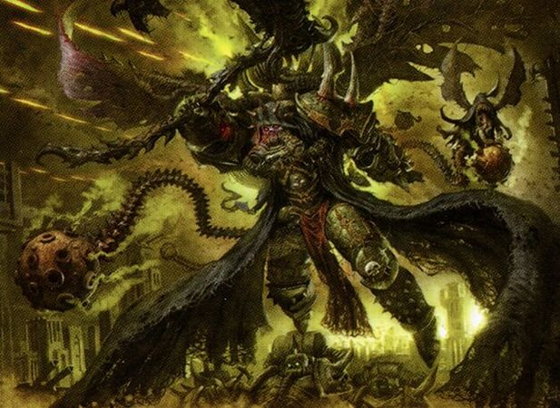

<!-- A0695-B0070 -->

原译文

Mortarion, Daemon Primarch 莫塔里安，恶魔原体

**校订译文**

Mortarion, Daemon Primarch 莫塔里安，恶魔原体

<!-- /A0695-B0070 -->

<!-- A0695-B0071 -->
**英文原文**

Sometime before his eventual battle with Jaghatai Khan, Mortarion assaulted the Marmax Bastion alongside Typhus but was met by Nathaniel Garro. Garro rejected his fathers offer to return to the Death Guard and instead challenged Mortarion to a duel, buying time for Euphrati Keeler to escape. While Mortarion initially toyed with the warrior to humiliate him, after taking a wound he became enraged and struck the warrior down. Mortarion declared he would turn Garro into an undead puppet to serve him for eternity, summoning a great host of flies to convert him into a Nurgle abomination. However, thanks to the Emperor's power being infused into him by Keeler, Garro was able to fight Mortarion back for a time but was still ultimately no match for the Daemon Primarch's power. Garro died, but not before giving Mortarion a painful wound in his neck with the broken shard of Libertas.

<!-- /A0695-B0071 -->

<!-- A0695-B0072 -->

原译文

在他最终与察合台可汗战斗之前的某个时候，莫塔里安袭击了泰丰斯旁边的马尔马克斯堡垒，但遭到了纳撒尼尔·伽罗的袭击。伽罗拒绝了父亲重返死亡守卫的提议，而是向莫塔里安发起决斗，为幼发拉底·琪乐争取时间逃跑。莫塔里安最初玩弄战士羞辱他，在受伤后，他变得愤怒并击倒了战士。莫塔里安宣称，他将把伽罗变成一个不死的木偶，永远为他服务，召唤一大群苍蝇把他变成纳垢的可憎之物。然而，由于琪乐向伽罗注入了帝皇的力量，伽罗得以在一段时间内击退莫塔里安，但最终仍无法与恶魔原体的力量相匹敌。伽罗死了，但在此之前，莫塔里安的脖子被自由的碎片划伤，疼痛难忍。

**校订译文**

在与察合台最终决战之前，莫塔里安曾与泰弗斯联手进攻马尔马克斯堡垒，遭纳撒尼尔·伽罗拦截。伽罗拒绝返回死亡守卫，转而向基因之父挑战，为尤弗拉蒂·琪乐撤离争取时间。莫塔里安起初有意戏弄羞辱他，受伤后却暴怒，将他击倒，宣称要把他变成永世服役的不死傀儡，并召来蝇群将其转化为纳垢怪物。但琪乐已将帝皇之力灌注给伽罗，使他一度逼退原体。最终，他仍无法匹敌恶魔原体，战死当场；临终前却用自由之剑的断片刺伤莫塔里安颈部，令其痛苦难忍。

<!-- /A0695-B0072 -->

<!-- A0695-B0073 -->
**英文原文**

Following the withdrawal of Perturabo and the Iron Warriors from Terra Horus gave Mortarion the Lion's Gate Spaceport, which he turned into his own personal headquarters. However, this was assailed in a massive counterattack led by Mortarion's old foe Jaghatai Khan, leading a force of White Scars and Imperial Army. During the fight for the Spaceport the 2 Primarch's once again came to blows. Faced with Mortarion's new Daemonic endurance and strength, the Khan was brutally beaten down and nearly defenseless. However, he was able to find a weakness in the Death Lord with his pride. Jaghatai Khan scolded Mortarion for being weak and giving into the powers of the Warp, while he himself had resisted the temptations of Chaos and remained true to the Emperor. Mortarion flew into a rage, which the Khan took advantage of to launch a second wave of dizzying attacks that overwhelmed the Primarch. In the end the badly wounded Jaghatai Khan was impaled on the blade of Mortarion's scythe, but simply pulled his body along its length to get face-to-face with the Death Guard Primarch. The loyalist Primarch decapitated Mortarion, who was banished into the Warp in a massive explosion similar to that of a Vortex Weapon. Later the Khan's badly wounded body was recovered by Imperial forces.

<!-- /A0695-B0073 -->

<!-- A0695-B0074 -->

原译文

在佩图拉博和钢铁勇士从泰拉撤军后，莫塔里安获得了狮门太空港，并将其变成了自己的个人总部。然而，这在莫塔里安的老对手察合台可汗领导的大规模反击中遭到了攻击，他领导了一支白色伤疤和帝国军队。在争夺太空港的战斗中，两位原体再次交锋。面对莫塔里安新的恶魔耐力和力量，可汗被残酷地击败，几乎毫无防备。然而，他能够找到死亡领主的弱点和他的骄傲。察合台可汗斥责莫塔里安软弱，屈服于亚空间的力量，而他自己则抵制了混沌的诱惑，忠于帝皇。莫塔里安勃然大怒，可汗利用这一点发动了第二波令人眼花缭乱的攻击，压倒了原体。最后，重伤的察合台可汗被莫塔里安镰刀的刀刃刺穿，但他只是沿着镰刀的刃部拉动身体，与死亡守卫原体面对面。忠诚的原体斩首了莫塔里安，他在一场类似于涡旋武器的大规模爆炸中被放逐到亚空间。后来，可汗的重伤之躯被帝国军队找到。

**校订译文**

佩图拉博与钢铁勇士离开泰拉后，荷鲁斯将狮门太空港交给莫塔里安，后者把它改成自己的司令部。不久，察合台率白疤与帝国军发起大规模反攻，两位宿敌再度交锋。面对恶魔化后更强悍的力量与耐受力，可汗被打得几乎无力抵抗，却抓住对方骄傲的弱点，斥责他软弱屈服于亚空间，而自己始终拒绝混沌、忠于帝皇。莫塔里安勃然大怒，可汗乘机再度发动迅疾攻势，压得他应接不暇。最终，重伤的可汗被镰刃贯穿，仍顺着刀刃拉近身体，逼到原体面前，一刀斩下其首级。类似涡旋武器爆发的巨响中，莫塔里安被放逐回亚空间。帝国军随后找回了可汗重伤的身体。

<!-- /A0695-B0074 -->

<!-- A0695-B0075 图片 -->
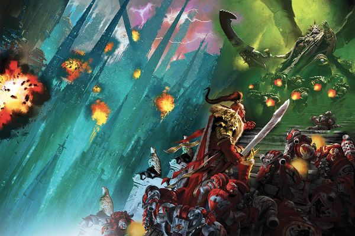

<!-- A0695-B0076 -->

原译文

Mortarion battles Jaghatai Khan during the Siege of Terra 泰拉围城期间莫塔里安与察合台可汗战斗

**校订译文**

Mortarion battles Jaghatai Khan during the Siege of Terra 泰拉围城期间莫塔里安与察合台可汗战斗

<!-- /A0695-B0076 -->

<!-- A0695-B0077 -->
**英文原文**

After Horus was defeated, Mortarion reappeared and claimed the Plague Planet in the Eye of Terror as his new base. He shaped it so well that Nurgle promoted him to Daemon Prince. Mortarion got what he wanted, a world of his own. He ruled over a toxic death world of poison, horror and misery, with his own position ironically mirroring the one his monstrous step-father had held on Barbarus. He had come home.

<!-- /A0695-B0077 -->

<!-- A0695-B0078 -->

原译文

荷鲁斯被击败后，莫塔里安再次出现，并声称恐惧之眼中的瘟疫星球是他的新基地。他塑造得如此之好，以至于纳垢将他升格为恶魔王子。莫塔里安得到了他想要的，一个属于他自己的世界。他统治着一个充满毒药、恐怖和痛苦的有毒死亡世界，他自己的地位讽刺地反映了他可怕的继父在巴巴鲁斯身上的地位。他已经回家了。

**校订译文**

荷鲁斯败亡后，莫塔里安再次现身，占据恐惧之眼中的瘟疫星球作为新基地。他将其塑造得如此合乎纳垢心意，以至获晋为恶魔亲王。他终于拥有自己的世界：一个毒雾、恐怖与苦难交织的死亡世界。讽刺的是，他如今的地位，恰如当年那位怪物养父在巴巴鲁斯的统治。他仿佛回到了家。

**校注：** 此段把升格恶魔亲王置于战后，和前文战争期间已升魔的记述不一致，属于源文版本冲突，保留并待核。

<!-- /A0695-B0078 -->

<!-- A0695-B0079 -->
### Post-Heresy 荷鲁斯之乱之后

原题：Post-Heresy 叛乱后

<!-- /A0695-B0079 -->

<!-- A0695-B0080 -->
**英文原文**

Following the Heresy, the ascended Mortarion shut himself off from the affairs of the Materium. Seeing the Materium as petty, his interest leaned towards the Great Game. He was rarely seen even by his own subordinates on the Plague Planet, leaving the Death Guard to conduct campaigns on its own as warbands. However, he still appeared in galactic affairs on a number of occasions.

<!-- /A0695-B0080 -->

<!-- A0695-B0081 -->

原译文

叛乱之后，升格的莫塔里安将自己与物质界的事务隔绝。他认为物质界很小，于是对伟大游戏产生了兴趣。在瘟疫星球上，即使是他自己的下属也很少见到他，于是死亡守卫离开了，作为战帮独自开展战役。然而，他仍然多次出现在银河系事务中。

**校订译文**

战争结束后，升魔的莫塔里安逐渐疏离物质宇宙，将其事务视为微不足道，转而关注诸神的大博弈。即使瘟疫星球上的部下也难得见他，死亡守卫各战帮遂自行出征。不过，他仍在若干重大事件中亲自介入银河事务。

<!-- /A0695-B0081 -->

<!-- A0695-B0082 -->
**英文原文**

In 437.M36, Mortarion emerged at the head of a Death Guard and Nurgle-Daemon army that led to the Fall of Sanctia.

<!-- /A0695-B0082 -->

<!-- A0695-B0083 -->

原译文

437.M36年，莫塔里安率领死亡守卫和纳垢恶魔军队，导致了神圣星的陷落。

**校订译文**

437.M36年，莫塔里安率领死亡守卫和纳垢恶魔军队，导致了神圣星的陷落。

<!-- /A0695-B0083 -->

<!-- A0695-B0084 -->
**英文原文**

In 901.M41, during the Battle of Kornovin, Mortarion killed Geronitan, Supreme Grand Master of the Grey Knights. Geronitan's subordinate, Kaldor Draigo, assaulted the Daemon Primarch and spoke the true name that the Emperor had originally intended for him. His physical form devastated and his spirit sent to the Immaterium, Draigo carved his forebear's name into the Daemon's heart, an insult Mortarion has never forgotten.

<!-- /A0695-B0084 -->

<!-- A0695-B0085 -->

原译文

901.M41年，在科诺温之战中，莫塔里安杀死了灰骑士至高大导师格罗尼坦。格罗尼坦的下属卡尔多·迪亚哥袭击了恶魔原体，并说出了帝皇最初为他打算的真实姓名。他的身体形态被摧毁，他的精神被送往非物质界，迪亚哥将祖先的名字刻在了恶魔的心脏上，这是莫塔里安永远不会忘记的侮辱。

**校订译文**

901.M41科尔诺温之战中，莫塔里安杀死灰骑士至高大导师杰罗尼坦。其部属卡尔多·迪亚哥随即迎战，念出帝皇原本为莫塔里安准备的真名，使恶魔原体形体崩溃、灵魂被逐回亚空间。迪亚哥还将前任导师的名字刻在其心脏上，成为莫塔里安始终无法忘怀的羞辱。

**校注：** forebear 依上文指前任至高大导师杰罗尼坦，非迪亚哥血缘祖先；原文将刻字置于形体崩溃之后，具体动作时序仍需原出处确认。

<!-- /A0695-B0085 -->

<!-- A0695-B0086 图片 -->
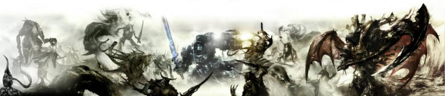

<!-- A0695-B0087 -->

原译文

Mortarion faces the Grey Knights at the Battle of Kornovin 莫塔里安在科诺温之战中面对灰骑士

**校订译文**

Mortarion faces the Grey Knights at the Battle of Kornovin 莫塔里安在科尔诺温之战中迎战灰骑士

<!-- /A0695-B0087 -->

<!-- A0695-B0088 -->
**英文原文**

After Roboute Guilliman was resurrected in the closing days of the 41st Millennium, Mortarion sensed his brother's rebirth. Guilliman's return sparked Mortarion's interest in material affairs once more, and for the first time in 10,000 years he decided to lead the whole of the Death Guard in a renewed campaign. In anticipation he created 7 new diseases with the Hand of Darkness, one of which was a blindness-inducing plague that swept through Ultramar. Only Guilliman's presence could cure the sickness. Later, Mortarion personally led a massive invasion of Ultramar in what became known as the Plague Wars. Mortarion massacred the population of entire worlds in an attempt to goad Guilliman to battle. During that campaign, Mortarion appeared during the Invasion of Konor where he led the Death Guard in an attempt to break through to Macragge itself. The Daemon Primarch later aided Typhus and Ku'Gath in their trap against Guilliman on Parmenio but was foiled by a mysterious young girl who may have been a Living Saint.

<!-- /A0695-B0088 -->

<!-- A0695-B0089 -->

原译文

在第41个千年的最后几天，罗伯特·基里曼复活后，莫塔里安感觉到了他兄弟的重生。基里曼的回归再次激发了莫塔里安对物质界事务的兴趣，一万年来他第一次决定领导整个死亡守卫进行新的战役。在预期中，他用黑暗之手创造了7种新疾病，其中之一是席卷奥特拉玛的致盲瘟疫。只有基里曼的存在才能治愈这种疾病。后来，莫塔里安亲自领导了对奥特拉玛的大规模入侵，即所谓的瘟疫战争。莫塔里安屠杀了一个世界的人口，试图怂恿基里曼作战。在那场战役中，莫塔里安出现在康诺入侵期间，他带领死亡守卫试图突破马库拉格本身。恶魔原体后来帮助泰丰斯和库噶斯在帕尔梅尼奥对基里曼的陷阱中，但被一个可能是活圣人的神秘年轻女孩挫败了。

**校订译文**

第41个千年末，莫塔里安感应到罗保特·基里曼复苏，再次对物质宇宙产生兴趣。一万年来，他首次决定率整个死亡守卫重新出征。为此，他用黑暗之手制造七种新疫病，包括席卷奥特拉玛的一种致盲瘟疫，唯有基里曼亲临才能治愈。随后，他发动大规模入侵，即瘟疫战争，屠戮一个又一个世界的居民，企图逼基里曼应战。他在康诺入侵战中亲自率军，试图一路突破至马库拉格，后来又协助泰弗斯与库噶斯在帕尔梅尼奥设伏，却被一名可能是活圣人的神秘少女破坏计划。

<!-- /A0695-B0089 -->

<!-- A0695-B0090 图片 -->
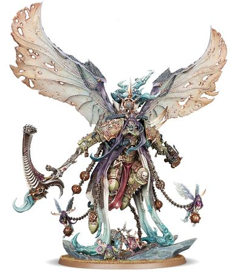

<!-- A0695-B0091 -->

原译文

Daemon Prince Mortarion 恶魔原体莫塔里安

**校订译文**

Daemon Prince Mortarion 恶魔亲王莫塔里安

<!-- /A0695-B0091 -->

<!-- A0695-B0092 -->
**英文原文**

Mortarion's plan against Guilliman reached its climax on Iax, luring his brother there in cooperation with Ku'gath, who created a deadly disease known as the Godblight which was capable of killing even a Primarch. Mortarion and Ku'gath both ignored orders from Nurgle himself to move to the Scourge Stars due to the new War in the Rift, with even Typhus abandoning his Primarch to follow the Plague God's will. Mortarion still believed himself not a slave to Chaos, and sought to transform Ultramar into an extension of the Garden of Nurgle. On Iax, the two Primarchs came to blows, but Mortarion was able to emerge the victor thanks to his Daemonically-enhanced strength and resilience. Administering the Godblight, Mortarion attempted to goad his brother down the path of corruption by stating Nurgle could save him from his agonizing death. When Guilliman suddenly reawoke and channeled the power of the Emperor directly, Mortarion fled before the power of his Father. According to Rotigus, both Mortarion and Ku'gath have earned the displeasure of Nurgle for their insubordination and failure.

<!-- /A0695-B0092 -->

<!-- A0695-B0093 -->

原译文

莫塔里安对抗基里曼的计划在艾克斯达到高潮，与库噶斯合作引诱他的兄弟，库噶斯创造了一种被称为神瘟的致命疾病，甚至可以杀死一位原体。由于新的大裂隙战争，莫塔里安和库噶斯都无视了纳垢本人的命令，前往天灾群星，甚至泰丰斯也放弃了他的原体，追随瘟疫之神的意愿。莫塔里安仍然相信自己不是混沌的奴隶，并试图将奥特拉玛改造成纳垢花园的延伸。在艾克斯上，两位原体发生了冲突，但莫塔里安凭借其恶魔般增强的力量和韧性，最终取得了胜利。在控制神瘟时，莫塔里安试图通过声称纳垢可以将他从痛苦的死亡中拯救出来来刺激他的兄弟走上腐化的道路。当基里曼突然苏醒并直接引导帝皇的力量时，莫塔里安在他父亲的力量面前逃跑了。根据罗提古斯的说法，莫塔里安和库噶斯都因不服从和失败而引起了纳垢的不满。

**校订译文**

他的计划在艾克斯达到顶点。他与库噶斯联手诱基里曼前来，后者已配制出连原体也能杀死的“神瘟”。裂隙中新战事爆发后，纳垢亲自命两人转赴天灾群星，他们却抗命不从；连泰弗斯也离开原体，遵循瘟疫之神的意志。莫塔里安依旧坚称自己并非混沌奴隶，企图将奥特拉玛化为纳垢花园的延伸。他在艾克斯凭恶魔力量与韧性击败基里曼，向其施用神瘟，又以纳垢能终止垂死之苦为诱饵，劝兄弟堕落。但基里曼突然苏醒，直接承载帝皇力量，莫塔里安只得逃离。烂格斯称，两人抗命且失败，已招致纳垢不满。

**校注：** 两人无视的是转赴天灾群星的命令，原译断句易反成无视命令却前往；明确他们抗命留守计划。

<!-- /A0695-B0093 -->

<!-- A0695-B0094 -->
**英文原文**

Sometime after the formation of the Great Rift, Mortarion battled his brother Perturabo in the War of Rust and Ruin.

<!-- /A0695-B0094 -->

<!-- A0695-B0095 -->

原译文

大裂隙形成后的某个时候，莫塔里安在腐蚀与毁灭战争中与他的兄弟佩图拉博作战。

**校订译文**

大裂隙形成后的某个时候，莫塔里安在腐蚀与毁灭战争中与他的兄弟佩图拉博作战。

<!-- /A0695-B0095 -->

<!-- A0695-B0096 -->
## Appearance and Wargear 外貌与战备

<!-- /A0695-B0096 -->

<!-- A0695-B0097 -->
**英文原文**

During the height of his powers as a servant of the Emperor, Mortarion was described as having an ashen, hairless face. He was extremely tall and thin and wore a heavy collar around his throat that constantly emitted wisps of poisonous air. He wore a grey cloak over his personalised suit of brass and bare steel power armour known as The Barbaran Plate. He carried a huge, hand-crafted Shenlongi energy pistol at his side called "the Lantern." He also wore a string of globe-shaped brass censers which contain poisonous gases from his homeworld which were utilized as Phosphex Bombs. His signature weapon was the Manreaper Silence, a battle scythe a foot taller than him.

<!-- /A0695-B0097 -->

<!-- A0695-B0098 -->

原译文

在他作为皇帝之仆的力量巅峰时期，莫塔里安被描述为有一张灰白、无毛的脸。他又高又瘦，脖子上戴着一个沉重的项圈，不断地散发出有毒的空气。他身穿一件灰色斗篷，外披一套名为巴巴鲁斯战甲的个性化黄铜和裸钢动力盔甲。他随身携带一把巨大的神龙手工制作的能量手枪，名为“冥灯”。他还戴着一串球形的黄铜香炉，里面装着来自他家乡的有毒气体，这些气体被用作磷化氢炸弹。他的标志性武器是收割者寂静，一把比他高一英尺的战镰。

**校订译文**

仍效忠帝皇、处于力量巅峰时期的莫塔里安，面容灰白而无毛，高瘦异常，颈间沉重的护领不断逸出毒气。他身穿以黄铜和裸钢制成的定制动力甲“巴巴鲁斯战甲”，外罩灰色斗篷，腰侧佩着巨大的神龙造能量手枪“冥灯”。一串球形黄铜香炉装着母星毒气，可充作磷化炸弹。标志性武器则是名为“寂静”的收割者战镰，比他本人还高一英尺。

**校注：** 灰斗篷穿在动力甲外；Phosphex 已定磷化燃剂体系，不擅化学认定为磷化氢。Shenlongi 为产地修饰，不是巨龙亲手制造。

<!-- /A0695-B0098 -->

<!-- A0695-B0099 -->
**英文原文**

The Deathshroud are his personal bodyguard. Two accompany him at all times and are never more than forty-nine paces from his side. They are marines who are listed as killed in action and then wear a mask for the rest of their lives so that only Mortarion may know their true identity. They carry their own Manreapers, copies of the primarch's weapon proportionate for their hands.

<!-- /A0695-B0099 -->

<!-- A0695-B0100 -->

原译文

死亡寿衣是他的私人护卫。两个人一直陪伴着他，离他不超过四十九步。他们是被列为在战斗中阵亡的星际战士，然后在余生中戴着面具，这样只有莫塔里安才能知道他们的真实身份。他们带着自己的收割者，与他们的手相称的原体武器的副本。

**校订译文**

死亡寿衣是其亲卫，始终有两人相随，与他相距不超过四十九步。这些战士在名册上已被列为阵亡，此后终生戴面具，只有莫塔里安知道真实身份。他们也携带收割者战镰，是按自身体形缩小的原体武器仿制品。

<!-- /A0695-B0100 -->

<!-- A0695-B0101 -->
## Etymology 词源学

<!-- /A0695-B0101 -->

<!-- A0695-B0102 -->
**英文原文**

Mortarion's name comes from the Latin word Mors, meaning death.

<!-- /A0695-B0102 -->

<!-- A0695-B0103 -->

原译文

莫塔里安的名字来源于拉丁语单词莫里斯，意思是死亡。

**校订译文**

莫塔里安之名源自拉丁语 Mors，意为“死亡”。

**校注：** 英文 Mors 并非 Morris，保留原拉丁语，删除错误音译莫里斯。

<!-- /A0695-B0103 -->

本篇核心术语与暂定项

以下列出本篇出现的英文原形及核心术语表用词。同形词可能指不同对象，具体词义以本篇正文和校注为准；单复数、别名和仅见于图注的名称可能尚未列入。完整候选见[术语表](../../术语表/双语术语候选.csv)。

| 英文 | 采用中文 | 状态 |
| --- | --- | --- |
| Space Marines | 星际战士 | 官方已核对 |
| Dark Angels | 黑暗天使 | 官方已核对 |
| Grey Knights | 灰骑士 | 官方已核对 |
| Imperial Army | 帝国军 | 暂定·官方待核 |
| Death Guard | 死亡守卫 | 官方已核对 |
| Roboute Guilliman | 罗保特·基里曼 | 官方已核对 |
| Ultramar | 奥特拉玛 | 官方已核对 |
| Ultramarines | 极限战士 | 官方已核对 |
| Horus Heresy | 荷鲁斯之乱 | 官方已核对 |
| Navigator | 导航员 | 官方已核对 |
| Warp | 亚空间 | 官方已核对 |
| Great Rift | 大裂隙 | 官方已核对 |
| Imperium | 帝国 | 暂定·简称 |
| Webway | 网道 | 暂定 |
| Nurgle | 纳垢 | 官方已核对 |
| History | 历史 | 编辑用语已统一 |
| Eye of Terror | 恐惧之眼 | 官方已核对 |
| Emperor of Mankind | 人类帝皇 | 暂定 |
| Emperor | 帝皇 | 官方已核对 |
| Primarch | 原体 | 官方已核对 |
| Daemon Prince | 恶魔亲王 | 官方已核对 |
| Emperor's Children | 帝皇之子 | 官方已核对 |
| Iron Warriors | 钢铁勇士 | 暂定·官方待核 |
| Great Crusade | 大远征 | 暂定·官方待核 |
| Mortarion | 莫塔里安 | 官方已核对 |
| Barbarus | 巴巴鲁斯 | 暂定·官方待核 |
| Terra | 泰拉 | 暂定·官方待核 |
| Horus | 荷鲁斯 | 暂定·官方待核 |
| Vengeful Spirit | 复仇之魂号 | 暂定·官方待核 |
| Lion El'Jonson | 莱昂·艾尔’庄森 | 官方已核对 |
| Isstvan III | 伊斯塔万三号 | 暂定·官方待核 |
| Fulgrim | 福格瑞姆 | 官方已核对 |
| Magnus the Red | 红魔马格努斯 | 官方已核对 |
| Navigators | 导航员 | 官方已核对 |
| Plague Wars | 瘟疫战争 | 暂定·官方待核 |
| Golden Throne | 黄金王座 | 暂定·官方待核 |
| Endurance | 坚韧 | 暂定·官方待核 |
| Konor | 康诺 | 暂定·官方待核 |
| Iax | 艾克斯 | 暂定·官方待核 |
| Molech | 摩洛 | 暂定·官方待核 |
| Macragge | 马库拉格 | 暂定·官方待核 |
| Crash | 崩溃 | 暂定·官方待核 |
| Dark Glass | 黑暗琉璃 | 暂定·官方待核 |
| Master | 导师（审判庭职衔）／舰务官（舰员职务） | 语境定译·官方待核 |
| Euphrati Keeler | 尤弗拉蒂·琪乐 | 暂定 |
| Lance | 骑士矛阵 | 暂定·官方待核 |
| Shadrak Meduson | 沙德拉克·梅杜森 | 暂定·官方待核 |
| White Scars | 白疤 | 官方已核 |
| Raven Guard | 暗鸦守卫 | 官方已核 |
| The Primarchs | 原体 | 暂定·官方待核 |
| Scars | 伤疤 | 暂定·官方待核 |
| The Battle of Perditus | 佩迪图斯之战 | 暂定·官方待核 |
| Sol | 太阳系 | 暂定·官方待核 |
| Isstvan | 伊斯塔万 | 暂定·官方待核 |
| Nathaniel Garro | 纳撒尼尔·伽罗 | 暂定·官方待核 |
| First Captain | 第一连长 | 暂定·官方待核 |
| Eidolon | 艾多隆 | 暂定·官方待核 |
| Calas Typhon | 卡拉斯·提丰 | 暂定·官方待核 |
| Power Armour | 动力盔甲 | 暂定·官方待核 |
| Destroyer | 毁灭者 | 暂定·官方待核 |
| Captain | 连长 | 暂定·官方待核 |
| Brother | 修士 | 暂定·官方待核 |
| Kaldor Draigo | 卡尔多·迪亚哥 | 暂定·官方待核 |
| Raptors | 猛禽 | 暂定·官方待核 |
| Supreme Grand Master | 至高大导师 | 暂定·官方待核 |
| Overlord | 霸主 | 官方已核对 |
| Powers | 能天使 | 暂定·官方待核 |
| Host | 天军 | 暂定·官方待核 |
| Great Game | 伟大游戏 | 暂定·官方待核 |
| Xenos | 异形 | 暂定·官方待核 |
| Rotigus | 烂格斯 | 官方已核对 |
| Typhus | 泰弗斯 | 官方已核对 |
| Plague Marines | 瘟疫战士 | 官方已核对 |
| The Purge | 净世疫军 | 暂定·官方待核 |
| Jaghatai Khan | 察合台可汗 | 暂定·官方待核 |
| Kalium Gate | 卡利乌姆之门 | 暂定·官方待核 |
| Torghun Khan | 托尔浑可汗 | 暂定·官方待核 |
| Sagyar Mazan | 萨加尔·马赞 | 暂定·官方待核 |
| Parmenio | 帕尔梅尼奥 | 暂定·官方待核 |
| Destroyer Plague | 毁灭者瘟疫 | 暂定·官方待核 |
| Gaunt | 兵虫 | 暂定·官方待核 |
| Angron | 安格隆 | 官方已核对 |
| Dusk Raiders | 黄昏突袭者 | 暂定·官方待核 |
| Destroyer Hive | 毁灭者蜂巢 | 暂定·官方待核 |
| Terminus Est | 终焉号 | 暂定·官方待核 |
| Manreaper | 收割者 | 暂定·官方待核 |
| Terminus | 终点站 | 暂定·官方待核 |
| Vengeance | 复仇号 | 暂定·官方待核 |
| Ignatius | 伊格纳修斯 | 暂定·官方待核 |
| Reaper | 收割者号 | 暂定·官方待核 |
| Grand Master | 大导师 | 暂定·官方待核 |
| Geronitan | 杰罗尼坦 | 暂定·官方待核 |
| Subordinates | 属役 | 暂定·官方待核 |
| Godblight | 神瘟 | 暂定·官方待核 |
| Lance of Heaven | 天堂之枪号 | 暂定·官方待核 |
| Hand of Darkness | 黑暗之手 | 暂定·官方待核 |
| Swordstorm | 剑刃风暴号 | 暂定·官方待核 |
| Colossi Gate | 巨像门 | 暂定·官方待核 |
| The Great Khan | 大汗 | 暂定·官方待核 |
| Tormageddon | 托玛格顿 | 暂定·官方待核 |
| Dwell | 德威尔 | 暂定·官方待核 |
| Ignatius Grulgor | 伊格纳修斯·格鲁戈尔 | 暂定·官方待核 |
| Catallus | 卡塔鲁斯 | 暂定·官方待核 |
| The Dark | 《黑暗》 | 暂定·官方待核 |
| Kornovin | 科尔诺温 | 暂定·官方待核 |
| War in the Rift | 裂隙战争 | 暂定·官方待核 |
| System | 星系（恒星系统） | 暂定·官方待核 |
| Death World | 死亡世界 | 暂定·官方待核 |
| Ashen | 灰白星 | 暂定·官方待核 |
| Scourge Stars | 天灾群星 | 暂定·官方待核 |
| War Council | 战争议会 | 暂定·官方待核 |
| Corruption | 腐败 | 暂定·官方待核 |
| Phosphex | 磷化燃剂 | 暂定·官方待核 |
| Stygian Scrolls | 《冥河卷轴》 | 暂定·官方待核 |
| Lackland Thorn | 拉克兰·索恩 | 暂定·官方待核 |
| The Remnant | 遗存者 | 暂定·官方待核 |
| The Barbaran Plate | 巴巴鲁斯战甲 | 暂定·官方待核 |
| Libertas | 自由之剑 | 暂定·官方待核 |
| Ynyx | 伊尼克斯 | 暂定·官方待核 |
| Marmax Bastion | 马尔马克斯堡垒 | 暂定·官方待核 |
| Jorgall | 乔格尔 | 暂定·官方待核 |
| Invasion of Ultramar | 入侵奥特拉玛 | 暂定·官方待核 |
| Colossi | 巨像 | 暂定·官方待核 |
| Resilient | 坚韧号 | 暂定·官方待核 |
| Plague Planet | 瘟疫星 | 暂定·官方待核 |
| Sol System | 太阳系 | 暂定·官方待核 |
| Imperial Dungeon | 帝国地牢 | 暂定·官方待核 |
| Lion's Gate Spaceport | 狮门太空港 | 暂定·官方待核 |
| Lion's Gate | 狮门 | 暂定·官方待核 |
| Marmax | 马尔马克斯 | 暂定·官方待核 |

