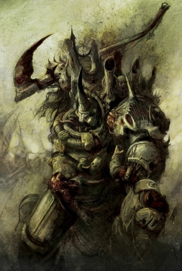
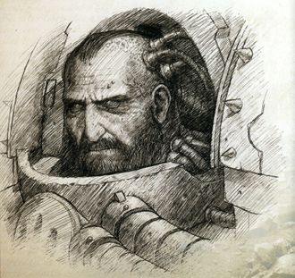
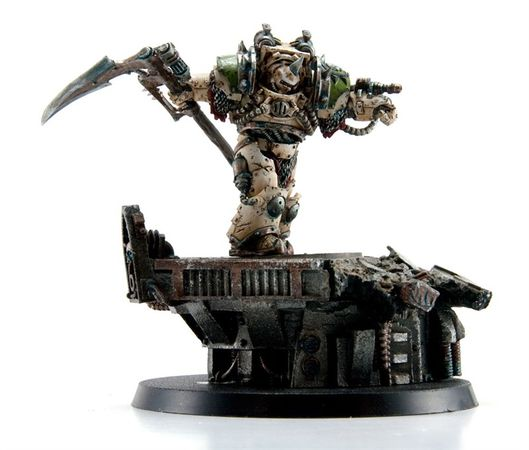
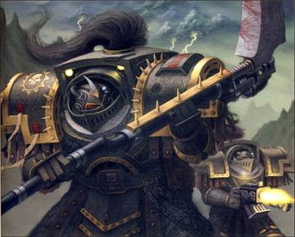
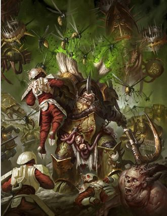
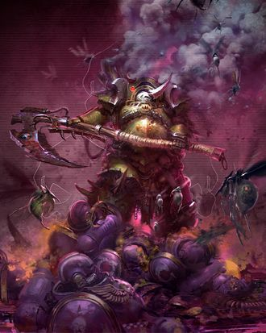
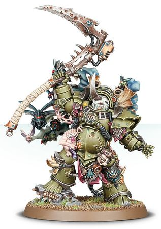

# 0696 泰弗斯 Typhus

精校状态：中文行文已逐段精校，部分术语仍为暂定

分类：人类帝国 / 死亡守卫

原文来源：https://www.bilibili.com/opus/1192087616375226374

原作者：帝国神选罐头

原文时间：2026年04月17日 10:28

[返回分类目录](目录.md) · [全书目录](../../目录.md)

原篇名：泰丰斯 Typhus

<!-- A0696-B0001 -->

原译文

"I shall reap a terrible bounty from the death that I sow in your name. Father Nurgle..." “我将从我以你的名义播种的死亡中收获丰厚的回报。慈父纳垢……”

**校订译文**

"I shall reap a terrible bounty from the death that I sow in your name. Father Nurgle..." “慈父纳垢……我以你之名播下死亡，必将从中收获可怖的硕果。”

<!-- /A0696-B0001 -->

<!-- A0696-B0002 -->
**英文原文**

Typhus the Traveler, Herald of Nurgle, is a Chaos Space Marine of the Death Guard Traitor Legion.

<!-- /A0696-B0002 -->

<!-- A0696-B0003 -->

原译文

旅行者泰丰斯，纳垢先驱，是死亡守卫叛徒军团的混沌星际战士。

**校订译文**

旅行者泰弗斯，纳垢先驱，是叛变军团死亡守卫的一名混沌星际战士。

<!-- /A0696-B0003 -->

<!-- A0696-B0004 图片 -->

<!-- A0696-B0005 -->

原译文

Typhus 泰丰斯

**校订译文**

Typhus 泰弗斯

<!-- /A0696-B0005 -->

<!-- A0696-B0006 -->
## Biography 传记

<!-- /A0696-B0006 -->

<!-- A0696-B0007 -->
## Beginnings 开端

<!-- /A0696-B0007 -->

<!-- A0696-B0008 -->
**英文原文**

Typhus was born Calas Typhon on the Death Guard's eventual homeworld of Barbarus. Typhon was a half-breed, the result of one of the Overlords of Barbarus taking a liking to his human mother. For this, his mother's fellow villagers drowned her. As a child upon the toxic planet of Barbarus, Calas Typhon was troubled by nightly phenomena over which he believed he had no control. Objects would shudder and smash around him whenever he was frightened or angered, and plants would wither and die under his gaze. These phantom powers troubled him greatly, but he resolved to turn them to his advantage. By the time Typhon reached maturity, he had learned to master the psychic energies that resonated within him each night; a feat of will that impressed his elders mightily. With this act, Typhon became stronger in his resolve to succeed than any of his peers. When Mortarion defected from the Overlords after witnessing their atrocities, Typhon was the first person the Primarch encountered and the young child helped lead him to safety. During his early adulthood, Typhus was a champion of Mortarion's early Death Guard in his war against the Warlord of Barbarus. When the Emperor reclaimed his lost son Mortarion from the poisonous mists of Barbarus, and reunited him with the superhuman warriors born from his gene-seed, Typhon was amongst those chosen to join their ranks. As he joined the legion, his psychic potential was suppressed through training due to the anti-psyker sentiment of his Primarch. Nonetheless through his rugged talent, Typhon was eventually able to rise to the prestigious position of First Captain. He shared a strong bond with Mortarion, the two being close comrades due in part to their shared origin as outsiders even among Barbarus.

<!-- /A0696-B0008 -->

<!-- A0696-B0009 -->

原译文

泰丰斯诞生自死亡守卫最后的家园世界巴巴鲁斯的卡拉斯·提丰。提丰是一个混血儿，是巴巴鲁斯的一位霸主喜欢上他的人类母亲的结果。为此，他母亲的村民们溺死了她。小时候，卡拉斯·提丰在有毒的巴巴鲁斯行星上，被他认为无法控制的每夜现象所困扰。每当他感到害怕或愤怒时，周围的物体都会颤抖和粉碎，植物也会在他的注视下枯萎死亡。这些幻象般的力量给他带来了极大的困扰，但他决心将其转化为自己的优势。当提丰长大时，他已经学会了掌握每晚在他内心共鸣的灵能能量；他的意志的壮举给长辈们留下了深刻的印象。通过这一行为，提丰比任何同辈都更加坚定了成功的决心。当莫塔里安在目睹了霸主的暴行后叛逃时，提丰是原体遇到的第一个人，这个小孩帮助他找到了安全的地方。在他成年早期，提丰在与巴巴鲁斯军阀的战争中是莫塔里安早期死亡守卫的冠军。当帝皇从巴巴鲁斯的毒雾中夺回他失去的儿子莫塔里安，并让他与从他的基因种子中诞生的超人战士重聚时，提丰是被选中加入他们行列的人之一。当他加入军团时，由于他的原体的反灵能者情绪，他的灵能潜力在训练中被抑制了。尽管如此，凭借他坚韧不拔的天赋，提丰最终得以升任第一连长这一享有盛誉的职位。他与莫塔里安有着深厚的联系，两人是亲密的战友，部分原因是他们甚至在巴巴鲁斯中都是外人。

**校订译文**

泰弗斯原名卡拉斯·提丰，出生于后来成为死亡守卫母星的巴巴鲁斯。他是混血儿，父亲是一位看上其人类母亲的霸主；母亲也因此被同村人溺死。儿时的提丰夜夜遭遇无法控制的怪事：恐惧或愤怒时，周围物体会震颤破碎，植物也会在其目光下枯萎。他深受这些幽异力量困扰，却决心将其变成优势。成年时，他已凭坚强意志掌控体内每夜涌动的灵能，令长辈惊叹，也比同龄人更坚定地追求成功。莫塔里安目睹霸主暴行、出走下山时，最先遇见的便是年幼的提丰，由他引向安全之地。成年早期，他成为原体麾下最初死亡守卫的一名勇士，共同对抗巴巴鲁斯军阀。帝皇寻回莫塔里安，让他与由自身基因种子创造的超人战士团聚时，提丰也获选加入军团。由于原体厌恶灵能者，他接受训练以压制自己的潜能，但仍凭强韧本领晋升第一连长。他与莫塔里安情谊深厚，两人连在巴巴鲁斯都算异类，这份共同经历也是亲密关系的根源。

<!-- /A0696-B0009 -->

<!-- A0696-B0010 图片 -->

<!-- A0696-B0011 -->

原译文

Calas Typhon before the Horus Heresy 荷鲁斯叛乱前的卡拉斯·提丰

**校订译文**

Calas Typhon before the Horus Heresy 荷鲁斯之乱前的卡拉斯·提丰

<!-- /A0696-B0011 -->

<!-- A0696-B0012 -->
**英文原文**

During the Great Crusade Typhon often proved his ability to shrug off wounds and effects of hostile actions alike, becoming a legend amongst his warriors. On the planet of Rothric IX during the eponymic Tribeswar of Rothric IX he managed to withstand a hard blow to the side of his head and though this blow would have easily killed a lesser man, Typhon was merely driven into a cold rage, and taking up a short iron bar he killed every tribal warrior around him. In another episode Typhon saved a squad of Sisters of Silence on the planet of Madrighoul by throwing himself onto a malfunctioning Krak grenade. After less than a week in the Apothecarion he had already healed and discharged himself as fit for active duty.

<!-- /A0696-B0012 -->

<!-- A0696-B0013 -->

原译文

在大远征期间，提丰经常证明他有能力摆脱敌对行动的创伤和影响，成为他的战士中的传奇。在罗斯里克九号行星上，正值同名的罗斯里克九号部落战争期间，他设法承受住了头部侧面的重击，尽管这一击很容易杀死一个较小的人，但提丰只是被无情地激怒了，他拿起一根短铁条杀死了他周围的每一个部落战士。在另一个片段中，提丰扑向一枚故障的穿甲手榴弹，拯救了马德里幽灵行星上的一队寂静修女。在药剂部呆了不到一个星期后，他已经痊愈，可以执行职责了。

**校订译文**

大远征期间，提丰屡次展现承受伤势与敌人打击的惊人本领，成为部下眼中的传奇。罗斯里克九号部落战争中，他头侧遭到重击；足以杀死常人的伤势，却只让他陷入冰冷的愤怒。他抄起短铁棍，将周围部落战士尽数杀死。另一次，他在马德里幽灵星扑在一枚故障的穿甲手榴弹上，救下一队寂静修女；在药剂部治疗不到一周，他便已痊愈，自行出院返回战斗岗位。

<!-- /A0696-B0013 -->

<!-- A0696-B0014 -->
**英文原文**

According to Typhon himself, he was secretly converted to worship of the Gods of Chaos during the Zaramund Campaign, receiving revelation at the touch of the hand of an old woman. Typhon's allegiance to Chaos predated that of his own Primarch, or of Horus himself. With the help of his new gods, Typhon became First Captain of the Death Guard and commander of the battleship Terminus Est. Typhon was not particularly loyal to Mortarion, and always wished to travel the Galaxy and forge his own destiny in the name of the Ruinous Powers.

<!-- /A0696-B0014 -->

<!-- A0696-B0015 -->

原译文

根据提丰本人的说法，他在扎拉蒙德战役期间秘密皈依了混沌诸神，在一位老妇人的手触碰下得到了启示。提丰对混沌的忠诚早于他自己的原体或荷鲁斯本人。在他的新神的帮助下，提丰成为了死亡守卫的第一连长和战列舰终焉号的指挥官。提丰对莫塔里安并不是特别忠诚，他总是希望以毁灭力量的名义在银河系旅行，铸造自己的命运。

**校订译文**

据提丰本人所言，扎拉蒙德战役中，一名老妇触碰了他，令他获得启示，秘密转而崇拜混沌诸神。他皈依混沌的时间，甚至早于自己的原体和荷鲁斯。在新主子的帮助下，他成为死亡守卫第一连长，并指挥终焉号战列舰。他对莫塔里安并无特别坚定的忠诚，始终渴望以混沌诸神之名游历银河，开创自己的命运。

<!-- /A0696-B0015 -->

<!-- A0696-B0016 图片 -->

<!-- A0696-B0017 -->

原译文

Calas Typhon, First Captain of the Death Guard Legion 卡拉斯·提丰，死亡守卫军团第一连长

**校订译文**

Calas Typhon, First Captain of the Death Guard Legion 卡拉斯·提丰，死亡守卫军团第一连长

<!-- /A0696-B0017 -->

<!-- A0696-B0018 -->
## Heresy 荷鲁斯之乱

原题：Heresy 叛乱

<!-- /A0696-B0018 -->

<!-- A0696-B0019 -->
**英文原文**

When Mortarion joined Horus in his rebellion, Typhon helped orchestrate the massacre of loyalist Space Marines on Isstvan III, when Horus's fleet virus-bombed the surface and killed nearly every living thing above-ground. Because Battle-Captain Nathaniel Garro was unable to join his loyalist comrades on the surface, Typhon detailed him to the frigate Eisenstein, along with Commander Ignatius Grulgor, privately ordering Grulgor to deal with Garro and his men when necessary. Typhon was furious when the Eisenstein broke from orbit without joining the virus-bombing. Realizing that Grulgor had failed, he commanded the Terminus Est in pursuit of the frigate, and managed to severely damage the vessel, but was unable to stop it from escaping into the warp. Later during the Heresy, Typhon led half of the Death Guard in a splinter fleet while Mortarion himself took command of the other. During his campaign of misery and misdirection against the Dark Angels, Typhon's fleet attempted to acquire the Tuchulcha engine in fulfillment of Nurgle's designs but was foiled by Lion El'Jonson during the Battle of Perditus. Hounded by a Dark Angels retribution force under the command of Corswain, Typhon's fleet later reappeared at the Zaramund System. There, the Death Guard forces were welcomed by Luther and his Fallen Angels. Fleeing from Corswain and his Dark Angels, Luther hid the Death Guard fleet while deceiving his former comrades.

<!-- /A0696-B0019 -->

<!-- A0696-B0020 -->

原译文

当莫塔里安加入荷鲁斯的叛乱时，提丰帮助策划了在伊斯塔万三号上对忠诚派星际战士的大屠杀，当时荷鲁斯的舰队病毒轰炸了地表，几乎杀死了地面上的所有生物。由于连长纳撒尼尔·伽罗无法与地面上的忠诚派战友会合，提丰将他与指挥官伊格纳修斯·格鲁戈尔一起派往护卫舰爱森斯坦，私下命令格鲁戈尔在必要时处理伽罗及其部下。当爱森斯坦号在没有加入病毒轰炸的情况下脱离轨道时，提丰非常愤怒。意识到格鲁戈尔失败了，他指挥终焉号追击护卫舰，并设法严重损坏了这艘战舰，但无法阻止它逃入亚空间。后来在叛乱期间，提丰率领一半的死亡守卫组成了一支分裂舰队，而莫塔里安本人则指挥了另一半。在他对黑暗天使的痛苦和误导战役中，提丰的舰队试图获得图丘查引擎以实现纳垢的布局，但在佩迪图斯战役中被莱昂·艾尔庄森挫败。在考斯韦恩指挥下的黑暗天使复仇部队的追击下，提丰的舰队后来再次出现在扎拉蒙德星系。在那里，死亡守卫受到了卢瑟和他的堕天使的欢迎。为了逃离考斯韦恩和他的黑暗天使，卢瑟隐藏了死亡守卫舰队，同时欺骗了他的前战友。

**校订译文**

莫塔里安加入叛乱后，提丰协助策划了伊斯塔万三号忠诚派大屠杀，荷鲁斯舰队以病毒轰炸几乎灭绝了地表生命。纳撒尼尔·伽罗战斗连长未能随忠诚同袍降至地面，提丰便将他与伊格纳修斯·格鲁戈尔派往爱森斯坦号护卫舰，暗中命后者必要时除掉伽罗及其部下。但爱森斯坦号没有参与轰炸，反而脱离轨道；提丰大怒，知道格鲁戈尔已经失败，遂率终焉号追击。虽然重创目标，却未能阻止其逃入亚空间。之后，他率约半支死亡守卫组成独立舰队，莫塔里安统率另一半。他以破坏与欺敌行动牵制黑暗天使，试图夺取图丘查引擎，实现纳垢计划，却在佩迪图斯之战中被莱昂·艾尔’庄森挫败。考斯韦恩率军紧追不舍，提丰遂逃至扎拉蒙德，受到卢瑟及其堕天使接纳。卢瑟藏起死亡守卫舰队，并欺骗昔日同袍，帮助他们躲过追击。

<!-- /A0696-B0020 -->

<!-- A0696-B0021 图片 -->

<!-- A0696-B0022 -->

原译文

First Captain Calas Typhon during the Horus Heresy 荷鲁斯叛乱期间的第一连长卡拉斯·提丰

**校订译文**

First Captain Calas Typhon during the Horus Heresy 荷鲁斯之乱期间的第一连长卡拉斯·提丰

<!-- /A0696-B0022 -->

<!-- A0696-B0023 -->
**英文原文**

After being instructed that the time was right by Erebus, Typhon and his forces rejoined Mortarion during the purging of the loyalist world of Ynyx. Disappointed that Mortarion had still not yet embraced Chaos, Typhon began a scheme to force him to accept the truth. When the Death Guard's fleet embarked for Terra Typhon framed the Navigators of the fleet with evidence that they were agents of Malcador the Sigillite, executing them with his Grave Wardens in the name of protecting the Death Guard. Typhon then assured his Primarch that he could lead the fleet to Terra without their help, using a group of Psychic Legionaries who were Librarians in all but name only. Instead, he led them into a trap - becalming the Death Guard fleet in the warp, adrift, helpless and at the mercy of Chaos. Then came the Destroyer Plague and the Death Guard were struck down as the Legion suffered agonies beyond imagination, not even being able to suffer death.

<!-- /A0696-B0023 -->

<!-- A0696-B0024 -->

原译文

在艾瑞巴斯指示时机成熟后，提丰和他的部队在清除忠诚派伊尼克斯世界期间重新加入了莫塔里安。失望的是，莫塔里安还没有接受混沌，提丰开始了一个计划，迫使他接受真相。当死亡守卫的舰队出发前往泰拉时，提丰以保护死亡守卫的名义，用证据陷害了舰队的导航者，证明他们是掌印者马卡多的特工，并与他的守墓人一起处决了他们。然后，提丰向他的原体保证，他可以在没有他们帮助的情况下带领舰队前往泰拉，使用一群除了名义上不是智库以外的灵能军团士兵。相反，他把他们带进了一个陷阱 — 使死亡守卫舰队在亚空间中漂流，无助，任由混沌摆布。然后毁灭者瘟疫来了，死亡守卫被击倒，因为军团遭受了超乎想象的痛苦，甚至无法承受死亡。

**校订译文**

艾瑞巴斯告知时机已到后，提丰率部在伊尼克斯清洗战中与莫塔里安会合。见原体仍不愿拥抱混沌，他失望之余，决定强迫其接受所谓真相。舰队启程赴泰拉时，他伪造证据，诬指导航员受掌印者马卡多差遣，以保护军团为名命守墓人处决他们。他又向原体保证，自己与一批只差正式智库员名号的灵能军团战士，足以引导舰队。但他实际将全军带入陷阱，困在亚空间中漂流，无助地任由混沌摆布。随后，毁灭者瘟疫降临，全军承受难以想象的痛苦，却连以死解脱都做不到。

<!-- /A0696-B0024 -->

<!-- A0696-B0025 -->
**英文原文**

Enraged at the trap he had led them into, Mortarion himself confronted his former friend aboard the Terminus Est. Typhon expressed his desire for Mortarion to accept Nurgle's embrace, but instead the Primarch attacked the First Captain. Typhon's psychic abilities allowed him to hold off the Primarch's attacks for a time, but Mortarion eventually prevailed and struck down Typhon with his scythe. Due to the Destroyer Plague, Typhon quickly came back to life. Mortarion then revealed his trump card: unleashing the deformed Ignatius Grulgor from his confines. Grulgor strangled Typhon to death, fulfilling his oath to Mortarion to kill the First Captain. However, Typhon quickly came back to life, and both the First Captain and Daemon laughed as Mortarion realized he had been betrayed. As a reward for his service to Nurgle, Grulgor dissolved and merged with Typhon's body. His body became home to the flies of Nurgle, his armour a hive of pestilence. He then became Typhus, Herald of Nurgle and the Host of the Destroyer Hive. Fully corrupted by Chaos, Typhon and the rest of the Death Guard went on to fight for Horus in the Siege of Terra.

<!-- /A0696-B0025 -->

<!-- A0696-B0026 -->

原译文

莫塔里安对他带领他们进入的陷阱感到愤怒，他自己在终焉号上与他的前朋友对峙。提丰表达了他希望莫塔里安接受纳垢之拥的愿望，但原体却攻击了第一连长。提丰的灵能能力使他能够暂时抵御原体的攻击，但莫塔里安最终获胜，用镰刀击倒了提丰。由于毁灭者瘟疫，提丰很快复活了。莫塔里安随后展示了他的王牌：将畸形的伊格纳修斯·格鲁戈尔从他的束缚中释放出来。格鲁戈尔扼死了提丰，履行了他对莫塔里安的誓言，杀死了第一连长。然而，提丰很快就复活了，当莫塔里安意识到自己被背叛时，第一连长和恶魔都笑了。作为对他为纳垢服务的奖励，格鲁戈尔分解并与提丰的尸体合并。他的身体成了纳垢蝇的家园，他的盔甲成了瘟疫的巢穴。然后，他成为了泰丰斯、纳垢先驱和毁灭者虫巢之主。提丰和其他死亡守卫被混沌完全腐化，继续在泰拉围城中为荷鲁斯而战。

**校订译文**

莫塔里安得知中计后，怒而在终焉号上质问昔日好友。提丰劝他接受纳垢，原体却直接动手。提丰凭灵能抵挡片刻，最终被镰刀斩倒，又因毁灭者瘟疫迅速复生。原体于是释放畸变的伊格纳修斯·格鲁戈尔作为最后手段。格鲁戈尔践行杀死第一连长的誓言，将他勒死；提丰却再次活过来，与恶魔一同嘲笑终于察觉遭背叛的原体。纳垢赐下报偿，格鲁戈尔的形体溶解，与提丰身体融为一体。他的躯壳成为纳垢蝇的栖所，盔甲成为疫病蜂巢。从此，他改名泰弗斯，成为纳垢先驱与毁灭者蜂巢的宿主。彻底堕落后的他与死亡守卫继续追随荷鲁斯，参加泰拉围城。

**校注：** Host 指蜂巢宿主，而非统治者或虫巢之主；格鲁戈尔与提丰身体融合，后者当时已复生，不译尸体。

<!-- /A0696-B0026 -->

<!-- A0696-B0027 -->
**英文原文**

During the Siege, Typhus worked with Perturabo, Abaddon, and Zardu Layak to summon the influence of Cor’bax Utterblight into the Imperial Palace in order to subvert the Imperial defenses there. He next took part in the assault on the Colossi Gate against forces led by Jaghatai Khan, Constantin Valdor, and Raldoron. Later in the Siege Mortarion informed Typhus that his old foe Corswain had landed a force of Dark Angels which had captured the Astronomican and dispatched the First Captain to take it back. After Jaghatai Khan led a massive attack on the Lion's Gate Spaceport and banished Mortarion into the Warp, Typhus reappeared and took command of the Legion after rallying key leaders such as Caipha Morarg and Zadal Crosius.

<!-- /A0696-B0027 -->

<!-- A0696-B0028 -->

原译文

在围城期间，泰丰斯和佩图拉博、阿巴顿和扎杜·拉亚克合作，将科尔’巴克斯·枯毁的影响召唤到帝国皇宫，以颠覆那里的帝国防御。接下来，他参加了对巨像之门的进攻，对抗察合台可汗、康斯坦丁·瓦尔多和拉多隆领导的部队。在围城的后期，莫塔里安通知泰丰斯，他的老对手考斯韦恩已经登陆了一支黑暗天使部队，这支部队已经占领了星炬，并派遣第一连长将其夺回。在察合台可汗领导了对狮门太空港的大规模袭击并将莫塔里安放逐到亚空间后，泰丰斯在召集了凯法·莫拉格和扎达尔·克罗修斯等关键领导人后重新出现并指挥了军团。

**校订译文**

围城期间，泰弗斯与佩图拉博、阿巴顿和扎杜·拉亚克合作，将科尔’巴克斯·枯毁的力量引入帝国皇宫，削弱防御。随后，他进攻巨像之门，迎战察合台、康斯坦丁·瓦尔多及拉多隆率领的守军。战事后期，莫塔里安告诉他，宿敌考斯韦恩已率黑暗天使登陆，夺取星炬，并命他将其夺回。察合台后来反攻狮门太空港，将莫塔里安逐回亚空间；泰弗斯随即召集凯法·莫拉格、扎达尔·克罗修斯等核心军官，接掌军团。

<!-- /A0696-B0028 -->

<!-- A0696-B0029 -->
**英文原文**

Typhus subsequently rallied the Death Guard to retake the Astronomican before it could be reactivated and lead Roboute Guilliman and his reinforcements to Terra. He attempted to tempt the Fallen Angel Librarians such as Zahariel inside to join Horus' cause, but to no avail. Typhus then launched a full-scale assault on the Astronomican. Typhus' forces were able to penetrate the Hollow Mountain, and seemed to have victory in his grasp despite a determined assault by the Dark Angels and forces of Sigismund. However, Keeler was able to lead a sacrificial prayer amongst the faithful throngs that caused a psychic backlash which not only threw back the Death Guard but also reactivated the Astronomican.

<!-- /A0696-B0029 -->

<!-- A0696-B0030 -->

原译文

泰丰斯随后召集了死亡守卫，在重新激活并领导罗伯特·基里曼和他的增援部队前往泰拉之前夺回了星炬。他试图引诱像扎哈里尔这样的堕天使智库加入荷鲁斯的事业，但无济于事。泰丰斯随后对星炬发起了全面攻击。泰丰斯的部队能够穿过空心山脉，尽管黑暗天使和西吉斯蒙德的部队进行了坚决的攻击，但他似乎已经取得了胜利。然而，琪乐能够在忠实的人群中领导一场祭献祷告，这引起了灵能上的反击，不仅击退了死亡守卫，还重新激活了星炬。

**校订译文**

泰弗斯重整死亡守卫，企图在星炬重新点亮、为基里曼援军指引泰拉航路之前夺回设施。他劝诱其中扎哈里尔等堕天使智库员投向荷鲁斯，却未成功，遂发动全面进攻。死亡守卫突入空心山脉，尽管黑暗天使和西吉斯蒙德部队顽强反击，胜利仍似近在咫尺。但琪乐率忠信者献身祈祷，引发强烈灵能反冲，不仅击退敌军，也重新点亮了星炬。

**校注：** 泰弗斯企图夺回星炬，原译误成已经夺回；最终星炬由守军重新点亮。

<!-- /A0696-B0030 -->

<!-- A0696-B0031 -->
## Post-Heresy 荷鲁斯之乱之后

原题：Post-Heresy 叛乱后

<!-- /A0696-B0031 -->

<!-- A0696-B0032 -->
**英文原文**

Since the Heresy, Typhus has continued to spread the glory of Nurgle across the galaxy. Leading a contingent of Death Guard of the Plague Fleet from the Terminus Est, Typhus is known to have laid waste to many worlds and waged many battles in Nurgle's name. He has even travelled to the Garden of Nurgle inside the Warp itself, where he has battled Khornate Daemons. After killing the leader of this daemon army, he took the dog-headed daemon's guts and brought them to the Nurgle Palace itself as a gift for Nurgle's Cauldron. The Lord of Decay was so pleased that for this great deed Typhus was honoured with being allowed to dip his Manreaper into the filth of the Throne of Nurgle. Typhus turned into Plaguebearers the entire populations of Protheus and Carandinis VII with all their billions of people. He destroyed the population of the Shrine World Jonah's World with a carefully orchestrated pandemic and unleashed the Red Flux on the planet of Florins, wiping out the entire male population there. Typhus has also laid waste to the world of Ligeta with a noise-plague where the infected became forced to eternally sing a hymn to the Lord of Decay. In 757.M40, he killed 23 billion people on Hydra Minoris with the Zombie Plague. In the 13th Black Crusade, Typhus's Plague Fleet was the first Chaos force encountered by the Imperium. In the Crusade, his forces went on to ravage the Agripinaa Sector. He also oversaw the infestation and desecration of the holy planet Annunciation by himself.

<!-- /A0696-B0032 -->

<!-- A0696-B0033 -->

原译文

自叛乱以来，泰丰斯继续在整个银河系传播纳垢的荣誉。众所周知，泰丰斯和终焉号率领瘟疫舰队的一支死亡守卫，以纳垢的名义摧毁了许多世界并发起了许多战斗。他甚至去过亚空间内部的纳垢花园，在那里他与恐虐恶魔作战。杀死了这个恶魔军队的首领后，他拿走了狗头恶魔的内脏，把它们带到了纳垢宫殿，作为送给纳垢大锅的礼物。腐朽领主非常高兴，因为这一伟大的事迹，泰丰斯被允许将他的收割者浸入纳垢王座的污秽之中。泰丰斯变成了瘟疫携带者 — 整个普罗透斯的人口和卡兰迪尼斯七号的数十亿人口。他通过精心策划的流行病摧毁了圣地世界约拿世界的人口，并在弗罗林行星上释放了红色熔解，消灭了那里的所有男性人口。泰丰斯还以一种噪音瘟疫摧毁了利格塔世界，感染者被迫永远向腐朽领主唱赞美诗。757.M40，他用僵尸瘟疫杀死了海德拉次星上的230亿人。在第13次黑色远征中，泰丰斯的瘟疫舰队是帝国遇到的第一支混沌部队。在远征中，他的部队继续蹂躏阿格里皮娜星区。他还亲自监督了对神圣行星天使报喜的侵扰和亵渎。

**校订译文**

荷鲁斯之乱后，泰弗斯继续在银河各地宣扬纳垢的荣光。他以终焉号为旗舰，率瘟疫舰队中的死亡守卫四处征战，摧毁无数世界。他甚至进入亚空间的纳垢花园，对抗恐虐恶魔，杀死其犬首首领，将内脏带往纳垢宫殿，献给慈父的大锅。腐朽之主大为满意，准许他把收割者战镰浸入王座污秽，以示嘉奖。他将普罗透斯及卡兰迪尼斯七号全部数十亿居民转化为瘟疫使；以精心安排的疫病灭绝圣地世界约拿世界的人口；又在弗罗林释放红色熔解，杀死当地所有男性。他在利格塔散播声疫，令感染者永无止境地吟唱对腐朽之主的赞歌。757.M40，他用僵尸瘟疫杀死海德拉次星二百三十亿人。第十三次黑色远征时，他的瘟疫舰队是帝国首先遭遇的混沌军势，随后蹂躏阿格里皮娜星区。他还亲自主持了对天使报喜星的感染与亵渎。

**校注：** 被变成瘟疫使的是两颗星球居民，原译将泰弗斯写成变成瘟疫携带者，已纠正施受。人口数量及罪行按原文保留。

<!-- /A0696-B0033 -->

<!-- A0696-B0034 图片 -->

<!-- A0696-B0035 -->

原译文

Post-Heresy Typhus kills Tau 叛乱后泰丰斯杀死钛

**校订译文**

Post-Heresy Typhus kills Tau 荷鲁斯之乱后，泰弗斯杀戮钛族

<!-- /A0696-B0035 -->

<!-- A0696-B0036 -->
**英文原文**

In M41, Typhus once again attempted to unite the Tuchulcha Engine with its brother devices, this time in cooperation with the Fallen Angel Astelan. The two planned to gather the original Fallen with Typhus's own forces to create a new legion known as the "Death Angels". However, they were foiled by the Dark Angels, led by Azrael and, surprisingly, Cypher.

<!-- /A0696-B0036 -->

<!-- A0696-B0037 -->

原译文

在M41，泰丰斯再次试图将图丘查引擎与其兄弟装置结合起来，这次是与堕天使阿斯特兰合作。两人计划将最初的堕天使与泰丰斯自己的部队聚集在一起，创建一个名为“死亡天使”的新军团。然而，他们被阿兹瑞尔和令人惊讶的塞弗领导的黑暗天使挫败了。

**校订译文**

第41个千年，泰弗斯与堕天使阿斯特兰合作，再次试图将图丘查引擎与同源装置合并。两人计划集合最初的堕天使和泰弗斯部队，建立“死亡天使”新军团，却被阿兹瑞尔领导的黑暗天使挫败；令人意外的是，塞弗也参与阻止了他们。

<!-- /A0696-B0037 -->

<!-- A0696-B0038 图片 -->

<!-- A0696-B0039 -->

原译文

Post-Heresy Typhus fighting Ultramarines 叛乱后泰丰斯与极限战士战斗

**校订译文**

Post-Heresy Typhus fighting Ultramarines 荷鲁斯之乱后，泰弗斯与极限战士交战

<!-- /A0696-B0039 -->

<!-- A0696-B0040 -->
**英文原文**

After Fabius Bile stole the Nurgle artifact knows as the Ark Cornucontagious from the Scourge Stars, Typhus pursued the former Emperor's Children Chief Apothecary with his Plague Fleet in a bid to reclaim it and with it the Spider's head. In the ensuing War of the Spider, Typhus battled not only Bile's Terata and his Shriven allies but also a Custodes force under Shield-Captain Tyvar. Thanks to Bile's machinations, Typhus was unable to corner the Spider and had to withdraw in the face of the Custodes. After the creation of the Great Rift Typhus launched a major attack on the Charadon Sector, besieging the Forge World of Metalica and corurpting it with a computer phage known as the Nemesis Wurm after a prolonged battle.

<!-- /A0696-B0040 -->

<!-- A0696-B0041 -->

原译文

法比乌斯·拜尔从天灾群星偷走了纳垢神器，即传染之角方舟后，泰丰斯用他的瘟疫舰队追捕前帝皇之子首席药剂师，试图夺回它，连同蜘蛛之首。在随后的蜘蛛战争中，泰丰斯不仅与拜尔的特拉塔和他的赎罪者盟友作战，还与盾卫连长泰瓦尔领导的一支禁军部队作战。由于拜尔的阴谋诡计，泰丰斯无法将蜘蛛逼入绝境，不得不在禁军面前撤退。在大裂隙形成后，泰丰斯对查拉顿星区发动了一次重大袭击，围攻梅塔利卡铸造世界，并在经过长时间的战斗后用一种名为复仇女神蠕虫的计算机噬菌体对其进行了腐化。

**校订译文**

法比乌斯·拜尔从天灾群星盗走纳垢神器传染之角方舟后，泰弗斯率瘟疫舰队追杀这位前帝皇之子首席药剂师，既要夺回宝物，也要取下“蜘蛛”的首级。随后的蜘蛛战争中，他不仅迎战拜尔的特拉塔及赎罪者盟友，也与盾卫连长泰瓦尔率领的帝皇禁军交锋。但在拜尔算计下，他未能困住蜘蛛，反而被禁军逼退。大裂隙出现后，他又大举进攻查拉顿星区，围困铸造世界梅塔利卡，经过长期战斗，终于以名为“复仇女神蠕虫”的计算机疫病将其腐化。

**校注：** with it the Spider’s head 指顺带取拜尔首级，不是第二件名为蜘蛛之首的圣物。Nemesis Wurm 是计算机疫病，非现实噬菌体。

<!-- /A0696-B0041 -->

<!-- A0696-B0042 -->
**英文原文**

Typhus later appeared as part of Mortarion's armada during the Death Guard invasion of Ultramar. Typhus led a splinter fleet which terrorized the outer regions of Ultramar. During the invasion of Ultramar, Typhus no longer maintained even slight reverence or respect for his Primarch. The Herald of Nurgle scolded Mortarion and stated that he was closer to the vision of Nurgle. Typhus expressed no desire to work under Mortarion directly, but was willing to take part in the Ultramar campaign simply to further Nurgle's design.

<!-- /A0696-B0042 -->

<!-- A0696-B0043 -->

原译文

后来，在死亡守卫入侵奥特拉玛期间，泰丰斯作为莫塔里安舰队的一部分出现。泰丰斯领导了一支分裂舰队，威胁奥特拉玛的外围地区。在奥特拉玛入侵期间，泰丰斯不再对他的原体保持丝毫的敬畏或尊重。纳垢先驱斥责了莫塔里安，并表示他更接近纳垢的愿景。泰丰斯表示不想直接在莫塔里安手下工作，但愿意参加奥特拉玛战役，只是为了进一步推进纳垢的布局。

**校订译文**

死亡守卫入侵奥特拉玛时，泰弗斯再次加入原体舰队，率独立编队袭扰外围地区。此时，他对莫塔里安已毫无敬畏，甚至当面斥责原体，宣称自己更符合纳垢的旨意。他并不愿受莫塔里安直接指挥，参与战役只是为了推进纳垢的计划。

<!-- /A0696-B0043 -->

<!-- A0696-B0044 -->
**英文原文**

Following the battle on Parmenio and the instigation of the War in the Rift Nurgle lost interest in the war in Ultramar and ordered his forces pull back to the Scourge Stars to defend them against rival Gods. Typhus obeyed the Plague God's orders, informing Mortarion that he would be leaving the Ultramar warzone with substantial amounts of the Death Guard. The act angered Mortarion, who wished to remain in the region and slay Guilliman with the Godblight. Typhus scolded his father for this apparent insubordination before leaving.

<!-- /A0696-B0044 -->

<!-- A0696-B0045 -->

原译文

在帕尔梅尼奥之战和裂隙战争的煽动下，纳垢对奥特拉玛的战争失去了兴趣，并命令他的部队撤退到天灾群星，以保护他们免受敌对神明的攻击。泰丰斯听从了瘟疫之神的命令，通知莫塔里安他将带着大量的死亡守卫离开奥特拉玛战区。这一行为激怒了莫塔里安，他希望留在该地区，用神瘟杀死基里曼。泰丰斯在离开前斥责了他的父亲这种明显的不服从命令。

**校订译文**

帕尔梅尼奥之战后，裂隙战争爆发，纳垢对奥特拉玛失去兴趣，命军队返回天灾群星，抵御其他诸神。泰弗斯遵命行事，通知莫塔里安自己将带大量死亡守卫撤出。原体仍想留下，以神瘟杀死基里曼，因此勃然大怒。泰弗斯离开前，反而斥责他公然违抗慈父命令。

<!-- /A0696-B0045 -->

<!-- A0696-B0046 -->
## Weapons and abilities 武器与能力

<!-- /A0696-B0046 -->

<!-- A0696-B0047 -->
**英文原文**

Typhus is a formidable psyker favored by Nurgle, able to call forth both Nurgle's Rot and the Wind of Chaos psychic powers. In addition to his daemonic manreaper Lakrimae, his body is host to the Destroyer Hive, a horrific plague that manifests as a swarm of insects that continuously pour from the cracks and vents in his terminator armour. He also carried an Alchem Pistol dubbed Slaker during the Crusade and Heresy.

<!-- /A0696-B0047 -->

<!-- A0696-B0048 -->

原译文

泰丰斯是受纳垢青睐的一位强大的灵能者，能够唤起纳垢之腐和混沌之风的灵能力量。除了他的恶魔收割者泪滴，他的身体也是毁灭者虫巢的宿主，这是一种可怕的瘟疫，表现为一群昆虫不断从他终结者盔甲的裂缝和通风口倾泻而出。在远征和叛乱期间，他还携带了一把名为满足者的炼金手枪。

**校订译文**

泰弗斯是深受纳垢眷顾的强大灵能者，能够施展纳垢之腐与混沌之风。他以名为“泪滴”的恶魔收割者战镰作战，身体还寄宿着毁灭者蜂巢。这种骇人瘟疫表现为虫群，不断从终结者护甲的裂隙与通风口涌出。大远征及荷鲁斯之乱期间，他还携带名为“满足者”的炼金手枪。

**校注：** 泪滴 Lakrimae 是战镰，区别660舰名Lachrymae泪痕号；英文拼写与实体都不同。

<!-- /A0696-B0048 -->

<!-- A0696-B0049 图片 -->

<!-- A0696-B0050 -->

原译文

Typhus 泰丰斯

**校订译文**

Typhus 泰弗斯

<!-- /A0696-B0050 -->

<!-- A0696-B0051 -->
## Trivia 琐事

<!-- /A0696-B0051 -->

<!-- A0696-B0052 -->
**英文原文**

Typhus is likely named for a group of infectious diseases of the same name. In addition, the name of the disease group derives from the Greek "tûphos" (τῦφος), literally meaning "hazy" or "smoky" (much like the vents on Typhus's back that continually emit smoke) but also meaning "suffering from delusions".

<!-- /A0696-B0052 -->

<!-- A0696-B0053 -->

原译文

泰丰斯很可能是以一组同名传染病命名的。此外，该疾病组的名称来源于希腊语“tūphos”（τῦφος），字面意思是“朦胧”或“烟雾弥漫”（就像泰丰斯的背部不断冒烟的通风口一样），但也意味着“妄想之苦”。

**校订译文**

Typhus 很可能取自同名的一类传染病。该疾病名又来自希腊语 tûphos（τῦφος），字面指朦胧或烟雾，也可表示神志迷乱；前者让人联想到泰弗斯背部不断冒烟的通风口。

<!-- /A0696-B0053 -->

<!-- A0696-B0054 -->
## Conflicting sources 来源冲突

<!-- /A0696-B0054 -->

<!-- A0696-B0055 -->
**英文原文**

In the original background, Typhon/Typhus was a Librarian of the Death Guard possessing the rank of "Captain-Epistolary". However, the Horus Heresy series ret-cons his position to that of First Captain and, accordingly, he appears not to have any psychic abilities. The novella The Lion by Gav Thorpe rectifies this, stating that Typhon/Typhus is a minor psyker and prior to Mortarion's joining with the Dusk Raiders he actively trained his powers. As Mortarion did not like or trust psykers Typhon/Typhus stopped training and using his powers and focused on his duties as First Captain. He resumed using them in secret after the Death Guard's declaration for Horus.

<!-- /A0696-B0055 -->

<!-- A0696-B0056 -->

原译文

在最初的背景下，提丰/泰丰斯是一名拥有“星语官连长”军衔的死亡守卫智库。然而，《荷鲁斯叛乱》系列剧将他的地位事后修正为第一连长，因此，他似乎没有任何灵能能力。加夫·索普的中篇小说《雄狮》纠正了这一点，指出提丰/泰丰斯是一个轻度灵能者，在莫塔里安加入黄昏突袭者之前，他积极训练自己的力量。由于莫塔里安不喜欢或不信任灵能者，提丰/泰丰斯停止了训练和使用他的力量，专注于他作为第一连长的职责。在死亡守卫宣布支持荷鲁斯后，他继续秘密使用它们。

**校订译文**

最初设定中，提丰／泰弗斯是一位拥有“星语官连长”军衔的死亡守卫智库员。《荷鲁斯之乱》系列后来将他改设为第一连长，似乎也不再表现灵能。加夫·索普的中篇《雄狮》又作补充：他原是能力较弱的灵能者，莫塔里安与黄昏突袭者会合前一直积极训练；原体到来后，因其厌恶且不信任灵能者，他才停止训练及使用能力，专心履行第一连长职责。死亡守卫宣布追随荷鲁斯后，他又开始秘密运用灵能。

**校注：** Epistolary 采用本稿职衔星语官；这些段落明确讨论不同作品造成的经历矛盾，保留作者的可能解释，不当作已核事实。

<!-- /A0696-B0056 -->

<!-- A0696-B0057 -->
**英文原文**

Additionally, Typhon/Typhus was originally said to have been born on Barbarus, but The Lion mentions that he had practiced as a Librarian in the Dusk Raiders Legion before Mortarion assumed control and renamed it the Death Guard. This implies that he may have been born elsewhere, perhaps on Terra. However, the short story "Daemonology" mentions that Mortarion spent an unspecified length of time on Terra between being rediscovered by the Emperor and assuming command. It is possible that Typhon/Typhus was recruited from Barbarus and inducted into the Legion's Librarius during this period, although this would require Mortarion to have been on Terra for several years (considering the amount of time required to create a Space Marine).

<!-- /A0696-B0057 -->

<!-- A0696-B0058 -->

原译文

此外，提丰/泰丰斯最初据说出生在巴巴鲁斯，但《雄狮》里提到，在莫塔里安接管并将其更名为死亡守卫之前，他曾在黄昏突袭者军团担任智库。这意味着他可能出生在其他地方，也许是在泰拉。然而，短篇小说《恶魔学识》中提到，莫塔里安在被帝皇重新发现和接管指挥权之间，在泰拉上度过了一段不明确的时间。在此期间，提丰/泰丰斯可能是从巴巴鲁斯招募来的，并被编入军团的智库馆，尽管这需要莫塔里安在泰拉上呆上几年（考虑到创建一名星际战士所需的时间）。

**校订译文**

此外，早期设定称他出生于巴巴鲁斯，《雄狮》却提到，莫塔里安接掌黄昏突袭者并改名死亡守卫之前，他就已在军团担任智库员。这似乎暗示他出生于别处，例如泰拉。不过，短篇《恶魔学识》记载，莫塔里安被帝皇寻回之后、接任军团之前，曾在泰拉停留一段时间。提丰也可能在此期间从巴巴鲁斯被招募，加入军团智库；但考虑改造星际战士所需时间，这就要求原体在泰拉停留数年。

<!-- /A0696-B0058 -->

<!-- A0696-B0059 -->
**英文原文**

The novel The Buried Dagger again rewrites Typhon's backstory, putting him back as a native of Barbarus and a human/Overlord hybrid.

<!-- /A0696-B0059 -->

<!-- A0696-B0060 -->

原译文

小说《被埋葬的匕首》再次改写了提丰的背景故事，将他重新确定为巴巴鲁斯人和人类/霸主混血。

**校订译文**

小说《被埋葬的匕首》再次改写了提丰的背景故事，将他重新确定为巴巴鲁斯人和人类/霸主混血。

<!-- /A0696-B0060 -->

本篇核心术语与暂定项

以下列出本篇出现的英文原形及核心术语表用词。同形词可能指不同对象，具体词义以本篇正文和校注为准；单复数、别名和仅见于图注的名称可能尚未列入。完整候选见[术语表](../../术语表/双语术语候选.csv)。

| 英文 | 采用中文 | 状态 |
| --- | --- | --- |
| Space Marines | 星际战士 | 官方已核对 |
| Dark Angels | 黑暗天使 | 官方已核对 |
| Death Guard | 死亡守卫 | 官方已核对 |
| Psyker | 灵能者 | 官方已核对 |
| Librarian | 智库员 | 官方已核对 |
| Terminator | 终结者 | 官方已核对 |
| Roboute Guilliman | 罗保特·基里曼 | 官方已核对 |
| Ultramar | 奥特拉玛 | 官方已核对 |
| Horus Heresy | 荷鲁斯之乱 | 官方已核对 |
| Astronomican | 星炬 | 暂定 |
| Warp | 亚空间 | 官方已核对 |
| Great Rift | 大裂隙 | 官方已核对 |
| Imperium | 帝国 | 暂定·简称 |
| Nurgle | 纳垢 | 官方已核对 |
| Daemonology | 恶魔学派 | 暂定 |
| Librarius | 智库（机构）／智库学派（灵能学派） | 语境定译·官方待核 |
| Emperor | 帝皇 | 官方已核对 |
| Primarch | 原体 | 官方已核对 |
| Shrine World | 圣地世界 | 暂定·官方待核 |
| Forge World | 铸造世界 | 暂定·官方待核 |
| Emperor's Children | 帝皇之子 | 官方已核对 |
| Great Crusade | 大远征 | 暂定·官方待核 |
| Mortarion | 莫塔里安 | 官方已核对 |
| Barbarus | 巴巴鲁斯 | 暂定·官方待核 |
| Terra | 泰拉 | 暂定·官方待核 |
| Horus | 荷鲁斯 | 暂定·官方待核 |
| Erebus | 艾瑞巴斯 | 暂定·官方待核 |
| Lion El'Jonson | 莱昂·艾尔’庄森 | 官方已核对 |
| Isstvan III | 伊斯塔万三号 | 暂定·官方待核 |
| Sisters of Silence | 寂静修女 | 暂定·官方待核 |
| Navigators | 导航员 | 官方已核对 |
| Sector | 星区 | 暂定·官方待核 |
| Malcador the Sigillite | 掌印者马卡多 | 暂定·官方待核 |
| Agripinaa | 阿格里皮娜 | 暂定·官方待核 |
| Metalica | 梅塔利卡 | 暂定·官方待核 |
| Epistolary | 星语官 | 暂定·官方待核 |
| Master | 导师（审判庭职衔）／舰务官（舰员职务） | 语境定译·官方待核 |
| Chief Apothecary | 首席药剂师 | 暂定·官方待核 |
| Apothecarion | 药剂部 | 暂定·官方待核 |
| Apothecary | 药剂师 | 官方已核对 |
| Fabius Bile | 法比乌斯·拜尔 | 官方已核对 |
| Shield-Captain | 盾卫连长 | 官方已核对 |
| The Sigillite | 掌印者 | 暂定·官方待核 |
| The Battle of Perditus | 佩迪图斯之战 | 暂定·官方待核 |
| Isstvan | 伊斯塔万 | 暂定·官方待核 |
| Nathaniel Garro | 纳撒尼尔·伽罗 | 暂定·官方待核 |
| First Captain | 第一连长 | 暂定·官方待核 |
| Astelan | 阿斯特兰 | 暂定·官方待核 |
| Corswain | 考斯韦恩 | 暂定·官方待核 |
| Sigismund | 西吉斯蒙德 | 暂定·官方待核 |
| Raldoron | 拉多隆 | 暂定·官方待核 |
| Calas Typhon | 卡拉斯·提丰 | 暂定·官方待核 |
| Caipha Morarg | 凯法·莫拉格 | 暂定·官方待核 |
| Zardu Layak | 扎度·拉亚克 | 暂定·官方待核 |
| Champion | 冠军 | 暂定·官方待核 |
| Herald | 传令官 | 暂定·官方待核 |
| Destroyer | 毁灭者 | 暂定·官方待核 |
| Space Marine | 星际战士 | 暂定·官方待核 |
| Captain | 连长 | 暂定·官方待核 |
| Brother | 修士 | 暂定·官方待核 |
| Azrael | 阿兹瑞尔 | 官方已核 |
| Constantin Valdor | 康斯坦丁·瓦尔多 | 暂定·官方待核 |
| Nemesis | 复仇女神 | 暂定·官方待核 |
| Overlord | 霸主 | 官方已核对 |
| Gene-seed | 基因种子 | 暂定·官方待核 |
| Powers | 能天使 | 暂定·官方待核 |
| Host | 天军 | 暂定·官方待核 |
| Cypher | 塞弗 | 官方已核对 |
| Plaguebearers | 瘟疫使 | 官方已核对 |
| Ruinous Powers | 毁灭诸力 | 暂定·官方待核 |
| Typhus | 泰弗斯 | 官方已核对 |
| Jaghatai Khan | 察合台可汗 | 暂定·官方待核 |
| Parmenio | 帕尔梅尼奥 | 暂定·官方待核 |
| Charadon | 查拉顿 | 暂定·官方待核 |
| Destroyer Plague | 毁灭者瘟疫 | 暂定·官方待核 |
| Dusk Raiders | 黄昏突袭者 | 暂定·官方待核 |
| Destroyer Hive | 毁灭者蜂巢 | 暂定·官方待核 |
| Terminus Est | 终焉号 | 暂定·官方待核 |
| Manreaper | 收割者 | 暂定·官方待核 |
| Gav Thorpe | 加夫·索普 | 暂定·官方待核 |
| Terminus | 终点站 | 暂定·官方待核 |
| Ignatius | 伊格纳修斯 | 暂定·官方待核 |
| Revelation | 启示 | 暂定·官方待核 |
| Godblight | 神瘟 | 暂定·官方待核 |
| Cor’bax Utterblight | 科尔’巴克斯·枯毁 | 暂定·官方待核 |
| Tuchulcha | 图丘查 | 暂定·官方待核 |
| Zahariel | 扎哈瑞尔 | 暂定·官方待核 |
| Hollow Mountain | 空心山脉 | 暂定·官方待核 |
| Colossi Gate | 巨像门 | 暂定·官方待核 |
| Terata | 特拉塔 | 暂定·官方待核 |
| Ignatius Grulgor | 伊格纳修斯·格鲁戈尔 | 暂定·官方待核 |
| Mercy | 仁慈 | 暂定·官方待核 |
| The Dark | 《黑暗》 | 暂定·官方待核 |
| War in the Rift | 裂隙战争 | 暂定·官方待核 |
| System | 星系（恒星系统） | 暂定·官方待核 |
| Scourge Stars | 天灾群星 | 暂定·官方待核 |
| Lakrimae | 泪滴（动力镰刀） | 暂定·官方待核 |
| Ynyx | 伊尼克斯 | 暂定·官方待核 |
| Typhus the Traveler | 旅行者泰弗斯 | 暂定·官方待核 |
| Zaramund | 扎拉蒙德 | 暂定·官方待核 |
| Madrighoul | 马德里幽灵星 | 暂定·官方待核 |
| Rothric IX | 罗斯里克九号 | 暂定·官方待核 |
| Zadal Crosius | 扎达尔·克罗修斯 | 暂定·官方待核 |
| Ark Cornucontagious | 传染之角方舟 | 暂定·官方待核 |
| Tyvar | 泰瓦尔 | 暂定·官方待核 |
| Nemesis Wurm | 复仇女神蠕虫 | 暂定·官方待核 |
| Slaker | 满足者 | 暂定·官方待核 |
| Grenade | 手榴弹 | 暂定·官方待核 |
| Krak Grenade | 穿甲手榴弹 | 暂定·官方待核 |
| Invasion of Ultramar | 入侵奥特拉玛 | 暂定·官方待核 |
| Terminator Armour | 终结者盔甲 | 暂定·官方待核 |
| Colossi | 巨像 | 暂定·官方待核 |
| Eisenstein | 艾森斯坦号 | 暂定·官方待核 |
| Shriven | 忏悔者 | 暂定·官方待核 |
| Lion's Gate Spaceport | 狮门太空港 | 暂定·官方待核 |
| Lion's Gate | 狮门 | 暂定·官方待核 |

