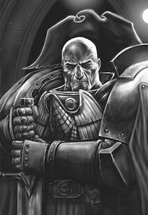
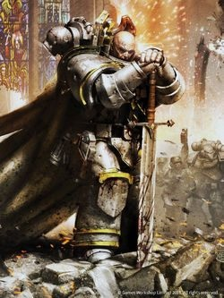
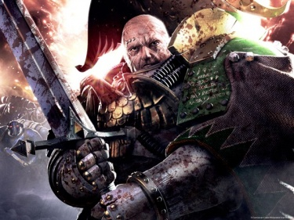
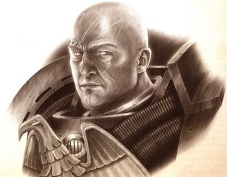
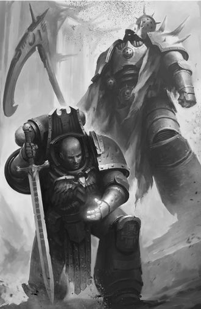
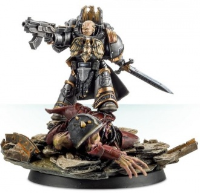

# 0697 纳撒尼尔·伽罗 Nathaniel Garro

精校状态：中文行文已逐段精校，部分术语仍为暂定

分类：人类帝国 / 死亡守卫

原文来源：https://www.bilibili.com/opus/1193909202197676035

原作者：帝国神选罐头

原文时间：2026年04月22日 08:17

[返回分类目录](目录.md) · [全书目录](../../目录.md)

<!-- A0697-B0001 -->

原译文

"You are Astartes indeed, and that will never alter. But you are a Death Guard no longer. You are a ghost, a figure that stands between light and dark, trapped amid the grey. And I have need of such a man."- Malcador to Nathaniel Garro “你确实是阿斯塔特，这一点永远不会改变。但你不再是死亡守卫了。你是一个幽灵，一个站在光明与黑暗之间的身影，被困在灰色之中。我需要这样的人。”— 马卡多对纳撒尼尔·伽罗所说

**校订译文**

"You are Astartes indeed, and that will never alter. But you are a Death Guard no longer. You are a ghost, a figure that stands between light and dark, trapped amid the grey. And I have need of such a man."- Malcador to Nathaniel Garro “你确实是阿斯塔特，这一点永远不会改变。但你不再是死亡守卫了。你是一个幽灵，一个站在光明与黑暗之间的身影，被困在灰色之中。我需要这样的人。”— 马卡多对纳撒尼尔·伽罗所说

<!-- /A0697-B0001 -->

<!-- A0697-B0002 -->
**英文原文**

Nathaniel Garro was the Captain of the 7th Great Company of the Death Guard Space Marine Legion. A veteran Space Marine warrior who would remain loyal to the Emperor at the outset of the Horus Heresy, Garro is most notable for commanding the frigate Eisenstein through several perils in a successful attempt to escape the Isstvan system and bring warning of the Great Betrayal to Terra. He became the first true martyr of the Church of the God-Emperor.

<!-- /A0697-B0002 -->

<!-- A0697-B0003 -->

原译文

纳撒尼尔·伽罗是死亡守卫星际战士军团第七大连的连长。伽罗是一名经验丰富的星际战士勇士，在荷鲁斯叛乱开始时仍忠于帝皇，他最著名的是指挥护卫舰爱森斯坦号度过了几次危险，成功逃离了伊斯塔万星系，并向泰拉发出了大背叛的警告。他成为了神皇教会的第一位真正的殉道者。

**校订译文**

纳撒尼尔·伽罗曾任死亡守卫军团第七大连连长。荷鲁斯之乱爆发时，这位身经百战的星际战士仍忠于帝皇。他指挥爱森斯坦号护卫舰历经险难，逃出伊斯塔万星系，将背叛消息带往泰拉，因此最为人所知。后来，他成为神皇教会第一位真正的殉道者。

<!-- /A0697-B0003 -->

<!-- A0697-B0004 图片 -->

<!-- A0697-B0005 -->

原译文

Nathaniel Garro 纳撒尼尔·伽罗

**校订译文**

Nathaniel Garro 纳撒尼尔·伽罗

<!-- /A0697-B0005 -->

<!-- A0697-B0006 -->
## Biography 传记

<!-- /A0697-B0006 -->

<!-- A0697-B0007 -->
**英文原文**

Born on Terra, in the region of that world known as Albia, Garro enlisted in the Dusk Raiders Legion, as the Death Guard was known before its reunion with its Primarch, Mortarion, and its relocation to its new base on Barbarus. By the time of the Horus Heresy, Garro was one of the few originally Terran Marines still serving in the Legion, which caused a rift between him and his fellow Captains, who often called him "Straight-Arrow Garro."

<!-- /A0697-B0007 -->

<!-- A0697-B0008 -->

原译文

伽罗出生在泰拉，世界上被称为阿尔比亚的地区，他加入了黄昏突袭者军团，这是死亡守卫在与原体莫塔里安重聚并迁移到巴巴鲁斯的新基地之前的名字。在荷鲁斯叛乱时代，伽罗是少数仍在军团服役的原初泰拉裔战士之一，这导致了他和其他连长之间的分歧，他们经常称他为“古版伽罗”

**校订译文**

伽罗出生于泰拉的阿尔比亚地区，加入军团时，它尚称黄昏突袭者，还未与莫塔里安会合、迁驻巴巴鲁斯并改名死亡守卫。到荷鲁斯之乱时，仍在服役的泰拉裔老兵已寥寥无几，这也让他与其他连长有所隔阂；他们常称他为“古板伽罗”。

**校注：** Straight-Arrow 表示正直守规矩，绰号沿原稿“古板伽罗”并修正错字古版，不判成箭术能力。

<!-- /A0697-B0008 -->

<!-- A0697-B0009 -->
## Battle-Captain 战斗连长

<!-- /A0697-B0009 -->

<!-- A0697-B0010 -->
**英文原文**

As Captain of the 7th Great Company, Garro was entitled to the honorific title "Battle-Captain", a tradition of the Legion dating back to the Unification Wars on Terra, when an officer of the XIV Legion distinguished himself in front of the Emperor, who bestowed the title on him as reward. Garro was proud to bear the title and approved of upholding the traditions of the legion, including the use of a housecarl, Kaleb Arin, to act as his equerry. Despite the pride at he took in bearing these honours and occasionally having the favour of his Primarch Mortarion, Garro did not believe in looking for glory or further honour in battle, and did not go out of his way to impress. He believed above all in simply doing his duty to the Emperor.

<!-- /A0697-B0010 -->

<!-- A0697-B0011 -->

原译文

作为第七大连的连长，伽罗有权获得“战斗连长”的荣誉称号，这是军团的传统，可以追溯到泰拉统一战争，当时第十四军团的一名军官在帝皇面前表现出色，帝皇授予他这一头衔作为奖励。伽罗很自豪能获得这个头衔，并赞成维护军团的传统，包括使用一位名侍卫，卡莱布·阿林，作为他的侍从官行动。尽管伽罗对获得这些荣誉感到自豪，偶尔也会得到他的原体莫塔利安的青睐，但伽罗并不相信在战斗中寻求荣耀或进一步的荣誉，也没有刻意给人留下深刻印象。他首先相信的是对帝皇尽自己的职责。

**校订译文**

第七大连连长有权使用“战斗连长”尊号。这项传统可追溯至泰拉统一战争：第十四军团一名军官在帝皇面前立功，获赐此称。伽罗引以为荣，也坚持军团旧俗，例如让家臣卡莱布·阿林担任侍从官。虽珍视荣誉，偶尔也得到原体垂青，他却不刻意在战场上追求更高声望、博取赞赏；对他而言，最重要的始终是为帝皇尽责。

<!-- /A0697-B0011 -->

<!-- A0697-B0012 -->
**英文原文**

A veteran of many campaigns, Garro had great experience of both enemy forces and his fellow Legions. He served alongside the Luna Wolves under Captain Garviel Loken in the Krypt campaign against Orks and the Emperor's Children under Captain Saul Tarvitz in the Preaxior campaign. He and Tarvitz were sworn honour-brothers after saving each other's lives, carving small eagle emblems on the vambraces of their armour in such a way that, were they to clasp hands, the eagles would meet.

<!-- /A0697-B0012 -->

<!-- A0697-B0013 -->

原译文

伽罗是一位参加过许多战役的老兵，他对敌军和他的军团同僚都有丰富的经验。他与加维尔·洛肯连长领导的影月苍狼一起参加了克里普特战役对抗欧克，以及在普雷克西奥战役中索尔·塔维茨连长指挥下的帝皇之子。他和塔维茨在救了对方的命后，结为荣誉兄弟，在盔甲的护腕上雕刻了小的鹰徽章，这样，如果他们握手，鹰就会相遇。

**校订译文**

伽罗经历众多战役，既熟悉敌军，也熟悉其他军团。他曾在克里普特战役中与加维尔·洛肯率领的影月苍狼合击欧克，又在普雷克西奥战役中与索尔·塔维茨的帝皇之子并肩作战。他与塔维茨相互救过性命，遂结为荣誉兄弟，各自在护腕上刻下小鹰徽记；两人握手时，双鹰便恰好相接。

<!-- /A0697-B0013 -->

<!-- A0697-B0014 图片 -->

<!-- A0697-B0015 -->

原译文

Garro on Terra 泰拉上的伽罗

**校订译文**

Garro on Terra 泰拉上的伽罗

<!-- /A0697-B0015 -->

<!-- A0697-B0016 -->
**英文原文**

During the Battle of Iota Horologi Garro distinguished himself when fighting alongside a detachment of Sisters of Silence. Their leader, Amendera Kendel promised to present his name to Malcador the Sigillite in recognition of his dutiful service. Similarly, she spoke well of him to Mortarion, who rewarded his Battle-Captain by selecting him for the tradition of sharing his cups. Mortarion also chose this moment to subtly sound Garro out about where he and his men might position themselves in the face of rebellion against the Emperor. Upon learning that Garro was unwilling to join the warrior-lodge within the Death Guard, Mortarion decided to take Garro to the meeting with Warmaster Horus at the initiation of the Isstvan campaign as his equerry, in an attempt to ensure Garro's loyalty.

<!-- /A0697-B0016 -->

<!-- A0697-B0017 -->

原译文

在时钟座约塔战役中，伽罗在与寂静修女并肩作战时脱颖而出。他们的领袖阿门德拉·肯德尔承诺将他的名字给掌印者马卡多，以表彰他尽职尽责的服役。同样，她对莫塔里安评价很高，莫塔里安奖励他的战斗连长，因为他有分享饮品的传统。莫塔里安也选择了这一时刻来微妙地试探伽罗，了解他和他的部下在面对反抗帝皇的叛乱时可能会将自己定位在哪里。得知伽罗不愿意加入死亡守卫中的战士结社后，莫塔里安决定在伊斯塔万战役开始时，作为他的侍从官，带伽罗去见战帅荷鲁斯，以确保伽罗的忠诚。

**校订译文**

时钟座约塔之战中，伽罗与寂静修女分队共同作战，表现出众。修女领袖阿蒙德菈·肯德尔答应向掌印者马卡多举荐他，又向莫塔里安称赞其功绩。原体因此赐予他传统的共饮之荣，并借机试探他及其部下在反抗帝皇时可能采取的立场。得知伽罗不肯加入军团战士结社后，莫塔里安决定让他担任侍从，在伊斯塔万战役开始时一同去见战帅荷鲁斯，试图确保他的忠诚。

**校注：** 寂静修女向莫塔里安赞扬的是伽罗，原译反成她高度评价莫塔里安。

<!-- /A0697-B0017 -->

<!-- A0697-B0018 -->
**英文原文**

The 7th Great Company were part of the taskforce assigned to secure Isstvan Extremis, the outermost world of the Isstvan system, ahead of the Isstvan III massacre. During this battle, Garro was wounded by the enemy leader and lost most of his right leg, necessitating an augmetic replacement. The wound might have killed him, especially when his own company's Apothecary, Meric Voyen, was too far away, but Garro's life was saved by Apothecary Fabius of the Emperor's Children.

<!-- /A0697-B0018 -->

<!-- A0697-B0019 -->

原译文

第七大连是被指派在伊斯塔万三号大屠杀之前保护伊斯塔万星系最外层世界伊斯塔万极端的特遣部队的一部分。在这场战斗中，伽罗被敌方领袖击伤，失去了大部分右腿，需要一个义肢的替代品。伤口可能会杀死他，尤其是当他自己连队的药剂师梅里克·沃延离得太远时，但伽罗的生命被帝皇之子的药剂师法比乌斯所救。

**校订译文**

伊斯塔万三号大屠杀前，第七大连随特遣部队前往夺占星系最外围的伊斯塔万极端星。伽罗被敌军首领重创，失去大半条右腿，后来不得不安装义肢。连队药剂师梅里克·沃延远在别处，他本可能因伤丧命，所幸帝皇之子药剂师法比乌斯救下了他。

<!-- /A0697-B0019 -->

<!-- A0697-B0020 -->
## The Flight of the Eisenstein 爱森斯坦号的逃亡

<!-- /A0697-B0020 -->

<!-- A0697-B0021 -->
**英文原文**

The wound meant that Garro could not be declared fit for combat duty, and he was instead posted to the Death Guard frigate Eisenstein alongside Commander Ignatius Grulgor. It came to pass that Garro was in command when Saul Tarvitz made his desperate attempt to reach the surface of Isstvan III and warn the legions there of Horus' betrayal. Garro aided his honour-brother in reaching the surface and so learned of the beginning of the Horus Heresy.

<!-- /A0697-B0021 -->

<!-- A0697-B0022 -->

原译文

伤口意味着伽罗被宣布不适合战斗任务，他被派往爱森斯坦号护卫舰，与指挥官伊格纳修斯·格鲁戈尔并肩作战。当索尔·塔维茨不顾一切地试图到达伊斯塔万三号的表面并警告那里的军团荷鲁斯的背叛时，伽罗正在指挥。伽罗帮助他的荣誉兄弟到达地表，从而得知了荷鲁斯叛乱的开始。

**校订译文**

由于伤势未愈、无法参加地面作战，伽罗被派至爱森斯坦号，与伊格纳修斯·格鲁戈尔一同驻舰。索尔·塔维茨拼死赶往伊斯塔万三号地表、准备向军团同袍示警时，伽罗正掌握舰上指挥权。他帮助荣誉兄弟成功降落，也由此得知荷鲁斯之乱已经开始。

<!-- /A0697-B0022 -->

<!-- A0697-B0023 -->
**英文原文**

With the betrayal on the planet came also betrayal in the stars, as Commander Grulgor and his detachment of Marines attempted to kill Garro and the men of the 7th attending him. Mainly thanks to the sacrifice of Kaleb Arin, Grulgor and his men were defeated. Not long after, the Eisenstein took aboard other victims of the betrayal, including Iacton Qruze from the Sons of Horus and Remembrancer Euphrati Keeler, whose conversations with Garro in the time afterwards strengthened his belief in the Emperor's divinity.

<!-- /A0697-B0023 -->

<!-- A0697-B0024 -->

原译文

随着行星上的背叛，群星间也出现了背叛，因为指挥官格鲁戈尔和他的战士分队试图杀死伽罗和加入他的第七大连。主要是由于卡莱布·阿林的牺牲，格鲁戈尔和他的部下被击败了。不久之后，爱森斯坦号接纳了其他背叛的受害者，包括荷鲁斯之子的伊克顿·克鲁兹和记述者幼发拉底·基勒，他们在之后与伽罗的对话加强了他对帝皇神性的信仰。

**校订译文**

背叛不只发生在地表，舰上也同时爆发变乱。格鲁戈尔及其部下试图杀死伽罗与随行的第七大连战士，主要依靠卡莱布·阿林的牺牲，才被阻止。不久，爱森斯坦号接纳其他逃难者，包括荷鲁斯之子的亚克顿·克鲁兹，以及记述者尤弗拉蒂·琪乐。此后与他们的交谈，进一步坚定了伽罗对帝皇神性的信仰。

<!-- /A0697-B0024 -->

<!-- A0697-B0025 -->
**英文原文**

Attempting to flee the system and warn the Emperor of Horus' betrayal, the Eisenstein was crippled by the Death Guard battleship Terminus Est and barely made the jump into the Warp. Once there, she attracted the predations of the Chaos God Nurgle. The Chaos power resurrected Grulgor, his dead Marines and the ship's crew who had sided with him, creating some of the first Plague Marines. The ensuing battle between infected Warp creatures and Loyalist Marines resulted in the death of the ship's navigator and forced the Eisenstein to make an emergency exit from the Warp. Stranded hundreds of light years from inhabited space, Garro ordered the Eisenstein s captain to overload her warp engines and jettison them into space. The ensuing explosion echoed across the warp and acted as a beacon for Rogal Dorn and the Imperial Fists' fleet, which had been becalmed by Warp Storms. Dorn rescued Garro and his men and took him back to Luna aboard the Phalanx. Even upon reaching Luna, and with the news of the betrayal delivered, Garro was still not safe, as one of his marines, Solun Decius, had become infected with Nurgle's Rot and fell to Chaos. Garro was forced to battle him throughout a Sister of Silence keep and out onto the surface of Luna itself. He eventually bested the daemonic ruin of his comrade and banished the entity he had become.

<!-- /A0697-B0025 -->

<!-- A0697-B0026 -->

原译文

爱森斯坦号试图逃离该星系并警告帝皇荷鲁斯的背叛，但被死亡守卫战列舰终焉号击溃，几乎没有跳入亚空间。一到那里，她就吸引了混沌之神纳垢的捕食。混沌力量使格鲁戈尔、他死去的战士和支持他的船员复活，创造了一些第一批瘟疫战士。随后，感染的亚空间生物和忠诚派星际战士之间的战斗导致了该船导航者的死亡，并迫使爱森斯坦号紧急离开亚空间。伽罗被困在距离有人居住的空域数百光年的地方，他命令艾森斯坦号的舰长让她的亚空间引擎超载，并将其抛入太空。随后的爆炸在亚空间回响，为被亚空间风暴平息的罗格·多恩和帝国之拳舰队提供了信号。多恩救了伽罗和他的部下，并把他带回了月球的山阵号。即使在到达月球后，随着背叛的消息传来，伽罗仍然不安全，因为他的一名战士索伦·德修斯已经感染了纳垢之腐并堕入混沌。伽罗被迫在一名寂静修女的保护期间与他在月球表面作战。他最终战胜了战友的恶魔般的毁灭，放逐了他已经成为的实体。

**校订译文**

爱森斯坦号试图逃出星系、向帝皇报告背叛，却遭终焉号重创，勉强才跃入亚空间。在那里，纳垢盯上了这艘舰船，复活格鲁戈尔、其阵亡部下及追随他的舰员，造出最早的一批瘟疫战士。忠诚派与疫病怪物的战斗导致导航员身亡，舰船只得紧急脱离亚空间，困在距人烟数百光年的空域。伽罗命舰长将跃迁引擎过载并抛出舰外，爆炸在亚空间中回荡，为同样受风暴所困的罗格·多恩和帝国之拳舰队送去信标。多恩救下众人，让他们乘山阵号返回月球。但消息送达后，危险仍未结束：战士索伦·德修斯感染纳垢之腐，堕入混沌。伽罗与他从寂静修女要塞一路战至月表，最终击败昔日同袍化成的恶魔，将其放逐。

**校注：** becalmed 指舰队因亚空间环境受困，非被风暴平息；Sisters of Silence keep 是寂静修女要塞，不是某位修女提供保护。

<!-- /A0697-B0026 -->

<!-- A0697-B0027 -->
## Agentia Primus 首席特工

<!-- /A0697-B0027 -->

<!-- A0697-B0028 -->
**英文原文**

Afterwards, Garro, Qruze and Amendera Kendel were approached by Malcador the Sigillite and told that they would be needed to form the beginnings of an organisation which would utilise "men and women of inquisitive nature, hunters who might seek the witch, the traitor, the mutant, the xenos". Garro was infuriated to be kept on Luna, a virtual prisoner, while the greater war was raging throughout the galaxy, accepting a new role as Agentia Primus to Malcador the Sigillite. His first mission was to gather a group of Astartes warriors from across the galaxy and bring them to Terra, for un unspecified future purpose.

<!-- /A0697-B0028 -->

<!-- A0697-B0029 -->

原译文

之后，伽罗、克鲁兹和阿门德拉·肯德尔被掌印者马卡多联络，并被告知他们需要组建一个组织的开端，该组织将利用“好学天性的男女，可能会寻找女巫、叛徒、变种人、异型的猎手”。伽罗对被留在月球上感到愤怒，一个实际上的囚犯，而更大的战争正在整个银河系肆虐，他接受了掌印者马卡多的作为首席特工的新角色。他的第一个任务是从银河系各地召集一群阿斯塔特战士，并将他们带到泰拉，用于未指明的未来目的。

**校订译文**

之后，掌印者马卡多召见伽罗、克鲁兹与阿蒙德菈·肯德尔，称他们将奠定一个新组织的基础，招募“具有探究之心的男女，追猎巫师、叛徒、变种人和异形的猎手”。银河战火蔓延，自己却如囚徒般留在月球，伽罗对此十分愤怒，因而接受了马卡多授予的首席特工职责。他的第一项任务，是从银河各处招集阿斯塔特战士，送往泰拉，为尚未揭明的计划效力。

<!-- /A0697-B0029 -->

<!-- A0697-B0030 图片 -->

<!-- A0697-B0031 -->

原译文

Nathaniel Garro, Knight-Errant, on Calth 在考斯的游侠骑士纳撒尼尔·伽罗

**校订译文**

Nathaniel Garro, Knight-Errant, on Calth 在考斯的游侠骑士纳撒尼尔·伽罗

<!-- /A0697-B0031 -->

<!-- A0697-B0032 -->
**英文原文**

Garro accepted, and his armour was stripped of its old Death Guard colours and insignia, and re-inscribed with Malcador's personal sigil. The first journey of Garro's quest took him to Calth, in the midst of the Word Bearers' surprise attack on the Ultramarines. There, he recruited Tylos Rubio, a powerful Codicier. Shortly after returning to Terra with Rubio, Garro was ordered by Khorarinn of the Legio Custodes to accompany him to deal with a ragtag fleet of vessels led by the Daggerline that had arrived on the edge of the Sol System. Aboard were members of the Emperor's Children and White Scars led by Captain Macer Varren of the World Eaters, who had also abandoned his legion after refusing to turn against the Emperor. After the White Scars proved to be traitors, the Daggerline was destroyed and Varren joined the Knights-Errant.

<!-- /A0697-B0032 -->

<!-- A0697-B0033 -->

原译文

伽罗接受了，他的盔甲被剥去了旧的死亡守卫的颜色和徽章，并重新刻上了马卡多的个人印记。伽罗的第一次探索之旅将他带到了考斯，当时正值怀言者对极限战士的突然袭击。在那里，他招募了泰洛斯·鲁比奥，一位强大的编修员。在与卢比奥一起返回泰拉后不久，伽罗被禁军军团的科哈林命令陪同他处理由匕首线号率领的一支到达太阳系边缘的杂乱舰队。船上是由吞世者连长马塞·瓦伦领导的帝皇之子和白色伤疤的成员，他在拒绝背叛帝皇后也被他的军团抛弃。在白色伤疤被证明是叛徒之后，匕首线号被摧毁，瓦伦加入了游侠骑士。

**校订译文**

伽罗接受任命，抹去护甲上原有的死亡守卫涂装与徽记，换上马卡多的个人印章。他首先前往考斯，正遇怀言者突袭极限战士，并在那里招募了强大的典记员泰洛斯·鲁比奥。返回泰拉不久，帝皇禁军的科哈林命他同行，处置太阳系边缘一支以匕首线号为首的杂乱舰队。舰上载着帝皇之子和白疤成员，由拒绝背叛帝皇、离开军团的吞世者连长马塞尔·瓦伦率领。后来，其中的白疤被证实是叛徒，匕首线号遭摧毁，瓦伦则加入游侠骑士。

**校注：** Codicier 依职衔定译典记员，原编修员属于Lexicanium；瓦伦主动离开军团，并非被军团抛弃。

<!-- /A0697-B0033 -->

<!-- A0697-B0034 -->
**英文原文**

While in the Sol System, Garro infiltrated the Phalanx in an attempt to recruits the Codicier Yored Massak, who had been sealed in a vault with the other Librarians of the Imperial Fists. Massak refused the offer, and Dorn warned Garro to be wary of the Sigillite's orders. Dorn's warning led Garro to discover that Voyen had recovered the remains of Decius was taking them to Io. Garro intercepted the ship, diverting its course towards Sol to jettison the tainted remains into the sun.

<!-- /A0697-B0034 -->

<!-- A0697-B0035 -->

原译文

在太阳系中，伽罗渗透到山阵号中，试图招募编修员约尔德·马萨克，他与帝国之拳的其他智库一起被关在一个秘库里。马萨克拒绝了这一提议，多恩警告伽罗要警惕掌印者的命令。多恩的警告让伽罗发现沃延已经找到了德修斯的遗体，并将他带到了伊俄。伽罗拦截了这艘船，将其航向转向太阳，将受污染的遗体抛向太阳。

**校订译文**

伽罗曾潜入山阵号，试图招募典记员约尔德·马萨克。对方与其他帝国之拳智库员一同被禁闭于秘库，拒绝了邀请；多恩则提醒伽罗小心掌印者的命令。这番警告促使他查出，沃延已取回德修斯的遗骸，正将其运往木卫一。伽罗截住舰船，令其改道太阳，将污染遗骸抛入恒星焚毁。

<!-- /A0697-B0035 -->

<!-- A0697-B0036 -->
**英文原文**

Garro resumed his recruitment mission, working his way down a list compiled by Malcador and Severian. In 017008.M31 he arrived in the Pale Stars aboard the warp-sprinter Eusebeian Herald, accompanied by Rubio and Callion Zaven, and sent out a coded signal from Optera IV. Captain Serron of the Blood Angels, Nirun of the White Scars, and the Nemean Reaver of the Dark Brotherhood answered his summons, but the conclave was interrupted by an Alpha Legion ambush. The Knights-Errant teleported aboard the Herald, taking the Nemean Reaver - their originally intended recruit - with them.

<!-- /A0697-B0036 -->

<!-- A0697-B0037 -->

原译文

加洛重新开始了他的招募任务，按照马卡多和塞维利安编制的名单进行招募。017008.M31，他乘坐亚空间短穿梭机虔诚先驱号抵达苍白群星，在卢比奥和卡利翁·扎文的陪同下，发出了来自奥普特拉四号的编码信号。圣血天使连长塞隆、白色伤疤的尼伦和黑暗兄弟会的涅墨亚·瑞瓦回应了他的召唤，但秘密会议被阿尔法军团的伏击打断。游侠骑士乘坐先驱号进行了远程传送，带走了他们最初打算招募的涅墨亚·瑞瓦。

**校订译文**

他随后继续按马卡多与塞维利安编成的名单招募。017008.M31，他与鲁比奥、卡利昂·扎文乘快速跃迁舰虔诚先驱号抵达苍白群星，在奥普特拉四号发出编码信号。圣血天使连长塞隆、白疤的尼伦，以及黑暗兄弟会的“涅墨亚掠夺者”应邀前来，但会晤遭阿尔法军团伏击。游侠骑士传送回舰，同时带走了原本要招募的涅墨亚掠夺者。

**校注：** Nemean Reaver 为涅墨亚的称号，Reaver 不作人名瑞瓦；warp-sprinter 译快速跃迁舰，原短穿梭机无从确认舰种。

<!-- /A0697-B0037 -->

<!-- A0697-B0038 -->
**英文原文**

The last warrior Garro was ordered to recruit was Garviel Loken of the Luna Wolves, who was still alive on the surface of Isstvan III. Although Loken had been driven nearly mad by the horrors of the massacre, Garro managed to bring him back to himself, and returned with his other brothers to Terra to learn Malcador's true purpose in gathering them together.

<!-- /A0697-B0038 -->

<!-- A0697-B0039 -->

原译文

加洛被命令招募的最后一名战士是影月苍狼的加维尔·洛肯，他还活着，在伊斯塔万三号的地表上。尽管洛肯被大屠杀的恐怖几乎逼疯了，伽罗还是设法让他恢复了理智，并与他的其他兄弟一起回到了泰拉，了解马卡多召集他们的真正目的。

**校订译文**

最后一位招募对象是加维尔·洛肯。他仍活在伊斯塔万三号地表，却已被屠杀的恐怖折磨得近乎疯狂。伽罗帮助他恢复神志，随后与同伴返回泰拉，准备了解马卡多将众人聚集起来的真正目的。

<!-- /A0697-B0039 -->

<!-- A0697-B0040 -->
## Search for the Saint 搜索圣人

<!-- /A0697-B0040 -->

<!-- A0697-B0041 -->
**英文原文**

Between his missions for the Sigillite, Garro would follow rumours of Euphrati Keeler, now hailed as a Saint. While searching for her on the Riga Orbital Plate, he came across Katanoh Tallery, an Adminstratum scribe who discovered that ships and supplies were quietly siphoned off other projects and covertly sent to Titan under the code name Othrys. She believed that they represented a Horus-backed plot to undermine the Imperium via the Departmento Munitorum, and Garro was willing to believe her due to her devotion to the Lectito Devinatus. Together, they slipped aboard a derelict ship sent to be used as material to build a fortress monastery on Titan, and they managed to navigate through various construction sites as they discovered esoteric weapons being shipped in and the arrival of the Mertiol wounded arriving. After fighting their way to the top of the newly constructed fortress, they found Malcador awaiting them. Upon discovery, Malcador revealed that it was not a traitorous plot but one that would ensure humanity would be able to fight the growing threat of Chaos after the Horus Heresy came to an end. However, Tallery could not live with the knowledge, and Malcador ordered Garro to execute her. Garro rebelled against the order, and Malcador relented, taking Tallery into confidence and putting her to use in completing the facility as Curator-Adepta Primus.

<!-- /A0697-B0041 -->

<!-- A0697-B0042 -->

原译文

伽罗在为掌印者执行任务期间，会追寻幼发拉底·基勒的传闻，后者现在被誉为圣人。在里加轨道平台上寻找她时，他遇到了卡塔诺·塔勒里，一位内务部文士，他发现船只和补给被悄悄地从其他项目中抽走，并以代号俄特律斯秘密送往泰坦。她认为，他们代表了荷鲁斯支持的通过军务部破坏帝国的阴谋，伽罗愿意相信她，因为她对圣言录的忠诚。他们一起登上了一艘废弃的船，这艘船被用来在泰坦上建造一座堡垒修道院，他们设法在各种建筑工地上导航，因为他们发现了运送进来的机密武器和抵达的默蒂奥伤员。在奋力登上新建堡垒的顶端后，他们发现马卡多在等着他们。被发现后，马卡多透露，这不是一个叛国的阴谋，而是一个确保人类能够在荷鲁斯叛乱结束后对抗日益增长的混沌威胁的密谋。然而，塔勒里无法忍受这种知识，马卡多命令伽罗处决她。伽罗反抗了这一命令，马卡多让步了，将塔勒里交给了她，并让她作为首席策划专家来完成这一设施。

**校订译文**

为马卡多执行任务的间隙，伽罗一直追寻如今被尊为圣人的琪乐。搜索里加轨道平台时，他遇见内政部文士卡塔诺·塔勒里。她发现，有人从其他项目暗中抽调舰船和物资，以“俄特律斯”为代号送往泰坦，怀疑这是荷鲁斯借军务部破坏帝国的阴谋。她虔信《圣言录》，伽罗也因此愿意相信她。两人潜入一艘废弃舰船，该舰将被拆作泰坦要塞修道院的建筑材料。他们穿行各处工地，看见秘仪武器运入，以及来自默蒂奥的伤员抵达。一路战至新堡垒顶端后，等待他们的却是马卡多。掌印者解释，这不是叛徒阴谋，而是确保人类在荷鲁斯之乱后仍能对抗混沌的秘密工程。但塔勒里知悉太多，不能被允许活着离开；他命伽罗处决她。伽罗抗命，马卡多最终让步，将她纳入知情者行列，任命为首席策建官，让她协助完成设施。

**校注：** could not live with the knowledge 在处决命令语境指不容她知悉秘密后生还，不是她心理承受不了；taking into confidence 是告知秘密并予以信任，不是把她交给她。

<!-- /A0697-B0042 -->

<!-- A0697-B0043 -->
**英文原文**

His next mission took him away from Terra to Nolec Trimus, where he battled a dragon-like daemon that fed on blood. Faced with Garro alone, the daemon would not be lured to fully inhabit its flesh vessel without more prey. Garro waited until reinforcements came to him, killing the beast alongside former Death Guard Helig Gallor when it took the bait.

<!-- /A0697-B0043 -->

<!-- A0697-B0044 -->

原译文

他的下一个任务将他从泰拉带到了诺莱克·特里姆斯，在那里他与一个以血液为食的龙状恶魔作战。独自面对伽罗，如果没有更多的猎物，恶魔就不会被诱惑而完全寄居于其肉体之中。伽罗一直等到增援部队来找他，当这头野兽上钩时，他和前死亡守卫赫利格·加洛一起杀死了它。

**校订译文**

下一项任务将他带往诺莱克·特里姆斯，迎战一头嗜血的龙形恶魔。只有伽罗一人作为猎物，还不足以诱使恶魔完全进入肉身容器，于是他等待援军。前死亡守卫赫利格·加洛赶到后，恶魔终于上钩，两人合力将其斩杀。

<!-- /A0697-B0044 -->

<!-- A0697-B0045 图片 -->

<!-- A0697-B0046 -->

原译文

Nathaniel Garro 纳撒尼尔·伽罗

**校订译文**

Nathaniel Garro 纳撒尼尔·伽罗

<!-- /A0697-B0046 -->

<!-- A0697-B0047 -->
**英文原文**

Garro returned to Terra and continued his quest to discover the location of Saint Keeler. He discovered the site of a Church massacre and encountered Sigismund of the Imperial Fists, who had his own experience of revelation with Keeler, while investigating the site. In the end he tracked Keeler down, saving her from the Chaos-corrupted Vindicare Assassin Eristede Kell and the Alpha Legion operative Haln. Keeler was taken into custody by Vardas Ison, but she told Garro that his hand would set her free when the time came.

<!-- /A0697-B0047 -->

<!-- A0697-B0048 -->

原译文

伽罗回到泰拉，继续寻找圣人基勒的位置。他发现了一个教堂大屠杀的遗址，并在调查该遗址时遇到了帝国之拳的西吉斯蒙德，他与基勒有过自己的启示经历。最终，他找到了基勒，将她从混沌腐化的文迪卡刺客埃里斯泰德·凯尔和阿尔法军团密探哈尔恩手中救了出来。基勒被瓦尔达斯·伊松拘留，但她告诉伽罗，到时候他的手会放她自由。

**校订译文**

回到泰拉，伽罗继续寻找琪乐。他在调查一处教堂屠杀遗址时，遇见同样曾因琪乐而获得信仰启示的西吉斯蒙德。最终，他找到圣人，将她从遭混沌腐化的文迪卡刺客埃里斯泰德·凯尔，以及阿尔法军团密探哈尔恩手中救出。琪乐随后被瓦尔达斯·伊松拘押，却告诉伽罗，时机到来时，将由他的手释放自己。

<!-- /A0697-B0048 -->

<!-- A0697-B0049 -->
## Masterless 无主

<!-- /A0697-B0049 -->

<!-- A0697-B0050 -->
**英文原文**

Shortly before the Siege of Terra, Garro and his Knights-Errant were busy fighting Chaos Cultists and Daemonic infestations across the planet. This included a brutal fight against the Lord of the Flies in which his friend Macer Varren was killed. However when Malcador chose his nine Titans to form the Grey Knights, Garro was not among them. Malcador stated that Garro's fate was not tied to Titan, but to Terra. Garro was set free by Malcador, absolved of his role as a Knights-Errant. Along with Helig Gallor and Garviel Loken, Garro stated that they would instead fight Horus when he arrived. During the Siege of Terra Garro and Loken led kill-squads to ambush the Sons of Horus underneath the Saturnine Gate. In the ensuing fight, Garro and his team defeated Falkus Kibre and his Justaerin. After bisecting Kibre with his sword, Garro expressed pity for the traitor when he saw the Daemonic entity that had taken up residence within the former Luna Wolf. He next battled Abaddon alongside Bel Sepatus and Endryd Haar. Though his two brothers were slain, Garro used their deaths for an opening and would have slain Abaddon had he not teleported away in time.

<!-- /A0697-B0050 -->

<!-- A0697-B0051 -->

原译文

在泰拉围城之前不久，伽罗和他的游侠骑士正忙于对抗全球各地的混沌邪教徒和恶魔的侵扰。这包括与苍蝇之王的残酷战斗，他的朋友马塞·瓦伦被杀。然而，当马卡多选择他的九位泰坦组成灰骑士时，伽罗并不在其中。马卡多表示，伽罗的命运与泰坦无关，而是与泰拉有关。伽罗被马卡多释放，免除了他作为游侠骑士的角色。伽罗与赫利格·加洛和加维尔·洛肯一起表示，当荷鲁斯到达时，他们将与他作战。在泰拉围城期间，伽罗和洛肯率领杀戮小队在土星之门下伏击了荷鲁斯之子。在随后的战斗中，伽罗和他的小队击败了法库斯·凯博和他的加斯塔林。用剑将凯博一分为二后，伽罗看到居住在前影月苍狼体内的恶魔实体时，对叛徒表示同情。接下来，他与贝尔·塞帕图斯和恩德里德·哈尔并肩作战。尽管他的两个兄弟被杀了，伽罗还是利用他们的死亡作为开篇，如果阿巴顿没有及时被传送出去，他将会杀死阿巴顿。

**校订译文**

泰拉围城前夕，伽罗与游侠骑士在各地讨伐邪教徒和恶魔。其中一场对抗苍蝇之王的苦战，夺走了好友马塞尔·瓦伦的性命。然而，马卡多选择九位战士筹建灰骑士时，伽罗并未入选。掌印者说，他的命运属于泰拉，而非泰坦，并解除了他作为游侠骑士的职责，还他自由。他与赫利格·加洛、加维尔·洛肯决定留下迎战荷鲁斯。围城期间，伽罗和洛肯率杀戮小队在土星之门地下伏击荷鲁斯之子。他与部下击败法库斯·凯博及其加斯塔林；将凯博一剑斩为两段后，看见昔日影月苍狼体内寄居的恶魔，他不禁对这个叛徒心生怜悯。随后，他与贝尔·塞帕图斯、恩德里德·哈尔合战阿巴顿。两位同伴虽阵亡，却为他创造了破绽；若非阿巴顿及时传送逃走，他本可将其击杀。

**校注：** 源文 nine Titans 指筹建泰坦机构的人选，不是九台泰坦机甲；仍保留九这一数字，后续创始人数差异不强行改写。

<!-- /A0697-B0051 -->

<!-- A0697-B0052 -->
## Death 死亡

<!-- /A0697-B0052 -->

<!-- A0697-B0053 -->
**英文原文**

Later in the Siege of Terra, Nathaniel Garro alongside Helig Gallor rendezvoused in Marmax Bastion of the Imperial Palace with Euphrati Keeler. However it was then that the Death Guard struck, with Mortarion and Typhus themselves leading the attack. In order to buy enough time for Keeler to escape with Gallor, Garro went before the traitor host and personally parlayed with his fallen father. Garro rejected Mortarion's offer for a drink and to rejoin the Death Guard, and the two engaged in a furious duel. Mortarion initially held back in the hopes of humiliating Garro, but after sporting a wound became enraged and quickly struck the loyalist warrior down. Mortarion then summoned a great host of flies, declaring they would take control of Garro's body and turn his corpse into a puppet to serve Nurgle for eternity as the Lord of Flies.

<!-- /A0697-B0053 -->

<!-- A0697-B0054 -->

原译文

后来在泰拉围城中，纳撒尼尔·伽罗与赫利格·加洛在帝国皇宫的马尔马克斯堡垒与幼发拉底·基勒会合。然而，就在那时，死亡守卫发动了进攻，莫塔里安和泰丰斯领导了进攻。为了给基勒和加洛争取足够的时间逃跑，伽罗走到叛徒之主面前，亲自与他堕落的父亲进行了交涉。记录拒绝了莫塔里安的提议，即饮下一杯并重新加入死亡守卫，两人进行了激烈的决斗。莫塔里安最初抑制了，希望羞辱伽罗，但在造成一个伤口后变得愤怒，并迅速将这位忠诚的战士击倒。莫塔里安然后召集了一大群苍蝇，宣布他们将控制伽罗的尸体，把他的尸体变成一个傀儡，永远为纳垢服务，作为苍蝇之王。

**校订译文**

围城后期，伽罗与赫利格·加洛在马尔马克斯堡垒同琪乐会合，恰逢莫塔里安与泰弗斯亲率死亡守卫来攻。为让琪乐随加洛逃走，伽罗走到叛军阵前，与堕落的基因之父谈判。他拒绝共饮，也拒绝重返军团，两人遂展开决斗。原体起初留有余力，意在羞辱他；受伤后却暴怒，迅速将他击倒。莫塔里安召来庞大蝇群，宣称它们将控制伽罗尸身，使他化作苍蝇之王，永世侍奉纳垢。

<!-- /A0697-B0054 -->

<!-- A0697-B0055 图片 -->

<!-- A0697-B0056 -->

原译文

Garro faces Mortarion in his final battle 伽罗在他的最终之战中面对莫塔里安

**校订译文**

Garro faces Mortarion in his final battle 伽罗在他的最终之战中面对莫塔里安

<!-- /A0697-B0056 -->

<!-- A0697-B0057 -->
**英文原文**

Garro was spared this fate by Keeler, who empowered him with the Emperor's light. Briefly reinvigorated, Garro furiously fought back Mortarion but was still ultimately no match for the Daemon Primarch. Garro was impaled by Mortarion and Libertas snapped in two. However with one act of defiance Garro, further drove Silence into his body, took the broken stub of his sword and stabbed it into Mortarion's neck. Garro inflicted a grievous wound on his gene-father. Moments later Garro died, accompanied by a vision of the Emperor.

<!-- /A0697-B0057 -->

<!-- A0697-B0058 -->

原译文

伽罗幸免于这种命运，基勒赋予了他帝皇之光。伽罗短暂地恢复了活力，猛烈地反击了莫塔里安，但最终还是无法与恶魔原体匹敌。伽罗被莫塔利安刺穿，自由被劈成两半。然而，伽罗的一次挑衅行为进一步将寂静推向了他的身体，他拿起那把折断的剑，刺进莫塔里安的脖子。伽罗给他的基因之父造成了重伤。片刻之后，伽罗去世了，伴随着帝皇的幻象。

**校订译文**

琪乐以帝皇之光赋予他力量，使他免于这种命运。短暂恢复的伽罗奋力反击，却仍无法匹敌恶魔原体。寂静战镰贯穿他的身体，自由之剑也折成两截。但他作出最后的反抗，主动让镰刃刺得更深，将自己拉近对手，再把断剑刺进莫塔里安颈部，重创基因之父。片刻后，他伴着帝皇的异象死去。

<!-- /A0697-B0058 -->

<!-- A0697-B0059 -->
## Legacy 遗产

<!-- /A0697-B0059 -->

<!-- A0697-B0060 -->
**英文原文**

Kyril Sindermann described Garro as the first true martyr of the Church of the God-Emperor.

<!-- /A0697-B0060 -->

<!-- A0697-B0061 -->

原译文

基里尔·辛德曼将伽罗描述为神皇教会的第一位真正殉道者。

**校订译文**

凯里尔·辛德曼称伽罗为神皇教会第一位真正的殉道者。

<!-- /A0697-B0061 -->

<!-- A0697-B0062 -->
**英文原文**

Despite his death on Terra's soil, conflicting testimonies claim that Garro variously remained imprisoned with the Seventy until his death, went on to serve at the Master Apothecariate seeking a cure to Nurgle's Rot (a path followed by fellow Eisenstein survivor Meric Voyen), still lives in command of an elite task force clad in the colours of the pre-Heresy Death Guard (not unlike the Knights-Errant), or became the Lord of Flies (who was, in fact, Solun Decius).

<!-- /A0697-B0062 -->

<!-- A0697-B0063 -->

原译文

尽管伽罗死在泰伦的土地上，但相互矛盾的证词声称，伽罗在去世前一直与七十人一起被监禁，继续在药剂大师那里服务，寻求治疗纳垢之腐的方法（爱森斯坦号幸存者梅里克·沃延遵循的道路），仍然指挥着一支穿着叛乱前死亡守卫颜色的精英特遣部队（与游侠骑士不同），或者成为苍蝇之王（事实上，他就是索伦·德修斯）。

**校订译文**

虽然他最终死于泰拉，各种相互矛盾的传言却仍流传：有人称他与“七十人”始终被囚禁，直至死亡；有人称他加入药剂总署，寻求治疗纳垢之腐的方法，实际走上这条道路的是另一名爱森斯坦号幸存者梅里克·沃延；还有人称他仍活着，率领身穿旧死亡守卫涂装的精锐特遣队，其形象颇似游侠骑士；另有人说他成了苍蝇之王，而真正成为该恶魔的其实是索伦·德修斯。

**校注：** Terra误成泰伦；not unlike 为颇为相似，原译与游侠骑士不同反义。

<!-- /A0697-B0063 -->

<!-- A0697-B0064 -->
## Appearance and Wargear 外貌和战备

<!-- /A0697-B0064 -->

<!-- A0697-B0065 -->
**英文原文**

Nathaniel Garro was completely bald, his head covered with light battle scars. He had a patrician aspect inherited from the warrior dynasties of ancient Terra. His eyes looked older than the rest of his face, and his skin was extremely pale, although not as pallid as some Death Guard complexions could be, due to his Terran origins.

<!-- /A0697-B0065 -->

<!-- A0697-B0066 -->

原译文

纳撒尼尔·伽罗完全秃顶，头上布满了轻微的战斗伤痕。他继承了古泰拉战士王朝的贵族气质。他的眼睛看起来比脸上的其他部分都要老，他的皮肤非常苍白，尽管由于他的泰拉起源，他的皮肤并不像某些死神守卫的肤色那么苍白。

**校订译文**

伽罗头顶无发，布满细小战伤，身上带着古泰拉战士世家传下的贵族气质。他的双眼比面容更显苍老，皮肤极白；但因其泰拉血统，还不像某些死亡守卫那般惨白。

<!-- /A0697-B0066 -->

<!-- A0697-B0067 图片 -->

<!-- A0697-B0068 -->

原译文

Garro 伽罗

**校订译文**

Garro 伽罗

<!-- /A0697-B0068 -->

<!-- A0697-B0069 -->
**英文原文**

Garro wore Mark IV Power Armour, his position as Battle-Captain entitling him to wear the Aquila Imperator, a ceremonial cuirass with a brass eagle spreading its wings as if to take flight across the breastplate and another rising from the backplate as a headguard. Unlike the eagle-heads of the Aquila both eagles on the cuirass were sighted, giving rise to a rumour among the more superstitious helots and servants of the Death Guard that they gave the wearer foresight, or acted as a charm against oncoming dangers.

<!-- /A0697-B0069 -->

<!-- A0697-B0070 -->

原译文

伽罗穿着Mark IV动力盔甲，作为战斗连长，他有权佩戴帝皇天鹰，这是一种仪式性的胸甲，上面有一只黄铜鹰展开翅膀，仿佛要飞过胸甲，另一只从背甲上升起作为护头。与天鹰的鹰头不同，胸甲上的鹰都可视，这在更迷信的农奴和死亡守卫的仆人中引起了传言，说它们给了佩戴者远见，或者作为抵御即将到来的危险的护身符。

**校订译文**

伽罗原穿Mk.IV动力甲；战斗连长身份使他有权使用“帝皇天鹰”仪式胸甲。胸前黄铜鹰展翼欲飞，背甲上另有一只鹰高高昂起，构成头部护卫。与常见双头天鹰的设计不同，这两只鹰都拥有健全的眼睛，令迷信的劳役农奴和仆人传言，它们能赐予主人预知能力，或护佑他免遭危险。

<!-- /A0697-B0070 -->

<!-- A0697-B0071 -->
**英文原文**

As his primary weapon, Garro carried a power sword called Libertas fashioned in the style of a broadsword with a heavy monosteel blade. An old Terran weapon, elements of it existed before the birth of its wielder and even predated Old Night.

<!-- /A0697-B0071 -->

<!-- A0697-B0072 -->

原译文

作为他的主要武器，伽罗携带了一把名为自由的动力剑，其设计风格类似于一把带有沉重单钢刀刃的阔剑。这是一种古老的泰拉武器，其元素在使用者出生之前就已经存在，甚至早于旧夜。

**校订译文**

他的主武器是名为“自由之剑”的动力剑，形制为阔剑，配有沉重的单钢剑刃。这是一件古老的泰拉兵器，部分构件的历史早于伽罗出生，甚至早于旧夜。

**校注：** Libertas 沿“自由”词根补足武器类别为自由之剑；其他段断裂的自由均为此剑，非抽象自由。

<!-- /A0697-B0072 -->

<!-- A0697-B0073 -->
**英文原文**

After entering Malcador's service, Garro was given a suit of Mark VI power armour (retaining the Aquila Imperator) and a Paragon Bolter — a master-crafted bolter with an increased rate of fire. He was also equipped with a variant of a Falsehood that projected a psycho-luminal sphere around him that distorted his appearance, allowing Garro to infiltrate the battlefield unseen and, even once detected, made it difficult for an enemy to target him.

<!-- /A0697-B0073 -->

<!-- A0697-B0074 -->

原译文

在为马卡多服务后，伽罗获得了一套Mark VI动力盔甲（保留了帝皇天鹰）和一把典范爆矢枪 — 一个射速更高的精工爆矢枪。他还装备了一个虚假变体，在他周围投射出一个灵能发球体，扭曲了他的外表，让伽罗在不被看见的情况下渗透到战场上，即使被发现，也很难让敌人瞄准他。

**校订译文**

投效马卡多后，伽罗换装Mk.VI动力甲，保留帝皇天鹰胸甲，并获配射速更高的精工“典范爆矢枪”。他还有一件“伪装器”的改型，能在周围投射灵能光球，扭曲观察者眼中的形象，使他得以隐蔽潜入战场；即使被发现，也难以被准确瞄准。

**校注：** Falsehood 是伪装装备名，原虚假变体与灵能发球体不通，按功能暂译，待装备专篇核对。

<!-- /A0697-B0074 -->

本篇核心术语与暂定项

以下列出本篇出现的英文原形及核心术语表用词。同形词可能指不同对象，具体词义以本篇正文和校注为准；单复数、别名和仅见于图注的名称可能尚未列入。完整候选见[术语表](../../术语表/双语术语候选.csv)。

| 英文 | 采用中文 | 状态 |
| --- | --- | --- |
| Blood Angels | 圣血天使 | 官方已核对 |
| Grey Knights | 灰骑士 | 官方已核对 |
| Death Guard | 死亡守卫 | 官方已核对 |
| World Eaters | 吞世者 | 官方已核对 |
| Orks | 欧克蛮人 | 官方已核对 |
| Ultramarines | 极限战士 | 官方已核对 |
| Horus Heresy | 荷鲁斯之乱 | 官方已核对 |
| Navigator | 导航员 | 官方已核对 |
| Warp | 亚空间 | 官方已核对 |
| Imperium | 帝国 | 暂定·简称 |
| Nurgle | 纳垢 | 官方已核对 |
| Imperial Fists | 帝国之拳 | 暂定 |
| Phalanx | 山阵号 | 暂定 |
| Emperor | 帝皇 | 官方已核对 |
| Primarch | 原体 | 官方已核对 |
| Departmento Munitorum | 军务部 | 暂定 |
| Mutant | 变种人 | 暂定·官方待核 |
| Word Bearers | 怀言者 | 暂定·官方待核 |
| Emperor's Children | 帝皇之子 | 官方已核对 |
| The Order | 秩序 | 暂定·官方待核 |
| Mortarion | 莫塔里安 | 官方已核对 |
| Barbarus | 巴巴鲁斯 | 暂定·官方待核 |
| Terra | 泰拉 | 暂定·官方待核 |
| Luna Wolves | 影月苍狼 | 暂定·官方待核 |
| Horus | 荷鲁斯 | 暂定·官方待核 |
| Garviel Loken | 加维尔·洛肯 | 暂定·官方待核 |
| Sons of Horus | 荷鲁斯之子 | 暂定·官方待核 |
| Isstvan III | 伊斯塔万三号 | 暂定·官方待核 |
| Sisters of Silence | 寂静修女 | 暂定·官方待核 |
| Unification Wars | 统一战争 | 暂定·官方待核 |
| Malcador the Sigillite | 掌印者马卡多 | 暂定·官方待核 |
| Brotherhood | 兄弟会 | 暂定·官方待核 |
| Old Night | 旧夜 | 暂定·官方待核 |
| Calth | 考斯 | 暂定·官方待核 |
| Luna | 月球 | 暂定·官方待核 |
| Titan | 泰坦 | 暂定·官方待核 |
| Amendera Kendel | 阿蒙德菈·肯德尔 | 暂定·官方待核 |
| Aquila | 天鹰 | 暂定·官方待核 |
| Codicier | 典记员 | 暂定·官方待核 |
| Tylos Rubio | 泰洛斯·鲁比奥 | 暂定·官方待核 |
| Master | 导师（审判庭职衔）／舰务官（舰员职务） | 语境定译·官方待核 |
| Euphrati Keeler | 尤弗拉蒂·琪乐 | 暂定 |
| Mission | 教团／传教机构 | 暂定 |
| Apothecary | 药剂师 | 官方已核对 |
| Ancient | 旗手 | 官方已核对 |
| Justaerin | 加斯塔林 | 暂定·官方待核 |
| Falkus Kibre | 法库斯·凯博 | 暂定·官方待核 |
| Iacton Qruze | 亚克顿·克鲁兹 | 暂定·官方待核 |
| Saturnine Gate | 土星之门 | 暂定·官方待核 |
| Space Marine Legion | 星际战士军团 | 暂定·官方待核 |
| White Scars | 白疤 | 官方已核 |
| Alpha Legion | 阿尔法军团 | 暂定·官方待核 |
| The Sigillite | 掌印者 | 暂定·官方待核 |
| Scars | 伤疤 | 暂定·官方待核 |
| Dark Brotherhood | 黑暗兄弟会 | 暂定·官方待核 |
| Endryd Haar | 恩德里德·哈尔 | 暂定·官方待核 |
| Nemean | 涅墨亚 | 暂定·官方待核 |
| Knights-Errant | 游侠骑士 | 暂定·官方待核 |
| Sol | 太阳系 | 暂定·官方待核 |
| The Phalanx | 山阵号 | 暂定·官方待核 |
| Isstvan | 伊斯塔万 | 暂定·官方待核 |
| Nathaniel Garro | 纳撒尼尔·伽罗 | 暂定·官方待核 |
| Macer Varren | 马塞尔·瓦伦 | 暂定·官方待核 |
| Severian | 塞维里安 | 暂定·官方待核 |
| Callion Zaven | 卡利昂·扎文 | 暂定·官方待核 |
| Vardas Ison | 瓦尔达斯·伊森 | 暂定·官方待核 |
| Helig Gallor | 赫利格·加洛 | 暂定·官方待核 |
| Sigismund | 西吉斯蒙德 | 暂定·官方待核 |
| Herald | 传令官 | 暂定·官方待核 |
| Power Armour | 动力盔甲 | 暂定·官方待核 |
| Space Marine | 星际战士 | 暂定·官方待核 |
| Captain | 连长 | 暂定·官方待核 |
| Veteran | 老兵 | 暂定·官方待核 |
| Brother | 修士 | 暂定·官方待核 |
| Equerry | 近侍 | 暂定·官方待核 |
| Housecarl | 侍卫 | 暂定·官方待核 |
| Operative | 特工 | 暂定·官方待核 |
| Host | 天军 | 暂定·官方待核 |
| Xenos | 异形 | 暂定·官方待核 |
| Typhus | 泰弗斯 | 官方已核对 |
| Plague Marines | 瘟疫战士 | 官方已核对 |
| The Tainted | 污染者 | 暂定·官方待核 |
| The Beast | 野兽 | 暂定·官方待核 |
| Pale Stars | 苍白群星 | 暂定·官方待核 |
| Saul Tarvitz | 索尔·塔维兹 | 暂定·官方待核 |
| Primus | 领军 | 官方已核对 |
| Dusk Raiders | 黄昏突袭者 | 暂定·官方待核 |
| Terminus Est | 终焉号 | 暂定·官方待核 |
| Terminus | 终点站 | 暂定·官方待核 |
| Bel Sepatus | 贝尔·塞帕图斯 | 暂定·官方待核 |
| Ignatius | 伊格纳修斯 | 暂定·官方待核 |
| Revelation | 启示 | 暂定·官方待核 |
| Kyril Sindermann | 凯里尔·辛德曼 | 暂定·官方待核 |
| Eristede Kell | 埃里斯泰德·凯尔 | 暂定·官方待核 |
| Bear | 熊 | 暂定·官方待核 |
| Ignatius Grulgor | 伊格纳修斯·格鲁戈尔 | 暂定·官方待核 |
| Sphere | 防御圈 | 暂定·官方待核 |
| The Dark | 《黑暗》 | 暂定·官方待核 |
| The Blood | 鲜血 | 暂定·官方待核 |
| Vindicare Assassin | 文迪卡刺客 | 官方已核 |
| System | 星系（恒星系统） | 暂定·官方待核 |
| Optera | 奥普特拉 | 暂定·官方待核 |
| Albia | 阿尔比亚 | 暂定·官方待核 |
| Defiance | 反抗号 | 暂定·官方待核 |
| Libertas | 自由之剑 | 暂定·官方待核 |
| Marmax Bastion | 马尔马克斯堡垒 | 暂定·官方待核 |
| Kaleb Arin | 卡莱布·阿林 | 暂定·官方待核 |
| Meric Voyen | 梅里克·沃延 | 暂定·官方待核 |
| Isstvan Extremis | 伊斯塔万极端星 | 暂定·官方待核 |
| Solun Decius | 索伦·德修斯 | 暂定·官方待核 |
| Yored Massak | 约尔德·马萨克 | 暂定·官方待核 |
| Nemean Reaver | 涅墨亚掠夺者 | 暂定·官方待核 |
| Eusebeian Herald | 虔诚先驱号 | 暂定·官方待核 |
| Curator-Adepta Primus | 首席策建官 | 暂定·官方待核 |
| Katanoh Tallery | 卡塔诺·塔勒里 | 暂定·官方待核 |
| Othrys | 俄特律斯 | 暂定·官方待核 |
| Master Apothecariate | 药剂总署 | 暂定·官方待核 |
| Falsehood | 伪装器 | 暂定·官方待核 |
| Paragon Bolter | 典范爆矢枪 | 暂定·官方待核 |
| Aquila Imperator | 帝皇天鹰 | 暂定·官方待核 |
| Mertiol | 默蒂奥 | 暂定·官方待核 |
| Bolter | 爆矢枪 | 暂定·官方待核 |
| Eisenstein | 艾森斯坦号 | 暂定·官方待核 |
| The Seventy | 七十人 | 暂定·官方待核 |
| Sol System | 太阳系 | 暂定·官方待核 |
| Marmax | 马尔马克斯 | 暂定·官方待核 |

