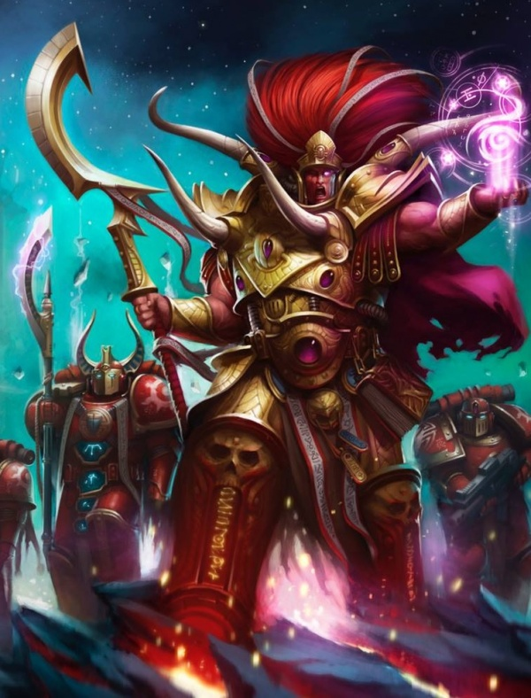
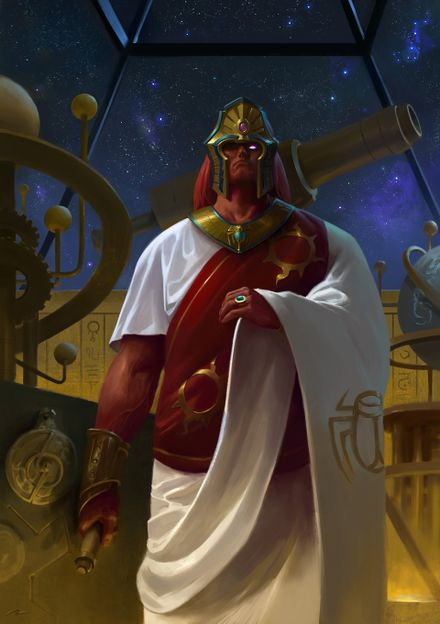
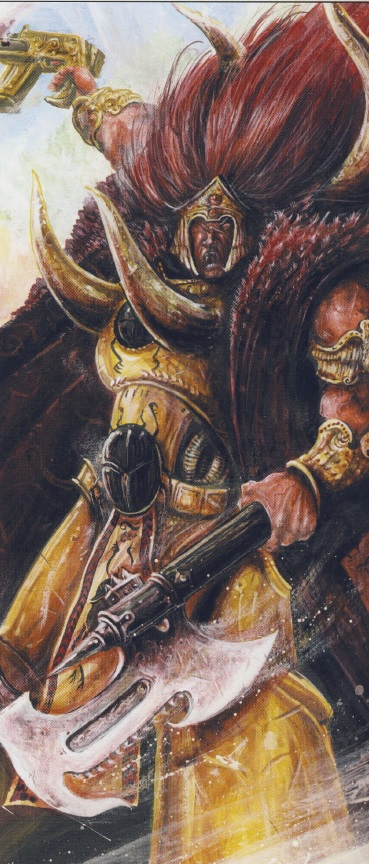
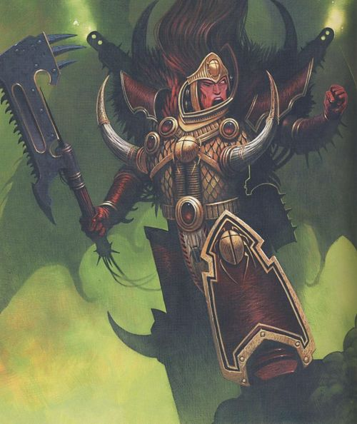
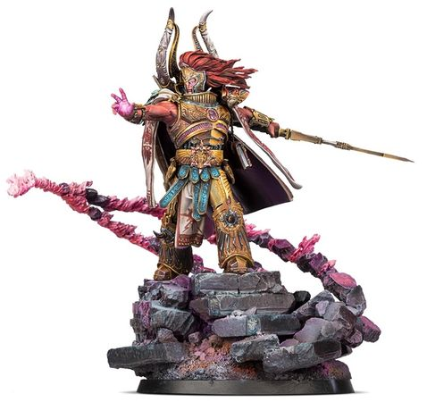
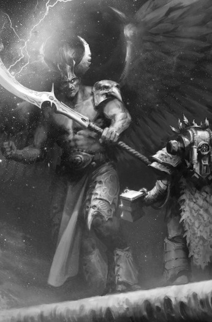
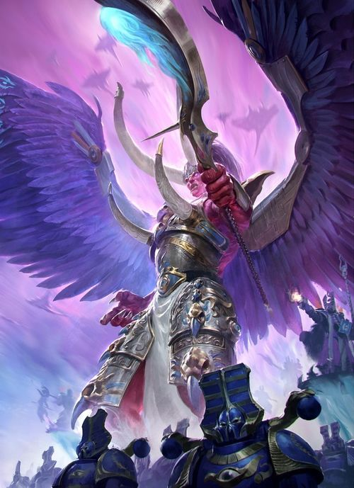
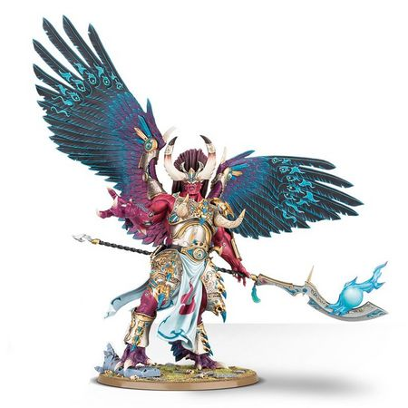
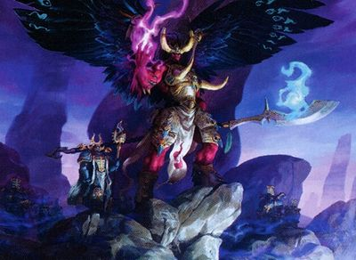
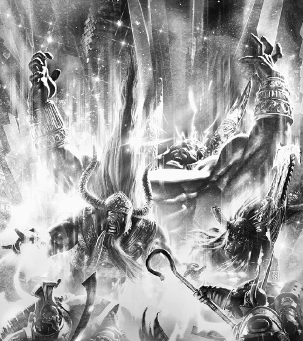

# 0698 赤红之马格努斯 Magnus the Red

精校状态：中文行文已逐段精校，部分术语仍为暂定

分类：人类帝国 / 千子

原文来源：https://www.bilibili.com/opus/1058164849548197892

原作者：帝国神选罐头

原文时间：2025年04月21日 13:00

[返回分类目录](目录.md) · [全书目录](../../目录.md)

<!-- A0698-B0001 -->
**英文原文**

"If I am guilty of anything, it is the simple pursuit of knowledge"

<!-- /A0698-B0001 -->

<!-- A0698-B0002 -->

原译文

“如果说我有罪的话，那就是对知识的简单追求”

**校订译文**

“如果说我有罪的话，那就是对知识的简单追求”

<!-- /A0698-B0002 -->

<!-- A0698-B0003 -->
**英文原文**

Magnus the Red (also known as the Crimson King, the Sorcerer-King, Cyclopean Magnus or the Red Cyclops) is the Primarch of the Thousand Sons Chaos Space Marine legion. A giant in both physical and mental terms whilst a mortal inhabitant of the materium, Magnus long tried to understand and control the warp, becoming a sorcerer of formidable power. Magnus would eventually fall from favour with his father, the Emperor, and with the majority of his brother-primarchs due to his zealous advocacy and use of such power. Indeed it would prove to be his mortal undoing, as, forewarned of Horus' fall to Chaos, his attempt to use his own warp-touched abilities to alert the Emperor to the situation brought about his own damnation and servitude to the Chaos God Tzeentch. Magnus led his own troops to the banner of Horus and fought on his side during the Great Betrayal, surviving the events and being elevated to the position of Daemon Prince. He has spent the majority of the millennia since ensconced atop his tower upon the Planet of the Sorcerers, planning the destruction of the Imperium.

<!-- /A0698-B0003 -->

<!-- A0698-B0004 -->

原译文

赤红之马格努斯（也称为深红之王、巫师之王、独眼马格努斯或赤红独眼巨人）是千子混沌星际战士的原体。马格努斯是一位身体和精神上的巨人，同时也是物质界的凡人，他长期以来一直试图理解和控制亚空间，成为一名强大的巫师。由于马格努斯热衷于倡导和使用这种力量，他最终失去了父亲、帝皇和大多数兄弟原体的青睐。事实上，这将被证明是他致命的毁灭，正如荷鲁斯落入混沌之前所警告的那样，他试图利用自己的亚空间之触能力来提醒帝皇，这给他自己带来了诅咒和奴役于混沌之神奸奇的结局。马格努斯率领着自己的部队投奔了荷鲁斯的麾下，在大叛乱期间与他并肩作战，在事件中幸存下来，并被升格为恶魔王子。自那以后的数千年里，他大部分时间都深居于巫师星球上自己的高塔顶端，谋划着如何摧毁帝国。

**校订译文**

红魔马格努斯，又称深红之王、巫师之王、独眼马格努斯或赤红独眼巨人，是千子混沌星际战士军团的原体。仍以凡躯居于物质宇宙时，他便在体魄与心智上皆堪称巨人，长期研究并试图掌控亚空间，成为力量惊人的巫师。然而，他热衷倡导和运用这些力量，最终失去帝皇及大多数兄弟的信任，也因此走向毁灭：预见荷鲁斯堕入混沌后，他试图凭灵能向帝皇示警，却反将自己推入诅咒，沦为奸奇仆从。他率部加入荷鲁斯阵营，历经大背叛而存活，最终升格为恶魔亲王。此后数千年，他大多深居巫师星球的高塔之巅，谋划帝国的毁灭。

<!-- /A0698-B0004 -->

<!-- A0698-B0005 图片 -->

<!-- A0698-B0006 -->

原译文

Magnus the Red 赤红之马格努斯

**校订译文**

Magnus the Red 红魔马格努斯

<!-- /A0698-B0006 -->

<!-- A0698-B0007 -->
## History 历史

<!-- /A0698-B0007 -->

<!-- A0698-B0008 -->
### Early Life 早年生活

<!-- /A0698-B0008 -->

<!-- A0698-B0009 -->
**英文原文**

Magnus, as an infant, was dropped onto the remote colony world of Prospero. Magnus was unique among his brothers as he was entirely aware of his own birth and development, and remembers his infancy completely. He also regularly communed with the Emperor via telepathy before their official reunion. Magnus was incredibly fortunate to land on Prospero, as anywhere else his psychic nature would have made him an outcast, shunned and hunted. Prospero was a world of outcast human psykers, making him nothing special in the eyes of the colonists. They had chosen Prospero for its remoteness from Terra. When Magnus fell from the skies, it was like a portentous comet. His pod landed in the central plaza of all the places on the planet.

<!-- /A0698-B0009 -->

<!-- A0698-B0010 -->

原译文

马格努斯在婴儿时期就被送到了遥远的殖民地普罗斯佩罗。马格努斯在他的兄弟中是独一无二的，因为他完全了解自己的出生和发展，并完全记得自己的婴儿期。在他们正式团聚之前，他还经常通过心灵感应与帝皇交流。马格努斯非常幸运地降落在普罗斯佩罗，因为在其他任何地方，他的灵能特征都会让他成为一个被抛弃、被回避和被追捕的人。普罗斯佩罗是一个被抛弃的人类灵能者的世界，在殖民者眼中，他没有什么特别的。他们选择普罗斯佩罗是因为它远离泰拉。当马格努斯从空中坠落时，它就像一颗不祥的彗星。他的舱室降落在星球上最为中心的广场。

**校订译文**

婴儿马格努斯落在遥远的殖民世界普罗斯佩罗。他与兄弟不同，清楚记得自己的诞生与成长，婴儿时期的记忆也完整保留；正式重逢前，他已常与帝皇心灵交流。落在这里是他的幸运，因为在别处，灵能者往往遭排斥甚至追杀；普罗斯佩罗却正由流亡的人类灵能者建立，他的能力在当地并不显得离经叛道。殖民者选择此地，正因远离泰拉。马格努斯降临时如一颗带着预兆的彗星，育婴舱偏偏落在中央广场。

<!-- /A0698-B0010 -->

<!-- A0698-B0011 图片 -->

<!-- A0698-B0012 -->

原译文

Magnus the Red during the Great Crusade 大远征期间的赤红之马格努斯

**校订译文**

Magnus the Red during the Great Crusade 大远征期间的红魔马格努斯

<!-- /A0698-B0012 -->

<!-- A0698-B0013 -->
**英文原文**

Mentored by the fame psyker-scholar Amon, he became a ward of the scholars and quickly gained their powers, surpassing them in many ways. Magnus soon even eclipsed Amon in power. Magnus mastered every psychic training program and soon surpassed the greatest adepts of the commune. By that time he had so much control of his psychic powers, he was by far the greatest person on the planet. One day, Magnus performed something to change the world forever. Instead of channeling Warp energy from the Warp to the Materium universe, he looked into the Warp, going from the student to absolute master instantly. Magnus became the hero of Prospero when he led a campaign to purge the Psychneuein from Prospero, who for centuries had wreaked havoc on the planets population. With the threat removed, Magnus rebuilt many of Prospero's cities, most notably Tizca, which became renowned for its beauty and splendor. The chief scholars of Prospero that survived the war with the Psycheuein became the founders of the Cults of the Thousand Sons.

<!-- /A0698-B0013 -->

<!-- A0698-B0014 -->

原译文

在著名灵能学者阿蒙的指导下，他成为了学者们的受监护人，并迅速获得了他们的力量，在许多方面超越了他们。马格努斯很快甚至在力量上超越了阿蒙。马格努斯掌握了所有的灵能训练项目，很快就超越了公社最伟大的专家。到那时，他已经对自己的灵能力量有了如此多的控制，他是迄今为止这个星球上最伟大的人。有一天，马格努斯表演了一件永远改变世界的事情。他没有将亚空间能量从亚空间引导到物质宇宙，而是研究了亚空间，立即从学生变成了绝对的大师。马格努斯成为普罗斯佩罗的英雄，当时他领导了一场运动，将灵能毒蜂从普罗斯佩罗清除出去，几个世纪以来，灵能毒蜂对行星人口造成了严重破坏。随着威胁的消除，马格努斯重建了普罗斯佩罗的许多城市，最著名的是以美丽和辉煌而闻名的提兹卡。在与灵能毒蜂的战争中幸存下来的普罗斯佩罗的主要学者成为了千子教派的创始人。

**校订译文**

著名灵能学者阿蒙收养并教导了他。马格努斯迅速掌握学者们的本领，完成全部训练，很快连阿蒙及当地最杰出的灵能专家也无法与之相比。后来，他不再只是从亚空间汲取能量，而开始将目光真正投向亚空间本身，学习由此跃升至全新的境界。他率军清除祸害居民数百年的灵能毒蜂，成为普罗斯佩罗的英雄，并重建诸多城市。其中，提兹卡尤以壮丽美观闻名。与毒蜂战争中幸存的主要学者，后来成为千子各教派的创立者。

<!-- /A0698-B0014 -->

<!-- A0698-B0015 -->
### Discovery by The Emperor 帝皇的发现

<!-- /A0698-B0015 -->

<!-- A0698-B0016 -->
**英文原文**

With such a mind in the Warp, it was not long until the Emperor noticed him. When his fleet arrived and the Emperor stepped foot upon the planet, he and Magnus immediately embraced and conversed as if the two had known each other for years; as indeed they may have done, in the mind if not in the flesh. Magnus puts his discovery by the Emperor in 840.M30. This may be in conflict with other sources which state that the Thousand Sons were not fighting the Crusade until at least 900.M30, since even for a monumental task like fixing the Flesh-Change, 60 years is a long time for a primarch to spend on one project. Magnus may be dating his discovery as his first psychic contact with the Emperor, which would reduce the discrepancy.

<!-- /A0698-B0016 -->

<!-- A0698-B0017 -->

原译文

带着这样的心态，不久帝皇就注意到了他。当他的舰队到达，帝皇踏上这颗星球时，他和马格努斯立即拥抱并交谈，仿佛他们已经认识多年；事实上，他们可能已经做到了，即使不是在肉体中，也是在意志中。马格努斯于840.M30被帝皇发现。这可能与其他消息来源相冲突，这些消息来源称，千子至少在900.M30之前没有参加远征，因为即使是像修复血肉转变这样的艰巨任务，60年对一个原体来说也是很长的时间。马格努斯可能将他的发现定为他与帝皇的第一次灵能接触，这将减少这种差异。

**校订译文**

如此强大的心灵活跃于亚空间，自然很快引来帝皇注意。舰队抵达、帝皇踏上普罗斯佩罗时，父子立即拥抱，交谈宛如多年故交；即使肉身未曾相见，心灵也可能早已相熟。马格努斯将自己被寻回的时间记为840.M30，这与另一些资料可能相冲突：后者称千子至少到900.M30才加入大远征。即便是解决血肉转变这样的艰巨问题，让原体为单一项目耗费六十年也显得漫长。另一种可能是，他将首次与帝皇心灵接触算作“被发现”，这样就能减轻年代差异。

**校注：** 关于840.M30、900.M30及首次心灵接触的解释均来自所给英文，保留其可能性，不作年代定论。

<!-- /A0698-B0017 -->

<!-- A0698-B0018 图片 -->

<!-- A0698-B0019 -->

原译文

Magnus the Red 赤红之马格努斯

**校订译文**

Magnus the Red 红魔马格努斯

<!-- /A0698-B0019 -->

<!-- A0698-B0020 -->
**英文原文**

The Thousand Sons Magnus inherited were rife with psychic mutations, being based on Magnus's genes. He took them in as his own and began training them in the ways of the psyker. Individuals from within the Imperium who were fearful of these rampant mutations began to voice their opinions openly, but Magnus silenced them. Magnus and the Emperor formed a seemingly close bond, reaching into the Warp together. However despite the warnings of his Father to beware the horrors of the Empyrean, Magnus lost his right eye in a failed bargain with (what he would later discover to be) Tzeentch to save his legions sons from mutation. The bargain cost Magnus his eye, but for a time the mutations did go into remission.

<!-- /A0698-B0020 -->

<!-- A0698-B0021 -->

原译文

继承于马格努斯的千子充满了基于马格努斯基因的灵能突变。他把它们当作自己的，开始用灵能者的方式训练它们。帝国内部害怕这些猖獗突变的人开始公开表达他们的观点，但马格努斯让他们沉默了。马格努斯和帝皇形成了一种看似紧密的联系，一起进入了亚空间。然而，尽管他的父亲警告他要小心至高天的恐怖，马格努斯在与（他后来发现的）奸奇的失败交易中失去了右眼，以拯救他的军团子嗣免受突变。这笔交易让马格努斯失去了眼睛，但有一段时间，突变确实得到了缓解。

**校订译文**

他接掌的千子以其基因为源，却饱受灵能突变折磨。马格努斯接纳子嗣，训练他们运用能力，压下帝国内部对失控变异的恐惧与质疑。他与帝皇看似亲密，甚至共同探入亚空间。但他忽视父亲对至高天危险的警告，为拯救子嗣免于突变，与一个后来才知道是奸奇的存在交易，付出右眼作为代价。这笔最终失败的交易，确实曾让突变暂时缓解。

<!-- /A0698-B0021 -->

<!-- A0698-B0022 -->
**英文原文**

Magnus fought bravely and successfully during the Great Crusade and became close to Horus, Lorgar, and Jaghatai Khan, but he was always a wild and impetuous commander. Due to his early brush with Chaos during his abduction, Magnus had an inherent affinity for the Warp and the secrets within its fabric. Throughout the Crusade he came into contact with long isolated cultures where psychics had been allowed to flourish. Although warned by the Emperor to shun such matters, Magnus began to gather arcane lore from across the galaxy. From this material he compiled the monumental tome of sorcery that would come to be called the Book of Magnus.

<!-- /A0698-B0022 -->

<!-- A0698-B0023 -->

原译文

马格努斯在大远征期间英勇而成功地战斗，并与荷鲁斯、珞珈和察合台可汗关系密切，但他一直是一个狂野而冲动的指挥官。由于他在被分散期间与混沌的早期接触，马格努斯对亚空间及其结构中的秘密有着内在的亲和力。在整个远征期间，他接触到了长期孤立的文化，在那里，灵能被允许蓬勃发展。尽管帝皇警告他要避开这些事情，马格努斯还是开始从银河系各地收集神秘知识。根据这些材料，他编纂了一部不朽的魔法巨著，后来被称为马格努斯之书。

**校订译文**

大远征中，他勇猛善战，与荷鲁斯、珞珈及察合台亲近，却始终狂放冲动。幼年被掳散落时与混沌的接触，使他对亚空间及其奥秘拥有天然亲和力。他不断接触长期与外界隔绝、允许灵能发展的文明，无视帝皇劝诫，从银河各处搜集秘学，最终编成宏大的巫术典籍《马格努斯之书》。

<!-- /A0698-B0023 -->

<!-- A0698-B0024 -->
**英文原文**

The further from Terra the crusade went, the more strange warp-influenced creatures they came across. This naturally made Magnus look bad, his control of the Warp being similar to these creatures. Leman Russ and Mortarion both distrusted Magnus due to his use of the Warp and because of his use of deceit where they would have used more straightforward physical strength. Such was the distrust that Magnus and Russ almost came to blows on Ark Reach Secundus over the fate of the planets Great Library, and heavy bloodshed was only prevented by the intervention of Lorgar. To solve this dispute, the Emperor called for a debate on the use of psychic powers. They gathered on Nikaea and the Emperor presided over the debate. The Emperor finally ruled that only astropaths and Navigators would be tolerated, the Librariums were to be disbanded, and that sorcery was to be banned. Magnus was not pleased with the outcome. Nonetheless he remained true to the Imperium, and tried to dissuade his friend and brother Lorgar from attempting to discover the secrets of the Warp for fear that it may corrupt him.

<!-- /A0698-B0024 -->

<!-- A0698-B0025 -->

原译文

远征离泰拉越远，他们遇到的受亚空间影响的奇怪生物就越多。这自然让马格努斯看起来很糟糕，他对亚空间的控制与这些生物相似。黎曼·鲁斯和莫塔里安都不信任马格努斯，因为他使用了亚空间，也因为他使用诡计，他们本可以使用更直接的身体力量。正是由于这种不信任，马格努斯和鲁斯几乎就行星大图书馆的命运在方舟河段次区发生冲突，在洛加的干预下才阻止了大规模的流血事件。为了解决这一争议，帝皇呼吁就灵能力量的使用进行辩论。他们聚集在尼凯亚，帝皇主持了辩论。帝皇最终裁定，只有星语者和导航者才能被容忍，智库将被解散，巫术将被禁止。马格努斯对结果并不满意。尽管如此，他仍然忠于帝国，并试图劝阻他的朋友和兄弟珞珈不要试图发现亚空间的秘密，因为担心这会腐蚀他。

**校订译文**

远征越远离泰拉，遭遇的亚空间异变生物便越多。马格努斯驾驭亚空间的方式与它们相似，也使他的名声蒙上阴影。黎曼·鲁斯和莫塔里安既不信任巫术，也不喜欢他以计谋解决自己会用蛮力处理的问题。为方舟疆域塞昆杜斯大图书馆的命运，马格努斯与鲁斯险些大打出手，幸赖珞珈调停才免于流血。帝皇遂召集尼凯亚会议，亲自主持对灵能运用的辩论，最终规定只容许星语者与导航员继续使用能力，解散智库并禁止巫术。马格努斯虽不满，仍效忠帝国，也曾因害怕朋友遭腐化，而劝珞珈不要追索亚空间秘密。

**校注：** 尼凯亚裁决在本篇的表述较概括，按源文保留，未扩写为全帝国所有灵能职业的完整法规。

<!-- /A0698-B0025 -->

<!-- A0698-B0026 -->
### The Horus Heresy 荷鲁斯之乱

原题：The Horus Heresy 荷鲁斯叛乱

<!-- /A0698-B0026 -->

<!-- A0698-B0027 -->
### The Burning of Prospero 普罗斯佩罗之焚

<!-- /A0698-B0027 -->

<!-- A0698-B0028 -->
**英文原文**

Magnus returned to Prospero, intent on pursuing his sorcerous experiments in secrecy. He peered into the Warp, and saw a vision of Horus' revolt and roles all the legions would play, except his own. Entering the mind of his brother while it was under a Chaos ritual initiated by Erebus and Cultists on Davin, Magnus attempted to persuade his brother away from heresy and remain loyal to their father. When that failed, Magnus decided to warn the Emperor via an astral projection spell, because a Warp storm was blocking astropathic messages to Terra. As his astral form blazed through the Warp, he came across a Webway corridor that led to Terra and decided to take a shortcut through it. Magnus did not know that this particular corridor was built by the Emperor, and was part of his top secret Webway project. Magnus tried in vain to breach the wall of the corridor, but then an anonymous voice from within the Warp offered Magnus the extra power he needed, and the overconfident Magnus accepted without question. Magnus tore a breach in the wall and followed the corridor to Terra, bursting through the portal beneath the Golden Throne. The breach allowed daemons to invade the Webway and ruin the Emperor's Webway Project. Enraged, the Emperor did not listen to Magnus' warning and banished him from his presence. The breach inside the Webway went on to become known as Magnus' Folly.

<!-- /A0698-B0028 -->

<!-- A0698-B0029 -->

原译文

马格努斯回到普罗斯佩罗，打算秘密进行他的巫术实验。他凝视着亚空间，看到了荷鲁斯叛乱的景象，以及除了他自己之外，所有军团都会扮演的角色。马格努斯在他兄弟的脑海中，当时他正处于艾瑞巴斯和信徒在戴文发起的混沌仪式之下，他试图说服他的兄弟远离异端，并保持对父亲的忠诚。当失败时，马格努斯决定通过星界投射法术警告帝皇，因为一场亚空间风暴正在阻挡向泰拉发送的星语信息。当他的星灵体在亚空间中闪耀时，他遇到了一条通往泰拉的网道走廊，并决定抄近路穿过它。马格努斯不知道这条特殊的走廊是由帝皇建造的，也是他绝密网道项目的一部分。马格努斯徒劳地试图突破走廊的墙壁，但随后来自亚空间内部的一个匿名声音为马格努斯提供了他所需的额外力量，过于自信的马格努斯毫无疑问地接受了。马格努斯在墙上撕开了一个缺口，沿着走廊来到泰拉，冲破了黄金王座下的大门。这次入侵允许恶魔入侵网道，破坏了帝皇的网道项目。愤怒的帝皇没有听从马格努斯的警告，将他驱逐出境。网道内部的漏洞后来被称为马格努斯之愚。

**校订译文**

马格努斯返回普罗斯佩罗，准备秘密继续巫术实验。他从亚空间中看见荷鲁斯之乱，以及各军团将扮演的角色，唯独看不清自己的军团。艾瑞巴斯与信徒正在戴文举行混沌仪式时，他进入荷鲁斯心灵，试图劝兄弟忠于父亲、远离叛逆，却未成功。由于亚空间风暴阻断向泰拉的星语通讯，他决定以灵体投射向帝皇报警。途中，他发现一条通往泰拉的网道廊道，打算借其抄近路，却不知这是帝皇秘密网道计划的一部分。他无法突破廊壁，此时亚空间传来一个不明声音，提供所需力量；过度自信的他毫不怀疑，接受了援助。马格努斯撕开裂口，沿网道抵达泰拉，冲出黄金王座下方的入口。恶魔趁裂隙涌入，毁掉帝皇的网道计划。帝皇震怒，没有听取警告，便将他逐走。这处破口后来被称为“马格努斯之愚”。

<!-- /A0698-B0029 -->

<!-- A0698-B0030 -->
**英文原文**

The Emperor dispatched Leman Russ and his Space Wolves to arrest Magnus and bring him to Terra. Leman Russ was subsequently contacted by Horus, who convinced him of the need to exterminate the Thousand Sons as opposed to simply returning Magnus to Terra. In the ensuing Burning of Prospero, Magnus watched in horror as the great libraries and arcane archives he had worked so hard to create were burned to the ground. Engaging Leman Russ in combat, just as the Space Wolves Primarch was about to strike the final blow, Magnus and his forces disappeared into the Warp thanks to a ritual he had helped prepare with Ahriman. There, Magnus found what he had wanted: unrestricted psychic powers and an opportunity for vengeance. Eventually giving himself to the forces of Chaos, Magnus took all that he had from Prospero, from the Imperium, into the Warp forever. Magnus' physical form had been destroyed in battle against Russ, and now existed as a being of corporeal Warp energy in the Eye of Terror alongside his legion. However, in truth he had been shattered into many shards which acted independently of the other.

<!-- /A0698-B0030 -->

<!-- A0698-B0031 -->

原译文

帝皇派遣黎曼·鲁斯和他的太空野狼逮捕马格努斯，并将他带到泰拉。黎曼·鲁斯随后被荷鲁斯联系，荷鲁斯说服他有必要消灭千子，而不是简单地将马格努斯送回泰拉。在随后的普罗斯佩罗之焚中，马格努斯惊恐地看着他努力创造的大图书馆和神秘档案被烧成了灰烬。与黎曼·鲁斯交战，就在太空野狼原体即将发动最后一击之际，马格努斯和他的部队消失在亚空间中，这要归功于他与阿里曼共同准备的仪式。在那里，马格努斯找到了他想要的东西：不受限制的灵能力量和复仇的机会。最终，马格努斯将自己交给了混沌势力，他从普罗斯佩罗、帝国和亚空间那里永远拿走了所有的东西。马格努斯的身体形态在与鲁斯的战斗中被摧毁，现在作为一个具有亚空间能量物质的存在与他的军团一起存在于恐惧之眼。然而，事实上，他已经被粉碎成许多独立于其他人的碎片。

**校订译文**

帝皇派鲁斯与太空野狼逮捕马格努斯，押回泰拉。但荷鲁斯随后联络鲁斯，说服他必须消灭千子。普罗斯佩罗之焚中，马格努斯眼看自己辛苦建立的图书馆与秘法档案化为灰烬，最终与鲁斯决斗。就在太空野狼原体将要给出致命一击时，他借与阿里曼预备的仪式，携残部逃入亚空间。在那里，他获得不受限制的灵能与复仇机会，最终投向混沌，将自己在普罗斯佩罗、在帝国拥有的一切永远带走。他原有的肉身毁于决斗，此后与军团同处恐惧之眼，以凝成形体的亚空间能量存续。但实际上，他的灵魂已经碎裂，分化为许多能独立行动的部分。

<!-- /A0698-B0031 -->

<!-- A0698-B0032 -->
### Shards 碎片

<!-- /A0698-B0032 -->

<!-- A0698-B0033 -->
**英文原文**

One of these shards of Magnus later appeared as an ethereal projection on the ruins of Prospero to Jaghatai Khan and told his brother it was time to finally choose a side in the conflict. A shard of Magnus again appeared on board the Salamanders Battle Barge Charybdis, this time as a mental projection. There, Magnus conversed with Captain Artellus Numeon, asking him what he would sacrifice to see Vulkan restored and seemingly helping the ship through the Ruinstorm. Magnus' words to Numeon eventually were the catalyst for the Salamanders Captain to sacrifice himself to resurrect Vulkan.

<!-- /A0698-B0033 -->

<!-- A0698-B0034 -->

原译文

马格努斯的其中一块碎片后来以一种空灵的投影出现在普罗斯佩罗的废墟上，向察合台可汗展示，并告诉他的兄弟，是时候在冲突中最终选择一方了。马格努斯的碎片再次出现在火蜥蜴战斗驳船女妖号上，这次是一种灵能投射。在那里，马格努斯与连长阿泰勒斯·努梅昂交谈，问他为了看到沃坎恢复并似乎帮助舰船度过毁灭风暴，他愿意牺牲什么。马格努斯对努梅昂的话最终成为了火蜥蜴连长牺牲自己以复活沃坎的催化剂。

**校订译文**

一块碎片曾以虚幻投影在普罗斯佩罗废墟中现于察合台面前，提醒兄弟该选择阵营了。另一回，马格努斯的碎片以心灵投影出现在火蜥蜴战斗驳船女妖号，与阿泰勒斯·努梅昂交谈，询问他愿为沃坎复苏付出什么代价，并似乎帮助舰船穿越毁灭风暴。这番话最终促使努梅昂牺牲自己，换回原体。

<!-- /A0698-B0034 -->

<!-- A0698-B0035 图片 -->

<!-- A0698-B0036 -->

原译文

Magnus the Red, Daemon Prince of Tzeentch 赤红之马格努斯，奸奇恶魔王子

**校订译文**

Magnus the Red, Daemon Prince of Tzeentch 红魔马格努斯，奸奇恶魔亲王

<!-- /A0698-B0036 -->

<!-- A0698-B0037 -->
**英文原文**

The main form of Magnus resided on the Planet of Sorcerers, but he was deteriorating. Ahriman left to track down the shards that he could find, being given a vague location of 5 shards after Amon temporarily transformed into the primarch on the ruins of Prospero. Eventually, Ahriman was able to recover 4, which allowed Magnus to restore much of his lost power and prevent his deterioration into nothingness. The fifth, representing Magnus' goodness and humanity, was located on Terra, and he notified his legionaries that they would join Horus in order to free it and restore himself to his original form. Magnus later reappeared at the head of an army of Thousand Sons on Ullanor, answering Horus' call to muster there in preparation for the drive on Terra. Shortly before the Siege of Terra Magnus and Ahriman journeyed to the ruins of Prospero in order to recover the Daemon Shai-Tan to use against the Emperor's psychic shielding of Terra. While on Prospero Magnus revealed his crimes on the world of Morningstar and his subsequent erasure of the Thousand Sons memory of it, drawing deep disappointment from Ahriman.

<!-- /A0698-B0037 -->

<!-- A0698-B0038 -->

原译文

马格努斯的主要形式居住在巫师星球上，但他正在恶化。阿里曼离开去寻找他能找到的碎片，在阿蒙暂时在普罗斯佩罗废墟上变成了原体后，他得到了5块碎片的模糊位置。最终，阿里曼能够找回4个，这使马格努斯能够恢复他失去的大部分力量，并防止他恶化为虚无。第五个代表马格努斯的善良和人性，位于泰拉上，他通知他的军团成员，他们将加入荷鲁斯，以解放荷鲁斯并恢复自己的原始形态。马格努斯后来再次出现在乌兰诺的千子军团的原体处，响应荷鲁斯的号召，在那里集结，准备在泰拉上发动进攻。在泰拉围城之前不久，马格努斯和阿里曼前往普罗斯佩罗的废墟，以收回恶魔萨-旦，用于对抗帝皇对泰拉的灵能保护。在普罗斯佩罗上，马格努斯揭露了他在晨星世界的罪行，以及他随后抹去了千子的记忆，这让阿里曼深感失望。

**校订译文**

马格努斯的主要形体留在巫师星球，却不断衰弱。阿蒙曾在普罗斯佩罗废墟短暂化为原体形貌，借此为阿里曼指出五块碎片的大致位置，后者遂出发搜寻。他最终找回四块，恢复原体大半力量，阻止其消散。代表善良与人性的第五块在泰拉，于是马格努斯告诉子嗣，他们将加入荷鲁斯，以夺回自己的碎片、恢复完整。他后来应召率千子在乌兰诺集结，准备进攻泰拉。围城前夕，他与阿里曼又赴普罗斯佩罗，取回恶魔萨-旦，计划用它削弱帝皇防护。其间，他坦白自己在晨星世界犯下的罪行，以及随后抹去军团相关记忆之事，令阿里曼深感失望。

**校注：** free it 指找回自己的第五块碎片，原译解放荷鲁斯为指代错误。

<!-- /A0698-B0038 -->

<!-- A0698-B0039 -->
### Terra 泰拉

<!-- /A0698-B0039 -->

<!-- A0698-B0040 -->
**英文原文**

Magnus eventually joined forces with the Traitor Astartes led by Horus, taking part in the Siege of Terra as vengeance against the Emperor for betraying him. In the early stages of the Siege he appeared in the traitor war council aboard the Vengeful Spirit, advising on how to disable the Emperor's psychic barrier that prevented the manifestation of Daemons upon Terra. During the Siege of Terra Magnus was initially absent, with not even Malcador knowing where he was or what he was doing. However after the fall of the Lion's Gate Spaceport rumors began to swirl that Magnus had finally been sighted on the field and Malcador believed he was committing his psychic might to weaken the Emperor. During the raid on Luna to secure the Magna Mater by the loyalist vessel Sisypheum, Magnus apparently ordered the Photep to aid the loyalists in their escape. According to Alpharius, Magnus had previously asked the Alpha Legion Primarch not to slay Nykona Sharrowkyn, who ultimately escaped with the Magna Mater. During the assault on the Colossi Gate Magnus met with his fallen brother Mortarion, sympathizing with the constant pain the Death Lord was in. Magnus taught Mortarion to better control his Warp powers, helping the Death Guard Primarch regain a measure of his old composure. In truth, Magnus simply did this in order to manipulate Mortarion into launching an attack to cover his infiltration of the Imperial Dungeon. Later when the Thousand Sons and Death Guard attack on the Colossi Gate fails, Magnus says the operation wasn't a total failure as he had gotten what he wanted.

<!-- /A0698-B0040 -->

<!-- A0698-B0041 -->

原译文

马格努斯最终与荷鲁斯领导的叛徒阿斯塔特联手，参加了泰拉围城，作为对帝皇背叛的报复。在围城的早期阶段，他出现在复仇之魂号上的叛徒战争议会中，就如何禁用帝皇的灵能屏障提供建议，该屏障阻止了恶魔在泰拉上的显现。在泰拉围城期间，马格努斯最初缺席，甚至马卡多都不知道他在哪里或在做什么。然而，在狮门太空港陷落后，谣言开始流传，马格努斯终于在战场上被发现，马卡多相信他正在施展他的灵能力量来削弱帝皇。在忠诚派战舰西西弗姆号突袭露娜以保护伟大之母(原血之栈)期间，马格努斯显然命令光芒号协助忠诚派逃跑。根据阿尔法瑞斯的说法，马格努斯此前曾要求阿尔法军团原体不要杀死尼康纳·沙罗金，后者最终与伟大之母一起逃脱。在对巨像之门的攻击中，马格努斯会见了他倒下的兄弟莫塔里翁，同情死神持续的痛苦。马格努斯教导莫塔里安更好地控制他的亚空间力量，帮助死亡守卫原体恢复了往日的平静。事实上，马格努斯这样做只是为了操纵莫塔里安发动攻击，掩盖他对帝国地牢的渗透。后来，当千子和死亡守卫对巨像之门的袭击失败时，马格努斯说，这次行动并没有完全失败，因为他得到了他想要的东西。

**校订译文**

马格努斯最终加入叛军，以围攻泰拉报复自己眼中帝皇的背叛。战争初期，他在复仇之魂号军议中提出削弱帝皇灵能屏障的方法，以便恶魔显现。随后一段时间，他却不知所踪，连马卡多也不清楚其动向。狮门太空港陷落后，才传出他现身战场的消息，马卡多认为他正以灵能削弱帝皇。忠诚舰西西弗姆号突袭月球、夺取伟大之母时，他似乎曾命万丈光芒号助其脱逃。阿尔法瑞斯还声称，马格努斯此前要求自己不要杀死尼科纳·沙罗金；后者最终携伟大之母逃走。巨像之门攻势期间，他见到莫塔里安，对其持续痛苦表示同情，并教他控制新获的亚空间力量，恢复镇定。实际上，这只是为了诱使对方发动掩护攻势，好让自己潜入帝国地牢。千子与死亡守卫后来进攻失败，他却称并非全无收获，因为自己已经得到想要的东西。

<!-- /A0698-B0041 -->

<!-- A0698-B0042 图片 -->

<!-- A0698-B0043 -->

原译文

Magnus 马格努斯

**校订译文**

Magnus 马格努斯

<!-- /A0698-B0043 -->

<!-- A0698-B0044 -->
**英文原文**

Shortly after the defeat of the traitors at the Saturnine Wall Magnus made his move, assembling all 9,000 Thousand Sons on Terra for an attack on the Western Hemispheric region of the Palace. During the battle Magnus' forces achieved a breach after Magnus himself entered the fray and hurled the dying Capitol Imperialis Khasisatra into the Palace walls, but were apparently repelled by Bodvar Bjarki and his Wolves alongside Atok Abidemi, Barek Zytos, and Igen Gargo. However this was just a ruse by Magnus, who used the chaos to infiltrate into the Sanctum Imperialis alongside Ahriman, Menkaura, Amon, and Atrahasis. Psychically cloaking themselves as Blood Angels, Magnus and his entourage moved through the Great Observatory, where the Crimson King unexpectedly saved a group of refugees from Phosphex Bombs. After infiltrating deep beneath the Palace via the Hall of Leng, Magnus and his sons came before Malcador and Alivia Sureka at the shore of a great underground lake. Malcador bid Magnus to play a game of regicide with Sureka, and it soon became apparent he was attempting to turn the Crimson King to his cause. However when Malcador revealed the lost shard of Magnus on Terra was now out of his reach (having since been implanted into Janus) the Primarch became enraged and seemingly killed Malcador. Though visibly shaken by what he had done in his rage, Magnus nonetheless decided to move into the Imperial Throne Room and kill the Emperor.

<!-- /A0698-B0044 -->

<!-- A0698-B0045 -->

原译文

在土星之墙击败叛徒后不久，马格努斯采取了行动，召集了所有9000名千子在泰拉上进攻皇宫的西部地区。在战斗中，马格努斯的部队在马格努斯本人加入战斗并将报废的帝国大厦卡西萨特拉扔进皇宫墙壁后取得了突破，但显然被博德瓦尔·比亚尔基和他的野狼与阿托克·阿比德米、巴雷克·兹托斯和伊根·加戈一起击退。然而，这只是马格努斯的一个诡计，他利用混乱与阿里曼、门卡拉、阿蒙和阿特拉哈西斯一起渗透到帝国圣地。马格努斯和他的随从们在灵能上伪装成圣血天使，穿过星炬，在那里，深红之王意外地从磷化炸弹中救出了一群难民。在通过冰冷大厅渗透到皇宫深处后，马格努斯和他的子嗣们来到一个巨大的地下湖岸边的马尔多和阿里维亚·苏雷卡面前。马卡多命令马格努斯与苏雷卡玩一场弑君游戏，很快就发现他试图让深红之王支持他的事业。然而，当马卡多透露，在泰拉上丢失的马格努斯碎片现在已经无法触及（此后已被植入杰纳斯）时，原体变得愤怒，似乎杀死了马卡多。尽管明显被自己愤怒时的所作所为所震撼，马格努斯还是决定前往帝国王座厅杀死帝皇。

**校订译文**

叛军在土星之墙战败后不久，马格努斯集结泰拉上全部九千名千子，进攻皇宫西半部。他亲自将濒毁的帝国大厦指挥车卡西萨特拉掷向宫墙，打开缺口，却看似被博德瓦尔·比亚尔基的野狼，以及阿托克·阿比德米、巴雷克·齐托斯和伊根·加戈击退。这其实是佯攻。他趁乱与阿里曼、门卡乌拉、阿蒙、阿特拉哈西斯潜入帝国圣所，以灵能伪装成圣血天使，经过大观象台时，还出人意料地救下一群遭磷化炸弹威胁的难民。众人穿过伦格大厅，深入皇宫地下，在巨湖岸边见到马卡多和阿利维亚·苏雷卡。马卡多请他与苏雷卡下弑君棋，显然想将他重新拉回忠诚阵营。但得知泰拉上的灵魂碎片已被融入雅努斯、无法再取回后，马格努斯怒不可遏，似乎杀死了掌印者。他虽也为盛怒中的举动震惊，仍决定继续前往王座厅杀死帝皇。

**校注：** Great Observatory 并非 Astronomican，原译星炬错误，暂大观象台；Hall of Leng 统一伦格大厅，原冰冷大厅误作普通词义。

<!-- /A0698-B0045 -->

<!-- A0698-B0046 -->
**英文原文**

As they moved deeper into the Imperial Dungeon, Magnus and his entourage were next confronted by a projection of the Emperor dubbed Revelation in the Hall of Victories. Revelation led them to the Throne Room, where Magnus came before the Emperor on the Golden Throne. Determining to go through with his vow to slay his father, Magnus obliterated the projection of Revelation and powered up his staff to deliver a killing blow to the Emperor upon the Golden Throne. However before he could carry through with the act he was blocked by Vulkan as his Thousand Sons engaged in battle with Vulkan's Draakward and Bjarki's pack. The Emperor's eyes suddenly opened, and Magnus found himself floating through the ether with his father and witnessing the rise and fall of the galaxy's many empires. The Emperor showed Magnus a future where the Primarchs never turned against the Imperium and the last world in the galaxy was conquered in the name of mankind. In this future Magnus sat upon the Golden Throne to power the Imperial Webway, but his soul was in perpetual bliss as it drifted in the immaterium along the Emperor to discover the limits of cosmic knowledge. The Emperor stated that this future may yet happen, and Magnus could return to the loyalists side at the head of a new legion being prepared for him. Together, the Emperor and Magnus would expel the traitors from Terra and undertake the Great Scouring. However the price was steep, for the Emperor declared the Thousand Sons damned due to rampant flesh change. They could not follow Magnus back into the Emperor's embrace, and would need to be purged. This price was too much for Magnus to bear, and he again struck at the Emperor but found himself in battle with Vulkan. During the battle Magnus nearly defeated the Salamanders Primarch, but the sacrifice of Barek Zytos allowed Vulkan to seemingly pummel the Crimson King into submission. Before Vulkan could deliver the final blow Magnus finally gave himself wholly to the powers of Chaos, ascending to a new etheric form and being expelled by the anti-Daemonic wards of the Imperial Dungeon alongside his sons. Magnus was now fully committed to the traitor cause.

<!-- /A0698-B0046 -->

<!-- A0698-B0047 -->

原译文

当他们深入帝国地牢时，马格努斯和他的随从接下来在胜利大厅里遇到了一个被称为启示的帝皇投影。启示把他们带到了王座厅，马格努斯在那里登上了黄金王座，来到帝皇面前。马格努斯决心履行杀死父亲的誓言，抹去了启示的投影，并加强了他的随处，对黄金王座上的帝皇进行了致命打击。然而，在他能够完成这一行动之前，他被沃坎阻止了，因为他的千子正在与沃坎的火龙卫队和比亚尔基的小队作战。帝皇的眼睛突然睁开，马格努斯发现自己和父亲一起漂浮在以太中，目睹了银河系许多帝国的兴衰。帝皇向马格努斯展示了一个未来，在这个未来里，原体们永远不会反对帝国，银河系的最后一个世界是以人类的名义被征服的。在这个未来，马格努斯坐在黄金王座上为帝国网道提供动力，但他的灵魂永远处于幸福之中，因为它沿着帝皇的内在漂流，发现宇宙知识的极限。帝皇表示，这种未来可能还会发生，马格努斯可能会在为他准备的新军团的带领下回到忠诚派一边。帝皇和马格努斯一起将叛徒驱逐出泰拉，并进行大清洗。然而，代价很高，因为帝皇宣布千子因猖獗的血肉转变而被诅咒。他们无法跟随马格努斯回到帝皇的怀抱，需要被清洗。这个价格对马格努斯来说太高了，他再次向帝皇发起攻击，但发现自己正在与沃坎作战。在战斗中，马格努斯几乎击败了火蜥蜴原体，但巴雷克·兹托斯的牺牲让沃坎似乎击败了深红之王。在沃坎发动最后一击之前，马格努斯最终将自己完全交给了混沌力量，提升到了一种新的以太形态，并与他的子嗣们一起被帝国地牢的反恶魔守护驱逐。马格努斯现在完全致力于叛徒事业。

**校订译文**

众人深入帝国地牢，在胜利大厅遇见名为“启示”的帝皇投影，由其引入王座厅。马格努斯来到黄金王座上的父亲面前，决心完成弑父之举，先摧毁投影，再向法杖灌注力量，准备杀死帝皇，却被沃坎拦下；千子随从则与火龙之剑护卫及比亚尔基小队交战。帝皇突然睁眼，马格努斯发现自己的心灵与父亲一同遨游以太，见证银河诸帝国兴亡。帝皇向他展示一种未来：原体从未背叛，银河最后一个世界也归于人类；马格努斯坐在黄金王座上维持网道，灵魂却与父亲同游亚空间，在无尽喜悦中探索宇宙知识的边界。帝皇说，这种未来仍可能实现，只要他返回忠诚阵营，率领为他准备的新军团，父子便能共同逐走叛军，展开大清洗。但条件严苛：千子的血肉转变已无可救赎，必须被清除，不能与父亲一同回归。马格努斯无法接受，再次出手，转而与沃坎交战。他几乎取胜，却因巴雷克·齐托斯舍身干预而遭压制。最后一击落下前，他终于完全投向混沌，升为新的以太形态，随子嗣一起被地牢的反恶魔结界排斥出去。从此，他彻底站到叛军一边。

**校注：** 马格努斯来到坐在王座上的帝皇面前，自己没有登上王座；新军团应由他领导，而非反过来。未来异象、帝皇条件及受拒原因均按此篇叙述保留。

<!-- /A0698-B0047 -->

<!-- A0698-B0048 -->
**英文原文**

When Magnus next appeared he was a winged and cloven-hooved avatar of Tzeentch. He journeyed into the Imperial Webway, enacting a psychic ritual to sap the Emperor's remaining strength so that Daemons could manifest even inside the Sanctum Imperialis itself. Vulkan was dispatched by Malcador to put an end to his brother as the Eternity Gate itself was besieged, ignoring Magnus' lies and goadings along the way. After journeying to the Impossible City to the Webway, Vulkan finally came before Magnus. Again ignoring his brothers manipulations including a vision of the Burning of Prospero, the two came to blows.

<!-- /A0698-B0048 -->

<!-- A0698-B0049 -->

原译文

当马格努斯再次出现时，他是一个有翅膀、有蹄子的奸奇化身。他进入了帝国的网道，制定了一个灵能仪式来消耗帝皇的剩余力量，这样恶魔甚至可以在帝国圣地内部显现。沃坎被马卡多派去终结他的兄弟，因为永恒之门本身被围困，无视马格努斯一路上的谎言和挑衅。在前往网道的不可能之城后，沃坎终于来到了马格努斯面前。两人再次无视兄弟们的操纵，包括普罗斯佩罗之焚的幻象，发生了冲突。

**校订译文**

再度出现时，马格努斯已是背生双翼、足具分蹄的奸奇化身。他进入帝国网道施行仪式，消耗帝皇仅存力量，使恶魔能在帝国圣所内显现。永恒之门遭围攻之际，马卡多派沃坎前去阻止兄弟。沃坎无视一路的谎言、挑衅及普罗斯佩罗焚毁的幻象，穿过网道来到不可能之城，终于找到马格努斯，两人再度交锋。

<!-- /A0698-B0049 -->

<!-- A0698-B0050 图片 -->

<!-- A0698-B0051 -->

原译文

Magnus faces Vulkan inside the Webway during the Siege of Terra 泰拉围城期间在网道内马格努斯面对沃坎

**校订译文**

Magnus faces Vulkan inside the Webway during the Siege of Terra 泰拉围城期间在网道内马格努斯面对沃坎

<!-- /A0698-B0051 -->

<!-- A0698-B0052 -->
**英文原文**

Initially in their battle, Vulkan seemed to hit nothing but smoke and it became apparent he was swinging his hammer at smoke. The real Magnus was behind a psychic barrier, steeped with his own ritual to weaken the Emperor. Vulkan took advantage of this by smashing through the already-stressed Magnus' barrier, forcing the Crimson King to try and kill Vulkan directly so that he may be allowed to complete his work. Magnus tried every method concievable to kill his brother. He beheaded him with his khopesh, suffocated him by turning his lungs to amber, drained him of his blood, and immolated him with psychic fire. However nothing worked, and each time the Perpetual Vulkan would regenerate and continue to hammer away at Magnus. Attrition took hold, and Magnus grew increasingly desperate. He entered Vulkan's mind as the noble he had once been, attempting to explain his actions. Vulkan had none of it however, scolding Magnus for his arrogant and reckless use of sorcery that had turned him into a slave to Chaos. In the Webway, Vulkan stood above Magnus ready to deliver the killing blow. However he hesitated despite the Emperor's own voice ordering the Salamanders Primarch to kill his brother. Magnus used this moment to unleash the spell he had been working on, undoing Vulkan at a genetic level in a desperate bid to finally kill him. As Vulkan crumbled apart he nonetheless was able to swing his hammer, smashing off Magnus' head with Urdrakule and banishing him into the Warp.

<!-- /A0698-B0052 -->

<!-- A0698-B0053 -->

原译文

最初在他们的战斗中，沃坎似乎只击中了烟雾，很明显他是在向烟雾挥舞锤子。真正的马格努斯躲在一道灵能屏障后面，沉浸在削弱帝皇的仪式中。沃坎利用了这一点，冲破了已经不堪重负的马格努斯的屏障，迫使深红之王试图直接杀死沃坎，这样他就可以完成他的工作。马格努斯想尽一切办法杀死他的兄弟。他用克赫帕什镰剑将他斩首，将他的肺部变成琥珀使他窒息，吸干他的血液，并用灵能之火将他烧死。然而，一切都不起作用，每次永生者沃坎都会再生并继续攻击马格努斯。抓住损耗，马格努斯越来越绝望。他进入了沃坎的精神，就像他曾经的高贵一样，试图解释他的行为。然而，沃坎对此一无所知，他斥责马格努斯傲慢而鲁莽地使用魔法，使他成为混沌的奴隶。在网道，沃坎站在马格纳斯上方，准备发起致命一击。然而，尽管帝皇的声音命令火蜥蜴原体杀死他的兄弟，但他还是犹豫了。马格努斯利用这一刻释放了他一直在努力的咒语，在基因层面上摧毁了沃坎，绝望地试图最终杀死他。尽管沃坎崩溃了，但他还是能够挥动锤子，用燃烧之手砸碎马格努斯的头，并将他驱逐到亚空间中。

**校订译文**

起初，沃坎挥锤击中的只有烟雾。真正的马格努斯躲在灵能屏障后，专注于削弱帝皇的仪式。沃坎趁他分心而压力沉重，击破屏障，迫使他停下仪式，亲手除掉来敌。马格努斯想尽办法：用镰剑斩首，将肺变成琥珀使其窒息，抽干鲜血，以灵火焚烧。但身为永生者的沃坎总会再生，继续挥锤猛攻。消耗不断累积，马格努斯愈发绝望，甚至以昔日高贵形貌进入兄弟心灵，试图辩解。沃坎却毫不接受，斥责他傲慢鲁莽地运用巫术，终成混沌奴隶。最终，沃坎站在他上方，即将给予致命一击；即使帝皇之声亲自催促，他仍犹豫了。马格努斯乘机释放暗中准备的法术，从基因层面瓦解沃坎，作最后一搏。但沃坎在身体崩解时仍挥动燃烧之手，砸碎他的头颅，将其放逐回亚空间。

**校注：** had none of it 表示不接受说辞，而非对此一无所知；Attrition 指持续消耗累积。

<!-- /A0698-B0053 -->

<!-- A0698-B0054 -->
### Post-Heresy 荷鲁斯之乱之后

原题：Post-Heresy 叛乱后

<!-- /A0698-B0054 -->

<!-- A0698-B0055 -->
**英文原文**

After the failure of the Horus Heresy, the newly-formed commune joined together with Ahriman to find a way to stop the mutation caused by their allegiance to Tzeentch. They cast a mighty spell to counter the corruption. The Planet of Sorcerers, the new world of the Thousand Sons, was arcing with violent blue and yellow streaks of lightning. They would strike down every Marine until Magnus had to intervene. Their mutations had been halted, but at a terrible cost: their bodies turned to dust and their armour sealed tightly shut.

<!-- /A0698-B0055 -->

<!-- A0698-B0056 -->

原译文

在荷鲁斯叛乱失败后，新成立的公社与阿里曼联合起来，寻找一种方法来阻止他们对奸奇的忠诚所造成的突变。他们施展了强大的咒语来打击腐化。巫师星球，千子的新世界，被猛烈的蓝色和黄色闪电划过。他们将摧毁每一名战士，直到马格努斯不得不介入。他们的突变被阻止了，但付出了可怕的代价：他们的身体变成了尘土，被盔甲紧紧地封起来。

**校订译文**

荷鲁斯之乱失败后，千子中新形成的巫师团体与阿里曼联合，试图终止投效奸奇带来的突变。他们施放强大法术，蓝黄交织的狂暴闪电划过巫师星球，接连击中战士，直至马格努斯介入。突变确实停止，代价却极其可怕：受术者的血肉化作尘埃，封闭于紧锁的护甲中。

**校注：** 此段泛述红字结果，未详列所有巫师与非巫师差别；不自行添加人数及分类。

<!-- /A0698-B0056 -->

<!-- A0698-B0057 -->
**英文原文**

Magnus summoned Ahriman and his council, and railed at them for what they had done. When Ahriman protested, Magnus fought and gained the upper hand. Ahriman, no match for his Primarch, was struck down. But just as Magnus raised his fist to kill him, Tzeentch itself spoke: "Magnus, you would destroy my pawns so readily?" then Magnus knew that his master had planned for all of this. So he spared Ahriman and banished him and his council on an eternal quest to understand Tzeentch. They still wander the galaxy, looking for relics of a former time of psychic prowess and control. It is said that Ahriman even attempted to access the Eldar webways, although this is unconfirmed.

<!-- /A0698-B0057 -->

<!-- A0698-B0058 -->

原译文

马格努斯召见了阿里曼和他的议会，并对他们所做的一切大发雷霆。当阿里曼提出抗议时，马格努斯打了起来，占了上风。阿里曼，不是他的原体的对手，被击倒了。但就在马格努斯举起拳头要杀他时，奸奇说：“马格努斯，你会这么轻易地摧毁我的棋子吗？”然后马格努斯知道他的主人已经计划好了这一切。因此，他饶了阿里曼一命，并将他和他的议会驱逐出境，以永恒的追求去了解奸奇。他们仍然在银河系中游荡，寻找以前灵能力量和控制的遗迹。据说阿里曼甚至试图进入灵族网道，尽管这尚未得到证实。

**校订译文**

马格努斯召来阿里曼及其秘会，怒斥他们所为。阿里曼争辩，引发冲突，却根本不是原体对手，很快被击倒。马格努斯举拳欲杀时，奸奇开口：“马格努斯，你就这么轻易毁掉我的棋子？”他这才明白一切早在主人的安排中。于是，他饶阿里曼不死，将其与秘会放逐，令他们永世探求对奸奇的理解。他们仍游荡银河，寻找昔日灵能力量与控制技艺的遗物。此处资料还称，阿里曼可能尝试进入灵族网道，但尚未证实。

<!-- /A0698-B0058 -->

<!-- A0698-B0059 图片 -->

<!-- A0698-B0060 -->

原译文

Magnus in the 41st Millennium 第41个千年的马格努斯

**校订译文**

Magnus in the 41st Millennium 第41个千年的马格努斯

<!-- /A0698-B0060 -->

<!-- A0698-B0061 -->
**英文原文**

Despite knowing Tzeentch's plans had led to this fate, Magnus was beyond enraged to see that the Legion he had sacrificed so much for, his legion of scholars, had been reduced to automatons who could no longer even think. With his homeworld lost and his legion in ruin, Magnus ascended to the top of his tower and vowed, as Horus had, that he would see the galaxy burn.

<!-- /A0698-B0061 -->

<!-- A0698-B0062 -->

原译文

尽管知道奸奇的计划导致了这种命运，但马格努斯看到他为之牺牲了这么多的军团，他的学者军团，已经沦为甚至无法思考的自动机兵，感到非常愤怒。随着家园的失落和军团的毁灭，马格努斯登上塔顶，像荷鲁斯一样发誓要看到银河系燃烧。

**校订译文**

即使明知一切出于奸奇安排，眼看自己牺牲一切保护的学者军团沦为不能思考的傀儡，马格努斯仍怒不可遏。母星失落，军团残破，他登上高塔，如荷鲁斯一般发誓：要让银河燃烧。

<!-- /A0698-B0062 -->

<!-- A0698-B0063 -->
**英文原文**

Later, seeking revenge against the Space Wolves for the Burning of Prospero, Magnus would lead his Thousand Sons in an assault against the Space Wolves homeworld of Fenris in what became known as the Battle of the Fang. In the many years since the Heresy, Magnus has become increasingly aloof and detached from his legion and the happenings of the Materium. He spends much of his time in the Warp, waging the Great Game of the Dark Gods.

<!-- /A0698-B0063 -->

<!-- A0698-B0064 -->

原译文

后来，为了报复太空野狼对普罗斯佩罗之焚，马格努斯带领他的千子对太空野狼的家园世界芬里斯发动进攻，这场战役后来被称为长牙之战。在叛乱之后的许多年里，马格努斯越来越疏远他的军团和物质宇宙的事件。他大部分时间都在亚空间中度过，进行黑暗诸神的伟大游戏。

**校订译文**

为报复普罗斯佩罗之焚，他后来率千子攻打太空野狼母星芬里斯，引发长牙之战。此后岁月中，他愈发疏离军团与物质宇宙，多数时间投身亚空间中诸神的大博弈。

<!-- /A0698-B0064 -->

<!-- A0698-B0065 -->
**英文原文**

Sometime later in the 41st Millennium, Ahriman attempted to cast his second Rubric on the Planet of the Sorcerers to cure his Legion. However a rival group of Thousand Sons Sorcerers discovered the Rubric would result in the destruction of Magnus, and the Primarch ended up hijacking the ritual to assimilate with even more lost shards of himself. Magnus became near-complete, but the shards that were lost were those that represented his most noble qualities.

<!-- /A0698-B0065 -->

<!-- A0698-B0066 -->

原译文

在第41个千年的某个时候，阿里曼试图在巫师星球上投下他的第二个红字法术来治愈他的军团。然而，一个由千子巫师组成的敌对团体发现，红字法术会导致马格努斯的毁灭，而原体最终劫持了仪式，以吸收更多丢失的碎片。马格努斯几乎完成了，但丢失的碎片是那些代表他最崇高品质的碎片。

**校订译文**

第41个千年，阿里曼试图在巫师星球施行第二次红字法术，挽救军团。敌对的千子巫师却发现，这将毁灭马格努斯。原体最终夺取仪式控制权，借其吸收更多失落碎片，重获近乎完整的自身；仍缺失的，却恰是代表他最高贵品质的部分。

<!-- /A0698-B0066 -->

<!-- A0698-B0067 -->
### War Zone Fenris 战区芬里斯

<!-- /A0698-B0067 -->

<!-- A0698-B0068 -->
**英文原文**

Magnus would make his return to the Materium in the closing years of the 41st Millennium upon the snows of Fenris, homeworld of his greatest enemy the Space Wolves. Magnus had been preparing for the invasion for many centuries: seeding the corruption of the Wulfen across the Chapter, tainting the Wolves' gene-seed in the Battle of the Fang, and using the Changeling to manipulate an Imperial attack on the world. Magnus' invasion was ultimately bested by an Imperial coalition and he was banished back to the Warp by Logan Grimnar wielding the Axe of Morkai. This in turn however was irrelevant as he had succeeded in his ultimate goal: Using the sacrifice of Midgardia to transport the Planet of the Sorcerers over Prospero and creating a gigantic Warp Rift.

<!-- /A0698-B0068 -->

<!-- A0698-B0069 -->

原译文

马格努斯在第41个千年的最后几年，在他最大的敌人太空野狼的家园世界芬里斯的雪地上回到物质宇宙。几个世纪以来，马格努斯一直在为入侵做准备：在整个战团中播撒狼人腐化，在长牙之战中污染野狼的基因种子，并利用变化灵操纵帝国对世界的攻击。马格努斯的入侵最终被帝国联盟击败，他被挥舞着莫凯之斧的罗根·格里姆纳尔驱逐回亚空间。然而，这反过来又无关紧要，因为他成功地实现了他的最终目标：用米德加迪亚星的牺牲将巫师星球运送到普罗斯佩罗上空，并创造了一个巨大的亚空间裂隙。

**校订译文**

第41个千年末，马格努斯再次踏上物质宇宙，来到宿敌母星芬里斯的雪原。他已筹备数百年：扩散狼人腐化，在长牙之战污染基因种子，又让诡变灵诱使帝国攻击该世界。帝国联军最终击退入侵，洛根·格里姆纳尔以莫凯之斧将他放逐。但这并不妨碍其真正目的：献祭米德加迪亚，将巫师星球移至普罗斯佩罗上空，撕开巨大的亚空间裂隙。

<!-- /A0698-B0069 -->

<!-- A0698-B0070 图片 -->

<!-- A0698-B0071 -->

原译文

Daemon Prince Magnus 恶魔王子马格努斯

**校订译文**

Daemon Prince Magnus 恶魔亲王马格努斯

<!-- /A0698-B0071 -->

<!-- A0698-B0072 -->
### Rise of the Primarch 原体崛起

<!-- /A0698-B0072 -->

<!-- A0698-B0073 -->
**英文原文**

During the Terran Crusade Magnus again reemerged, this time at the head of a Thousand Sons fleet in a massive craft resembling the Great Pyramid of Tizca. Magnus orchestrated a ritual that saw the expedition of the reborn Primarch Roboute Guilliman trapped in the Maelstrom. However in truth Magnus had already foreseen their escape from this trap, and again appeared to meet Guilliman's forces inside the Webway. Magnus' plan was to trick Guilliman's Harlequin allies into opening up a portal to Terra, allowing his own forces to spill through. However Guilliman saw through the scheme and instead arrived at Luna.

<!-- /A0698-B0073 -->

<!-- A0698-B0074 -->

原译文

在人类远征期间，马格努斯再次出现，这一次他驾驶着一艘类似于提兹卡大金字塔的巨大飞船，率领千子舰队。马格努斯精心策划了一场仪式，见证了重生的原体罗伯特·基里曼被困在漩涡中的远征。然而，事实上，马格努斯已经预见到他们会从这个陷阱中逃脱，并再次出现在网道内与基里曼的部队会面。马格努斯的计划是诱骗基里曼的丑角盟友打开通往泰拉的门户，让他自己的部队得以渗透。然而，基里曼看穿了这个计划，而是来到了露娜。

**校订译文**

泰拉远征期间，马格努斯率千子舰队再度出现，旗舰形似提兹卡大金字塔。他施行仪式，将复苏的罗保特·基里曼及其远征军困在大漩涡。事实上，他已预见对方脱困，并再次在网道中拦截，打算骗丑角盟友打开泰拉入口，让自己的军势涌入。基里曼却看穿计谋，改从月球出口抵达。

<!-- /A0698-B0074 -->

<!-- A0698-B0075 -->
**英文原文**

During the subsequent Battle on Luna, Magnus and Guilliman battled one another. Magnus had the upper hand until Sisters of Silence arrived from Terra, weakening Magnus' powers enough for Guilliman to stab him through the chest. Magnus was forced back through the Webway Portal and his Thousand Sons across Luna vanished with him.

<!-- /A0698-B0075 -->

<!-- A0698-B0076 -->

原译文

在随后的露娜之战中，马格努斯和基里曼相互交战。马格努斯占据了上风，直到寂静修女从泰拉赶来，削弱了马格努斯的力量，足以让基里曼刺穿他的胸膛。马格努斯被迫通过网道门户返回，他在露娜上的千子与他一起消失了。

**校订译文**

月球之战中，两位原体交锋，马格努斯一度占据上风。泰拉赶来的寂静修女削弱了他的灵能，基里曼才得以刺穿其胸膛，将他逼回网道；月面千子也随之消失。

<!-- /A0698-B0076 -->

<!-- A0698-B0077 -->
### Dark Imperium 黑暗帝国

<!-- /A0698-B0077 -->

<!-- A0698-B0078 -->
**英文原文**

Magnus later appeared at the head of a great Tzeentchian host in the Invasion of the Stygius Sector. He reappeared on Prospero shortly after the end of the Indomitus Crusade, intent on harnessing recently discovered portals on the world to summon an army of Daemons. However his plans were foiled by the Space Wolves. At the height of the battle Magnus is distracted by Lukas the Trickster, who offered him the needed spell of unlocking which in truth was just a useless piece of paper. The distraction allowed Lukas and the last remaining Wolves to escape.

<!-- /A0698-B0078 -->

<!-- A0698-B0079 -->

原译文

后来，马格努斯率领着一支庞大的奸奇大军出现在了对冥河星区的入侵行动中。在不屈远征结束后不久，他再次出现在普罗斯佩罗，意图利用最近发现的世界门户来召集一支恶魔军队。然而，他的计划被太空野狼挫败了。在战斗最激烈的时候，马格努斯被骗子卢卡斯干扰了，他给了他所需的解锁咒语，而事实上，这只是一张无用的纸。分心让卢卡斯和最后剩下的野狼得以逃脱。

**校订译文**

后来，他率奸奇大军入侵冥河星区。不屈远征结束后不久，他又回到普罗斯佩罗，准备利用新发现的门户召唤恶魔，却遭太空野狼阻止。激战中，骗子卢卡斯拿一张毫无用途的纸，冒充开启门户所需咒文，骗得原体分心，使自己与最后的野狼战士得以逃走。

<!-- /A0698-B0079 -->

<!-- A0698-B0080 图片 -->

<!-- A0698-B0081 -->

原译文

Magnus the Red 赤红之马格努斯

**校订译文**

Magnus the Red 红魔马格努斯

<!-- /A0698-B0081 -->

<!-- A0698-B0082 -->
**英文原文**

Since the opening of the Great Rift Magnus intends to succeed where the Emperor failed and elevate Humanity to a truly psychic race. Projecting a sorcerous aura from the newly relocated Prospero, he intends to create a foothold for Tzeentch within the Materium. His aura accelerates mutation while luring Psykers to the Planet of the Sorcerers. He attempted a ritual to achieve this during the Psychic Awakening, but was foiled by the Imperium in the Assault on Sortiarius.

<!-- /A0698-B0082 -->

<!-- A0698-B0083 -->

原译文

自从大裂隙打开以来，马格努斯打算在帝皇失败的地方取得成功，并将人类升格为真正的灵能种族。他从新搬迁的普罗斯佩罗上投射出一种魔法光环，打算在物质世界中为奸奇创造一个立足点。他的光环加速了变异，同时将灵能者引诱到巫师星球。他在灵能觉醒期间试图通过一种仪式来实现这一目标，但在对索提尔瑞斯的袭击中被帝国挫败。

**校订译文**

大裂隙开启后，马格努斯企图完成帝皇未竟之事，将人类提升为真正的灵能种族。他从“新迁移的普罗斯佩罗”投射巫术场域，为奸奇在物质宇宙建立立足点，既加速变异，也引诱灵能者前往巫师星球。灵能觉醒期间，他试图通过一场仪式实现目标，却在索提尔瑞斯突袭战中被帝国阻止。

**校注：** 英文写 newly relocated Prospero，与前文69段明确迁移的是巫师星球存在矛盾。译文保留并加引号示源文措辞，待核版本；不能无注直接将普罗斯佩罗替换成另一星球。

<!-- /A0698-B0083 -->

<!-- A0698-B0084 -->
## Abilities and Wargear 能力与战备

<!-- /A0698-B0084 -->

<!-- A0698-B0085 -->
**英文原文**

Magnus was above all else a supremely powerful Psyker matched in the Imperium only by Malcador and surpassed only by the Emperor. Magnus was capable of changing his size and form at will, dispatching scores of enemies simultaneously with psychic assaults, and single-handily battling Titans. His psychic foresight allowed him to predict and foresee most events. Magnus' power was such that it was speculated that the Emperor intended to use him to power the Golden Throne, a task that quickly killed even Malcador. Magnus' own appearance is a byproduct of his psychic power, with Lorgar stating that nobody has ever seen his true form.

<!-- /A0698-B0085 -->

<!-- A0698-B0086 -->

原译文

马格努斯最重要的是他是一位极其强大的灵能者，在帝国中仅次于马卡多，仅次于帝皇。马格努斯能够随意改变自己的体型和形态，通过灵能攻击同时解决数十名敌人，并轻松地与泰坦作战。他的灵能预见使他能够预测和预见大多数事件。马格努斯的力量如此之大，以至于有人猜测帝皇打算利用他来执掌黄金王座，这一任务甚至快速杀死了马卡多。马格努斯自己的外表是他灵能力量的副产品，珞珈表示，没有人见过他的真实形态。

**校订译文**

马格努斯首先是一位极其强大的灵能者：按本篇记述，帝国内唯有马卡多可与之匹敌，唯有帝皇凌驾于他。他能随意改变体形，以灵能同时击杀数十名敌人，甚至独力对抗泰坦，也能预见大多数事件。正因如此，人们猜测帝皇本想让他维持黄金王座——连马卡多也很快因承担此职而丧命。外貌本身也受他的灵能塑造，珞珈曾说，无人真正见过他的本来面目。

**校注：** matched only by Malcador 指马卡多能匹敌，不是仅次于马卡多；single-handedly 是独力，不是轻松。

<!-- /A0698-B0086 -->

<!-- A0698-B0087 -->
**英文原文**

Magnus usually relied on his immense psychic power for battle, but was equipped with regular weaponry. He was typically seen wielding a massive Khopesh known as the Blade of Ahn-Nunurta and an energy weapon dubbed the Psyfire Serpenta. He wore an ornate suit of Power Armour with many engravings and wardings known as the Horned Raiment. By the 41st Millennium, the Daemon Primarch Magnus was equipped with the Blade of Magnus and Crown of the Crimson King.

<!-- /A0698-B0087 -->

<!-- A0698-B0088 -->

原译文

马格努斯通常依靠他巨大的灵能力量进行战斗，但他配备了常规武器。人们通常看到他挥舞着一把被称为安-努努尔塔之刃的巨大克赫帕什镰剑和一把被称作灵火之蛇的能量武器。他穿着一套华丽的动力盔甲套装，上面有许多雕刻和徽章，被称为角饰战甲。到了第41个千年，恶魔原体马格努斯已经装备了马格努斯之剑和深红君王之冠。

**校订译文**

他主要以灵能作战，也携带常规兵器：巨型镰剑“安-努努尔塔之刃”，以及能量武器“灵火之蛇”。他的动力甲称为角饰战甲，华丽甲面刻满图纹与防护符印。到第41个千年，他作为恶魔原体，装备着马格努斯之刃与深红之王之冠。

<!-- /A0698-B0088 -->

<!-- A0698-B0089 -->
## Shards of Magnus 马格努斯碎片

<!-- /A0698-B0089 -->

<!-- A0698-B0090 -->
**英文原文**

Following his near death at the hands of Leman Russ on Prospero, at least a part of Magnus was scattered into several "shards". These psychic phantoms have their own personality and ideals. They seemingly act independently of each other and most were re-combined with Magnus by the cabal of Ahriman during the Horus Heresy. Known shards include:

<!-- /A0698-B0090 -->

<!-- A0698-B0091 -->

原译文

在普罗斯佩罗上，马格努斯险些死于黎曼·鲁斯之手，至少有一部分马格努斯被分散成几块“碎片”。这些精神幻影有自己的个性和理想。他们似乎彼此独立行动，在荷鲁斯叛乱期间，阿里曼的密会将大多数与马格努斯重新结合。已知的碎片包括：

**校订译文**

在普罗斯佩罗险些死于鲁斯之手后，至少一部分马格努斯分裂为多个“碎片”。这些灵能幻影各有性格与理念，似乎独立行动；荷鲁斯之乱期间，阿里曼秘会将其中大部分重新融入原体。已知碎片包括：

<!-- /A0698-B0091 -->

<!-- A0698-B0092 图片 -->

<!-- A0698-B0093 -->

原译文

Shards of Magnus re-combining 马格努斯的碎片重新组合

**校订译文**

Shards of Magnus re-combining 马格努斯的碎片重新组合

<!-- /A0698-B0093 -->

<!-- A0698-B0094 -->
**英文原文**

The Crimson King, the shard of Magnus on the Planet of the Sorcerers and the "primary" Magnus.

<!-- /A0698-B0094 -->

<!-- A0698-B0095 -->

原译文

深红之王，巫师星球上马格努斯的碎片，也是“主要的”马格努斯。

**校订译文**

深红之王，巫师星球上马格努斯的碎片，也是“主要的”马格努斯。

<!-- /A0698-B0095 -->

<!-- A0698-B0096 -->
**英文原文**

The shard of Prospero. This shard urged Jaghatai Khan to choose a side in the war and seemed neutral to both Horus and the Emperor. Destroyed by the Khan

<!-- /A0698-B0096 -->

<!-- A0698-B0097 -->

原译文

普罗斯佩罗的碎片。这片碎片促使察合台可汗在战争中选择一方，对荷鲁斯和帝皇来说似乎都是中立的。被可汗摧毁

**校订译文**

普罗斯佩罗碎片：催促察合台选择阵营，对荷鲁斯与帝皇双方似乎都持中立态度，最终被可汗摧毁。

<!-- /A0698-B0097 -->

<!-- A0698-B0098 -->
**英文原文**

The shard of Kallista Eris, found in the urn of Kallista Eris' ashes carried by Lemuel Gaumon while imprisoned in Kamiti Sona.

<!-- /A0698-B0098 -->

<!-- A0698-B0099 -->

原译文

卡利斯塔·埃利斯的碎片，发现于莱缪尔·高蒙在卡米提.索纳被监禁期间携带的卡利斯塔·埃利斯的骨灰瓮中。

**校订译文**

卡利斯塔·埃利斯碎片：藏在她的骨灰瓮中；莱缪尔·高蒙被囚于卡米蒂·索纳时携带着这只瓮。

<!-- /A0698-B0099 -->

<!-- A0698-B0100 -->
**英文原文**

The shard of Aghoru, representing Magnus's warrior aspects, found on Aghoru

<!-- /A0698-B0100 -->

<!-- A0698-B0101 -->

原译文

阿格鲁的碎片，代表马格努斯的战士形象，在阿格鲁发现

**校订译文**

阿格鲁碎片：代表原体的战士一面，在阿格鲁被发现。

<!-- /A0698-B0101 -->

<!-- A0698-B0102 -->
**英文原文**

The shard of Kadmus, representing Magnus's quest for lost knowledge, found on Terra deep within Mount Cithaeron in the past. Ahriman had to travel into the past to reclaim the shard. This shard came to the aid of Salamanders First Captain Artellus Numeon aboard the Fire Ark and guided the vessel, which was carrying the remains of Vulkan, through the Ruinstorm and to Nocturne.

<!-- /A0698-B0102 -->

<!-- A0698-B0103 -->

原译文

卡德摩斯的碎片，代表马格努斯对失落知识的追求，在过去的泰拉上的西塞隆山深处发现。阿里曼必须穿越到过去才能夺回碎片。这片碎片帮助火焰方舟号上的火蜥蜴第一连长阿泰勒斯·努梅昂，引导载有沃坎遗骸的船只穿过毁灭风暴，到达夜曲星。

**校订译文**

卡德摩斯碎片：代表对失落知识的追索，位于过去某时的泰拉西塞隆山深处，阿里曼必须穿越时间才能取回。它曾在火焰方舟号上帮助火蜥蜴第一连长阿泰勒斯·努梅昂，指引载着沃坎遗骸的舰船穿越毁灭风暴，抵达夜曲星。

**校注：** 同篇34段称女妖号，此段称火焰方舟号；保留各原文舰名，不未经核实合并。

<!-- /A0698-B0103 -->

<!-- A0698-B0104 -->
**英文原文**

The shard of Nikaea, representing Magnus's feelings of betrayal, found on Nikaea.

<!-- /A0698-B0104 -->

<!-- A0698-B0105 -->

原译文

尼凯亚的碎片，在尼凯亚发现的代表马格努斯的被背叛感受的碎片。

**校订译文**

尼凯亚碎片：代表原体遭背叛的感受，在尼凯亚被发现。

<!-- /A0698-B0105 -->

<!-- A0698-B0106 -->
**英文原文**

The shard of Terra, representing Magnus's noble virtues, was kept by Malcador the Sigillite on Terra, and the reformed Magnus declared that they would aid Horus's assault on Terra to recover it. Meanwhile this shard stalked the Imperial Dungeon and was eventually sealed into the body of Revuel Arvida by Malcador. The ritual did not go as planned and a new being emerged, neither Arvida or Magnus, known as Ianius. During the Siege of Terra Magnus attempted to recover this shard and flew into a rage when he was told by Malcador that it was now out of his reach.

<!-- /A0698-B0106 -->

<!-- A0698-B0107 -->

原译文

泰拉的碎片，代表了马格努斯的高尚美德，由泰拉上的掌印者马卡多保存，转变后的马格努斯宣布他们将帮助荷鲁斯对泰拉的进攻来夺回它。与此同时，这片碎片悄悄地潜入了帝国地牢，最终被马卡多封在雷韦尔·阿维达的体内。仪式没有按计划进行，一个新的存在出现了，既不是阿维达，也不是马格努斯，被称为伊阿尼乌斯。在泰拉围城期间，马格努斯试图夺回这块碎片，当马卡多告诉他现在无法触及时，他勃然大怒。

**校订译文**

泰拉碎片：代表马格努斯高贵的美德，由马卡多保管。重聚后的原体宣布协助荷鲁斯进攻泰拉，正是为夺回它。这块碎片曾在帝国地牢徘徊，最终被马卡多封入雷韦尔·阿维达体内。但仪式未如预期，诞生的既非阿维达也非马格努斯，而是名为伊阿尼乌斯的新存在。围城时，马格努斯前来索取，听说已无法取回后暴怒。

**校注：** 本篇45段使用Janus雅努斯，此处原文为Ianius，保留伊阿尼乌斯形式并注明同一融合存在的异称，不擅修改英文。

<!-- /A0698-B0107 -->

<!-- A0698-B0108 -->
**英文原文**

The shard of the Athenaeum of Kallimakus, representing manipulation, secrets, and change, which attached itself to the Athenaeum to plant the seed of a second Rubric in Ahriman's mind.

<!-- /A0698-B0108 -->

<!-- A0698-B0109 -->

原译文

卡利马库斯雅典娜神庙的碎片，代表操纵、秘密和变化，它附着在雅典娜神殿上，在阿里曼的精神中播下了第二个红字法术的种子。

**校订译文**

卡利马库斯学宫碎片：代表操纵、秘密与变化，附着于学宫，在阿里曼心中播下第二次红字法术的念头。

<!-- /A0698-B0109 -->

<!-- A0698-B0110 -->
**英文原文**

The "vengence of Magnus", a shard representing Magnus's wrath and anger, which transformed into a Daemon-like entity and attached itself to Astraeos the Oathtaker. It was consumed by the Crimson King after the Second Rubric.

<!-- /A0698-B0110 -->

<!-- A0698-B0111 -->

原译文

“马格努斯的复仇”，一块代表马格努斯的怒火和愤怒的碎片，它变成了一个类似恶魔的实体，并附属于守誓者阿斯特雷奥斯。在第二个红字法术之后，它被深红之王消耗掉了。

**校订译文**

“马格努斯的复仇”：代表怒火的碎片，化成恶魔般的存在，附于守誓者阿斯特雷奥斯。第二次红字法术后，被深红之王吞噬。

<!-- /A0698-B0111 -->

<!-- A0698-B0112 -->
**英文原文**

The shard of Ahriman, which unbeknown to its host lived inside his mind palace.

<!-- /A0698-B0112 -->

<!-- A0698-B0113 -->

原译文

阿里曼的碎片，主人不知道，住在他的心灵宫殿里。

**校订译文**

阿里曼碎片：暗藏于阿里曼的心灵宫殿，连宿主本人也不知情。

<!-- /A0698-B0113 -->

本篇核心术语与暂定项

以下列出本篇出现的英文原形及核心术语表用词。同形词可能指不同对象，具体词义以本篇正文和校注为准；单复数、别名和仅见于图注的名称可能尚未列入。完整候选见[术语表](../../术语表/双语术语候选.csv)。

| 英文 | 采用中文 | 状态 |
| --- | --- | --- |
| Blood Angels | 圣血天使 | 官方已核对 |
| Space Wolves | 太空野狼 | 官方已核对 |
| Death Guard | 死亡守卫 | 官方已核对 |
| Thousand Sons | 千子 | 官方已核对 |
| Eldar | 灵族 | 暂定·语境区分 |
| Psyker | 灵能者 | 官方已核对 |
| Telepathy | 感应学派 | 官方已核对 |
| Roboute Guilliman | 罗保特·基里曼 | 官方已核对 |
| Horus Heresy | 荷鲁斯之乱 | 官方已核对 |
| Warp | 亚空间 | 官方已核对 |
| Great Rift | 大裂隙 | 官方已核对 |
| Imperium | 帝国 | 暂定·简称 |
| Webway | 网道 | 暂定 |
| Sorcerer | 巫师 | 官方已核对 |
| Tzeentch | 奸奇 | 官方已核对 |
| Harlequin | 丑角 | 暂定 |
| Ethereal | 以太 | 官方已核对 |
| Indomitus | 不屈学派 | 暂定·学派语境 |
| Eye of Terror | 恐惧之眼 | 官方已核对 |
| Maelstrom | 大漩涡 | 官方已核对 |
| Emperor | 帝皇 | 官方已核对 |
| Primarch | 原体 | 官方已核对 |
| Battle Barge | 战斗驳船 | 暂定·官方待核 |
| Daemon Prince | 恶魔亲王 | 官方已核对 |
| Planet of Sorcerers | 巫师之星 | 暂定·官方待核 |
| Great Crusade | 大远征 | 暂定·官方待核 |
| Mortarion | 莫塔里安 | 官方已核对 |
| Terra | 泰拉 | 暂定·官方待核 |
| Horus | 荷鲁斯 | 暂定·官方待核 |
| Erebus | 艾瑞巴斯 | 暂定·官方待核 |
| Vengeful Spirit | 复仇之魂号 | 暂定·官方待核 |
| Sisters of Silence | 寂静修女 | 暂定·官方待核 |
| Magnus the Red | 红魔马格努斯 | 官方已核对 |
| Navigators | 导航员 | 官方已核对 |
| Indomitus Crusade | 不屈远征 | 暂定·官方待核 |
| Golden Throne | 黄金王座 | 暂定·官方待核 |
| Sector | 星区 | 暂定·官方待核 |
| Perpetual | 永生者 | 暂定·官方待核 |
| Cabal | 密教 | 暂定·官方待核 |
| Malcador the Sigillite | 掌印者马卡多 | 暂定·官方待核 |
| Alivia Sureka | 阿利维亚·苏雷卡 | 暂定·官方待核 |
| Vulkan | 沃坎 | 暂定·官方待核 |
| Salamanders | 火蜥蜴 | 暂定·官方待核 |
| Ark Reach Secundus | 方舟疆域塞昆杜斯 | 暂定·官方待核 |
| Deeper | 深人 | 暂定·官方待核 |
| Fenris | 芬里斯 | 暂定·官方待核 |
| Nocturne | 夜曲星 | 暂定·官方待核 |
| Midgardia | 米德加迪亚 | 暂定·官方待核 |
| Davin | 戴文 | 暂定·官方待核 |
| Luna | 月球 | 暂定·官方待核 |
| Zytos | 赛托斯 | 暂定·官方待核 |
| Webway Project | 网道计划 | 暂定·官方待核 |
| Master | 导师（审判庭职衔）／舰务官（舰员职务） | 语境定译·官方待核 |
| Ullanor | 乌兰诺 | 暂定·官方待核 |
| Space Marine Legion | 星际战士军团 | 暂定·官方待核 |
| Alpha Legion | 阿尔法军团 | 暂定·官方待核 |
| The Sigillite | 掌印者 | 暂定·官方待核 |
| The Primarchs | 原体 | 暂定·官方待核 |
| Nykona Sharrowkyn | 尼科纳·沙罗金 | 暂定·官方待核 |
| Artellus Numeon | 阿泰勒斯·努梅昂 | 暂定·官方待核 |
| Barek Zytos | 巴雷克·齐托斯 | 暂定·官方待核 |
| Igen Gargo | 伊根·加戈 | 暂定·官方待核 |
| Revuel Arvida | 雷韦尔·阿维达 | 暂定·官方待核 |
| First Captain | 第一连长 | 暂定·官方待核 |
| Amon | 阿蒙 | 暂定·官方待核 |
| Power Armour | 动力盔甲 | 暂定·官方待核 |
| Space Marine | 星际战士 | 暂定·官方待核 |
| Chapter | 战团 | 暂定·官方待核 |
| Captain | 连长 | 暂定·官方待核 |
| Brother | 修士 | 暂定·官方待核 |
| Logan Grimnar | 洛根·格里姆纳尔 | 官方已核 |
| Lukas the Trickster | 骗子卢卡斯 | 暂定·官方待核 |
| Reborn | 复生者（战团）／重生者（死神军自称） | 语境定译·官方待核 |
| Gene-seed | 基因种子 | 暂定·官方待核 |
| Mortal | 凡人 | 暂定·官方待核 |
| Saturnine Wall | 土星之墙 | 暂定·官方待核 |
| Lorgar | 珞珈 | 暂定·官方待核 |
| Absolute | 绝对号 | 暂定·官方待核 |
| Powers | 能天使 | 暂定·官方待核 |
| Virtues | 力天使 | 暂定·官方待核 |
| Alpharius | 阿尔法瑞斯 | 暂定·官方待核 |
| Host | 天军 | 暂定·官方待核 |
| Great Game | 伟大游戏 | 暂定·官方待核 |
| Book of Magnus | 《马格努斯之书》 | 暂定·官方待核 |
| The Changeling | 诡变灵 | 官方已核对 |
| Jaghatai Khan | 察合台可汗 | 暂定·官方待核 |
| Wulfen | 狼人 | 官方已核对 |
| Imperialis | 帝国徽记 | 暂定·官方待核 |
| Sortiarius | 索提尔瑞斯 | 暂定·官方待核 |
| Sanctum | 圣所星 | 暂定·官方待核 |
| Sanctum Imperialis | 帝国圣所 | 暂定·官方待核 |
| flesh-change | 血肉异变 | 暂定·官方待核 |
| Battle of the Fang | 长牙之战 | 暂定·官方待核 |
| Athenaeum of Kallimakus | 卡利马库斯学宫 | 暂定·官方待核 |
| Vengeance | 复仇号 | 暂定·官方待核 |
| Sisypheum | 西西弗姆号 | 暂定·官方待核 |
| Great Scouring | 大清洗 | 暂定·官方待核 |
| Rampant | 猖獗号 | 暂定·官方待核 |
| Atok Abidemi | 阿托克·阿比德米 | 暂定·官方待核 |
| Janus | 雅努斯 | 暂定·官方待核 |
| Photep | 万丈光芒号 | 暂定·官方待核 |
| Menkaura | 门卡乌拉 | 暂定·官方待核 |
| The Book of Magnus | 马格努斯之书 | 暂定·官方待核 |
| Blade of Magnus | 马格努斯之刃 | 暂定·官方待核 |
| Crown of the Crimson King | 深红之王之冠 | 暂定·官方待核 |
| Revelation | 启示 | 暂定·官方待核 |
| Regicide | 弑君棋 | 暂定·官方待核 |
| Atrahasis | 阿特拉哈西斯 | 暂定·官方待核 |
| Lemuel Gaumon | 莱缪尔·高蒙 | 暂定·官方待核 |
| Bodvar Bjarki | 博德瓦尔·比亚尔基 | 暂定·官方待核 |
| Colossi Gate | 巨像门 | 暂定·官方待核 |
| Axe of Morkai | 莫凯之斧 | 暂定·官方待核 |
| Bear | 熊 | 暂定·官方待核 |
| Hall of Leng | 伦格大厅 | 暂定·官方待核 |
| Urdrakule | 燃烧之手 | 暂定·官方待核 |
| Kamiti Sona | 卡米蒂·索纳 | 暂定·官方待核 |
| The Dark | 《黑暗》 | 暂定·官方待核 |
| Capitol Imperialis | 帝国大厦 | 暂定·官方待核 |
| Khasisatra | 卡西萨特拉号 | 暂定·官方待核 |
| Price | 普莱斯 | 暂定·官方待核 |
| Warp Storm | 亚空间风暴 | 暂定·官方待核 |
| Ruinstorm | 毁灭风暴 | 暂定·官方待核 |
| Colony World | 殖民世界 | 暂定·官方待核 |
| Magna Mater | 伟大之母 | 暂定·官方待核 |
| War Council | 战争议会 | 暂定·官方待核 |
| Corruption | 腐败 | 暂定·官方待核 |
| Blade of Ahn-Nunurta | 安-努努尔塔之刃 | 暂定·官方待核 |
| Phosphex | 磷化燃剂 | 暂定·官方待核 |
| Fire Ark | 火焰方舟号 | 暂定·官方待核 |
| Ianius | 伊阿尼乌斯 | 暂定·官方待核 |
| Shai-Tan | 萨-旦 | 暂定·官方待核 |
| Kallista Eris | 卡利斯塔·埃利斯 | 暂定·官方待核 |
| Psyfire Serpenta | 灵火之蛇 | 暂定·官方待核 |
| Horned Raiment | 角饰战甲 | 暂定·官方待核 |
| Psychneuein | 灵能毒蜂 | 暂定·官方待核 |
| Terran Crusade | 泰拉远征 | 暂定·官方待核 |
| Touched | 受触者 | 暂定·官方待核 |
| Tizca | 提兹卡 | 暂定·官方待核 |
| Colossi | 巨像 | 暂定·官方待核 |
| Stygius Sector | 冥河星区 | 暂定·官方待核 |
| Nikaea | 尼凯亚 | 暂定·官方待核 |
| Imperial Dungeon | 帝国地牢 | 暂定·官方待核 |
| Draakward | 火龙之剑护卫 | 暂定·英文疑似异拼 |
| Lion's Gate Spaceport | 狮门太空港 | 暂定·官方待核 |
| Lion's Gate | 狮门 | 暂定·官方待核 |
| Hall of Victories | 胜利大厅 | 暂定·官方待核 |
| Eternity Gate | 永恒之门 | 暂定·官方待核 |

