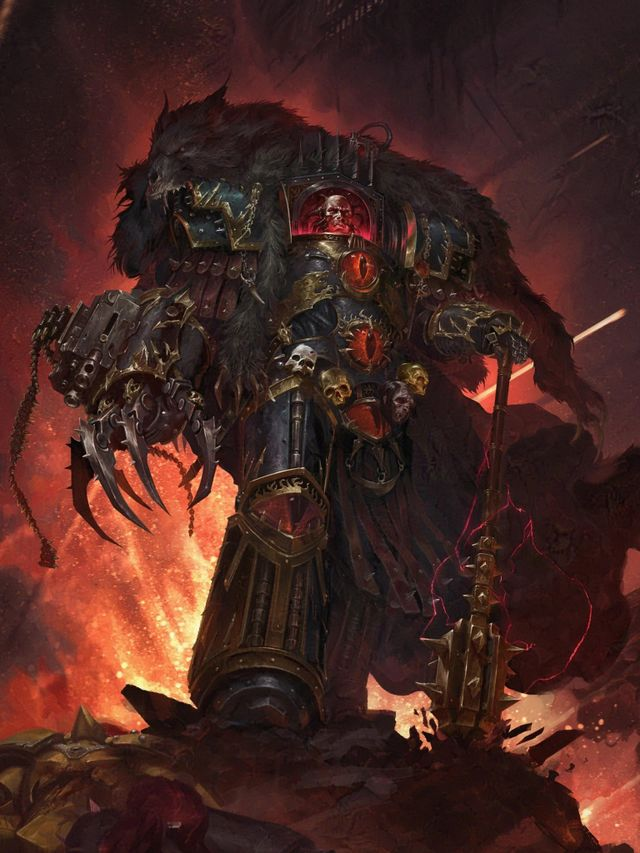
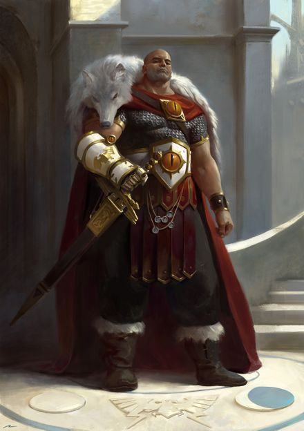
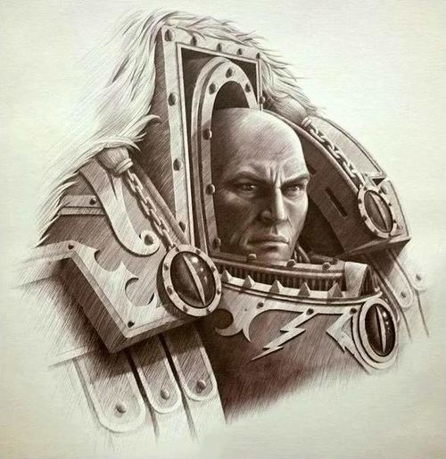
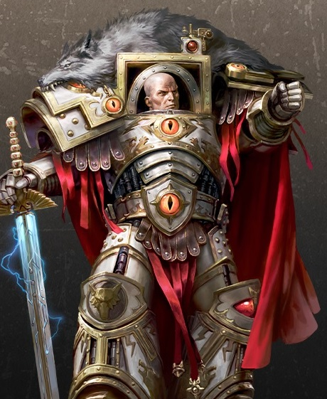
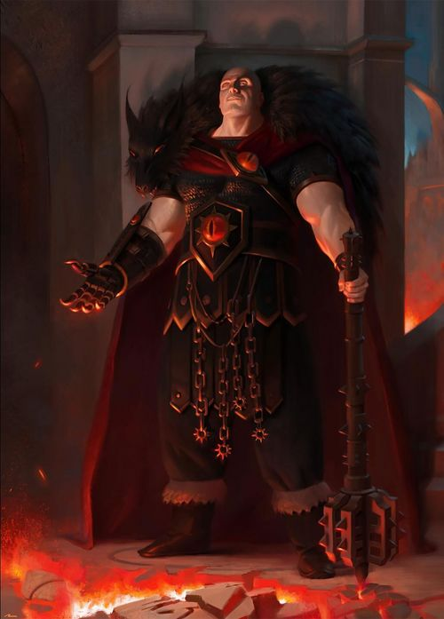
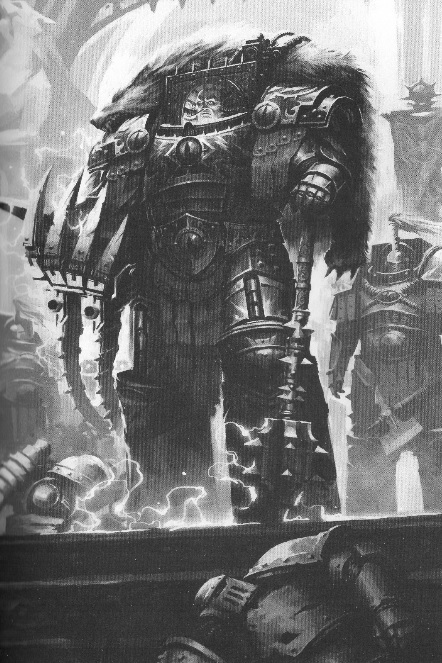
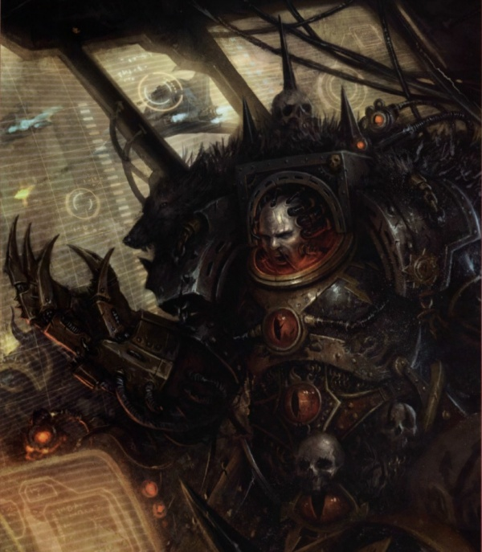
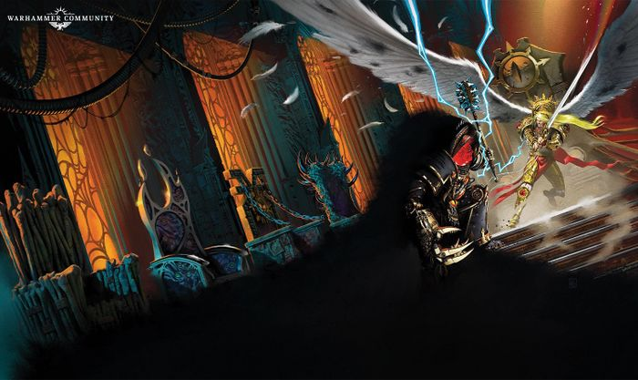
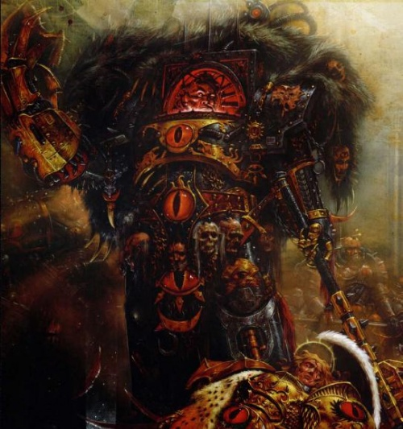
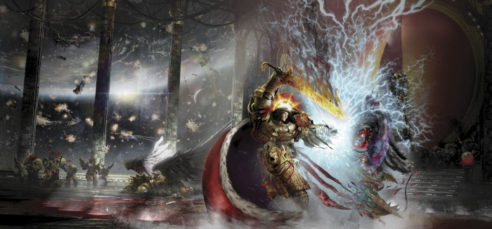

# 0699 荷鲁斯·卢佩卡尔 Horus Lupercal

精校状态：中文行文已逐段精校，部分术语仍为暂定

分类：人类帝国 / 荷鲁斯之子

原文来源：https://www.bilibili.com/opus/1053346450259312660

原作者：帝国神选罐头

原文时间：2025年04月08日 13:22

[返回分类目录](目录.md) · [全书目录](../../目录.md)

<!-- A0699-B0001 -->
**英文原文**

"‘And when we are done, after this hour, you will live in glory, and you will be able to say, “I was there, the day Horus slew the Emperor.” That is my pledge."

<!-- /A0699-B0001 -->

<!-- A0699-B0002 -->

原译文

“等这一小时过后，我们大功告成之时，你们将荣耀地活着，而且你们可以自豪地说，‘荷鲁斯杀死帝皇的那一天，我就在现场。’这是我向你们许下的承诺。”

**校订译文**

“等这一小时过后，我们大功告成之时，你们将荣耀地活着，而且你们可以自豪地说，‘荷鲁斯杀死帝皇的那一天，我就在现场。’这是我向你们许下的承诺。”

<!-- /A0699-B0002 -->

<!-- A0699-B0003 -->
**英文原文**

"Let the Galaxy Burn!"

<!-- /A0699-B0003 -->

<!-- A0699-B0004 -->

原译文

“让银河燃烧吧！”

**校订译文**

“让银河燃烧吧！”

<!-- /A0699-B0004 -->

<!-- A0699-B0005 -->
**英文原文**

Horus Lupercal was one of the 20 Primarchs created by the Emperor in the earliest days of the Imperium of Man, just after the end of the Age of Strife. Like the other Primarchs, Horus was scattered from Terra by the Gods of Chaos and was placed on a far-away world in an attempt to prevent the coming of the Age of the Imperium. Traditional accounts state that Horus was the first Primarch to be rediscovered, fighting alongside his father in the Great Crusade as Lord of the Luna Wolves. Becoming the favored son of the Emperor and beloved by most of his brother Primarchs, Horus eventually rose to become Warmaster of the Great Crusade and was seen as second only to the Emperor himself in power and prestige. But in spite of all of this, he was eventually corrupted by the powers of Chaos and initiated the galaxy-spanning civil war known as the Horus Heresy against the very Imperium he helped create.

<!-- /A0699-B0005 -->

<!-- A0699-B0006 -->

原译文

荷鲁斯·卢佩卡尔是帝皇在人类帝国早期创造的20位原体之一，就在纷争时代结束后。与其他原体一样，荷鲁斯被混沌诸神从泰拉分散，并被安置在一个遥远的世界，试图阻止帝国时代的到来。传统说法认为，荷鲁斯是第一位被重新发现的原体，在大远征中与他的父亲并肩作战，担任影月苍狼之主。荷鲁斯成为帝皇最宠爱的儿子，深受其大多数兄弟原体的爱戴，最终成为大远征的统帅，在权力和声望上仅次于帝皇本人。但尽管如此，他最终还是被混沌的力量所腐化，并发起了一场跨越银河系的内战，即荷鲁斯叛乱，对抗他帮助创建的帝国。

**校订译文**

荷鲁斯·卢佩卡尔是帝皇在纷争时代结束后、人类帝国初创时期创造的二十位原体之一。与其他原体一样，荷鲁斯也被混沌诸神从泰拉掳走，散落到遥远的世界；诸神企图以此阻止帝国时代的到来。按照传统记载，他是第一位被重新寻回的原体，随后作为影月苍狼之主，在大远征中与父亲并肩作战。他成为帝皇最宠爱的儿子，也深受大多数原体兄弟的喜爱，最终获任大远征的战帅，权力和威望都被视为仅次于帝皇。然而，他最终仍被混沌力量腐化，向自己参与缔造的帝国发动了席卷银河的内战——荷鲁斯之乱。

<!-- /A0699-B0006 -->

<!-- A0699-B0007 图片 -->

<!-- A0699-B0008 -->

原译文

Horus during his rebellion against the Emperor 荷鲁斯在对抗帝皇期间

**校订译文**

Horus during his rebellion against the Emperor 荷鲁斯在对抗帝皇期间

<!-- /A0699-B0008 -->

<!-- A0699-B0009 -->
## History 历史

<!-- /A0699-B0009 -->

<!-- A0699-B0010 -->
### Early Life 早年生活

<!-- /A0699-B0010 -->

<!-- A0699-B0011 -->
**英文原文**

When Horus was scattered, his pod landed on the world of Cthonia, a planet close to the Sol System. He was discovered by the Cthonian gang overlord Khageddon, and given the "no-name" of Nergüi. Growing up for a time under Khageddon's gang, Nergüi engaged in the perpetual gang warfare beneath Cthonia's surface that dominated the world. However his life changed dramatically when he came upon the pod he had arrived to Cthonia on, now being excavated by the Mechanicum. Nergüi engaged in battle with the Tech-Priests, killing one and recovering its weapon before running back to Khageddon. Khageddon scolded Nergüi for his recklessness, saying those he killed would chase them back to their tribal lair. Khageddon refused to give Nergüi his "kill-name" over the incident, much to the young ganger's anger. However just as Khageddon predicted, Mechanicum adepts arrived at their tribal hold and began to dig through from the surface. With the chamber collapsing around them and most of the gang dying, Khageddon instructed Nergüi to slay him to earn his kill-name. After Nergüi performed the act, he suddenly gained buried memories of the Galaxy, technology, and himself. Even his body began to swell, seemingly awakened by a trigger. When the Tech-Priests finally arrived into the chamber a Primarch stood before him: Nergüi proclaimed himself Horus.

<!-- /A0699-B0011 -->

<!-- A0699-B0012 -->

原译文

当荷鲁斯被分散时，他的舱体降落在靠近太阳系的科索尼亚星球上。他被科索尼亚帮派霸主哈格登发现，并被冠以“无名”的纳古尔。纳古尔在哈格登的帮派下成长了一段时间，卷入了主宰着科索尼亚星球的、发生在其地表之下的无休止的帮派争斗之中。然而，当他来到他抵达科索尼亚的舱室时，他的生活发生了巨大的变化，现在正被机械神教挖掘出来。纳古尔与技术神甫进行了战斗，杀死了一名并回收了武器，然后跑回哈格登。哈格登斥责纳古尔的鲁莽，说他杀死的人会把他们赶回部落藏身处。哈格登拒绝给予纳古尔在这起事件中的“杀戮之名”，这让这位年轻的帮派成员非常愤怒。然而，正如哈格登所预测的那样，机械神教到达了他们的部落藏身处，开始从地表挖掘。随着他们周围的房间坍塌，大部分帮派成员死亡，哈格登指示纳古尔杀死他，以赢得他的杀戮之名。在纳古尔表演完这一幕后，他突然获得了对银河系、技术和自己的深藏的记忆。甚至他的身体也开始膨胀，似乎被扳机惊醒了。当技术神甫们终于进入房间时，一位原体站在他面前：纳古尔自称荷鲁斯。

**校订译文**

荷鲁斯被抛散后，承载他的舱体降落在靠近太阳系的克苏尼亚。他被当地帮派霸主哈格登发现，并被赋予“纳古尔”这个“无名号”。纳古尔在哈格登的帮派中生活了一段时间，参与了克苏尼亚地下永无休止、主宰着整个世界的帮派战争。后来，他偶然发现机械教正在挖掘自己当初乘坐的舱体，人生由此骤变。他与技术祭司交战，杀死其中一人，夺走对方的武器后跑回哈格登身边。哈格登斥责他鲁莽，警告说对方的人会追踪到他们的部族据点，并拒绝因这次杀戮赐予他“杀戮之名”，令年轻的纳古尔十分愤怒。事情果然如哈格登所料：机械教成员来到据点，从地表向下挖掘。地下厅室开始坍塌，帮派成员大多丧命，哈格登便命令纳古尔杀死自己，以取得杀戮之名。纳古尔照做后，脑中突然涌现出关于银河、技术与自身的深藏记忆，连身体也开始膨大，仿佛某种触发机制唤醒了他。当技术祭司终于进入厅室时，站在他们面前的已是一位原体：纳古尔宣告自己名叫荷鲁斯。

**校注：** no-name 与 kill-name 是克苏尼亚帮派命名习俗，区分为无名号／杀戮之名。原文“those he killed would chase”按其所属势力追索理解；死者本人追来不合该段因果。

<!-- /A0699-B0012 -->

<!-- A0699-B0013 图片 -->

<!-- A0699-B0014 -->

原译文

younger Horus Lupercal 年轻的荷鲁斯·卢佩卡尔

**校订译文**

younger Horus Lupercal 年轻的荷鲁斯·卢佩卡尔

<!-- /A0699-B0014 -->

<!-- A0699-B0015 -->
**英文原文**

According to Horus himself, after his discovery he was brought from Cthonia to Terra alongside several of his elderly comrades from the gang world. He landed upon Terra to much fanfare, kneeling before the Emperor and taking an oath to serve him dutifully. This account however is sometimes disputed, with others claiming Horus returned to Terra itself. Because of this early discovery, Horus grew to be the most powerful among the Primarchs as he had grown up from a child to an adult at the side of the Emperor. For a thirty years he was the only Primarch to have been discovered. Friendship between the Emperor and Horus grew rapidly and the Emperor eventually trusted him enough to give him command of the entire force of the Imperium. The Emperor had saved Horus's life at the Siege of Reillis as they fought back to back. At another battle, Horus repaid this debt when he hacked the arm off a frenzied Ork as it tried to choke the life out of the Emperor on the planet of Gorro.

<!-- /A0699-B0015 -->

<!-- A0699-B0016 -->

原译文

据荷鲁斯本人说，在他被发现后，他与帮派世界的几位老战友一起从科索尼亚被带到了泰拉。他大张旗鼓地登上了泰拉，跪在帝皇面前，宣誓尽职尽责地为他服务。然而，这个说法有时会引起争议，其他人声称荷鲁斯本人回到了泰拉。由于这较早的发现，荷鲁斯在帝皇身边从一个孩子成长为一个成年人，成为了最强大的原体。三十年来，他是唯一一位被发现的原体。帝皇和荷鲁斯之间的友谊迅速发展，帝皇最终信任他，让他指挥整个帝国的力量。帝皇在莱利斯围城战中救了荷鲁斯的命，他们背对背作战。在另一场战斗中，荷鲁斯偿还了这笔情义，他砍下了一只疯狂的兽人的手臂，因为在戈罗星球它试图扼杀帝皇的生命。

**校订译文**

据荷鲁斯自己所述，他被发现后，与几位来自克苏尼亚帮派的年长伙伴一同被带往泰拉。他在盛大的欢迎仪式中降临泰拉，跪在帝皇面前，宣誓尽忠效命。不过，也有人对这一记载持异议，称荷鲁斯是“返回泰拉本身”。由于很早便被寻回，他在帝皇身边从孩童成长为成人，成为最强大的原体。在此后的三十年里，他是唯一已被寻回的原体。父子间的情谊迅速加深，帝皇最终对他信任有加，将帝国全部军事力量的指挥权交给了他。在莱利斯围城战中，两人背靠背作战，帝皇曾救过荷鲁斯一命。后来在戈罗星，一名狂暴的欧克企图扼死帝皇，荷鲁斯斩断其手臂，报答了父亲的救命之恩。

**校注：** 原文以 brought from Cthonia to Terra 和 returned to Terra itself 对举，却未明确后说与前说的实质差别，故保留措辞并列，不擅补出生地或返乡方式。

<!-- /A0699-B0016 -->

<!-- A0699-B0017 图片 -->

<!-- A0699-B0018 -->

原译文

Horus 荷鲁斯

**校订译文**

Horus 荷鲁斯

<!-- /A0699-B0018 -->

<!-- A0699-B0019 -->
**英文原文**

The first of his brother Primarchs Horus was reunited with was Leman Russ, who he regarded as a savage and with a degree of hidden jealousy. Despite this, he fervently followed the Emperor's wish to have him get along with Russ and the other Primarchs that will soon be rediscovered.

<!-- /A0699-B0019 -->

<!-- A0699-B0020 -->

原译文

与荷鲁斯重聚的第一个兄弟原体是黎曼·鲁斯，他认为鲁斯是个野蛮人，有一定程度的嫉妒。尽管如此，他还是热切地追随帝皇的意愿，希望他能与鲁斯和其他即将被重新发现的原体和睦相处。

**校订译文**

荷鲁斯重逢的第一位原体兄弟是黎曼·鲁斯。他觉得鲁斯是个野蛮人，内心也暗藏几分嫉妒。尽管如此，他仍热切遵从帝皇的意愿，努力与鲁斯，以及随后陆续被寻回的其他原体和睦相处。

<!-- /A0699-B0020 -->

<!-- A0699-B0021 -->
### The Great Crusade 大远征

<!-- /A0699-B0021 -->

<!-- A0699-B0022 -->
**英文原文**

As the Emperor and the Great Crusade marched on, Horus proved himself to be a tactical genius. He knew precisely which force to send and where to send it, showing no mercy to those that opposed the Emperor but sparing the innocent from unnecessary bloodshed. As the Emperor departed to find and meet with rediscovered Primarchs, Horus was left in temporary command of the Legiones Astartes and this helped prepare him for the role of Warmaster.

<!-- /A0699-B0022 -->

<!-- A0699-B0023 -->

原译文

随着帝皇和大远征的推进，荷鲁斯证明了自己是一个战术天才。他非常清楚该派哪支部队去哪里，对那些反对帝皇的人毫不留情，却让无辜者免于不必要的流血。当帝皇离开去寻找并会见重新发现的原体时，荷鲁斯暂时指挥着阿斯塔特军团，这有助于他为战帅的角色做好准备。

**校订译文**

随着帝皇率领大远征不断推进，荷鲁斯展现出卓越的战术天赋。他清楚该把哪支部队派往何处，对帝皇的敌人毫不留情，同时又使无辜者免遭不必要的流血。每当帝皇离开、去寻找并迎接被重新发现的原体时，荷鲁斯便暂代阿斯塔特军团的指挥权，这些经历也为他日后出任战帅奠定了基础。

<!-- /A0699-B0023 -->

<!-- A0699-B0024 图片 -->

<!-- A0699-B0025 -->

原译文

Horus before his corruption 荷鲁斯在腐化之前

**校订译文**

Horus before his corruption 荷鲁斯在腐化之前

<!-- /A0699-B0025 -->

<!-- A0699-B0026 -->
**英文原文**

After the Ullanor Crusade, in which an Ork empire was defeated, the Emperor, considering the crusade to be Horus' greatest victory yet, saw fit to partially transfer control of the Great Crusade to Horus, raising him to the rank of Warmaster, the highest official beneath the Emperor himself, and granting him command over any and all Imperial forces, as well as other rights and honours. This strained Horus' relationship with several Primarch's, most notably Angron, Perturabo, and Konrad Curze, who felt either they deserved the title or simply didn't want to take orders from their brother. Leman Russ and Lion El'Jonson meanwhile openly accepted the decision but were clearly embittered by it, Roboute Guilliman, Jaghatai Khan, and Ferrus Manus supported the decision simply because of duty. But Fulgrim, Mortarion, Sanguinius, Lorgar, and Rogal Dorn all supported Horus' ascension to the point where they bowed their heads and meant it, and Horus grew closest to these brothers.

<!-- /A0699-B0026 -->

<!-- A0699-B0027 -->

原译文

在乌兰诺远征中，一个欧克帝国被击败，帝皇认为这场远征是荷鲁斯迄今为止最大的胜利，认为有必要将大远征的部分控制权移交给荷鲁斯，将他提升为帝皇之下的最高指挥官战帅，并授予他对任何和所有帝国军队的指挥权，以及其他权利和荣誉。这使荷鲁斯与几位原体的关系紧张，其中最著名的是安格隆、佩图拉博和康拉德·科兹，他们要么觉得自己配得上这个头衔，要么根本不想听从兄弟的命令。与此同时，黎曼·鲁斯和莱昂·艾尔庄森公开接受了这一决定，但显然对此感到不满，罗伯特·基里曼、察合台可汗和费鲁斯·马努斯仅仅因为责任而支持这一决定。但福格瑞姆、莫塔里安、圣吉列斯、珞珈和罗格·多恩都支持荷鲁斯的提升，以至于他们低头表示支持，荷鲁斯与这些兄弟的关系也越来越亲密。

**校订译文**

乌兰诺远征摧毁了一个欧克帝国，帝皇认为这是荷鲁斯迄今最辉煌的胜利，于是决定将大远征的部分统辖权交给他。荷鲁斯获任战帅，成为地位仅次于帝皇的最高官员，得到指挥一切帝国军队的权力，以及其他诸多权利与荣誉。这一任命使他与几位原体的关系趋于紧张，尤其是安格隆、佩图拉博与康拉德·科兹：有人认为自己更配得上这个头衔，也有人只是不愿听命于兄弟。黎曼·鲁斯和莱昂·艾尔’庄森公开接受决定，心中却明显不满；罗保特·基里曼、察合台可汗和费鲁斯·马努斯则纯粹出于职责表示支持。福格瑞姆、莫塔里安、圣吉列斯、珞珈与罗格·多恩却真心拥护荷鲁斯的晋升，向他低头致意。荷鲁斯也因此与这几位兄弟最为亲近。

**校注：** 此处英文将莫塔里安列为真心支持战帅任命者；第695篇另述其不赞同该任命。两处来源表述不一，分别保留，不以一处覆盖另一处。

<!-- /A0699-B0027 -->

<!-- A0699-B0028 -->
**英文原文**

In these, the last years of the Great Crusade, Horus would encourage the other Primarchs to compete against each other in order to discover the strongest and most able of his companions and to improve their fighting abilities, as well as lead his own personal forces into several notable campaigns. It was after one of these campaigns - the first contact with the Interex — that Horus chose to exercise his right, granted by the Emperor, to rename his personal legion: The Luna Wolves were renamed the Sons of Horus. But despite these accomplishments, the formation of the Council of Terra and his Father's return to Terra created a deeply buried resentment in Horus that, before the Heresy, not even he truly seemed to realize existed.

<!-- /A0699-B0028 -->

<!-- A0699-B0029 -->

原译文

在大远征的最后几年，荷鲁斯鼓励其他原体相互竞争，以发现最强大、最有能力的同伴，提高他们的战斗能力，并带领自己的个人部队参加几场著名的战役。在其中一次战役之后，即与英特雷斯的第一次接触之后，荷鲁斯选择行使帝皇授予的权利，重新命名他的个人军团：影月苍狼被重新命名为荷鲁斯之子。但尽管取得了这些成就，泰拉议会的成立和他父亲回到泰拉在荷鲁斯心中造成了深深的怨恨，在叛乱之前，甚至他似乎都没有真正意识到这种怨恨的存在。

**校订译文**

在大远征的最后几年，荷鲁斯鼓励其他原体相互竞争，借此找出最强大、最能干的同伴，并磨炼他们的作战能力。他也亲率部队参加了数场著名战役。在其中一次行动——与英特雷斯的首次接触——之后，他决定行使帝皇授予的权利，为自己的军团更名：影月苍狼从此改称荷鲁斯之子。然而，尽管成就斐然，泰拉议会的成立与父亲返回泰拉，仍在他内心埋下了深重的怨恨。直到叛乱爆发之前，他似乎连自己也未真正意识到这份怨恨的存在。

<!-- /A0699-B0029 -->

<!-- A0699-B0030 -->
### The Betrayal 背叛

<!-- /A0699-B0030 -->

<!-- A0699-B0031 -->
**英文原文**

Unknown to Horus, his brother Lorgar, along with his entire legion of Word Bearers, had secretly fallen to Chaos and conspired to make Horus the Ruinous Powers' champion against the Emperor. For many years before acting openly, the Word Bearers usurped loyalist hold on their Legions by establishing Warrior Lodges. The full conspiracy finally manifested during a mission on the Feral World Davin; Horus was wounded in battle by a blade of Nurgle wielded by the Chaos-corrupted Eugen Temba. He fell unconscious and under the advice of Word Bearers First Chaplain Erebus the natives of the world helped to heal him. However, unknown to the desperate Mournival, the healers and Erebus himself had all long since become corrupted by Chaos and were orchestrating the entire series of events. Having his dying body moved to the Serpent Lodge, Horus was soon subjected to an ancient Chaos ritual by the Davin priests, while Erebus entered his mind disguised as the deceased Hastur Sejanus. This image of Sejanus showed Horus horrifying visions of the future, where the Emperor ruled as a god and had discarded the Primarchs once they had outlived their usefulness. Erebus also told Horus that the Gods of Chaos were peaceful beings with little interest in the Materium, and it was the Emperor that was intent on destroying their realm on his quest for godhood. Most disturbing for Horus, he was told that the Emperor had used the powers of the Warp to create the Primarchs. Horus was shown a vision of the past where all the Primarchs, himself included, were scattered across the Galaxy into a warp vortex. The scattering of the Primarchs, despite being orchestrated by Chaos instead of the Emperor, seemingly confirmed to Horus that the Emperor had used foul Warp-magics in his sons' creations. Horus saw the Emperor, who had banned any research into the Warp, as a hypocrite.

<!-- /A0699-B0031 -->

<!-- A0699-B0032 -->

原译文

荷鲁斯不知道，他的兄弟珞珈和他的整个怀言者军团已经秘密堕入混沌，密谋让荷鲁斯成为毁灭力量对抗帝皇的冠军。在公开行动之前的许多年里，怀言者通过建立战士结社篡夺了忠诚派对其军团的控制。整个阴谋最终在蛮荒世界戴文的一次任务中显现出来；荷鲁斯在战斗中被混沌堕落的欧根·坦巴挥舞的纳垢之剑击伤。他昏迷不醒，在怀言者第一牧师艾瑞巴斯的建议下，世界各地的土著人帮助他康复。然而，绝望的四王议会并不知道，治疗者和艾瑞巴斯本人早已被混沌所腐化，并正在策划整个系列事件。随着他垂死的身体被转移到毒蛇结社，荷鲁斯很快就受到了达文牧师的一项古老的混沌仪式的压迫，而艾瑞巴斯则伪装成已故的哈斯塔·赛詹努斯进入了他的脑海。赛詹努斯的影像向荷鲁斯展示了未来的可怕景象，在那里，帝皇以神的身份统治，一旦原体们失去效用，他就抛弃了他们。艾瑞巴斯还告诉荷鲁斯，混沌诸神是和平的存在，对物质界不感兴趣，正是帝皇在追求神性的过程中意图摧毁他们的帝国。最让荷鲁斯感到不安的是，他被告知帝皇利用亚空间的力量制造了原体。荷鲁斯看到了过去的景象，包括他自己在内的所有原体都分散在银河系中，形成了一个亚空间的漩涡。尽管是由混沌而不是帝皇策划的，但原体的分散似乎向荷鲁斯证实了帝皇在他儿子的创造中使用了肮脏的亚空间魔法。荷鲁斯认为帝皇是个伪君子，因为他禁止对亚空间进行任何研究。

**校订译文**

荷鲁斯并不知道，他的兄弟珞珈和整个怀言者军团早已暗中投向混沌，密谋把他塑造成毁灭诸力对抗帝皇的代行者。在公开行动之前的多年里，怀言者通过建立战士结社，逐渐削弱忠诚派对各军团的影响。这场阴谋最终在蛮荒世界戴文的一次任务中全面展开：荷鲁斯被遭到混沌腐化的欧根·坦巴以一柄纳垢之刃刺伤，陷入昏迷。怀言者首席教士艾瑞巴斯建议请当地人施救，四王议会病急求医，却不知道这些治疗者与艾瑞巴斯本人早已被混沌腐化，整件事正是他们一手安排的。荷鲁斯奄奄一息的身体被送入巨蛇会所，戴文祭司随即为他施行古老的混沌仪式；艾瑞巴斯则伪装成已故的哈斯塔·赛詹努斯，进入他的意识。这位假赛詹努斯向他展示骇人的未来幻象：帝皇以神明之姿统治，并在原体失去利用价值后将他们抛弃。艾瑞巴斯还声称，混沌诸神本是对物质宇宙兴趣不大的和平存在，反倒是帝皇为了成神而企图毁灭祂们的领域。最令荷鲁斯不安的是，艾瑞巴斯告诉他，帝皇曾借助亚空间力量创造原体。他还看到一段过去的幻象：所有原体，包括他自己，都经由亚空间漩涡被抛散到银河各处。尽管这一抛散实际上由混沌策划，而非帝皇所为，荷鲁斯仍将之视为父亲曾以污秽亚空间巫术创造子嗣的佐证。他因此认定，禁止研究亚空间的帝皇是个伪君子。

**校注：** 艾瑞巴斯关于诸神和平、帝皇成神目的的说法属于诱导荷鲁斯的叙事，保留“声称”等归属。修正原译把原体被漩涡抛散写成原体变为漩涡的关系。

<!-- /A0699-B0032 -->

<!-- A0699-B0033 图片 -->

<!-- A0699-B0034 -->

原译文

Horus succumbs to the powers of Chaos 荷鲁斯屈服于混沌的力量

**校订译文**

Horus succumbs to the powers of Chaos 荷鲁斯屈服于混沌的力量

<!-- /A0699-B0034 -->

<!-- A0699-B0035 -->
**英文原文**

Despite realizing early on that this Sejanus was but an impostor, Horus nonetheless accepted these revelations for unknown reasons and his bitterness towards the Emperor, already growing from his fathers isolation and Secret Project on Terra as well as the formation of the Council of Terra (essentially subordinating the Primarchs to mortal humans), finally manifested in outright hostility. The only attempt to stop the conversion of Horus came from his brother Magnus the Red, who entered Horus's mind but was unable to interfere with the powerful rituals of the Davin Cultists or convince Horus to remain loyal to the Emperor. Horus dealt with Magnus afterward by manipulating Leman Russ into launching an all-out purge of Prospero.

<!-- /A0699-B0035 -->

<!-- A0699-B0036 -->

原译文

尽管很早就意识到这个赛詹努斯只是一个骗子，但荷鲁斯还是出于未知的原因接受了这些启示，他对帝皇的怨恨，已经从他父亲的孤立和泰拉上的秘密计划以及泰拉议会的成立（本质上是将原体从属于凡人）中成长起来，最终表现为彻底的敌意。阻止荷鲁斯皈依的唯一尝试来自他的兄弟赤红之马格努斯，他进入了荷鲁斯的脑海，但无法干涉达文教徒的强大仪式，也无法说服荷鲁斯继续忠于帝皇。荷鲁斯后来通过操纵黎曼·鲁斯对普罗斯佩罗进行全面清洗来对付马格努斯。

**校订译文**

荷鲁斯很早便看出眼前的赛詹努斯只是冒牌货，却仍出于不明原因接受了这些所谓的真相。父亲的疏离、泰拉上的秘密计划，以及实际上将原体置于凡人管辖之下的泰拉议会，早已令他日益怨恨；如今，这份怨恨终于化为公开的敌意。唯一试图阻止他倒向混沌的是兄弟赤红马格努斯。马格努斯进入他的意识，却既无法打断戴文邪教徒的强大仪式，也无法说服他继续忠于帝皇。事后，荷鲁斯又操纵黎曼·鲁斯，使其对普罗斯佩罗发动全面清剿，以此对付马格努斯。

<!-- /A0699-B0036 -->

<!-- A0699-B0037 -->
**英文原文**

After his experience on Davin, Horus agreed to align with the powers of Chaos in order to overthrow the Emperor, which he had become convinced was a corrupt dictator bent on achieving godhood and forsaking his sons in favor of mortal rulers. The Warmaster soon introduced the taint to the Legions under his direct command, converting Angron of the World Eaters, Fulgrim of the Emperor's Children, and Mortarion of the Death Guard to his cause. Eventually, Horus was also able to secretly recruit Konrad Curze of the Night Lords, Alpharius Omegon of the Alpha Legion, and Perturabo of the Iron Warriors. Horus also converted the Fabricator-General of the Adeptus Mechanicus Kelbor-Hal, founding the Dark Mechanicum, as well as many units of the Imperial Army.

<!-- /A0699-B0037 -->

<!-- A0699-B0038 -->

原译文

在戴文的经历之后，荷鲁斯同意与混沌势力结盟，以推翻帝皇，他已经确信帝皇是一个腐败的独裁者，一心想要实现神性，抛弃儿子，转而支持凡人统治者。战帅很快将这一污点介绍给了他直接指挥的军团，使吞世者的安格隆、帝皇之子的福格瑞姆和死亡守卫的莫塔里安皈依了他的事业。最终，荷鲁斯还秘密招募了午夜领主的康拉德·科兹、阿尔法军团的阿尔法瑞斯·欧米伽和钢铁勇士的佩图拉博。荷鲁斯还将机械神教铸造将军卡尔博·哈尔转变为黑暗机械教，以及帝国军队的许多单位。

**校订译文**

戴文的经历使荷鲁斯同意与混沌力量结盟，推翻帝皇。他已认定父亲是个腐败的独裁者，一心追求神格，宁愿选择凡人统治者，也要抛弃自己的儿子。战帅很快把腐化带入直接受他指挥的军团，拉拢吞世者的安格隆、帝皇之子的福格瑞姆和死亡守卫的莫塔里安。随后，他又秘密争取到午夜领主的康拉德·科兹、阿尔法军团的阿尔法瑞斯·欧米伽，以及钢铁勇士的佩图拉博。他还使机械修会的铸造将军凯尔博·哈尔倒戈，由此建立黑暗机械教，并拉拢了帝国军的许多部队。

**校注：** 英文此处用 Adeptus Mechanicus，故译机械修会；Dark Mechanicum 为黑暗机械教，不据时代自行改写英文组织名。

<!-- /A0699-B0038 -->

<!-- A0699-B0039 -->
### Heresy 叛乱

<!-- /A0699-B0039 -->

<!-- A0699-B0040 -->
### Burning the Galaxy 燃烧银河

<!-- /A0699-B0040 -->

<!-- A0699-B0041 -->
**英文原文**

Horus moved, along with several other secretly traitor legions, to Isstvan III, seemingly in order to suppress a rebellion and reinstate Imperial control. Once he arrived however, he sent down specially selected troops from all four of the legions with him, sending down all those he knew would never join him in open rebellion. Once they were on the planet he proceeded to virus bomb the entire world and killed billions of inhabitants in seconds, along with hundreds of space marines, and a ground war eliminated the remainder. The psychic shock wave from this event was said to be louder than the Astronomican. Horus then redeployed his forces to Isstvan V where he was met by seven Space Marine legions sent to bring him to Terra to face an inquest into his actions on Isstvan III. Four of these seven legions proceeded to rebel against the Emperor. It now became obvious that Horus had massive power as he hunted down the three legions that had stayed loyal. Only a few Space Marines managed to escape his forces and make it back to Terra, and among those killed was Ferrus Manus, Primarch of the Iron Hands. Eventually Horus would mount the skull of Ferrus Manus in his throne room, where he began talking to it in private and lamenting that he must rely on psychotic generals and daemons instead of true, effective strategists like Ferrus had been. As Horus' rebellion spread, he claimed a personal fiefdom in the northern Imperium dubbed the Dark Empire.

<!-- /A0699-B0041 -->

<!-- A0699-B0042 -->

原译文

荷鲁斯和其他几个秘密叛徒军团一起转移了伊斯塔万三号，似乎是为了镇压叛乱并恢复帝国的控制。然而，一旦他到达，他就从所有四个军团中派出了特别挑选的部队，派出了所有他知道永远不会加入他公开叛乱的人。一旦他们登上星球，他就开始对整个世界进行病毒轰炸，在几秒钟内杀死了数十亿居民，以及数百名星际战士，地面战消灭了其余的人。据说，这一事件产生的灵能冲击波比星炬还要大。荷鲁斯随后将他的部队重新部署到伊斯塔万五号，在那里，有七个星际战士军团被派来将他押解回泰拉，就他在伊斯塔万三号上的所作所为接受质询。这七个军团中有四个开始反抗帝皇。现在很明显，荷鲁斯面对追捕他的三个忠诚军团时拥有巨大的力量。只有少数星际战士设法逃离了他的部队，回到了泰拉，遇难者中包括钢铁之手原体费鲁斯·马努斯。最终，荷鲁斯会把费鲁斯·马努斯的头骨放在他的王座厅里，在那里他开始私下与它交谈，并哀叹他必须依靠精神错乱的将军和恶魔，而不是像费鲁斯那样真正有能力的战略家。随着荷鲁斯叛乱的蔓延，他声称在帝国北方拥有一个被称为黑暗帝国的个人封地。

**校订译文**

荷鲁斯与数支已经暗中叛变的军团开赴伊斯塔万三号，表面上是为了镇压叛乱、恢复帝国统治。抵达后，他从随行的四个军团中挑出自己明知绝不会参与公开反叛的战士，将他们全部派往地表，随后以病毒炸弹轰炸整个世界。数十亿居民和数百名星际战士在数秒内丧命，剩余忠诚者则在地面战争中被消灭。据说，这场浩劫产生的灵能冲击波甚至压过了星炬的信号。荷鲁斯随后转移至伊斯塔万五号，迎战奉命将他押回泰拉、调查伊斯塔万三号事件的七个星际战士军团。然而，这七个军团中有四个临阵背叛帝皇，转而追杀其余三个忠诚军团，荷鲁斯掌握的庞大力量至此暴露无遗。只有少数星际战士逃脱，并成功返回泰拉。钢铁之手原体费鲁斯·马努斯也在死者之列。后来，荷鲁斯将费鲁斯的头骨置于王座厅，私下对着它说话，哀叹自己只能依赖精神失常的将领与恶魔，却得不到费鲁斯这样真正高明、卓有成效的战略家。随着叛乱蔓延，他又在帝国北部划出自己的领地，称为黑暗帝国。

**校注：** 原文是荷鲁斯追杀留下的三个忠诚軍团，不是三个军团追捕荷鲁斯。Dark Empire 为其北部领地，区别后世 Imperium Nihilus 帝国暗面。

<!-- /A0699-B0042 -->

<!-- A0699-B0043 -->
### Ascension 力量升华

原题：Ascension 升魔

**校注：** Ascension 在本段指摩洛之行后力量升华；英文未称其升为恶魔亲王，原“升魔”过度限定。

<!-- /A0699-B0043 -->

<!-- A0699-B0044 -->
**英文原文**

Following a failed assassination attempt by Shadrak Meduson after the Battle of Dwell, Horus regained a lost memory that the Emperor had erased, that of the Emperor's unlocking of dark powers on Molech. Horus invaded the planet hoping to gain the same abilities as his father. Horus eventually managed to enter the gate, and after an unspecified but extremely long period of time exited the Warp with his powers greatly increased. While time in the Materium had only been mere moments, Horus had been within the Warp for so long he had visibly aged. Inside the Warp for what seemed like an eternity, Horus had won a thousand kingdoms, amassed billions of Daemonic followers, and defied Gods. Eventually Horus forcibly acquired the same power the Emperor had gotten, but with his own force of will and without deception like his Father had. However he had refused a place within the Warp, choosing instead to reenter the Materium with his new power to make war on the Emperor. Aboard the Vengeful Spirit, Horus then survives an infiltration by the Knights-Errant led by his former Mournival adviser Garviel Loken. The attempt failed and Horus killed Iacton Qruze before the Knights-Errant escaped.

<!-- /A0699-B0044 -->

<!-- A0699-B0045 -->

原译文

在德韦尔之战后沙德拉克·梅杜森的暗杀企图失败后，荷鲁斯恢复了帝皇抹去的失去的记忆，即帝皇在摩洛上解封黑暗力量的记忆。荷鲁斯入侵星球，希望获得与父亲相同的能力。荷鲁斯最终设法进入了大门，在一段未指明但极长的时间后，他的力量大大增强，离开了亚空间。虽然在物质界中的时间只是片刻，但荷鲁斯在亚空间中呆了很长时间，他明显变老了。在亚空间内部似乎是永恒的，荷鲁斯赢得了一千个王国，积累了数十亿的恶魔追随者，并挑战了诸神。最终，荷鲁斯强行获得了与帝皇相同的力量，但凭借着他自己的意志力，而且没有像他父亲那样进行欺骗。然而，他拒绝了在亚空间中占据一席之地，而是选择凭借自己新获得的力量重返实体宇宙，向帝皇发起战争。在复仇之魂号上，荷鲁斯在他的前四王议会顾问加维尔·洛肯领导的游侠骑士的渗透中幸存下来。这次尝试失败了，荷鲁斯在游侠骑士逃脱之前杀死了拉克顿·科鲁兹。

**校订译文**

德威尔之战后，沙德拉克·梅杜森刺杀荷鲁斯未遂。随后，荷鲁斯恢复了一段被帝皇抹去的记忆：父亲曾在摩洛开启黑暗力量。为获得同样的能力，他入侵了这颗星球，并最终穿过那道门户。他在亚空间度过了一段无法确知、却极其漫长的岁月，离开时力量已大幅增强。物质宇宙中只过去片刻，他却已经苍老了许多。在仿佛永恒的亚空间征战中，他征服了上千个王国，聚集数十亿恶魔追随者，并与诸神抗衡。按照这段记载的叙述，他最终凭自己的意志强行夺得了帝皇曾获得的力量，而不像父亲那样借助欺骗。他拒绝留在亚空间，选择携带新力量返回物质宇宙，与帝皇开战。回到复仇之魂号后，他又遭遇由昔日四王议会顾问加维尔·洛肯率领的游侠骑士潜入袭击。行动失败，荷鲁斯在游侠骑士逃走之前杀死了亚克顿·克鲁兹。

**校注：** 关于荷鲁斯凭意志取力、帝皇曾用欺骗的对比属于此段记载的叙述，未据此作独立设定认证。

<!-- /A0699-B0045 -->

<!-- A0699-B0046 图片 -->

<!-- A0699-B0047 -->

原译文

Horus during the Heresy at the Battle of Trisolian 特里索兰之战叛乱时期的荷鲁斯

**校订译文**

Horus during the Heresy at the Battle of Trisolian 特里索兰之战叛乱时期的荷鲁斯

<!-- /A0699-B0047 -->

<!-- A0699-B0048 -->
**英文原文**

Now with the powers of a god and maintaining his previously youthful appearance with his new-found abilities, Horus then set a course to fight his way through the Imperium in an attempt to reach Terra and, ultimately, to kill the Emperor and place himself on the throne. However at the Trisolian, he was confronted by Leman Russ and his Space Wolves, who had tracked the Vengeful Spirit thanks to runes planted by the Knights-Errant during the Battle of Molech. Russ and a large force of Space Wolves were able to board the Venegeful Spirit, and the two Primarch's came face to face. Russ was disgusted by what had become of his brother. Nonetheless Horus pleaded with Russ to join him and help in his quest to overthrow the Emperor and expose his lies. Surprising none, Russ rejected Horus and the two engaged in a titanic battle. Despite Horus' sorcerous powers, Russ was protected thanks to the Spear of Russ he wielded. It thus came down to a battle of sheer power, one Horus was dominating despite Russ' speed. Horus caught Russ upon his Talon, but Russ broke free of his armor and impaled flesh to plunge the Spear of Russ into the Warmaster's side. However Russ hesitated at the final second to deliver the killing blow, and instead only partially pierced Horus' side. The wound was still devastating, and more importantly the power of the Spear cleansed Horus of the corruption that had befallen him since Molech. For the first time in the battle, Russ saw Horus Lupercal before him, not a creature of Chaos.

<!-- /A0699-B0048 -->

<!-- A0699-B0049 -->

原译文

现在，荷鲁斯拥有神的力量，并凭借新发现的能力保持了他以前年轻的外表，于是他制定了一条穿过帝国的路线，试图到达泰拉，最终杀死帝皇并登上皇位。然而，在特里索兰，他遇到了黎曼·鲁斯和他的太空野狼，他们在摩洛之战中通过游侠骑士刻印的符文追踪了复仇之魂。鲁斯和一大群太空野狼登上了复仇之魂号，两位原体面对面。鲁斯对他兄弟的遭遇感到厌恶。尽管如此，荷鲁斯还是恳求鲁斯加入他的行列，帮助他推翻四号，揭露他的谎言。没有人感到惊讶，鲁斯拒绝了荷鲁斯，两人展开了一场激烈的战斗。尽管荷鲁斯拥有魔法般的力量，但由于挥舞着鲁斯之矛，鲁斯得到了保护。因此，这归结为一场纯粹的力量之战，尽管鲁斯的速度很快，但荷鲁斯还是占据了主导地位。荷鲁斯用他的爪子抓住了鲁斯，但鲁斯挣脱了盔甲，刺穿血肉，将鲁斯之矛刺向了战帅方向。然而，在最后一秒，鲁斯犹豫了一下，没有出手，只是部分刺穿了荷鲁斯的身体。伤口仍然是毁灭性的，更重要的是，长矛的力量清除了荷鲁斯自摩洛以来遭受的腐化。在战斗中，鲁斯第一次看到荷鲁斯·卢佩卡尔在他面前，而不是混沌的造物。

**校订译文**

荷鲁斯此时拥有神明般的力量，也能用新获得的能力维持先前年轻的容貌。他开始一路杀向泰拉，企图杀死帝皇，取而代之。然而，在特里索兰，黎曼·鲁斯与太空野狼拦住了他：游侠骑士在摩洛之战中留下的符文，使野狼得以追踪复仇之魂号。鲁斯率领大批战士登舰，与荷鲁斯当面对峙。他厌恶兄弟如今的模样，荷鲁斯却仍恳求他加入自己，一同推翻帝皇、揭露父亲的谎言。鲁斯毫不意外地拒绝了，两位原体随即展开激战。鲁斯之矛保护着持有者，使荷鲁斯的巫术难以奏效，战斗因而化为纯粹的力量较量。即使鲁斯速度惊人，荷鲁斯仍占据上风，并用利爪钩住了他。鲁斯挣脱了被钩住的盔甲，连同受穿刺的血肉一起撕开，反手将长矛刺向战帅的身体。然而，在给予致命一击的最后一瞬，他犹豫了，只刺入荷鲁斯的侧腹，没有贯穿。伤势依旧惨重，而更关键的是，长矛的力量清除了荷鲁斯自摩洛以来沾染的腐化。交战至今，鲁斯第一次看见站在面前的是荷鲁斯·卢佩卡尔，而非混沌怪物。

**校注：** Russ broke free of his armor and impaled flesh 指从钩住的盔甲与血肉中挣脱；修正原译行动顺序和施受关系。

<!-- /A0699-B0049 -->

<!-- A0699-B0050 -->
**英文原文**

Despite the effects of the Spear, Horus still remained committed to the Emperor's destruction and rejected Russ' offer to return to Terra and allow the Emperor to heal him. The two Primarch's again came to blows, and this time Russ was badly mauled by Horus' talon. As Horus stood over Russ and was about to deliver the final blow with Worldbreaker, a single Space Wolf rushed to his Primarch's aid and was swatted aside by Horus. Soon more came, and then hundreds, until Horus was swarmed by a desperate mob of Space Wolves piling upon him. The distraction gave Bjorn enough time to drag Russ back to his flagship Hrafnkel and escape. After the battle, Horus ordered Abaddon to pursue the Wolves to Yarant, but secretly expressed regrets that so much blood had been spilled in his war.

<!-- /A0699-B0050 -->

<!-- A0699-B0051 -->

原译文

尽管受到长矛的影响，荷鲁斯仍然致力于摧毁帝皇，并拒绝了鲁斯返回泰拉并允许帝皇治愈他的提议。两位原体再次发生冲突，这次鲁斯被荷鲁斯的爪子严重击伤。当荷鲁斯站在鲁斯身边，准备用破世者进行最后一击时，一只太空野狼冲向他的原体，被荷鲁斯打到了一边。很快，更多的人来了，然后是数百人，直到荷鲁斯被一群绝望的太空野狼团团围住。分心给了比约恩足够的时间把鲁斯拖回他的旗舰赫拉芬克尔号并逃跑。战斗结束后，荷鲁斯命令阿巴顿将野狼追捕到雅兰特，但私下里对战争中洒下的鲜血表示遗憾。

**校订译文**

即使受到长矛的影响，荷鲁斯仍执意毁灭帝皇，拒绝了鲁斯返回泰拉、让父亲为他治疗的提议。两位原体再度交锋，这一次鲁斯被荷鲁斯的利爪重创。荷鲁斯站在倒地的兄弟面前，正要挥下破世者给予最后一击，一名太空野狼冲来救援，却被他随手击飞。接着，更多战士冲了上来，最终数百名战士一齐扑向荷鲁斯，将他淹没在拼死救援的人群中。比约恩趁机拖走鲁斯，返回其旗舰赫拉芬克尔号并逃离。战后，荷鲁斯命令阿巴顿追击野狼至雅兰特，私下却对这场战争流血太多流露出悔意。

<!-- /A0699-B0051 -->

<!-- A0699-B0052 -->
**英文原文**

The wound Russ gave Horus proved far more enduring than any could imagine. Constantly plaguing by the Warmaster, at the Battle of Beta-Garmon the wound reopened and Horus collapsed into a coma-like state. Before he passed out, Horus demanded that Maloghurst issue a general summons of all the Traitor Primarch's to Ullanor in preparation of moving on Terra. Despite the best efforts of Maloghurst to hold the traitor war effort together, without Horus' power things began to fall apart. Fulgrim and Angron refused the summons entirely while Mortarion stated he would only take a summons from Horus himself. With Abaddon busy chasing the Wolves in the Battle of Yarant, Horus Aximand and Falkus Kibre vyed for leadership and undermined Maloghurst's authority. Maloghurst in desperation turned to Lorgar and Zardu Layak to revive the Warmaster. The Word Bearers revealed that part of Horus' soul was still trapped within the gate of Molech, and the Chaos Gods were literally tearing it apart in their squabbles over such a valuable prize. The majority of Horus' spirit refused to submit to the Dark Gods, and this combined with the doubt created by the power of the Spear of Russ had created his comatose state.

<!-- /A0699-B0052 -->

<!-- A0699-B0053 -->

原译文

鲁斯给荷鲁斯的伤口比任何人想象的都要持久得多。时刻困扰着战帅，在贝塔·伽蒙之战中，伤口重新裂开，荷鲁斯陷入昏迷状态。在他昏过去之前，荷鲁斯要求马洛赫斯特动员所有叛变原体前往乌兰诺集结，为向泰拉进军做准备。尽管马洛赫斯特尽最大努力将叛徒的战争势力结合在一起，但没有荷鲁斯的力量，事情开始分崩离析。福格瑞姆和安格隆完全拒绝了动员，而莫塔里安表示他只会接受荷鲁斯本人的动员。在雅兰特战役中，阿巴顿忙于追捕野狼，荷鲁斯·阿西曼德和法库斯·凯博争夺领导权，破坏了马洛赫斯特的权威。马洛赫斯特在绝望中转向珞珈和扎度·拉亚克，以重振战帅。怀言者透露，荷鲁斯的部分灵魂仍被困在摩洛之门内，混沌诸神在争夺如此宝贵的奖品时，简直把它撕裂了。荷鲁斯的大部分灵魂拒绝屈服于黑暗诸神，再加上鲁斯之矛的力量所造成的怀疑，造成了他的昏迷状态。

**校订译文**

鲁斯留下的伤口，比任何人想象的都更难愈合。它一直折磨着战帅，并在贝塔·伽蒙之战中再次裂开，使荷鲁斯陷入近乎昏迷的状态。失去意识前，他要求马洛赫斯特向所有叛徒原体发出总召集令，命他们齐聚乌兰诺，准备进军泰拉。马洛赫斯特竭力维持叛军的战争行动，但失去荷鲁斯的权威后，局势仍开始分崩离析。福格瑞姆与安格隆完全拒绝召集，莫塔里安则表示只接受荷鲁斯本人的命令。阿巴顿正忙于在雅兰特追击野狼，荷鲁斯·阿西曼德和法库斯·凯博争夺领导权，削弱了马洛赫斯特的权威。绝望之下，马洛赫斯特求助于珞珈和扎杜·拉亚克，希望唤醒战帅。怀言者告诉他，荷鲁斯的部分灵魂仍困在摩洛之门内；混沌诸神为了争夺这件珍贵战利品，正在将其撕裂。荷鲁斯灵魂的大部分仍不肯向黑暗诸神屈服，再加上鲁斯之矛引发的怀疑，最终造成了昏迷。

<!-- /A0699-B0053 -->

<!-- A0699-B0054 -->
**英文原文**

With the Sons of Horus facing destruction at Heta-Gladius under the leadership of Aximand, Maloghurst conducted a blood ritual with the bound Daemon Amarok to journey into the Warp and attempt to recover the lost piece of Horus' soul. Inside he found Horus on an eternal battlefield, waging a never-ending struggle against enemies and creatures from across time and space. This Horus thought he was still on Molech, and was unaware of what had transpired since. Maloghurst revealed the truth, and bade Horus go with him. Horus refused to submit to the Gods and free his soul from this realm, but Maloghurst attempted the ritual a second time. This time the two found themselves on Ullanor on the eve of the Triumph. Maloghurst begged Horus to submit to the Gods, but the Warmaster refused to be a slave. Maloghurst noted that Horus had chose this path and was no slave, and it was far too late to turn back now, the Warmaster must settle things with the Emperor and end the war. This time Maloghurst understood what must be done, and plunged a knife into Horus' wound. With Maloghurst giving his own life to awaken the Warmaster, Horus awoke and immediately took command of the Legion once more.

<!-- /A0699-B0054 -->

<!-- A0699-B0055 -->

原译文

在阿西曼德的领导下，荷鲁斯之子在赫塔-格拉迪厄斯面临毁灭，马洛赫斯特与被束缚的恶魔阿玛洛克进行了一场血祭，前往亚空间并试图找回荷鲁斯失去的灵魂。在里面，他发现荷鲁斯在一个永恒的战场上，与来自时间与空间的敌人和生物进行着永无止境的战斗。这个荷鲁斯以为他还在摩洛上，不知道后来发生了什么。马洛赫斯特揭露了真相，并命令荷鲁斯和他一起走。荷鲁斯拒绝服从诸神，并将他的灵魂从这个领域中解放出来，但马洛赫斯特第二次尝试了这一仪式。这一次，两人在胜利前夕来到了乌兰诺。马洛赫斯特恳求荷鲁斯向众神屈服，但战帅拒绝成为奴隶。马洛赫斯特指出，荷鲁斯选择了这条路，不是奴隶，现在回头已经太晚了，战帅必须与帝皇解决问题，结束战争。这一次，马洛赫斯特明白了必须做什么，并将一把刀刺入了荷鲁斯的伤口。随着马洛赫斯特献出自己的生命来唤醒战帅，荷鲁斯醒了过来，立即再次指挥了军团。

**校订译文**

在阿西曼德的指挥下，荷鲁斯之子于赫塔-格拉迪厄斯面临覆灭。马洛赫斯特利用被束缚的恶魔阿玛罗克施行鲜血仪式，进入亚空间，试图找回荷鲁斯失落的灵魂碎片。他在那里找到一片永恒战场：荷鲁斯正与来自各个时空的敌人和怪物进行无休止的搏杀。这个荷鲁斯以为自己仍在摩洛，对之后发生的一切毫不知情。马洛赫斯特告诉他真相，劝他随自己离开，但荷鲁斯不肯以向诸神屈服为代价，使灵魂脱离此地。马洛赫斯特于是再度施行仪式。这一次，两人来到凯旋庆典前夕的乌兰诺。马洛赫斯特恳求荷鲁斯向诸神低头，战帅却拒绝沦为奴隶。马洛赫斯特辩称，这条路是荷鲁斯自己选择的，因此并非受人奴役；如今早已无法回头，他必须与帝皇作出了断，结束战争。马洛赫斯特终于明白自己该怎么做，将匕首刺入荷鲁斯的伤口。他以生命为代价唤醒战帅，荷鲁斯随即苏醒，重新接掌军团。

**校注：** 拒绝的是以向诸神屈服来换取灵魂释放；马洛赫斯特所谓“自己选择便不是奴隶”是人物辩词。

<!-- /A0699-B0055 -->

<!-- A0699-B0056 -->
**英文原文**

With Horus renewed, he traveled to the surface of Ullanor to meet with the Traitor Primarch's that had already arrived. On the surface, he met Fulgrim and Lorgar. In truth, Lorgar had planned to usurp Horus as Warmaster as he viewed him as weak and undeserving of the title. Before Lorgar's coup could be enacted, Horus revealed that he knew of his treachery thanks to the efforts of Actaea. With the previously enslaved Fulgrim being freed by Zardu Layak, Lorgar's plan fell apart completely. Horus beat Lorgar viciously and exiled him, ordering that he never enter his sight again but retaining command over the Word Bearers of Zardu Layak. Before leaving Lorgar revealed his sadness for Horus, he had become such a slave to Chaos that even he pitied him. According to Layak, by this point Horus' form was consistently shifting between various states. His pure Luna Wolf form, that of the Warmaster, that of the empowered being on Molech, and finally his "new" form that was simply a dark maw of Chaotic energy. Horus had finally thrown away the last of Lupercal, all that existed was a Slave to Darkness. Horus then met with the other Primarch's that arrived on Ullanor: Perturabo, Angron, Alpharius, and Magnus. A second, darker triumph on Ullanor was held as the traitors arrayed their forces. After sacrificing 1/10th of their slaves to the Gods, Horus ordered all move on Terra at last.

<!-- /A0699-B0056 -->

<!-- A0699-B0057 -->

原译文

荷鲁斯恢复后，他前往乌兰诺地表，与已经到达的叛徒原体会面。地表上，他遇到了福格瑞姆和珞珈。事实上，珞珈曾计划篡夺荷鲁斯的战帅头衔，因为他认为荷鲁斯软弱，不配获得这个头衔。在珞珈发动政变之前，荷鲁斯透露，由于阿克忒亚的努力，他知道珞珈的背叛。随着之前被奴役的福格瑞姆被扎度·拉亚克释放，珞珈的计划完全失败了。荷鲁斯恶毒地殴打珞珈并流放他，命令他永远不要再出现在他的视线中，但保留了对扎杜·拉亚克怀言者的指挥权。在珞珈离开之前，他透露了对荷鲁斯的悲伤，他已经成为混沌的奴隶，甚至同情他。根据拉亚克的说法，到目前为止，荷鲁斯的形态一直在不同的状态之间变化。他纯粹的影月苍狼形态，战帅的形态，摩洛上被赋予力量的形态，最后是他的“新”形态，那只是混沌能量的黑暗之口。荷鲁斯终于扔掉了最后的卢佩卡尔，所有存在的都是黑暗的奴隶。荷鲁斯随后会见了抵达乌兰诺的其他原体：佩图拉博、安格隆、阿尔法瑞斯和马格努斯。当叛徒们集结他们的部队时，第二次，在乌兰诺取得了更黑暗的胜利。在将十分之一的奴隶献祭给诸神后，荷鲁斯最终命令所有人前往泰拉。

**校订译文**

恢复后的荷鲁斯前往乌兰诺地表，会见已经到场的叛徒原体。他首先见到福格瑞姆和珞珈。珞珈认为荷鲁斯软弱、不配担任战帅，实际上正准备夺取他的地位。然而，政变尚未发动，荷鲁斯便宣布，阿克泰已经让他得知这场背叛。扎杜·拉亚克释放了先前被奴役的福格瑞姆，使珞珈的计划彻底瓦解。荷鲁斯狠狠殴打珞珈，将他放逐，命令他永远不要再出现在自己面前，却留下拉亚克麾下的怀言者继续效命。离去前，珞珈表达了对荷鲁斯的悲哀：兄弟已被混沌奴役到连他也为之怜悯的地步。据拉亚克所述，此时荷鲁斯的形态不断变化：时而是纯粹的影月苍狼之主，时而是战帅，时而是摩洛上力量大增的存在，最后则化为一种“新”形态——完全由混沌能量构成的黑暗巨口。卢佩卡尔残存的人性已被彻底舍弃，剩下的只有黑暗的奴仆。随后，荷鲁斯会见了抵达乌兰诺的佩图拉博、安格隆、阿尔法瑞斯和马格努斯。叛军列阵，又举行了一场更加黑暗的乌兰诺凯旋庆典。将十分之一的奴隶献给诸神后，荷鲁斯终于下令全军进军泰拉。

**校注：** 末段英文仍列 Alpharius，与涉及其先前死亡的章节存在身份／称谓问题，照原文保留，不擅改为 Omegon。珞珈怜悯的是荷鲁斯，修正原译指代。

<!-- /A0699-B0057 -->

<!-- A0699-B0058 -->
### Terra 泰拉

<!-- /A0699-B0058 -->

<!-- A0699-B0059 -->
**英文原文**

Horus' forces at last arrived in the Sol System in the Solar War. However during the initial phases of the battle, neither he or the Vengeful Spirit appeared and this led to much grim speculation by Rogal Dorn, Malcador, and others as to his true intent. Their suspicions were proven correct when a ritual conducted by Ahriman and the Word Bearers aboard The Comet created a massive Warp-rift directly over Luna, from which spilled tens of thousands of warships. At the head of the armada was the Vengeful Spirit, with Horus himself commanding from Lupercal's Court. Beset on all sides, the defenses of the Sol System collapsed and Horus was able to strike directly towards Terra. But as Horus besieged the Sol System in the Materium, so did the Ruinous Powers assail the Imperium in the Immaterium. The Emperor alone held back the tides of the Warp from the Sol System. As Horus finally arrived in the Sol System he appeared to the Emperor as a feral wolf, goading the Emperor and declaring him a tyrant and liar. The Emperor refused to even respond to Horus in these exchanges, looking past him to instead announce his rejection of the Ruinous Powers and declaring their puppet as nothing. As the embers of his fire died, the shadows around him drew closer and closer. As Horus arrived directly over Terra, the fire finally died and Horus gloated that the only option left for his father was to run.

<!-- /A0699-B0059 -->

<!-- A0699-B0060 -->

原译文

荷鲁斯的部队最终在太阳之战中抵达了太阳系。然而，在战斗的最初阶段，他和复仇之魂号都没有出现，这导致罗格·多恩、马卡多和其他人对他的真实意图进行了很多严峻的猜测。他们的怀疑被证明是正确的，当时阿里曼和彗星号上的怀言者进行的一次仪式在月球正上方造成了巨大的亚空间裂隙，数万艘战舰从裂隙中溢出。舰队的旗舰是复仇之魂号，荷鲁斯亲自从卢佩卡尔王庭指挥。四面楚歌，太阳系的防御崩溃，荷鲁斯能够直接向泰拉发起攻击。但当荷鲁斯围攻物质界中的太阳系时，毁灭性的力量也袭击了不成熟的帝国。只有帝皇阻止了来自太阳系的亚空间浪潮。当荷鲁斯最终抵达太阳系时，他在帝皇面前像一只野狼，并宣告帝皇是暴君和骗子，激怒了帝皇。帝皇甚至拒绝在这些交流中回应荷鲁斯，而是越过荷鲁斯宣布他拒绝毁灭势力，并宣布他们的傀儡一无是处。随着余烬的熄灭，他周围的阴影越来越近。当荷鲁斯直接到达泰拉上空时，火焰终于熄灭了，荷鲁斯幸灾乐祸地说，他父亲唯一的选择就是逃跑。

**校订译文**

太阳系战争爆发，荷鲁斯的部队终于进入太阳系。然而，战役初期，他本人和复仇之魂号始终没有露面，令罗格·多恩、马卡多等人对他的真正意图产生了种种不祥猜测。阿里曼与怀言者随后在彗星号上举行仪式，在月球正上方撕开巨大的亚空间裂隙，数万艘战舰从中涌出，证实了他们的担忧。复仇之魂号位于舰队最前方，荷鲁斯亲自在卢佩卡尔王庭内指挥。太阳系的防御腹背受敌，随之崩溃，荷鲁斯得以直扑泰拉。与此同时，当他在物质宇宙进攻太阳系时，毁灭诸力也从亚空间攻击帝国，只有帝皇独力将亚空间浪潮挡在太阳系之外。在精神层面的对峙中，荷鲁斯以野狼形象出现在父亲面前，嘲弄他，斥责他是暴君和骗子。帝皇甚至不屑回应，而是越过这个傀儡，直接拒斥其背后的毁灭诸力，宣告祂们的傀儡无足轻重。在这一意象中，帝皇身旁的火堆渐渐熄灭，阴影不断逼近。待荷鲁斯抵达泰拉上空，火光终于彻底消失；他得意地宣称，父亲如今唯一的选择就是逃跑。

**校注：** Immaterium 是亚空间，原译“不成熟的帝国”错误。狼、火堆和阴影属于荷鲁斯与帝皇精神对峙的意象。

<!-- /A0699-B0060 -->

<!-- A0699-B0061 图片 -->

<!-- A0699-B0062 -->

原译文

Warmaster Horus 战帅荷鲁斯

**校订译文**

Warmaster Horus 战帅荷鲁斯

<!-- /A0699-B0062 -->

<!-- A0699-B0063 -->
**英文原文**

Horus' war came to its climax during the Siege of Terra. During the Siege he was increasingly absent from direct command, something that frustrated First Captain Abaddon. Instead Horus spent large amounts of time inside the pocket dimension that had become Lupercal's Court, accompanied by Zardu Layak and his Word Bearers. Here he would fall into a comatose state, scanning the Empyrean for lore and weakening the Emperor upon their psychic battlefield within the Warp. Horus swelled with the powers of the Chaos Gods and now commanded through fear rather than charisma. Abaddon began to become disgusted with what Horus had become, considering him now to be little more than a slave to the Chaos Gods. Zardu Layak stated that while supremely powerful, the Chaos Gods would quickly burn out Horus with their power and he had limited time left to live. Layak's prophecy rang true, as a few months into the siege Horus had begun to display signs of senility. He recalled past glories as if they were presently occurring and called his current Emissary Argonis by the name Maloghurst. Horus was kept recused from the traitor armies, and much of the day-to-day planning in the siege fell to Perturabo. After the setback at the Saturnine Wall however Horus became more directly active in the Siege's execution. He ordered Perturabo to use the Legio Mortis to attack the Mercury-Exultant Kill-Zone, despite its formidable defenses. When Perturabo expressed doubt in the plan Horus was adamant it would succeed, because it willed it so. Later, Horus had Argonis inform Perturabo that the Iron Warriors were to be dispersed across the various warfronts and that the Lord of Iron's own position would be taken by Mortarion and the Death Guard. The act caused the already-disillusioned Perturabo to quit the war effort.

<!-- /A0699-B0063 -->

<!-- A0699-B0064 -->

原译文

荷鲁斯的战争在泰拉围城中达到了高潮。在围城期间，他越来越多地缺席直接指挥，这让阿巴顿连长感到沮丧。相反，荷鲁斯在扎度·拉亚克和他的怀言者的陪同下，在成为卢佩卡尔王廷的口袋维度里度过了大量时间。在这里，他会陷入昏迷状态，扫描至高天以寻找知识，并在亚空间中的灵能战场上削弱帝皇。荷鲁斯充满了混沌诸神的力量，现在通过恐惧而不是魅力来指挥。阿巴顿开始对荷鲁斯的所作所为感到厌恶，认为他现在只不过是混沌诸神的奴隶。扎度·拉亚克表示，尽管混沌诸神的力量极其强大，但他们会迅速用他们的力量将荷鲁斯烧光，他剩下的生命有限。拉亚克的预言听起来是真的，因为围城几个月后，荷鲁斯开始出现衰老的迹象。他回忆起过去的辉煌，仿佛它们现在正在发生，并称他现在的密使阿尔戈尼斯为马洛赫斯特。荷鲁斯被叛徒军队拒之门外，围攻中的大部分日常计划都落在了佩图拉博身上。然而，在土星之墙遭遇挫折后，荷鲁斯在围攻的执行中变得更加直接。他命令佩图拉博用死亡军团攻击欢欣水星杀戮区，尽管它有强大的防御。当佩图拉博对计划表示怀疑时，荷鲁斯坚持认为计划会成功，因为他有这样的意愿。后来，荷鲁斯让阿尔戈尼斯通知佩图拉博，钢铁勇士将分散在各个战线，钢铁之主的位置将由莫塔里安和死亡守卫占据。这一行为导致已经大失所望的佩图拉博放弃了战争努力。

**校订译文**

荷鲁斯发动的战争在泰拉围城战中达到顶点。围城期间，他越来越少亲自指挥，让第一连长阿巴顿十分恼火。荷鲁斯大部分时间都待在已化为口袋维度的卢佩卡尔王庭内，由扎杜·拉亚克及其怀言者陪伴。他会进入近乎昏迷的状态，在至高天中搜寻秘识，并在亚空间的灵能战场上削弱帝皇。混沌诸神的力量在他体内不断膨胀，他也改以恐惧而非个人魅力统御部下。阿巴顿开始厌恶他的变化，认为他几乎只是诸神的奴隶。拉亚克声称，荷鲁斯虽然无比强大，却会很快被诸神灌注的力量耗尽生命，已时日无多。围城数月后，荷鲁斯开始显露衰老昏聩的迹象，似乎印证了这一预言：他谈起往日荣光，仿佛一切正在眼前发生，还将现任使者阿尔戈尼斯叫作马洛赫斯特。他与叛军大部队的接触受到限制，围城的日常筹划大多交给佩图拉博。但土星之墙进攻受挫后，他重新直接干预战事，命令佩图拉博派死亡军团进攻防御森严的水星—欢欣杀戮区。佩图拉博提出疑虑，荷鲁斯却坚持宣称，只要自己如此意欲，计划就必然成功。后来，他又让阿尔戈尼斯通知佩图拉博：钢铁勇士将被分散到各条战线，钢铁之主的职责则由莫塔里安和死亡守卫接替。这使本已心灰意冷的佩图拉博退出了战争。

**校注：** 此处依叙事顺序保留“昏聩”表现及拉亚克判断；后文说明荷鲁斯有意掩饰真实心智，不将前段判断改成作者确证。

<!-- /A0699-B0064 -->

<!-- A0699-B0065 -->
**英文原文**

Horus remained isolated aboard the Vengeful Spirit until the final stages of the Siege, where apparently he began to prepare for his landing to kill the Emperor personally. Horus issued his first direct command not given through Argonis in weeks when he ordered Traitor forces to capture the Eternity Gate. Horus then psychically ordered Angron to find and kill Sanguinius, an act apparently more out of desperation than anything else.

<!-- /A0699-B0065 -->

<!-- A0699-B0066 -->

原译文

荷鲁斯在复仇之魂号上一直处于孤立状态，直到围攻的最后阶段，显然他开始准备登陆，亲自杀死帝皇。荷鲁斯在几周内发出了他第一次没有通过阿尔戈尼斯发出的直接命令，命令叛徒部队占领永恒之门。荷鲁斯随后在灵能上命令安格隆找到并杀死圣吉列斯，这一行为显然更多的是出于绝望。

**校订译文**

荷鲁斯一直独居复仇之魂号，直到围城战的最后阶段，才似乎开始准备亲自登陆、杀死帝皇。他直接下令叛军攻取永恒之门，这是数周以来第一次没有通过阿尔戈尼斯传达的命令。随后，他又以灵能命令安格隆找到并杀死圣吉列斯；此举似乎主要出于绝望。

<!-- /A0699-B0066 -->

<!-- A0699-B0067 -->
### The Death 死亡

<!-- /A0699-B0067 -->

<!-- A0699-B0068 -->
**英文原文**

Despite the loyalist success in holding the Eternity Gate, Horus' army were still on the brink of victory and soon captured the Bhab Bastion, Rogal Dorn's own command center. It was then that Horus, his mind in the Warp, intercepted a message from Roboute Guilliman that he and his reinforcements were a mere 9 hours away from Terra. Horus finally roused from his throne and journeyed to the bridge of the Vengeful Spirit. There, he addressed his equerry Kenor Argonis as Maloghurst, saw long-dead Zardu Layak at his side, and stated he he would finally finish the war with a daring gambit. To the shock of all present, Horus stated that he had apparently lowered the Vengeful Spirit's Void Shields, inviting the Emperor himself to teleport aboard his flagship. This would allow Horus to slay the Emperor before Guilliman's reinforcements could arrive. With their Emperor dead, Guilliman's fleet would lose heart and scatter before the forces of the Warmaster.

<!-- /A0699-B0068 -->

<!-- A0699-B0069 -->

原译文

尽管忠诚派成功守住了永恒之门，但荷鲁斯的军队仍处于胜利的边缘，很快占领了罗格·多恩自己的指挥中心巴布要塞。就在那时，荷鲁斯，他在亚空间中的思维，截获了来自罗伯特·基里曼的信息，他和他的援军距离泰拉只有9个小时的路程。荷鲁斯最终从王座上醒来，前往复仇之魂舰桥。在那里，他称呼侍从官基诺·阿尔戈尼斯为马洛赫斯特，看到早已死去的扎度·拉亚克在他身边，并表示他最终将通过大胆的策略结束战争。令所有在场的人震惊的是，荷鲁斯表示他显然已经放下了复仇之魂的虚空盾，邀请帝皇亲自跳帮他的旗舰进行传送。这将使荷鲁斯能够在基里曼的援军到达之前杀死帝皇。随着帝皇的死亡，基里曼的舰队将失去信心，在战帅的部队面前四散而逃。

**校订译文**

尽管忠诚派守住了永恒之门，荷鲁斯的军队依然接近胜利，并很快攻占罗格·多恩的指挥中心巴布要塞。就在此时，意识游荡于亚空间的荷鲁斯截获了罗保特·基里曼的讯息：他与援军距离泰拉只剩九个小时。荷鲁斯终于从王座上起身，来到复仇之魂号的舰桥。他在那里把侍从官基诺·阿尔戈尼斯唤作马洛赫斯特，仿佛还看见早已死去的扎杜·拉亚克站在身旁，接着宣布要以一次大胆的冒险结束战争。他说自己已放下复仇之魂号的虚空盾，邀请帝皇亲自传送登舰，在场众人无不震惊。按照他的打算，这样便能赶在基里曼的援军抵达前杀死帝皇；帝皇一死，基里曼的舰队就会丧失斗志，在战帅的部队面前溃散。

<!-- /A0699-B0069 -->

<!-- A0699-B0070 图片 -->

<!-- A0699-B0071 -->

原译文

Horus battles Sanguinius aboard the Vengeful Spirit 荷鲁斯在复仇之魂号上与圣吉列斯战斗

**校订译文**

Horus battles Sanguinius aboard the Vengeful Spirit 荷鲁斯在复仇之魂号上与圣吉列斯战斗

<!-- /A0699-B0071 -->

<!-- A0699-B0072 -->
**英文原文**

Soon enough, the Emperor took the bait and He alongside Rogal Dorn, Sanguinius, Constantin Valdor, and their elite forces all teleported to the Vengeful Spirit. It was then that Horus sprung his trap, using his sorcerous connection to his flagship to scatter the loyalists throughout the vessel. He took control of many of the Emperor's own Custodes, forcing them to attack their own liegelord as the Emperor reluctantly struck them down. Rogal Dorn was trapped in an endless desert of madness for what seemed to him to be centuries. Horus revealed his true power and mental strength, which he had apparently been concealing in order to lure his father to him. According to Actae, Horus was preparing to be elevated to a fifth Chaos God, using humanity just as Slaanesh had used the Eldar. All across Terra, his followers chanted the name of the soon-ascendant Dark King (though apparently this in fact referred to the Emperor).

<!-- /A0699-B0072 -->

<!-- A0699-B0073 -->

原译文

很快，帝皇就上钩了，他和罗格·多恩、圣吉列斯、康斯坦丁·瓦尔多以及他们的精锐部队一起被传送到复仇之魂。就在那时，荷鲁斯突然发动陷阱，利用他与旗舰的魔法联系，将忠诚派分散到整艘船上。他控制了许多帝皇禁军，迫使他们攻击自己的领主，帝皇不情愿地把他们打倒了。罗格·多恩被困在无尽的疯狂沙漠中长达几个世纪。荷鲁斯透露了他真正的力量和灵能力量，这显然是他为了吸引父亲而隐瞒的。根据阿克忒亚的说法，荷鲁斯正准备被升华为第五位混沌诸神，就像色孽使用灵族一样使用人类。在泰拉各地，他的追随者们高呼即将崛起的黑暗之王的名字（尽管显然这实际上是指帝皇）。

**校订译文**

很快，帝皇果然进入圈套，与罗格·多恩、圣吉列斯、康斯坦丁·瓦尔多及各自精锐一同传送到复仇之魂号。荷鲁斯随即发动陷阱，利用自己与旗舰之间的巫术联系，将忠诚派分散到全舰各处。他操纵了许多帝皇禁军，迫使他们攻击自己的君主，使帝皇不得不痛下杀手。罗格·多恩则被困在一片令人疯狂的无尽沙漠中，主观感受仿佛已过去几个世纪。此时，荷鲁斯才显露出真正的力量与清醒强韧的心智；他先前似乎一直刻意掩饰，目的正是诱使父亲前来。据阿克泰所言，荷鲁斯正在准备借人类之力升为第五位混沌神，就像色孽借灵族诞生那样。泰拉各地，他的追随者都高呼即将升神的“黑暗之王”之名——不过，这一称谓实际所指似乎是帝皇。

**校注：** 原文说多恩主观上仿佛被困数世纪，不等于外界已经过去数世纪。黑暗之王身份的括注按英文保留；前句阿克泰判断不作定论。

<!-- /A0699-B0073 -->

<!-- A0699-B0074 -->
**英文原文**

Swelling with the powers of Chaos, the fully awakened Horus drove the crew of the Vengeful Spirit mad with his mere presence including hardened Space Marines such as his equerry Kenor Argonis. He broke down the barriers of space and time between the surface of Terra and his flagship, causing the two locations to overlap with one another and for time itself to be paused at this single monumental moment, with even the Inevitable City manifesting in his honor. Still preparing to face his father, Horus deliberately let Sanguinius reach him within the heavily mutated Lupercal's Court. Planning to turn Sanguinius to Chaos so that they may confront their father together, Horus was genuinely disappointed when his brother refused his offer to join him in ascendency.

<!-- /A0699-B0074 -->

<!-- A0699-B0075 -->

原译文

完全觉醒的荷鲁斯凭借混沌的力量膨胀，仅仅因为他的存在就让复仇之魂号的船员们发疯，包括他的侍从官基诺·阿尔戈尼斯等久经沙场的星际战士。他打破了泰拉地表和他的旗舰之间的空间和时间障壁，使这两个位置相互重叠，时间本身也在这个具有里程碑意义的时刻停顿下来，甚至不可避免的城市也向他致敬。荷鲁斯仍在准备面对他的父亲，他故意让圣吉列斯在严重变异的卢佩卡尔王庭内找到他。计划将圣吉列斯堕入混沌，以便他们可以一起对抗他们的父亲，当他的兄弟拒绝了他加入他的优势时，荷鲁斯真的很失望。

**校订译文**

完全觉醒的荷鲁斯被混沌力量充盈，仅仅是他的存在，就足以令复仇之魂号上的船员陷入疯狂，甚至连侍从官基诺·阿尔戈尼斯这样久经沙场的星际战士也不例外。他打破泰拉地表与旗舰之间的时空壁垒，使两处彼此重叠，时间也停滞在这决定性的一刻，连必然之城都为他显现。荷鲁斯仍在准备迎战父亲，却刻意让圣吉列斯来到严重变异的卢佩卡尔王庭。他原想使兄弟倒向混沌，与自己一同对抗父亲；当圣吉列斯拒绝与他共同升华时，他确实深感失望。

<!-- /A0699-B0075 -->

<!-- A0699-B0076 图片 -->

<!-- A0699-B0077 -->

原译文

Horus, as he confronts the Emperor during the climax of the Horus Heresy 荷鲁斯在荷鲁斯叛乱的高潮中与帝皇对峙

**校订译文**

Horus, as he confronts the Emperor during the climax of the Horus Heresy 荷鲁斯在荷鲁斯之乱的高潮中与帝皇对峙

<!-- /A0699-B0077 -->

<!-- A0699-B0078 -->
**英文原文**

Instead, the already heavily injured Sanguinius attacked Horus with all his might, displaying ferocious combat ability. Horus still held back his true power, engaging in a purely martial battle with Sanguinius in hopes of breaking him down so he may accept the powers of the Warp. However Sanguinius fought so stubbornly and viciously that Horus grew frustrated and even took several wounds. In the end, Horus was forced to change his plans when he detected that the Emperor was incoming. Horus finally decided to kill Sanguinius and unleashed his full power, reaching into the 8th dimension to grab Sanguinius and slam him to the ground mid-flight. Horus proceeded to batter his brother with Worldbreaker and impaled him several times with his Talon before the skull of Ferrus Manus. Horus let out a disappointed sigh as his brother died and his body was strung up by Daemons.

<!-- /A0699-B0078 -->

<!-- A0699-B0079 -->

原译文

相反，已经严重受伤的圣吉列斯全力攻击荷鲁斯，表现出凶猛的战斗能力。荷鲁斯仍然保留着他的真正力量，与桑吉纽斯进行了一场纯粹的武艺战斗，希望将他击败，这样他就可以接受亚空间的力量。然而，圣吉列斯的战斗如此顽强和敌意，以至于荷鲁斯变得沮丧，甚至受了伤。最后，当荷鲁斯发现帝皇即将到来时，他被迫改变了计划。荷鲁斯最终决定杀死圣吉列斯并释放他的全部力量，进入第八维度抓住圣吉列斯，并在飞行途中将他摔在地上。荷鲁斯开始用破世者殴打他的兄弟，并在费鲁斯·马努斯的头骨前用他的爪刺穿了他几次。当他的兄弟死去，他的尸体被恶魔吊起时，荷鲁斯失望地叹了口气。

**校订译文**

圣吉列斯早已身负重伤，却选择竭尽全力进攻，展现出凶猛的战斗本领。荷鲁斯仍未动用真正的力量，只以纯粹武艺与他交手，希望将他逼到绝境，迫使他接受亚空间的力量。然而，圣吉列斯的攻势既顽强又猛烈，不仅令荷鲁斯越来越恼火，还使他受了数处伤。察觉帝皇即将到来后，荷鲁斯终于被迫改变计划，决定杀死兄弟。他释放全部力量，探入第八维度，抓住正在飞行的圣吉列斯，将他狠狠摔向地面。随后，他在费鲁斯·马努斯的头骨前，用破世者不断重击兄弟，又以荷鲁斯之爪多次刺穿其身体。圣吉列斯死去，尸体被恶魔吊起，荷鲁斯失望地叹了一口气。

<!-- /A0699-B0079 -->

<!-- A0699-B0080 -->
**英文原文**

Shortly after killing Sanguinius, Horus was confronted by the Emperor. Much to Horus' annoyance, the Emperor spoke past him and instead addressed the Chaos Gods that had arrived to witness the final struggle, defying them. In the ensuing struggle Horus, fully empowered directly by The Four Gods of Chaos, was able to overpower the Emperor after a titanic clash that transcended both space and time and spread across several dimensions. Horus nailed the Emperor's broken but still-living body to a 5th throne he had constructed alongside those for the Chaos Gods, declaring that he was a God and would make the Emperor his puppet-slave as punishment. However Horus was interrupted first by the Custodian Caecaltus Dusk and then Ollanius Persson, contemptuously killing both. Horus was next confronted by Garviel Loken, his former son who made it aboard the Vengeful Spirit. Loken pointed out that the Emperor had rejected to fully drink from the warp to become the Dark King and that Horus was the one being controlled by the Dark Powers. Loken appealed to Horus' pride, convincing him to briefly shed his tremendous Warp powers and finish the Emperor as a mere Primarch. Horus, perhaps in his arrogance, agreed since the battle was over anyway. He briefly cast off the powers of Chaos and crushed in the Emperor's skull with Worldbreaker as the Chaos Gods and Daemons around them angrily shouted and protested, trying to warn him of something. Horus ignored them but was shocked to find that this was simply a ruse by the Emperor. Loken and the Emperor's corpse had both been illusions, and the real Emperor launched a final assault on Horus.

<!-- /A0699-B0080 -->

<!-- A0699-B0081 -->

原译文

在杀死圣吉列斯后不久，荷鲁斯遇到了帝皇。令荷鲁斯非常恼火的是，帝皇越过他，转而向前来见证最后战斗的混沌诸神讲话，挑战他们。在随后的战斗中，荷鲁斯在混沌四神的直接授权下，在一场超越时空、跨越多个维度的巨大冲突后，战胜了帝皇。荷鲁斯将帝皇破碎但仍然活着的身体钉在他为混沌诸神建造的第五个宝座上，宣称他是神，并将使帝皇成为他的傀儡奴隶作为惩罚。然而，荷鲁斯先是被禁军凯卡尔图斯·达斯特打断，然后是欧兰尼奥斯·佩松，轻蔑地杀死了两人。荷鲁斯接下来遇到了他的前子嗣加维尔·洛肯，他登上了复仇之魂号。洛肯指出，帝皇曾拒绝完全汲取亚空间的力量，从而避免成为黑暗之王，荷鲁斯是被黑暗势力控制的人。洛肯唤起了荷鲁斯的骄傲，说服他短暂地放弃了巨大的亚空间力量，把帝皇当作一个纯粹的原体来终结。荷鲁斯，也许是出于傲慢，同意了，因为战斗已经结束了。他短暂地摆脱了混沌的力量，并与破世者一起压碎了皇帝的头骨，周围的混沌诸神和恶魔愤怒地大喊大叫并抗议，试图警告他一些事情。荷鲁斯无视他们，但震惊地发现这只是皇帝的诡计。洛肯和帝皇的尸体都是幻觉，真正的帝皇对荷鲁斯发动了最后的进攻。

**校订译文**

杀死圣吉列斯后不久，荷鲁斯终于面对帝皇。令他恼火的是，父亲并不理会他，而是直接向前来见证最终决战的混沌诸神发出挑战。随后，一场超越时空、横跨多个维度的大战爆发。荷鲁斯得到混沌四神直接灌注的全部力量，最终压倒帝皇。他在为四神设立的王座旁另造了第五座，将帝皇残破却尚有生命的身体钉在上面，宣告自己已是神明，并要把帝皇变成傀儡奴隶，以示惩罚。禁军凯卡尔图斯·达斯克与欧良尼乌斯·佩松先后打断了他，均被他轻蔑地杀死。接着，已经登上复仇之魂号的昔日子嗣加维尔·洛肯出现在他面前。洛肯指出，帝皇曾拒绝无止境地汲取亚空间之力、化为黑暗之王，而荷鲁斯才是真正受黑暗诸力操纵的人。他激起荷鲁斯的自尊，劝他暂时舍弃庞大的亚空间力量，仅凭原体自身的力量了结帝皇。也许是出于傲慢，荷鲁斯认为胜负已定，便答应了。他暂时抛开混沌之力，用破世者砸碎帝皇的头骨。四周的诸神与恶魔愤怒叫喊，试图警告他，但他置之不理，随后才震惊地发现，自己中了帝皇的计：眼前的洛肯与帝皇遗体都是幻象，真正的帝皇随即向他发动最后一击。

**校注：** 修正“把帝皇当作原体终结”的倒置：是荷鲁斯仅凭自己的原体力量出手。第五座王座是另置于四神王座旁，而非五座全给四神。

<!-- /A0699-B0081 -->

<!-- A0699-B0082 图片 -->

<!-- A0699-B0083 -->

原译文

Horus battles the Emperor 荷鲁斯与帝皇战斗

**校订译文**

Horus battles the Emperor 荷鲁斯与帝皇战斗

<!-- /A0699-B0083 -->

<!-- A0699-B0084 -->
**英文原文**

The Emperor used the power of the reactivated Astronomican to shine its light directly into Horus' brain. The Warmaster fell into agony as he desperately tried to cloak himself in Warp power once more. Much to Horus' horror, he discovered that the Chaos Gods were now teaching him a lesson of sorts by deliberately denying him their power. He came to the realisation that he had never been in control, and his Chaos masters were treating him as they would a disobedient slave. This realisation, combined with the brief absence of Warp corruption over his soul, saw the old Horus the Emperor had once loved manifest once more. He pleaded with the Emperor to kill him before the Chaos Gods reasserted control. The Emperor initially hesitated, but granted Horus a mercy and drove the Athame blade Ollanius had given him through His son's chest. The Emperor then channeled all of His might into the blade, obliterating Horus' form and reducing him to a mere skeleton inside his charred armour. His body was watched over by the real Garviel Loken, who was heartbroken at the tragedy.

<!-- /A0699-B0084 -->

<!-- A0699-B0085 -->

原译文

帝皇利用重新激活的星炬的力量，将其光芒直接照射到荷鲁斯的大脑中。战帅绝望地试图再次用亚空间力量遮蔽自己，陷入了痛苦之中。令荷鲁斯大为震惊的是，他发现混沌诸神现在故意拒绝给予他力量，给了他一个教训。他意识到自己从未控制过局面，他的混沌主人们对待他就像对待一个不听话的奴隶一样。这一认识，再加上他灵魂上暂时没有亚空间腐化，让帝皇曾经爱过的过去的荷鲁斯再次显现。他恳求帝皇在混沌诸神重新掌控之前杀了他。帝皇起初犹豫了一下，但宽恕了荷鲁斯，并将欧兰尼奥斯送给他的仪式匕首刺穿了他儿子的胸膛。然后，帝皇将所有的力量都投射到刀刃上，抹去了荷鲁斯的身形，把他变成了烧焦盔甲里的一具骷髅。他的身体被真正的加维尔·洛肯看着，他对这场悲剧感到心碎。

**校订译文**

帝皇借助重新燃起的星炬，将光芒直接射入荷鲁斯的脑海。战帅痛苦不堪，拼命想再次以亚空间力量护住自己，却惊恐地发现，混沌诸神正故意拒绝赐予力量，要给他一个教训。他终于意识到，自己从未掌握主动权；诸神对待他，如同对待一个不服管教的奴隶。这个领悟，加上灵魂暂时摆脱亚空间腐化，使帝皇曾经挚爱的荷鲁斯再度显现。他恳求父亲在混沌诸神重新控制自己之前将他杀死。帝皇起初有所迟疑，最终仍以死亡赐予他解脱，把欧良尼乌斯交给自己的仪式之刃刺入儿子的胸膛，再将全部力量注入刀刃。荷鲁斯的形体被摧毁，只剩焦黑盔甲中的一具骸骨。真正的加维尔·洛肯守在遗体旁，为这场悲剧心碎不已。

**校注：** Athame 沿全书仪式之刃，区别 Anathame 诅咒之刃；人物为欧良尼乌斯·佩松。mercy 在此为结束痛苦，不是赦免后生还。

<!-- /A0699-B0085 -->

<!-- A0699-B0086 -->
### Post-Mortem 死后

<!-- /A0699-B0086 -->

<!-- A0699-B0087 -->
**英文原文**

After the battle, the Vengeful Spirit was quickly placed under Abaddon's command. Abaddon found Horus's body and ordered the retreat into the Eye of Terror. The body of Horus is said to have been put on display in a temple, the Sons of Horus revering the Warmaster even in death. The Neverborn, on the other hand, remembered Horus not for his victories but his failures, referring to him as the Sacrificed King.

<!-- /A0699-B0087 -->

<!-- A0699-B0088 -->

原译文

战斗结束后，复仇之魂号很快被置于阿巴顿的指挥之下。阿巴顿发现了荷鲁斯的尸体，命令撤退到恐惧之眼。据说荷鲁斯的尸体被放在一座神殿里展示，荷鲁斯之子们甚至在战帅死后也会尊敬他。另一方面，无生者记住荷鲁斯不是因为他的胜利，而是他的失败，称他为献祭之王。

**校订译文**

战斗结束后，复仇之魂号很快由阿巴顿接掌。他找到荷鲁斯的遗体，下令撤往恐惧之眼。据说，遗体随后被供奉在一座神殿中，荷鲁斯之子即使在战帅死后仍敬奉着他。无生者却因他的失败而非胜利铭记他，称他为献祭之王。

<!-- /A0699-B0088 -->

<!-- A0699-B0089 -->
**英文原文**

At the end of a series of inter-traitor wars, the fortress of the Sons on Maeleum was destroyed, and the body of Horus stolen by the Emperor's Children. To the disgust of the Sons, the body was used by Fabius Bile to create at least one clone of Horus.

<!-- /A0699-B0089 -->

<!-- A0699-B0090 -->

原译文

在一系列叛徒之间的战争结束时，荷鲁斯之子在玛勒姆的堡垒被摧毁，荷鲁斯的尸体被帝皇之子偷走。令荷鲁斯之子厌恶的是，法比乌斯·拜耳利用这具尸体创造了至少一个荷鲁斯的克隆体。

**校订译文**

一连串叛徒内战结束时，荷鲁斯之子在玛勒姆的堡垒被摧毁，荷鲁斯的遗体被帝皇之子夺走。法比乌斯·拜尔利用遗体制造了至少一个荷鲁斯克隆体，令荷鲁斯之子深恶痛绝。

<!-- /A0699-B0090 -->

<!-- A0699-B0091 -->
**英文原文**

Ultimately, Abaddon returned to destroy the Emperor's Children's fortress and the clone of Horus with it. At the climax of the battle, Abaddon, wielding the Talon of Horus, confronted the clone of Horus who was armed with Worldbreaker. After killing scores of Abaddon's allies, the clone of Horus caught sight of the Talon of Horus being worn by another. Horus' clone lashed out at Abaddon with Worldbreaker, but the First Captain caught it with the Talon. Worldbreaker was crushed and Horus' clone impaled by Abaddon. In its dying moments, the clone of Horus remembered who Abaddon was and acknowledged him as his son.

<!-- /A0699-B0091 -->

<!-- A0699-B0092 -->

原译文

最终，阿巴顿回来摧毁了帝皇之子的堡垒和荷鲁斯的克隆人。在战斗的高潮，阿巴顿挥舞着荷鲁斯之爪，与装备了破世者的荷鲁斯克隆人对峙。在杀死了数十名阿巴顿的盟友后，荷鲁斯的克隆人看到了另一个人戴着荷鲁斯之爪。荷鲁斯的克隆人用破世者攻击阿巴顿，但第一队长用爪抓住了它。破世者被粉碎，荷鲁斯的克隆人被阿巴顿刺穿。在临终之际，荷鲁斯的克隆人想起了阿巴顿是谁，并承认他是他的儿子。

**校订译文**

最终，阿巴顿归来，摧毁了帝皇之子的堡垒，也消灭了荷鲁斯的克隆体。战斗最激烈时，他戴着荷鲁斯之爪，与手持破世者的克隆体对峙。克隆体此前已杀死数十名阿巴顿的盟友，此时看见荷鲁斯之爪竟戴在别人手上，便挥动破世者向阿巴顿攻去。第一连长用利爪接住战锤，将其捏碎，再刺穿了克隆体。濒死之际，克隆体终于想起阿巴顿是谁，并承认他是自己的儿子。

<!-- /A0699-B0092 -->

<!-- A0699-B0093 -->
## Wargear 战备

<!-- /A0699-B0093 -->

<!-- A0699-B0094 -->
**英文原文**

By the time of the Heresy, Horus was equipped with the gigantic Power Maul Worldbreaker, said to be constructed by the Emperor's own hands. His right arm wielded the Talon of Horus, a monstrous Power Claw constructed for him as a gift by the Dark Mechanicum's Fabricator-General Kelbor-Hal. Originally, he fought with a Power Sword and Twin-Linked Bolter. Horus wore an enormous suit of Terminator Armour known as the Serpent's Scales.

<!-- /A0699-B0094 -->

<!-- A0699-B0095 -->

原译文

到叛乱时代，荷鲁斯已经装备了巨大的动力槌破世者，据说是由帝皇亲手制造的。他的右臂挥舞着荷鲁斯之爪，这是黑暗机械教的铸造将军卡尔博·哈尔为他制造的一把巨大的动力爪。最初，他使用的是一把动力剑和一把双联爆矢枪。荷鲁斯穿着一套巨大的终结者盔甲，被称为毒蛇之鳞。

**校订译文**

荷鲁斯之乱时期，荷鲁斯配备巨大的动力槌破世者，据说由帝皇亲手打造。他的右臂装有荷鲁斯之爪，这件硕大的动力爪是黑暗机械教铸造将军凯尔博·哈尔为他制作的赠礼。在更早的时候，他使用动力剑与双联爆矢枪。他身穿一套巨大的终结者护甲，名为毒蛇之鳞。

<!-- /A0699-B0095 -->

<!-- A0699-B0096 -->
## Quotes 名句

<!-- /A0699-B0096 -->

<!-- A0699-B0097 -->
**英文原文**

The creatures of the Warp are just "aliens" too, but they are not life forms as we understand the term. They are not organic. They are extra-dimensional, and they influence our reality in ways that seem sorcerous to us. Supernatural, if you will. So let's use all those lost words for them... daemons, spirits, possessors, changelings. All we need to remember is that there are no gods out there, in the darkness, no great daemons and ministers of evil. There is no fundamental, immutable evil in the cosmos. It is too large and sterile for such melodrama. There are simply inhuman things that oppose us, things we were created to battle and destroy.

<!-- /A0699-B0097 -->

<!-- A0699-B0098 -->

原译文

亚空间的生物也只不过是“异形”罢了，但它们并非是我们所理解的那种生命形态。它们不是有机生命体。它们来自异次元，而且它们影响我们现实世界的方式在我们看来就如同魔法一般。如果你愿意这么说的话，就是超自然的力量。所以，就让我们用那些被遗忘的词汇来称呼它们吧……恶魔、幽灵、夺舍者、变形怪。我们只需记住，在那黑暗之中并不存在什么神灵，也没有强大的恶魔和邪恶的仆从。宇宙中并不存在那种根本性的、一成不变的邪恶。宇宙太过广袤且冷漠，容不下这般戏剧性的情节。只不过存在着一些与我们为敌的非人类之物，而我们生来就是要与这些东西战斗并将其消灭的。

**校订译文**

亚空间的生物也只不过是“异形”罢了，但它们并非是我们所理解的那种生命形态。它们不是有机生命体。它们来自异次元，而且它们影响我们现实世界的方式在我们看来就如同魔法一般。如果你愿意这么说的话，就是超自然的力量。所以，就让我们用那些被遗忘的词汇来称呼它们吧……恶魔、幽灵、夺舍者、变形怪。我们只需记住，在那黑暗之中并不存在什么神灵，也没有强大的恶魔和邪恶的仆从。宇宙中并不存在那种根本性的、一成不变的邪恶。宇宙太过广袤且冷漠，容不下这般戏剧性的情节。只不过存在着一些与我们为敌的非人类之物，而我们生来就是要与这些东西战斗并将其消灭的。

<!-- /A0699-B0098 -->

<!-- A0699-B0099 -->
**英文原文**

- on Sixty-Three Nineteen, after the Battle of the Whisperhead Mountains

<!-- /A0699-B0099 -->

<!-- A0699-B0100 -->

原译文

- 在六十三十九号星，于低语之首山脉之战之后

**校订译文**

——于六十三—十九号星，低语之首山脉之战后。

**校注：** 本稿较早世界／战役项沿六十三—十九；数字编码亦见63/19。统一世界身份，不将其读成六十三十九这个整数。

<!-- /A0699-B0100 -->

<!-- A0699-B0101 -->
**英文原文**

The day will not save them. And we own the night.

<!-- /A0699-B0101 -->

<!-- A0699-B0102 -->

原译文

白昼无法拯救他们。而黑夜则由我们主宰。

**校订译文**

白昼无法拯救他们。而黑夜则由我们主宰。

<!-- /A0699-B0102 -->

<!-- A0699-B0103 -->
**英文原文**

- attributed to Horus before the assault on the Imperial Palace

<!-- /A0699-B0103 -->

<!-- A0699-B0104 -->

原译文

- 据说是荷鲁斯在进攻帝国皇宫前所言

**校订译文**

- 据说是荷鲁斯在进攻帝国皇宫前所言

<!-- /A0699-B0104 -->

<!-- A0699-B0105 -->
**英文原文**

Let the Galaxy burn.

<!-- /A0699-B0105 -->

<!-- A0699-B0106 -->

原译文

让银河系燃烧吧。

**校订译文**

让银河系燃烧吧。

<!-- /A0699-B0106 -->

<!-- A0699-B0107 -->
**英文原文**

When the traitor's hand strikes, it strikes with the strength of a legion.

<!-- /A0699-B0107 -->

<!-- A0699-B0108 -->

原译文

当叛徒之手攻击时，其攻势会如同一支军团般强大有力。

**校订译文**

叛徒之手一旦挥出，就带着整支军团的力量。

<!-- /A0699-B0108 -->

<!-- A0699-B0109 -->
**英文原文**

- attributed

<!-- /A0699-B0109 -->

<!-- A0699-B0110 -->

原译文

- 据说

**校订译文**

——传为荷鲁斯所言。

<!-- /A0699-B0110 -->

<!-- A0699-B0111 -->
**英文原文**

'The truth will surely blind us: only in the half-light of the lie do we clearly see.''

<!-- /A0699-B0111 -->

<!-- A0699-B0112 -->

原译文

“真理必然会使我们盲目，只有在谎言的半明半暗中，我们才能看得清楚。”

**校订译文**

“真理必然会使我们盲目，只有在谎言的半明半暗中，我们才能看得清楚。”

<!-- /A0699-B0112 -->

<!-- A0699-B0113 -->
**英文原文**

- The Warmaster Horus, Prior to the final assault on the Haruspex Gate, Bh'al Morthia Campaign.

<!-- /A0699-B0113 -->

<!-- A0699-B0114 -->

原译文

战帅荷鲁斯，在对肠卜之门发动最终攻击之前，巴尔·莫尔西亚之战期间。

**校订译文**

战帅荷鲁斯，在对肠卜之门发动最终攻击之前，巴尔·莫尔西亚之战期间。

<!-- /A0699-B0114 -->

<!-- A0699-B0115 -->
**英文原文**

Look at me, Loken! See what I am! I am made mighty beyond all measure by the warp! I am transfigured and ascendant! I am a god, boy, a mighty god, and gods do not make mistakes!

<!-- /A0699-B0115 -->

<!-- A0699-B0116 -->

原译文

看着我，洛肯！看看我现在的样子！我被亚空间赋予了无可估量的强大力量！我已脱胎换骨，高高在上！我就是神明，小子，一位强大的神明，而神明是不会犯错的！

**校订译文**

看着我，洛肯！看看我现在的样子！我被亚空间赋予了无可估量的强大力量！我已脱胎换骨，高高在上！我就是神明，小子，一位强大的神明，而神明是不会犯错的！

<!-- /A0699-B0116 -->

<!-- A0699-B0117 -->
**英文原文**

Horus to Garviel Loken during the final battle against the Emperor

<!-- /A0699-B0117 -->

<!-- A0699-B0118 -->

原译文

在与帝皇的最终决战中，荷鲁斯对加维尔·洛肯所言

**校订译文**

在与帝皇的最终决战中，荷鲁斯对加维尔·洛肯所言

<!-- /A0699-B0118 -->

本篇核心术语与暂定项

以下列出本篇出现的英文原形及核心术语表用词。同形词可能指不同对象，具体词义以本篇正文和校注为准；单复数、别名和仅见于图注的名称可能尚未列入。完整候选见[术语表](../../术语表/双语术语候选.csv)。

| 英文 | 采用中文 | 状态 |
| --- | --- | --- |
| Space Marines | 星际战士 | 官方已核对 |
| Space Wolves | 太空野狼 | 官方已核对 |
| Adeptus Mechanicus | 机械修会 | 官方已核对 |
| Imperial Army | 帝国军 | 暂定·官方待核 |
| Death Guard | 死亡守卫 | 官方已核对 |
| World Eaters | 吞世者 | 官方已核对 |
| Eldar | 灵族 | 暂定·语境区分 |
| Terminator | 终结者 | 官方已核对 |
| Roboute Guilliman | 罗保特·基里曼 | 官方已核对 |
| Horus Heresy | 荷鲁斯之乱 | 官方已核对 |
| Astronomican | 星炬 | 暂定 |
| Warp | 亚空间 | 官方已核对 |
| Imperium of Man | 人类帝国 | 官方已核对 |
| Imperium | 帝国 | 暂定·简称 |
| Mechanicum | 机械教 | 暂定·历史称谓 |
| Dark Mechanicum | 黑暗机械教 | 暂定·官方待核 |
| Nurgle | 纳垢 | 官方已核对 |
| Eye of Terror | 恐惧之眼 | 官方已核对 |
| Emperor | 帝皇 | 官方已核对 |
| Primarch | 原体 | 官方已核对 |
| Word Bearers | 怀言者 | 暂定·官方待核 |
| Emperor's Children | 帝皇之子 | 官方已核对 |
| Slaanesh | 色孽 | 官方已核对 |
| Iron Warriors | 钢铁勇士 | 暂定·官方待核 |
| Night Lords | 午夜领主 | 暂定·官方待核 |
| Great Crusade | 大远征 | 暂定·官方待核 |
| Mortarion | 莫塔里安 | 官方已核对 |
| Age of Strife | 纷争时代 | 暂定·官方待核 |
| Ferrus Manus | 费鲁斯·马努斯 | 暂定·官方待核 |
| Interex | 英特雷斯 | 暂定·官方待核 |
| Terra | 泰拉 | 暂定·官方待核 |
| Luna Wolves | 影月苍狼 | 暂定·官方待核 |
| Horus | 荷鲁斯 | 暂定·官方待核 |
| Erebus | 艾瑞巴斯 | 暂定·官方待核 |
| Garviel Loken | 加维尔·洛肯 | 暂定·官方待核 |
| Vengeful Spirit | 复仇之魂号 | 暂定·官方待核 |
| Sons of Horus | 荷鲁斯之子 | 暂定·官方待核 |
| Lion El'Jonson | 莱昂·艾尔’庄森 | 官方已核对 |
| Isstvan III | 伊斯塔万三号 | 暂定·官方待核 |
| Iron Hands | 钢铁之手 | 暂定·官方待核 |
| Fulgrim | 福格瑞姆 | 官方已核对 |
| Magnus the Red | 红魔马格努斯 | 官方已核对 |
| Legiones Astartes | 阿斯塔特军团 | 暂定·官方待核 |
| Age of the Imperium | 帝国时代 | 暂定·官方待核 |
| Perpetual | 永生者 | 暂定·官方待核 |
| Ollanius Persson | 欧良尼乌斯·佩松 | 官方词根参考·全名待核 |
| Konrad Curze | 康拉德·科兹 | 暂定·官方待核 |
| Davin | 戴文 | 暂定·官方待核 |
| Luna | 月球 | 暂定·官方待核 |
| Molech | 摩洛 | 暂定·官方待核 |
| Mercury | 水星 | 暂定·官方待核 |
| Cthonia | 科索尼亚 | 暂定·官方待核 |
| Tech | 技术语 | 暂定·官方待核 |
| Mission | 教团／传教机构 | 暂定 |
| Chaplain | 教士 | 官方已核对 |
| Fabius Bile | 法比乌斯·拜尔 | 官方已核对 |
| Ancient | 旗手 | 官方已核对 |
| Fabricator-General | 铸造将军 | 暂定·官方待核 |
| Companions | 近侍 | 暂定·官方待核 |
| Caecaltus Dusk | 凯卡尔图斯·达斯克 | 暂定·官方待核 |
| Horus Lupercal | 荷鲁斯·卢佩卡尔 | 暂定·官方待核 |
| Lupercal | 卢佩卡尔 | 暂定·官方待核 |
| Maeleum | 玛勒姆 | 暂定·官方待核 |
| Mournival | 四王议会 | 暂定·官方待核 |
| Serpent Lodge | 蛇之结社 | 暂定·官方待核 |
| Falkus Kibre | 法库斯·凯博 | 暂定·官方待核 |
| Horus Aximand | 荷鲁斯·阿西曼德 | 暂定·官方待核 |
| Maloghurst | 马洛赫斯特 | 暂定·官方待核 |
| Iacton Qruze | 亚克顿·克鲁兹 | 暂定·官方待核 |
| Shadrak Meduson | 沙德拉克·梅杜森 | 暂定·官方待核 |
| Eugen Temba | 欧根·坦巴 | 暂定·官方待核 |
| Gorro | 戈罗 | 暂定·官方待核 |
| Ullanor | 乌兰诺 | 暂定·官方待核 |
| Alpha Legion | 阿尔法军团 | 暂定·官方待核 |
| The Primarchs | 原体 | 暂定·官方待核 |
| Warrior Lodges | 战士结社 | 暂定·官方待核 |
| The Battle of Beta-Garmon | 贝塔-伽蒙之战 | 暂定·官方待核 |
| Knights-Errant | 游侠骑士 | 暂定·官方待核 |
| Founding | 建军 | 暂定·官方待核 |
| Sol | 太阳系 | 暂定·官方待核 |
| Isstvan | 伊斯塔万 | 暂定·官方待核 |
| First Captain | 第一连长 | 暂定·官方待核 |
| Hastur Sejanus | 哈斯塔·赛詹努斯 | 暂定·官方待核 |
| Zardu Layak | 扎度·拉亚克 | 暂定·官方待核 |
| Champion | 冠军 | 暂定·官方待核 |
| Space Marine | 星际战士 | 暂定·官方待核 |
| Captain | 连长 | 暂定·官方待核 |
| Brother | 修士 | 暂定·官方待核 |
| Constantin Valdor | 康斯坦丁·瓦尔多 | 暂定·官方待核 |
| Overlord | 霸主 | 官方已核对 |
| Virus Bomb | 病毒炸弹 | 暂定·官方待核 |
| Equerry | 近侍 | 暂定·官方待核 |
| Mortal | 凡人 | 暂定·官方待核 |
| Saturnine Wall | 土星之墙 | 暂定·官方待核 |
| Lorgar | 珞珈 | 暂定·官方待核 |
| Powers | 能天使 | 暂定·官方待核 |
| Alpharius | 阿尔法瑞斯 | 暂定·官方待核 |
| Omegon | 欧米伽 | 暂定·官方待核 |
| Alpharius Omegon | 阿尔法瑞斯·欧米伽 | 暂定·官方待核 |
| Actaea | 阿克泰 | 暂定·官方待核 |
| athame | 仪式之刃 | 暂定·官方待核 |
| Ruinous Powers | 毁灭诸力 | 暂定·官方待核 |
| Jaghatai Khan | 察合台可汗 | 暂定·官方待核 |
| Inevitable City | 必然之城 | 暂定·官方待核 |
| Kelbor-Hal | 凯尔博·哈尔 | 暂定·官方待核 |
| Mob | 战群（欧克组织） | 暂定·官方待核 |
| Angron | 安格隆 | 官方已核对 |
| Skull of Ferrus Manus | 费鲁斯·马努斯之颅 | 暂定·官方待核 |
| Reillis | 莱利斯 | 暂定·官方待核 |
| Dark King | 黑暗之王 | 暂定·官方待核 |
| Actae | 阿克泰 | 暂定·官方待核 |
| Kenor Argonis | 基诺·阿尔戈尼斯 | 暂定·官方待核 |
| Hrafnkel | 赫拉芬克尔号 | 暂定·官方待核 |
| Argonis | 阿尔戈尼斯 | 暂定·官方待核 |
| Amarok | 阿玛罗克 | 暂定·官方待核 |
| Whisperhead Mountains | 低语之首山脉 | 暂定·官方待核 |
| First Chaplain | 首席教士 | 暂定·官方待核 |
| Dwell | 德威尔 | 暂定·官方待核 |
| The Comet | 彗星 | 暂定·官方待核 |
| Mercy | 仁慈 | 暂定·官方待核 |
| The Dark | 《黑暗》 | 暂定·官方待核 |
| Trisolian | 特里索兰 | 暂定·官方待核 |
| Mercury-Exultant Kill-zone | 水星—欢欣杀戮区 | 暂定·官方待核 |
| System | 星系（恒星系统） | 暂定·官方待核 |
| Feral World | 蛮荒世界 | 暂定·官方待核 |
| Legio Mortis | 死亡军团 | 暂定·官方待核 |
| Siege of Reillis | 莱利斯围攻战 | 暂定·官方待核 |
| Sixty-Three Nineteen | 六十三—十九 | 暂定·官方待核 |
| Power Maul | 动力槌 | 暂定·官方待核 |
| Worldbreaker | 破世者 | 暂定·官方待核 |
| Corruption | 腐败 | 暂定·官方待核 |
| Talon of Horus | 荷鲁斯之爪 | 暂定·官方待核 |
| Spear of Russ | 鲁斯之矛 | 暂定·官方待核 |
| Beta | 贝塔号 | 暂定·官方待核 |
| Khageddon | 哈格登 | 暂定·官方待核 |
| Nergüi | 纳古尔 | 暂定·官方待核 |
| Heta-Gladius | 赫塔-格拉迪厄斯 | 暂定·官方待核 |
| Fabricator | 铸造师 | 暂定·待核官方 |
| claw | 利爪分队 | 暂定·官方待核 |
| Bolter | 爆矢枪 | 暂定·官方待核 |
| Terminator Armour | 终结者盔甲 | 暂定·官方待核 |
| Lupercal's Court | 卢佩卡尔王庭 | 暂定·官方待核 |
| Ascendant | 升腾星堡 | 暂定·官方待核 |
| Sol System | 太阳系 | 暂定·官方待核 |
| The Bhab Bastion | 巴布要塞 | 暂定·官方待核 |
| Eternity Gate | 永恒之门 | 暂定·官方待核 |

