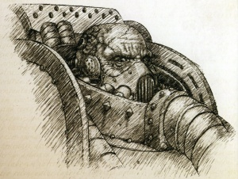
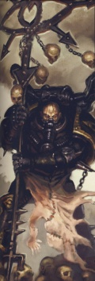
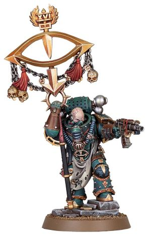

# 0700 马洛赫斯特 Maloghurst

精校状态：中文行文已逐段精校，部分术语仍为暂定

分类：人类帝国 / 荷鲁斯之子

原文来源：https://www.bilibili.com/opus/1206575717869944904

原作者：帝国神选罐头

原文时间：2026年05月26日 11:30

[返回分类目录](目录.md) · [全书目录](../../目录.md)

<!-- A0700-B0001 -->
**英文原文**

Maloghurst, also known as Maloghurst the Twisted, was a Space Marine of the Luna Wolves Legion. He was the Equerry to his Primarch Horus Lupercal.

<!-- /A0700-B0001 -->

<!-- A0700-B0002 -->

原译文

马洛赫斯特，也被称为扭曲者马洛赫斯特，是影月苍狼军团的星际战士。他是他的原体荷鲁斯·卢佩卡尔的侍从官。

**校订译文**

马洛赫斯特，亦称“扭曲者马洛赫斯特”，是影月苍狼军团的星际战士，也是原体荷鲁斯·卢佩卡尔的侍从官。

<!-- /A0700-B0002 -->

<!-- A0700-B0003 图片 -->

<!-- A0700-B0004 -->

原译文

Maloghurst after his injuries on 63-19 马洛赫斯特在63-19受伤后

**校订译文**

Maloghurst after his injuries on 63-19 马洛赫斯特在63-19受伤后

<!-- /A0700-B0004 -->

<!-- A0700-B0005 -->
## Biography 传记

<!-- /A0700-B0005 -->

<!-- A0700-B0006 -->
**英文原文**

Maloghurst grew up in the tunnels of Cthonia as a gang leader. Unlike most gang leaders, who simply pursued petty goals, Maloghurst sought to turn himself into a king. At some point he was grievously wounded by a rival ganger, but was saved by Iacton Qruze and subsequently inducted as a Space Marine. Maloghurst went on to have a long history within the original Luna Wolves and became fiercely loyal to Horus, who he viewed as something greater than himself which he had always strived towards. He nearly lost an eye capturing the young Kalus Ekaddon so he could be inducted as a Space Marine. Known as "the Twisted" for the complex workings of his mind, Maloghurst was Horus's chief adviser and public voice, and a shrewd manipulator. He was also a formidable warrior, and was a speculated contender for the First Captaincy (the post held by Ezekyle Abaddon) when Horus made him his equerry.

<!-- /A0700-B0006 -->

<!-- A0700-B0007 -->

原译文

马洛赫斯特在科索尼亚的地道里长大，是一名帮派头目。与大多数只追求小目标的帮派头目不同，马洛赫斯特试图把自己变成王。在某个时刻，他被对手帮派成员严重打伤，但被亚克顿·克鲁兹救下，随后被征召为星际战士。马洛赫斯特在最初的影月苍狼中有着很长的历史，并对荷鲁斯非常忠诚，他认为荷鲁斯比他自己更伟大，他一直在努力。他几乎失去了一只眼睛来俘获年轻的卡卢斯·埃卡顿，这样他就可以成为一名星际战士。马洛赫斯特因其复杂的思维运作而被称为“扭曲者”，他是荷鲁斯的首席顾问和公开发言人，也是一个精明的操纵者。他也是一位强大的战士，当荷鲁斯任命他为侍从官时，他被推测为第一连长（以泽凯尔·阿巴顿担任的职位）的竞争者。

**校订译文**

马洛赫斯特在克苏尼亚的地道中长大，成为一名帮派头目。其他首领大多只追逐眼前小利，他却想让自己成为君王。后来，他被敌对帮派成员重创，幸得亚克顿·克鲁兹相救，随后被选为星际战士。他在最初的影月苍狼军团中服役多年，对荷鲁斯忠心耿耿，认为原体代表着比自己更伟大的存在，正是他始终向往的目标。他曾为捕获年轻的卡鲁斯·埃卡顿、将其带回接受星际战士改造而险些失去一只眼睛。因心思复杂迂回，马洛赫斯特得名“扭曲者”。他既是荷鲁斯的首席顾问与公开代言人，也是精于操纵人心的谋士。他同样是一位强悍的战士；在荷鲁斯任命他为侍从官时，人们认为他本有希望竞争第一连长之位，而这一职位由以泽凯尔·阿巴顿担任。

**校注：** 修正指代：捕获埃卡顿是为让埃卡顿接受改造，并非马洛赫斯特此时才成为星际战士。

<!-- /A0700-B0007 -->

<!-- A0700-B0008 -->
**英文原文**

During the Battle of Sixty-Three-Nineteen, Maloghurst was dispatched to the surface to parley with the "Emperor of Mankind", the impostor leader of the planet, but his Stormbird was shot down and he was seriously wounded in the crash. He was recovered from the surface, and the remembrancer Euphrati Keeler's pict-records of the rescue spread through the 63rd Expedition, making Maloghurst into a war hero. His body was badly mangled by the events (thus truly making him "twisted"), but he remained willing - and quite able - to serve his Warmaster. He also boldly stated that he was aware of his nickname among the rest of the Legion and had no wish to abandon it: his mind was as deft as ever, and if his body was now twisted to fit it, then so be it.

<!-- /A0700-B0008 -->

<!-- A0700-B0009 -->

原译文

在63-19之战中，马洛赫斯特被派往地面与行星的冒名顶替领袖“人类皇帝”谈判，但他的风暴鸟被击坠，在坠机中受了重伤。他从地表上被救起，记述者幼发拉底·基勒关于救援的照片记录在第63远征军中传播开来，使马洛赫斯特成为战争英雄。他的身体因这些事件而严重受损（因此确实让他“扭曲”了），但他仍然愿意 — 而且完全有能力 — 为他的战帅服务。他还大胆地表示，他知道自己在军团其他成员中的绰号，不想放弃：他的头脑和以前一样灵活，如果他的身体现在被扭曲以适应它，那就这样吧。

**校订译文**

六十三—十九之战期间，马洛赫斯特奉命前往地表，与自称“人类帝皇”的当地统治者谈判。他乘坐的风暴鸟却被击落，使他在坠机中身负重伤。获救后，记述者尤弗拉蒂·琪乐拍下的救援影像传遍第63远征军，使他成了战争英雄。这场事故使他的身体严重残损，名副其实地变得“扭曲”，但他依旧愿意，也完全有能力继续为战帅效力。他还坦然表示，自己知道军团同袍私下给他起的绰号，并不打算舍弃：他的头脑一如既往地灵活，如果身体如今也扭曲得与心思相称，那就由它去吧。

<!-- /A0700-B0009 -->

<!-- A0700-B0010 -->
**英文原文**

His role in the Heresy itself was as Horus' chief enforcer, ensuring that the Warmaster's orders were carried out. To this end, early on he employed the services of the mute assassin Maggard after he was freed from service to his overbearing remembrancer mistress Petronella Vivar. Shortly before Horus initiated his rebellion against the Emperor, Maloghurst became suspicious of Garviel Loken's loyalties and placed a Warp-eye spying ritual on the remembrancer Mersadie Oliton before erasing her memory of it. Unknown to Maloghurst, years later the warp-eye was used by Samus to manifest in the bowels of the Phalanx during the Solar War. During the Battle of Isstvan III he directed Calas Typhon of the Death Guard to stop the fleeing frigate Eisenstein before it could escape and warn the Emperor of Horus' treachery. He later again appeared advising Horus in the Battle of Molech.

<!-- /A0700-B0010 -->

<!-- A0700-B0011 -->

原译文

他在叛乱中的角色是荷鲁斯的首席执行者，确保战帅的命令得到执行。为此，在他从服务中解放出来后，他很早就雇佣了沉默刺客马加德，为他专横的女记述者佩特罗尼拉·维瓦尔服务。在荷鲁斯开始对抗帝皇之前不久，马洛赫斯特开始怀疑加维尔·洛肯的忠诚，并在记述者梅萨迪·奥利顿身上进行了亚空间之眼间谍仪式，然后抹去了她的记忆。马洛格赫斯特不知道，几年后，在太阳战争期间，萨姆斯使用亚空间之眼在山阵号内部显现。在伊斯塔万三号之战中，他指示死亡守卫的卡拉斯·提丰在逃跑的护卫舰爱森斯坦号逃跑并警告帝皇荷鲁斯的背叛之前阻止它。后来，他再次出现在摩洛之战中为荷鲁斯提供建议。

**校订译文**

荷鲁斯之乱期间，马洛赫斯特充当荷鲁斯的首席执行者，确保战帅的命令落实。为此，他很早便雇用了哑巴刺客马加德——后者此时已不再侍奉专横的记述者女主人佩特罗尼拉·维瓦尔。荷鲁斯公开反叛帝皇前不久，马洛赫斯特开始怀疑加维尔·洛肯的忠诚，便通过仪式在记述者梅萨迪·奥莱顿身上布下用于窥视的“亚空间之眼”，随后抹去她对此事的记忆。他并不知道，数年后，萨姆斯会在太阳系战争期间借这只眼于山阵号深处显形。伊斯塔万三号之战中，他命令死亡守卫的卡拉斯·提丰拦截逃走的护卫舰爱森斯坦号，阻止该舰逃脱、向帝皇报告荷鲁斯的背叛。后来，他又在摩洛之战中为荷鲁斯出谋划策。

**校注：** 解除与女记述者主从关系的是马加德；原译把马洛赫斯特、马加德和女主人之间的关系颠倒。

<!-- /A0700-B0011 -->

<!-- A0700-B0012 图片 -->

<!-- A0700-B0013 -->

原译文

Maloghurst the Twisted 扭曲者马洛赫斯特

**校订译文**

Maloghurst the Twisted 扭曲者马洛赫斯特

<!-- /A0700-B0013 -->

<!-- A0700-B0014 -->
**英文原文**

Studying the powers of Chaos from Erebus, Maloghurst became quite adept in the occult and Daemonancy as the Heresy ground on. Serghar Targost began to suspect that he had grown more powerful and was now feigning his injuries. Shortly before the Battle of Molech, Maloghurst performed a ritual where he violently sacrificed captured Humans to the Ruinous Powers and summoned Tormageddon. Maloghurst intended this Daemonhost to be the first in his army of Possessed: the Luperci

<!-- /A0700-B0014 -->

<!-- A0700-B0015 -->

原译文

马洛赫斯特从艾瑞巴斯学习了混沌之力，随着叛乱的壮大，他变得非常擅长神秘学和恶魔学。塞加尔·塔戈斯特开始怀疑自己变得更加强大，现在假装受伤了。摩洛之战前不久，马洛赫斯特举行了一场仪式，他将被俘的人类暴力献祭给毁灭之力，并召见了托玛吉顿。马洛赫斯特打算让这名恶魔宿主成为他的附魔者军队：狼之兄弟中的第一人。

**校订译文**

马洛赫斯特向艾瑞巴斯学习混沌之力，随着荷鲁斯之乱持续，逐渐精通神秘学与恶魔术。瑟加尔·塔戈斯特开始怀疑，马洛赫斯特实际上已变得更强，只是在假装仍然伤残。摩洛之战前不久，马洛赫斯特残忍地将被俘人类献祭给毁灭诸力，召来托玛格顿。他打算以这个恶魔宿主为起点，建立一支名为“狼之兄弟”的附魔战士军队。

**校注：** 塔戈斯特怀疑伤势作伪的对象为马洛赫斯特，非怀疑自己。Tormageddon 沿全书托玛格顿，区别 Tarik Torgaddon。

<!-- /A0700-B0015 -->

<!-- A0700-B0016 -->
**英文原文**

Following the wounding of Horus in the Battle of Trisolian, Horus fell into a deep coma as the Chaos Gods fought over the fragment of his soul that remained inside the gate of Molech. Maloghurst became desperate to revive the Warmaster as the Sons of Horus and general traitor war effort tore itself apart without his guidance. Maloghurst eventually agreed to the aid of Lorgar and Zardu Layak, working with Sota-Nul to gain access to Horus' comatose body upon his throne in Lupercal's Court without the permission of the reluctant Falkus Kibre. Using a Warp blood ritual that involved slitting his own throat and bargaining his very soul, Maloghurst entered the Warp and bound the Daemon Amarok to his will. Using Amarok as a guide, Maloghurst was led to the fragment of Horus' soul still inside the Warp. Maloghurst met Horus on a battlefield where the Warmaster was battling enemies across space and time. Horus refused to leave, and before Maloghurst could converse further he was woken up by Justaerin and dragged before Horus Aximand. A Warp-Surge had dropped the fleet prematurely from the Warp in front of the Fortress World of Heta-Gladius, and Aximand intended to waste their forces in a useless struggle for the planet. Maloghurst was jailed inside a prison-maze that constantly moved to disorient any trapped within. Robbed of his warp powers by a restraining collar, he could do nothing but wander the corridors.

<!-- /A0700-B0016 -->

<!-- A0700-B0017 -->

原译文

在特里索兰之战中荷鲁斯受伤后，荷鲁斯陷入了深度昏迷，因为混沌诸神正在争夺他留在摩洛之门内的灵魂碎片。当荷鲁斯之子和一般叛徒的战争努力在没有他的引导下分崩离析时，马洛赫斯特绝望地想要复苏战帅。马洛赫斯特最终同意了珞珈和扎度·拉亚克的帮助，与索塔-努尔合作，在没有不情愿的法库斯·凯博许可的情况下，在卢佩卡尔王庭的王座上获得了荷鲁斯昏迷的身体。马洛赫斯特使用了一种亚空间血液仪式，包括割断自己的喉咙和讨价还价他的灵魂，他进入了亚空间，并将恶魔阿马洛克束缚在他的意志之下。在阿马洛克的指引下，马洛赫斯特找到了仍在亚空间中的荷鲁斯灵魂碎片。马洛赫斯特在战帅穿越时空与敌人作战的战场上遇到了荷鲁斯。荷鲁斯拒绝离开，马洛赫斯特还没来得及进一步交谈，他就被加斯塔林唤醒，被拖到荷鲁斯·阿西曼德面前。一场亚空间浪涌使舰队过早地从赫塔-格拉迪乌斯要塞世界前的亚空间中撤退，阿西曼德打算在一场无用的行星斗争中浪费他们的部队。马洛赫斯特被关在一个监狱迷宫里，这个迷宫不断移动，让任何被困其中的人迷失方向。他的亚空间力量被一个约束项圈剥夺了，他只能在走廊里闲逛。

**校订译文**

荷鲁斯在特里索兰之战受伤后，混沌诸神争夺其留在摩洛之门内的灵魂碎片，使他陷入深度昏迷。失去战帅的引领，荷鲁斯之子乃至整个叛军的战争行动都开始分崩离析，马洛赫斯特急于将他唤醒。他最终接受珞珈与扎杜·拉亚克的帮助，与索塔·努尔合作，绕过不肯配合的法库斯·凯博，接近了昏迷在卢佩卡尔王庭王座上的荷鲁斯。他施行亚空间鲜血仪式，割开自己的喉咙，以灵魂为交易筹码，进入亚空间，将恶魔阿玛罗克束缚于自己的意志之下。在恶魔引路后，他找到了仍困在亚空间中的荷鲁斯灵魂碎片。战帅身处一片战场，与来自各个时空的敌人交战，不肯离去。马洛赫斯特还未及继续劝说，便被加斯塔林战士唤醒，拖到荷鲁斯·阿西曼德面前。一次亚空间浪涌使舰队提前脱离亚空间，出现在要塞世界赫塔-格拉迪厄斯前；阿西曼德却打算为争夺这颗星球徒然消耗兵力。马洛赫斯特被关进不断变换结构、使囚犯迷失方向的迷宫监狱。他的亚空间力量被限制项圈封住，只能在走廊间徘徊。

**校注：** access to the body 指得以接近昏迷者，不是取得或搬走身体；舰队是被迫提前脱离亚空间，不是从要塞世界前撤退。

<!-- /A0700-B0017 -->

<!-- A0700-B0018 -->
**英文原文**

Maloghurst was eventually broken out of the jail by Kalus Ekaddon, who helped him to reach Horus' throneroom. Along the way, they were forced to battle both Sons of Horus and Blood Angels from Heta-Gladius which had boarded the Vengeful Spirit. Before Horus, Maloghurst conducted the ritual and again found himself before Horus' fragmented soul, this time at Ullanor before the Triumph. He urged Horus to submit before the Gods and free his soul, saying it was too late to turn back now. Proclaiming that Horus could never be a slave as he chose this path, Maloghurst pulled out a knife and stabbed the wound at Horus' side. Maloghurst sacrificed himself to free the fragment of Horus' soul trapped in the Warp, and the Warmaster woke up and resumed control of the Legion in time for the Siege of Terra. Argonis became Horus' new equerry after Maloghurst's death.

<!-- /A0700-B0018 -->

<!-- A0700-B0019 -->

原译文

马洛赫斯特最终被卡卢斯·埃卡顿从监狱中救出，他帮助他到达了荷鲁斯的王座厅。一路上，他们被迫与荷鲁斯之子和赫塔-格拉迪乌斯的圣血天使作战，后者跳帮了复仇之魂号。在荷鲁斯身前，马洛赫斯特进行了仪式，再次发现自己在荷鲁斯支离破碎的灵魂之前，这次是在大捷之前的乌兰诺。他敦促荷鲁斯在众神面前屈服，释放自己的灵魂，说现在回头已经太晚了。马洛赫斯特宣称，当他选择这条路时，荷鲁斯永远不会成为奴隶，他拔出一把刀，刺伤了荷鲁斯身侧的伤口。马洛赫斯特牺牲了自己，以释放被困在亚空间中的荷鲁斯灵魂碎片，战帅醒了过来，及时恢复了对军团的控制，准备泰拉围城。马洛赫斯特死后，阿尔戈尼斯成为荷鲁斯的新侍从官。

**校订译文**

卡鲁斯·埃卡顿最终将马洛赫斯特救出监狱，护送他前往荷鲁斯的王座厅。途中，他们被迫同时对付荷鲁斯之子，以及从赫塔-格拉迪厄斯登上复仇之魂号的圣血天使。来到战帅面前后，马洛赫斯特再次举行仪式，见到了荷鲁斯的灵魂碎片。这一次，地点是凯旋庆典前的乌兰诺。他劝荷鲁斯向诸神低头，释放自己的灵魂，并指出此时已无法回头。他又辩称，这条道路既然由荷鲁斯自己选择，荷鲁斯就绝不算奴隶，随即拔刀刺入战帅侧腹的伤口。马洛赫斯特以自己的生命为代价，释放了困在亚空间中的灵魂碎片。战帅苏醒，及时重新接掌军团，准备进攻泰拉。马洛赫斯特死后，阿尔戈尼斯继任侍从官。

<!-- /A0700-B0019 -->

<!-- A0700-B0020 图片 -->

<!-- A0700-B0021 -->

原译文

Maloghurst 马洛赫斯特

**校订译文**

Maloghurst 马洛赫斯特

<!-- /A0700-B0021 -->

本篇核心术语与暂定项

以下列出本篇出现的英文原形及核心术语表用词。同形词可能指不同对象，具体词义以本篇正文和校注为准；单复数、别名和仅见于图注的名称可能尚未列入。完整候选见[术语表](../../术语表/双语术语候选.csv)。

| 英文 | 采用中文 | 状态 |
| --- | --- | --- |
| Blood Angels | 圣血天使 | 官方已核对 |
| Death Guard | 死亡守卫 | 官方已核对 |
| Warp | 亚空间 | 官方已核对 |
| History | 历史 | 编辑用语已统一 |
| Phalanx | 山阵号 | 暂定 |
| Emperor of Mankind | 人类帝皇 | 暂定 |
| Emperor | 帝皇 | 官方已核对 |
| Primarch | 原体 | 官方已核对 |
| Terra | 泰拉 | 暂定·官方待核 |
| Luna Wolves | 影月苍狼 | 暂定·官方待核 |
| Horus | 荷鲁斯 | 暂定·官方待核 |
| Erebus | 艾瑞巴斯 | 暂定·官方待核 |
| Garviel Loken | 加维尔·洛肯 | 暂定·官方待核 |
| Vengeful Spirit | 复仇之魂号 | 暂定·官方待核 |
| Sons of Horus | 荷鲁斯之子 | 暂定·官方待核 |
| Isstvan III | 伊斯塔万三号 | 暂定·官方待核 |
| Sixty-Three-Nineteen | 六十三—十九 | 暂定·官方待核 |
| Luna | 月球 | 暂定·官方待核 |
| Molech | 摩洛 | 暂定·官方待核 |
| Cthonia | 科索尼亚 | 暂定·官方待核 |
| Crash | 崩溃 | 暂定·官方待核 |
| Euphrati Keeler | 尤弗拉蒂·琪乐 | 暂定 |
| Adept | 帝国任职者（广义）／文吏（行政语境） | 语境定译·官方待核 |
| Horus Lupercal | 荷鲁斯·卢佩卡尔 | 暂定·官方待核 |
| Lupercal | 卢佩卡尔 | 暂定·官方待核 |
| Justaerin | 加斯塔林 | 暂定·官方待核 |
| Luperci | 狼之兄弟 | 暂定·官方待核 |
| Falkus Kibre | 法库斯·凯博 | 暂定·官方待核 |
| Kalus Ekaddon | 卡鲁斯·埃卡顿 | 暂定·官方待核 |
| Horus Aximand | 荷鲁斯·阿西曼德 | 暂定·官方待核 |
| Maloghurst | 马洛赫斯特 | 暂定·官方待核 |
| Iacton Qruze | 亚克顿·克鲁兹 | 暂定·官方待核 |
| Ullanor | 乌兰诺 | 暂定·官方待核 |
| The Phalanx | 山阵号 | 暂定·官方待核 |
| Isstvan | 伊斯塔万 | 暂定·官方待核 |
| Calas Typhon | 卡拉斯·提丰 | 暂定·官方待核 |
| Ezekyle Abaddon | 以泽凯尔·阿巴顿 | 暂定·官方待核 |
| Zardu Layak | 扎度·拉亚克 | 暂定·官方待核 |
| Space Marine | 星际战士 | 暂定·官方待核 |
| Stormbird | 风暴鸟 | 暂定·官方待核 |
| Equerry | 近侍 | 暂定·官方待核 |
| Serghar Targost | 瑟加尔·塔戈斯特 | 暂定·官方待核 |
| Lorgar | 珞珈 | 暂定·官方待核 |
| Powers | 能天使 | 暂定·官方待核 |
| Ruinous Powers | 毁灭诸力 | 暂定·官方待核 |
| Mersadie Oliton | 梅萨迪·奥莱顿 | 暂定·官方待核 |
| Daemonancy | 唤魔术 | 暂定·官方待核 |
| Targost | 塔戈斯特 | 暂定·官方待核 |
| Sota-Nul | 索塔·努尔 | 暂定·官方待核 |
| Argonis | 阿尔戈尼斯 | 暂定·官方待核 |
| Amarok | 阿玛罗克 | 暂定·官方待核 |
| Tormageddon | 托玛格顿 | 暂定·官方待核 |
| Trisolian | 特里索兰 | 暂定·官方待核 |
| Fortress World | 堡垒世界 | 暂定·官方待核 |
| Battle of Trisolian | 特里索兰之战 | 暂定·官方待核 |
| Heta-Gladius | 赫塔-格拉迪厄斯 | 暂定·官方待核 |
| Eisenstein | 艾森斯坦号 | 暂定·官方待核 |
| Lupercal's Court | 卢佩卡尔王庭 | 暂定·官方待核 |

