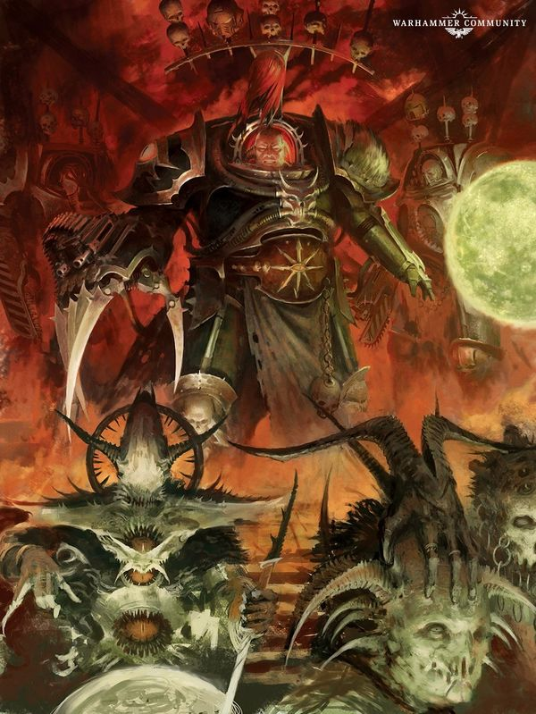
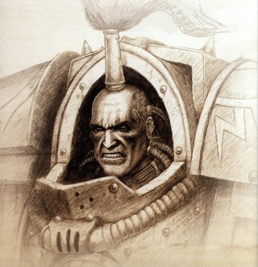
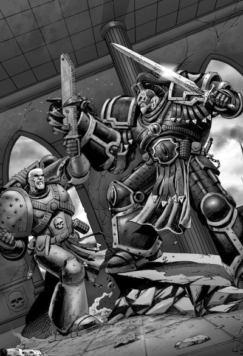
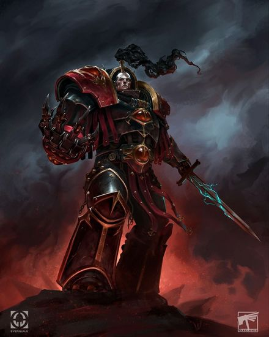
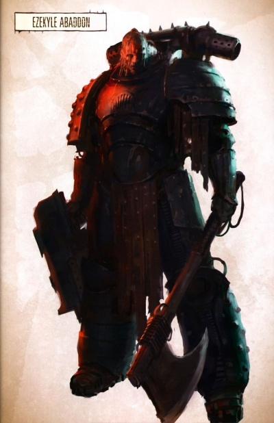
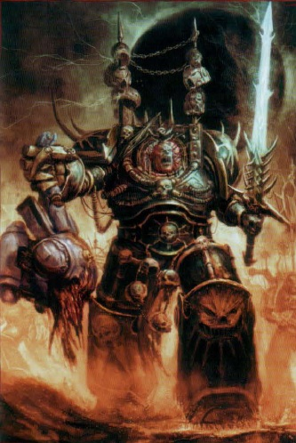
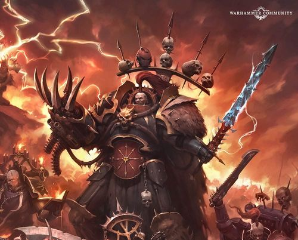
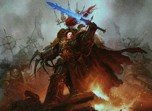
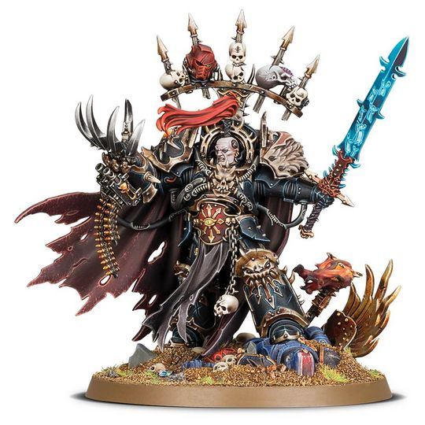

# 0701 以泽凯尔·阿巴顿 Ezekyle Abaddon

精校状态：中文行文已逐段精校，部分术语仍为暂定

分类：人类帝国 / 荷鲁斯之子

原文来源：https://www.bilibili.com/opus/1061864362575134744

原作者：帝国神选罐头

原文时间：2025年05月01日 12:16

[返回分类目录](目录.md) · [全书目录](../../目录.md)

<!-- A0701-B0001 -->
**英文原文**

I am the Arch-fiend, the Despoiler of Worlds, and by my hands shall the false Emperor fall.

<!-- /A0701-B0001 -->

<!-- A0701-B0002 -->

原译文

我即大魔，世界的掠夺者，伪帝将被我之手打倒。

**校订译文**

我乃万恶之首、诸世界的掠夺者；伪帝必将倒在我手中。

<!-- /A0701-B0002 -->

<!-- A0701-B0003 -->
**英文原文**

Ezekyle Abaddon, more commonly known as Abaddon the Despoiler, is the Warmaster of Chaos, the former First Captain of the Sons of Horus Legion and now absolute Master of the Black Legion, and rumoured to be the clone-progeny of Warmaster Horus. He is the most powerful Warmaster of all, successor to Horus, and blessed by all four of the Gods of Chaos. Despite being the Warmaster of Chaos, Abaddon has refused giving himself fully over to the Ruinous Powers as the Daemon Primarchs have, as this would limit his existence beyond the Eye of Terror and push his ultimate vengeance against the Imperium beyond his grasp.

<!-- /A0701-B0003 -->

<!-- A0701-B0004 -->

原译文

以泽凯尔·阿巴顿，更为人所知的是掠夺者阿巴顿，是混沌战帅，荷鲁斯之子军团的前第一连长，现在是黑色军团的绝对之主，据传是战帅荷鲁斯的克隆子嗣。他是最强大的战帅，是荷鲁斯的继承者，受到混沌四神的祝福。尽管阿巴顿是混沌战帅，但他拒绝像恶魔原体那样完全屈服于毁灭力量，因为这将限制他在恐惧之眼之外的存在，并使他对帝国的最终复仇超出他的掌控。

**校订译文**

以泽凯尔·阿巴顿更广为人知的称号是“掠夺者阿巴顿”。他是混沌战帅、荷鲁斯之子军团的前任第一连长，如今则是黑色军团至高无上的统治者。传闻他是战帅荷鲁斯的克隆后裔。作为荷鲁斯的继承者，他得到混沌四神共同赐福，是所有战帅中最强大的一位。尽管身为混沌战帅，他仍拒绝像恶魔原体那样彻底投身毁灭诸力：那会限制他在恐惧之眼外活动的能力，使他向帝国完成最终复仇的目标变得遥不可及。

<!-- /A0701-B0004 -->

<!-- A0701-B0005 图片 -->

<!-- A0701-B0006 -->

原译文

Abaddon, Warmaster of Chaos 阿巴顿，混沌战帅

**校订译文**

Abaddon, Warmaster of Chaos 阿巴顿，混沌战帅

<!-- /A0701-B0006 -->

<!-- A0701-B0007 -->
## Biography 传记

<!-- /A0701-B0007 -->

<!-- A0701-B0008 -->
### Pre-Heresy 叛乱前

<!-- /A0701-B0008 -->

<!-- A0701-B0009 -->
**英文原文**

Abaddon was the firstborn son of Tarkeraddon, one of the most mighty of Cthonia’s gang warlords. As he reached adulthood, his father expected him to complete a Cthonian coming of age ritual that involved executing his closest comrades. Abaddon refused and expressed his disdain for kingship, instead slaying his father and his bodyguards. Though he lived in exile after that point, his massive build and natural ferocity saw him grow to be a legend amongst his people. Before long the vicious young warrior came to the attention of the Luna Wolves. Saved from death after a ambush from a rival gang, Abaddon was confronted by Hastur Sejanus and Syrakul. Abaddon expressed that he never had any desire to be a king, and was subsequently accepted into the Luna Wolves and converted into a Space Marine on Luna. After his completion as an Astartes, he was confronted by Horus and pledged service, being given a coin by the Primarch.

<!-- /A0701-B0009 -->

<!-- A0701-B0010 -->

原译文

阿巴顿是塔克拉顿的长子，塔克拉顿是科索尼亚最强大的帮派军阀之一。当他成年时，他的父亲希望他完成一个科索尼亚的成年仪式，其中包括处决他最亲密的战友。阿巴顿拒绝了，并表达了他对王权的蔑视，而是杀死了他的父亲和护卫。尽管在那之后他流亡在外，但他巨大的体格和天生的凶猛使他成为了人民中的传奇。不久，这个恶毒的年轻战士引起了影月苍狼的注意。阿巴顿在遭到敌对帮派伏击后幸免于难，与哈斯塔·赛詹努斯和西拉库尔对峙。阿巴顿表示，他从未有过成为王的愿望，随后被接纳为影月苍狼，并在月球上成为一名星际战士。在他成为一名阿斯塔特后，他遇到了荷鲁斯，并承诺服役，被原体赠予一枚硬币。

**校订译文**

阿巴顿是科索尼亚最强大的帮派军阀之一塔克拉顿的长子。成年时，父亲要求他完成科索尼亚的成人仪式，处决最亲密的同伴。阿巴顿拒绝照办，蔑视称王的道路，反而杀死了父亲和他的护卫。此后他流亡在外，魁梧的体格与天生的凶猛却使他成为当地的传奇。不久，影月苍狼注意到了这个凶悍的年轻战士。他遭敌对帮派伏击、获救脱险后，见到了哈斯塔·赛詹努斯和西拉库尔。阿巴顿表示自己从来无意称王，随后获准加入影月苍狼，并在月球上接受改造，成为星际战士。改造完成后，他面见荷鲁斯，宣誓效忠，并获原体赠予一枚硬币。

<!-- /A0701-B0010 -->

<!-- A0701-B0011 图片 -->

<!-- A0701-B0012 -->

原译文

Abaddon at the time of the Great Crusade 大远征时期的阿巴顿

**校订译文**

Abaddon at the time of the Great Crusade 大远征时期的阿巴顿

<!-- /A0701-B0012 -->

<!-- A0701-B0013 -->
**英文原文**

During the Great Crusade, Ezekyle Abaddon rose to the prestigious post of First Captain. He loved and worshiped Horus as a father, and it was rumoured that Abaddon was one of the few "Sons of Horus," those Space Marines who were created directly from Horus's geneseed. Extremely proud and quick to anger, Abaddon's martial record was unsurpassed by that of any other Luna Wolf. Bellicose by temperament, Abaddon was usually the most hawkish of the Warmaster's advisors. During the final years of the Crusade, Abaddon disagreed, sometimes violently, with Horus's decision to parley with the Interex, a human civilization that allowed an alien species to co-exist with them.

<!-- /A0701-B0013 -->

<!-- A0701-B0014 -->

原译文

在大远征期间，以泽凯尔·阿巴顿升任著名的第一连长。他像父亲一样爱和崇拜荷鲁斯，有传言说阿巴顿是少数“荷鲁斯之子”之一，这些星际战士是直接从荷鲁斯的基因中创造出来的。阿巴顿非常骄傲，也很容易发怒，他的战斗记录是其他任何影月苍狼都无法比拟的。阿巴顿生性好战，通常是战帅顾问中最鹰派的。在大远征的最后几年，阿巴顿不同意荷鲁斯与允许与外来物种共存的人类文明英特雷斯谈判的决定，有时甚至是激烈的反对。

**校订译文**

大远征期间，以泽凯尔·阿巴顿晋升为地位显赫的第一连长。他将荷鲁斯视为父亲，深爱并崇敬着他。传言称，阿巴顿属于少数被称作“荷鲁斯之子”的战士——据说他们直接以荷鲁斯本人的基因种子创造。阿巴顿极为骄傲，也易于动怒，在影月苍狼中战功无人能及。他生性好战，通常是战帅顾问中最强硬的鹰派。大远征末期，荷鲁斯决定与英特雷斯谈判；这个人类文明容许异形与人类共存，因而遭到阿巴顿反对，有时反对得极为激烈。

**校注：** 此处引号内“Sons of Horus”是据传直接取自原体基因种子的少数战士之称，区别军团改名后的正式名称；保留原文传闻性质，不以此断言其他成员没有同源基因。

<!-- /A0701-B0014 -->

<!-- A0701-B0015 -->
**英文原文**

During the Ullanor Crusade, Abaddon accompanied Horus and a detachment of Terminators from the First Company in a daring strike on the headquarters of the Ork Warboss Urlakk Urg. While the majority of the detachment held the entrance to the Warboss's tower against hordes of greenskins, Horus confronted and slew the Warboss. As the greenskin hordes fled in terror, Horus found every one of the terminators had fallen except for Abaddon, barely alive and buried under a mountain of Ork bodies.

<!-- /A0701-B0015 -->

<!-- A0701-B0016 -->

原译文

在乌兰诺远征期间，阿巴顿陪同荷鲁斯和第一连队的终结者特遣队对欧克战争头目 乌尔拉克·乌尔格的总部进行了大胆的袭击。当大部分特遣队守住了战争头目塔楼的入口，对抗成群的绿皮时，荷鲁斯与战争头目对峙并杀死了战争头目。当绿皮部落惊恐地逃跑时，荷鲁斯发现除了阿巴顿之外，所有的终结者都倒下了，几乎没有幸存者，被埋在一堆欧克尸体下。

**校订译文**

乌兰诺远征期间，阿巴顿随荷鲁斯及第一连的一支终结者分遣队，大胆突袭欧克战争头目乌尔拉克·乌尔格的总部。分遣队的大部分战士守住高塔入口，阻击成群绿皮，荷鲁斯则亲自迎战并杀死战争头目。绿皮大军惊恐溃逃后，荷鲁斯发现所有终结者都已倒下，唯有阿巴顿还奄奄一息地埋在成山的欧克尸体之下。

**校注：** barely alive and buried under a mountain of Ork bodies 的主语是唯一幸存者阿巴顿；原译将其错接为所有终结者。

<!-- /A0701-B0016 -->

<!-- A0701-B0017 -->
**英文原文**

In addition to his position as First Captain, Abaddon was also one of the four members of the Mournival, a special advisory council to the Warmaster, since its inception. He took his position extremely seriously, but did enjoy sharing his sense of humour with his Mournival brothers. Abaddon eventually grew frustrated and angry at the Emperor's supposed abandonment of the Space Marine Legions, feelings which swelled to the surface when Horus lay near to death on Davin. A member of the warrior-lodge within the Sons of Horus, he went along with Erebus's plan to take the Warmaster to the Serpent Lodge for healing, beginning Abaddon's road to damnation.

<!-- /A0701-B0017 -->

<!-- A0701-B0018 -->

原译文

除了担任第一连长外，阿巴顿还是战帅特别顾问议会四王议会的四名成员之一。他非常认真地对待自己的立场，但确实喜欢与他的四王议会的兄弟分享他的幽默感。阿巴顿最终对帝皇所谓的放弃星际战士感到沮丧和愤怒，当荷鲁斯在戴文濒临死亡时，这种情绪浮出水面。作为荷鲁斯之子战士结社的一员，他同意艾瑞巴斯的计划，将战帅带到毒蛇结社进行治疗，开始了阿巴顿的诅咒之路。

**校订译文**

除担任第一连长外，阿巴顿从四王议会成立之初就是其四名成员之一。这个议会是战帅的特别顾问团。他对待职责极其认真，却也喜欢和议会兄弟说笑。阿巴顿逐渐认为帝皇抛弃了星际战士军团，因而愤懑不已；荷鲁斯在戴文濒死时，这种情绪彻底爆发。身为荷鲁斯之子战士结社的成员，他支持艾瑞巴斯将战帅送往蛇之结社救治的计划，由此踏上堕落之路。

<!-- /A0701-B0018 -->

<!-- A0701-B0019 -->
### The Horus Heresy 荷鲁斯之乱

原题：The Horus Heresy 荷鲁斯叛乱

<!-- /A0701-B0019 -->

<!-- A0701-B0020 -->
### Betrayal 背叛

<!-- /A0701-B0020 -->

<!-- A0701-B0021 -->
**英文原文**

After Horus's recovery, Abaddon grew ever more protective of his Primarch and his Legion's reputation, to the point where he saw remembrancer criticism and Imperial investigation into Legion activities as threats and insults that could not be borne. He therefore sanctioned the murder of Ignace Karkasy and the blaming of Legion-caused civilian casualties upon Garviel Loken. This course of action was frustrated by the refusal of Tarik Torgaddon to accede to the plan, and the Mournival brotherhood was effectively broken as a result.

<!-- /A0701-B0021 -->

<!-- A0701-B0022 -->

原译文

荷鲁斯康复后，阿巴顿越来越维护他的原体和军团的声誉，以至于他认为纪念批评和帝国对军团行动的调查是无法忍受的威胁和侮辱。因此，他批准了对伊格尼斯·卡尔卡斯的谋杀，并将退军团造成的平民伤亡归咎于加维尔·洛肯。塔里克·托加顿拒绝加入该计划，这一行动方针受挫，四王议会的兄弟情谊因此被有效地打破。

**校订译文**

荷鲁斯康复后，阿巴顿愈发维护原体和军团的声誉，甚至将记述者的批评、帝国对军团行动的调查，都视为无法容忍的威胁与侮辱。于是，他批准谋杀伊格尼斯·卡尔卡斯，并策划把军团造成的平民伤亡嫁祸给加维尔·洛肯。塔里克·托加顿拒绝配合，使这一计划受阻，四王议会的兄弟情谊也随之破裂。

**校注：** remembrancer criticism 指记述者的批评，原译“纪念批评”误拆职业名称；删去无依据的“退军团”。

<!-- /A0701-B0022 -->

<!-- A0701-B0023 图片 -->

<!-- A0701-B0024 -->

原译文

Abaddon battles Garviel Loken during the Battle of Isstvan III 阿巴顿在伊斯塔万三号之战期间与加维尔·洛肯战斗

**校订译文**

Abaddon battles Garviel Loken during the Battle of Isstvan III 阿巴顿在伊斯塔万三号之战期间与加维尔·洛肯战斗

<!-- /A0701-B0024 -->

<!-- A0701-B0025 -->
**英文原文**

Abaddon's thinking would prove to be in tune with that of his commander, who would eventually order not only the death of Karkasy but also that of Loken. Seemingly destined to be in lockstep with the Warmaster, when Horus came to the warrior-lodge of his Legion to sway them into following him onto what would prove to be the path of heresy, Abaddon was amongst the first to swear his unquestioning loyalty.

<!-- /A0701-B0025 -->

<!-- A0701-B0026 -->

原译文

阿巴顿的想法将被证明与他的指挥官的想法是一致的，他最终不仅下令杀死卡尔卡斯，还下令杀死洛肯。似乎注定要与战帅步调一致，当荷鲁斯来到他的军团的战士结社，说服他们跟随他走上叛乱之路时，阿巴顿是第一个宣誓绝对忠诚的人之一。

**校订译文**

事实证明，阿巴顿与统帅的想法一致：荷鲁斯最终不仅下令杀死卡尔卡斯，也下令杀死洛肯。阿巴顿仿佛注定与战帅步调一致；当荷鲁斯来到军团的战士结社，说服众人追随自己走上后来被视为异端的道路时，阿巴顿最早宣誓绝对效忠。

<!-- /A0701-B0026 -->

<!-- A0701-B0027 -->
**英文原文**

Abaddon was present at several of the major actions of the Horus Heresy. During the purging of the loyalist Legionaries at Isstvan III, Abaddon notably took to the field to attend the final meeting of what had once been the Mournival, at which he dueled with Garviel Loken. Though slightly wounded in the combat, Abaddon emerged the victor. Abaddon again dueled Loken on the Vengeful Spirit in the aftermath of the Battle of Molech after the Knights-Errant attempted to assassinate Horus. During the Battle of Trisolian Abaddon relished the massacre of his former comrade Bror Tyrfingr and expressed shock when Horus, cleansed of some corruption by the Spear of Russ, expressed regret for how much blood had been spilled in his war. Subsequently, Abaddon was charged with hunting down and finish off the Wolves at the Battle of Yarant. However the Wolves ultimately escaped thanks to the aid of Corax, and Abaddon returned to Horus' side during the muster at Ullanor. During the subsequent Solar War, Abaddon was given the important duty of capturing Luna from loyalist forces. Commanding a fleet of Sons of Horus, Word Bearers under Zardu Layak, and Thousand Sons under Ahzek Ahriman, Abaddon's forces initially clashed with the White Scars fleet under Jubal Khan. During the boarding of the White Scars Battleship Lance of Heaven alongside Layak, Abaddon dueled and slew Jubal. He next directed the Battle Barge War Oath in a kamikaze attack on the defensive ring around Luna, devastating the loyalist defenses as he teleported onto the moons surface with his Justaerin elite. During the fighting inside Luna's gene-labs, he convinced the Selenar Matriarch Heliosa-78 to join Horus instead of following through with Rogal Dorn's orders to destroy her precious gene-tech in order to prevent it from falling into traitor hands.

<!-- /A0701-B0027 -->

<!-- A0701-B0028 -->

原译文

阿巴顿出席了荷鲁斯异端的几次重大行动。在伊斯塔万三号对忠诚的军团士兵进行清洗期间，阿巴顿特别前往战场参加了曾经是四王议会的最后一次会议，在会议上他与加维尔·洛肯决斗。尽管在战斗中受了轻伤，阿巴顿还是取得了胜利。在摩洛之战结束后，阿巴顿再次与洛肯在复仇之魂号上决斗，此前游侠骑士试图暗杀荷鲁斯。在特里索兰战役中，阿巴顿享受着对前战友布罗尔·提尔芬格的残杀，并对被鲁斯之矛清除了一些腐化的荷鲁斯对战争中洒下的鲜血表示遗憾时表示震惊。随后，阿巴顿被下令在雅兰特之战中追捕并消灭野狼。然而，在科拉克斯的帮助下，野狼最终逃脱了，阿巴顿在乌兰诺集结时回到了荷鲁斯身边。在随后的太阳战争中，阿巴顿被赋予了从忠诚者手中夺取月球的重要职责。阿巴顿的部队指挥着一支由荷鲁斯之子、扎杜·拉亚克率领的怀言者和阿扎克·阿里曼率领的千子组成的舰队，最初与朱巴可汗率领的白色伤疤舰队发生冲突。在与拉亚克并肩登上白色伤疤战舰天堂之枪号时，阿巴顿决斗并杀死了朱巴。接下来，他指挥了战斗驳船战争誓言号，对月球周围的防御圈进行了神风特攻，在他与加斯塔林精英一起传送到月球表面时，摧毁了忠诚者的防御。在月球基因实验室内的战斗中，他说服了赛琳娜教派主母赫丽奥萨-78加入荷鲁斯，而不是执行罗格·多恩的命令，摧毁她珍贵的基因技术，以防止其落入叛徒之手。

**校订译文**

阿巴顿参与了荷鲁斯之乱的数次重大行动。伊斯塔万三号清洗军团忠诚派时，他亲赴战场，参加昔日四王议会成员的最后一次会面，并与加维尔·洛肯决斗。他虽受轻伤，却取得了胜利。摩洛之战后，游侠骑士试图暗杀荷鲁斯，阿巴顿再度在复仇之魂号上与洛肯交手。特里索兰之战中，他乐于屠杀昔日战友布罗尔·蒂尔芬格；而荷鲁斯被鲁斯之矛暂时净化部分腐化后，竟对这场战争流下的鲜血表示悔意，令他震惊。随后，他奉命在雅兰特之战中追击并彻底消灭野狼，但对方最终在科拉克斯帮助下脱身。阿巴顿于乌兰诺集结期间返回荷鲁斯身边。在随后的太阳战争中，他受命从忠诚派手中夺取月球，统率由荷鲁斯之子、扎度·拉亚克麾下怀言者及阿扎克·阿里曼麾下千子组成的舰队，首先迎战朱巴可汗指挥的白疤舰队。他与拉亚克共同登上白疤战列舰天堂之枪号，并在决斗中杀死朱巴。接着，他命令战斗驳船战争誓言号撞向环绕月球的防御带，发动自杀式攻击，重创忠诚派防线；他本人则与加斯塔林精锐一同传送至月面。在月球基因实验室内的战斗中，他说服赛琳娜基因教派主母赫丽奥萨-78 归顺荷鲁斯，使她放弃执行罗格·多恩的命令——销毁珍贵的基因技术，以免落入叛军之手。

<!-- /A0701-B0028 -->

<!-- A0701-B0029 -->
### Terra 泰拉

<!-- /A0701-B0029 -->

<!-- A0701-B0030 -->
**英文原文**

Horus was weak. Horus was a fool. He had the whole galaxy within his grasp and he let it slip away.

<!-- /A0701-B0030 -->

<!-- A0701-B0031 -->

原译文

荷鲁斯是虚弱的。荷鲁斯是个蠢货。他掌控着整个银河系，却让它溜走了。

**校订译文**

荷鲁斯软弱无能。荷鲁斯是个蠢货。整个银河都曾握在他手中，他却任其溜走。

<!-- /A0701-B0031 -->

<!-- A0701-B0032 -->
**英文原文**

Abaddon was at Horus' side during the Siege of the Imperial Palace. By this time Horus was literally swelling with the power of the Chaos Gods and spent much of his time comatose inside Lupercal's Court scanning the Warp. By this point Abaddon began to grow openly resentful of his gene-father, viewing him as displaying weakness and becoming a slave to the Chaos Gods. He resisted the urge to kneel before Horus but when in the moments that the Warmaster's old charisma returned so did the First Captains admiration. He blamed much of Horus' state on Zardu Layak, but was forbidden from killing the Dark Apostle. With Horus' increasingly absent from command of the battle, holding the traitor war effort together in the face of the rebellious traitor Primarch's increasingly fell to Abaddon. Abaddon later learned from Layak that Horus' very soul was being consumed by the Chaos Gods as they poured their power into him, and that the Warmaster's remaining time was limited. Abaddon asked what would happen if Horus died before he slew the Emperor, to which Layak replied that the Gods would simply find a new champion.

<!-- /A0701-B0032 -->

<!-- A0701-B0033 -->

原译文

围攻皇宫期间，阿巴顿站在荷鲁斯身边。此时，荷鲁斯已经被混沌诸神的力量所膨胀，大部分时间都在卢佩卡尔王庭里昏迷，查看亚空间。此时，阿巴顿开始公开憎恨他的基因之父，认为他表现出软弱，成为混沌诸神的奴隶。他克制住了在荷鲁斯面前下跪的冲动，但当战帅过去的魅力回来的时候，第一连长的钦佩也回来了。他将荷鲁斯的大部分状况归咎于扎杜·拉亚克，但被禁止杀害这位黑暗使徒。随着荷鲁斯越来越缺席战斗指挥，面对叛逆的叛徒原体越来越多地落入阿巴顿之手，他团结了叛徒的战争努力。阿巴顿后来从拉亚克那里得知，荷鲁斯的灵魂正被混沌诸神吞噬，因为他们向他倾注了力量，而战帅的剩余时间是有限的。阿巴顿问，如果荷鲁斯在杀死帝皇之前死去，会发生什么，拉亚克回答说，诸神只会找到一个新的冠军。

**校订译文**

围攻帝国皇宫期间，阿巴顿陪伴在荷鲁斯身边。此时，混沌诸神的力量已令荷鲁斯的躯体不断膨胀；他大部分时间都在卢佩卡尔王庭中陷入昏沉，神识则游巡亚空间。阿巴顿开始公开怨恨自己的基因之父，认为他软弱无能，已沦为混沌诸神的奴隶。他抗拒向荷鲁斯下跪的冲动，但战帅昔日的魅力偶尔重现时，第一连长的敬仰也会随之恢复。他将荷鲁斯的状况大多归咎于扎度·拉亚克，却被禁止杀死这名黑暗使徒。随着荷鲁斯越来越少亲自指挥战斗，协调那些桀骜不驯的叛军原体、维系叛军整体攻势的重担，便越来越多地落在阿巴顿肩上。后来，拉亚克告诉他，混沌诸神在灌注力量的同时也在吞噬荷鲁斯的灵魂，战帅已时日无多。阿巴顿问，若荷鲁斯还未杀死帝皇就先死去，将会如何；拉亚克答道，诸神只会另选一名勇士。

<!-- /A0701-B0033 -->

<!-- A0701-B0034 图片 -->

<!-- A0701-B0035 -->

原译文

Abaddon during the Heresy 叛乱时期荷鲁斯

**校订译文**

Abaddon during the Heresy 叛乱时期的阿巴顿

**校注：** 英文图注指阿巴顿，原译误写荷鲁斯。

<!-- /A0701-B0035 -->

<!-- A0701-B0036 -->
**英文原文**

In the battle for the Lion's Gate Spaceport Abaddon led 3,000 Sons of Horus in an attack on the complex's highest levels alongside Zardu Layak, Kharn, and Kroeger. During the battle Kharn became stranded behind Imperial lines as Rogal Dorn closed in, and rather than abandon his ally Abaddon led an attack to rescue the World Eater. Needing to protect the future champion of the Gods, Zardu Layak scarified himself to hold off the Primarch and allow Abaddon and Kharn to escape. By this point in the battle, Abaddon had become frustrated with Horus for not taking to the field of battle himself. After the fall of Lion's Gate, Abaddon observed the same flaw in the Saturnine Gate that Perturabo had also discovered. Wishing to end the war as quickly as possible in order to save the quickly-decaying Horus, Abaddon proposed exploiting the breach in Saturnine to end the siege in a matter of weeks as opposed to months. Perturabo was hesitant, thinking Dorn also knew of the flaw and that the attack was a trap. Abaddon convinced Perturabo to allow him to lead the assault, freeing the Lord of Iron from humiliation and his own Legion's blood should it fail. For the operation, Abaddon assembled the whole of the Emperor's Children by convincing Eidolon to the attack the Saturnine walls on the surface while he led the Justaerin, Reaver Attack Squad, 18th Company, and 19th Companies in a subterranean assault. However just as Perturabo suspected, the attack was a trap set by the loyalists and many of the Sons of Horus Dark Mechanicum-provided burrowing vehicles broke down. In the ensuing ambush led by Garviel Loken and Nathaniel Garro, Abaddon managed to slay Bel Sepatus but barely escaped with his life. He vowed to one day kill Perturabo and his Dark Mechanicum allies for allowing the disaster to develop as it had. He also found that he had loved the heat of desperate battle to the point where leaving it made him weep.

<!-- /A0701-B0036 -->

<!-- A0701-B0037 -->

原译文

在争夺狮门太空港的战斗中，阿巴顿率领3000名荷鲁斯之子与扎杜·拉亚克、卡恩和克罗格尔一起袭击了该建筑群的最高层。在战斗中，当罗格·多恩逼近时，卡恩被困在帝国战线后面，阿巴顿不是抛弃他的盟友而是领导了一场营救吞世者的进攻。为了保护未来的诸神冠军，扎杜·拉亚克牺牲了他自己拖延住了原体，让阿巴顿和卡恩逃脱。在战斗的这一点上，阿巴顿对荷鲁斯没有亲自进入战场感到沮丧。狮门陷落后，阿巴顿在土星之门上发现了佩图拉博也发现的同样的缺陷。为了尽快结束战争以拯救迅速衰落的荷鲁斯，阿巴顿提议利用土星之门的缺口在几周内而不是几个月内结束围困。佩图拉博犹豫不决，认为多恩也知道这个缺陷，这次攻击是一个陷阱。阿巴顿说服佩图拉博允许他领导这次进攻，如果失败，钢铁之王将免于羞辱和他自己的军团的鲜血。在这次行动中，阿巴顿说服艾多隆召集整个帝皇之子在地面上攻击土星之墙，同时带领加斯塔林、掠夺者攻击小队、第18连队和第19连队进行地下攻击。然而，正如佩图拉博所怀疑的那样，这次袭击是忠诚者设置的陷阱，黑暗机械教给荷鲁斯之子提供的许多挖洞车都坏了。在随后由加维尔·洛肯和纳撒尼尔·伽罗领导的伏击中，阿巴顿设法杀死了贝尔·塞帕图斯，差点没能逃脱。他发誓有一天要杀死佩图拉博和他的黑暗机械教盟友，因为他们任由灾难继续发展。他还发现，他喜欢绝望战斗的激烈程度，以至于离开时让他哭泣。

**校订译文**

争夺狮门太空港时，阿巴顿率领 3,000 名荷鲁斯之子，与扎度·拉亚克、卡恩及克罗格尔一同进攻建筑群的最高层。战斗中，卡恩被困于帝国防线后方，罗格·多恩正向他逼近。阿巴顿没有抛弃盟友，而是率军突击，营救这名吞世者。为了保住诸神未来的勇士，拉亚克牺牲自己阻挡原体，让阿巴顿与卡恩脱身。此时，阿巴顿已对荷鲁斯不肯亲临战场深感不满。狮门陷落后，他发现土星之门防线存在缺陷，佩图拉博也已察觉同一弱点。为了拯救迅速衰败的荷鲁斯，他主张利用这一缺口，在数周内结束围攻，而非继续拖上数月。佩图拉博怀疑多恩同样知道这个弱点，担心这是陷阱。阿巴顿说服他让自己率军进攻，如此即便失败，钢铁之主也不必蒙羞，更不必让自己的军团流血。阿巴顿又说服艾多隆率整个帝皇之子军团进攻地表的土星之墙，自己则带领加斯塔林、掠夺者突击小队以及第十八、十九连从地下突入。事实果如佩图拉博所料：忠诚派设下了陷阱，黑暗机械教提供给荷鲁斯之子的许多掘地载具也发生故障。在加维尔·洛肯和纳撒尼尔·伽罗率领的伏击中，阿巴顿虽然杀死贝尔·塞帕图斯，却险些丧命，最终勉强逃脱。他发誓总有一天要杀死佩图拉博及其黑暗机械教盟友，因为他们任由灾难发生。他同时发现，自己竟如此热爱绝境厮杀的激情，以至于脱离战场时为之落泪。

<!-- /A0701-B0037 -->

<!-- A0701-B0038 -->
**英文原文**

Abaddon next appeared at the head of a massive traitor assault on the final bastions of the Sanctum Imperialis, but by this point he had grown disgusted by the madness and horror that his own forces had unleashed, the use of Daemons by his allies, and the breakdown of the chain of command in his own Sons of Horus. After learning that Horus had dropped the Void Shields of the Vengeful Spirit, Abaddon was committed to rush to his fathers side to aid him. To that end, he summoned the remaining Captains he felt were sane enough to follow him such as Hellas Sycar, Lycas Fyton, and Azelas Baraxa. Many more Captains ignored his summons, further adding to his agitation. At their meeting, Abadoon appeared pessimistic and dour, unnerving those officers who did arrive. After Abaddon announced that he intended to abandon the Terran warzone for the Vengeful Spirit, he was openly insulted by Captain Fyton, who stated that the First Captain had become defeatist and was no longer worthy of commanding others. After Fyton ignored Baraxa's urgings to respect the First Captain, Sycar murdered the defiant officer and thus cemented Abaddon's control over the sane Sons of Horus.

<!-- /A0701-B0038 -->

<!-- A0701-B0039 -->

原译文

阿巴顿随后出现在对帝国圣地最后堡垒的大规模叛徒袭击中，但到目前为止，他已经对自己的部队所释放的疯狂和恐怖、盟友对恶魔的使用以及他自己的荷鲁斯之子指挥链的崩溃感到厌恶。在得知荷鲁斯放下了复仇之魂号的虚空盾后，阿巴顿决心冲向他父亲身边帮助他。为此，他召集了他认为足够理智的其余连长跟随他，如赫拉斯·赛卡、莱卡斯·费顿和阿兹拉斯·巴拉克萨。更多的连长无视他的召唤，进一步加剧了他的焦虑。在他们的会议上，阿巴顿显得悲观而阴沉，让那些到达的军官感到不安。阿巴顿宣布他打算为了复仇之魂号而放弃泰拉战区后，他被费顿连长公然侮辱，费顿连长表示，第一连长已经成为失败主义者，不再值得指挥他人。在费顿无视巴拉克萨尊重第一连长的敦促后，赛卡杀害了这位反抗的军官，从而巩固了阿巴顿对理智的荷鲁斯之子的控制。

**校订译文**

随后，阿巴顿率叛军大举进攻帝国圣所最后的堡垒。然而此时，他已厌恶己方部队造成的疯狂与恐怖，厌恶盟友借用恶魔作战，也厌恶荷鲁斯之子内部指挥体系的崩溃。得知荷鲁斯关闭复仇之魂号的虚空盾后，他决心赶往父亲身边援助。为此，他召集赫拉斯·赛卡、莱卡斯·费顿、阿兹拉斯·巴拉克萨等自己认为仍足够清醒、能够追随自己的连长。更多连长对召集置之不理，使他愈发焦躁。会上，阿巴顿悲观阴郁的表现令到场军官深感不安。他宣布要离开泰拉战区、返回复仇之魂号，费顿便公开辱骂他，称第一连长已成了失败主义者，不再有资格统率众人。巴拉克萨劝费顿尊重第一连长，后者却不予理会；赛卡于是杀死这名公然抗命的军官，巩固了阿巴顿对仍然清醒的荷鲁斯之子的控制。

<!-- /A0701-B0039 -->

<!-- A0701-B0040 -->
**英文原文**

Abaddon and the last vestiges of the sane Legion subsequently attempted to board the Vengeful Spirit with space-worthy shuttles, but immediately found themselves aboard the vessel as if they had been teleported. Fighting through the Warp madness he found aboard the vessel, Abaddon was shaken to find that even Kenor Argonis had been driven to a state of insanity after witnessing what Horus had become. Abaddon became determined to find his father and return him to reason, but his troops were confronted by a group of frenzied Word Bearers as well as Imperial Army soldiers and forced to fight their former comrades-in-arms. Abaddon was saved from an extended battle by Erebus, who despite Abaddon's threats to kill him managed to somehow calm the maddened Word Bearers. Soon after, Abaddon and his forces encountered Constantin Valdor and his Custodes aboard the vessel, resulting in an even more vicious battle.

<!-- /A0701-B0040 -->

<!-- A0701-B0041 -->

原译文

阿巴顿和理智的军团的最后残余随后试图乘坐航天飞机登上复仇之魂号，但发现自己立即登上了飞船，就好像被传送了一样。阿巴顿在船上发现了亚空间的疯狂，他震惊地发现，就连基诺·阿尔戈尼斯在目睹了荷鲁斯的所作所为后，也被推向了疯狂的状态。阿巴顿下定决心要找到他的父亲，让他恢复理智，但他的部队遇到了一群疯狂的怀言者和帝国陆军士兵，被迫与他们的前战友作战。阿巴顿被艾瑞巴斯从一场旷日持久的战斗中救了出来，尽管阿巴顿威胁要杀死他，艾瑞巴斯还是设法平息了疯狂的怀言者。不久之后，阿巴顿和他的部队在船上遇到了康斯坦丁·瓦尔多和他的禁军，导致了一场更加激烈的战斗。

**校订译文**

阿巴顿与军团最后一批尚存理智的战士，原想乘太空穿梭机登上复仇之魂号，却突然发现自己已经身在舰内，仿佛被直接传送了过去。他们在弥漫全舰的亚空间疯狂中杀出一条路。阿巴顿震惊地发现，就连基诺·阿尔戈尼斯在目睹荷鲁斯如今的模样后，也已精神崩溃。他决意找到父亲，令其恢复理智，却遭到一群狂乱的怀言者和帝国军士兵阻拦，被迫与昔日同袍交战。艾瑞巴斯的出现使他们免于陷入持久厮杀：尽管阿巴顿扬言要杀死他，他仍以某种方法平息了怀言者的狂乱。不久，阿巴顿一行又在舰内遇到康斯坦丁·瓦尔多及其禁军，更加惨烈的战斗随即爆发。

<!-- /A0701-B0041 -->

<!-- A0701-B0042 -->
**英文原文**

Realizing he could not best Valdor in a conventional fight, Abaddon temporarily allowed Erebus to use the powers of Warp to aid him and his Justaerin. Together, Erebus, Abaddon, and the Justaerin were able to badly wound Valdor. During the struggle, Valdor pierced Abaddon with the Apollonian Spear and gleamed the dark truth of the next 10,000 years, dubbing Abaddon "Despoiler". As the fight dragged on, the clashes extended into the Inevitable City with which the Vengeful Spirit was gradually merging. Regardless of Abaddon's efforts, Valdor and several of his companions managed to escape when Rogal Dorn suddenly intervened in the battle. Many of Abaddon's comrades were subsequently killed, and they were prevented from reaching Horus.

<!-- /A0701-B0042 -->

<!-- A0701-B0043 -->

原译文

意识到他无法在常规战斗中击败瓦尔多，阿巴顿暂时允许艾瑞巴斯使用亚空间的力量来帮助他和他的加斯塔林。艾瑞巴斯、阿巴顿和加斯塔林一起重伤了瓦尔多。在战斗中，瓦尔多用日神之矛刺穿了阿巴顿，并揭示了未来一万年的黑暗真相，称阿巴顿为“掠夺者”。随着战斗的持续，冲突蔓延到不可避免之城，复仇之魂号逐渐与之融合。尽管阿巴顿做出了努力，但当罗格·多恩突然介入战斗时，瓦尔多和他的几个同伴设法逃脱了。阿巴顿的许多战友随后被杀，他们被阻止前往荷鲁斯所在。

**校订译文**

阿巴顿意识到，以常规方式战斗无法胜过瓦尔多，便暂时允许艾瑞巴斯动用亚空间力量，帮助自己和加斯塔林。在三方合力下，瓦尔多受到重创。交锋中，瓦尔多以日神之矛刺穿阿巴顿，从而窥见未来一万年的黑暗真相，并称他为“掠夺者”。战斗持续蔓延，进入正与复仇之魂号逐渐融合的必然之城。尽管阿巴顿竭力阻拦，罗格·多恩的突然介入仍使瓦尔多与数名同伴成功脱身。阿巴顿的许多战友随后阵亡，他与部下也未能及时抵达荷鲁斯身边。

**校注：** gleamed 在此疑为 gleaned，中文按“窥见、得知”理解；日神之矛使瓦尔多知晓未来，并非对外揭示。

<!-- /A0701-B0043 -->

<!-- A0701-B0044 -->
**英文原文**

By the time Abaddon finally reached his father, the Primarch had already been struck down by the Emperor. Discovering Garviel Loken watching over Horus' corpse, Abaddon allowed his former brother to live, believing too much blood had been spilt already. Loken stated that if Abaddon surrendered now, he would see to it that Dorn spared the lives of the remaining Sons of Horus. Abaddon rejected this notion and stated their cause of rebellion to still be just; however, he appeared to at least consider Loken's arguments to fully reject Chaos. Before Abaddon could embrace this idea, Erebus appeared behind Loken and stabbed him through the back. Abaddon expressed horror and fury at Loken's sudden murder, but Erebus explained that his death was a necessary event to create the Daemon Samus in the first place. Erebus convinced Abaddon that he could learn to control the Warp better than his father, who had been rendered a slave to darkness. Thus, Abaddon let Erebus live as the latter was still potentially useful. Afterward, he reestablished command over the Vengeful Spirit which had been cut from the Warp due to Horus' demise. He then observed the retreat of the Sons of Horus from Terra before ordering a retreat from the Sol System. The traitors eventually fled into the Eye of Terror.

<!-- /A0701-B0044 -->

<!-- A0701-B0045 -->

原译文

当阿巴顿终于找到他的父亲时，这位原体已经被帝皇打倒了。阿巴顿发现加维尔·洛肯在看护荷鲁斯的尸体，他让他的前兄弟活了下来，认为已经流了太多的血。洛肯表示，如果阿巴顿现在投降，他会确保多恩饶了剩下的荷鲁斯之子的命。阿巴顿拒绝了这一观点，并表示他们的叛乱原因仍然是正义的；然而，他似乎至少考虑了洛肯完全拒绝混沌的论点。阿巴顿还没来得及接受这个想法，艾瑞巴斯就出现在洛肯身后，从背后捅了他一刀。阿巴顿对对洛肯的突然谋杀表示震惊和愤怒，但艾瑞巴斯解释说，他的死亡是创造恶魔萨姆斯的必要事件。艾瑞巴斯说服阿巴顿，他可以比他的父亲更好地学习控制亚空间，因为他的父亲已经成为了黑暗之奴。因此，阿巴顿让艾瑞巴斯继续存在，因为后者仍然有潜在的用处。之后，他重新建立了对复仇之魂号的指挥权，由于荷鲁斯的死亡，复仇之魂号从亚空间中被切断。然后，他观察到荷鲁斯之子从泰拉撤退，然后下令从太阳系撤退。叛徒最终逃进了恐惧之眼。

**校订译文**

等阿巴顿终于找到父亲时，原体已经死于帝皇之手。加维尔·洛肯正守着荷鲁斯的尸体，阿巴顿认为鲜血已经流得太多，便决定放过昔日的兄弟。洛肯表示，只要现在投降，他会确保多恩饶过剩余的荷鲁斯之子。阿巴顿拒绝投降，坚持叛乱的事业依旧正当；但对于洛肯劝他彻底摒弃混沌的主张，他至少似乎有所动摇。还没等他接受这一想法，艾瑞巴斯便出现在洛肯背后，将其刺杀。阿巴顿震怒不已，艾瑞巴斯却解释说，洛肯必须死去，恶魔萨姆斯才会诞生。他又说服阿巴顿相信：荷鲁斯已沦为黑暗的奴隶，而阿巴顿可以学会比父亲更好地掌控亚空间。阿巴顿因此暂且留下艾瑞巴斯的性命，认为他还有用处。荷鲁斯死后，复仇之魂号与亚空间的连接被切断，阿巴顿随即重新接管指挥。他目睹荷鲁斯之子撤离泰拉，随后下令退出太阳系。叛军最终逃入恐惧之眼。

<!-- /A0701-B0045 -->

<!-- A0701-B0046 -->
### Post-Heresy 叛乱后

<!-- /A0701-B0046 -->

<!-- A0701-B0047 -->
### Forming the Black Legion 组建黑色军团

<!-- /A0701-B0047 -->

<!-- A0701-B0048 -->
**英文原文**

Shortly after the Heresy, Abaddon abandoned the Legion; broken by the death of Horus and sick of war, he wandered alone into the Eye of Terror. Meanwhile, within the Eye itself, civil war soon broke out amongst the traitor Legions. Becoming embroiled in a war against the Emperor's Children, the Sons of Horus's fortress of Lupercalios on Maeleum was destroyed and the Emperor's Children stole the corpse of Warmaster Horus himself. Eventually with the help of Fabius Bile, a number of clones of Horus were created, an act which disgusted the Sons of Horus. With the Sons of Horus in a desperate situation, warband leaders Falkus Kibre, Iskandar Khayon, and Lheorvine Ukris decided to seek out the Vengeful Spirit and Abaddon with it. With the help of the Word Bearers Sargon, they eventually found the Vengeful Spirit buried on the former Eldar world of Aas'ciaral in the Eleusinian Veil deep within the Eye of Terror. Inside they found Abaddon, who revealed he had dispatched Sargon to bring them to him. Abaddon had become reinvigorated at the news of the cloning of Horus, and was assembling forces to end the abomination.

<!-- /A0701-B0048 -->

<!-- A0701-B0049 -->

原译文

叛乱之后不久，阿巴顿放弃了军团；荷鲁斯的死让他心碎，他厌倦了战争，独自徘徊在恐惧之眼。与此同时，在恐惧之眼内部，叛徒军团之间很快爆发了内战。由于卷入了一场对抗帝皇之子的战争，荷鲁斯之子在梅勒姆的卢珀卡里奥斯要塞被摧毁，帝皇之子偷走了战帅荷鲁斯本人的尸体。最终，在法比乌斯·拜耳的帮助下，创造了许多荷鲁斯的克隆体，这一行为让荷鲁斯之子感到厌恶。随着荷鲁斯之子陷入绝望的境地，战帮领袖法库斯·凯博、伊斯坎达尔·卡扬和利奥万·乌克里斯决定寻找复仇之魂号和阿巴顿。在怀言者萨尔贡的帮助下，他们最终在恐惧之眼深处的厄琉息斯帷幕中找到了埋葬在前灵族世界艾斯’席亚拉的复仇之魂号。他们在里面找到了阿巴顿，阿巴顿透露他已经派遣萨贡把他们带到他身边。阿巴顿在得到克隆荷鲁斯的消息后重新振作起来，正在集结部队结束这一可憎的事情。

**校订译文**

叛乱结束不久，阿巴顿便离开军团。荷鲁斯之死令他心灰意冷，对战争也深感厌倦，于是独自游荡于恐惧之眼。与此同时，叛军各军团之间很快爆发内战。荷鲁斯之子与帝皇之子交战，位于玛勒姆的卢珀卡里奥斯要塞被毁，荷鲁斯的尸体也遭帝皇之子盗走。后来，法比乌斯·拜尔帮助制造了多个荷鲁斯克隆体，令荷鲁斯之子深恶痛绝。军团陷入绝境，战帮首领法库斯·凯博、伊斯坎达尔·卡扬与利奥万·乌克里斯决定寻找复仇之魂号及阿巴顿。在怀言者萨尔贡帮助下，他们来到恐惧之眼深处的厄琉息斯帷幕，在曾属灵族的艾斯’席亚拉星找到掩埋着的复仇之魂号。阿巴顿就在舰内，并透露萨尔贡本就是自己派来引导他们的。听说荷鲁斯被克隆，他已重燃斗志，正在集结力量，准备终结这桩亵渎之举。

<!-- /A0701-B0049 -->

<!-- A0701-B0050 图片 -->

<!-- A0701-B0051 -->

原译文

Abaddon after the fall of Maleum 马勒姆陷落后的阿巴顿

**校订译文**

Abaddon after the fall of Maleum 玛勒姆陷落后的阿巴顿

**校注：** 图注 Maleum 与正文 Maeleum 指同一行星玛勒姆；与同名玛勒姆副官分别登记对象。

<!-- /A0701-B0051 -->

<!-- A0701-B0052 -->
**英文原文**

Gathering allies around himself, Abaddon moved on the Canticle City on the Daemon World of Harmony. During the vicious battle that followed, Abaddon took up the Talon of Horus and boarded the Emperor's Children Cruiser Fleshmarket which was commanded by Fabius Bile. Inside, they found horribly deformed mutated adolescent clones of all twenty Primarchs. After putting an end to these monstrosities, Abaddon and his forces next met the clone of Horus himself. After shattering Worldbreaker with the Talon of Horus, Abaddon impaled the clone of his gene-father. With his dying breath, Horus remembered Abaddon as his son, to which Abaddon replied he was not his son any longer.

<!-- /A0701-B0052 -->

<!-- A0701-B0053 -->

原译文

阿巴顿在自己周围聚集了盟友，向恶魔世界和谐星的圣歌之城前进。在随后的激烈战斗中，阿巴顿拿起荷鲁斯之爪，登上了由法比乌斯·拜耳指挥的帝皇之子巡洋舰血肉交易号。在里面，他们发现了所有二十个原体可怕的畸形突变未成熟的克隆。在结束了这些怪物之后，阿巴顿和他的部队接下来遇到了荷鲁斯的克隆人。在用荷鲁斯之爪粉碎了破世者之后，阿巴顿刺穿了他基因之父的克隆人。荷鲁斯临死前想起阿巴顿是他的子嗣，阿巴顿回答说他不再是他的子嗣了。

**校订译文**

阿巴顿召集盟友，进攻恶魔世界和谐星上的颂歌城。随后的激战中，他戴上荷鲁斯之爪，登上法比乌斯·拜尔指挥的帝皇之子巡洋舰血肉交易号。舰内有全部二十位原体的未成熟克隆体，个个突变畸形、骇人至极。杀死这些怪物后，阿巴顿及部下又遇到了荷鲁斯本人的克隆体。他以荷鲁斯之爪击碎破世者，随后刺穿基因之父的克隆体。临终之际，克隆荷鲁斯认出阿巴顿是自己的儿子；阿巴顿却回答，自己已不再是他的儿子。

<!-- /A0701-B0053 -->

<!-- A0701-B0054 -->
**英文原文**

Abaddon's forces subsequently purged the Emperor's Children from Harmony and proclaimed himself as the successor of Horus. He would begin a new war - a Long War. After his victory, Abaddon proceeded to purge the Black Legion of traitorous and self-serving elements, such as the Word Bearers champion Rynax the Unspoken, the Nurgle Chaos Lord Purgor the Putrescent, and the Slaaneshi Sorcerer Hexagalimere. Making bloody examples of these Renegades, Abaddon was able to cement his hold on power over the Legion.

<!-- /A0701-B0054 -->

<!-- A0701-B0055 -->

原译文

阿巴顿的军队随后将帝皇之子从和谐星中净化，并宣布自己为荷鲁斯的继任者。他将开始一场新的战争 — 一场漫长的战争。获胜后，阿巴顿着手清除黑色军团中的叛徒和自私自利者，如怀言者冠军无言者瑞纳克斯、纳垢混沌领主腐烂者珀戈尔和色孽巫师赫克萨加利米尔。阿巴顿以这些叛徒为例，巩固了他对军团的权力。

**校订译文**

阿巴顿的部队随后肃清了和谐星上的帝皇之子，他本人宣布继承荷鲁斯的地位，并开始一场新的战争——万古长战。获胜后，他着手清除黑色军团内部背叛或只顾私利的成员，包括怀言者勇士无言者瑞纳克斯、纳垢混沌领主腐烂者珀戈尔，以及色孽巫师赫克萨加利米尔。他血腥惩治这些叛逆，以儆效尤，从而巩固对军团的统治。

<!-- /A0701-B0055 -->

<!-- A0701-B0056 -->
### Black Crusades 黑色远征

<!-- /A0701-B0056 -->

<!-- A0701-B0057 -->
**英文原文**

Now the unquestioned leader of the Sons of Horus, Abaddon eventually renamed them the Black Legion to expunge the name of Horus, who failed in his attempt to take over the Imperium. Studying what his predecessor had done, Abaddon realized that while he needed to court the Ruinous Powers as allies, he became determined to never become a thrall to their will as had been the case with Horus in the end. Abaddon slowly forged the Black Legion into a formidable fighting force with the help of his Ezekarion and fought against his primary rival, Death Guard Lord Thagus Daravek. While simultaneously dealing with Daravek with the help of Iskandar Khayon, Abaddon eventually returned at the head of a diabolic horde which ravaged entire systems around the Eye of Terror before the Imperium could muster the strength to halt it. During this first Black Crusade, Abaddon managed to slay his longtime enemy Sigismund in a duel after failing to sway him to his cause. Though badly wounded in the fight with Sigismund, Abaddon survived and made many bloody pacts with the infernal powers. At the end of the Crusade in the crypts below the Tower of Silence on Uralan, Abaddon recovered the Daemon Sword Drach'nyen. With the howling daemon blade in his fist Abaddon became nigh unstoppable. Whole cities were burned in sacrifice to the ever-hungry daemons of Chaos, and entire armies were torn apart by gibbering Warp entities. Abaddon's power swelled to inhuman proportions as the gods of Chaos rewarded him lavishly and he undertook acts of fiendish bravery which horrified those who stood against him. Abaddon continued to forcibly absorb old warbands of the Sons of Horus into his forces, most notably the Sons of the Eye. Many other exiled and damned members of the nine Traitor Legions were also allowed to join his ranks.

<!-- /A0701-B0057 -->

<!-- A0701-B0058 -->

原译文

现在，作为荷鲁斯之子无可争议的领袖，阿巴顿最终将他们更名为黑色军团，以删除荷鲁斯的名字，荷鲁斯在取代帝国的尝试中失败了。在研究他的前任所做的事情时，阿巴顿意识到，虽然他需要以盟友的身份讨好毁灭大能，但他决心永远不会像荷鲁斯那样成为他们意志的奴隶。阿巴顿在他的伊泽凯里昂的帮助下，慢慢将黑色军团打造成一支强大的战斗力量，并与他的主要对手、死亡守卫领主塔古斯·达拉维克作战。在伊斯坎达尔·卡杨的帮助下，阿巴顿在与达拉维克打交道的同时，最终率领一个恶魔部落返回，该部落在帝国能够召集力量阻止恐惧之眼之前摧毁了整个星系。在第一次黑色远征中，阿巴顿在未能说服他支持自己的事业后，在决斗中杀死了他的宿敌西吉斯蒙德。尽管在与西吉斯蒙德的战斗中受了重伤，但阿巴顿幸存下来，并与炼狱之力签订了许多血腥的协议。远征结束时，阿巴顿在乌拉兰寂静之塔下的地穴中找到了魔剑德拉科’尼恩。阿巴顿手握咆哮的恶魔之刃，几乎势不可挡。整座城市都被烧毁，献给永远饥饿的混沌恶魔，整支军队被喋喋不休的亚空间实体撕裂。阿巴顿的力量膨胀到了非人的程度，因为混沌诸神慷慨地奖励了他，他采取了恶魔般的勇敢行为，吓坏了那些对抗他的人。阿巴顿继续强行吸收荷鲁斯之子的老战士加入他的部队，最著名的是眼之子。九个叛徒军团中的许多其他流亡和被诅咒的成员也被允许加入他的行列。

**校订译文**

成为荷鲁斯之子无可争议的领袖后，阿巴顿最终将其更名为黑色军团，抹去那个未能夺取帝国的失败者荷鲁斯之名。他研究前任的经历，明白自己必须争取毁灭诸力作为盟友，却决心永远不重蹈荷鲁斯的覆辙，沦为诸神意志的奴隶。在伊泽凯里昂的协助下，他逐渐将黑色军团打造成强大军队，并与主要对手——死亡守卫领主塔古斯·达拉维克——争斗。他一面借助伊斯坎达尔·卡扬对付达拉维克，一面率领邪恶大军重返现实宇宙，在帝国来得及集结足够兵力阻止之前，蹂躏恐惧之眼周边的多个恒星系。第一次黑色远征期间，阿巴顿试图劝宿敌西吉斯蒙德加入自己，遭拒后在决斗中杀死对方。他也在此战中身负重伤，但最终活了下来，并与炼狱诸力订立许多血腥契约。远征结束时，他在乌拉兰寂静之塔下的地穴中取得魔剑德拉科尼恩。手持嚎叫的恶魔之刃，阿巴顿几乎无人能挡：整座城市被焚毁，献给永不满足的混沌恶魔；整支军队遭到呓语不断的亚空间实体撕碎。混沌诸神厚赐于他，使其力量暴涨到超越人类的程度，他也接连作出可怖而悍勇的举动，令敌人胆寒。阿巴顿继续强行收编荷鲁斯之子的旧战帮，其中以眼之子最为著名。他也接纳来自九个叛军军团的其他流亡者与受诅者。

**校注：** 本段把黑色军团概括为荷鲁斯之子改名，前文则着重各军团成员共同创建的过程；保留不同来源的概括，不据此将所有黑色军团成员改写为荷鲁斯之子。

<!-- /A0701-B0058 -->

<!-- A0701-B0059 -->
**英文原文**

During the Gothic War Abaddon almost brought an entire sector to its knees. His fleets were augmented with a newly constructed flagship, known for good reason as the Planet Killer. Alongside this he somehow activated and gained control of the Blackstone Fortresses, mysterious constructions allegedly рre-dating the Imperium itself that combined to generate prodigious destructive firepower. Abaddon attacked while the sector was cut off from reinforcements by Warp storms and caused huge damage to the Imperial battlefleet, destroyed a number of planets and devastated many more. Only the intervention of the Eldar enabled Imperial forces to stop the Chaos fleet.

<!-- /A0701-B0059 -->

<!-- A0701-B0060 -->

原译文

在哥特战争期间，阿巴顿几乎将整个地区夷为平地。他的舰队增加了一艘新建造的旗舰，有充分的理由被称为行星杀手。与此同时，他以某种方式激活并控制了黑石要塞，据称，神秘的建筑再现了帝国本身的历史，这些建筑结合在一起产生了巨大的破坏性火力。阿巴顿在该区域被亚空间风暴切断增援的同时发动了袭击，对帝国战列舰队造成了巨大破坏，摧毁了许多行星，并摧毁了更多的行星。只有灵族的干预使帝国军队能够阻止混沌舰队。

**校订译文**

哥特战争期间，阿巴顿几乎令整个星区屈服。他的舰队新增了一艘名副其实的旗舰——行星杀手号。他还以某种方式激活并掌控了黑石要塞。这些神秘构造据说早在帝国建立之前就已存在，能够联手释放惊人的毁灭性火力。趁亚空间风暴切断星区的增援，阿巴顿发起进攻，重创帝国战斗舰队，摧毁若干行星，并使更多行星遭到浩劫。最终，帝国部队只有在灵族介入相助后，才得以阻止混沌舰队。

**校注：** bring ... to its knees 指迫使屈服，并非夷为平地；pre-dating the Imperium 指年代早于帝国，不是再现帝国历史。

<!-- /A0701-B0060 -->

<!-- A0701-B0061 -->
**英文原文**

In his most recent assault, the 13th Black Crusade, Abaddon managed to gain a foothold in the Cadian Gate, planning to extend the Eye of Terror to encompass even Terra in a plan known as The Crimson Path. Abaddon's forces were able to gain a foothold on Cadia to the point where only a single Imperial bastion, Kasr Kraf, remained. After the vicious Battle of the Elysion Fields, Kasr Kraf fell and Abaddon moved onto the last stage of his plan: destroying the Cadian Pylons. In the final battle beneath Cadia's surface Abaddon personally clashed with a variety of foes including Saint Celestine, the Geminae Superia, Inquisitor Greyfax, Orven Highfell, and Ursarkar E. Creed for control of the Pylons. Abaddon bested them all and managed to defeat Celestine who had become depowered by the activation of Cadia's pylons. However despite the loss of an arm, Creed distracted Abaddon long enough for Celestine to impale him from behind with her sword. Horribly wounded, Abaddon was forced to teleport back to the Vengeful Spirit.

<!-- /A0701-B0061 -->

<!-- A0701-B0062 -->

原译文

在最近的一次进攻中，即第13次黑色远征，阿巴顿设法在卡迪亚之门站稳脚跟，计划在一项名为“深红之路”的计划中将恐惧之眼扩大到甚至包括泰拉。阿巴顿的部队能够在卡迪亚站稳脚跟，直到只剩下一个帝国堡垒卡斯尔·克拉夫。在邪恶的极乐世界之战之后，卡斯尔·克拉夫陷落，阿巴顿进入了他计划的最后阶段：摧毁卡迪亚方尖塔。在卡迪亚地表下的最后一场战斗中，阿巴顿亲自与各种敌人发生冲突，包括圣塞勒斯汀、超凡双子、检察官格雷法克斯、奥尔文.高落和乌萨卡·E·克里德，以控制晶塔。阿巴顿击败了他们所有人，并设法击败了塞勒斯汀，塞勒斯汀因卡迪亚方尖塔的激活而失去了力量。然而，尽管失去了一只手臂，克里德还是让阿巴顿分心了足够长的时间，塞勒斯汀用她的剑从后面刺穿了他。阿巴顿身受重伤，被迫传送回复仇之魂号。

**校订译文**

在本段所述的最新攻势——第十三次黑色远征——中，阿巴顿成功在卡迪亚之门取得立足点。他的“深红之路”计划旨在扩张恐惧之眼，直至将泰拉也吞没。阿巴顿的部队在卡迪亚不断推进，最终只剩卡斯尔·克拉夫这一座帝国堡垒。惨烈的极乐原野之战后，堡垒陷落，他随即进入计划的最后阶段：摧毁卡迪亚方尖塔。地表之下的决战中，阿巴顿亲自迎战圣塞莱斯汀、超凡双子、审判官格雷法克斯、奥尔文·高落以及乌萨卡·E.克里德等人，争夺方尖塔的控制权。他压倒了这些对手，也击败了因方尖塔启动而失去力量的塞莱斯汀。然而，克里德虽断了一臂，仍设法牵制他的注意，使塞莱斯汀得以从背后将利剑刺入他的身体。阿巴顿伤势惨重，被迫传送回复仇之魂号。

**校注：** Battle of the Elysion Fields 暂译“极乐原野之战”，原译“极乐世界之战”遗漏原野地形；vicious 此处形容战斗惨烈而非邪恶。

<!-- /A0701-B0062 -->

<!-- A0701-B0063 图片 -->

<!-- A0701-B0064 -->

原译文

Abaddon the Despoiler 掠夺者阿巴顿

**校订译文**

Abaddon the Despoiler 掠夺者阿巴顿

<!-- /A0701-B0064 -->

<!-- A0701-B0065 -->
**英文原文**

But despite his wounds Abaddon was able to finish off Cadia by redirecting the debris of the Blackstone Fortress Will of Eternity into its surface. The impact destabilized the Pylons, and Cadia was sucked into the Warp. Despite the final destruction of Cadia, Abaddon became enraged when he learned from Zaraphiston that the Magos Belisarius Cawl had escaped with a relic of profound importance to Kalisus. Abaddon pursued Cawl and the remaining Imperial survivors to the world, but his prize was denied to him by the Eldar, who aided the Imperials and forced him to withdraw.

<!-- /A0701-B0065 -->

<!-- A0701-B0066 -->

原译文

但尽管受伤，阿巴顿还是通过将黑石要塞永恒意志号的残骸重新定向到其表面，终结了卡迪亚。撞击破坏了方尖塔的稳定，卡迪亚被卷入了亚空间。尽管卡迪亚最终被摧毁，但当阿巴顿从扎拉菲斯顿那里得知贤者贝利萨留·考尔带着对卡利苏斯具有深远意义的圣物逃跑时，他变得非常愤怒。阿巴顿追捕考尔和剩下的帝国幸存者，但他的战利品被灵族拒绝给予了，灵族帮助帝国并迫使他撤军。

**校订译文**

尽管负伤，阿巴顿仍将黑石要塞永恒意志号的残骸导向卡迪亚地表，完成了最后一击。撞击破坏方尖塔的稳定，卡迪亚被卷入亚空间。然而，从扎拉菲斯顿口中得知贤者贝利萨留斯·考尔带着一件极其重要的圣物逃往卡利苏斯后，阿巴顿仍勃然大怒。他追踪考尔及其他帝国幸存者来到该星，却因灵族出手援助帝国而未能夺得目标，最终被迫撤退。

**校注：** to Kalisus 修饰 fled，指逃往卡利苏斯；原译将其错接成圣物“对卡利苏斯意义深远”。

<!-- /A0701-B0066 -->

<!-- A0701-B0067 -->
### Vigilus 警戒星

<!-- /A0701-B0067 -->

<!-- A0701-B0068 -->
**英文原文**

Abaddon later reemerged at the head of a massive Chaos armada to invade Vigilus. His objective was to destroy the planet's Blackstone deposits and permanently seal the Nachmund Gauntlet, dooming the Imperium Nihilus. After acquiring the ancient weapon known as the Voidclaw to decimate much of Vigilus' surface, Abaddon's victory seemed certain. However, he was goaded by Imperial Commander Marneus Calgar into a duel. Though he bested Calgar in the battle and nearly slew him, the Ultramarines Chapter Master had used the distraction to cripple the Vengeful Spirit with an allied Eldar vessel loaded with Deathstrike Missiles. Faced with slaying Calgar or saving his prized flagship, Abaddon teleported away from Vigilus and left the warzone when the Vengeful Spirit made an emergency transition into the Warp. Abaddon was able to rapidly locate the Vengeful Spirit and launched a boarding operation to reclaim it. Onboard he found hundreds of his own Chaos Space Marines who had lost contact with their Warmaster battling for supremacy. Abaddon then swept across the vessel, restoring order and slaying any who opposed his will. He then took his seat in Lupercal's Court and planned his next move.

<!-- /A0701-B0068 -->

<!-- A0701-B0069 -->

原译文

阿巴顿后来再次率领庞大的混沌舰队入侵警戒星。他的目标是摧毁星球上的黑石矿床，并永久封上纳克蒙德走廊，毁灭帝国暗面。在获得了被称为“虚空爪”的古代武器以摧毁警戒线的大部分地表后，阿巴顿的胜利似乎是肯定的。然而，他被帝国指挥官马涅乌斯·卡尔加怂恿进行决斗。尽管他在战斗中击败了卡尔加，差点把他杀死，但这位极限战士的战团长利用这种分心，用一艘装载着死亡直击导弹的灵族盟军飞船削弱了复仇之魂号。面对杀死卡尔加或拯救他珍贵的旗舰，阿巴顿在复仇之魂号紧急回避到亚空间时，从警戒线传送出去并离开了战区。阿巴顿能够迅速找到复仇之魂号，并发起跳帮行动夺回它。在船上，他发现了数百名自己的混沌星际战士队员，他们与战帅失去了联系，正在争夺霸权。阿巴顿随后横扫船只，恢复秩序，杀死任何反对他的人。然后，他在卢佩卡尔王庭就座，并计划下一步行动。

**校订译文**

后来，阿巴顿再次率庞大的混沌舰队入侵警戒星。他打算摧毁当地黑石矿藏，永久封闭纳克蒙德走廊，令帝国暗面陷入绝境。他取得古老武器“虚空爪”，准备用它毁灭警戒星大部分地表，胜利似乎已成定局。帝国统帅马涅乌斯·卡尔加却激他进行决斗。阿巴顿虽击败卡尔加，几乎取其性命，但极限战士战团长正是要借此分散他的注意，让一艘装满死亡直击导弹的灵族盟舰重创复仇之魂号。面对杀死卡尔加或救援旗舰的抉择，阿巴顿选择传送离开警戒星；复仇之魂号紧急跃入亚空间后，他也离开了战区。阿巴顿迅速找到旗舰，率队登舰夺回控制权。舰上数百名与战帅失联的混沌星际战士，正为争夺统治权而彼此厮杀。他横扫全舰，恢复秩序，处死一切违抗自己的人，然后在卢佩卡尔王庭落座，筹划下一步行动。

**校注：** Vigilus 全段统一为警戒星，原译部分句子误作警戒线；emergency transition into the Warp 为紧急亚空间跃迁，不是回避动作。

<!-- /A0701-B0069 -->

<!-- A0701-B0070 图片 -->

<!-- A0701-B0071 -->

原译文

Abaddon on Vigilus 警戒线上的阿巴顿

**校订译文**

Abaddon on Vigilus 警戒星上的阿巴顿

<!-- /A0701-B0071 -->

<!-- A0701-B0072 -->
### Arks of Omen 噩兆方舟

<!-- /A0701-B0072 -->

<!-- A0701-B0073 -->
**英文原文**

Months later, as Abaddon oversaw continued repairs to the Vengeful Spirit, he was contacted by the Daemon Vashtorr and entered into an alliance with the creature after learning of an ancient Old Ones device known as The Weapon. Together, the two constructed great Space Hulk weapons known as Arks of Omen, beginning a new war across the galaxy in an effort to find the Key-Fragments to the weapon.

<!-- /A0701-B0073 -->

<!-- A0701-B0074 -->

原译文

几个月后，当阿巴顿监督复仇之魂号的持续维修时，他被恶魔瓦什托尔联系，并在得知一种名为“武器”的古老旧势力装置后与该生物结盟。两人一起建造了被称为“噩兆方舟”的巨大太空废船武器，在整个银河系开始了一场新的战争，试图找到武器的关键碎片。

**校订译文**

数月后，阿巴顿仍在监督复仇之魂号的修复工作。恶魔瓦什托尔与他取得联系，告知一件被称为“武器”的古圣装置的存在，双方由此结盟。他们共同将巨型太空废船改造成“噩兆方舟”，在银河各地掀起新的战事，寻找开启这件武器所需的钥匙碎片。

**校注：** Old Ones 是古圣，原译“旧势力”误解种族名；Key-Fragments 指钥匙的碎片，不是泛指关键碎片。

<!-- /A0701-B0074 -->

<!-- A0701-B0075 -->
**英文原文**

At the conclusion of the campaign aboard Vengeful Spirit, Abaddon directly led the Black Legion against Dark Angels and Unforgiven forces during the Battle of Idolatros. Though Imperial forces emerged largely militarily victorious and the Primarch Lion El'Jonson returned, Vashtorr succeeded in completing The Key and now sought for The Lock, the vault which held The Weapon.

<!-- /A0701-B0075 -->

<!-- A0701-B0076 -->

原译文

在复仇之魂号战役结束时，阿巴顿在盲信星之战中直接领导黑色军团对抗黑暗天使和不可饶恕者的部队。尽管帝国军队在很大程度上取得了军事胜利，原体莱昂·艾尔庄森也回来了，但瓦什托尔成功地完成了“钥匙”，现在他正在寻找装有“武器”的金库—“锁”。

**校订译文**

这场战役接近尾声时，阿巴顿坐镇复仇之魂号，在盲信星之战中亲自率领黑色军团对抗黑暗天使及戴罪者部队。尽管帝国一方总体上取得军事胜利，原体莱昂·艾尔’庄森也已归来，瓦什托尔仍成功集齐了“钥匙”。接下来，他开始寻找“锁”——收藏着“武器”的秘库。

**校注：** aboard Vengeful Spirit 修饰阿巴顿所处位置，并非战役名；戴罪者按核心 Unforgiven 定译。

<!-- /A0701-B0076 -->

<!-- A0701-B0077 -->
## Appearance, Abilities, and Wargear 外貌、能力与战斗装备

原题：Appearance, Abilities, and Wargear 外貌、能力和战备

<!-- /A0701-B0077 -->

<!-- A0701-B0078 -->
**英文原文**

Imposing in almost every way, Abaddon possessed a particularly deep voice, was taller, stronger and bulkier than the average Space Marine, and wore his long black hair in a strikingly tall topknot when not using a helmet. He had similar facial features to those of Horus, particularly the widely spaced eyes and long, straight nose. He often wore a large black wolf-pelt over his Power Armour, to which he also attached a cloak upon occasion. Abaddon possessed both a suit of power armour and suit of Terminator Armour, the former being painted in the standard colours of his Legion, while the latter was primarily black in colouration. This marked him out as a member of the 1st Company elite, all of whom wore black armour.

<!-- /A0701-B0078 -->

<!-- A0701-B0079 -->

原译文

阿巴顿几乎在各个方面都很有魅力，他的声音特别低沉，比普通的星际战士更高、更强壮、更庞大，不戴头盔时，他把长长的黑发梳成一个非常高的发髻。他的面部特征与荷鲁斯相似，尤其是眼睛间隔很宽，鼻子又长又直。他经常在他的动力盔甲上披上一块大黑狼皮，偶尔还会在盔甲上披一件斗篷。阿巴顿拥有一套动力盔甲和一套终结者盔甲，前者被涂成他军团的标准颜色，而后者主要是黑色的。这使他成为第一连队精英的一员，他们都穿着黑色盔甲。

**校订译文**

阿巴顿几乎处处透着威势：嗓音格外低沉，身材比普通星际战士更高大、强壮、魁梧；不戴头盔时，他会将长长的黑发束成醒目的高髻。他的面容与荷鲁斯相似，尤其是较宽的眼距和笔直的长鼻。他常在动力盔甲外披一张巨大的黑狼皮，有时还会加上斗篷。他拥有一套动力盔甲和一套终结者盔甲，前者涂装为军团的标准颜色，后者则以黑色为主。这一黑色涂装标示着他的第一连精锐身份，该连精锐均身披黑甲。

<!-- /A0701-B0079 -->

<!-- A0701-B0080 图片 -->

<!-- A0701-B0081 -->

原译文

Abaddon the Despoiler 掠夺者阿巴顿

**校订译文**

Abaddon the Despoiler 掠夺者阿巴顿

<!-- /A0701-B0081 -->

<!-- A0701-B0082 -->
**英文原文**

Indeed, Abaddon's personal unit was the black-armoured Justaerin Terminator Squad, but he normally left command of it to Captain Falkus Kibre. His fellow Captain, Horus Aximand quipped that this was because Abaddon was actually too big to fit inside a Terminator suit. Towards the end of the Great Crusade, Abaddon would only be seen in his black Terminator garb.

<!-- /A0701-B0082 -->

<!-- A0701-B0083 -->

原译文

事实上，阿巴顿的个人部队是黑色装甲的加斯塔林终结者小队，但他通常将指挥权交给法库斯·凯博连长。他的同伴荷鲁斯·阿西曼德连长打趣道，这是因为阿巴顿实际上太大了，终结者套装装不下。在大远征接近尾声时，阿巴顿只会穿着黑色的终结者套装。

**校订译文**

阿巴顿的直属部队正是黑甲加斯塔林终结者小队，但他通常将日常指挥交给法库斯·凯博连长。另一位连长荷鲁斯·阿西曼德曾打趣说，这是因为阿巴顿块头太大，根本塞不进终结者盔甲。不过，到大远征末期，人们见到的阿巴顿便总是身穿黑色终结者盔甲。

<!-- /A0701-B0083 -->

<!-- A0701-B0084 -->
**英文原文**

Since the Heresy, Abaddon has wielded two of the most potent Chaos weapons in the galaxy: the Talon of Horus, a combined storm bolter and Lightning Claw, formerly possessed by Horus himself, and the daemon sword Drach'nyen. While Abaddon can call upon the powers of Chaos in battle, he is not fully corrupted by them and fiercely maintains his perceived independence from the Ruinous Powers. After the Heresy but before assuming leadership of the Black Legion Abaddon stared into the depths of the Astronomican for an extended period. The experience permanently turned his eyes gold, a result of the Emperor's power.

<!-- /A0701-B0084 -->

<!-- A0701-B0085 -->

原译文

自叛乱以来，阿巴顿已经使用了银河系中最强大的两种混沌武器：荷鲁斯之爪，一种结合了风暴爆矢枪和闪电爪的武器，以前由荷鲁斯拥有，以及魔剑德拉科’尼恩。虽然阿巴顿可以在战斗中召唤混沌的力量，但他并没有完全被它们腐化，而是强烈地保持了他对毁灭力量的独立性。在叛乱之后，但在担任黑色军团领袖之前，阿巴顿长时间凝视着星炬的深处。这段经历使他的眼睛永远变成了金色，这是帝皇之力的结果。

**校订译文**

叛乱之后，阿巴顿执掌银河中最强大的两件混沌武器：荷鲁斯本人曾使用的荷鲁斯之爪，将风暴爆矢枪与闪电爪结合在一起；以及魔剑德拉科尼恩。他能在战斗中调用混沌力量，却尚未被彻底腐化，并竭力维护自己所认定的、独立于毁灭诸力的地位。叛乱结束后、成为黑色军团领袖之前，他曾长久凝视星炬深处。这段经历使他的双眼在帝皇力量的作用下永久变成金色。

**校注：** perceived independence 保留“自己所认定”的限定，避免替原文断言他确实完全独立于混沌诸神。

<!-- /A0701-B0085 -->

<!-- A0701-B0086 图片 -->

<!-- A0701-B0087 -->

原译文

Abaddon 阿巴顿

**校订译文**

Abaddon 阿巴顿

<!-- /A0701-B0087 -->

<!-- A0701-B0088 -->
**英文原文**

During his centuries of exile, Abaddon visited each of the six Daemon Primarchs, attempting to receive aid from each.

<!-- /A0701-B0088 -->

<!-- A0701-B0089 -->

原译文

在他流亡的几个世纪里，阿巴顿拜访了六位恶魔原体中的每一位，试图得到每一位的援助。

**校订译文**

流亡的数个世纪里，阿巴顿逐一拜访六位恶魔原体，试图争取他们各自的援助。

<!-- /A0701-B0089 -->

<!-- A0701-B0090 -->
**英文原文**

From Angron he gained the favor of Khorne by fighting the Primarch's daemonic champions on Goreswirl.

<!-- /A0701-B0090 -->

<!-- A0701-B0091 -->

原译文

他在戈雷斯维尔与原体的恶魔冠军作战，从安格隆那里赢得了恐虐的青睐。

**校订译文**

他在戈雷斯维尔与安格隆麾下的恶魔勇士交战，由此经安格隆获得恐虐的青睐。

<!-- /A0701-B0091 -->

<!-- A0701-B0092 -->
**英文原文**

From Mortarion, he earned the favor of Nurgle in exchange for the Chaos artifact known as the Hand of Darkness, which the Lord of the Death Guard sought to use to craft a Zombie Plague.

<!-- /A0701-B0092 -->

<!-- A0701-B0093 -->

原译文

从莫塔里安那里，他赢得了纳垢的青睐，以换取被称为黑暗之手的混沌神器，死亡守卫原体试图用它来制作行尸瘟疫。

**校订译文**

他将名为“黑暗之手”的混沌圣物交给莫塔里安，换得纳垢的青睐。死亡守卫之主打算用它制造行尸瘟疫。

**校注：** 交换方向按英文恢复：阿巴顿交出黑暗之手，获得青睐。

<!-- /A0701-B0093 -->

<!-- A0701-B0094 -->
**英文原文**

Though Magnus the Red refused to meet with him, Abaddon still gained the blessing of Tzeentch in exchange for the Eye of Night, the sightless remnant of the Stone God. He then turned to Ahriman, who in turn pledged the services of his Rubric Marines to the Despoiler's cause.

<!-- /A0701-B0094 -->

<!-- A0701-B0095 -->

原译文

虽然赤红之马格努斯拒绝与他见面，但阿巴顿仍然获得了奸奇的祝福，以换取午夜之眼，石神盲余。然后，他转向阿里曼，阿里曼又承诺将他的红字战士服务于掠夺者的事业。

**校订译文**

红魔马格努斯虽拒绝会面，阿巴顿仍以“午夜之眼”换得奸奇赐福；那是石神遗留下来、已经失去视觉的眼睛。随后，他转而求助阿里曼，后者承诺派红字战士为掠夺者的事业效力。

<!-- /A0701-B0095 -->

<!-- A0701-B0096 -->
**英文原文**

From Fulgrim, the Despoiler was given the favor of Slaanesh in exchange for a Pythosian Psyker, offered as an unblemished vessel to contain the avatar of Slaanesh.

<!-- /A0701-B0096 -->

<!-- A0701-B0097 -->

原译文

从福格瑞姆所在，掠夺者得到了色孽的青睐，以换取一个派索斯灵能者，作为一个无瑕的容器来容纳色孽化身。

**校订译文**

阿巴顿向福格瑞姆献上一名派索斯灵能者，作为容纳色孽化身的无瑕宿体，换得色孽的青睐。

<!-- /A0701-B0097 -->

<!-- A0701-B0098 -->
**英文原文**

From Lorgar, the Warmaster learned the rare art of Daemonancy. Lorgar proved willing to aid Abaddon due to his hatred of the Adeptus Ministorum.

<!-- /A0701-B0098 -->

<!-- A0701-B0099 -->

原译文

战帅从珞珈那里学到了罕见的唤魔术。事实证明，由于阿巴顿憎恨国教教会，珞珈愿意帮助他。

**校订译文**

战帅从珞珈那里学到了罕见的唤魔术。珞珈憎恨国教会，因此愿意帮助阿巴顿。

**校注：** his hatred 此处指愿意相助的珞珈对国教会的憎恨；原译错接为阿巴顿。

<!-- /A0701-B0099 -->

<!-- A0701-B0100 -->
**英文原文**

From Perturabo, Abaddon was given vast Daemon Engines produced deep within the Eye of Terror. The Iron Warriors proved eager to test these weapons against the renowned defenses of Cadia.

<!-- /A0701-B0100 -->

<!-- A0701-B0101 -->

原译文

从佩图拉博，阿巴顿获得了在恐惧之眼深处生产的巨大恶魔引擎。事实证明，钢铁勇士渴望在卡迪亚著名的防御工事中测试这些武器。

**校订译文**

佩图拉博向阿巴顿提供了在恐惧之眼深处制造的巨型恶魔引擎。钢铁勇士迫切希望用卡迪亚著名的防线，检验这些武器的威力。

<!-- /A0701-B0101 -->

本篇核心术语与暂定项

以下列出本篇出现的英文原形及核心术语表用词。同形词可能指不同对象，具体词义以本篇正文和校注为准；单复数、别名和仅见于图注的名称可能尚未列入。完整候选见[术语表](../../术语表/双语术语候选.csv)。

| 英文 | 采用中文 | 状态 |
| --- | --- | --- |
| Space Marines | 星际战士 | 官方已核对 |
| Dark Angels | 黑暗天使 | 官方已核对 |
| Imperial Army | 帝国军 | 暂定·官方待核 |
| Chaos Space Marines | 混沌星际战士 | 官方已核对 |
| Death Guard | 死亡守卫 | 官方已核对 |
| Thousand Sons | 千子 | 官方已核对 |
| Eldar | 灵族 | 暂定·语境区分 |
| Psyker | 灵能者 | 官方已核对 |
| Terminator | 终结者 | 官方已核对 |
| Ultramarines | 极限战士 | 官方已核对 |
| Horus Heresy | 荷鲁斯之乱 | 官方已核对 |
| Astronomican | 星炬 | 暂定 |
| Warp | 亚空间 | 官方已核对 |
| Inquisitor | 审判官 | 官方已核对 |
| Imperium | 帝国 | 暂定·简称 |
| Mechanicum | 机械教 | 暂定·历史称谓 |
| Dark Mechanicum | 黑暗机械教 | 暂定·官方待核 |
| Sorcerer | 巫师 | 官方已核对 |
| Khorne | 恐虐 | 官方已核对 |
| Tzeentch | 奸奇 | 官方已核对 |
| Nurgle | 纳垢 | 官方已核对 |
| Old Ones | 古圣 | 暂定 |
| Eye of Terror | 恐惧之眼 | 官方已核对 |
| Emperor | 帝皇 | 官方已核对 |
| Primarch | 原体 | 官方已核对 |
| Adeptus Ministorum | 国教会 | 暂定 |
| Battle Barge | 战斗驳船 | 暂定·官方待核 |
| Word Bearers | 怀言者 | 暂定·官方待核 |
| Dark Apostle | 黑暗使徒 | 官方已核对 |
| Black Legion | 黑色军团 | 暂定·官方待核 |
| Emperor's Children | 帝皇之子 | 官方已核对 |
| Slaanesh | 色孽 | 官方已核对 |
| Iron Warriors | 钢铁勇士 | 暂定·官方待核 |
| Great Crusade | 大远征 | 暂定·官方待核 |
| Mortarion | 莫塔里安 | 官方已核对 |
| Interex | 英特雷斯 | 暂定·官方待核 |
| Terra | 泰拉 | 暂定·官方待核 |
| Murder | 谋杀 | 暂定·官方待核 |
| Luna Wolves | 影月苍狼 | 暂定·官方待核 |
| Horus | 荷鲁斯 | 暂定·官方待核 |
| Erebus | 艾瑞巴斯 | 暂定·官方待核 |
| Garviel Loken | 加维尔·洛肯 | 暂定·官方待核 |
| Vengeful Spirit | 复仇之魂号 | 暂定·官方待核 |
| Sons of Horus | 荷鲁斯之子 | 暂定·官方待核 |
| Lion El'Jonson | 莱昂·艾尔’庄森 | 官方已核对 |
| Isstvan III | 伊斯塔万三号 | 暂定·官方待核 |
| Fulgrim | 福格瑞姆 | 官方已核对 |
| Magnus the Red | 红魔马格努斯 | 官方已核对 |
| Imperium Nihilus | 帝国暗面 | 暂定·官方待核 |
| Nachmund Gauntlet | 纳克蒙德走廊 | 暂定·官方待核 |
| Sector | 星区 | 暂定·官方待核 |
| Brotherhood | 兄弟会 | 暂定·官方待核 |
| Davin | 戴文 | 暂定·官方待核 |
| Cadia | 卡迪亚 | 暂定·官方待核 |
| Luna | 月球 | 暂定·官方待核 |
| Molech | 摩洛 | 暂定·官方待核 |
| Cthonia | 科索尼亚 | 暂定·官方待核 |
| Vigilus | 警戒星 | 暂定·官方待核 |
| Tech | 技术语 | 暂定·官方待核 |
| Master | 导师（审判庭职衔）／舰务官（舰员职务） | 语境定译·官方待核 |
| Saint Celestine | 圣塞莱斯汀 | 官方已核对 |
| Unforgiven | 戴罪者 | 暂定·官方待核 |
| Fabius Bile | 法比乌斯·拜尔 | 官方已核对 |
| Ancient | 旗手 | 官方已核对 |
| Terminator Squad | 终结者小队 | 官方已核对 |
| Veil | 韦尔 | 暂定·官方待核 |
| Belisarius Cawl | 贝利萨留斯·考尔 | 官方已核对 |
| Lance | 骑士矛阵 | 暂定·官方待核 |
| Companions | 近侍 | 暂定·官方待核 |
| Lupercal | 卢佩卡尔 | 暂定·官方待核 |
| Maeleum | 玛勒姆 | 暂定·官方待核 |
| Mournival | 四王议会 | 暂定·官方待核 |
| Justaerin | 加斯塔林 | 暂定·官方待核 |
| Reaver Attack Squad | 掠夺者攻击小队 | 暂定·官方待核 |
| Sons of the Eye | 眼之子 | 暂定·官方待核 |
| Serpent Lodge | 蛇之结社 | 暂定·官方待核 |
| Long War | 万古长战 | 暂定·官方待核 |
| War Oath | 战争誓言号 | 暂定·官方待核 |
| Falkus Kibre | 法库斯·凯博 | 暂定·官方待核 |
| Horus Aximand | 荷鲁斯·阿西曼德 | 暂定·官方待核 |
| Tarik Torgaddon | 塔里克·托加顿 | 暂定·官方待核 |
| Urlakk Urg | 乌尔拉克·乌尔格 | 暂定·官方待核 |
| Ullanor | 乌兰诺 | 暂定·官方待核 |
| Saturnine Gate | 土星之门 | 暂定·官方待核 |
| White Scars | 白疤 | 官方已核 |
| Scars | 伤疤 | 暂定·官方待核 |
| Knights-Errant | 游侠骑士 | 暂定·官方待核 |
| Sol | 太阳系 | 暂定·官方待核 |
| Isstvan | 伊斯塔万 | 暂定·官方待核 |
| Nathaniel Garro | 纳撒尼尔·伽罗 | 暂定·官方待核 |
| Bror Tyrfingr | 布罗尔·蒂尔芬格 | 暂定·官方待核 |
| First Captain | 第一连长 | 暂定·官方待核 |
| Jubal Khan | 朱巴可汗 | 暂定·官方待核 |
| Sigismund | 西吉斯蒙德 | 暂定·官方待核 |
| Eidolon | 艾多隆 | 暂定·官方待核 |
| Kroeger | 克罗格 | 暂定·官方待核 |
| Ahzek Ahriman | 阿扎克·阿里曼 | 暂定·官方待核 |
| Ezekyle Abaddon | 以泽凯尔·阿巴顿 | 暂定·官方待核 |
| Hastur Sejanus | 哈斯塔·赛詹努斯 | 暂定·官方待核 |
| Zardu Layak | 扎度·拉亚克 | 暂定·官方待核 |
| Champion | 冠军 | 暂定·官方待核 |
| Despoiler | 劫掠者 | 暂定·官方待核 |
| Power Armour | 动力盔甲 | 暂定·官方待核 |
| Space Marine | 星际战士 | 暂定·官方待核 |
| Chapter | 战团 | 暂定·官方待核 |
| Chapter Master | 战团长 | 暂定·官方待核 |
| Captain | 连长 | 暂定·官方待核 |
| Terminators | 终结者 | 暂定·官方待核 |
| Brother | 修士 | 暂定·官方待核 |
| Marneus Calgar | 马涅乌斯·卡尔加 | 暂定·官方待核 |
| Constantin Valdor | 康斯坦丁·瓦尔多 | 暂定·官方待核 |
| Firstborn | 长子 | 暂定·官方待核 |
| Hellas Sycar | 赫拉斯·赛卡 | 暂定·官方待核 |
| Lorgar | 珞珈 | 暂定·官方待核 |
| Absolute | 绝对号 | 暂定·官方待核 |
| Powers | 能天使 | 暂定·官方待核 |
| Blackstone Fortress | 黑石要塞 | 暂定·官方待核 |
| Crimson Path | 深红之路 | 暂定·官方待核 |
| Abaddon the Despoiler | 掠夺者阿巴顿 | 官方已核对 |
| Ruinous Powers | 毁灭诸力 | 暂定·官方待核 |
| Ursarkar E. Creed | 乌萨卡·E.克里德 | 暂定·官方待核 |
| Horde | 部落 | 暂定·官方待核 |
| Inevitable City | 必然之城 | 暂定·官方待核 |
| Warboss | 战争头目 | 官方已核对 |
| Imperialis | 帝国徽记 | 暂定·官方待核 |
| Selenar | 赛琳娜基因教派 | 暂定·官方待核 |
| Canticle City | 颂歌城 | 暂定·官方待核 |
| Harmony | 和谐星 | 暂定·官方待核 |
| Sanctum | 圣所星 | 暂定·官方待核 |
| Sanctum Imperialis | 帝国圣所 | 暂定·官方待核 |
| Angron | 安格隆 | 官方已核对 |
| Pylons | 方尖碑 | 暂定·官方待核 |
| Bel Sepatus | 贝尔·塞帕图斯 | 暂定·官方待核 |
| Vengeance | 复仇号 | 暂定·官方待核 |
| Iskandar Khayon | 伊斯坎达尔·卡扬 | 暂定·官方待核 |
| Tarkeraddon | 塔克拉顿 | 暂定·官方待核 |
| Syrakul | 西拉库尔 | 暂定·官方待核 |
| Ignace Karkasy | 伊格尼斯·卡尔卡斯 | 暂定·官方待核 |
| Lance of Heaven | 天堂之枪号 | 暂定·官方待核 |
| Heliosa-78 | 赫丽奥萨-78 | 暂定·官方待核 |
| Lycas Fyton | 莱卡斯·费顿 | 暂定·官方待核 |
| Azelas Baraxa | 阿兹拉斯·巴拉克萨 | 暂定·官方待核 |
| Kenor Argonis | 基诺·阿尔戈尼斯 | 暂定·官方待核 |
| Lupercalios | 卢珀卡里奥斯 | 暂定·官方待核 |
| Lheorvine Ukris | 利奥万·乌克里斯 | 暂定·官方待核 |
| Sargon | 萨尔贡 | 暂定·官方待核 |
| Eleusinian Veil | 厄琉息斯帷幕 | 暂定·官方待核 |
| Fleshmarket | 血肉交易号 | 暂定·官方待核 |
| Rynax the Unspoken | 无言者瑞纳克斯 | 暂定·官方待核 |
| Purgor the Putrescent | 腐烂者珀戈尔 | 暂定·官方待核 |
| Hexagalimere | 赫克萨加利米尔 | 暂定·官方待核 |
| Ezekarion | 伊泽凯里昂 | 暂定·官方待核 |
| Thagus Daravek | 塔古斯·达拉维克 | 暂定·官方待核 |
| Uralan | 乌拉兰 | 暂定·官方待核 |
| Tower of Silence | 寂静之塔 | 暂定·官方待核 |
| Kasr Kraf | 卡斯尔·克拉夫 | 暂定·官方待核 |
| Battle of the Elysion Fields | 极乐原野之战 | 暂定·官方待核 |
| Geminae Superia | 超凡双子 | 暂定·官方待核 |
| Orven Highfell | 奥尔文·高落 | 暂定·官方待核 |
| Zaraphiston | 扎拉菲斯顿 | 暂定·官方待核 |
| Kalisus | 卡利苏斯 | 暂定·官方待核 |
| Voidclaw | 虚空爪 | 暂定·官方待核 |
| Inquisitor Greyfax | 审判官格雷法克斯 | 官方已核对 |
| Goreswirl | 戈雷斯维尔 | 暂定·官方待核 |
| Hand of Darkness | 黑暗之手 | 暂定·官方待核 |
| Eye of Night | 午夜之眼 | 暂定·官方待核 |
| Daemonancy | 唤魔术 | 暂定·官方待核 |
| The Weapon | 武器 | 暂定·官方待核 |
| The Key | 钥匙 | 暂定·官方待核 |
| The Lock | 锁 | 暂定·官方待核 |
| Apollonian Spear | 日神之矛 | 暂定·官方待核 |
| Argonis | 阿尔戈尼斯 | 暂定·官方待核 |
| Heliosa | 赫利俄萨 | 暂定·官方待核 |
| Ferocity | 凶猛 | 暂定·官方待核 |
| The Dark | 《黑暗》 | 暂定·官方待核 |
| Trisolian | 特里索兰 | 暂定·官方待核 |
| System | 星系（恒星系统） | 暂定·官方待核 |
| Worldbreaker | 破世者 | 暂定·官方待核 |
| Corruption | 腐败 | 暂定·官方待核 |
| Talon of Horus | 荷鲁斯之爪 | 暂定·官方待核 |
| Spear of Russ | 鲁斯之矛 | 暂定·官方待核 |
| Battle of Trisolian | 特里索兰之战 | 暂定·官方待核 |
| Will of Eternity | 永恒意志号 | 暂定·官方待核 |
| Omen | 预兆号 | 暂定·官方待核 |
| claw | 利爪分队 | 暂定·官方待核 |
| Bolter | 爆矢枪 | 暂定·官方待核 |
| Storm bolter | 风暴爆矢枪 | 官方已核对 |
| Terminator Armour | 终结者盔甲 | 暂定·官方待核 |
| Deathstrike | 死亡直击导弹车 | 官方已核对 |
| Lupercal's Court | 卢佩卡尔王庭 | 暂定·官方待核 |
| Planet Killer | 行星杀手 | 暂定·官方待核 |
| The Loss | 失落 | 暂定·官方待核 |
| Sol System | 太阳系 | 暂定·官方待核 |
| Lion's Gate Spaceport | 狮门太空港 | 暂定·官方待核 |
| Lion's Gate | 狮门 | 暂定·官方待核 |

