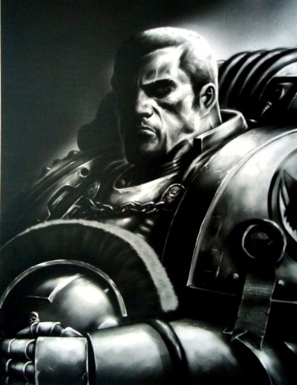
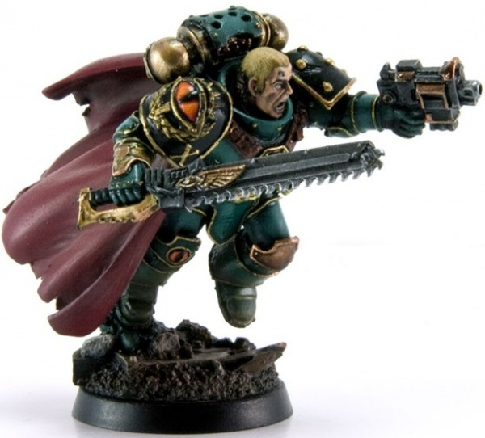
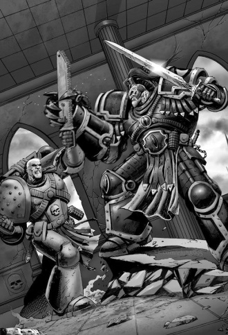
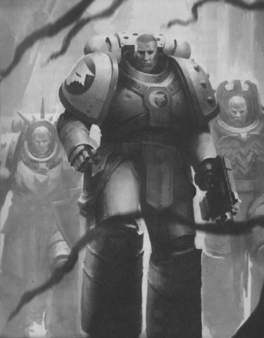
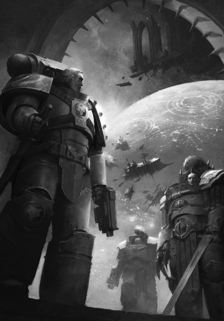

# 0703 加维尔·洛肯 Garviel Loken

精校状态：中文行文已逐段精校，部分术语仍为暂定

分类：人类帝国 / 荷鲁斯之子

原文来源：https://www.bilibili.com/opus/1068932276716306432

原作者：帝国神选罐头

原文时间：编辑于 2025年06月22日 14:20

[返回分类目录](目录.md) · [全书目录](../../目录.md)

<!-- A0703-B0001 -->
**英文原文**

"I was there, the day Horus slew the Emperor."

<!-- /A0703-B0001 -->

<!-- A0703-B0002 -->

原译文

“我在那里，在荷鲁斯杀死帝皇的那天。”

**校订译文**

“荷鲁斯杀死帝皇的那一天，我就在场。”

**校注：** 这是作品中的引句，其语境指 63-19 星上自称帝皇的统治者；并非确认荷鲁斯杀死了泰拉的人类帝皇。

<!-- /A0703-B0002 -->

<!-- A0703-B0003 -->
**英文原文**

Garviel Loken was the Captain of the 10th company of the Luna Wolves Space Marine Legion during the latter half of the Great Crusade. After distinguishing himself in battle, he was inducted into the Mournival, the advisory council to the Warmaster Horus, and from this position was a first-hand witness to the series of events that would result in Horus' damnation and the beginning of the Horus Heresy.

<!-- /A0703-B0003 -->

<!-- A0703-B0004 -->

原译文

加维尔·洛肯是大远征后半段影月苍狼星际战士军团第10连队的连长。在战斗中脱颖而出后，他被选入了战帅荷鲁斯的顾问议会四王议会，从这个职位上，他亲眼目睹了导致荷鲁斯被诅咒和荷鲁斯叛乱开始的一系列事件。

**校订译文**

大远征后半期，加维尔·洛肯担任影月苍狼军团第十连连长。他凭借出色战功进入四王议会，成为战帅荷鲁斯的顾问之一，也由此亲眼见证一连串将荷鲁斯引向堕落、最终引发荷鲁斯之乱的事件。

<!-- /A0703-B0004 -->

<!-- A0703-B0005 图片 -->

<!-- A0703-B0006 -->

原译文

Garviel Loken of the Luna Wolves' 10th Company 影月苍狼第十连队的加维尔·洛肯

**校订译文**

Garviel Loken of the Luna Wolves' 10th Company 影月苍狼第十连队的加维尔·洛肯

<!-- /A0703-B0006 -->

<!-- A0703-B0007 -->
## History 历史

<!-- /A0703-B0007 -->

<!-- A0703-B0008 -->
**英文原文**

Like many Veterans of the Luna Wolves, Garviel Loken had participated in many conflicts prior to the Horus Heresy. Some, such as the induction of Sarosel, were done bloodlessly and are remembered by Garviel for the amusing hats of the locals. Others are remembered for their oddity, such as the Battle of Keylek some Eighty years prior to the Heresy, where the Xenos species fought in a way that ran counter to the Space Marines'. Garviel looks back on this conflict with some sadness.

<!-- /A0703-B0008 -->

<!-- A0703-B0009 -->

原译文

与许多影月苍狼老兵一样，加维尔·洛肯在荷鲁斯叛乱之前参加了许多冲突。有些，比如萨罗塞尔回归，是不流血的，加维尔因为当地人有趣的帽子而记住。其他一些则因其奇特之处而被人们铭记，例如叛乱之前大约80年的凯莱克之战，在那里，异型物种以一种与星际战士背道而驰的方式作战。加维尔带着些许悲伤回顾了这场冲突。

**校订译文**

和许多影月苍狼老兵一样，洛肯在荷鲁斯之乱之前经历过许多战事。有些行动兵不血刃，例如萨罗塞尔归顺；他对那里最深的印象，是居民戴的滑稽帽子。另一些战役则因其奇特而难忘，例如叛乱前约八十年的科莱克之战：那里的异形以一种与星际战士截然相反的方式作战。回想此役，洛肯仍感到几分悲哀。

**校注：** Keylek 地名与第762篇专篇“科莱克之战”统一；原本篇凯莱克。

<!-- /A0703-B0009 -->

<!-- A0703-B0010 -->
**英文原文**

Long an upwardly mobile officer, and friend to senior Captain Tarik Torgaddon, Garviel Loken was inducted into the Mournival after the pacification of Sixty-Three-Nineteen, the first Mournival member not to be a 'son of Horus', the term for those Luna Wolves who bore a facial similarity to their Primarch.

<!-- /A0703-B0010 -->

<!-- A0703-B0011 -->

原译文

加维尔·洛肯长期以来一直是一名步步高升的军官，也是高级连长塔里克·托加顿的朋友，在六十-三-十九平定后被纳入四王议会，这是第一位不是“荷鲁斯之子”的四王议会成员，荷鲁斯之子是指那些面部与他们的原体相似的影月苍狼。

**校订译文**

洛肯仕途一直稳步上升，又与资深连长塔里克·托加顿交好。六十三—十九 平定后，他获准加入四王议会，成为议会首位不属于“荷鲁斯之子”的成员；这个称呼在此专指那些面容酷似原体的影月苍狼。

<!-- /A0703-B0011 -->

<!-- A0703-B0012 -->
**英文原文**

The bloodline of Cthonia was strong in Loken, and as a result he had pale, craggy features, short fair hair, grey eyes and a slightly freckled face. His tally of glories reckoned to be in line after those of Ezekyle Abaddon and Luc Sedirae, Loken's martial record was unquestionable.

<!-- /A0703-B0012 -->

<!-- A0703-B0013 -->

原译文

洛肯的科索尼亚血统很强，因此他有着苍白、嶙峋的五官、金色的短发、灰色的眼睛和略带雀斑的脸。据估计，洛肯的辉煌成就与以泽凯尔·阿巴顿和卢克·塞迪拉不相上下，他的军事记录是毋庸置疑的。

**校订译文**

洛肯身上有着鲜明的科索尼亚血统特征：肤色苍白，面部轮廓粗犷，浅色短发，灰色眼睛，脸上略有雀斑。他的战功据说仅次于以泽凯尔·阿巴顿和卢克·塞迪拉，军事才能无可置疑。

**校注：** in line after 指排名在两人之后，原译“不相上下”抹去了比较关系。

<!-- /A0703-B0013 -->

<!-- A0703-B0014 -->
**英文原文**

His strength of character was vouched for by Torgaddon and no less a personage than the Primarch of the Imperial Fists, Rogal Dorn, who was said to appreciate Loken's calm attitude. During a brief visit to the Vengeful Spirit, before his Legion's return to Terra, Dorn counseled Loken to always speak his mind as he saw it, advising that his humanity would balance Abaddon's choler and Horus Aximand's "lofty disdain," when the Mournival was advising the Warmaster. During the Battle of the Whisperhead Mountains on 63-19 Loken witnessed the Daemon Samus possess his comrade Xavyer Jubal, an event which scared him deeply and served as his first exposure to Chaos.

<!-- /A0703-B0014 -->

<!-- A0703-B0015 -->

原译文

他的性格力量得到了托加顿的证明，他和帝国之拳的原体罗格·多恩一样，都是一位人物，据说他很欣赏洛肯的冷静态度。在军团返回泰拉之前，多恩短暂拜访了复仇之魂号，他建议洛肯总是说出自己的想法，并建议他的人性将平衡阿巴顿的愤怒和荷鲁斯·阿西曼德的“崇高蔑视”，当四王议会为战帅提供建议时。在63-19的低语之首山脉之战中，洛肯目睹了恶魔萨姆斯占据他的战友夏维尔·朱巴尔，这一事件深深地吓到了他，也是他第一次接触到混沌。

**校订译文**

托加顿为洛肯的品格担保，帝国之拳原体罗格·多恩这样的人物也同样认可他，尤其欣赏他的沉着。在军团返回泰拉前，多恩曾短暂造访复仇之魂号，劝洛肯始终坦率说出自己的判断：四王议会为战帅献策时，他的人性可以制衡阿巴顿的暴躁与荷鲁斯·阿西曼德的“高傲轻蔑”。在 六十三—十九 的低语之首山脉之战中，洛肯亲眼看见恶魔萨姆斯附身于战友夏维尔·朱巴尔。这次经历令他深受惊骇，也是他第一次接触混沌。

<!-- /A0703-B0015 -->

<!-- A0703-B0016 -->
**英文原文**

For a time Loken enjoyed a privileged position at the Warmaster's side. His relationship with his fellow Mournival brothers was cordial, and he was encouraged from his oath of service to speak as an equal. He even was invited and welcomed in the warrior lodge of the Luna Wolves. Loken and the other members of the Mournival continued to get along well until the battles on Davin and Aureus, often in these happier times even play fighting with his brothers. However, as it became apparent that more and more activities amidst the Astartes of the legion were becoming increasingly clandestine and out of character, Loken became suspicious and began to investigate. After the Warmaster's botched attempt at peaceful negotiations with the Interex, the Luna Wolves were renamed the Sons of Horus, confirming Loken's fears that the old ways of the legion were being forgotten.

<!-- /A0703-B0016 -->

<!-- A0703-B0017 -->

原译文

有一段时间，洛肯在战帅侧享有特权。他与四王议会兄弟的关系很友好，他从服役誓言中受到鼓励，以平等的身份发言。他甚至被邀请并欢迎到影月苍狼的战士结社。洛肯和四王议会的其他成员一直相处得很好，直到戴文和奥里斯的战斗，在这些快乐的时候，甚至经常和他的兄弟们一起战斗。然而，随着阿斯塔特军团中越来越多的活动变得越来越秘密和不合时宜，洛肯开始怀疑并开始调查。在战帅与英特雷斯的和平谈判失败后，影月苍狼被重新命名为荷鲁斯之子，这证实了洛肯对军团旧方式被遗忘的担忧。

**校订译文**

有一段时间，洛肯在战帅身边享有优越地位，与四王议会兄弟相处融洽。从宣誓就职之初，他就被鼓励以平等身份发表意见，甚至获邀加入影月苍狼的战士结社，受到欢迎。直到戴文和奥里斯的战斗前，议会成员之间一直和睦相处；在那些较为愉快的日子里，他们还常以打闹切磋为乐。然而，军团阿斯塔特的许多活动越来越隐秘，行事也日益反常，令洛肯生疑并着手调查。荷鲁斯与英特雷斯的和平谈判失败后，影月苍狼改名为荷鲁斯之子，更印证了他的忧虑：军团正在遗忘自己的旧日传统。

**校注：** play fighting 指打闹、切磋，不是共同参加实战。

<!-- /A0703-B0017 -->

<!-- A0703-B0018 -->
**英文原文**

His research into the turbulent ancient history of Terra (in ancient tomes such as The Chronicles of Ursh) at the behest of his troubled mentor Kyril Sindermann, and his sponsorship of the rebellious remembrancer poet Ignace Karkasy put him at odds with some of the most powerful and influential Astartes in the 63rd Expeditionary Fleet, including Chaplain Erebus of the Word Bearers, and even the Warmaster himself. When Horus was injured on Davin, Loken and Tarik Torgeddon landed on Davin to try and find the weapon used to wound him. Recognizing the blade as being of Kinebrach origin, he realized that it had been stolen from Xenobia, the Interex's capital city. He and Torgaddon realized Erebus's treachery, but were too late as the other Mournival members had already interned Horus into the temple Delphos, allowing Erebus to corrupt Horus.

<!-- /A0703-B0018 -->

<!-- A0703-B0019 -->

原译文

他在陷入困境的导师凯里尔·辛德曼的要求下对动荡的泰拉古代历史的研究（在《乌尔什编年史》等古代巨著中），以及他对叛逆的记述者诗人伊格纳斯·卡尔卡斯的赞助，使他与第63远征舰队中一些最强大、最有影响力的阿斯塔特产生了分歧，包括怀言者的牧师艾瑞巴斯，甚至是战帅本人。当荷鲁斯在戴文受伤时，洛肯和塔里克·托加顿降落在戴文，试图找到用来伤害他的武器。他认出这把刀是巨猿族的，意识到它是从英特雷斯的首都芝诺比娅偷来的。他和托加顿意识到了艾瑞巴斯的背叛，但为时已晚，因为其他四王议会成员已经将荷鲁斯安置在德尔福斯神殿，让艾瑞巴斯腐化荷鲁斯。

**校订译文**

在忧心忡忡的导师凯里尔·辛德曼建议下，洛肯研读《乌尔什编年史》等古籍，研究泰拉动荡的古代历史。他还庇护桀骜的记述者诗人伊格尼斯·卡尔卡斯。这些行为使他与第六十三远征舰队中若干最有权势的阿斯塔特产生冲突，包括怀言者教士艾瑞巴斯，乃至战帅本人。荷鲁斯在戴文受伤后，洛肯与塔里克·托加顿登陆调查，寻找致伤的武器。他认出那是基尼布拉赫制造的刀刃，意识到它遭人从英特雷斯首都泽诺比娅盗走。两人由此识破艾瑞巴斯的背叛，却已经太迟：四王议会的其他成员已把荷鲁斯送入德尔弗斯神庙，使艾瑞巴斯得以腐化他。

<!-- /A0703-B0019 -->

<!-- A0703-B0020 图片 -->

<!-- A0703-B0021 -->

原译文

Garviel Loken 加维尔·洛肯

**校订译文**

Garviel Loken 加维尔·洛肯

<!-- /A0703-B0021 -->

<!-- A0703-B0022 -->
**英文原文**

Following Horus's recovery, Loken was further distanced from the rest of the Son's of Horus following Horus's murder of Emory Salignac, leading to the Auretian Technocracy War which lasted 10 grueling months, with Loken visibly aged from.

<!-- /A0703-B0022 -->

<!-- A0703-B0023 -->

原译文

荷鲁斯康复后，在荷鲁斯谋杀埃默里·萨利格纳克后，洛肯与荷鲁斯之子的其他人进一步疏远，导致了持续了10个月的奥瑞提亚科技联盟战争，洛肯明显衰老。

**校订译文**

荷鲁斯康复后，谋杀了埃默里·萨利尼亚克，引发长达十个月的奥瑞提安技术联盟战争。这让洛肯与军团其他成员愈发疏远；艰苦的战事也使他明显憔悴衰老。

**校注：** 战争由荷鲁斯谋杀对方代表引发，而非洛肯与军团疏远引发；据英文恢复因果关系。

<!-- /A0703-B0023 -->

<!-- A0703-B0024 -->
**英文原文**

Horus eventually saw fit to have Loken eliminated during the betrayal at Isstvan III, placing him at the front of the doomed invasion force alongside his friend and fellow marginalized Mournival member Torgaddon. When the virus bomb strike failed to kill all of the loyalist forces on the surface, the entirety of the traitor legions were eventually deployed to wipe out the survivors, who had fortified the Precentor's Palace under Loken's, Torgaddon's, and Saul Tarvitz's command. Given command of the loyalist Astartes of the XVI Legion, Loken declared that they were once again the Luna Wolves. Loken fought to the last as a loyal servant of the Emperor and refused to give any quarter to those who had betrayed the Emperor in favour of Horus. After witnessing the death of Tarik Torgaddon at the hands of Horus Aximand he was wounded on Isstvan III by his old comrade Ezekyle Abaddon, and was believed to have perished in the final orbital bombardment of the planet, along with the last surviving loyalists. Loken and Torgaddon's deaths (supposed in the case of former) marked the removal of one of the final obstacles to Horus' great ambitions.

<!-- /A0703-B0024 -->

<!-- A0703-B0025 -->

原译文

荷鲁斯最终认为，在伊斯塔万三号的背叛中，洛肯被消灭是合适的，他与他的朋友和被边缘化的四王议会成员托加顿一起被置于注定要失败的入侵部队的前线。当病毒炸弹袭击未能杀死地表上的所有忠诚部队时，整个叛徒军团最终被部署来消灭幸存者，他们在洛肯、托加顿和索尔·塔维茨的指挥下加固了领唱者宫殿。在第十六军团的忠诚者阿斯塔特的指挥下，洛肯宣布他们再次成为影月苍狼。洛肯作为帝皇的忠实仆人战斗到最后，拒绝对那些背叛帝皇而支持荷鲁斯的人给予任何宽恕。在目睹塔里克·托加顿死于荷鲁斯·阿西曼德之手后，他在伊斯特万三号被他的老战友以泽凯尔·阿巴顿打伤，据信他和最后幸存的忠诚者一起在行星的最后一次轨道轰炸中丧生。洛肯和托加顿的死亡（前者是假设）标志着荷鲁斯伟大抱负的最后障碍之一的消除。

**校订译文**

荷鲁斯最终决定借伊斯塔万三号的背叛除掉洛肯，将他与同样遭到排挤的四王议会成员、挚友托加顿一起，派到注定被牺牲的登陆部队前线。病毒轰炸未能杀死地表所有忠诚派，叛军各军团随后投入兵力，清剿幸存者。后者在洛肯、托加顿和索尔·塔维茨指挥下固守领唱者宫殿。洛肯受命统率第十六军团的忠诚派阿斯塔特，宣布他们重新成为影月苍狼。他以帝皇忠仆的身份战斗到底，绝不宽恕那些背弃帝皇、投向荷鲁斯的人。他亲眼目睹塔里克·托加顿死于荷鲁斯·阿西曼德之手，随后又被旧日战友阿巴顿击伤。人们一度以为，他与最后一批忠诚派一起死在最终的轨道轰炸中。洛肯与托加顿之死——前者只是被认为阵亡——意味着荷鲁斯实现野心的最后几道障碍之一被扫除。

<!-- /A0703-B0025 -->

<!-- A0703-B0026 图片 -->

<!-- A0703-B0027 -->

原译文

Loken battles Abaddon on Isstvan III 在伊斯塔万三号洛肯与阿巴顿战斗

**校订译文**

Loken battles Abaddon on Isstvan III 在伊斯塔万三号洛肯与阿巴顿战斗

<!-- /A0703-B0027 -->

<!-- A0703-B0028 -->
### Recovery 恢复

<!-- /A0703-B0028 -->

<!-- A0703-B0029 -->
**英文原文**

Although it initially appeared that Loken perished in the final bombardment of Isstvan III, many months later a team of Astartes led by Nathaniel Garro on the orders of Malcador the Sigillite were sent to the planet to recruit a single warrior. The wars of the Horus Heresy had long since moved onwards, leaving Isstvan III a shattered and desolate graveyard. In these circumstances, the one surviving and abandoned Astartes left upon the world had fallen to a form of madness, believing himself rejected by death and unable to remember his name. He took upon himself the name Cerberus and believed himself to be the only remaining loyalist,(a Legion of One), until he was confronted by Garro and his men.

<!-- /A0703-B0029 -->

<!-- A0703-B0030 -->

原译文

虽然最初看起来洛肯在对伊斯塔万三号的最后一次轰炸中丧生，但几个月后，纳撒尼尔·伽罗率领的一支阿斯塔特部队在掌印者马卡多的命令下被派往这个星球招募一名战士。荷鲁斯叛乱的战争早已向前推进，给伊斯塔万三号留下了一个破碎荒凉的墓地。在这种情况下，幸存下来并被遗弃在世界上的阿斯塔特陷入了一种疯狂的状态，他相信自己被死亡所抛弃，无法记住自己的名字。他给自己取了名字刻耳柏洛斯，并相信自己是唯一剩下的忠诚者（一人军团），直到他遇到伽罗和他的部下。

**校订译文**

洛肯起初被认为死于伊斯塔万三号的最后一次轰炸，但数月后，纳撒尼尔·伽罗奉掌印者马卡多之命，率一队阿斯塔特来到该星，寻找并招募一名战士。荷鲁斯之乱的战火早已转移别处，只留下伊斯塔万三号这片破碎荒凉的坟场。被遗弃在这里的那名幸存阿斯塔特精神失常，认为死亡拒绝接纳自己，也忘了本名。他自称“刻耳柏洛斯”，以为自己是唯一活着的忠诚派——一人军团——直到伽罗一行找到他。

<!-- /A0703-B0030 -->

<!-- A0703-B0031 -->
**英文原文**

Initially hostile to a group that he perceived as traitors, the lone astartes forced Nathaniel Garro to engage him in single combat, and Garro proved unable to overcome him physically. Thus Garro appealed to the warrior's faith and duty and reminded him of his true identity. In this moment of lucidity, Loken remembered himself and agreed to go with them. Before leaving Isstvan, Garro confided to Loken that he was the final recruit the Sigillite had ordered them to find, and that they would learn the true purpose of their order when they returned to Terra.

<!-- /A0703-B0031 -->

<!-- A0703-B0032 -->

原译文

最初，他对一个被他视为叛徒的团体充满敌意，孤独的阿斯塔特迫使纳撒尼尔·伽罗与他进行决斗，事实证明伽罗无法在身体上战胜他。因此，伽罗唤起了战士的信仰和责任，并提醒他自己的真实身份。在清醒的时刻，洛肯想起了自己，同意和他们一起去。在离开伊斯塔万之前，伽罗向洛肯透露，他是掌印者命令他们寻找的最后一名新兵，当他们回到泰拉时，他们会了解他们命令的真正目的。

**校订译文**

这名孤独的战士起初将来者视为叛徒，充满敌意，迫使伽罗与自己决斗。伽罗无法靠武力击败他，便诉诸他的信念与责任，唤醒他对真实身份的记忆。洛肯一时恢复清醒，想起自己是谁，同意随他们离开。动身前，伽罗告诉他，他是掌印者命令他们寻找的最后一名成员；回到泰拉后，他们就会获知这个组织的真正使命。

**校注：** their order 指伽罗等人所属的组织，不是他们接到的命令。

<!-- /A0703-B0032 -->

<!-- A0703-B0033 -->
### Knight-Errant 游侠骑士

<!-- /A0703-B0033 -->

<!-- A0703-B0034 -->
**英文原文**

Loken's first mission for the Sigillite took him to Caliban, alongside his former comrade, Iacton Qruze. The mission was to ascertain the strength and loyalty of the Dark Angels under Luther and if possible the location and loyalty of Lion El'Jonson. Loken allowed himself to be captured by the Dark Angels, confident Luther himself would interrogate him. He was correct and during his conversation with Luther, one of the Watchers in the Dark gave Loken a small portion of its telepathy abilities to read Luther's mind. To Loken's shock it seemed Luther himself did not know where he fell in the Horus Heresy, only that he was against the Lion. This complicated the mission as no one knew the loyalty of the Lion. Loken escaped his cell with the help of the Watcher but encountered a lone Dark Angel sentry. Loken fought not to kill, but subdue and capture - he would not kill a possibly loyal Space Marine. Qruze intervened with the help of Cypher who was an old friend of both from their days in the Luna Wolves. Qruze shot and killed the Dark Angel, much to Loken's horror. He confronted Qruze about this unnecessary murder, telling Qruze this death may have tipped the scales of loyalty against the Imperium. Qruze casually dismissed it stating "He will not be the first loyal servant of the Imperium I've killed, nor do I think the last." The two made their escape from the Dark Angel dungeon with the help of Cypher, who ultimately refused their offer to join them as one of Malcador's agents. Instead he would serve in the shadows, loyal but unremembered. With their mission failed Loken returned to Luna, vowing to have nothing more to do with the Sigillite and his secret machinations.

<!-- /A0703-B0034 -->

<!-- A0703-B0035 -->

原译文

洛肯的第一个来自掌印者的任务将他带到了卡利班，与他的前战友亚克顿·克鲁兹一起。任务是确定卢瑟领导下的黑暗天使的力量和忠诚，如果可能的话，还要确定莱昂·艾尔庄森的位置和忠诚。洛肯允许自己被黑暗天使俘虏，相信卢瑟自己会审问他。他是对的，在与卢瑟的谈话中，黑暗守望者之一给了洛肯一小部分灵能感应能力来解读卢瑟的思想。令洛肯震惊的是，卢瑟自己似乎不知道他在荷鲁斯叛乱中的位置，只知道他反对莱昂。这使任务变得复杂，因为没有人知道莱昂的忠诚。洛肯在守望者的帮助下逃离了牢房，但遇到了一个单独的黑暗天使哨兵。洛肯战斗不是为了杀人，而是为了制服和俘虏 — 他不会杀死一个可能忠诚的星际战士。克鲁兹在塞弗的帮助下进行了干预，塞弗是他们在影月苍狼的老朋友。克鲁兹开枪打死了黑暗天使，令洛肯大为震惊。他就这起不必要的杀伤与克鲁兹对质，告诉克鲁兹，这起死亡可能使忠诚者的天平向对抗帝国倾斜。克鲁兹漫不经心地驳斥了这一说法，称“他不会是我杀死的帝国的第一个忠诚仆人，我也不认为是最后一个。”两人在塞弗的帮助下逃离了黑暗天使地牢，塞弗最终拒绝了他作为马卡多特工之一加入他们的提议。相反，他会在阴影中服务，忠诚但不为人所知。随着任务的失败，洛肯回到了月球，发誓不再与掌印者和他的秘密阴谋有任何关系。

**校订译文**

洛肯为掌印者执行的第一个任务，是与旧友亚克顿·克鲁兹一同前往卡利班，查明卢瑟麾下黑暗天使的实力与忠诚，并尽可能确认莱昂·艾尔’庄森的位置和立场。洛肯故意被俘，确信卢瑟会亲自审问自己。事情果然如此。交谈时，一名黑暗守望者将少许心灵感应能力借给洛肯，使他得以窥读卢瑟的思想。令他震惊的是，卢瑟自己似乎也不知道该在叛乱中站在哪一边，只清楚自己反对雄狮；而雄狮究竟效忠何方也无人知晓，使任务更加棘手。洛肯在守望者帮助下逃出牢房，却遇到一名落单的黑暗天使哨兵。他不愿杀死可能仍然忠诚的星际战士，只想将其制服。此时，克鲁兹在塞弗协助下赶来；塞弗是两人在影月苍狼时期的老友。克鲁兹开枪杀死哨兵，令洛肯惊骇不已。洛肯质问他为何作出这无谓的杀戮，认为此事可能使黑暗天使最终倒向帝国的敌人。克鲁兹却毫不在意：“他不是第一个死在我手中的帝国忠仆，我想也不会是最后一个。”两人借塞弗之助逃出地牢，并邀请他加入马卡多的密探队伍。塞弗拒绝了，选择继续在阴影中效忠，默默无闻。任务失败后，洛肯返回月球，发誓再也不参与掌印者及其秘密谋划。

**校注：** 本段 Cypher 指叛乱时期与影月苍狼旧人相识的塞弗；名称或称号相同不自动证明其与第41千年每次出现者身份相同。

<!-- /A0703-B0035 -->

<!-- A0703-B0036 -->
**英文原文**

Seeking a refuge, Loken occupied a small disused dome of the Somnus Citadel (formerly the domain of a Sister of Silence who had perished on Prospero) and devoted his time to restoring her small garden. In doing this, he also restored a small measure of peace to his fragile psyche. During his time here, he was "visited" by his old friend Torgaddon, still very much dead. Torgaddon reminded Loken of the oath he swore when he joined the Mournival, even if the Mournival itself no longer existed: to uphold the safety of the Imperium and to loyally serve the Emperor of Mankind above any Primarch. Torgaddon also warned, ominously, that the traitors had done something terrible to him after his death, and only Loken could right it. Loken, reinvigorated, left the garden and told Qruze that he was ready to undertake his next mission for the Sigillite.

<!-- /A0703-B0036 -->

<!-- A0703-B0037 -->

原译文

为了寻求庇护，洛肯占领了索莫纳斯城堡的一个废弃的穹顶（以前是一位在普罗斯佩罗牺牲的寂静修女的领地），并花时间修复了她的小花园。通过这样做，他也为脆弱的心灵恢复了一点平静。在这里的时候，他的老朋友托加顿“拜访”了他，他已经完全死亡。托加顿提醒洛肯，即使四王议会本身已经不复存在，他在加入四王议会也曾宣誓：维护帝国的安全，忠诚地为人类帝皇服务，高于任何原体。托加顿还不祥地警告说，叛徒在他死后对他做了可怕的事情，只有洛肯才能纠正这一点。洛肯重新振作起来，离开了花园，告诉克鲁兹，他已经准备好为掌印者执行下一个任务。

**校订译文**

洛肯想找一处避难之所，便住进索莫纳斯城堡内一座废弃的小穹顶建筑。那里原属一位牺牲于普罗斯佩罗的寂静修女。他开始修复她留下的小花园，也借此让脆弱的心灵恢复些许安宁。期间，已经死去的旧友托加顿“来访”，提醒他：即使四王议会已不复存在，加入时立下的誓言依然有效——维护帝国的安全，忠诚侍奉人类帝皇，并将这种忠诚置于对任何原体的忠诚之上。托加顿还发出不祥的警告：叛徒在他死后对他做了可怕的事，只有洛肯能予以纠正。洛肯重拾斗志，离开花园，告诉克鲁兹，自己已准备好接受掌印者的下一个任务。

<!-- /A0703-B0037 -->

<!-- A0703-B0038 -->
**英文原文**

Loken's next mission was to be part of a band of Knights-Errant that would journey to Molech, where they would infiltrate and mark the Sons of Horus flagship Vengeful Spirit in preparation for a plan by Leman Russ to slay Horus. However Loken and his team were captured and brought before Horus in Lupercal's Court. After a tense reunion with Horus, Abaddon, and Aximand his former Primarch gave him a chance to return to his fold. Despite the immense temptation, Loken resisted by remembering the words of Euphrati Keeler and a battle broke out in Lupercal's Court. During the fight Horus killed Qruze, finally breaking the last chains Loken had with his Primarch. Loken vowed that he would never stop fighting Horus. Shortly after the beacons were activated and the Knights-Errant craft attacked the Vengeful Spirit. In the bombardment, Loken was sucked out into space but was rescued by the Tarnhelm.

<!-- /A0703-B0038 -->

<!-- A0703-B0039 -->

原译文

洛肯的下一个任务是加入一个前往摩洛的游侠骑士小队，在那里他们将渗透并标记荷鲁斯之子旗舰复仇之魂号，为黎曼·鲁斯杀死荷鲁斯的计划做准备。然而，洛肯和他的小队被抓获，并在卢佩卡尔王庭上被带到荷鲁斯面前。在与荷鲁斯、阿巴顿和阿西曼德紧张团聚后，他的前任原体给了他一个重返自己阵营的机会。尽管有巨大的诱惑，洛肯还是记住了幼发拉底·琪乐的话，并在卢佩卡尔王庭上爆发了一场战斗。在战斗中，荷鲁斯杀死了克鲁兹，最终打破了洛肯与他的原体之间的最后一道枷锁。洛肯发誓他永远不会停止与荷鲁斯的战斗。在信标被激活后不久，游侠骑士飞船袭击了复仇之魂号。在轰炸中，洛肯被吸出太空，但被塔恩海姆号救出。

**校订译文**

下一次行动中，洛肯加入前往摩洛的游侠骑士小队，潜入荷鲁斯之子旗舰复仇之魂号，布设定位标记，为黎曼·鲁斯刺杀荷鲁斯的计划作准备。小队却遭到俘虏，被带到卢佩卡尔王庭中的荷鲁斯面前。与荷鲁斯、阿巴顿和阿西曼德紧张重逢后，原体给了洛肯重新归队的机会。诱惑虽强，洛肯仍凭尤弗拉蒂·琪乐的话坚定意志，王庭中随即爆发战斗。荷鲁斯杀死克鲁兹，彻底斩断洛肯对原体最后的牵挂。他发誓永不停止对抗荷鲁斯。不久，信标启动，游侠骑士的舰艇攻击复仇之魂号。轰击中，洛肯被吸入太空，随后由塔恩海姆号救起。

<!-- /A0703-B0039 -->

<!-- A0703-B0040 -->
**英文原文**

Loken returned to service in the Knights-Errant, fighting with Garro, Macer Varren, Helig Gallor, and Vardas Ison against Chaos Cultists on Terra shortly before Horus' arrival. During the battle, the Daemon known as the Lord of the Flies appeared and possessed the body of Varren. Loken was able to temporarily snap Varren out of his rampage, giving the former World Eater enough time to grab Loken's grenade pack and kill himself before the Daemon reasserted control.

<!-- /A0703-B0040 -->

<!-- A0703-B0041 -->

原译文

在荷鲁斯抵达之前不久，洛肯重返游侠骑士，与伽罗、马克尔·瓦伦、赫利格·加洛和瓦尔达斯·伊森在泰拉对抗混沌邪教徒。在战斗中，被称为蝇王的恶魔出现了，并占据了瓦伦的身体。洛肯能够暂时将瓦伦从它的暴行中解救出来，让这位前吞世者有足够的时间在恶魔重新控制之前抓住洛肯的手榴弹包并自杀。

**校订译文**

洛肯继续为游侠骑士效力。荷鲁斯抵达泰拉前不久，他与伽罗、马塞尔·瓦伦、赫利格·加洛和瓦尔达斯·伊森一同对抗当地的混沌教徒。战斗中，名为“蝇王”的恶魔现身并附体瓦伦。洛肯短暂唤醒了瓦伦，使这名前吞世者在恶魔重新控制身体之前，抓住洛肯的手榴弹包，自爆身亡。

<!-- /A0703-B0041 -->

<!-- A0703-B0042 -->
**英文原文**

Shortly after Loken was brought by Malcador along with 8 other chosen Knights-Errant to a chamber underneath the Imperial Palace. There, it was revealed by the Emperor himself that the nine would become founders of a new order which would fight against the depredations of the Warp in order to save humanity. However to go forward, each of the chosen would have to leave behind their pasts entirely and take up a new name. Loken was intended to become Crius, but upon seeing the Emperor understood that this was not to be his fate. He refused Malcador's title and instead returned to the surface to settle things with the Sons of Horus once and for all.

<!-- /A0703-B0042 -->

<!-- A0703-B0043 -->

原译文

不久之后，洛肯和其他8名被选中的游侠骑士一起被马卡多带到了皇宫下面的一个房间。在那里，帝皇本人透露，这九个人将成为一个新秩序的创始人，该秩序将与亚空间的掠夺作斗争，以拯救人类。然而，为了继续前进，每个被选中的人都必须完全抛弃过去，并取一个新的名字。洛肯本来打算成为克瑞斯，但看到帝皇后，他明白这不是他的命运。他拒绝了马卡多的头衔，而是回到地表，一劳永逸地与荷鲁斯之子解决问题。

**校订译文**

不久，马卡多将洛肯及另外八名获选的游侠骑士带到帝国皇宫地下的一间密室。帝皇亲自告知他们：九人将成为一个新组织的奠基者，抵御亚空间的侵害，拯救人类。但他们必须彻底告别过去，接受新的名字。马卡多原本为洛肯安排的名字是“克利俄斯”；见到帝皇后，洛肯却明白这并非自己的命运。他拒绝这一身份，返回地表，准备与荷鲁斯之子彻底作个了断。

**校注：** new order 指新组织，而非社会“新秩序”；Crius 沿核心“克利俄斯”。

<!-- /A0703-B0043 -->

<!-- A0703-B0044 -->
### Siege of Terra 泰拉围城

<!-- /A0703-B0044 -->

<!-- A0703-B0045 -->
**英文原文**

Loken next appeared amid the final phase of the Solar War, having received a message from Mersadie Oliton of her need to urgently meet with Rogal Dorn. After scolding Malcador for giving an order to kill all prisoners to prevent them from falling into traitor hands, Loken sped across the Sol System as it was embroiled in violence. He succeeded in rescuing Oliton and brought her aboard the Phalanx to meet with Dorn, but this was was revealed to be a trap by Chaos to allow for the manifestation of Samus directly into the battlestation. Confronting Samus once again, Loken found himself at the Whisperheads on 63-19, witnessing Xayver Jubal's possession by the Daemon once more. Overcome with madness and rage, Loken reverted to his "Cerberus" persona and fought any Daemon he came across. Together with Oliton, they were able to briefly slay Samus but the creature would just soon be reborn into a new corpse. To prevent this, Oliton bid Loken farewell and committed suicide to close the portal from which Samus had entered the Materium.

<!-- /A0703-B0045 -->

<!-- A0703-B0046 -->

原译文

洛肯在太阳战争的最后阶段再次出现，他收到了梅赛蒂·奥列顿的信息，表示她需要紧急与罗格·多恩会面。在斥责马卡多下令杀死所有囚犯以防止他们落入叛徒之手后，洛肯在卷入战火的太阳系中疾驰而过。他成功地营救了奥列顿，并将她带上山阵号与多恩会面，但发现这是混沌的一个陷阱，让萨姆斯直接出现在战斗空间站。洛肯再次与萨姆斯对峙，他发现自己在63-19并来到了低语之首，目睹了夏维尔·朱巴尔再次被恶魔占据。洛肯被疯狂和愤怒所征服，回到了他的“刻耳柏洛斯”的角色，并与他遇到的任何恶魔战斗。与奥列顿一起，他们能够短暂地杀死萨姆斯，但这种生物很快就会重生到一具新的身体。为了防止这种情况，奥列顿向洛肯道别并自杀，以关闭萨姆斯进入物质界的入口。

**校订译文**

太阳战争最后阶段，洛肯收到梅萨迪·奥莱顿的消息，称她急需面见罗格·多恩。马卡多曾下令杀死所有囚犯，以免他们落入叛军之手；洛肯为此斥责了他，随后穿越战火中的太阳系，成功救出奥莱顿，并将她带上山阵号见多恩。然而，这其实是混沌设下的陷阱，让萨姆斯得以直接在战斗要塞内部显现。再度面对萨姆斯时，洛肯仿佛回到 六十三—十九 的低语之首，重见夏维尔·朱巴尔遭恶魔附身的一幕。疯狂与愤怒令他重新变成“刻耳柏洛斯”，攻击一切遇见的恶魔。他和奥莱顿一度杀死萨姆斯，但恶魔很快又借一具新的尸体重生。为阻止这一循环，奥莱顿向洛肯告别，随即自尽，关闭了萨姆斯进入物质宇宙的门户。

**校注：** 英文 Xayver 与前文 Xavyer 拼写不同，中文沿“夏维尔·朱巴尔”，保留英文差异。

<!-- /A0703-B0046 -->

<!-- A0703-B0047 图片 -->

<!-- A0703-B0048 -->

原译文

Loken dons his Luna Wolves armour during the Siege of Terra 在泰拉围城中，洛肯穿上了他的影月苍狼盔甲

**校订译文**

Loken dons his Luna Wolves armour during the Siege of Terra 在泰拉围城中，洛肯穿上了他的影月苍狼盔甲

<!-- /A0703-B0048 -->

<!-- A0703-B0049 -->
**英文原文**

Loken next appeared during the battle for the Saturnine Gate, having been selected by Rogal Dorn and Malcador to lead a series of kill-teams underneath the quarter in order to ambush a subterranean assault by the Sons of Horus. Seeking vengeance for their betrayal, Loken, Garro, Helig Gallor, and other allies such as Bel Sepatus and Endryd Haar successfully beat back the traitor assault. During the fight, Loken managed to personally slay Captain Tybalt Marr, avenge Tarik at last by killing Tormageddon, and finally exacted his vengeance against Horus Aximand by eviscerating his former Mournival brother with his chainsword. After the battle Loken remarked to Kyril Sindermann that he was changing and becoming a conduit for the Emperor's power.

<!-- /A0703-B0049 -->

<!-- A0703-B0050 -->

原译文

洛肯接下来出现在土星之门的战斗中，他被罗格·多恩和马卡多选中，率领一系列杀戮小队在该区域下方伏击荷鲁斯之子的地下袭击。为了报复他们的背叛，洛肯、伽罗、赫利格·加洛和其他盟友，如贝尔·塞帕图斯和恩德瑞德·哈尔，成功击退了叛徒的袭击。在战斗中，洛肯设法亲自杀死了提伯特·玛尔连长，最终通过杀死托尔加登为塔里克报仇，并最终用链锯剑挖出了他前四王议会兄弟的内脏，对荷鲁斯·阿西曼德进行了复仇。战斗结束后，洛肯对凯里尔·辛德曼说，他正在改变，成为帝皇力量的通道。

**校订译文**

土星之门之战中，多恩与马卡多选中洛肯，命他率数支突击小队埋伏于该区域地下，截击荷鲁斯之子的地底攻势。为昔日背叛复仇的洛肯，与伽罗、赫利格·加洛、贝尔·塞帕图斯和恩德里德·哈尔等人成功击退叛军。他亲手杀死提伯特·玛尔连长，又诛杀托玛格顿，终于为塔里克复仇；最后，他以链锯剑剖开昔日四王议会兄弟荷鲁斯·阿西曼德的腹部，清算了旧怨。战后，他告诉凯里尔·辛德曼，自己正在改变，逐渐成为帝皇力量的载体。

**校注：** Tormageddon 与 Tarik Torgaddon 名称不同；原译将前者作“托尔加登”，容易误成洛肯再次杀死自己的忠诚派挚友。此处暂译托玛格顿。

<!-- /A0703-B0050 -->

<!-- A0703-B0051 -->
**英文原文**

Loken next journeyed into Terra's ruins to find Euphratii Keeler, who had gone missing. He discovered her leading fanatical militias in a hopeless religious war against traitor forces. Loken initially opposed this helpless struggle, but was convinced by Keeler to allow her to continue her work. Loken agreed to stay with Keeler and make her see her senses before it's too late. However, due to the chronological and spacial chaos that began to erupt on Terra in the final stages of the Siege, the two soon themselves moving to areas far apart from each other in short spans of time.

<!-- /A0703-B0051 -->

<!-- A0703-B0052 -->

原译文

洛肯随后前往泰拉的废墟，寻找失踪的幼发拉底·琪乐。他发现她领导着狂热的民兵组织，在一场无望的宗教战争中对抗叛徒势力。洛肯最初反对这场无助的斗争，但被琪乐说服，允许她继续工作。洛肯同意留在琪乐身边，让她在为时已晚之前看到自己的判断。然而，由于在围城的最后阶段开始在泰拉上爆发的时间和空间混乱，两人很快在短时间内移动到相距甚远的地区。

**校订译文**

随后，洛肯深入泰拉废墟，寻找失踪的尤弗拉蒂·琪乐。他发现琪乐正率狂热的民兵对抗叛军，进行一场看不到胜算的宗教战争。洛肯起初反对这种无望的抵抗，后来却被她说服，容许她继续行动。他决定留下陪伴，试图在为时过晚之前让她恢复理智。然而，围城末期泰拉开始发生时空紊乱，两人很快便在极短时间内被转移到相距遥远的地方。

<!-- /A0703-B0052 -->

<!-- A0703-B0053 -->
**英文原文**

Nonetheless, Loken slew traitors wherever he found them. Soon enough, he began to notice patterns and followed them, eventually arriving inside the Hall of Leng and meeting with Kyril Sindermann and Hellick Mauer. Loken initially aided Sindermann in his quest to find anti-daemonic lore in the Emperor's own library, and speculates that Malcador himself must have been the one to lead him here. After researching a legend of The Dark King, Loken then notices a door that wasn't there earlier and goes through it alone. It shuts behind him, and Loken finds himself aboard the Vengeful Spirit.

<!-- /A0703-B0053 -->

<!-- A0703-B0054 -->

原译文

尽管如此，洛肯无论在哪里发现叛徒，都会杀死他们。很快，他开始注意到模仿并跟随它们，最终到达寒冷大厅，与凯里尔·辛德曼和赫立克·莫尔会面。洛肯最初帮助辛德曼在帝皇的图书馆里寻找反恶魔的传说，并推测马卡多本人一定是把他带到这里的人。在研究了黑暗之王的传说后，洛肯发现了一扇以前不存在的门，并独自穿过它。它在他身后关闭，洛肯发现自己登上了复仇之魂号。

**校订译文**

洛肯仍然一路诛杀所遇的叛徒。渐渐地，他察觉周遭变化中存在某些规律，循迹而行，最终来到伦格大厅，与凯里尔·辛德曼及赫立克·莫尔相遇。他帮助辛德曼在帝皇的私人图书馆中寻找对抗恶魔的知识，并猜测是马卡多将自己引到此处。研究黑暗之王的传说后，洛肯发现一扇先前并不存在的门。他独自穿门而过，门在身后关闭，他随即发现自己已来到复仇之魂号。

**校注：** Hall of Leng 暂定“伦格大厅”，原译“寒冷大厅”；Leng 是地点专名，不应按 cold 字面理解。未查得官方中文，按主审决定统一。patterns 指可循的规律，并非模仿。

<!-- /A0703-B0054 -->

<!-- A0703-B0055 -->
**英文原文**

As he explores the warp-stricken flagship, Loken is assaulted by the daemon Samus. Pursued and assailed relentlessly through the ship, Loken eventually destroys it's physical form with his force sword after being coincidentally guided by the words of Mauer who was reading a book of Samus' lore. The words were able to reveal Samus' presence to Loken without him having to fatally turn around and give himself to the Daemon.

<!-- /A0703-B0055 -->

<!-- A0703-B0056 -->

原译文

当他探索亚空间受损的旗舰时，洛肯遭到了恶魔萨姆斯的袭击。在船上被无情地追击和攻击，洛肯最终在莫尔的话的指导下，用他的动力剑摧毁了它的物质形态，莫尔当时正在读一本关于萨姆斯传说的书。这些话能够向洛肯透露萨姆斯的存在，而他不必致命地转身把自己交给恶魔。

**校订译文**

洛肯探索被亚空间侵蚀的旗舰时，再遭萨姆斯袭击。恶魔在舰内穷追猛打，而莫尔恰在诵读一部记载萨姆斯传说的书，其话语意外传到洛肯耳中，为他指引。这些话让洛肯能够察知萨姆斯的位置，无须转身面对恶魔、作出致命的自投罗网之举。最终，他用灵能剑摧毁了恶魔的实体。

**校注：** Force Sword 属灵能武器，与 Power Sword 动力剑区分。

<!-- /A0703-B0056 -->

<!-- A0703-B0057 -->
**英文原文**

As the powers of the Warp caused space and time to break down, locations on Terra and the Vengeful Spirit began to overlap and Loken found himself in the new maddened realm dubbed the Inevitable City. Loken stumbled upon Ollanius Persson, John Grammaticus, and Leetu, saving them from a group of frenzied Word Bearers. The group was then confronted by the Emperor as He began to transform into a god dubbed the Dark King, with Loken and Ollanius both proving able to talk the Master of Mankind down from the path of damnation and embrace His humanity. Afterwards, the Emperor let loose the Warp power He had built up and Loken as well as Leetu went with Him and Caecaltus Dusk to confront Horus.

<!-- /A0703-B0057 -->

<!-- A0703-B0058 -->

原译文

随着亚空间的力量导致空间和时间崩溃，泰拉和复仇之魂号上的位置开始重叠，洛肯发现自己身处一个被称为必然之城的全新疯狂领域。洛肯偶然发现了欧兰尼奥斯·佩松、约翰·格拉马迪库斯和勒图，将他们从一群疯狂的怀言者手中救了出来。当帝皇开始转变成一个被称为黑暗之王的神时，这群人遇到了帝皇，洛肯和欧兰尼奥斯都证明了他们能够说服人类之主远离诅咒之路，并拥抱他的人性。之后，帝皇释放了他吸收的亚空间力量，洛肯和勒图与他和凯卡尔图斯·达斯克一起去对抗荷鲁斯。

**校订译文**

亚空间力量使时空崩解，泰拉与复仇之魂号上的地点开始彼此重叠，洛肯进入被称为“必然之城”的疯狂领域。他偶遇欧良尼乌斯·佩松、约翰·格拉马迪库斯与勒图，将他们从一群狂乱的怀言者手中救出。众人随后遇到正在向“黑暗之王”这一神明形态转化的帝皇。洛肯与欧良尼乌斯说服人类之主放弃堕落成神的道路，重新拥抱人性。帝皇释放了积蓄的亚空间力量，洛肯和勒图随他及凯卡尔图斯·达斯克一同前去迎战荷鲁斯。

<!-- /A0703-B0058 -->

<!-- A0703-B0059 -->
**英文原文**

Upon coming face to face with Horus, the Warmaster surprisingly wept tears at seeing his son come to kill him. However in the ensuing struggle Horus showed little mercy to all present, contemptuously blasting back Loken, Leetu, and Caecaltus Dusk as he focused on defeating the Emperor. Loken was guided by the dying flame of Malcador through the darkness he found himself in, eventually emerging back on Sixty-Three Nineteen and coming face to face with a mock Mournival consisting of three centaurs each with the face of Horus. Loken slew these foes then emerged in Lupercal's Court just as the Emperor slew Horus with the Athame before collapsing Himself. Loken looked after both bodies as Rogal Dorn and Constantin Valdor arrived.

<!-- /A0703-B0059 -->

<!-- A0703-B0060 -->

原译文

当与荷鲁斯面对面时，战帅看到子嗣来杀他，他惊讶地流下了眼泪。然而，在随后的战斗中，荷鲁斯对在场的所有人都没有表现出丝毫的怜悯，在他专注于击败帝皇时，轻蔑地回击了洛肯、勒图和凯卡尔图斯·达斯克。洛肯在马卡多垂死的火焰的指引下，穿过他发现自己身处的黑暗，最终回到了63-19，与一个由三个半人马组成的模拟四王议会对面，每个半人马都有荷鲁斯的脸。洛肯杀死了这些敌人，然后出现在卢佩卡尔王庭里，帝皇在崩溃之前用仪式之刃杀死了荷鲁斯。罗格·多恩和康斯坦丁·瓦尔多到达时，洛肯照看了两具尸体。

**校订译文**

终于面对荷鲁斯时，洛肯看见战帅竟因自己的儿子前来杀他而落泪。然而，交战之后，荷鲁斯对众人几乎毫不留情。他专注于击败帝皇，轻蔑地将洛肯、勒图与凯卡尔图斯·达斯克轰飞。洛肯坠入黑暗，由马卡多行将熄灭的火光引路，最终重回 六十三—十九，面对一个诡异的四王议会仿造品：三只长着荷鲁斯面孔的半人马。他杀死这些敌人，再度出现在卢佩卡尔王庭，恰好目睹帝皇用仪式之刃杀死荷鲁斯，随后自己也倒了下去。多恩与瓦尔多赶到时，洛肯正守护着两人的躯体。

**校注：** both bodies 在此指荷鲁斯与帝皇的身体；帝皇仍活着，原译“两具尸体”造成错误结论。

<!-- /A0703-B0060 -->

<!-- A0703-B0061 图片 -->

<!-- A0703-B0062 -->

原译文

Loken and Abaddon reunite on the Vengeful Spirit shortly before his death 洛肯和阿巴顿在他死亡前不久在复仇之魂号上重聚

**校订译文**

Loken and Abaddon reunite on the Vengeful Spirit shortly before his death 洛肯临死前不久，在复仇之魂号上与阿巴顿重逢

<!-- /A0703-B0062 -->

<!-- A0703-B0063 -->
**英文原文**

Despite the urgings of Dorn and Leetu, Loken refused to leave Horus' body and return to Terra. He thus remained as the others left, and was eventually discovered by Abaddon and the surviving sane officers of the Sons of Horus. Abaddon forbade any present from striking down Loken, stating enough blood had been shed. For his part Garviel urged Abaddon and the others to surrender, promising to see to it that Dorn granted them amnesty for their crimes. As the two former brothers talked, Erebus emerged behind Loken and stabbed him in the back much to Abaddon's horror. Erebus explained that Daemons are created through moments of great betrayal and spite much like this, and that Loken's death would create an echo in the Warp that first spawned Samus. Thus, the cycle of events that had first led to the Heresy was closed.

<!-- /A0703-B0063 -->

<!-- A0703-B0064 -->

原译文

尽管多恩和勒图一再催促，洛肯还是拒绝离开荷鲁斯的尸体，返回泰拉。因此，他和其他人一样留下来，最终被阿巴顿和荷鲁斯之子幸存的理智军官发现。阿巴顿禁止任何礼物存在洛肯，并表示已经流了足够多的血。就加维尔而言，他敦促阿巴顿和其他人投降，并承诺确保多恩赦免他们的罪行。就在两位前兄弟交谈时，艾瑞巴斯出现在洛肯身后，并在背后捅了他一刀，这让阿巴顿非常震惊。艾瑞巴斯解释说，恶魔是在巨大的背叛和怨恨时刻创造出来的，就像这样，洛肯的死将在最初产生萨姆斯的亚空间中产生回响。因此，最初导致叛乱的事件循环被关闭了。

**校订译文**

尽管多恩和勒图一再催促，洛肯仍拒绝离开荷鲁斯的尸体、返回泰拉。其他人离去后，他独自留下，最终被阿巴顿及幸存的、尚有理智的荷鲁斯之子军官发现。阿巴顿禁止在场任何人杀死洛肯，认为鲜血已经流得够多。洛肯则劝他们投降，承诺会设法让多恩赦免其罪行。两位旧日兄弟交谈时，艾瑞巴斯突然从背后刺杀洛肯，令阿巴顿震惊不已。艾瑞巴斯解释，恶魔就诞生于这种极端背叛与恶意迸发的时刻；洛肯之死将在亚空间中激起回响，正是这回响最初孕育了萨姆斯。至此，通往叛乱的事件构成了一个闭合的循环。

**校注：** as the others left 指其他人离开时洛肯留下，原译“他和其他人一样留下”颠倒情况；any present 为在场任何人，不是礼物。

<!-- /A0703-B0064 -->

<!-- A0703-B0065 -->
## Legacy 后续记述

原题：Legacy 遗留

<!-- /A0703-B0065 -->

<!-- A0703-B0066 -->
**英文原文**

In conversation with Epimetheus, one of the original Grand Masters of the Grey Knights, during the Pandorax Campaign, Abaddon questions the Grey Knight's lineage. Abaddon quickly dismisses several possibilities, stating he knows he's "not the Ultramarine Rubio," nor any of the other 'traitors' from the Traitor Legions — e.g., Nathaniel Garro of the Death Guard or Macer Varren of the World Eaters.

<!-- /A0703-B0066 -->

<!-- A0703-B0067 -->

原译文

在潘多拉克斯战役期间与灰骑士的原初大导师之一厄庇墨透斯的对话中，阿巴顿质疑灰骑士的血统。阿巴顿很快驳斥了几种可能性，称他知道自己“不是极限战士的卢比奥”，也不是叛徒军团的任何其他“叛徒”，例如死亡守卫的纳撒尼尔·伽罗或吞世者的马克尔·瓦伦。

**校订译文**

潘多拉克斯战役期间，阿巴顿与灰骑士初代大导师之一厄庇墨透斯交谈，追问他的出身。阿巴顿很快排除数种可能，称对方“不是那个极限战士鲁比奥”，也不是出自叛军军团的其他“叛徒”，例如死亡守卫的纳撒尼尔·伽罗，或吞世者的马塞尔·瓦伦。

**校注：** “叛徒”是阿巴顿对留忠成员的称呼，保留引号与人物视角。

<!-- /A0703-B0067 -->

<!-- A0703-B0068 -->
**英文原文**

Abaddon also concludes that Epimetheus can't be his "erstwhile brother," as he personally saw that Grand Master dead. However, as Loken rejected membership to the Grey Knights, Abaddon was most likely referring to Severian (who became the Grey Knight Grandmaster known as "Iapto"), an old rival from the time of the Luna Wolves.

<!-- /A0703-B0068 -->

<!-- A0703-B0069 -->

原译文

阿巴顿还得出结论，厄庇墨透斯不可能是他的“昔日兄弟”，因为他亲眼目睹了大导师的死亡。然而，由于洛肯拒绝加入灰骑士，阿巴顿很可能指的是塞维里安（后来成为灰骑士大导师，被称为“拉普托”），一位来自影月苍狼时代的老对手。

**校订译文**

阿巴顿还断定，厄庇墨透斯不可能是自己那位“昔日兄弟”，因为他亲眼见过那位大导师死去。由于洛肯拒绝加入灰骑士，阿巴顿更可能指的是塞维里安：这位影月苍狼时期的旧日对手，后来以“伊阿普托”之名成为灰骑士大导师。

**校注：** 原文仅说 most likely，保留对塞维里安身份的推测性质，不将阿巴顿所称见证死亡当作独立认证。

<!-- /A0703-B0069 -->

<!-- A0703-B0070 -->
## Wargear 战斗装备

原题：Wargear 战备

<!-- /A0703-B0070 -->

<!-- A0703-B0071 -->
**英文原文**

Loken wielded three blades during his career. These included the Chainsword he wielded as a member of the Luna Wolves, Tylos Rubio's Force Sword given to him after his brother left for Titan, and Horus Aximand's blade Mourn-it-All after he slew his former brother in the Siege of Terra.

<!-- /A0703-B0071 -->

<!-- A0703-B0072 -->

原译文

洛肯在他的生涯中挥舞着三把刀。其中包括他作为影月苍狼成员挥舞的链锯剑，泰洛斯·卢比奥在他的兄弟前往泰坦后送给他的动力剑，以及在泰拉围城中杀死他的前兄弟荷鲁斯·阿西曼德后的刀哀悼一切。

**校订译文**

洛肯在生涯中先后使用过三柄剑：影月苍狼时期的链锯剑；泰洛斯·鲁比奥前往泰坦后赠给他的灵能剑；以及泰拉围城期间，他杀死昔日兄弟荷鲁斯·阿西曼德后所得的佩剑“哀悼一切”。

<!-- /A0703-B0072 -->

本篇核心术语与暂定项

以下列出本篇出现的英文原形及核心术语表用词。同形词可能指不同对象，具体词义以本篇正文和校注为准；单复数、别名和仅见于图注的名称可能尚未列入。完整候选见[术语表](../../术语表/双语术语候选.csv)。

| 英文 | 采用中文 | 状态 |
| --- | --- | --- |
| Space Marines | 星际战士 | 官方已核对 |
| Dark Angels | 黑暗天使 | 官方已核对 |
| Grey Knights | 灰骑士 | 官方已核对 |
| Death Guard | 死亡守卫 | 官方已核对 |
| World Eaters | 吞世者 | 官方已核对 |
| Telepathy | 感应学派 | 官方已核对 |
| Chainsword | 链锯剑 | 官方已核对 |
| Horus Heresy | 荷鲁斯之乱 | 官方已核对 |
| Warp | 亚空间 | 官方已核对 |
| Imperium | 帝国 | 暂定·简称 |
| History | 历史 | 编辑用语已统一 |
| Imperial Fists | 帝国之拳 | 暂定 |
| Phalanx | 山阵号 | 暂定 |
| Emperor of Mankind | 人类帝皇 | 暂定 |
| Emperor | 帝皇 | 官方已核对 |
| Primarch | 原体 | 官方已核对 |
| Word Bearers | 怀言者 | 暂定·官方待核 |
| Great Crusade | 大远征 | 暂定·官方待核 |
| Interex | 英特雷斯 | 暂定·官方待核 |
| Terra | 泰拉 | 暂定·官方待核 |
| Kinebrach | 基尼布拉赫 | 暂定·官方待核 |
| Murder | 谋杀 | 暂定·官方待核 |
| Luna Wolves | 影月苍狼 | 暂定·官方待核 |
| Horus | 荷鲁斯 | 暂定·官方待核 |
| Erebus | 艾瑞巴斯 | 暂定·官方待核 |
| Xenobia | 泽诺比娅 | 暂定·官方待核 |
| Garviel Loken | 加维尔·洛肯 | 暂定·官方待核 |
| Auretian Technocracy | 奥瑞提安技术联盟 | 暂定·官方待核 |
| Aureus | 奥里斯 | 暂定·官方待核 |
| Emory Salignac | 埃默里·萨利尼亚克 | 暂定·官方待核 |
| Vengeful Spirit | 复仇之魂号 | 暂定·官方待核 |
| Sons of Horus | 荷鲁斯之子 | 暂定·官方待核 |
| Lion El'Jonson | 莱昂·艾尔’庄森 | 官方已核对 |
| Isstvan III | 伊斯塔万三号 | 暂定·官方待核 |
| John Grammaticus | 约翰·格拉马迪库斯 | 暂定·官方待核 |
| Ollanius Persson | 欧良尼乌斯·佩松 | 官方词根参考·全名待核 |
| Malcador the Sigillite | 掌印者马卡多 | 暂定·官方待核 |
| Caliban | 卡利班 | 暂定·官方待核 |
| Sixty-Three-Nineteen | 六十三—十九 | 暂定·官方待核 |
| Davin | 戴文 | 暂定·官方待核 |
| Luna | 月球 | 暂定·官方待核 |
| Molech | 摩洛 | 暂定·官方待核 |
| Cthonia | 科索尼亚 | 暂定·官方待核 |
| Titan | 泰坦 | 暂定·官方待核 |
| Tylos Rubio | 泰洛斯·鲁比奥 | 暂定·官方待核 |
| Grandmaster | 大导师 | 暂定 |
| Master | 导师（审判庭职衔）／舰务官（舰员职务） | 语境定译·官方待核 |
| Euphrati Keeler | 尤弗拉蒂·琪乐 | 暂定 |
| Mission | 教团／传教机构 | 暂定 |
| Leetu | 勒图 | 暂定·官方待核 |
| Chaplain | 教士 | 官方已核对 |
| Ancient | 旗手 | 官方已核对 |
| Caecaltus Dusk | 凯卡尔图斯·达斯克 | 暂定·官方待核 |
| Lupercal | 卢佩卡尔 | 暂定·官方待核 |
| Mournival | 四王议会 | 暂定·官方待核 |
| Horus Aximand | 荷鲁斯·阿西曼德 | 暂定·官方待核 |
| Tarik Torgaddon | 塔里克·托加顿 | 暂定·官方待核 |
| Iacton Qruze | 亚克顿·克鲁兹 | 暂定·官方待核 |
| Tybalt Marr | 提伯特·玛尔 | 暂定·官方待核 |
| Saturnine Gate | 土星之门 | 暂定·官方待核 |
| Space Marine Legion | 星际战士军团 | 暂定·官方待核 |
| The Sigillite | 掌印者 | 暂定·官方待核 |
| Crius | 克利俄斯 | 暂定·官方待核 |
| Endryd Haar | 恩德里德·哈尔 | 暂定·官方待核 |
| Knights-Errant | 游侠骑士 | 暂定·官方待核 |
| Sol | 太阳系 | 暂定·官方待核 |
| The Phalanx | 山阵号 | 暂定·官方待核 |
| Isstvan | 伊斯塔万 | 暂定·官方待核 |
| Nathaniel Garro | 纳撒尼尔·伽罗 | 暂定·官方待核 |
| Macer Varren | 马塞尔·瓦伦 | 暂定·官方待核 |
| Severian | 塞维里安 | 暂定·官方待核 |
| Vardas Ison | 瓦尔达斯·伊森 | 暂定·官方待核 |
| Helig Gallor | 赫利格·加洛 | 暂定·官方待核 |
| Ezekyle Abaddon | 以泽凯尔·阿巴顿 | 暂定·官方待核 |
| Space Marine | 星际战士 | 暂定·官方待核 |
| Captain | 连长 | 暂定·官方待核 |
| Brother | 修士 | 暂定·官方待核 |
| Constantin Valdor | 康斯坦丁·瓦尔多 | 暂定·官方待核 |
| Reborn | 复生者（战团）／重生者（死神军自称） | 语境定译·官方待核 |
| Virus Bomb | 病毒炸弹 | 暂定·官方待核 |
| Powers | 能天使 | 暂定·官方待核 |
| Cypher | 塞弗 | 官方已核对 |
| Xenos | 异形 | 暂定·官方待核 |
| athame | 仪式之刃 | 暂定·官方待核 |
| Inevitable City | 必然之城 | 暂定·官方待核 |
| Delphos | 德尔弗斯 | 暂定·官方待核 |
| Saul Tarvitz | 索尔·塔维兹 | 暂定·官方待核 |
| Iapto | 伊阿普托 | 暂定·官方待核 |
| Bel Sepatus | 贝尔·塞帕图斯 | 暂定·官方待核 |
| Vengeance | 复仇号 | 暂定·官方待核 |
| Grand Master | 大导师 | 暂定·官方待核 |
| Epimetheus | 厄庇墨透斯 | 暂定·官方待核 |
| Dark King | 黑暗之王 | 暂定·官方待核 |
| Kyril Sindermann | 凯里尔·辛德曼 | 暂定·官方待核 |
| Mersadie Oliton | 梅萨迪·奥莱顿 | 暂定·官方待核 |
| Hellick Mauer | 赫立克·莫尔 | 暂定·官方待核 |
| Mourn-It-All | 哀悼一切 | 暂定·官方待核 |
| Ignace Karkasy | 伊格尼斯·卡尔卡斯 | 暂定·官方待核 |
| The Weapon | 武器 | 暂定·官方待核 |
| Sarosel | 萨罗塞尔 | 暂定·官方待核 |
| Keylek | 科莱克 | 暂定·官方待核 |
| Luc Sedirae | 卢克·塞迪拉 | 暂定·官方待核 |
| Whisperhead Mountains | 低语之首山脉 | 暂定·官方待核 |
| Xavyer Jubal | 夏维尔·朱巴尔 | 暂定·官方待核 |
| Somnus Citadel | 索莫纳斯城堡 | 暂定·官方待核 |
| Tarnhelm | 塔恩海姆号 | 暂定·官方待核 |
| Tormageddon | 托玛格顿 | 暂定·官方待核 |
| Hall of Leng | 伦格大厅 | 暂定·官方待核 |
| Force Sword | 灵能剑 | 暂定·官方待核 |
| Mercy | 仁慈 | 暂定·官方待核 |
| The Dark | 《黑暗》 | 暂定·官方待核 |
| System | 星系（恒星系统） | 暂定·官方待核 |
| Ursh | 乌尔什 | 暂定·官方待核 |
| Auretian Technocracy War | 奥瑞提安技术联盟战争 | 暂定·官方待核 |
| Sixty-Three Nineteen | 六十三—十九 | 暂定·官方待核 |
| Grenade | 手榴弹 | 暂定·官方待核 |
| Lupercal's Court | 卢佩卡尔王庭 | 暂定·官方待核 |
| Sol System | 太阳系 | 暂定·官方待核 |

