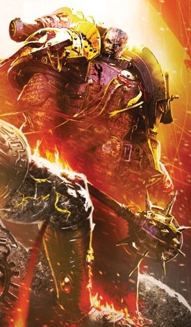
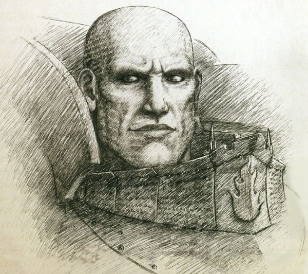
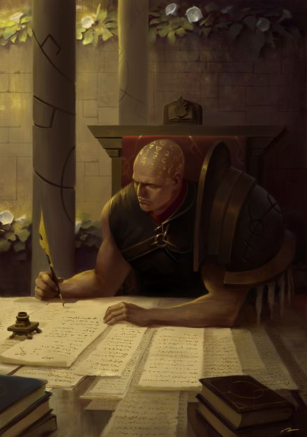
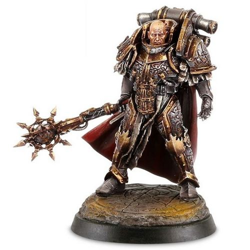
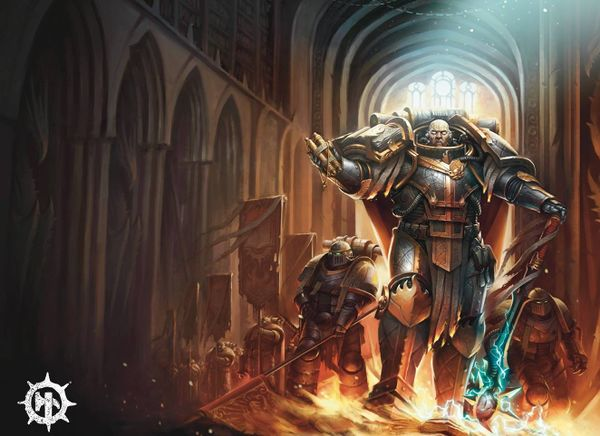
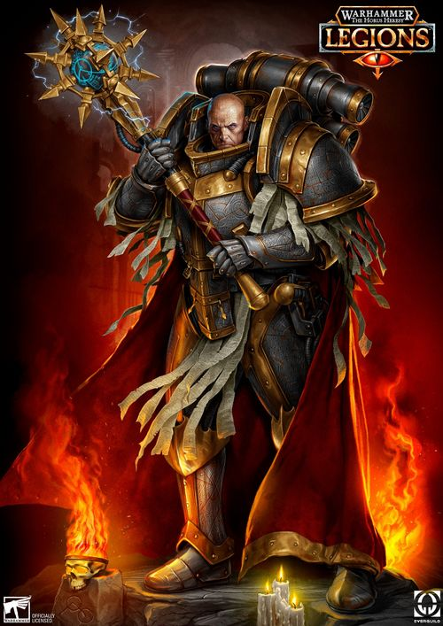
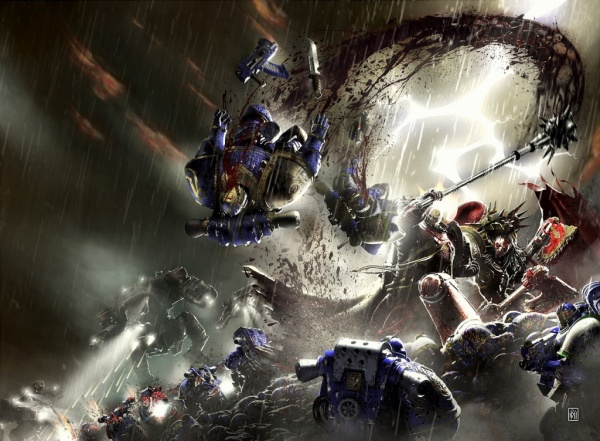
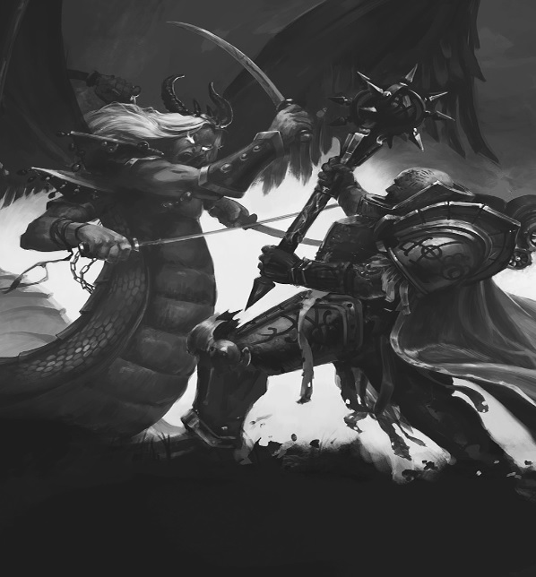
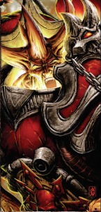

# 0704 珞珈·奥瑞利安 Lorgar Aurelian

精校状态：中文行文已逐段精校，部分术语仍为暂定

分类：人类帝国 / 怀言者

原文来源：https://www.bilibili.com/opus/1102624779000610838

原作者：帝国神选罐头

原文时间：2025年08月19日 08:27

[返回分类目录](目录.md) · [全书目录](../../目录.md)

<!-- A0704-B0001 -->
**英文原文**

"All I ever wanted was the truth"

<!-- /A0704-B0001 -->

<!-- A0704-B0002 -->

原译文

“我想要的只有真实”

**校订译文**

“我所求的，始终只有真理。”

<!-- /A0704-B0002 -->

<!-- A0704-B0003 -->
**英文原文**

Lorgar Aurelian or the Urizen (meaning wisest of the wise in Colchisian) is the Primarch of the Word Bearers, one of the original twenty Space Marine Legions. Fiercely religious and prone to fanaticism, Lorgar yearned for a greater meaning to his existence besides conquest. This quest and the tragic events that befell his perfect city of Monarchia led him to become the first primarch to become seduced by the powers of Chaos. Hiding his new allegiance for many years, he helped to orchestrate the events that led to the Horus Heresy. He has since ascended to daemonhood and bares the self-appointed titles of Archpriest of the Primordial Truth and Minister of Chaos Absolute.

<!-- /A0704-B0003 -->

<!-- A0704-B0004 -->

原译文

珞珈·奥瑞利安或尤里曾（在科尔基斯语中意思是最聪明的人）是怀言者的原体，最初的二十个星际战士军团之一。珞珈是一个狂热的宗教信徒，除了征服，他渴望自己的存在有更大的意义。这一追求和降临在他的完美之城摩纳齐亚的悲剧事件使他成为第一位被混沌力量诱惑的原体。多年来，他一直隐藏着新的忠诚，帮助策划了导致荷鲁斯叛乱的事件。自那以后，他升格为恶魔王子，并自封为原初真理大祭司和绝对混沌牧师。

**校订译文**

珞珈·奥瑞利安，又称尤里曾——科尔基斯语意为“智者中最睿智者”——是怀言者的原体；怀言者是最初二十个星际战士军团之一。他宗教热情强烈，极易走向狂信，渴望在征服之外为自身存在找到更深远的意义。这种追寻，加上理想之城摩纳齐亚遭受的悲剧，使他成为首位被混沌力量诱惑的原体。他将新的效忠对象隐瞒多年，参与策划一系列最终引发荷鲁斯之乱的事件。此后，他升格为恶魔，并自封为“原初真理大祭司”和“绝对混沌牧师”。

**校注：** 英文此段只说 ascended to daemonhood，未指定 Daemon Prince；中文不额外添加恶魔亲王类别。

<!-- /A0704-B0004 -->

<!-- A0704-B0005 图片 -->

<!-- A0704-B0006 -->

原译文

Lorgar, Primarch of the Word Bearers 珞珈，怀言者的原体

**校订译文**

Lorgar, Primarch of the Word Bearers 珞珈，怀言者的原体

<!-- /A0704-B0006 -->

<!-- A0704-B0007 -->
## History 历史

<!-- /A0704-B0007 -->

<!-- A0704-B0008 -->
### Youth 青年

<!-- /A0704-B0008 -->

<!-- A0704-B0009 -->
**英文原文**

The Primarch Lorgar vanished from the gene-labs on Luna while still an infant, along with the other twenty Primarchs. After his spiriting away by the forces of Chaos he was found on a desert feudal planet of Colchis. A nomadic tribe of outcasts known as The Declined under the chieftain Fan Morgal found the infant's shattered capsule and took him in. They named the child Lorgar, or the Rain-caller. Seventeen days later, Lorgar, already grown to the size of a young child, was discovered by Kor Phaeron an exiled priest of the Covenant. Immediately sensing greatness in the boy and believing him blessed by The Powers, Kor Phaeron convinced Lorgar to become his disciple and promptly killed Fan Morgal and his tribe to cover up the boy's identity. Despite enduring Kor Phaeron's vicious abuses, Lorgar fervently believed in the Covenant and researched every aspect of it that he could find, coming to the conclusion that there was a The One that binded the polytheistic Covenant together. Kor Phaeron dismissed such notions initially and often abused Lorgar physically and emotionally. At the same time, Kor Phaeron saw something special in Lorgar and attempted to manipulate him in order to rule over Colchis. Nonetheless, Lorgar remained intensely loyal to Kor Phaeron and even saved his life in a crew mutiny. Lorgar also grew close to those in Kor Phaeron's caravan, which included the captain Axata and slave Nairo.

<!-- /A0704-B0009 -->

<!-- A0704-B0010 -->

原译文

珞珈与其他二十位原体一起，在月球上的基因实验室里消失了，当时他还是个婴儿。在被混沌势力卷走后，他被发现在一个沙漠封建行星科尔基斯上。在首领范·莫加尔的领导下，一个被称为衰落者的游牧部落发现了婴儿破碎的舱体，并把他带了回去。他们给这个孩子起名叫珞珈，或者叫唤雨者。17天后，已经长到小孩大小的珞珈被流亡的圣约牧师科尔·法伦发现。科尔·法伦立即感觉到男孩的伟大，并相信他受到了力量的祝福，他说服珞珈成为他的弟子，并迅速杀死了范·莫加尔和他的部落，以掩盖男孩的身份。尽管忍受了科尔·法伦的恶毒虐待，珞珈仍然坚信圣约，并研究了他能找到的圣约的各个方面，得出的结论是，有一个将多神教圣约联系在一起的上帝。科尔·法伦最初驳斥了这些观念，并经常在身体和情感上虐待珞珈。与此同时，科尔·法伦在珞珈身上看到了一些特别的东西，并试图操纵他来统治科尔基斯。尽管如此，珞珈仍然对科尔·法伦非常忠诚，甚至在一次人员叛乱中救了他的命。珞珈也与科尔·法伦车队中的人越来越亲近，其中包括队长阿夏塔和奴隶奈罗。

**校订译文**

珞珈尚在襁褓时，便与其他原体一同从月球的基因实验室失踪。被混沌力量掳走后，他流落到沙漠封建世界科尔基斯。由流放者组成的游牧部落“衰落者”，在首领范·莫加尔带领下找到破碎的育婴舱，收养了里面的婴儿，给他取名“珞珈”，意为“唤雨者”。十七天后，珞珈已长到幼童大小，流亡的圣约祭司科尔·法伦发现了他。科尔·法伦立即察觉男孩非同寻常，相信他受到诸神赐福，便说服珞珈拜自己为师，随后杀死范·莫加尔及其族人，掩盖男孩的来历。尽管遭受师父残酷虐待，珞珈仍笃信圣约，尽力研究这一信仰的方方面面，最终认为有一位“唯一真神”统摄圣约的众神。科尔·法伦起初斥责这一想法，时常在肉体与精神上虐待他；同时又看中他的特殊之处，试图操纵他，从而统治科尔基斯。即便如此，珞珈仍极为忠诚，甚至在一次随行人员哗变中救了科尔·法伦的命。他还与商队中的其他人日益亲近，包括队长阿夏塔和奴隶奈罗。

**校注：** 英文称“与其他二十位原体”，与本段开头及本书二十位原体总数矛盾，中文简化为“其他原体”并在此标明。此段把实验室设在月球，与书内多处泰拉记述不一致，按本段保留。The One 暂译“唯一真神”，不采用容易引入现实宗教特定含义的“上帝”。

<!-- /A0704-B0010 -->

<!-- A0704-B0011 图片 -->

<!-- A0704-B0012 -->

原译文

Lorgar, Primarch of the Word Bearers 珞珈，怀言者的原体

**校订译文**

Lorgar, Primarch of the Word Bearers 珞珈，怀言者的原体

<!-- /A0704-B0012 -->

<!-- A0704-B0013 -->
**英文原文**

Despite Kor Phaeron's abuse Lorgar quickly surpassed his master. He became a devout preacher, his skill in oratory and the power of his charisma winning him many followers, rising to the position of Archpriest of the Godsworn. After saving Kor Phaeron's life in the crew mutiny, Lorgar was named the new Bearer of the Word by the priest. Lorgar's fame quickly spread thereafter, he began liberating slaves across Colchis. However, as Lorgar grew in standing amongst the people, members of the Covenant began to grow jealous of his popularity. Lorgar's youth was plagued by visions of a mighty warrior in gleaming bronze armour coming to Colchis, a cyclopean giant in blue robes standing beside him. At one point, the visions reached such intensity that Lorgar claimed that the prophesied return of Colchis' god was soon to occur. He began to preach this news to the people of Colchis, causing disruptions to the rule of the Covenant as people converted to his beliefs. Lorgar's enemies in the Covenant saw this as the opportunity they had been waiting for to remove the threat that Lorgar was to the status quo, declaring him a heretic.

<!-- /A0704-B0013 -->

<!-- A0704-B0014 -->

原译文

尽管科尔·法伦虐待了珞珈，但他很快就超越了他的主人。他成为了一名虔诚的传教士，他的演讲技巧和魅力为他赢得了许多追随者，并升任了神誓大祭司。在人员叛乱中救了科尔·法伦的命后，珞珈被牧师任命为新的怀言者。此后，珞珈的名声迅速传开，他开始在科尔基斯解放奴隶。然而，随着珞珈在人民中的地位越来越高，圣约成员开始嫉妒他的声望。珞珈年轻时一直被一个穿着闪闪发光的青铜盔甲的强大战士来到科尔基斯的幻象所困扰，一个穿着蓝色长袍的巨人站在他旁边。有一次，这些幻象达到了如此强烈的程度，以至于珞珈声称，科尔基斯之神的预言回归很快就会发生。他开始向科尔基斯人民宣讲这一消息，导致人们皈依他的信仰，从而扰乱了圣约的规则。珞珈在圣约中的敌人认为这是他们一直在等待的机会，可以消除珞珈对现状的威胁，宣布他为异端。

**校订译文**

尽管饱受科尔·法伦虐待，珞珈仍很快超越师父。他成为虔诚的传教者，以雄辩和人格魅力吸引众多信徒，最终升为神誓大祭司。在哗变中救下科尔·法伦后，后者授予他“怀言者”的称号。珞珈很快声名远播，并开始在科尔基斯各地解放奴隶。然而，随着他在民众中的地位日益提高，圣约成员开始嫉妒其声望。年轻的珞珈反复看到幻象：一位身披闪亮青铜铠甲的强大战士来到科尔基斯，身旁站着蓝袍独眼巨人。后来，幻象变得如此强烈，使他断言预言中科尔基斯之神的归来已近。他向民众传播这一消息，人们纷纷改信，圣约的统治随之动摇。他在圣约中的敌人认定，铲除这个威胁现有秩序之人的时机已到，便宣布他为异端。

**校注：** cyclopean giant 指独眼巨人，原译遗漏“独眼”；此处 Bearer of the Word 为个人宗教称号，区别后来整个军团之名。

<!-- /A0704-B0014 -->

<!-- A0704-B0015 -->
**英文原文**

Those who came forward to arrest Lorgar were killed by his followers. The Covenant split into two factions the followers of the Old Faith and the Brotherhood of Lorgar, and a holy war of immense proportions known as the Schism Wars erupted. Eventually the entire population of Colchis was forced to choose a side. This war lasted six years. Lorgar eventually amassed a massive army that marched on the capital city of Vharadesh. After a fiery sermon before the city gates, they opened to him with lower priests of the Colchis presenting the corpses of the Covenant Ecclesiarch and Hierarchs as a gift. After taking Vharadesh, Lorgar's forces moved from city to city, taking them either peacefully or in some cases putting everyone to the sword for their heresy in refusing The One. After several years of fighting the last city to stand against Lorgar's army was Gahevarla, which was protected by a Dark Age of Technology-era storm generator. Performing a miracle, Lorgar approached the maelstrom around the city and caused the storm to part, allowing his army to swarm through the gap and capture Gahevarla. With that Lorgar was lord of Colchis, but proclaimed that they still had much to do. Possibly as part of this conflict, or after it, one in three of Colchis were said to turn against Lorgar, and the first Great Purge was conducted by the Brotherhood's fanatically loyal warrior-monks hand-picked by Lorgar.

<!-- /A0704-B0015 -->

<!-- A0704-B0016 -->

原译文

那些站出来逮捕珞珈的人被他的追随者杀害了。圣约分裂成两个派别 — 旧信仰的追随者和珞珈兄弟会，爆发了一场被称为分裂战争的大规模圣战。最终，科尔基斯的全体居民被迫选择一方。这场战争持续了六年。珞珈最终集结了一支庞大的军队，向首都维拉德什进军。在城门前进行了一场激烈的布道后，他们向他敞开大门，科尔基斯的下级牧师将圣约传教士和族长的尸体作为礼物赠送给他。在占领了维拉德什之后，珞珈的部队从一个城市移动到另一个城市，要么和平地占领他们，要么在某些情况下，因为他们拒绝神的异端行径而将所有人置于刀锋之下。经过几年的战斗，最后一个对抗珞珈军队的城市是加赫瓦拉，它受到了黑暗技术时代风暴发生器的保护。珞珈奇迹般地接近了城市周围的漩涡，使风暴分开，让他的军队蜂拥穿过缺口，占领了加赫瓦拉。珞珈是科尔基斯的领主，但他宣称他们还有很多事情要做。可能是在这场冲突中，或者在冲突之后，据说三分之一的科尔基斯人反抗珞珈，第一次大清洗是由珞珈亲自挑选的兄弟会狂热忠诚的战士僧侣进行的。

**校订译文**

前来逮捕珞珈的人被信徒杀死，圣约分裂为旧信仰追随者与珞珈兄弟会两派，爆发了规模空前的“分裂战争”。科尔基斯所有居民最终都被迫选边，这场战争持续了六年。珞珈集结庞大军队，进军首都维拉德什。他在城门外慷慨布道后，城门为之敞开；城内低阶祭司奉上圣约教宗及高阶祭司的尸体，作为归顺的礼物。此后，珞珈的军队逐城推进，有些城市和平归降，另一些则因拒绝承认唯一真神，被判为异端而遭全城屠杀。数年后，最后抵抗的城市加赫瓦拉仍受到一台黑暗科技时代风暴发生器的保护。珞珈走近环城的狂风，施展奇迹，使风暴分开；大军随即涌入缺口，攻陷城市。至此，他成为科尔基斯之主，却宣称众人还有许多工作要做。据说，在这场战争期间或结束之后，科尔基斯三分之一的人口曾转而反对他。为此，他亲自挑选、狂热效忠的兄弟会战斗僧侣发动了第一次大清洗。

**校注：** Ecclesiarch 与 Hierarchs 是科尔基斯圣约教职，暂译教宗与高阶祭司；不是帝国国教会或血缘族长。

<!-- /A0704-B0016 -->

<!-- A0704-B0017 -->
**英文原文**

Less than a year after the victory of Lorgar's people, a landing craft carrying the Emperor and Magnus the Red, along with two Tactical Squads of Thousand Sons Space Marines descended from orbit and landed near the temple. Lorgar was said to immediately recognize these people as the ones in his visions, and swore his fealty to his father and creator. Every facet of the Covenant's belief structure was reorganized towards the worship of the Emperor as their saviour, and the people of Colchis united behind their new god. The elaborate celebrations and displays of piety lasted for months, although it was said that the Emperor did not approve of this, wishing to rejoin the Great Crusade as soon as possible. At the conclusion of the celebrations, Lorgar was made commander of the Seventeenth Space Marine Legion, which was then known as the Imperial Heralds but was soon renamed the Word Bearers.

<!-- /A0704-B0017 -->

<!-- A0704-B0018 -->

原译文

在珞珈的人民胜利不到一年后，一艘载有帝皇和赤红之马格努斯的登陆舰，以及两支千子星际战士战术小队从轨道上降落，在神庙附近着陆。据说珞珈立刻认出这些人就是他幻象中的人，并发誓效忠他的父亲和创造者。圣约信仰结构的每一个方面都被重新组织，以崇拜帝皇作为他们的救世主，科尔基斯人民团结在他们的新神后面。精心策划的庆祝活动和虔诚的展示持续了几个月，尽管据说帝皇不赞成这一点，希望尽快重新加入大远征。在庆祝活动结束时，珞珈被任命为第十七星际战士军团的指挥官，该军团当时被称为帝国传道者，但很快被重新命名为“怀言者”。

**校订译文**

珞珈一方获胜不到一年，一艘载着帝皇、红魔马格努斯及两个千子战术小队的登陆艇，从轨道降落在神庙附近。据说珞珈立刻认出他们就是幻象中的来客，向自己的父亲与创造者宣誓效忠。圣约整个信仰体系被重新塑造，改为将帝皇奉作救主，科尔基斯民众也团结在新神之下。盛大的庆典与虔敬仪式持续数月，但据说帝皇对此并不赞同，希望尽快重返大远征。庆典结束后，珞珈受命统率第十七军团。军团当时称为帝国先驱，不久便改名为怀言者。

<!-- /A0704-B0018 -->

<!-- A0704-B0019 图片 -->

<!-- A0704-B0020 -->

原译文

Young Lorgar 青年珞珈

**校订译文**

Young Lorgar 青年珞珈

<!-- /A0704-B0020 -->

<!-- A0704-B0021 -->
### The Great Crusade 大远征

<!-- /A0704-B0021 -->

<!-- A0704-B0022 -->
**英文原文**

Lorgar led his Legion throughout the Great Crusade, the Word Bearers seeking to eliminate all blasphemy and heresy within the new Imperium. Ancient texts and icons were burned. The construction of vast monuments and cathedrals venerating the Emperor was supervised. The greatest Chaplains of the Word Bearers produced enormous works on the divinity and righteousness of the Emperor, and gave grand speeches and sermons to the masses. The progress of the Word Bearers was slow, but domination of the defeated was complete. At some point during this period, Lorgar penned the Lectitio Divinitatus, postulating the worship of the Emperor as a divine being. This book would later become instrumental in the founding of the Imperial Cult.

<!-- /A0704-B0022 -->

<!-- A0704-B0023 -->

原译文

珞珈带领他的军团参加了大远征，怀言者寻求消除新帝国内的所有亵渎和异端。古代文字和图标被烧毁。为纪念帝皇而建造的巨大纪念碑和大教堂受到监督。最伟大的怀言者牧师就帝皇的神性和正义创作了大量作品，并向群众发表了盛大的演讲和布道。怀言者的进展缓慢，但对战败者的统治是彻底的。在这一时期的某个时候，珞珈写了圣言录，认为帝皇是神圣的存在。这本书后来成为建立帝国教派的工具。

**校订译文**

珞珈率军投身大远征，怀言者力图扫除新帝国中的一切亵渎与异端。他们焚毁古代典籍和宗教图像，督造敬奉帝皇的巨大纪念碑与大教堂。军团中最杰出的教士撰写鸿篇巨著，颂扬帝皇的神性与正义，并向民众演说布道。怀言者征服的速度虽慢，对征服地区的掌控却十分彻底。此间，珞珈写下《神性论》，主张将帝皇作为神明崇拜。这部著作后来对帝皇信仰的形成起了关键作用。

<!-- /A0704-B0023 -->

<!-- A0704-B0024 图片 -->

<!-- A0704-B0025 -->

原译文

Great Crusade-era Lorgar 大远征时期珞珈

**校订译文**

Great Crusade-era Lorgar 大远征时期珞珈

<!-- /A0704-B0025 -->

<!-- A0704-B0026 -->
**英文原文**

However, the Emperor was not pleased with the lack of progress the Word Bearers were showing, and was even more dismayed at their religious zeal; one of the main goals of the Great Crusade was to free Humanity from the ignorance of religion. And so the Emperor personally reprimanded Lorgar, informing him that the mission of the Space Marines was for battle, not faith. Thus the Emperor ordered the Ultramarines to destroy Lorgar's world-building project on Monarchia. Worse still, the Emperor, accompanied by Roboute Guilliman, forced Lorgar and his entire legion to kneel before him, humiliating the primarch. Lorgar was said to mourn the Emperor's command for a month, speaking to nobody save Erebus and Kor Phaeron, and wearing only "hairshirt" robes. The Emperor was about to reprimand the Legion again for their lack of action when news reached him that the Word Bearers had gone back on the offensive, and this time, worlds fell before them in rapid order.

<!-- /A0704-B0026 -->

<!-- A0704-B0027 -->

原译文

然而，帝皇对怀言者所展示的进展并不满意，对他们的宗教热情则更加沮丧；大远征的主要目标之一是将人类从对宗教的无知中解放出来。因此，帝皇亲自斥责了珞珈，告诉他星际战士的任务是为了战斗，而不是信仰。因此，帝皇命令极限战士摧毁珞珈在摩纳齐亚的世界建设工程。更糟糕的是，帝皇在罗伯特·基里曼的陪同下，强迫珞珈和他的整个军团跪在他面前，羞辱了这位原体。据说珞珈为帝皇的命令哀悼了一个月，除了艾瑞巴斯和科尔·法伦，他只穿着“发衫”长袍。帝皇正准备再次谴责军团缺乏行动，这时他听到消息说，怀言者已经重新发动进攻，这一次，世界在他们面前迅速有序地倒下了。

**校订译文**

然而，帝皇不满怀言者征服进度迟缓，更痛心于他们的宗教狂热：大远征的主要目标之一，正是让人类摆脱宗教带来的蒙昧。他亲自斥责珞珈，指出星际战士的使命在于作战，而非传教，并命令极限战士摧毁珞珈在摩纳齐亚建设的理想之城。更令珞珈蒙羞的是，在罗保特·基里曼陪同下，帝皇强令原体及整个军团跪在自己面前。此后一个月，珞珈悲痛不已，只穿粗毛苦修袍，除艾瑞巴斯与科尔·法伦外不与任何人交谈。帝皇正准备再次责罚军团停滞不前，消息却传来：怀言者已重启攻势，而且这一次，一个接一个世界迅速陷落。

**校注：** hairshirt 是贴身穿着以自苦修行的粗毛衣，原译“发衫”不通；原译还漏去了除两人外不与任何人交谈的内容。ignorance of religion 在上下文中指宗教造成的蒙昧，不是缺乏宗教知识。

<!-- /A0704-B0027 -->

<!-- A0704-B0028 图片 -->

<!-- A0704-B0029 -->

原译文

Lorgar during the Great Crusade 大远征时期的珞珈

**校订译文**

Lorgar during the Great Crusade 大远征时期的珞珈

<!-- /A0704-B0029 -->

<!-- A0704-B0030 -->
### The Corruption 腐化

<!-- /A0704-B0030 -->

<!-- A0704-B0031 -->
**英文原文**

It was this event, roughly 43 years before the beginning of the Horus Heresy, that turned the Word Bearers to Chaos. Whilst Lorgar brooded over the Emperor's reproach, Kor Phaeron and Erebus, his top lieutenants, whispered to Lorgar of the great Chaos gods: beings that welcomed, even demanded zealous worship and devotion. Lorgar was slowly poisoned against the Emperor by Kor Phaeron and Erebus, who were appointed Master of the Faith and First Chaplain respectively, and were tasked with converting the entire legion to Chaos. After a failed attempt to get answers on the nature of the universe from his close friend and brother Magnus, Lorgar decided to go on a pilgrimage to discover the truth for himself. Eventually Lorgar's psychic abilities lured him to newly-discovered Cadia, insisting he heard a voice calling for him. There, he encountered Ingethel the Ascended who showed him the "Primordial Truth" of the universe. Ingethel convinced Lorgar that humanity had to accept and welcome the Gods of Chaos, and failing to do so would have their race share the same fate as the Eldar. Finally, after being shown a horrifying vision of the future (hinted to be the Emperor on the Golden Throne), Lorgar was finally converted by the Ruinous Powers. The Word Bearers came to venerate the gods of Chaos, but instead of throwing their support to one god, they worshiped Chaos Undivided, a pantheon composed of the four Chaos gods.

<!-- /A0704-B0031 -->

<!-- A0704-B0032 -->

原译文

正是这一事件，大约在荷鲁斯叛乱开始前43年，使怀言者堕入混沌。当珞珈为帝皇的责备而沉思时，他的最高副官科尔·法伦和艾瑞巴斯向珞珈低声讲述了伟大的混沌诸神：欢迎甚至要求狂热崇拜和奉献的生物。珞珈慢慢地被科尔·法伦和艾瑞巴斯腐化，他们分别被任命为信仰之主和第一牧师，并负责将整个军团转变为混沌。在试图从他的亲密朋友和兄弟马格努斯那里得到关于宇宙本质的答案失败后，珞珈决定去朝圣，为自己发现真相。最终，珞珈的灵能能力将他吸引到了新发现的卡迪亚，并坚称他听到了一个呼唤他的声音。在那里，他遇到了升天者英格泰尔，英格泰尔向他展示了宇宙的“原初真理”。英格泰尔说服珞珈，人类必须接受并欢迎混沌诸神，否则他们的种族将与灵族共享同样的命运。最后，在被展示了一个可怕的未来幻象（暗示是黄金王座上的帝皇）后，珞珈终于被毁灭力量皈依了。怀言者开始崇拜混沌诸神，但他们没有支持一个神，而是崇拜由四个混沌之神组成的万神殿 — 混沌无分。

**校订译文**

正是摩纳齐亚事件——约发生在荷鲁斯之乱前四十三年——使怀言者走向混沌。珞珈沉浸于帝皇斥责带来的痛苦时，最重要的两名副手科尔·法伦和艾瑞巴斯向他低声讲述混沌诸神：那些存在不仅接受狂热崇拜，甚至要求信徒倾心奉献。两人逐渐挑起他对帝皇的敌意，分别获任信仰之主与首席教士，并奉命使全军团皈依混沌。珞珈曾向挚友、兄弟马格努斯追问宇宙本质，却未获答案，于是决定亲自踏上朝圣之路。他声称听见某个声音呼唤自己，灵能指引他前往新近发现的卡迪亚。在那里，升天者英格泰尔向他展示宇宙的“原初真理”，说服他相信，人类必须接纳混沌诸神，否则将重蹈灵族覆辙。又一个可怕的未来幻象——暗示是端坐黄金王座的帝皇——最终令珞珈投向毁灭诸力。怀言者从此崇拜混沌诸神，但并不独奉某一位，而是敬拜由四神共同构成的混沌无分。

<!-- /A0704-B0032 -->

<!-- A0704-B0033 图片 -->

<!-- A0704-B0034 -->

原译文

Lorgar 珞珈

**校订译文**

Lorgar 珞珈

<!-- /A0704-B0034 -->

<!-- A0704-B0035 -->
**英文原文**

Later, Lorgar journeyed with Ingethel the Ascended deeper into the Eye of Terror where he defeated an Eldar Avatar upon a shattered Crone World and went on to best the mighty Bloodthirster An'ggrath the Unbound in battle, a sign he was chosen by the Dark Gods. After the fight, Lorgar met Kairos Fateweaver who told him that Lorgar now had a choice: he could achieve either personal vengeance for his shame by slaying Roboute Guilliman in the future (a hint at the Battle of Calth, still decades away) but thus doom Horus in his rebellion or put personal satisfaction aside and taste the shame and bitterness forever but work for the greater goal of illuminating humanity with the Primordial Truth. Fateweaver made it clear how vital this decision would be, as this was a rare occasion where both his heads spoke the truth. Contemplating his course of action the last stage of this pilgrimage, Lorgar demanded to see a vision of the future if the forces of Chaos lost the upcoming war with the Imperium. What Lorgar saw changed him forever.

<!-- /A0704-B0035 -->

<!-- A0704-B0036 -->

原译文

后来，珞珈与升天者英格泰尔一起深入恐惧之眼，在那里他在破碎的老妪世界击败了一个灵族化身，并在战斗中击败了强大的嗜血狂魔安’格拉斯，这表明他被黑暗诸神选中了。战斗结束后，珞珈遇到了卡洛斯·织命者，后者告诉他，珞珈现在有一个选择：他可以在未来通过杀死罗伯特·基里曼来为自己的耻辱进行个人复仇（这暗示了几十年后的考斯之战），但这样就注定了荷鲁斯的叛乱，或者把个人满足放在一边，永远品尝耻辱和苦涩，但要为用原初真理照亮人类这一更大的目标而努力。织命者清楚地表明了这一决定的重要性，因为这是他两个脑袋都说出真相的罕见场合。在这次朝圣的最后阶段，珞珈思考着自己的行动方针，他要求看到一个未来的幻象，如果混沌势力在即将到来的与帝国的战争中失利。珞珈所看到的永远地改变了他。

**校订译文**

后来，珞珈随英格泰尔进一步深入恐惧之眼，在一颗破碎的老妪世界上击败灵族化身，又战胜强大的嗜血狂魔无束者安’格拉斯，显示出自己受到黑暗诸神眷顾。此后，他遇见凯洛斯·织命者，得知自己面临选择：将来可以杀死罗保特·基里曼，洗雪耻辱——这暗指尚在数十年后的考斯之战——但这样做将注定荷鲁斯的叛乱失败；或者放下私人复仇，永远忍受羞耻与苦涩，为以原初真理启迪人类这一更大目标努力。这一选择至关重要，以至于织命者的两个头罕见地同时说了真话。在朝圣的最后阶段，珞珈思索未来道路，要求看见混沌若在即将到来的对帝国战争中战败，会出现怎样的未来。他看见的景象永远改变了他。

**校注：** doom Horus in his rebellion 指使荷鲁斯的叛乱注定失败，原译“注定了叛乱”漏掉结局。An’ggrath the Unbound 沿全书定译“无束者安’格拉斯”。

<!-- /A0704-B0036 -->

<!-- A0704-B0037 -->
### Horus Heresy 荷鲁斯之乱

原题：Horus Heresy 荷鲁斯叛乱

<!-- /A0704-B0037 -->

<!-- A0704-B0038 -->
**英文原文**

Now an agent of Chaos, Lorgar dispatched his trusted subordinate Erebus to Davin. There, the First Chaplain orchestrated a series of events in cooperation with Davin Chaos Cult priests that saw Horus corrupted by the Ruinous Powers. The Legion kept their new devotion secret, until Warmaster Horus declared his own faith in Chaos, and began the galactic civil war known as the Horus Heresy. The Word Bearers quickly joined the rebellion, and many of the worlds they had conquered since their conversion turned as well, having been corrupted by the Word Bearers during their conquest. During the Drop Site Massacre, Lorgar and his Word Bearers revealed their true colors along with the Night Lords, Alpha Legion, and Iron Warriors. Lorgar engaged Corax in combat, with the Raven Guard Primarch having the upper hand until the intervention of Curze. During the Traitor War Council after the battle on Isstvan V, Lorgar encountered the Daemonically-possessed Fulgrim and in a rage viciously assaulted the corrupted Primarch. Only the intervention of Horus himself stayed Lorgar's hand, for Lorgar saw total daemonic possession as opposed to a "shared" bond between vessel and Daemon as a perversion of the natural order.

<!-- /A0704-B0038 -->

<!-- A0704-B0039 -->

原译文

现在，珞珈是混沌的特工，他派遣了他信任的下属艾瑞巴斯前往戴文。在那里，第一牧师与戴文混沌教派牧师合作策划了一系列事件，目睹了荷鲁斯被毁灭力量腐化。军团一直对他们的新忠诚保密，直到战帅荷鲁斯宣布他对混沌的信仰，并开始了被称为荷鲁斯叛乱的银河内战。怀言者很快加入了叛乱，他们皈依后征服的许多世界也发生了变化，在征服过程中被怀言者腐化了。在登陆点大屠杀期间，珞珈和他的怀言者与午夜领主、阿尔法军团和钢铁勇士一起揭露了他们的真实面目。珞珈在战斗中与科拉克斯交战，暗鸦守卫原体占据上风，直到科兹介入。在伊斯塔万五号之战后的叛徒战争议会期间，珞珈遇到了被恶魔附身的福格瑞姆，并在愤怒中恶毒地袭击了腐化的原体。只有荷鲁斯本人的干预阻止了珞珈的行动，因为珞珈认为，完全的恶魔占据，而不是载体和恶魔之间的“共享”纽带，是对自然秩序的歪曲。

**校订译文**

成为混沌的代理人后，珞珈派心腹艾瑞巴斯前往戴文。首席教士与当地混沌教派祭司合作，策划一连串事件，最终让荷鲁斯被毁灭诸力腐化。怀言者始终隐瞒新的信仰，直到荷鲁斯公开投向混沌，发动席卷银河的内战。军团迅速响应；皈依混沌后征服的许多世界，也因早已受到他们腐化而一同叛变。在登陆点大屠杀中，珞珈与怀言者和午夜领主、阿尔法军团、钢铁勇士一起暴露真实立场。珞珈与科拉克斯交战，被暗鸦守卫原体压制，直到科兹介入。伊斯塔万五号之战后的叛军战争会议上，珞珈发现福格瑞姆遭恶魔附体，愤怒地向其发动猛攻，直到荷鲁斯亲自制止才罢手。在他看来，宿主与恶魔之间应当建立“共享”的结合；由恶魔彻底占据宿主，是对自然秩序的亵渎。

<!-- /A0704-B0039 -->

<!-- A0704-B0040 -->
**英文原文**

The majority of the Legion was ordered by Horus to see to the entanglement and possible destruction of the Ultramarines Legion, so that their vast forces could not be brought to bear against Horus' march towards Holy Terra. This was a task the Word Bearers took up with joy, for as the Emperor had chastised the Word Bearers for their faith, the Ultramarines had become his favoured Legion. The assault on Ultramar was led by Kor Phaeron, who swore to utterly destroy the Ultramarines. The Word Bearers ambushed the Ultramarines at Calth, an attack which eventually turned against them. When help from the Ultramarines' homeworld Macragge arrived the Word Bearers were routed from the system.

<!-- /A0704-B0040 -->

<!-- A0704-B0041 -->

原译文

荷鲁斯命令军团的大部分成员负责处理极限战士军团的纠缠和可能的毁灭，这样他们的庞大部队就无法对抗荷鲁斯向圣地进军。这是怀言者们高兴地承担的任务，因为当帝皇因为怀言者的信仰而惩罚他们时，极限战士已经成为他最喜欢的军团。对奥特拉玛的进攻由科尔·法伦领导，他发誓要彻底摧毁极限战士。怀言者在考斯伏击了极限战士，这次袭击最终对他们不利。当极限战士的家园世界马库拉格的援军到达时，怀言者从星系中被击败。

**校订译文**

荷鲁斯命怀言者军团主力牵制极限战士，并尽可能将其消灭，防止这支庞大军队阻挠自己向神圣泰拉进军。怀言者欣然领命：他们因信仰受到帝皇责罚时，极限战士却成了帝皇宠爱的军团。科尔·法伦率军进攻奥特拉玛，发誓彻底消灭极限战士。怀言者在考斯设伏，战局却最终逆转。极限战士母星马库拉格的援军抵达后，怀言者遭到击溃，被逐出该星系。

<!-- /A0704-B0041 -->

<!-- A0704-B0042 -->
**英文原文**

During the Heresy at the orders of Horus, Lorgar would team up in the Shadow Crusade with Angron and his World Eaters to strike at Ultramar in an attempt to distract the Ultramarines in conjunction with the Battle of Calth. Lorgar and Angron were on tense terms at first, with the Red Angel delaying the advance by butchering strategically worthless worlds. However the two avoided inter-Legion war when a Dark Eldar assault unified them against a common enemy.

<!-- /A0704-B0042 -->

<!-- A0704-B0043 -->

原译文

在叛乱期间，在荷鲁斯的命令下，珞珈与安格隆和他的吞世者一起参加暗影远征，袭击奥特拉玛，试图在考斯之战中分散奥特拉玛的注意力。起初，珞珈和安格隆关系紧张，红天使通过屠杀战略上毫无价值的世界来拖延前进。然而，当黑暗精灵的进攻使他们团结起来对抗共同的敌人时，两人避免了军团之间的战争。

**校订译文**

叛乱期间，珞珈奉荷鲁斯之命，与安格隆及吞世者发动暗影远征，袭击奥特拉玛，配合考斯之战牵制极限战士。两位原体最初关系紧张，因为红天使不断屠杀毫无战略价值的世界，拖慢推进。后来，黑暗灵族来袭，迫使双方共同迎敌，才避免了两个军团之间爆发战争。

**校注：** Dark Eldar 为黑暗灵族，原译黑暗精灵混淆体系；divert Ultramarines 指牵制极限战士军团，不是分散地区本身的注意力。

<!-- /A0704-B0043 -->

<!-- A0704-B0044 图片 -->

<!-- A0704-B0045 -->

原译文

Lorgar and Angron during the Heresy 叛乱期间的珞珈和安格隆

**校订译文**

Lorgar and Angron during the Heresy 叛乱期间的珞珈和安格隆

<!-- /A0704-B0045 -->

<!-- A0704-B0046 -->
**英文原文**

Lorgar, recognizing Angron's instability and hidden sorrow over his forced departure from Nuceria, recommended that Angron return to his adopted homeworld to find a sense of closure. Lorgar also had the intention to summon a great Warp storm known as the Ruinstorm which would cut off the rest of Ultramar from the Imperium. When the two Primarchs arrived on Nuceria however they discovered that the slave-lords of Nuceria had massacred Angron's comrades and told the population that he had fled during their last stand. Infuriated, Angron ordered that the World Eaters and Word Bearers purge Nuceria of its population and Lorgar willingly took part in the slaughter. Eventually the Ultramarines and Guilliman himself arrived, pursuing the traitors from Calth, and the Lord of Macragge battled first Lorgar then Angron. However this had all gone according to Lorgar's plan, who used the immense rage Angron was emitting to begin a Khornate ritual which transformed the World Eaters Primarch into a monstrous avatar of Chaos, allowing him to overcome the slowly debilitating effects of the Butcher's Nails.

<!-- /A0704-B0046 -->

<!-- A0704-B0047 -->

原译文

珞珈意识到安格隆的不稳定和被迫离开努凯里亚的隐藏悲伤，建议安格隆回到收养他的家园世界，寻找一种封闭感。珞珈还打算召唤一场名为毁灭风暴的巨大亚空间风暴，这场风暴将切断奥特拉玛与帝国的其余部分。然而，当两位原体抵达努凯里亚时，他们发现努凯里亚的奴隶主屠杀了安格隆的战友，并告诉民众，安格隆在最后一次抵抗时逃跑了。愤怒的安格隆命令吞世者和怀言者清除努凯里亚的人口，珞珈心甘情愿地参与了屠杀。最终，极限战士和基里曼亲自赶到，追捕来自考斯的叛徒马库拉格领主先是与珞珈作战，然后是安格隆。然而，这一切都按照珞珈的计划进行了，珞珈利用安格隆发出的巨大愤怒开始了一场恐虐仪式，将吞世者原体变成了混沌的怪物化身，使他能够克服屠夫之钉的缓慢衰弱效果。

**校订译文**

珞珈看出安格隆情绪失控的背后，藏着被迫离开努凯里亚的悲痛，便建议他重返成长的世界，了结心结。珞珈还打算召唤名为“毁灭风暴”的巨型亚空间风暴，将整个奥特拉玛与帝国其余地区隔绝。两位原体抵达努凯里亚后，发现当地奴隶主已屠杀安格隆的旧日战友，还向民众宣称，是安格隆在最后一战中临阵逃跑。安格隆怒不可遏，命吞世者与怀言者杀光当地人口，珞珈也欣然参与。后来，基里曼率极限战士从考斯追击而至，先后与珞珈、安格隆交战。这一切都在珞珈计划之中：他借安格隆迸发的无穷怒火举行恐虐仪式，将吞世者原体转化为混沌的可怖化身，使其摆脱屠夫之钉逐渐损毁身体的影响。

**校注：** a sense of closure 指为创伤经历作个了结，原译“封闭感”误解；原文未说安格隆被收养，adopted homeworld 在此按其成长世界处理。

<!-- /A0704-B0047 -->

<!-- A0704-B0048 -->
**英文原文**

Following the Shadow Crusade, Lorgar began to believe that Horus was too weak to lead the Forces of Chaos to victory over the Emperor. He was disgusted by Horus' refusal to submit before the power of the Gods, and had foreseen that Horus would lead the traitor war effort to defeat. Ultimately, Lorgar became secretly committed to killing Horus and taking his place as Warmaster of Chaos and anointed of the Gods. Lorgar made his move following Horus' fall at Beta-Garmon, appearing on the Vengeful Spirit with Zardu Layak. Though Horus was comatose, he agreed that the traitor's needed to be assembled at Ullanor in preparation for the drive on Terra. However, not all of the traitor Primarch's could be found nor were they all obeying the summons. Thus Lorgar proposed that Perturabo journey to find Angron while he commit himself to finding Fulgrim.

<!-- /A0704-B0048 -->

<!-- A0704-B0049 -->

原译文

在暗影远征之后，珞珈开始相信荷鲁斯太弱了，无法领导混沌势力战胜帝皇。他对荷鲁斯拒绝屈服于众神的力量感到厌恶，并预见到荷鲁斯将领导叛徒的战争努力失败。最终，珞珈秘密地致力于杀死荷鲁斯，并接替他成为混沌战帅和诸神的受膏者。珞珈在荷鲁斯在贝塔-伽蒙陷落后采取了行动，与扎度·拉亚克一起出现在复仇之魂号中。尽管荷鲁斯已经昏迷，但他同意叛徒需要在乌兰诺集结，为在泰拉上的行动做准备。然而，并非所有叛徒原体都能找到，也不是所有人都服从了召唤。因此，珞珈提议佩图拉博在致力于寻找福格瑞姆的同时，前往寻找安格隆。

**校订译文**

暗影远征后，珞珈开始认定荷鲁斯过于软弱，无法率混沌大军战胜帝皇。他厌恶荷鲁斯不肯臣服于诸神，并预见对方将把叛军带向失败，因而暗中决定杀死荷鲁斯，取代他成为混沌战帅和诸神的受膏者。荷鲁斯在贝塔-伽蒙倒下后，珞珈与扎度·拉亚克来到复仇之魂号，开始行动。荷鲁斯虽处于昏沉状态，仍同意在乌兰诺集结叛军，为进攻泰拉作准备。然而，部分叛军原体下落不明，另一些不肯应召。于是，珞珈提议由佩图拉博寻找安格隆，自己负责带回福格瑞姆。

**校注：** 末句两个任务分别由佩图拉博与珞珈承担，原译均接给佩图拉博。

<!-- /A0704-B0049 -->

<!-- A0704-B0050 -->
**英文原文**

Using an oracle disciple of Cyrene Valantion as a guide, Lorgar, Layak, and a small force of Word Bearers entered the Webway in search of Fulgrim. They successfully navigated its treacherous corridors to enter the Eye of Terror, where they found themselves before the Palace of Slaanesh itself. Inside they find Fulgrim and N'Kari engaged in debauchery. Fulgrim refuses to leave his delights and return to the war effort, forcing the two sides to battle. As Lorgar holds off Fulgrim, Zardu Layak utters the True Name of the newly transformed Daemon Primarch. Layak had learned the name from a ritual Lorgar conducted but due to the total amnesia it would eventually give the name's bearer, he had put the burden onto the Dark Apostle instead. Fulgrim was bound to Layak's will by the name's utterance, and Lorgar now had a pawn with which to slay Horus with. After gathering the disparate Emperor's Children together, the two legions arrived at Ullanor for Horus' muster. Horus had by this point recovered thanks to the sacrifice of Maloghurst, and Lorgar revealed his plan to usurp the Warmaster. After sacrificing large amounts of mortal servants, Lorgar planned to unleash a psychic scream that would disorient Horus, then have Zayak order Fulgrim to attack. The Word Bearers and Emperor's Children orbiting Ullanor would finish off the Sons of Horus, leaving Lorgar in control of the traitor war effort.

<!-- /A0704-B0050 -->

<!-- A0704-B0051 -->

原译文

珞珈、拉亚克和一小队怀言者以昔兰尼·瓦兰蒂恩的一名神谕门徒为向导，进入网道寻找福格瑞姆。他们成功地穿越了危险的廊道，进入了恐惧之眼，在那里他们发现自己站在色孽宫殿之前。在里面，他们发现福格瑞姆和纳’卡里正在放荡。福格瑞姆拒绝离开他的喜悦，回到战争努力中，迫使双方开战。当珞珈挡住福格瑞姆时，扎度·拉亚克说出了新转变的恶魔原体的真名。拉亚克是从珞珈主持的仪式中得知这个名字的，但由于完全失忆，这个名字最终会被赋予持有者，他将这个负担转嫁给了黑暗使徒。福格瑞姆被拉亚克的真名所束缚，珞珈现在有了一个可以用来杀死荷鲁斯的棋子。在将分散的皇帝之子聚集在一起后，两个军团抵达乌兰诺，等待荷鲁斯的召集。由于马洛赫斯特的牺牲，荷鲁斯此时已经康复，珞珈透露了他篡夺战帅的计划。在牺牲了大量凡人仆人后，珞珈计划发出一声灵能尖啸，让荷鲁斯迷失方向，然后让拉亚克命令福格瑞姆进攻。绕着乌兰诺的怀言者和帝皇之子将终结荷鲁斯之子，让珞珈控制叛徒战争。

**校订译文**

在昔兰尼·瓦兰蒂恩的一名神谕门徒引导下，珞珈、拉亚克及一小支怀言者进入网道，寻找福格瑞姆。他们穿过危险廊道，进入恐惧之眼，最终来到色孽宫殿，发现福格瑞姆正与纳’卡里沉湎于放纵。福格瑞姆不愿舍弃享乐、返回战场，双方因此交战。珞珈牵制福格瑞姆，拉亚克则念出这位新晋恶魔原体的真名。这个名字来自珞珈举行的仪式；但记住它最终会导致完全失忆，珞珈便将代价转嫁给黑暗使徒。真名出口，福格瑞姆即受制于拉亚克，成为珞珈用来杀死荷鲁斯的棋子。集结四散的帝皇之子后，两军团前往乌兰诺会师。此时，荷鲁斯已因马洛赫斯特的牺牲而恢复。珞珈部署篡位计划：献祭大批凡人仆从后，释放灵能尖啸扰乱荷鲁斯，再让拉亚克命令福格瑞姆进攻；停驻乌兰诺轨道的怀言者与帝皇之子则歼灭荷鲁斯之子，从而让珞珈接掌叛军。

**校注：** 失忆是记住恶魔真名所付代价，承担者是拉亚克，不是福格瑞姆取得真名后失忆；英文 Zayak 与前文 Layak 不同，视为同人拼写误差，中文统一拉亚克。

<!-- /A0704-B0051 -->

<!-- A0704-B0052 图片 -->

<!-- A0704-B0053 -->

原译文

Lorgar battles Fulgrim 珞珈与福格瑞姆战斗

**校订译文**

Lorgar battles Fulgrim 珞珈与福格瑞姆战斗

<!-- /A0704-B0053 -->

<!-- A0704-B0054 -->
**英文原文**

However Lorgar's coup quickly fell apart, as Actaea had tipped Horus off to his treachery. Upon meeting Horus on Ullanor Lorgar was immediately assailed before he could unleash his psychic assault, and Zardu Layak freed Fulgrim from his bindings instead of ordering him to attack. Lorgar was beaten mercilessly by Horus, who threw him his weapon and demanded he stand and fight. Lorgar refused to fight, and instead expressed pity at the monstrosity Horus had become since his recovery, consisting of an ever-shifting form with a maw of dark energy at its core. Horus ordered Lorgar to leave his sight, pledging to kill him if he ever returned. The Word Bearers under Lorgar's command who followed Zardu Layak would continue to serve Horus. Lorgar left for destinations unknown, proclaiming that Horus was doomed to failure due to his weakness.

<!-- /A0704-B0054 -->

<!-- A0704-B0055 -->

原译文

然而，珞珈的政变很快就失败了，因为阿克泰向荷鲁斯告密。在乌兰诺上遇到荷鲁斯后，珞珈在发动灵能攻击之前立即遭到攻击，扎度·拉亚克将福格瑞姆从束缚中解放出来，而不是命令他攻击。珞珈被荷鲁斯无情地殴打，荷鲁斯扔给他武器，要求他站起来战斗。珞珈拒绝战斗，而是对荷鲁斯康复后变成的怪物表示同情，荷鲁斯由一个不断变化的形态组成，其核心是无底洞的黑暗能量。荷鲁斯命令珞珈离开他的视线，并发誓如果他回来就杀了他。跟随扎度·拉亚克的珞珈指挥下的怀言者将继续为荷鲁斯服务。珞珈前往未知的目的地，宣称荷鲁斯因软弱而注定要失败。

**校订译文**

政变很快瓦解，因为阿克泰已将珞珈的背叛告知荷鲁斯。乌兰诺会面时，珞珈还来不及释放灵能攻势就遭袭；拉亚克也没有命福格瑞姆进攻，而是解除了对他的控制。荷鲁斯将珞珈痛殴一顿，又把他的武器扔还给他，命他站起来反抗。珞珈却拒绝动手，只怜悯地看着荷鲁斯康复后所变成的怪物：躯体不断变幻，核心仿佛一张黑暗能量构成的巨口。荷鲁斯命他滚出自己的视线，宣称若他再敢回来便将其杀死。愿意追随拉亚克的怀言者留下，继续效忠战帅；珞珈则去向不明，临走仍宣称荷鲁斯必将因软弱而败亡。

<!-- /A0704-B0055 -->

<!-- A0704-B0056 -->
**英文原文**

As the Word Bearers battled across Ultima Segmentum, the rest of the Word Bearers were led by Zardu Layak to Terra. Lorgar began to wander, gathering a force of Word Bearers and arriving at the primitive world of Yssimae. The Word Bearers were welcomed by its population, and together they began to enact rituals of divination to observe the final battle playing out on Terra. Lorgar resumes communications with Erebus, and eventually learns of the death of Sanguinius and portents that spell the certain death of the Emperor. Lorgar orders the Word Bearers move out, but not before burning Yssimae.

<!-- /A0704-B0056 -->

<!-- A0704-B0057 -->

原译文

当怀言者在极限星域上战斗时，其他怀言者者由扎度·拉亚克带领到泰拉。珞珈开始四处游荡，聚集了一批怀言者部队，到达了伊西玛原始世界。怀言者受到当地民众的欢迎，他们开始一起制定占卜仪式，观察在泰拉上进行的最后一场战斗。珞珈恢复了与艾瑞巴斯的沟通，最终得知了圣吉列斯的死亡以及预示着帝皇一定会死亡的征兆。珞珈命令怀言者离开，但不是在伊西玛之焚之前。

**校订译文**

一部分怀言者在极限星域四处征战，另一部分则由拉亚克率领前往泰拉。珞珈开始游历，集结一支部队，抵达原始世界伊西玛。当地居民欢迎怀言者，双方共同举行占卜仪式，观看泰拉最终决战的进展。珞珈恢复与艾瑞巴斯联系，得知圣吉列斯之死，也看到了预示帝皇必死的征兆。他随后下令部队离开，但先将伊西玛焚毁。

**校注：** not before burning Yssimae 指焚毁之后才离开，原译双重否定不通；帝皇必死为预兆内容，保留叙述立场，不当成已发生事实。

<!-- /A0704-B0057 -->

<!-- A0704-B0058 -->
**英文原文**

After the defeat of Horus, the Word Bearers took refuge within the Eye of Terror and the Maelstrom, vast wounds in space where the Immaterium leaked into reality.

<!-- /A0704-B0058 -->

<!-- A0704-B0059 -->

原译文

荷鲁斯战败后，怀言者们躲进了恐惧之眼和大漩涡之中，这是宇宙中巨大的伤口，在那里，非物质界逐渐成为现实。

**校订译文**

荷鲁斯战败后，怀言者逃入恐惧之眼与大漩涡避难。这两处巨大的空间创口，让非物质界渗入现实。

<!-- /A0704-B0059 -->

<!-- A0704-B0060 -->
### Post-Heresy 叛乱后

<!-- /A0704-B0060 -->

<!-- A0704-B0061 -->
**英文原文**

Eventually, the atrocities committed by the Word Bearers allowed for Lorgar's ascension to Daemonhood, becoming the equal of a god in the eyes of his Legion. It is said his birth scream echoed across the Immaterium with triumphant vindication, his faith and devotion rewarded with immortality and unbridled power. He has since isolated himself within the Templum Inficio on the daemon world of Sicarus where he has remained for thousands of years, forbidding anyone to interrupt his meditation.

<!-- /A0704-B0061 -->

<!-- A0704-B0062 -->

原译文

最终，怀言者所犯下的暴行使珞珈得以升格为恶魔王子，在他的军团眼中成为了一个平等的神。据说，他的诞生尖啸在非物质界回荡，胜利地证实，他的信仰和奉献得到了不朽和不受约束的力量的回报。自那以后，他将自己隔离在西卡鲁斯恶魔世界的污染圣殿中，并在那里呆了数千年，禁止任何人打断他的冥想。

**校订译文**

最终，怀言者犯下的暴行使珞珈得以升魔，在军团眼中成为与神明比肩的存在。据说，他获得新生时的长啸响彻非物质界，仿佛以胜利宣告自己的信念得到证实；不朽生命与无穷力量，正是对其虔信和奉献的奖赏。此后，他闭居恶魔世界西卡鲁斯的污染圣殿，持续冥想数千年，禁止任何人打扰。

**校注：** daemonhood 仅表升魔状态，未写 Daemon Prince；按原文保留。后面的图注及武器段明确使用 Daemon Prince 时，译为恶魔亲王。

<!-- /A0704-B0062 -->

<!-- A0704-B0063 图片 -->

<!-- A0704-B0064 -->

原译文

Lorgar, Daemon Prince of Chaos 珞珈，混沌恶魔王子

**校订译文**

Lorgar, Daemon Prince of Chaos 珞珈，混沌恶魔亲王

<!-- /A0704-B0064 -->

<!-- A0704-B0065 -->
**英文原文**

Lorgar temporarily broke his exile to aid Word Bearers against a monstrosity that was hunting them. The creature was eventually revealed to be Corax, who had become mutated by the powers of the Warp during his quest for vengeance against the Traitor Primarchs. Lorgar and Corax engaged in a duel once more, with the Ravenlord dominating the engagement and forcing Lorgar to withdraw through the portal he had arrived in. As the portal between them closed, Corax stated that he now had Lorgar's scent and would hunt him down.

<!-- /A0704-B0065 -->

<!-- A0704-B0066 -->

原译文

珞珈暂时结束了他的流放，帮助怀言者对抗一个正在追捕他们的怪物。这个生物最终被发现是科拉克斯，他在寻求对叛徒原体复仇的过程中被亚空间的力量变异了。珞珈和科拉克斯再次决斗，渡鸦领主主导了这场决斗，迫使珞珈从他到达的入口撤退。当他们之间的入口关闭时，科拉克斯表示，他现在有珞珈的气息，会追捕他。

**校订译文**

珞珈曾暂时结束隐居，援助遭某个怪物猎杀的怀言者。怪物最终被认出是科拉克斯：他在追杀叛军原体的过程中，形态受到亚空间力量改变。两人再度决斗，渡鸦领主始终占据上风，迫使珞珈退回来时的传送门。门户关闭前，科拉克斯宣称自己已经记住他的气息，必会追猎到底。

<!-- /A0704-B0066 -->

<!-- A0704-B0067 -->
### Exile's End 流放之终

<!-- /A0704-B0067 -->

<!-- A0704-B0068 -->
**英文原文**

After ten thousand years of seclusion into the Warp, Lorgar is finally rumored to have returned at the close of the 41st Millennium and formation of the Great Rift. It is said that he has been seen walking mortal realms in terrible splendor, preaching the word of Chaos at the head of a massive Word Bearers force.

<!-- /A0704-B0068 -->

<!-- A0704-B0069 -->

原译文

经过一万年的隐居，珞珈终于在第41个千年结束和大裂隙形成时回来了。据说，有人看到他以可怕的辉煌行走在凡世领域，在一支庞大的怀言者部队之上宣讲混沌之言。

**校订译文**

传闻在第 41 个千年末、大裂隙形成之际，隐居亚空间一万年的珞珈终于归来。据说，有人看见他带着可怖的辉光行走凡世，率领庞大的怀言者大军，宣讲混沌之道。

**校注：** 英文 rumored、it is said 均表传闻；原译首句删去传闻限定，已补回。

<!-- /A0704-B0069 -->

<!-- A0704-B0070 -->
## Character 性格

<!-- /A0704-B0070 -->

<!-- A0704-B0071 -->
**英文原文**

Sorot Tchure, one of the Word Bearers' Captains who took part in the Battle of Calth, confided to his friend, Honorius Luciel of the Ultramarines, that Lorgar had been a burden to his own legion for many years; every bit as brilliant and charismatic as the other primarchs, but also moody and mercurial.

<!-- /A0704-B0071 -->

<!-- A0704-B0072 -->

原译文

参加了考斯之战的怀言者连长之一索洛特·绰尔向他的朋友、极限战士的霍诺里乌斯·卢西尔透露，珞珈多年来一直是他自己军团的负担；每一点都和其他原体一样聪明和有魅力，但也喜怒无常。

**校订译文**

参与考斯之战的怀言者连长索罗特·丘尔，曾向极限战士好友霍诺留斯·卢西尔坦言：珞珈多年来一直是军团的负担。他的才智与魅力不逊于任何原体，却又情绪多变、反复无常。

<!-- /A0704-B0072 -->

<!-- A0704-B0073 -->
**英文原文**

Roboute Guilliman echoed this sentiment, after a brief conversation with his brother:

<!-- /A0704-B0073 -->

<!-- A0704-B0074 -->

原译文

罗伯特·基里曼在与他的兄弟简短交谈后回应了这一观点：

**校订译文**

罗保特·基里曼与兄弟简短交谈后，也表达了类似看法：

<!-- /A0704-B0074 -->

<!-- A0704-B0075 -->
**英文原文**

He is so... changeable. He is so prone to extremes. Eager to please, so quick to take offence. He's so keen to be your best friend, and then, at the slightest hint of an insult, he's angry with you. Furious. Offended. Like a child.

<!-- /A0704-B0075 -->

<!-- A0704-B0076 -->

原译文

他是如此…多变。他很容易走极端。渴望取悦，很快就发怒。他非常想成为你最好的朋友，然后，只要有一丝侮辱，他就会生你的气。愤怒。冒犯。像个孩子。

**校订译文**

他实在……太多变了，总是走向极端。他急于讨人喜欢，也极易觉得受辱。他那么渴望成为你最亲密的朋友，可只要察觉一点侮辱的意思，就会恼怒，暴跳如雷，满心委屈，像个孩子。

<!-- /A0704-B0076 -->

<!-- A0704-B0077 -->
**英文原文**

Even after suffering the worst effects of the Word Bearers' treason, Guilliman said he felt his brother's pain, felt that Lorgar had been manipulated by forces beyond his control and was agonized at what these forces had pushed him to do. However after the Drop Site Massacre and his duel with Corax, it was said by those around him (Magnus, Horus, and Guilliman) that Lorgar had changed and became a different person. Dubbing himself the "Minister of Chaos Absolute", he became more accepting of war and violence, developed grand schemes and manipulations, enhanced his combat prowess, and his mastery of the Warp rapidly outpaced that of Erebus and Kor Phaeron who began to realize they could no longer control him.

<!-- /A0704-B0077 -->

<!-- A0704-B0078 -->

原译文

基里曼说，即使在遭受了怀言者叛国的最严重影响之后，他也感受到了他兄弟的痛苦，觉得逻辑爱被他无法控制的力量操纵，并对这些力量迫使他做的事情感到痛苦。然而，在登陆点大屠杀和他与科拉克斯的决斗之后，他周围的人（马格努斯、荷鲁斯和基里曼）说，珞珈已经变了，变成了一个不同的人。他自称“绝对混沌牧师”，对战争和暴力更加接受，制定了宏伟的计划和操纵，增强了自己的战斗能力，他对亚空间的掌握迅速超过了艾瑞巴斯和科尔·法伦，他们开始意识到他们无法再控制他。

**校订译文**

即使承受了怀言者背叛造成的惨重后果，基里曼仍说自己能体会兄弟的痛苦：珞珈被无法掌控的力量操纵，又为这些力量逼自己做出的事情而煎熬。然而，登陆点大屠杀及与科拉克斯的决斗之后，马格努斯、荷鲁斯和基里曼等人都认为，珞珈已判若两人。他自称“绝对混沌牧师”，愈发接受战争与暴力，策划庞大的阴谋，操纵他人，战斗能力也显著提高。他对亚空间的掌握很快超过艾瑞巴斯与科尔·法伦，使两人意识到自己再也无法控制他。

<!-- /A0704-B0078 -->

<!-- A0704-B0079 -->
**英文原文**

Lorgar himself was bitter over his existence as a soldier bred for nothing but war. Wanting to understand the greater nature of the universe and build a society to venerate these universal truths, Lorgar never mastered the arts of tactics and combat like his other brothers and looked down upon acts of conquest. Because of this, he often found solace with Magnus the Red, whose personality and mindset most closely resembled his own. Much like Magnus, Lorgar quickly developed his psychic potential over the physical.

<!-- /A0704-B0079 -->

<!-- A0704-B0080 -->

原译文

珞珈本人对自己作为一名只为战争而生的士兵的存在感到痛苦。为了了解宇宙的更大本质，并建立一个尊重这些普遍真理的社会，珞珈从未像其他兄弟那样掌握战术和战斗的艺术，也从未轻视征服行为。因此，他经常从赤红之马格努斯那里找到慰藉，他的性格和心态与他自己最为相似。就像马格努斯一样，珞珈很快发展了他的灵能潜力。

**校订译文**

珞珈痛恨自己仅仅作为战争工具而被创造。他希望理解宇宙更深层的本质，并建立尊崇这些普世真理的社会，因此从未像兄弟们那样精研战术和武艺，还鄙视单纯的征服。也正因此，他常从性格与思想最接近自己的红魔马格努斯那里获得慰藉。和马格努斯一样，珞珈迅速开发的是灵能潜力，而非肉体力量。

**校注：** looked down upon acts of conquest 为鄙视征服，原译“从未轻视”反转态度；over the physical 指优先发展灵能而非肉体。

<!-- /A0704-B0080 -->

<!-- A0704-B0081 -->
**英文原文**

Magnus once criticized Lorgar for being "selfless" and the chaos emissary said he was chosen by the Chaos gods because of these traits. While many allied with the Chaos gods for power, Lorgar came as an idealist and that was why he was chosen to lead humanity into the embrace of Chaos.

<!-- /A0704-B0081 -->

<!-- A0704-B0082 -->

原译文

马格努斯曾批评珞珈“无私”，混沌使者说，他之所以被混沌诸神选中，是因为这些特质。虽然许多人为了力量与混沌诸神结盟，但珞珈是一个理想主义者，这就是为什么他被选中带领人类进入混沌的怀抱。

**校订译文**

马格努斯曾以“无私”批评珞珈，混沌使者却说，诸神正因为这些特质而选中他。许多人投靠混沌只为获得力量，珞珈却怀着理想主义信念前来，因此获选引领人类投入混沌的怀抱。

<!-- /A0704-B0082 -->

<!-- A0704-B0083 -->
**英文原文**

Lorgar thought himself free of vanity.

<!-- /A0704-B0083 -->

<!-- A0704-B0084 -->

原译文

珞珈认为自己没有虚荣心。

**校订译文**

珞珈认为自己没有虚荣心。

<!-- /A0704-B0084 -->

<!-- A0704-B0085 -->
### Martial Strength 战斗实力

原题：Martial Strength 军事力量

<!-- /A0704-B0085 -->

<!-- A0704-B0086 -->
**英文原文**

While Lorgar improved his strength from being the weakest Primarch to being able to fight evenly against Roboute Guilliman by the Shadow Crusade, Lorgar's psychic talents were his most potent asset. By the fighting in Ultramar, he was capable of vaporizing several Space Marines with a mere glance.

<!-- /A0704-B0086 -->

<!-- A0704-B0087 -->

原译文

虽然珞珈的力量从最弱的原体提高到能够在暗影远征中与罗伯特·基里曼平起平坐，但珞珈的灵能天赋是他最强大的资产。在奥特拉玛的战斗中，他一眼就蒸发了几名星际战士。

**校订译文**

珞珈曾是战斗力最弱的原体，到暗影远征时期却已能与罗保特·基里曼正面交锋、不落下风。不过，灵能天赋始终是他最强的本领。奥特拉玛战事期间，他只需一眼，就能将数名星际战士化为蒸气。

<!-- /A0704-B0087 -->

<!-- A0704-B0088 -->
**英文原文**

When Khorne broke the agreement with the other Chaos powers and sent An'ggrath to test and kill Lorgar, the Chaos emissary said, that martial power was not the strength of Lorgar and didn't match the martial abilities of Russ, Angron, Johnson, Dorn or Curze. Lorgar struggled in the fight against the mightiest Bloodthirster but managed to banish him. Lorgar needed to rest after the fight to "stay alive."

<!-- /A0704-B0088 -->

<!-- A0704-B0089 -->

原译文

当恐虐违反了与其他混沌势力的协议，派安’格拉斯去测试并杀死珞珈时，混沌使者说，军事力量不是珞珈的力量，也不像鲁斯、安格隆、庄森、多恩或科兹的军事能力。珞珈在与最强大的嗜血狂魔的战斗中挣扎，但设法将它放逐。战斗结束后，洛加需要休息才能“活下去”

**校订译文**

恐虐违背与其他混沌诸神的约定，派安’格拉斯考验并杀死珞珈。混沌使者指出，近身武力并非珞珈的长项，他的武艺比不上鲁斯、安格隆、庄森、多恩或科兹。珞珈艰难迎战这头最强大的嗜血狂魔，最终仍成功将其放逐；战后，他必须休养，才能“活下去”。

<!-- /A0704-B0089 -->

<!-- A0704-B0090 -->
**英文原文**

Kairos, freed from needing to lie with one head, foretold him, that he could kill Guilliman on Calth, and the other Primarchs would finally respect his strength, however, the (dark) crusade against the Imperium would be doomed then. Kairos also told him that he couldn't stand in a fight against Corax.

<!-- /A0704-B0090 -->

<!-- A0704-B0091 -->

原译文

卡洛斯无需再用一个头去编造谎言，从而获得了解脱，他预言他可以在考斯杀死基里曼，其他原体最终会尊重他的力量，然而，对帝国的（黑暗）远征将注定要失败。卡洛斯还告诉他，他无法忍受与科拉克斯的战斗。

**校订译文**

凯洛斯此时无须让其中一个头说谎。他预言，珞珈可以在考斯杀死基里曼，令其他原体终于敬畏自己的力量，但这将使针对帝国的黑暗远征注定失败。他还告诫珞珈，后者在战斗中无法抵挡科拉克斯。

**校注：** couldn’t stand in a fight 指抵挡不住，非主观“无法忍受战斗”。

<!-- /A0704-B0091 -->

<!-- A0704-B0092 -->
## Wargear 战斗装备

原题：Wargear 战备

<!-- /A0704-B0092 -->

<!-- A0704-B0093 -->

原译文

The Illuminarum 启明之光

**校订译文**

The Illuminarum 启明之光

<!-- /A0704-B0093 -->

<!-- A0704-B0094 -->

原译文

Archaeotech Pistol 考古科技手枪

**校订译文**

Archaeotech Pistol 考古科技手枪

<!-- /A0704-B0094 -->

<!-- A0704-B0095 -->
**英文原文**

The Armour of the Word and the Helm of Lorgar

<!-- /A0704-B0095 -->

<!-- A0704-B0096 -->

原译文

圣言之甲和珞珈之盔

**校订译文**

圣言之甲和珞珈之盔

<!-- /A0704-B0096 -->

<!-- A0704-B0097 -->
**英文原文**

The Book of the Epistles of Lorgar is practiced reading for the faithful of Chaos Undivided, and was able to summon Eliphas the Inheritor to Kronus.

<!-- /A0704-B0097 -->

<!-- A0704-B0098 -->

原译文

珞珈使徒书信之书是混沌无分信徒的练习读物，能够将继承者艾里法斯召唤到克罗诺斯。

**校订译文**

《珞珈书信集》是混沌无分信徒常读的典籍，曾被用于将继承者艾里法斯召唤至克洛诺斯。

**校注：** Epistles 为书信，原译“使徒书信之书”混入 apostles 含义并重复书类词，暂题《珞珈书信集》。Kronus 按核心“克洛诺斯”，区别虫巢舰队 Kronos“克罗诺斯”。

<!-- /A0704-B0098 -->

<!-- A0704-B0099 -->
**英文原文**

After the Horus Heresy, the Daemon Prince Lorgar is seen wielding an intricate metal rod topped with a 3-eyed skull.

<!-- /A0704-B0099 -->

<!-- A0704-B0100 -->

原译文

在荷鲁斯叛乱之后，可以看到恶魔王子珞珈挥舞着一根复杂的金属权杖，上面有一个三眼头骨。

**校订译文**

荷鲁斯之乱之后，恶魔亲王珞珈被目睹使用一根精雕细琢的金属权杖，杖顶饰有三眼颅骨。

<!-- /A0704-B0100 -->

<!-- A0704-B0101 -->
## Etymology 词源

<!-- /A0704-B0101 -->

<!-- A0704-B0102 -->
**英文原文**

"Lorgar" is Scottish Gaelic for "found" (so Lorgar Aurelian would mean "Aurelian is found"); Aurelian is the last name of the Welsh Saint Paul Aurelian (whose name would have come from Roman/Latin naming schemes).

<!-- /A0704-B0102 -->

<!-- A0704-B0103 -->

原译文

“珞珈”在苏格兰盖尔语中意为“找到”（因此珞珈·奥瑞利安的意思是“找到了奥瑞利安”）；奥瑞利安是威尔士圣人保罗·奥瑞利安的姓氏（他的名字来自罗马/拉丁命名方案）。

**校订译文**

本条目将 Lorgar 解释为苏格兰盖尔语的“找到”，因而将 Lorgar Aurelian 解作“找到了奥瑞利安”。Aurelian 也是威尔士圣人保罗·奥瑞利安的姓氏，其来源可追溯至罗马／拉丁语命名传统。

**校注：** 词源段为原条目的解释，未作为官方确认的作者命名意图；英文 Lorgar、Aurelian 留在中文中，方便核查。

<!-- /A0704-B0103 -->

<!-- A0704-B0104 -->
**英文原文**

Lucius Domitius Aurelianus, commonly called "Aurelian" in English, was a Roman Emperor who like Lorgar was raised in impoverished conditions but eventually came to rule an empire; "Aurelian" is the adjective form of "Aurelius" and when used that way usually refers to Marcus Aurelius, another Roman Emperor.

<!-- /A0704-B0104 -->

<!-- A0704-B0105 -->

原译文

卢修斯·多米提乌斯·奥瑞利安努斯，在英语中通常被称为“奥瑞利安”，是一位罗马皇帝，他和珞珈一样在贫困的环境中长大，但最终统治了一个帝国；“奥瑞利安”是“奥勒留”的形容词形式，当这样使用时，通常指的是另一位罗马皇帝马可·奥勒留。

**校订译文**

卢修斯·多米提乌斯·奥勒良努斯在英语中通常称为 Aurelian，即罗马皇帝奥勒良。他与珞珈一样出身贫寒，却最终统治帝国。原条目还称，Aurelian 是 Aurelius 的形容词形式，如此使用时通常指另一位罗马皇帝马可·奥勒留。

**校注：** 现实历史人物 Aurelian 采用通行中文“奥勒良”，虚构角色 Lorgar Aurelian 保持“珞珈·奥瑞利安”；不将同形名称跨人物统一。

<!-- /A0704-B0105 -->

<!-- A0704-B0106 -->
**英文原文**

Lorgar's title, Urizen, is a reference to the god of the same name in the works of William Blake.

<!-- /A0704-B0106 -->

<!-- A0704-B0107 -->

原译文

珞珈的头衔“尤里曾”是指威廉·布莱克作品中的同名神。

**校订译文**

珞珈的称号“尤里曾”，借用了威廉·布莱克作品中同名神祇的名字。

<!-- /A0704-B0107 -->

<!-- A0704-B0108 -->
**英文原文**

Logar Province is a province of Afghanistan that during the Soviet-Afghan War was known as the "Gates of Jihad" due to the large amount of violence there.

<!-- /A0704-B0108 -->

<!-- A0704-B0109 -->

原译文

卢格尔省是阿富汗的一个省，在苏阿战争期间，由于那里发生了大量暴力事件，被称为“圣战之门”。

**校订译文**

阿富汗的洛加尔省（Logar Province）在苏阿战争期间战事频繁，因此被称为“圣战之门”。

<!-- /A0704-B0109 -->

本篇核心术语与暂定项

以下列出本篇出现的英文原形及核心术语表用词。同形词可能指不同对象，具体词义以本篇正文和校注为准；单复数、别名和仅见于图注的名称可能尚未列入。完整候选见[术语表](../../术语表/双语术语候选.csv)。

| 英文 | 采用中文 | 状态 |
| --- | --- | --- |
| Space Marines | 星际战士 | 官方已核对 |
| Thousand Sons | 千子 | 官方已核对 |
| World Eaters | 吞世者 | 官方已核对 |
| Eldar | 灵族 | 暂定·语境区分 |
| Dark Eldar | 黑暗灵族 | 暂定·旧称对应 |
| Divination | 预知学派 | 官方已核对 |
| Roboute Guilliman | 罗保特·基里曼 | 官方已核对 |
| Ultramar | 奥特拉玛 | 官方已核对 |
| Ultramarines | 极限战士 | 官方已核对 |
| Horus Heresy | 荷鲁斯之乱 | 官方已核对 |
| Warp | 亚空间 | 官方已核对 |
| Great Rift | 大裂隙 | 官方已核对 |
| Imperium | 帝国 | 暂定·简称 |
| Dark Age of Technology | 黑暗科技时代 | 暂定 |
| Webway | 网道 | 暂定 |
| Khorne | 恐虐 | 官方已核对 |
| Eye of Terror | 恐惧之眼 | 官方已核对 |
| Maelstrom | 大漩涡 | 官方已核对 |
| Emperor | 帝皇 | 官方已核对 |
| Primarch | 原体 | 官方已核对 |
| Word Bearers | 怀言者 | 暂定·官方待核 |
| Dark Apostle | 黑暗使徒 | 官方已核对 |
| Daemon Prince | 恶魔亲王 | 官方已核对 |
| Emperor's Children | 帝皇之子 | 官方已核对 |
| Slaanesh | 色孽 | 官方已核对 |
| Iron Warriors | 钢铁勇士 | 暂定·官方待核 |
| Night Lords | 午夜领主 | 暂定·官方待核 |
| Great Crusade | 大远征 | 暂定·官方待核 |
| Terra | 泰拉 | 暂定·官方待核 |
| Horus | 荷鲁斯 | 暂定·官方待核 |
| Erebus | 艾瑞巴斯 | 暂定·官方待核 |
| The Brotherhood | 兄弟会 | 暂定·官方待核 |
| Vengeful Spirit | 复仇之魂号 | 暂定·官方待核 |
| Sons of Horus | 荷鲁斯之子 | 暂定·官方待核 |
| Fulgrim | 福格瑞姆 | 官方已核对 |
| Magnus the Red | 红魔马格努斯 | 官方已核对 |
| Imperial Cult | 帝皇信仰 | 暂定·官方待核 |
| Golden Throne | 黄金王座 | 暂定·官方待核 |
| Ultima Segmentum | 极限星域 | 暂定·官方待核 |
| Segmentum | 星域 | 暂定·官方待核 |
| Cyrene Valantion | 昔兰尼·瓦兰蒂恩 | 暂定·官方待核 |
| Brotherhood | 兄弟会 | 暂定·官方待核 |
| Deeper | 深人 | 暂定·官方待核 |
| Lucius | 卢修斯 | 暂定·官方待核 |
| Kronus | 克洛诺斯 | 暂定·官方待核 |
| Nuceria | 努凯里亚 | 暂定·官方待核 |
| Calth | 考斯 | 暂定·官方待核 |
| Banish | 巴尼什 | 暂定·官方待核 |
| Davin | 戴文 | 暂定·官方待核 |
| Cadia | 卡迪亚 | 暂定·官方待核 |
| Luna | 月球 | 暂定·官方待核 |
| Macragge | 马库拉格 | 暂定·官方待核 |
| Lectitio Divinitatus | 神性论 | 暂定·官方待核 |
| Clear | 清明 | 暂定·官方待核 |
| Master | 导师（审判庭职衔）／舰务官（舰员职务） | 语境定译·官方待核 |
| Ecclesiarch | 教宗 | 暂定 |
| Preacher | 传道士 | 暂定 |
| Mission | 教团／传教机构 | 暂定 |
| Imperial Heralds | 帝国先驱 | 暂定·官方待核 |
| Chaplain | 教士 | 官方已核对 |
| Ancient | 旗手 | 官方已核对 |
| Maloghurst | 马洛赫斯特 | 暂定·官方待核 |
| Ullanor | 乌兰诺 | 暂定·官方待核 |
| Space Marine Legion | 星际战士军团 | 暂定·官方待核 |
| Alpha Legion | 阿尔法军团 | 暂定·官方待核 |
| Raven Guard | 暗鸦守卫 | 官方已核 |
| Founding | 建军 | 暂定·官方待核 |
| Isstvan | 伊斯塔万 | 暂定·官方待核 |
| Kor Phaeron | 科尔·法伦 | 暂定·官方待核 |
| Zardu Layak | 扎度·拉亚克 | 暂定·官方待核 |
| Space Marine | 星际战士 | 暂定·官方待核 |
| Captain | 连长 | 暂定·官方待核 |
| Brother | 修士 | 暂定·官方待核 |
| Tactical Squads | 战术小队 | 暂定·官方待核 |
| Landing Craft | 登陆艇 | 暂定·官方待核 |
| Mortal | 凡人 | 暂定·官方待核 |
| Lorgar | 珞珈 | 暂定·官方待核 |
| Lorgar Aurelian | 珞珈·奥瑞利安 | 暂定·官方待核 |
| Chaos Undivided | 混沌无分 | 暂定·官方待核 |
| Colchis | 科尔基斯 | 暂定·官方待核 |
| Sicarus | 西卡鲁斯 | 暂定·官方待核 |
| Primordial Truth | 原初真理 | 暂定·官方待核 |
| Ingethel the Ascended | 升天者英格泰尔 | 暂定·官方待核 |
| Ingethel | 英格泰尔 | 暂定·官方待核 |
| Monarchia | 摩纳齐亚 | 暂定·官方待核 |
| Shadow Crusade | 暗影远征 | 暂定·官方待核 |
| Anointed | 受膏者 | 暂定·官方待核 |
| Eliphas the Inheritor | 继承者艾里法斯 | 暂定·官方待核 |
| Absolute | 绝对号 | 暂定·官方待核 |
| Powers | 能天使 | 暂定·官方待核 |
| Actaea | 阿克泰 | 暂定·官方待核 |
| Kairos Fateweaver | 凯洛斯·织命者 | 官方已核对 |
| Bloodthirster | 嗜血狂魔 | 官方已核对 |
| Ruinous Powers | 毁灭诸力 | 暂定·官方待核 |
| Tribe | 部落（欧克组织） | 暂定·官方待核 |
| Angron | 安格隆 | 官方已核对 |
| Phaeron | 法皇 | 暂定·官方待核 |
| Butcher | 屠夫号 | 暂定·官方待核 |
| Vengeance | 复仇号 | 暂定·官方待核 |
| Battle of Calth | 考斯之战 | 暂定·官方待核 |
| Chaplains | 教士 | 暂定·官方待核 |
| Fealty | 忠诚 | 暂定·官方待核 |
| Sorot Tchure | 索罗特·丘尔 | 暂定·官方待核 |
| Honorius Luciel | 霍诺留斯·卢西尔 | 暂定·官方待核 |
| Bear | 熊 | 暂定·官方待核 |
| Urizen | 尤里曾 | 暂定·官方待核 |
| Archpriest of the Primordial Truth | 原初真理大祭司 | 暂定·官方待核 |
| Minister of Chaos Absolute | 绝对混沌牧师 | 暂定·官方待核 |
| The Declined | 衰落者 | 暂定·官方待核 |
| Fan Morgal | 范·莫加尔 | 暂定·官方待核 |
| Axata | 阿夏塔 | 暂定·官方待核 |
| Nairo | 奈罗 | 暂定·官方待核 |
| Archpriest of the Godsworn | 神誓大祭司 | 暂定·官方待核 |
| Bearer of the Word | 怀言者 | 暂定·官方待核 |
| Brotherhood of Lorgar | 珞珈兄弟会 | 暂定·官方待核 |
| Vharadesh | 维拉德什 | 暂定·官方待核 |
| Gahevarla | 加赫瓦拉 | 暂定·官方待核 |
| Master of the Faith | 信仰之主 | 暂定·官方待核 |
| First Chaplain | 首席教士 | 暂定·官方待核 |
| Yssimae | 伊西玛 | 暂定·官方待核 |
| Templum Inficio | 污染圣殿 | 暂定·官方待核 |
| The Book of the Epistles of Lorgar | 珞珈书信集 | 暂定·官方待核 |
| The Armour of the Word | 圣言之甲 | 暂定·官方待核 |
| Helm of Lorgar | 珞珈之盔 | 暂定·官方待核 |
| Piety | 虔诚星 | 暂定·官方待核 |
| The Dark | 《黑暗》 | 暂定·官方待核 |
| Ravenlord | 渡鸦领主 | 暂定·官方待核 |
| Legion War | 军团战争 | 暂定·官方待核 |
| Warp Storm | 亚空间风暴 | 暂定·官方待核 |
| Ruinstorm | 毁灭风暴 | 暂定·官方待核 |
| System | 星系（恒星系统） | 暂定·官方待核 |
| Cyrene | 昔兰尼 | 暂定·官方待核 |
| War Council | 战争议会 | 暂定·官方待核 |
| Beta | 贝塔号 | 暂定·官方待核 |

