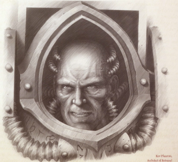
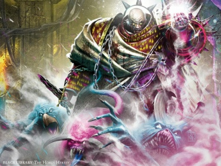
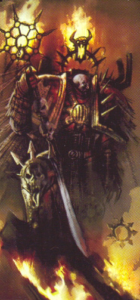
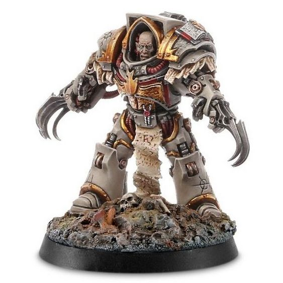

# 0705 科尔·法伦 Kor Phaeron

精校状态：中文行文已逐段精校，部分术语仍为暂定

分类：人类帝国 / 怀言者

原文来源：https://www.bilibili.com/opus/1186142179044622355

原作者：帝国神选罐头

原文时间：2026年04月01日 09:57

[返回分类目录](目录.md) · [全书目录](../../目录.md)

<!-- A0705-B0001 -->

原译文

I am not Lorgar's son. I am his father, and you would do well to remember it. 我不是珞珈的子嗣。我是他的父亲，你最好记住这一点。

**校订译文**

I am not Lorgar's son. I am his father, and you would do well to remember it. 我不是珞珈的子嗣。我是他的父亲，你最好记住这一点。

<!-- /A0705-B0001 -->

<!-- A0705-B0002 -->
**英文原文**

Kor Phaeron, also called The Black Cardinal and The Dark Cardinal, was Lorgar's foster father and spiritual advisor on Colchis, and the Primarch trusted his counsel most of all. Kor Phaeron followed the Primarch through all his battles against the Covenant, providing him spiritual guidance as the battles seemed to have no end. As Lorgar took command of his Legion, Kor Phaeron became his second-in-command, becoming the First Captain of the Word Bearers Legion. Along with Erebus, Kor Phaeron was among the first of the Adeptus Astartes to fall to Chaos and create the first Chaos Space Marines by converting his Primarch and Legion. He is currently the Keeper of the Faith of the Legion.

<!-- /A0705-B0002 -->

<!-- A0705-B0003 -->

原译文

科尔·法伦，也被称为黑色枢机和黑暗枢机，是珞珈的养父和科尔基斯上的精神导师，而原体最信任他的建议。科尔·法伦在与圣约的所有战斗中都追随着原体，为他提供了精神引导，因为这些战斗似乎没有尽头。当珞珈接管他的军团时，科尔·法伦成为他的副指挥官，成为怀言者军团的第一连长。科尔·法伦与艾瑞巴斯一起，是首批堕入混沌的阿斯塔特之一，并通过转化他的原体和军团，创建了第一支混沌星际战士。他目前是军团信仰的守护者。

**校订译文**

科尔·法伦又称黑色枢机或黑暗枢机，是珞珈在科尔基斯的养父和精神导师，原体最信任他的意见。在珞珈对抗圣约的历次战斗中，他始终随行，在仿佛无穷无尽的征战中提供精神指引。珞珈接掌军团后，科尔·法伦成为副手及怀言者第一连长。他与艾瑞巴斯最早投向混沌，又使原体和整个军团皈依，由此催生最早的混沌星际战士。如今，他担任军团的信仰守护者。

**校注：** The Black Cardinal／The Dark Cardinal 是科尔·法伦的两个专称，依主审决定保留黑色枢机／黑暗枢机；普通教会职衔 Cardinal 仍作红衣主教。本段将科尔·法伦归入堕落的阿斯塔特，后文则强调并无完整改造，按军团归属与身体情况分别理解。

<!-- /A0705-B0003 -->

<!-- A0705-B0004 图片 -->

<!-- A0705-B0005 -->

原译文

Kor Phaeron 科尔·法伦

**校订译文**

Kor Phaeron 科尔·法伦

<!-- /A0705-B0005 -->

<!-- A0705-B0006 -->
## History 历史

<!-- /A0705-B0006 -->

<!-- A0705-B0007 -->
**英文原文**

Born on Colchis and raised in an orphanage, Kor Phaeron was a priest of the The Covenant. After advocating that The Covenant act more aggressively in its conversions, Kor Phaeron was expelled from Colchis' capital city of Vharadesh. Gathering a small following and delivering sermons in the deserts of Colchis, Kor Phaeron was preaching to a group of outcast desert nomads known as The Declined when he discovered the infant Lorgar among them. Sensing greatness in the boy and seeing him as an instrument of the Great Powers, the power-hungry Kor Phaeron took him in in hopes of using him to one day supplant the Covenant's ruling Priests. After taking in Kor Phaeron, he had the desert nomads under the chieftain Fan Morgal massacred in order to keep Lorgar's existence a secret from The Covenant. Kor Phaeron went on to raise Lorgar as his own son. Despite this, he was often abusive and initially rejected Lorgar's concept of One God, instead insisting to the Covenant's concept of Four Deities.

<!-- /A0705-B0007 -->

<!-- A0705-B0008 -->

原译文

科尔·法伦出生在科尔基斯，在孤儿院长大，是圣约的牧师。在主张圣约在皈依中采取更积极的行动后，科尔·法伦被驱逐出科尔基斯的首都瓦哈拉德什。科尔·法伦在科尔基斯的沙漠中聚集了一小群追随者并布道，当他在他们中间发现婴儿珞珈时，他正在向一群被称为衰落者的被抛弃的沙漠游牧部落民布道。渴望权力的科尔·法伦感觉到这个男孩的伟大，并将他视为伟大力量的工具，他收留了他，希望有一天能利用他取代圣约的统治牧师。在科尔·法伦接收后，他屠杀了首领范·莫加尔领导下的沙漠游牧部落民，以使珞珈的存在对圣约保密。科尔·法伦继续抚养珞珈成为自己的儿子。尽管如此，他经常虐待，最初拒绝了珞珈的一神论，而是坚持圣约的四神论。

**校订译文**

科尔·法伦出生于科尔基斯，在孤儿院长大，后来成为圣约祭司。他主张以更强硬的手段传教，因而被逐出首都维拉德什。他带着少数追随者在沙漠中布道，在流放者组成的“衰落者”游牧部落里发现了年幼的珞珈。渴望权势的科尔·法伦察觉男孩非凡，将其视为诸神的工具，决定收养他，期望日后借其推翻圣约当权祭司。收留珞珈后，他屠杀范·莫加尔率领的游牧部落，以免圣约得知男孩的存在。此后他以养父身份抚养珞珈，却时常虐待他。对于珞珈提出的一神观念，他起初坚决反对，仍坚持圣约的四神信仰。

**校注：** 英文 After taking in Kor Phaeron 主宾显然误写，承接前句应为科尔·法伦收留珞珈；中文据段内关系修复，英文不改。

<!-- /A0705-B0008 -->

<!-- A0705-B0009 -->
**英文原文**

Despite their complicated relationship Kor Phaeron attempted to manipulate Lorgar to his own ends, and Lorgar remained intensely loyal to him. When Kor Phaeron ordered Lorgar beaten for a slight transgression, his enforcers refused and instead launched a mutiny. Lorgar killed the conspirators and saved his masters life, much to Kor Phaeron's surprise. Afterwards, Kor Phaeron became far less overtly cruel to Lorgar and named him the new Bearer of the Word. No longer a relationship of master and servant, Kor Phaeron became Lorgar's arch-deacon, or chief adviser and manager of non-spiritual affairs, and the two worked together to overthrow the Covenant of Colchis. At this point, Kor Phaeron seemed to have some genuine fondness for Lorgar. Nonetheless Kor Phaeron kept secrets from Lorgar, including his role in the Dark Heart of the Covenant that sought to elevate The Powers back to their rightful place.

<!-- /A0705-B0009 -->

<!-- A0705-B0010 -->

原译文

尽管他们的关系很复杂，科尔·法伦还是试图操纵珞珈达到自己的目的，而珞珈仍然对他非常忠诚。当科尔·法伦命令因轻微违规而殴打珞珈时，他的执行者拒绝了，反而发动了叛乱。令科尔·法伦惊讶的是，珞珈杀死了共谋者并救了他的主人一命。后来，科尔·法伦对珞珈的残忍程度大大降低，并任命他为新的怀言者。科尔·法伦不再是主人和仆人的关系，他成为了珞珈的首席执事，或非精神事务的首席顾问和管理者，两人共同推翻了科尔基斯的圣约。在这一点上，科尔·法伦似乎对珞珈有一些真正的爱。尽管如此，科尔·法伦还是向珞珈隐瞒了秘密，包括他在圣约的黑暗之心中的角色，试图将权力重新提升到应有的地位。

**校订译文**

两人关系复杂，科尔·法伦想操纵珞珈实现私欲，珞珈却始终忠心耿耿。有一次，他因珞珈轻微犯错而命手下殴打他，执行者却拒绝服从，转而哗变。令科尔·法伦吃惊的是，珞珈杀死叛乱者，救了他的命。此后，他不再像以前那样公开残酷对待珞珈，并授予其“怀言者”称号。两人的主仆关系由此改变：科尔·法伦成为珞珈的首席执事，负责担任主要顾问并管理宗教事务之外的工作，两人共同推翻科尔基斯圣约。他这时似乎也开始对珞珈怀有真切感情，但仍有所隐瞒，包括自己在“圣约的黑暗之心”中的角色；这个团体试图让诸神重回应有的地位。

**校注：** The Powers 在圣约信仰语境指诸神，不是政治权力；原译误接。Dark Heart of the Covenant 暂译圣约的黑暗之心，勿与随后军团黑暗之心战团直接混为同一组织。

<!-- /A0705-B0010 -->

<!-- A0705-B0011 -->
**英文原文**

After Lorgar's discovery by the Emperor, Kor Phaeron was found to be too old for gene-seed therapy to be inducted into the Adeptus Astartes but was nonetheless enhanced through the use of bionics, drugs, and a specially-adapted suit of power armour. Although he possessed a stature and enhanced physique comparable to a normal Space Marine, the transformation was not perfect; Phaeron was often sickly, and gave the appearance of an old man laboring under the weight of his enlarged body and heavy armour.

<!-- /A0705-B0011 -->

<!-- A0705-B0012 -->

原译文

在珞珈被帝皇发现后，科尔·法伦被发现年龄太大，无法通过基因种子疗法引入阿斯塔特修会，但通过使用仿生、药物和一套特别改装的动力盔甲，他得到了增强。虽然他拥有与普通星际战士相当的身材和增强的体质，但这种转变并不完美；法伦经常生病，看起来像一个老人在他增大的身体和沉重的盔甲的重量下劳动。

**校订译文**

帝皇找到珞珈后，人们认定科尔·法伦年纪太大，无法接受完整的基因种子改造，成为阿斯塔特。他仍通过机械义体、药物及一套专门改装的动力盔甲获得强化。虽然体格与力量堪比普通星际战士，这种改造并不完善：他经常病弱，看起来就像一个被膨大的躯体与沉重盔甲压得不堪重负的老人。

<!-- /A0705-B0012 -->

<!-- A0705-B0013 -->
**英文原文**

Kor Phaeron went on to become First Captain, commanding the Legion's 1st Company as well as the Dark Heart Chapter and its Terminator elite Phraetus Anointed. However at some point during his time on Colchis, Kor Phaeron had already begun to worship aspects of the Gods of Chaos through the Covenant which he dubbed "The Old Faith". As the Word Bearers brought worlds such as Davin into the Imperium on the Great Crusade, Kor Phaeron noticed that their inhabitants' faiths resembled that of Colchis. Quietly, he kept remnants of these older faiths in place without Lorgar's knowledge in case their new faith in the Emperor were to be proven false.

<!-- /A0705-B0013 -->

<!-- A0705-B0014 -->

原译文

科尔·法伦后来成为了第一连长，指挥着军团的第一连队以及黑暗之心战团和终结者精英弗拉图斯受膏者。然而，在科尔基斯的某个时候，科尔·法伦已经开始通过他称之为“旧信仰”的圣约来崇拜混沌诸神的各个方面。当怀言者在大远征中将戴文等世界带入帝国时，科尔·法伦注意到他们居民的信仰与科尔基斯的信仰相似。在珞珈不知情的情况下，他悄悄地保留了这些旧信仰的残余，以防他们对帝皇的新信仰被证明是错误的。

**校订译文**

科尔·法伦后来担任第一连长，统率军团第一连、黑暗之心战团及其终结者精锐弗拉图斯受膏者。早在科尔基斯时期，他就已借圣约信仰崇拜混沌诸神的不同面貌，并将其称为“旧信仰”。大远征中，怀言者将戴文等世界纳入帝国时，他注意到当地宗教与科尔基斯信仰相似，便瞒着珞珈，暗中保留这些旧信仰的残余，以防对帝皇的新信仰最终被证明虚妄。

<!-- /A0705-B0014 -->

<!-- A0705-B0015 -->
**英文原文**

Ahzek Ahriman, First Captain and Chief Librarian of the Thousand Sons, spent five years attached to the Word Bearers during the Crusade, as part of Magnus the Red's effort to improve his captains' martial skills and encourage cooperation between the Space Marine Legions. Although he became friends of a sort with Erebus, Ahriman considered Kor Phaeron the personification of everything he disliked about the Word Bearers, most particularly how their unshakeable faith refused to admit conflicting facts or argument, and rejected anything that was not "right" as they saw it. During the war of compliance on Heliosa, a joint effort between the Thousand Sons, the Word Bearers, and the Space Wolves, Kor Phaeron ordered the inhabitants' libraries burned, and colossal statues of the Emperor carved from the mountain ranges, acts which Ahriman saw as a terrible waste.

<!-- /A0705-B0015 -->

<!-- A0705-B0016 -->

原译文

阿扎克·阿里曼，千子的第一连长兼首席智库，在大远征期间花了五年时间附属于怀言者，作为赤红之马格努斯努力提高连长军事技能和鼓励星际战士军团之间合作的一部分。虽然阿里曼与艾瑞巴斯成为了某种朋友，但他认为科尔·法伦是他不喜欢的怀言者的一切的化身，尤其是他们不可动摇的信仰拒绝承认相互矛盾的事实或论点，拒绝接受他们认为不“正确”的任何事情。在赫利俄萨平定战争期间，千子、怀言者和太空野狼之间共同努力，科尔·法伦下令烧毁居民的图书馆，并在山脉上雕刻帝皇的巨大雕像，阿里曼认为这些行为是一种可怕的浪费。

**校订译文**

大远征期间，千子第一连长兼首席智库员阿扎克·阿里曼，曾在怀言者中借调服役五年。这是红魔马格努斯提升连长军事能力、鼓励军团合作的安排之一。阿里曼与艾瑞巴斯勉强算得上朋友，却认为科尔·法伦集中了自己最厌恶的怀言者特质：信仰顽固到拒绝承认相反的事实和论据，排斥一切不符合自身“正确”观念的东西。在千子、怀言者与太空野狼联合进行的赫利俄萨归顺战争中，科尔·法伦下令焚毁当地书库，并将连绵山脉雕刻为帝皇巨像；阿里曼认为这是可怕的浪费。

<!-- /A0705-B0016 -->

<!-- A0705-B0017 -->
**英文原文**

Several decades before the Horus Heresy, Lorgar had received a reprimand from the Emperor for the long delays in making worlds compliant, and Lorgar retreated into his quarters for a month. As the chapter orbited planet 47-16, awaiting orders from their Primarch, Kor Phaeron came at odds with Sor Talgron, Captain of the 34th Company, over how the Word Bearers should handle worlds to be brought into compliance. Kor Phaeron and First Chaplain Erebus were the only ones to be permitted access to Lorgar during his month-long retreat. During this time, the duo slowly convinced Lorgar to seek out the powers of the Warp. As Lorgar emerged from his seclusion, and commanded the elimination of the population on 47-16, it was Kor Phaeron's First Company that executed the remaining populace even after it became apparent that they were already worshiping the Emperor. Kor Phaeron then helped to lead Lorgar into the Eye of Terror, where the Primarch finally accepted the Primordial Truth.

<!-- /A0705-B0017 -->

<!-- A0705-B0018 -->

原译文

在荷鲁斯叛乱之前的几十年里，珞珈因长期拖延让世界平定而受到帝皇的谴责，珞珈在自己的住处里呆了一个月。当该战团围绕47-16行星时，等待着他们的原体的命令，科尔·法伦与第34连队连长索尔·塔格隆就怀言者应该如何处理世界以使其平定产生了分歧。在长达一个月的隐退中，科尔·法伦和第一牧师艾瑞巴斯是唯一获准面见珞珈的人。在这段时间里，两人慢慢说服珞珈去寻找亚空间的力量。当珞珈从隐居状态中走出来，并在47-16之上下令消灭人口时，即使很明显他们已经在崇拜帝皇，科尔·法伦的第一连队还是处决了剩下的民众。科尔·法伦随后帮助珞珈进入恐惧之眼，在那里，原体最终接受了原初真理。

**校订译文**

荷鲁斯之乱前数十年，珞珈因征服进度长期迟缓受到帝皇斥责，闭居一月。部队在 47-16 轨道等待原体命令时，科尔·法伦与第三十四连连长索尔·塔格隆，就该如何使各个世界归顺发生争执。珞珈闭关期间，只有科尔·法伦与首席教士艾瑞巴斯获准见他；两人逐渐说服他探求亚空间力量。出关后，珞珈下令灭绝 47-16 的人口。即使已发现当地人其实崇拜帝皇，科尔·法伦的第一连仍处决了剩余居民。后来，他又帮助引导珞珈进入恐惧之眼，让原体最终接受原初真理。

<!-- /A0705-B0018 -->

<!-- A0705-B0019 -->
**英文原文**

Kor Phaeron became Master of the Faith, and it was he and Erebus's influence that eventually corrupted the entire Word Bearers legion, and led to the legion giving itself over to the Powers of Chaos.

<!-- /A0705-B0019 -->

<!-- A0705-B0020 -->

原译文

科尔·法伦成为了信仰大师，正是他和艾瑞巴斯的影响最终腐化了整个怀言者军团，并导致军团屈服于混沌的力量。

**校订译文**

科尔·法伦获任信仰之主。在他与艾瑞巴斯的影响下，整个怀言者军团最终遭到腐化，投入混沌诸力怀抱。

<!-- /A0705-B0020 -->

<!-- A0705-B0021 -->
**英文原文**

During the ensuing Horus Heresy, he served as Lorgar's second-in-command in the Word Bearers surprise attack against the Ultramarines at the Battle of Calth. During the fighting in Calth's orbit, Kor Phaeron attempted to turn Ultramarines' primarch Roboute Guilliman to Chaos with a shard of the Anathame just as Erebus had done with Horus, but Guilliman only answered by ripping out one of his two hearts.

<!-- /A0705-B0021 -->

<!-- A0705-B0022 -->

原译文

在随后的荷鲁斯叛乱期间，他在考斯之战中担任珞珈的副指挥官，对极限战士发动突袭。在考斯轨道上的战斗中，科尔·法伦试图用仪式之刃的碎片将极限战士的原体罗伯特·基里曼转向混沌，就像艾瑞巴斯对荷鲁斯所做的那样，但基里曼只是扯掉了他的两颗心脏中的一颗。

**校订译文**

荷鲁斯之乱期间，科尔·法伦作为珞珈的副手，在考斯之战中率怀言者突袭极限战士。考斯轨道上的交战中，他仿效艾瑞巴斯腐化荷鲁斯的手法，试图用诅咒之刃的碎片迫使罗保特·基里曼投向混沌；基里曼的回答却是徒手掏出他的两颗心脏之一。

**校注：** 英文此处明确 Anathame，按本书专名“诅咒之刃”；后面的 athame 为由其衍生的仪式之刃，分开处理。两颗心脏的叙述与前文“非完整阿斯塔特改造”并列保留，原文没有解释具体移植途径。

<!-- /A0705-B0022 -->

<!-- A0705-B0023 -->
**英文原文**

Defeated, Kor Phaeron retreated into the warp aboard the Infidus Imperator, pursued by the Ultramarines aboard the Macragge's Honour. After luring the Ultramarines into the warp, Kor Phaeron ordered his crew to turn about and attack, since destroying the Ultramarines' flagship was the next best thing to killing Guilliman himself. However, the Ultramarines' fighting skill and resolve proved the equal of the Word Bearers' zealous hatred, and the Infidus Imperator was destroyed, though not before Kor Phaeron hastily cut a hole in reality with his athame and escaped, arriving on Sicarus, a Daemon World inside the Eye of Terror. Attacked but Daemons and other warlords on the world, Kor Phaeron's party was eventually reduced to just six Space Marines and twelve mortal servants. The group is saved by a prophet known as Jepeth, who states that if Kor Phaeron sacrifices himself with his own athame that a portal to Terra to open up to allow the rest to fight alongside Lorgar in the siege. However rather than face this fate, Kor Phaeron instead has Jepeth killed and his fellowship remains on Sicarus. In time Sicarus would become the homeworld of the Word Bearers following their defeat in the Horus Heresy.

<!-- /A0705-B0023 -->

<!-- A0705-B0024 -->

原译文

战败后，科尔·法伦乘坐伪帝号撤退到亚空间，被马库拉格之耀号上的极限战士追击。在引诱极限战士进入亚空间后，科尔·法伦命令他的船员转向进攻，因为摧毁极限战士的旗舰是杀死基里曼本人的次佳选择。然而，极限战士的战斗技巧和决心证明了与怀言者的狂热仇恨不相上下，伪帝号被摧毁了，尽管在此之前，科尔·法伦匆忙用他的仪式匕首在现实中开了一个洞并逃跑了，到达了恐惧之眼内的恶魔世界西卡鲁斯。科尔·法伦的队伍受到了攻击，但遭到了恶魔和世界上其他军阀的袭击，最终只剩下六名星际战士和十二名凡人仆人。这个小队被一位名叫杰佩斯的预言者拯救了，他说，如果科尔·法伦用自己的仪式匕首献祭自己，那么通往泰拉的门户就会打开，让其他人在围城中与珞珈并肩作战。然而，科尔·法伦并没有面对这种命运，而是杀死了杰佩斯，他的团体的残余仍然留在西卡鲁斯。随着时间的推移，西卡鲁斯将成为怀言者在荷鲁斯叛乱中失败后的家园世界。

**校订译文**

败北后，科尔·法伦乘伪帝号逃入亚空间，马库拉格之耀号上的极限战士紧追不舍。他将敌人引入亚空间后，命舰员调转船头反击：既然未能杀死基里曼，摧毁极限战士旗舰也算次一等的成果。然而，极限战士的技艺与决心并不逊于怀言者的狂热仇恨，伪帝号最终遭到摧毁。科尔·法伦在最后关头以仪式之刃划开现实，仓促逃到恐惧之眼内的恶魔世界西卡鲁斯。在当地恶魔与其他军阀的攻击下，他身边很快只剩六名星际战士和十二名凡人仆从。先知杰佩斯救下这群人，并预言：若科尔·法伦用自己的仪式之刃献祭自身，就能打开通往泰拉的门户，让其余人参加围城，与珞珈并肩作战。科尔·法伦不愿接受这种命运，反而命人杀死杰佩斯，继续留在西卡鲁斯。怀言者在叛乱中战败后，这里逐渐成为军团的新母星。

<!-- /A0705-B0024 -->

<!-- A0705-B0025 图片 -->

<!-- A0705-B0026 -->

原译文

Kor Phaeron battles Horrors on Sicarus 科尔·法伦在西卡鲁斯与惧妖战斗

**校订译文**

Kor Phaeron battles Horrors on Sicarus 科尔·法伦在西卡鲁斯与惧妖战斗

<!-- /A0705-B0026 -->

<!-- A0705-B0027 -->
## Post-Heresy 叛乱后

<!-- /A0705-B0027 -->

<!-- A0705-B0028 -->
**英文原文**

Since the Heresy and the absence of Lorgar, Kor Phaeron has assumed the mantle of Keeper of the Faith and often engages in a power struggle with First Chaplain Erebus. Concerned that Erebus has too much sway over the Dark Council and that he is leading the Legion down a self-destructive path, Phaeron tried to organise the Brotherhood to remove Erebus from power, but the First Chaplain was tipped off of the attempted coup by Dark Apostle Marduk. Kor Phaeron renounced all ties to the Brotherhood and kept his position within the Legion, but the animosity and distrust between he and Erebus continues.

<!-- /A0705-B0028 -->

<!-- A0705-B0029 -->

原译文

自从叛乱和珞珈缺席以来，科尔·法伦承担了信仰守护者的重任，经常与第一牧师艾瑞巴斯进行权力斗争。法伦担心艾瑞巴斯对黑暗议会的影响力太大，并且他正在带领军团走上自我毁灭的道路，他试图组织兄弟会将艾瑞巴斯赶下台，但第一牧师被黑暗使徒马杜克告知了未遂的政变。科尔·法伦放弃了与兄弟会的所有联系，并保留了他在军团中的地位，但他和艾瑞巴斯之间的敌意和不信任仍在继续。

**校订译文**

叛乱结束、珞珈隐居后，科尔·法伦以信仰守护者的身份掌权，经常与首席教士艾瑞巴斯争斗。他担心艾瑞巴斯对黑暗议会影响过大，正将军团引向自毁，便试图组织兄弟会夺去对方权力。然而，黑暗使徒马尔杜克将政变计划告知艾瑞巴斯。科尔·法伦随即否认与兄弟会有任何关联，保住自己的地位，但两人的敌意与猜忌始终未消。

<!-- /A0705-B0029 -->

<!-- A0705-B0030 图片 -->

<!-- A0705-B0031 -->

原译文

The Dark Apostle Kor Phaeron 黑暗使徒科尔·法伦

**校订译文**

The Dark Apostle Kor Phaeron 黑暗使徒科尔·法伦

<!-- /A0705-B0031 -->

<!-- A0705-B0032 -->
**英文原文**

In M38, Kor Phaeron corrupted the Imperial Cult on the world of Tyrine within the Maelstrom to lure in and sacrifice Craftworld Kaelor to Slaanesh. Instead he was banished by Ela'Ashbel Ansgar: the child Farseer and incarnation of the Ehveline. Her intervention was not without its cost: Erebus through Kor Phaeron saw the child's future and her ability to deny him the Pyrus Reach Sector and, through his connection with his former ally, destroyed the child seer's senses, blinding all but her psychic senses. The craftworld survived, with Ela'Ashbel eventually becoming its chief Farseer. Although Ela'Ashbel was able to use her psychic senses to perceive her surroundings despite her blindness, the use of them caused her to cry tears of blood.

<!-- /A0705-B0032 -->

<!-- A0705-B0033 -->

原译文

在M38，科尔·法伦在大漩涡中的泰琳世界上腐化了帝国教派，引诱方舟世界凯洛尔并将其牺牲给色孽。但相反，他被埃拉'阿什贝尔·安斯加尔放逐：儿童先知和艾芙琳的化身。她的干预并非没有代价：艾瑞巴斯通过科尔·法伦看到了孩子的未来，以及她拒绝让他进入派勒斯河段星区的能力，并通过他与前盟友的联系，摧毁了孩子的感知，除了她的灵能感知外，她什么都看不见。方舟世界幸存下来，埃拉'阿什贝尔最终成为其首席先知。尽管埃拉'阿什贝尔失明，但她能够用她的灵能感官感知周围的环境，但这种感官的使用会让她流下血泪。

**校订译文**

M38，科尔·法伦腐化大漩涡内泰琳世界的帝皇信仰，企图将凯洛尔方舟世界引入圈套，献祭给色孽。计划却被年幼的大先知、艾芙琳的化身埃拉’阿什贝尔·安斯加尔阻止，他本人也被放逐。不过，她的出手同样付出代价：艾瑞巴斯透过与科尔·法伦的联系，窥见女孩的未来，发现她有能力阻止自己夺取派勒斯疆域星区，便借昔日盟友之身摧毁了她的感官，使她除灵能感知外一无所见。凯洛尔幸存下来，女孩后来成为首席大先知。即使失明，她仍能以灵能感知周围世界，但每次运用这种能力都会流下血泪。

**校注：** Farseer 按官方“大先知”；Pyrus Reach Sector 是完整星区名，不是河流河段。原文称摧毁感官，末句聚焦失明，未自行缩减为只伤眼睛。

<!-- /A0705-B0033 -->

<!-- A0705-B0034 -->
**英文原文**

Kor Phaeron recently undertook a grand operation to allow Chaos to gain a foothold in Segmentum Solar. Targeting the Veritus Sub-Sector, Kor Phaeron planned an elaborate invasion of the Talledus System shortly before the formation of the Great Rift. Upon the subsequent rebirth of Roboute Guilliman Kor Phaeron fumed at the news, but commenced with the invasion regardless when he received a vision that the Primarch would be far from Segmentum Solar due to the Indomitus Crusade. Kor Phaeron led the invasion of Benediction personally and encamped himself outside its central temple-city. After departing the warzone, Kor Phaeron next began organising raids against Imperial Black Ships after receiving visions of what appears to be the awakening of the Star Child. He next worked with the Black Legion Sorcerer Tenebrus to find the truth of the matter and prevent its birth.

<!-- /A0705-B0034 -->

<!-- A0705-B0035 -->

原译文

科尔·法伦最近进行了一项大规模的行动，让混沌在太阳星域站稳脚跟。科尔·法伦瞄准维里图斯分区，在大裂隙形成前不久精心策划了对塔勒杜斯星系的入侵。在罗伯特·基里曼重生后，科尔·法伦对这一消息感到愤怒，他不顾收到的关于由于不屈远征，原体将远离太阳星域的幻象开始入侵。科尔·法伦亲自领导了对祝福星的入侵，并在其中心圣殿城市外扎营。离开战区后，科尔·法伦在收到星辰之子觉醒的幻象后，开始组织对帝国黑船的突袭。接下来，他与黑色军团巫师特内布鲁斯合作，找到了事情的真相，并阻止了它的诞生。

**校订译文**

科尔·法伦后来发动大规模行动，企图为混沌在太阳星域取得立足点。他瞄准维里图斯次星区，在大裂隙形成前不久，精心策划对塔勒都斯星系的入侵。随后罗保特·基里曼复生，令他怒火中烧；但幻象显示，原体会因不屈远征远离太阳星域，他便照常发起进攻。他亲自率军入侵祝福星，在中央神庙城外扎营。离开战区后，他又因看见疑似星辰之子觉醒的幻象，开始组织袭击帝国黑船。随后，他与黑色军团巫师特内布鲁斯合作，试图查明真相，并阻止星辰之子诞生。

**校注：** 幻象使他认为基里曼将远离太阳星域，因此继续入侵；原译“不顾幻象”颠倒逻辑。末句 find/prevent 是合作目的，原译误作已查明真相并成功阻止诞生。

<!-- /A0705-B0035 -->

<!-- A0705-B0036 -->
## Wargear and Abilities 战斗装备与能力

原题：Wargear and Abilities 战备与能力

<!-- /A0705-B0036 -->

<!-- A0705-B0037 -->
**英文原文**

Prior to and during the Heresy, Kor Phaeron wore a suit of Terminator Armour known as the Terminus Consolaris. This custom-made suit not only allowed his withered frame to exhibit transhuman strength and wield Lightning Claws dubbed Patriarch's Claws, but also included life support and medical systems to keep him functioning. For ranged foes, he utilized a hidden Digi-Flamer. However by the time of the Battle of Calth Kor Phaeron's true power lay with his sorcery, wielding a Athame Blade and capable of bringing down even the Primarch Roboute Guilliman with psychic blasts.

<!-- /A0705-B0037 -->

<!-- A0705-B0038 -->

原译文

在叛乱之前和叛乱期间，科尔·法伦穿着一套名为终焉抚慰的终结者盔甲。这套定制的盔甲不仅让他枯萎的身躯展现出超人的力量，还能挥舞被称为主教之爪的闪电爪，还包括生命支持和医疗系统，以保持他的机能。对于远程敌人，他使用了一个隐藏的数字火焰枪。然而，到了考斯之战的时候，法伦的真正力量在于他的巫术，他挥舞着诅咒之刃，甚至能够用灵能爆炸击倒原体罗伯特·基里曼。

**校订译文**

叛乱前及叛乱期间，科尔·法伦身穿一套名为“终焉抚慰”的终结者盔甲。这套定制装备让他衰弱的身躯发挥超人力量，挥动被称为“主教之爪”的闪电爪；内部还设有维生与医疗系统，维持身体机能。他另藏有一具微型火焰喷射器，用来攻击远处敌人。不过，到考斯之战时，他真正的力量来自巫术：手持仪式之刃，甚至能以灵能轰击打倒罗保特·基里曼。

**校注：** Digi-Flamer 暂译微型火焰喷射器，原“数字火焰枪”易误作数字技术；尚待官方对应。Patriarch’s Claws 属武器专名，暂沿主教之爪，不能套用基因窃取者单位 Patriarch 族长的官译。

<!-- /A0705-B0038 -->

<!-- A0705-B0039 图片 -->

<!-- A0705-B0040 -->

原译文

Kor Phaeron 科尔·法伦

**校订译文**

Kor Phaeron 科尔·法伦

<!-- /A0705-B0040 -->

<!-- A0705-B0041 -->
## Notes 注释

<!-- /A0705-B0041 -->

<!-- A0705-B0042 -->
**英文原文**

Kor Phaeron is described by Xaphen, Chaplain of the 7th Company at the time of the Great Crusade as a "False Astartes". At the time of Lorgar's reunification with his Legion, Phaeron was too old to undergo the genetic modifications required to be a Space Marine, so instead his enhanced physiology was cobbled together by a combination of bionics, rejuvenating surgeries and 'limited gene forging'.

<!-- /A0705-B0042 -->

<!-- A0705-B0043 -->

原译文

大远征时第七连队牧师萨芬将科尔·法伦描述为“伪阿斯塔特”。在珞珈与他的军团团聚时，法伦年龄太大，无法进行成为星际战士所需的基因改造，因此，他增强的生理机能是通过仿生、回春手术和“有限的基因铸造”的结合拼凑而成的。

**校订译文**

大远征时期，第七连教士夏芬称科尔·法伦为“伪阿斯塔特”。珞珈与军团团聚时，科尔·法伦已年老，无法承受成为星际战士所需的完整基因改造，因此只能以机械义体、回春手术及“有限的基因塑造”拼凑出强化的身体。

<!-- /A0705-B0043 -->

<!-- A0705-B0044 -->
**英文原文**

This, combined with the fact that it was chiefly Lorgar's patronage that led to Kor Phaeron's promotion to First Captain, has naturally caused some distrust and resentment within the Legion, though all are in agreement that he is a wise man and a respected preacher.

<!-- /A0705-B0044 -->

<!-- A0705-B0045 -->

原译文

这一点，再加上主要是珞珈的赞助导致科尔·法伦晋升为第一连长，自然在军团内部引起了一些不信任和怨恨，尽管所有人都同意他是一个智者和一个受人尊敬的传道者。

**校订译文**

此外，他晋升第一连长主要依靠珞珈的庇护。这些因素自然引来军团内部的猜忌与怨恨，尽管众人仍承认他博学睿智，是受人敬重的传教者。

<!-- /A0705-B0045 -->

本篇核心术语与暂定项

以下列出本篇出现的英文原形及核心术语表用词。同形词可能指不同对象，具体词义以本篇正文和校注为准；单复数、别名和仅见于图注的名称可能尚未列入。完整候选见[术语表](../../术语表/双语术语候选.csv)。

| 英文 | 采用中文 | 状态 |
| --- | --- | --- |
| Space Marines | 星际战士 | 官方已核对 |
| Adeptus Astartes | 阿斯塔特修会 | 官方已核对 |
| Space Wolves | 太空野狼 | 官方已核对 |
| Chaos Space Marines | 混沌星际战士 | 官方已核对 |
| Thousand Sons | 千子 | 官方已核对 |
| Librarian | 智库员 | 官方已核对 |
| Terminator | 终结者 | 官方已核对 |
| Roboute Guilliman | 罗保特·基里曼 | 官方已核对 |
| Ultramarines | 极限战士 | 官方已核对 |
| Horus Heresy | 荷鲁斯之乱 | 官方已核对 |
| Warp | 亚空间 | 官方已核对 |
| Great Rift | 大裂隙 | 官方已核对 |
| Imperium | 帝国 | 暂定·简称 |
| Sorcerer | 巫师 | 官方已核对 |
| Farseer | 大先知 | 官方已核对 |
| Craftworld | 方舟世界 | 官方已核对 |
| Patriarch | 族长 | 官方已核对 |
| Indomitus | 不屈学派 | 暂定·学派语境 |
| Eye of Terror | 恐惧之眼 | 官方已核对 |
| Maelstrom | 大漩涡 | 官方已核对 |
| Emperor | 帝皇 | 官方已核对 |
| Primarch | 原体 | 官方已核对 |
| Word Bearers | 怀言者 | 暂定·官方待核 |
| Dark Apostle | 黑暗使徒 | 官方已核对 |
| Black Legion | 黑色军团 | 暂定·官方待核 |
| Slaanesh | 色孽 | 官方已核对 |
| Great Crusade | 大远征 | 暂定·官方待核 |
| Compliance | 归顺；纳入帝国统治 | 暂定·官方待核 |
| Terra | 泰拉 | 暂定·官方待核 |
| Horus | 荷鲁斯 | 暂定·官方待核 |
| Erebus | 艾瑞巴斯 | 暂定·官方待核 |
| Anathame | 诅咒之刃 | 暂定·官方待核 |
| The Brotherhood | 兄弟会 | 暂定·官方待核 |
| Magnus the Red | 红魔马格努斯 | 官方已核对 |
| Imperial Cult | 帝皇信仰 | 暂定·官方待核 |
| Enforcers | 地方执法者 | 暂定·官方待核 |
| Indomitus Crusade | 不屈远征 | 暂定·官方待核 |
| Segmentum Solar | 太阳星域 | 暂定·官方待核 |
| Segmentum | 星域 | 暂定·官方待核 |
| Sector | 星区 | 暂定·官方待核 |
| Star Child | 星辰之子 | 暂定·官方待核 |
| Brotherhood | 兄弟会 | 暂定·官方待核 |
| Calth | 考斯 | 暂定·官方待核 |
| Davin | 戴文 | 暂定·官方待核 |
| Macragge | 马库拉格 | 暂定·官方待核 |
| Bionics | 仿生改造／仿生部件（依语境） | 语境定译·官方待核 |
| Chief Librarian | 首席智库员 | 暂定·官方待核 |
| Master | 导师（审判庭职衔）／舰务官（舰员职务） | 语境定译·官方待核 |
| Cardinal | 红衣主教 | 暂定 |
| Preacher | 传道士 | 暂定 |
| Marduk | 马尔杜克 | 暂定·官方待核 |
| Chaplain | 教士 | 官方已核对 |
| First Captain | 第一连长 | 暂定·官方待核 |
| Ahzek Ahriman | 阿扎克·阿里曼 | 暂定·官方待核 |
| Kor Phaeron | 科尔·法伦 | 暂定·官方待核 |
| Power Armour | 动力盔甲 | 暂定·官方待核 |
| Space Marine | 星际战士 | 暂定·官方待核 |
| Chapter | 战团 | 暂定·官方待核 |
| Captain | 连长 | 暂定·官方待核 |
| Remnants | 残骸 | 暂定·官方待核 |
| Gene-seed | 基因种子 | 暂定·官方待核 |
| Mortal | 凡人 | 暂定·官方待核 |
| Lorgar | 珞珈 | 暂定·官方待核 |
| Colchis | 科尔基斯 | 暂定·官方待核 |
| Sicarus | 西卡鲁斯 | 暂定·官方待核 |
| Primordial Truth | 原初真理 | 暂定·官方待核 |
| Dark Council | 黑暗议会 | 暂定·官方待核 |
| Anointed | 受膏者 | 暂定·官方待核 |
| Infidus Imperator | 伪帝号 | 暂定·官方待核 |
| Xaphen | 夏芬 | 暂定·官方待核 |
| Sor Talgron | 索尔·塔格隆 | 暂定·官方待核 |
| Benediction | 祝福星 | 暂定·官方待核 |
| Powers | 能天使 | 暂定·官方待核 |
| Kaelor | 凯洛尔 | 暂定·官方待核 |
| athame | 仪式之刃 | 暂定·官方待核 |
| Phraetus Anointed | 弗拉图斯受膏者 | 暂定·官方待核 |
| Phaeron | 法皇 | 暂定·官方待核 |
| Terminus | 终点站 | 暂定·官方待核 |
| Battle of Calth | 考斯之战 | 暂定·官方待核 |
| Macragge's Honour | 马库拉格之耀号 | 暂定·官方待核 |
| The Declined | 衰落者 | 暂定·官方待核 |
| Fan Morgal | 范·莫加尔 | 暂定·官方待核 |
| Bearer of the Word | 怀言者 | 暂定·官方待核 |
| Vharadesh | 维拉德什 | 暂定·官方待核 |
| Master of the Faith | 信仰之主 | 暂定·官方待核 |
| First Chaplain | 首席教士 | 暂定·官方待核 |
| The Black Cardinal | 黑色枢机 | 暂定·官方待核 |
| The Dark Cardinal | 黑暗枢机 | 暂定·官方待核 |
| Keeper of the Faith | 信仰守护者 | 暂定·官方待核 |
| Dark Heart of the Covenant | 圣约的黑暗之心 | 暂定·官方待核 |
| Dark Heart Chapter | 黑暗之心战团 | 暂定·官方待核 |
| Heliosa | 赫利俄萨 | 暂定·官方待核 |
| Jepeth | 杰佩斯 | 暂定·官方待核 |
| Tyrine | 泰琳 | 暂定·官方待核 |
| Ehveline | 艾芙琳 | 暂定·官方待核 |
| Pyrus Reach Sector | 派勒斯疆域星区 | 暂定·官方待核 |
| Veritus Sub-Sector | 维里图斯次星区 | 暂定·官方待核 |
| Talledus System | 塔勒都斯星系 | 暂定·官方待核 |
| Tenebrus | 特内布鲁斯 | 暂定·官方待核 |
| Terminus Consolaris | 终焉抚慰 | 暂定·官方待核 |
| Digi-Flamer | 微型火焰喷射器 | 暂定·官方待核 |
| The Dark | 《黑暗》 | 暂定·官方待核 |
| Veritus | 维瑞图斯 | 暂定·官方待核 |
| System | 星系（恒星系统） | 暂定·官方待核 |
| Flamer | 火焰喷射器（武器）／火妖（奸奇单位） | 语境定译·对应官译已核 |
| Terminator Armour | 终结者盔甲 | 暂定·官方待核 |

