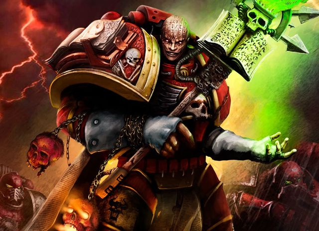
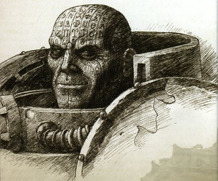
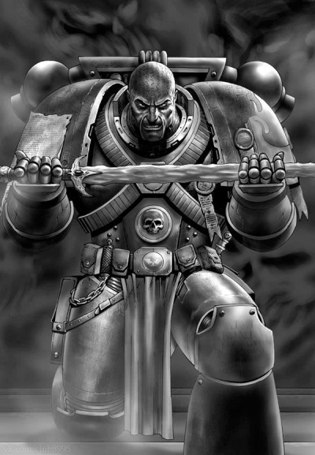
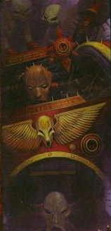
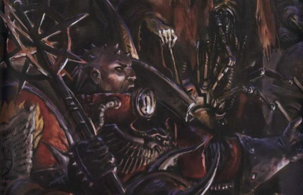
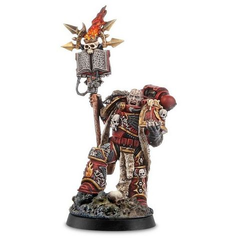

# 0706 艾瑞巴斯 Erebus

精校状态：中文行文已逐段精校，部分术语仍为暂定

分类：人类帝国 / 怀言者

原文来源：https://www.bilibili.com/opus/1091506225399463939

原作者：帝国神选罐头

原文时间：2025年07月20日 09:21

[返回分类目录](目录.md) · [全书目录](../../目录.md)

<!-- A0706-B0001 -->
**英文原文**

"And for all of this, I am hated. For being there at the outset, for laying the foundations that others would willingly build on. I think they wish to find something in this story that explains things - some moment of decision, some choice that could later be regretted or accounted for. But it's just as I said - none exists. I have always been on this road, never turning never deviating. A long time ago, aware of my limitations, I formulated an expression to capture my condition: blessed is the mind too small to doubt."

<!-- /A0706-B0001 -->

<!-- A0706-B0002 -->

原译文

“尽管如此，我还是被憎恨的。因为我一开始就在那里，因为我为其他人愿意建立的基础奠定了基础。我认为他们希望在这个故事中找到一些东西来解释事情 — 一些决定性的时刻，一些以后可能会后悔或被解释的选择。但正如我所说的，什么都不存在。我一直在这条路上，从不转弯，从不偏离。很久以前，意识到我的局限性，我提出了一个表达来捕捉我的状况：思想太狭隘而不能怀疑是有福的。”

**校订译文**

“正因这一切，我才遭人憎恨：因为我从最初就在场，因为我奠下基础，而后来者心甘情愿在其上继续营建。我想，他们希望从这段往事里找到一个解释——某个作出决定的时刻，某次事后可以后悔、可以交代的选择。但正如我所说，那种时刻从不存在。我一直走在这条路上，从未转向，从未偏离。很久以前，我明白自己的局限，便想出一句话来形容自己：心智狭小、不知怀疑者，才是蒙福之人。”

<!-- /A0706-B0002 -->

<!-- A0706-B0003 -->
**英文原文**

Erebus is one of the most prominent members of the Word Bearers Chaos Space Marines and a member of the Dark Council of Sicarus. He was the harbinger of the Horus Heresy, instrumental in converting first Lorgar and then Horus to Chaos. Erebus refers to himself as Destiny's Hand, the mortal instrument of the plans of the Ruinous Powers.

<!-- /A0706-B0003 -->

<!-- A0706-B0004 -->

原译文

艾瑞巴斯是怀言者混沌星际战士最杰出的成员之一，也是西卡鲁斯黑暗议会的成员。他是荷鲁斯叛乱的预言者，在将珞珈和荷鲁斯转化为混沌方面发挥了重要作用。艾瑞巴斯自称命运之手，是毁灭之力计划的致命工具。

**校订译文**

艾瑞巴斯是怀言者最显赫的混沌星际战士之一，也是西卡鲁斯黑暗议会成员。他是荷鲁斯之乱的先导，先后诱使珞珈和荷鲁斯投向混沌，在其中起了关键作用。他自称“命运之手”，是毁灭诸力在人间执行计划的工具。

**校注：** mortal instrument 指凡世工具，不是致命工具；harbinger 指先导、预示者，此处不等于能预言未来的先知。

<!-- /A0706-B0004 -->

<!-- A0706-B0005 图片 -->

<!-- A0706-B0006 -->

原译文

Erebus 艾瑞巴斯

**校订译文**

Erebus 艾瑞巴斯

<!-- /A0706-B0006 -->

<!-- A0706-B0007 -->
## History 历史

<!-- /A0706-B0007 -->

<!-- A0706-B0008 -->
**英文原文**

The boy that would become Erebus was born to common parents on Colchis and even at a young age felt it was his purpose to manipulate, deceive, and sow discord. He felt a thrill testing his own limits in these acts, which in its earliest form manifested as him teasing desert scorpions. His parents often scolded him for his poor behavior and lack of achievement, comparing him to his village's pride: a religious and studious child named Erebus. Taking his parents advice to be more like Erebus to heart, the boy strangled him with a garrote and replicated Erebus' facial tattoos. Taking the identify of Erebus for himself, the boy departed his village and became a aspiring priest for the Covenant of Colchis in the city of Vharedesh. Erebus cared little for his studies at first, but gradually began to appreciate their meanings. One day he saw his face reflected into four parts within a cracked mirror, and realized that the Ruinous Powers had always been with him and guided his actions. Erebus became a devout child of Chaos thereafter, mastering the Old Faith of Colchis which, in truth, was just an aspect of Chaos worship. When the Covenant of Colchis fell at the hands of Lorgar and his followers Erebus went into hiding for a time before reemerging as an acolyte of the Primarch.

<!-- /A0706-B0008 -->

<!-- A0706-B0009 -->

原译文

这个后来成为艾瑞巴斯的男孩出生在科尔基斯的普通父母家，即使在很小的时候，他也觉得操纵、欺骗和散播不和是他的目的。他感到一阵激动，在这些行为中考验自己的极限，最早的表现就是他戏弄沙漠蝎子。他的父母经常因为他的不良行为和缺乏成就而责骂他，把与村里的骄傲做比较：一个名叫艾瑞巴斯的虔诚好学的孩子。男孩听从父母的建议，更像艾瑞巴斯，扼死了他，并复制了艾瑞巴斯的面部纹身。男孩以艾瑞巴斯的身份离开了他的村庄，成为了范瑞德斯城市科尔基斯圣约的一名有抱负的牧师。艾瑞巴斯起初不太关心学习，但逐渐开始欣赏学习的意义。有一天，他看到自己的脸在一个破裂的镜子里反射成四个部分，意识到毁灭之力一直伴随着他，指导着他的行动。此后，艾瑞巴斯成为混沌的虔诚子嗣，掌握了科尔基斯的旧信仰，事实上，这只是混沌崇拜的一个方面。当科尔基斯圣约落入珞珈及其追随者之手时，艾瑞巴斯躲藏了一段时间，然后重新成为了原体的追随者。

**校订译文**

后来冒名为艾瑞巴斯的男孩，出生于科尔基斯的普通家庭。从很小时起，他便觉得自己生来就该操纵、欺骗他人，挑拨纷争，并以试探自身能做到何种地步为乐；最早的表现，就是戏弄沙漠蝎子。父母常因他行为恶劣、一事无成而斥责他，拿村里那个虔诚好学、令人骄傲的孩子艾瑞巴斯作榜样。他将“学学艾瑞巴斯”的劝告铭记在心，用绞索杀死那个孩子，仿造对方脸上的纹身，盗取其身份，离开村庄。在维拉德什，他成为科尔基斯圣约的见习祭司。他起初无心学习，后来才渐渐领会教义的含义。有一天，他在碎裂的镜子中看见自己的脸分成四片，顿悟毁灭诸力一直伴随并指引自己。此后，他虔信混沌，精通科尔基斯的旧信仰——那本就是混沌崇拜的一种形式。珞珈及追随者推翻圣约后，艾瑞巴斯一度藏匿，后来才以原体门徒的身份重新露面。

**校注：** Vharedesh 与704、705的 Vharadesh 拼写不同，按同一科尔基斯首都统一维拉德什，英文保留。

<!-- /A0706-B0009 -->

<!-- A0706-B0010 图片 -->

<!-- A0706-B0011 -->

原译文

Erebus as he appeared during the Great Crusade 艾瑞巴斯在大远征期间出现

**校订译文**

Erebus as he appeared during the Great Crusade 大远征时期的艾瑞巴斯

<!-- /A0706-B0011 -->

<!-- A0706-B0012 -->
**英文原文**

When the Emperor arrived on Colchis Erebus was already well aware of his existence as the Anathema, and was the only one on Colchis who was not overcome by His glory. Instead, Erebus felt exhilaration at seeing the man he would soon bring low. Erebus was converted into a Space Marine of the Word Bearers shortly after and began to implement the Dark Gods plans to overthrow the Emperor's order.

<!-- /A0706-B0012 -->

<!-- A0706-B0013 -->

原译文

当帝皇到达科尔基斯时，艾瑞巴斯已经清楚地意识到他的存在是诅咒，并且是科尔基斯唯一一个没有被他的荣耀征服的人。相反，艾瑞巴斯看到这个他很快就会倒下的人，感到很兴奋。不久之后，艾瑞巴斯被改造成了一名怀言者的星际战士，并开始实施黑暗诸神推翻帝皇秩序的计划。

**校订译文**

帝皇来到科尔基斯时，艾瑞巴斯早已知道他的存在，以及诸神所称的“被诅咒者”身份。他是当地唯一没有被帝皇荣光折服的人；相反，看见自己打算将其扳倒的人，他兴奋不已。不久，他被改造为怀言者星际战士，开始执行黑暗诸神推翻帝皇秩序的计划。

**校注：** Anathema 是帝皇在混沌方话语中的称号，沿核心“被诅咒者”，与武器 Anathame 诅咒之刃、athame 仪式之刃分开。

<!-- /A0706-B0013 -->

<!-- A0706-B0014 图片 -->

<!-- A0706-B0015 -->

原译文

Erebus before the Heresy with the Anathame 叛乱前持仪式之刃的艾瑞巴斯

**校订译文**

Erebus before the Heresy with the Anathame 叛乱前手持诅咒之刃的艾瑞巴斯

<!-- /A0706-B0015 -->

<!-- A0706-B0016 -->
**英文原文**

At the onset of the Heresy and the end of the Great Crusade, Erebus held the prestigious position of First Chaplain of the Word Bearers Legion. He was a fearsome and intimidating Astartes warrior, sections of the Book of Lorgar tattooed across his shaven scalp to terrify his enemies. Feeling abject humiliation after the Emperor's punishment for their legion's deification of him, Erebus began to tell Lorgar that were other gods in the universe that could be worshiped. Thus Erebus, aided by Kor Phaeron, were able to slowly poison Lorgar into accepting Chaos. After the pilgrimage of the Word Bearers into the Eye of Terror, Lorgar and his legion fully embraced Chaos. Erebus would play a vital role in his legion's new plans. It is unknown when Erebus himself began worshiping Chaos, but it may have been through his faith in the Covenant of Colchis before joining Lorgar, which worshiped aspects of the Chaos Gods. Like Kor Phaeron, Erebus kept these secrets from his primarch.

<!-- /A0706-B0016 -->

<!-- A0706-B0017 -->

原译文

在叛乱开始和大远征结束之际，艾瑞巴斯担任怀言者军团第一牧师的要职。他是一个可怕而令人生畏的阿斯塔特战士，洛加之书的部分内容纹在他剃光的头皮上，以恐吓他的敌人。在帝皇因他们的军团将他神化而惩罚后，艾瑞巴斯感到极度屈辱，开始告诉珞珈，宇宙中还有其他可以崇拜的神。因此，在科尔·法伦的帮助下，艾瑞巴斯能够慢慢毒害珞珈接受混沌。在怀言者进入恐惧之眼朝圣之后，珞珈和他的军团完全拥抱了混沌。艾瑞巴斯将在他的军团的新计划中发挥至关重要的作用。目前尚不清楚艾瑞巴斯本人何时开始崇拜混沌，但这可能是由于他在加入崇拜混沌诸神的珞珈之前对科尔基斯圣约的信仰。与科尔·法伦一样，艾瑞巴斯也对他的原体隐瞒了这些秘密。

**校订译文**

大远征末期、叛乱初起时，艾瑞巴斯已位居怀言者首席教士。他是令人生畏的阿斯塔特战士，光头上纹着《珞珈之书》的部分经文，用以震慑敌人。军团因将帝皇神化而遭惩罚后，他深感屈辱，开始向珞珈宣称，宇宙中另有值得崇拜的神。艾瑞巴斯与科尔·法伦联手，逐渐诱使原体接纳混沌。恐惧之眼朝圣后，珞珈和军团彻底皈依，艾瑞巴斯也在其新计划中占据关键位置。本段称，他最初何时崇拜混沌并不明确，可能早在追随珞珈之前，就已通过科尔基斯圣约信奉混沌诸神的不同面貌。他与科尔·法伦一样，将这些秘密瞒着原体。

**校注：** 前文已具体描述镜中四张脸后皈依混沌的经历，此段却称起始时间不详，属原文来源或记述层次差异，均保留。

<!-- /A0706-B0017 -->

<!-- A0706-B0018 -->
**英文原文**

Some time before the time of first contact with the Interex, Erebus began associating with the Luna Wolves legion and with the Warmaster in particular. During negotiations with the Interex, Erebus stole an archaic anathame sword from their closely guarded Hall of Devices, precipitating the war. This was not simply out of greed - it was all part of his carefully managed plan to corrupt the Warmaster and bring him under the influence of his own secret masters, the Warp powers of Chaos.

<!-- /A0706-B0018 -->

<!-- A0706-B0019 -->

原译文

在与英特雷斯首次接触之前的一段时间，艾瑞巴斯开始与影月苍狼军团，特别是战帅建立联系。在与英特雷斯的谈判中，艾瑞巴斯从他们严密守卫的装置大厅偷走了一把古老的仪式之刃，引发了战争。这不仅仅是出于贪婪 — 这是他精心策划的计划的一部分，目的是腐化战帅，并使他受到自己的秘密之主 — 混沌亚空间力量的影响。

**校订译文**

首次接触英特雷斯之前一段时间，艾瑞巴斯开始接近影月苍狼，尤其是战帅本人。谈判期间，他从英特雷斯戒备森严的器物殿堂盗走古老的诅咒之刃，促成战争爆发。这不仅是贪欲作祟，更是精心设计的计划之一环：腐化战帅，使其受制于自己秘密侍奉的主人——亚空间中的混沌诸力。

<!-- /A0706-B0019 -->

<!-- A0706-B0020 -->
**英文原文**

Erebus gave the weapon to the traitor Governor of the planet Davin, Eugen Temba, and played Horus's pride to get him to lead his expedition fleet back to Davin and personally bring it back to compliance. Temba played his part, wounding Horus with the anathame as Erebus intended, and the Luna Wolves' apothecaries couldn't heal his wounds. Erebus suggested to the Mournival that Davin's Serpent Lodge could heal their primarch. The grief-stricken Ezekyle Abaddon and Horus Aximand turned Horus over to their care and Erebus projected himself into Horus's fever visions disguised as the late Hastur Sejanus. Opposed by Magnus the Red, Erebus won over Horus to his cause with visions of a future that deified the Emperor and a select few primarchs, rejected the rest, and had seemingly forgotten Horus's contributions compared to the offer of replacing the Emperor and possessing unimaginable power.

<!-- /A0706-B0020 -->

<!-- A0706-B0021 -->

原译文

艾瑞巴斯将武器交给了戴文行星的叛徒总督尤金·坦巴，并操纵了荷鲁斯的骄傲，让他带领探险队回到戴文，并亲自将其带回服从。坦巴扮演了自己的角色，按照艾瑞巴斯的意图，用仪式之刃伤害了荷鲁斯，而影月苍狼的药剂师无法治愈他的伤口。艾瑞巴斯向四王议会建议，戴文的蛇屋可以治愈他们的原体。悲痛欲绝的以泽凯尔·阿巴顿和荷鲁斯·阿西曼德将荷鲁斯交给他们照顾，艾瑞巴斯伪装成已故的哈斯塔·赛詹努斯，将自己投射到荷鲁斯的发烧幻象中。在赤红之马格努斯的反对下，艾瑞巴斯凭借未来的幻象赢得了荷鲁斯的支持，这个幻象将帝皇和少数几位原体神化，拒绝了其他人，并且与取代皇帝和拥有难以想象的力量的提议相比，似乎忘记了荷鲁斯所做的贡献。

**校订译文**

他将武器交给戴文叛变总督欧根·坦巴，又利用荷鲁斯的骄傲，诱使战帅率远征舰队返回戴文，亲自平定叛乱。坦巴按计划用诅咒之刃击伤荷鲁斯，影月苍狼的药剂师束手无策。艾瑞巴斯向四王议会提出，戴文的蛇之结社或许能够救治原体。悲痛的阿巴顿与阿西曼德将荷鲁斯交给结社，艾瑞巴斯便投射进他的高热幻境，假扮已故的哈斯塔·赛詹努斯。红魔马格努斯试图阻止他，但艾瑞巴斯展示了一个未来：帝皇与少数原体被奉为神明，其余人被排斥，荷鲁斯的贡献似乎也被遗忘。他以此对照另一种前景——取代帝皇、获取难以想象的力量——最终说动荷鲁斯。

<!-- /A0706-B0021 -->

<!-- A0706-B0022 -->
**英文原文**

Erebus continued to pour honey into Horus's ear, directing him further from the Great Crusade and pursuing his own ascension. By showing the Warmaster the powers of the Warp and urging him to make pacts with the gods of Chaos, he eventually set Horus on the path to heresy against the Emperor.

<!-- /A0706-B0022 -->

<!-- A0706-B0023 -->

原译文

艾瑞巴斯继续欺骗荷鲁斯，引导他远离大远征，追求自己的升格。通过向战帅展示亚空间的力量，并敦促他与混沌诸神签订契约，他最终让荷鲁斯走上了反抗帝皇的叛乱之路。

**校订译文**

艾瑞巴斯继续以甜言蜜语蛊惑荷鲁斯，引他背离大远征的目标，转而追逐个人的升格。他展示亚空间的力量，敦促战帅与混沌诸神缔约，最终把荷鲁斯推上背叛帝皇的道路。

<!-- /A0706-B0023 -->

<!-- A0706-B0024 图片 -->

<!-- A0706-B0025 -->

原译文

Erebus 艾瑞巴斯

**校订译文**

Erebus 艾瑞巴斯

<!-- /A0706-B0025 -->

<!-- A0706-B0026 -->
**英文原文**

Along with Horus, Erebus masterminded the Isstvan III betrayal, ever mindful of the need to eliminate those loyalist elements of the Traitor Legions before the war on Terra could begin. Garviel Loken suspected Erebus as a traitor and conspirator, which only led the corrupt Chaplain to add him to the list of doomed Astartes brethren sent down ahead of the virus bomb assault on the planet. Erebus remained with Horus throughout the Heresy, acting as his dark spiritual adviser and co-conspirator.

<!-- /A0706-B0026 -->

<!-- A0706-B0027 -->

原译文

艾瑞巴斯与荷鲁斯一起策划了伊斯塔万三号的背叛，他始终铭记在泰拉战争开始之前，需要消除叛徒军团中的忠诚分子。加维尔·洛肯怀疑艾瑞巴斯是叛徒和阴谋家，这只会导致腐化的牧师将他添加到在病毒炸弹袭击行星之前发射的注定要失败的阿斯塔特兄弟名单中。艾瑞巴斯在整个叛乱期间一直与荷鲁斯在一起，担任他的黑暗精神顾问和同谋者。

**校订译文**

艾瑞巴斯与荷鲁斯共同策划伊斯塔万三号的背叛，深知在进攻泰拉前，必须先清除叛军军团内的忠诚派。加维尔·洛肯怀疑他是叛徒与阴谋家，这反而使他把洛肯列入牺牲名单，安排在病毒轰炸前派往地表。此后，他继续充当荷鲁斯的黑暗精神顾问与同谋。

**校注：** 此处原文概述称他整个叛乱期间始终与荷鲁斯在一起，后文又有被荷鲁斯与珞珈驱逐的具体记述；中文按长期顾问身份概括，时间冲突留在原文对照中。

<!-- /A0706-B0027 -->

<!-- A0706-B0028 -->
**英文原文**

He later proved instrumental in the aftermath of the Battle of Calth, successfully summoning the Ruinstorm to effectively split the Imperium in two. During the same battle he captured and brainwashed Tylos Rubio into becoming a sleeper agent to one day assassinate Malcador. Later during the Shadow Crusade, Erebus manipulated Argel Tal to his demise after foreseeing that the Gal Vorbak master would interfere with Kharn's destiny of becoming the Blessed of Khorne. As Kharn and Tal were close comrades, Erebus was nearly killed by the World Eater after he discovered his hand in his friends death. Erebus was viciously beaten by Kharn before being forced to teleport himself from the Conqueror. Erebus again suffered a humiliation after the Battle of Signus Prime, a plan he initiated despite repeated warnings that it would fail from Lorgar. There he let his arrogance slip in Horus's presence, blaming the Warmaster for disrupting his plans for the Blood Angels and Sanguinius. Horus punished him for his insolence by flaying Erebus's heavily-tattooed face from his skull with his own athame.

<!-- /A0706-B0028 -->

<!-- A0706-B0029 -->

原译文

后来，他在考斯之战后发挥了重要作用，成功召唤了毁灭风暴，将帝国有效地一分为二。在同一场战斗中，他俘虏并洗脑了泰洛斯·卢比奥，让他成为一名潜伏特工，有朝一日暗杀马卡多。后来在阴影远征期间，艾瑞巴斯预见到受祝之子大师将干扰卡恩成为恐虐赐福者的命运，操纵安格尔·塔尔走向死亡。由于卡恩和塔尔是亲密的战友，艾瑞巴斯在卡恩发现他的挚友死亡后差点被吞世者杀死。艾瑞巴斯在被迫从征服者号中传送自己之前，遭到了卡恩的恶毒殴打。埃里伯斯在西格努斯主星之战后再次遭受羞辱，尽管珞珈一再警告他这一计划会失败，但他还是发起了这一计划。在那里，他让自己的傲慢在荷鲁斯面前滑行，指责战帅扰乱了他对圣血天使和圣吉列斯的计划。荷鲁斯用自己的仪式之刃剥掉了艾瑞巴斯头骨上纹满纹身的脸，以此惩罚他的傲慢。

**校订译文**

考斯之战后，艾瑞巴斯在召唤毁灭风暴、将帝国一分为二的过程中起了重要作用。考斯战事期间，他还俘虏并洗脑泰洛斯·鲁比奥，使之成为潜伏密探，准备日后刺杀马卡多。暗影远征期间，他预见受祝之子首领阿格尔·塔尔会妨碍卡恩成为恐虐赐福者，便设计将塔尔害死。卡恩与塔尔情同手足，查明真相后几乎杀死艾瑞巴斯，将他打得惨不忍睹；艾瑞巴斯只得传送逃离征服者号。西格纳斯主星之战后，他又受一次奇耻大辱：这场行动由他推动，尽管珞珈曾屡次预警必将失败。他在荷鲁斯面前傲慢失言，指责战帅破坏了自己针对圣血天使和圣吉列斯的计划。荷鲁斯用仪式之刃，将他纹满经文的整张脸从颅骨上剥下，惩罚其冒犯。

**校注：** 原文先写暗影远征、再回述西格纳斯事件，不据段落先后另订绝对年表。末句 his own athame 的归属有歧义，中文保留武器种类，不额外断定属于荷鲁斯还是艾瑞巴斯。

<!-- /A0706-B0029 -->

<!-- A0706-B0030 -->
**英文原文**

Erebus, his face regenerating slowly but now horribly mutated, later reappeared to dispatch a force of Word Bearers under Valdrekk Elias and Barthusa Narek in order to acquire the Fulgurite. After Elias attempted to betray Erebus, he reappeared in person on Traoris to kill his apprentice, give John Grammaticus the Fulgurite, and allowed him to leave with it. Erebus by this point had been banished by both Horus and Lorgar, but still viewed himself as the shadow king of the Heresy who was closest to the Dark Gods.

<!-- /A0706-B0030 -->

<!-- A0706-B0031 -->

原译文

艾瑞巴斯的脸慢慢再生，但发生了可怕的变异，后来他再次出现，在瓦尔德鲁克·伊莱亚斯和巴图萨·纳瑞克的带领下派遣了一支怀言者部队，以获得雷击石。在伊莱亚斯试图背叛艾瑞巴斯后，他亲自出现在特奥瑞斯，杀死了他的学徒，把雷击石交给了约翰·格拉马迪库斯，并允许他带着它离开。此时，艾瑞巴斯已经被荷鲁斯和珞珈放逐，但他仍然认为自己是叛乱的阴影之王，最接近黑暗诸神。

**校订译文**

艾瑞巴斯的面容缓慢再生，却发生了可怖突变。后来，他派瓦尔德鲁克·伊莱亚斯与巴图萨·纳瑞克率怀言者搜寻雷击石。伊莱亚斯企图背叛后，他亲赴特拉奥里斯杀死这名弟子，将雷击石交给约翰·格拉马迪库斯，并放其携物离去。此时，荷鲁斯与珞珈都已将他驱逐，他却仍自认是最接近黑暗诸神、暗中操纵叛乱的无冕之王。

<!-- /A0706-B0031 -->

<!-- A0706-B0032 -->
**英文原文**

During the later Heresy and Siege of Terra Erebus assumed a variety of disguises and infiltrated both sides in order to fulfill his agenda. One of his most notable disguises was the Word Bearers Apostle of the Unspeaking, who proved key in the ritual to open the way for the traitor armada to emerge on Terra during the last stages of the Solar War. He eventually appeared before Erda in her small home in Mauritania and offered her the chance to join the Forces of Chaos. When Erda refused, Erebus summoned all four types of Greater Daemons. In the furious battle that followed, Erda was able to slay all four of the monsters but was badly weakened in the process. Erebus again offered Erda the chance to join Chaos and demanded she "worship" him. Erda spat in his face, which caused a disappointed Erebus to stab her with his Anathame blade. After the battle Erebus sensed that Erda had aided John Grammaticus and Oll Persson's group and sought them out.

<!-- /A0706-B0032 -->

<!-- A0706-B0033 -->

原译文

在后来的叛乱和泰拉围城期间，艾瑞巴斯采取了各种伪装，渗透到双方，以实现他的计划。他最引人注目的伪装之一是怀言者的无言使徒，他在太阳战争的最后阶段为叛徒舰队在泰拉上出现开辟了道路。他最终出现在尔达在毛里塔尼亚的小家中，并为她提供了加入混沌之力的机会。当尔达拒绝时，艾瑞巴斯召集了所有四种类型的大魔。在随后的激烈战斗中，尔达能够杀死所有四只怪物，但在这个过程中被严重削弱。艾瑞巴斯再次向尔达提供加入混沌的机会，并要求她“崇拜”他。尔达朝他脸上吐了一口唾沫，这让失望的艾瑞巴斯用他的仪式之刃刺伤了她。战斗结束后，艾瑞巴斯感觉到尔达帮助了约翰·格拉马迪库斯和欧尔·佩松的团队，并找到了他们。

**校订译文**

叛乱后期及泰拉围城期间，艾瑞巴斯以各种身份潜入双方阵营，推动自己的计划。其中最显著的伪装之一是怀言者的“无言使徒”；太阳战争末期，打开通路、让叛军舰队抵达泰拉的仪式中，这个身份起了关键作用。后来，他来到尔达在毛里塔尼亚的小屋，邀请她投向混沌。遭拒后，他召来四类大魔各一头。尔达在激战中杀死四头恶魔，却也耗尽大半力量。艾瑞巴斯再次劝降，并要求她“崇拜”自己。尔达向他脸上吐唾沫，他失望之下用诅咒之刃刺入她体内。事后，他察觉尔达曾帮助格拉马迪库斯与欧尔·佩松一行，便动身追索他们。

**校注：** 本句源文明确作 Anathame blade，故译诅咒之刃；上下文多处又称 Erebus 自持 athame，疑有专名、通称混写，不据设定记忆擅改英文。sought them out 是寻找、追索，不表已成功找到。

<!-- /A0706-B0033 -->

<!-- A0706-B0034 -->
**英文原文**

Erebus next appeared to ambush Ollanius' group atop a wall of the Imperial Palace. Wielding Enuncia, Erebus was able to kill Zybes, Krank, and Graft while wounding Leetu and John Grammaticus. However in desperation, Actae unleashed a blast of psychic power which brought down the wall, burying her and apparently Erebus in the rubble. However Erebus later emerged unharmed aboard the Vengeful Spirit, coming face-to-face with Abaddon and his warriors as they sought Horus to defend him from the Imperial boarding action. Abaddon, engaged in his own battle against maddened Word Bearers aboard the corrupted vessel, was enraged at the sight of Erebus and blamed the Dark Apostle for all that had befallen his Legion. However Erebus was uninterested in a fight with Abaddon, and as a token to friendship used Enuncia to calm the Word Bearers opposing the Sons of Horus.

<!-- /A0706-B0034 -->

<!-- A0706-B0035 -->

原译文

接下来，艾瑞巴斯似乎在皇宫的一堵墙上伏击了欧兰尼奥斯的团队。艾瑞巴斯使用暗言，杀死了齐贝斯、克兰克和格拉夫特，同时打伤了勒图和约翰·格拉马迪库斯。然而，在绝望中，阿克泰释放出一股灵能力量，推倒了墙，将她和显然是艾瑞巴斯的人埋在瓦砾中。然而，艾瑞巴斯后来安然无恙地登上了复仇之魂号，与阿巴顿和他的战士们面对面，他们寻找荷鲁斯以保护他免受帝国跳帮行动的伤害。阿巴顿在腐化的船上与疯狂的怀言者进行了自己的战斗，一看到艾瑞巴斯就大发雷霆，并指责黑暗使徒给他的军团带来了这一切。然而，艾瑞巴斯对与阿巴顿的战斗不感兴趣，作为友谊的象征，他用暗言安抚了对抗荷鲁斯之子的怀言者者。

**校订译文**

艾瑞巴斯随后在皇宫城墙上伏击欧良尼乌斯一行。他使用暗言杀死齐贝斯、克兰克与格拉夫特，打伤勒图和约翰·格拉马迪库斯。绝境之下，阿克泰释放灵能冲击，轰塌城墙，将自己埋入废墟；艾瑞巴斯似乎也被埋在其中。然而，他后来毫发无伤地出现在复仇之魂号，遇上正寻找荷鲁斯、准备抵御帝国登舰部队的阿巴顿一行。阿巴顿当时正与狂乱的怀言者交战，看见艾瑞巴斯便怒不可遏，将军团的灾难全归咎于这名黑暗使徒。艾瑞巴斯却无意争斗，反而以暗言平息阻拦荷鲁斯之子的怀言者，借此示好。

**校注：** apparently 修饰艾瑞巴斯看似被埋，不是身份不明的“显然是艾瑞巴斯的人”。

<!-- /A0706-B0035 -->

<!-- A0706-B0036 图片 -->

<!-- A0706-B0037 -->

原译文

Erebus on the Vengeful Spirit 复仇之魂号上的艾瑞巴斯

**校订译文**

Erebus on the Vengeful Spirit 复仇之魂号上的艾瑞巴斯

<!-- /A0706-B0037 -->

<!-- A0706-B0038 -->
**英文原文**

Erebus aided Abaddon in the ensuing struggle against Constantin Valdor and his Custodes in order to reach Lupercal's Court, using Warp Magic to allow the Justaerin to wound Valdor. However they were too late to aid Horus, who had already been killed by the Emperor by the time the group arrived. Finding Garviel Loken watching over Horus' body, Erebus murdered him with a stab in the back as Abaddon reacted with horror. Erebus explained that Daemons are created in moments of supreme treachery and cruelty like this, and that Loken's death will create an echo in the Warp that will eventually create Samus, who set the entire chain of events leading to the Heresy into motion in the first place. Erebus stays with Abaddon aboard the Vengeful Spirit as the traitors retreat from the Sol System.

<!-- /A0706-B0038 -->

<!-- A0706-B0039 -->

原译文

艾瑞巴斯在随后与康斯坦丁·瓦尔多及其禁军的战斗中帮助阿巴顿到达卢佩卡尔王庭，使用亚空间魔法让加斯塔林伤害了瓦尔多。然而，他们来不及援助荷鲁斯，因为当他们到达时，荷鲁斯已经被帝皇杀死了。发现加维尔·洛肯在看着荷鲁斯的尸体，艾瑞巴斯在后面捅了他一刀，阿巴顿惊恐地反应过来。艾瑞巴斯解释说，恶魔在如此极端背叛和残忍的时刻被创造出来的，洛肯的死将在亚空间中产生回响，最终产生萨姆斯，萨姆斯的诞生导致叛乱的整个事件链。当叛徒从太阳系撤退时，艾瑞巴斯与阿巴顿一起乘坐复仇之魂号。

**校订译文**

随后，为了抵达卢佩卡尔王庭，艾瑞巴斯协助阿巴顿对抗瓦尔多及其禁军，以亚空间巫术帮助加斯塔林重创瓦尔多。然而，他们到达时，荷鲁斯早已死于帝皇之手。看见洛肯守着荷鲁斯的尸体，艾瑞巴斯从背后将其刺杀，令阿巴顿震惊不已。他解释，恶魔正诞生于这种极端背叛与残酷的时刻；洛肯之死会在亚空间留下回响，最终孕育萨姆斯，而萨姆斯又是最初推动整串叛乱事件的存在。叛军撤离太阳系时，他仍留在复仇之魂号上，与阿巴顿同行。

<!-- /A0706-B0039 -->

<!-- A0706-B0040 -->
### Post-Heresy 叛乱后

<!-- /A0706-B0040 -->

<!-- A0706-B0041 -->
**英文原文**

After the defeat of Horus at the Battle of Terra, Erebus fled into the Eye of Terror with the rest of his Legion. He is currently a member of the Dark Council, the ruling body of Sicarus and is often engaging in power struggles for control of the Legion with Kor Phaeron. He lead an invasion into the Pyrus Reach Sector. During the 13th Black Crusade of Abaddon the Despoiler, Erebus would appear leading an army of Word Bearers across the Cadian Sector, sacrificing millions of human captives to summon a vast army of Daemons across the Sector.

<!-- /A0706-B0041 -->

<!-- A0706-B0042 -->

原译文

在泰拉之战中荷鲁斯被击败后，艾瑞巴斯和他的军团其他成员逃进了恐惧之眼。他目前是西卡鲁斯统治机构黑暗议会的成员，经常与科尔·法伦为控制军团而进行权力斗争。他率领军队入侵了派鲁斯河段星区。在掠夺者阿巴顿的第13次黑色远征期间，艾瑞巴斯率领一支怀言者军队穿越卡迪安星区，牺牲数百万俘虏，召集一支庞大的恶魔军队穿越该星区。

**校订译文**

荷鲁斯在泰拉败亡后，艾瑞巴斯随军团逃入恐惧之眼。如今，他是西卡鲁斯统治机构黑暗议会的成员，时常与科尔·法伦争夺军团控制权。他曾发动对派勒斯疆域星区的入侵。阿巴顿第十三次黑色远征期间，他率怀言者在卡迪亚星区作战，献祭数百万人类俘虏，在整个星区召来庞大的恶魔军队。

<!-- /A0706-B0042 -->

<!-- A0706-B0043 图片 -->

<!-- A0706-B0044 -->

原译文

Erebus 艾瑞巴斯

**校订译文**

Erebus 艾瑞巴斯

<!-- /A0706-B0044 -->

<!-- A0706-B0045 -->
## Wargear and Abilities 战斗装备与能力

原题：Wargear and Abilities 战备与能量

<!-- /A0706-B0045 -->

<!-- A0706-B0046 -->
**英文原文**

Erebus' primary weapon is his Crozius Arcanum. He also is frequently seen wielding his own personal Athame dagger.

<!-- /A0706-B0046 -->

<!-- A0706-B0047 -->

原译文

艾瑞巴斯的主要武器是他的诅咒权杖。他还经常挥舞着自己的仪式匕首。

**校订译文**

艾瑞巴斯的主要武器是教士权杖，也经常使用自己的仪式之刃。

<!-- /A0706-B0047 -->

<!-- A0706-B0048 -->
**英文原文**

Despite his underhanded and scheming nature, Erebus is a extremely skilled warrior capable of defeating Lucius. Such is his skill that he became a celebrated champion in the fighting pits of the World Eaters during the Great Crusade. He is also a powerful sorcerer and has shown to be able to simultaneously summon all four types of Greater Daemons of Chaos.

<!-- /A0706-B0048 -->

<!-- A0706-B0049 -->

原译文

尽管艾瑞巴斯生性阴险狡诈，但他是一位非常熟练的战士，能够击败卢修斯。正是由于他的技艺，他在大远征期间成为了吞世者战斗坑中的著名冠军。他也是一位强大的巫师，已经证明能够同时召唤所有四种类型的混沌大魔。

**校订译文**

艾瑞巴斯虽阴险狡诈，却也是武艺精湛、能击败卢修斯的战士。大远征期间，他凭此成为吞世者竞技场上声名显赫的冠军。他还精通巫术，曾同时召出四类混沌大魔。

<!-- /A0706-B0049 -->

<!-- A0706-B0050 -->
## Trivia 琐事

<!-- /A0706-B0050 -->

<!-- A0706-B0051 -->
**英文原文**

In Greek mythology, Erebus is the son of the primordial god Chaos.

<!-- /A0706-B0051 -->

<!-- A0706-B0052 -->

原译文

在希腊神话中，艾瑞巴斯是原始神卡俄斯的儿子。

**校订译文**

在希腊神话中，厄瑞玻斯（Erebus）是原初神卡俄斯的儿子。

**校注：** 现实神话人物采用常用名“厄瑞玻斯”，战锤人物仍为“艾瑞巴斯”，以英文对照表明命名关联，避免跨人物通替。

<!-- /A0706-B0052 -->

本篇核心术语与暂定项

以下列出本篇出现的英文原形及核心术语表用词。同形词可能指不同对象，具体词义以本篇正文和校注为准；单复数、别名和仅见于图注的名称可能尚未列入。完整候选见[术语表](../../术语表/双语术语候选.csv)。

| 英文 | 采用中文 | 状态 |
| --- | --- | --- |
| Space Marines | 星际战士 | 官方已核对 |
| Blood Angels | 圣血天使 | 官方已核对 |
| Chaos Space Marines | 混沌星际战士 | 官方已核对 |
| World Eaters | 吞世者 | 官方已核对 |
| Horus Heresy | 荷鲁斯之乱 | 官方已核对 |
| Warp | 亚空间 | 官方已核对 |
| Imperium | 帝国 | 暂定·简称 |
| Sorcerer | 巫师 | 官方已核对 |
| Khorne | 恐虐 | 官方已核对 |
| Eye of Terror | 恐惧之眼 | 官方已核对 |
| Emperor | 帝皇 | 官方已核对 |
| Primarch | 原体 | 官方已核对 |
| Word Bearers | 怀言者 | 暂定·官方待核 |
| Dark Apostle | 黑暗使徒 | 官方已核对 |
| Great Crusade | 大远征 | 暂定·官方待核 |
| Compliance | 归顺；纳入帝国统治 | 暂定·官方待核 |
| Interex | 英特雷斯 | 暂定·官方待核 |
| Terra | 泰拉 | 暂定·官方待核 |
| Luna Wolves | 影月苍狼 | 暂定·官方待核 |
| Horus | 荷鲁斯 | 暂定·官方待核 |
| Erebus | 艾瑞巴斯 | 暂定·官方待核 |
| Hall of Devices | 器物殿堂 | 暂定·官方待核 |
| Anathame | 诅咒之刃 | 暂定·官方待核 |
| Garviel Loken | 加维尔·洛肯 | 暂定·官方待核 |
| Vengeful Spirit | 复仇之魂号 | 暂定·官方待核 |
| Sons of Horus | 荷鲁斯之子 | 暂定·官方待核 |
| Isstvan III | 伊斯塔万三号 | 暂定·官方待核 |
| Magnus the Red | 红魔马格努斯 | 官方已核对 |
| Sector | 星区 | 暂定·官方待核 |
| Fulgurite | 雷击石 | 暂定·官方待核 |
| John Grammaticus | 约翰·格拉马迪库斯 | 暂定·官方待核 |
| Oll Persson | 欧尔·佩松 | 暂定·官方待核 |
| Erda | 尔达 | 暂定·官方待核 |
| Lucius | 卢修斯 | 暂定·官方待核 |
| Calth | 考斯 | 暂定·官方待核 |
| Davin | 戴文 | 暂定·官方待核 |
| Luna | 月球 | 暂定·官方待核 |
| Enuncia | 暗言 | 暂定·官方待核 |
| Tylos Rubio | 泰洛斯·鲁比奥 | 暂定·官方待核 |
| Master | 导师（审判庭职衔）／舰务官（舰员职务） | 语境定译·官方待核 |
| Leetu | 勒图 | 暂定·官方待核 |
| Argel Tal | 阿格尔·塔尔 | 暂定·官方待核 |
| Crozius Arcanum | 教士权杖 | 暂定·官方待核 |
| Chaplain | 教士 | 官方已核对 |
| Lupercal | 卢佩卡尔 | 暂定·官方待核 |
| Mournival | 四王议会 | 暂定·官方待核 |
| Justaerin | 加斯塔林 | 暂定·官方待核 |
| Serpent Lodge | 蛇之结社 | 暂定·官方待核 |
| Horus Aximand | 荷鲁斯·阿西曼德 | 暂定·官方待核 |
| Eugen Temba | 欧根·坦巴 | 暂定·官方待核 |
| Gal | 加尔 | 暂定·官方待核 |
| Sol | 太阳系 | 暂定·官方待核 |
| Isstvan | 伊斯塔万 | 暂定·官方待核 |
| Ezekyle Abaddon | 以泽凯尔·阿巴顿 | 暂定·官方待核 |
| Hastur Sejanus | 哈斯塔·赛詹努斯 | 暂定·官方待核 |
| Kor Phaeron | 科尔·法伦 | 暂定·官方待核 |
| Champion | 冠军 | 暂定·官方待核 |
| Despoiler | 劫掠者 | 暂定·官方待核 |
| Barthusa Narek | 巴图萨·纳瑞克 | 暂定·官方待核 |
| Space Marine | 星际战士 | 暂定·官方待核 |
| Constantin Valdor | 康斯坦丁·瓦尔多 | 暂定·官方待核 |
| Virus Bomb | 病毒炸弹 | 暂定·官方待核 |
| Mortal | 凡人 | 暂定·官方待核 |
| Grief | 格里夫 | 暂定·官方待核 |
| Lorgar | 珞珈 | 暂定·官方待核 |
| Colchis | 科尔基斯 | 暂定·官方待核 |
| Sicarus | 西卡鲁斯 | 暂定·官方待核 |
| Gal Vorbak | 受祝之子 | 暂定·官方待核 |
| Shadow Crusade | 暗影远征 | 暂定·官方待核 |
| Dark Council | 黑暗议会 | 暂定·官方待核 |
| Destiny's Hand | 命运之手号 | 暂定·官方待核 |
| Powers | 能天使 | 暂定·官方待核 |
| Book of Lorgar | 《珞珈之书》 | 暂定·官方待核 |
| athame | 仪式之刃 | 暂定·官方待核 |
| Abaddon the Despoiler | 掠夺者阿巴顿 | 官方已核对 |
| Ruinous Powers | 毁灭诸力 | 暂定·官方待核 |
| Phaeron | 法皇 | 暂定·官方待核 |
| Battle of Calth | 考斯之战 | 暂定·官方待核 |
| The Anathema | 被诅咒者 | 暂定·官方待核 |
| Graft | 格拉夫特 | 暂定·官方待核 |
| Actae | 阿克泰 | 暂定·官方待核 |
| Valdrekk Elias | 瓦尔德鲁克·伊莱亚斯 | 暂定·官方待核 |
| The Weapon | 武器 | 暂定·官方待核 |
| First Chaplain | 首席教士 | 暂定·官方待核 |
| Pyrus Reach Sector | 派勒斯疆域星区 | 暂定·官方待核 |
| Apostle of the Unspeaking | 无言使徒 | 暂定·官方待核 |
| Traoris | 特拉奥里斯 | 暂定·官方待核 |
| The Dark | 《黑暗》 | 暂定·官方待核 |
| The Blood | 鲜血 | 暂定·官方待核 |
| Ruinstorm | 毁灭风暴 | 暂定·官方待核 |
| System | 星系（恒星系统） | 暂定·官方待核 |
| Signus Prime | 西格纳斯主星 | 暂定·官方待核 |
| Lupercal's Court | 卢佩卡尔王庭 | 暂定·官方待核 |
| Cadian Sector | 卡迪亚星区 | 暂定·官方待核 |
| Sol System | 太阳系 | 暂定·官方待核 |

