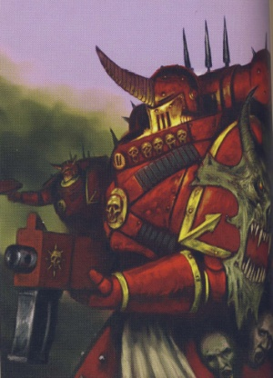
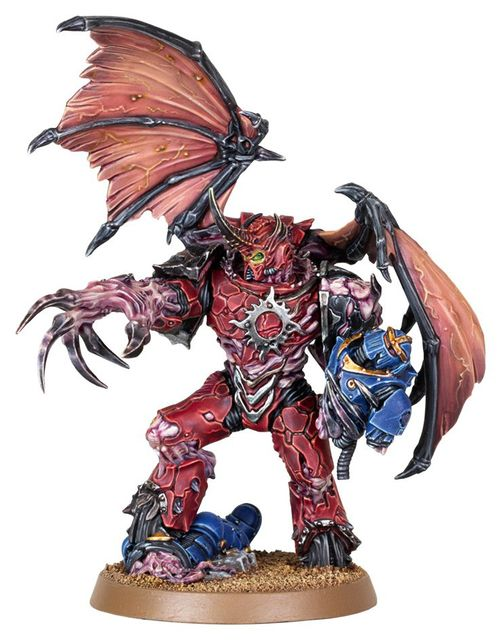
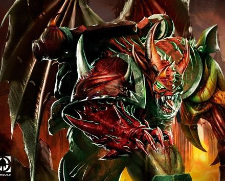

# 0707 阿格尔·塔尔 Argel Tal

精校状态：中文行文已逐段精校，部分术语仍为暂定

分类：人类帝国 / 怀言者

原文来源：https://www.bilibili.com/opus/1089686314590142486

原作者：帝国神选罐头

原文时间：2025年07月15日 11:39

[返回分类目录](目录.md) · [全书目录](../../目录.md)

原篇名：安格尔·塔尔 Argel Tal

<!-- A0707-B0001 -->
**英文原文**

"I don’t enjoy war, yet I fight. I don’t relish torture, yet I inflict it. I don’t revere the gods, yet I serve their holy purpose. Humanity’s weakest souls will always cling to the words “I was just following orders”. They cower behind those words, making a virtue of their own weakness, lionising brutality over nobility. I know that when I die, I’ll have lived my whole life shrouded by that same excuse."

<!-- /A0707-B0001 -->

<!-- A0707-B0002 -->

原译文

“我不喜欢战争，但我战斗。我不喜欢酷刑，但我施加。我不敬畏神灵，但我为他们的神圣目的服务。人类最脆弱的灵魂总是会坚持‘我只是在服从命令’这句话。他们躲在这些话后面，利用自己的弱点，崇尚野蛮而非崇高。我知道，当我死的时候，我的一生都会被同样的借口所笼罩。”

**校订译文**

“我不喜爱战争，却仍然战斗；我不享受酷刑，却仍然施刑；我不敬奉诸神，却仍为祂们的神圣目的效力。人类最软弱的灵魂，总会紧抓‘我只是奉命行事’这句话。他们躲在借口背后，将软弱包装成美德，推崇残暴而舍弃高贵。我知道，等我死去，我的一生也将始终笼罩在同一个借口之下。”

<!-- /A0707-B0002 -->

<!-- A0707-B0003 -->
**英文原文**

Argel Tal was the Captain of the 7th Assault Company of the Serrated Sun Chapter of the Word Bearers Space Marine Legion during at least the latter half of the Great Crusade. Later, he would be referred to as the Crimson Lord of the Gal Vorbak, captain of the Word Bearers' first daemon-possessed Space Marines.

<!-- /A0707-B0003 -->

<!-- A0707-B0004 -->

原译文

至少在大远征的后半段，安格尔·塔尔是怀言者星际战士军团锯齿烈阳战团第7突击连的连长。后来，他被称为受祝之子的深红领主，是怀言者第一个附魔战士连长。

**校订译文**

至少在大远征后半期，阿格尔·塔尔担任怀言者军团锯齿烈阳战团第七突击连连长。后来，他获称“受祝之子的深红领主”，统领怀言者首批被恶魔附身的星际战士。

<!-- /A0707-B0004 -->

<!-- A0707-B0005 图片 -->

<!-- A0707-B0006 -->

原译文

Argel Tal, Crimson Lord of the Gal Vorbak 安格尔·塔尔，受祝之子的深红领主

**校订译文**

Argel Tal, Crimson Lord of the Gal Vorbak 阿格尔·塔尔，受祝之子的深红领主

<!-- /A0707-B0006 -->

<!-- A0707-B0007 -->
## Biography 传记

<!-- /A0707-B0007 -->

<!-- A0707-B0008 -->
### Early History 早期历史

<!-- /A0707-B0008 -->

<!-- A0707-B0009 -->
**英文原文**

Tal was a native of Colchis, born in the village of Singh-Rukh to a carpenter and a seamstress. He had four older sisters and was named 'the Last Angel' by his mother who bore no more children. As a child, he was inducted into the Word Bearers Space Marine Legion by First Chaplain Erebus, and his implantations and initial training was overseen by the Apothecary Turyon. Erebus had at first chosen Tal to become one of the Legion's Chaplains, but the pupil chose to pursue his training among the fighting elements of his brothers — which led to the two Astartes coming to blows.

<!-- /A0707-B0009 -->

<!-- A0707-B0010 -->

原译文

塔尔是科尔基斯人，出生在狮岩村，是一名木匠和裁缝。他有四个姐姐，他的母亲给他起名叫“最后的天使”，因为她不再生孩子了。当他还是个孩子的时候，他被第一牧师艾瑞巴斯引入了怀言者星际战士军团，他的植入和初步训练由药剂师图利恩监督。艾瑞巴斯起初选择塔尔成为军团的牧师之一，但这位学生选择在兄弟们的战斗基础中继续训练，这导致两名阿斯塔特发生冲突。

**校订译文**

塔尔出生于科尔基斯的狮岩村，父亲是木匠，母亲是裁缝。他有四个姐姐，母亲此后再未生育，因而称他为“最后的天使”。幼年时，首席教士艾瑞巴斯将他招入怀言者军团，药剂师图利恩负责他的器官植入与初期训练。艾瑞巴斯原想培养他成为教士，但塔尔选择在兄弟们的作战部队中继续受训，为此甚至与老师大打出手。

**校注：** born ... to a carpenter and a seamstress 指父母的职业，原译误使塔尔本人兼任木匠与裁缝。

<!-- /A0707-B0010 -->

<!-- A0707-B0011 -->
**英文原文**

Eventually Argel Tal took up the role of Captain of the 7th Assault Company in the Serrated Sun Chapter, becoming at the time the youngest warrior to reach such a rank in the legion. At the chastisement of the Legion among the ruins of Monarchia in 962.M30, he and Xaphen were the ones to draw Lorgar Aurelian out of his grief-induced stupor, and he took it upon himself to take in Cyrene Valantion, one of the few citizens who had remained in the vicinity. During the compliance of 47-16, he fought alongside the Custodes assigned to keep watch on the XVII, and started a friendship based on mutual respect with their leader Aquillon.

<!-- /A0707-B0011 -->

<!-- A0707-B0012 -->

原译文

最终，安格尔·塔尔在锯齿烈阳战团中担任第七突击连连长，成为当时军团中达到如此等级的最年轻的战士。962.M30，在完美之城废墟中军团受到惩罚时，他和夏芬将珞珈·奥瑞利安从悲伤引起的昏迷中拉了出来，他主动收留了昔兰尼·瓦兰蒂恩，这是少数留在附近的公民之一。在47-16征服期间，他与被指派监视第十七军团的禁军并肩作战，并与他们的领导人阿奎隆建立了基于相互尊重的友谊。

**校订译文**

后来，阿格尔·塔尔成为锯齿烈阳第七突击连连长，是军团当时晋升至此职的最年轻战士。962.M30，军团在摩纳齐亚废墟中受罚后，他与夏芬将珞珈·奥瑞利安从悲恸的恍惚中唤醒。他还主动收留了少数仍滞留附近的居民之一、昔兰尼·瓦兰蒂恩。在 47-16 的归顺行动中，他与受命监视第十七军团的禁军并肩作战，并与其首领阿奎隆建立了相互尊重的友谊。

<!-- /A0707-B0012 -->

<!-- A0707-B0013 -->
**英文原文**

The Serrated Sun subsequently rejoined the 1,301st Expedition Fleet, accompanied by their Primarch Lorgar Aurelian who had ordained the Legio would undertake The Pilgrimage of Colchisian myth. Around 965.M30, they reached the largest warp storm known to humankind and found a planet at its edge. After weeks of studying the natives' ways and ideas, Lorgar agreed to take part in one of their rituals, which Tal stumbled upon in the company of one of the Custodes. The latter attempted to arrest Lorgar, but Tal incapacitated him and watched as the Custodes was made the tenth blood sacrifice for the ascension of the priestess Ingethel.

<!-- /A0707-B0013 -->

<!-- A0707-B0014 -->

原译文

锯齿烈阳随后重新加入了第1301远征舰队，在他们的原体珞珈·奥瑞利安的陪同下，他任命了军团，将从事科尔基斯神话中的朝圣之旅。大约在965.M30，他们到达了人类已知的最大亚空间风暴，并在其边缘发现了一颗行星。在研究了当地人的方式和想法数周后，珞珈同意参加他们的一个仪式，塔尔在一名禁军的陪同下偶然发现了这个仪式。后者试图逮捕珞珈，但塔尔使他丧失了行动能力，看着禁军为女祭司英格泰尔的升格献上了第十次血祭。

**校订译文**

随后，锯齿烈阳重返第一千三百零一远征舰队，由原体珞珈同行；珞珈已下令军团踏上科尔基斯神话中的朝圣之旅。约在 965.M30，他们抵达人类已知最大的亚空间风暴，在边缘找到一颗行星。研究当地人的习俗与信仰数周后，珞珈同意参与他们的一场仪式。塔尔与一名禁军偶然撞见此事。禁军试图拘捕原体，却被塔尔制服；塔尔随后眼看着他成为女祭司英格泰尔升魔仪式的第十名血祭祭品。

**校注：** 第十名血祭祭品为被俘禁军，不是他自愿献上第十次血祭。

<!-- /A0707-B0014 -->

<!-- A0707-B0015 -->
**英文原文**

Sent onboard the light cruiser Orfeo's Lament with his Company, Tal was shown what lay beyond the storm — an ocean of souls, and the remnants of the Eldar Empire. His fellow Astartes and he were granted visions of the past: the Fall of the Eldar, and the scattering of the primarchs which Tal himself caused by destroying the Gellar Field protecting the Emperor's laboratory. Back in the warp, Ingethel persuaded Tal to have the Orfeo's Lament's Gellar field generators destroyed, and she butchered the Word Bearers to enable their possession by daemons. Brought back to life and finding the ship's crew slaughtered by the denizens of the warp, they headed back to the edge of the storm. While less than a minute passed in realspace, the survivors of Seventh Company took seven months to return, and were forced to cannibalize the dead crew and kill some of their own to survive. At his gene-sire's request, he divulged to the Primarch his experience in the Immaterium, providing useful insight for the Book of Lorgar.

<!-- /A0707-B0015 -->

<!-- A0707-B0016 -->

原译文

塔尔和他的连队一起被派上了轻巡洋舰奥尔菲的哀悼号，他看到了风暴之外的东西—灵魂之海和灵族帝国的残余。他的阿斯塔特同伴和他被授予了过去的幻象：灵族陨落，以及塔尔自己摧毁保护帝皇实验室的盖勒力场所造成的原体的分散。回到亚空间中，英格泰尔说服塔尔摧毁了奥尔菲的哀悼号的盖勒力场发生器，并屠杀了怀言者，使他们能够被恶魔占据。他们重获新生，发现船员被亚空间的居民屠杀，于是他们回到了风暴的边缘。在现实世界中不到一分钟的时间里，第七连的幸存者花了七个月的时间才回来，被迫吃掉死去的船员，并杀死了一些自己的人才能生存。应他的基因之父的要求，他向原体透露了他在非物质界的经历，为珞珈之书提供了有益的见解。

**校订译文**

塔尔带着连队乘轻巡洋舰奥尔菲的哀悼号进入风暴，看见风暴彼端的灵魂海洋及灵族帝国残迹。他与同袍目睹过去的幻象：灵族之陨，以及原体离散。按照这一幻象，正是塔尔摧毁了保护帝皇实验室的盖勒力场，导致原体被卷走。返回亚空间后，英格泰尔又说服他摧毁舰上的盖勒力场发生器，随后屠杀怀言者，使恶魔得以附身。战士们复活时，发现舰员也已被亚空间生物杀光，便启程返回风暴边缘。现实宇宙中虽只过去不到一分钟，第七连幸存者却耗时七个月才归来；为活下去，他们不得不吞食舰员遗体，甚至杀死部分同袍。应原体要求，塔尔讲述非物质界中的经历，为《珞珈之书》的编写提供了重要见解。

**校注：** 原文明确以 visions of the past 叙述此行；与全书其他原体离散说法并存，不将幻象中的因果链升级为唯一真相。

<!-- /A0707-B0016 -->

<!-- A0707-B0017 图片 -->

<!-- A0707-B0018 -->

原译文

Argel Tal 安格尔·塔尔

**校订译文**

Argel Tal 阿格尔·塔尔

<!-- /A0707-B0018 -->

<!-- A0707-B0019 -->
### Favored of Lorgar 珞珈的宠信

原题：Favored of Lorgar 珞珈的偏爱

<!-- /A0707-B0019 -->

<!-- A0707-B0020 -->
**英文原文**

In honor of his achievements in the Chapter, his Primarch installed him as the Captain of his Gal Vorbak (the "Blessed Sons"), an elite cadre of warriors who were the first to wear the crimson colour on their power armour. Despite his accomplishments, Tal held many doubts about the future and confided frequently with the Confessor Cyrene Valantion and over the years the two became very close. Around 005.M31 came the first signs of the Gal Vorbak's daemons manifesting themselves through their bodies, first as seizures during the Compliance action of Calis. Like his brethren, Tal had to sequester himself for several days to endure the changes, emerging revitalized. It was shown to Lorgar by Ingethel the Ascended during his sojourn into the Eye of Terror that Argel Tal will become much more powerful, becoming taller than a Primarch in his Daemon form, and will fight and die during the Siege of Terra. He is said to be killed by the Primarch Sanguinius after rampaging through a squad of Imperial Fists. However Erebus would later claim that this was only a potential future.

<!-- /A0707-B0020 -->

<!-- A0707-B0021 -->

原译文

为了纪念他在战团中的成就，他的原体任命他为加尔·沃巴克（“受祝之子”）的连长，受祝之子是一支精英战士队伍，他们是第一个在动力盔甲上覆盖深红色的人。尽管塔尔取得了成就，但他对未来仍心存疑虑，并经常向告解者昔兰尼·瓦兰蒂恩吐露心声，多年来，两人关系非常密切。大约在005.M31，受祝之子们的恶魔首次通过身体显现，第一次是卡利斯征服行动期间的发作。像他的兄弟们一样，塔尔不得不隔离几天来忍受这些变化，重新焕发活力。升天者英格泰尔在恐惧之眼逗留期间向珞珈表明，安格尔·塔尔将变得更加强大，比恶魔形态的原体还要强，并将在泰拉围城中战斗至死。据说他将在横扫一队帝国之拳后被原体圣吉列斯杀死。然而，艾瑞巴斯后来声称这只是一个潜在的未来。

**校订译文**

为表彰塔尔在战团中的成就，珞珈任命他统领受祝之子（Gal Vorbak）。这支精锐最早将动力盔甲涂为深红色。尽管屡建功勋，塔尔对未来仍疑虑重重，常向告解者昔兰尼·瓦兰蒂恩倾诉；多年相处使两人极为亲密。约在 005.M31，受祝之子体内的恶魔开始显现，最早表现为卡利斯归顺行动中的癫痫发作。塔尔与兄弟们一样闭门数日，熬过变化，出来时焕然一新。珞珈在恐惧之眼朝圣时，英格泰尔向他展示一个未来：塔尔会变得更强大，恶魔形态下比原体还要高大；他将在泰拉围城中横扫一队帝国之拳，最终死于圣吉列斯之手。不过，艾瑞巴斯后来声称，那只是诸多可能未来之一。

**校注：** taller than a Primarch in his Daemon form 是塔尔在恶魔形态下比原体更高大，原译误成比恶魔原体更强。

<!-- /A0707-B0021 -->

<!-- A0707-B0022 -->
**英文原文**

Tal would converse with his daemon, learning during the traitor Astartes' briefing before the Drop Site Massacre that its name was Raum. It was on the same occasion that Raum revealed its host's fated death "in the shadow of great wings", and that Erebus made the first move to reconcile with his former student. While leading the Serrated Sun on Isstvan V, Tal was the one to give the order to open on the Raven Guard as they were falling back. In the ensuing battle, his possessed form manifested itself and he let Raum take control for the first time after he was nearly killed by Corvus Corax. When Dagotal was killed, he realized that all members of the Gal Vorbak were connected psychically, and the end of the fighting revealed that only eleven of the Blessed Sons remained. In the wake of these losses, he had Erebus tell him the extent of Lorgar's machinations during the previous four decades. Upon learning that the Custodes were loose aboard the De Profundis, he led the Gal Vorbak back into orbit, only to find the Cyrene in her very last moments. Aquillon had slain her, and Tal ordered the Custodes's fleeing Thunderhawk shot down before gathering the Gal Vorbak for a Drop Pod assault. In a brutal close combat fight, six more Blessed Sons fell but all Custodes were killed, Tal ripping Aquillon's head off with his own teeth. In the aftermath of the battle Argel Tal frequently visited Cyrene's tomb aboard the Fidelitas Lex. To honor their memory he took up two near weapons: the Guardian Spear that killed his close friend Xaphen and the Power Sword that slew Cyrene.

<!-- /A0707-B0022 -->

<!-- A0707-B0023 -->

原译文

塔尔会与他的恶魔交谈，在登陆点大屠杀之前叛徒阿斯塔特的简报中得知它的名字叫劳姆。就在同一场合，劳姆透露了主人的死讯“在伟大翅膀的阴影下”，艾瑞巴斯也迈出了与前学生和解的第一步。在伊斯塔万五号率领锯齿烈阳时，塔尔是在暗鸦守卫撤退时下令打开的人。在随后的战斗中，他被附身的形态显现出来，在差点被科沃斯·科拉克斯杀死后，他第一次让劳姆控制了局面。当达戈塔尔被杀时，他意识到受祝之子的所有成员在灵能上都有联系，战斗结束时，只有十一个受祝之子还活着。在这些损失之后，他让艾瑞巴斯告诉他珞珈在过去四十年里的阴谋程度。在得知深邃挽歌号上的禁军已经脱困后，他带领受祝之子号返回轨道，在昔兰尼的最后时刻找到了她。阿奎隆杀死了她，塔尔命令在召集受祝之子进行空投舱攻击之前，击落禁军逃跑的雷鹰。在一场残酷的近战中，又有六个受祝之子倒下，但所有禁军都被杀死，塔尔用自己的牙齿扯下了阿奎隆的头。战斗结束后，安格尔·塔尔经常乘坐信仰之律号前往昔兰尼之墓。为了纪念他们，他拿起了两件近身武器：杀死他挚友夏芬的卫士之矛和杀死昔兰尼的动力剑。

**校订译文**

塔尔会与体内恶魔交谈；登陆点大屠杀前的叛军简报会上，他得知其名为劳姆。劳姆同时预言宿主注定会“死在巨翼的阴影下”，艾瑞巴斯也在此时开始与昔日弟子和解。在伊斯塔万五号，塔尔率领锯齿烈阳，下令向撤退中的暗鸦守卫开火。战斗中，他的附魔形态显现，差点被科沃斯·科拉克斯杀死后，首次让劳姆接管身体。达戈塔尔阵亡时，他察觉所有受祝之子在灵能上彼此相联；战斗结束后，这群精锐只剩十一人。面对惨重损失，他逼艾瑞巴斯说清珞珈过去四十年的阴谋。得知来自深渊号上的禁军已经脱困后，他率受祝之子返回轨道，却只赶上昔兰尼生命的最后一刻——阿奎隆杀了她。塔尔下令击落禁军用于逃离的雷鹰，再率受祝之子乘空降舱进攻。惨烈近战中，又有六名受祝之子阵亡，但禁军也全军覆没，塔尔甚至用牙齿咬下阿奎隆的头。此后，他常到信仰之律号上的昔兰尼墓前悼念。他还取用两件武器作为纪念：杀死挚友夏芬的卫士之矛，以及杀死昔兰尼的动力剑。

**校注：** open on 为向目标开火，非“打开”；受祝之子为部队，并非舰名。Cyrene’s tomb aboard the Fidelitas Lex 指墓在舰上，不是乘舰前去别处扫墓。原文 near weapons 疑为 new weapons，结合列举按两件新取用的武器处理。

<!-- /A0707-B0023 -->

<!-- A0707-B0024 图片 -->

<!-- A0707-B0025 -->

原译文

Argel Tal possessed by Raum 被劳姆附身的安格尔·塔尔

**校订译文**

Argel Tal possessed by Raum 被劳姆附身的阿格尔·塔尔

<!-- /A0707-B0025 -->

<!-- A0707-B0026 -->
**英文原文**

After Istvaan V Argel Tal gathered together survivors of broken Word Bearer companies and formed the Vakrah Jal, the Chapter of Consecrated Iron, a new elite unit of Possessed Marines that would train in the fighting pits of the World Eaters aboard their flagship Conqueror. He later fought in the Shadow Crusade alongside World Eaters 8th Captain Khârn, whom he had become friends with during the course of the Great Crusade and Horus Heresy. During this time, Tal became the favorite of Lorgar but Erebus attempted to manipulate him to his own ends, going so far to try and earn his trust by resurrecting Cyrene. He took part in the Battle of Armatura and the Nuceria Massacre and in the latter was murdered by Erebus, as the Dark Apostle claimed Argel Tal's influence would prevent Khârn from embracing the Ruinous Powers and thus cost them the war. Ingethel's prophecy that he would "die in the shadow of great wings" was fulfilled as he died in the shadow of an Aquila on top of the Imperator Titan Corinthian.

<!-- /A0707-B0026 -->

<!-- A0707-B0027 -->

原译文

伊斯塔万五号之后安格尔·塔尔召集了破碎的怀言者连队的幸存者，成立了受祝之子，奉献之铁战团，这是一支新的拥有附魔战士的精英部队，在吞世者的旗舰征服者号上的战斗坑中训练。后来，他与吞世者第八连长卡恩一起参加了阴影远征，他们在大远征过程中和荷鲁斯叛乱期间成为了朋友。在此期间，塔尔成为珞珈的最爱，但艾瑞巴斯试图操纵他达到自己的目的，甚至试图通过复活昔兰尼来赢得他的信任。他参加了阿玛图拉之战和努凯里亚大屠杀，在后者中被艾瑞巴斯谋杀，因为黑暗使徒声称安格尔·塔尔的影响力将阻止卡恩拥抱毁灭之力，从而使他们付出战争的代价。英格泰尔的预言，他将“死在伟大翅膀的阴影下”，当他死在帝皇泰坦科林斯顶部的天鹰阴影下时，这一预言得到了应验。

**校订译文**

伊斯塔万五号之战后，塔尔收拢怀言者残破连队的幸存者，组建奉献之铁战团（Vakrah Jal）。这支新的附魔精锐，曾在吞世者旗舰征服者号的竞技场中训练。随后，他与大远征及叛乱期间结为好友的第八连连长卡恩，一起参加暗影远征。此时，塔尔深受珞珈宠信，艾瑞巴斯却仍企图操纵他，甚至以复活昔兰尼的方式争取信任。塔尔参加阿玛图拉之战与努凯里亚大屠杀，却在后者中被艾瑞巴斯谋杀。黑暗使徒声称，塔尔会妨碍卡恩投向毁灭诸力，最终令他们输掉战争。他死在统治者型帝皇级泰坦科林斯号顶部的天鹰阴影下，应验了英格泰尔所说的“死在巨翼的阴影下”。

**校注：** Vakrah Jal 在第40篇已释作“奉献之铁战团”，与原有 Gal Vorbak 受祝之子区分；原译将两个组织混称。Imperator 为帝皇级中的统治者型，按本书前文层级表述。

<!-- /A0707-B0027 -->

<!-- A0707-B0028 -->
## Wargear 战斗装备

原题：Wargear 战备

<!-- /A0707-B0028 -->

<!-- A0707-B0029 -->
**英文原文**

After becoming Chapter Master of the Serrated Sun, Argel Tal took up twin Power Swords of his predecessor Deumos dubbed the Twin Swords of Red Iron. Following the Drop Site Massacre, he wielded the Guardian Spear of Sythran, Shahin-i Tarazu as well as Iktinaetar, the Sentinel Blade of Aquillon.

<!-- /A0707-B0029 -->

<!-- A0707-B0030 -->

原译文

在成为锯齿烈阳的战团长后，安格尔·塔尔拿起了他的前任德莫斯的双剑，被称为赤铁双剑。在登陆点大屠杀之后，他挥舞着西思兰的卫士之矛、猎鹰裁决或者伊克蒂纳塔尔，阿奎隆的哨戒之刃。

**校订译文**

成为锯齿烈阳战团长后，塔尔接过前任德莫斯的两把动力剑，合称“赤铁双剑”。登陆点大屠杀之后，他使用西思兰的卫士之矛“猎鹰裁决”（Shahin-i Tarazu），以及阿奎隆的哨戒之刃“伊克蒂纳塔尔”（Iktinaetar）。

**校注：** Shahin-i Tarazu 是卫士之矛的名字，不是第三件武器；as well as 表同时使用，而非二选一。

<!-- /A0707-B0030 -->

本篇核心术语与暂定项

以下列出本篇出现的英文原形及核心术语表用词。同形词可能指不同对象，具体词义以本篇正文和校注为准；单复数、别名和仅见于图注的名称可能尚未列入。完整候选见[术语表](../../术语表/双语术语候选.csv)。

| 英文 | 采用中文 | 状态 |
| --- | --- | --- |
| Space Marines | 星际战士 | 官方已核对 |
| World Eaters | 吞世者 | 官方已核对 |
| Eldar | 灵族 | 暂定·语境区分 |
| Horus Heresy | 荷鲁斯之乱 | 官方已核对 |
| Warp | 亚空间 | 官方已核对 |
| Gellar Field | 盖勒力场 | 暂定 |
| Eye of Terror | 恐惧之眼 | 官方已核对 |
| Imperial Fists | 帝国之拳 | 暂定 |
| Emperor | 帝皇 | 官方已核对 |
| Primarch | 原体 | 官方已核对 |
| Word Bearers | 怀言者 | 暂定·官方待核 |
| Dark Apostle | 黑暗使徒 | 官方已核对 |
| The Order | 秩序 | 暂定·官方待核 |
| Great Crusade | 大远征 | 暂定·官方待核 |
| Compliance | 归顺；纳入帝国统治 | 暂定·官方待核 |
| Terra | 泰拉 | 暂定·官方待核 |
| Horus | 荷鲁斯 | 暂定·官方待核 |
| Erebus | 艾瑞巴斯 | 暂定·官方待核 |
| Cyrene Valantion | 昔兰尼·瓦兰蒂恩 | 暂定·官方待核 |
| Nuceria | 努凯里亚 | 暂定·官方待核 |
| Titan | 泰坦 | 暂定·官方待核 |
| Aquila | 天鹰 | 暂定·官方待核 |
| Master | 导师（审判庭职衔）／舰务官（舰员职务） | 语境定译·官方待核 |
| Confessor | 告解者 | 暂定 |
| Argel Tal | 阿格尔·塔尔 | 暂定·官方待核 |
| Chaplain | 教士 | 官方已核对 |
| Apothecary | 药剂师 | 官方已核对 |
| Drop Pod | 空降舱 | 官方已核·中英对照 |
| Cadre | 骨干连（寂静修女）／核心队（钛族） | 语境定译·钛族词根参考 |
| Space Marine Legion | 星际战士军团 | 暂定·官方待核 |
| Raven Guard | 暗鸦守卫 | 官方已核 |
| The Primarchs | 原体 | 暂定·官方待核 |
| Gal | 加尔 | 暂定·官方待核 |
| Isstvan | 伊斯塔万 | 暂定·官方待核 |
| Khârn | 卡恩 | 暂定·官方待核 |
| Power Armour | 动力盔甲 | 暂定·官方待核 |
| Space Marine | 星际战士 | 暂定·官方待核 |
| Chapter | 战团 | 暂定·官方待核 |
| Chapter Master | 战团长 | 暂定·官方待核 |
| Captain | 连长 | 暂定·官方待核 |
| Remnants | 残骸 | 暂定·官方待核 |
| Orfeo | 奥尔菲奥 | 暂定·官方待核 |
| Grief | 格里夫 | 暂定·官方待核 |
| Lorgar | 珞珈 | 暂定·官方待核 |
| Lorgar Aurelian | 珞珈·奥瑞利安 | 暂定·官方待核 |
| Colchis | 科尔基斯 | 暂定·官方待核 |
| Gal Vorbak | 受祝之子 | 暂定·官方待核 |
| Serrated Sun | 锯齿烈阳 | 暂定·官方待核 |
| Ingethel the Ascended | 升天者英格泰尔 | 暂定·官方待核 |
| Ingethel | 英格泰尔 | 暂定·官方待核 |
| Monarchia | 摩纳齐亚 | 暂定·官方待核 |
| Shadow Crusade | 暗影远征 | 暂定·官方待核 |
| Fidelitas Lex | 信仰之律号 | 暂定·官方待核 |
| De Profundis | 来自深渊号 | 暂定·官方待核 |
| Xaphen | 夏芬 | 暂定·官方待核 |
| Powers | 能天使 | 暂定·官方待核 |
| Host | 天军 | 暂定·官方待核 |
| Book of Lorgar | 《珞珈之书》 | 暂定·官方待核 |
| Ruinous Powers | 毁灭诸力 | 暂定·官方待核 |
| Chaplains | 教士 | 暂定·官方待核 |
| Armatura | 阿玛图拉 | 暂定·官方待核 |
| Corvus Corax | 科沃斯·科拉克斯 | 暂定·官方待核 |
| First Chaplain | 首席教士 | 暂定·官方待核 |
| Singh-Rukh | 狮岩村 | 暂定·官方待核 |
| Turyon | 图利恩 | 暂定·官方待核 |
| Aquillon | 阿奎隆 | 暂定·官方待核 |
| Raum | 劳姆 | 暂定·官方待核 |
| Dagotal | 达戈塔尔 | 暂定·官方待核 |
| Vakrah Jal | 奉献之铁战团 | 暂定·官方待核 |
| Corinthian | 科林斯号 | 暂定·官方待核 |
| Deumos | 德莫斯 | 暂定·官方待核 |
| Twin Swords of Red Iron | 赤铁双剑 | 暂定·官方待核 |
| Sythran | 西思兰 | 暂定·官方待核 |
| Shahin-i Tarazu | 猎鹰裁决 | 暂定·官方待核 |
| Iktinaetar | 伊克蒂纳塔尔 | 暂定·官方待核 |
| The Dark | 《黑暗》 | 暂定·官方待核 |
| Warp Storm | 亚空间风暴 | 暂定·官方待核 |
| Cyrene | 昔兰尼 | 暂定·官方待核 |
| Guardian Spear | 卫士之矛 | 暂定·官方待核 |
| Sojourn | 旅居号 | 暂定·官方待核 |
| Lament | 哀悼 | 暂定·官方待核 |

