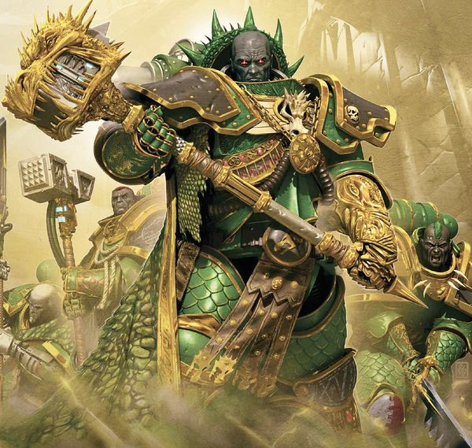
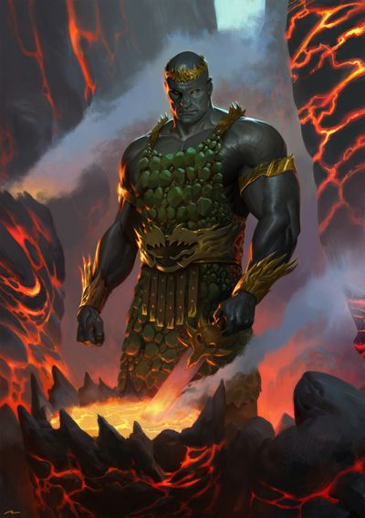
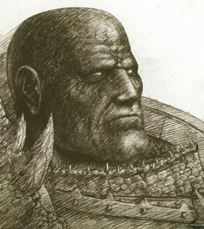
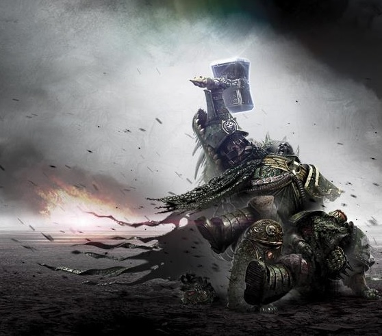
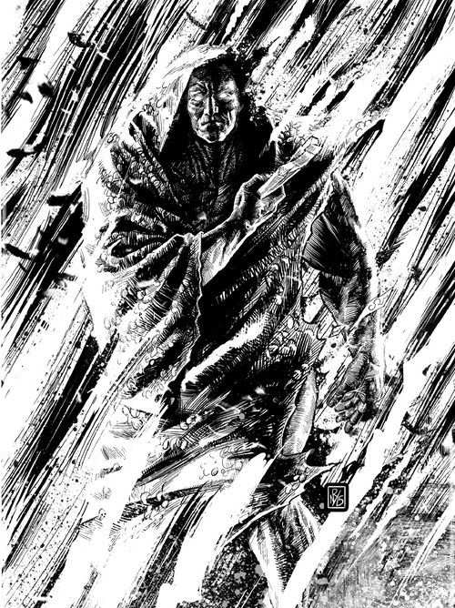
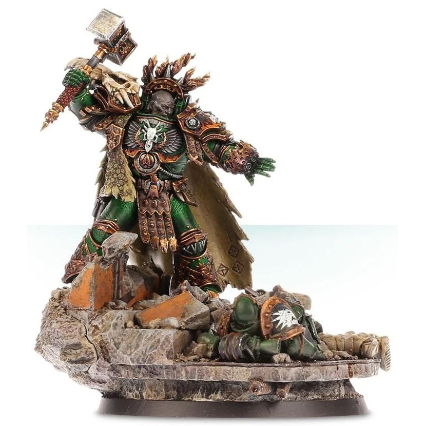

# 0708 沃坎 Vulkan

精校状态：中文行文已逐段精校，部分术语仍为暂定

分类：人类帝国 / 火蜥蜴

原文来源：https://www.bilibili.com/opus/1082419204168089632

原作者：帝国神选罐头

原文时间：2025年06月25日 21:39

[返回分类目录](目录.md) · [全书目录](../../目录.md)

<!-- A0708-B0001 -->
**英文原文**

"The flesh is weak, but deeds endure" - Vulkan to Ferrus Manus

<!-- /A0708-B0001 -->

<!-- A0708-B0002 -->

原译文

“肉体脆弱，但事迹永恒” — 沃坎对费鲁斯·马努斯所说

**校订译文**

“肉体脆弱，功业长存。”——沃坎对费鲁斯·马努斯说

<!-- /A0708-B0002 -->

<!-- A0708-B0003 -->
**英文原文**

Vulkan was one of the twenty Primarchs created by the Emperor of Mankind to lead his Great Crusade and reunite the scattered peoples of humanity. His Space Marine Legion was re-named the Salamanders in his honour. As with all the Primarchs, Vulkan inherited an aspect of his father. However for him this was the unique ability of being a perpetual, making him essentially immortal. Vulkan was able to regenerate fully from any injury, including a death that would vaporize him completely. This ability was unknown to him until the Horus Heresy, and during the Great Crusade he gained a reputation for his empathy towards average humans as well as his craftsmanship abilities.

<!-- /A0708-B0003 -->

<!-- A0708-B0004 -->

原译文

沃坎是人类帝皇为领导他的大远征并使分散的人类重新团结起来而创建的二十位原体之一。为了奖励他，他的星际战士军团被重新命名为火蜥蜴。与所有的原体一样，沃坎继承了他父亲的一个方面。然而，对他来说，这是一种永生者的独特能力，使他本质上不朽。沃坎能够从任何伤害中完全再生，包括将他完全蒸发的死亡。在荷鲁斯叛乱之前，他并不知道这种能力，在大远征期间，他因对凡人的同情和精湛的技艺而闻名。

**校订译文**

沃坎是人类帝皇创造的二十位原体之一，肩负领导大远征、重新团结散居银河的人类的使命。他的星际战士军团为纪念他而改称火蜥蜴。每位原体都继承了父亲的一部分特质，沃坎所继承的则是永生者的能力，近乎不死。他能从任何伤害中完全再生，甚至遭到彻底汽化也不例外。直到荷鲁斯之乱，他才发现这一能力。大远征时期，他主要以对普通人的同理心和精湛的工艺闻名。

**校注：** Perpetual 按核心永生者；本段概述其再生能力，后文另有雷击石导致无法立即复生的情节，两者按各自语境保留。

<!-- /A0708-B0004 -->

<!-- A0708-B0005 图片 -->

<!-- A0708-B0006 -->

原译文

Vulkan 沃坎

**校订译文**

Vulkan 沃坎

<!-- /A0708-B0006 -->

<!-- A0708-B0007 -->
## History 历史

<!-- /A0708-B0007 -->

<!-- A0708-B0008 -->
### Youth 青年

<!-- /A0708-B0008 -->

<!-- A0708-B0009 -->
**英文原文**

When the Primarchs were scattered from the Emperor's laboratory, Vulkan arrived on the planet Nocturne during the Time of Trial as an infant and was soon taken in by the blacksmith, N'bel. N'bel raised Vulkan, naming him after the first king of the salamanders, and the young Primarch considered him his father. The people of his home town Hesiod were astounded by this child, for within the space of three years, he was stronger and bigger than any man in his town. In addition to his massive physical size, he was the quickest mind, and the greatest blacksmith anyone knew of. Indeed, it was not long before Vulkan himself was teaching forging techniques to the people that had not yet been discovered.

<!-- /A0708-B0009 -->

<!-- A0708-B0010 -->

原译文

当原体从帝皇的实验室中分散时，沃坎在婴儿时期就来到了夜曲星，很快就被铁匠恩’贝尔收留了。恩’贝尔收养了沃坎，以火蜥蜴的第一位王的名字给他起名，年轻的原体把他当作自己的父亲。他的家乡赫西奥德的人们对这个孩子感到震惊，因为在三年的时间里，他比镇上任何人都强壮、高大。除了他巨大的体型，他还有最快的头脑，也是任何人所知道的最伟大的铁匠。事实上，不久之后，沃坎本人就开始向人们传授尚未被发现的锻造技术。

**校订译文**

原体从帝皇实验室离散时，婴儿沃坎在“审判之时”流落到夜曲星，不久被铁匠恩’贝尔收养。恩’贝尔以火蜥蜴族群第一位王者之名为他命名，年轻的原体也视其为父亲。赫西奥德镇的居民惊叹于这孩子的成长：仅仅三年，他就比镇上任何人都更高大强壮。他不但体格惊人，还拥有最敏锐的头脑和最精湛的锻造技艺。不久，他就开始向人们传授前所未知的锻造方法。

**校注：** 原译漏去 Time of Trial 审判之时，已补回。

<!-- /A0708-B0010 -->

<!-- A0708-B0011 图片 -->

<!-- A0708-B0012 -->

原译文

Young Vulkan 青年沃坎

**校订译文**

Young Vulkan 青年沃坎

<!-- /A0708-B0012 -->

<!-- A0708-B0013 -->
**英文原文**

The people of Nocturne were frequently raided by Dark Eldar. They were so used to this common occurrence, that each person in town had developed their own hiding place to avoid capture. When the Dark Eldar raided again in Vulkan's fourth year on Nocturne, the Primarch refused to hide and instead stood out in the centre of the settlement, his two smithing hammers crossed over his shoulders. The people of Vulkan's town were so inspired by his example that they joined him and prepared to defend their town. With a Primarch leading the defense, the people of the town decisively defeated the Dark Eldar. Vulkan alone killed a hundred Eldar that day. Within weeks the leaders of the seven largest towns on Nocturne had traveled to meet Vulkan, and they soon swore never again to hide from the raiders.

<!-- /A0708-B0013 -->

<!-- A0708-B0014 -->

原译文

夜曲星人经常遭到黑暗精灵的袭击。他们已经习惯了这种常见的情况，镇上的每个人都有自己的藏身之处来避免被捕。当黑暗精灵在沃坎统治的第四年再次突袭夜曲星时，原体拒绝躲藏，而是站在定居点的中心，他的两把锤子划过他的肩膀。沃坎镇上的人们被他的榜样所鼓舞，他们加入了他的行列，准备保卫他们的城镇。在一位原体的带领下，镇上的人们果断地击败了黑暗精灵。那天，仅沃坎一人就杀死了一百名灵族。几周之内，夜曲星七个最大城镇的领导人就前往会见沃坎，他们很快发誓再也不会躲避袭击者。

**校订译文**

夜曲星频遭黑暗灵族劫掠，居民早已习以为常，人人都有躲避抓捕的藏身处。沃坎来到这里的第四年，劫掠者再次来袭，他却不肯躲藏，肩上交叉扛着两把锻锤，站在聚落中央。镇民受其鼓舞，纷纷加入抵抗。在原体指挥下，他们大败黑暗灵族；仅沃坎一人，当天就杀死了一百名敌人。数周内，夜曲星七大城镇的领袖前来拜会他，随后立誓再也不向劫掠者躲藏退让。

**校注：** fourth year on Nocturne 指到达夜曲星的第四年，不是统治第四年；锻锤交叉扛在肩上，不是划过肩膀。

<!-- /A0708-B0014 -->

<!-- A0708-B0015 -->
**英文原文**

In celebration of the Primarch's victory over the Eldar raiders, a tournament was decided to be held. Unexpectedly, a stranger arrived in the middle of the festivities. Of pale complexion and wearing outlandish clothing, the stranger asked only to be allowed to compete. When he announced that he could best anyone in the town, the people laughed at this outlander. Who could possibly beat Vulkan in any feat of intellect, strength, craftsmanship, or endurance? Nonetheless, Vulkan and the stranger wagered that whoever lost the tournament would forever serve the victor. Lasting 8 days, the contest included many tests of strength and endurance such as the anvil lift (in which the two held anvils above their heads for a half-day before the contest was called a tie). The number of contests is unimportant, however, for by the end of day 8, Vulkan and the stranger were tied.

<!-- /A0708-B0015 -->

<!-- A0708-B0016 -->

原译文

为了庆祝原体战胜灵族袭击者，决定举行一场锦标赛。没想到的是，在庆祝活动进行到一半的时候，一个陌生人来了。这位面色苍白、穿着奇装异服的陌生人只要求被允许参加比赛。当他宣布他可以打败镇上的任何人时，人们嘲笑这个外地人。谁能在智力、力量、工艺或耐力方面击败沃坎？尽管如此，沃坎和那个陌生人打赌，无论谁输了比赛，都将永远为胜利者服务。比赛持续了8天，包括许多力量和耐力测试，如铁砧抬升（在比赛被判平局之前，两人将铁砧举过头顶半天）。然而，比赛的次数并不重要，因为到第8天结束时，沃坎和陌生人打平了。

**校订译文**

为了庆祝击败灵族劫掠者，居民决定举行竞技盛会。庆典中途，一名面色苍白、衣着奇异的外乡人出现，请求参赛。他声称能胜过镇上任何人，引得众人哄笑：谁能在才智、力量、工艺或耐力上超越沃坎？沃坎仍与他立下赌约，败者将终身侍奉胜者。竞赛持续八天，包括多项力量与耐力测试。例如举砧比赛中，两人将铁砧举过头顶足足半天，最终只能判为平局。具体比了多少项已不重要，到第八天结束，两人依旧难分高下。

<!-- /A0708-B0016 -->

<!-- A0708-B0017 -->
**英文原文**

In the final event, both contestants were given 24 hours to construct a weapon, before using said weapon to hunt down and slay the largest salamander they could find. Climbing a high mountain, the two each went out to find a drake. Vulkan quickly found and killed a very large Fire Drake. However, on his way back, the mountain he was standing on - which coincidentally was a volcano - erupted, casting Vulkan over a cliff. Hanging for dear life over the precipice, Vulkan was determined to hang on to his massive Salamander. Thus, he found himself hanging by one hand from a cliff with his other hand clutching the tail of his drake.

<!-- /A0708-B0017 -->

<!-- A0708-B0018 -->

原译文

在决赛中，两名参赛者都有24小时的时间来制造武器，然后使用该武器追捕并杀死他们能找到的最大的火蜥蜴。两人爬上一座高山，各自出去找一只火龙。沃坎很快发现并杀死了一只非常大的火龙。然而，在他回来的路上，他所在的那座山—碰巧是一座火山—爆发了，将沃坎抛下悬崖。在悬崖边的挣扎中，沃坎决心抓住他巨大的火蜥蜴。于是，他一只手挂在悬崖上，另一只手抓着火龙的尾巴。

**校订译文**

最后一项比赛中，两人各有二十四小时打造武器，再以自制武器猎杀能找到的最大火蜥蜴。他们登上高山，分头寻找火龙。沃坎很快猎杀一头巨兽，返程时脚下火山却突然喷发，将他掀下悬崖。他拼命抓住崖壁，又不愿放弃猎物，只得一手攀住悬崖，另一手紧握火龙尾巴。

<!-- /A0708-B0018 -->

<!-- A0708-B0019 -->
**英文原文**

Hanging there for hours, Vulkan's strength eventually ebbed away until he knew he must decide between the drake and his life. At that moment, however, the stranger arrived, carrying his own drake. Even from the edge of the cliff, the Primarch could tell that the outlander's drake was indeed bigger. Seeing Vulkan in distress, the stranger acted quickly, tossing his drake into a lava flow that separated them and using it as a bridge to cross to the Primarch. After hoisting Vulkan out of his mortal predicament, the stranger walked with him back to town, leaving his own drake to burn in the river of molten rock.

<!-- /A0708-B0019 -->

<!-- A0708-B0020 -->

原译文

在那里呆了几个小时，沃坎的力量最终减弱了，他知道他必须在这只火龙和他的生命之间做出抉择。然而，就在那一刻，那个陌生人带着自己的火龙来了。即使从悬崖边缘，原体也能看出外地人的火龙确实更大。看到沃坎陷入困境，陌生人迅速采取行动，将他的火龙扔进熔岩流中，将他们分开，并将其用作通往原体的桥梁。在将沃坎从致命的困境中解救出来后，这位陌生人和他一起走回城镇，留下自己的火龙在熔岩河中燃烧。

**校订译文**

数小时后，沃坎气力渐衰，明白自己必须在猎物与生命之间作出选择。这时，外乡人带着自己的火龙赶来。即使悬在崖边，沃坎也看得出，对方猎获的火龙更大。发现他遇险，外乡人立刻将猎物投入横亘两人之间的熔岩流，踏着龙尸渡过，救起沃坎。两人随后返回城镇，将外乡人的猎物留在熔岩河中焚烧。

<!-- /A0708-B0020 -->

<!-- A0708-B0021 -->
**英文原文**

Though the Outlander's Drake had been superior in size, he had thrown it away to save Vulkan, and when he returned to town with the Primarch empty-handed, Vulkan was declared the victor. To the amazement of his people, however, Vulkan kneeled before the stranger and said that any man who would value life over pride was worthy of his service. At this moment, the Outlander cast off his illusionary disguise and revealed himself to be the Holy Emperor of humanity. Thus it was that the Primarch, Vulkan and his Emperor were reunited.

<!-- /A0708-B0021 -->

<!-- A0708-B0022 -->

原译文

尽管外地人的火龙在体型上更为高大，但他为了救沃坎而将其丢弃。当他空手而归，沃坎被宣布为胜利者。然而，令他的人民惊讶的是，沃坎跪在陌生人面前说，任何重视生命而非骄傲的人都值得为他服务。此刻，外地人摆脱了虚幻的伪装，暴露了自己是人类的神圣帝皇。就这样，原体、沃坎和他的帝皇重聚了。

**校订译文**

外乡人的猎物虽然更大，却已为救沃坎而舍弃。因他空手归来，众人宣布沃坎获胜。然而，令居民震惊的是，沃坎却向外乡人跪下，宣称宁肯舍弃骄傲也要挽救生命的人，值得自己效忠。此时，外乡人散去幻象伪装，显露出人类帝皇的真实身份。原体沃坎就这样与父亲重逢。

<!-- /A0708-B0022 -->

<!-- A0708-B0023 -->
### Great Crusade 大远征

<!-- /A0708-B0023 -->

<!-- A0708-B0024 -->
**英文原文**

It is believed that at first Vulkan did not become unified with his own Legion for some years after his rediscovery, instead staying alongside the Emperor under his tutelage and fighting by his side. When Vulkan was eventually reunited with his Legion, it was at the head of a fleet of 3,000 new recruits which saved his forces from a massive Ork horde. Eventually it was decided that Vulkan's legion of Space Marines would henceforth be known as the Salamanders, in honour of the beast that had united him with his father. The Primarch continued to serve loyally throughout the Great Crusade and become renowned as an excellent craftsman of technology.

<!-- /A0708-B0024 -->

<!-- A0708-B0025 -->

原译文

据信，沃坎在回归后的几年里并没有与自己的军团合流，而是在帝皇的监护下与他并肩作战。当沃坎最终与他的军团重聚时，他率领着一支由3000名新兵组成的舰队，从庞大的欧克部落中拯救了他的部队。最终决定，沃坎的星际战士军团从此将被称为火蜥蜴，以纪念将他与父亲团结在一起的野兽。在整个大远征期间，这位原体继续忠诚地服务，并作为卓越的技术工匠而闻名。

**校订译文**

据信，沃坎被发现后的数年里，并未立即接掌军团，而是留在帝皇身边接受教导，与父亲并肩作战。真正与军团会合时，他率一支运载 3,000 名新兵的舰队赶来，救下遭庞大欧克军势围攻的部队。后来，军团正式改称火蜥蜴，纪念促成父子重逢的那种巨兽。大远征期间，沃坎始终忠心效力，并以杰出的技术与工艺闻名。

<!-- /A0708-B0025 -->

<!-- A0708-B0026 图片 -->

<!-- A0708-B0027 -->

原译文

Vulkan 沃坎

**校订译文**

Vulkan 沃坎

<!-- /A0708-B0027 -->

<!-- A0708-B0028 -->
**英文原文**

At some point during the Great Crusade, Vulkan and his Legion participated in reconquest of a world designated One-Five-Four-Six (locally known as Kharaatan) together with the Night Lords led by their Primarch, Konrad Curze, and Mechanicum Titan Legion Legio Ignis and several Imperial Army regiments. During this campaign, Vulkan became enraged by how Curze and his Legion waged war after he found out that the Night Lords had killed the inhabitants of a whole city in order to seed fear amongst the population. This confrontation between Vulkan and Curze resulted in a brief but fierce argument between the two primarchs. After conclusion of this campaign, Vulkan reported Curze's behaviour and actions to Warmaster Horus and primarch Dorn of the Imperial Fists. However, during the battle against Kharaatan's ruling Eldar coven, Vulkan flew into a rage when the Remembrancer Seriph was killed, and killed a surrendering Eldar child. This incident would haunt the Primarch deeply.

<!-- /A0708-B0028 -->

<!-- A0708-B0029 -->

原译文

在大远征期间的某个时刻，沃坎和他的军团与由午夜领主和他们的原体康拉德·柯兹、机械神教领导的泰坦军团和几个帝国军团一起参加了对一个名为1546（当地称为哈拉坦）的世界的收复。在这场战役中，沃坎发现午夜领主为了在民众中播下恐惧的种子而杀害了整个城市的居民，他对科兹和他的军团发动战争的方式感到愤怒。沃坎和科兹之间的对抗导致了两位原体之间短暂但激烈的争论。这场战役结束后，沃坎向战帅荷鲁斯和帝国之拳原体多恩报告了科兹的行为和行动。然而，在与统治哈拉坦的灵族女巫团的战斗中，当记述者赛丽弗被杀时，沃坎勃然大怒，并杀死了一名投降的灵族儿童。这件事会深深地困扰着原体。

**校订译文**

大远征中，沃坎与军团曾参加 1546 世界——当地称哈拉坦——的再征服行动。共同参战的还有康拉德·科兹率领的午夜领主、机械教泰坦军团伊格尼斯军团，以及帝国军的数个团。发现午夜领主为散播恐惧而杀尽一座城市的居民后，沃坎对其作战方式愤怒不已，与科兹爆发短暂而激烈的争执。战役结束后，他向荷鲁斯及帝国之拳原体多恩报告科兹的行为。然而，他自己也曾在对抗哈拉坦统治者灵族集会时，因记述者赛丽弗被杀而暴怒，杀死一名已经投降的灵族儿童。此事此后一直深深折磨着他。

**校注：** 原译遗漏 Legio Ignis 军团名，暂补“伊格尼斯军团”。Mechanicum 按机械教，Imperial Army regiments 为帝国军下属的团，不能混称若干军团。

<!-- /A0708-B0029 -->

<!-- A0708-B0030 -->
**英文原文**

On the world of One-Five-Four Four Vulkan and his army came into contact with tribes of primitive humans living alongside Exodite Eldar. Surprisingly, the humans did not welcome the Imperial invaders. Vulkan was guided by a mysterious Remembrancer (later discovered to be a psychic projection of the Emperor) to a Webway Portal. After a vicious battle the Portal, Vulkan came across human tribals preparing to sacrifice a Dark Eldar woman. The humans had learned to fear the Dark Eldar raiders, and sought to sacrifice her to ward off their return now that the Exodites had been defeated. Moreover, Vulkan realized that the Dark Eldar woman was from the raiding parties that terrorized Nocturne in his youth, and these humans were descendants of Nocturne captives liberated by the Eldar. Vulkan realized the Emperor had guided him here and understand that these humans would never accept the Imperium over their Eldar liberators, ordered the planet cleansed. He sought to erase any trace of human-xeno coexistence.

<!-- /A0708-B0030 -->

<!-- A0708-B0031 -->

原译文

在1544世界里，沃坎和他的军队接触到了与蛮荒灵族一起生活的原始人类部落。令人惊讶的是，人类并不欢迎帝国侵略者。沃坎被一个神秘的记述者（后来被发现是帝皇灵能投影）引导到一个网道门户。在传送门的一场恶战之后，沃坎遇到了准备牺牲一名黑暗灵族女性的人类部落。人类已经学会了恐吓黑暗灵族袭击者，并试图牺牲她来抵御他们的回归，因为蛮荒灵族已经被击败了。此外，沃坎意识到这位黑暗灵族女性来自年轻时恐吓夜曲星的突袭队，而这些人是灵族解放的夜曲星俘虏的后代。沃坎意识到皇帝已经引导他来到这里，并明白这些人永远不会接受帝国凌驾于他们的灵族解放者之上，下令清理行星。他试图抹去人类与异族共存的任何痕迹。

**校订译文**

在 1544 世界，沃坎的军队遇到与蛮荒灵族共同生活的原始人类部落。出乎帝国预料，这些人并不欢迎入侵者。一名神秘记述者引导沃坎来到网道门户；后来才知道，那个身影其实是帝皇的灵能投影。门户附近的激战结束后，沃坎发现人类部落正准备献祭一名黑暗灵族女子。他们惧怕黑暗灵族劫掠者，如今庇护自己的蛮荒灵族已被击败，便想借献祭防止劫掠再临。沃坎认出这名女子曾属于自己幼年时袭击夜曲星的劫掠队，也明白眼前的人类，是被灵族救出的夜曲星俘虏的后代。他意识到父亲正是要引导自己见到这一切：这些人绝不会选择帝国，背弃解放自己的灵族。于是，他下令清洗行星，抹去人类与异形共存的痕迹。

**校注：** humans had learned to fear 指人类对劫掠者感到恐惧，原译使其反变为恐吓黑暗灵族。

<!-- /A0708-B0031 -->

<!-- A0708-B0032 -->
**英文原文**

Later, when Vulkan gave his protest to Horus, he sensed a great darkness within him. This caused Vulkan to decline giving Horus the hammer Dawnbringer.

<!-- /A0708-B0032 -->

<!-- A0708-B0033 -->

原译文

后来，当沃坎向荷鲁斯提出反对时，他感觉到他的内心一片黑暗。这导致沃坎拒绝将战锤黎明使者交给荷鲁斯。

**校订译文**

后来，沃坎向荷鲁斯提出抗议时，察觉战帅体内潜藏着深沉的黑暗，因而没有将战锤黎明使者赠给他。

<!-- /A0708-B0033 -->

<!-- A0708-B0034 -->
### Horus Heresy 荷鲁斯之乱

原题：Horus Heresy 荷鲁斯叛乱

<!-- /A0708-B0034 -->

<!-- A0708-B0035 -->
### Captivity 囚禁

<!-- /A0708-B0035 -->

<!-- A0708-B0036 -->
**英文原文**

Vulkan was present alongside Ferrus Manus and Corax at the Isstvan V Dropsite Massacre. During the battle the majority of the Salamanders Legion was killed by nuclear missiles fired from the Iron Warriors. Due to his Perpetual regeneration abilities, Vulkan survived the explosion but found himself surrounded by hundreds of warriors from the Iron Warriors and Night Lords. Fighting to what he thought was his death, Vulkan was stabbed, shot and bludgeoned in unconsciousness. Seeing a chance to torment his brother, Konrad Curze took Vulkan prisoner. The Primarch of the Night Lords spent the next several months trying to both break Vulkan's spirit and trying to kill him. Curze personally cut Vulkan's head off, ripped out his throat with a fork, stabbed him through the chest and tore him limb from limb. Separately he had Vulkan eviscerated, shot with hundreds of bolters at close range, left in the venting shaft of a starship's engine and even thrown in empty space completely naked. Each time Vulkan died his body would regenerate completely, leaving Curze furious.

<!-- /A0708-B0036 -->

<!-- A0708-B0037 -->

原译文

沃坎与费鲁斯·马努斯和科拉克斯一起参与了伊斯塔万五号的登陆点大屠杀。在战斗中，大多数火蜥蜴军团士兵被钢铁勇士发射的核导弹杀死。由于他的永久再生能力，沃坎在爆炸中幸存下来，但发现自己被数百名来自钢铁勇士和午夜领主的战士包围着。沃坎被刺死、枪杀和重击，失去了知觉。康拉德·科兹看到有机会折磨他的兄弟，便俘虏了沃坎。在接下来的几个月里，午夜领主的原体试图摧毁沃坎的精神，并试图杀死他。科兹亲自砍下了沃坎的头，用叉子割断了他的喉咙，刺伤了他的胸部，并将他的四肢撕裂。另外，他将沃坎的内脏取出，近距离用数百个爆矢枪射击，将其留在战舰发动机的通风管中，甚至赤身裸体地扔在空旷的空间里。每次沃坎死去，他的身体都会完全再生，让科兹大发雷霆。

**校订译文**

沃坎与费鲁斯·马努斯、科拉克斯一同经历伊斯塔万五号的登陆点大屠杀。钢铁勇士发射的核导弹杀死了火蜥蜴军团的大部分战士；沃坎凭永生者的再生能力活了下来，却被数百名钢铁勇士和午夜领主包围。他以为这会是自己的最后一战，遭到刀刺、枪击与重击，最终昏厥。科兹看见折磨兄弟的机会，将其俘虏。此后数月，他既想摧毁沃坎的意志，也试图真正杀死他。他亲手斩首沃坎，用叉子扯出喉管，刺穿胸膛，再将身体撕成碎块；还命人剖出内脏，以数百支爆矢枪近距离齐射，把他丢进战舰引擎排气道，甚至赤身抛入太空。然而，每次死亡之后，沃坎都会完整再生，令科兹暴怒。

**校注：** 此轮打击使沃坎失去知觉，并非原译中先后刺死、枪杀后才失去知觉。引擎 venting shaft 为排气道，不是普通通风管。

<!-- /A0708-B0037 -->

<!-- A0708-B0038 图片 -->

<!-- A0708-B0039 -->

原译文

Vulkan on Isstvan V 伊斯塔万五号上的沃坎

**校订译文**

Vulkan on Isstvan V 伊斯塔万五号上的沃坎

<!-- /A0708-B0039 -->

<!-- A0708-B0040 -->
**英文原文**

Eventually, frustrated and bored with his inability to kill Vulkan, Curze decided to get Vulkan to admit he was no less a monster than himself. Curze had several Davinite Priests ensnare Vulkan's mind and run him through trial after trial, ensuring he failed each time and innocents died. When Vulkan would not break, Curze decided to end things in a duel. He made Vulkan navigate a maze designed by Perturabo, at the center of which lay Dawnbringer, Vulkan's personal hammer, as well as the corpses of several of his comrades. When Vulkan retrieved his hammer he managed to overpower Curze and activated a teleporter built into the head of the hammer. Vulkan was transported across the Galaxy into the upper atmosphere of Macragge and burnt up during reentry, confident he would wake up in the care of the Ultramarines

<!-- /A0708-B0040 -->

<!-- A0708-B0041 -->

原译文

最终，由于对无法杀死沃坎感到沮丧和无聊，科兹决定让沃坎承认他和他自己一样是一个怪物。科兹让几个戴文的牧师诱捕了沃坎的思想，并对他进行了一次又一次的试炼，确保他每次都失败，无辜者死亡。当沃坎不肯打破时，科兹决定在决斗中结束一切。他让沃坎在佩图拉博设计的迷宫中穿行，迷宫中央放着沃坎的战锤黎明使者，以及他的几个战友的尸体。当沃坎取回他的锤子时，他设法制服了科兹，并激活了锤头内置的传送器。沃坎穿越银河系进入马库拉格的高层大气，在大气层降落时被烧毁，他相信自己会在极限战士的照顾下醒来

**校订译文**

始终杀不死沃坎，令科兹既挫败又厌烦。他转而试图逼兄弟承认：沃坎也是与自己毫无差别的怪物。他让戴文祭司困住沃坎的心智，安排接连不断的试炼，确保每一次都以失败和无辜者死亡收场。沃坎始终不肯崩溃，科兹便决定以决斗了结。他迫使沃坎穿越佩图拉博设计的迷宫，迷宫中央放着战锤黎明使者与数名战友的尸体。取回战锤后，沃坎压制住科兹，启动锤头内置的传送装置，横跨银河，出现在马库拉格高层大气中。他在坠落时燃烧殆尽，却确信自己会在极限战士的照护下重新醒来。

<!-- /A0708-B0041 -->

<!-- A0708-B0042 -->
### Vulkan Lives 沃坎永生

原题：Vulkan Lives 沃坎的生命

<!-- /A0708-B0042 -->

<!-- A0708-B0043 -->
**英文原文**

His charred body was later recovered by the Ultramarines, who at first were unable to identify the corpse as anything more than a grotesque statue - all living matter having burned up on reentry. Over a series of days Vulkan's body began to regenerate, eventually returning to life and shocking the Ultramarines Apothecaries he had been entrusted to. Realizing who it was, the apothecaries summoned their Primarch, Roboute Guilliman, who was at first furious that no one could give him any answers as to how or why Vulkan had suddenly fallen from the skies. To Guilliman's horror he found that Vulkan was broken mentally, violent and incoherent, attacking anything and everything he could.

<!-- /A0708-B0043 -->

<!-- A0708-B0044 -->

原译文

他烧焦的尸体后来被极限战士找到，起初他们将尸体识别为一座怪诞的雕像—所有的生物质在大气层降落时都被烧毁了。在一段时间里，沃坎的身体开始再生，最终恢复了生命，并震惊了他被委托的极限战士药剂师。意识到是谁，药剂师报告了他们的原体罗伯特·基里曼，起初他很愤怒，因为没有人能给他任何答案，说明沃坎是如何或为什么突然从空中坠落的。令基里曼惊恐的是，他发现沃坎精神崩溃，狂暴和语无伦次，攻击任何他能攻击的东西。

**校订译文**

极限战士找到那具焦黑躯体时，起初只认出一座怪诞雕像：所有活体组织都已在穿越大气时烧毁。接下来的数天，躯体逐渐再生，终于恢复生命，令负责照护的药剂师大为震惊。确认身份后，他们召来罗保特·基里曼。起初，基里曼因无人能解释兄弟为何从天而降而愤怒；更令他恐惧的是，沃坎心智已然崩溃，狂暴失语，攻击一切能触及的目标。

<!-- /A0708-B0044 -->

<!-- A0708-B0045 图片 -->

<!-- A0708-B0046 -->

原译文

Vulkan is reborn on Nocturne 夜曲星上复活的沃坎

**校订译文**

Vulkan is reborn on Nocturne 夜曲星上复活的沃坎

<!-- /A0708-B0046 -->

<!-- A0708-B0047 -->
**英文原文**

Unknown to everyone, a bond of sorts had formed between Curze and Vulkan, the later being able to sense when the Night Haunter was nearby. Curze was indeed on Macragge, having been trapped aboard the Invincible Reason but eventually breaking out of the Dark Angels flagship and stealing a drop pod to the surface. Vulkan broke free of his bonds and pillaged Guilliman's private armory before setting off to hunt Curze. The two fought across an entire city, Vulkan finally realizing his regenerative abilities and using them to his advantage; by focusing his will, he could regenerate much quicker. At one point Curze shot Vulkan's head off, causing the primarch to fall from a cliff. Vulkan was back alive before he hit the ground.

<!-- /A0708-B0047 -->

<!-- A0708-B0048 -->

原译文

大家都不知道，科兹和沃坎之间已经形成了某种联系，后者能够感觉到午夜幽魂在附近。科兹确实在马库拉格上，被困在无敌理性号上，但最终从黑暗天使的旗舰中挣脱出来，偷走了一个空投舱。沃坎挣脱了束缚，掠夺了基里曼的私人军械库，然后出发去追捕科兹。两人在整个城市作战，沃坎终于意识到自己的再生能力，并利用这些能力为自己谋利；通过集中精力，他可以更快地再生。有一次，科兹开枪射下了沃坎的头，导致这位原体从悬崖上摔了下来。沃坎在落地前还活着。

**校订译文**

无人知晓，沃坎与科兹之间已形成某种联系，使他能感应午夜幽魂是否在附近。科兹的确身在马库拉格：他原被困于无敌理性号，后来逃出黑暗天使旗舰，偷乘空降舱来到地表。沃坎挣断束缚，从基里曼私人军械库夺取武器，开始追杀科兹。两人的战斗遍及整座城市。沃坎终于理解自己的再生本领，学会以此作战：集中意志，伤势就能恢复得更快。有一次，科兹轰掉他的头颅，使他坠下悬崖；然而尚未落地，他便已经复生。

**校注：** was back alive before he hit the ground 指落地前已重生，不是坠落期间尚未死去。

<!-- /A0708-B0048 -->

<!-- A0708-B0049 -->
**英文原文**

Their rolling duel was eventually stopped by the perpetual, John Grammaticus, who had been charge by the Cabal to permanently kill Vulkan with the Fulgurite, a petrified bolt of the Emperor's own psychic abilities. The Cabal had ordered Grammaticus to give the Fulgurite to Cruze, as only a Primarch could kill another Primarch. But before he could complete his mission, Eldrad Ulthran appeared to Grammaticus, convincing him that if he himself used the Fulgurite to kill Vulkan, he would give up his perpetrual nature forever, but in exchange completely restore Vulkan's mind. The presences and abilities of another Primarch in the Emperor's armies would tip the balance against Horus. Grammaticus stabbed Vulkan through the heart, killing both of them in a psychic explosion. Grammaticus regenerated, as he always did, but was aware this would be his last life. Vulkan never recovered.

<!-- /A0708-B0049 -->

<!-- A0708-B0050 -->

原译文

他们的循环决斗最终被永生者约翰·格拉马迪库斯阻止，他被密会要求用雷击石永久杀死沃坎，雷击石是帝皇自己的灵能能力的石化闪电。密会命令格拉马迪库斯将雷击石交给科兹，因为只有一个原体才能杀死另一个原体。但在他完成任务之前，埃尔德拉德·乌索然出现在格拉马迪库斯面前，说服他，如果他自己用雷击石杀死沃坎，他将永远放弃他的永生者本性，但作为交换，他将完全恢复沃坎的思想。帝皇军队中另一位原体的存在和能力将打破对荷鲁斯的平衡。格拉马迪库斯刺伤了沃坎的心脏，在一场灵能爆炸中杀死了他们两人。格拉马迪库斯像往常一样重生了，但他意识到这将是他的最后一次生命。沃坎没有恢复。

**校订译文**

这场辗转不休的决斗，最终由永生者约翰·格拉马迪库斯打断。密教命他用雷击石——帝皇灵能闪电凝成的石质残留——彻底杀死沃坎。原计划是把雷击石交给科兹，因为密教认为只有原体能够杀死原体。然而，艾尔德拉德·乌瑟兰在任务完成前现身，劝他亲自动手：如此会永久失去永生者能力，却能换回沃坎健全的心智。帝皇阵营多出一位能够作战的原体，将使战局更不利于荷鲁斯。格拉马迪库斯刺穿沃坎心脏，引发灵能爆炸，两人一同死亡。他本人照常再生，却知道这将是最后一条性命；沃坎则没有随之苏醒。

**校注：** 原文末句 Vulkan never recovered 与后文复活记述相连，中文按此次施术后未立即醒来处理；不是断言沃坎自此永远不再复活。

<!-- /A0708-B0050 -->

<!-- A0708-B0051 -->
**英文原文**

Later, Vulkan's corpse was reclaimed by the Primarchs Guilliman, Lion El'Jonson and Sanguinius. Vulkan was placed in a stasis-capsule, hand-crafted by Guilliman himself, with the words Unbound Flame carved into the side. The few remaining Salamanders who had made it to Macragge were allowed to stand guard over their fallen Primarch until such time as he could be returned to Nocturne. During their vigil, the Salamanders thought they heard a heartbeat coming from the casket, but dismissed it. Convinced he could be resurrected, an expedition back to Nocturne led by Artellus Numeon eventually was able to bring Vulkan's body back to Nocturne and with Numeon as the final sacrifice, Vulkan was restored from the Unbound Flame at Mount Deathfire.

<!-- /A0708-B0051 -->

<!-- A0708-B0052 -->

原译文

后来，沃坎的尸体被原体基里曼、莱昂·艾尔庄森和圣吉列斯收回。沃坎被放置在一个由基里曼亲手制作的停滞舱中，舱侧刻有“无拘之火”字样。剩下的几位赶到马库拉格的火蜥蜴被允许守卫他们倒下的原体，直到他可以回到夜曲星。警戒期间，火蜥蜴们以为他们听到了棺材里传出的心跳声，但却置之不理。阿泰勒斯·努梅昂带领的一支返回夜曲星的探险队确信他可以复活，最终将沃坎的尸体带回夜曲星，并以努梅昂作为最后的牺牲，沃坎从死火山脉的不拘之火中恢复过来。

**校订译文**

后来，基里曼、莱昂·艾尔’庄森与圣吉列斯取回沃坎的遗体。基里曼亲手打造一具静滞舱，侧面刻着“无拘之火”，将他安置其中。抵达马库拉格的少数火蜥蜴获准守护原体，等待将其送返夜曲星。守灵期间，他们曾以为听见舱中传出心跳，却没有相信。阿泰勒斯·努梅昂坚信原体能够复生，率队把遗体送回夜曲星。最终，他献出自身作为最后的祭品，沃坎在死火山的“无拘之火”中重生。

**校注：** Mount Deathfire 是单一山体，暂沿名“死火山”，原译死火山脉误作山脉；Unbound Flame 与前文舱铭统一无拘之火。

<!-- /A0708-B0052 -->

<!-- A0708-B0053 -->
### Journey to Terra 泰拉之行

<!-- /A0708-B0053 -->

<!-- A0708-B0054 -->
**英文原文**

Upon his resurrection, Vulkan was in a condition similar to a fugue state and remembered little. He found himself in the depths of Mt. Deathfire, conversing with an old man calling himself Deathfire personified. The man urged Vulkan to travel to Terra and led the Primarch to two items that he had no memory of forging: the Thunder Hammer Urdrakule and the Talisman of Seven Hammers. When Vulkan awoke, he was at the steps of Mt. Deathfire and discovered by three of his legionaries: Atok Abidemi, Barek Zytos, and Igen Gargo. Vulkan ordered the three to return in three days and forbade them to speak to any else that the Primarch had returned to Nocturne. When the three returned, now dubbed Vulkan's Draaksward, the Primarch used his talisman to open a Webway portal deep below Nocturne.

<!-- /A0708-B0054 -->

<!-- A0708-B0055 -->

原译文

复活后，沃坎处于类似神游状态的状态，几乎不记得什么。他发现自己身处死火山脉的深处，与一位自称死火化身的老人交谈。这名男子敦促沃坎前往泰拉，并带领原体找到了两件他不记得锻造过的物品：雷霆锤燃烧之手和七锤护身符。当沃坎醒来时，他正站在死火山脉的台阶上，被他的三名军团成员发现：阿托克·阿比德米、巴雷克·兹托斯和伊根·加戈。沃坎命令三人在三天内返回，并禁止他们与任何其他原体返回夜曲星的人交谈。当这三个人回来时，现在被称为沃坎的火龙之剑，原体用他的护身符在夜曲星深处打开了一个网道入口。

**校订译文**

复生后，沃坎仿佛陷入神游，记忆所剩无几。他发现自己身在死火山深处，正与一位自称山之化身的老人交谈。老人催促他前往泰拉，带他找到两件自己全无锻造记忆的物品：雷霆锤“燃烧之手”与七锤护身符。醒来时，沃坎已在山脚台阶上，被三名军团战士发现：阿托克·阿比德米、巴雷克·齐托斯及伊根·加戈。他命三人三天后再来，禁止向任何人透露原体已经返回夜曲星。三人依约回来，获称“火龙之剑护卫”；沃坎则用护身符在夜曲星地底打开网道门户。

**校注：** 命令是三天后再来并对原体归来保密，原译误成不许与其他返回夜曲星的原体交谈。Draaksward 沿本书火龙之剑护卫，非武器名称。

<!-- /A0708-B0055 -->

<!-- A0708-B0056 -->
**英文原文**

What followed next was an arduous journey through multiple Webway tunnels and exists to reach Terra. Vulkan and his Draaksward found themselves in a satellite realm of Commorragh, battling Dark Eldar. They next found themselves with the fleet of Shadrak Meduson, still engaged in a guerrilla war against Horus. Vulkan found Meduson's fleet in the midst of upheaval, with the Cult of the Gorgon claiming that it had resurrected Ferrus Manus. Upon meeting the supposed reborn Ferrus, Vulkan discovered it to be little more than a mechanical puppet with one of Ferrus' metallic arms attached. Saddened that his brother would be shamed so, Vulkan shattered the puppet with his hammer. Vulkan refused to take part in Meduson's war and during the Battle of the Aragna Chain, left for Caldera. On Caldera, Vulkan was greeted by Eldar who guided him to a new Webway portal on the orders of Eldrad Ulthran.

<!-- /A0708-B0056 -->

<!-- A0708-B0057 -->

原译文

接下来是一段艰难的旅程，穿过多个网道隧道，到达泰拉。沃坎和他的火龙之剑发现自己身处科摩罗的卫星领域，与黑暗灵族作战。接下来，他们发现自己与沙德拉克·梅杜森舰队在一起，仍在与荷鲁斯进行游击战。沃坎在动荡中发现了梅杜森的舰队，梅杜森教声称他已经复活了费鲁斯·马努斯。在遇到所谓的重生的费鲁斯后，沃坎发现它只不过是一个机械人偶，附着费鲁斯的一只金属手臂。沃坎很难过他的兄弟会因此而蒙羞，他用锤子砸碎了人偶。沃坎拒绝参加梅杜森的战争，并在阿拉贡纳星链之战中前往卡尔德拉。在卡尔德拉上，灵族迎接了沃坎，灵族奉埃尔德拉德·乌索然之命，将他带到了一个新的网道门户。

**校订译文**

此后，他们穿过多条网道及出口，艰难赶往泰拉。沃坎与火龙之剑护卫先来到科摩罗的一个附属领域，与黑暗灵族交战；随后又遇上仍在与荷鲁斯打游击战的沙德拉克·梅杜森舰队。舰队正陷于动荡，戈尔贡教派宣称自己复活了费鲁斯·马努斯。沃坎见到所谓重生的兄弟，却发现那只是一具接着费鲁斯金属手臂的机械傀儡。他悲痛于兄弟遭到如此侮辱，用战锤将傀儡砸碎。沃坎拒绝加入梅杜森的战争，在阿拉贡纳星链之战期间离开，前往卡尔德拉。当地灵族遵照艾尔德拉德·乌瑟兰的指示，迎接他并引向另一处网道入口。

**校注：** Cult of the Gorgon 指戈尔贡教派，原译误作梅杜森教；卫星领域在此为科摩罗附属领域，不断言其为天体卫星。

<!-- /A0708-B0057 -->

<!-- A0708-B0058 -->
**英文原文**

Inside the Webway once more, Vulkan and the Draakswaard ventured upon Calastar, long since abandoned since the War Within the Webway. In Calastar the companions were beset by Daemons and Vulkan became engaged in a battle with the Great Unclean One Aghalbor. Using the Talisman of Seven Hammers, Vulkan was able to not only slay the Daemon but give it a True Death. Still beset by Daemonic hordes, the companions were saved by Eldrad, revealing himself as the Old Man of Mt. Deathfire. Revealing that the way into the Imperial Dungeon had been sealed by the Emperor, Eldrad opened up a new portal that took Vulkan and his warriors to the front of the Imperial Palace. Vulkan was reunited with a visibly relieved Rogal Dorn, but promptly led by Custodes to the Golden Throne to meet with the Emperor himself.

<!-- /A0708-B0058 -->

<!-- A0708-B0059 -->

原译文

在网道内，沃坎和火龙之剑再次冒险前往卡拉斯塔，卡拉斯塔自网道战争以来早已被遗弃。在卡拉斯塔，同伴们被恶魔围困，沃坎与大不净者阿高博尔交战。使用七锤护身符，沃坎不仅能够杀死恶魔，还能让它真正死亡。仍然被恶魔部落包围，同伴们被埃尔德拉德救了出来，他自称是死火山脉的老人。埃尔德拉德透露，进入帝国地牢的道路已被帝皇封锁，他开辟了一个新的门户，将沃坎和他的战士带到了皇宫的前面。沃坎与明显松了一口气的罗格·多恩重聚，但很快就被禁军带到了黄金王座，与帝皇本人会面。

**校订译文**

再次进入网道后，一行人来到早在网道战争中便遭遗弃的卡拉斯塔，受到恶魔围攻。沃坎迎战大不净者阿高博尔，借七锤护身符将其彻底消灭，赋予它“真正的死亡”。然而，群魔仍源源不绝，最终是艾尔德拉德出手救援；他揭示自己就是死火山的老人。通往帝国地牢的路已被帝皇封闭，艾尔德拉德便另开门户，把众人送到皇宫前。与沃坎重逢，罗格·多恩明显松了一口气；禁军随后立即将沃坎带往黄金王座，面见帝皇。

<!-- /A0708-B0059 -->

<!-- A0708-B0060 -->
**英文原文**

The Emperor, now trapped on the Throne, revealed that he had not only been expecting Vulkan but had been guiding him this entire journey and had been the force that compelled him to construct Urdrakule and the Talisman of Seven Hammers. The Emperor told Vulkan that the Primarch's purpose had always been intended for this moment, for he was designed to construct the Talisman and oversee its true purpose. The Emperor revealed that the Talisman was weapon of unprecedented power, a dead man's switch that would consume all of Terra should Horus succeed in the coming struggle. It would be Vulkan's duty to press the switch that would destroy Terra but deny the world to the powers of Chaos. Vulkan was horrified by the prospect, but the Emperor told him that he must be the one to oversee the device for the Primarch has always been the most hesitant to use the weapons he forges. With that, Vulkan installed the talisman into the Golden Throne and took up position by the Eternity Gate.

<!-- /A0708-B0060 -->

<!-- A0708-B0061 -->

原译文

现在被困在王座上的帝皇透露，他不仅一直在期待沃坎，而且一直在指引他整个旅程，是迫使他锻造燃烧之手和七锤护身符的力量。帝皇告诉沃坎，原体的目的一直是为了这一刻，因为他被设计用来锻造护身符并监督它的真正目的。帝皇透露，护身符是一种具有前所未有力量的武器，如果荷鲁斯在即将到来的斗争中取得成功，它将成为一个死亡开关，吞噬整个泰拉。沃坎有责任按下开关，摧毁泰拉，拒绝让世界接受混沌之力。沃坎对这一前景感到震惊，但帝皇告诉他，他必须是监督这个装置的人，因为原体一直对使用他锻造的武器最犹豫。说完，沃坎将护身符安装在黄金王座上，并占据了永恒之门的位置。

**校订译文**

帝皇此时已被困于王座。他告诉沃坎，自己不仅早在等待他，还一直引导这整段旅程，驱使他锻造燃烧之手和七锤护身符。沃坎被创造的目的，正是为这一刻：打造护身符，并负责实现其真正用途。这是一件威力空前的武器，也是最后的保险；如果荷鲁斯赢得即将到来的决战，它将毁灭整个泰拉。沃坎必须亲手触发，宁可摧毁这颗世界，也不能让混沌将其夺走。这一命令令他骇然，但帝皇解释，正因为他最不愿使用自己打造的武器，才必须由他来掌管这一装置。随后，沃坎将护身符装入黄金王座，前往永恒之门驻守。

**校注：** 英文将护身符称作 dead man’s switch，同时又明确要求沃坎手动触发；中文按本段实际功能写作最后保险，不擅自增添自动启动条件。

<!-- /A0708-B0061 -->

<!-- A0708-B0062 -->
### Siege of Terra 泰拉围城

<!-- /A0708-B0062 -->

<!-- A0708-B0063 -->
**英文原文**

Keeping his existence a secret save for a select few during the Siege of Terra, Vulkan next saw action when Magnus the Red and a group of his Thousand Sons infiltrated the Imperial Dungeon to kill the Emperor. Vulkan blocked a lethal blow by Magnus' staff that had been intended for the Emperor's form upon the Golden Throne, but quickly backed down and alongside their father bid Magnus to return to the Imperial's fold. Vulkan became disheartened when Magnus refused the offer to return to the loyalists after the Emperor told him that he would have to purge his Legion due to its rampant mutations. Vulkan himself admitted he would have made the same choice as Magnus, but nonetheless again defended the Emperor against the Crimson King's assault. Vulkan and Magnus then engaged in a furious duel, but was saved from a piercing blow thanks to the sacrifice of Barek Zytos. Horrified by his sons death and taking up his Thunder Hammer, Vulkan wielded twin hammers to seemingly beat Magnus to submission. However before a visibly despairing Vulkan could deliver the final blow Magnus fully gave himself to the powers of Chaos and vanished from the Throneroom.

<!-- /A0708-B0063 -->

<!-- A0708-B0064 -->

原译文

除了在泰拉围城期间为少数人保密外，沃坎接下来看到了行动，当时赤红之马格努斯和他的一群千子渗透到帝国地牢刺杀帝皇。沃坎阻止了马格努斯的侍从对在黄金王座上的帝皇形成的致命一击，但很快就退后了，并与他们的父亲一起要求马格努斯回到帝国的怀抱。当马格努斯拒绝了返回忠诚派的提议时，沃坎变得灰心丧气，因为帝皇告诉他，由于其猖獗的突变，他将不得不清除他的军团。沃坎本人承认，他会做出与马格努斯相同的选择，但尽管如此，他还是再次为帝皇辩护，抵御了深红之王的攻击。沃坎和马格努斯随后进行了一场激烈的决斗，但由于巴雷克·兹托斯的牺牲，他被从锐利的打击中拯救出来。子嗣的死让沃坎大为惊骇，他拿起雷霆锤，挥舞着两把战锤，似乎要打败马格努斯令其投降。然而，在明显绝望的沃坎能够给予最后一击之前，马格努斯将自己完全交给了混沌之力，并从王座厅消失了。

**校订译文**

泰拉围城期间，除极少数人外，无人知道沃坎仍在。红魔马格努斯带领一队千子潜入帝国地牢、准备刺杀帝皇时，他再次出战，挡下马格努斯挥杖袭向黄金王座上帝皇的致命一击。随后，他停手，与父亲共同劝马格努斯重返帝国。帝皇却提出，千子突变失控，必须予以清除；马格努斯因而拒绝归顺。沃坎深感沮丧，坦言换作自己也会作出同样选择，却仍在深红之王再度进攻时护住父亲。两位原体激烈决斗，巴雷克·齐托斯以命相救，替沃坎挡下穿刺攻击。子嗣之死使沃坎惊痛交加，他拾起阵亡者的雷霆锤，双锤齐挥，将马格努斯打得几近屈服。然而，在满怀绝望的沃坎落下最后一击之前，马格努斯彻底投向混沌，从王座厅消失。

**校注：** staff 此处是马格努斯的法杖，原译“侍从”错误。第二柄雷霆锤属于牺牲的巴雷克，补明指代。

<!-- /A0708-B0064 -->

<!-- A0708-B0065 图片 -->

<!-- A0708-B0066 -->

原译文

Vulkan battles Magnus inside the Webway during the Siege of Terra 在泰拉围城期间沃坎与马格努斯在网道内战斗

**校订译文**

Vulkan battles Magnus inside the Webway during the Siege of Terra 在泰拉围城期间沃坎与马格努斯在网道内战斗

<!-- /A0708-B0066 -->

<!-- A0708-B0067 -->
**英文原文**

With Magnus now inside the Imperial Webway and enacting a psychic ritual to sap the Emperor's remaining strength, Vulkan was dispatched by Malcador to put an end to his brother as the Eternity Gate itself was besieged. As he moved through the Webway he ignored Magnus' lies and goadings along the way. After journeying to the Impossible City to the Webway, Vulkan finally came before Magnus. Again ignoring his brothers manipulations including a vision of the Burning of Prospero, the two came to blows.

<!-- /A0708-B0067 -->

<!-- A0708-B0068 -->

原译文

马格努斯现在在帝国网道内，并制定了一项灵能仪式来削弱帝皇的剩余力量，沃坎被马卡多派去终结他的兄弟，因为永恒之门本身被围困了。当他穿过网道时，他忽略了马格努斯一路上的谎言和挑衅。在前往网道的不可能之城后，沃坎终于来到了马格努斯面前。再次无视他的兄弟的操纵，包括普罗斯佩罗之焚的幻象，发生了冲突。

**校订译文**

马格努斯后来进入帝国网道，施展灵能仪式，消耗帝皇残存的力量。永恒之门遭围攻时，马卡多派沃坎前去阻止兄弟。穿行网道期间，他对沿途的谎言与挑衅置若罔闻，最终抵达不可能之城，来到马格努斯面前。他仍不接受对方的操纵，包括展示普罗斯佩罗焚毁的幻象，两人再度交战。

<!-- /A0708-B0068 -->

<!-- A0708-B0069 -->
**英文原文**

Initially in their battle, Vulkan seemed to hit nothing but smoke and it became apparent he was swinging his hammer at smoke. The real Magnus was behind a psychic barrier, steeped with his own ritual to weaken the Emperor. Vulkan took advantage of this by smashing through the already-stressed Magnus' barrier, forcing the Crimson King to try and kill Vulkan directly so that he may be allowed to complete his work. Magnus tried every method conceivable to kill his brother. He beheaded him with his khopesh, suffocated him by turning his lungs to amber, drained him of his blood, and immolated him with psychic fire. However nothing worked, and each time the Perpetual Vulkan would regenerate and continue to hammer away at Magnus. Attrition took hold, and Magnus grew increasingly desperate. He entered Vulkan's mind as the noble he had once been, attempting to explain his actions. Vulkan had none of it however, scolding Magnus for his arrogant and reckless use of sorcery that had turned him into a slave to Chaos. In the Webway, Vulkan stood above Magnus ready to deliver the killing blow. However he hesitated despite the Emperor's own voice ordering the Salamanders Primarch to kill his brother. Magnus used this moment to unleash the spell he had been working on, undoing Vulkan at a genetic level in a desperate bid to finally kill him. As Vulkan crumbled apart he nonetheless was able to swing his hammer, smashing off Magnus' head with Urdrakule and banishing him into the Warp. Later, Vulkan's regenerating form was seen slowly making it back to the Palace's Webway portal, Urdrakule in hand.

<!-- /A0708-B0069 -->

<!-- A0708-B0070 -->

原译文

最初在他们的战斗中，沃坎似乎只击中了烟雾，很明显他是在向烟雾挥舞锤子。真正的马格努斯躲在一道灵能屏障后面，沉浸在削弱帝皇的仪式中。沃坎利用了这一点，冲破了已经不堪重负的马格努斯的屏障，迫使深红之王试图直接杀死沃坎，以便他可以完成他的工作。马格努斯试图用一切可能的方法杀死他的兄弟。他用克赫帕什镰形剑将他斩首，将他的肺部变成琥珀使他窒息，吸干他的血液，并用灵能之火将他烧死。然而，一切都不起作用，每次永生者沃坎都会再生并继续攻击马格努斯。消耗已定，马格努斯越来越绝望。他进入了沃坎的脑海，他就像曾经的贵族一样，试图解释他的行为。然而，沃坎对此无动于衷，他斥责马格努斯傲慢而鲁莽地使用魔法，使他成为混沌之奴。在网道，沃坎站在马格努斯之上，准备发起致命一击。然而，尽管帝皇的声音命令火蜥蜴原体杀死他的兄弟，他还是犹豫了。马格努斯利用这一刻释放了他一直在努力的咒语，在基因水平上摧毁了沃坎，绝望地试图最终杀死他。尽管沃坎的身体崩溃了，但他还是能够挥动战锤，用燃烧之手砸碎马格努斯的头，并将他驱逐到亚空间中。后来，人们看到沃坎的再生形态慢慢地回到了皇宫的网道门户，手里拿着燃烧之手。

**校订译文**

起初，沃坎的战锤击中的只有烟雾；真正的马格努斯藏在灵能屏障后，专注于削弱帝皇的仪式。沃坎趁对方分心、屏障已承受压力，猛力将其击破。为继续仪式，马格努斯只能亲手解决兄弟，尝试一切杀法：用镰形剑斩首，将肺脏变为琥珀使其窒息，抽干鲜血，再以灵能烈焰焚烧。然而，每次死亡之后，永生者沃坎都会复原，继续挥锤进攻。不断消耗之下，马格努斯渐趋绝望，进入沃坎心中，以昔日高贵的形象试图解释所作所为。沃坎不为所动，斥责他傲慢、鲁莽地使用巫术，终使自己沦为混沌奴隶。最后，沃坎立于马格努斯身前，准备给予致命一击；即便帝皇的声音亲自命他杀死兄弟，他仍有片刻犹豫。马格努斯乘隙释放一直准备的法术，从基因层面瓦解沃坎，孤注一掷地想将其彻底杀死。身体分崩离析时，沃坎仍挥出燃烧之手，轰碎马格努斯的头，将他放逐回亚空间。后来，人们看见他手持战锤，身体缓慢再生，一步步返回皇宫的网道入口。

<!-- /A0708-B0070 -->

<!-- A0708-B0071 -->
**英文原文**

Vulkan eventually made it back into the Throneroom through the Webway Gate, only to be greeted with the news that the Vengeful Spirit had lowered its Void Shields and the Emperor Himself was preparing to lead an assault on the vessel. However Vulkan was told by His father that he would not take part in this last-ditch effort, instead he would look after the Golden Throne as Malcador took his place on it in the Emperor's stead. Should the traitors breach the palace, Vulkan was instructed to activate the Talisman of Seven Hammers. Mere hours later, Vulkan met with Ollanius Persson, John Grammaticus, and their group finally reached the Palace. There, he learned from Actae of the prophecy that foretold Horus as The Dark King and the potential fifth Chaos God.

<!-- /A0708-B0071 -->

<!-- A0708-B0072 -->

原译文

沃坎最终通过网道门户回到了王座厅，却听到了复仇之魂号放下了虚空盾的消息，帝皇本人正准备对这艘船发动进攻。然而，沃坎的父亲告诉他，他不会参加这场最后的努力，相反，他会照顾黄金王座，因为马卡多取代了帝皇的位置。如果叛徒闯入皇宫，沃坎救回奉命激活七锤护身符。仅仅几个小时后，沃坎会见了欧兰尼奥斯·佩松和约翰·格拉马迪库斯，他们的团队终于到达了皇宫。在那里，他从阿克泰的预言中得知荷鲁斯是黑暗之王和潜在的第五混沌之神。

**校订译文**

沃坎终于穿过网道门，回到王座厅，得知复仇之魂号已关闭虚空盾，帝皇正准备亲率部队登舰。他却被命令留守，保护即将代替帝皇坐上黄金王座的马卡多；如果叛军攻破皇宫，就启动七锤护身符。数小时后，欧良尼乌斯·佩松、约翰·格拉马迪库斯及同伴终于抵达，沃坎与他们会面，并从阿克泰处得知一则预言：荷鲁斯将成为黑暗之王，甚至可能升为第五位混沌神。

**校注：** 本段角色所知预言将黑暗之王指向荷鲁斯，703篇后文实际出现帝皇趋向成神的场景；保留预言与事件的不同层次，不强行统一人物。

<!-- /A0708-B0072 -->

<!-- A0708-B0073 -->
**英文原文**

As the Emperor battled Horus board the Vengeful Spirit, the traitors advanced to within pounding on the door into the Throneroom. Thinking all hope was lost, Vulkan began to activate the Talisman of Seven Hammers as Malcador, dying upon the Golden Throne, could only watch helplessly as he knew that victory was not yet lost. However Vulkan is ultimately convinced to back down from activating the doomsday weapon after hearing the message being broadcast across Terra from Actae that the Emperor still lived and was fighting on against Horus. He is later present when Dorn, Valdor, and the others bring back the broken body of the Emperor and place Him upon the Golden Throne.

<!-- /A0708-B0073 -->

<!-- A0708-B0074 -->

原译文

当帝皇登上复仇之魂号与荷鲁斯作战时，叛徒们冲进了王座厅。认为所有的希望都破灭了，沃坎开始激活七锤护身符，因为马卡多在黄金王座上死去，只能无助地看着他知道胜利还没有失去。然而，沃坎最终被说服，在听到阿克泰在泰拉各地广播的信息，即帝皇仍然活着，正在与荷鲁斯作战后，他决定放弃激活毁灭武器。后来，当多恩、瓦尔多和其他人带回帝皇破碎的尸体并将他放在黄金王座上时，他也在场。

**校订译文**

帝皇在复仇之魂号上与荷鲁斯决战时，叛军已推进到王座厅门外，开始轰击大门。沃坎认为希望已尽，着手启动七锤护身符。黄金王座上的马卡多濒临死亡，知道胜负尚未注定，却只能无助地看着。此时，阿克泰的讯息传遍泰拉：帝皇仍然活着，仍在与荷鲁斯战斗。沃坎听见后，终于停止触发末日武器。后来，多恩、瓦尔多等人将帝皇残破的躯体带回，并安置在黄金王座上，沃坎也在场。

**校注：** pounding on the door 指叛军攻打王座厅大门，原译已经冲进厅内，错误提前突破；帝皇是重伤躯体，并非尸体。

<!-- /A0708-B0074 -->

<!-- A0708-B0075 图片 -->

<!-- A0708-B0076 -->

原译文

Vulkan 沃坎

**校订译文**

Vulkan 沃坎

<!-- /A0708-B0076 -->

<!-- A0708-B0077 -->
### Post-Heresy 叛乱后

<!-- /A0708-B0077 -->

<!-- A0708-B0078 -->
**英文原文**

It is claimed Vulkan was one of the Primarchs to oppose the Codex Astartes. This, however, would not be for lack of courage or loyalty, but rather due to the crippling losses sustained at Isstvan V, where his Legion was cut down in size to but a few. During the Great Scouring he became furious at the tales of the horrors visited upon Terra's population by the Emperor's Children and attempted to find and kill Fabius Bile. Sometime later, Vulkan chose to leave the Salamanders, claiming that, like Space Wolves Primarch Leman Russ, he would return in the End Times. That is the last anyone saw of Vulkan for the next 1,500 years.

<!-- /A0708-B0078 -->

<!-- A0708-B0079 -->

原译文

据称，沃坎是反对阿斯塔特圣典的原体之一。然而，这并不是因为缺乏勇气或忠诚，而是因为在伊斯塔万五号遭受了严重的损失，他的军团规模被缩减到只有几个。在大清洗期间，他对帝皇之子袭击泰拉居民的恐怖故事感到愤怒，并试图找到并杀死法比乌斯·拜耳。过了一段时间，沃坎选择离开火蜥蜴，声称他会像太空野狼原体黎曼·鲁斯一样，在终结之刻归来。这是1500年来最后一次有人看到沃坎。

**校订译文**

据说，沃坎曾反对《阿斯塔特圣典》。原因并非怯懦或不忠，而是伊斯塔万五号的惨重伤亡，已使军团所剩无几。大清洗期间，他听闻帝皇之子对泰拉民众犯下的暴行，怒不可遏，试图找到并杀死法比乌斯·拜尔。后来，他离开火蜥蜴，宣称自己会像黎曼·鲁斯许诺的那样，在终结之刻归来。此后一千五百年，再无人见到他。

**校注：** Great Scouring 沿本书定译“大清洗”；本段只称军团严重减员，并未给出个位数人数。

<!-- /A0708-B0079 -->

<!-- A0708-B0080 -->
### War of the Beast 野兽战争

<!-- /A0708-B0080 -->

<!-- A0708-B0081 -->
**英文原文**

1,500 years later, during the War of the Beast, Vulkan reappeared, single-handedly defending the Imperial world of Caldera from a massive Ork invasion. Though he died many times against the Greenskins, he would regenerate and appear again at the forefront. Vulkan's one-man-war on Caldera was unveiled by the Inquisition, and Lord Commander of the Imperium Koorland led an expedition to the world to recruit him for a counteroffensive against the mighty Warboss known as The Beast. Vulkan was eventually discovered by the expedition but refused to lead it until Caldera was saved, citing a vow long ago he made to the world to never again let it fall to flame. With the aid of the Imperial forces, Vulkan was able to save Caldera from destruction by destroying the Attack Moon construction generator.

<!-- /A0708-B0081 -->

<!-- A0708-B0082 -->

原译文

1500年后，在野兽战争期间，沃坎再次出现，独自一人保卫了卡尔德拉帝国世界免受大规模的兽人入侵。尽管他在与绿皮的对抗中牺牲了很多次，但他会重生并再次出现在前线。审判庭公布了沃坎对卡尔德拉的单人战争，帝国领主指挥官库兰德率领一支远征队前往世界各地，招募他对被称为野兽的强大战争头目发动反攻。沃坎最终被探索队发现，但拒绝领导探索队，直到卡尔德拉获救，理由是他很久以前向世界发誓再也不会让它陷入战火。在帝国军队的帮助下，沃坎通过摧毁战斗月亮结构的发电机，将卡尔德拉从毁灭中拯救出来。

**校订译文**

一千五百年后，野兽战争爆发，沃坎再度现身，独自抵抗大规模欧克蛮人入侵，保卫帝国世界卡尔德拉。他在与绿皮的战斗中多次死去，却总能再生，再次出现在前线。审判庭发现了他在卡尔德拉独自奋战的事迹，帝国领主指挥官库兰德遂率远征队前往该世界，希望请他领导对强大战争头目“野兽”的反攻。远征队最终找到了沃坎，但他坚持必须先救下卡尔德拉，才肯领军。他解释说，自己很久以前曾立誓，绝不让这个世界再次毁于烈焰。在帝国军队协助下，沃坎摧毁了用于建造战斗月亮的发生器，使卡尔德拉免遭毁灭。

**校注：** unveiled 是发现其事迹，不是公布；to the world 指前往卡尔德拉，并非“世界各地”。construction generator 按原文译为用于建造战斗月亮的发生器，未擅定其具体技术构造。

<!-- /A0708-B0082 -->

<!-- A0708-B0083 -->
**英文原文**

After saving Caldera, Vulkan returned to Terra with Koorland. He took command of the frantic Imperium, scolding the High Lords for their squabblings and inefficiency but stating he would not purge them for the sake of unity. He then proclaimed that he would lead the might of the Imperium to Ullanor, the homeworld of The Beast. Vulkan made clear that his return was temporary, for he was destined to reappear for another war in another time.

<!-- /A0708-B0083 -->

<!-- A0708-B0084 -->

原译文

拯救卡尔德拉后，沃坎和库兰德一起回到了泰拉。他接管了手忙脚乱的帝国，斥责了贵族们的争吵和效率低下，但表示他不会为了团结而清洗他们。然后，他宣布他将带领帝国的部队前往野兽的家园世界乌兰诺。沃坎明确表示，他的回归是暂时的，因为他注定会在另一个时间再次出现在另一场战争中。

**校订译文**

拯救卡尔德拉后，沃坎随库兰德返回泰拉，接掌陷入慌乱的帝国。他斥责高领主们争执不休、办事低效，但表示为了维持团结，不会对他们展开清洗。随后，他宣布将率帝国大军前往野兽的母星乌兰诺。他同时明确表示，此次归来只是暂时的；命运注定他还将在另一个时代，为另一场战争再度现身。

**校注：** for the sake of unity 修饰“不清洗”，即为维持团结而宽容，并非不以团结为借口清洗。High Lords 为高领主。

<!-- /A0708-B0084 -->

<!-- A0708-B0085 -->
**英文原文**

Vulkan officially led the subsequent crusade to Ullanor to find and slay the Beast once and for all, but in truth left most of the details to Koorland who he gave his full support to. Instead, Vulkan tinkered with Doomtremor and remained isolated in his chambers aboard the Fists Exemplars Battle Barge Alcazar Remembered. Though this discouraged many at first, Vulkan lept into the fray of battle directly when the Imperial forces reached the "capital" city of Ullanor, Gorkogrod. Vulkan eventually led the final charge into the Beast's massive temple-gargant and confronted the warboss directly. Realizing that Vulkan had always intended to fight the Beast alone and knowing he could do little in the fight, Koorland ordered an evacuation from the temple as the two giants clashed. The ten meter-high Warboss revealed he spoke perfect Imperial Gothic, gloating that humanity was on its knees and he would be its end. Vulkan tackled the warboss and they both fell into the temple-gargant's power generator, where the primarch became imbued with massive amounts of Waaagh! energies. Rather than be consumed by the energies as so many other men had, Vulkan used his primal and savage essence to become one with it and launch one last attack. He slammed Doomtremor into The Beast's face and detonated the generator, causing a chain reaction that shattered the temple-gargant and seemingly obliterated them both.

<!-- /A0708-B0085 -->

<!-- A0708-B0086 -->

原译文

沃坎正式领导了随后的远征前往乌兰诺，一劳永逸地找到并杀死野兽，但事实上，他将大部分细节留给了库兰德，他全力支持库兰德。相反，沃坎修补了末日震撼，并在典范之拳的战斗驳船阿尔卡萨之念号上的房间里与世隔绝。尽管起初这让许多人感到沮丧，但当帝国军队到达乌兰诺的“首都”搞哥庭院时，沃坎直接投入了战斗。沃坎最终率领最后一支冲锋队进入野兽巨大的神殿，并直接与战争头目对峙。意识到沃坎一直打算独自与野兽作战，并且知道他在战斗中无能为力，库兰德在两个巨人发生冲突时下令从神殿撤离。这位十米高的战争头目透露，他讲的是完美的帝国哥特语，幸灾乐祸地说，人类已经跪下，他将成为人类的终结。沃坎抓住了战争头目，两人都掉进了神殿巨人的发电机里，在那里，原体被大量的Waaagh！能量充满。沃坎没有像其他许多人那样被烧毁，而是利用他原始而野蛮的本质与之融为一体，发动了最后一次攻击。他猛烈地将末日震撼砸向野兽的脸，引爆了发电机，引发了连锁反应，粉碎了神殿巨人，似乎将他们俩都抹去了。

**校订译文**

此后，沃坎名义上统率远征乌兰诺的大军，要找到野兽并将其彻底消灭。实际上，他将大部分具体事务交给库兰德，并给予全力支持，自己则留在典范之拳战斗驳船阿尔卡萨之念号的舱室中闭门不出，修整战锤末日震颤。起初，这让许多人感到失望；但帝国大军抵达乌兰诺的“首都”搞哥庭院时，他立即投入战斗。最终，沃坎率军向野兽庞大的神殿加冈特发起最后冲锋，直面这位战争头目。库兰德意识到沃坎一直打算独自迎战野兽，也明白自己难以插手，于是在两名巨人交锋时下令撤出神殿。这个十米高的战争头目竟能说一口流利的帝国哥特语，得意地宣称人类已跪倒在地，自己将终结人类。沃坎扑向他，两者一同跌入神殿加冈特的动力发生器，海量 Waaagh! 能量随即涌入原体体内。他没有像其他人那样被能量吞噬，而是凭借自身原始、狂野的本质与之融为一体，发动最后一击。他将末日震颤狠狠砸在野兽脸上，引爆发生器。连锁反应摧毁了整座神殿加冈特，两者似乎也一并灰飞烟灭。

**校注：** 本段 Doomtremor 与装备段同一战锤，统一末日震颤；temple-gargant 沿 Gargant“加冈特”词根，原译“神殿巨人”未体现战争机器。原文 seemingly 保留推测语气。

<!-- /A0708-B0086 -->

<!-- A0708-B0087 -->
**英文原文**

Vulkan was presumed dead by the Imperium and Koorland stated that his sacrifice would be forever remembered. However, the Salamanders still hunt him in the 41st Millennium. They believe that he will return to them after they have found all nine of the Artefacts of Vulkan.

<!-- /A0708-B0087 -->

<!-- A0708-B0088 -->

原译文

沃坎被帝国推定死亡，库兰德表示他的牺牲将被永远铭记。然而，在第41个千年，火蜥蜴仍然在追寻他。他们相信，在找到沃坎的所有九件造物后，他会回到他们身边。

**校订译文**

帝国认定沃坎已经战死，库兰德宣称，他的牺牲将永远为世人铭记。然而，到了第四十一个千年，火蜥蜴仍在寻找他的下落。他们相信，只要集齐九件沃坎造物，他便会回到他们身边。

<!-- /A0708-B0088 -->

<!-- A0708-B0089 -->
###### Description 描述

<!-- /A0708-B0089 -->

<!-- A0708-B0090 -->
**英文原文**

Like his brother Primarchs, Vulkan has a characteristic that sets him apart: his patience and humanity. Though possibly gene-bred into his temperament, this was also likely influenced by his upbringing in a small village. He demonstrates this characteristic many times on One-Five-Four-Four. Vulkan constantly gives commands in the heat of battle that cause the least amount of casualties to the native population against the advise of Ferrus Manus and even his own men. It is spoken of among his brothers that Vulkan is the most suited to their Father's vision of a peaceful Imperium.

<!-- /A0708-B0090 -->

<!-- A0708-B0091 -->

原译文

像他的兄弟原体一样，沃坎有一个让他与众不同的特点：他的耐心和人性。虽然他的性格可能是基因遗传的，但这也可能受到他在一个小村庄长大的影响。他在1544中多次表现出这一特点。沃坎在激烈的战斗中不断发出命令，不顾费鲁斯·马努斯甚至他自己的人的建议，对当地居民造成最少的伤亡。他的兄弟们说，沃坎最适合他们父亲对和平帝国的愿景。

**校订译文**

与其他原体兄弟一样，沃坎也有鲜明的个人特质：耐心与人性关怀。这或许是基因塑造的性情，也可能源于他在小村庄长大的经历。在一五四四号世界作战时，他曾多次表现出这一点。即使战况激烈，他仍不顾费鲁斯·马努斯乃至自己部下的反对，一再下令尽可能减少当地平民伤亡。他的兄弟们认为，沃坎最契合父亲对和平帝国的设想。

<!-- /A0708-B0091 -->

<!-- A0708-B0092 -->
**英文原文**

Vulkan was renowned for his craftsmanship and technological prowess, constructing a great many artefacts, some of which he felt were so dangerous that he later ordered them either sealed in the Wrought or destroyed outright. During the latter part of the Great Crusade he was also able to recover and revive the previously lost Saturnine Pattern Terminator Armour and Saturnine Pattern Dreadnought Armour. Ever the dutiful brother, he then shared the Saturnine designs with the rest of the Space Marine Legions.

<!-- /A0708-B0092 -->

<!-- A0708-B0093 -->

原译文

沃坎以他的工艺和技术实力而闻名，锻造了许多造物，其中一些他觉得非常危险，后来他下令将它们密封在锻造秘库中或彻底销毁。在大远征的后期，他还能够恢复和修复之前丢失的土星型终结者盔甲和土星型无畏装甲。作为一个尽职的兄弟，他随后与星际战士的其他成员分享了土星型的设计。

**校订译文**

沃坎以精湛的工艺与高超的技术闻名，打造了大量造物。其中一些危险到连他自己都深感忧虑，后来下令将它们封存于锻造秘库，或彻底销毁。大远征后期，他还重新找回并恢复了失传的土星型终结者护甲与土星型无畏装甲技术。作为尽责的兄弟，他随后将土星型设计分享给其他星际战士军团。

**校注：** with the rest of the Space Marine Legions 指与其他军团分享，不是与其他成员分享；两种 Saturnine 设计依本篇原文分别保留，不以版本记忆增删。

<!-- /A0708-B0093 -->

<!-- A0708-B0094 -->
**英文原文**

Vulkan is the largest and physically strongest of all the primarchs. He is said to be as tall in his power armor as Horus is in his own, much larger Terminator armor, and is capable of overturning Space Marine battle tanks with his bare hands. During sparring matches with his brother Primarchs, Vulkan deliberately held back out of fear of hurting them.

<!-- /A0708-B0094 -->

<!-- A0708-B0095 -->

原译文

沃坎是所有原体中体型最大、身体最强壮的。据说他穿着动力盔甲和荷鲁斯穿着自己更大的终结者盔甲一样高，并且能够徒手推翻星际战士的战斗坦克。在与他的兄弟原体的拳击比赛中，沃坎故意退缩，以免伤害他们。

**校订译文**

沃坎是所有原体中体型最大、肉体力量最强的一位。据说，他穿着动力护甲时，身高便与身披更庞大终结者护甲的荷鲁斯相当，而且能够徒手掀翻星际战士战斗坦克。与原体兄弟切磋时，他还会刻意留力，以免伤到他们。

**校注：** sparring 为切磋；held back 为有意留力，不是怯战退缩。

<!-- /A0708-B0095 -->

<!-- A0708-B0096 -->
## Words of Vulkan 沃坎的言论

<!-- /A0708-B0096 -->

<!-- A0708-B0097 -->
**英文原文**

During his lifetime, Vulkan left prodigious philosophical writings, particularly those recorded in the Tome of Fire, a vast series of writings that, amongst other more mundane teachings, are said to hold glimpses of the future and prophecies yet to be fulfilled. Yet even the more mundane of his writings held profound lessons, many of which have gone on to become key tenets of the Promethean Creed.

<!-- /A0708-B0097 -->

<!-- A0708-B0098 -->

原译文

在他的一生中，沃坎留下了惊人的哲学著作，特别是那些记录在火焰大典中的著作，这是一系列庞大的著作，除了其他更世俗的教义外，据说还包含了对未来和尚未实现的预言的一瞥。然而，即使是他更平凡的作品也蕴含着深刻的教训，其中许多已经成为普罗米修斯信条的关键原则。

**校订译文**

沃坎一生留下了大量哲学著述，尤其是收录于《火焰大典》的庞大文献。除日常教诲外，其中据说还包含对未来的瞥见，以及尚未应验的预言。即便那些较为寻常的论述，也蕴含深刻道理，许多后来成为普罗米修斯信条的核心教义。

<!-- /A0708-B0098 -->

<!-- A0708-B0099 -->
**英文原文**

‘Ours is a violent calling, but as adherants of the Promethean Creed we believe in the Circle of Fire. None can come back as they once were, but in death we are returned to the ash from whence we came to be born anew, our blood and bone bonded with the earth. Through fire are our remains made protean, through fire and the reunion with earth do we experience rebirth. After death, after our duty is ended, we give ourselves to these elements and in so doing become a part of them. This is the nature of the Circle of Fire.’ — Words of Vulkan.

<!-- /A0708-B0099 -->

<!-- A0708-B0100 -->

原译文

“我们的呼唤是暴力的，但作为普罗米修斯信条的信徒，我们相信火焰之环。没有人能像以前那样回来，但在死亡中，我们回到了灰烬中，从那里我们重生了，我们的血液和骨骼与大地相连。通过火，我们的遗体变得千变万化，通过火和与大地的团聚，我们经历了重生。死后，在我们的职责结束后，我们把自己交给这些元素，从而成为它们的一部分。这就是火焰之环的本质。”——沃坎的言论。

**校订译文**

“我们的职责离不开暴力，但身为普罗米修斯信条的信徒，我们相信火焰之环。无人能够原样归来；然而，死亡使我们重归赖以诞生的灰烬，并由此获得新生，血与骨再次融入大地。烈火使我们的遗骸重塑变化；通过烈火，以及与大地重新结合，我们得以重生。死亡之后，当职责终结，我们将自身交还这些元素，成为它们的一部分。这便是火焰之环的本质。”——沃坎

<!-- /A0708-B0100 -->

<!-- A0708-B0101 -->
## Wargear 战斗装备

原题：Wargear 战备

<!-- /A0708-B0101 -->

<!-- A0708-B0102 -->
**英文原文**

Vulkan was equipped with many finely crafted weapons built by his own hands. Most notable of these was the massive Thunder Hammer Dawnbringer and the Plasma Pistol The Furnace's Heart. Before forging Dawnbringer (originally intended as a gift for Horus), Vulkan used the Hammer Thunderhead. For protection he wore the Baroque Power Armour known as The Draken Scale, which included the Gauntlet of the Forge and Kesare's Mantle. After his resurrection following the Battle of Nocturne, Vulkan wielded the Hammer Urdrakule. 1,500 years later during the War of the Beast, Vulkan wielded the hammer Doomtremor.

<!-- /A0708-B0102 -->

<!-- A0708-B0103 -->

原译文

沃坎配备了许多他亲手制作的精工武器。其中最引人注目的是巨大的雷霆锤黎明使者和等离子手枪熔炉之心。在锻造黎明使者（最初打算作为礼物送给荷鲁斯）之前，沃坎使用了战锤雷霆之首。为了保护自己，他穿上了被称为火龙之鳞的巴洛克式动力盔甲，其中包括锻造之手和科萨雷披风。在夜曲星之战后复活后，沃坎挥舞着战锤燃烧之手。1500年后，在野兽战争期间，沃坎挥舞着战锤末日震颤。

**校订译文**

沃坎拥有许多亲手打造的精工武器，其中最著名的是巨型雷霆锤黎明使者，以及等离子手枪熔炉之心。在锻造黎明使者之前，他使用的是战锤雷霆之首；黎明使者最初则是准备送给荷鲁斯的礼物。他身披名为火龙之鳞的华丽动力护甲，其中包括铸炉臂铠与科萨雷披风。夜曲星之战后复活时，他使用战锤燃烧之手。一千五百年后的野兽战争中，他所持的战锤则是末日震颤。

**校注：** Gauntlet of the Forge 统一较早452及709的铸炉臂铠，本篇旧译锻造之手。

<!-- /A0708-B0103 -->

<!-- A0708-B0104 -->
**英文原文**

He forged thousands of unique and dangerous artefacts in his lifetime, but charged the first Forgefather, T'kell, with destroying them as he departed for Isstvan V. He conceded to allow T'kell to spare seven, which were to be locked away in the Wrought if Vulkan fell at Isstvan. These seven, along with the Gauntlet of the Forge and Kesare's Mantle worn by Vulkan at Isstvan, survived to become known as the nine Artefacts of Vulkan, and are still sought out today.

<!-- /A0708-B0104 -->

<!-- A0708-B0105 -->

原译文

他一生中锻造了数千件独特而危险的造物，但据说第一位铸造之父特’凯尔在前往伊斯塔万五号时销毁了这些造物。他承认允许特’凯尔留下七件，如果沃坎在伊斯塔万陨落，这些造物将被锁在锻造秘库中。这七件，连同沃坎在伊斯塔万佩戴的锻造之手和科萨雷披风，幸存下来，被称为沃坎的九件造物，至今仍在寻找中。

**校订译文**

沃坎一生打造了数千件独特而危险的造物，但在启程前往伊斯塔万五号时，他命令首任铸造之父特凯尔将其销毁。最终，他同意让特凯尔保留其中七件，并要求若自己战死于伊斯塔万，就将它们封存于锻造秘库。这七件造物，加上他在伊斯塔万所佩戴的铸炉臂铠与科萨雷披风，一同留存下来，合称九件沃坎造物。时至今日，人们仍在寻找它们。

**校注：** charged ... with destroying 指沃坎命令特凯尔销毁造物；启程前往伊斯塔万的是沃坎。原译误作“据说特凯尔前往销毁”。T’kell 沿全书特凯尔。

<!-- /A0708-B0105 -->

<!-- A0708-B0106 -->
## Trivia 琐事

<!-- /A0708-B0106 -->

<!-- A0708-B0107 -->
**英文原文**

The name Vulkan is derived from Vulcan, the Roman god of fire, volcanoes and smithing.

<!-- /A0708-B0107 -->

<!-- A0708-B0108 -->

原译文

沃坎这个名字来源于罗马的火焰，火山和铁匠之神伏尔甘。

**校订译文**

沃坎之名源自伏尔甘（Vulcan），即罗马神话中的火焰、火山与锻造之神。

**校注：** 神话神名 Vulcan 与原体 Vulkan 区分记录；前者伏尔甘，后者沿本书沃坎。

<!-- /A0708-B0108 -->

本篇核心术语与暂定项

以下列出本篇出现的英文原形及核心术语表用词。同形词可能指不同对象，具体词义以本篇正文和校注为准；单复数、别名和仅见于图注的名称可能尚未列入。完整候选见[术语表](../../术语表/双语术语候选.csv)。

| 英文 | 采用中文 | 状态 |
| --- | --- | --- |
| Space Marines | 星际战士 | 官方已核对 |
| Dark Angels | 黑暗天使 | 官方已核对 |
| Space Wolves | 太空野狼 | 官方已核对 |
| Imperial Army | 帝国军 | 暂定·官方待核 |
| Thousand Sons | 千子 | 官方已核对 |
| Eldar | 灵族 | 暂定·语境区分 |
| Dark Eldar | 黑暗灵族 | 暂定·旧称对应 |
| Terminator | 终结者 | 官方已核对 |
| Roboute Guilliman | 罗保特·基里曼 | 官方已核对 |
| Ultramarines | 极限战士 | 官方已核对 |
| Horus Heresy | 荷鲁斯之乱 | 官方已核对 |
| Warp | 亚空间 | 官方已核对 |
| Inquisition | 审判庭 | 暂定 |
| Imperium | 帝国 | 暂定·简称 |
| Mechanicum | 机械教 | 暂定·历史称谓 |
| Webway | 网道 | 暂定 |
| Commorragh | 科摩罗 | 官方已核对 |
| Waaagh! | Waaagh! | 暂定·保留原文 |
| Promethean | 普罗米修斯学派 | 暂定·学派语境 |
| Empathy | 共感学派 | 暂定·学派语境 |
| Imperial Fists | 帝国之拳 | 暂定 |
| Emperor of Mankind | 人类帝皇 | 暂定 |
| Emperor | 帝皇 | 官方已核对 |
| Primarch | 原体 | 官方已核对 |
| Battle Barge | 战斗驳船 | 暂定·官方待核 |
| Emperor's Children | 帝皇之子 | 官方已核对 |
| Iron Warriors | 钢铁勇士 | 暂定·官方待核 |
| Night Lords | 午夜领主 | 暂定·官方待核 |
| Exodite | 蛮荒灵族 | 暂定·官方待核 |
| Great Crusade | 大远征 | 暂定·官方待核 |
| Ferrus Manus | 费鲁斯·马努斯 | 暂定·官方待核 |
| Terra | 泰拉 | 暂定·官方待核 |
| Horus | 荷鲁斯 | 暂定·官方待核 |
| Vengeful Spirit | 复仇之魂号 | 暂定·官方待核 |
| Lion El'Jonson | 莱昂·艾尔’庄森 | 官方已核对 |
| Magnus the Red | 红魔马格努斯 | 官方已核对 |
| Lord Commander of the Imperium | 帝国最高统帅 | 暂定·官方待核 |
| Golden Throne | 黄金王座 | 暂定·官方待核 |
| Perpetual | 永生者 | 暂定·官方待核 |
| Fulgurite | 雷击石 | 暂定·官方待核 |
| Cabal | 密教 | 暂定·官方待核 |
| John Grammaticus | 约翰·格拉马迪库斯 | 暂定·官方待核 |
| Ollanius Persson | 欧良尼乌斯·佩松 | 官方词根参考·全名待核 |
| Vulkan | 沃坎 | 暂定·官方待核 |
| Endurance | 坚韧 | 暂定·官方待核 |
| Salamanders | 火蜥蜴 | 暂定·官方待核 |
| Konrad Curze | 康拉德·科兹 | 暂定·官方待核 |
| Caldera | 卡尔德拉 | 暂定·官方待核 |
| Nocturne | 夜曲星 | 暂定·官方待核 |
| Macragge | 马库拉格 | 暂定·官方待核 |
| Titan | 泰坦 | 暂定·官方待核 |
| Zytos | 赛托斯 | 暂定·官方待核 |
| Imperial Gothic | 帝国哥特语 | 暂定·官方待核 |
| Clear | 清明 | 暂定·官方待核 |
| Mission | 教团／传教机构 | 暂定 |
| Fabius Bile | 法比乌斯·拜尔 | 官方已核对 |
| Drop Pod | 空降舱 | 官方已核·中英对照 |
| Talisman of Seven Hammers | 七锤护身符 | 暂定·官方待核 |
| Aghalbor | 阿高博尔 | 暂定·官方待核 |
| Draaksward | 火龙之剑护卫 | 暂定·官方待核 |
| Vigil | 警戒团（静默修女编制）／警戒堡（红蝎空间站）／守夜星（行星） | 语境定译·官方待核 |
| Companions | 近侍 | 暂定·官方待核 |
| Shadrak Meduson | 沙德拉克·梅杜森 | 暂定·官方待核 |
| Ullanor | 乌兰诺 | 暂定·官方待核 |
| Space Marine Legion | 星际战士军团 | 暂定·官方待核 |
| Lord Commander | 领主指挥官 | 暂定·官方待核 |
| The Primarchs | 原体 | 暂定·官方待核 |
| The Battle of the Aragna Chain | 阿拉格纳星链之战 | 暂定·官方待核 |
| The Battle of Nocturne | 夜曲星之战 | 暂定·官方待核 |
| Artellus Numeon | 阿泰勒斯·努梅昂 | 暂定·官方待核 |
| Barek Zytos | 巴雷克·齐托斯 | 暂定·官方待核 |
| Igen Gargo | 伊根·加戈 | 暂定·官方待核 |
| Isstvan | 伊斯塔万 | 暂定·官方待核 |
| Power Armour | 动力盔甲 | 暂定·官方待核 |
| Space Marine | 星际战士 | 暂定·官方待核 |
| Brother | 修士 | 暂定·官方待核 |
| Codex Astartes | 阿斯塔特圣典 | 暂定·官方待核 |
| Forgefather | 铸造之父 | 暂定·官方待核 |
| Exemplars | 模范者 | 暂定·官方待核 |
| Invaders | 侵略者 | 暂定·官方待核 |
| Liberators | 解放者 | 暂定·官方待核 |
| Reborn | 复生者（战团）／重生者（死神军自称） | 语境定译·官方待核 |
| Mortal | 凡人 | 暂定·官方待核 |
| Powers | 能天使 | 暂定·官方待核 |
| Great Unclean One | 大不净者 | 官方已核对 |
| Eldrad Ulthran | 艾尔德拉德·乌瑟兰 | 官方已核对 |
| Horde | 部落 | 暂定·官方待核 |
| Warboss | 战争头目 | 官方已核对 |
| Gargant | 加冈特 | 暂定·官方待核 |
| The Beast | 野兽 | 暂定·官方待核 |
| Koorland | 库兰德 | 暂定·官方待核 |
| Time of Trial | 审判之时 | 暂定·官方待核 |
| T'kell | 特凯尔 | 暂定·官方待核 |
| Prospect | 开拓团 | 暂定·官方待核 |
| Dreadnought | 无畏机甲 | 暂定·官方待核 |
| Great Scouring | 大清洗 | 暂定·官方待核 |
| Rampant | 猖獗号 | 暂定·官方待核 |
| Artefacts of Vulkan | 沃坎造物 | 暂定·官方待核 |
| Fire Drake | 火龙号 | 暂定·官方待核 |
| Atok Abidemi | 阿托克·阿比德米 | 暂定·官方待核 |
| Ignis | 伊格尼斯 | 暂定·官方待核 |
| Dark King | 黑暗之王 | 暂定·官方待核 |
| Actae | 阿克泰 | 暂定·官方待核 |
| The Anvil | 铁砧星堡 | 暂定·官方待核 |
| Invincible Reason | 无敌理性号 | 暂定·官方待核 |
| Calastar | 卡拉斯塔 | 暂定·官方待核 |
| Wrought | 锻造秘库 | 暂定·官方待核 |
| Hesiod | 赫西奥德 | 暂定·官方待核 |
| Kharaatan | 哈拉坦 | 暂定·官方待核 |
| Legio Ignis | 伊格尼斯军团 | 暂定·官方待核 |
| Seriph | 赛丽弗 | 暂定·官方待核 |
| Dawnbringer | 黎明使者 | 暂定·官方待核 |
| Unbound Flame | 无拘之火 | 暂定·官方待核 |
| Mount Deathfire | 死火山 | 暂定·官方待核 |
| Urdrakule | 燃烧之手 | 暂定·官方待核 |
| Cult of the Gorgon | 戈尔贡教派 | 暂定·官方待核 |
| Aragna Chain | 阿拉贡纳星链 | 暂定·官方待核 |
| Doomtremor | 末日震颤 | 暂定·官方待核 |
| Attack Moon | 战斗月亮 | 暂定·官方待核 |
| Alcazar Remembered | 阿尔卡萨之念号 | 暂定·官方待核 |
| Gorkogrod | 搞哥庭院 | 暂定·官方待核 |
| Temple-Gargant | 神殿加冈特 | 暂定·官方待核 |
| Saturnine Pattern Terminator Armour | 土星型终结者护甲 | 暂定·官方待核 |
| Saturnine Pattern Dreadnought Armour | 土星型无畏装甲 | 暂定·官方待核 |
| Tome of Fire | 火焰大典 | 暂定·官方待核 |
| Promethean Creed | 普罗米修斯信条 | 暂定·官方待核 |
| Circle of Fire | 火焰之环 | 暂定·官方待核 |
| Thunderhead | 雷霆之首 | 暂定·官方待核 |
| The Draken Scale | 火龙之鳞 | 暂定·官方待核 |
| Gauntlet of the Forge | 铸炉臂铠 | 暂定·官方待核 |
| The Dark | 《黑暗》 | 暂定·官方待核 |
| Battle of the Aragna Chain | 阿拉格纳星链之战 | 暂定·官方待核 |
| One-Five-Four Four | 154-4 | 暂定·官方待核 |
| Thunder Hammer | 雷霆锤 | 暂定·官方待核 |
| Bolt | 爆矢 | 暂定·官方待核 |
| Plasma pistol | 等离子手枪 | 官方已核对 |
| Terminator Armour | 终结者盔甲 | 暂定·官方待核 |
| Deeds Endure | 功业长存 | 暂定·官方待核 |
| Gorgon | 戈尔贡 | 暂定·官方待核 |
| Imperial Dungeon | 帝国地牢 | 暂定·官方待核 |
| Eternity Gate | 永恒之门 | 暂定·官方待核 |

