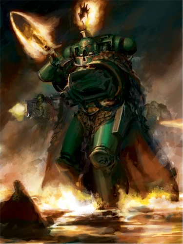
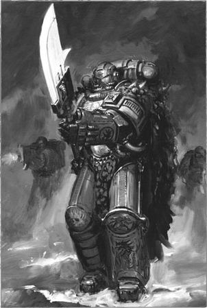
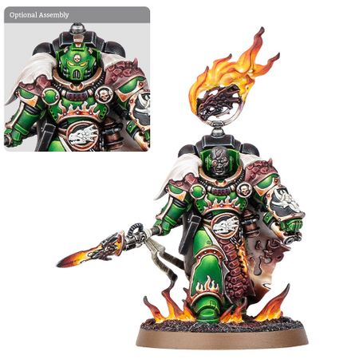

# 0709 伏尔甘·赫斯坦 Vulkan He'stan

精校状态：中文行文已逐段精校，部分术语仍为暂定

分类：人类帝国 / 火蜥蜴

原文来源：https://www.bilibili.com/opus/1118407345010900999

原作者：帝国神选罐头

原文时间：2025年09月30日 21:11

[返回分类目录](目录.md) · [全书目录](../../目录.md)

<!-- A0709-B0001 -->
**英文原文**

Vulkan He'stan is the current Forgefather of the Salamanders Chapter.

<!-- /A0709-B0001 -->

<!-- A0709-B0002 -->

原译文

伏尔甘·赫斯坦是火蜥蜴战团的现任铸造之父。

**校订译文**

伏尔甘·赫斯坦是火蜥蜴战团的现任铸造之父。

<!-- /A0709-B0002 -->

<!-- A0709-B0003 图片 -->

<!-- A0709-B0004 -->

原译文

Vulkan He'stan 伏尔甘·赫斯坦

**校订译文**

Vulkan He'stan 伏尔甘·赫斯坦

<!-- /A0709-B0004 -->

<!-- A0709-B0005 -->
### History 历史

<!-- /A0709-B0005 -->

<!-- A0709-B0006 -->
**英文原文**

Since his earliest days as a Scout, He’stan had been a much-noted warrior. He alone of his recruiting class captured a unique beast. For his mantle he slew a mottled tri-horn, amongst the most vicious and cunning of their reptilian breed. Even teams of veteran drake-hunters might struggle to accomplish such a deed. He'stan's skills as a smith – working his hammer upon the anvil – were such that the master artificers stopped over his works and admired them.

<!-- /A0709-B0006 -->

<!-- A0709-B0007 -->

原译文

从他当侦察兵的最初几天起，他就是一位著名的战士。在他的招募班上，只有他捕获了一只独特的野兽。为了他的斗篷，他杀死了一只斑纹三角兽，这是它们爬行动物中最凶猛、最狡猾的品种之一。即使是经验丰富的猎龙者也可能很难完成这样的任务。他作为一名铁匠的技能 — 用锤子敲打铁砧 — 那些大师工匠们驻足欣赏他的作品。

**校订译文**

早在担任侦察兵时，赫斯坦就已是备受瞩目的战士。在同批新兵中，只有他捕获了一头罕见的野兽。他为制作披风，猎杀了一头斑纹三角兽——这类爬行动物中最凶猛、最狡猾的品种之一。即使经验丰富的猎龙者组队出猎，也未必能完成这样的壮举。他在锻造方面同样技艺出众，铁锤与铁砧间诞生的作品，连铸造大师都会驻足赞叹。

<!-- /A0709-B0007 -->

<!-- A0709-B0008 -->
**英文原文**

He'stan was originally the Captain of the 4th company and served in that role for a century. The Chapter Council then called him to set aside his duties as captain and become the Forgefather. As he let go of his old duties, he also received a new name; Vulkan He'stan. As a result, he lost his original name.

<!-- /A0709-B0008 -->

<!-- A0709-B0009 -->

原译文

赫斯坦最初是第四连队的连长，并担任了一个世纪。然后，战团议会要求他放下连长的职责，成为铸造之父。当他放下旧职时，他也得到了一个新名字；伏尔甘·赫斯坦。作为结果，他失去了原来的名字。

**校订译文**

赫斯坦原是第四连连长，在任一个世纪。后来，战团议会召他卸下连长职责，接任铸造之父。告别旧职的同时，他也舍弃旧名，承继了“伏尔甘·赫斯坦”这个新名字。

**校注：** 所给原文称接任后获得新名、舍弃旧名；原体 Vulkan 沃坎与历任铸造之父所承 Vulkan 伏尔甘按本书决定区分。

<!-- /A0709-B0009 -->

<!-- A0709-B0010 -->
### Forgefather 铸造之父

<!-- /A0709-B0010 -->

<!-- A0709-B0011 -->
**英文原文**

As Forgefather, He'stan has worked his way from system to system in search of the nine artefacts of Vulkan, his only clues coming from the Tome of Fire, which is extremely difficult to interpret, let alone put into use. Instead of calling solely on members of the fourth company, He'stan can call on any number of Salamanders to aid him in his quest. The Salamanders are more than happy to cleanse an area of a world on a rumour that a piece of their history is there.

<!-- /A0709-B0011 -->

<!-- A0709-B0012 -->

原译文

作为铸造之父，赫斯坦从一个星系到另一个星系，一直在寻找沃坎的九件造物，他唯一的线索来自《火焰大典》，这极难解释，更不用说投入使用了。作为呼唤第四连队的成员的替代，赫斯坦可以呼唤任何数量的火蜥蜴来帮助他完成任务。火蜥蜴非常乐意清理世界上的一个地区，因为有传言说他们的一段历史就在那里。

**校订译文**

作为铸造之父，赫斯坦辗转于各个恒星系，寻找九件沃坎造物。他唯一的线索来自《火焰大典》，但这部典籍本就极难解读，要据此行动更是难上加难。他不再只能征调第四连，而是可以调遣任意数量的火蜥蜴战士协助寻访。只要听说某个地方可能埋藏着战团历史的一部分，火蜥蜴就很乐意出兵将其肃清。

<!-- /A0709-B0012 -->

<!-- A0709-B0013 图片 -->

<!-- A0709-B0014 -->

原译文

Vulkan He'stan with the Spear of Vulkan 伏尔甘·赫斯坦与沃坎之矛

**校订译文**

Vulkan He'stan with the Spear of Vulkan 伏尔甘·赫斯坦与沃坎之矛

<!-- /A0709-B0014 -->

<!-- A0709-B0015 -->
**英文原文**

He'stan accompanied Herculon Praetor and the Firedrakes when they went in pursuit and rescue of Chaplain Elysius, to retrieve Vulkan's Sigil. During this time they battled the Dark Eldar and had to infiltrate the webway and a Dark Eldar city, where it was revealed that the Forgefather knew the language of the enemy.

<!-- /A0709-B0015 -->

<!-- A0709-B0016 -->

原译文

当赫库隆总督和火龙追赶和营救伊莱修斯牧师时，赫斯坦陪同他们取回了沃坎之印。在此期间，他们与黑暗灵族作战，不得不渗透到网道和一个黑暗灵族城市，在那里，铸造之父知道敌人的语言。

**校订译文**

赫库隆·普雷托与火龙战士为营救伊莱修斯教士、寻回沃坎之印而展开追击时，赫斯坦也与他们同行。他们在此期间与黑暗灵族交战，潜入网道和一座黑暗灵族城市。众人也在这时得知，铸造之父竟通晓敌人的语言。

**校注：** Herculon Praetor 暂按完整人名译赫库隆·普雷托，原译“赫库隆总督”疑将名字后半当作官职，待核小说原文；Chaplain 采用官译教士。

<!-- /A0709-B0016 -->

<!-- A0709-B0017 -->
**英文原文**

The Necron warlord Trazyn the Infinite has attempted to obtain the Artifacts of Vulkan for himself, but He'stan defeated Trazyn in personal combat in 878.M41 and again in the Tochran Crusade in 943.M41.

<!-- /A0709-B0017 -->

<!-- A0709-B0018 -->

原译文

死灵战争领主无限者塔拉辛试图为自己获得沃坎的造物，但赫斯坦在878.M41的决斗中击败了塔拉辛，并在943.M41的托克兰远征中再次击败了他。

**校订译文**

太空死灵军阀无尽者塔拉辛曾试图将沃坎造物据为己有，但赫斯坦在 M41.878 的单挑中击败了他，又在 M41.943 的托克兰远征中再度挫败了他。

**校注：** Trazyn the Infinite 按 GW-09／GW-10 第28页官译无尽者塔拉辛。

<!-- /A0709-B0018 -->

<!-- A0709-B0019 -->
**英文原文**

In the wake of the Great Rift's creation, many believe He'stan's quest is now impossible to complete. The Forgefather, however, thinks this a test by Vulkan to fully temper his sons, before the Primarch rejoins the Salamanders.

<!-- /A0709-B0019 -->

<!-- A0709-B0020 -->

原译文

随着大裂隙的形成，许多人认为赫斯坦的探索现在不可能完成。然而，铸造之父认为这是沃坎在原体重新加入火蜥蜴之前，对子嗣进行的一次全面考验。

**校订译文**

大裂隙形成后，许多人认为赫斯坦的寻访已不可能完成。铸造之父却认为，这是沃坎在回归火蜥蜴之前，为充分磨炼子嗣而设下的考验。

<!-- /A0709-B0020 -->

<!-- A0709-B0021 -->
**英文原文**

He and a party of Salamanders later journeyed to the world of Zero alongside the Hammers of Nocturne and Covenant of Fire, as He'stan believed it contained a clue to the location of the Unbound Flame. Once there, however, he was confronted by the Alpha Legion, who had infiltrated the Covenant of Fire and swayed much of the world to their cause. Whilst Vulkan and his Salamanders eventually prevailed and forced the Alpha Legion to retreat, they could find no source of the Unbound Flame. Afterwards, he has pushed even deeper into the Imperium Nihilus in search of the missing artefacts.

<!-- /A0709-B0021 -->

<!-- A0709-B0022 -->

原译文

他和一群火蜥蜴后来与夜曲之锤和火之圣约一起前往零世界，因为他认为这包含了一条关于无拘之火位置的线索。然而，一到了那里，他就遇到了阿尔法军团，他们已经渗透到火之圣约中，并动摇了世界上大部分人的思想。虽然伏尔甘和他的火蜥蜴最终获胜并迫使阿尔法军团撤退，但他们找不到无拘之火的来源。之后，他进一步深入帝国暗面，寻找失踪的造物。

**校订译文**

后来，赫斯坦率一队火蜥蜴，与夜曲星之锤、火焰圣约一同前往零世界。他相信那里藏有无拘之火所在地的线索，却遭遇了阿尔法军团：敌人已渗透火焰圣约，并使该世界的大部分人倒向自己一方。赫斯坦与火蜥蜴最终取胜，迫使阿尔法军团撤退，却未能找到无拘之火的踪迹。此后，他继续深入帝国暗面，寻找失落的造物。

**校注：** 本段 Vulkan 指赫斯坦，非原体；改用赫斯坦以免误读。Hammers of Nocturne、Covenant of Fire 沿已定夜曲星之锤、火焰圣约。

<!-- /A0709-B0022 -->

<!-- A0709-B0023 -->
### Wargear 战斗装备

原题：Wargear 战备

<!-- /A0709-B0023 -->

<!-- A0709-B0024 -->
**英文原文**

He'stan carries three of the nine relics left behind by his namesake and Primarch:

<!-- /A0709-B0024 -->

<!-- A0709-B0025 -->

原译文

他带着与他同名的原体留下的九件圣物中的三件：

**校订译文**

赫斯坦承继了原体之名，也携带着原体留下的九件圣物中的三件：

<!-- /A0709-B0025 -->

<!-- A0709-B0026 图片 -->

<!-- A0709-B0027 -->

原译文

Vulkan He'stan 伏尔甘·赫斯坦

**校订译文**

Vulkan He'stan 伏尔甘·赫斯坦

<!-- /A0709-B0027 -->

<!-- A0709-B0028 -->
**英文原文**

The Spear of Vulkan, which can burn ceramite. He'stan often throws the Spear, enabling the strength of the weapon to be used at range.

<!-- /A0709-B0028 -->

<!-- A0709-B0029 -->

原译文

沃坎之矛，能燃烧陶钢。他经常投掷长矛，使武器的力量能够在范围内使用。

**校订译文**

沃坎之矛，能够烧穿陶钢。赫斯坦常将其投掷出去，让这件武器在远距离也能发挥威力。

**校注：** at range 指远距离使用，原译“在范围内”失义。

<!-- /A0709-B0029 -->

<!-- A0709-B0030 -->
**英文原文**

Kesare's Mantle, a legendary drakescale cloak, granting He'stan extra protection due to its strength.

<!-- /A0709-B0030 -->

<!-- A0709-B0031 -->

原译文

科萨雷披风，一件传说中的龙皮披风，因其力量而给予赫斯坦额外的保护。

**校订译文**

科萨雷披风，一件传奇的龙鳞披风，以其坚韧质地为赫斯坦提供额外防护。

<!-- /A0709-B0031 -->

<!-- A0709-B0032 -->
**英文原文**

The Gauntlet of the Forge, an armoured gauntlet that is also a heavy flamer.

<!-- /A0709-B0032 -->

<!-- A0709-B0033 -->

原译文

铸炉臂铠，一件盔甲臂铠，也是一件重型火焰枪。

**校订译文**

铸炉臂铠，一件集成了重型火焰喷射器的装甲护手。

**校注：** 与708 Gauntlet of the Forge 同物，统一较早452及本篇现称铸炉臂铠。官网英文也说明其集成重型火焰喷射器，但未取得对应中文官译。

<!-- /A0709-B0033 -->

本篇核心术语与暂定项

以下列出本篇出现的英文原形及核心术语表用词。同形词可能指不同对象，具体词义以本篇正文和校注为准；单复数、别名和仅见于图注的名称可能尚未列入。完整候选见[术语表](../../术语表/双语术语候选.csv)。

| 英文 | 采用中文 | 状态 |
| --- | --- | --- |
| Eldar | 灵族 | 暂定·语境区分 |
| Dark Eldar | 黑暗灵族 | 暂定·旧称对应 |
| Great Rift | 大裂隙 | 官方已核对 |
| Imperium | 帝国 | 暂定·简称 |
| Webway | 网道 | 暂定 |
| Trazyn the Infinite | 无尽者塔拉辛 | 官方已核对 |
| History | 历史 | 编辑用语已统一 |
| Primarch | 原体 | 官方已核对 |
| Imperium Nihilus | 帝国暗面 | 暂定·官方待核 |
| Vulkan | 沃坎 | 暂定·官方待核 |
| Salamanders | 火蜥蜴 | 暂定·官方待核 |
| Deeper | 深人 | 暂定·官方待核 |
| Nocturne | 夜曲星 | 暂定·官方待核 |
| Master | 导师（审判庭职衔）／舰务官（舰员职务） | 语境定译·官方待核 |
| Chaplain | 教士 | 官方已核对 |
| Alpha Legion | 阿尔法军团 | 暂定·官方待核 |
| Praetor | 执政官 | 暂定·官方待核 |
| Chapter | 战团 | 暂定·官方待核 |
| Captain | 连长 | 暂定·官方待核 |
| Veteran | 老兵 | 暂定·官方待核 |
| Scout | 侦察兵 | 暂定·官方待核 |
| Vulkan He'stan | 伏尔甘·赫斯坦 | 暂定·官方待核 |
| Covenant of Fire | 火焰圣约 | 暂定·官方待核 |
| Hammers of Nocturne | 夜曲星之锤 | 暂定·官方待核 |
| Forgefather | 铸造之父 | 暂定·官方待核 |
| Firedrakes | 火龙 | 暂定·官方待核 |
| Artefacts of Vulkan | 沃坎造物 | 暂定·官方待核 |
| Elysius | 伊莱修斯 | 暂定·官方待核 |
| The Weapon | 武器 | 暂定·官方待核 |
| The Anvil | 铁砧星堡 | 暂定·官方待核 |
| Unbound Flame | 无拘之火 | 暂定·官方待核 |
| Tome of Fire | 火焰大典 | 暂定·官方待核 |
| Gauntlet of the Forge | 铸炉臂铠 | 暂定·官方待核 |
| The Dark | 《黑暗》 | 暂定·官方待核 |
| Herculon Praetor | 赫库隆·普雷托 | 暂定·官方待核 |
| Tochran Crusade | 托克兰远征 | 暂定·官方待核 |
| Zero | 零世界 | 暂定·官方待核 |
| Spear of Vulkan | 沃坎之矛 | 暂定·官方待核 |
| System | 星系（恒星系统） | 暂定·官方待核 |
| Flamer | 火焰喷射器（武器）／火妖（奸奇单位） | 语境定译·对应官译已核 |
| Heavy flamer | 重型火焰喷射器 | 官方已核对 |

