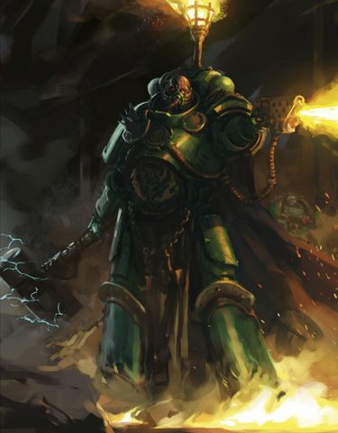
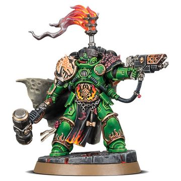

# 0710 阿德拉克斯·阿伽顿 Adrax Agatone

精校状态：中文行文已逐段精校，部分术语仍为暂定

分类：人类帝国 / 火蜥蜴

原文来源：https://www.bilibili.com/opus/1118590413696925713

原作者：帝国神选罐头

原文时间：2025年10月01日 09:02

[返回分类目录](目录.md) · [全书目录](../../目录.md)

原篇名：阿德拉克斯·阿加顿 Adrax Agatone

<!-- A0710-B0001 -->
**英文原文**

Adrax Agatone is the current Captain of the Salamanders Chapter's Third Company.

<!-- /A0710-B0001 -->

<!-- A0710-B0002 -->

原译文

阿德拉克斯·阿加顿是火蜥蜴战团第三连队的现任连长。

**校订译文**

阿德拉克斯·阿伽顿是火蜥蜴战团第三连的现任连长。

**校注：** Adrax Agatone 采用 GW-09 第32页／GW-10 第31页已核官译阿德拉克斯·阿伽顿；原译阿德拉克斯·阿加顿保留于对照稿。

<!-- /A0710-B0002 -->

<!-- A0710-B0003 图片 -->

<!-- A0710-B0004 -->

原译文

Adrax Agatone 阿德拉克斯·阿加顿

**校订译文**

Adrax Agatone 阿德拉克斯·阿伽顿

<!-- /A0710-B0004 -->

<!-- A0710-B0005 -->
## Overview 概述

<!-- /A0710-B0005 -->

<!-- A0710-B0006 -->
**英文原文**

Said to be the most similar to Vulkan of any other Salamanders in centuries, Agatone is both a superb warrior and craftsman. In sheer merciless pragmatism, however, he could not be further from the Primarch. Agatone lives by the creed of the greater good, even if cruelty is required in achieving it. With unshakable moral certitude, Agatone is disgusted by honest ideals twisted to violent and heretical purposes. Thus, he has sworn that no matter how dark the deeds of the 3rd Company must be, he will never suffer his warriors to become the tools of tyrants and oppressors.

<!-- /A0710-B0006 -->

<!-- A0710-B0007 -->

原译文

据说阿加顿是几个世纪以来与其他火蜥蜴相比与沃坎最相似的，他既是一位出色的战士，也是一位技艺精湛的工匠。然而，在纯粹无情的实用主义中，他离原体已经不远了。阿加顿以更大的善为信条，即使实现它需要残忍。阿加顿有着不可动摇的道德坚定，他厌恶被扭曲成暴力和异端目的的诚实理想。因此，他发誓，无论第三连队的行为多么黑暗，他都不会让他的战士成为暴君和压迫者的工具。

**校订译文**

据说，阿伽顿是数百年来最像沃坎的火蜥蜴战士，既善战，也精于工艺。然而，论及冷酷务实，他与原体可谓截然不同。他信奉更大的善，即使为此必须采取残酷手段也在所不惜。他对自身的道德准则深信不疑，痛恨正直的理想被歪曲，用来为暴行与异端服务。因此，他立誓：无论第三连不得不做出多么黑暗的行径，也绝不容许自己的战士沦为暴君与压迫者的工具。

**校注：** could not be further from 指差别极大，原译“已经不远”颠倒意思。the greater good 在本段为一般道德理念，不指钛族至善道。

<!-- /A0710-B0007 -->

<!-- A0710-B0008 -->
**英文原文**

Since assuming his Captaincy, Agatone has led the Company into some of the most horrific battles witnessed by the Salamanders in millennia. In battle he is a focused force of pure destruction, wielding the mighty Thunder Hammer Malleus Noctum and the Hand Flamer Drakkis, both weapons he himself created.

<!-- /A0710-B0008 -->

<!-- A0710-B0009 -->

原译文

自从担任连长以来，阿加顿带领连队进行了数千年来火蜥蜴目睹的最可怕的战斗。在战斗中，他是一支专注的纯粹毁灭力量，挥舞着强大的雷霆锤夜曲之锤和喷火手枪德拉基斯，这两种武器都是他自己创造的。

**校订译文**

出任连长以来，阿伽顿率领第三连参与了火蜥蜴数千年来最惨烈的一些战斗。战场上，他化作意志专一的毁灭力量，挥舞强大的雷霆锤夜曲之锤，使用火焰手枪德拉基斯。这两件武器都出自他本人之手。

<!-- /A0710-B0009 -->

<!-- A0710-B0010 图片 -->

<!-- A0710-B0011 -->

原译文

Adrax Agatone 阿德拉克斯·阿加顿

**校订译文**

Adrax Agatone 阿德拉克斯·阿伽顿

<!-- /A0710-B0011 -->

本篇核心术语与暂定项

以下列出本篇出现的英文原形及核心术语表用词。同形词可能指不同对象，具体词义以本篇正文和校注为准；单复数、别名和仅见于图注的名称可能尚未列入。完整候选见[术语表](../../术语表/双语术语候选.csv)。

| 英文 | 采用中文 | 状态 |
| --- | --- | --- |
| Primarch | 原体 | 官方已核对 |
| Vulkan | 沃坎 | 暂定·官方待核 |
| Salamanders | 火蜥蜴 | 暂定·官方待核 |
| Chapter | 战团 | 暂定·官方待核 |
| Captain | 连长 | 暂定·官方待核 |
| Adrax Agatone | 阿德拉克斯·阿伽顿 | 官方已核 |
| Greater Good | 上上善道 | 官方已核对 |
| Merciless | 无情号 | 暂定·官方待核 |
| Malleus Noctum | 夜曲之锤 | 暂定·官方待核 |
| Drakkis | 德拉基斯 | 暂定·官方待核 |
| Thunder Hammer | 雷霆锤 | 暂定·官方待核 |
| Flamer | 火焰喷射器（武器）／火妖（奸奇单位） | 语境定译·对应官译已核 |
| Hand Flamer | 火焰手枪 | 暂定·官方待核 |

