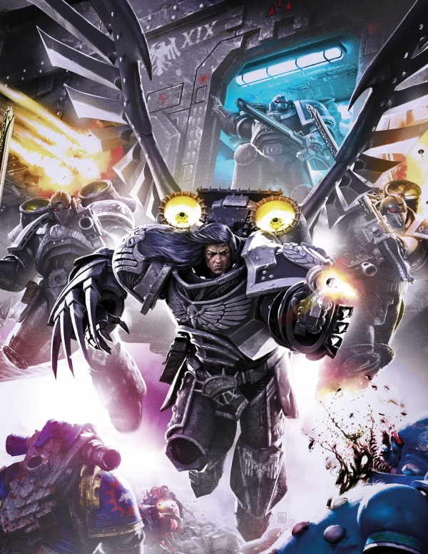
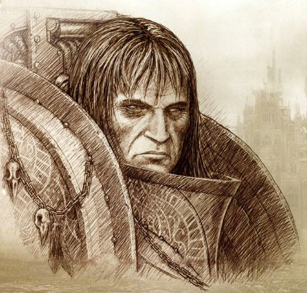
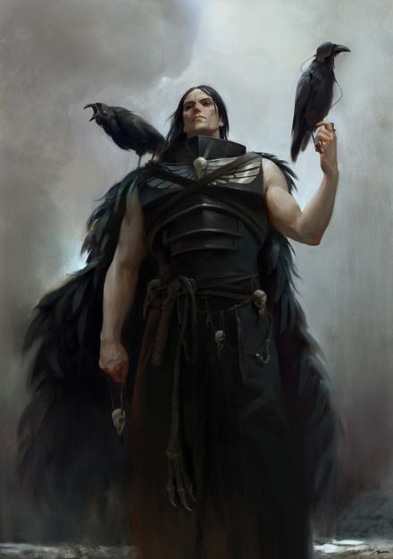
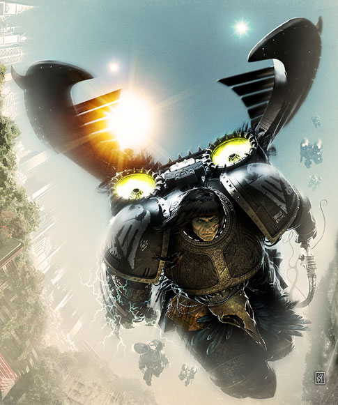
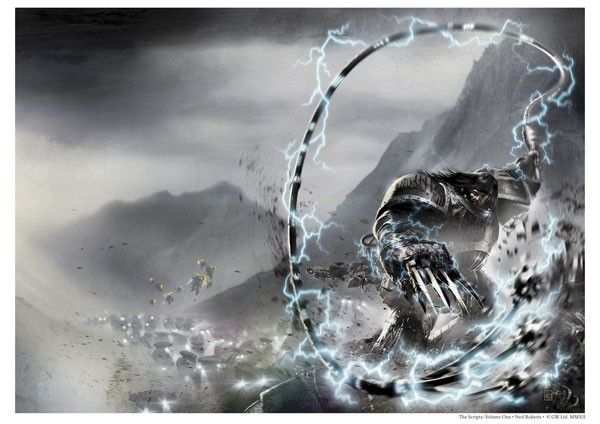
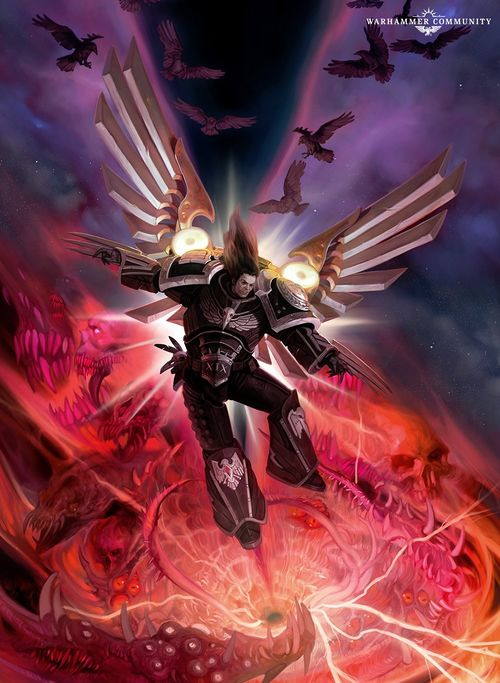
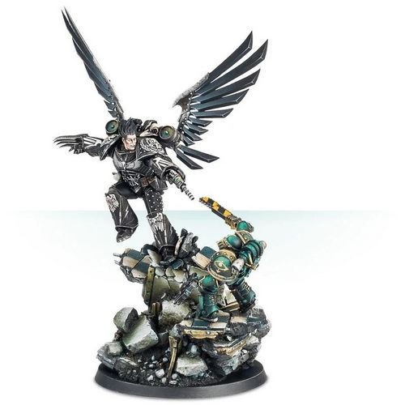

# 0712 科沃斯·科拉克斯 Corvus Corax

精校状态：中文行文已逐段精校，部分术语仍为暂定

分类：人类帝国 / 暗鸦守卫

原文来源：https://www.bilibili.com/opus/1058591850900750354

原作者：帝国神选罐头

原文时间：编辑于 2025年05月22日 17:19

[返回分类目录](目录.md) · [全书目录](../../目录.md)

<!-- A0712-B0001 -->
**英文原文**

"‘Let me tell you of my lord. Corax is the enemy of the oppressor. He is a friend of the people. He was raised among them, taught by them"- Soukhounou

<!-- /A0712-B0001 -->

<!-- A0712-B0002 -->

原译文

“让我告诉你我之主人。科拉克斯是压迫者之敌，是人民之友。他在人民中长大，由他们教导。”— 苏卡胡努

**校订译文**

“让我向你讲述我的主人。科拉克斯是压迫者之敌，是人民之友。他在人民中长大，也由人民教导成人。”——索胡努

<!-- /A0712-B0002 -->

<!-- A0712-B0003 -->
**英文原文**

Corvus Corax is the Primarch of the Raven Guard Space Marine Legion. Growing up to become a revolutionary for the workers of Lycaeus, Corax became a master of guerrilla warfare and hit-and-run tactics. He remained true to the Emperor during the Horus Heresy, and as such his Legion took some of the heaviest losses of the war during the Drop Site Massacre.

<!-- /A0712-B0003 -->

<!-- A0712-B0004 -->

原译文

科沃斯·科拉克斯是暗鸦守卫星际战士军团的原体。科拉克斯成长为利凯厄斯工人的革命者，成为游击战和跑打战术的大师。在荷鲁斯叛乱期间，他仍然忠于帝皇，因此他的军团在登陆点大屠杀期间承受了战争中最惨重的损失。

**校订译文**

科沃斯·科拉克斯是暗鸦守卫星际战士军团的原体。他在利凯厄斯长大，成为领导工人反抗的革命者，并精通游击战与打了就走的战术。荷鲁斯之乱中，他始终忠于帝皇；他的军团也因此在登陆场大屠杀中遭受了整场战争中最惨重的损失之一。

<!-- /A0712-B0004 -->

<!-- A0712-B0005 图片 -->

<!-- A0712-B0006 -->

原译文

Corvus Corax, Primarch of the Raven Guard 科沃斯·科拉克斯，暗鸦守卫原体

**校订译文**

Corvus Corax, Primarch of the Raven Guard 科沃斯·科拉克斯，暗鸦守卫原体

<!-- /A0712-B0006 -->

<!-- A0712-B0007 -->
## Biography 传记

<!-- /A0712-B0007 -->

<!-- A0712-B0008 -->
### Youth 早年

<!-- /A0712-B0008 -->

<!-- A0712-B0009 -->
**英文原文**

Corvus Corax was separated from the Emperor while still an infant by the four Chaos gods. He was discovered on Lycaeus, the desolate moon of the planet Kiavahr. At this time the planet was a technologically advanced Forge World, providing its city-size factories with minerals extracted from the non-atmospheric moon by legions of mine-slaves.

<!-- /A0712-B0009 -->

<!-- A0712-B0010 -->

原译文

科沃斯·科拉克斯在婴儿时期就被四位混沌之神与帝皇分开了。他是在基亚瓦尔星球的荒凉卫星利凯厄斯上被发现的。当时，这个星球是一个技术先进的铸造世界，为其城市规模的工厂提供由大批矿工从无大气层卫星上提取的矿物。

**校订译文**

科沃斯·科拉克斯尚在襁褓中时，便被混沌四神从帝皇身边掳走。人们在基亚瓦尔那颗荒凉的卫星利凯厄斯上发现了他。基亚瓦尔当时是技术发达的铸造世界，无数奴隶矿工在没有大气的卫星上开采矿物，供给行星上规模堪比城市的工厂。

<!-- /A0712-B0010 -->

<!-- A0712-B0011 图片 -->

<!-- A0712-B0012 -->

原译文

Corvus Corax 科沃斯·科拉克斯

**校订译文**

Corvus Corax 科沃斯·科拉克斯

<!-- /A0712-B0012 -->

<!-- A0712-B0013 -->
**英文原文**

Under the iron watch of heavily armed guards, the inhabitants of Lycaeus; criminals, political opponents and workers who had failed to meet their quotas, had long provided the rulers of Kiavahr a free and unlimited source of manpower. After the slave-girl Nasturi Ephrenia discovered the white skinned child who became Corax, "The Deliverer" in their tongue, they kept him from their masters, training him in the various skills they believe a leader and warrior needed: urban warfare, close combat and demolitions as well as political and philosophical matters. Ultimately, his abnormally fast maturation comforted the slaves and they became fixed in their belief that he was the savior they waited for.

<!-- /A0712-B0013 -->

<!-- A0712-B0014 -->

原译文

利凯厄斯的居民在全副武装的守卫的铁腕下；长期以来，罪犯、政治对手和未能达到配额的工人一直为基亚瓦尔的统治者提供自由和无限的人力资源。在女奴娜斯图里·艾芙蕾尼娅发现这个白皮肤的孩子后，他成了他们口中的“救世主”科拉克斯，他们让他远离他们的主人，训练他掌握他们认为领导者和战士所需的各种技能：城市战、近战和摧毁，以及政治和哲学问题。最终，他异常快速的成长安抚了奴隶们，他们坚定地相信他是他们等待的救世主。

**校订译文**

在全副武装的守卫严密看管下，利凯厄斯的居民——罪犯、政治异见者，以及未完成生产配额的工人——长久以来都是基亚瓦尔统治者取之不尽的无偿劳力。女奴娜斯图里·艾芙蕾尼娅发现了那个皮肤苍白的孩子后，奴隶们将他藏起来，瞒过主人。他们称他为科拉克斯，在当地语言中意为“解放者”，并教给他自己认为领袖与战士所需的一切：城市战、近身格斗、爆破，以及政治和哲学。他异乎寻常的成长速度使奴隶们倍感安慰，也让他们愈发坚信，他就是众人等待已久的救星。

**校注：** free 在劳力语境中是无偿，原译自由反向；demolitions 为爆破技能。The Deliverer 暂译解放者，避免与普通 savior 救星混为一个称号。

<!-- /A0712-B0014 -->

<!-- A0712-B0015 -->
**英文原文**

Educated to be a leader as well as a rebel, he rapidly began his task by organizing the workers into fight teams, promoting the best of the men as squad leaders. He began building huge stockpiles of weapons, concealing them in numerous secret caches. He ordered a campaign of psychological warfare, launching riots and strikes to build up followers in the worker's rebellion and to stretch the garrison strength and morale to breaking point. Waiting for the opportune time to strike, Corax's forces launched their attack, taking key security points and destroying them by crude force or sabotage, killing every man of the Lycaeus defense forces.

<!-- /A0712-B0015 -->

<!-- A0712-B0016 -->

原译文

他受过领导者和反抗者的教育，很快就开始了他的任务，将工人组织成战斗队，提拔最优秀的人担任队长。他开始建立庞大的武器库存，将它们藏在许多秘密藏匿处。他下令进行一场心理战，发动骚乱和罢工，在工人起义中吸收追随者，并将驻军的力量和士气拉到崩溃的地步。等待合适的时机发动攻击，科拉克斯的部队发动了攻击，占领了关键的安全节点，并通过粗暴的武力或破坏将其摧毁，杀死了利凯厄斯防御部队的每一个人。

**校订译文**

科拉克斯既被培养成领袖，也被培养成反抗者，很快便开始行动。他将工人编成战斗小队，提拔最出色的人担任队长，又储备大量武器，分藏于众多秘密据点。他发动心理战，组织骚乱与罢工，为工人起义争取更多追随者，同时将驻军的兵力与士气逼向崩溃边缘。时机成熟后，他的部队夺取关键防御据点，以强攻或破坏将其摧毁，杀死了利凯厄斯守军的每一个人。

<!-- /A0712-B0016 -->

<!-- A0712-B0017 -->
**英文原文**

When Kiavahr's rulers struck back, Corax was ready for them. He outmanoeuvred and ambushed their forces on Lycaeus with his battle hardened warriors, crushing their supply lines and striking the five biggest cities in Kiavahr with one atomic mining charge each. The charges were embarked on small transport shuttles and reached the surface via a supply gravity well. Soon, their forces nearly destroyed, their vast factories unable to produce anything due to the minerals shortages, the Tech-Guilds collapsed in civil war. While thousands had died in the nuclear bombardment of Kiavahr, millions of its people had been freed. Celebrating their victory, the inhabitants of Lycaeus renamed their home "Deliverance".

<!-- /A0712-B0017 -->

<!-- A0712-B0018 -->

原译文

当基亚瓦尔的统治者反击时，科拉克斯已经做好了准备。他用久经沙场的战士在利凯厄斯伏击并击败了他们的部队，摧毁了他们的补给线，并分别用一枚原子弹轰炸了基亚瓦尔的五个最大城市。这些炸药被装上小型运输航天器，通过补给重力井到达地表。很快，他们的部队几乎被摧毁，由于矿产短缺，他们庞大的工厂无法生产任何东西，技术行会在内战中崩溃。虽然数千人在基亚瓦尔的核轰炸中丧生，但数百万人已经获得解放。为了庆祝他们的胜利，利凯厄斯的居民将他们的家重新命名为“拯救”。

**校订译文**

基亚瓦尔的统治者反击时，科拉克斯早已准备就绪。他率久经战阵的战士在利凯厄斯机动作战、伏击敌军，切断其补给线，并向基亚瓦尔最大的五座城市各投送了一枚采矿用核爆装药。装药藏在小型运输穿梭机上，经补给重力井抵达地表。不久，统治者的军队几近覆灭，庞大的工厂也因矿物短缺陷入停产，技术行会最终在内战中瓦解。核轰炸夺去了数千人的生命，却使数百万人获得自由。为庆祝胜利，利凯厄斯的居民将家园改名为“拯救星”。

**校注：** atomic mining charge 明确是采矿用核爆装药；供给装置 supply gravity well 按原文保留，不擅解其工作原理。

<!-- /A0712-B0018 -->

<!-- A0712-B0019 -->
**英文原文**

It is said that the Emperor appeared on Deliverance that day and, after a day and a night with his son, appointed him Primarch of the Raven Guard Legion. Nothing is said of their conversation but one condition of Corax's acceptance was the help of the Emperor in the task of bringing peace on Kiavahr. Soon the Adeptus Mechanicus stepped in and the world was rebuilt to the benefit of the Imperium while the black tower which once housed the guards of the moon became the Ravenspire, the fortress of the Legion.

<!-- /A0712-B0019 -->

<!-- A0712-B0020 -->

原译文

据说，那天帝皇出现在拯救星上，在与儿子相处了一天一夜后，任命他为暗鸦守卫原体。关于他们的谈话，什么也没说，但科拉克斯接受的一个条件是帝皇帮助基亚瓦尔实现和平。很快，机械教介入，世界得以重建，为帝国谋福利，而曾经为卫星守卫提供住所的黑塔则成为了军团的堡垒—渡鸦尖塔。

**校订译文**

据说，帝皇就在那天来到拯救星，与儿子相处了一昼夜，随后任命他为暗鸦守卫军团原体。两人的谈话内容无人知晓，但科拉克斯答应归顺的条件之一，是帝皇必须协助基亚瓦尔恢复和平。不久，机械修会介入，重建这颗行星，使其为帝国效力。那座曾驻扎卫星守卫的黑塔，则成为军团堡垒渡鸦尖塔。

<!-- /A0712-B0020 -->

<!-- A0712-B0021 -->
### Great Crusade 大远征

<!-- /A0712-B0021 -->

<!-- A0712-B0022 -->
**英文原文**

During the Great Crusade, Corax's talents for planning and sabotage were of great effect and the Raven Guard, fighting frequently under the orders of Horus, became renowned for an unmatched ability with covert ops, sabotage, infiltration and lightning strikes. But the pair never saw eye-to-eye, and after an argument, the two Primarchs nearly fought each other. Corax left Horus's command. Corax also began to display great ill-favor and mistrust towards Terran-born warriors within his Legion as opposed to those from Deliverance. This was due to Corax's disgust with the Terrans for their use of terror tactics, which reminded him of the Night Lords. Corax instead sought to transform the Legion into a force for liberation of the oppressed. While Corax bitterly opposed Horus violently sacrificing Terran-born recruits in the Battle of Gate 42, he nonetheless began to "purge" Terrans by sending them on forgotten Crusades to the galactic rim and unexplored space.

<!-- /A0712-B0022 -->

<!-- A0712-B0023 -->

原译文

在大远征期间，科拉克斯的计划和破坏才能产生了巨大的影响，暗鸦守卫经常在荷鲁斯的命令下作战，以其无与伦比的秘密行动、破坏、渗透和闪电打击能力而闻名。但两人从未意见一致，经过一番争论，两位原体差点决斗。科拉克斯离开了荷鲁斯的指挥。科拉克斯也开始对他军团中的泰拉裔战士表现出极大的敌意和不信任，而不是来自拯救星的战士。这是由于科拉克斯对泰拉裔使用恐怖战术的厌恶，这让他想起了午夜领主。相反，科拉克斯试图将军团转变为解放被压迫者的力量。尽管科拉克斯强烈反对荷鲁斯在42号门之战中强行牺牲泰拉裔新兵，但他还是开始“清洗”泰拉裔，将他们送往银河系边缘和未探索的太空进行被遗忘的远征。

**校订译文**

大远征期间，科拉克斯在谋划与破坏方面的才能发挥了巨大作用。暗鸦守卫经常在荷鲁斯麾下作战，以无与伦比的秘密行动、破坏、渗透与闪电突袭能力闻名。但两位原体始终意见不合，一次争执甚至险些演变成武斗，科拉克斯随后脱离了荷鲁斯的指挥。他也逐渐对军团中的泰拉裔战士表现出强烈厌恶与不信任，与他对待拯救星出身者的态度截然不同。泰拉裔的恐怖战术令他反感，使他想到午夜领主；他希望把军团塑造成解放受压迫者的力量。尽管他曾强烈反对荷鲁斯在四十二号门之战中强行牺牲泰拉裔新兵，却仍开始“清洗”泰拉裔，将他们派往银河边缘与未知太空，参与逐渐被人遗忘的远征。

<!-- /A0712-B0023 -->

<!-- A0712-B0024 图片 -->

<!-- A0712-B0025 -->

原译文

Young Corax 青年科拉克斯

**校订译文**

Young Corax 青年科拉克斯

<!-- /A0712-B0025 -->

<!-- A0712-B0026 -->
**英文原文**

During the Crusade Corax was frequently compared to Konrad Curze, Primarch of the Night Lords. The two were not only physically similar but also alike in their childhoods and even how they waged war. However unlike Curze, Corax retained a degree of humanity and did not engage in the mass slaughter that the Night Haunter was known for. Corax himself was disturbed by the comparisons to Curze, while the Night Lords Primarch himself came to hate the Ravenlord for the constant comparisons. During the Carinae Retribution tensions between the two came to a head, with Corax confronting Curze over his mass slaughter of civilians. The two nearly came to blows, but Corax was able to convince Sevatar to pressure Curze to withdraw.

<!-- /A0712-B0026 -->

<!-- A0712-B0027 -->

原译文

在大远征期间，科拉克斯经常被比作午夜领主的原体康拉德·科兹。两人不仅在身体上相似，而且在童年时期甚至在发动战争的方式上也相似。然而，与科兹不同，科拉克斯保留了一定程度的人性，并没有参与午夜幽魂所熟知的大规模屠杀。科拉克斯本人对与科兹的比较感到不安，而午夜领主原体本人则因为不断的比较而憎恨渡鸦领主。在船底座报复期间，两人之间的紧张关系达到了顶峰，科拉克斯因科兹大规模屠杀平民而与他对峙。两人险些发生冲突，但科拉克斯成功地说服塞维塔向科兹施压，要求其撤军。

**校订译文**

大远征中，人们常将科拉克斯与午夜领主原体康拉德·科兹相提并论。两人不仅外貌相似，童年经历乃至作战方式也有共同之处。然而，科拉克斯仍保有一定的人性，不会像午夜幽魂那样以大规模屠杀为常。这样的比较令科拉克斯不安，也让科兹因屡遭比较而逐渐憎恨这位渡鸦领主。船底座惩戒期间，两者的矛盾达到顶点：科拉克斯就屠杀平民一事当面质问科兹，双方险些动手。最终，他说服塞维塔向科兹施压，促其撤军。

<!-- /A0712-B0027 -->

<!-- A0712-B0028 -->
### Horus Heresy 荷鲁斯之乱

原题：Horus Heresy 荷鲁斯叛乱

<!-- /A0712-B0028 -->

<!-- A0712-B0029 -->
**英文原文**

The Raven Guard primarch only met Horus again on Isstvan V. During the Drop Site Massacre, Corax was among the Primarchs leading the loyalist effort against Horus' betrayal. In the battle he personally engaged Word Bearers Primarch Lorgar in combat, impaling him with his Lightning Claws. Just as he was about to finish Lorgar, Konrad Curze intervened and forced Corax to retreat.

<!-- /A0712-B0029 -->

<!-- A0712-B0030 -->

原译文

暗鸦守卫原体只在伊斯塔万五号再次见到了荷鲁斯。在登陆点大屠杀期间，科拉克斯是领导忠诚派对抗荷鲁斯叛乱的原体之一。在战斗中，他亲自与怀言者原体珞珈交战，用闪电爪刺穿了他。就在他即将终结珞珈时，康拉德·科兹介入并迫使科拉克斯撤退。

**校订译文**

直到伊斯塔万五号，科拉克斯才再次与荷鲁斯相逢。登陆场大屠杀中，他是率忠诚派对抗荷鲁斯之乱的原体之一。他亲自迎战怀言者原体珞珈，以闪电爪刺穿对方。就在他即将痛下杀手时，康拉德·科兹介入战斗，迫使他撤退。

<!-- /A0712-B0030 -->

<!-- A0712-B0031 图片 -->

<!-- A0712-B0032 -->

原译文

Corvus Corax 科沃斯·科拉克斯

**校订译文**

Corvus Corax 科沃斯·科拉克斯

<!-- /A0712-B0032 -->

<!-- A0712-B0033 -->
**英文原文**

Though grievously wounded and forced to fight a guerrilla war on Isstvan V for the next 98 days he escaped the slaughter with a handful of loyal Space Marines thanks to the arrival of a small Raven Guard navy led by Captain Branne Nev. Captain Branne had been left as reserve on Deliverance and he departed the moon only due to strange dreams haunting the nights of Praefector Marcus Valerius, the commander of Therion Cohort, a loyalist Imperial Army Regiment. Unbeknownst to both sides, the Alpha Legion had allowed Corax's escape to further the plans of Alpharius. On quitting the Isstvan System, Corax sent back to Deliverance all the remaining ships while he himself headed to Terra to seek the counsel of The Emperor. The Primarch was desperate as the Imperium was collapsing, his Emperor needed warriors that Corax could not provide. Moreover, Corax was not granted permission to see The Emperor due to his workings on the man-made corridor to the Eldar Webway.

<!-- /A0712-B0033 -->

<!-- A0712-B0034 -->

原译文

尽管受了重伤，并在接下来的98天里被迫在伊斯塔万五号上进行游击战，但由于布兰恩·涅夫连长率领的一支小型暗鸦守卫海军的到来，他与少数忠诚的星际战士一起逃离了这场屠杀。布兰恩连长在拯救星上被留作预备役，他之所以离开卫星，是因为忠诚的帝国陆军兵团圣兽大队的指挥官兵团长马库斯·瓦莱里乌斯在夜晚做了奇怪的梦。双方都不知道，阿尔法军团允许科拉克斯逃跑，以推进阿尔法瑞斯的计划。退出伊斯塔万星系后，科拉克斯将所有剩余的船只送回了拯救星，而他自己则前往泰拉寻求帝皇的建议。随着帝国的崩溃，原体绝望了，他的帝皇需要科拉克斯无法提供的战士。此外，由于科拉克斯在通往灵族网道的人造走廊上工作，他没有获准参见帝皇。

**校订译文**

科拉克斯身负重伤，随后被迫在伊斯塔万五号打了九十八天游击战。幸而布兰尼·涅夫连长率一支暗鸦守卫小舰队赶到，他才与少数忠诚的星际战士逃出屠杀。布兰尼原本留守拯救星，负责预备力量；促使他离开卫星的，是圣兽大队指挥官、兵团长马库斯·瓦莱里乌斯接连做的诡异梦境。圣兽大队隶属忠诚的帝国军，编制相当于一个团。救援双方都不知道，阿尔法军团有意放科拉克斯逃走，以推进阿尔法瑞斯的计划。离开伊斯塔万星系后，科拉克斯将其余舰船派回拯救星，自己前往泰拉寻求帝皇指点。帝国正在崩溃，帝皇亟需战士，而他却无兵可供，这令他深感绝望。他也未能获准觐见，因为帝皇正忙于通往灵族网道的人造通道工程。

**校注：** 末句 his workings 主语是帝皇，原译误将科拉克斯说成网道工程负责人。Imperial Army 为帝国军，regiment 表团级编制，非另一支阿斯塔特军团。

<!-- /A0712-B0034 -->

<!-- A0712-B0035 -->
**英文原文**

The Emperor, sensing his son's desperation, was somehow able to divert part of his psychic might in order to grant Corax what he was looking for. Through a psychic vision Corax asked for a rapid and effective solution to restore his legion's might. The Emperor, feeling the righteous intent behind his son's question, implanted in his brain some selected memories concerning the project for the creation of the Primarchs and the exact place where the ancient laboratory was to be found. However, stated The Emperor, the laboratory was well guarded by a complex system called "The Labyrinth" and it was up to Corax himself to find a way to pass through it. Corax was successful in this task and what he obtained was the common genome all primarchs shared. From this genome, through tough selection, The Emperor created each of the twenty granting each of them some particular and well defined traits (such as psychic powers or increased strength) along with a number of commonly shared feats (increased growing rate, regenerative powers, intellectual acumen and so on). Before Corax departed the Sol System with this new technology, he was asked by Malcador to take part in the Perditum Incursion on Traitor-occupied Mars. Corax agreed, though it later turned out to be an elaborate ambush planned by the Traitors under Lukas Chrom. However most of the loyalists were able to escape, Corax included.

<!-- /A0712-B0035 -->

<!-- A0712-B0036 -->

原译文

帝皇感觉到儿子的绝望，不知怎么地，他转移了部分灵能力量，以便给科拉克斯他想要的东西。通过灵能幻象，科拉克斯要求一个快速有效的解决方案来恢复他的军团的力量。帝皇感觉到儿子问题背后的正义意图，在他的大脑中植入了一些关于制造原体的项目和古代实验室的确切位置的精选记忆。然而，帝皇表示，实验室受到一个名为“迷宫”的复杂系统的严密保护，科拉克斯要自己找到穿过它的方法。科拉克斯在这项任务中取得了成功，他获得的是所有原体共享的共同基因组。从这个基因组中，通过艰难的选择，帝皇创造了二十个人中的每一个，赋予他们每个人一些特殊而明确的特征（如灵能能力或增强力量），以及一些共同的技艺（成长速度加快、再生能力、智识敏锐度等）。在科拉克斯带着这项新技术离开太阳系之前，马卡多邀请他参加对叛徒占领的火星的毁灭入侵。科拉克斯同意了，尽管后来证明这是卢卡斯·克罗姆手下的叛徒精心策划的伏击。然而，包括科拉克斯在内的大多数忠诚派都逃脱了。

**校订译文**

帝皇感知到儿子的绝望，设法分出部分灵能力量，回应他的请求。在灵能幻象中，科拉克斯恳求父亲赐予一种快速、有效的方法，让军团恢复力量。帝皇体察到他的正直用意，将一些关于原体创造计划的记忆，以及那座古老实验室的确切位置，植入他脑中。但帝皇也告诫他：实验室有一套名为“迷宫”的复杂防护系统，必须由他自己设法通过。科拉克斯完成了考验，取得所有原体共有的基础基因组。帝皇当年正是以此为基础，经过严格筛选，创造了二十位原体，赋予他们灵能或更强体魄等各自鲜明的特质，同时保留快速成长、再生能力与敏锐智力等共同特点。科拉克斯带着这项技术离开太阳系前，马卡多请他参加“迷失入侵”，袭击叛徒占领的火星。他答应了，却发现这是一场由卢卡斯·克罗姆麾下叛徒精心布置的伏击。所幸，包括科拉克斯在内的大多数忠诚派最终成功脱身。

**校注：** Perditum Incursion 沿181既定迷失入侵，非本篇毁灭入侵；基因组为原体的共同基础，并非二十位完全相同。

<!-- /A0712-B0036 -->

<!-- A0712-B0037 图片 -->

<!-- A0712-B0038 -->

原译文

Corax leads the remnants of his Legion on Isstvan V against the Iron Warriors 科拉克斯率领他的军团残余在伊斯塔万五号对抗钢铁勇士

**校订译文**

Corax leads the remnants of his Legion on Isstvan V against the Iron Warriors 科拉克斯率军团残部在伊斯塔万五号对抗钢铁勇士

<!-- /A0712-B0038 -->

<!-- A0712-B0039 -->
**英文原文**

Once back on Deliverance, Corax tasked his Chief Apothecary Vincente Sixx of retrieving the correct Raven Guard genome and start the direct implantation on fresh recruits. With the assistance of the loyalist Mechanicum Genetor Nexin Orlandriaz, Sixx actually accomplished the task and went so far as to approach complete removal of the progenoid glands. From the correct genome, in fact, the whole Space Marine would have grown directly, all his enhanced organs already present. The only exception would have been the Black Carapace due to its synthetic nature. The carapace permits the interface to the power armor and it is not a real organ itself. In this way, the progenoids would have been useless for future generations.

<!-- /A0712-B0039 -->

<!-- A0712-B0040 -->

原译文

回到拯救星后，科拉克斯委托他的首席药剂师文森特·西克斯检索正确的暗鸦守卫基因组，并开始直接植入新兵。在忠实的机械教基因士内克辛·奥兰德里亚兹的帮助下，西克斯实际上完成了这项任务，甚至接近完全切除基因腺体。事实上，从正确的基因组来看，整个星际战士都会直接成长，他所有的增强器官都已经存在。唯一的例外是黑色甲壳，因为它是合成的。甲壳允许与动力盔甲接合，它本身不是一个真正的器官。这样一来，基因腺体对后辈来说就毫无用处了。

**校订译文**

返回拯救星后，科拉克斯命首席药剂师文森特·西克斯从中找出暗鸦守卫所需的正确基因组，直接植入新兵体内。在忠诚派机械教基因士内克辛·奥兰德里亚兹的协助下，西克斯完成了任务，甚至接近彻底摆脱对基因存收腺的依赖。依靠正确的基因组，星际战士可以直接发育成形，所需的强化器官也会自行长成。唯一例外是黑色甲壳：它是合成植入物，用于连接动力护甲，本身并非真正的器官。若这一构想实现，后续世代便不再需要基因存收腺。

**校注：** 段落讨论未来可以不再依赖基因存收腺的培育方式，原译“完全切除”容易误读为给现有战士摘除器官。保留原文接近完成、假设实现的程度。

<!-- /A0712-B0040 -->

<!-- A0712-B0041 -->
**英文原文**

With this knowledge, around 500 new, war-ready space marines were created in few weeks. It is at this point that an infamous treachery took place. Some Astartes of the Alpha Legion, in a plan orchestrated by the primarch Alpharius Omegon themselves, infiltrated the Raven Guard after the Drop Site Massacre. To obtain this, Alpha Legion apothecaries grafted the facial traits of some dead Raven Guards over the face of their own legionaries. The objective was to hinder the Raven Guard using their obtained knowledge as "this would have displaced the balance against Horus' forces" said the Cabal emissaries. Of course, since free to act as best suited, Alpharius Omegon had in mind also to recover the secret knowledge in order to expand their legion too. With the help of renegade Mechanicum magos Unithrax and his forces on Kiavahr, the Alpha Legion tainted the original genome recovered from the laboratories of The Emperor on Terra. This was accomplished introducing a virus-vectored mutagen based on daemonic blood. Thus, the successive implantation's resulted in still operational but deeply-mutated Astartes exhibiting scales, horns, fangs, tails, overgrown muscles and similar features. However while the plan to corrupt the new Astartes were successful, the attempt by the Alpha Legion to Destroy the legion's gene-seed was not. After this outburst of mutations and the discovery of the Alpha Legion infiltrators, Corax decided to stop the rebuilding of the Raven Guard and led his warriors, along with all the war capable mutated marines, with small squads striking like lightning on the enemy weak spots.

<!-- /A0712-B0041 -->

<!-- A0712-B0042 -->

原译文

有了这些知识，几周内就制造了大约500名新的、随时准备作战的星际战士。就在这一时间点上，发生了臭名昭著的变节行为。阿尔法军团的一些阿斯塔特，在原体阿尔法瑞斯·欧米伽自己策划的一项计划中，在登陆点大屠杀后渗透到暗鸦守卫。为了获得这一点，阿尔法军团药剂师将一些死去的暗鸦守卫的面部特征移植到了他们自己的军团士兵的脸上。密会的使者说，其目的是阻止暗鸦守卫利用他们获得的知识，因为“这将取代对荷鲁斯部队的平衡”。当然，由于可以自由行动，阿尔法瑞斯·欧米伽也打算恢复秘密知识，以扩大他们的军团。在变节机械教贤者尤尼斯拉克斯和他在基亚瓦尔的部队的帮助下，阿尔法军团污染了从泰拉上的帝皇实验室中恢复的原始基因组。这是通过引入基于恶魔之血的病毒载体诱变剂实现的。因此，连续的植入导致阿斯塔特仍然可以运作，但发生了深度突变，表现出鳞片、角、尖牙、尾巴、过度生长的肌肉和类似的特征。然而，虽然腐化新阿斯塔特的计划取得了成功，但阿尔法军团摧毁军团基因种子的尝试却没有成功。在突变爆发和阿尔法军团渗透者被发现之后，科拉克斯决定停止重建暗鸦守卫，并带领他的战士以及所有有作战能力的突变战士，用小分队像闪电一样击中了敌人的弱点。

**校订译文**

依靠这些知识，约五百名具备作战能力的新星际战士在数周内诞生。但一场恶名昭彰的阴谋也在此时发作。登陆场大屠杀之后，一批阿尔法军团战士已按阿尔法瑞斯与欧米伽亲自策划的方案渗入暗鸦守卫。他们的药剂师将阵亡暗鸦守卫的面容移植到本军团战士脸上，帮助其冒充幸存者。密教使者声称，必须阻止暗鸦守卫利用所得知识，否则战争的力量对比将向不利于荷鲁斯的一方倾斜。而拥有行动自主权的双生原体另有打算：他们也想夺取这些秘密，用来扩充自己的军团。在变节机械教贤者尤尼斯拉克斯及其基亚瓦尔部队的帮助下，阿尔法军团污染了从帝皇泰拉实验室取回的原始基因组。他们注入一种以病毒为载体、由恶魔之血制成的诱变剂。此后接受植入的阿斯塔特虽然仍能作战，却出现严重突变，长出鳞片、角、獠牙、尾巴和异常膨大的肌肉等特征。阿尔法军团虽然成功污染了新战士的培育，却未能摧毁军团的基因种子。突变爆发、潜伏者暴露后，科拉克斯决定停止重建计划，率原有战士与仍具作战能力的突变者分成小队，闪电般袭击敌人弱点。

**校注：** would have displaced the balance against Horus 指使力量对比不利于荷鲁斯。Alpharius Omegon ... themselves 按双生原体语境明确为两人。

<!-- /A0712-B0042 -->

<!-- A0712-B0043 -->
**英文原文**

Following the Battle on Ravendelve, Corax still was committed to combating the forces of Horus. Compensating for his devastated legion's small numbers, he conducted raids, hit-and-run attacks, and instigated uprisings on traitor controlled worlds. These included actions on Constanix II, Scarato, and Carandiru.

<!-- /A0712-B0043 -->

<!-- A0712-B0044 -->

原译文

在鸦巢之战之后，科拉克斯仍然致力于对抗荷鲁斯的军队。为了弥补他被摧毁的军团人数少，他进行了突袭、跑打攻击，并在叛徒控制的世界上煽动起义。其中包括对康斯坦尼斯二号、斯卡拉托和卡兰迪鲁的行动。

**校订译文**

鸦巢之战后，科拉克斯仍坚持对抗荷鲁斯。他以突袭和打了就走的战术弥补军团遭重创后兵力不足的问题，并在叛徒控制的世界策动起义，先后在康斯坦尼克斯二号、斯卡拉托与卡兰迪鲁等地展开行动。

<!-- /A0712-B0044 -->

<!-- A0712-B0045 -->
**英文原文**

Eventually, Corax reassembled the entirety of his surviving Legion at the Dexius System. There he contemplated on the future of the Raven Guard, with many of his legion wishing to return to Terra to aid the Emperor against Horus' offensive. After evading a Night Lords attack, Corax was again influenced by the visions of Marcus Valerius who saw that the Space Wolves were on the verge of destruction. Corax led the Raven Guard in the Battle of Yarant to aid the Space Wolves against traitor forces. During the battle, Corax led a suicidal last stand alongside Bjorn, but after witnessing the arrogance and vanity of Horus' forces realized that it was not up to him to determine when he would die. He was a servant of the Emperor, and would continue to aid him against the traitors until he met his end. Thus Corax led an evacuation from Yarant and expressed his intent to continue resisting the traitorous Warmaster from the shadows.

<!-- /A0712-B0045 -->

<!-- A0712-B0046 -->

原译文

最终，科拉克斯在德克修斯星系重新组织了他幸存的整个军团。在那里，他考虑了暗鸦守卫的未来，他的许多军团成员都希望回到泰拉，帮助帝皇抵抗荷鲁斯的进攻。在躲避了午夜领主的攻击后，科拉克斯再次受到马库斯·瓦莱里乌斯的幻觉的影响，他看到太空野狼正处于毁灭的边缘。科拉克斯在雅兰特之战中指挥暗鸦守卫，帮助太空野狼对抗叛徒势力。在战斗中，科拉克斯与比约恩一起进行了自杀式的最后抵抗，但在目睹了荷鲁斯部队的傲慢和虚荣之后，他意识到自己何时死亡并不取决于他。他是帝皇之仆，会继续帮助他对抗叛徒，直到他死。因此，科拉克斯指挥从雅兰特撤离，并表示他打算继续在阴影中抵抗叛徒战帅。

**校订译文**

最终，科拉克斯在德克修斯星系集结了军团全部幸存者，思考暗鸦守卫的未来。许多战士希望返回泰拉，协助帝皇抵御荷鲁斯。避开午夜领主的袭击后，他再次受到马库斯·瓦莱里乌斯异象的影响：后者看见太空野狼正濒临覆灭。于是，科拉克斯率暗鸦守卫投入雅兰特之战，支援太空野狼抗击叛军。他曾与比约恩一同展开近乎自杀的死战，但在见识了荷鲁斯军队的傲慢与虚荣后，意识到自己无权自行选择赴死。他是帝皇的仆从，应当继续为父亲抗击叛徒，直到生命真正终结。因此，他率军撤出雅兰特，并表明自己将继续潜伏于阴影之中，对抗叛徒战帅。

<!-- /A0712-B0046 -->

<!-- A0712-B0047 -->
**英文原文**

Corax and Russ made for Deliverance, eventually meeting up with Lion El'Jonson at the Raven Guard's Fortress-Monastery. The Lion was quick to question the Raven Lord's absence from major fronts of the war, but his ire is put to rest by Russ, who points at the survival of his own legion as evidence of their worth. Russ declared he will join The Lion's Crusade of Vengeance, including warriors equipped with new Mark VI Power Armour produced on Kiavahr. Corax however was cautious to commit his bloodied Legion to what he saw as a needlessly spiteful waste, and only assigned a small expeditionary force of his Raven Guard to The Lion's forces. Even in this role, Corax's forces were used to eliminate key enemy targets ahead of the main Dark Angels fleet in order to spare entire worlds from annihilation. Raven Guard forces later took part in the Siege of Barbarus, assailing the homeworld of the Death Guard alongside the Dark Angels and Space Wolves.

<!-- /A0712-B0047 -->

<!-- A0712-B0048 -->

原译文

科拉克斯和鲁斯前往拯救星，最终在暗鸦守卫的堡垒修道院与莱昂·艾尔庄森会面。莱昂很快质疑渡鸦领主没有出现在战争的主要战线上，但鲁斯平息了他的愤怒，他指出自己军团的幸存是他们价值的证据。鲁斯宣布他将加入莱昂的复仇行动，其中包括配备基亚瓦尔生产的新型Mark VI动力盔甲的战士。然而，科拉克斯谨慎地将他染血的军团投入到他认为是不必要的恶意浪费中，只将他的暗鸦守卫的一小部分远征部队分配给了莱昂的部队。即使在这个角色中，科拉克斯的部队也被用来在主要的黑暗天使舰队之前消灭关键的敌方目标，以使整个世界免于毁灭。暗鸦守卫部队后来参加了巴巴鲁斯围城战，与黑暗天使和太空野狼一起袭击了死亡卫队的家园世界。

**校订译文**

科拉克斯与鲁斯前往拯救星，最终在暗鸦守卫的要塞修道院与莱昂·艾尔’庄森会合。莱昂立即质问渡鸦领主为何缺席战争的主要战线，鲁斯则以自己军团得以幸存为证，肯定暗鸦守卫的价值，平息了他的怒火。鲁斯宣布将加入莱昂的复仇远征，其战士中也有人装备了基亚瓦尔新造的 Mk VI 型动力护甲。但科拉克斯认为，这种报复既徒耗兵力，也无必要，不愿再将伤痕累累的军团大举投入其中，只派出一支小型远征部队协同莱昂。即便如此，暗鸦守卫仍在黑暗天使主力舰队抵达前清除关键目标，尽可能使整颗星球免遭毁灭。后来，他们参加了巴巴鲁斯围攻战，与黑暗天使和太空野狼一同袭击死亡卫队的母星。

**校注：** cautious to commit 表不愿贸然投入，不是谨慎地已经投入；复仇远征只获得科拉克斯派出的少量兵力。

<!-- /A0712-B0048 -->

<!-- A0712-B0049 -->
### Post-Heresy 叛乱后

<!-- /A0712-B0049 -->

<!-- A0712-B0050 -->
**英文原文**

By the time Corax had managed to rebuild his Legion, the Horus Heresy had ended and Roboute Guilliman's Codex edicts decreed that the Legion had to be split in smaller Chapters. Knowing that Guilliman's vision was true, Corax split his forces but remained unable to forget the growling monsters that he had personally created. After pondering for hours as to what should be done he decided to administer the Emperor's peace to the ones who remained, praying for their souls and his. Then wracked with guilt he locked himself in his chamber in the Ravenspire begging for the Emperor's mercy.

<!-- /A0712-B0050 -->

<!-- A0712-B0051 -->

原译文

当科拉克斯设法重建他的军团时，荷鲁斯叛乱已经结束，罗伯特·基里曼的圣典法令规定，军团必须分成更小的战团。知道基里曼的愿景是真实的，科拉克斯分裂了他的部队，但仍然无法忘记他亲自创造的咆哮怪物。经过数小时的思考，他决定为剩下的人主持帝皇的平静，为他们的灵魂和他的灵魂祈祷。随后，他深感愧疚，将自己锁在渡鸦尖塔的房间里，乞求帝皇的怜悯。

**校订译文**

科拉克斯终于设法重建军团时，荷鲁斯之乱已经结束，罗保特·基里曼颁布的圣典法令要求各军团拆分为规模更小的战团。科拉克斯认可基里曼的构想，遂将部队拆分，却始终无法忘记那些由自己亲手创造、低吼不止的怪物。他思索数小时后，决定给予剩下的突变战士帝皇的安息，并为他们与自己的灵魂祈祷。此后，他被负罪感折磨，将自己锁在渡鸦尖塔的房间中，祈求帝皇宽恕。

**校注：** Emperor’s peace 依处死突变战士的语境译帝皇的安息，并非替他们主持静心仪式。

<!-- /A0712-B0051 -->

<!-- A0712-B0052 图片 -->

<!-- A0712-B0053 -->

原译文

The disappearance of Corax 科拉克斯的失踪

**校订译文**

The disappearance of Corax 科拉克斯的失踪

<!-- /A0712-B0053 -->

<!-- A0712-B0054 -->
**英文原文**

Nobody knows if he received the absolution he required but a year to the day after he had locked himself in, he left the tower and Deliverance on a course toward the Eye of Terror, never to be seen by the Imperium again. His last recorded words were "Never more."

<!-- /A0712-B0054 -->

<!-- A0712-B0055 -->

原译文

没有人知道他是否得到了他所要求的赦免，但在他把自己锁起来的一年后的第二天，他离开了塔楼和拯救星，朝着恐惧之眼走去，再也没有被帝国观察到过。他最后的录音是“决不再有”

**校订译文**

无人知道科拉克斯是否得到所求的赦免。自闭门那天起，整整一年后，他走出高塔，离开拯救星，前往恐惧之眼，此后再未在帝国现身。他最后留下的一句有记录的话是：“永不复还。”

**校注：** a year to the day 是恰好一年后，原译一年后的第二天多出一天。last recorded words 指最后有记载的话，未必有录音。Never more 暂译永不复还，保留其未明确补语的余意。

<!-- /A0712-B0055 -->

<!-- A0712-B0056 -->
**英文原文**

Corax went on to hunt the traitor Primarchs, seeking revenge for the Drop Site Massacre. At some point he became mutated by the powers of the Warp, turning into a creature made of darkness and shadow itself. Using his new abilities, Corax wreaked havoc on a Word Bearers Daemon World in the Eye of Terror. Far beyond the abilities of average Word Bearers, the Daemon Primarch Lorgar himself appeared before Corax and the two engaged in a vicious duel. Corax managed to dominate the battle, forcing Lorgar to retreat and close the portal he had arrived from. As Lorgar vanished, Corax vowed that he would hunt down and slay the Daemon Primarch.

<!-- /A0712-B0056 -->

<!-- A0712-B0057 -->

原译文

科拉克斯继续追捕叛徒原体，为登陆点大屠杀寻求复仇。在某个时刻，他被亚空间的力量变异了，变成了一个由黑暗和阴影本身组成的生物。利用他的新能力，科拉克斯在恐惧之眼对一个怀言者的恶魔世界造成了严重破坏。远远超出了普通怀言者的能力，恶魔原体珞珈本人出现在科拉克斯面前，两人进行了一场激烈的决斗。科拉克斯成功地控制了这场战斗，迫使珞珈撤退并关闭了他到达的入口。珞珈消失后，科拉克斯发誓要追捕并杀死恶魔原体。

**校订译文**

此后，科拉克斯开始猎杀叛徒原体，为登陆场大屠杀复仇。在某个时候，亚空间之力使他发生变化，成为由黑暗与阴影构成的存在。他凭借新能力，在恐惧之眼中一颗怀言者恶魔世界上大肆破坏。普通怀言者远非其敌手，恶魔原体珞珈遂亲自现身，与他展开激烈决斗。科拉克斯占据上风，迫使珞珈退回来时的传送门，并将其关闭。在珞珈消失之际，他立誓必将追上并杀死这位恶魔原体。

**校注：** 源文将变化描述为受到亚空间影响而突变；据此保留，并未擅断其成为恶魔或背叛帝皇。

<!-- /A0712-B0057 -->

<!-- A0712-B0058 -->
## Wargear and Abilities 战斗装备与能力

原题：Wargear and Abilities 战备与能力

<!-- /A0712-B0058 -->

<!-- A0712-B0059 -->
**英文原文**

In battle, Corax favoured a Heavy Bolter for long-range killing, which he hefted and aimed as easily as an ordinary man would lift a battle rifle. He wielded two Archeotech pistols as additional firepower. For close quarters fighting he carried a three-headed power whip specially crafted for him by the Adeptus Mechanicus as well as a pair of Lightning Claws known as the Raven's Talons, all part of The Panoply of the Raven Lord. In the absence of these weapons, he was more than able to tear apart enemies with his bare hands. Corax wore a jet-black suit of Power Armour known as The Sable Armour which incorporated an advanced Jump Pack known as the Korvidine Pinions. The Sable Armour was also capable of masking his energy signature and could be used to jam nearby enemy communications.

<!-- /A0712-B0059 -->

<!-- A0712-B0060 -->

原译文

在战斗中，科拉克斯更喜欢重型爆矢枪进行远程射击，他像普通人举起战斗步枪一样轻松地举起和瞄准。他挥舞着两把考古科技手枪作为额外的火力。在近距离战斗中，他携带了一件由机械教为他特制的三头动力鞭，以及一对被称为渡鸦之爪的闪电爪，都是渡鸦领主全武装的一部分。在没有这些武器的情况下，他完全能够徒手撕裂敌人。科拉克斯穿着一套名为阴暗之甲的黑色动力盔甲，其中包含一个名为渡鸦翼羽的先进跳跃背包。阴暗之甲还能够掩盖他的能量特征，并可用于干扰附近的敌方通信。

**校订译文**

科拉克斯惯用重型爆矢枪远程杀敌，举枪瞄准对他而言，就像普通人端起战斗步枪一样轻松。他还携带两把古科技手枪，补充火力。近战时，他使用机械修会为他特制的三头动力鞭，以及名为渡鸦之爪的一对闪电爪；这些均属于“渡鸦领主全武装”。即使失去武器，他也能徒手撕裂敌人。他身披漆黑的阴暗之甲，配有名为渡鸦翼羽的先进跳跃背包。这套动力护甲还能掩蔽他的能量特征，干扰附近敌人的通信。

<!-- /A0712-B0060 -->

<!-- A0712-B0061 图片 -->

<!-- A0712-B0062 -->

原译文

Corvus Corax 科沃斯·科拉克斯

**校订译文**

Corvus Corax 科沃斯·科拉克斯

<!-- /A0712-B0062 -->

<!-- A0712-B0063 -->
**英文原文**

Corax's most potent ability, however, was his "wraith-slip", also called a Shadow-Slip or Shadow-Walk. This allowed him to seemingly meld with the shadows around him, disappearing from the view of his foes before striking unseen. Following his reappearance sometime after the Heresy, Corax became empowered by the Warp itself. Able to contend with the Daemon Primarch Lorgar, Corax is now capable of transforming himself into shadows, darkness, and unkindnesses of ravens.

<!-- /A0712-B0063 -->

<!-- A0712-B0064 -->

原译文

然而，科拉克斯最强大的能力是他的“幽灵滑行”，也称为阴影滑行或阴影行走。这让他似乎与周围的阴影融为一体，在看不见的情况下攻击之前从敌人的视野中消失。在叛乱之后的某个时候再次出现后，科拉克斯被亚空间本身赋予了力量。能够与恶魔原体珞珈对抗，科拉克斯现在能够将自己变成阴影、黑暗和不友善的渡鸦。

**校订译文**

不过，科拉克斯最强大的能力是“幽灵滑行”，又称“阴影滑行”或“阴影行走”。凭借这种能力，他仿佛能融入周围的阴影，从敌人眼前消失，再于无形中发起攻击。荷鲁斯之乱结束后的某个时候，他再次现身，已获得亚空间本身赋予的力量。他足以与恶魔原体珞珈抗衡，也能将自身化作阴影、黑暗，或成群的渡鸦。

**校注：** unkindness 是渡鸦群的集合名词，此处 unkindnesses of ravens 指一群群渡鸦，不是“不友善的渡鸦”。

<!-- /A0712-B0064 -->

本篇核心术语与暂定项

以下列出本篇出现的英文原形及核心术语表用词。同形词可能指不同对象，具体词义以本篇正文和校注为准；单复数、别名和仅见于图注的名称可能尚未列入。完整候选见[术语表](../../术语表/双语术语候选.csv)。

| 英文 | 采用中文 | 状态 |
| --- | --- | --- |
| Space Marines | 星际战士 | 官方已核对 |
| Dark Angels | 黑暗天使 | 官方已核对 |
| Space Wolves | 太空野狼 | 官方已核对 |
| Adeptus Mechanicus | 机械修会 | 官方已核对 |
| Imperial Army | 帝国军 | 暂定·官方待核 |
| Death Guard | 死亡守卫 | 官方已核对 |
| Eldar | 灵族 | 暂定·语境区分 |
| Roboute Guilliman | 罗保特·基里曼 | 官方已核对 |
| Horus Heresy | 荷鲁斯之乱 | 官方已核对 |
| Warp | 亚空间 | 官方已核对 |
| Imperium | 帝国 | 暂定·简称 |
| Mechanicum | 机械教 | 暂定·历史称谓 |
| Webway | 网道 | 暂定 |
| Eye of Terror | 恐惧之眼 | 官方已核对 |
| Archeotech | 古科技 | 暂定 |
| Emperor | 帝皇 | 官方已核对 |
| Primarch | 原体 | 官方已核对 |
| Forge World | 铸造世界 | 暂定·官方待核 |
| Word Bearers | 怀言者 | 暂定·官方待核 |
| Night Lords | 午夜领主 | 暂定·官方待核 |
| Great Crusade | 大远征 | 暂定·官方待核 |
| Barbarus | 巴巴鲁斯 | 暂定·官方待核 |
| Terra | 泰拉 | 暂定·官方待核 |
| Horus | 荷鲁斯 | 暂定·官方待核 |
| Lion El'Jonson | 莱昂·艾尔’庄森 | 官方已核对 |
| Cabal | 密教 | 暂定·官方待核 |
| Genetor | 基因士 | 暂定·官方待核 |
| Konrad Curze | 康拉德·科兹 | 暂定·官方待核 |
| Mars | 火星 | 暂定·官方待核 |
| Kiavahr | 基亚瓦尔 | 暂定·官方待核 |
| Deliverance | 拯救星 | 暂定·官方待核 |
| Tech | 技术语 | 暂定·官方待核 |
| Master | 导师（审判庭职衔）／舰务官（舰员职务） | 语境定译·官方待核 |
| Chief Apothecary | 首席药剂师 | 暂定·官方待核 |
| Progenoid glands | 基因存收腺 | 暂定·官方待核 |
| Apothecary | 药剂师 | 官方已核对 |
| Ancient | 旗手 | 官方已核对 |
| Space Marine Legion | 星际战士军团 | 暂定·官方待核 |
| Alpha Legion | 阿尔法军团 | 暂定·官方待核 |
| Raven Guard | 暗鸦守卫 | 官方已核 |
| The Primarchs | 原体 | 暂定·官方待核 |
| The Perditum Incursion | 迷失入侵 | 暂定·官方待核 |
| Branne Nev | 布兰尼·涅夫 | 暂定·官方待核 |
| Soukhounou | 索胡努 | 暂定·官方待核 |
| Vincente Sixx | 文森特·西克斯 | 暂定·官方待核 |
| Sol | 太阳系 | 暂定·官方待核 |
| Isstvan | 伊斯塔万 | 暂定·官方待核 |
| Power Armour | 动力盔甲 | 暂定·官方待核 |
| Space Marine | 星际战士 | 暂定·官方待核 |
| Fortress-monastery | 要塞修道院 | 暂定·官方待核 |
| Captain | 连长 | 暂定·官方待核 |
| Gene-seed | 基因种子 | 暂定·官方待核 |
| Progenoids | 基因存收腺 | 暂定·官方待核 |
| Black Carapace | 黑色甲壳 | 暂定·官方待核 |
| Cohort | 大队 | 暂定·官方待核 |
| Lorgar | 珞珈 | 暂定·官方待核 |
| Powers | 能天使 | 暂定·官方待核 |
| Alpharius | 阿尔法瑞斯 | 暂定·官方待核 |
| Omegon | 欧米伽 | 暂定·官方待核 |
| Alpharius Omegon | 阿尔法瑞斯·欧米伽 | 暂定·官方待核 |
| Carinae Retribution | 船底座惩戒 | 暂定·官方待核 |
| Vengeance | 复仇号 | 暂定·官方待核 |
| Raven's Talons | 渡鸦之爪 | 暂定·官方待核 |
| Corvus Corax | 科沃斯·科拉克斯 | 暂定·官方待核 |
| Sable | 暗夜星 | 暂定·官方待核 |
| Sevatar | 赛维塔 | 暂定·官方待核 |
| Lukas Chrom | 卢卡斯·克罗姆 | 暂定·官方待核 |
| Mercy | 仁慈 | 暂定·官方待核 |
| The Dark | 《黑暗》 | 暂定·官方待核 |
| Lycaeus | 利凯厄斯 | 暂定·官方待核 |
| Nasturi Ephrenia | 娜斯图里·艾芙蕾尼娅 | 暂定·官方待核 |
| Ravenspire | 渡鸦尖塔 | 暂定·官方待核 |
| Battle of Gate 42 | 四十二号门之战 | 暂定·官方待核 |
| Ravenlord | 渡鸦领主 | 暂定·官方待核 |
| Marcus Valerius | 马库斯·瓦莱里乌斯 | 暂定·官方待核 |
| Praefector | 兵团长 | 暂定·官方待核 |
| Therion Cohort | 圣兽大队 | 暂定·官方待核 |
| Nexin Orlandriaz | 内克辛·奥兰德里亚兹 | 暂定·官方待核 |
| Unithrax | 尤尼斯拉克斯 | 暂定·官方待核 |
| Ravendelve | 鸦巢 | 暂定·官方待核 |
| Constanix II | 康斯坦尼克斯二号 | 暂定·官方待核 |
| Dexius System | 德克修斯星系 | 暂定·官方待核 |
| The Panoply of the Raven Lord | 渡鸦领主全武装 | 暂定·官方待核 |
| The Sable Armour | 阴暗之甲 | 暂定·官方待核 |
| Korvidine Pinions | 渡鸦翼羽 | 暂定·官方待核 |
| wraith-slip | 幽灵滑行 | 暂定·官方待核 |
| Shadow-Slip | 阴影滑行 | 暂定·官方待核 |
| Shadow-Walk | 阴影行走 | 暂定·官方待核 |
| System | 星系（恒星系统） | 暂定·官方待核 |
| Therion | 圣兽星 | 暂定·官方待核 |
| Bolter | 爆矢枪 | 暂定·官方待核 |
| Heavy bolter | 重型爆矢枪 | 官方已核对 |
| Jump Pack | 跳跃背包 | 暂定·官方待核 |
| The Korvidine Pinions | 渡鸦翼羽 | 暂定·官方待核 |
| Sol System | 太阳系 | 暂定·官方待核 |

