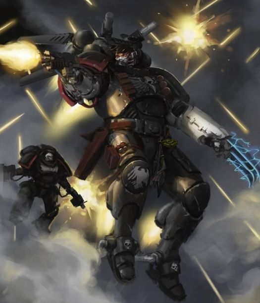
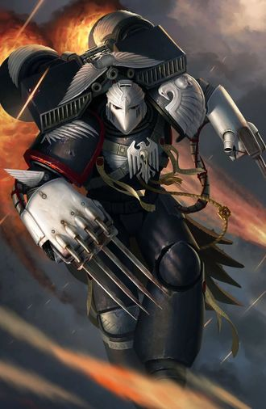
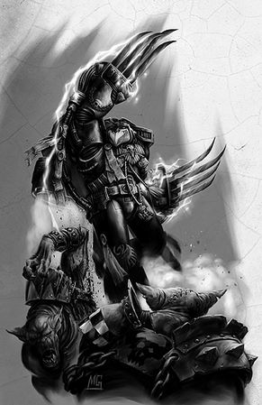
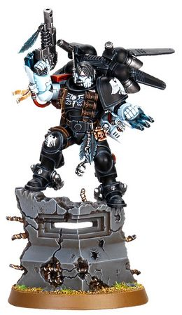

# 0713 凯万·史瑞克 Kayvaan Shrike

精校状态：中文行文已逐段精校，部分术语仍为暂定

分类：人类帝国 / 暗鸦守卫

原文来源：https://www.bilibili.com/opus/1119127447817682963

原作者：帝国神选罐头

原文时间：2025年10月02日 19:46

[返回分类目录](目录.md) · [全书目录](../../目录.md)

<!-- A0713-B0001 -->
**英文原文**

Kayvaan Shrike was a Master of Shadows of the Raven Guard. Before the Fall of Prefectia, he was the Shadow Captain of the Chapter's 3rd Company.

<!-- /A0713-B0001 -->

<!-- A0713-B0002 -->

原译文

凯万·史瑞克是暗鸦守卫的暗影之主。在总督星陷落之前，他是第三连队的暗影连长。

**校订译文**

凯万·史瑞克曾任暗鸦守卫的暗影之主。在总督星陷落前，他是战团第三连的暗影连长。

<!-- /A0713-B0002 -->

<!-- A0713-B0003 图片 -->

<!-- A0713-B0004 -->

原译文

Kayvaan Shrike since crossing the Rubicon Primaris 跨越原铸界限的凯万·史瑞克

**校订译文**

Kayvaan Shrike since crossing the Rubicon Primaris 接受原铸跨越手术后的凯万·史瑞克

<!-- /A0713-B0004 -->

<!-- A0713-B0005 -->
## History 历史

<!-- /A0713-B0005 -->

<!-- A0713-B0006 -->
### Early History 早期历史

<!-- /A0713-B0006 -->

<!-- A0713-B0007 -->
**英文原文**

Shrike was born on Kiavahr and as a youth worked as a runner for the Hive Gang known as the Tarkal Guild. As a teenager, he managed to evade rival gangers for over a week before being captured after killing four of his pursuers. After vicious torture, Shrike managed to escape and kill many more of the rival gangers. This was all noticed by the Chaplains of the Raven Guard, who saw his potential. Despite resisting the Chaplains, Shrike was promptly taken to Deliverance and trained as a Space Marine. The forename ‘Kayvaan’ honoured some memory from his gang days of which he would not speak, while ‘Shrike’ he chose for the swift hunter- hawks that nested high in the Diagothian Mountains. He had encountered these avians many times during his formative trials on Kiavahr, and had been struck with admiration for their fearless surprise attacks on seemingly superior prey.

<!-- /A0713-B0007 -->

<!-- A0713-B0008 -->

原译文

史瑞克出生在基亚瓦尔，年轻时曾为被称为塔卡尔行会的巢都帮派担任跑者。十几岁时，他设法躲避了敌对帮众一个多星期，在杀死四名追捕者后被捕。经过残酷的折磨，史瑞克设法逃脱并杀死了更多的敌对帮众。暗鸦守卫的牧师们都注意到了这一点，他们看到了他的潜力。尽管反抗了牧师，但史瑞克还是被迅速带到了救援站，并接受了星际战士的训练。名字“凯万”是为了纪念他不愿提及的帮派时期，而“史瑞克”则是为了纪念在迪亚戈提山脉高处筑巢的敏捷猎鹰。在基亚瓦尔的决定试炼中，他多次遇到这些鸟类，并对它们对看似优越的猎物的无畏突袭感到钦佩。

**校订译文**

史瑞克出生于基亚瓦尔，少年时曾为名叫塔卡尔行会的巢都帮派跑腿传信。他十几岁时，一度躲避敌对帮派追捕长达一周有余，杀死四名追捕者后才被擒。遭受酷刑后，他仍成功逃脱，又杀死了更多敌对帮众。暗鸦守卫的教士注意到了这一切，看出他的潜力。尽管史瑞克奋力抗拒，还是很快被带到拯救星，接受星际战士训练。他取名“凯万”，是为纪念帮派生涯中一段不愿言说的往事；“史瑞克”则来自迪亚戈提山脉高处筑巢的一种敏捷猎鹰。在基亚瓦尔接受早期试炼时，他曾多次遇见这种猛禽，对它们敢于突袭看似强于自己的猎物深感钦佩。

**校注：** Deliverance 为拯救星，原译救援站错误。Shrike 的鸟名来历按所给英文所述猎鹰保留，不以现实鸟类伯劳的分类改写虚构生物。

<!-- /A0713-B0008 -->

<!-- A0713-B0009 -->
### Space Marine 星际战士

<!-- /A0713-B0009 -->

<!-- A0713-B0010 -->
**英文原文**

After rising through the ranks of the Raven Guard from a lowly Neophyte Shrike ascended to command of the 3rd Company after his predecessor, Alerin, was interred within a Dreadnought and Corvin Severax was elevated to Chapter Master.

<!-- /A0713-B0010 -->

<!-- A0713-B0011 -->

原译文

史瑞克在暗鸦守卫从一个低级的新进者晋升为第三连队指挥官后，他的前任阿勒林被安葬在一架无畏内，科文·塞维拉克斯被提升为战团长。

**校订译文**

史瑞克从初入战团的新兵一步步晋升。在前任连长阿勒林被安置进无畏机甲、科文·塞维拉克斯升任战团长后，他接掌了第三连。

**校注：** 原文先有前任安置于无畏、塞维拉克斯晋升，史瑞克随后接任；原译颠倒先后。interred 此处不是死后安葬。

<!-- /A0713-B0011 -->

<!-- A0713-B0012 -->
**英文原文**

Shrike is most famous for his actions during the Targus VIII campaign against Waaagh! Skullkrak, which invaded the Targus System in 862.M41. The 3rd Company was originally detailed to eliminate the Orks' orbital defenses, a task they accomplished quickly, but were stranded on the planet when the Thunderhawk gunship inbound to extract them was destroyed in orbit.

<!-- /A0713-B0012 -->

<!-- A0713-B0013 -->

原译文

史瑞克最出名的是他在塔古斯八号对抗碎颅的Waaagh！的战役中的行动，碎颅在862.M41入侵塔古斯星系。第三连队最初的任务是清除欧克的轨道防御，他们很快完成了这项任务，但当雷鹰炮艇在轨道上被摧毁时，他们被困在了行星上。

**校订译文**

史瑞克最为人称道的战绩，是在塔古斯八号迎战“碎颅 Waaagh!”。这支欧克大军于 M41.862 入侵塔古斯星系。第三连原本受命清除欧克蛮人的轨道防御，很快便完成了任务；但前来接应撤离的雷鹰炮艇在轨道上被摧毁，他们因此受困于行星。

<!-- /A0713-B0013 -->

<!-- A0713-B0014 -->
**英文原文**

Without a pause, Shrike led his company in a two-year guerilla campaign behind the Ork lines, striking without warning at vulnerable supplies and providing invaluable reconnaissance data for the naval vessels in orbit. Shrike's mastery of guerrilla tactics was such that he and his men were all but untouchable, striking at the Orks with impunity and then disappearing without trace into the ruined Hive cities.

<!-- /A0713-B0014 -->

<!-- A0713-B0015 -->

原译文

史瑞克毫不犹豫地带领他的连队在欧克战线后进行了为期两年的游击战，毫无预警地袭击了易受攻击的补给，并为轨道上的海军舰艇提供了宝贵的侦察数据。史瑞克对游击战术的掌握使他和他的部下几乎不可触碰，对欧克的袭击不受惩处，然后消失在巢都城市的废墟中。

**校订译文**

史瑞克立即率第三连在欧克防线后方展开游击战，这一打就是两年。他们突然袭击防守薄弱的补给目标，为轨道上的海军舰艇提供珍贵的侦察情报。史瑞克的游击战术炉火纯青，使他和部下几乎无从被敌人捕捉：他们袭击欧克蛮人后便全身而退，消失在巢都废墟中，不留踪迹。

<!-- /A0713-B0015 -->

<!-- A0713-B0016 图片 -->

<!-- A0713-B0017 -->

原译文

Kayvaan Shrike before his transformation into a Primaris Space Marine 转变为原铸星际战士之前的凯万·史瑞克

**校订译文**

Kayvaan Shrike before his transformation into a Primaris Space Marine 转变为原铸星际战士之前的凯万·史瑞克

<!-- /A0713-B0017 -->

<!-- A0713-B0018 -->
**英文原文**

Thanks to Shrike and his company, the Targus campaign was brought to a close decades before the predictions of Imperial Tacticians. By the time the 3rd Company was extracted from Targus, the entire system hailed him as a hero.

<!-- /A0713-B0018 -->

<!-- A0713-B0019 -->

原译文

多亏了史瑞克和他的连队，塔古斯战役比帝国战术家的预测早了几十年就结束了。当第三连队从塔古斯撤出时，整个星系都称赞他为英雄。

**校订译文**

凭借史瑞克与第三连的努力，塔古斯战役比帝国战术家预计的时间提前数十年结束。第三连撤出塔古斯时，整个星系都将他奉为英雄。

<!-- /A0713-B0019 -->

<!-- A0713-B0020 -->
### The Hunt For Voldorius 狩猎沃尔多里乌斯

<!-- /A0713-B0020 -->

<!-- A0713-B0021 -->
**英文原文**

Shortly after the Targus campaign began to swing in the Imperials' favour, Shrike received word of the fall of Quintus, where the Daemon Prince Kernax Voldorius had corrupted the Imperial forces and turned the entire planet’s military to the service of the Alpha Legion.

<!-- /A0713-B0021 -->

<!-- A0713-B0022 -->

原译文

塔古斯战役开始对帝国有利后不久，史瑞克收到了昆图斯沦陷的消息，恶魔王子克纳克斯·沃尔多里乌斯在那里腐化了帝国军队，并将整个行星的军队都交给了阿尔法军团。

**校订译文**

塔古斯战局开始向帝国倾斜后不久，史瑞克得知昆图斯已经沦陷。恶魔亲王克纳克斯·沃尔多里乌斯在那里腐化了帝国军队，使整颗行星的军事力量转而为阿尔法军团效力。

<!-- /A0713-B0022 -->

<!-- A0713-B0023 -->
**英文原文**

Shrike and the 3rd Company were waging a guerilla campaign against the Chaos forces when unexpected allies arrived in the form of Captain Kor'sarro Khan and his men. Khan, as the White Scars' Master of the Hunt, had been ordered to bring Voldorius's head back to the Chapter's fortress-monastery on Chogoris. The rivalry between the White Scars and the Raven Guard was thousands of years old, but the two Captains forged an uneasy alliance. Their combined efforts led to victory, and Shrike and Khan fought side-by-side to defeat the Daemon Prince in close combat. Shrike returned to the Targus battlezone, parting from Khan on terms of respect.

<!-- /A0713-B0023 -->

<!-- A0713-B0024 -->

原译文

史瑞克和第三连队正在对混沌部队发动游击战，突然出现了意想不到的盟友阔萨罗可汗连长和他的部下。作为白色伤疤的狩猎大师，可汗奉命将沃尔多里乌斯的头带回乔高里斯的战团堡垒修道院。白色伤疤和暗鸦守卫之间的竞争已有数千年的历史，但两位连长结成了一个不稳定的联盟。他们的共同努力取得了胜利，史瑞克和可汗并肩作战，在近距离战斗中击败了恶魔王子。史瑞克回到塔古斯战区，以尊重的态度与可汗分道扬镳。

**校订译文**

史瑞克与第三连正对混沌部队展开游击战时，一支意外的援军抵达：科萨罗可汗连长及其部下。作为白疤的狩猎大师，可汗奉命将沃尔多里乌斯的头颅带回乔高里斯的战团要塞修道院。白疤与暗鸦守卫的竞争已延续数千年，但两位连长仍勉强结盟。双方合力取得胜利，史瑞克与可汗并肩作战，在近战中击败恶魔亲王。分别时，两人已心怀敬意，史瑞克随后返回塔古斯战区。

<!-- /A0713-B0024 -->

<!-- A0713-B0025 -->
**英文原文**

In 995.M41 he killed the Tau Ambassador Myen O’Res during his trying to convince a populace of Lurid IX planet to join the Tau Empire.

<!-- /A0713-B0025 -->

<!-- A0713-B0026 -->

原译文

995.M41，他杀死了钛使节迈恩·欧'雷斯 ，当时他试图说服惊悚九号行星的民众加入钛帝国。

**校订译文**

M41.995，钛族使节迈恩·欧’雷斯试图说服惊悚九号的民众加入钛帝国，史瑞克将其杀死。

<!-- /A0713-B0026 -->

<!-- A0713-B0027 图片 -->

<!-- A0713-B0028 -->

原译文

Kayvaan Shrike 凯万·史瑞克

**校订译文**

Kayvaan Shrike 凯万·史瑞克

<!-- /A0713-B0028 -->

<!-- A0713-B0029 -->
### Ascension 升职

<!-- /A0713-B0029 -->

<!-- A0713-B0030 -->
**英文原文**

Shrike went on to conduct equally masterful actions against Orks in the Donara and Yakhee systems. He is now regarded as a near-mythical figure on many Imperial worlds; whenever Orks invade, desperate citizens offer prayers to the Emperor to send Shrike to save them. He and his men continue to war against Waaagh! Skullkrak. If Shrike is aware that his aid is constantly requested by senior commanders of the Imperial Guard and Navy, in those theatres where the Orks press them hardest, he ignores them. He and his men save their efforts for those worlds that have already been abandoned to the greenskins, whose civilian populations are close to being entirely consumed by the invading Orks. Among these people, Shrike is a saviour angel, and a source of whispered terror among Skullkrak's Boyz. Shrike has also trained a special unit, known as Shrike's Wing.

<!-- /A0713-B0030 -->

<!-- A0713-B0031 -->

原译文

史瑞克继续在多纳拉和雅基星系中对欧克采取同样精湛的行动。他现在被视为许多帝国世界中近乎神话般的人物；每当欧克入侵时，绝望的公民都会向帝皇祈祷，让史瑞克来救他们。他和他的部下继续与碎骨的Waaagh！作战。如果史瑞克知道帝国卫队和海军的高级指挥官经常请求他的援助，在那些欧克威胁最重的战区，他会忽略他们。他和他的部下将他们的努力留给了那些已经被绿皮抛弃的世界，那里的平民人口几乎完全被入侵的欧克吞噬。在这些人中，史瑞克是救主天使，也是碎骨的小子中低声恐怖的来源。史瑞克还训练了一支名为伯劳之翼的特种部队。

**校订译文**

此后，史瑞克又在多纳拉与雅基星系出色地打击欧克蛮人。在许多帝国世界，他已成为近乎神话的人物；每逢欧克入侵，绝望的居民便向帝皇祈求，盼望他前来救援。他与部下继续对抗碎颅 Waaagh!。在受欧克压迫最严重的战区，帝国卫队与海军高级指挥官不断请求援助，即便史瑞克知晓，也不予理会。他将力量留给那些已被帝国放弃、落入绿皮之手的世界，那里残存的平民几乎就要被入侵者吞噬殆尽。对这些人而言，他是救命天使；对碎颅麾下的蛮人小子而言，他却是只能低声谈论的恐怖传说。他还训练了一支精锐部队，名为伯劳之翼。

**校注：** abandoned to the greenskins 是被放弃给绿皮的世界，原译“被绿皮抛弃”颠倒施受关系。Skullkrak 同篇统称碎颅，区别 Ghazghkull 的碎骨者称号。

<!-- /A0713-B0031 -->

<!-- A0713-B0032 -->
**英文原文**

During the Prefectia Campaign, Raven Guard Chapter Master Corvin Severax along with much of the 3rd Company were slain by Commander Shadowsun. Shrike led a counterattack that recovered much of the company's Gene-seed. For this and his other past actions, Shrike was elected by his fellow Shadow Captains as the new Chapter Master of the Raven Guard. Shrike however still sees himself as a Shadow Captain of a Battle Company, and has grown uneasy and brooding regarding the death of Severax. He has pledged that should a worthier candidate come along, he will abdicate as Chapter Master.

<!-- /A0713-B0032 -->

<!-- A0713-B0033 -->

原译文

在总督星战役中，暗鸦守卫战团长科文·塞维拉克斯和第三连队的大部分人被影阳指挥官杀害。史瑞克领导了一场反击，夺回了该连队的大部分基因种子。由于这一点和他过去的其他行为，史瑞克被他的暗影连长追随者们选为暗鸦守卫的新战团长。然而，史瑞克仍然将自己视为一个战斗连队的暗影连长，并对塞维拉克斯的死亡感到不安和沉思。他承诺，如果出现更有价值的候选人，他将辞去战团长一职。

**校订译文**

总督星战役中，暗鸦守卫战团长科文·塞维拉克斯与第三连大批战士被指挥官影阳杀死。史瑞克率军反击，夺回了该连大部分基因种子。凭借这次行动与此前的功绩，其他暗影连长推举他接任战团长。但他仍将自己看作战斗连的暗影连长，也始终为塞维拉克斯之死耿耿于怀。他承诺，只要出现更合适的继任者，自己便会让位。

**校注：** fellow Shadow Captains 指同僚暗影连长，非追随者。Prefectia 沿18总督星；456战役译名普雷费克提亚为同地异译，主审已决定统一总督星战役。

<!-- /A0713-B0033 -->

<!-- A0713-B0034 -->
**英文原文**

Since the creation of the Great Rift, Kayvaan Shrike has undergone the Rubicon Primaris and has been converted into a Primaris Space Marine of the Vanguard variety. Later during the Battle of Xalladin Shrike led the Raven Guard against Orks. However during the fighting, the Iron Hands and Imperial Fists nearly came to blows. Shrike took decisive action by covertly destroying their source of dispute, the relic known as the Brimstone Heart.

<!-- /A0713-B0034 -->

<!-- A0713-B0035 -->

原译文

自大裂隙形成以来，凯万·史瑞克经历了原铸手术，并被转变成先锋星际战士。后来在沙拉丁之战中，史瑞克率领暗鸦守卫对抗欧克。然而，在战斗中，钢铁之手和帝国之拳几乎发生了冲突。史瑞克采取了果断的行动，秘密地摧毁了他们的争端之源，即被称为边石之心的遗物。

**校订译文**

大裂隙形成后，凯万·史瑞克接受原铸跨越手术，成为先锋型原铸星际战士。后来，他率暗鸦守卫在沙拉丁之战中对抗欧克蛮人。战斗期间，钢铁之手与帝国之拳却险些彼此动武。史瑞克果断采取行动，暗中摧毁了双方争执的焦点——圣物硫磺之心。

**校注：** Rubicon Primaris 沿原铸跨越手术，保留原铸与先锋两个限定；Brimstone 为硫磺，原译边石误义。

<!-- /A0713-B0035 -->

<!-- A0713-B0036 -->
### Resignation 辞职

<!-- /A0713-B0036 -->

<!-- A0713-B0037 -->
**英文原文**

Shrike eventually ordered a scattering of the Raven Guard's strike forces while also stepping down as Master of Shadows. Having been elected to command in the aftermath of Severax’s death in the Prefectia Campaign, Shrike came to realize that he did not fit well in high commander. He saw in himself the same recklessness and lust for battle that had seen Severax die. Moreover, he had invested himself deeply in mastering the Path of Ambush. A Master of Shadows, he believed, should be instead been the master of all three elements of the Corax's Trifold Path of Shadow. Shrike had almost immediately intended to resign from the position as soon as he could safely appoint a successor.

<!-- /A0713-B0037 -->

<!-- A0713-B0038 -->

原译文

史瑞克最终下令分散暗鸦守卫的打击部队，同时辞去暗影大师的职务。在塞维拉克斯在总督星战役中牺牲后，史瑞克被选为指挥官，他意识到自己不适合担任高级指挥官。他在自己身上看到了同样的鲁莽和对战争的渴望，就像牺牲的塞维拉克斯一样。此外，他还投入了大量精力掌握伏击之路。他认为，一个暗影之主应该成为科拉克斯的三重阴影之路所有三个要素的大师。史瑞克几乎立即打算在能够安全任命继任者后立即辞职。

**校订译文**

最终，史瑞克下令让暗鸦守卫各支突击部队分散行动，同时辞去暗影之主的职务。自塞维拉克斯在总督星战役中战死、自己被推举继任以来，他逐渐认识到自己并不适合统筹全局。他在自己身上看见了与塞维拉克斯相似的鲁莽和好战，而正是这些特质导致前任陨落。此外，他一直专注钻研伏击之路，却认为暗影之主理应精通科拉克斯三重阴影之路的全部三个方面。因此，他几乎一上任就打定主意，只要能稳妥选出继任者，便立即卸任。

<!-- /A0713-B0038 -->

<!-- A0713-B0039 -->
**英文原文**

After navigating the Raven Guard through the immediate difficulty of the opening of the Great Rift, the Indomitus Crusade gave Shrike the opportunity to finally select a worthy successor. Shrike selected former 1st Company Captain Aethon Shaan as his successor after witnessing his skillful restraint against the Genestealer Cults of Gelvia the Iron Warriors at Strigneth System, and the Orks at Aescia II. All three victories had been won with minimal loss of life, and Shrike knew that Shaan would be a worthy successor.

<!-- /A0713-B0039 -->

<!-- A0713-B0040 -->

原译文

在带领暗鸦守卫度过了大裂隙打开的直接困难之后，不屈远征给了史瑞克最终选择合适继任者的机会。史瑞克选择了前第一连队连长艾森·沙恩作为他的继任者，因为他目睹了他在斯特林格内斯星系的钢铁勇士和埃西亚二号的欧克以及对盖尔维亚的基因窃取者教派的巧妙克制。这三场胜利都是以最小的生命损失取得的，史瑞克知道沙恩将是一个合适的继任者。

**校订译文**

带领暗鸦守卫渡过大裂隙初开时的危机后，不屈远征终于给了史瑞克物色继任者的机会。他见证艾索·沙恩在盖尔维亚对抗基因窃取者教派、在斯特林格内斯星系对抗钢铁勇士、在埃西亚二号对抗欧克蛮人时，始终善于克制、指挥得当。这三场战役都以极小的人员损失取胜，因此他选定这位前第一连连长继任。

**校注：** Aethon Shaan 采用核心据 GW-06 人物卡与官网页核定的艾索·沙恩，原本篇艾森·沙恩。三场战役与三种敌对势力逐一配对。

<!-- /A0713-B0040 -->

<!-- A0713-B0041 -->
## Wargear 战斗装备

原题：Wargear 战备

<!-- /A0713-B0041 -->

<!-- A0713-B0042 -->
**英文原文**

In addition to his Phobos Pattern Power armour, Shrike is equipped with a Jump Pack, Frag and Krak grenades, and an Iron Halo.

<!-- /A0713-B0042 -->

<!-- A0713-B0043 -->

原译文

除了他的福波斯型动力盔甲外，史瑞克还配备了跳跃背包、破片和穿甲手榴弹以及铁光环。

**校订译文**

史瑞克身穿恐惧型动力护甲，另配跳跃背包、破片手榴弹、穿甲手榴弹与铁光环。

**校注：** Phobos Armour 采用已核官译恐惧型护甲，区别火卫一地名。

<!-- /A0713-B0043 -->

<!-- A0713-B0044 图片 -->

<!-- A0713-B0045 -->

原译文

Kayvaan Shrike as a Primaris Space Marine 作为原铸星际战士的凯万·史瑞克

**校订译文**

Kayvaan Shrike as a Primaris Space Marine 作为原铸星际战士的凯万·史瑞克

<!-- /A0713-B0045 -->

<!-- A0713-B0046 -->
**英文原文**

His primary weapons are the Bolt pistol known as Blackout and the Raven's Talons, an ancient pair of master crafted Lightning Claws. Reportedly made by Corax himself after the Drop Site Massacre, the Talons are said to be completely unbreakable and can cut through even the thickest vehicle armour.

<!-- /A0713-B0046 -->

<!-- A0713-B0047 -->

原译文

他的主要武器是被称为黑断的爆矢手枪和渡鸦之爪，这是一对古老的大师级闪电爪。据报道，在登陆点大屠杀后，科拉克斯制造了爪，据说它完全坚不可摧，甚至可以穿透最厚的载具装甲。

**校订译文**

他的主要武器是爆矢手枪黑断，以及一对古老的精工闪电爪——渡鸦之爪。据说，这对利爪由科拉克斯在登陆场大屠杀后亲手打造，坚不可摧，连最厚重的载具装甲也能切开。

<!-- /A0713-B0047 -->

<!-- A0713-B0048 -->
## Quotes 语录

<!-- /A0713-B0048 -->

<!-- A0713-B0049 -->
**英文原文**

"In the darkness all men are equal, save those that embrace it."

<!-- /A0713-B0049 -->

<!-- A0713-B0050 -->

原译文

“在黑暗中，所有人都是平等的，除了那些拥抱它的人。”

**校订译文**

“在黑暗中，所有人都是平等的，除了那些拥抱它的人。”

<!-- /A0713-B0050 -->

<!-- A0713-B0051 -->
**英文原文**

We are coming. Look to the skies for your salvation.— to Commissar Lent prior to the Blindhope planetstrike

<!-- /A0713-B0051 -->

<!-- A0713-B0052 -->

原译文

我们来了。仰望天空，寻求你的救赎。--在盲目希望行星打击之前，伦特政委

**校订译文**

“我们即将到来。仰望天空，等待你们的救赎。”——在盲目希望星空降突击前，对伦特政委所言

**校注：** to Commissar Lent 表示此话是对伦特政委说的，原译容易误认伦特为说话者。planetstrike 为行星空降突击。

<!-- /A0713-B0052 -->

<!-- A0713-B0053 -->
**英文原文**

Wherever you tread, tread lightly. We are closer than you think, and our blades are sharp.

<!-- /A0713-B0053 -->

<!-- A0713-B0054 -->

原译文

无论你走到哪里，放轻脚步。我们比你想象的要近，并且我们的刀刃锋利。

**校订译文**

“无论走到哪里，都要放轻脚步。我们比你想象的更近，刀刃也锋利无比。”

<!-- /A0713-B0054 -->

本篇核心术语与暂定项

以下列出本篇出现的英文原形及核心术语表用词。同形词可能指不同对象，具体词义以本篇正文和校注为准；单复数、别名和仅见于图注的名称可能尚未列入。完整候选见[术语表](../../术语表/双语术语候选.csv)。

| 英文 | 采用中文 | 状态 |
| --- | --- | --- |
| Imperial Guard | 帝国卫队 | 暂定·语境区分 |
| Genestealer Cults | 基因窃取者教派 | 官方已核对 |
| Orks | 欧克蛮人 | 官方已核对 |
| Bolt Pistol | 爆矢手枪 | 官方已核对 |
| Commissar | 政委 | 官方已核对 |
| Great Rift | 大裂隙 | 官方已核对 |
| Waaagh! | Waaagh! | 暂定·保留原文 |
| Indomitus | 不屈学派 | 暂定·学派语境 |
| Imperial Fists | 帝国之拳 | 暂定 |
| Emperor | 帝皇 | 官方已核对 |
| Daemon Prince | 恶魔亲王 | 官方已核对 |
| Iron Warriors | 钢铁勇士 | 暂定·官方待核 |
| Iron Hands | 钢铁之手 | 暂定·官方待核 |
| Indomitus Crusade | 不屈远征 | 暂定·官方待核 |
| Kiavahr | 基亚瓦尔 | 暂定·官方待核 |
| Chogoris | 乔高里斯 | 暂定·官方待核 |
| Prefectia | 总督星 | 暂定·官方待核 |
| Phobos | 火卫一 | 暂定·官方待核 |
| Deliverance | 拯救星 | 暂定·官方待核 |
| Untouchable | 不可接触者 | 暂定·官方待核 |
| Master | 导师（审判庭职衔）／舰务官（舰员职务） | 语境定译·官方待核 |
| Neophyte | 新进者 | 暂定 |
| Ancient | 旗手 | 官方已核对 |
| Aethon Shaan | 艾索·沙恩 | 官方已核对 |
| White Scars | 白疤 | 官方已核 |
| Alpha Legion | 阿尔法军团 | 暂定·官方待核 |
| Raven Guard | 暗鸦守卫 | 官方已核 |
| Scars | 伤疤 | 暂定·官方待核 |
| Iron Halo | 铁光环 | 暂定·官方待核 |
| Power Armour | 动力盔甲 | 暂定·官方待核 |
| Krak Grenades | 穿甲手榴弹 | 暂定·官方待核 |
| Space Marine | 星际战士 | 暂定·官方待核 |
| Chapter | 战团 | 暂定·官方待核 |
| Fortress-monastery | 要塞修道院 | 暂定·官方待核 |
| Chapter Master | 战团长 | 暂定·官方待核 |
| Captain | 连长 | 暂定·官方待核 |
| Vanguard | 先锋 | 暂定·官方待核 |
| Primaris Space Marine | 原铸星际战士 | 暂定·官方待核 |
| Kor'sarro Khan | 科萨罗可汗 | 暂定·官方待核 |
| Kayvaan Shrike | 凯万·史瑞克 | 官方已核 |
| Master of the Hunt | 狩猎大师 | 暂定·官方待核 |
| Gene-seed | 基因种子 | 暂定·官方待核 |
| Thunderhawk Gunship | 雷鹰炮艇 | 暂定·官方待核 |
| Rubicon Primaris | 原铸跨越手术 | 暂定·官方待核 |
| Kernax Voldorius | 克纳克斯·沃尔多里乌斯 | 暂定·官方待核 |
| Boyz | 蛮人小子 | 官方已核对 |
| Corvin Severax | 科文·塞维拉克斯 | 暂定·官方待核 |
| Prefectia Campaign | 总督星战役 | 暂定·官方待核 |
| Trifold Path of Shadow | 三重阴影之路 | 暂定·官方待核 |
| Commander Shadowsun | 指挥官影阳 | 官方已核对 |
| Shadowsun | 影阳 | 官方词根参考·语境定译 |
| Dreadnought | 无畏机甲 | 暂定·官方待核 |
| Chaplains | 教士 | 暂定·官方待核 |
| Master of Shadows | 暗影之主 | 暂定·官方待核 |
| Shadow Captain | 暗影连长 | 暂定·官方待核 |
| Raven's Talons | 渡鸦之爪 | 暂定·官方待核 |
| Xalladin | 沙拉丁 | 暂定·官方待核 |
| Tarkal Guild | 塔卡尔行会 | 暂定·官方待核 |
| Diagothian Mountains | 迪亚戈提山脉 | 暂定·官方待核 |
| Alerin | 阿勒林 | 暂定·官方待核 |
| Targus VIII | 塔古斯八号 | 暂定·官方待核 |
| Targus System | 塔古斯星系 | 暂定·官方待核 |
| Waaagh! Skullkrak | 碎颅 Waaagh! | 暂定·官方待核 |
| Quintus | 昆图斯 | 暂定·官方待核 |
| Myen O’Res | 迈恩·欧’雷斯 | 暂定·官方待核 |
| Lurid IX | 惊悚九号 | 暂定·官方待核 |
| Donara | 多纳拉 | 暂定·官方待核 |
| Yakhee | 雅基 | 暂定·官方待核 |
| Battle of Xalladin | 沙拉丁之战 | 暂定·官方待核 |
| Brimstone Heart | 硫磺之心 | 暂定·官方待核 |
| Path of Ambush | 伏击之路 | 暂定·官方待核 |
| Gelvia | 盖尔维亚 | 暂定·官方待核 |
| Strigneth System | 斯特林格内斯星系 | 暂定·官方待核 |
| Aescia II | 埃西亚二号 | 暂定·官方待核 |
| Blackout | 黑断 | 暂定·官方待核 |
| Blindhope | 盲目希望星 | 暂定·官方待核 |
| Lent | 伦特 | 暂定·官方待核 |
| System | 星系（恒星系统） | 暂定·官方待核 |
| Bolt | 爆矢 | 暂定·官方待核 |
| Tau Empire | 钛帝国 | 暂定·官方待核 |
| Jump Pack | 跳跃背包 | 暂定·官方待核 |

