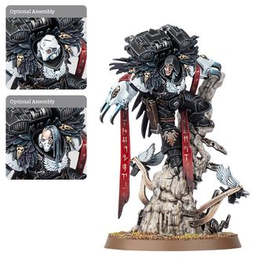

# 0714 艾索·沙恩 Aethon Shaan

精校状态：中文行文已逐段精校，部分术语仍为暂定

分类：人类帝国 / 暗鸦守卫

原文来源：https://www.bilibili.com/opus/1119109589365686293

原作者：帝国神选罐头

原文时间：2025年10月02日 18:36

[返回分类目录](目录.md) · [全书目录](../../目录.md)

原篇名：艾森·沙恩 Aethon Shaan

<!-- A0714-B0001 -->
**英文原文**

"The way into Axum is clear, Sergeant Issam. Your approach was made with great skill, but this is Raven Guard work."

<!-- /A0714-B0001 -->

<!-- A0714-B0002 -->

原译文

“进入阿克苏姆的道路很清晰，伊萨姆军士。你的方法非常熟练，但这是暗鸦守卫的工作。”

**校订译文**

“伊萨姆军士，通往阿克苏姆的道路已经打通。你们的潜入手法十分出色，但接下来该由暗鸦守卫动手了。”

<!-- /A0714-B0002 -->

<!-- A0714-B0003 -->
**英文原文**

Aethon Shaan is the current Chapter Master of the Raven Guard. Before his current position he was Shadow Captain of the Chapter's 1st Company and before that its 4th Captain.

<!-- /A0714-B0003 -->

<!-- A0714-B0004 -->

原译文

艾森·沙恩是暗鸦守卫的现任战团长。在他目前的职位之前，他是第一连队的暗影连长，在此之前是第四连队的连长。

**校订译文**

艾索·沙恩是暗鸦守卫的现任战团长。他此前担任第一连暗影连长，更早则是第四连连长。

**校注：** Aethon Shaan 沿已核官译艾索·沙恩；本篇艾森、莎恩异写统一，历史职务与现职依英文保留。

<!-- /A0714-B0004 -->

<!-- A0714-B0005 图片 -->

<!-- A0714-B0006 -->

原译文

Aethon Shaan 艾森·沙恩

**校订译文**

Aethon Shaan 艾索·沙恩

<!-- /A0714-B0006 -->

<!-- A0714-B0007 -->
## History 历史

<!-- /A0714-B0007 -->

<!-- A0714-B0008 -->
### Shadow Captain 暗影连长

<!-- /A0714-B0008 -->

<!-- A0714-B0009 -->
**英文原文**

When the Chaos army known as the Bloodborn invaded Ultramar in 854999.M41, the Raven Guard's Master of Shadows sent Shaan and one of the Fourth Company's elite squads to assist the Ultramarines. Their entry into Lord Calgar's chambers inside the Fortress of Hera was so stealthy that even the legendary Scout Sergeant Telion did not detect their presence until they announced themselves.

<!-- /A0714-B0009 -->

<!-- A0714-B0010 -->

原译文

当被称为血裔的混沌军队于854999.M41入侵奥特拉玛时，暗鸦守卫的暗影之主派莎恩和第四连队的一支精英小队协助奥特拉玛。他们进入赫拉要塞内卡尔加领主的房间是如此隐秘，以至于即使是传说中的侦察军士泰利昂也没有发现他们的存在，直到他们宣布了自己的存在。

**校订译文**

帝国纪年 854999.M41，名为血裔的混沌军队入侵奥特拉玛。暗鸦守卫的暗影之主派沙恩率第四连一支精锐小队支援极限战士。他们悄无声息地潜入赫拉要塞内卡尔加领主的房间，直到主动现身，连传奇侦察军士泰利昂都未察觉他们的到来。

**校注：** 854999.M41 依源文完整保留，未误作公元年份；Ultramarines 为极限战士，非地区奥特拉玛。

<!-- /A0714-B0010 -->

<!-- A0714-B0011 -->
**英文原文**

Their specific mission was to capture Ardaric Vaanes, a renegade Raven Guard who had been seen traveling in the retinue of Warsmith Honsou.

<!-- /A0714-B0011 -->

<!-- A0714-B0012 -->

原译文

他们的具体任务是抓捕阿达里克·万纳斯，一名叛徒暗鸦守卫，有人看到他在战争铁匠洪索的随从中随行。

**校订译文**

他们的具体任务是抓捕变节的暗鸦守卫阿达里克·瓦内斯。有人曾目击他跟随战争铁匠洪索行动。

<!-- /A0714-B0012 -->

<!-- A0714-B0013 -->
**英文原文**

Shaan and his squad infiltrated the Chaos-held city of Axum on Tarentus and neutralized the sentries, allowing an Ultramarines strike force to enter and demolish the defences. However, Axum was a trap laid by Honsou for Uriel Ventris, who only just managed to evacuate his troops before the city was levelled from orbit. During the evacuation, Shaan saved Scout Sergeant Issam's life by casually beheading a persistent Khorne Berserker clinging to their escaping Thunderhawk.

<!-- /A0714-B0013 -->

<!-- A0714-B0014 -->

原译文

沙恩和他的小队渗透到塔伦图斯的混沌控制的阿克苏姆城，并消灭了哨兵，使一支极限战士打击部队得以进入并摧毁防御工事。然而，阿克苏姆是洪索为乌瑞尔·文崔斯设下的陷阱，他在城市被从轨道上夷为平地之前才设法疏散了他的部队。在疏散过程中，沙恩随意斩首了一名执着于逃跑的雷鹰的恐虐狂战士，从而挽救了侦察军士伊萨姆的生命。

**校订译文**

沙恩与小队潜入塔伦图斯上由混沌控制的阿克苏姆城，清除哨兵，让极限战士突击部队得以入城摧毁防御设施。但阿克苏姆其实是洪索为乌瑞尔·文崔斯布下的陷阱。文崔斯勉强抢在轨道轰炸将城市夷平之前撤出部队。撤离时，一名恐虐狂战士死死攀住他们的雷鹰，沙恩轻描淡写地将其斩首，救下侦察军士伊萨姆。

**校注：** 狂战士攀住正在撤离的雷鹰，不是狂战士试图逃跑；just managed 保留险些未及撤退之意。

<!-- /A0714-B0014 -->

<!-- A0714-B0015 -->
**英文原文**

Shaan later joined Uriel and the Ultramarines Fourth Company in defending Calth from the assault of the Iron Warriors, and helped Inquisitor Namira Suzaku to interrogate Vaanes after he was captured during the fight at Guilliman's Gate.

<!-- /A0714-B0015 -->

<!-- A0714-B0016 -->

原译文

沙恩后来加入了乌瑞尔和极限战士第四连队，保护考斯免受钢铁勇士的攻击，并在万纳斯在基里曼之门的战斗中被捕后帮助审判官娜米拉.朱雀审问万纳斯。

**校订译文**

后来，沙恩与乌瑞尔及极限战士第四连一同守卫考斯，抵御钢铁勇士进攻。瓦内斯在基里曼之门的战斗中被俘后，沙恩还协助审判官娜米拉·朱雀审讯他。

<!-- /A0714-B0016 -->

<!-- A0714-B0017 -->
**英文原文**

Shaan and his squad were instrumental in turning the tide on Calth, when they infiltrated the Chaos force's command vehicle, the Black Basilica, and destroyed it with demolition charges. This not only killed a fair number of the Chaos soldiers, it also halted the corrupt Adept Cycerin's attempts to take control of the Praetorians fighting on the Ultramarines' side.

<!-- /A0714-B0017 -->

<!-- A0714-B0018 -->

原译文

沙恩和他的小队在扭转考斯的局势方面发挥了重要作用，他们渗透到混沌部队的指挥载具黑色教堂号，并用破坏炸药将其摧毁。这不仅杀死了相当多的混沌士兵，还阻止了腐化的专家西瑟林试图控制与极限战士并肩作战的禁卫军。

**校订译文**

沙恩与小队潜入混沌部队的指挥载具黑色教堂号，用爆破装药将其摧毁，为扭转考斯战局立下关键功劳。这不仅杀死了大批混沌士兵，也打断了堕落的帝国任职者西瑟林夺取禁卫兵控制权的企图；这些部队当时正与极限战士并肩作战。

**校注：** Adept 依本书广义身份暂称帝国任职者；Praetorians 沿机械修会兵种禁卫兵，与帝皇禁军区分。

<!-- /A0714-B0018 -->

<!-- A0714-B0019 -->
**英文原文**

In the climax of the battle on Calth, Shaan accompanied Uriel and his Command Squad through the caverns to the underground tomb of Remus Ventanus, the saviour of Calth. Shaan lost several men in the fight with Honsou's warriors, but survived the fight, and the collapsing of the cave by Honsou.

<!-- /A0714-B0019 -->

<!-- A0714-B0020 -->

原译文

在考斯之战的高潮中，沙恩陪同乌瑞尔和他的指挥小队穿过洞穴，来到考斯救主雷穆斯·文坦努斯的地下陵墓。沙恩在与洪索的战士的战斗中损失了几名士兵，但在战斗中幸存下来，并在洪索的洞穴坍塌中幸存下来。

**校订译文**

考斯决战进入最激烈的阶段时，沙恩陪同乌瑞尔及其指挥小队穿越洞穴，抵达考斯救主雷穆斯·文坦努斯的地下陵墓。他在与洪索部队交战时损失了数名战士，但本人不仅活过了战斗，也逃过了洪索引发的洞穴坍塌。

<!-- /A0714-B0020 -->

<!-- A0714-B0021 -->
**英文原文**

Afterwards, Shaan was bewildered by the actions of Vaanes, who had fought for their side in the final battle. Shaan had been ordered to take Vaanes back to the Ravenspire for punishment, but did not know what he would say now. Uriel suggested that Shaan tell the truth: that Vaanes had given his life fighting against the Ruinous Powers. Shaan agreed, and asked Apothecary Selenus to extract Vaanes' gene-seed, for return to the Raven Guard's fortress-monastery.

<!-- /A0714-B0021 -->

<!-- A0714-B0022 -->

原译文

后来，沙恩对万纳斯的行为感到困惑，万纳斯在最后一战中为他们一方而战。沙恩被命令将万纳斯带回渡鸦尖塔进行惩罚，但不知道他现在能说什么。乌瑞尔建议沙恩说实话：万纳斯在与毁灭力量的战斗中献出了生命。沙恩同意了，并要求药剂师塞勒努斯提取万纳斯的基因种子，以便返回暗鸦守卫的堡垒修道院。

**校订译文**

战后，沙恩对瓦内斯的行为深感困惑：这个叛徒竟在最后一战中为他们而战。他奉命将瓦内斯带回渡鸦尖塔受罚，如今却不知该如何复命。乌瑞尔建议他如实相告：瓦内斯已为抗击毁灭诸力献出生命。沙恩接受了这个建议，请药剂师塞勒努斯取出瓦内斯的基因种子，带回暗鸦守卫的要塞修道院。

<!-- /A0714-B0022 -->

<!-- A0714-B0023 -->
**英文原文**

Shaan and his surviving warriors also accompanied the Second and Fourth Companies to Talassar to relieve the besieged First Company led by Chapter Master Calgar, taking part in the jump pack assault against M'kar's daemon army. He and his surviving warriors were among the few non-Ultramarines to attend the Chapter's victory celebration in the Shrine of Guilliman on Macragge, and the fallen Raven Guard were honoured along with the Ultramarines.

<!-- /A0714-B0023 -->

<!-- A0714-B0024 -->

原译文

沙恩和他幸存的战士们还陪同第二和第四连队前往塔拉萨，以解救由战团长卡尔加领导的被围困的第一连队，参加了对姆'卡的恶魔军队的跳跃背包攻击。他和他幸存的战士是少数几个参加在马库拉格的基里曼神殿举行的战团胜利庆典的非极限战士之一，倒下的暗鸦守卫和极限战士一起受到了表彰。

**校订译文**

沙恩与幸存部下还随极限战士第二连、第四连前往塔拉萨，解救由卡尔加战团长率领、正遭围困的第一连，并以跳跃背包突击姆’卡尔的恶魔大军。后来，他们成为少数受邀参加极限战士胜利庆典的外团战士。庆典在马库拉格的基里曼神殿举行，阵亡的暗鸦守卫与极限战士同受纪念。

<!-- /A0714-B0024 -->

<!-- A0714-B0025 -->
### Chapter Master 战团长

<!-- /A0714-B0025 -->

<!-- A0714-B0026 -->
**英文原文**

During the Indomitus Crusade, Shaan oversaw victories against the Genestealer Cults of Gelvia, the Iron Warriors at Strigneth System, and the Orks at Aescia II. All three victories had been won with minimal loss of life, and Kayvaan Shrike, having long looked for a successor, knew that the Captain exemplified the Trifold Path of Shadow. Shaan was summoned back to the Ravenspire and quietly and unceremoniously appointed Master of Shadows while Shrike resigned.

<!-- /A0714-B0026 -->

<!-- A0714-B0027 -->

原译文

在不屈远征期间，沙恩监督了对盖尔维亚的基因窃取者教派、斯特林格内斯星系的钢铁勇士和埃西亚二号的兽人的胜利。这三场胜利都是以最小的生命损失取得的，长期以来一直在寻找继任者的凯万·史瑞克知道连长是三重暗影之路的典范。沙恩被唤回暗鸦尖塔，悄悄地、唐突的地被任命为暗影之主，而史瑞克则辞职了。

**校订译文**

不屈远征期间，沙恩先后击败盖尔维亚的基因窃取者教派、斯特林格内斯星系的钢铁勇士，以及埃西亚二号的欧克蛮人。三场胜利都只付出了极小的人员损失。一直寻找继任者的凯万·史瑞克由此确认，这位连长堪称三重阴影之路的典范。沙恩被召回渡鸦尖塔，在一场低调、未设仪式的交接中接任暗影之主，史瑞克则卸下职务。

**校注：** unceremoniously 在职务交接语境中是没有正式仪式，并非“唐突地”任命。

<!-- /A0714-B0027 -->

<!-- A0714-B0028 -->
**英文原文**

Befitting his title, Shaan prefers to lead from the shadows and wage campaigns of subterfuge and misdirection. He emphasizes the value of intelligence and utilizing highly autonomous independent strike forces of Raven Guard. To that end, he rarely appears openly in battle and maintains a network of spies, info thralls, and Servo-Automata to constantly collect information on potential threats. On the rare occasion that Shaan commits himself to the fight, his presence heralds doom for the enemy. Usually, he arrives at the culmination of the Raven Guard's clandestine efforts, descending to land the killing blow upon an already weakened foe.

<!-- /A0714-B0028 -->

<!-- A0714-B0029 -->

原译文

与他的头衔相称，沙恩更喜欢在阴影中领导，并发动诡计和误导的战役。他强调情报的价值，并利用暗鸦守卫高度自主的独立打击部队。为此，他很少公开出现在战斗中，并维护着一个由间谍、情报奴隶和伺服机兵组成的网络，不断收集潜在威胁的信息。在难得的情况下，沙恩投入战斗，他的出现预示着敌人的厄运。通常，他的到达在暗鸦守卫秘密行动的高潮，降落到已经被削弱的敌人身上。

**校订译文**

正如他的头衔所示，沙恩倾向于隐身幕后指挥，以欺敌与误导展开战役。他重视情报，也善用暗鸦守卫高度自主的独立突击部队。因此，他很少公开现身战场，而是维系一个由间谍、情报奴仆与伺服自动机构成的网络，持续搜集潜在威胁的信息。少数需要他亲自参战的时刻，他的出现便预示着敌人的毁灭。通常，在暗鸦守卫的秘密行动已见成效时，他才从天而降，向削弱后的敌人施以致命一击。

**校注：** land the killing blow 为给予致命一击，原译“降落到敌人身上”漏掉主要动作。

<!-- /A0714-B0029 -->

<!-- A0714-B0030 -->
## Wargear 战斗装备

原题：Wargear 战备

<!-- /A0714-B0030 -->

<!-- A0714-B0031 -->
**英文原文**

Shaan wields the Lightning Claws dubbed the Claws of Severax and the relic Jump Pack dubbed the Blackwing Mantle. Both were taken up following his appointment as Chapter Master and were formerly wielded by Corvin Severax. Shaan is also accompanied by Servo-Automata drones taken from the Ravenspire.

<!-- /A0714-B0031 -->

<!-- A0714-B0032 -->

原译文

沙恩挥舞着被称为塞维拉克斯之爪的闪电爪和被称为黑翼披风的圣物跳跃背包。这两件装备都是在他被任命为战团长后配备的，以前由科文·塞维拉克斯使用。沙恩还配备了取自渡鸦尖塔的伺服机兵无人机。

**校订译文**

沙恩使用名为塞维拉克斯之爪的闪电爪，以及圣物跳跃背包黑翼披风。两者原由科文·塞维拉克斯持有，在沙恩接任战团长后传到他手中。此外，他身边还有来自渡鸦尖塔的伺服自动机无人机随行。

<!-- /A0714-B0032 -->

本篇核心术语与暂定项

以下列出本篇出现的英文原形及核心术语表用词。同形词可能指不同对象，具体词义以本篇正文和校注为准；单复数、别名和仅见于图注的名称可能尚未列入。完整候选见[术语表](../../术语表/双语术语候选.csv)。

| 英文 | 采用中文 | 状态 |
| --- | --- | --- |
| Genestealer Cults | 基因窃取者教派 | 官方已核对 |
| Orks | 欧克蛮人 | 官方已核对 |
| Ultramar | 奥特拉玛 | 官方已核对 |
| Ultramarines | 极限战士 | 官方已核对 |
| Inquisitor | 审判官 | 官方已核对 |
| Khorne | 恐虐 | 官方已核对 |
| Indomitus | 不屈学派 | 暂定·学派语境 |
| Iron Warriors | 钢铁勇士 | 暂定·官方待核 |
| Servo-Automata | 伺服自动机 | 暂定·官方待核 |
| Indomitus Crusade | 不屈远征 | 暂定·官方待核 |
| Tarentus | 塔伦图斯 | 暂定·官方待核 |
| Calth | 考斯 | 暂定·官方待核 |
| Macragge | 马库拉格 | 暂定·官方待核 |
| Warsmith | 战争铁匠 | 暂定·官方待核 |
| Clear | 清明 | 暂定·官方待核 |
| Master | 导师（审判庭职衔）／舰务官（舰员职务） | 语境定译·官方待核 |
| Mission | 教团／传教机构 | 暂定 |
| Command Squad | 指挥小队 | 暂定·官方待核 |
| Apothecary | 药剂师 | 官方已核对 |
| Aethon Shaan | 艾索·沙恩 | 官方已核对 |
| Scout Sergeant | 侦察兵军士 | 暂定·官方待核 |
| Adept | 帝国任职者（广义）／文吏（行政语境） | 语境定译·官方待核 |
| Raven Guard | 暗鸦守卫 | 官方已核 |
| Chapter | 战团 | 暂定·官方待核 |
| Fortress-monastery | 要塞修道院 | 暂定·官方待核 |
| Chapter Master | 战团长 | 暂定·官方待核 |
| Captain | 连长 | 暂定·官方待核 |
| Sergeant | 军士 | 暂定·官方待核 |
| Scout | 侦察兵 | 暂定·官方待核 |
| Uriel Ventris | 乌瑞尔·文崔斯 | 官方已核 |
| Kayvaan Shrike | 凯万·史瑞克 | 官方已核 |
| Gene-seed | 基因种子 | 暂定·官方待核 |
| Powers | 能天使 | 暂定·官方待核 |
| Remus Ventanus | 雷穆斯·文坦努斯 | 暂定·官方待核 |
| Ruinous Powers | 毁灭诸力 | 暂定·官方待核 |
| Corvin Severax | 科文·塞维拉克斯 | 暂定·官方待核 |
| Trifold Path of Shadow | 三重阴影之路 | 暂定·官方待核 |
| Talassar | 塔拉萨 | 暂定·官方待核 |
| Master of Shadows | 暗影之主 | 暂定·官方待核 |
| Shadow Captain | 暗影连长 | 暂定·官方待核 |
| Ravenspire | 渡鸦尖塔 | 暂定·官方待核 |
| Gelvia | 盖尔维亚 | 暂定·官方待核 |
| Strigneth System | 斯特林格内斯星系 | 暂定·官方待核 |
| Aescia II | 埃西亚二号 | 暂定·官方待核 |
| Axum | 阿克苏姆 | 暂定·官方待核 |
| Issam | 伊萨姆 | 暂定·官方待核 |
| Bloodborn | 血裔 | 暂定·官方待核 |
| Fortress of Hera | 赫拉要塞 | 暂定·官方待核 |
| Namira Suzaku | 娜米拉·朱雀 | 暂定·官方待核 |
| Black Basilica | 黑色教堂号 | 暂定·官方待核 |
| Cycerin | 西瑟林 | 暂定·官方待核 |
| Selenus | 塞勒努斯 | 暂定·官方待核 |
| Claws of Severax | 塞维拉克斯之爪 | 暂定·官方待核 |
| Blackwing Mantle | 黑翼披风 | 暂定·官方待核 |
| info thralls | 情报奴仆 | 暂定·官方待核 |
| System | 星系（恒星系统） | 暂定·官方待核 |
| Honsou | 洪索 | 暂定·官方待核 |
| Jump Pack | 跳跃背包 | 暂定·官方待核 |
| Guilliman's Gate | 基里曼之门 | 暂定·官方待核 |

