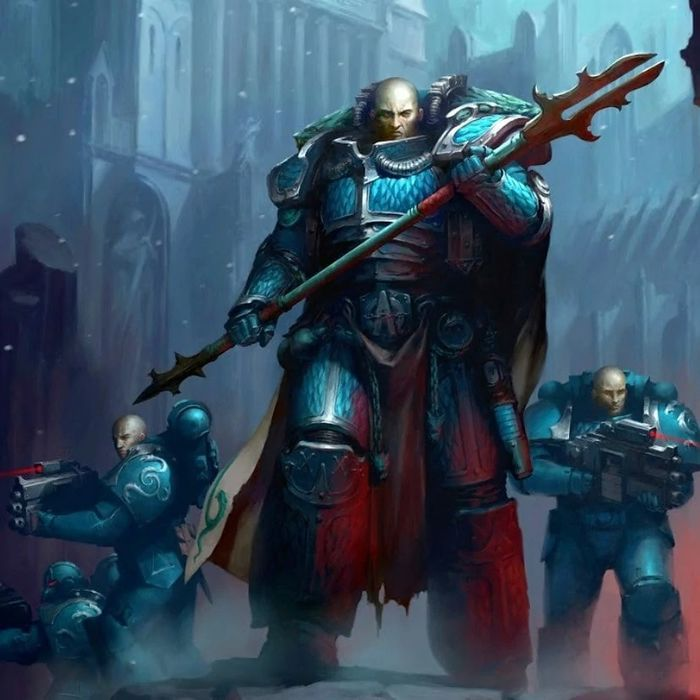
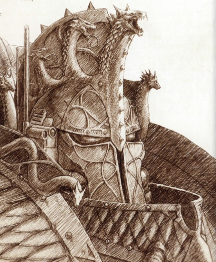
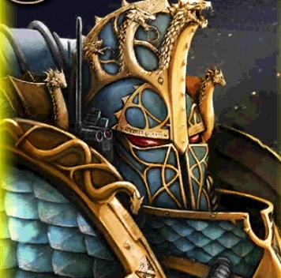
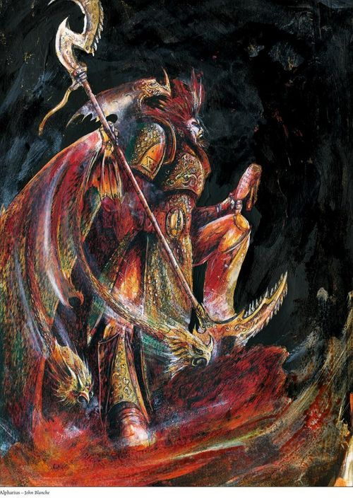
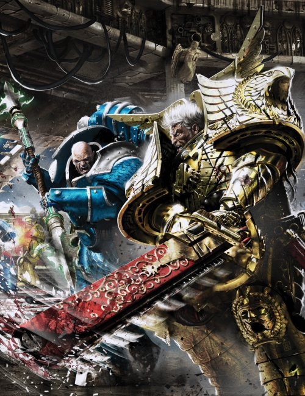

# 0715 阿尔法瑞斯·欧米伽 Alpharius Omegon

精校状态：中文行文已逐段精校，部分术语仍为暂定

分类：人类帝国 / 阿尔法军团

原文来源：https://www.bilibili.com/opus/1057106749957341189

原作者：帝国神选罐头

原文时间：编辑于 2025年08月17日 08:41

[返回分类目录](目录.md) · [全书目录](../../目录.md)

<!-- A0715-B0001 -->
**英文原文**

"I understand the conflict in your hearts, how one may beat for duty while the other bleeds for your Legion brothers who will be sacrificed. But this is civil war. It is a time of confusion, and realigned loyalty. We have many heads but we act as one – one Legion with a single will. We are a union of the alike and the like-minded. We will not tolerate treachery. We will not allow our compact to fracture. We will not suffer the shortsightedness of our brother Legions, nor the averted gaze of the wider Imperium. We are Alpha Legion and we take the long view."- Omegon

<!-- /A0715-B0001 -->

<!-- A0715-B0002 -->

原译文

“我理解你们心中的矛盾，明白你们内心的一种情感因职责而跳动，而另一种情感则为那些即将被牺牲的军团兄弟而伤痛流血。但这是一场内战，是一个充满混乱、忠诚需要重新调整的时期。我们有众多成员，但行动起来却如一体 — 一个有着统一意志的军团。我们是由相似之人和志同道合者组成的联盟。我们绝不容忍背叛行径。我们不会允许我们的契约破裂。我们不会忍受我们兄弟军团的短视，也不会忍受帝国更广泛层面的漠视。我们是阿尔法军团，我们目光长远。” - 欧米伽

**校订译文**

“我明白你们双心之中的矛盾：一颗为职责跳动，另一颗却为那些即将被牺牲的军团兄弟滴血。但这是内战，是混乱与忠诚重组的时代。我们虽有多首，却行动如一——一个军团，一种意志。我们因彼此相似、志向相同而结合。我们绝不容忍背叛，不容许盟约分崩离析。我们不会接受兄弟军团的短视，也不会对更广大帝国的视而不见甘之若素。我们是阿尔法军团，我们目光长远。”——欧米伽

**校注：** hearts、one ... the other 对应星际战士双心，并与多首一体的九头蛇意象呼应；原译泛化为两种情感，现恢复身体隐喻。

<!-- /A0715-B0002 -->

<!-- A0715-B0003 -->
**英文原文**

Alpharius Omegon (also known as the Last Primarch or the Lord of Serpents) was a pair of the 20 Primarchs created by the Emperor in the earliest days of the Imperium, just after the end of the Age of Strife. Like the other Primarchs, he was supposedly scattered from Terra by the Gods of Chaos and placed on a far-away world in an attempt to prevent the coming of the Age of the Imperium. In truth, Alpharius Omegon are twins known as Alpharius and Omegon respectively, though they describe themselves as one soul in two bodies. While often considered the last Primarch to be discovered, they may have been the first. However, according to Alpharius himself, this account is a lie.

<!-- /A0715-B0003 -->

<!-- A0715-B0004 -->

原译文

阿尔法瑞斯·欧米伽（也被称为最终原体或蛇之主）是帝皇在帝国初期，即纷争时代结束后创造的20位原体中的一对。与其他原体一样，他被混沌诸神从泰拉分离，并被安置在一个遥远的世界，试图阻止帝国时代的到来。事实上，阿尔法瑞斯·欧米伽是双胞胎，分别被称为阿尔法瑞斯和欧米伽，尽管他们将自己描述为两个身体中的一个灵魂。虽然他们通常被认为是最后一位被发现的原体，但他们可能是第一位。然而，根据阿尔法瑞斯本人的说法，这个说法是谎言。

**校订译文**

阿尔法瑞斯·欧米伽，又称最终原体或蛇之主，是帝皇在纷争时代结束后、帝国初创时期制造的二十位原体中的双生存在。按照通常说法，他与其他原体一样，被混沌诸神从泰拉抛往遥远世界，以阻挠帝国时代的到来。实际上，阿尔法瑞斯与欧米伽是双胞胎，自称“一魂双身”。他们通常被认为是最后寻回的原体，却也可能是最先被找到的。不过，阿尔法瑞斯本人又声称，这段记述是谎言。

**校注：** 原文以二十位原体的编列叙述双生存在，保持既有计数与身份疑点，不据设定记忆另改总数。

<!-- /A0715-B0004 -->

<!-- A0715-B0005 图片 -->

<!-- A0715-B0006 -->

原译文

Alpharius Omegon 阿尔法瑞斯·欧米伽

**校订译文**

Alpharius Omegon 阿尔法瑞斯·欧米伽

<!-- /A0715-B0006 -->

<!-- A0715-B0007 -->
**英文原文**

"Alpharius Omegon" is an enigmatic figure within the history of the Legiones Astartes. No definitive record of their appearances and activities exist. There are claims that Alpha Legion Marines assumed the name and identity during wars and even council meetings with other Legions and Imperial officials, that Alpharius was somehow able to duplicate himself, and that he had a twin. Reports of his physical appearance seem to widely differ.

<!-- /A0715-B0007 -->

<!-- A0715-B0008 -->

原译文

“阿尔法瑞斯·欧米伽”是阿斯塔特军团历史上的一个神秘人物。他们的出现和活动没有明确的记录。有说法称，阿尔法军团星际战士在战争期间甚至在与其他军团和帝国官员的议会会议上都使用了这个名字和身份，阿尔法瑞斯不知何故能够复制自己，而且他有一个双胞胎。关于他的外貌的报道似乎大相径庭。

**校订译文**

“阿尔法瑞斯·欧米伽”是阿斯塔特军团历史中的谜团。他们的外貌与活动没有确凿记录。有说法称，阿尔法军团战士曾在战场上，乃至与其他军团及帝国官员议事时，冒用原体的姓名与身份；也有人说阿尔法瑞斯能够复制自身，或拥有孪生兄弟。不同报告对其外貌的描述相差甚远。

<!-- /A0715-B0008 -->

<!-- A0715-B0009 -->
## Secrets and Lies 秘密与谎言

<!-- /A0715-B0009 -->

<!-- A0715-B0010 -->
**英文原文**

"This is my record. And all the records are lies"- Alpharius

<!-- /A0715-B0010 -->

<!-- A0715-B0011 -->

原译文

“这是我的记录。而所有的记录都是谎言。” - 阿尔法瑞斯

**校订译文**

“这是我的记录。而所有的记录都是谎言。” - 阿尔法瑞斯

<!-- /A0715-B0011 -->

<!-- A0715-B0012 -->
**英文原文**

It should be noted that the Alpha Legion's trademark secrecy extends to records of their Primarch. Little recorded information on his background exists, and almost all of what is currently known by the Imperium comes from the information provided by Inquisitor Kravin of the Ordo Malleus. Inquisitor Kravin was subsequently believed to have been tainted by the Alpha Legion and his current whereabouts are unknown. Hence, much of the Imperial data concerning the Primarch could be considered suspect, and indeed there are some who believe the whole Kravin affair was an Alpha Legion plot to plant misinformation in the Imperial records.

<!-- /A0715-B0012 -->

<!-- A0715-B0013 -->

原译文

应该指出的是，阿尔法军团的标志保密性延伸到他们的原体的记录。关于他的背景记录很少，帝国目前所知的几乎所有信息都来自圣锤修会的审判官克拉文提供的信息。审判官克拉文随后被认为受到阿尔法军团的污染，目前下落不明。因此，帝国关于原体的大部分数据都可能被认为是可疑的，事实上，有些人认为整个克拉文事件是阿尔法军团在帝国记录中植入错误信息的阴谋。

**校订译文**

阿尔法军团惯于保密，就连原体的档案也不例外。关于其出身的记录寥寥无几，帝国目前掌握的信息几乎都来自恶魔审判庭审判官克拉文。后来，人们怀疑克拉文已受阿尔法军团影响，而他本人也下落不明。因此，有关原体的大部分帝国档案都值得怀疑。甚至有人认为，整个克拉文事件就是阿尔法军团向帝国记录植入假情报的阴谋。

<!-- /A0715-B0013 -->

<!-- A0715-B0014 图片 -->

<!-- A0715-B0015 -->

原译文

Alpharius 阿尔法瑞斯

**校订译文**

Alpharius 阿尔法瑞斯

<!-- /A0715-B0015 -->

<!-- A0715-B0016 -->
**英文原文**

The greatest secret about the Alpha Legion Primarch is apparently told to none outside the Legion as unlike any of the other Primarchs, Alpharius has an identical twin: Omegon. It is unknown if the Emperor designed this, or was ever even aware of it. Upon their supposed reunion on Bar'Savor, the twins speculated that the Emperor may have kept their existences hidden from one another while it was equally possible they split into two beings while scattered in the Warp. Alpharius and Omegon are both the Primarch of the Legion, although 'Alpharius' is the public face and appears as the more senior of the two. Though as both are identical it is possible for them to switch roles and have 'Omegon' play the public role. Supposedly from their first meeting and at least several times after, 'Omegon' appeared before the small court of Horus instead of Alpharius. They have been described as "one soul in two bodies" and collectively have been referred to as simply "Alpharius Omegon".

<!-- /A0715-B0016 -->

<!-- A0715-B0017 -->

原译文

关于阿尔法军团原体的最大秘密显然没有告诉军团以外的任何人，因为与其他任何原体不同，阿尔法瑞斯有一个一模一样的双胞胎：欧米伽。目前尚不清楚帝皇是否设计了这个，或者甚至是否意识到了这一点。当他们在巴尔’萨沃重聚时，这对双胞胎猜测帝皇可能对他们的存在保密，而他们在亚空间中分散时分裂成两个人的可能性是一样的。阿尔法瑞斯和欧米伽都是军团的原体，尽管“阿尔法瑞斯”是公开的面孔，看起来是两者中更高级的。尽管两者完全相同，但它们可以切换角色，让“欧米伽”扮演公开角色。据推测，从他们的第一次会面开始，至少在几次会面之后，“欧米伽”出现在荷鲁斯的小法庭上，而不是阿尔法瑞斯。他们被描述为“两个身体中的一个灵魂”，统称为“阿尔法瑞斯·欧米伽”。

**校订译文**

这位原体最大的秘密，似乎从未向军团外人透露：与其他原体不同，阿尔法瑞斯有一个外貌完全相同的孪生兄弟——欧米伽。无人知道这是帝皇有意设计，还是连他本人也不知情。据说，两人在巴尔’萨沃重逢时曾猜测，帝皇或许刻意不让他们知道彼此的存在，也可能是他们被抛散于亚空间时，一分为二。两者同为军团原体，但“阿尔法瑞斯”是公开身份，看起来也居于主导地位。由于二人面容一致，他们可以互换角色，由“欧米伽”承担公开活动。据称，与荷鲁斯首次会面时，以及此后至少数次出席其核心圈子的聚会时，露面的都是欧米伽，而非阿尔法瑞斯。两人被称为“一魂双身”，合称“阿尔法瑞斯·欧米伽”。

<!-- /A0715-B0017 -->

<!-- A0715-B0018 -->
**英文原文**

Despite their close bond and describing themselves as two halves of the same soul, Omegon's loyalties may not lie with his brothers (or vice-versa). During the Horus Heresy Omegon (or perhaps really Alpharius) took suspicious steps against his brother. This included sending troops on a suicide mission to destroy a Pylon array preventing the White Scars learning about Horus' betrayal without his brothers apparent knowledge. Afterwards, an Alpha Legion fleet that may have been under Omegon's command did not follow Horus's orders to join with the White Scars, but instead seemingly provoked them into hostilities after blockading them long enough for Jaghatai Khan to receive a message from Rogal Dorn warning of Horus' treachery. However, Alpharius and Omegon may not see completely eye to eye as the former is more accepting of civilian deaths than the latter. By the time of the Siege of Terra Omegon, posing as Alpharius, openly removed the Alpha Legion from the traitor war effort to take the Throneworld, though he offered a map of the Sol System's defenses as a parting gift.

<!-- /A0715-B0018 -->

<!-- A0715-B0019 -->

原译文

尽管他们关系密切，并将自己描述为同一灵魂的两半，但欧米伽的忠诚可能不在于他的兄弟（反之亦然）。在荷鲁斯叛乱时期，欧米伽（或者也许真的是阿尔法瑞斯）对他的兄弟采取了可疑的措施。这包括派遣部队执行自杀任务，摧毁一个水晶塔阵列，防止白色伤疤在兄弟们不知情的情况下得知荷鲁斯的背叛。之后，一支可能由欧米伽指挥的阿尔法军团舰队没有听从荷鲁斯的命令加入白色伤疤，而是在封锁他们足够长的时间后，似乎挑起了他们的敌对行动，让察合台可汗收到了罗格·多恩的信息，警告荷鲁斯的背叛。然而，阿尔法瑞斯和欧米伽可能并不完全一致，因为前者比后者更能接受平民死亡。欧米伽在泰拉围城期间假扮阿尔法瑞斯，公开将阿尔法军团从夺取王座世界的叛徒战争中移除，尽管他提供了一张太阳系防御地图作为临别礼物。

**校订译文**

尽管双生原体关系密切，自称同一灵魂的两半，欧米伽的立场却未必始终与兄弟一致，反过来也一样。荷鲁斯之乱中，欧米伽——也可能其实是阿尔法瑞斯——曾作出疑似违背另一人意愿的行动。例如，他似乎瞒着兄弟派出部队，执行摧毁干扰塔阵列的自杀任务；正是这套阵列阻止白疤获知荷鲁斯叛变。后来，一支可能由欧米伽指挥的阿尔法军团舰队没有遵令与白疤会师，反而似乎有意挑起交战。它对战区的封锁持续了足够久，使察合台可汗得以收到罗格·多恩关于荷鲁斯叛变的警告。两人在其他问题上也未必一致：阿尔法瑞斯比欧米伽更能接受平民伤亡。到泰拉围攻时期，冒充阿尔法瑞斯的欧米伽公开让军团退出叛军夺取王座世界的行动，仅留下太阳系防御图作为临别赠礼。

**校注：** preventing ... 修饰被摧毁的阵列，即阵列阻止消息传出，不是摧毁阵列以阻止白疤获知叛变。兄弟身份、动机均保持可能语气。

<!-- /A0715-B0019 -->

<!-- A0715-B0020 图片 -->

<!-- A0715-B0021 -->

原译文

Omegon 欧米伽

**校订译文**

Omegon 欧米伽

<!-- /A0715-B0021 -->

<!-- A0715-B0022 -->
**英文原文**

Much of Alpharius' history has been expanded upon in a tale given by the Primarch himself, which states that instead of being the last discovered he was instead the first and was raised upon Terra in secret. The tale is recounted in multiple places below, but despite being from Alpharius himself the Primarch states it is a lie.

<!-- /A0715-B0022 -->

<!-- A0715-B0023 -->

原译文

阿尔法瑞斯的大部分历史都在一个由原体本人讲述的故事中得到了扩展，这个故事说，他不是最后一个被发现的人，而是第一个被秘密地在泰拉上长大的人。这个故事在下面的多个地方都有叙述，但尽管来自阿尔法瑞斯本人，但原体表示这是一个谎言。

**校订译文**

原体本人讲述的一段故事，为阿尔法瑞斯的经历补充了大量细节。其中声称，他其实是第一个被找到的原体，并秘密在泰拉长大，而非最后才被寻回。下文多处引用这段自述，但即使出自本人之口，阿尔法瑞斯也明言：这是谎言。

<!-- /A0715-B0023 -->

<!-- A0715-B0024 -->
## History 历史

<!-- /A0715-B0024 -->

<!-- A0715-B0025 -->
### Pre-Heresy 叛乱前

<!-- /A0715-B0025 -->

<!-- A0715-B0026 -->
### The Ghost Legion 幽灵军团

<!-- /A0715-B0026 -->

<!-- A0715-B0027 -->
**英文原文**

Typical of the Alpha Legion's own nature, conflicting tales of how Alpharius was rediscovered by the Imperium exist. Many of the tales have been proven lies, while many more still remain unproven or unknown. A dubious account by Alpharius himself, which he states is a lie, states that he was actually the first Primarch to be found by the Emperor. According to this tale, after his scattering Alpharius re-emerged on Terra's Zharinam (aka Zhari Namco) Plateau outside the proto-Imperial Palace. The young Primarch was found by the Emperor himself, who had to kill a group of scavengers present to keep the secret safe. Thereafter, the Emperor alongside Malcador the Sigillite raised and mentored Alpharius, turning him into a being who would know the importance of the whole before the individual, secrecy, and necessity. During this time Alpharius was kept a total secret from the rest of the Imperium, even as new Primarchs were rediscovered. One of his first major actions was disguising himself as a First Legion Space Marine during the Palace Coup. After testing the security of the Custodes by attempting to assassinate the Emperor in a quasi-Blood Game, Alpharius became known to Constantin Valdor.

<!-- /A0715-B0027 -->

<!-- A0715-B0028 -->

原译文

阿尔法军团本身的性质很典型，关于帝国如何重新发现阿尔法瑞斯的故事相互矛盾。许多故事已被证明是谎言，而更多的故事仍未得到证实或未知。阿尔法瑞斯自己的一个可疑的说法，他说这是一个谎言，他说他实际上是帝皇发现的第一位原体。根据这个故事，在他分散之后，阿尔法瑞斯重新出现在原皇宫外的泰拉的扎里南（又名扎日-南木错）高原上。这位年轻的原体被帝皇发现了，他不得不杀死一群在场的拾荒者来保护这个秘密的安全。此后，帝皇与掌印者马卡多一起抚养和指导了阿尔法瑞斯，使他成为一个在个人、秘密和必要性之前知道整体重要性的人。在此期间，即使新的原体被重新发现，阿尔法瑞斯也对帝国的其他成员完全保密。他的第一个主要行动之一是在皇宫政变期间伪装成第一军团星际战士。在试图通过一场血腥游戏暗杀帝皇来测试禁军的安全性后，阿尔法瑞斯被康斯坦丁·瓦尔多所知。

**校订译文**

与阿尔法军团的作风一致，帝国如何寻回阿尔法瑞斯，也流传着彼此矛盾的版本。许多已被证实为谎言，更多仍真伪不明。在那份由阿尔法瑞斯自述、又被他自己称作谎言的可疑记录中，他宣称自己才是帝皇找到的第一位原体。依此说法，他被抛散后，重新出现在泰拉早期皇宫外的扎里南高原，又称扎日-南木错高原。帝皇亲自找到幼年的他，并杀死在场的一群拾荒者，以守住秘密。此后，帝皇与掌印者马卡多秘密抚养、教导他，使他懂得整体利益高于个人，也懂得保密与必要取舍的重要性。即使其他原体陆续被寻回，他的存在也始终未向帝国公开。他最早的重要行动之一，是在皇宫政变期间伪装成第一军团的星际战士。后来，他以类似鲜血游戏的方式尝试刺杀帝皇，检验禁军防卫，康斯坦丁·瓦尔多这才知晓他的存在。

**校注：** the whole before the individual 与 secrecy、necessity 是并列教育内容；原译将秘密、必要性误接成整体所优先超越的对象。quasi-Blood Game 为类似鲜血游戏的行动。

<!-- /A0715-B0028 -->

<!-- A0715-B0029 -->
**英文原文**

Meanwhile, Omegon emerged far from Terra on an empty nameless world. Living alone on the empty planet, Omegon was nonetheless able to come to understand that he was a manufactured being. On the abandoned world, the young Omegon discovered the Xenos weapon that would become known as the Pale Spear. When a group of human pirates arrived on his planet, Omegon was able to steal their ship and escape. He began a long journey towards Imperial-held systems, hearing tales of the Emperor, Primarchs, and Space Marines.

<!-- /A0715-B0029 -->

<!-- A0715-B0030 -->

原译文

与此同时，欧米伽出现在远离泰拉的一个空荡荡的无名世界上。尽管独自生活在这个空荡荡的星球上，欧米伽还是意识到自己是一个被制造出来的人。在这个被遗弃的世界上，年轻的欧米茄发现了后来被称为“苍白之矛”的异型武器。当一群人类海盗抵达他的星球时，欧米伽能够偷走他们的船并逃跑。他开始了一段通往帝国控制星系的漫长旅程，听到了帝皇、原体和星际战士的故事。

**校订译文**

与此同时，欧米伽出现在远离泰拉的一颗无名荒星。尽管独自生活，他仍逐渐意识到，自己是被人为创造的存在。在这片被遗弃的土地上，他发现了一件异形武器，后来称为苍白之矛。一群人类海盗抵达后，他盗走对方的飞船逃离，踏上前往帝国控制星系的漫长旅程，并沿途听闻帝皇、原体与星际战士的传说。

<!-- /A0715-B0030 -->

<!-- A0715-B0031 -->
**英文原文**

The dubious account by Alpharius goes on to state that as the Great Crusade continued, Alpharius secretly accompanied the Emperor in the rediscovery of several Primarchs. Alpharius was present as a disguised Space Marine when the Emperor came before Lion El'Jonson and Lorgar. In between these endeavors, he continued to lead the XXth Legion, the Ghost Legion, in covert operations across the Galaxy. During this time, he gathered around him a group of loyal Captains which included Armillus Dynat, Akil Gukul, Eitan, Ingo Pech, Mathias Herzog, Kel Silonius, Sheed Ranko, and Autilon Skorr. Continuing to keep both his and his Legion's existence hidden, Alpharius presented himself before Lion El'Jonson to offer aid during the Rangdan Xenocides and perhaps cultivate him for Warmaster over Horus. Alpharius saw the Lion as the Primarch most like him, though he continued his deceptions before the Lord of the First. During the Xenocides, Alpharius identified himself by name but denied being a Primarch.

<!-- /A0715-B0031 -->

<!-- A0715-B0032 -->

原译文

阿尔法瑞斯的可疑说法接着说，随着大远征的继续，阿尔法瑞斯秘密陪同帝皇重新发现了几位原体。当帝皇来到莱昂·艾尔庄森和珞珈面前时，阿尔法瑞斯伪装成星际战士。在这些努力之间，他继续领导第二十军团，幽灵军团，在整个银河系进行秘密行动。在此期间，他召集了一群忠诚的连长，其中包括阿尔梅琉斯·迪纳特、阿基尔·古库尔、埃坦、因戈·佩奇、马蒂亚斯·赫尔佐格、凯尔·西罗尼乌斯、希德·兰科和奥蒂隆·斯科尔。阿尔法瑞斯继续隐瞒他和他的军团的存在，在冉丹种族灭绝期间，他出现在莱昂·艾尔庄森面前，提供援助，也许为战帅培养他。阿尔法瑞斯认为莱昂是最像他的原体，尽管他在第一军团之主面前继续欺骗。在种族灭绝期间，阿尔法瑞斯公开了自己的名字，但否认自己是一名原体。

**校订译文**

这份可疑自述还称，大远征继续推进时，阿尔法瑞斯曾秘密随帝皇寻回数位原体。帝皇与莱昂·艾尔’庄森、珞珈相见时，他都伪装成普通星际战士在场。在这些行动的间隙，他继续率第二十军团——幽灵军团——在银河各处执行秘密任务。他身边聚集了一批忠诚连长，包括阿尔梅琉斯·迪纳特、阿基尔·古库尔、埃坦、英戈·佩奇、马蒂亚斯·赫尔佐格、凯尔·西罗尼乌斯、谢德·兰科，以及奥帝隆·斯考尔。冉丹灭绝战争期间，他一面继续隐瞒自己与军团的真正身份，一面向莱昂提供援助，或许还想扶持其成为战帅，取代荷鲁斯作为人选。阿尔法瑞斯认为莱昂是最像自己的原体，却仍对这位第一军团之主保持欺瞒。他在战争期间报出了自己的名字，但否认自己是原体。

**校注：** cultivate him for Warmaster over Horus 指支持莱昂取代荷鲁斯成为战帅人选，并非笼统培养其能力。人名与冉丹灭绝战争均沿已定核心。

<!-- /A0715-B0032 -->

<!-- A0715-B0033 -->
**英文原文**

During the Rangdan Xenocides Alpharius finally received the information that he had long been waiting for, eventually coming to the world of Bar'Savor. After battling through Slaugth, Alpharius and his squad were finally able to meet Omegon, who had been battling the Xenos of the world on his own. The twins immediately recognized one another. With their "split soul" finally reunited, Alpharius and Omegon agreed the time was right to formally reveal themselves to the Imperium at large while keeping the nature of their dual existence hidden from even the Emperor, though they were not sure if he was truly unaware of it. The twin Primarch subsequently orchestrated their coming encounter with Horus, though it was Omegon who took on the title of Alpharius during the incident.

<!-- /A0715-B0033 -->

<!-- A0715-B0034 -->

原译文

在冉丹大屠杀期间，阿尔法瑞斯终于得到了他一直在等待的信息，最终来到了巴尔’萨沃世界。在经历了与史洛斯人的战斗后，阿尔法瑞斯和他的小队终于能够见到欧米伽，他一直在独自与世界上的异型作战。这对双胞胎立刻认出了对方。随着他们“分裂的灵魂”最终重聚，阿尔法瑞斯和欧米伽一致认为，现在是正式向整个帝国暴露自己的时候了，同时对帝皇隐瞒他们双重存在的本质，尽管他们不确定他是否真的不知道这一点。这对双胞胎原体随后策划了他们即将与荷鲁斯的相遇，尽管在事件中欧米伽获得了阿尔法瑞斯的头衔。

**校订译文**

冉丹灭绝战争期间，阿尔法瑞斯终于得到等待已久的消息，前往巴尔’萨沃。他与小队一路突破史洛斯的阻击，最终见到一直独自与当地异形作战的欧米伽。双生者立刻认出了彼此。“分裂的灵魂”重新相聚后，他们认为，是时候正式向帝国公开原体身份了，但双生之秘仍要隐瞒，甚至不向帝皇透露——尽管他们也不确定帝皇是否真的一无所知。于是，两人策划了与荷鲁斯的相遇，而在那次事件中，承担“阿尔法瑞斯”身份的是欧米伽。

<!-- /A0715-B0034 -->

<!-- A0715-B0035 -->
### From the Shadows 来自阴影

<!-- /A0715-B0035 -->

<!-- A0715-B0036 -->
**英文原文**

During the encounter, Alpharius (or, according to their own account, Omegon) used a ragtag fleet of primitive one- and two-man fighters to cleverly put the advance ship of the Luna Wolves' fleet in a precarious position, which necessitated the intervention of Horus himself. Boarding the Vengeful Spirit, Omegon made his way to the bridge, killing or maiming several Luna Wolf Marines before Horus intervened. Welcoming his lost brother, Horus declared the last Primarch found before asking for his name. Omegon replied, "I am Alpharius."

<!-- /A0715-B0036 -->

<!-- A0715-B0037 -->

原译文

在遭遇战中，阿尔法瑞斯（或者根据他们自己的说法，欧米伽）使用了一支由原始单人和双人战斗机组成的杂牌舰队，巧妙地将影月苍狼舰队的先遣舰置于危险的位置，这就需要荷鲁斯本人的干预。欧米伽登上复仇之魂号，前往舰桥，在荷鲁斯介入之前，杀死或致残了几名影月苍狼星际战士。荷鲁斯欢迎他失踪的兄弟，在询问他的名字之前，宣布了最后一位找到的原体。欧米伽回答说：“我是阿尔法瑞斯。”

**校订译文**

这次相遇中，阿尔法瑞斯——按两人自述，实际是欧米伽——率一支由粗陋的单人及双人战斗机拼凑而成的舰队，巧妙地将影月苍狼的先遣舰逼入险境，迫使荷鲁斯亲自介入。欧米伽登上复仇之魂号，向舰桥推进，沿途杀死或重伤了数名影月苍狼战士，直到荷鲁斯出面阻止。荷鲁斯欢迎这位失散的兄弟，宣布最后一位原体终于寻回，然后询问他的姓名。欧米伽回答：“我是阿尔法瑞斯。”

<!-- /A0715-B0037 -->

<!-- A0715-B0038 -->
**英文原文**

It is said that instead of immediately sending him to Terra to meet the Emperor, Horus kept Alpharius with him for some months. The two formed a strong bond, with Alpharius and his ragtag alliance quickly embracing the Imperium. Both brothers were greatly impressed with each other, although Alpharius refused to reveal his homeworld, denying that each world in the system that the brothers brought into compliance was his point of origin. Eventually, Alpharius had to journey to meet his father, the Emperor. Their meeting was, as were all times when the Emperor found one of his lost sons, surrounded with much celebration. However, since the Great Crusade was in full swing, little time was spent in idle rejoicing and Alpharius was quickly given command of the XX Legion, created just a few decades before. Renamed the Alpha Legion, they followed their Primarch on the Crusade.

<!-- /A0715-B0038 -->

<!-- A0715-B0039 -->

原译文

据说，荷鲁斯没有立即派他去泰拉见帝皇，而是让阿尔法瑞斯和他在一起几个月。两人形成了牢固的联系，阿尔法瑞斯和他的乌合之众联盟迅速拥抱了帝国。兄弟俩都对彼此印象深刻，尽管阿尔法瑞斯拒绝透露他的家园世界，否认兄弟们遵守的制度中的每个世界都是他的起源。最终，阿尔法瑞斯不得不去见他的父亲，帝皇。他们的会面，就像帝皇找到一个失踪的儿子时一样，被许多庆祝活动包围着。然而，由于大远征如火如荼，几乎没有时间无所事事地庆祝，阿尔法瑞斯很快就被任命为几十年前创建的第二十军团的指挥官。他们更名为阿尔法军团，在大远征中追随他们的原体。

**校订译文**

据说，荷鲁斯没有立即将阿尔法瑞斯送往泰拉觐见帝皇，而是把他留在身边数月。两人迅速建立深厚关系，阿尔法瑞斯与其临时拼凑的同盟也很快接受帝国。双方都十分欣赏彼此，但阿尔法瑞斯拒绝透露母星。在他们收服该星系的过程中，每当问及某个世界，他都否认那是自己的故乡。最终，他还是启程去见父亲。与每次帝皇寻回失散子嗣一样，这场重逢伴随着盛大庆祝；但大远征正在紧要关头，没有多少时间停留于欢宴。阿尔法瑞斯很快被授予第二十军团指挥权。该军团据本段说法于数十年前建立，随后改称阿尔法军团，追随原体继续远征。

**校注：** 原文关于第二十军团创立时间与前文幽灵军团的自述并列存在，未强行合为一条确定历史。compliance 是使世界归顺，system 此处是星系，不是制度。

<!-- /A0715-B0039 -->

<!-- A0715-B0040 -->
**英文原文**

Alpharius quickly developed a unique approach to Astartes operations, focusing on the philosophies of initiative and flexibility, as well as extensive use of subterfuge and non-Astartes specialist operatives. This multitudinous, almost unstructured approach rankled Roboute Guilliman, Primarch of the Ultramarines, leading him to question Alpharius' approach to fighting. A violent discussion erupted between the two which was closed when Guilliman pointed to his own Legion's record, something that Alpharius could never hope to achieve, since his Alpha Legion was almost two hundred years younger than the Ultramarines. They parted company acrimoniously, Alpharius believing Guilliman hated him. He resolved to ignore the Ultramarine Primarch from then on. Alpharius' methods were further critiqued by Rogal Dorn during the World Prince Campaign.

<!-- /A0715-B0040 -->

<!-- A0715-B0041 -->

原译文

阿尔法瑞斯很快开发了一种独特的阿斯塔特行动方法，专注于主动性和灵活性的哲学，以及广泛使用诡计和非阿斯塔特专业特工。这种众多的、几乎无组织的方法激怒了极限战士的原体罗伯特·基里曼，导致他质疑阿尔法瑞斯的战斗方法。两人之间爆发了一场激烈的讨论，当基里曼指出他自己的军团记录时，这场讨论结束了，这是阿尔法瑞斯永远不可能实现的，因为他的阿尔法军团比极限战士年轻近200岁。他们激烈地分开了，阿尔法瑞斯认为基里曼恨他。从那时起，他决定不去理会这位极限战士原体。在世界王子战役期间，罗格·多恩进一步批评了阿尔法瑞斯的方法。

**校订译文**

阿尔法瑞斯很快发展出独特的阿斯塔特作战方法，强调主动性与灵活性，大量运用欺敌手段和非阿斯塔特的专业特工。这套手段繁复、近乎无固定章法的作风令极限战士原体罗保特·基里曼不满，进而质疑他的战法。两人激烈争论，直到基里曼搬出本军团的辉煌战绩，争执才告结束。阿尔法军团成立晚了近两百年，阿尔法瑞斯根本不可能有同等积累。双方不欢而散，他认定基里曼憎恨自己，决定此后不再理会这位兄弟。世界王子战役期间，罗格·多恩也对他的做法提出批评。

<!-- /A0715-B0041 -->

<!-- A0715-B0042 -->
**英文原文**

However, the criticisms stuck; Alpharius began to push his Legion even further. More and more were the situations where he would take the more difficult course of action to force his Space Marines to grow. Plans were more complex, more subtle, while at the same time relying on more and more factors to achieve victory. Training was more intense and new strategies and approaches were constantly developed, as Alpharius sought to prove the worth of both his Legion and his martial philosophy.

<!-- /A0715-B0042 -->

<!-- A0715-B0043 -->

原译文

然而，批评依然存在；阿尔法瑞斯开始进一步推动他的军团。越来越多的情况是，他会采取更困难的行动来迫使他的星际战士成长。计划更加复杂，更加微妙，同时依靠越来越多的因素来取得胜利。训练更加激烈，新的策略和方法不断发展，因为阿尔法瑞斯试图证明他的军团和他的军事哲学的价值。

**校订译文**

但这些批评始终令阿尔法瑞斯耿耿于怀，他开始更严苛地要求军团，越来越多地选择更困难的行动方案，迫使战士成长。计划愈发复杂、隐秘，制胜所依赖的条件也越来越多。训练不断加强，新的战术与方法接连出现；他要证明的不仅是军团的价值，也是自身战争理念的价值。

<!-- /A0715-B0043 -->

<!-- A0715-B0044 -->
### Heresy 叛乱

<!-- /A0715-B0044 -->

<!-- A0715-B0045 -->
**英文原文**

It has long been supposed that since Alpharius was only familiar with one other Primarch, Horus, it was self-explanatory why he chose the side he did at the outset of the Heresy. Indeed, the very plan at Isstvan V where Horus struck his first blow against his fellow Legions by destroying most of the Iron Hands, Raven Guard, and Salamanders Legions in a massive ambush was very reminiscent of plans that Alpharius had created in the past. However, it is possible that there is another reason for Alpharius leading his Legion to the side of the traitors, a secret known only inside the Legion. Around two years before the beginning of the Heresy, Alpharius Omegon was apparently contacted by members of a Xenos organisation called the Cabal who brought to him visions of the impending civil war within the Imperium and expanded knowledge of the nature and designs of Chaos. It is believed that the Cabal convinced Alpharius that the only way to permanently defeat Chaos was to ensure that Horus was victorious. It is perhaps for this reason that Alpharius Omegon, secretly true to the Imperium and loyal to the Emperor, may have chosen to join the heretics.

<!-- /A0715-B0045 -->

<!-- A0715-B0046 -->

原译文

长期以来，人们一直认为，由于阿尔法瑞斯只熟悉另一位原体荷鲁斯，因此他叛乱开始时选择的立场是不言而喻的。事实上，在伊斯塔万五号的计划中，荷鲁斯通过大规模伏击摧毁了钢铁之手、暗鸦守卫和火蜥蜴军团的大部分，对他的军团同伴进行了第一次打击，这让人想起了阿尔法瑞斯过去制定的计划。然而，阿尔法瑞斯带领他的军团站在叛徒一边可能还有另一个原因，这个秘密只有军团内部知道。在叛乱开始前大约两年，阿尔法瑞斯·欧米伽显然与一个名为密教的异型组织的成员取得了联系，他们向他带来了帝国内部即将发生的内战的愿景，并扩展了对混沌本质和设计的了解。据信，密教说服了阿尔法瑞斯，永久击败混沌的唯一方法是确保荷鲁斯获胜。也许正是出于这个原因，秘密忠于帝国并忠于帝皇的阿尔法瑞斯·欧米伽可能选择加入叛乱。

**校订译文**

长期以来，人们认为，阿尔法瑞斯唯一熟悉的原体兄弟就是荷鲁斯，因此他在叛乱初起时的选择并不难理解。伊斯塔万五号的大伏击几乎摧毁钢铁之手、暗鸦守卫与火蜥蜴的主力，也确实与他过去的计划极为相似。不过，他率军团加入叛军，或许另有一个仅军团内部知晓的理由。叛乱爆发约两年前，一个名为密教的异形组织据称接触了双生原体，向他们展示帝国即将内战的异象，并揭示更多混沌的本质与图谋。据说，密教使阿尔法瑞斯相信，若要永远击败混沌，就必须让荷鲁斯获胜。也许正因如此，仍暗中忠于帝国与帝皇的阿尔法瑞斯·欧米伽，才选择投入叛军阵营。

**校注：** 该段解释叛变动机始终使用 supposed、possible、believed、perhaps，校译保留推测性质，不断言双生原体确为忠诚派。

<!-- /A0715-B0046 -->

<!-- A0715-B0047 图片 -->

<!-- A0715-B0048 -->

原译文

Alpharius, Primarch of the Alpha Legion 阿尔法瑞斯，阿尔法军团原体

**校订译文**

Alpharius, Primarch of the Alpha Legion 阿尔法瑞斯，阿尔法军团原体

<!-- /A0715-B0048 -->

<!-- A0715-B0049 -->
**英文原文**

Later on during the Heresy, the Cabal sought to lead Alpharius's and Omegon's actions in order to make Horus's victory easier. One such action was the ordeal against the Raven Guard with the intent of preventing Corax from rebuilding his legion after the blow struck on Isstvan V. Some Alpha Legion marines were infiltrated, under the direction of Omegon, in the Raven Guard thanks to Alpha Legion apothecaries grafting the facial traits of some dead Raven Guards over the face of their own legionaries. Once known, through their infiltrators, that the original genome of the Primarchs was in the hands of Corax, Omegon acted in order to recover the secret knowledge so the Alpha Legion could be expanded in future times. With the help of renegade Mechanicum magos Unithrax, the Alpha Legion tainted the original genome recovered from the laboratories of The Emperor on Terra. This was accomplished introducing a virus-vectored mutagen based on daemonic blood making the successive Raven Guard implantation's result in operational but deeply-mutated Astartes exhibiting scales, horns, fangs, tails, overgrown muscles and similar features. Meanwhile, Omegon bound to his service, although not directly consistent of the fact, both a renegade Mechanicus faction and some representatives of the ancient and noble guilds of Kiavahr. He pushed them to open rebellion against the Raven Guard and, in the chaos resulting from the battle, he personally recovered all data stored in Corax laboratories as well as the tainted original genome. In the aftermath, Alpharius was obliged to give the obtained data to Horus who handed them to Fabius Bile for deeper research. What Bile did not know, was that the data were practically useless since it was incomplete at best. Of course, the Alpha Legion kept for itself the integral data as well as the corrupted genome. Alpharius' plan had always been to use the data to raise the Alpha Legion over all other legions, loyalists and traitors. After this, Omegon left the Cabal representative Athithirtir on board his ship into the void stating that the legion would fulfill its engagement on its own, without external interference or control.

<!-- /A0715-B0049 -->

<!-- A0715-B0050 -->

原译文

后来在叛乱期间，密教试图领导阿尔法瑞斯和欧米伽的行动，以使荷鲁斯的胜利更容易。其中一项行动是对暗鸦守卫的考验，目的是防止科拉克斯在伊斯塔万五号遭受打击后重建他的军团。由于阿尔法军团药剂师将一些死去的暗鸦守卫士兵的面部特征移植到他们自己的军团士兵的脸上，一些阿尔法军团星际战士在欧米伽的指导下渗透到暗鸦守卫。一旦通过他们的渗透者知道原体的原始基因组掌握在科拉克斯手中，欧米伽就采取行动，以恢复秘密知识，以便阿尔法军团在未来得到扩展。在叛徒机械教贤者尤尼斯拉克斯的帮助下，阿尔法军团污染了从泰拉上的帝皇实验室中恢复的原始基因组。这是通过引入一种基于恶魔血的病毒载体诱变剂实现的，这种诱变剂连续使暗鸦守卫的植入手术产生了可操作但深度突变的阿斯塔特，表现出鳞片、角、尖牙、尾巴、过度生长的肌肉和类似的特征。与此同时，欧米伽效命于他，尽管这一事实并不直接符合以下情况，即既存在一个叛变的机械教派别，又有基亚瓦尔古老而高贵的行会的一些代表。他推动他们公开反抗暗鸦守卫，在战斗造成的混乱中，他亲自恢复了存储在科拉克斯实验室的所有数据以及受污染的原始基因组。之后，阿尔法瑞斯不得不将获得的数据交给荷鲁斯，荷鲁斯将这些数据交给法比乌斯·拜耳进行更深入的研究。拜耳不知道的是，这些数据实际上是无用的，因为它充其量是不完整的。当然，阿尔法军团为自己保留了完整的数据以及损坏的基因组。阿尔法瑞斯的计划一直是利用这些数据将阿尔法军团提升到所有其他军团、忠诚者和叛徒之上。在此之后，欧米伽将密教代表阿西蒂尔留在他的船上，声称军团将在没有外部干扰或控制的情况下自行完成任务。

**校订译文**

叛乱期间，密教继续试图操纵双生原体的行动，促使荷鲁斯更容易取胜。破坏暗鸦守卫的重建便是其中一环：伊斯塔万五号的重创之后，他们不愿科拉克斯恢复军团实力。在欧米伽指挥下，药剂师将阵亡暗鸦守卫的面容移植到本军团战士脸上，协助他们潜入敌军。得知科拉克斯掌握原体的基础基因组后，欧米伽便设法夺取秘密，以便日后扩充阿尔法军团。在变节机械教贤者尤尼斯拉克斯的帮助下，他们将一种由恶魔之血制成、以病毒为载体的诱变剂注入取自帝皇泰拉实验室的原始基因组，使后续培育出的暗鸦守卫虽然仍能作战，却长出鳞片、角、獠牙、尾巴或异常膨大的肌肉，发生严重突变。同时，欧米伽还暗中驱使一个变节机械修会派系，以及基亚瓦尔古老贵族行会的一些代表，为自己效力。他煽动他们公开反抗暗鸦守卫，趁战乱亲自夺走科拉克斯实验室中的全部数据与受污染的原始基因组。事后，阿尔法瑞斯不得不将所得数据交给荷鲁斯，后者又转交法比乌斯·拜尔深入研究。但拜尔并不知道，这份资料残缺不全，实际上几无用处；完整数据与污染后的基因组都被阿尔法军团留下。阿尔法瑞斯始终打算借此凌驾于所有其他军团之上，无论忠诚派还是叛徒。随后，欧米伽将乘船的密教代表阿提西尔提尔留在虚空中，声称军团会自行履约，不再接受外部干涉或控制。

**校注：** 原文 although not directly consistent of the fact 语法不通，按上下文明确的驱使关系译，不强加自愿效忠。末句 left ... on board his ship into the void 同样不清，保留乘船留于虚空，不擅断将本人无防护抛入太空或其死亡。

<!-- /A0715-B0050 -->

<!-- A0715-B0051 -->
**英文原文**

Later in the Heresy, Alpharius dispatched forces to attempt and block the White Scars from leaving the Chondax Campaign and joining loyalist forces. The White Scars were alerted to the Heresy after Omegon initiated a mission to destroy a jamming array. Despite a fierce battle with the White Scars, these ships may not have been armed, further compounding the true nature of Alpharius and/or Omegon. Alpharius went on to corner the Space Wolves under Leman Russ himself, nearly destroying them and dueling Russ while disguised as one of his own Lernaean bodyguards. Victory seemed certain for Alpharius until he was forced to withdraw after the loyalists received Dark Angels reinforcements.

<!-- /A0715-B0051 -->

<!-- A0715-B0052 -->

原译文

在叛乱的后期，阿尔法瑞斯派遣部队试图阻止白色伤疤离开香德克斯战役并加入效忠派部队。在欧米伽发起摧毁干扰阵列的任务后，白色伤疤被警告叛乱。尽管与白色伤疤进行了激烈的战斗，但这些船只可能没有武装，这进一步加剧了阿尔法瑞斯和/或欧米伽的真实性质。阿尔法瑞斯继续在黎曼·鲁斯本人的带领下将太空野狼逼入绝境，几乎摧毁了他们，并在伪装成自己的勒拿护卫时与鲁斯决斗。阿尔法瑞斯的胜利似乎是确定的，直到他在效忠者得到黑暗天使的增援后被迫撤退。

**校订译文**

此后，阿尔法瑞斯派部队阻止白疤离开香德克斯战场、加入忠诚派。然而，欧米伽发起行动摧毁干扰阵列后，白疤得以获知叛乱。阿尔法军团虽与白疤激战，其舰船却可能并未武装，使双生原体的真实立场更加扑朔迷离。随后，阿尔法瑞斯将黎曼·鲁斯亲率的太空野狼逼入绝境，几乎将其歼灭。他还伪装成自己麾下的勒拿终结者护卫，与鲁斯交手。眼看胜利在望，黑暗天使援军却赶来支援忠诚派，迫使他撤退。

**校注：** “舰船可能未武装”即使与激战并述显得可疑，亦为英文原有不确定说法，保留待核。鲁斯指挥的是太空野狼，并非阿尔法瑞斯。

<!-- /A0715-B0052 -->

<!-- A0715-B0053 -->
**英文原文**

Alpharius, or at least an Alpha Legion member claiming to be him, again appeared among a force of Shattered Legions resistance fighters. Assuming the mantle of Iron Hands leader Shadrak Meduson and garbing a unit of his own marines in Iron Hand battlegear, Alpharius' disguise was completely undetectable by the members of the Iron Hands legion he met. Travelling in a vessel that appeared to be the Iron Heart, Meduson's own flagship, Alpharius fell in with a separate unit of mixed Istvaan survivor marines under the command of Cadmus Tyro and convinced them, in his guise as Meduson, to aid him in an action against other members of the Alpha Legion. His deception was revealed towards the end of the affair, and the survivors of Tyro's force escaped with the knowledge that Alpharius had been impersonating Meduson.

<!-- /A0715-B0053 -->

<!-- A0715-B0054 -->

原译文

阿尔法瑞斯，或者至少是自称是他的阿尔法军团成员，再次出现在破碎军团抵抗战士的队伍中。披上钢铁之手领袖沙德拉克·梅杜森的斗篷，让自己的一支星际战士穿上钢铁之手战斗装备，阿尔法瑞斯的伪装完全无法被他遇到的钢铁之手军团成员察觉。阿尔法瑞斯乘坐一艘似乎是梅杜森自己的旗舰钢铁之心号的船只，在卡德摩斯·泰罗的指挥下，与一支由伊斯塔万幸存者组成的单独部队会合，并说服他们以梅杜森的名义协助他对抗阿尔法军团的其他成员。他的欺骗行为在事件接近尾声时被揭露，泰罗部队的幸存者在知道阿尔法瑞斯一直在冒充梅杜森的情况下逃脱了。

**校订译文**

后来，阿尔法瑞斯——或至少一名自称阿尔法瑞斯的军团战士——又出现在破碎军团的抵抗部队之间。他冒充钢铁之手领袖沙德拉克·梅杜森，带着一队换上钢铁之手装备的本军团战士，连真正的钢铁之手都未能看穿。他乘坐一艘外表酷似梅杜森旗舰钢铁之心号的战舰，与卡德摩斯·泰罗率领的一支伊斯塔万幸存者混编部队会合，并以梅杜森的身份说服对方，协助自己攻击另一批阿尔法军团成员。行动临近结束时，骗局败露。泰罗部队的幸存者逃离现场，也带走了阿尔法瑞斯曾冒充梅杜森的消息。

**校注：** assuming the mantle 为冒充梅杜森身份，不是实际披上他的斗篷。Tyro 指挥幸存者混编部队，并未指挥阿尔法瑞斯。

<!-- /A0715-B0054 -->

<!-- A0715-B0055 -->
### Death and Rebirth 死亡与新生

<!-- /A0715-B0055 -->

<!-- A0715-B0056 -->
**英文原文**

In preparation to infiltrate the Sol System in the Solar War, Alpharius used his Librarians to seemingly switch bodies with his trusted Harrowmaster Kel Silonius. To ensure secrecy, Alpharius also erased his own memories and took on Silonius' persona. As the real Silonius led a a fleet of 200 Alpha Legion warships into the Sol System, Alpharius led a Headhunter and human operative team in setting the stage for its arrival through acts of sabotage and preparation. During the final action, Alpharius' memories were restored by psychic trigger.

<!-- /A0715-B0056 -->

<!-- A0715-B0057 -->

原译文

为了准备在太阳战争中渗透到太阳系，阿尔法瑞斯利用他的智库似乎与他信任的折磨之主凯尔·西罗尼乌斯交换了身体。为了确保保密，阿尔法瑞斯还抹去了自己的记忆，并扮演了西罗尼乌斯的角色。当真正的西罗尼乌斯率领一支由200艘阿尔法军团战舰组成的舰队进入太阳系时，阿尔法瑞斯领导了一支猎头者和人类行动团队，通过破坏和准备行动为其到达奠定了基础。在最后的行动中，阿尔法瑞斯的记忆被灵能触发恢复了。

**校订译文**

为准备在太阳战争中潜入太阳系，阿尔法瑞斯借助智库员，似乎与心腹折磨大师凯尔·西罗尼乌斯交换了身体。为保守秘密，他还抹去自己的记忆，完全以西罗尼乌斯的身份行事。真正的西罗尼乌斯率两百艘阿尔法军团战舰驶入太阳系时，阿尔法瑞斯则率一队猎头者与人类特工，提前实施破坏，为舰队到来创造条件。最后阶段，他的记忆才由灵能信号触发恢复。

**校注：** 身体互换依英文 seemingly 保持疑似；Harrowmaster 沿561折磨大师。

<!-- /A0715-B0057 -->

<!-- A0715-B0058 -->
**英文原文**

During the subsequent Battle of Pluto Alpharius confronted Rogal Dorn in a chamber locked inside of the Hydra Fortress Moon in Pluto's orbit. He killed Archamus's team hunting him but left Archamus mortally wounded and alive to watch as Dorn teleported into the chamber. Both Dorn's Huscarls and Alpharius's Lernaeans teleported in, and the primarchs slaughtered the other's warriors. The two battled, with Alpharius dealing Dorn many wounds, using his speed to stay out of reach. Throughout the fight, he tried to convince Dorn that he was there to teach him how to win, to expose his weaknesses, that he could not win the current war, and how there needed to be a new type of war. He also claimed that Dorn didn't understand what he was fighting for, and they both cared about the future. Only he knew the truth regarding the conflict, and he did not fight for Horus, but for Dorn instead.

<!-- /A0715-B0058 -->

<!-- A0715-B0059 -->

原译文

在随后的冥王星之战中，阿尔法瑞斯在冥王星轨道上的九头蛇要塞卫星内的一个密室中与罗格·多恩对峙。他杀死了追捕他的阿坎姆斯团队，但让阿坎姆斯身受重伤，活着看着多恩传送到密室中。多恩的胡斯卡尔终结者和阿尔法瑞斯的勒拿终结者都通过传送进入，原体们屠杀了对方的战士。两人发生了战斗，阿尔法瑞斯用他的速度给多恩打了很多伤口，让多恩保持在触手可及的地方。在整个战斗过程中，他试图说服多恩，他在那里教他如何获胜，暴露他的弱点，他无法赢得当前的战争，以及如何需要一种新型的战争。他还声称多恩不明白自己在为什么而战，他们都关心未来。只有他知道这场冲突的真相，他没有为荷鲁斯而战，而是为多恩而战。

**校订译文**

随后的冥王星之战中，阿尔法瑞斯在冥王星轨道上九头蛇要塞卫星的一间封闭密室中，与罗格·多恩正面对峙。他杀死追捕自己的阿坎姆斯小队，却让身负致命伤的阿坎姆斯暂时活着，亲眼看见多恩传送进来。多恩的胡斯卡尔亲卫与阿尔法瑞斯的勒拿终结者也相继传送入室，两位原体各自屠杀了对方的战士。决斗中，阿尔法瑞斯凭速度避开多恩的攻击，并在他身上留下多处伤口。他始终试图说服多恩：自己是来揭露其弱点、教他如何获胜的；以目前的方式，多恩赢不了这场战争，必须改用一种全新的战争方式。他还声称，多恩并不明白自己究竟为何而战，两人其实都关心未来；只有他才知道冲突的真相，他也并非为荷鲁斯而战，而是为多恩。

**校注：** stay out of reach 是使对方打不到自己，原译“保持在触手可及”意思相反。胡斯卡尔亲卫与勒拿终结者按各自军团区分。

<!-- /A0715-B0059 -->

<!-- A0715-B0060 图片 -->

<!-- A0715-B0061 -->

原译文

Alpharius battles Rogal Dorn during the Heresy 荷鲁斯叛乱期间阿尔法瑞斯与罗格多恩战斗

**校订译文**

Alpharius battles Rogal Dorn during the Heresy 荷鲁斯之乱中，阿尔法瑞斯与罗格·多恩交战

<!-- /A0715-B0061 -->

<!-- A0715-B0062 -->
**英文原文**

Eventually, he tried to kill Dorn with a blow from his Sarrisanata ("Pale Spear"); Archamus saw the strike and tried to intervene, but reeled harmlessly off of the spear's haft. Archamus was unaware that Dorn had seen the strike, the Imperial Fists Primarch outplaying Alpharius by using a move he'd used against a giant Ork decades earlier by stepping into the shot and tanking it in his shoulder to pin Alpharius in place. He then grabbed the spear and sliced Alpharius's hands from his wrists before slashing him across the chest, stabbing him with his own spear, and finishing by cutting through Alpharius's skull with his mighty chainsword, Storm's Teeth.

<!-- /A0715-B0062 -->

<!-- A0715-B0063 -->

原译文

最终，他试图用他的萨里萨纳塔（“苍白之矛”）一击杀死多恩；阿坎姆斯看到了攻击并试图干预，但无害地从长矛的柄上摔了下来。阿坎姆斯不知道多恩已经看到了这次袭击，帝国之拳原体用他几十年前对付巨型欧克时使用的一个动作击败了阿尔法瑞斯，他踏入攻击范围，用肩膀扛下攻击，从而将阿尔法瑞斯钉在了原地。然后，他抓起长矛，从手腕上割下阿尔法瑞斯的手，然后砍他的胸膛，用自己的长矛刺了他一枪，最后用他强大的链锯剑风暴之牙刺穿了阿尔法瑞斯的头骨。

**校订译文**

最终，阿尔法瑞斯刺出萨里萨纳塔——苍白之矛——试图给予多恩致命一击。阿坎姆斯看见这一招，奋力阻拦，却被矛柄拨开，未能改变攻势。但他不知道，多恩早已看穿这一击。帝国之拳原体重施数十年前对付一头巨型欧克时的战法，主动迎上矛尖，以肩膀承受刺击，将阿尔法瑞斯制在原地。随后，多恩抓住长矛，斩断对方双手，劈开胸膛，再用苍白之矛反刺其身，最后挥动强大的链锯剑风暴之牙，劈开阿尔法瑞斯的头颅。

**校注：** the spear 指阿尔法瑞斯的苍白之矛，多恩夺取后反刺，不是多恩另有一杆自己的长矛；第二次以肩受矛与此前巨型欧克战法的对应保留。

<!-- /A0715-B0063 -->

<!-- A0715-B0064 -->
**英文原文**

Archamus soon passed away, but a team under his second Kestros found the primarch and the now-deceased Archamus. Dorn then hid from the loyalists Alpharius's appearance within the system and his death, promoting Kestros and others with direct knowledge of the events to Huscarl to replace those who died. Dorn sought to deny Alpharius any acknowledgment or honor. Far away, Omegon sensed the death of his twin and he grew distant. Upon being notified that Horus demanded to speak with Alpharius, Omegon took up the name and became his twin brother.

<!-- /A0715-B0064 -->

<!-- A0715-B0065 -->

原译文

阿坎姆斯很快就死去了，但他的第二个凯斯特罗斯领导的一个团队找到了这位原体和现已牺牲的阿坎姆斯。然后，多恩躲避了忠诚派阿尔法瑞斯在星系中的出现和他的死亡，将凯斯特罗斯和其他直接了解这些事件的人提拔为胡斯卡尔，以取代那些死去的人。多恩试图否认阿尔法瑞斯的任何承认或荣誉。在远处，欧米伽感觉到他的双胞胎兄弟去世了，他变得疏远了。在接到荷鲁斯要求与阿尔法瑞斯交谈的通知后，欧米伽接受了这个名字，成为了他的孪生兄弟。

**校订译文**

阿坎姆斯很快伤重而亡，其副手凯斯特罗斯率队找到多恩与他的遗体。多恩随后对其他忠诚派隐瞒了阿尔法瑞斯潜入太阳系及战死的经过，将凯斯特罗斯等亲历者提拔为胡斯卡尔亲卫，填补死者留下的空缺。他不愿让阿尔法瑞斯得到任何承认或荣誉。遥远的另一端，欧米伽感知到孪生兄弟死亡，变得沉默疏离。当他接到荷鲁斯要求与阿尔法瑞斯通话的通知时，便接过这个名字，成为了兄弟的替身。

**校注：** his second 为阿坎姆斯的副手，不是“他的第二个”；Dorn hid from the loyalists 表对忠诚派隐瞒事件，不是躲避忠诚派。

<!-- /A0715-B0065 -->

<!-- A0715-B0066 -->
**英文原文**

Alpharius (or at least an Alpha Legionnaire claiming to be him) reappeared alone on Ullanor during the muster of traitor forces there in preparation for the Siege of Terra. No other Alpha Legion forces were present in system, making many other traitors wonder how Alpharius could even be there at all. Before Horus's Dark Triumph on Ullanor, Alpharius appeared in the Warmaster's command tent and gave him a cylinder which contained a detailed layout of all of the Sol System's defenses and infrastructure. Alpharius then took out a dagger and shattered it in his hand, throwing the pieces at Horus's feet before leaving. Abaddon demanded that Horus kill him for such insolence, but the Warmaster instead let Alpharius go.

<!-- /A0715-B0066 -->

<!-- A0715-B0067 -->

原译文

阿尔法瑞斯（或至少是一名自称是他的阿尔法军团成员）在那里集结叛徒部队准备围攻泰拉期间，独自再次出现在乌兰诺。星系中没有其他阿尔法军团部队，这让许多其他叛徒想知道阿尔法瑞斯怎么会在那里。在荷鲁斯在乌兰诺的黑暗胜利之前，阿尔法瑞斯出现在战帅的指挥帐篷里，给了他一个圆柱体，里面有太阳系所有防御和基础设施的详细布局。然后，阿尔法瑞斯拿出一把匕首，在手里把它砸碎，在离开前把碎片扔在荷鲁斯的脚下。阿巴顿请求荷鲁斯因为他的无礼而杀了他，但战帅却让阿尔法瑞斯走了。

**校订译文**

叛军在乌兰诺集结、准备围攻泰拉时，阿尔法瑞斯——或至少一名自称如此的阿尔法军团战士——再次独自现身。星系中没有其他阿尔法军团部队，这令许多叛徒不明白他究竟如何到来。在荷鲁斯举行黑暗凯旋仪式之前，他进入战帅的指挥帐篷，交出一个圆筒，其中存有太阳系所有防御设施与基础设施的详细布局。随后，他取出一把匕首，在手中折碎，将碎片抛在荷鲁斯脚边，转身离去。阿巴顿要求战帅处死这个无礼之人，但荷鲁斯任其离开。

<!-- /A0715-B0067 -->

<!-- A0715-B0068 -->
### Post-Heresy 叛乱后

<!-- /A0715-B0068 -->

<!-- A0715-B0069 -->
**英文原文**

During the Heresy, Alpharius (or after his apparent death on Pluto, Omegon) appeared more interested in proving his own Legion's worth by fighting, at every chance he got, the best of the Loyalist legions. Thus, even after Horus was cast down and the Heresy over, the Alpha Legion kept on fighting, moving more and more towards the galactic east, towards the Ultramarines. It was on the world known as Eskrador that Alpharius-Omegon and Roboute Guilliman would meet for the last time.

<!-- /A0715-B0069 -->

<!-- A0715-B0070 -->

原译文

在叛乱时期，阿尔法瑞斯（或在他明显死于冥王星后，欧米伽）似乎更感兴趣的是通过抓住一切机会与最优秀的忠诚派军团作战来证明自己军团的价值。因此，即使在荷鲁斯被打倒，叛乱结束之后，阿尔法军团仍在继续战斗，越来越多地向银河系东部、向极限战士移动。阿尔法瑞斯·欧米伽和罗伯特·基里曼将在被称为埃斯卡多的世界上最后一次见面。

**校订译文**

叛乱期间，阿尔法瑞斯——或者，在他疑似死于冥王星之后的欧米伽——似乎更热衷于抓住每个机会，迎战最出色的忠诚派军团，以此证明本军团的价值。因此，荷鲁斯倒台、叛乱结束后，阿尔法军团仍未停战，而是不断向银河东部、向极限战士的领地推进。在埃斯卡多，阿尔法瑞斯·欧米伽与罗保特·基里曼据说进行了最后一次交锋。

<!-- /A0715-B0070 -->

<!-- A0715-B0071 -->
**英文原文**

Believing that Guilliman would adopt his standard Codex deployment procedures, Alpharius-Omegon was surprised by the Ultramarines, as a splinter force including their Primarch made a quick strike at the Alpha Legion's headquarters. Both Primarchs met in combat and Alpharius-Omegon was killed. Believing the combat over, for who could ever survive the loss of their Primarch in battle, the Ultramarines were taken by surprise by the remaining elements of the Alpha Legion, when they struck back a day later. After a week of constant fighting and heavy losses, the Ultramarines strike force managed to reunite with their main elements, and quickly evacuated the planet. Even though they had lost their Primarch, the Alpha Legion had soundly beaten the Ultramarines, who proceeded to bombard their foes' position from outer space. It should be noted, however, that Alpharius's death is still considered suspect even by the Ultramarines, and he may still be at large. Alpharius' apparent earlier death during the Battle of Pluto during the Heresy complicates the mystery further, as it may have been Omegon who really died on Eskrador, if at all. Many within the Alpha Legion, such as Quetzel Carthach seem to believe that it was Omegon who was slain on Eskrador, though others like Occam believe him to still be alive. Whatever the truth, the Primarch of the Alpha Legion has not been seen since.

<!-- /A0715-B0071 -->

<!-- A0715-B0072 -->

原译文

阿尔法瑞斯·欧米伽相信基里曼会采用他的标准圣典部署程序，他对极限战士感到惊讶，因为包括他们的原体在内的一支分队对阿尔法军团的总部进行了快速打击。两位原体在战斗中相遇，阿尔法瑞斯·欧米伽被杀。相信战斗已经结束，因为谁能在战斗中失去他们的原体后幸存下来，当一天后他们反击时，极限战士被阿尔法军团的剩余成员惊呆了。经过一周的持续战斗和重大损失，极限战士打击部队设法与主要部队重聚，并迅速撤离了星球。尽管他们失去了原体，阿尔法军团还是彻底击败了从外太空轰炸敌人阵地的极限战士。然而，应该指出的是，即使是极限战士，阿尔法瑞斯的死亡仍然被认为是可疑的，他可能仍然逍遥法外。阿尔法瑞斯在叛乱时期冥王星之战中的明显死亡使这个谜团更加复杂，因为如果真的死在埃斯卡多的话，可能是欧米伽。阿尔法军团中的许多人，如奎泽尔·卡尔萨克，似乎认为是欧米伽在埃斯卡多被杀，尽管奥卡姆等其他人认为他还活着。无论真相如何，阿尔法军团的原体自那以后就再也没有人见过。

**校订译文**

阿尔法瑞斯·欧米伽以为基里曼会遵循圣典惯例部署，没想到对方亲率一支分队突袭阿尔法军团指挥部。按这一记述，两位原体交手，阿尔法瑞斯·欧米伽被杀。极限战士以为战斗已经结束——毕竟，哪支部队能在战场上失去原体后继续抵抗？但一天后，阿尔法军团残部突然反击，令他们措手不及。经过一周激战并付出惨重损失，极限战士突击部队才与主力会合，迅速撤离行星。失去原体的阿尔法军团仍取得大胜，极限战士随后只能从轨道轰击其阵地。不过，连极限战士自己也怀疑阿尔法瑞斯是否真已死去，他可能仍在活动。更早的冥王星死亡事件又使谜团加深：若埃斯卡多确有一位原体战死，那也可能是欧米伽。奎泽尔·卡尔萨克等许多阿尔法军团成员似乎接受这一说法；奥卡姆等人却相信欧米伽仍然在世。无论真相如何，此后再无人确切见过阿尔法军团的原体。

**校注：** 埃斯卡多之死先按故事叙述，后保留极限战士与军团内部的质疑，不将不可靠记录改写为确定史实。

<!-- /A0715-B0072 -->

<!-- A0715-B0073 -->
**英文原文**

At some point after the Heresy, word reaches the High Lords of a Chaos Lord claiming to be Alpharius ravaging the moons of the Danevra Sub-sector. Debate rages about whether this could potentially be the case, for the Primarch’s death has been recorded more than once across the span of Imperial history. Nonetheless, the Grand Master of Assassins dispatches a force of six Vindicare Assassins. Over a number of years they identify and slay a dozen Alpha Legion champions bearing the name of Alpharius, but the reports of raids upon the sub-sector’s mining operations only intensify. Five years later, the heads of all six Vindicare Assassins are found frozen in the food storage halls of the High Lords.

<!-- /A0715-B0073 -->

<!-- A0715-B0074 -->

原译文

在叛乱之后的某个时刻，有消息传到了一位混沌领主的高级领主那里，他声称自己是阿尔法瑞斯，正在破坏达内夫拉分区的卫星。关于这种情况是否可能发生的争论非常激烈，因为在帝国历史上，原体的死亡被记录了不止一次。尽管如此，刺客大师还是派遣了一支由六名文迪卡刺客组成的部队。多年来，他们识别并杀死了十几名名为阿尔法瑞斯的阿尔法军团冠军，但关于袭击该分区采矿作业的报道只会愈演愈烈。五年后，在高领主的食品储藏室里发现了所有六名文迪卡刺客的头。

**校订译文**

叛乱后的某个时期，高领主们收到消息：一名自称阿尔法瑞斯的混沌领主，正在肆虐达内夫拉次星区的多颗卫星。原体之死在帝国历史中已有不止一次记录，这个说法是否可信，引发激烈争论。尽管如此，刺客庭大导师仍派出六名文迪卡刺客。数年间，他们辨认并杀死了十二名使用阿尔法瑞斯之名的阿尔法军团冠军，但当地采矿设施遭袭的报告反而越来越多。五年后，这六名刺客的头颅全部被发现冻藏在高领主的食品储藏室中。

**校注：** 消息接收者为帝国高领主，原译误作某混沌领主的高级领主。a dozen 为十二名；文迪卡刺客直接核对 GW09/GW10 第24页。

<!-- /A0715-B0074 -->

<!-- A0715-B0075 -->
**英文原文**

A partly redacted quote credited to Alpharius Omegon also exists, dated to around the year 123 (though the millenium is redacted). It likens the Chapter to an unpredictable serpent, and says that they have retained their identity and purpose while other Space Marines have all fallen to stagnation and damnation. It goes on to say that they are uncertain allies to the Chaos Gods, are unaffected by the lies of the xenos, and are a necessary evil to the Imperium, acting as both its poison and antidote, in an unavoidable destiny that they have created for themselves and others.

<!-- /A0715-B0075 -->

<!-- A0715-B0076 -->

原译文

还有一段部分经过编辑的引语，署名为阿尔法瑞斯·欧米伽，可追溯到123年左右（尽管千年被编辑了）。它将战团比作一条不可预测的蛇，并表示他们保留了自己的身份和目的，而其他星际战士都陷入了停滞和诅咒。它继续说，他们是混沌铸神的不确定盟友，不受异教徒谎言的影响，是帝国的必要邪恶，在他们为自己和他人创造的不可避免的命运中，既是毒药又是解药。

**校订译文**

另有一段署名阿尔法瑞斯·欧米伽的引语，部分内容已被删隐，年代约为某千年的第123年，而千年编号也遭抹去。引语将战团比作难以预测的蛇，声称其他星际战士皆已陷入停滞与堕落，唯有他们仍保有自己的身份与目标。它还宣称，他们是混沌诸神立场难测的盟友，不受异形谎言迷惑，也是帝国必不可少的恶，既是其毒药，也是解药。这是他们为自身及他人塑造的、无法逃避的命运。

**校注：** redacted 是为保密而删隐，不是普通编辑；xenos 为异形，不是异教徒。原文在此称 Chapter，保留战团称谓。

<!-- /A0715-B0076 -->

<!-- A0715-B0077 -->
## Powers of Deception 欺骗之力

<!-- /A0715-B0077 -->

<!-- A0715-B0078 -->
**英文原文**

While the Astartes of the Alpha Legion, once at least, made an attempt to all look alike, both Alpharius and Omegon were still somewhat distinctive. Taller than the rest of the Legion, slightly copper-skinned, bald and possessed of a heavy brow, they somewhat resembled their brother, Horus. Unlike him, Alpharius and Omegon had piercing eyes that seemed to glitter, appearing to shift colour from a cold arctic blue to a shimmering green. The overall impression was one of nobility and intelligence. One way to tell the two apart was when Omegon was performing as commander of Effrit Stealth Squad; large portions of his power armour and gear were painted black and otherwise darkened. The armour worn by Alpharius was not particularly different from that of an ordinary Alpha Legionnaire.

<!-- /A0715-B0078 -->

<!-- A0715-B0079 -->

原译文

虽然阿尔法军团的阿斯塔特至少有一次试图让所有人看起来都一样，但阿尔法瑞斯和欧米伽仍然有些与众不同。他们比军团的其他成员高，皮肤略呈铜色，秃顶，眉毛浓密，有点像他们的兄弟荷鲁斯。与他不同，阿尔法瑞斯和欧米伽有一双锐利的眼睛，似乎闪闪发光，颜色从冰冷的北极蓝变成了闪闪发光的绿色。总体印象是高贵和智慧。区分这两者的一种方法是，欧米伽担任埃弗里特潜行小队指挥官的时候；他的大部分动力盔甲和装备都漆成了黑色，否则就会变暗。阿尔法瑞斯所穿的盔甲与普通阿尔法军团士兵的盔甲没有太大区别。

**校订译文**

阿尔法军团的战士至少曾有一个时期，设法让所有人容貌一致，但阿尔法瑞斯与欧米伽仍有些不同。他们比其他军团成员高，皮肤略呈铜色，头顶无发、眉骨厚重，有些像兄弟荷鲁斯。然而，两人锐利的双眼仿佛泛着光，颜色在冰寒的蓝与莹亮的绿之间变幻，整体给人以高贵、聪慧的印象。欧米伽担任埃弗里特潜行小队指挥官时，倒有一个辨认线索：他的护甲与装备大多漆黑，或经过其他暗化处理；阿尔法瑞斯的护甲则与普通阿尔法军团战士没有太大区别。

**校注：** once 至少在某个时期，而非一次尝试；heavy brow 为厚重眉骨，不必然表示眉毛浓密；otherwise darkened 是以其他方式暗化装备。

<!-- /A0715-B0079 -->

<!-- A0715-B0080 -->
**英文原文**

Alpharius wore at least four sets of Armour before the Heresy, which he discarded when they showed signs to identify him. Alpharius himself was the smallest of the Primarchs, but his lieutenants were larger than normal Space Marines. This allowed them to often switch places and assume each others' identities. To disguise Alpharius Omegon further members of the Alpha Legion would drink a substance mixed with the Primarch's blood that seems to temporarily turn them into him. The disguise is so convincing that even the Legion's own Apothecaries are fooled by it, and those who undertake the process are even given some of their Primarch's memories. Another more bizarre method of disguising himself further saw Alpharius use his Librarians to apparently switch bodies with members of his Legion, as was the case with Kel Silonius.

<!-- /A0715-B0080 -->

<!-- A0715-B0081 -->

原译文

阿尔法瑞斯在叛乱前至少穿了四套盔甲，当他们显示出认出他的迹象时，他丢弃了这些盔甲。阿尔法瑞斯本人是原体中最小的，但他的副手比普通的星际战士要大。这使得他们经常交换位置，并假扮彼此的身份。为了伪装阿尔法瑞斯·欧米伽，阿尔法军团的其他成员会喝一种混合了原体血液的物质，这种物质似乎会暂时把他们变成他。伪装是如此令人信服，以至于连军团自己的药剂师都被它愚弄了，而那些从事这一过程的人甚至被赋予了他们的原体的一些记忆。另一种更奇怪的伪装自己的方法是，阿尔法瑞斯利用他的智库与他的军团成员交换身体，就像凯尔·西罗尼乌斯的情况一样。

**校订译文**

叛乱之前，阿尔法瑞斯至少换过四套护甲。一旦护甲留下足以辨认其身份的特征，他便弃之不用。他是体型最小的原体，麾下副手却比普通星际战士更加高大，因此双方能经常互换身份。为进一步掩护双生原体，军团成员还会饮用混有原体血液的制剂，似乎能暂时变成他的模样。伪装逼真到连本军团药剂师都能瞒过，接受这一过程的人甚至会获得原体的部分记忆。更离奇的方法，则是借助智库员，似乎真的与军团成员交换身体，凯尔·西罗尼乌斯便是其中一例。

**校注：** smallest 指体型最小，不是年龄最小。护甲被丢弃的原因是开始具有可辨认个人身份的特征。

<!-- /A0715-B0081 -->

<!-- A0715-B0082 -->
**英文原文**

Alpharius' most potent method of disguise is one he was apparently born with. Comparing it to other innate powers of Primarch's such as Konrad Curze's visions or Corax's ability to hide amongst the shadows, Alpharius states he has a psychic power that enables him to hide or otherwise minimalize his presence to others. While not truly cloaking himself, Alpharius is able to render himself a diminished and inconsequential figure to those he uses his power upon. Essentially allowing him to hide amongst others, this ability extends from standard Humans to even Primarchs, who confused Alpharius for a standard Space Marine.

<!-- /A0715-B0082 -->

<!-- A0715-B0083 -->

原译文

阿尔法瑞斯最有效的伪装方法显然是他与生俱来的。将其与其他原体的天赋力量进行比较，如康拉德·科兹的幻觉或科拉克斯隐藏在阴影中的能力，阿尔法瑞斯表示他有一种灵能力量，使他能够隐藏或以其他方式最小化自己对他人的存在。虽然阿尔法瑞斯并没有真正掩饰自己，但他能够让自己成为一个被削弱的、无关紧要的人物。从本质上讲，这让他可以躲在其他人中间，这种能力从标准的人类延伸到甚至将阿尔法瑞斯误认为是标准的星际战士。

**校订译文**

阿尔法瑞斯最强大的伪装能力，似乎与生俱来。他将其比作康拉德·科兹的预知异象，或科拉克斯融入阴影的天赋，并声称自己能以灵能隐藏、压低他人对自身的感知。他并未真正隐形，而是让受影响者觉得自己毫不起眼、无足轻重，从而混入人群。这种能力不仅能影响普通人，甚至能让其他原体把他错当成一般星际战士。

<!-- /A0715-B0083 -->

<!-- A0715-B0084 -->
## Wargear 战斗装备

原题：Wargear 战备

<!-- /A0715-B0084 -->

<!-- A0715-B0085 -->
**英文原文**

Typical of the Alpha Legion's nature, Alpharius and Omegon utilized completely non-standard and inconsistent wargear and even the Primarch himself did not typically engage in open combat. He often preferred using Cameleoline-lined cloaks and armour that partially cloaked the wearer. However, Alpharius and Omegon were observed utilizing reptilian-style Power Armour known as The Pythian Scales. One of his stranger reported weapons was the Xenos artifact known as the Pale Spear, and a Plasma Weapon known as The Hydra's Spite. Alpharius Omegon was also seen with Power Swords, Power Spears, and Plasma Guns in combat situations.

<!-- /A0715-B0085 -->

<!-- A0715-B0086 -->

原译文

阿尔法军团的典型特征是，阿尔法瑞斯和欧米伽使用了完全非标准和不一致的作战装备，甚至连原体本人也通常不参与公开战斗。他通常更喜欢使用亚麻布内衬的斗篷和盔甲，部分地遮盖着穿着者。然而，阿尔法瑞斯和欧米伽被观察到使用了被称为皮提亚之鳞的爬行动物风格的动力盔甲。他的一个陌生报告的武器是被称为苍白之矛的异型神器和被称为九头蛇之怨的等离子武器。阿尔法瑞斯·欧米伽在战斗场景中也被看到使用动力剑、动力矛和等离子枪。

**校订译文**

如同军团的行事风格，阿尔法瑞斯与欧米伽的装备也毫无统一制式，时常变化，原体本人通常更不愿公开交战。他偏爱内衬变色龙伪装材料的斗篷与护甲，用以部分掩蔽身形。有人曾目睹双生原体穿着具有爬行动物鳞甲风格的动力护甲——皮提亚之鳞。他们据报持有的奇特武器，包括异形遗物苍白之矛，以及等离子武器九头蛇之怨。战场目击记录中，还出现过动力剑、动力矛与等离子枪。

**校注：** Cameleoline 是伪装材料，并非亚麻布；暂译变色龙伪装材料，待核官方中文。

<!-- /A0715-B0086 -->

<!-- A0715-B0087 -->
**英文原文**

Omegon possesses a suit of grey power armour that he keeps hidden from everyone, including his brother Alpharius. Though if one takes into consideration Alpharius' dubious tale of being the first rediscovered Primarch, this suit may have belonged to him instead of the later-discovered Omegon.

<!-- /A0715-B0087 -->

<!-- A0715-B0088 -->

原译文

欧米伽拥有一套灰色的动力盔甲，他对所有人都隐藏了起来，包括他的兄弟阿尔法瑞斯。虽然如果考虑到阿尔法瑞斯是第一个被重新发现的原体的可疑故事，这套盔甲可能属于他，而不是后来发现的欧米伽。

**校订译文**

欧米伽另有一套灰色动力护甲，连兄弟阿尔法瑞斯也不知道它的存在。不过，若采信阿尔法瑞斯那份关于自己最先被寻回的可疑自述，这套护甲也可能属于阿尔法瑞斯，而非后来才被找到的欧米伽。

<!-- /A0715-B0088 -->

<!-- A0715-B0089 -->
## Personality 性格

<!-- /A0715-B0089 -->

<!-- A0715-B0090 -->
**英文原文**

Alpharius and Omegon seemed to at least initially share a similar personality, one based around putting aside all morals, sentimentality, and loyalities in pursuit of the greater need for the Imperium. According to Alpharius himself, his purpose was to keep secrets and take the long view. Alpharius Omegon was supremely rational and pragmatic, lacking serious desire for honor or glory. While seemingly sympathetic to common Imperial citizens and showing disdain for those who recklessly expend the lives of the loyal, Alpharius was willing to kill innocents who threatened to expose his secrets. He saw such acts as necessary to preserve the Imperium; he considered such victims as fulfilling their duty to the Emperor by dying to ensure its continued safety. However, in a dubious account allegedly penned by his own hand, the Primarch admitted that he hated to waste lives, preferring to spare and recruit those who've learnt too much about the Alpha Legion, such Ani Nezra and her family.

<!-- /A0715-B0090 -->

<!-- A0715-B0091 -->

原译文

阿尔法瑞斯和欧米伽似乎至少在最初有着相似的性格，一种基于抛开所有道德、多愁善感和忠诚，追求对帝国更大需求的性格。据阿尔法瑞斯本人说，他的目的是保守秘密，着眼长远。阿尔法瑞斯·欧米伽极其理性和务实，缺乏对荣誉或荣耀的强烈渴望。阿尔法瑞斯看似同情普通的帝国公民，对那些鲁莽地消耗忠诚者生命的人表示蔑视，但他愿意杀死那些威胁要揭露他的秘密的无辜者。他认为这些行为是维护帝国的必要之举；他认为这些受害者是在履行他们对帝皇的责任，为了确保帝皇的持续安全而死。然而，在一份据称是他亲手写的可疑报告中，这位原体承认他讨厌浪费生命，他更愿意饶恕和招募那些对阿尔法军团了解太多的人，比如阿尼·奈兹拉和她的家人。

**校订译文**

双生原体至少起初似乎性情相近：为了帝国更大的需要，他们可以将道德、感情与既有忠诚一概搁置。阿尔法瑞斯自称，他的使命就是保守秘密、着眼长远。他极其理性务实，并不强求荣誉与荣耀。他似乎同情普通帝国公民，也鄙夷随意消耗忠诚者性命的人，却仍愿杀死可能泄露秘密的无辜者。在他看来，这是保全帝国的必要手段；受害者以死亡维持帝国安全，同样是在履行对帝皇的职责。不过，一份据称由他亲笔写下、真实性可疑的记录又说，他厌恶浪费生命，更愿放过那些知道军团太多秘密的人，并将其吸纳为己用，阿尼·奈兹拉一家便是例子。

**校注：** its continued safety 指帝国持续安全，并非只指帝皇人身安全。

<!-- /A0715-B0091 -->

<!-- A0715-B0092 -->
**英文原文**

Despite the often grim nature of his missions and the dislike other Primarchs such as Guilliman and Rogal Dorn displayed for him, Alpharius (at least upon revealing himself) was not a particularly cold figure and was capable of humor and joy. He had a great deal of respect for several Primarchs, such as Lion El'Jonson.

<!-- /A0715-B0092 -->

<!-- A0715-B0093 -->

原译文

尽管他的任务往往很严峻，而且基里曼和罗格·多恩等其他原体对他表现出厌恶，但阿尔法瑞斯（至少在暴露自己时）并不是一个特别冷酷的人物，他能够幽默和快乐。他非常尊重几位原体，比如莱昂·艾尔庄森。

**校订译文**

尽管任务往往阴暗冷酷，基里曼、罗格·多恩等兄弟也对他颇有反感，阿尔法瑞斯——至少在显露真实自我时——并非全然冷漠。他同样懂得幽默，也会感到喜悦。他还十分尊重某些原体，例如莱昂·艾尔’庄森。

<!-- /A0715-B0093 -->

<!-- A0715-B0094 -->
## Etymology 词源

<!-- /A0715-B0094 -->

<!-- A0715-B0095 -->
**英文原文**

Alpharius Omegon's name is a play on the term Alpha and Omega, the first and last letters of the Greek alphabet, figuratively meaning beginning and end.

<!-- /A0715-B0095 -->

<!-- A0715-B0096 -->

原译文

阿尔法瑞斯·欧米伽的名字是对希腊字母表的第一个和最后一个字母阿尔法和欧米茄的一种演绎，象征着开始和结束。

**校订译文**

“阿尔法瑞斯·欧米伽”之名化用了 Alpha 与 Omega，即希腊字母表首尾的阿尔法和欧米伽，寓意开端与终结。

<!-- /A0715-B0096 -->

本篇核心术语与暂定项

以下列出本篇出现的英文原形及核心术语表用词。同形词可能指不同对象，具体词义以本篇正文和校注为准；单复数、别名和仅见于图注的名称可能尚未列入。完整候选见[术语表](../../术语表/双语术语候选.csv)。

| 英文 | 采用中文 | 状态 |
| --- | --- | --- |
| Space Marines | 星际战士 | 官方已核对 |
| Dark Angels | 黑暗天使 | 官方已核对 |
| Space Wolves | 太空野狼 | 官方已核对 |
| Chainsword | 链锯剑 | 官方已核对 |
| Roboute Guilliman | 罗保特·基里曼 | 官方已核对 |
| Ultramarines | 极限战士 | 官方已核对 |
| Horus Heresy | 荷鲁斯之乱 | 官方已核对 |
| Warp | 亚空间 | 官方已核对 |
| Inquisitor | 审判官 | 官方已核对 |
| Imperium | 帝国 | 暂定·简称 |
| Mechanicum | 机械教 | 暂定·历史称谓 |
| History | 历史 | 编辑用语已统一 |
| Ordo Malleus | 恶魔审判庭 | 用户指定 |
| Imperial Fists | 帝国之拳 | 暂定 |
| Emperor | 帝皇 | 官方已核对 |
| Primarch | 原体 | 官方已核对 |
| Great Crusade | 大远征 | 暂定·官方待核 |
| Compliance | 归顺；纳入帝国统治 | 暂定·官方待核 |
| Age of Strife | 纷争时代 | 暂定·官方待核 |
| Terra | 泰拉 | 暂定·官方待核 |
| Luna Wolves | 影月苍狼 | 暂定·官方待核 |
| Horus | 荷鲁斯 | 暂定·官方待核 |
| Vengeful Spirit | 复仇之魂号 | 暂定·官方待核 |
| Lion El'Jonson | 莱昂·艾尔’庄森 | 官方已核对 |
| Iron Hands | 钢铁之手 | 暂定·官方待核 |
| Legiones Astartes | 阿斯塔特军团 | 暂定·官方待核 |
| Sector | 星区 | 暂定·官方待核 |
| Age of the Imperium | 帝国时代 | 暂定·官方待核 |
| Cabal | 密教 | 暂定·官方待核 |
| Malcador the Sigillite | 掌印者马卡多 | 暂定·官方待核 |
| Salamanders | 火蜥蜴 | 暂定·官方待核 |
| Konrad Curze | 康拉德·科兹 | 暂定·官方待核 |
| Deeper | 深人 | 暂定·官方待核 |
| Kiavahr | 基亚瓦尔 | 暂定·官方待核 |
| Luna | 月球 | 暂定·官方待核 |
| Master | 导师（审判庭职衔）／舰务官（舰员职务） | 语境定译·官方待核 |
| Mission | 教团／传教机构 | 暂定 |
| Rangdan Xenocides | 冉丹灭绝战争 | 暂定·官方待核 |
| Fabius Bile | 法比乌斯·拜尔 | 官方已核对 |
| Ancient | 旗手 | 官方已核对 |
| Grand Master of Assassins | 刺客庭大导师 | 暂定·官方待核 |
| Shadrak Meduson | 沙德拉克·梅杜森 | 暂定·官方待核 |
| Ullanor | 乌兰诺 | 暂定·官方待核 |
| White Scars | 白疤 | 官方已核 |
| Alpha Legion | 阿尔法军团 | 暂定·官方待核 |
| Raven Guard | 暗鸦守卫 | 官方已核 |
| The Sigillite | 掌印者 | 暂定·官方待核 |
| The Primarchs | 原体 | 暂定·官方待核 |
| Scars | 伤疤 | 暂定·官方待核 |
| Lost Sons | 失落之子 | 暂定·官方待核 |
| Shattered Legions | 破碎军团 | 暂定·官方待核 |
| Cadmus Tyro | 卡德摩斯·泰罗 | 暂定·官方待核 |
| Sol | 太阳系 | 暂定·官方待核 |
| Isstvan | 伊斯塔万 | 暂定·官方待核 |
| Mathias | 马蒂亚斯 | 暂定·官方待核 |
| Kestros | 凯斯特罗斯 | 暂定·官方待核 |
| Armillus Dynat | 阿尔梅琉斯·迪纳特 | 暂定·官方待核 |
| Ingo Pech | 英戈·佩奇 | 暂定·官方待核 |
| Autilon Skorr | 奥帝隆·斯考尔 | 暂定·官方待核 |
| Power Armour | 动力盔甲 | 暂定·官方待核 |
| Space Marine | 星际战士 | 暂定·官方待核 |
| Chapter | 战团 | 暂定·官方待核 |
| Brother | 修士 | 暂定·官方待核 |
| Constantin Valdor | 康斯坦丁·瓦尔多 | 暂定·官方待核 |
| Nameless | 无名者 | 暂定·官方待核 |
| Lorgar | 珞珈 | 暂定·官方待核 |
| Powers | 能天使 | 暂定·官方待核 |
| Alpharius | 阿尔法瑞斯 | 暂定·官方待核 |
| Omegon | 欧米伽 | 暂定·官方待核 |
| Alpharius Omegon | 阿尔法瑞斯·欧米伽 | 暂定·官方待核 |
| Ghost Legion | 幽灵军团 | 暂定·官方待核 |
| Harrowmaster | 折磨大师 | 暂定·官方待核 |
| Operative | 特工 | 暂定·官方待核 |
| Effrit Stealth Squad | 埃弗里特潜行小队 | 暂定·官方待核 |
| Lernaean | 勒拿终结者 | 暂定·官方待核 |
| Chondax | 香德克斯 | 暂定·官方待核 |
| Eskrador | 埃斯卡多 | 暂定·官方待核 |
| Mathias Herzog | 马蒂亚斯·赫尔佐格 | 暂定·官方待核 |
| Sheed Ranko | 谢德·兰科 | 暂定·官方待核 |
| Quetzel Carthach | 奎泽尔·卡尔萨克 | 暂定·官方待核 |
| Occam | 奥卡姆 | 暂定·官方待核 |
| World Prince Campaign | 世界王子战役 | 暂定·官方待核 |
| Xenos | 异形 | 暂定·官方待核 |
| Rangdan | 冉丹 | 暂定·官方待核 |
| Slaugth | 史洛斯 | 暂定·官方待核 |
| The Tainted | 污染者 | 暂定·官方待核 |
| Athithirtir | 阿提西尔提尔 | 暂定·官方待核 |
| Jaghatai Khan | 察合台可汗 | 暂定·官方待核 |
| Dorn's Huscarls | 多恩亲卫 | 暂定·官方待核 |
| Pech | 佩什 | 暂定·官方待核 |
| Iron Heart | 钢铁之心号 | 暂定·官方待核 |
| Cadmus | 卡德摩斯 | 暂定·官方待核 |
| Grand Master | 大导师 | 暂定·官方待核 |
| Chondax Campaign | 香德克斯战役 | 暂定·官方待核 |
| Unithrax | 尤尼斯拉克斯 | 暂定·官方待核 |
| Last Primarch | 最终原体 | 暂定·官方待核 |
| Lord of Serpents | 蛇之主 | 暂定·官方待核 |
| Kravin | 克拉文 | 暂定·官方待核 |
| Pale Spear | 苍白之矛 | 暂定·官方待核 |
| Akil Gukul | 阿基尔·古库尔 | 暂定·官方待核 |
| Eitan | 埃坦 | 暂定·官方待核 |
| Kel Silonius | 凯尔·西罗尼乌斯 | 暂定·官方待核 |
| Hydra Fortress Moon | 九头蛇要塞卫星 | 暂定·官方待核 |
| Sarrisanata | 萨里萨纳塔 | 暂定·官方待核 |
| Danevra Sub-sector | 达内夫拉次星区 | 暂定·官方待核 |
| The Pythian Scales | 皮提亚之鳞 | 暂定·官方待核 |
| Cameleoline | 变色龙伪装材料 | 暂定·官方待核 |
| Ani Nezra | 阿尼·奈兹拉 | 暂定·官方待核 |
| System | 星系（恒星系统） | 暂定·官方待核 |
| Palace Coup | 皇宫政变 | 暂定·官方待核 |
| Plasma Weapon | 等离子武器 | 暂定·官方待核 |
| The Loss | 失落 | 暂定·官方待核 |
| Sol System | 太阳系 | 暂定·官方待核 |

