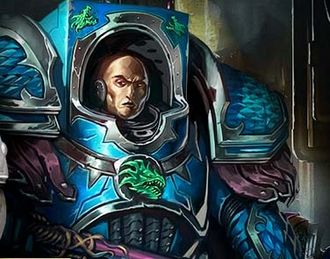

# 0716 谢德·兰科 Sheed Ranko

精校状态：中文行文已逐段精校，部分术语仍为暂定

分类：人类帝国 / 阿尔法军团

原文来源：https://www.bilibili.com/opus/1202486556806348808

原作者：帝国神选罐头

原文时间：2026年05月15日 11:01

[返回分类目录](目录.md) · [全书目录](../../目录.md)

原篇名：希德·兰科 Sheed Ranko

<!-- A0716-B0001 -->
**英文原文**

Sheed Ranko was an Alpha Legion Captain of the Lernaean at the time of the Horus Heresy. He was unusally large for a space marine and was able to easily double as Alpharius or Omegon in diplomatic circumstances.

<!-- /A0716-B0001 -->

<!-- A0716-B0002 -->

原译文

希德·兰科在荷鲁斯叛乱时期是阿尔法军团勒拿的连长。对于一名星际战士来说，他的体型非同寻常，在外交场合能够轻松地兼任阿尔法瑞斯或欧米伽。

**校订译文**

荷鲁斯之乱时期，谢德·兰科是阿尔法军团勒拿终结者的连长。他的体格远超一般星际战士，在外交场合能轻易充当阿尔法瑞斯或欧米伽的替身。

**校注：** Sheed Ranko 沿561谢德·兰科；double 为充当替身，不是兼任原体。

<!-- /A0716-B0002 -->

<!-- A0716-B0003 图片 -->

<!-- A0716-B0004 -->

原译文

Sheed Ranko 希德·兰科

**校订译文**

Sheed Ranko 谢德·兰科

<!-- /A0716-B0004 -->

<!-- A0716-B0005 -->
**英文原文**

A loyal legionnaire known to accept any mission with total secrecy, according to an account given by Alpharius which is said to be a lie, Ranko was one of the Alpha Legionaries who worked closest with the Primarch during the days before his formal "rediscovery". Sheed was later assigned by his co-Primarch Omegon to destroy the Tenebrae installation on suspicion that it was leaking information to the Legion's enemies. Sheed drank Omegon's blood before the operation, taking the apperance of the Primarch and even gaining some of his memories. Posing as Omegon, Sheed successfully destroyed the facility in a one-way suicide mission.

<!-- /A0716-B0005 -->

<!-- A0716-B0006 -->

原译文

根据阿尔法瑞斯（据说是谎言）的说法，兰科是一名忠诚的军团成员，他以完全保密的方式接受任何任务而闻名，他是阿尔法军团成员之一，在他正式“重新发现”之前的几天里，他与原体关系最密切。希德后来被他的共同原体欧米伽指派摧毁黑暗装置，因为怀疑它正在向军团的敌人泄露信息。希德在行动前饮下了欧米伽的鲜血，得到了原体的外观，甚至获得了一些记忆。希德假扮成欧米伽，在一次单向自杀任务中成功摧毁了该设施。

**校订译文**

兰科是忠诚的军团战士，以承接任何任务并严守秘密著称。按阿尔法瑞斯那份被其本人称为谎言的自述，在原体正式被“重新发现”之前，兰科就是与他合作最密切的人之一。后来，另一位原体欧米伽怀疑黑暗设施向军团敌人泄密，派兰科前去摧毁。行动前，兰科饮下欧米伽之血，化作原体的模样，甚至获得其部分记忆。他以欧米伽的身份完成这次有去无回的自杀任务，成功摧毁设施。

**校注：** the days before 指此前那段时期，不限几天。源文借保密自述陈述任务，保留其谎言声明；Tenebrae 与770、917同一设施，沿黑暗设施。

<!-- /A0716-B0006 -->

本篇核心术语与暂定项

以下列出本篇出现的英文原形及核心术语表用词。同形词可能指不同对象，具体词义以本篇正文和校注为准；单复数、别名和仅见于图注的名称可能尚未列入。完整候选见[术语表](../../术语表/双语术语候选.csv)。

| 英文 | 采用中文 | 状态 |
| --- | --- | --- |
| Horus Heresy | 荷鲁斯之乱 | 官方已核对 |
| Primarch | 原体 | 官方已核对 |
| Horus | 荷鲁斯 | 暂定·官方待核 |
| Mission | 教团／传教机构 | 暂定 |
| Alpha Legion | 阿尔法军团 | 暂定·官方待核 |
| Space Marine | 星际战士 | 暂定·官方待核 |
| Captain | 连长 | 暂定·官方待核 |
| Alpharius | 阿尔法瑞斯 | 暂定·官方待核 |
| Omegon | 欧米伽 | 暂定·官方待核 |
| Lernaean | 勒拿终结者 | 暂定·官方待核 |
| Sheed Ranko | 谢德·兰科 | 暂定·官方待核 |
| Tenebrae Installation | 黑暗设施 | 暂定·官方待核 |

