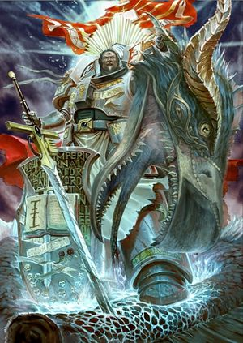
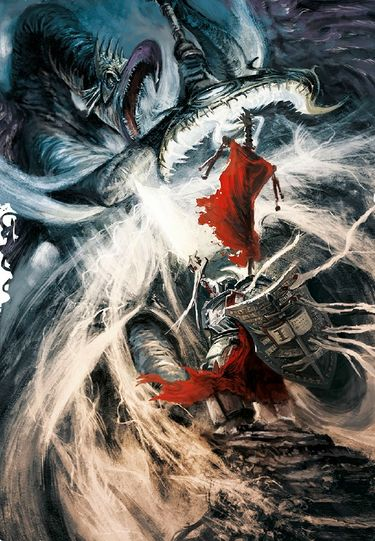
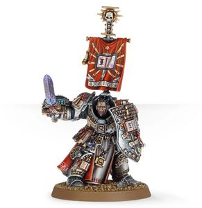

# 0717 卡尔多·迪亚哥 Kaldor Draigo

精校状态：中文行文已逐段精校，部分术语仍为暂定

分类：人类帝国 / 灰骑士

原文来源：https://www.bilibili.com/opus/1149008836667899921

原作者：帝国神选罐头

原文时间：2025年12月22日 08:21

[返回分类目录](目录.md) · [全书目录](../../目录.md)

<!-- A0717-B0001 -->
**英文原文**

Kaldor Draigo is the 48th and current Supreme Grand Master of the Grey Knights. He wields the legendary Titansword.

<!-- /A0717-B0001 -->

<!-- A0717-B0002 -->

原译文

卡尔多·迪亚哥是第48位也是现任灰骑士至高大导师。他挥舞着传说中的泰坦之剑。

**校订译文**

卡尔多·迪亚哥是灰骑士第四十八任至高大导师，亦为现任领袖，手持传奇武器泰坦之剑。

<!-- /A0717-B0002 -->

<!-- A0717-B0003 图片 -->

<!-- A0717-B0004 -->

原译文

Kaldor Draigo 卡尔多·迪亚哥

**校订译文**

Kaldor Draigo 卡尔多·迪亚哥

<!-- /A0717-B0004 -->

<!-- A0717-B0005 -->
### Biography 传记

<!-- /A0717-B0005 -->

<!-- A0717-B0006 -->
**英文原文**

As a simple Battle-Brother of the 3rd Brotherhood, Draigo banished the Daemon Prince M'kar the Reborn on Acralem.

<!-- /A0717-B0006 -->

<!-- A0717-B0007 -->

原译文

作为第三兄弟会的一个普通的战斗兄弟，迪亚哥在阿克莱姆驱逐了恶魔王子重生者姆'卡。

**校订译文**

尚是第三兄弟会一名普通战斗兄弟时，迪亚哥就在阿克莱姆放逐了恶魔亲王重生者姆’卡尔。

<!-- /A0717-B0007 -->

<!-- A0717-B0008 -->
**英文原文**

In 901.M41, during the Battle of Kornovin, Draigo would become Supreme Grand Master of the Grey Knights after the Daemon Prince Mortarion killed his predecessor, Geronitan along with many other Grey Knights who attempted to banish the fallen hero. The act made Draigo fly into a rage, assaulting the weakened Daemon Primarch. He was only able to defeat Mortarion by uttering the true name the Emperor had originally intended for him. The Primarch's body was shattered by this and Draigo carved his predecessor's name into his heart - an insult Mortarion never forgot, as his spirit recuperated in the Immaterium where he would prepare to kill Draigo once and for all.

<!-- /A0717-B0008 -->

<!-- A0717-B0009 -->

原译文

901.M41，在科尔诺温之战中，迪亚哥成为灰骑士的至高大导师，此前恶魔王子莫塔里安杀死了他的前任格罗尼坦以及许多其他试图放逐这位堕落英雄的灰骑士。这一行为让迪亚哥勃然大怒，攻击了被削弱的恶魔原体。他只有说出帝皇最初打算给他的真名，才击败了莫塔里安。原体的身体被这件事粉碎了，迪亚哥把前任的名字刻在了他的心脏 — 莫塔里安永远不会忘记这一侮辱，因为他的精神在非物质界得到了恢复，在那里他准备一劳永逸地杀死迪亚哥。

**校订译文**

M41.901，科尔诺温之战中，莫塔里安杀死了时任至高大导师杰罗尼坦，以及众多试图将其放逐的灰骑士，迪亚哥随后接任。前任之死令他勃然大怒，向已被削弱的恶魔原体猛攻。他最终靠念出帝皇原本打算赐予莫塔里安的真名，才击败对方。真名之力摧垮原体的躯体，迪亚哥则把杰罗尼坦之名刻在其心脏上。莫塔里安永远铭记这份羞辱，在亚空间休养时便筹划着彻底杀死迪亚哥。

**校注：** “他的真名”指莫塔里安，不是迪亚哥；帝皇最初拟赐之名依所给英文保留。源文同段称 Daemon Prince 与 Daemon Primarch，中文按人物身份称恶魔原体，并未将两种类别全书合并。

<!-- /A0717-B0009 -->

<!-- A0717-B0010 -->
### Pandorax Campaign 潘多拉克斯战役

<!-- /A0717-B0010 -->

<!-- A0717-B0011 -->
**英文原文**

In 960.M41 Draigo visited the body of the recently deceased Lexek Hasimir. Just as he was about to leave, it sat up and told him that the Damnation Cache was open and he must lead the chapter to Pythos to seal it. Draigo didn't have time to wait for Grey Knight reinforcements so he enacted an oath sworn to the Grey Knights by the Dark Angels calling them to aid him. Azrael initially refused, considering it blackmail. Draigo then revealed something he had learned while interrogating a Heretic Astartes prisoner, and Azrael committed the entire Dark Angels chapter to Pandorax - the sole concession Draigo gave was that the Dark Angels would have operational superiority.

<!-- /A0717-B0011 -->

<!-- A0717-B0012 -->

原译文

960.M41，迪亚哥看望了最近牺牲的莱克塞克·哈西米尔的尸体。就在他正要离开的时候，它坐了起来，告诉他诅咒隐藏已经打开，他必须带领该战团前往派索斯将其封存。迪亚哥没有时间等待灰骑士的增援，所以他颁布了一个由黑暗天使向灰骑士宣誓的誓言，召唤他们来帮助他。阿兹瑞尔最初拒绝了，认为这是勒索。迪亚哥随后透露了他在审讯一名异端阿斯塔特囚犯时得到的东西，阿兹瑞尔承诺整个黑暗天使战团前往潘多拉克斯 — 迪亚哥唯一的让步是黑暗天使将拥有行动优越性。

**校订译文**

M41.960，迪亚哥前去查看刚去世的莱克塞克·哈西米尔遗体。正要离开时，尸体突然坐起，告诉他“诅咒密藏”已经开启，必须率战团赶往派索斯将其封印。迪亚哥来不及等待灰骑士增援，便援引黑暗天使曾向灰骑士立下的誓约，要求其相助。阿兹瑞尔起初认为这是要挟，拒不答应。随后，迪亚哥透露了审讯一名异端阿斯塔特俘虏所得的情报，阿兹瑞尔才同意率整个黑暗天使战团前往潘多拉克斯。迪亚哥作出的唯一让步，是由黑暗天使掌握行动指挥权。

**校注：** Damnation Cache 暂译诅咒密藏，原译诅咒隐藏误将名词作动词；operational superiority 为此次行动的主导权，不是战斗能力更优。

<!-- /A0717-B0012 -->

<!-- A0717-B0013 图片 -->

<!-- A0717-B0014 -->

原译文

Kaldor Draigo battles M'Kachen 卡尔多·迪亚哥与姆'卡陈战斗

**校订译文**

Kaldor Draigo battles M'Kachen 卡尔多·迪亚哥与马’卡辰交战

**校注：** 本篇图注 M’Kachen、正文 M’Kachan 与719/720同一诡变领主，中文统一512已定马’卡辰，英文各自拼写保留。

<!-- /A0717-B0014 -->

<!-- A0717-B0015 -->
**英文原文**

Once they arrived in the system, Draigo led the 5th Brotherhood on the ship Revenge into battle against Daemons and Chaos Space Marines. They were then reinforced by the Dark Angels, who had finished clearing an asteroid in the system. Gabriel met with Draigo, with Draigo's Knights and Gabriel's Deathwing fighting towards the portal they were trying to close. Once near the portal, Draigo and others started a ritual to seal it; however, at the start of the second phase he was interrupted by ‘J’ian-Lo, a Daemon Prince of Nurgle. The Prince grabbed Draigo and teleported them into space so he would be unable to hear Draigo use its true name. After a brief battle, Draigo was able to kill the Daemon, severing its head from its body and then throwing it into space. He was then teleported back into the ship and talked with Azrael, Ezekiel, and Gabriel.

<!-- /A0717-B0015 -->

<!-- A0717-B0016 -->

原译文

他们一进入星系，迪亚哥带领第五兄弟会乘坐复仇号舰船与恶魔和混沌星际战士作战。然后，他们得到了黑暗天使的增援，他们已经清理了星系中的一颗小行星。加百列会见了迪亚哥，迪亚哥的骑士和加百列的死翼正朝着他们试图关闭的入口作战。一接近入口，迪亚哥和其他人就开始了一个仪式来密封它；然而，在第二阶段开始时，他被纳垢的恶魔王子杰’安-罗打断了。王子抓住迪亚哥，将他们传送到太空，这样他就无法听到迪亚哥使用它的真名。经过一场短暂的战斗，迪亚哥杀死了恶魔，将其头颅从身体上割下，然后将其扔进太空。然后，他被传送回船上，与阿兹瑞尔、以西结和加百列交谈。

**校订译文**

抵达星系后，迪亚哥率第五兄弟会登上复仇号，与恶魔和混沌星际战士交战。清剿完星系内一颗小行星的黑暗天使随后赶来增援。加百列与迪亚哥会合，两人率灰骑士及死翼向待封闭的传送门推进。接近目标后，迪亚哥等人开始封印仪式，却在第二阶段刚开始时遭纳垢恶魔亲王杰’安-罗打断。恶魔抓住迪亚哥，将双方一同传送至太空，利用真空阻断声音，使自己听不到迪亚哥念诵真名。短暂搏斗后，迪亚哥将其斩首，把头颅抛入虚空，随后被传送回舰，与阿兹瑞尔、以西结和加百列交谈。

**校注：** 原文说明传送至太空为避免听见真名；中文理顺因果，不误写成迪亚哥听不到自己。

<!-- /A0717-B0016 -->

<!-- A0717-B0017 -->
### Return to Acralem 回归阿克莱姆

<!-- /A0717-B0017 -->

<!-- A0717-B0018 -->
**英文原文**

In 999.M41, Draigo returned alone to Acralem to free it from M'kar, hoping to end the Chapter's ancient feud with the Daemon. However, after the fight Draigo has been cursed to a life trapped within the Warp, doomed to walk within the Realm of Chaos itself. To remain pure while constantly assailed by Chaos shows fortitude and personal strength that is beyond measure. He has undertaken many great exploits within the Warp: slaying the great Bloodthirster Kar'Voth, setting fire to the jungles of Nurgle's domain, defeating the six chosen Daemonettes of Slaanesh, the Six Sisters, and destroying the fortress of the Lord of Change M'Kachan. While Draigo lives, he will prevail and one day, he will return.

<!-- /A0717-B0018 -->

<!-- A0717-B0019 -->

原译文

999.M41，迪亚哥独自回到阿克莱姆，将其从姆'卡手中解放出来，希望结束战团与恶魔的古老仇恨。然而，在战斗结束后，迪亚哥被诅咒，被困在亚空间中，注定要在混沌领域中行走。在不断受到混沌攻击的同时保持纯洁，这表明了无与伦比的坚韧和个人力量。他在亚空间中进行了许多伟大的壮举：杀死了大嗜血狂魔卡尔'沃斯，放火烧毁了纳垢领地的丛林，击败了色孽的六个神选女妖，六姐妹，摧毁了万变魔君姆'卡陈的堡垒。只要迪亚哥活着，他就会获胜，总有一天他会回来的。

**校订译文**

M41.999，迪亚哥独自返回阿克莱姆，试图将这颗行星从姆’卡尔手中解放，终结战团与这个恶魔的古老宿怨。然而，战后他身受诅咒，被困于亚空间，注定在混沌领域中流浪。不断遭混沌侵袭却仍保持纯洁，显露出他难以衡量的意志与力量。他在亚空间中立下诸多壮举：斩杀强大的嗜血狂魔卡尔’沃斯，焚烧纳垢领地的丛林，击败色孽选中的六名魅魔——六姐妹，以及摧毁诡变领主马’卡辰的堡垒。只要仍然活着，他便不会屈服；总有一天，他将归来。

**校注：** Lord of Change 采用诡变领主，Daemonic Prince 采用恶魔亲王；六姐妹为六名获色孽选中的 Daemonettes，非六名不同神祇。

<!-- /A0717-B0019 -->

<!-- A0717-B0020 -->
### Age of the Dark Imperium 黑暗帝国时代

<!-- /A0717-B0020 -->

<!-- A0717-B0021 -->
**英文原文**

After the formation of the Great Rift, Draigo discovered that he could now return to the material realm for greater periods of time. The Grey Knights Prognosticars believe that his presence is now linked to Mortarion due to the ties of hatred that bind the two. Draigo later appeared to each of the Grand Masters of the Chapter and asked for their counsel, and due to the dire state of the Imperium the Terminus Decree is given consideration.

<!-- /A0717-B0021 -->

<!-- A0717-B0022 -->

原译文

大裂隙形成后，迪亚哥发现他现在可以在更长的时间内回到物质领域。灰骑士预言者认为，由于仇恨的纽带，他的存在现在与莫塔里安有关。迪亚哥后来出现在该战团的每位大导师面前，并要求他们提供建议，由于帝国的可怕状态，最终法令得到了考虑。

**校订译文**

大裂隙形成后，迪亚哥发现自己能在物质世界停留更久。灰骑士的预言者认为，维系他与莫塔里安的仇恨纽带，已使两者的现身彼此关联。此后，他分别向战团各位大导师现身，征询意见。鉴于帝国处境危急，他们开始考虑动用最终法令。

**校注：** 原文只说开始考虑最终法令，未称已执行；不推测其隐藏内容。

<!-- /A0717-B0022 -->

<!-- A0717-B0023 图片 -->

<!-- A0717-B0024 -->

原译文

Kaldor Draigo 卡尔多·迪亚哥

**校订译文**

Kaldor Draigo 卡尔多·迪亚哥

<!-- /A0717-B0024 -->

<!-- A0717-B0025 -->
**英文原文**

During the Assault on Sortiarius, Draigo reappeared to help guide the Imperial forces. Despite this, the Grey Knights have decided that if Draigo can not escape his curse soon than a new Supreme Grand Master will have to be named.

<!-- /A0717-B0025 -->

<!-- A0717-B0026 -->

原译文

在对索提尔瑞斯的袭击中，迪亚哥再次出现，帮助引导帝国军队。尽管如此，灰骑士已经决定，如果迪亚哥不能很快逃脱诅咒，那么就必须任命一位新的至高大导师。

**校订译文**

进攻索提尔瑞斯时，迪亚哥再次现身，协助指挥帝国军队。不过，灰骑士已经决定：若他不能尽快摆脱诅咒，就必须另立至高大导师。

<!-- /A0717-B0026 -->

本篇核心术语与暂定项

以下列出本篇出现的英文原形及核心术语表用词。同形词可能指不同对象，具体词义以本篇正文和校注为准；单复数、别名和仅见于图注的名称可能尚未列入。完整候选见[术语表](../../术语表/双语术语候选.csv)。

| 英文 | 采用中文 | 状态 |
| --- | --- | --- |
| Space Marines | 星际战士 | 官方已核对 |
| Dark Angels | 黑暗天使 | 官方已核对 |
| Grey Knights | 灰骑士 | 官方已核对 |
| Chaos Space Marines | 混沌星际战士 | 官方已核对 |
| Warp | 亚空间 | 官方已核对 |
| Great Rift | 大裂隙 | 官方已核对 |
| Imperium | 帝国 | 暂定·简称 |
| Nurgle | 纳垢 | 官方已核对 |
| Emperor | 帝皇 | 官方已核对 |
| Primarch | 原体 | 官方已核对 |
| Daemon Prince | 恶魔亲王 | 官方已核对 |
| Slaanesh | 色孽 | 官方已核对 |
| Mortarion | 莫塔里安 | 官方已核对 |
| Realm of Chaos | 混沌领域 | 暂定·官方待核 |
| Brotherhood | 兄弟会 | 暂定·官方待核 |
| Banish | 巴尼什 | 暂定·官方待核 |
| Master | 导师（审判庭职衔）／舰务官（舰员职务） | 语境定译·官方待核 |
| Ancient | 旗手 | 官方已核对 |
| Chapter | 战团 | 暂定·官方待核 |
| Brother | 修士 | 暂定·官方待核 |
| Battle-Brother | 战斗兄弟 | 暂定·官方待核 |
| Azrael | 阿兹瑞尔 | 官方已核 |
| Ezekiel | 以西结 | 暂定·官方待核 |
| Kaldor Draigo | 卡尔多·迪亚哥 | 暂定·官方待核 |
| Supreme Grand Master | 至高大导师 | 暂定·官方待核 |
| Reborn | 复生者（战团）／重生者（死神军自称） | 语境定译·官方待核 |
| Lord of Change | 诡变领主 | 官方已核对 |
| Bloodthirster | 嗜血狂魔 | 官方已核对 |
| Daemonettes | 魅魔 | 官方已核对 |
| Prognosticars | 预言者 | 暂定·官方待核 |
| Sortiarius | 索提尔瑞斯 | 暂定·官方待核 |
| Heretic Astartes | 阿斯塔特叛军 | 官方词根参考·整名待核 |
| Terminus | 终点站 | 暂定·官方待核 |
| Grand Master | 大导师 | 暂定·官方待核 |
| Geronitan | 杰罗尼坦 | 暂定·官方待核 |
| The Dark | 《黑暗》 | 暂定·官方待核 |
| Titansword | 泰坦之剑 | 暂定·官方待核 |
| Acralem | 阿克莱姆 | 暂定·官方待核 |
| Kornovin | 科尔诺温 | 暂定·官方待核 |
| Lexek Hasimir | 莱克塞克·哈西米尔 | 暂定·官方待核 |
| Damnation Cache | 诅咒密藏 | 暂定·官方待核 |
| Pythos | 派索斯 | 暂定·官方待核 |
| J’ian-Lo | 杰’安-罗 | 暂定·官方待核 |
| Six Sisters | 六姐妹 | 暂定·官方待核 |
| Terminus Decree | 最终法令 | 暂定·官方待核 |
| System | 星系（恒星系统） | 暂定·官方待核 |
| Lo | 洛 | 暂定·官方待核 |

