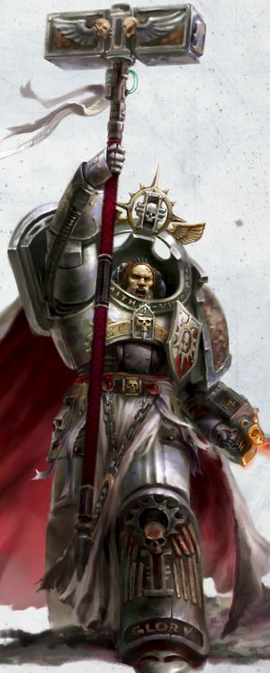
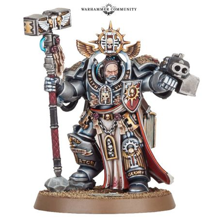

# 0719 阿尔德里克·沃尔达斯 Aldrik Voldus

精校状态：中文行文已逐段精校，部分术语仍为暂定

分类：人类帝国 / 灰骑士

原文来源：https://www.bilibili.com/opus/1121965446243811332

原作者：帝国神选罐头

原文时间：2025年10月10日 11:18

[返回分类目录](目录.md) · [全书目录](../../目录.md)

<!-- A0719-B0001 -->
**英文原文**

Aldrik Voldus is the newly promoted Grand Master of the Grey Knights Chapter's Third Brotherhood and the Warden of the Librarius. He was appointed to the position by Supreme Grand Master Kaldor Draigo and is the most powerful psyker the Grey Knights have seen in centuries.

<!-- /A0719-B0001 -->

<!-- A0719-B0002 -->

原译文

阿尔德里克·沃尔达斯是新晋升的灰骑士第三兄弟会大导师，也是智库看守者。他被至高大导师卡尔多·迪亚哥任命为该职位，是灰骑士几个世纪以来见过的最强大的灵能者。

**校订译文**

阿尔德里克·沃尔达斯是新近晋升的灰骑士第三兄弟会大导师，兼任智库守望者。至高大导师卡尔多·迪亚哥亲自任命他担任这一职务；他被认为是灰骑士数百年来最强大的灵能者。

<!-- /A0719-B0002 -->

<!-- A0719-B0003 图片 -->

<!-- A0719-B0004 -->

原译文

Aldrik Voldus 阿尔德里克·沃尔达斯

**校订译文**

Aldrik Voldus 阿尔德里克·沃尔达斯

<!-- /A0719-B0004 -->

<!-- A0719-B0005 -->
### Biography 传记

<!-- /A0719-B0005 -->

<!-- A0719-B0006 -->
**英文原文**

Voldus became the Third Brotherhood's third Grand Master in a single year after Valdar Aurikon was killed by the Daemon Primarch Magnus and Doriam Narathem fell in battle with the Lord of Change M'kachen on only his fourth mission in command. The combined power of Narathem's sacrifice and Voldus' psychic assault acted as a beacon that guided Supreme Grand Master Draigo from the Warp. After they defeated M'kachen together, Draigo named Voldus the new Grand Master of the Third Brotherhood. Voldus swore an oath to live up to this honour.

<!-- /A0719-B0006 -->

<!-- A0719-B0007 -->

原译文

瓦尔达尔·奥里康被恶魔原体马格努斯杀死，多里安·纳拉泰姆在他的第四次指挥任务中与万变之主姆'卡陈作战，一年后，沃尔杜斯成为第三兄弟会的第三位大导师。纳拉泰姆的牺牲和沃尔杜斯的灵能攻击的结合力量成为了指引至高大导师迪亚哥离开亚空间的灯塔。在他们一起击败姆'卡陈之后，迪亚哥任命沃尔达斯为第三兄弟会的新任大导师。沃尔达斯宣誓不辜负这一荣誉。

**校订译文**

瓦尔达尔·奥里康被恶魔原体马格努斯杀死后，继任者多里安·纳拉泰姆仅在第四次领军执行任务时，便战死于诡变领主马’卡辰手下。因此，沃尔达斯成了第三兄弟会一年之内的第三任大导师。纳拉泰姆牺牲所释放的力量，与沃尔达斯的灵能攻击相合，宛如灯塔，引导至高大导师迪亚哥走出亚空间。两人合力击败马’卡辰后，迪亚哥任命沃尔达斯接掌第三兄弟会。沃尔达斯立誓不辱这份荣誉。

**校注：** in a single year 指一年之内已更换三任，原译“一年后”误义；fell in battle 原译漏掉纳拉泰姆战死。

<!-- /A0719-B0007 -->

<!-- A0719-B0008 -->
**英文原文**

When the 13th Black Crusade began, Voldus came to the defense of the Realm of Ultramar, when it was invaded by Abaddon the Despoiler's Chaos hordes, and served as a trusted adviser to the resurrected Ultramarines Primarch Roboute Guilliman. Voldus was able to make it to Ultramar in time thanks to a prediction by his Prognosticars.

<!-- /A0719-B0008 -->

<!-- A0719-B0009 -->

原译文

当第13次黑色远征开始时，沃尔达斯来到奥特拉玛领域防御，当时它被掠夺者阿巴顿的混沌部落入侵，并担任复活的极限战士原体罗伯特·基里曼的值得信赖的顾问。由于他的预言者的预测，沃尔达斯能够及时到达奥特拉玛。

**校订译文**

第十三次黑色远征爆发后，掠夺者阿巴顿的混沌大军入侵奥特拉玛。沃尔达斯凭预言者的预示及时赶到，参与保卫当地疆域，并成为复生的极限战士原体罗保特·基里曼所信赖的顾问。

<!-- /A0719-B0009 -->

<!-- A0719-B0010 -->
**英文原文**

Months later, when the Ultramarines and their allies had regained the upper hand, Guilliman announced he would leave the rest of the invasion's forces for Marneus Calgar to defeat and intended to travel to Terra, in order to better aid the Imperium. The Primarch then asked for the Grand Master's aid to help him reach his Father's side and Voldus agreed. The Grand Master and his Brotherhood joined the army that Guilliman took with him on his perilous journey and Voldus was one of the few who successfully reached Terra.

<!-- /A0719-B0010 -->

<!-- A0719-B0011 -->

原译文

几个月后，当极限战士及其盟友重新占据上风时，基里曼宣布他将离开，其余的入侵部队让马涅乌斯·卡尔加击败，并打算前往泰拉，以便更好地帮助帝国。然后，原体请求大导师的帮助，帮助他到达父亲的身边，沃尔达斯同意了。大导师和他的兄弟会加入了基里曼带着他的军队，踏上了危险的旅程，沃尔达斯是少数成功到达泰拉的人之一。

**校订译文**

数月后，极限战士及盟军重新占据上风。基里曼宣布，将剩余入侵者留给马涅乌斯·卡尔加处理，自己则前往泰拉，以更好地援助帝国。他请求沃尔达斯协助自己回到父亲身边，后者答应了。大导师率兄弟会加入远征队，随原体踏上险途，最终成为少数成功抵达泰拉的人之一。

<!-- /A0719-B0011 -->

<!-- A0719-B0012 -->
**英文原文**

Voldus subsequently took part in the Indomitus Crusade, leading his Grey Knights alongside the Custodes under Trajann Valoris in the Battle of Gathalamor. During the Season of Blood he led the 3rd Brotherhood to Armageddon, intending to reinforce the 5th Brotherhood under Rothwyr Morvans but only arriving in the later stages of the battle. Nonetheless, Voldus alongside Brother-Captain Arvann Stern were able to drive off the Chaos fleet over Armageddon.

<!-- /A0719-B0012 -->

<!-- A0719-B0013 -->

原译文

沃尔达斯随后参加了不屈远征，在加塔拉莫之战中率领他的灰骑士与图拉真·瓦洛里斯领导的禁军并肩作战。在血季，他带领第三兄弟会前往阿玛吉多顿，打算在罗斯维尔·墨万斯的领导下加强第五兄弟会，但只在战斗的后期到达。尽管如此，沃尔达斯与兄弟连长艾维安·斯特恩一起在阿玛吉多顿击败了混沌舰队。

**校订译文**

沃尔达斯后来参加不屈远征，在加塔拉莫之战中率灰骑士与图拉真·瓦洛瑞斯麾下的禁军并肩作战。血之季节期间，他率第三兄弟会前往阿玛吉多顿，准备增援罗斯维尔·墨万斯指挥的第五兄弟会，却直到战役后期才赶到。即便如此，他仍与兄弟会连长艾维安·斯特恩合力，驱逐了阿玛吉多顿上空的混沌舰队。

**校注：** under Rothwyr Morvans 修饰第五兄弟会，不是沃尔达斯受其指挥；drive off 为驱逐，不暗指歼灭舰队。

<!-- /A0719-B0013 -->

<!-- A0719-B0014 图片 -->

<!-- A0719-B0015 -->

原译文

Aldrik Voldus 阿尔德里克·沃尔达斯

**校订译文**

Aldrik Voldus 阿尔德里克·沃尔达斯

<!-- /A0719-B0015 -->

<!-- A0719-B0016 -->
### Wargear & Abilities 战斗装备与能力

原题：Wargear & Abilities 战备&能力

<!-- /A0719-B0016 -->

<!-- A0719-B0017 -->
**英文原文**

In battle, Voldus wields the mighty Nemesis Daemon Hammer Malleus Argyrum. He is said to be the most powerful Psyker that the Grey Knights have seen in centuries.

<!-- /A0719-B0017 -->

<!-- A0719-B0018 -->

原译文

在战斗中，沃尔达斯挥舞着强大的复仇女神恶魔之锤阿格鲁姆之锤 。据说他是灰骑士几个世纪以来见过的最强大的灵能者。

**校订译文**

沃尔达斯持有强大的复仇女神恶魔锤——阿格鲁姆之锤。据说，他是灰骑士数百年来最强大的灵能者。

<!-- /A0719-B0018 -->

本篇核心术语与暂定项

以下列出本篇出现的英文原形及核心术语表用词。同形词可能指不同对象，具体词义以本篇正文和校注为准；单复数、别名和仅见于图注的名称可能尚未列入。完整候选见[术语表](../../术语表/双语术语候选.csv)。

| 英文 | 采用中文 | 状态 |
| --- | --- | --- |
| Grey Knights | 灰骑士 | 官方已核对 |
| Psyker | 灵能者 | 官方已核对 |
| Roboute Guilliman | 罗保特·基里曼 | 官方已核对 |
| Ultramar | 奥特拉玛 | 官方已核对 |
| Ultramarines | 极限战士 | 官方已核对 |
| Warp | 亚空间 | 官方已核对 |
| Imperium | 帝国 | 暂定·简称 |
| Librarius | 智库（机构）／智库学派（灵能学派） | 语境定译·官方待核 |
| Indomitus | 不屈学派 | 暂定·学派语境 |
| Primarch | 原体 | 官方已核对 |
| Terra | 泰拉 | 暂定·官方待核 |
| Indomitus Crusade | 不屈远征 | 暂定·官方待核 |
| Brotherhood | 兄弟会 | 暂定·官方待核 |
| Armageddon | 阿玛吉多顿 | 暂定·官方待核 |
| Gathalamor | 加塔拉莫 | 暂定·官方待核 |
| Master | 导师（审判庭职衔）／舰务官（舰员职务） | 语境定译·官方待核 |
| Mission | 教团／传教机构 | 暂定 |
| Trajann Valoris | 图拉真·瓦洛瑞斯 | 官方已核对 |
| Despoiler | 劫掠者 | 暂定·官方待核 |
| Chapter | 战团 | 暂定·官方待核 |
| Captain | 连长 | 暂定·官方待核 |
| Brother | 修士 | 暂定·官方待核 |
| Marneus Calgar | 马涅乌斯·卡尔加 | 暂定·官方待核 |
| Kaldor Draigo | 卡尔多·迪亚哥 | 暂定·官方待核 |
| Arvann Stern | 艾维安·斯特恩 | 暂定·官方待核 |
| Aldrik Voldus | 阿尔德里克·沃尔达斯 | 暂定·官方待核 |
| Nemesis | 复仇女神 | 暂定·官方待核 |
| Supreme Grand Master | 至高大导师 | 暂定·官方待核 |
| Brother-Captain | 兄弟会连长（灰骑士）／兄弟连长（通称） | 语境定译·灰骑士职衔官译已核 |
| Lord of Change | 诡变领主 | 官方已核对 |
| Abaddon the Despoiler | 掠夺者阿巴顿 | 官方已核对 |
| Prognosticars | 预言者 | 暂定·官方待核 |
| Season of Blood | 血之季节 | 暂定·官方待核 |
| Realm of Ultramar | 奥特拉玛领地 | 暂定·官方待核 |
| Warden of the Librarius | 智库守望者 | 暂定·官方待核 |
| Rothwyr Morvans | 罗斯维尔·墨万斯 | 暂定·官方待核 |
| Grand Master | 大导师 | 暂定·官方待核 |
| Valdar Aurikon | 瓦尔达尔·奥里康 | 暂定·官方待核 |
| Doriam Narathem | 多里安·纳拉泰姆 | 暂定·官方待核 |
| Nemesis Daemon Hammer | 复仇女神恶魔锤 | 暂定·官方待核 |
| Malleus Argyrum | 阿格鲁姆之锤 | 暂定·官方待核 |

