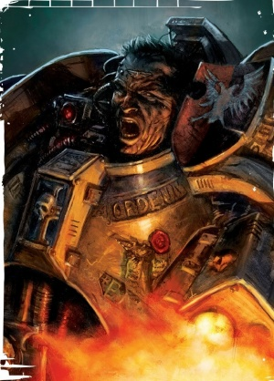
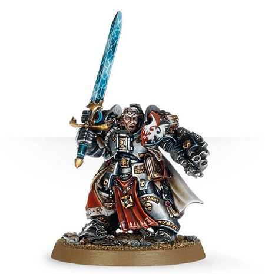

# 0720 艾维安·斯特恩 Arvann Stern

精校状态：中文行文已逐段精校，部分术语仍为暂定

分类：人类帝国 / 灰骑士

原文来源：https://www.bilibili.com/opus/1149009768709357570

原作者：帝国神选罐头

原文时间：2025年12月22日 08:24

[返回分类目录](目录.md) · [全书目录](../../目录.md)

<!-- A0720-B0001 -->
**英文原文**

Brother-Captain Arvann Stern has served the Grey Knights for many long years and is a prominent Daemonhunter. Stern is nearing his fourth century in the Emperor's service, but he continues to serve within the 3rd Brotherhood.

<!-- /A0720-B0001 -->

<!-- A0720-B0002 -->

原译文

兄弟连长艾维安·斯特恩已为灰骑士服务多年，是一位杰出的恶魔猎手。斯特恩为帝皇服务已接近四世纪，但他继续在第三兄弟会任职。

**校订译文**

兄弟会连长艾维安·斯特恩为灰骑士效力已久，是著名的恶魔猎手。他为帝皇服役近四百年，至今仍任职于第三兄弟会。

**校注：** Brother-Captain 采用 GW09/GW10 均第23页直接官译兄弟会连长；完整人名 Arvann Stern 仍沿稿暂定，未随职衔一并认证。

<!-- /A0720-B0002 -->

<!-- A0720-B0003 图片 -->

<!-- A0720-B0004 -->

原译文

Brother-Captain Arvann Stern 兄弟连长艾维安·斯特恩

**校订译文**

Brother-Captain Arvann Stern 兄弟会连长艾维安·斯特恩

<!-- /A0720-B0004 -->

<!-- A0720-B0005 -->
### History 历史

<!-- /A0720-B0005 -->

<!-- A0720-B0006 -->
**英文原文**

Stern's fate is inextricably linked with that of the Lord of Change named M'Kachen, the instigator of the Cult of the Red Talon. During the Ordo Malleus's destruction of the cult, Stern faced and banished the daemon back into the warp for one hundred years and a day. When the daemon was able to return to the mortal realm he was determined to find Stern and devour his soul. The two have faced each other in battle several times. If unable to personally face Stern, M'kachen sends one of his most powerful servants to attempt the deed for him. Stern has battled M'kachen three times so far. Each time, the Brother-Captain has proven his ability to withstand the power of the daemon and defeat the creature.

<!-- /A0720-B0006 -->

<!-- A0720-B0007 -->

原译文

斯特恩的命运与万变之主姆'卡陈的命运有着千丝万缕的联系，姆'卡陈是红爪教派的煽动者。在圣锤修会摧毁教派期间，斯特恩面对并放逐了恶魔回到亚空间中一百年零一天。当恶魔能够返回物质领域时，他决心找到斯特恩并吞噬他的灵魂。两人在战斗中多次交锋。如果不能亲自面对斯特恩，姆'卡陈会派他最有力量的仆人之一为他做这件事。到目前为止，斯特恩已经三次与姆'卡陈作战。每一次，兄弟连长都证明了他有能力抵御恶魔的力量并击败该生物。

**校订译文**

斯特恩的命运与诡变领主马’卡辰纠缠在一起。这个恶魔曾煽动红爪教派兴起；恶魔审判庭剿灭该教派时，斯特恩与其交锋，将它放逐回亚空间，期限为一百年零一天。重返凡世后，马’卡辰决心找到斯特恩，吞噬他的灵魂。两者此后多次交战；若无法亲自出手，恶魔便派出最强大的仆从代劳。迄今为止，斯特恩已三次直面马’卡辰，每次都抵住其力量，将它击败。

<!-- /A0720-B0007 -->

<!-- A0720-B0008 -->
**英文原文**

Stern also took part in the final stages of the Siege of Vraks in late M41, helping to defeat the Daemon Prince Uraka Az'baramael. He later worked closely with the Space Wolves during the Siege of the Fenris System after discovering that the Wulfen were not a Chaos-corrupted threat.

<!-- /A0720-B0008 -->

<!-- A0720-B0009 -->

原译文

斯特恩还参加了M41晚期弗拉克斯围城的最后阶段，帮助击败了恶魔王子乌拉卡·阿兹'巴拉梅尔。后来，他在芬里斯星系围城期间与太空野狼密切合作，因为他发现狼人并不是一个被混沌腐化的威胁。

**校订译文**

第四十一个千年末，斯特恩还参加了弗拉克斯围攻的最后阶段，协助击败恶魔亲王乌拉卡·阿兹’巴拉玛埃尔。后来，他认定狼人并非混沌腐化的威胁，于是在芬里斯星系围攻期间与太空野狼密切合作。

<!-- /A0720-B0009 -->

<!-- A0720-B0010 -->
**英文原文**

During the Age of the Dark Imperium Arvann Stern resurfaced, leading the 3rd Brotherhood in the Assault on Sortiarius alongside the Dark Angels 5th Company. During the Season of Blood he served under Grand Master Aldrik Voldus in leading the 3rd Brotherhood to Armageddon, intending to reinforce the 5th Brotherhood under Rothwyr Morvans but only arriving in the later stages of the battle. Nonetheless, Voldus and Stern were able to drive off the Chaos fleet over Armageddon.

<!-- /A0720-B0010 -->

<!-- A0720-B0011 -->

原译文

在黑暗帝国时代，艾维安·斯特恩重新出现，与黑暗天使第五连队一起领导第三兄弟会袭击了索提尔瑞斯。在血季，他在阿尔德里克·沃尔达斯大导师手下领导第三兄弟会前往阿玛吉多顿，打算增援在罗斯维尔·墨万斯手下的第五兄弟会，但只在战斗的后期到达。尽管如此，沃尔达斯和斯特恩还是成功地将混沌舰队赶出了阿玛吉多顿。

**校订译文**

黑暗帝国时代，艾维安·斯特恩再次现身，率第三兄弟会与黑暗天使第五连一同进攻索提尔瑞斯。血之季节期间，他在阿尔德里克·沃尔达斯大导师指挥下，率第三兄弟会前往阿玛吉多顿，准备增援罗斯维尔·墨万斯麾下的第五兄弟会，却直到战役后期才抵达。尽管如此，两人仍成功将混沌舰队逐出阿玛吉多顿上空。

<!-- /A0720-B0011 -->

<!-- A0720-B0012 图片 -->

<!-- A0720-B0013 -->

原译文

Brother-Captain Arvann Stern 兄弟连长艾维安·斯特恩

**校订译文**

Brother-Captain Arvann Stern 兄弟会连长艾维安·斯特恩

<!-- /A0720-B0013 -->

<!-- A0720-B0014 -->
### Wargear 战斗装备

原题：Wargear 战备

<!-- /A0720-B0014 -->

<!-- A0720-B0015 -->
**英文原文**

Stern is armed with a Nemesis Force Weapon and has a Storm Bolter integrated into his Terminator armour. He is also a trained psyker and has a plethora of Psychic powers at his command.

<!-- /A0720-B0015 -->

<!-- A0720-B0016 -->

原译文

斯特恩装备了复仇女神灵能武器，并在他的终结者盔甲中集成了风暴爆矢枪。他也是一名训练有素的灵能者，拥有大量的灵能力量。

**校订译文**

斯特恩配备复仇女神灵能武器，终结者护甲上集成有风暴爆矢枪。他也是训练有素的灵能者，掌握多种灵能。

<!-- /A0720-B0016 -->

<!-- A0720-B0017 -->
### Quotes 语录

<!-- /A0720-B0017 -->

<!-- A0720-B0018 -->
**英文原文**

"There is nothing in the arcane and blasphemous arsenal of the forces of Chaos that can compare to faith. With the power of faith, our weapons become shining instruments of deliverance that can cleave the mightiest daemon in twain. With the power of faith, our minds appear as slivers of pure agony to the daemon, driving into the wretched forms of those who would dare stand before us. With the power of faith, our words become commands that cause the daemon to cower and cringe in terror. I could meet my enemies unarmed without a shred of fear in my chest, for I know that the Emperor watches over me and guides my hand. So let them come. We shall show them what the power of faith can do."

<!-- /A0720-B0018 -->

<!-- A0720-B0019 -->

原译文

“在混沌部队神秘而亵渎的军械库中，没有什么能比得上信仰。有了信仰的力量，我们的武器就变成了闪亮的拯救器具，可以把最强大的恶魔一分为二。有了信仰的力量，在恶魔面前，我们的思想就像纯粹的痛苦碎片，驱使那些敢于站在我们面前的人变成可怜的样子。有了信仰的力量，我的语言就变成了命令，让恶魔在恐惧中畏缩和怯退。我可以手无寸铁地面对我的敌人，胸中没有一丝恐惧，因为我知道帝皇在看着我，引导我的手。所以让他们来吧。我们将向他们展示信仰的力量能做到什么。”

**校订译文**

“混沌大军那诡秘而亵渎的军械库中，没有什么能与信仰匹敌。凭借信仰，我们的武器化为光辉的救赎之具，足以将最强大的恶魔劈成两半。凭借信仰，我们的意志在恶魔眼中化为纯粹痛苦的碎刃，刺入一切胆敢挡在我们面前的污秽躯体。凭借信仰，我们的话语化作号令，使恶魔恐惧战栗。我可以赤手空拳迎战敌人，心中不存一丝畏惧，因为我知道帝皇正守护着我，指引我的手。让它们来吧。我们会让它们见识信仰的力量。”

**校注：** driving into ... 指意志化为痛苦碎刃刺入恶魔躯体，原译误作使敌人变得可怜。引文中 our words 保持复数主体。

<!-- /A0720-B0019 -->

本篇核心术语与暂定项

以下列出本篇出现的英文原形及核心术语表用词。同形词可能指不同对象，具体词义以本篇正文和校注为准；单复数、别名和仅见于图注的名称可能尚未列入。完整候选见[术语表](../../术语表/双语术语候选.csv)。

| 英文 | 采用中文 | 状态 |
| --- | --- | --- |
| Dark Angels | 黑暗天使 | 官方已核对 |
| Grey Knights | 灰骑士 | 官方已核对 |
| Space Wolves | 太空野狼 | 官方已核对 |
| Psyker | 灵能者 | 官方已核对 |
| Terminator | 终结者 | 官方已核对 |
| Warp | 亚空间 | 官方已核对 |
| Imperium | 帝国 | 暂定·简称 |
| Ordo Malleus | 恶魔审判庭 | 用户指定 |
| Emperor | 帝皇 | 官方已核对 |
| Daemon Prince | 恶魔亲王 | 官方已核对 |
| Dark Imperium | 黑暗帝国 | 暂定·官方待核 |
| Brotherhood | 兄弟会 | 暂定·官方待核 |
| Armageddon | 阿玛吉多顿 | 暂定·官方待核 |
| Fenris | 芬里斯 | 暂定·官方待核 |
| Deliverance | 拯救星 | 暂定·官方待核 |
| Master | 导师（审判庭职衔）／舰务官（舰员职务） | 语境定译·官方待核 |
| Nemesis Force Weapon | 复仇女神灵能武器 | 暂定·官方待核 |
| Captain | 连长 | 暂定·官方待核 |
| Brother | 修士 | 暂定·官方待核 |
| Arvann Stern | 艾维安·斯特恩 | 暂定·官方待核 |
| Aldrik Voldus | 阿尔德里克·沃尔达斯 | 暂定·官方待核 |
| Nemesis | 复仇女神 | 暂定·官方待核 |
| Mortal | 凡人 | 暂定·官方待核 |
| Brother-Captain | 兄弟会连长（灰骑士）／兄弟连长（通称） | 语境定译·灰骑士职衔官译已核 |
| Powers | 能天使 | 暂定·官方待核 |
| Lord of Change | 诡变领主 | 官方已核对 |
| Wulfen | 狼人 | 官方已核对 |
| Sortiarius | 索提尔瑞斯 | 暂定·官方待核 |
| Season of Blood | 血之季节 | 暂定·官方待核 |
| Red Talon | 红爪号 | 暂定·官方待核 |
| Rothwyr Morvans | 罗斯维尔·墨万斯 | 暂定·官方待核 |
| Grand Master | 大导师 | 暂定·官方待核 |
| The Dark | 《黑暗》 | 暂定·官方待核 |
| Cult of the Red Talon | 红爪教派 | 暂定·官方待核 |
| System | 星系（恒星系统） | 暂定·官方待核 |
| Force weapon | 灵能武器 | 暂定·官方待核 |
| Bolter | 爆矢枪 | 暂定·官方待核 |
| Storm bolter | 风暴爆矢枪 | 官方已核对 |
| Terminator Armour | 终结者盔甲 | 暂定·官方待核 |

